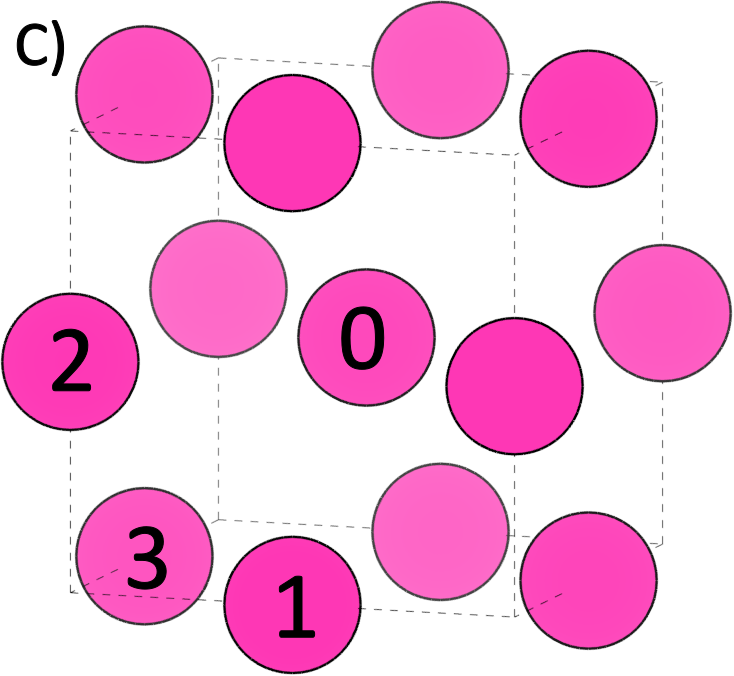
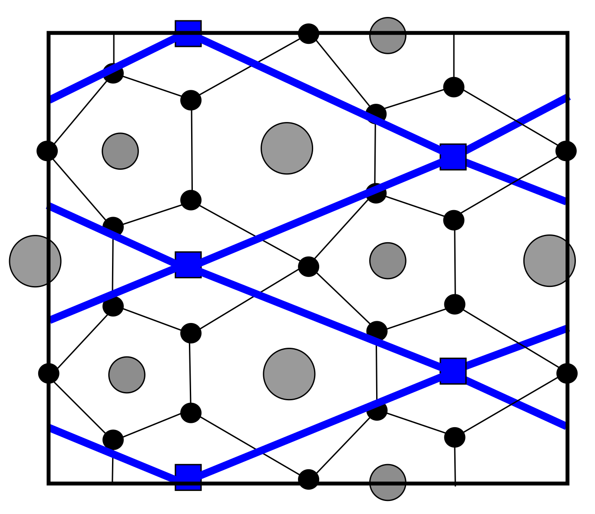
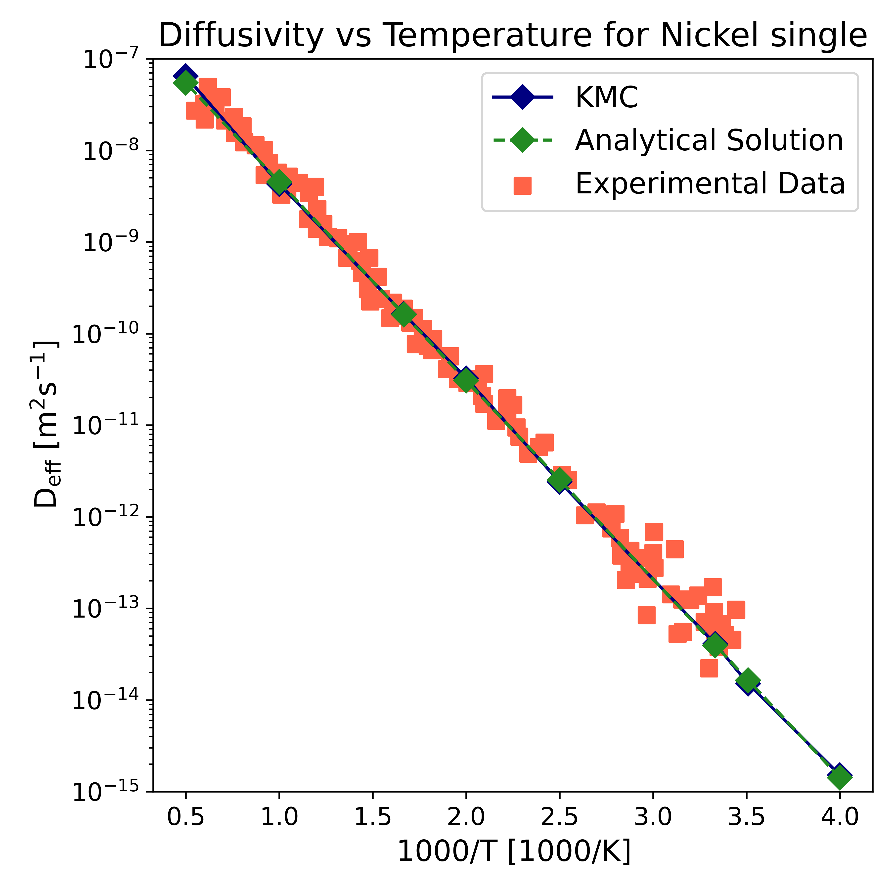
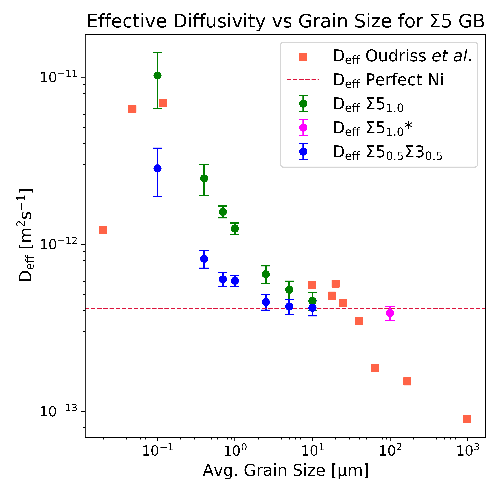
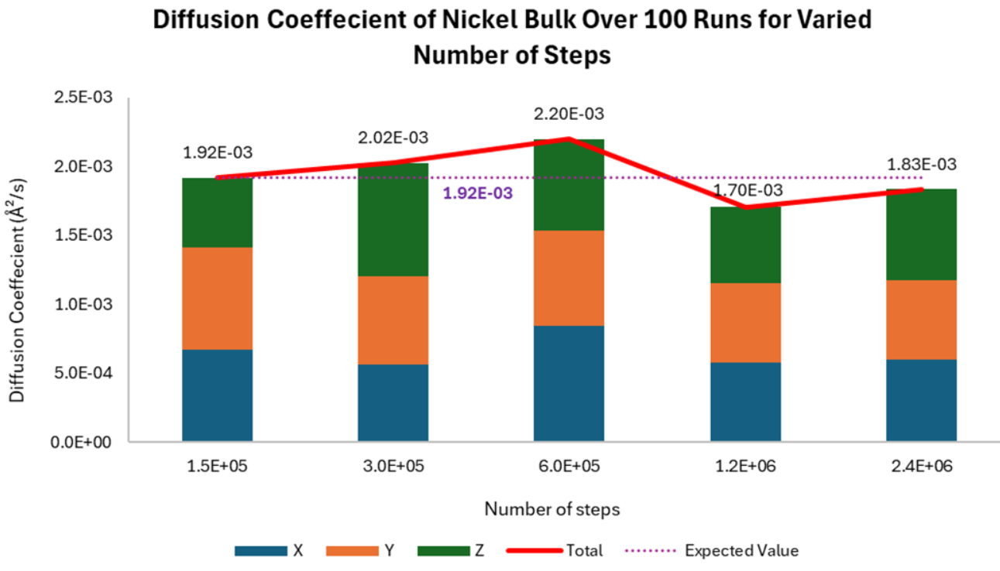

# 多結晶ニッケルにおける水素拡散の第一原理マルチスケール解析：動的モンテカルロ法が架ける原子スケールと連続体の橋

- **執筆日**: 2026-04-24
- **トピック**: 金属中の水素拡散と動的モンテカルロ法——第一原理計算・kMC・有限要素法による多スケール輸送モデリング
- **タグ**: Computation and Theory / Defects and Impurities; Bulk Alloys / First-Principles Calculations; Monte Carlo; Finite Element Method
- **注目論文**: Jain et al., "First-principles study of hydrogen diffusion in polycrystalline Nickel," arXiv:2601.05917 (2026)
- **参照論文数**: 6

---

## 1. なぜ今この話題なのか

水素は21世紀のエネルギー担体として世界中から大きな期待を集めている。燃料電池自動車、水電解による水素製造、水素貯蔵タンク、核融合炉の第一壁材料——いずれの応用においても、構造材料の中を水素がどのように移動するかという問いは、安全性と寿命を左右する根本的な課題である。金属中に侵入した水素は延性を大幅に低下させる「**水素脆化**（hydrogen embrittlement）」を引き起こし、設計応力をはるかに下回る低い荷重でも破断を招く。この現象はニッケル基超合金、高強度鋼、チタン合金など工業的に重要な材料のほぼ全てで観察されており、実用化の大きな障壁となっている。

水素脆化のメカニズムを理解するためには、水素原子が材料内部を移動する過程——拡散——を精密に把握しなければならない。水素の拡散は「速い経路（fast path）」と「トラップ（trapping）」という二つの相反する効果の競合によって決まる。粒界（grain boundary）や転位などの格子欠陥は、水素を通常の格子点より強く引き付ける低エネルギーサイトとなり、水素をそこに留める「罠」として機能する。一方で、これらの欠陥は格子よりも開いた構造を持ち、水素が高速に移動できる「高速経路」にもなり得る。この二重性のため、多結晶材料中の実効的な水素拡散係数は、単結晶のそれとは大きくかけ離れ、かつ粒径・粒界構造・温度に複雑に依存する。

実験的には拡散係数のバルク値や粒径依存性は計測できても、その背後にある原子スケールのメカニズムを直接観察することは困難である。一方、第一原理計算（DFT）は個々の移動エネルギー障壁を精密に与えるが、それだけではマクロな拡散係数には直結しない。両者を結ぶ「**多スケールモデリング**」の必要性は長く認識されてきたが、粒界の多様性・格子の異方性・広大な時間スケールをすべてカバーする一貫したフレームワークは、最近まで実現が難しかった。

2026年1月に投稿されたJain et al.の論文はこの状況を大きく変える可能性を持っている。DFT+NEB（nudged elastic band法）による移動障壁 → **動的モンテカルロ法（kinetic Monte Carlo, kMC）** による異方的実効拡散係数の計算 → 有限要素法（FEM）による多結晶連続体スケールの輸送計算、という三層の多スケール計算を初めて経験則に頼らず一貫して繋いだ論文である。それが実験の粒径依存性を定量的に再現したことは、この枠組みの実用的な信頼性を示す重要な証拠となっている。

---

## 2. 未解決問題は何か

この分野では、概ね三つの核心的な問いが未解決のまま残っている。

**問い1：粒界は水素を加速させるか、それとも遅らせるか？**

粒界が「高速経路」として機能するか「トラップ」として機能するかは、粒界の種類（Σ3、Σ5など結晶学的な対応粒界か、あるいはランダム粒界か）と温度・水素濃度に強く依存する。実験的には粒径が小さくなると（＝粒界面積が増えると）実効拡散係数が増大する場合と減少する場合の両方が報告されており、文脈依存的である。Khosravi et al.（2406.13100）がbcc鉄のΣ37およびΣ3粒界についてオフラティスkMCで調べたところ、水素は粒界が「エネルギー的に有利なサイト」であるにもかかわらずバルクより遅く拡散することが示された——すなわち同じ欠陥がトラップとして機能する方が支配的であった。しかしFCC Niでの結論が同じとは限らず、材料系・粒界構造によって答えが変わりうる点が、この問いを難しくしている。

**問い2：kMCの格子固定（on-lattice）近似はどこまで有効か？**

kMCの最も簡便な実装では、水素原子が動ける格子点とその間のホッピング経路をあらかじめ決めておき（on-lattice kMC）、各ホップの速度定数をDFTから得た障壁で決める。これは結晶格子が周期的であるバルク領域では非常に精度が高いが、格子の対称性が崩れた粒界周辺では問題が生じる。粒界近傍では原子が局所的に変位しており、固定格子の仮定では捉えられない多様なホッピング経路や障壁変動が存在する。これに対して「オフラティスkMC」あるいは「動的活性化緩和法（k-ART）」と呼ばれる手法は、格子点を固定せずに原子間ポテンシャルに基づいてサドル点を逐次探索する（Khosravi et al. 2306.11176, 2406.13100）。どちらのアプローチが実用的な精度と計算コストのトレードオフで優れるか、そして粒界構造のどのような特徴がオフラティス効果を重要にするかは、まだ確立した答えがない。

**問い3：高エントロピー合金や多元系金属への拡張は可能か？**

純金属や希薄合金では、バルクの移動障壁は一種類（あるいは少数）しかない。しかし**高エントロピー合金（HEA）** のような多元系では、局所的な化学環境が位置ごとに異なり、移動障壁が広い分布を持つ。これは単純なkMCでは扱いにくく、新たな理論的枠組みが必要である。Byun et al.（2304.04255）のFCC NiCoCrおよびNiCoCrFeMn HEAにおけるkMC研究では、バルクのNiでは正常拡散が見られるのに対し、HEAでは障壁分布の広がりにより**サブ拡散（subdiffusion）** が生じることが示されており、HEA中の輸送は根本的に異なる物理が支配することが示唆された。この知見はHEAを水素環境で使う際の設計に重要な示唆を与えるが、定量的な予測のためにはさらなる理論的・計算的発展が必要である。

---

## 3. 注目論文の核心

### 提示された問い

Jain, Olleak, He, Chaurasia, Di Stefano（arXiv:2601.05917, 2026年1月）が解こうとした問いは明快である。「多結晶ニッケルの実効的な水素拡散係数を、経験的なフィッティングパラメータを用いずに第一原理から予測できるか、そして粒径や粒界種類への依存性を定量的に再現できるか」というものである。

### 方法：三層の多スケール計算

*図1：Ni中における水素の拡散経路（Jain et al. 2026, arXiv:2601.05917, CC BY 4.0）。FCC Ni格子中の水素は主に4面体サイト（T-site）に占位し、隣接T-site間をホップする。*

**第一層：DFT+NEBによる移動障壁の計算**

水素がある格子サイトから隣接サイトへ移動するためには、エネルギー障壁（移動障壁、$E_m$）を乗り越える必要がある。著者らはVASPコードを用いてDFT計算を行い、FCC Ni中のバルク領域と、二種類の対応粒界（Σ3粒界：{111}ツイン、Σ5粒界：{210}傾斜粒界）近傍の水素ホッピング障壁をNEB法で計算した。バルクでの主要な移動経路はT-T（4面体サイト間）ホップであり、障壁は約0.4 eVである。粒界近傍ではこの障壁が場所によって大きく変化し、0.1 eV以下の「低障壁経路」から0.7 eVを超える「トラップサイト」まで幅広い分布を示す。

**第二層：kMCによる異方的実効拡散係数の計算**

*図2：粒界を組み込んだkMCシミュレーションセルの模式図（Jain et al. 2026, arXiv:2601.05917, CC BY 4.0）。カラースケールは各サイトの局所エネルギー（solute energy）を示し、粒界（GB）近傍では大きな変動が生じている。*

DFTで得た全移動障壁を入力として、著者らはon-latticeのkMCシミュレーションを実行した。水素原子一個を格子モデルに配置し、各ステップで可能な全ジャンプの速度定数を計算してランダムに次のジャンプを選択する。この手順を数百万ステップ繰り返すことで水素の軌跡が得られ、平均二乗変位から拡散係数テンソルを計算する。粒界に平行な方向と垂直な方向で拡散係数が異なる（異方性）ことを明示的に評価した点が重要で、特にΣ5粒界ではGB面内の拡散係数がバルクより大きい（fast path効果）一方で、GB面垂直方向では小さい（trapping効果）という複雑な異方性が見出された。

*図3：単結晶NiにおけるkMC計算の水素拡散係数（Jain et al. 2026, arXiv:2601.05917, CC BY 4.0）。実線がkMC計算値、記号が実験値（文献値）。*

**第三層：FEMによる多結晶連続体輸送計算**

kMCで得た異方的拡散係数テンソルを各グレイン（結晶粒）および粒界層の材料定数として有限要素法（FEM）モデルに組み込み、多結晶集合体中の水素輸送を計算した。各グレインの結晶方位はランダムに割り当て、FEMにより時間発展する水素濃度場を解く。この計算から実効的なバルク拡散係数を導出し、粒径をパラメータとして変えることで、実験で観察される粒径依存性を再現した。

### 主要な結果と新規性

実験では多結晶Niの有効拡散係数は粒径が大きくなると増大し、単結晶値に近づく傾向がある（粒界の多いほど全体の拡散が遅くなる）。著者らのモデルはこの傾向を経験パラメータなしに再現した（図4）。また、Σ3粒界（コヒーレント双晶）とΣ5粒界では粒界の影響の大きさが異なることも定量的に示された。

*図4：FEMによる多結晶Ni中の水素実効拡散係数（Jain et al. 2026, arXiv:2601.05917, CC BY 4.0）。実験値（記号）とkMC-FEMフレームワークの計算値（線）の比較で良好な定量的一致が見られる。*

この研究の新規性は以下の三点にまとめられる。(1) 経験ポテンシャルや経験的パラメータを一切使わずにDFTから連続体スケールまで繋いだこと、(2) 粒界の結晶学的性格（Σ値）ごとの異方的拡散係数を明示的に考慮したこと、(3) 実験の粒径依存性を定量的に再現し、フレームワークの予測力を実証したこと、である。

---

## 4. 背景と研究史

### kMCとDFTの組み合わせの歴史

kMCはもともと1960年代に統計力学の理論的ツールとして開発されたが、計算機の発展と第一原理計算の精度向上により、2000年代以降に材料科学に広く普及した。DFT+kMCの組み合わせは、格子欠陥の拡散、表面反応、触媒、放射線損傷など多くの分野で標準的なアプローチとなっている。

水素拡散への応用では、Du, Rogal, Drautz（1206.2314）が2012年にbcc鉄中のkMCシミュレーションを行い、粒界近傍で水素の拡散係数が非線形な濃度依存性を持つことを示した早期の重要な仕事として位置づけられる。この研究は理想化した粒界微構造を用いた格子kMCであり、第一原理の入力パラメータを使いながらも、粒界の多様性・FEMへの接続は扱っていなかった。Jain et al.の仕事はまさにこの先へ踏み出したものである。

一方、bcc鉄中での水素と空孔の相互作用については、Khosravi, Song, Mousseau（arXiv:2306.11176, CC BY-NC-ND 4.0）の研究が重要な背景を与える。彼らはオフラティスkMC法であるk-ART（kinetic Activation-Relaxation Technique）を用いて、bcc Fe中の空孔-水素複合体（VH$_x$および V$_2$H$_x$）の拡散障壁と機構を探索した。k-ARTは格子点を固定せず、原子間ポテンシャルに基づいてその場でサドル点を探索する手法で、粒界や欠陥近傍の複雑なポテンシャルエネルギー面を格子kMCよりも忠実に再現できる。この研究は、空孔に捕捉された水素の数が増えるほど複合体の拡散障壁が増大し、トラッピング効果が顕著になることを示した。これはJain et al.のトラッピング・高速経路の競合という主題の重要な背景をなしている。

### 粒界における水素の振る舞い：bcc Feとの比較

同じKhosravi et al.グループは、その後bcc Fe中のΣ37およびΣ3粒界での水素拡散をk-ARTで解析し（arXiv:2406.13100, CC BY-NC-ND 4.0）、粒界は水素にとってエネルギー的に有利（低エネルギーサイト）でありながら、水素はバルクよりも粒界を遅く拡散するという一見逆説的な結果を得た。これは、粒界の低エネルギーサイトが深い「井戸」として機能し、水素が一度落ちると抜け出しにくいトラップとして働くためである。さらに、粒界に水素が飽和すると、Fe原子の拡散障壁を上昇させることで粒界を安定化させる効果もあった。

bcc Feのこの知見とJain et al.のFCC Niの結果を比較することは示唆的である。FCC Ni（Σ5粒界）では粒界が高速経路として機能する側面があるのに対し、bcc Fe（Σ37、Σ3粒界）ではトラッピング効果が支配的であった。この差は、FCC構造とBCC構造の粒界原子配置の違い、あるいは用いた計算手法（格子kMC vs オフラティスk-ART）の差に起因する可能性があり、今後の系統的な比較研究が必要である。

### HEAへの展開：障壁分布とサブ拡散

*図5：FEMによる多結晶Niの水素濃度場の時間発展（Jain et al. 2026, arXiv:2601.05917, CC BY 4.0）。異方的拡散係数を持つ各グレインと粒界が組み合わさって全体の輸送が決まる。*

近年、高エントロピー合金が耐熱性・耐食性・放射線損傷耐性の観点から注目されているが、その水素脆化感受性も重要な問題となっている。Byun et al.（arXiv:2304.04255, CC BY 4.0）はFCC NiCoCrおよびNiCoCrFeMnにおける空孔ダイナミクスをkMCで解析し、多元素系では化学的無秩序に起因する移動障壁の広い分布が正常拡散からサブ拡散への転移を引き起こすことを示した。これは純Niでは観察されない現象であり、「拡散係数」という通常の概念が成立しない状況を示唆する。同じことがHEA中の水素拡散でも起こりうると考えられ、Jain et al.の枠組みをHEAに拡張する際に乗り越えるべき重要な壁となっている。

### 機械学習と点欠陥シミュレーション

Federici et al.（arXiv:2604.21069, CC BY 4.0）によるレビューは、点欠陥シミュレーションにおけるデータ駆動・機械学習手法の最前線を整理している。DFT計算が正確な障壁を与えるがコストが高いという制約に対し、機械学習原子間ポテンシャル（MLIP）や積極的学習（active learning）が有力な代替手段として台頭している。特に、MLIPを用いればDFT品質の精度を保ちながら格子kMCや分子動力学の計算コストを数桁削減できる可能性があり、今後はJain et al.の枠組みにMLIPを組み込むことで、より複雑な粒界・多元系・高圧環境への適用が加速すると考えられる。

---

## 5. どの解釈が最も妥当か

### 「fast path vs trapping」の競合：証拠の整理

Jain et al.の最も重要な知見の一つは、Σ5粒界が方向依存的な効果を持つという点である。粒界面に平行な方向では水素は加速され（fast path効果）、垂直方向では遅くなる（trapping効果）。このような「異方的な粒界効果」は概念的には以前から予測されていたが、DFT+kMCで定量的に示した点は新しい。

この解釈を支えるのは、DFTが与える粒界近傍のエネルギー地形の空間分布である。粒界面に沿って低エネルギーの「溝」が走り、その方向への水素移動は障壁が低くなるが、垂直方向への移動では粒界を「登る」コストがかかる。この絵は物理的に直感的であり、格子kMCで捉えた異方的拡散係数はこの描像と整合する。

一方でこの解釈の限界も意識すべきである。Khosravi et al.（2406.13100）がbcc Feの異なる粒界型でオフラティスkMCを用いたところ、Σ37粒界では水素の長距離拡散はバルクより速い場合があったが、Σ3粒界では遅かった。つまり「fast path vs trapping」のどちらが支配的かは、粒界構造に強く依存する。FCC NiのΣ5粒界でfast path効果が観察されたことは、bcc FeのΣ3で観察されたトラッピング支配とは異なる結論であり、材料・構造依存性を一般化するには系統的な調査が必要である。

### 格子kMCの精度：オフラティスとの差は何か

Jain et al.が用いたon-lattice kMCには、粒界近傍での格子の変位を明示的に扱わないという制約がある。DFTの障壁計算ではそれぞれのNEB計算で局所的な原子配置を弛緩させているが、kMCステップでは「どのサイトからどのサイトへ」というホッピングトポロジーは固定されている。

これに対して、Khosravi et al.が用いたk-ARTは原子配置を完全に自由にして次の事象を探索するため、格子の変形や予期しないホッピング経路を発見できる。2306.11176では空孔-水素複合体のkMCで、固定格子では想定されなかった「Fe原子が押し出されてH原子が入る」機構が見出されている。このような協同的な移動機構は格子kMCでは捉えられない。

ただし、バルクFCC Niのような高対称系では、NEB+格子kMCでも十分な精度が期待できる。粒界のΣ値が小さく（対応がよく）構造が比較的規則的な場合にも格子kMCは有効であろう。問題は、ランダム粒界や多元系の複雑な化学環境では格子kMCの近似が崩れる可能性が高い点である。Jain et al.の研究がΣ3・Σ5という特定の対応粒界に限定されている理由の一つはここにある。

### FEMとの結合の妥当性

kMCから得られた拡散係数テンソルをFEMの材料定数として用いる際、暗黙のうちに「各グレイン内の拡散係数はそのグレインの結晶方位のみで決まり、kMCで計算した値をそのまま使える」と仮定している。この仮定は、グレインが大きく粒界体積分率が小さいか、または粒界幅が一定という条件で妥当である。実際の多結晶では粒界幅は粒界種類によって異なり、また三重点（三つの粒界が交わる点）や四重点の効果も存在する。

Jain et al.はシンプルな粒界層モデルを用いており、三重点の詳細な効果は考慮していない。しかしFEMの計算結果が実験の粒径依存性を定量的に再現したことは、このシンプルな仮定が少なくともNiの実験条件の範囲では良好な近似であることを示している。より薄い粒界・異常な粒界分布を持つ系では修正が必要になる可能性がある。

### 比較的強く支持される結論

以上の議論を総合すると、以下の点は比較的強く支持されると考えられる。

第一に、DFT+kMC+FEMの多スケール枠組みはFCC純金属（Ni）において実験の有効拡散係数と粒径依存性を経験パラメータなしに再現できる。第二に、対応粒界（Σ3、Σ5）では粒界近傍のエネルギー地形の異方性が実効拡散係数の異方性として現れ、粒界面に平行な方向にfast pathが生じうる。第三に、有効拡散係数の粒径依存性は粒界体積分率のモデルとFEM計算で定量的に説明できる。

逆にまだ弱い結論として、この結果がbcc金属・高エントロピー合金・ランダム粒界に一般化できるかどうかは未確認であり、特にHEAでサブ拡散が生じる場合は「拡散係数テンソル」という表現そのものが成立しないかもしれない。また、量子トンネリングや水素の集団的効果（水素濃度が高い場合の水素間相互作用）は本研究では考慮されておらず、これらが重要になる条件（低温、高水素フラックス）では予測精度が低下する可能性がある。

---

## 6. 何が一般化できるのか

### 他の金属材料系への展開

Jain et al.が明示しているように、このフレームワークは「他の材料と欠陥タイプに拡張できる」。FCC構造の金属（Al、Cu、Au、Niベース超合金）では同様のDFT+kMC+FEM計算が原理的に適用できる。実際、Cher et al.（arXiv:2410.06133, CC BY 4.0）はCuのTaN/Ru-TaNバリア上での原子マイグレーションをkMCで解析しており、半導体インターコネクトにおける金属拡散——水素でなく金属原子の移動——にも同様の枠組みが有効であることを示している。これはスケールが異なっても（原子のスケールから薄膜のモルフォロジー形成まで）kMCの適用範囲の広さを示す例である。

bcc鉄（Fe）は高強度鋼の主材料であり、水素脆化が最も実用上重要な系の一つである。Jain et al.のFCC Niでの成功を受けて、bcc Feへの適用は自然な次のステップである。ただし、bcc構造では水素の主占有サイトがT-siteではなくO-site（8面体間隙）である可能性や、転位コアへのトラッピングが重要であるなど、FCC Niとは異なる特徴があり、単純な移植は慎重に行う必要がある。

*図6：粒径100 μmの多結晶NiにおけるFEMシミュレーション（Jain et al. 2026, arXiv:2601.05917, CC BY 4.0）。粒径が大きくなるほど粒界の影響が減少し、有効拡散係数が単結晶値に近づく。*

### 機械学習ポテンシャルとの融合

Federici et al.（arXiv:2604.21069）が示すように、機械学習原子間ポテンシャル（MLIP）はDFT品質の精度を大幅に低コストで達成できる。特にMLIPが注目されるのは、DFTでは計算不可能なほど大きいセルや多数の障壁計算が可能になるためである。例えば、ランダム粒界での水素拡散を扱うためには数千本のNEB計算が必要になる場合があるが、これはMLIPなら現実的なコストで実行できる。また、グラフニューラルネットワーク（GNN）ベースのMLIPは、元素の多様な組み合わせを統一的に扱えるため、HEA系への展開にも適している。

Jain et al.のフレームワークにMLIPを組み込む道筋としては、(1) MLIPでNEB計算を行って粒界近傍の障壁マップを大規模に作成し、(2) それをon-lattice kMCまたはオフラティスkMCに入力し、(3) FEMで連続体スケールの拡散を計算する、というパイプラインが考えられる。このアプローチが実現すれば、多結晶微構造の水素脆化予測は材料設計の実用ツールとなりうる。

### 他の輸送現象・デバイスへの接続

同じ多スケール枠組みは水素に限らず、金属中のリチウム（電池正極材料）、炭素（鉄鋼）、ヘリウム（核融合炉材料）の拡散にも適用できる。さらに、拡散係数を連続体で計算するFEMは、応力場との連成（水素誘起応力腐食割れのモデリング）や、酸化・析出との組み合わせに拡張できる。デバイス応用では、燃料電池の電解質膜や水素センサの材料設計において、拡散係数の微細組織依存性を予測することが重要であり、本フレームワークの方法論は直接的に貢献できる。

---

## 7. 基礎から理解する

### 熱活性化ホッピングとアレニウス則

金属中の原子拡散の最も基礎的な理解から始めよう。格子中の水素原子は熱揺らぎによってエネルギーを得ると、隣の格子点へ「ホップ」できる。このホッピングは**エネルギー障壁**（活性化エネルギー）$E_m$ を乗り越える必要がある熱活性化過程である。

ホッピングの頻度（速度定数）$k$ は**アレニウス則**に従う：

$$k = \nu_0 \exp\left(-\frac{E_m}{k_B T}\right)$$

ここで $\nu_0$ は格子振動の試行頻度（フォノン周波数、典型的に $10^{12}$–$10^{13}$ Hz）、$k_B$ はボルツマン定数、$T$ は絶対温度である。この式は「温度が高いほど障壁を飛び越えやすい」という直感を数式化したものである。拡散係数 $D$ も同様に：

$$D = D_0 \exp\left(-\frac{E_a}{k_B T}\right)$$

という温度依存性を持ち（$E_a$：見かけの活性化エネルギー、$D_0$：前指数因子）、アレニウスプロットと呼ばれる $\ln D$ vs $1/T$ のグラフでは直線関係が得られる。

この枠組みで重要なのは、多結晶材料では複数の環境（バルク・粒界など）があり、それぞれ異なる $E_m$ を持つため、見かけの $E_a$ は単純ではない重み付き平均になるという点である。これがJain et al.の計算でFEM計算が必要になる理由である。

### NEB法：遷移状態の探索

DFTで移動障壁 $E_m$ を求める際に用いられるのが**Nudged Elastic Band（NEB）法**である。初期状態（水素が出発サイトにある状態）と最終状態（水素が目的サイトにある状態）の間のエネルギー変化の経路——「反応経路」——を求める手法である。

NEB法では、初期・最終状態の間を補間した複数のイメージ（「ビーズ」）を仮想的なバネで繋いだ「弾性バンド」を作り、DFT力とバネ力のバランスによって全イメージの位置を最適化する。最高エネルギーのイメージがサドル点（遷移状態）に対応し、初期状態とのエネルギー差が移動障壁 $E_m$ である。

粒界近傍の NEB 計算が難しいのは、(1) 粒界には多数の異なるホッピング経路が存在し、(2) 局所的な原子配置が格子とは大きく異なるため初期構造の作成が難しく、(3) 対称性が低いためDFT計算コストが高い、という理由による。Jain et al.はこれらを系統的に実施することで、粒界を含む完全な障壁データベースを構築した。

### 動的モンテカルロ法（kMC）の仕組み

**動的モンテカルロ法（kinetic Monte Carlo, kMC）** は、複数の熱活性化事象が競合するシステムの長時間ダイナミクスを確率論的にシミュレートする手法である。

基本アルゴリズムは以下の通りである。(1) 現在の状態から起こりうる全事象（水素の可能な全ホップ）を列挙し、各事象の速度定数 $k_i$ を計算する。(2) 全速度定数の和 $K = \sum_i k_i$ を計算する。(3) 一様乱数 $r_1 \in (0,1)$ を使って次の事象を確率 $k_i/K$ で選択する。(4) 別の乱数 $r_2$ を使って次の事象が起こるまでの待ち時間を $\Delta t = -\ln(r_2)/K$ として計算し、時計を進める。(5) 選択した事象（ホップ）を実行して状態を更新し、(1)に戻る。

この手順の重要な点は、各ステップが「最も速く起こる事象が先に起きる」確率に従うため、システムの時間発展が物理的に正しく再現される点である。また、全事象の中に障壁の低い「速い事象」があっても、アルゴリズムが自動的にそれを頻繁に選ぶことで長時間スケールの現象を効率的にシミュレートできる。通常の分子動力学法（MD）が$10^{-13}$ 秒程度の時間スケールに限られるのに対し、kMCは$10^{-6}$ 秒以上の拡散現象を直接シミュレートできる。

このトピックとの関係でいえば、水素が格子を拡散するという「遅い」現象（室温で $D \sim 10^{-14}$ m²/s の場合、1 μm 移動するのに数百秒かかる）を、原子スケールの精度を保ちながら計算できるのがkMCの強みである。

### Oriani のトラッピング理論と kMC の関係

経験的なアプローチとして長く用いられてきたのが**Orianiのトラッピング理論**である。この理論では、水素を「正常な格子拡散種」と「トラップサイトに束縛された種」に分け、両者の間に局所熱平衡が成立すると仮定する。有効拡散係数は：

$$D_{\rm eff} = \frac{D_L}{1 + K_T C_T / C_L}$$

と表される。ここで $D_L$ は格子中の水素拡散係数、$K_T$ はトラップへの結合定数（トラップ深さ $E_b$ に依存）、$C_T$ はトラップ密度、$C_L$ は格子中の水素濃度である。この式は直感的で扱いやすいが、トラップが「移動するか静止しているか」「複数のトラップが競合するか」「トラップ近傍での局所的な障壁変動」などを捉えられない。Jain et al.のkMCはこれらを全て自然に含んでいる点で、Orianiモデルの根本的な拡張といえる。

---

## 8. 専門用語の解説

**水素脆化（Hydrogen Embrittlement, HE）**  
金属中に溶解した水素が材料の延性・靭性を著しく低下させる現象。脆化のメカニズムとしては、水素増強局所塑性（HELP）、水素誘起脱凝集（HEDE）、水素増強空孔形成（HEAV）などが提唱されているが、どれが主導的かはまだ議論中である。金属中の水素の移動速度と蓄積場所を理解することが、脆化機構の解明に不可欠である。

**動的モンテカルロ法（Kinetic Monte Carlo, kMC）**  
熱活性化過程の長時間ダイナミクスをシミュレートする確率論的手法。各事象（ホップ）の速度定数（アレニウス型）をもとに、次に起こる事象と待ち時間を乱数で決定する。分子動力学では到達できない長時間スケール（ミリ秒以上）の現象を原子レベルの精度で追える。格子点を固定する「格子kMC（on-lattice kMC）」と、原子位置を自由にする「オフラティスkMC」がある。

**Nudged Elastic Band法（NEB法）**  
DFTで遷移状態（サドル点）とエネルギー障壁を求める手法。初期・最終状態の間を補間した複数のイメージを仮想バネで連結し、DFT力とバネ力のバランスで全イメージを最適化する。最高エネルギーのイメージが遷移状態に対応する。CI-NEB（Climbing Image NEB）では最高エネルギーのイメージを精密にサドル点へ収束させる改良版が広く使われる。

**移動障壁（Migration Barrier）**  
原子が一つのサイトから隣のサイトへ移動する際に越えるべきエネルギー壁。単位はeVで表されることが多い。バルクFCC Niでの水素T-Tホップの障壁は約0.4 eVである。障壁が小さいほど原子は速く拡散し、高温ほど障壁を越えやすい（アレニウス則）。

**粒界（Grain Boundary, GB）**  
多結晶材料中で結晶方位の異なる二つの結晶粒が接する界面。結晶方位の差（傾角）や回転軸によって分類され、「対応粒界（coincidence site lattice boundary, CSL）」はΣ値（共有格子点の割合の逆数）で特徴付けられる。Σ3はコヒーレント双晶（最も規則的な対応粒界）、Σ5はやや複雑な対応粒界である。ランダム粒界はΣ値が大きく、水素拡散に対する影響が複雑になる。

**実効拡散係数（Effective Diffusivity）**  
多結晶材料全体としての見かけの拡散係数。バルク拡散係数と粒界拡散係数の加重平均であり、粒径・粒界面積分率・粒界種類に依存する。マクロな実験で測定されるのはこの実効値であり、それをバルク成分と粒界成分に分離することが多スケールモデリングの目的の一つである。

**有限要素法（Finite Element Method, FEM）**  
連続体の偏微分方程式（この場合：拡散方程式 $\partial C/\partial t = \nabla \cdot (D \nabla C)$）を離散化して数値的に解く手法。複雑な形状の多結晶微構造を三角形・四面体などの要素に分割し、各要素での材料定数（拡散係数テンソル）を設定して時間発展を計算できる。グレインと粒界を別々の材料定数で表現できるため、kMCで得た異方的拡散係数テンソルを自然に組み込める。

**サブ拡散（Subdiffusion）**  
通常の拡散（正常拡散）では平均二乗変位（MSD）が時間に比例して増大する：$\langle r^2 \rangle \propto t$。これに対し、サブ拡散では $\langle r^2 \rangle \propto t^\alpha$（$0 < \alpha < 1$）となり、時間とともに拡散が「遅くなっていく」。高エントロピー合金のような障壁の広い分布を持つ系では、エネルギー的に深いトラップに何度も捕まるため、サブ拡散が発現する。この場合、単一の「拡散係数」では系を特徴付けられない。

**k-ART（Kinetic Activation-Relaxation Technique）**  
Mousseau らが開発したオフラティスkMCの一種。格子点を固定せず、原子間ポテンシャルに基づいてART（Activation-Relaxation Technique）という手法で逐次的に遷移状態を探索する。粒界・欠陥近傍の複雑なポテンシャルエネルギー面を格子kMCより忠実に再現できるが、計算コストは格子kMCより高い。水素-空孔複合体や粒界における協同的な移動機構の発見に威力を発揮する。

**機械学習原子間ポテンシャル（MLIP）**  
ニューラルネットワークや他の機械学習モデルを用いて原子間ポテンシャルを記述する手法。DFTデータで訓練することでDFT品質に近い精度を持ちながら、計算コストはDFTの数桁低い。kMCやオフラティスkMCの計算コストを大幅に削減できるため、多結晶系・複雑組成系・大規模欠陥構造への適用を可能にする鍵技術として注目されている。

---

## 9. 今後の展望

Jain et al.の仕事は、水素拡散の多スケールモデリングの信頼性を大幅に高めた。DFT+kMC+FEMという三層構造が実験の粒径依存性を定量的に再現したことで、この枠組みは単なる理論的演習ではなく、工学的な予測ツールとして機能することが示された。最も確度が高い結論は、「FCC Niの対応粒界（Σ3・Σ5）においては、粒界の異方的な拡散係数と粒界体積分率から実効拡散係数を予測できる」という点である。また、格子kMCが粒界近傍でも対応粒界の範囲では十分な精度を与える可能性が高いことも支持されている。今後1〜2年で期待されるのは、この枠組みをbcc Feや鉄鋼合金に適用した検証研究である。bcc Feでは水素がO-siteに主に占位するという違いがあり、粒界との相互作用もFCC Niとは異なると予想される。こうした比較研究が進めば、「どの条件でfast pathが支配的でどの条件でtrappingが支配的か」という問いへの一般的な答えが見えてくるだろう。

まだ未確定な問題も多い。まず、ランダム粒界（Σ値が大きい）への拡張は格子kMCでは困難であり、MLIPを組み込んだオフラティスkMCかk-ARTが必要になると考えられる。次に、HEAでのサブ拡散は「通常の拡散係数テンソル」の概念が破綻する可能性を示唆しており、FEMへの組み込み方法自体を再考する必要があるかもしれない。また、高水素濃度での水素間相互作用（水素-水素斥力・引力）や、低温での量子トンネリングの効果も本研究では捨象されており、これらが重要になる条件（核融合炉環境や極低温応用）では別の取り扱いが必要である。今後1〜3年で最も注目すべき論点は、(1) MLIPを用いたランダム粒界・多元系への枠組みの拡張、(2) 転位・空孔との協同トラッピング効果の組み込み、(3) 応力場との連成（水素誘起応力腐食割れ）へのFEM拡張、そして(4) HEAでのサブ拡散を組み込んだ連続体理論の構築、である。

---

## 参考論文一覧

1. **[arXiv:2601.05917](https://arxiv.org/abs/2601.05917)** — Jain, Olleak, He, Chaurasia, Di Stefano (2026). "First-principles study of hydrogen diffusion in polycrystalline Nickel." 本記事の注目論文。DFT+kMC+FEMの三層多スケール枠組みで多結晶Ni中の水素拡散を予測し、実験の粒径依存性を定量的に再現した。

2. **[arXiv:2604.21069](https://arxiv.org/abs/2604.21069)** — Federici et al. (2026). 点欠陥シミュレーションにおけるデータ駆動・機械学習手法の最前線を整理したレビュー。MLIPとkMCの統合による次世代シミュレーションの展望を示す。

3. **[arXiv:2304.04255](https://arxiv.org/abs/2304.04255)** — Byun et al. (2023). FCC NiCoCr・NiCoCrFeMn高エントロピー合金中の空孔ダイナミクスをkMCで解析し、化学的無秩序による障壁分布の広がりがサブ拡散を引き起こすことを示した。

4. **[arXiv:2410.06133](https://arxiv.org/abs/2410.06133)** — Cher et al. (2024). 半導体ナノスケールインターコネクトのTaN/Ru-TaNバリア上のCuモルフォロジー形成をkMCで解析し、原子スケールのマイグレーション機構を明らかにした。

5. **[arXiv:2406.13100](https://arxiv.org/abs/2406.13100)** — Khosravi, Song, Mousseau (2024). k-ARTオフラティスkMCを用いてbcc Fe中のΣ37・Σ3粒界における水素拡散を解析し、水素は粒界にトラップされバルクより遅く拡散することを示した。

6. **[arXiv:2306.11176](https://arxiv.org/abs/2306.11176)** — Khosravi, Song, Mousseau (2023). k-ARTによってbcc Fe中の水素および空孔-水素複合体の拡散障壁と機構を探索し、H数の増加とともに複合体の拡散障壁が増大することを示した。

7. **[arXiv:1206.2314](https://arxiv.org/abs/1206.2314)** — Du, Rogal, Drautz (2012). bcc Fe中の水素拡散を第一原理kMCで解析し、粒界近傍での水素拡散係数の非線形な濃度依存性を示した初期の重要な研究。
