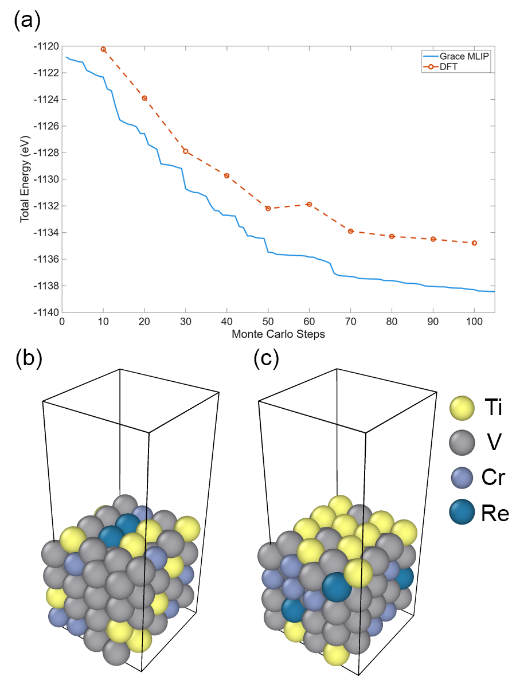
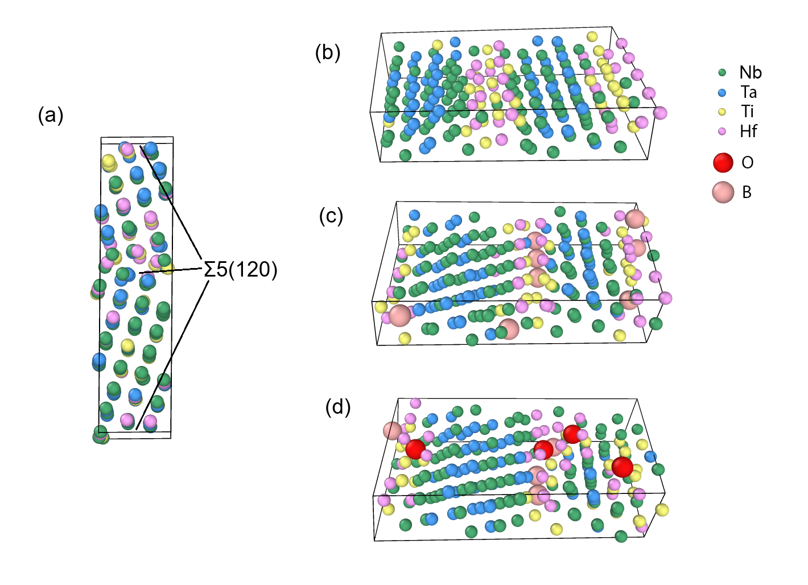

# 欠陥を含む高エントロピー合金の原子配置——機械学習ポテンシャルとモンテカルロ法による構造探索の最前線

- **執筆日**: 2026-04-29
- **トピック**: 高エントロピー合金（HEA）中の表面偏析・侵入型欠陥・粒界偏析の原子スケール構造を、機械学習ポテンシャル（MLIP）と並列モンテカルロサンプリングによって探索する手法の最前線
- **タグ**: Computation and Theory / Bulk Alloys; Defects and Impurities / Monte Carlo; Machine Learning
- **注目論文**: arXiv:2603.08855（Siya Zhu & Raymundo Arroyave, 2026）
- **参照論文数**: 6本（注目論文1 + 関連論文5）

---

## 1. なぜ今この話題なのか

高エントロピー合金（High-Entropy Alloy, **HEA**）とは、4種類以上の元素をほぼ等量含む多主成分合金の総称である。従来の合金設計が少数の「主元素」と「添加元素」という概念を前提としていたのに対し、HEAはすべての元素が主役として格子を構成するという全く異なるパラダイムにある。この設計思想から生まれた合金群は、室温から極低温・高温域にわたって優れた力学特性、耐放射線性、耐食性を示すことが実験的に確認されており、核融合炉の第一壁材料、航空宇宙構造材、次世代耐熱鋼の候補として急速に注目を集めている。

しかし、HEAの優れた特性は原子スケールの配置——どの格子点にどの元素が座り、侵入型サイト（格子間位置）に何がどのように潜り込んでいるか——に強く依存しており、その解明は容易ではない。HEAの格子サイトには5種以上の元素が無秩序に混在しているため、近接する原子のわずかな組み合わせの違いが、欠陥形成エネルギー・原子間相互作用・拡散障壁を大きく変化させる。これが HEA を設計する際の最大の困難点であり、同時に性能チューニングの鍵でもある。

特に近年、侵入型不純物（酸素・窒素・ホウ素・炭素など）を含む HEA の挙動が工学的に重要視されている。製造プロセス中に避けがたく導入される微量の酸素やホウ素が、高温での表面偏析・粒界脆化・析出強化のいずれをもたらすかは、元素の組み合わせや配置に依存する。従来の第一原理計算（DFT）はこれを原理的に記述できるが、$N$ 個の格子サイトと侵入型サイトの配置空間は指数関数的に膨大であり、DFT で全配置を網羅するのは現実的でない。一方、従来の経験的ポテンシャル（EAM など）では化学的多様性を十分に再現できない。

こうした状況を打破する鍵として台頭してきたのが、**機械学習原子間ポテンシャル（Machine-Learning Interatomic Potential, MLIP）** と **モンテカルロ（MC）法** の組み合わせである。MLIP は DFT に匹敵する精度を保ちながら MD・MC シミュレーションに適用できる計算速度を実現し、近年の HEA 研究を大きく変えつつある。2026 年 3 月に投稿された PAIPAI 論文（arXiv:2603.08855）は、この路線をさらに推し進め、欠陥・侵入型原子を含む HEA の基底状態配置を効率的に探索するための並列 MC フレームワークを提案した。本記事では、この論文を核に、HEA 欠陥の原子スケール構造探索という問題の現在地を立体的に整理する。

---

## 2. 未解決問題は何か

**問い 1: 天文学的な配置空間をどう効率的にサンプリングするか**

HEA の配置空間は想像を絶する広さを持つ。100 原子の格子に 5 元素が等量分配されるだけで、配置の組み合わせは $\binom{100}{20,20,20,20,20}$ を超える。そこに侵入型サイト（通常は置換サイトの 2–3 倍存在する）と欠陥（空孔、格子間原子）が加わると、系統的な探索は不可能に近い。分子動力学（MD）は有限温度で配置空間を探索できるが、系が深いポテンシャル障壁に捕捉されると長時間スケールの緩和を見逃す。ランダムサンプリングでは最安定配置を偶然見つける確率が極めて低い。

**問い 2: MLIP の精度・外挿信頼性をどう保証するか**

MLIP はトレーニングデータ（多くは DFT 計算の小さなスーパーセル）から汎化性を学習するが、多元素系の HEA では化学環境の多様性が膨大であり、未見の配置に対する予測精度が保証されない。MLIP によるランキングが DFT と整合しているか否かは、配置探索の結論の信頼性に直結する問題である。特に最近（arXiv:2604.24607）、MLIP の系統的な不確実性（モデル誤差・アレアトリック不確実性）の較正が実験的手法で評価されるようになり、MLIP の信頼性評価が独立した研究領域として成熟しつつある。

**問い 3: 平衡構造探索と長時間動力学をどう接続するか**

最安定な原子配置（基底状態構造）を求めることと、実際の温度・時間スケールでの欠陥移動・拡散・偏析速度を求めることは、本来別個の問題である。前者はエネルギーランドスケープの探索（本記事の中心テーマ）であり、後者は遷移速度論（アダプティブ動力学 MC、kMC）の領域である。HEA では化学的不均質性が拡散障壁の分布を広げ、「遅い拡散（kinetic sluggishness）」を生じさせることが kMC シミュレーションで示されている（arXiv:2304.04255）。この動力学的遅さが平衡構造へのアクセスをさらに困難にしており、構造探索と動力学シミュレーションのギャップを埋める手法が求められている。

---

## 3. 注目論文の核心

**arXiv:2603.08855**（Siya Zhu & Raymundo Arroyave, Texas A&M University, 2026）は、**PAIPAI**（Package for Alloy Interstitial Predictions using Artificial Intelligence）と名づけられた MC フレームワークを提案し、欠陥・侵入型原子を含む HEA の基底状態原子配置を効率的に探索することを実現した。

*図1: PAIPAIのデュアルワーカー並列MCアーキテクチャの流れ図（Zhu & Arroyave, arXiv:2603.08855, CC BY 4.0）。高速ワーカーが配置空間を粗くスクリーニングし、低速・高精度ワーカーが有望な候補を詳細に最適化する。両ワーカーは共有待機プールを介して連携する。*

### PAIPAIの主要アイデア：デュアルワーカー並列アーキテクチャ

PAIPAI の核心は、**高速ワーカー（fast worker）** と **低速・高精度ワーカー（slow worker）** を並列で走らせる「デュアルワーカー」設計にある。高速ワーカーは軽量な MLIP を使って大量の MC 試行を行い、配置空間を素早くスクリーニングする。有望な（エネルギーが低い）配置は共有の「待機プール（waiting pool）」に送られ、低速ワーカーがより高精度の MLIP（または DFT）で再評価・精密化する。この設計により、計算資源を無駄にせず、配置空間の広い探索と局所最適化の深い掘り下げを同時に実現している。

MC ステップとして採用しているのは元素スワップ（原子の種類を入れ替える）と変位操作（原子位置の微小変位）であり、侵入型サイトへの原子の挿入・除去操作も含む。受け入れ確率はメトロポリス基準（温度パラメーター $T$ を用いたボルツマン重みに基づく）に従い、室温付近の温度に相当するパラメーターで操作して準安定状態への収束を避ける工夫がなされている。

### 3つのケーススタディ

論文は PAIPAI を 3 つの異なる物理系に適用して実証している。

**ケーススタディ1: Ti–V–Cr–Re 表面スラブの表面偏析**

侵入型原子を含まない Ti–V–Cr–Re の BCC スラブに PAIPAI を適用し、表面偏析パターンを探索した。MC 最適化後の構造は、ランダム配置より大幅にエネルギーが低く、MLIP のエネルギーランキングは DFT 再計算と一貫して整合していた。

*図2: Ti–V–Cr–Re スラブのエネルギー分布比較。MC最適化後の配置（青）はランダムサンプリング（橙）と比較して顕著に低いエネルギーを示す（Zhu & Arroyave, arXiv:2603.08855, CC BY 4.0）。*

**ケーススタディ2: Nb–Ti–Ta–Hf バルク中の侵入型 O・B の集積**

BCC 構造の Nb–Ti–Ta–Hf 合金に酸素（O）とホウ素（B）を導入し、その集積（クラスタリング）挙動を探索した。特定の配位環境での O–B 集積が他の配置と比較して著しくエネルギーが低く、単純なランダムサンプリングでは到達できない基底状態が PAIPAI によって発見された。

*図3: Nb–Ti–Ta–Hf バルク中の侵入型 O・B の配置最適化。MC 最適化後の配置はランダムサンプリング配置群より一貫して低エネルギーにあり、特定の元素近傍への集積が熱力学的に安定であることを示す（Zhu & Arroyave, arXiv:2603.08855, CC BY 4.0）。*

**ケーススタディ3: Nb–Ti–Ta–Hf の粒界における金属元素・侵入型原子の複合偏析**

粒界構造は表面偏析より複雑で、金属元素の偏析と侵入型原子の挙動が連動する。PAIPAI はこの複合偏析問題にも適用でき、粒界近傍で特定の元素（Ti や Ta）が優先的に偏析し、侵入型 O がその周辺に安定化することを示した。

*図4: Nb–Ti–Ta–Hf 粒界における金属元素・侵入型原子の複合偏析構造の探索結果（Zhu & Arroyave, arXiv:2603.08855, CC BY 4.0）。*

### 論文の位置づけ：何が新しいか

この論文以前から、MLIP + hybrid MC/MD を HEA に適用した研究は存在していた。しかし PAIPAI の新規性は以下の点にある。第一に、**侵入型原子（O, B）を明示的に扱う MC フレームワーク**を構築したことで、従来の置換型元素の偏析研究では扱えなかった問題に対処できる。第二に、**デュアルワーカー並列アーキテクチャ**により、単一の MLIP で配置空間をサンプリングするよりも効率的に基底状態を探索できる。第三に、**3 種類の欠陥環境**（表面・バルク・粒界）への適用実証を一つのフレームワークで行い、汎用性を示した。ただし、温度効果（有限温度での自由エネルギー最小化）や動力学的なアクセシビリティ（実際の時間スケールでこの基底状態に達せるか）については、この論文の枠組みでは直接答えられない問題として残されている。

---

## 4. 背景と研究史

HEA における MC シミュレーションの歴史は、まず格子型（on-lattice）の元素スワップ MC から始まった。置換サイトのみを考え、固定した格子上で元素の座り方を最適化するアプローチは実装が簡便で、化学短距離規則（Chemical Short-Range Order, CSRO）や偏析傾向を調べる上で有効だった。

転機となったのは MLIP の台頭である。Gaussian Approximation Potential（GAP）や Moment Tensor Potential（MTP）、Neural Network Potential（NNP）などの MLIP が金属多元素系に適用されるようになったのは 2015 年以降で、特に 2020 年代に入ると HEA に特化したモデルが相次いで構築された。Byggmästar ら（arXiv:2412.13750、Acta Materialia 2025）は W–Ta–Cr–V 系の MLIP を開発し、hybrid MC/MD シミュレーションで WTaCrV の全種類の欠陥（点欠陥・転位・粒界・表面）への偏析を系統的に調べ、原子プローブ断層計測（APT）と比較して結果を検証した。これは MC シミュレーションの予測が直接実験で検証される代表的な事例であり、手法の信頼性確立に大きく貢献した。

Liu ら（arXiv:2507.12388）は MoNbTaVW の BCC HEA において、MLIP + hybrid MC/MD で CSRO を形成させた後に照射損傷シミュレーションを実施し、CSRO が格子間原子拡散を促進しつつ空孔移動を抑制することで欠陥再結合効率を高めることを示した。同時に、照射によって CSRO は急速に破壊されることも明らかにし、「照射環境下での CSRO の安定性が放射線耐性の実現に不可欠」という重要な結論を導いた。

HEA における拡散動力学の理解という点では、Karimi & Papanikolaou（arXiv:2304.04255）の kMC 研究が先駆的な役割を果たした。この研究は FCC 構造の NiCoCr および NiCoCrFeMn において空孔の長時間動力学を kMC でシミュレーションし、純 Ni では正常拡散（MSD $\propto t$）を示すのに対し、HEA では**サブ拡散（subdiffusion、MSD $\propto t^\alpha, \alpha < 1$）** が出現することを示した。この動力学的遅延（kinetic sluggishness）は、エネルギー障壁の広い分布と、べき乗則に従う長い待機時間分布から説明された。この結果は、HEA において MC シミュレーションによる平衡構造探索が困難である理由の一つを定量的に示している——すなわち、平衡状態にたどり着くための動力学的時間スケールが純金属よりも格段に長いということである。

時間スケールの壁をアダプティブ KMC（AKMC）で克服しようとした先駆的研究が Garza ら（arXiv:2110.13249）である。彼らは CuNi バイメタル合金の表面偏析を、MD・ParSplice・AKMC・KMC という 4 つの多時間スケール手法を組み合わせてシミュレーションし、空孔の表面拡散（ナノ秒）から偏析の完了（秒スケール）までを連続的に記述した。AKMC は鞍点を適応的に探索することで、ランダムサンプリングでは捕捉できない稀少遷移事象を拾い上げることができる。この研究が示したように、金属合金における表面偏析の動力学は、空孔の確率的トラッピング・デトラッピング現象と密接に絡んでおり、静的な基底状態構造の探索だけでは全体像が掴めない。

MLIP の信頼性という観点では、arXiv:2604.24607（PET-UAFD 論文）が注目される。この研究は MLIP の不確実性を実験データで較正する手法（PET-UAFD: Physics-informed Experimental Training with Uncertainty-Aware Force Decomposition）を提案し、普遍的 MLIP を実験的に再較正することで系統誤差を大幅に低減できることを示した。PAIPAI のような MLIP 駆動の配置探索において、MLIP の信頼性がどの程度保証されているかは論文内の DFT 検証で確認されているが、より厳密な不確実性定量化は今後の課題として残る。

---

## 5. どの解釈が最も妥当か

PAIPAI 論文の中心的な主張——「MLIP + 並列 MC により、DFT で確認される基底状態構造に効率的に到達できる」——はどの程度信頼できるか。また、どこに不確定さが残るか。

**支持される結論**

最も強く支持される結論は、「MC 最適化後の配置はランダムサンプリングより一貫して低エネルギーにある」という点である。これは 3 つのケーススタディすべてで確認されており、MLIP と DFT のランキングが整合していることも直接検証されている。Byggmästar ら（2412.13750）が W–Ta–Cr–V で実験（APT）と MC シミュレーションの偏析傾向が一致することを示したことも、同様のアプローチの信頼性を裏付けている。

**比較的強い結論**: 「PAIPAI の発見した低エネルギー配置は熱力学的な安定性を反映している」という主張は、DFT で上位配置の確認がとれている点から概ね妥当とみなせる。侵入型 O・B が特定の元素環境（ Nb または Hf の近傍）に安定化するという傾向は、これらの元素の酸素親和性に関する既知の化学的知識とも整合している。

**弱い結論・未確定な点**

第一に、**有限温度での自由エネルギー安定性**は直接評価されていない。PAIPAI が見つけた基底状態配置が、例えば 800 K での動作温度でもエントロピー効果により安定であるかどうかは別途計算が必要である。多数成分系では配置エントロピーが大きく、基底状態が高温で不安定化するケースもある。

第二に、**MLIP の外挿精度**。PAIPAI が探索する配置空間はトレーニングデータが密に被覆しているとは限らない。特に侵入型原子 + 複数元素の近傍環境という条件はトレーニングセットに含まれていない可能性があり、この点での予測信頼性は DFT 検証サンプル数（論文中では数十点程度）から推定できる程度に限られる。MLIP の不確実性定量化（Zhu & Arroyave 論文が明示的に扱っていない問題）は、arXiv:2604.24607 のような独立した研究の進展を待つ必要がある。

第三に、**動力学的アクセシビリティ**。Karimi & Papanikolaou（2304.04255）が示した HEA の kinetic sluggishness を考えると、PAIPAI が発見した基底状態配置に実際の合金製造・熱処理プロセスで到達できるかどうかは不明である。NiCoCr 系での空孔サブ拡散の実証は、平衡構造へのアクセス時間スケールが Ni 純金属に比べて著しく長いことを示唆しており、この問題は PAIPAI の手法論的な問いとしては残っていないが、実験への接続という観点では本質的な問いとして開かれている。

**解釈の分岐点**

異なる MLIP（GAP vs. MTP vs. NNP）を使った場合に PAIPAI が同じ基底状態に収束するかどうかは、アーキテクチャの堅牢性を評価する上で重要な検証である。また、同じ HEA 組成でも、スラブの表面終端や粒界の特殊角度（misorientation angle）が異なれば、基底状態が異なる可能性がある——PAIPAI は特定の構造に対する MC 探索であり、構造多形性の全体的なランドスケープは別途探索が必要である。

---

## 6. 何が一般化できるのか

PAIPAI のフレームワークは HEA に限定されない汎用性を持つ。元素スワップと格子間原子の挿入・削除を組み合わせた MC は、原理的に任意の多成分系に適用できる。

**他の材料系への展開**

耐熱超合金（Ni 基）、中エントロピー合金（MEA）、BCC 耐熱 HEA（W–Ta 系）は直接の拡張先として自然である。特に Byggmästar ら（2412.13750）が W–Ta–Cr–V 系で hybrid MC/MD を活用して実験と照合した実績は、PAIPAI が核融合材料設計に直結する応用を持つことを示唆している。MoNbTaVW での照射後 CSRO の変化（Liu ら 2507.12388）は、照射環境下でのリアルタイム配置変化というさらに動的な問題設定への拡張可能性を示している。

**材料設計原理への接続**

「どの元素が粒界に偏析するか」「侵入型原子はどこに安定化するか」という PAIPAI の予測が蓄積されると、元素組み合わせ → 偏析挙動の相関関係が浮かび上がり、逆設計（目的の偏析挙動を持つ HEA の組成を探索する問題）が視野に入る。これは CALPHAD（計算状態図）の原子論的精緻化という方向性とも連動する。

**手法としての限界と境界**

PAIPAI は格子型 MC をベースとしており、格子の変形（相変態、析出に伴う格子定数変化）を扱う off-lattice 効果は限定的である。Byggmästar らが WTaCrV で CrV 析出物が半コヒーレント界面を形成することを示したような、精密な界面構造の記述には MD との組み合わせが必要になる場面がある。また、AKMC が得意とする「遷移経路の同定」と「長時間動力学」は PAIPAI の射程外であり、Garza ら（2110.13249）が示したような nanosecond-to-second の動力学的記述には別途 KMC/AKMC アプローチが必要である。

---

## 7. 基礎から理解する

### 7.1 高エントロピー合金とは何か

金属合金の歴史は「主成分金属に少量添加元素を加えて性質を改善する」という設計思想で貫かれてきた。鋼鉄は鉄（Fe）に炭素（C）を添加したもの、アルミ合金は Al に Cu・Mg などを数パーセント加えたものである。この視点では、合金の格子は主成分原子から成り、添加元素は「異物」として格子を乱す役割を担う。

高エントロピー合金（HEA）は 2004 年頃に提案されたまったく異なる概念である。4 種以上の元素をほぼ等モル量（各元素 5–35 at%）混合すると、驚くことに多くの場合、金属間化合物を形成せずに FCC・BCC・HCP などのシンプルな結晶構造を保つ。これは配置エントロピー $\Delta S_\text{mix} = -R \sum_i x_i \ln x_i$（$R$ は気体定数、$x_i$ は元素 $i$ のモル分率）が大きく、自由エネルギー $G = H - TS$ の $-TS$ 項が相分離・析出の傾向（$H$ の増大）を上回るためと古典的に解釈される。等モル 5 元系の $\Delta S_\text{mix}$ は $R \ln 5 \approx 13.4\ \text{J/(mol·K)}$ に達し、これは典型的な合金の 2〜3 倍の値である。

ただし、「高エントロピーだから単相安定」という解釈は単純化しすぎており、実際には元素間の電気的親和性・格子歪み・電子数なども相安定性を左右する。近年では CALPHAD（計算状態図法）や第一原理計算によって、「どの組み合わせが本当に単相 HEA を形成するか」を事前予測する研究が活発である。

HEA の格子は多元素の混合によって常に局所的な化学的無秩序と格子歪みを有し、転位の移動障壁を増大させる（固溶強化）。また、多くの HEA 系で報告されている kinetic sluggishness——純金属・低合金系より遅い拡散——は、障壁エネルギーの分布が広いことによって生じる現象であると理解されている（詳しくは §7.3 で述べる）。

### 7.2 モンテカルロ法の基礎

モンテカルロ（MC）法は、確率的サンプリングによって統計力学的な物理量を計算する方法の総称である。固体中の原子配置問題への MC 適用でもっとも基本的な枠組みが **Metropolis–Hastings アルゴリズム** である。

配置空間の状態 $\boldsymbol{\sigma}$（格子点の元素割り当て）において、系のエネルギーを $E(\boldsymbol{\sigma})$ とする。現在の状態 $\boldsymbol{\sigma}$ から提案状態 $\boldsymbol{\sigma}'$（例: 2 原子のスワップ）へ遷移するかどうかを、受け入れ確率

$$P_\text{acc}(\boldsymbol{\sigma} \to \boldsymbol{\sigma}') = \min\!\left(1,\ \exp\!\left(-\frac{E(\boldsymbol{\sigma}') - E(\boldsymbol{\sigma})}{k_B T}\right)\right)$$

で決定する。ここで $k_B$ はボルツマン定数、$T$ は温度パラメーターである。エネルギーが下がる遷移（$\Delta E < 0$）は必ず受け入れ、エネルギーが上がる遷移も確率的に受け入れることで、局所最小に捕捉されることなく配置空間を探索する。十分な MC ステップ数を重ねると、系はカノニカル分布（ボルツマン分布）に従う平衡状態にサンプリングが収束する。

元素スワップ MC は on-lattice（格子型）MC の代表例で、2 種類の異なる元素が座っている格子点をランダムに選び、互いの元素を入れ替える操作を提案する。これは置換型合金の配置最適化に有効である。侵入型原子（格子間位置に入る O, B, N など）を扱う場合には、格子間サイトへの原子挿入・削除を追加の MC ステップとして組み込む必要があり、グランドカノニカル（化学ポテンシャルを固定して原子数を変動させる）MC が有効な枠組みとなる。

MC と MD の組み合わせ（hybrid MC/MD）は、MD によって格子を弛緩させながら MC で元素配置を更新する方法であり、格子歪みが大きい多元素系において特に有効である。格子点が固定されているという on-lattice MC の仮定から外れた「off-lattice 効果」（体積変化、局所歪み）を MD ステップが補う。

### 7.3 アダプティブ動力学モンテカルロ（AKMC）とは

通常の Metropolis MC は平衡分布のサンプリングには適しているが、実時間の動力学（どの遷移がいつ起きるか）を記述しない。**動力学モンテカルロ（kinetic Monte Carlo, kMC）** は、各遷移の速度定数 $k_i$（アレニウス式 $k_i = \nu_i \exp(-\Delta E_i^\dagger / k_B T)$ で与えられることが多い）を事前に列挙し、どの遷移が次に起きるかを速度定数の比で確率的に選択することで、実時間の確率的ダイナミクスを直接シミュレートする手法である。

kMC の出力は「次に起きるイベントの種類」と「それまでの待機時間」であり、式

$$\Delta t = -\frac{\ln u}{k_\text{tot}}, \quad k_\text{tot} = \sum_i k_i$$

（$u$ は $(0,1)$ 上の一様乱数）に従ってサンプリングされる。遷移速度が $k_i = \nu \exp(-\Delta E_i^\dagger / k_B T)$ で表される場合、障壁 $\Delta E_i^\dagger$ の分布が広いと一部の遷移の速度が指数関数的に遅くなる。HEA の多様な化学的環境は広い障壁分布を生み出し、これが kinetic sluggishness——サブ拡散挙動——の直接的な原因である（Karimi & Papanikolaou, 2304.04255）。

**アダプティブ kMC（AKMC）** は、遷移速度定数をあらかじめ列挙せずに、MC ステップを進めながら逐次的に鞍点を探索してその都度速度定数を計算する方法である。HEA のように化学環境が局所的に複雑で全遷移の事前列挙が不可能な系に特に有効で、Garza ら（2110.13249）が CuNi 表面偏析の動力学（ナノ秒〜秒スケール）を記述する際に AKMC を活用した例はその典型である。

### 7.4 機械学習ポテンシャル（MLIP）の仕組み

原子間ポテンシャルの最終目標は「原子配置が与えられたとき、その系のエネルギー・力・応力を正確かつ高速に計算すること」にある。DFT は高精度だが計算コストが原子数 $N$ の 3 乗（$O(N^3)$）以上かかるため、数百原子・ナノ秒スケールのシミュレーションが限界である。MLIP はこのギャップを埋める。

代表的な MLIP の設計思想はいずれも「原子 $i$ のエネルギーを、その局所環境の記述子（descriptor）を入力として関数近似する」というものである。

$$E_\text{tot} = \sum_i \varepsilon_i(\boldsymbol{\xi}_i)$$

ここで $\boldsymbol{\xi}_i$ はカットオフ半径内の原子の座標・種類から構成される幾何学的記述子（動径関数、角度関数など）であり、$\varepsilon_i$ をニューラルネットワーク・ガウス過程・モーメントテンソルなどで近似する。この式が成り立つ近似（体積分解可能性）は本来の量子力学的相互作用を一定程度単純化しているが、局所性が支配的な金属系では良い近似となる。

MLIP のトレーニングには多様な構造（歪み状態・欠陥・液体・表面など）の DFT データが必要で、その質と量が MLIP の精度・外挿能力を決定する。HEA では化学環境の組み合わせが膨大なため、トレーニングデータの設計が特に重要であり、active learning（不確実性の高い配置を自動的に DFT で計算してデータに追加する手法）が近年標準化しつつある。

---

## 8. 専門用語の解説

**高エントロピー合金（High-Entropy Alloy, HEA）**
4 種以上の元素をほぼ等量含み、単相の固溶体（FCC, BCC, HCP など）として安定な合金。多元素の配置エントロピーが相分離を抑制する。従来の少成分合金設計とは異なるパラダイムに基づく。本記事では、侵入型不純物を含む欠陥 HEA の原子配置探索が主題となる。

**機械学習原子間ポテンシャル（Machine-Learning Interatomic Potential, MLIP）**
DFT 計算データから原子エネルギー・力を機械学習でモデル化したポテンシャル関数。計算速度は DFT の数桁高速で、精度は経験的ポテンシャルより格段に高い。GAP, MTP, NNP（Behler–Parrinello型）, MACE など多数の実装がある。HEA に適用する際はトレーニングデータの多様性と外挿信頼性が鍵となる。

**モンテカルロ法（Monte Carlo, MC）**
乱数を用いた確率的サンプリングによって統計力学的平均を計算する方法。本記事の文脈では、元素スワップ・原子変位・侵入型原子の挿入・削除操作を Metropolis 基準で受理・棄却し、低エネルギー配置を探索するために使う。MD（分子動力学）が実時間軌道を追跡するのと対照的に、MC はエルゴード仮定のもとで平衡分布をサンプリングする。

**表面偏析（Surface Segregation）**
合金内部とは異なる組成が表面最外層あるいは数層に形成される現象。元素の表面エネルギー、弾性ひずみエネルギー、溶解エネルギーの競合で決まる。HEA では多元素の競合偏析が複雑なパターンを生じさせ、触媒活性・耐食性に直結する。

**侵入型原子（Interstitial Atom）**
置換型（格子点に座る）の欠陥とは異なり、金属格子の格子間隙（インタースティシャルサイト）に入り込む原子。BCC 格子では八面体サイト・四面体サイトが代表的。O, N, B, C などの軽元素が典型例で、鉄鋼の炭素（C）は最も古い利用例である。HEA における O や B の挙動は強度・延性・脆化の観点から重要である。

**化学短距離規則（Chemical Short-Range Order, CSRO）**
完全にランダムな配置と比較して、特定の元素ペアが近傍に存在する（または避ける）傾向を示す統計的規則。ウォーレン–カウリー（Warren–Cowley）パラメーターで定量化される。CSRO が存在すると積層欠陥エネルギー・変形挙動・拡散係数が変化し、HEA の力学・放射線耐性に顕著な影響を与える。

**アダプティブ動力学モンテカルロ（Adaptive KMC / AKMC）**
遷移速度定数を逐次的に計算しながら実時間の動力学をシミュレートする手法。事前の遷移リスト作成が不要なため、化学環境が局所的に複雑な HEA や欠陥系に適している。PAIPAI が扱う基底状態探索（平衡的問題）とは相補的な位置づけにある。

**デュアルワーカーアーキテクチャ（Dual-Worker Architecture）**
PAIPAI が採用する並列計算設計で、高速・粗精度の fast worker と低速・高精度の slow worker が共有の待機プールを介して協調動作する。fast worker が配置候補を大量に生成し、slow worker が高精度評価と DFT 検証を行うことで、広い探索と深い精度を両立する。

**粒界偏析（Grain Boundary Segregation）**
多結晶体中の粒界（結晶の方位が異なる境界領域）に特定の元素・不純物が濃縮する現象。粒界は高エネルギー状態にあるため、それを下げる元素が偏析する傾向がある。粒界偏析は高温クリープ・水素脆化・粒界腐食の原因となるが、正制御によって強化にも利用できる。

**キネティック・スラジッシュネス（Kinetic Sluggishness）**
HEA において空孔・溶質の拡散が純金属に比べて著しく遅くなる現象。化学的無秩序による障壁エネルギー分布の広がりから生じ、kMC シミュレーションで空孔のサブ拡散（MSD $\propto t^\alpha, \alpha < 1$）として現れる（Karimi & Papanikolaou, 2023）。平衡配置への到達時間スケールを延ばし、実験的な状態観察を困難にする一方、拡散が遅いことが放射線耐性・クリープ抵抗の一因ともなる。

---

## 9. 今後の展望

PAIPAI が示した「MLIP + 並列 MC による欠陥 HEA の基底状態探索」は、方法論的に成熟した段階に入りつつある。デュアルワーカー設計の有効性は 3 種の異なる欠陥環境で実証され、MLIP の DFT 整合性も直接確認されている。今後 1〜2 年で確度が上がると予想されることは、より多くの HEA 組成・欠陥種への適用事例の蓄積と、その系統的データベース化である。侵入型原子の種類を O・B 以外（N, C, H）に拡張すること、および粒界の特殊傾角依存性を体系的に調べることが次のフロンティアといえる。また、デュアルワーカーの「高速 MLIP」と「低速 MLIP」の選択指針（精度-コストトレードオフ）の定式化や、MLIP の不確実性指標を MC 採択基準に組み込む「不確実性認識型 MC」への発展が期待される。

一方で、依然として未確定な問いが複数残る。最も本質的なのは「平衡構造への動力学的アクセシビリティ」の問題である。PAIPAI が発見した基底状態配置が実際の熱処理で形成されるためには、HEA 中で著しく遅い動力学（kinetic sluggishness）を超えた長時間スケールの偏析・再配置が必要である。Garza ら（2110.13249）の AKMC 研究や Karimi & Papanikolaou（2304.04255）の kMC 研究が示すように、秒スケールの動力学シミュレーションでさえ計算的に挑戦的であり、「どの熱処理条件でいつ基底状態に近い配置が実現されるか」を定量的に予測するためには、PAIPAI 型の構造探索と AKMC/kMC 型の動力学シミュレーションを橋渡しするフレームワークの構築が必要になる。また、照射環境下では CSRO が急速に壊される（Liu ら, 2507.12388）ことが示されており、照射誘起原子再配置と熱的回復の競合をリアルタイムでモデル化するアプローチが次の 1〜3 年で重要な研究フロントになると予想される。

---

## 参考論文一覧

1. **[arXiv:2603.08855](https://arxiv.org/abs/2603.08855)** — Siya Zhu & Raymundo Arroyave (2026). "Ground-State Structure Search of Defective High-Entropy Alloys Using Machine-Learning Potentials and Monte Carlo Sampling." MLIPと並列MCを組み合わせたPAIPAIフレームワークを提案し、HEAの表面偏析・侵入型欠陥・粒界偏析の基底状態配置を効率的に探索した。【注目論文】

2. **[arXiv:2304.04255](https://arxiv.org/abs/2304.04255)** — Kamran Karimi & Stefanos Papanikolaou (2023). "Multiscale modeling of kinetic sluggishness in equiatomic NiCoCr and NiCoCrFeMn single-phase solid solutions." FCC-HEAにおいて空孔のサブ拡散（kinetic sluggishness）をkMCで実証し、障壁エネルギー分布の広がりと待機時間のべき乗則による理解を提示した。【比較・背景】

3. **[arXiv:2110.13249](https://arxiv.org/abs/2110.13249)** — Richard B. Garza et al. (2021). "Atomistic mechanisms of binary alloy surface segregation from nanoseconds to seconds using accelerated dynamics." CuNiバイメタル合金の表面偏析動力学をMD・ParSplice・AKMC・KMCで多時間スケールにわたって追跡し、空孔の確率的トラッピングが偏析速度を律速することを明らかにした。【方法・背景】

4. **[arXiv:2412.13750](https://arxiv.org/abs/2412.13750)** — Jesper Byggmästar et al. (2024, Acta Materialia 2025). "Segregation, ordering, and precipitation in WTaV-based concentrated refractory alloys." W–Ta–Cr–V系のMLIPを開発し、hybrid MC/MDで全種類の欠陥への偏析を系統的に調べ、原子プローブ断層計測（APT）実験と照合して整合性を示した。【比較・応用】

5. **[arXiv:2507.12388](https://arxiv.org/abs/2507.12388)** — Jiahui Liu et al. (2025). "Revealing the impact of chemical short-range order on radiation damage in MoNbTaVW high-entropy alloys using a machine-learning potential." MoNbTaVW-HEAのCSROが放射線耐性を向上させる一方、0.03 dpa程度の低線量照射でCSROが急速に破壊されることをhybrid MC/MDで示した。【波及・応用】

6. **[arXiv:2604.24607](https://arxiv.org/abs/2604.24607)** — (2026). "Errors that matter: Uncertainty-aware universal machine-learning potentials calibrated on experiments." 普遍的MLIPの系統誤差を実験データで較正するPET-UAFDを提案し、MLIPの不確実性定量化の重要性を示した。【限界・方法論的背景】
