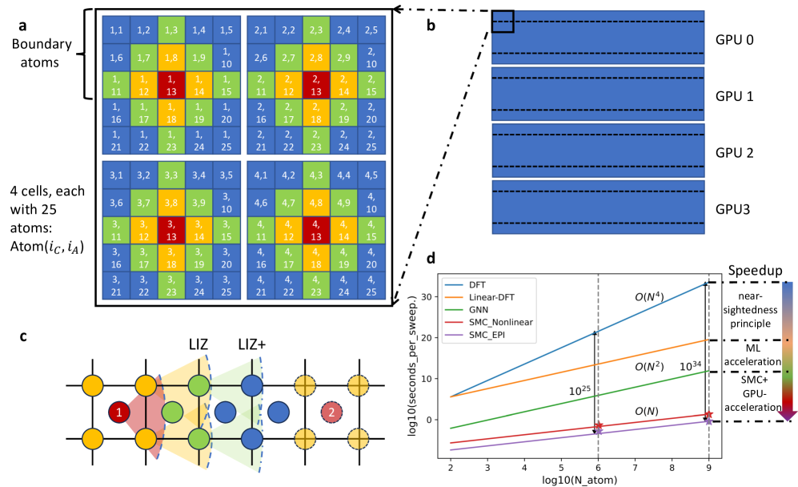
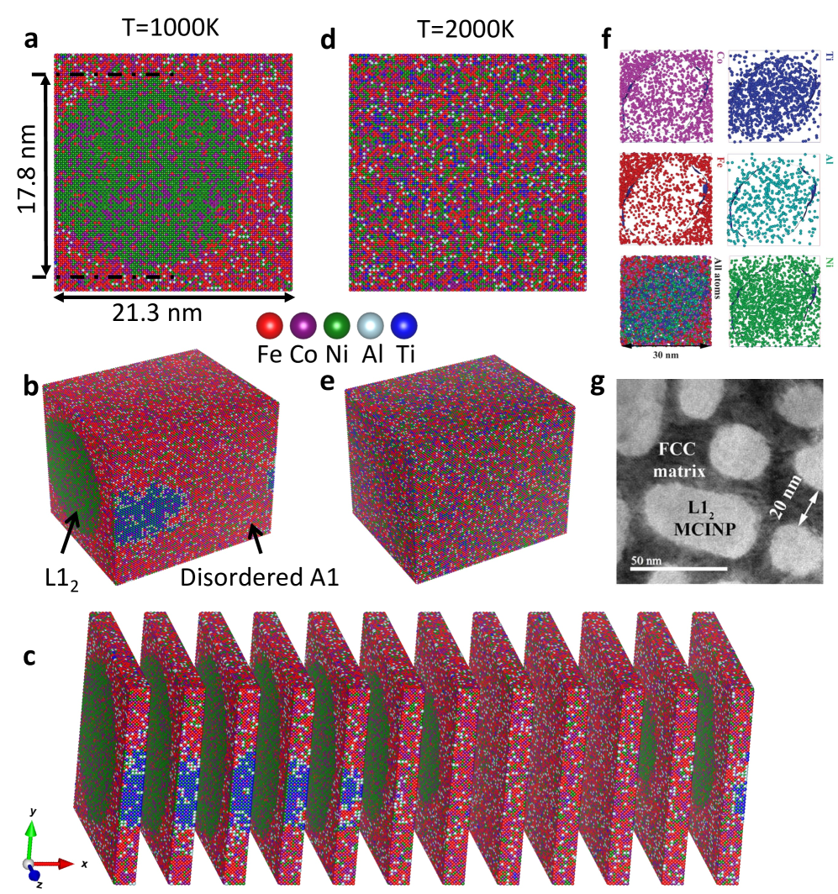
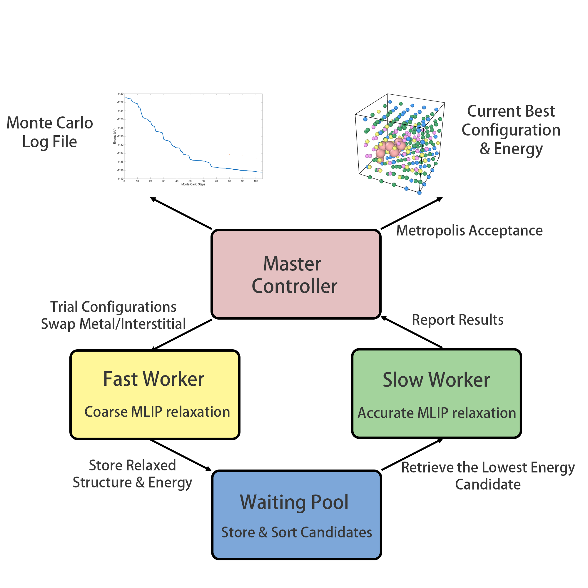
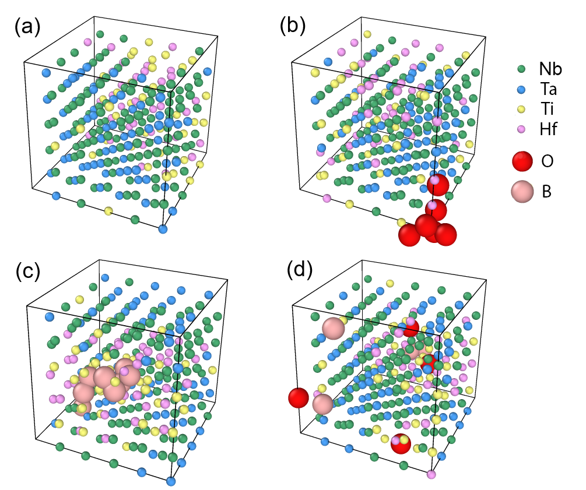
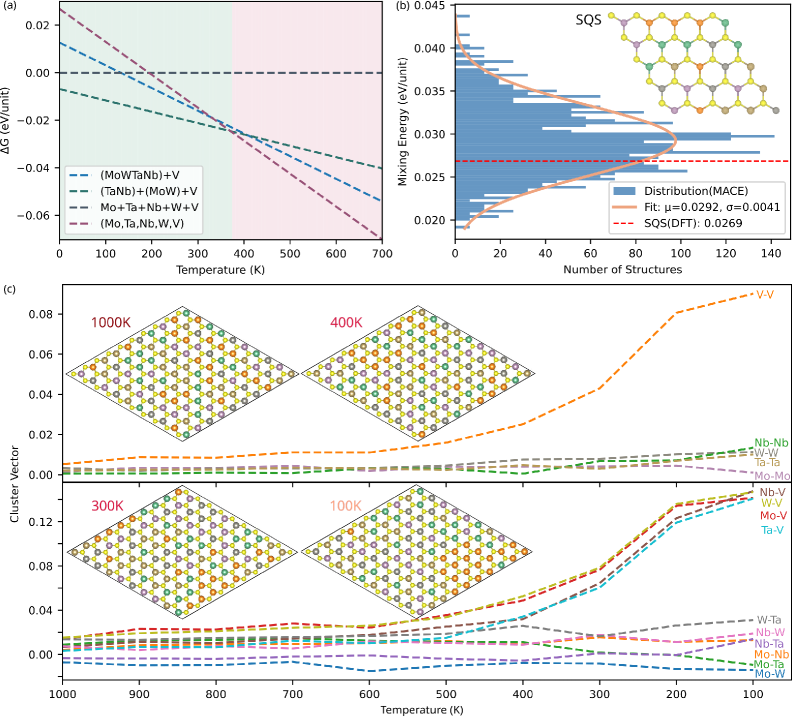

# ML加速格子モンテカルロで高エントロピー合金の「隠れた秩序」を覗く

- **執筆日**: 2026-04-01
- **トピック**: 高エントロピー合金の化学短距離秩序とML加速格子モンテカルロ
- **タグ**: Computation and Theory / Bulk Alloys; Phase Transitions / Monte Carlo; Machine Learning; Surrogate Modeling
- **注目論文**: arXiv:2603.21207（Zhou et al., 2026）
- **参照関連論文数**: 6

---

## 1. なぜ今この話題なのか

2004年に Yeh らと Cantor らがそれぞれ独立に提唱した**高エントロピー合金（High-Entropy Alloy, HEA）** は、5種類以上の金属元素をほぼ等比率で混合した多主成分合金の概念であり、以来20年以上にわたって材料科学の最前線に位置し続けている。HEAが注目される理由は、単純な二元合金や三元合金では得られない性質の組み合わせ——たとえば高強度と高延性の両立、優れた耐放射線性、低温での靭性維持——が多数報告されているからだ。

しかし、HEAに関してこれまで見過ごされがちだった重要な問いがある。「構成元素は本当にランダムに混ざっているのか」という問いである。

通常、HEAの設計思想は「混合エントロピーが十分に大きければ、さまざまな化合物の生成を抑制して単相の固溶体が安定化する」というものだ。ここで暗黙のうちに仮定されているのは、各原子がランダムな配置をとるという**ランダム固溶体**モデルである。ところが実験的な観測——電子線回折、X線・中性子線の散漫散乱、STEM-EELSなど——が積み重なるにつれて、HEA中の原子配置は決してランダムではなく、ナノスケールで特定の元素ペアが近接しやすい（あるいは避け合う）傾向を示すことが明らかになってきた。これが**化学短距離秩序（Chemical Short-Range Order, CSRO または SRO）** である。

SROはランダム固溶体と長距離秩序（結晶構造上で規則化した金属間化合物）の「中間状態」にあたるが、その影響は些細ではない。積層欠陥エネルギー、転位の移動経路、強化機構、さらには超電導転移温度や熱電特性まで、SROによって材料特性が大幅に変わることが示されつつある。この知見は、「HEAは高エントロピーの恩恵を受けたランダム合金」という従来の描像を根本から問い直している。

問題の核心は**計算の難しさ**にある。SROはナノ秒から秒のオーダーにわたる原子拡散によって発展する。一般的な分子動力学（MD）シミュレーションで到達できる時間スケールはせいぜいマイクロ秒以下であり、固相における原子交換が支配的に起きる「化学的熟成」過程をMDで追うことは極めて困難だ。一方、第一原理計算は精度こそ高いが扱える原子数は数百程度に限られる。

この計算上のギャップを埋める手法として近年急速に発展してきたのが、**機械学習原子間ポテンシャル（Machine Learning Interatomic Potential, MLIP）と格子モンテカルロ（Lattice Monte Carlo, MC）を組み合わせたML加速格子MC法** である。MLIPは第一原理計算に近い精度でエネルギーを評価しながら、計算速度ではMDを圧倒する。さらに格子MCは「原子交換試行」を繰り返すだけで化学秩序の有限温度平衡状態に到達できるため、拡散が律速になる長時間ダイナミクスをエレガントに回避できる。

2025年にはスケーラブルモンテカルロ（SMC）法が提案され、GPU並列計算によって10億原子規模の格子MCシミュレーションが実現した（arXiv:2503.12591）。このブレークスルーは「ML+格子MC」という枠組みが本格的な材料設計ツールに成熟しつつあることを示している。しかしここで新たな問いが生まれる。「膨大に存在するMLIPのアーキテクチャのうち、格子MC計算に最も適したものはどれか？」という問いだ。

2026年3月に投稿された Zhou ら（arXiv:2603.21207）の論文はまさにこの問いに正面から取り組んだ研究であり、Fe-Co-Ni-Al-Ti-Ta-V という7元素にわたるデータセットを構築してさまざまなMLIPアーキテクチャを系統的にベンチマーク、格子MCシミュレーションに向けたMLモデル選択の指針を提示している。

---

## 2. この分野で何が未解決なのか

ML加速格子MCによるHEAの化学秩序研究は急速に発展しているが、いくつかの本質的な問いがいまだ明確に解決されていない。

**問い1：ランダム固溶体と化学的秩序のどちらが安定か、そしてその温度・組成依存性は？**

HEAの設計では「高エントロピー効果で単相固溶体が安定化する」と言われるが、エントロピーは温度に比例するため、十分に高温では確かにランダム相が優先されるとしても、実際に材料が使われる温度域（室温〜数百℃）での平衡状態がどうなるかは組成によって大きく異なる。SROの程度（Warren-Cowleyパラメータで定量化）が温度とともにどう変化するかを定量的に予測することは、材料設計の観点から非常に重要だが、第一原理精度で系統的に行った事例はまだ少ない。

**問い2：どのMLIPアーキテクチャが格子MC計算に最適か？**

MLIP には多くのアーキテクチャが存在する。大きく「不変（invariant）ネットワーク」と「等変（equivariant）ネットワーク」に分類できるが、MDシミュレーションで優秀なモデルが格子MCでも最良とは限らない。格子MCで問われるのは「原子を交換したときのエネルギー差」の精度であり、絶対エネルギーの精度とは異なる。この違いに着目した系統的研究は 2603.21207 が最初に近い。

**問い3：欠陥サイト（粒界・表面・格子間原子）でのSROはどう変化するか？**

バルク内の完全格子での化学秩序は研究が進んでいるが、現実の材料には表面、粒界、格子間原子などの欠陥が必ず存在する。これらの欠陥サイト近傍では化学的環境が大きく変わり、SROのパターンが変質する可能性がある。表面偏析や粒界偏析がどの元素で起き、そこへ格子間原子（酸素、ボロン、炭素など）がどう共偏析するかは、耐食性・水素脆化・放射線照射損傷などの応用的観点から見ても重大な問いである。

**問い4：2次元系や非従来型合金系にこの手法は拡張できるか？**

ML加速格子MCはバルクBCC/FCC合金に適用されることが多いが、遷移金属ダイカルコゲナイド（TMD）などの2次元HEA、あるいは高エントロピー酸化物・高エントロピーセラミクスへの拡張は可能か？普遍的MLIPと組み合わせることで、材料空間を広範に探索する「計算顕微鏡」になりうるか？

---

## 3. 注目論文の核心：何が前進し、何がまだ仮説か

### SMC-X法という新しいプラットフォームの上で

2603.21207（Zhou ら）の論文を正しく理解するには、まずその土台となる SMC-X 法の成立背景を把握する必要がある。

SMC-X とは、同じグループが 2025 年に発表した**スケーラブルモンテカルロ（Scalable Monte Carlo, SMC）法**の拡張版である（2503.12591）。従来の格子MCでは、N 個の原子からなるシステムを1ステップ更新するたびに O(N) 回のエネルギー計算が必要だった（交換試行後のエネルギー変化を求めるため）。SMCは「局所相互作用ゾーン（Local Interaction Zone, LIZ）」という概念を導入して、同一インデックスを持つ異なるセル内の原子交換試行が互いに独立であることを利用し、GPU上で並列化することでこの計算量をO(N)から実効的にO(1)（並列化後）にまで削減した。このアルゴリズムにより、10億原子規模の格子MCシミュレーションが2基のGPUで実行できるようになった。

*図1: SMC-X法の概念図。(a) 2次元正方格子上でのSMC-X の動作原理。「局所相互作用ゾーン（LIZ）」を定義し、独立な領域を並列に更新する。(d) 従来法との計算時間比較。システムサイズに対して劇的なスケーリング改善を示す。（図は arXiv:2503.12591 より。CC BY-NC-ND 4.0）*

SMC法はFCC/BCC格子を対象とした**セミグランドカノニカルアンサンブル**（後述）で動作し、原子種の交換試行を繰り返すことで有限温度における化学秩序の平衡配置を探索する。このとき、エネルギー評価に何を使うかが精度と速度のトレードオフを決める。SMCの原報では**有効対相互作用（Effective Pairwise Interaction, EPI）モデル**が用いられたが、これは精度が限られる場合がある。

2603.21207 が問うのは「SMC-Xというプラットフォームの上で、より汎用的かつ精度の高いMLIPをどう組み合わせるか、そしてどのアーキテクチャを選ぶべきか」という実践的かつ根本的な問いだ。

### データセット構築と架け橋の役割

研究では Fe, Co, Ni, Al, Ti, Ta, V の7元素を対象に、10,000 件を超えるDFT計算結果をデータセットとして構築している。7元素が組み合わさる化学空間は膨大であり、このデータセット構築自体がすでに重要な貢献だ。

さらに重要な点として、著者たちは「構造緩和あり」と「構造緩和なし（理想格子位置）」の2種類のデータセットで訓練したモデルを比較している。格子MCは化学的自由度（どの原子種がどの格子点を占めるか）のみを扱い、原子の位置は固定したままにする近似（「厳密格子近似」）を採用することが多い。したがって、訓練データも理想格子上の配置で計算した方がモデルの内部一貫性が保たれるのではないか、という仮説がある。これを検証した結果は、単純ではないことを示している。

### MLIPアーキテクチャの分類とベンチマーク結果

本論文が扱うMLIPは大きく2種類に分類できる。

**不変型（Invariant）ネットワーク**は、入力として各原子の局所環境を表す特徴量（原子種と距離のペア、角度など）を使い、回転・並進・反転に対して不変な方法で記述する。代表例としてはニューラルネットワークポテンシャル（NNP）や等変グラフニューラルネットワーク（eGNN）の一部が挙げられる。

**等変型（Equivariant）ネットワーク**は、回転変換に対して特徴量が「正しく変換される」（等変である）ように設計されており、より少ないデータで高精度を達成できると言われる。MACE や NequIP などが代表例だ。

MDシミュレーションでは等変型が近年優れた性能を示しているが、格子MCの文脈では状況が異なる。格子MCで重要なのは「原子種 i を原子種 j に交換したときのエネルギー差 ΔE」の精度であり、各原子種の化学的環境の微妙な差異を正確に区別できるかどうかに依存する。

著者らの系統的ベンチマークから明らかになった主な知見は以下の通りである。

1. **対相互作用だけでは不十分**：近傍原子との対相互作用（2体項）のみを考慮したモデルでは、実際の化学的傾向を正しく再現できない。3体以上の高次相互作用を取り込む能力が重要であり、これは化学空間が広がるほど顕著になる。

2. **不変型と等変型の勝敗は一様ではない**：等変型が常に優れているわけではなく、訓練データの量と分布、対象とする元素の組み合わせによって最適なアーキテクチャが異なる。格子MCの目的（エネルギー差の精度）に特化した評価指標でモデルを選ぶ必要がある。

3. **格子緩和の効果は複雑**：緩和ありデータで訓練したモデルが、理想格子上の格子MCで必ずしも精度向上をもたらすとは限らない。格子歪みが強い合金系では緩和の取り込みが重要だが、それを格子MC内部でどう扱うかは依然として方法論的な課題だ。

4. **説明可能ML（XAI）による相互作用の分解**：著者らはモデル予測を対相互作用成分と高次相互作用成分に分解する「説明可能な機械学習」アプローチを適用し、各元素ペアに対してどの相互作用が支配的かを可視化した。これにより、7元素系の化学空間を俯瞰的に理解するための「計算顕微鏡」的な知見が得られる。

これらの知見は、ML加速格子MCを実際の材料設計に応用する研究者に対して、モデル選択の具体的なガイドラインを初めて系統的に提示したものとして位置づけられる。

---

## 4. 背景と研究史：この論文はどこに位置づくか

### 伝統的アプローチ：クラスター展開法との格子MC

HEAの化学秩序を計算で探索する試みは、2600年代初頭（2010年代）に本格化した。当時の主流は**クラスター展開（Cluster Expansion, CE）法**と格子MCの組み合わせだった。

CE法では、N 元素合金の任意の配置 σ（各格子点の原子種を表す配列）のエネルギーを、

$$E(\sigma) = \sum_\alpha m_\alpha J_\alpha \langle \phi_\alpha(\sigma) \rangle$$

という展開で表す。ここで J_α は有効クラスター相互作用（Effective Cluster Interaction, ECI）、φ_α はクラスターαに対応する相関関数、m_α は多重度である。ECIを少数のDFT計算で決定すれば、その後は任意の配置のエネルギーを瞬時に評価できる。

CE法は組成が固定された系での相安定性や秩序化傾向の計算に強力だが、多元素系では展開のパラメータ数が爆発的に増え、汎化性も制限される。また、多元素系では元素の組み合わせごとにECIを再決定する必要があり、「材料空間を広範に探索する」用途には向かない。

### MLIPが格子MCに参入する

2019年以降、ディープラーニングを用いたMLIPが爆発的に発展し、DFTと同等の精度でMD計算が可能になった。しかし当初はMLIP+MDの組み合わせが主流であり、化学秩序の形成（原子拡散）には時間スケールが届かないという問題がそのまま残った。

この壁を打破したのが、格子MCとMLIPの組み合わせである。2022年ごろから、MLIPを使って各格子点の原子種を交換したときのエネルギー変化を評価し、メトロポリス法で受理・棄却するという「MLIP+格子MC」手法が本格的に報告されるようになった。この手法は、化学的自由度の緩和（組成均衡）に特化しており、拡散の実時間スケールを必要としない。

2503.12591（Liu, Yang ら, 2025）は、このMLIP+格子MCを「スケーラブル（Scalable）」にした転換点だ。EPI（有効対相互作用）モデルという比較的シンプルなMLIPを使いながらも、GPU上での並列実装によって**10億原子**というかつてない規模のシミュレーションを実現し、FeCoNiAlTi合金での L1₂ 型ナノ粒子形成（1000Kで直径約17.8 nm）や、MoNbTaW合金での B2 型ナノ相形成（250Kで約100 nm）を予測した。

*図2: SMC-GPU による FeCoNiAlTi 合金（100万原子）のシミュレーション結果。(a) 1000K における(001)面のスナップショット（Alリッチナノ粒子が確認できる）。実験で観測されたTEM像（g）と良好な一致を示す。（図は arXiv:2503.12591 より。CC BY-NC-ND 4.0）*

この結果は実験のAPT（アトムプローブトモグラフィー）やTEM像と定量的に対応しており、ML+格子MCが材料設計の実践的ツールになりうることを示した。

### 加速MCの別アプローチ

CE+格子MCの精度を向上させながらDFT計算を適応的に取り込む試みも並行して進んでいる。2410.05604（Musa ら, 2024）では、CE法に局所外れ値因子（Local Outlier Factor, LOF）機械学習を組み合わせ、MC過程で「訓練データから外れた」新規配置を検出したときだけDFT計算を実行する「加速MC-DFT（aMC-DFT）」を提案した。WCrTiTa 合金への適用では、通常のMC-DFTより約38倍の速度向上を達成しながら、エネルギー予測誤差は約0.022%と高精度を維持している。

この手法は「全ての配置をMLIPで評価する」のではなく、「怪しい配置だけDFTで精査する」という選択的精度保証の考え方であり、2603.21207の「MLIPアーキテクチャを選ぶ」アプローチとは哲学が異なる。両者を合わせて理解することで、ML+格子MCという手法の多様な実装戦略が見えてくる。

---

## 5. どの解釈が最も妥当か：証拠・比較・限界

### 高次相互作用の重要性：裏付けと反論

2603.21207 の最も重要な主張は「対相互作用だけでは化学秩序を正確に記述できず、高次相互作用（3体・4体項）の取り込みが必要だ」というものだ。この主張は複数の観点から支持されている。

まず、EPI（有効対相互作用）モデルを使った SMC 法（2503.12591）では、FeCoNiAlTi の結果は実験と整合するが、BCC 系の MoNbTaW では「低温で無秩序状態がB2ナノ相を保護する障壁として働く」という複雑な機構が現れており、単純な対相互作用モデルの限界が示唆される。さらに、2603.23029（Xu ら, 2026）の2次元 HEA 研究では、汎用 MLIPを「そのまま」使うと混合エネルギーの予測精度が低く、対象系の DFT データでファインチューニングしてはじめて正確な相分解挙動（400K での VS₂ 分離）が再現できることが示された。これは「汎用的な高次相互作用を学習しているだけでは不十分で、対象化学空間に特化した学習が重要」という解釈と整合する。

一方で反論もある。高次相互作用を陽に取り込む等変型ネットワークが必ずしも格子MCで最良でないとする2603.21207の結果は、「高次相互作用が重要」という主張と一見矛盾するように見える。これは「高次相互作用が物理的に重要」と「特定の数学的構造（等変性）がその学習に有利」は別の問題だ、という解釈で整合する。つまり、等変型でも不変型でも適切な訓練データと損失関数設計があれば、重要な高次相互作用を捉えられる可能性がある。

### 欠陥サイトでのSRO：PAPIAIが示す新事実

バルク均一系でのSROに加えて、欠陥サイト近傍でのSROが全く異なるパターンを示す可能性を示したのが 2603.08855（Zhu & Arroyave, 2026）の PAIPAI フレームワークである。

PAIPAI（Package for Alloy Interstitial Predictions using Artificial Intelligence）は、「高速ワーカー（粗いエネルギー評価でバルク配置探索）」と「低速ワーカー（精密なMLIPで候補絞り込み）」の二段階並行アーキテクチャを採用し、表面偏析・格子間原子凝集・粒界共偏析という3つの応用に適用した。

*図3: PAIPAI フレームワークのフローチャート。「高速ワーカー」が候補配置を大量探索し、「低速ワーカー」が高精度で精査する。共有プールを介して並行動作する。（図は arXiv:2603.08855 より。CC BY 4.0）*

Ti-V-Cr-Re 合金スラブへの適用では、Ti が表面に強く偏析し、Cr が内部に留まるという結果が得られた。ランダム配置から約20 eVのエネルギー低下が10⁵回のMCステップで達成されており、ランダムサンプリング（100配置のDFT計算）では到底到達できない低エネルギー状態であることが示されている。

*図4: Nb-Ti-Ta-Hf BCC HEA バルクでのMCシミュレーション結果。(a)格子間原子なし、(b)酸素挿入、(c)ボロン挿入、(d)ボロン+酸素の場合の原子配置。OとBはともにHf/Tiリッチ領域に集積する傾向があることがわかる。（図は arXiv:2603.08855 より。CC BY 4.0）*

この知見は、「欠陥なしのバルクSROを理解するだけでは不十分で、現実の材料で重要な界面・欠陥近傍の化学秩序を別途に取り込む必要がある」という重要なメッセージを伝えている。2603.21207のバルク系への焦点と2603.08855の欠陥系への拡張は相補的な関係にある。

### 2次元材料系への拡張：汎用MLIPの現在地

2603.23029（Xu ら, 2026）は、バルク金属HEAではなく2次元の遷移金属ダイカルコゲナイド（TMD）系の HEA、具体的には (Mo, Ta, Nb, W, V)S₂ に着目した。この系では5種の遷移金属が S₂ 層に挟まれた構造をとる。

汎用MLIPの5種類（MACE, MatterSim, CHGNet など）を「そのまま」使うと、混合エネルギーの予測精度が不満足であることが示された。対象系のDFT配置でファインチューニングした場合、混合エネルギー誤差が1.5 meV/原子程度まで改善し、正規MC（canonical MC）シミュレーションによって400Kで VS₂ が相分離する傾向を正確に再現できることが確認された。

*図5: (Mo, Ta, Nb, W, V)S₂ 2D HEAの MC シミュレーションによる相分解解析。上段：異なる温度でのクラスターベクトル（atomic pair correlations の指標）。下段：対応する温度での原子配置スナップショット（VS₂の分離が400K付近で始まることが見て取れる）。（図は arXiv:2603.23029 より。CC BY 4.0）*

この結果は、「ML+格子MCの枠組みはバルク金属系に限らず、2次元材料系にも拡張できる」ことを示す一方で、「汎用MLIPを直接使うことの限界」というメッセージも含んでいる。2603.21207が「どのアーキテクチャを選ぶべきか」を問うのに対して、2603.23029は「汎用モデルをどうファインチューニングするか」という実践的問いに答えており、両者の視点は相補的だ。

### まだ弱い結論と今後の検証

以上を総合すると、現時点での解釈は次のように整理できる。

**比較的強く支持される結論**：MLIPと格子MCの組み合わせは、拡散時間スケールを回避しながら有限温度でのSROを定量的に予測できる実用的なツールになっている。高次相互作用の取り込みは精度向上に本質的に重要だ。

**弱い結論・未確定な部分**：どのMLIPアーキテクチャが「格子MC用途で最良か」という問いへの答えは、まだ十分な統計的根拠に乏しく、元素系・温度域・対象とする物性によって変わる可能性が高い。また、格子緩和（格子定数の組成依存性、局所歪み）をどう扱うかは方法論的に未解決だ。

**今後必要な検証**：BCC系（高エントロピー耐熱合金）への適用、実験での中性子散漫散乱との定量比較、SROが転位運動や強化機構に与える影響のマルチスケール計算、そして欠陥（格子間原子・空孔）を含む系への完全な拡張が急務だ。

---

## 6. 何が一般化できるのか：材料・手法・応用への広がり

ML加速格子MCは特定の合金系の問題を超えて、広範な展開可能性を持っている。

**多次元・多材料への拡張**：2603.23029が示したように、バルク金属HEAから2次元TMDへの拡張は既に実証されている。高エントロピー酸化物（例：多元素ペロブスカイト）、高エントロピーセラミクス（ZrHfNbTaW窒化物など）へも同じフレームワークが適用でき、化学秩序が大きな研究フロンティアとして期待されている。これらの系ではイオン性相互作用の扱いが複雑になるが、原理的な障壁はない。

**欠陥・界面工学への応用**：2603.08855が示したように、表面・粒界・格子間原子が共存する系でのSROを MC で追うことで、「どの元素が粒界に偏析しやすいか」「格子間不純物は金属元素とどう相互作用するか」という問いを第一原理精度で解答できる。これは耐食性材料設計、核融合炉材料（低放射化高エントロピー合金）、半導体プロセスにおける多元素薄膜の理解に直結する。

**計算顕微鏡としての位置づけ**：2603.21207 の著者らは「computational microscope for chemical complexity（化学複雑性の計算顕微鏡）」という表現を使っている。これは、光学顕微鏡がマクロ構造を可視化し、電子顕微鏡が原子レベルの形態を可視化するのと同様に、格子MCシミュレーションが「化学秩序という目に見えない変数を原子レベルで可視化する」ツールになることを意味する。実際、SMCで得られたナノ構造の予測（図2）は実験の APT 結果と定量的に対応しており、この「顕微鏡」のアナロジーは単なる比喩ではなく実証的な裏づけを持っている。

**材料設計への逆問題**：SROが特定の性質（積層欠陥エネルギー、磁気モーメント、電気抵抗率など）を変えることが定量的に予測できれば、「目的の性質を持つSROパターンを設計し、それを達成する合金組成と熱処理条件を逆算する」という逆問題設計の流れが生まれる。ML加速格子MCは、この逆問題設計のエンジンになりうる。

---

## 7. 基礎から理解する

### 格子モデルとイジング模型の類比

HEA中の化学秩序を計算で扱う出発点は、原子を**格子点**に配置したモデルである。具体的には、FCC（面心立方）やBCC（体心立方）などの結晶格子の各格子点 i に、原子種 σ_i（例えば σ_i ∈ {Fe, Co, Ni, Al, Ti}）を割り当てる。この表現は磁性体のイジング模型と完全に類比的だ——スピンが「上か下か」を取るように、格子点が「A元素かB元素か」を取る。

このとき、系の全エネルギーは格子点配置 {σ_i} の関数として表される。最も単純な近似は**有効対相互作用モデル（EPI）** であり、

$$E(\{\sigma_i\}) \approx \sum_{i,j \in NN} V(σ_i, σ_j) + \sum_{i,j \in NNN} V'(σ_i, σ_j) + \cdots$$

と書ける。ここで V(σ_i, σ_j) は原子種ペア (σ_i, σ_j) 間の相互作用エネルギー、NN は最近傍対、NNN は次近傍対を表す。この形はまさにイジング模型の一般化（多成分系のスピン模型）であり、磁気相転移の研究で蓄積された豊富な知識が直接活用できる。

より汎用的なクラスター展開（CE）法では、このエネルギーを原子種の組み合わせを表す相関関数 Φ_α の線型結合として展開する。対、3体、4体のクラスターを順に取り込むことで、精度を体系的に向上できる。

### Warren-Cowleyパラメータ：SROの定量化

化学短距離秩序の程度を定量化する最も標準的な指標が**Warren-Cowleyパラメータ（Warren-Cowley SRO parameter）** $\alpha^{AB}_{lmn}$ である。A, B を2種の元素とし、格子ベクトル (l, m, n) で指定される方向の近傍対に対して、

$$\alpha^{AB}_{lmn} = 1 - \frac{P^{AB}_{lmn}}{c_B}$$

と定義する。ここで $P^{AB}_{lmn}$ は A 原子の近傍に B 原子が存在する条件付き確率、$c_B$ は B 元素の全体濃度である。

$\alpha^{AB}_{lmn} = 0$ のとき：完全ランダム配置（SROなし）
$\alpha^{AB}_{lmn} < 0$ のとき：A-B 近傍対が好まれる（化学的親和性あり、L1₂型秩序の傾向）
$\alpha^{AB}_{lmn} > 0$ のとき：A-B 近傍対が避けられる（A-A, B-B対が好まれる、相分離の傾向）

格子MCシミュレーションでは、この $\alpha^{AB}_{lmn}$ を温度の関数として追うことで、「何Kでどのような短距離秩序が発達するか」を定量的に予測できる。実験の中性子・X線散漫散乱から求めた Warren-Cowley パラメータと比較することで、シミュレーションの検証も可能だ。

### セミグランドカノニカルアンサンブルとメトロポリス法

格子MCで最も広く使われるアンサンブルは**セミグランドカノニカルアンサンブル（Semi-Grand Canonical ensemble, SGC）** である。これは「格子点の総数は固定するが、各格子点の原子種は変えられ、化学ポテンシャルの差 Δμ が平衡組成を制御する」アンサンブルだ。

具体的には、A 元素から B 元素への交換試行に対して、系のエネルギー変化 ΔE を計算し、次の**メトロポリス基準**で受理・棄却を決める。

$$P(\text{accept}) = \min\left(1, \exp\left(-\frac{\Delta E - \Delta\mu}{k_B T}\right)\right)$$

ここで Δμ は A と B の化学ポテンシャルの差であり、これを変化させることで平衡組成を変えられる。T は温度、k_B はボルツマン定数である。この操作を十分多くの試行（通常 10⁶〜10¹⁰ 回）繰り返すことで、指定された温度と化学ポテンシャルに対応する平衡状態の SRO が得られる。

重要なのは、この操作が「実際の拡散経路を追う」のではなく「有限温度のボルツマン統計が示す平衡状態を直接サンプリングする」という点だ。MDでは追えない長時間ダイナミクスを、確率的なサンプリングとして回避している。

### 機械学習原子間ポテンシャル：不変型と等変型

格子MC の一ステップで必要なのは「交換前後のエネルギー差 ΔE」の計算だ。この計算をDFTで行えば正確だが莫大な計算コストがかかる。MLIPはこの ΔE を神経回路網で近似し、DFTの1/1000以下のコストで同等の精度を達成しようとする。

MLIPには多様なアーキテクチャがあるが、格子MC向けに重要な区分は以下の2点である。

**不変型 vs 等変型**：不変型 MLIP は、入力に使う局所構造記述子が回転・反転に対して不変（スカラー）になるように設計される。一方、等変型は回転に対してテンソルとして変換する特徴量を使い、より豊富な表現能力を持つとされる。等変型はMDで有力だが、格子MCでは「化学種の識別精度」が重要になるため、単純な優劣関係は成り立たない。

**対相互作用モデル（EPI）の限界**：SMC法の原報（2503.12591）で使われた EPI モデルは近傍ペアのみを考慮する。これは計算が高速な一方で、多体（3体・4体）相互作用を捉えられない。特に、Al や Ti のような化学的に特徴的な元素が多数存在する7元素系では、多体相互作用が秩序化傾向の方向性を決定的に左右することがある。2603.21207の主要な発見は、この多体相互作用を正確に学習できるモデルの選択が格子MC精度を大きく左右するという点にある。

---

## 8. 重要キーワード10個

**1. 高エントロピー合金（High-Entropy Alloy, HEA）** ：5種類以上の金属元素をほぼ等比率（各元素5〜35 at.%）で含む多主成分合金。高混合エントロピーにより単相固溶体が安定化しやすい。CoCrFeMnNiカンター合金が代表例。

**2. 化学短距離秩序（Chemical Short-Range Order, CSRO）** ：合金内で特定の元素ペアが統計的に好まれる（または避けられる）傾向が局所的に現れる状態。長距離の結晶学的秩序（超格子）とは異なり、ナノスケールで存在する。材料特性に大きな影響を与えるが実験的に検出が難しい。

**3. 格子モンテカルロ法（Lattice Monte Carlo）** ：原子を固定した格子点に配置し、原子種の交換試行を繰り返すことで有限温度での化学秩序の平衡配置をサンプリングする計算手法。分子動力学では到達できない長時間スケールの拡散現象を回避できる。

**4. セミグランドカノニカルアンサンブル（SGC ensemble）** ：格子MCで使われるアンサンブル。格子点数は固定しながら、化学ポテンシャルの差 Δμ を制御変数として平衡組成を調整する。温度Tとともに変化させることで有限温度での相安定性・秩序化挙動を探索できる。

**5. クラスター展開法（Cluster Expansion, CE）**：格子配置のエネルギーを対・三体・四体などのクラスターに対応する相関関数の線型結合で表す方法論。DFTで計算した少数の配置のエネルギーから有効クラスター相互作用（ECI）を決定し、任意配置のエネルギーを高速に評価できる。CE+格子MCがHEA研究の伝統的計算アプローチ。

**6. 機械学習原子間ポテンシャル（MLIP）** ：ニューラルネットワーク等の機械学習モデルを使って、原子配置からエネルギー・力・応力を予測するポテンシャル関数。DFTの精度と分子動力学の速度を両立する。NequIP、MACE、CHGNetなどが近年の代表例。

**7. 等変ニューラルネットワーク（Equivariant Neural Network）** ：回転・並進・反転対称性に対して特徴量が「正しく変換される」（等変）ように設計された神経回路網。MLIPとして用いると、少ない訓練データで高精度を達成できることが多い。格子MCでは「等変が常に優れる」とは限らない。

**8. Warren-Cowley SROパラメータ** ：化学短距離秩序の程度を定量化する指標。ある元素ペアA-Bの近傍確率をランダム期待値からの偏差として表す（値がゼロ：ランダム、負：A-B近傍を好む、正：A-B近傍を避ける）。中性子・X線散漫散乱実験やMCシミュレーションから決定される。

**9. SMC-X法（スケーラブルモンテカルロ）** ：局所相互作用ゾーン（LIZ）の概念を導入して格子MCをGPU上で並列化し、計算量をO(N²)からO(N)（→実効O(1)）に削減した手法。10億原子規模のシミュレーションを少数のGPUで実行可能にした。2025年にLiuらが提案（arXiv:2503.12591）。

**10. ナノ構造（Nanostructure）**：HEAにおいてMCシミュレーションや実験（APT、TEM）で観察されるナノスケールの組成・秩序の不均一性。FeCoNiAlTiでのL1₂型ナノ粒子（直径〜18 nm）やMoNbTaWでのB2型ナノ相（〜100 nm）が例。これらのナノ構造が優れた機械特性の起源の一つと考えられている。

---

## 9. おわりに：何が分かり、何がまだ残っているのか

ML加速格子モンテカルロは、高エントロピー合金の「隠れた秩序」——化学短距離秩序——を第一原理精度で解き明かす有力なアプローチとして急速に成熟しつつある。2603.21207（Zhou ら）は、この枠組みの実践においてMLIPアーキテクチャの選択が重要かつ非自明な問題であることを初めて系統的に示し、対相互作用モデルの限界と高次相互作用の重要性、そして格子緩和が与える複雑な影響を明らかにした。同時期の複数の研究（2503.12591, 2603.08855, 2603.23029）を合わせると、この「計算顕微鏡」がバルク合金から欠陥構造、2次元材料系まで広範に展開しつつあることが見えてくる。既に確かになったことは、「ML+格子MCは分子動力学では届かない時間スケールの化学秩序を、原子レベルで定量的に予測できる」という核心部分であり、この主張は実験（APT、TEM）との定量的な一致によって裏付けられている。

一方で、多くの問いが未決のまま残っている。格子緩和（局所的な歪み）をどう格子MC内に取り込むか、BCC系のより複雑なSRO挙動（複数のサブラティス、拡散バリアの異方性）をどう扱うか、そして最も重要な「SROが転位の移動障壁・ペアリング力学・スタッキングフォールトエネルギーをどう変えるか」をマルチスケールで定量化するかという問いは、今後1〜3年の研究で決定的な進展が期待される。特に、ML加速格子MCで予測したSROパターンをそのまま初期条件として用いた転位ダイナミクスのMDシミュレーションや、放射線照射下でのSROの非平衡変化（KMCとの組み合わせ）は、次の重要なフロンティアとなるだろう。材料の「設計」から「予測」へ、そして「逆問題的最適化」へという流れの中で、ML加速格子MCという「計算顕微鏡」の役割はますます中心的になっていくことが予想される。

---

## 参考論文一覧

1. **[anchor]** F. Zhou, H. Chen, P. Xu, K. Yang, Z. Pei, X. Liu, "Towards Computational Microscope of Chemical Order-Disorder via ML-Accelerated Monte Carlo Simulation," arXiv:2603.21207 (2026). CC BY 4.0.

2. **[background]** X. Liu, K. Yang, Y. Liu, F. Zhou, D. Fan, Z. Pei, P. Xu, Y. Tian, "Revealing Nanostructures in High-Entropy Alloys via Machine-Learning Accelerated Scalable Monte Carlo Simulation," arXiv:2503.12591 (2025). CC BY-NC-ND 4.0. *[npj Comput. Mater., 2025]*

3. **[related/extension]** S. Zhu, R. Arroyave, "Ground-State Structure Search of Defective High-Entropy Alloys Using Machine-Learning Potentials and Monte Carlo Sampling," arXiv:2603.08855 (2026). CC BY 4.0.

4. **[related/2D]** P. Xu et al., "Fine-tuning of Universal Machine-Learning Interatomic Potentials for 2D High-Entropy Alloys," arXiv:2603.23029 (2026). CC BY 4.0.

5. **[alternative]** M. R. K. Musa, Y. Qian, J. Peng, D. Cereceda, "Accelerating the Discovery of Low-Energy Structure Configurations: A Computational Approach that Integrates First-Principles Calculations, Monte Carlo Sampling, and Machine Learning," arXiv:2410.05604 (2024). CC BY-NC-ND 4.0.

6. **[comparison]** C. Niu, L. Liu, "Short-Range Order Based Ultra Fast Large-Scale Modeling of High-Entropy Alloys," arXiv:2411.18906 (2024). *npj Comput. Mater.*
