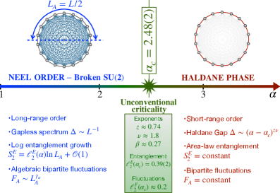
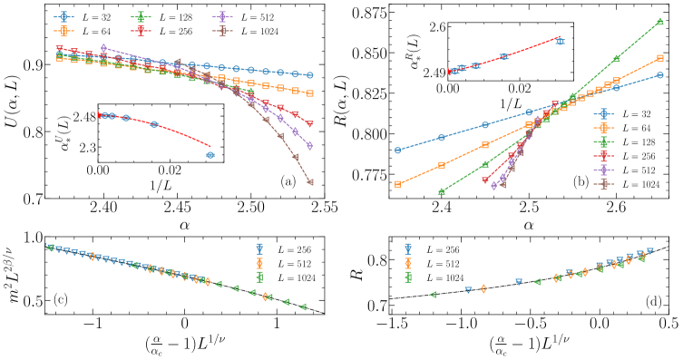
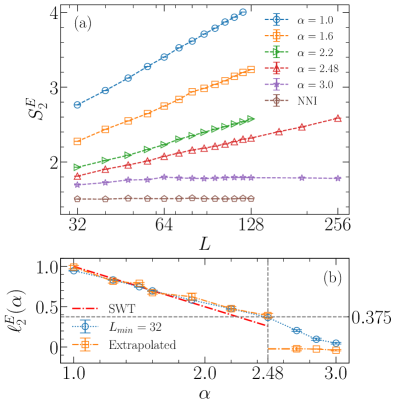
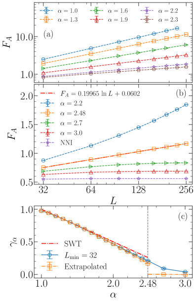

# 長距離相互作用スピン-1鎖の非共形量子臨界点

- 執筆日：2026年4月26日
- トピック：長距離相互作用をもつスピン-1ハイゼンベルク鎖におけるハルデン相からネール相への量子相転移と，エンタングルメントエントロピー・二部分ゆらぎが明らかにする非共形スケーリング則
- タグ：Computation and Theory / Spin Liquids and Quantum Many-Body Systems / Phase Transitions / Monte Carlo
- 注目論文：arXiv:2604.20831 — Chau, Zhao, Laflorencie, Meng (2026)「Unconventional Quantum Criticality in Long-Range Spin-1 Chains: Insights from Entanglement Entropy and Bipartite Fluctuations」
- 参照論文数：6本（注目論文1本＋関連論文5本）

---

## 1. なぜ今この話題なのか

量子スピン系における相転移は，凝縮系物理学の根本的な問いの一つであり続けている。粒子間の相互作用がどのような空間的範囲に及ぶかによって，系の基底状態や量子臨界現象の性質は根本から変わりうる。古典的な統計力学では，短距離相互作用の系が示す連続相転移はほぼすべて，既知の臨界現象の普遍クラスのいずれかに収まることが知られている。しかし，相互作用が空間的に遠くまで及ぶ「**長距離相互作用**（long-range interaction, LR）」をもつ量子系では，この枠組みが根本から崩れることがある。

近年，光格子中の冷却原子系・トラップイオン系・窒素空孔中心をもつダイヤモンドなど，人工量子系において長距離相互作用を精密に制御できる実験プラットフォームが急速に整備されてきた。これらの系では，スピン間の相互作用が距離 $r$ に対して $J_{ij} \propto r^{-\alpha}$ という冪乗則で減衰するような状況が実現できる。特に指数 $\alpha$ を連続的に変えることができるため，長距離から短距離への連続的な変化にともなって量子臨界現象がどのように変化するかを系統的に調べることが可能になっている。この種の研究は，量子多体物理学の基礎的な問いである「普遍性クラスの分類」に直接迫るものとして，2020年代に急速に重要性を増している。

このような背景のもと，「スピン-1ハイゼンベルク鎖にべき乗則で減衰する長距離相互作用を加えると，トポロジカルに保護されたハルデン相はどうなるか」という問いが重要な論点として浮上してきた。スピン-1鎖の**ハルデン相**（Haldane phase）は，エネルギーギャップをもつ対称性保護トポロジカル（SPT）相として知られており，量子情報・量子計算の観点からも基礎的な役割を果たす物質状態である。この相が長距離相互作用によってどの臨界点で崩壊し，その転移がどのような普遍性クラスに属するのか，さらに量子エンタングルメントの観点からどのように記述できるのかは，これまで未解決のままであった。

2026年4月，Chau・Zhao・Laflorencie・Mengの4名によって投稿された論文（arXiv:2604.20831）は，この問いに対する包括的な数値的解答を与えた。量子モンテカルロ（QMC）法に基づく大規模シミュレーションと有限サイズスケーリング解析を組み合わせ，臨界点 $\alpha_c = 2.48(2)$ を決定するとともに，この転移が「**非共形（nonconformal）**」な性格をもつ——すなわち動的臨界指数 $z \neq 1$ である——ことを示した。さらに，エンタングルメントエントロピーと**二部分ゆらぎ**（bipartite fluctuations）という二つの量子情報量が，転移の普遍的なスケーリングを鋭敏に反映することを明らかにした点が，本論文の特に注目すべき成果である。

## 2. 未解決問題は何か

この分野における核心的な問いを三つに整理しておこう。それぞれの問いが，現在の研究においてどこに議論の分岐点をはらんでいるかも示す。

**第一の問い：長距離相互作用はハルデン相の何を破壊するのか？**
ハルデン相はSU(2)対称性に保護されたSPT相であり，系の末端に自由な半整数スピンの「エッジ状態」をもちながらバルクにはエネルギーギャップが存在する。べき乗則で減衰する反強磁性長距離相互作用を加えると，$\alpha$ が小さい（= 相互作用が長距離まで及ぶ）極限では，スピンが反強磁性的に整列した**ネール秩序**が出現することが期待される。ハルデン相からネール相への転移がどの $\alpha$ で起こるか，またそれが連続転移か一次転移かは，理論的に自明ではなく，数値研究によって初めて答えが得られる問いである。

**第二の問い：その量子相転移の普遍性クラスは何か？**
短距離相互作用の場合，スピン-1鎖での相転移（たとえば単一イオン異方性 $D$ 項を変えて引き起こされる場合など）は共形場理論（CFT）で記述できる $c=1$ の臨界点に属し，動的臨界指数 $z=1$ をもつことが知られている。しかし長距離相互作用系では，CFTの枠組みが崩れる可能性がある。特に，$z \neq 1$ という「非共形」な臨界点が出現するのか否かは，スピン-1/2 の長距離鎖での先行研究（arXiv:2406.02685 ほか）を踏まえて重要な論点となっていた。

**第三の問い：エンタングルメントエントロピーはどのようにスケールするか？**
短距離臨界系では，エンタングルメントエントロピー（EE）は $S \sim \frac{c}{3} \log L$ という形をとり，中心荷（central charge）$c$ が普遍量として現れる（CFTのCalabresi-Cardy公式）。長距離相互作用が存在する場合，Nambu-Goldstone（NG）モードに由来する対数的発散の係数はどのように変化するのか，あるいは全く異なる形が現れるのかが問われる。この問いは，量子情報と量子臨界現象を橋渡しする観点として近年非常に重要視されており，EEや二部分ゆらぎが「秩序パラメーターと同等の識別力をもつ探針」となりうるかどうかを問うものでもある。

## 3. 注目論文の核心

Chauら（arXiv:2604.20831）が研究したのは，以下のハミルトニアンで記述されるスピン-1ハイゼンベルク鎖である：

$$\mathcal{H} = J \sum_{i < j} \frac{(-1)^{i+j}}{|i-j|^\alpha} \boldsymbol{S}_i \cdot \boldsymbol{S}_j$$

ここで $\boldsymbol{S}_i$ はサイト $i$ のスピン-1演算子，$J > 0$ は反強磁性結合定数，$(-1)^{i+j}$ は「千鳥状（staggered）」の符号因子で，隣り合うスピン間が反強磁性的に結合することを表す。指数 $\alpha$ が大きい（$\alpha \to \infty$）極限では最近接相互作用のみが残り，通常の短距離スピン-1ハイゼンベルク鎖（ハルデン相をもつ）に帰着する。一方 $\alpha$ が小さいほど，遠くのスピン間の結合が重要になる。

*Fig. 1（arXiv:2604.20831 より，CC BY 4.0）：減衰指数 $\alpha$ の関数としての基底状態位相図。大きな $\alpha$ ではギャップをもつハルデン SPT 相，小さな $\alpha$ ではギャップのない反強磁性ネール相が現れる。$\alpha_c = 2.48(2)$ における量子臨界点（QCP）は非共形な性格をもつ。*

**QMCのための鍵：スプリットスピン表現（split-spin representation）**

スピン-1鎖のQMCシミュレーションには，大きな技術的困難がある。スピン-1演算子を効率的に扱う基底表現が自明でないためである。Chauらはこの問題を，スピン-1を二つのスピン-1/2に「分割」し，同一サイトの二つのスピン-1/2の対称部分空間への局所射影拘束を課す「スプリットスピン表現」を用いることで解決した。この手法により，スピン-1の自由度を局所的な制約付きスピン-1/2として扱うことが可能となり，SSE（Stochastic Series Expansion）QMCが効率的に実装できる。結果として，最大1024サイトに及ぶ大規模な系のシミュレーションが実現した。

**主要結果１：臨界点の決定**

有限サイズスケーリングと交差点解析により，臨界点 $\alpha_c = 2.48(2)$ が決定された。この解析では，ネール秩序パラメーター $m$ の**バインダーキュムラント** $U(\alpha, L) = 1 - \langle m^4 \rangle / (3 \langle m^2 \rangle^2)$ を用い，異なるシステムサイズ $L = 32$ から $1024$ での $U(\alpha, L)$ 対 $\alpha$ 曲線の交点から臨界点を絞り込んだ（Fig. 2参照）。バインダーキュムラントは，臨界点でシステムサイズ依存性が消える（普遍的な値に収束する）という性質があり，臨界点の精密決定に適した手法である。

*Fig. 2（arXiv:2604.20831 より，CC BY 4.0）：異なるシステムサイズ $L = 32$〜$1024$ のバインダーキュムラント $U(\alpha, L)$ の交差解析。各 $L$ の曲線の交点が $\alpha_c = 2.48(2)$ に収束し，量子臨界点が精密に決定される。*

**主要結果２：非共形な臨界現象**

抽出された臨界指数は，動的臨界指数 $z \neq 1$ を示す。エネルギーギャップ $\Delta$ の有限サイズスケーリング $\Delta(L) \sim L^{-z}$（臨界点において）を，数百サイトまでの系で系統的に解析することで $z$ が抽出された（Fig. 3）。これは，長距離相互作用が通常の相対論的量子臨界理論（共形場理論：$z=1$）の枠組みを破ることを示す，分野において重要な発見である。

**主要結果３：エンタングルメントエントロピーのスケーリング**

半鎖のルニー・エンタングルメントエントロピー $S_2^E$ は，ネール相（小 $\alpha$）では NG モードに由来する対数的発散を示し，$S_2^E \sim a(\alpha) \log L$ となる（Fig. 4）。臨界点では，このスケーリングの係数（有効中心荷に相当）が非自明な $\alpha$ 依存性をもち，単純なCFTのCalabresi-Cardy公式 $S \sim \frac{c}{3} \log L$ では説明できない修正が現れる。ハルデン相（大 $\alpha$）では，EEはシステムサイズに依存せず有限値に飽和する（面積則）。

**主要結果４：二部分ゆらぎ**

ネール秩序パラメーター $m_A$ の二部分ゆらぎ $F_A = \langle m_A^2 \rangle - \langle m_A \rangle^2$ も系統的に解析された（Fig. 5）。ネール相では NG モードに起因して $F_A \sim K \log L$（$K$ はスピン波スティフネス関連の定数），臨界点では修正されたスケーリングが現れる。EEと二部分ゆらぎの両者が一貫したスケーリング描像を示すことが，本研究の重要な強みの一つである。

## 4. 背景と研究史

**ハルデン相の発見とSPT位相の現代的枠組み**

1983年，F.D.M. Haldane は整数スピン鎖にはエネルギーギャップが存在し，半整数スピン鎖はギャップレスであるという予言を行った（Haldane予想）。スピン-1ハイゼンベルク鎖のハルデン相はその後の理論・実験研究で詳細に研究され，現代的な言葉では「対称性保護トポロジカル（SPT）相」の原型的な例として位置づけられている。この相の特徴は，バルクにエネルギーギャップをもちながら，系の端に縮退した自由スピン-1/2のエッジ状態が現れることである。これは，境界を共有するSPT相とトリビアルな相が接するときに現れる「境界異常」の一例でもある。

**長距離相互作用系での量子相転移研究の流れ**

長距離相互作用をもつスピン-1/2鎖での量子相転移については，過去10年間で急速に研究が進んだ。特に重要な先行研究として，arXiv:2406.02685（Zhao, Laflorencie, Meng; PRL 134, 016707, 2025）がある。この研究では，フラストレーションのないべき乗則相互作用をもつスピン-1/2ハイゼンベルク鎖のエンタングルメントエントロピーと参加エントロピー（participation entropy）のスケーリングを QMC で系統的に研究し，$\alpha$ に応じて異なる相で非自明な対数項が現れることを示した。この研究は注目論文（arXiv:2604.20831）の著者グループが中心となった先駆的研究であり，スピン-1/2系での手法論と物理的知見がスピン-1系の解析に直接活かされている。特に，「Nambu-Goldstonモードに由来する対数発散を超えた非自明な対数係数の修正」という着眼点は，スピン-1鎖での研究でも中心的な問いを形成している。

長距離相互作用系における普遍クラスの変化という観点では，arXiv:2309.01652（PRB 108, 245152, 2023）も重要な先行研究を提供している。この研究は，長距離スピン-1/2臨界鎖における「創発的自己双対性（emergent self-duality）」の問題を論じ，長距離相互作用の効果によって「脱閉じ込め臨界性（deconfined criticality）」から一次転移へと移行するシナリオを示している。スピン-1鎖はトポロジカル的な性格が加わるため，対応するシナリオが存在するかは興味深い問いであるが，現在のところ注目論文の系では $\alpha_c = 2.48$ での転移は連続的であることが数値的に支持されている。

**厳密解が与える理論的基盤**

arXiv:2502.04165（PRA 111, 023307, 2025）は，厳密に解ける長距離クラスターXY模型を用いて，臨界指数が $\alpha$ とともに**連続的に変化**することを解析的に示した。この研究はQMCなどの数値手法ではなく解析的手法に基づいており，「連続的に変化する臨界指数（continuously varying critical exponents）」という概念を厳密に裏付ける理論的支柱となっている。長距離相互作用系において普遍性クラスが固定されず，$\alpha$ という単一のパラメーターによって連続的に変化するという性質は，短距離系の直感とは全く異なる。このことを厳密解が保証している点は，注目論文の数値結果（臨界指数の $\alpha$ 依存性）を独立かつ理論的な観点から支持するものとして重要である。

**エンタングルメントと量子情報の観点からの別系列**

arXiv:2408.16070 は，特殊な対称性をもつ**モツキンスピン鎖**（Motzkin spin chain）における相関関数とエンタングルメントを系統的に研究した研究である。モツキン鎖はスピン-1の特殊なモデルであり，通常のスケーリング理論では捉えにくい非常に大きなエンタングルメント（$S \sim L^{1/2}$ や体積則への近傍）が現れる例として知られる。この研究はスピン-1系における EE スケーリングの多様性を示す背景的な研究として機能する。長距離相互作用が加わった通常のハイゼンベルク鎖での EE スケーリングの「普通でなさ」が，どのような機構に由来するかを理解するための対照的な事例を提供している。

同時期に投稿された arXiv:2604.12754 は，注目論文と同じスピン-1長距離ハイゼンベルク鎖に単一イオン異方性（single-ion anisotropy）項 $D \sum_i (S_i^z)^2$ を加えた模型を，主に行列積状態（MPS）法とDMRGを用いて研究している。この研究では，$\alpha$-$D$ 平面上の2次元相図が明らかになり，ハルデン相・大きな $D$ 相（Large-D phase，スピン-0の直積状態に近いSPT相）・ネール相の間の転移が体系的に調べられた。この拡張により，注目論文の「$D=0$ 直線上の切断面」をより広いパラメータ空間の文脈に置くことができ，結果的に注目論文の主要結論を独立に確認する役割を果たしている。

## 5. どの解釈が最も妥当か

**非共形臨界点の解釈を支える根拠**

注目論文が主張する「非共形臨界点（$z \neq 1$）」という解釈は，複数の独立した観測量によって支持されており，現時点では比較的強い根拠をもつ結論と判断できる。第一に，エネルギーギャップのスケーリング $\Delta(L) \sim L^{-z}$（臨界点直上）の解析（Fig. 3）が $z \neq 1$ を直接示している。第二に，EE のスケーリング（Fig. 4）が CFT の予言（$z=1$ 系ではシステムサイズ $L$ に対して $c/3 \cdot \log L$ という形をとるはず）と合致しない形をとる。第三に，バインダーキュムラントの交差解析からのスケーリング崩壊（data collapse）が $z \neq 1$ を要求する。これら三種類の独立な観測量が整合的に $z \neq 1$ を指示することは，単純な数値アーティファクトでは説明困難であり，非共形性の結論は堅固といえる。

arXiv:2604.12754 との比較においても，$D=0$ での臨界指数（$\nu$, $z$, $\eta$）の値が両論文で整合しており，スプリットスピン QMC（注目論文）と MPS/DMRG（2604.12754）という全く異なる数値手法が同じ物理を抽出していることが確認できる。これは数値結果の信頼性を大きく高める。さらに，arXiv:2502.04165 の厳密解モデルの結果は，長距離相互作用が「連続的に変化する臨界指数」をもたらすという概念を，全く異なる（厳密解可能な）モデルで理論的に確立しており，注目論文の数値抽出と矛盾しない傾向を示す。

*Fig. 4（arXiv:2604.20831 より，CC BY 4.0）：半鎖ルニー EE $S_2^E$ のシステムサイズ $L$ 依存性。異なる $\alpha$ 値について，ネール相（$\alpha < \alpha_c$）・臨界点（$\alpha \approx \alpha_c$）・ハルデン相（$\alpha > \alpha_c$）での異なるスケーリング形式が現れる。臨界点での傾き（対数係数）は単純な CFT 予言に従わない。*

**まだ弱い結論と残る曖昧さ**

一方で，いくつかの点はまだ確定的ではない。まず，臨界点でのEEの対数係数（有効中心荷的なもの）の正確な普遍クラスへの帰属が未解明である。CFTでは中心荷 $c$ が固定された普遍量として機能するが，非共形系では何が「普遍量」として機能するかの理論的枠組みが未整備であり，注目論文は数値的な傾向を示すにとどまる。どのような場の理論が非共形量子臨界点を記述するかは，今後の理論研究に委ねられている課題である。

次に，ネール相内部でのEEスケーリングにおける「対数修正項」の係数が理論値（スピン波スティフネスから予測される値）と定量的に合うかどうか，有限サイズ効果が十分に取り除かれているかという問題が残る。特に，対数スケーリングは系統誤差に敏感であるため，さらに大きなシステムサイズでの検証が望ましい。

また，arXiv:2309.01652 が示したスピン-1/2長距離鎖での「deconfined criticality → 一次転移」というシナリオが，スピン-1系でも別の $\alpha$ や $D$ の領域で現れる可能性については，注目論文は直接論じていない。arXiv:2604.12754 が示す拡張相図（$\alpha$-$D$ 平面）においても，ある種の一次転移領域が存在するかどうかは今後の探索課題である。

*Fig. 5（arXiv:2604.20831 より，CC BY 4.0）：半鎖二部分ゆらぎ $F_A$ のシステムサイズ $L$ 依存性。ネール相（小 $\alpha$）では NG モードによる $K \log L$ 発散，臨界点では非自明なスケーリング係数が現れる。*

**解釈のまとめ**

現状でもっとも支持される描像は以下のものである：$\alpha_c = 2.48(2)$ での転移は連続的であり，その普遍性クラスは従来のCFTに基づくものではなく，$z \neq 1$ という非共形な量子臨界点（QCP）である。$\alpha$ を変化させることで臨界指数が連続的に変化するという「長距離相互作用系の一般的傾向」が，スピン-1系においても明確に現れている。EEと二部分ゆらぎはどちらも系の普遍的な性質を敏感に反映しており，秩序パラメーターと同等の情報を与える量子情報量として確立されつつある。ただし，これらの対数係数の理論的意味づけは今後の課題として残る。

## 6. 何が一般化できるのか

**他の材料系・モデルへの接続**

注目論文が示したことの最も重要な一般化可能な知見は，「エンタングルメントエントロピーと二部分ゆらぎが，量子相転移の探針として従来の秩序パラメーターと同等の識別力をもつ」という点である。この知見は，スピン-1鎖という特定の模型に限らず，長距離相互作用をもつ1次元・2次元の量子系全般に適用できると考えられる。arXiv:2406.02685 がスピン-1/2系で同様の結論を導いており，スピン-1でも同じ枠組みが機能することが確認されたことで，EEと二部分ゆらぎを普遍的な量子相転移の探針として用いる方法論の一般性が強まった。

**2次元系・より高次元への展望**

1次元での成果を踏まえれば，2次元の長距離相互作用量子スピン模型（たとえば2次元の格子模型にべき乗則減衰の相互作用を加えたもの）での量子臨界現象へと研究が発展することが自然な次のステップである。2次元系では，量子スピン液体やデコンファインメント臨界性（Néel相から $\mathbb{Z}_2$ スピン液体への転移など）が長距離相互作用によってどのように影響を受けるかは，まだほとんど未知の領域である。EEのスケーリング（2次元臨界系では$S \sim L \log L$ のような「補正面積則」が現れることが知られる）が長距離相互作用でどう変化するかは，今後の重要な問いとなろう。

**実験系への接続：トラップイオンとRydberg原子**

トラップイオン系では，レーザーを介した有効スピン-スピン相互作用が $r^{-\alpha}$ 型で実現でき，$\alpha \approx 0$〜$3$ の範囲が実験的にアクセス可能である。スピン-1に相当する3準位系の実現も原理的には可能であり，注目論文の予言（臨界点 $\alpha_c \approx 2.48$，非共形臨界指数，EEの対数スケーリング形式）を実験で直接検証することが将来的に射程に入る。また，Rydberg原子系でも長距離相互作用が自然に実現するため，EEや二部分ゆらぎの実験的測定（量子状態トモグラフィーやシャドウトモグラフィーなどの手法を通じて）を組み合わせることで，注目論文の量子情報的な予言を検証できる可能性がある。

**設計原理への示唆**

「臨界指数が $\alpha$ に連続的に依存する」という性質は，長距離相互作用の範囲を調節することで量子臨界現象の普遍性クラスを「チューニング」できることを意味する。これは通常の短距離相互作用系（普遍性クラスは物質の詳細によらず固定される）と根本的に異なる特徴であり，量子模擬や量子情報処理における「普遍性の設計」という観点から将来的に重要な示唆をもつ。

arXiv:2604.12754 が示すように，単一イオン異方性 $D$ という追加のパラメーターを加えると，ハルデン相・大きな $D$ 相・ネール相が共存する豊かな相図が現れる。この拡張モデルの研究は，実際の材料（$D \neq 0$ のスピン-1磁性体）への理論的橋渡しとなる。スピン-1磁性体の代表例である NENP（Ni(C$_2$H$_8$N$_2$)$_2$NO$_2$(ClO$_4$)）などでは，実際に有意な単一イオン異方性が存在するため，こうした拡張理論の枠組みは材料物性との接続においても意義をもつ。

## 7. 基礎から理解する

**量子スピン鎖とハルデン相の直観的理解**

量子スピン鎖とは，磁気的な原子が一次元的に並び，隣接する原子間でスピン間の「交換相互作用」が働く模型である。最も基本的なのが反強磁性ハイゼンベルク模型 $\mathcal{H} = J \sum_i \boldsymbol{S}_i \cdot \boldsymbol{S}_{i+1}$（$J > 0$）であり，整数スピン（$S=1$）と半整数スピン（$S=1/2$）の鎖では，基底状態の性質が本質的に異なることが Haldane（1983年）によって予言された。スピン-1鎖では，基底状態とその上の励起状態の間にエネルギーギャップ $\Delta \approx 0.41 J$（ハルデンギャップ）が存在し，長距離の磁気秩序は持たない。

直観的な説明として，AKLT 状態（Affleck-Kennedy-Lieb-Tasaki 状態）が有用である。各サイトのスピン-1を二つのスピン-1/2（仮想スピン）に分解し，隣接サイトの仮想スピン同士を一重項（反対称な $|\uparrow\downarrow\rangle - |\downarrow\uparrow\rangle$）に組み合わせることで，ハルデン相の基底状態の良い近似が得られる。この描像では，鎖の両端に「余った」仮想スピン-1/2が現れ，これが観測されるエッジ状態に対応する。

**対称性保護トポロジカル相（SPT相）**

ハルデン相の現代的な理解は「SPT相」という概念によって与えられる。SPT相とは，ある対称性群（スピン-1鎖の場合はSO(3)，時間反転，空間反転など）が保たれている限り，局所的な操作によっては自明な相（すべてのスピンが独立した常磁性状態）に変換できない位相的に非自明な相のことである。「トポロジカル」という形容詞は，ここでは「連続的な変形（断熱的な経路）によって自明な相に繋がらない」という意味で使われる。ハルデン相の特徴である弦的秩序は，この位相的非自明性の顕れである。

**量子相転移とスケーリング則の基礎**

量子相転移（QPT）は，絶対零度（$T=0$）での制御パラメーターの変化によって引き起こされる連続的な相転移である。量子臨界点（QCP）の近傍では，秩序の「種（芽）」である相関長 $\xi$ が発散する：

$$\xi \sim |g - g_c|^{-\nu}$$

ここで $g$ は制御パラメーター（この系では $\alpha$），$g_c = \alpha_c$ は臨界点，$\nu$ は相関長指数である。QCPでは，系の性質がスケール変換に対して不変（スケール不変性）になり，さまざまな物理量がべき乗則的に振る舞う——これが「スケーリング則」の本質である。

空間的なスケールと時間的なスケールの比を規定するのが動的臨界指数 $z$ であり，相関時間は $\tau \sim \xi^z$ とスケールする。共形場理論（CFT）で記述できる「相対論的」な量子臨界点では $z=1$ が成立し，空間と時間が等価に扱われる。本研究のような長距離相互作用系では，ローレンツ不変性が破れるため $z \neq 1$ となりうる。これが「非共形臨界点」の意味であり，臨界点の新しい普遍性クラスの探索という重要な問いにつながる。

有限サイズスケーリングでは，系の物理量が

$$O(g, L) = L^{-\kappa/\nu} f\bigl((g - g_c) L^{1/\nu}\bigr)$$

という形をとることを利用する（$f$ はスケーリング関数，$\kappa$ は物理量に固有の指数）。異なる $L$ でのデータが一本の曲線に「データコラプス」すれば，スケーリング則が確認されたことになり，そのフィットから $\nu$，$g_c$ などが抽出できる。

**エンタングルメントエントロピーの物理的意味と計算方法**

エンタングルメントエントロピー（EE）は，系を部分系AとBに分けたとき，AだけをみたときのBとの「量子もつれの程度」を測る量である。具体的には，A の縮約密度行列 $\rho_A = \mathrm{Tr}_B |\psi\rangle\langle\psi|$ の von Neumann エントロピー $S_A = -\mathrm{Tr}(\rho_A \log \rho_A)$ として定義される。QMCでは von Neumann EE の直接計算は難しいが，$n$ 次ルニー（Rényi）エントロピー

$$S_n^E = \frac{1}{1-n} \log \mathrm{Tr}(\rho_A^n)$$

は，replica trick を用いることで QMC の枠組みで計算できる（特に $n=2$ の場合が実用的）。

1次元の CFT 臨界系では，半鎖の EE は Calabrese-Cardy 公式

$$S \sim \frac{c}{3} \log L + \text{const}$$

によって対数的に発散する（$c$ は中心荷，$L$ はシステムサイズ）。$c=1$ であれば（例えばXXZ鎖の臨界点）$S \sim \frac{1}{3} \log L$ となる。ギャップのある相（ハルデン相）では，EEはシステムサイズに依存せず有限の値に飽和する（面積則，$S \to \text{const}$）。ネール相では SU(2) 連続対称性が自発的に破れ，NG モード（スピン波）が存在するため，$S \sim \frac{n_{NG}}{3} \log L$（$n_{NG}$ は NG ボソンの数）という対数発散が現れる（これは $c \propto n_{NG}$ とも解釈できる）。

しかし長距離相互作用系では，$z \neq 1$ という非共形な臨界点においてEEのスケーリングが単純なCalabresi-Cardy形式に従わない。注目論文はこれを数値的に示しており，EEは依然として $\log L$ に比例する形だが，その係数（有効的な「中心荷」）が非自明な $\alpha$ 依存性をもつ。これは，CFTを超えた新しい普遍的量の存在を示唆している。

**二部分ゆらぎの物理的意味**

二部分ゆらぎ $F_A = \langle \hat{N}_A^2 \rangle - \langle \hat{N}_A \rangle^2$（$\hat{N}_A$ は部分系 A の保存量）は，EEとは独立した量子情報量であり，保存量の「どれだけ部分系内に揺動があるか」を測る。SU(2) 連続対称性が自発的に破れてNGモードが存在する相では，$F_A \sim K \log L$ という対数発散をもつことが理論的に知られており（$K$ はスピン波スティフネスと関連），EEの対数発散と並行して現れる。臨界点ではこのスケーリング形式が変化し，$\alpha$ に依存した修正係数が現れる。両者（EEと二部分ゆらぎ）の比較から，相転移の性格をより完全に理解できる。

## 8. 専門用語の解説

**ハルデン相（Haldane phase）**
整数スピン（特にスピン-1）ハイゼンベルク反強磁性鎖が持つ，エネルギーギャップをもつ基底状態相。長距離磁気秩序はないが，「隠れた弦的秩序（hidden string order）」によって特徴づけられる。現代的にはSO(3)対称性によって保護された対称性保護トポロジカル（SPT）相の典型例として知られる。

**非共形臨界点（nonconformal critical point）**
動的臨界指数 $z \neq 1$ をもつ量子臨界点。共形場理論（CFT）に基づく「相対論的」な量子臨界点（$z=1$）とは異なり，空間と時間のスケーリングが非対称である。長距離相互作用系ではローレンツ不変性が壊れるため，非共形な臨界点が出現しやすい。

**バインダーキュムラント（Binder cumulant）**
秩序パラメーター $m$ の高次モーメントから構成される無次元量 $U = 1 - \langle m^4 \rangle / (3\langle m^2 \rangle^2)$。臨界点でシステムサイズ依存性が消える（異なる $L$ の曲線が一点で交わる）という性質を利用して臨界点を精密に決定できる。有限サイズスケーリング解析の標準的ツールの一つ。

**有限サイズスケーリング（Finite-size scaling）**
有限のシステムサイズ $L$ での物理量の振る舞いを解析し，熱力学的極限（$L \to \infty$）での臨界現象を推定する手法。物理量のデータが $\tilde{O} = f((g - g_c) L^{1/\nu})$ という形のスケーリング関数に乗ることを利用して，臨界点 $g_c$ や指数 $\nu$ を抽出する。

**スプリットスピン表現（split-spin representation）**
スピン-1を二つのスピン-1/2に分解し，同一サイトの二つのスピン-1/2の対称部分空間へ局所射影する表現。SSE量子モンテカルロをスピン-1系に効率的に適用するための技術的な鍵であり，大規模シミュレーションを可能にする。

**エンタングルメントエントロピー（Entanglement Entropy, EE）**
系をA・Bの二部分系に分けたとき，A部分の縮約密度行列 $\rho_A$ の von Neumann エントロピー $S_A = -\mathrm{Tr}(\rho_A \log \rho_A)$。量子もつれの程度を測る量であり，ギャップ相では面積則（有限値に飽和），臨界系では対数的発散が現れる。

**ルニーエントロピー（Rényi entropy）**
EEの一般化 $S_n^E = \frac{1}{1-n} \log \mathrm{Tr}(\rho_A^n)$（$n$：ルニー指数）。$n \to 1$ で von Neumann EE に帰着する。$n=2$ の二次ルニーEEはレプリカ法を用いてQMCで計算可能であり，実用上広く使われる。

**二部分ゆらぎ（Bipartite fluctuations）**
部分系 A における保存量（磁化など）のゆらぎ $F_A = \langle m_A^2 \rangle - \langle m_A \rangle^2$。EEと相補的な量子情報量であり，Nambu-Goldstone モードが存在する相では $F_A \sim K \log L$ という対数発散をもつ。スピン波スティフネス $K$ と関連づく普遍量として機能する。

**対称性保護トポロジカル相（SPT相）**
ある対称性が保たれている限り，局所的なユニタリー変換では自明な相に繋がらない相。バルクはギャップをもち，境界（端）には特徴的な状態が現れる。ハルデン相はSO(3)対称性のもとでのSPT相の代表例。

**Calabrese-Cardy 公式**
1次元の CFT 臨界系における半鎖 EE のスケーリング公式 $S \sim \frac{c}{3} \log L + \mathrm{const}$（$c$：中心荷，$L$：システムサイズ）。共形場理論から導かれ，$c$ という普遍量によって臨界点が特徴づけられる。長距離相互作用系の非共形臨界点ではこの公式が修正される。

**Nambu-Goldstone モード（NG モード）**
連続的な対称性（SU(2) など）が自発的に破れるとき，Goldstone の定理によって現れるギャップレスな低エネルギー励起。スピン系ではスピン波（マグノン）がこれに対応する。NGモードの存在は EE や二部分ゆらぎの対数発散に寄与する。

## 9. 今後の展望

注目論文（arXiv:2604.20831）の成果によって，スピン-1長距離ハイゼンベルク鎖の量子相転移に関して，いくつかのことが比較的確かになった。臨界点 $\alpha_c = 2.48(2)$ の決定，転移の連続性，そして非共形な性格（$z \neq 1$）は，互いに独立した観測量（バインダーキュムラント，エネルギーギャップ，EE，二部分ゆらぎ）の一貫した解析によって支持されている。さらに，EEと二部分ゆらぎが量子相転移の精密な探針として機能することが示され，これらが秩序パラメーターと同等の情報を与えることが実証された。arXiv:2604.12754 との数値手法を越えた整合性と，arXiv:2502.04165 の厳密解が与える理論的裏付けも加わり，非共形臨界点という描像の信頼性は高い。

一方，非共形臨界点の理論的枠組みは未整備であり，対数係数の普遍的な意味づけ，より大きなシステムでの精密検証，2次元系への拡張など，多くの課題が残る。今後1〜3年で注目すべき論点として，（1）CFTを超えた有効場の理論（conformal perturbation theory ではなく，非ローレンツ不変な場の理論）による非共形臨界点の解析的記述，（2）トラップイオン系や Rydberg 原子系での実験的検証——特に EE や二部分ゆらぎのシャドウトモグラフィーによる測定，（3）2次元長距離量子スピン系における量子スピン液体や脱閉じ込め臨界性への影響，（4）SPT相固有のトポロジカル的指標（弦秩序，絡み合いスペクトル）が長距離相互作用によってどのように変化するかという問い，の4点が特に重要になると予想される。

## 参考論文一覧

1. **[arXiv:2604.20831](https://arxiv.org/abs/2604.20831)** — J. T.-L. Chau, J. Zhao, N. Laflorencie, Z. Y. Meng (2026)
「Unconventional Quantum Criticality in Long-Range Spin-1 Chains: Insights from Entanglement Entropy and Bipartite Fluctuations」
*スプリットスピン QMC を用いて長距離スピン-1ハイゼンベルク鎖のハルデン-ネール量子相転移を系統解析し，非共形臨界指数（$z \neq 1$）と EE・二部分ゆらぎの非自明なスケーリングを報告した注目論文。（注目論文）*

2. **[arXiv:2604.12754](https://arxiv.org/abs/2604.12754)** — (2026)
「Unconventional entanglement scaling and quantum criticality in the long-range spin-one Heisenberg chain with single-ion anisotropy」
*同モデルに単一イオン異方性 $D$ を加えた拡張系の $\alpha$-$D$ 相図を MPS/DMRG で解析し，注目論文の主要結論を独立に確認した同時期の研究。（支持）*

3. **[arXiv:2406.02685](https://arxiv.org/abs/2406.02685)** — J. Zhao, N. Laflorencie, Z. Y. Meng, Phys. Rev. Lett. 134, 016707 (2025)
「Unconventional Scalings of Quantum Entropies in Long-Range Heisenberg Chains」
*スピン-1/2 長距離ハイゼンベルク鎖の EE と参加エントロピーのスケーリングを QMC で系統解析し，NG モードを超えた非自明な対数係数の修正を明らかにした，本研究群の先駆的論文。（背景・支持）*

4. **[arXiv:2502.04165](https://arxiv.org/abs/2502.04165)** — Phys. Rev. A 111, 023307 (2025)
「Continuously varying critical exponents in an exactly solvable long-range cluster XY model」
*厳密解を持つクラスター XY 模型を用いて，長距離相互作用系に連続的に変化する臨界指数が現れることを解析的に証明した理論研究。（理論的支持）*

5. **[arXiv:2309.01652](https://arxiv.org/abs/2309.01652)** — Phys. Rev. B 108, 245152 (2023)
「Emergent self-duality in long range critical spin chain: from deconfined criticality to first order transition」
*長距離スピン-1/2 鎖における創発的自己双対性と脱閉じ込め臨界性を研究し，長距離相互作用が相転移の普遍性クラスを根本から変えうることを示した比較研究。（比較・背景）*

6. **[arXiv:2408.16070](https://arxiv.org/abs/2408.16070)** — (2024)
「Symmetries, correlation functions, and entanglement of general quantum Motzkin spin-chains」
*モツキンスピン鎖における対称性・相関関数・エンタングルメントを系統的に研究し，スピン-1系で出現しうる非自明な EE スケーリングの多様性を示した背景的研究。（背景）*
