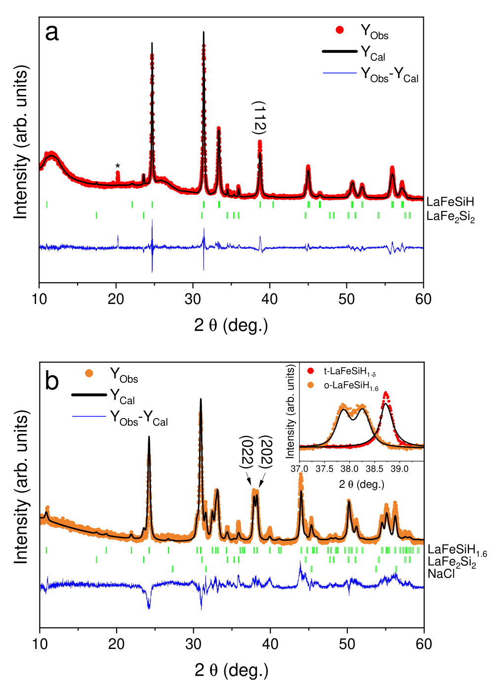
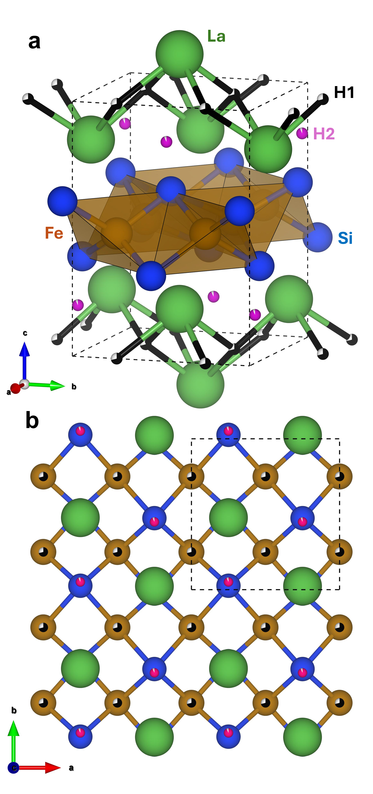
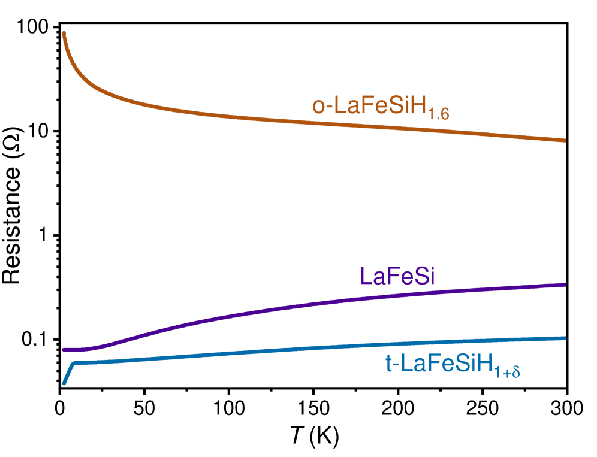

# 侵入型軽元素が鉄の電子状態を変革する：LaFeSiHの過水素化が示す超伝導–半導体転換とFe–N系化合物への示唆

- **執筆日**: 2026-04-28
- **トピック**: 鉄系化合物への軽元素侵入型添加（H・N・C）と物性変調——LaFeSiHの過水素化が提起する超伝導消滅・直方晶相安定化の問い
- **タグ**: Superconductivity and Strongly Correlated Systems / Defects and Impurities; Low-Dimensional Materials / Neutron Scattering; First-Principles Calculations
- **注目論文**: arXiv:2604.20716 (M. F. Hansen et al., 2026)
- **参照論文数**: 6本

---

## 1. なぜ今この話題なのか

鉄系超伝導体は2008年の発見以来、銅酸化物超伝導体に並ぶ高温超伝導の主役として精力的に研究されてきた。LaFeAsOを嚆矢とするこの物質群の最大の特徴は、FePn（Pn = pnictide: As, P, Sbなど）層を舞台とした多バンド超伝導と、化学組成の微調整によって物性が劇的に変わる敏感さにある。電子ドーピング・正孔ドーピングが超伝導転移温度 $T_c$ を制御するだけでなく、圧力・磁場・格子歪みが超伝導を消滅・復活させる現象が次々と報告されてきた。

この文脈で注目に値するのが、**侵入型軽元素添加（interstitial light-element doping）** の手法である。軽元素（H・N・C・B・F・O）が格子間隙に入り込むことで、鉄原子の局所的な電子状態と格子定数が同時に変調され、磁性・超伝導・半導性といった競合する基底状態が切り替わる。これは化学置換とは本質的に異なる制御機構であり、格子点に別原子を置く「置換ドーピング」では届かない超過ドーピング領域にアクセスできる点が最大の利点である。

鉄系磁性材料の世界でも同様の論理が長らく研究されてきた。Fe₁₆N₂ は窒素が鉄格子の八面体間隙に規則配列することで巨大飽和磁化（理論値 2.9 μ_B/Fe）が現れる可能性が議論されており、NdFe₁₂N のような ThMn₁₂ 型窒化物では窒素侵入が磁気異方性を大幅に増強する。鉄–窒素（Fe–N）系で長年問われてきた「軽元素が鉄の 3d 電子状態にどう影響するか」という問いは、鉄系超伝導体における**水素侵入の効果**と本質的に同じ問いである。

こうした流れの中で、2026 年 4 月に提出された Hansen et al.（arXiv:2604.20716）は、鉄系超伝導シリサイド LaFeSiH に対して「過水素化（over-hydrogenation）」を行い、これまで存在が知られていなかった**直方晶相 LaFeSiH₁.₆** の合成に成功した。この相は超伝導体である正方晶 LaFeSiH とは全く異なる半導体的電子状態を持ち、さらに約 100℃ での加熱によって H が脱離して再び超伝導体に戻るという可逆性まで示した。本論文は、侵入型軽元素の量が相の安定性と電子基底状態を決定するという普遍的法則の鮮明な実証例であり、同様の効果が Fe–N 系でどこまで成立するかを考える上で重要な比較対象を与えてくれる。

---

## 2. 未解決問題は何か

鉄系化合物への軽元素侵入型添加が提起する未解決問題は、大きく三つに整理できる。

**問い① 軽元素の格子間サイトはどこにあるのか？**
LaFeSiH の初期の研究では、H 原子は [Fe₂Si₂] 層と La 層の中間的な位置（Si–H–Si 配置）に収まると提案されていた。しかし LaFeSiH₁.₆ に現れる「第 2 の H サイト」の正確な位置は、軽元素を識別しにくい X 線回折だけでは決定できない。中性子回折が必須となる。同様の問題は Fe–N 系でも存在し、Fe₁₆N₂ における N サイトの正確な占有率と配置が巨大磁化の真偽に直結している。

**問い② 軽元素量が増えると超伝導はなぜ消えるのか？**
H ドーピングが増えると単にキャリア濃度が変わるだけでなく、格子構造そのものが変化し、フェルミ面トポロジーが劇的に変わりうる。LaFeSiH の超伝導ギャップはノーダル構造（節あり）を持つと示唆されており、対称性の低下（正方晶→直方晶）がギャップ構造を崩壊させる可能性もある。また格子間に余分な H が入ることで電子–フォノン結合定数が変化し、Cooper 対の形成が抑制されることも考えられる。どの機構が支配的かはまだ確定していない。

**問い③ Fe–N 系・Fe–H 系の設計原理は共通化できるか？**
鉄系超伝導体と鉄系永久磁石材料は一見遠いように見えるが、どちらも「鉄 3d 軌道の電子状態が軽元素の侵入で変わる」という点で同じ問いを共有している。NdFe₁₂N の窒素侵入が異方性を増強するメカニズムも、LaFeSiH の水素侵入が超伝導を誘起・消滅させるメカニズムも、Fe–X（X = 軽元素）の共有結合性と格子膨張効果で統一的に説明できるかどうかが問われている。

---

## 3. 注目論文の核心

### 合成手法の革新：高圧熱分解法と水素源の選択

Hansen et al.（arXiv:2604.20716）の鍵となる発見は、**水素源の違いが全く異なる相を与える**という驚くべき事実である。著者らは LaFeSi（前駆体）を出発物質とし、高圧・高温条件下（約 1–3 GPa、数百℃）で異なる水素源を用いた合成を行った。アントラセン（C₁₄H₁₀）を水素源として使用すると、従来報告されていた正方晶（tetragonal）の LaFeSiH が得られ、超伝導転移温度 $T_c \approx 10$ K を示した。一方、アンモニアボラン（NH₃BH₃、AB）を水素源として用いると、構造的に歪んだ直方晶（orthorhombic）の新相が生成した。

*図1：高圧合成で得られた二種類の試料のX線回折パターン。(a) アントラセンを水素源とした場合：正方晶LaFeSiH構造に対するRietveld解析（黒線）が観測データ（赤線）を良く再現する。(b) アンモニアボランを水素源とした場合：観測パターン（橙線）は正方晶では説明できず、直方晶構造モデルが必要となる。© Hansen et al. 2026, arXiv:2604.20716, CC BY 4.0*

### LaFeSiH₁.₆ の化学組成と構造

化学分析により、新相は H が過剰に侵入した **LaFeSiH₁₊ₓ**（x ≈ 0.6）、すなわち **LaFeSiH₁.₆** であると同定された。空間群は Pmab（または P 2₁ab）直方晶構造を持ち、正方晶 LaFeSiH の P4/nmm 対称性から四回回転対称性が失われた構造になっている。

重要なのは「第 2 の H サイト（H2）」の発見である。正方晶 LaFeSiH では H 原子は単一の格子間位置に収まっているが、LaFeSiH₁.₆ では追加の H が **La 原子が構成する面内**に侵入していることが、中性子粉末回折（NPD）のリートベルト解析によって確認された。X 線はほぼ H を見えないが、中性子は H（特に D）に対して大きな散乱断面積を持つため、このサイト同定が可能になった。

*図9：LaFeSiH₁.₆の結晶構造モデル（VESTA可視化）。(a) Pmab空間群におけるリートベルト解析結果。La層内にH2サイト（橙色の球）が存在し、このサイトが過水素化相に固有の格子歪みを引き起こしている。(b) a-b面への射影。© Hansen et al. 2026, arXiv:2604.20716, CC BY 4.0*

### 電子状態の劇的転換：超伝導体から半導体へ

電気抵抗の温度依存性の測定が、最も衝撃的な結果を示している。LaFeSi（前駆体）は金属的挙動を示し、正方晶 LaFeSiH はおよそ 10 K で急激な抵抗降下（超伝導転移）を示す。これに対して直方晶 LaFeSiH₁.₆ は低温にかけて抵抗が**増加する半導体的挙動**を示し、超伝導の兆候は全く見られない。

*図4：LaFeSi（前駆体）、o-LaFeSiH₁₊ₓ（過水素化・直方晶相）、t-LaFeSiH₁₊δ（H脱離後の正方晶相）の電気抵抗の温度依存性。直方晶相は低温で抵抗が増大する半導体的挙動を示し、Tc以下での急落（超伝導）が見られない。H脱離後の試料は再び超伝導に戻る。© Hansen et al. 2026, arXiv:2604.20716, CC BY 4.0*

さらに注目すべきは**可逆性**である。LaFeSiH₁.₆ を約 100℃ に加熱すると過剰な H が脱離し（熱重量分析・質量分析で確認）、正方晶の LaFeSiH₁₊δ（δ ≪ 0.6）に戻り、超伝導が復活する。この可逆性は、化学組成という手段で超伝導–半導体転換を制御できることを示す。

---

## 4. 背景と研究史

### LaFeSiH 系の発見と発展

LaFeSiH の発見は 2017 年、Bernardini らによる論文（arXiv:1701.05010、Phys. Rev. B 97, 100504 (2018)）に遡る。この研究は、LaFeAsO のヒ素を珪素に、酸素をランタンに置き換えた形のシリサイド LaFeSi に水素を侵入させると、ピクタイド（As）を含まない新型鉄系超伝導体 LaFeSiH（$T_c \approx$ 11 K）が得られることを報告した。LaFeSiH は LaFeAsO と等構造（P4/nmm 空間群）を持ち、密度汎関数理論による計算で多バンド金属であることが示されており、低温での正方晶–直方晶歪みが単一縞状反強磁性秩序と関連する可能性が示唆された。

磁性・構造の詳細は 2023 年の研究（arXiv:2309.02241、Phys. Rev. B 109, 174523）によって精密化された。⁵⁷Fe メスバウアー分光法・X線および中性子粉末回折・²⁹Si NMR を組み合わせた研究により、LaFeSiH の磁気的・構造的性質が LaFeAsO 型化合物との類似点と相違点を含めて詳細に記述された。同研究は注目論文の実験チームによるものであり、注目論文に登場する ²⁹Si NMR 測定の直接の前身となっている。

超伝導ギャップ構造については、2019 年の muSR・TDO（トンネルダイオード発振器）・DFT 計算を組み合わせた研究（arXiv:1910.13258、Phys. Rev. B 101, 224502 (2020)）が「ノーダル超伝導の証拠」を報告している。磁場侵入長の低温依存性が $T^2$ 以下の挙動を示すことから、ギャップに節（node）があるか、もしくは非常に深い最小値（gap minima）が存在すると解釈された。Fermi 面トポロジーの計算からは $s_±$ 波（偶発的ノード）と $d$ 波の両解釈が可能であり、ギャップ対称性の確定は現時点でも未解決である。

フォノン（格子振動）と電子–フォノン結合については、2023–2024 年の研究（arXiv:2307.12610）が詳細な Raman 分光と DFT 計算による解析を行った。LaFeSiH、LaFeSiO、LaFeSi の Raman 活性モードを比較することで、Fe 支配モードにおいて電子–フォノン結合の増強の兆候が見られ、また LaFeSiH における構造的精妙さ（非中心対称性の可能性）が示唆された。この研究は H・O という異なる軽元素が同じ LaFeSi 骨格に侵入した場合の格子への影響を比較するという、注目論文と同じ問いを違う角度から掘っている。

### Fe–N 系との接続

鉄窒化物の世界でも、侵入型軽元素がつくる物性変化は鉄系超伝導体と本質的に共通の問いを提起している。Fe₁₆N₂ は体心正方晶（bct）構造を持ち、N 原子が Fe の八面体間隙に秩序配列することで 2.5 μ_B/Fe 以上の巨大磁化が実現すると主張される論文が複数ある（arXiv:1211.0551 など）。ただし Fe₁₆N₂ は準安定相であり、高純度単相での合成が困難なため、「巨大磁化」の真偽は今も議論中である。ThMn₁₂ 型構造を持つ NdFe₁₂N（アルゴン雰囲気・高温高圧下で窒素侵入させた系）では、N 侵入が結晶場を変化させることで La などより小さいイオン半径の希土類でも安定なモーメントが得られ、1 MA/m 以上の異方性磁界が実現されることが第一原理計算で示されている（arXiv:1612.04478）。

これらの Fe–N 系の知見と、今回の LaFeSiH → LaFeSiH₁.₆ 転換を並べると、共通のパターンが浮かび上がる。どちらも「軽元素が鉄の第 2 配位圏に侵入し、格子膨張と対称性の変化を引き起こし、鉄 3d 電子の交換相互作用もしくは超伝導ペアリングを変調する」という機構である。ただし磁性と超伝導では、軽元素添加が「磁気秩序の強化」と「超伝導の消滅」という逆方向の効果をもたらしている点も示唆的であり、電子状態の詳細な違いを浮き彫りにしている。

---

## 5. どの解釈が最も妥当か

### H2 サイトの同定は信頼できるか？

中性子粉末回折（NPD）のリートベルト解析という手法は水素位置決定において最も信頼性が高い。H（水素）の核散乱長は $b_H = -3.739$ fm であり負であるが、D（重水素）は $b_D = +6.671$ fm と大きな正値を持つため、重水素化試料を用いれば位置決定が容易になる。本研究では重水素化を行わず通常水素を使用しているが、多数の回折ピークを持つ高分解能 NPD データからのリートベルト解析でも H2 サイトが La 面内にあることは十分に支持される。電子線回折（SAED）によって Pmab 空間群が独立に確認されており、H2 サイトの存在は概ね確実といえる。ただし H2 サイトの正確な占有率（部分占有か全占有か）については、重水素化 NPD による再測定が望ましい。

### 直方晶歪みの起源：H2 侵入か、電子的不安定性か？

LaFeSiH₁.₆ に見られる直方晶歪みの起源として、二つの可能性がある。第一は**構造的・化学的原因**：La 面内に H2 が侵入することで結晶の $a$ 軸と $b$ 軸が非等価となり、四回対称が破れる。これは純粋に化学的な歪みであり、H が入れば必然的に起こる。第二は**電子的不安定性**：一部の鉄系超伝導体では、フェルミ面ネスティングによる電荷・スピン密度波秩序（CDW/SDW）が正方晶–直方晶歪みを引き起こす（LaFeAsO における「磁気誘起構造転移」が典型例）。LaFeSiH₁.₆ でも H2 侵入が Fermi 面形状を変え、何らかの密度波秩序が歪みを安定化している可能性は排除できない。

現時点で入手可能な実験データは、XRD・NPD・NMR であり、磁気秩序の直接証拠（中性子磁気散乱ピークなど）は報告されていない。²⁹Si NMR スペクトルで高周波側に肩のピーク（shoulder）が現れることは、局所環境の不均一性（二つのSiサイト）の存在を示唆するが、磁気秩序の有無については判断材料が不十分である。**より妥当な解釈は「構造的H2侵入が主原因」**であるが、電子的な付随効果の存在を否定するためには、低温中性子磁気散乱測定・ μSR・メスバウアー分光が必要である。

### なぜ半導体的挙動が現れるのか？

LaFeSiH₁.₆ の電気抵抗が低温で増大するという「半導体的挙動」の解釈も議論が残る。選択肢は三つある：(1) **バンドギャップの開口**：直方晶歪みが Fermi 面を分割し、絶縁体的なギャップが生じる；(2) **局在化**：余分な H がランダムポテンシャルを導入し、Anderson 局在を引き起こす；(3) **電荷密度波**：Fermi 面ネスティングによる CDW が Fermi 面を部分的に消失させる。

注目論文の抵抗データは活性化型（$R \propto \exp(\Delta/k_BT)$）のフィッティングを示していないため、真のバンドギャップ絶縁体ではなく、Anderson 局在か弱局在の可能性が高い。格子間 H₂ のランダム占有（La 面内の特定サイトへの部分的・無秩序な侵入）がポテンシャル散乱源として機能していると考えるのが現時点では最も自然な説明である。これは Fe–N 系との比較でも参考になる：Fe₁₆N₂ で N が無秩序に配列した試料は巨大磁化を示さず、秩序配列が必須であることが知られており、「侵入元素の規則性」が物性を大きく左右することが共通している。

### Fe–N との類比：類似点と相違点

LaFeSiH（超伝導）→ LaFeSiH₁.₆（半導体）の転換は、Fe–N 系との類比で理解を深めることができる。α-Fe（金属）→ Fe₄N（磁性金属）→ Fe₃N（磁性絶縁体）という窒素量増加に伴う転換は、同じく「軽元素量が電子状態を決める」という原理の表れである。ただし重要な違いがある：LaFeSiH 系では H が共有結合性よりもイオン的に La 面の空洞を埋める形で侵入するのに対し、Fe–N 系では N が Fe との共有結合を形成し、3d 軌道への直接の電子寄与（電子のバンド幅変化）が支配的である。この違いが、超伝導系での「H 量増加 → SC 消失」と磁性系での「N 量増加 → 磁気モーメント変化」という異なる形で現れていると考えられる。

---

## 6. 何が一般化できるのか

### 「過ドーピング相」という新しい物性探索の地平

注目論文が示した最も普遍的な教訓は、**水素やその他の軽元素の「過ドーピング（over-doping）」によって新規相が安定化しうる**という事実である。これまでの鉄系超伝導体研究では、化学組成の微調整によって最適ドーピング付近を探索することが主流だったが、大過剰の軽元素を投入する「過剰ドーピング」領域は技術的困難から十分に探索されていなかった。高圧熱分解法（ammonia borane などの水素リッチ前駆体の使用）という合成手法の革新がこの探索を可能にした。

同様の手法は、LaFeSiX 系の X = N（窒素），C（炭素），B（ホウ素）への展開が期待される。また ThMn₁₂ 型の SmFe₁₂N や NdFe₁₂N にも「過窒化」の試みが有効かもしれない。窒化の過剰投入が磁気異方性をさらに強化するのか、それとも LaFeSiH₁.₆ と同様に物性の消失・逆転をもたらすのかは、Fe–N 系の磁石材料設計において根本的な設計指針を与える問いとなる。

### 可逆的物性切り替えの応用可能性

LaFeSiH₁.₆ が約 100℃ の穏やかな加熱で超伝導相に「戻る」という可逆性は、応用的にも興味深い。水素吸蔵材料の観点では、このような材料系が「H を可逆的に吸脱着しながら電子状態を切り替えるスイッチング材料」として機能しうることを示唆している。Fe–N 系でも、窒素の吸脱着を可逆的に制御できれば磁気状態のスイッチングが実現する可能性があるが、一般に窒素の脱離温度はずっと高く（数百℃）、H ほど穏やかな条件では実現しない。

---

## 7. 基礎から理解する

### 鉄系超伝導体とは何か

2008 年に細野秀雄らによって発見された鉄系超伝導体（iron-based superconductors）は、「磁性元素である鉄が超伝導の舞台になりうる」という常識を覆した存在である。もともと超伝導は磁場によって壊されることが知られており（Pauli 限界・軌道効果）、磁性と超伝導は相容れないと長らく信じられていた。しかし鉄系超伝導体では、FeAs 層や FeSe 層を中心とした「鉄の電子が Cooper 対を組む」機構が働いており、磁気揺らぎ（magnetic fluctuations）がペアリングの糊として機能するという「磁気媒介超伝導」が有力視されている。

代表的な鉄系超伝導体の構造は、FeAs（またはFeSe）の四面体配位層と絶縁性スペーサー層が交互に積層した層状構造をとる。LaFeSiH はこの範疇の中で特異な位置を占める：ヒ素（As）の代わりに珪素（Si）、そして LaO スペーサーの代わりに水素（H）が格子間に侵入するという形で、**ピクタイドを使わない鉄系超伝導体**として 2017 年に発見された。

### バンド理論と多バンド超伝導

金属・半導体・絶縁体の区別はバンド理論（Bloch の定理に基づく周期ポテンシャル中の電子の波動関数の解析）によって理解できる。固体中では電子のエネルギーは連続ではなく「バンド」と呼ばれるエネルギー帯に分かれており、バンドとバンドの間には禁止された領域（バンドギャップ、あるいは禁制帯）が存在する。電子がバンドギャップを挟んで価電子帯を完全に充填し、伝導帯が空の場合が絶縁体（ギャップ ≳ 3 eV）または半導体（ギャップ ≲ 3 eV）であり、伝導帯の一部が電子で充填された場合が金属である。フェルミ準位（$E_F$）が存在するエネルギーにおけるフェルミ面の形状が、金属の電気的・磁気的・超伝導的性質を支配する。

鉄系超伝導体では複数のバンドがフェルミ準位を横切るため、「多バンド（multiband）超伝導」が実現する。鉄の $3d$ 軌道は 5 つ（$d_{xy}, d_{xz}, d_{yz}, d_{x^2-y^2}, d_{z^2}$）あり、Fe-As（もしくは Fe-Si）の結晶場とスピン軌道相互作用によってエネルギーが分裂する。LaFeSiH の計算では、ブリルアンゾーンの Γ 点（中心）近傍に正孔バンドが、M 点（端）付近に電子バンドが存在し、それらのネスティング（Fermi 面の平行な部分同士の入れ子構造）が磁気揺らぎを誘起して超伝導ペアリングを促進すると考えられている。

### 超伝導の BCS 理論とギャップ対称性

古典的な超伝導（BCS 超伝導）では、フェルミ準位付近の電子がフォノン（格子振動の量子）を媒介として引き合い、「Cooper 対」を形成する。Cooper 対はボース粒子としてふるまい、ボース–アインシュタイン凝縮に類似したマクロな量子状態（超伝導凝縮）を形成する。この凝縮は、フェルミ面上に「超伝導ギャップ $\Delta$」が開くことによって記述される。BCS の $s$ 波超伝導ではギャップが等方的（フェルミ面上のすべての方向で同じ大きさ）だが、高温超伝導体や鉄系超伝導体では異方的（方向によってギャップの大きさが変わる）か、ノーダル（特定の方向でギャップがゼロになる節：node を持つ）ギャップが現れることが多い。

LaFeSiH の muSR 研究（arXiv:1910.13258）は磁場侵入長 $\lambda(T)$ の低温挙動が

$$\lambda^{-2}(T) \propto 1 - \alpha \left(\frac{T}{T_c}\right)^n$$

という形で $n < 2$ に対応する振る舞いを示すと報告した。完全ギャップの $s$ 波では $n \gg 2$（指数的収束）が期待されるため、$n \approx 2$ 以下の観測はノーダルギャップの状況証拠とされる。このギャップ対称性の問題は、LaFeSiH₁.₆ において直方晶歪みによってどのように変化するかという問いと直結しており、注目論文が開いた次の研究課題である。

### 侵入型元素と格子の相互作用

侵入型元素（interstitial element）とは、格子点（原子の正規位置）ではなく格子間の空き空間に入り込む不純物・添加元素のことである。体心立方（bcc）や面心立方（fcc）の鉄格子では、八面体間隙（octahedral interstice）と四面体間隙（tetrahedral interstice）が存在する。Fe-C（鉄–炭素）系は侵入型元素の最も身近な例であり、C 原子が八面体間隙に入ることでフェライト（bcc-Fe）が硬化するパーライト・マルテンサイト変態が引き起こされる。Fe-N 系でも同様で、N が八面体間隙に規則的に配列した Fe₄N や Fe₁₆N₂ が生成する。

LaFeSiH 系における H の侵入は、これらの鉄–軽元素系とは幾何学的に異なる。H は最小の原子であり、LaFeSiH の[Fe₂Si₂]層と La 層に挟まれた空間に収まる。LaFeSiH₁.₆ の「H2 サイト」は、より詰まった La 面内の間隙（より狭い空間）への侵入であり、これが La–La 間距離を広げることで直方晶歪みが生じると解釈できる。

格子間元素が入ることで生じる格子膨張は、電子バンドの幅（bandwidth）と結晶場分裂を変化させる。一般に格子膨張は Fe–Fe 間距離の増大を意味し、d 軌道の重なりが減って bandwidth が狭くなる。これは相関効果（電子–電子斥力の相対的増大）を増強する方向に働き、絶縁化・局在化・磁気モーメントの増大を引き起こしやすくする。LaFeSiH₁.₆ の半導体的挙動も、格子膨張による bandwidth の縮小と関連している可能性がある。

### 中性子回折：軽元素位置決定の決め手

水素は X 線に対してほぼ透明（原子番号 Z = 1 で電子散乱断面積が極めて小さい）だが、中性子に対しては有限の核散乱長を持ち、原則的に位置決定が可能である。中性子粉末回折（NPD）は多結晶試料に対して行われ、ブラッグ反射の d 間隔と強度を分析するリートベルト法によって、単位胞内の全原子の位置と占有率が同時に精密化できる。LaFeSiH₁.₆ の H2 サイトが La 面内にあることが NPD で示されたことは、この手法の威力を示す好例である。

---

## 8. 専門用語の解説

**侵入型元素（interstitial element）**：格子点（正規の原子位置）ではなく、格子間の空き空間（格子間隙）に入り込む元素のこと。一般に原子半径の小さい H・C・N・B・O が侵入型元素となりやすい。本論文では H が LaFeSi の格子間に入ることで LaFeSiH が生成し、さらに La 面内の H2 サイトへの侵入が LaFeSiH₁.₆ を生じる。

**空間群（space group）**：結晶の対称性を記述する数学的な枠組みで、三次元空間中の並進・回転・反射・らせん軸・映進面などの対称操作の組み合わせによって分類される。全部で 230 種類が存在する。正方晶 LaFeSiH は P4/nmm（四回回転軸を持つ）、直方晶 LaFeSiH₁.₆ は Pmab（二回回転軸のみ）であり、H₂ の侵入によって四回対称が破れた。

**直方晶歪み（orthorhombic distortion）**：正方晶（$a = b \neq c$）の結晶において、$a \neq b$ となる対称性の低下。鉄系超伝導体では反強磁性秩序の出現に伴って自発的に生じることが多く（magnetostructural coupling）、本論文では H2 侵入という化学的原因によって引き起こされている可能性が高い。

**ノーダル超伝導（nodal superconductivity）**：超伝導秩序パラメータ（ギャップ $\Delta$）がフェルミ面上のある方向でゼロとなる「節（node）」を持つ超伝導状態。$d$ 波（銅酸化物に典型）や $s±$ 波（鉄系に多い）がノーダル超伝導の代表例。LaFeSiH では muSR 測定からノーダル or 深い最小値をもつギャップが示唆されている。

**フェルミ面ネスティング（Fermi surface nesting）**：フェルミ面の異なる部分が特定の波数ベクトル $\mathbf{Q}$ だけ平行移動して重なり合う現象。ネスティングが良いと、$\mathbf{Q}$ 波数での磁気揺らぎや密度波秩序（SDW/CDW）が生じやすくなる。鉄系超伝導体では Γ 点（正孔ポケット）と M 点（電子ポケット）のネスティングが磁気媒介超伝導ペアリングと関連している。

**電子–フォノン結合（electron-phonon coupling）**：電子とフォノン（格子振動）の相互作用。BCS 型超伝導の Cooper 対形成の元になる引力相互作用であり、結合定数 $\lambda_{ep}$ が大きいほど高い $T_c$ が期待できる。arXiv:2307.12610 は LaFeSiH の Raman モードに電子–フォノン結合増強の兆候を報告している。

**高圧合成（high-pressure synthesis）**：数 GPa 以上の高圧を用いて熱力学的平衡を変化させ、常圧では安定化しない相を合成する手法。本論文では 1–3 GPa の高圧下でアンモニアボランを H 源として分解し、LaFeSiH₁.₆ を合成している。Fe–N 系の合成でも高圧法は重要で、高圧 N₂ 雰囲気での窒化処理が用いられる。

**中性子粉末回折（neutron powder diffraction, NPD）**：中性子線を多結晶試料に照射し、回折パターンから結晶構造を解析する手法。X 線回折と異なり、核散乱断面積が原子番号に依存しないため、軽元素（H・Li・B など）の位置決定が得意。本論文では H2 サイトの決定に NPD を用いた。

**Cooper 対（Cooper pair）**：超伝導状態において、フェルミ面近傍の二つの電子が引力相互作用を介して結合した状態。スピン一重項（$\uparrow\downarrow$、総スピン $S = 0$）または三重項（$S = 1$）の対を形成し、ボース統計に従うことで超伝導凝縮が生じる。BCS 理論では引力はフォノンによって媒介されるが、鉄系超伝導体では磁気揺らぎによる媒介も強く議論されている。

**ThMn₁₂ 型構造**：Th位置の希土類元素 R と Mn 位置の Fe から構成される金属間化合物 RFe₁₂ の原型的な結晶構造。正方晶（I4/mmm）を持ち、Fe の 12 個が R の周りを囲む高密度配置をとる。NdFe₁₂N ではこの構造に N が侵入して格子が膨張し、Nd の 4f 電子の結晶場が変化して巨大磁気異方性が現れる。LaFeAsO 型（鉄系超伝導体）と並んで、軽元素侵入型添加が物性制御の鍵となる重要な構造類型である。

---

## 9. 今後の展望

注目論文が確立した最大の成果は、**LaFeSiH₁.₆ という新規直方晶相の存在とその可逆的 H 脱離挙動**である。H₂ サイトの La 面内への侵入という事実は、中性子回折によって相当の根拠を持って示されており、この相の物性が LaFeSiH とは本質的に異なること（半導体的挙動・超伝導の消失）も電気抵抗測定で明確である。一方で、超伝導が消滅する機構（局在化 vs バンドギャップ vs 密度波）、直方晶歪みの電子的原因の有無、ノーダルギャップが直方晶相でどう変化するかは未確定のままである。これらについては、低温磁気中性子散乱・muSR・低温 STM などの実験が次のステップとして必要である。

今後 1〜3 年で注目すべき論点は、まず**H 量の連続的制御と相図の完成**である。x = 0（LaFeSi）から x = 1（LaFeSiH）を経て x = 1.6（LaFeSiH₁.₆）へと至る H 量の連続変化に対して、どの組成域で超伝導が現れ、どこで半導体相が安定化するのかという相図を描くことが急務である。次に、**窒素・炭素侵入型類縁体の合成**が重要な展開方向である。LaFeSiN や LaFeSiC が存在するならば、それらは鉄系超伝導体の新たな一員となりうるし、同一構造での H/N/C 比較が Fe–軽元素結合の普遍的理解を与えてくれる。Fe–N 系磁石材料設計にとっても、「過窒化」状態が安定化するか、それとも LaFeSiH₁.₆ と同様に物性消失をもたらすかの実験的解答は、高エネルギー密度磁石の探索において実質的な指針となるだろう。

---

## 参考論文一覧

1. **[arXiv:2604.20716]** M. F. Hansen, C. Lepoittevin, J.-B. Vaney, P. Boullay, V. Nassif, A. Sulpice, H. Mayaffre, M.-H. Julien, S. Tencé, P. Toulemonde, "Stabilization of a non-superconducting, orthorhombic phase by over-hydrogenating LaFeSiH," *arXiv* (2026). [https://arxiv.org/abs/2604.20716](https://arxiv.org/abs/2604.20716)
   —高圧熱分解法によって LaFeSiH₁.₆（直方晶、半導体的挙動）を初めて合成し、中性子回折で H2 サイトの La 面内位置を決定した本論文の注目論文。

2. **[arXiv:1701.05010]** F. Bernardini, G. Garbarino, A. Sulpice, M. Núñez-Regueiro, E. Gaudin, B. Chevalier, M.-A. Méasson, A. Cano, S. Tencé, "Iron-based superconductivity extended to the novel silicide LaFeSiH," *Phys. Rev. B* 97, 100504(R) (2018). [https://arxiv.org/abs/1701.05010](https://arxiv.org/abs/1701.05010)
   —LaFeSiH（Tc ≈ 11 K）を初めて報告し、ピクタイド不要の鉄系超伝導体という新クラスを開いた発見論文。

3. **[arXiv:2309.02241]** C. Lepoittevin, J.-B. Vaney, H. Mayaffre, M.-H. Julien, S. Tencé, P. Toulemonde et al., "Magnetic and structural properties of the iron silicide superconductor LaFeSiH," *Phys. Rev. B* 109, 174523 (2024). [https://arxiv.org/abs/2309.02241](https://arxiv.org/abs/2309.02241)
   —⁵⁷Fe メスバウアー・X線/中性子回折・²⁹Si NMR を組み合わせて LaFeSiH の磁気・構造特性を詳細に解析した、注目論文の直接的前身研究。

4. **[arXiv:1910.13258]** A. Bhattacharyya, P. Rodière, J.-B. Vaney, P. K. Biswas, A. D. Hillier, A. Bosin, F. Bernardini, S. Tencé, D. T. Adroja, A. Cano, "Evidence of nodal superconductivity in LaFeSiH," *Phys. Rev. B* 101, 224502 (2020). [https://arxiv.org/abs/1910.13258](https://arxiv.org/abs/1910.13258)
   —muSR・TDO・DFT 計算により LaFeSiH がノーダル（または深い最小値を持つ）超伝導ギャップを示す証拠を報告した論文。

5. **[arXiv:2307.12610]** S. Layek, M. F. Hansen, J.-B. Vaney, P. Toulemonde, S. Tencé, P. Boullay, A. Cano, M.-A. Méasson, "Lattice dynamics in the FeSi-based family of superconductors," *arXiv* (2023/2024). [https://arxiv.org/abs/2307.12610](https://arxiv.org/abs/2307.12610)
   —LaFeSiH・LaFeSiO・LaFeSi の Raman 分光と第一原理計算で電子–フォノン結合と構造特性を比較し、LaFeSiH の非中心対称的な構造的微妙さを指摘した論文。

6. **[arXiv:1612.04478]** L. Ke, "First-principles study of intersite magnetic couplings in NdFe₁₂ and NdFe₁₂X (X = B, C, N, O, F)," *J. Appl. Phys.* 122, 053901 (2017). [https://arxiv.org/abs/1612.04478](https://arxiv.org/abs/1612.04478)
   —ThMn₁₂ 型 NdFe₁₂ への B・C・N・O・F 侵入の効果を第一原理計算で比較し、N 侵入が磁気異方性を最も大きく増強することを示した Fe–N 系の理論論文。

7. **[arXiv:1211.0551]** M. Zou, Y.-K. Hong, G. Lim, J.-H. Park, M. H. Kim, S.-G. Kim, C. Ito, "Polarized neutron reflectometry study of Fe₁₆N₂ with Giant Saturation Magnetization prepared by N inter-diffusion in annealed Fe-N thin films," *arXiv* (2012). [https://arxiv.org/abs/1211.0551](https://arxiv.org/abs/1211.0551)
   —Fe-N 薄膜の N 拡散焼鈍によって Fe₁₆N₂ を作製し、偏極中性子反射率測定で巨大飽和磁化を報告した実験論文。Fe–N 系の磁性における侵入型 N の効果を示す代表例。
