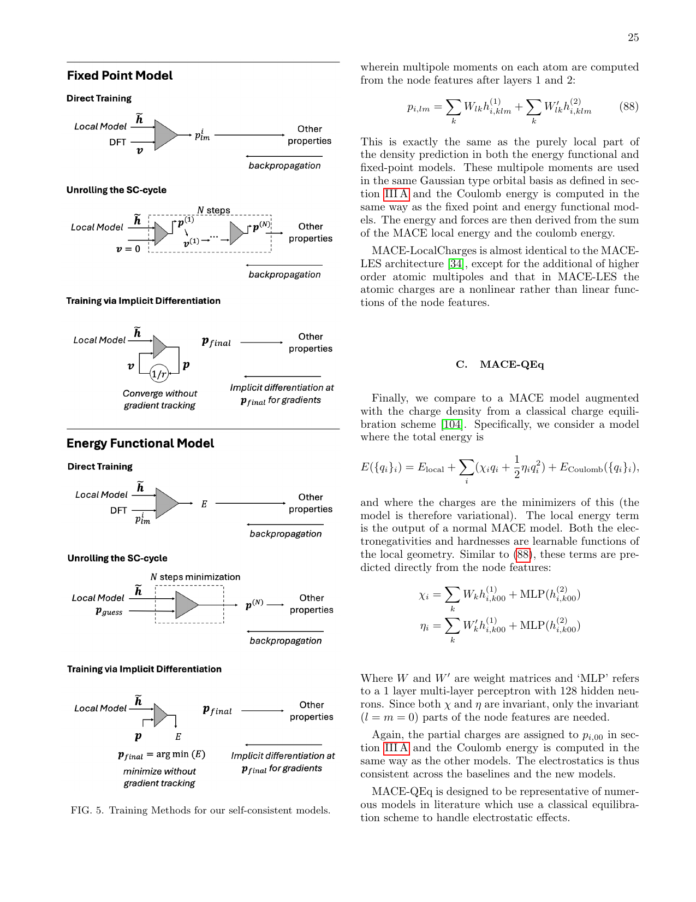
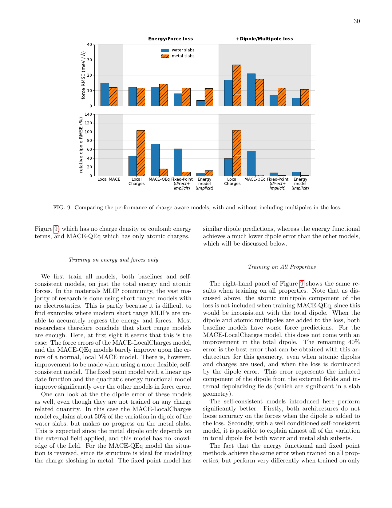
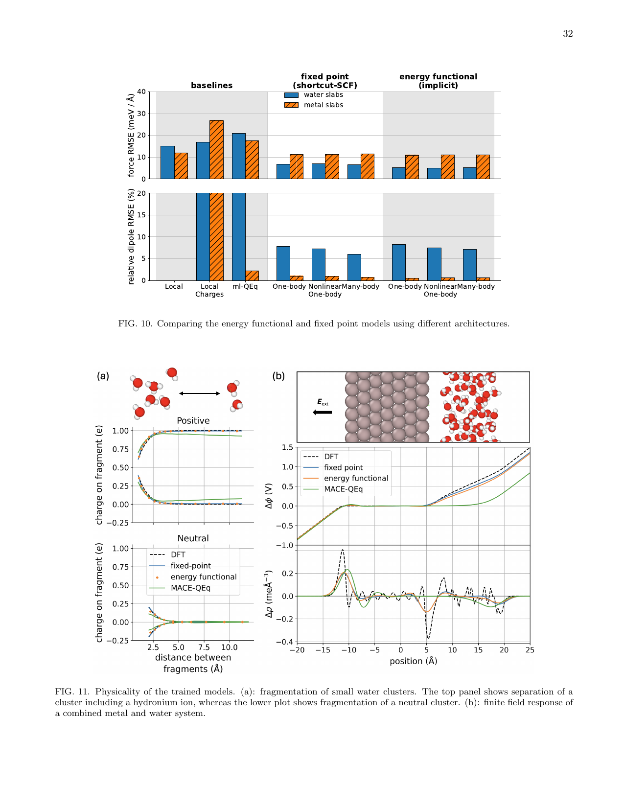
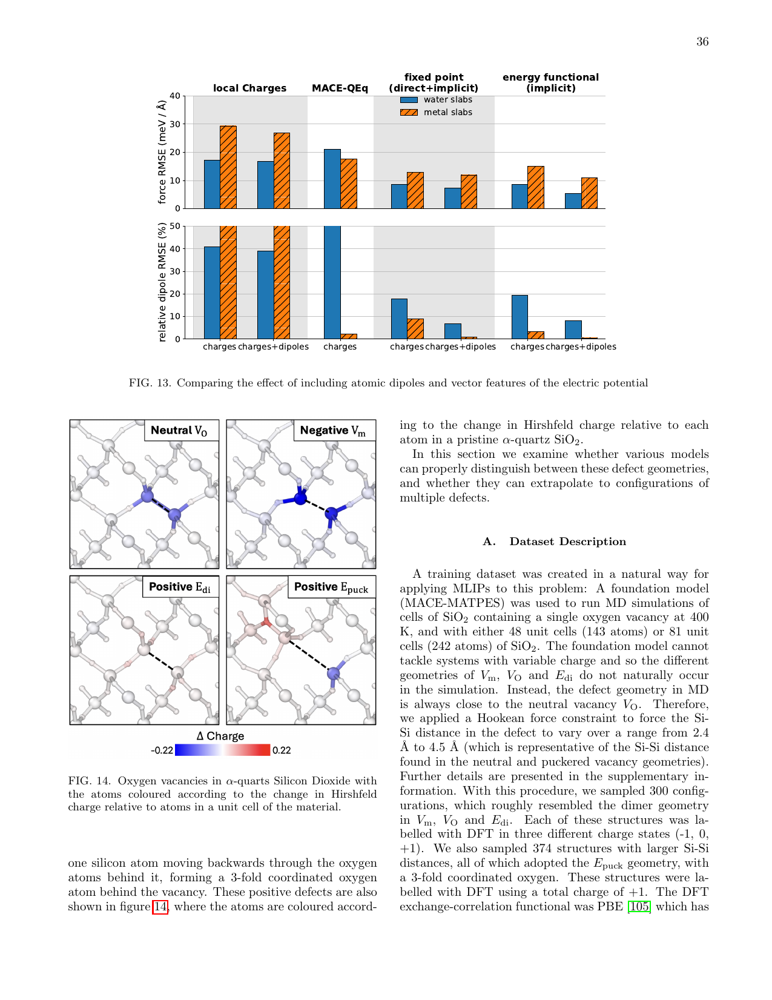
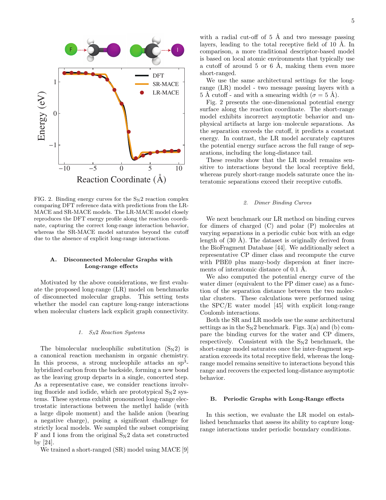
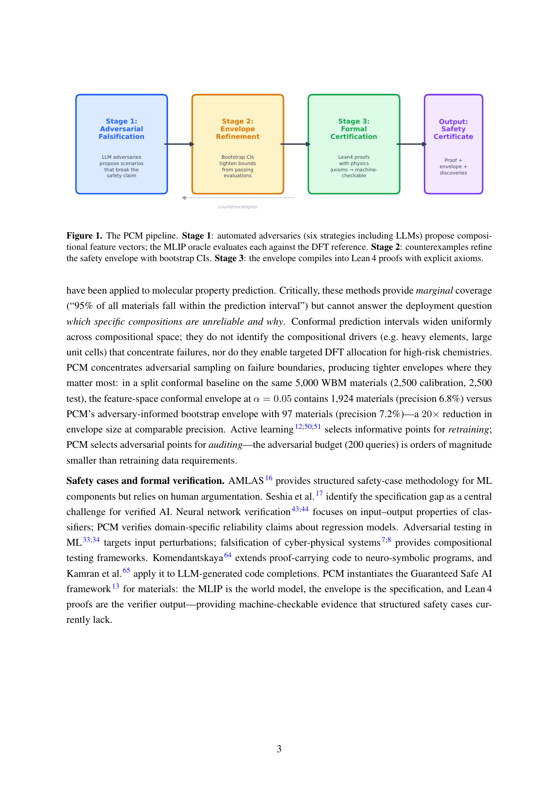

# MACE基盤ポテンシャルの限界に挑む：長距離静電相互作用の自己無撞着な取り込み

- **執筆日**: 2026-04-06
- **トピック**: 機械学習インターアトミックポテンシャル（MLIP）における長距離静電相互作用の記述と設計空間
- **タグ**: Computation and Theory / Defects and Impurities; Thin Films and Interfaces / Machine Learning; Molecular Dynamics
- **注目論文**: W.J. Baldwin, I. Batatia, M. Vondrák, J.T. Margraf, G. Csányi, "Design Space of Self-Consistent Electrostatic Machine Learning Interatomic Potentials," arXiv:2603.14700 (2026)
- **参照関連論文数**: 8本

---

## 1. なぜ今この話題なのか

2022年にMACE（Multi-Atomic Cluster Expansion）が登場して以来、機械学習インターアトミックポテンシャル（MLIP: Machine Learning Interatomic Potential）の分野は急速に成熟した。MACEは等変グラフニューラルネットワークを用いた高次のボディオーダーメッセージパッシングにより、量子力学的な精度を保ちながら古典分子動力学シミュレーションに匹敵する高速計算を実現した。今日では、MACEを基盤とした「基盤モデル（foundation model）」——すなわちMACE-MP-0やMACE-OMAＴのような、元素の周期表全体をカバーする汎用ポテンシャル——が次々と公開されており、材料設計から界面科学、電池材料まで幅広い分野で活用されている。

しかし、この急速な普及の陰で、ひとつの根本的な問題が置き去りにされてきた。それは**長距離静電相互作用の記述**である。

現在の多くのMLIPは、原子の局所化学環境（通常半径5〜6 Åの球内）だけに依存して原子に力を割り当てる「短距離近似」を前提としている。分子結晶やイオン結晶のような絶縁体系では、この近似がある程度成立する局面もある。だが実際の凝縮系では、静電相互作用は原子間距離の逆数（$1/r$）に従ってゆっくりと減衰するため、系全体の電荷分布が局所的な力に影響を与える。金属と水の界面では電子が水分子に移動し、正電荷や負電荷を帯びた点欠陥を含む半導体中では電荷が空間的に再分布し、高濃度電解質中では大きなイオン対が形成される。こういったシステムでは、局所的な幾何学情報だけから電荷を推定する短距離近似は本質的な誤差を生む。

もっとも研究者たちがこの問題に無知だったわけではない。古典力場の時代から電荷平衡法（QEq: Charge Equilibration）が知られていたし、近年はMLIPにも長距離相互作用を組み込む試みが行われてきた。しかし、それらの手法が何を近似しているか、どのような条件で失敗するか、また設計上の選択肢にはどのようなものがあるかを体系的に整理した研究は乏しかった。

そこへ2026年3月、MACEの開発者の一人であるIlyes Batatia、Gábor Csányi（ケンブリッジ大学）らのグループが、自己無撞着静電MLIPの「設計空間」を系統的に分析した論文を発表した（arXiv:2603.14700）。この論文は、既存の手法が密度汎関数理論（DFT）への粗視化近似として統一的に理解できることを示し、MACE アーキテクチャ上での具体的な実装・比較評価を通じて、長距離静電記述の限界と可能性を浮き彫りにした。MACEコミュニティが次のステップへ踏み出すための「地図」を提供したという点で、この論文はタイムリーかつ重要である。

---

## 2. この分野で何が未解決なのか

長距離静電相互作用をMLIPに組み込む問題には、互いに絡み合ういくつかの本質的な問いがある。

**問1：電荷はどのように定義すべきか？**　原子中心の点電荷だけで十分か、それとも双極子や四重極子といった多極子モーメントまで必要か。この問いはMLIPの表現力と計算コストのトレードオフに直結する。点電荷モデルは実装が容易だが、電荷分布の非球対称性（異方性）を捉えられない。一方、高次多極子を含むモデルは表現力が高いが、学習と推定のコストが急増する。

**問2：自己無撞着性はどの程度必要か？**　古典的なQEqでは、電荷が電気ポテンシャルを生み出し、その電気ポテンシャルが電荷を決める——という自己無撞着（self-consistent）なサイクルを解く。MLIPでも同様のサイクルが必要なのか、あるいは単純な「固定点（fixed-point）」手法（1回だけ更新して終わり）でも十分なのか。これは精度と計算効率に関わる重要な問いである。

**問3：エネルギー汎関数モデルと固定点モデルのどちらが優れているか？**　自己無撞着モデルには大きく2つの立場がある。一つは電荷がエネルギー汎関数を最小化するような「エネルギー汎関数モデル」で、もう一つは固定点反復（fixed-point iteration）で電荷を収束させる「固定点モデル」である。前者はDFTとのアナロジーから物理的に自然だが、訓練が難しい。後者はより柔軟だが、収束の保証が弱い。どちらが実用的に優れているかは、まだ議論が続いている。

**問4：MLIPの信頼性はどう担保するか？**　単に精度が高いだけでなく、材料スクリーニングや設計に用いる際にMLIPがどこで失敗するかを事前に知ることが重要である。特に、学習データの外側の組成や状態（out-of-distribution）でのモデル挙動、そして複数のMLIP間での予測の不一致は大きな問題である。MACE・CHGNet・TensorNetなど3種類のMLIPで同一材料への予測が全く相関しない事例（$r \leq 0.13$）が報告されており（Basu & Chakraborty, arXiv:2603.12183）、モデルの信頼性評価は急務となっている。

---

## 3. 注目論文の核心：何が前進し、何がまだ仮説か

Baldwin ら（2603.14700）の論文は、自己無撞着静電MLIPの設計空間を「密度汎関数理論の粗視化近似」という統一的な視点から整理し、MACEアーキテクチャ上で複数のモデルを実装・比較することで、長距離静電相互作用の記述における限界と可能性を明らかにした。

### DFTとの対応による統一的な理解

この論文の最も重要な理論的貢献は、既存の自己無撞着モデルを「DFTのコロンブエネルギーへの粗視化近似」として統一的に記述したことである。DFTでは、電子密度 $n(\mathbf{r})$ から電気ポテンシャル $v(\mathbf{r})$ が定まり、そのポテンシャルが再び電子密度を決める——という自己無撞着サイクルが解かれる。MLIPにおけるQEqやその改良版は、この連続的な電子密度 $n(\mathbf{r})$ を原子中心の電荷 $q_i$（点電荷）や多極子モーメントに「粗視化」したものとして解釈できる。この観点から著者らは、各手法の暗黙の仮定と有効範囲を明示した。

電荷密度のモデル化において、最もシンプルな選択は原子上の点電荷だが、より精密な表現として著者らはMACEアーキテクチャを用いた多極子（多体電荷密度）への拡張を実装した。具体的には、MACEの特徴量 $\mathbf{h}$ から原子の多極子モーメント $\mathbf{p}_i = [q_i, \boldsymbol{\mu}_i, ...]$ を予測し、それを用いてクーロンエネルギーを計算する。電気ポテンシャルは電荷密度から決まるので、

$$V_{\text{elec}}(\mathbf{r}) = \int \frac{\rho(\mathbf{r'})}{|\mathbf{r} - \mathbf{r'}|} d\mathbf{r'}$$

というクーロン積分（周期系ではEwald加算で計算）を通じてエネルギーが定まる。この$V_{\text{elec}}$が再び次のステップでの電荷予測に入力されることで、自己無撞着サイクルが成立する。

### 3種類の実装：固定点モデル vs エネルギー汎関数モデル

著者らはMACEアーキテクチャ上で以下の3種類のモデルを実装し比較した（図5参照）。

**図1**　自己無撞着MLIPの3種類の訓練方法。上段（固定点モデル）：直接訓練、SCサイクルを展開した訓練、陰的微分を用いた訓練。下段（エネルギー汎関数モデル）：各手法でのエネルギー最小化との対応。(Baldwin et al., arXiv:2603.14700, CC BY 4.0)

**固定点モデル（Fixed Point Model）**は、電荷 $q_i^{(n+1)} = F_{\text{ML}}(q_i^{(n)}, \{R\})$ という繰り返し写像を通じて電荷を収束させる。これはQEqの直接的な拡張であり、エネルギーが陽には定義されない。訓練は3通りの方法で行える：収束した電荷から直接学習する「直接訓練」、SCサイクルを展開（unrolling）して勾配を逆伝播する「展開訓練」、および陰的微分定理を用いた「陰的微分訓練」。

**エネルギー汎関数モデル（Energy Functional Model）**は、全エネルギーが電荷の汎関数として定義される。自己無撞着条件はエネルギーの電荷に関する変分条件から導かれる：$\partial E / \partial q_i = 0$。これはDFTのKohn-Sham方程式のアナロジーであり、物理的に透明な定式化である。訓練の困難は、エネルギー最小化の勾配を効率よく計算する必要がある点にある。

**MACE-QEq**は、上記を既存の古典QEqスキームと組み合わせた参照実装であり、比較のベースラインとして機能する。

### 金属—水界面での検証

第一の検証系として著者らは金属—水スラブ系を選んだ。この系は「導体的」な電気応答をもつ金属と、分極率の高い極性分子である水とが界面を形成するため、静電相互作用の自己無撞着な記述が特に重要な系である。

**図2**　各モデルの力（上段）および相対双極子（下段）のMAEの比較。基準値（Local）、局所電荷含む（LocalCharges）、MACEベースライン（MACE-QEq）、短距離SCF固定点（shortcut-SCF）、エネルギー汎関数（energy functional）の各モデルを比較している。水スラブ（青）と金属スラブ（橙）で挙動が大きく異なることに注意。(Baldwin et al., arXiv:2603.14700, CC BY 4.0)

結果として重要なのは、**力の精度は全モデルで概ね近く、むしろ双極子モーメントの予測において大きな差が出る**という点である。局所電荷のみを用いるモデル（MACE-QEq）は双極子の予測が困難で、固定点モデルやエネルギー汎関数モデルへの移行によって改善が見られた。さらに、**水スラブと金属スラブで最適なモデルの種類が異なる**という興味深い結果も得られた。これは、電気応答の物理的性質（絶縁体的 vs 導体的）に応じて異なるモデルが必要であることを示唆している。

**図3**　訓練済みモデルの「物理性」の検証。(a)小さな水クラスターの分裂：正電荷クラスターと中性クラスターでの電荷の距離依存性。(b)外部電場に対する有限電場応答。エネルギー汎関数モデルと固定点モデルで導体・絶縁体の電場応答の違いが再現できるかが問われる。(Baldwin et al., arXiv:2603.14700, CC BY 4.0)

特に重要な検証として著者らは「有限電場応答」を調べた（図3b）。導体系（金属スラブ）では外部電場に対して電荷が再分布し、双極子応答が長距離でゼロに収束すること（スクリーニング）が期待される。一方、絶縁体系（水スラブ）では電場に比例した一様な分極が期待される。**エネルギー汎関数モデルは原理的に両方の挙動を再現できるが、固定点モデルの挙動はアーキテクチャの詳細に強く依存する**ことが明らかになった。

### 荷電酸素空孔を含むSiO₂での検証

第二の検証系として著者らはα-石英SiO₂中の酸素空孔を選んだ。点欠陥の電荷状態は半導体デバイスの特性に直結する重要な問題だが、全電荷が変化する系でのMLIPの訓練は非自明である。

**図4**　α-SiO₂中の荷電酸素空孔の幾何構造。中性（V₀）、負電荷（Neg. V₀）、正電荷（Pos. E₀）、正電荷パックド（Pos. Epuck）の4種の電荷状態に対応する4種類の構造が存在する。電荷状態に応じてSi-Si距離が2.4〜4.5 Åの範囲で変化する。(Baldwin et al., arXiv:2603.14700, CC BY 4.0)

SiO₂中の酸素空孔は系の全電荷（$-1, 0, +1$ など）が異なる4種類の幾何学構造をとる。重要な点は、**全電荷が変化することで電子構造が根本的に変わるため、短距離近似のMLIPでは異なる電荷状態を正確に区別できない**ことである。エネルギー汎関数モデルを用いると、全電荷に応じた双極子モーメントの空間分布を学習でき、各電荷状態の形成エネルギーや欠陥間相互作用の精度が改善した。ただし著者らは、**単一欠陥の記述では比較的単純なモデルでも機能するが、複数欠陥が共存する場合や広い系での欠陥間相互作用の正確な記述には、より表現力の高い自己無撞着モデルが不可欠**と結論している。

### 何がまだ仮説か

注目論文が「前進した」と主張できるのは上記の点だが、いくつかの重要な点はまだ仮説段階にある。第一に、自己無撞着モデルが**一般的な周期系**（金属、半導体、絶縁体の混合系など）で短距離モデルを一貫して上回るかはまだ示されていない。著者らが示した検証系は比較的「設計された」問題設定であり、現実の材料スクリーニングへの一般化は今後の検証を要する。第二に、**計算コストと精度のトレードオフ**についての定量的な比較が不十分であり、どのモデルをいつ使うべきかの実践的ガイドラインはまだ確立されていない。

---

## 4. 背景と研究史：この論文はどこに位置づくか

MACEが登場した2022年（Batatia et al., arXiv:2206.07697）以前から、MLIPの分野では長距離相互作用の問題は認識されていた。初期のアプローチでは、古典的なQEq（Rappeら、1991年）をMLIPと組み合わせる試みが行われた。QEqは原子の電気陰性度と化学的硬さを用いて系全体のエネルギーを電荷の二次形式で近似し、電荷を変分的に決定するスキームである。しかし古典的なQEqは、電気陰性度と硬さが固定された値（環境によらない）という強い近似を用いているため、金属—電解質界面のような複雑な系では不十分であった。

2019年頃から「第4世代」MLIPとしてHDNN-QEq（Behler）やDimeNet++の電荷拡張版などが登場し、局所的なMLIP特徴量から環境依存の電気陰性度を予測してQEqを解く手法が提案された。これらはMACEの登場と並行して発展し、今日では「メッセージパッシングによる全電荷の考慮」というアイデアは多くの手法に取り込まれている。

MACEの文脈では、2024〜2025年にかけて大規模な基盤モデルが相次いで登場した。MACE-MP-0は元素周期表全体をカバーし、Materials Project由来のデータで訓練された最初の汎用MACEモデルである。続いてMACE-OMAT（Open Materials Atomistic Training）がより大規模な訓練データで学習された。しかし**これらの基盤モデルはいずれも短距離近似のみを採用している**。

この状況に対して、Baldwin ら（2603.14700）は「DFTのコロンブエネルギーへの粗視化」という枠組みで既存のすべての自己無撞着モデルを統一的に整理し、MACE アーキテクチャ上での実装・比較を行った最初の系統的研究として位置づけられる。著者らはこの論文を「設計空間の地図」と表現しており、今後のMACE基盤モデルへの長距離静電相互作用の組み込みの出発点として機能することを意図している。

時期を同じくして、より分子化学寄りの観点から、Batatia ら自身が別ルートを模索した論文が MACE-POLAR-1（arXiv:2602.19411）として発表された。MACE-POLAR-1は、非自己無撞着場形式（non-SCF formalism）を用いて学習可能な電荷・スピン密度を更新する「分極反復（polarizable iterations）」を導入し、OMol25データセット（1億件のハイブリッドDFT計算）で訓練した大規模分子化学向けの基盤モデルである。タンパク質-リガンド相互作用の予測精度が短距離モデルと比べて4倍改善されるなど、分子化学領域での有効性は明確だが、凝縮相材料系への適用は今後の課題である。

また、まったく異なる角度からのアプローチとして、Ramasubramanianら（arXiv:2510.13055）による「逆格子空間注意機構（Reciprocal Space Attention: RSA）」がある。RSAは、逆格子空間（k空間）でのFourier位相符号化を用いて長距離相互作用を明示的に記述する方法で、MACEの短距離ブロックにRSAモジュールを付加する形で実装される。

$$\text{RSA}_m(\mathbf{Q}, \mathbf{K}, \mathbf{V}) \approx \sum_{\mathbf{k} \neq 0} w_{\mathbf{k}} \, \text{FPE}(\phi(\mathbf{Q}_m), \mathbf{r}_m)^\top \sum_{n} \text{FPE}(\phi(\mathbf{K}_n), \mathbf{r}_n) \mathbf{V}_n^\top$$

ここで $w_{\mathbf{k}} = \exp(-k^2 \sigma^2/2)/k^2$ はEwald分解の重みである。この手法は事前に定義された電荷モデルを必要とせず、双極子密度の長波長挙動（$k \to 0$ 極限）を正確に再現できる点が優れている（図5参照）。

**図5**　S_N2反応経路に沿ったエネルギー曲線の比較。長距離モデル（LR-MACE）は反応座標全域でDFTと良好に一致するのに対し、短距離モデル（SR-MACE）はカットオフ半径を超えた距離でエネルギーが飽和する。(Ramasubramanian et al., arXiv:2510.13055, CC BY-NC-ND 4.0)

一方、訓練データの質の問題も無視できない。Warford らはMACE-OMATおよびMACE-MPAが訓練データ（Materials Project）に含まれるHubbard U補正の非一貫な適用によって系統的な誤差を持つことを指摘した（arXiv:2601.21056）。Materials ProjectではFe, Co, Niなどの遷移金属に対して酸素・フッ素が存在する場合のみHubbard U補正（PBE+U）を適用しており、同じ遷移金属でもU補正あり/なしのデータが混在している。これによってモデルは矛盾したエネルギー面を学習し、酸化物触媒や電池電極材料のシミュレーションで系統誤差が生じる。静電相互作用の記述と訓練データの一貫性はセットで解決されるべき問題である。

---

## 5. どの解釈が最も妥当か：証拠・比較・限界

ここで改めて、Baldwin ら（2603.14700）の中心的主張を検討しよう。著者らの主な主張は「**自己無撞着静電MLIPは短距離モデルより優れた電荷・双極子の記述を提供できるが、力の精度の差は限定的であり、系によって最適なモデルが異なる**」というものである。

### 自己無撞着モデルの優位性を支持する証拠

最も説得力のある証拠は金属—水界面での双極子モーメント再現性である。図2に示したように、外部電場に対する水スラブ・金属スラブの応答は、短距離モデル（MACE-QEqも含む）では正確に再現できないが、エネルギー汎関数モデルや多体固定点モデルでは系の物理（絶縁体的/導体的）に対応した応答が得られる。これは自己無撞着サイクルが電荷の物理的な再分布を捉えていることの直接的証拠である。SiO₂の荷電欠陥に関しても、電荷状態の違いに依存した双極子分布の再現は短距離モデルには不可能であり、自己無撞着モデルの必要性を支持する。

MACE-POLAR-1（2602.19411）の結果も間接的な支持を提供する。タンパク質-リガンド相互作用の4倍の精度改善は、長距離静電相互作用の正確な取り込みが精度向上に直結する実際的な証拠である。Brugnolら（arXiv:2603.22099）による高濃度リチウム塩電解質のシミュレーションでも、MACEポテンシャルの基盤モデルをファインチューニングすることで実験的な構造因子と良好な一致が得られており、電解質系でもMACEが有効に機能することが示されている。

### 競合する解釈と手法の比較

一方、RSAアプローチ（2510.13055）は異なる実装哲学を示している。RSAは電荷モデルを定義せず、逆格子空間での注意機構によって長距離相互作用を「学習」する。実装の観点からは、電荷の自己無撞着サイクルを回す必要がないため計算コストが低く、$O(N)$スケーリングを維持できる（Ewald和の$O(N^{3/2})$スケーリングとは対照的）。SN2反応系でのDFTとの一致やリン光体の層間相互作用の再現など、RSAはすでに有望な結果を示しているが、金属—水界面のような「導体的」電荷応答を正確に記述できるかは未検証である。

また興味深いのは、訓練データによって力の精度が大きく左右されるという知見である。Kim ら（arXiv:2604.02524）はハライド電解質材料向けに高温r²SCANデータセット（AQVolt26、32万件）を構築し、既存の基盤モデルを高温変形構造でファインチューニングすることで、イオン輸送特性の予測精度を大幅に改善した。この研究は「長距離静電相互作用の記述方法」の問題と「訓練データのカバレッジ」の問題が密接に絡み合っていることを示している。つまり、自己無撞着静電モデルを使っても、訓練データが不適切なら性能は上がらない。

### 限界と信頼性の問題

Baldwin ら（2603.14700）の研究には重要な限界がある。まず評価した系の数が少なく（金属-水系とSiO₂のみ）、より多様な材料系での検証が必要である。次に、複数欠陥が共存する大規模系での欠陥間相互作用については「より表現力の高いモデルが必要」と示唆するにとどまり、定量的な比較は示されていない。

さらに大きな問題として、Basu & Chakraborty（arXiv:2603.12183）の研究は、MACE・CHGNet・TensorNetという3種類の代表的MLIPが同一材料に対して全く相関しない予測をすることを示した（ペアワイズ力相関 $r \leq 0.13$）。

**図6**　Proof-Carrying Materials（PCM）の3段階パイプライン。Stage 1：対抗的な組成サンプリングによる失敗領域の探索。Stage 2：ブートストラップ法による信頼区間の精緻化。Stage 3：Lean 4による形式的証明。単一のMLIPのみに頼ることの危険性を定量化している。(Basu & Chakraborty, arXiv:2603.12183, CC BY 4.0)

この結果は、電子静電相互作用の記述を改善するだけでなく、複数のMLIPを組み合わせた「アンサンブル審査」と形式的な認証フレームワークが必要であることを示唆する。静電気的に複雑な系（高価な遷移金属酸化物、界面系など）での材料スクリーニングには、Baldwin らの手法と PCM のような検証フレームワークを組み合わせることが実践的に有効だろう。

また、長距離静電相互作用の記述をさらに複雑にする要因として「電子エントロピー」がある。Petersen ら（arXiv:2603.26471）は、Na$_{x}$FePO₄のような混合原子価の電池電極材料では、Fe²⁺とFe³⁺の電荷状態の違いを通常のMLIPでは区別できないため、中間 Na 濃度での安定性が正確に予測できないことを示した。彼らはMACEの訓練に電荷状態情報を明示的に取り込むことで、この問題を部分的に解決できることを示している。これは Baldwin らの論文が扱う「電荷の自己無撞着な記述」の問題と直結しており、電池材料への応用を目指す上で不可欠な拡張として位置づけられる。

---

## 6. 何が一般化できるのか：材料・手法・応用への広がり

Baldwin ら（2603.14700）の知見は、単に金属—水界面やSiO₂に限らず、幅広い凝縮系への示唆をもつ。

**電池材料・固体電解質への応用**：固体リチウムイオン電解質（LISICON、LGPS、ハライド電解質など）では、Li$^+$の移動に伴う局所電荷変動が重要である。Kim ら（AQVolt26, 2604.02524）の研究が示すように、既存の基盤モデルは高温変形構造での予測精度が低いが、これは短距離近似の問題と訓練データカバレッジの問題が複合した結果である。自己無撞着モデルと高温データの組み合わせはこの方向での改善が期待できる。同様に、Brugnoli ら（2603.22099）による高濃度LiTFSI電解質のシミュレーションは、MACEファインチューニングがイオン液体の構造的特性の再現に有効であることを示しており、電解質設計への経路を開いている。

**触媒・表面科学への応用**：金属表面での反応（水素発生反応、CO₂還元など）では、基質から反応物への電荷移動が律速段階になることが多い。短距離近似では電荷移動を正確に記述できないため、Baldwin らの自己無撞着フレームワークは触媒設計への重要なステップとなりうる。ただしWarford ら（2601.21056）が指摘したように、訓練データの Hubbard U補正の非一貫性を解決することが先決である。

**半導体デバイス・欠陥工学への応用**：SiO₂や GaN などの半導体中の荷電欠陥は、デバイス信頼性や光電特性に直結する。荷電欠陥間の相互作用のMLIP計算は、従来DFTで行われてきたが系サイズに限界があった。自己無撞着MLIPが拡張されれば、数千原子規模での荷電欠陥シミュレーションが可能になり、半導体プロセスシミュレーションに新たな可能性が開ける。

**手法の一般化：長距離相互作用の複数のアプローチ**：静電相互作用以外にも、分子間分散力（van der Waals力）の長距離成分も現在のMLIPの弱点である。RSA（2510.13055）はリン光体の層間相互作用（分散力支配）の再現にも成功しており、同じ逆格子空間フレームワークが静電相互作用と分散力の両方に適用できる可能性がある。さらに、Smooth Dynamic Cutoffs（arXiv:2601.21147）やFlexible Cutoff Learning（arXiv:2603.10205）のような手法は、原子ごとにカットオフ距離を動的に調整することで計算コストを削減しつつ長距離効果を部分的に取り込む中間的なアプローチとして注目されている。

**材料スクリーニングへの統合**：高スループット材料探索において、長距離静電相互作用の正確な記述は熱力学的安定性の予測精度に直結する。Proof-Carrying Materials（2603.12183）のフレームワークと組み合わせることで、自己無撞着MLIPの適用限界を形式的に認証し、信頼性の担保された材料スクリーニングパイプラインが構築できる。これは計算材料科学がAI主導のHigh-Throughput Screeningへと移行する中で、特に重要な安全装置となる。

---

## 7. 基礎から理解する

### 原子クラスター展開（ACE）とMACEの原理

MACEを理解するには、まず**原子クラスター展開（ACE: Atomic Cluster Expansion）**の概念から始める必要がある。

ACEは、原子 $i$ のポテンシャルエネルギーへの寄与 $E_i$ を、周囲の原子の相対位置 $\{r_{ij}\}$ の関数として展開する：

$$E_i = \sum_n c_n \phi_n\left(\{r_{ij}\}_{j \in \mathcal{N}(i)}\right)$$

ここで $\phi_n$ は原子対称性（回転・反転対称性）を満たす基底関数、$c_n$ は線形係数である。この基底関数を単純なペア、3体、4体、... の積として構築できる点がACEの特徴であり、身体の次数を増やすほど原子間相互作用の複雑さを正確に記述できる。

**MACEはACEをグラフニューラルネットワーク（GNN）の枠組みで拡張したものである**。MACEの各「メッセージパッシング」ステップは、周囲の原子からの情報を集約してより高次の特徴量を生成する。通常のGNNが2体相互作用（ペア）のメッセージを繰り返し積み重ねて高次相関を近似するのに対し、MACEは1回のメッセージパッシングで4体相互作用に相当する高次特徴量を明示的に構築する。これにより、GNNのメッセージパッシング回数を2〜3回に削減しながら、高精度の力場記述が可能になる。

数学的には、MACEの特徴量はE(3)-等変（三次元空間の回転・反転に対して等変）なテンソル積として構築される。原子 $i$ の特徴量 $A_i^{(lm)}$（$l$は角運動量、$m$は磁気量子数に対応）は、局所原子密度の積の球面調和関数分解として得られる：

$$A_i^{lm} = \sum_{j \in \mathcal{N}(i)} \phi(r_{ij}) R^{(lm)}(\hat{r}_{ij})$$

これを入力とした等変ニューラルネットワークが、原子エネルギーや力を予測する。重要なのは、この等変性がニュートン第三法則（作用・反作用の法則）の満足を保証し、エネルギー保存する力場を与えることである。

### 長距離静電相互作用の物理

静電相互作用は本質的に長距離効果をもつ。二つの点電荷 $q_1$, $q_2$ の間のクーロンエネルギーは距離 $r$ に対して $E_{\text{Coul}} \propto q_1 q_2 / r$ と減衰する。この$1/r$ の減衰は、例えば van der Waals 力の $1/r^6$ に比べてはるかに遅く、短距離カットオフで打ち切ることが原理的に困難である。

周期系（結晶など）では、この問題に対処するための標準的な手法が**Ewald加算法**である。全静電エネルギーを実格子空間（短距離項）と逆格子空間（長距離項）に分割して計算する：

$$E_{\text{elec}} = \underbrace{E_{\text{real}}}_{\text{実格子（短距離）}} + \underbrace{E_{\text{recip}}}_{\text{逆格子（長距離）}} - E_{\text{self}}$$

各項の詳細は教科書（例えばアレン-ティルズレー『Computer Simulation of Liquids』）に委ねるが、ポイントは**実格子項は指数的に減衰するため短距離近似が使え、長距離部分は逆格子の少数のkベクトルで表現できる**という点である。

MACEのような短距離MLIPは実質的に実格子項のみを計算しており、逆格子項をゼロと近似していることになる。これが絶縁体では概ね許容されるが、金属や電解質では失敗を招く。

### 電荷平衡法（QEq）の基礎

古典的な電荷平衡法（QEq）は、各原子の電気陰性度 $\chi_i$ と化学的硬さ $\eta_i$ を用いて、系の全電子化学ポテンシャルを均一化することで電荷を決める。エネルギー汎関数は：

$$E(q_1, \ldots, q_N) = \sum_i \left(\chi_i q_i + \frac{1}{2} \eta_i q_i^2\right) + \frac{1}{2} \sum_{i \neq j} \frac{q_i q_j}{|\mathbf{r}_{ij}|}$$

これを制約（全電荷一定）のもとで $q_i$ について最小化することで電荷が決まる。機械学習の文脈では、$\chi_i$ と $\eta_i$ をMLIPの特徴量から予測する（環境依存化）ことで、より正確な電荷分布が得られる。これが Baldwin ら（2603.14700）の論文で MACE-QEq として実装された手法の基礎である。

### 陰的微分と訓練の困難

自己無撞着モデルの訓練における最大の数値的困難は、自己無撞着サイクルを通じた**勾配の逆伝播**にある。SCサイクルを$N$ステップ展開してから逆伝播すると（展開訓練）、勾配の爆発や消失が起きやすい。これに対して**陰的微分**（implicit differentiation）を用いると、収束後の固定点における勾配を直接計算できる。固定点条件 $F(q^*, \theta) = q^*$（$\theta$はモデルパラメータ）を $\theta$ で微分すると、

$$\frac{dq^*}{d\theta} = -\left(I - \frac{\partial F}{\partial q^*}\right)^{-1} \frac{\partial F}{\partial \theta}$$

という線形方程式が得られ、これをコンジュゲート勾配法などで解くことで効率的な勾配計算が可能になる。Baldwin ら（2603.14700）の図5はこの3種類の訓練方法（直接訓練、展開訓練、陰的微分訓練）の対応を示している（本稿図1参照）。

---

## 8. 専門用語の解説

**1. MACE（Multi-Atomic Cluster Expansion）**：原子クラスター展開（ACE）をE(3)-等変グラフニューラルネットワークとして実装した機械学習ポテンシャルのアーキテクチャ。高次のボディオーダーメッセージパッシングにより、少ないメッセージパッシング回数で高精度の力場記述を実現する。Batatia らが2022年に発表（NIPS 2022）。

**2. 機械学習インターアトミックポテンシャル（MLIP）**：原子の配置（座標と元素種）から原子間の力とエネルギーを予測するニューラルネットワークモデル。第一原理計算（DFT）の精度と古典分子動力学の計算速度を両立することを目指す。訓練データはDFT計算で生成する。

**3. 基盤モデル（Foundation Model）**：元素の周期表全体をカバーするように大規模データで訓練された汎用MLIPモデル。MACE-MP-0、MACE-OMAT、CHGNet、SevenNetなどが代表例。特定の系に対してファインチューニング（微調整）して用いることも多い。

**4. 電荷平衡法（QEq: Charge Equilibration）**：系の全電荷を固定した条件のもとで、全電気化学ポテンシャルが均一になるよう各原子の電荷を変分的に決定する手法。1991年にRappeとGoddardが提案した古典的手法だが、MLIPと組み合わせることで環境依存化が可能。

**5. 自己無撞着サイクル（SCF: Self-Consistent Field）**：電荷（あるいは電子密度）がポテンシャルを決め、そのポテンシャルが電荷を決める——という循環的な依存関係を繰り返し計算によって解消するアルゴリズム。量子化学でのHartree-Fock計算やDFTのKohn-Sham方程式の求解と同じ構造をもつ。

**6. E(3)-等変ニューラルネットワーク**：三次元ユークリッド空間の等長変換群E(3)（回転・反転・並進）に対して等変（covariant）あるいは不変（invariant）な出力を与えるニューラルネットワーク。力場は空間ベクトルとして等変である必要があり、等変ニューラルネットワークはこれを自動的に保証する。TFN、SE(3)-Transformer、NequIP、MACEなどがこのカテゴリに属する。

**7. Ewald加算法**：周期系での$1/r$ポテンシャルの総和を実格子空間（短距離）と逆格子空間（長距離）に分割して効率的に計算する方法。粒子-メッシュEwald（PME）法として分子動力学シミュレーションの標準手法となっている。Particle-Particle-Particle-Mesh（P3M）法もほぼ等価。

**8. 陰的微分（Implicit Differentiation）**：固定点方程式や最適化問題の解（例えば収束した電荷）のパラメータに関する勾配を、解の明示的な軌跡を追わずに計算する手法。SCFサイクルを「展開」する必要がなく、勾配の爆発や消失を避けられる。深層学習の分野では宣言的学習（declarative learning）とも呼ばれる。

**9. Proof-Carrying Materials（PCM）**：MLIPの適用可能域（Applicability Domain）を形式的に証明するフレームワーク。対抗的な組成サンプリングでMLIPの失敗領域を探索し、ブートストラップ法で信頼区間を推定し、Lean 4（定理証明支援系）で機械検証可能な証明を生成する。Basu & Chakraborty（2603.12183）が提案。

**10. ファインチューニング（Fine-Tuning）**：基盤モデルを特定の材料系や温度・圧力条件に合わせて少量のデータで再訓練する手法。全パラメータを更新するfull fine-tuningから、一部のレイヤーのみを更新するLoRAなどの方法まである。Hänseroth ら（2511.05337）は、MACEをはじめ5種のMLIPアーキテクチャを7種の材料でファインチューニングすると力の予測誤差が5〜15倍改善されることを示した。

---

## 9. おわりに：何が分かり、何がまだ残っているのか

Baldwin ら（2603.14700）の研究が明確にしたことは、**自己無撞着静電MLIPの理論的枠組みが整い、MACEアーキテクチャ上での実装が可能になった**という点である。「DFTのコロンブエネルギーへの粗視化」という統一的な視点から既存のすべての自己無撞着手法を再解釈し、固定点モデルとエネルギー汎関数モデルという2つの大きな設計選択の違いを物理的に明確化した。金属—水界面での有限電場応答とSiO₂の荷電欠陥に関する実証的検証は、自己無撞着モデルが**電荷の物理的な再分布を捉える上で短距離モデルより優れている**ことを示している。一方で、訓練データの一貫性（Hubbard U問題）、信頼性の形式的認証（PCMフレームワーク）、電子エントロピーの考慮という、静電記述と不可分な問題群が周辺から収束していることも重要な文脈として理解すべきである。

今後1〜3年の見通しとして、最も重要な展開は3点あると考えられる。第一に、**自己無撞着静電フレームワークを大規模基盤モデルへ統合すること**——すなわち MACE-MP-0 の後継版として長距離静電相互作用を標準的に取り込んだモデルの登場——であり、これによって電池・触媒・半導体などの応用分野での予測精度が一段と向上する見込みがある。第二に、**RSA（逆格子空間注意機構）とQEq系の手法の実装コストと精度を体系的に比較するベンチマーク**が、どちらのアプローチが「デフォルト」になるべきかを決める鍵となる。第三に、**MLIPの信頼性評価フレームワーク（PCMなど）と長距離静電モデルの統合**により、科学的に意味のある境界条件下でのみ予測が有効であることを形式的に保証する「認証済みMLIP」の概念が現実味を帯びてくるだろう。機械学習ポテンシャルの「短距離の壁」を破る次の一手は、理論的には見えてきた。あとは実証と普及の問題である。

---

## 参考論文一覧

1. **W.J. Baldwin, I. Batatia, M. Vondrák, J.T. Margraf, G. Csányi**, "Design Space of Self-Consistent Electrostatic Machine Learning Interatomic Potentials," arXiv:2603.14700 (2026). [https://arxiv.org/abs/2603.14700](https://arxiv.org/abs/2603.14700)
　→ **注目論文**。MACEアーキテクチャを用いて自己無撞着静電MLIPの設計空間を体系化し、金属—水界面とSiO₂荷電欠陥で評価した基礎論文。

2. **I. Batatia et al.**, "MACE: Higher Order Equivariant Message Passing Neural Networks for Fast and Accurate Force Fields," NeurIPS 2022 / arXiv:2206.07697. [https://arxiv.org/abs/2206.07697](https://arxiv.org/abs/2206.07697)
　→ MACEアーキテクチャの原著論文。高次ボディオーダーのACE特徴量とE(3)-等変メッセージパッシングを組み合わせた基礎設計を提示した。

3. **I. Batatia, W.J. Baldwin, D. Kuryla et al.**, "MACE-POLAR-1: A Polarisable Electrostatic Foundation Model for Molecular Chemistry," arXiv:2602.19411 (2026). [https://arxiv.org/abs/2602.19411](https://arxiv.org/abs/2602.19411)
　→ MACEを非自己無撞着場形式で拡張し、1億件のハイブリッドDFT計算（OMol25）で訓練した分子化学向け基盤モデル。タンパク質-リガンド相互作用予測で4倍の精度改善を達成。

4. **H. Ramasubramanian, A. Vazquez-Mayagoitia, G. Sivaraman, A.C. Thakur**, "Reciprocal Space Attention for Learning Long-Range Interactions," arXiv:2510.13055 (2025). [https://arxiv.org/abs/2510.13055](https://arxiv.org/abs/2510.13055)
　→ 逆格子空間のFourier位相符号化に基づく長距離相互作用モジュール（RSA）をMACEに追加し、電荷モデル不要でSN2反応・分散力・水の双極子応答を再現する代替手法を提案。

5. **A. Basu, P. Chakraborty**, "Proof-Carrying Materials: Falsifiable Safety Certificates for Machine-Learned Interatomic Potentials," arXiv:2603.12183 (2026). [https://arxiv.org/abs/2603.12183](https://arxiv.org/abs/2603.12183)
　→ MACE・CHGNet・TensorNetが同一材料に対して相関しない予測をすることを発見し、対抗的サンプリング+形式的証明によるMLIPの信頼性認証フレームワーク（PCM）を提案した。

6. **T. Warford, F.L. Thiemann, G. Csányi**, "Better without U: Impact of Selective Hubbard U Correction on Foundational MLIPs," arXiv:2601.21056 (2026). [https://arxiv.org/abs/2601.21056](https://arxiv.org/abs/2601.21056)
　→ MACE-OMATおよびMACE-MPAがMaterials ProjectのHubbard U補正の選択的適用に由来する系統誤差を持つことを示し、後処理補正の方法を提案した。

7. **M.H. Petersen, S. Lysgaard, A. Bhowmik, K. Hippalgaonkar, J.M. Garcia Lastra**, "Importance of Electronic Entropy for Machine Learning Interatomic Potentials," arXiv:2603.26471 (2026). [https://arxiv.org/abs/2603.26471](https://arxiv.org/abs/2603.26471)
　→ Na$_x$FePO$_4$電池電極材料での混合原子価問題を扱い、電荷状態情報をMACE等の訓練に明示的に組み込むことで中間Naサイトの安定性予測が改善することを示した。

8. **L. Brugnoli, M. Salanne, A.M. Saitta, A. France-Lanord**, "Overcoming sampling limitations using machine-learned interatomic potentials: the case of water-in-salt electrolytes," arXiv:2603.22099 (2026). [https://arxiv.org/abs/2603.22099](https://arxiv.org/abs/2603.22099)
　→ 21 molal LiTFSI電解質のシミュレーションにMACEをファインチューニングして適用し、実験的な構造因子と良好な一致を示した。基盤モデルのファインチューニング戦略の実用的有効性を検証。

9. **J. Kim et al.**, "AQVolt26: High-Temperature r²SCAN Halide Dataset for Universal ML Potentials and Solid-State Batteries," arXiv:2604.02524 (2026). [https://arxiv.org/abs/2604.02524](https://arxiv.org/abs/2604.02524)
　→ ハライド電解質向けに高温変形構造32万件のr²SCAN計算データセットを構築し、既存基盤モデルとの組み合わせによるイオン輸送特性予測精度の改善を実証した。
