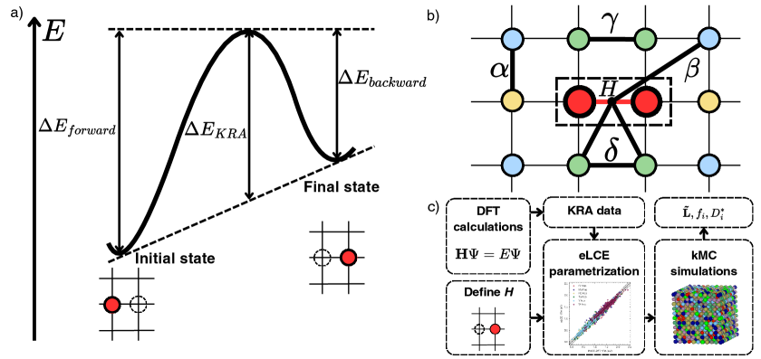
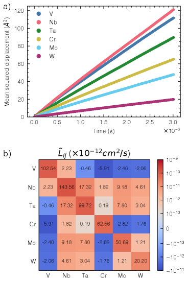
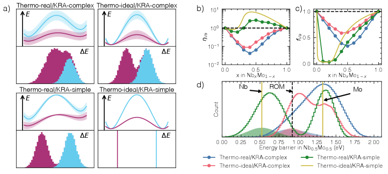
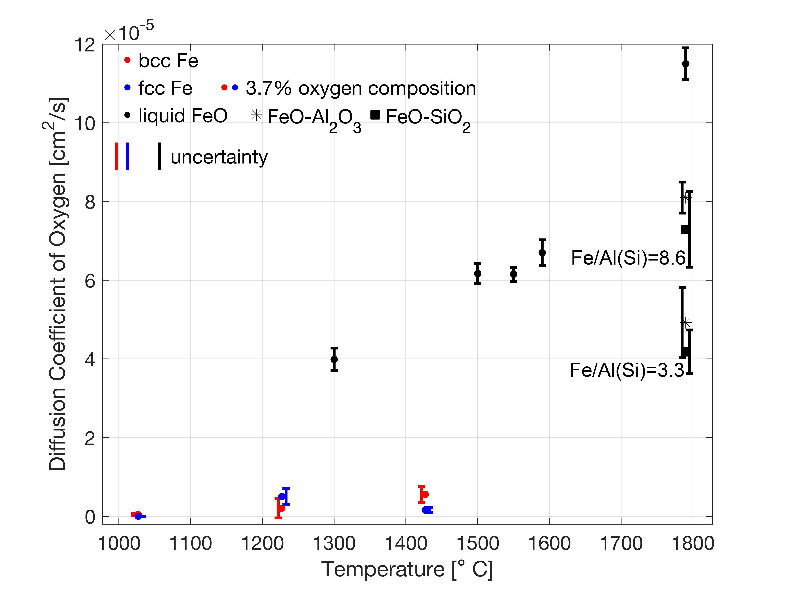

# 多主元素合金の拡散係数を第一原理から予測する：局所運動学障壁が「遅い拡散」の正体を決める

- **執筆日**: 2026-04-02
- **トピック**: 多主元素合金における空孔媒介拡散の第一原理的計算（eLCE + KMC）
- **タグ**: Computation and Theory / Bulk Alloys; Defects and Impurities / First-Principles Calculations; Molecular Dynamics; Monte Carlo
- **注目論文**: arXiv:2603.24228（Lee & Natarajan, 2026）
- **参照関連論文数**: 6

---

## 1. なぜ今この話題なのか

### 多主元素合金と高温材料の限界

現代の産業・エネルギー技術は、極端な条件下で使用できる構造材料を強く必要としている。ジェットエンジンのタービンブレード、核融合炉の第一壁材料、超音速飛翔体の外装材——これらはいずれも1000℃を超える高温と激しい機械的応力に長時間耐えなければならない。従来の超合金（ニッケル基合金など）はその役割を担ってきたが、設計の余地はすでに限界に近づきつつある。

そのような背景の中で、2004年に Yeh らと Cantor らが独立に提唱した**多主元素合金（Multi-Principal Element Alloys, MPEAs）**、あるいは**高エントロピー合金（High-Entropy Alloys, HEAs）**は、新たな可能性として注目を集めてきた。MPEAとは、5種類以上の金属元素をほぼ等比率で混合した合金であり、従来の「1種類の主要元素＋少量の添加元素」という合金設計の発想を根本から覆すものだ。代表的な例として、V-Cr-Nb-Mo-Ta-Wのような**耐熱性多主元素合金（Refractory MPEA）**は2200℃以上の融点を持つ元素を組み合わせることで、高温での強度と安定性を追求している。

### 「遅い拡散」仮説という謎

MPEAが注目を集めた理由のひとつに、**「遅い拡散効果（Sluggish Diffusion Effect）」**という仮説がある。Yehらは2004年の初期論文から、MPEAでは原子が拡散しにくく、高温でも微細組織が安定であると主張した。その理由として挙げられたのは、「多成分系では原子が移動しようとするたびに複雑な局所化学環境に直面し、移動のたびにエネルギー障壁の高低が大きく変動するため、全体として拡散が遅くなる」という直感的な説明であった。

この「遅い拡散」説は長らくHEA/MPEAの四大効果の一つとして語られてきたが、近年の実験データや計算科学的研究によって、その普遍性は強く疑われるようになっている。一部の実験では「むしろ速い拡散（Anti-sluggish）」が報告されており、「遅い拡散」が常にMPEAに固有のものではないことが示されつつある。

では、何が拡散速度を決めているのか？その問いに対し、計算科学は強力なアプローチを提供できる。特に、**第一原理計算（DFT）** と**動的モンテカルロ（Kinetic Monte Carlo, KMC）** を組み合わせた多スケール計算が近年急速に発展し、MPEAの拡散機構を定量的・原子論的に解明する道が開かれつつある。

2026年3月に arXiv に投稿された Lee & Natarajan（arXiv:2603.24228）の論文は、まさにこの問いの正面にある。「埋め込み局所クラスター展開（embedded Local Cluster Expansion, eLCE）」という新しい機械学習的手法を使って、V-Cr-Nb-Mo-Ta-Wという6元素耐熱MPEAの拡散係数行列を第一原理レベルの精度で計算することに成功し、「遅い拡散は局所運動学障壁が決める」という明確な結論を示した。本記事ではこの論文を核に据えながら、固体物理学における**AIMD（Ab Initio Molecular Dynamics、第一原理分子動力学）** と**KMC（Kinetic Monte Carlo、動的モンテカルロ）** という二大計算手法がどのように相補的に機能し、固体中の原子拡散という古典的問題に新しい光を当てているかを解説する。

---

## 2. この分野で何が未解決なのか

### 問い1：「遅い拡散」は本当にMPEAに固有の現象か？

MPEAにおける拡散係数の実験測定は非常に困難である。通常の2元系合金では拡散対（diffusion couple）実験によって測定できるが、6元素以上の系では拡散係数行列が多成分になり、実験だけで全要素を決定することは現実的ではない。計算で補完することが必須となるが、そのためには「第一原理精度の拡散係数を現実的な組成空間で計算できる方法」が必要になる。これが現在の最大の課題の一つだ。

### 問い2：熱力学的効果と運動学的効果のどちらが拡散を支配するか？

MPEAで原子が拡散する際、空孔（vacancy）が隣の原子と位置を入れ替えることで原子移動が起きる（**空孔媒介拡散**）。この過程には二種類の効果が影響する。ひとつは**熱力学的効果**：空孔が特定の位置にトラップされやすい・されにくいという「空孔の安定性の空間分布」である。もうひとつは**運動学的効果**：空孔が実際に隣原子と入れ替わろうとする際に超えなければならないエネルギー障壁（移動障壁）の分布だ。どちらが「遅い拡散」の主因かは長年の議論であり、正確な答えを出すには両者を独立に評価できる計算フレームワークが必要だった。

### 問い3：AIMD とKMCはどのような役割分担で拡散を計算するか？

固体中の原子拡散を直接シミュレーションで追う方法として、**AIMD（第一原理分子動力学）** がある。AIMD は電子系を量子力学的に扱いながら、原子核の運動を古典ニュートン力学で追うアプローチであり、原理的に実験的に測定できるあらゆる物理量（拡散係数、活性化エネルギーなど）を電子構造から直接計算できる。しかし、AIMDには計算コストという大きな壁がある。DFT計算を各時刻ステップで実施する必要があり、到達できる時間スケールはナノ秒、到達できる系のサイズは数百〜数千原子が限界だ。金属固体中の空孔移動は典型的にミリ秒から秒のオーダーで起きるため、AIMDが直接アクセスできる時間スケール（ナノ秒）では十分な統計を得ることが難しい。

ここでKMCが補完的な役割を果たす。KMCはDFTで計算した移動障壁をInputとして受け取り、モンテカルロ法によって空孔のランダムウォークをシミュレーションする。個々のDFT計算は静的（原子が止まっている状態での電子構造計算）でよく、動的な軌跡を必要としないため、原理的にはミリ秒以上の時間スケールに対応できる。ただし、MPEAのような多成分系では「すべての可能な局所化学環境における移動障壁」の数が指数関数的に増大するため、どのように障壁データベースを構築するかが鍵となる。eLCE は、この障壁データベースを機械学習的に構築・補完する手法として開発された。

### 問い4：核物質や水素貯蔵材料での拡散はどう違うか？

拡散問題はMPEAだけにとどまらない。鉄鋼材料における水素の拡散と捕捉は水素脆化を引き起こし、その制御が構造材料の信頼性に直結する。また、核融合・核分裂炉材料では、放射線照射によって生成した空孔や格子間原子が拡散・消滅する過程が材料損傷の進行を左右する。これらの系でも第一原理+KMCのアプローチは強力な手段となっている（arXiv:2601.05917; arXiv:2602.18608）。したがって本記事で議論するMPEAの拡散計算手法は、より広い固体物理・材料科学の文脈の中に位置している。

---

## 3. 注目論文の核心：何が前進し、何がまだ仮説か

### eLCE + KMCフレームワークの概要

Lee & Natarajan（arXiv:2603.24228）の中心的な貢献は、**多主元素合金の拡散係数行列を第一原理精度で計算するための包括的なフレームワーク**を確立したことにある。論文のワークフローは三つのステップからなる。

**ステップ1：DFT で KRA 障壁を計算する。**

空孔が原子サイト $i$ から隣のサイト $j$ へ移動する際のエネルギー障壁は、通常「前後の状態エネルギーの差」と「遷移状態エネルギー」の二つから決まる。しかし多成分系では、遷移前と遷移後で局所化学環境が変わるため、「移動しやすさ」を純粋に取り出すことが難しい。そこでこの論文では**KRA（Kinetically Resolved Activation）障壁** という概念を使う。

$$\Delta E_\text{KRA} = E_\text{TS} - \frac{E_\text{初} + E_\text{末}}{2}$$

ここで $E_\text{TS}$ は遷移状態（サドル点）のエネルギー、$E_\text{初}$ と $E_\text{末}$ はそれぞれ初期・最終状態のエネルギーだ。KRAは「熱力学的な端点エネルギーの差」を差し引いて「純粋な遷移状態の高さ」だけを抽出するための量であり、熱力学効果と運動学効果を独立に評価することを可能にする。

DFT計算はVASP（Vienna Ab initio Simulation Package）を用い、交換相関汎関数はPBEを採用している。移動障壁の計算はNEB（Nudged Elastic Band）法で行うが、計算コスト削減のため、まず機械学習ポテンシャル MACE-MPA0（汎用MLポテンシャル）で原子構造を緩和してから、単点DFT計算でエネルギーを精密化するという2段階戦略を採用している。この近似によるMAEは36.6 meVと十分小さく、検証計算で確認されている。

**ステップ2：eLCE で障壁データベースを補完・補間する。**

DFT計算だけでは、6元素系における「すべての局所化学環境に対する移動障壁」を網羅することは不可能だ。V-Cr-Nb-Mo-Ta-Wの6元素系では、空孔の1つのジャンプに関わる隣接サイトの元素の組み合わせだけで膨大な数になる。

eLCEはこの問題を解決するために設計された手法である。通常のクラスター展開（CE）では「各クラスターに基底関数を割り当て、その係数を最適化する」という手続きをとるが、多成分系では基底関数の数が指数関数的に増大する。eLCEはこの問題を「埋め込み（embedding）」によって解決する。具体的には、各元素を表す記述子を低次元の潜在空間に写像し（$\tilde{\phi}(\sigma_i) = T\phi(\sigma_i)$、ここで $T$ は学習される埋め込み行列）、この低次元表現を用いてKRA障壁を推定するニューラルネットワークを訓練する。

訓練データは1945通りの配置で、テストMAEは69.9 meV。単純な元素ペアの平均でも誤差は100 meV程度あることを考えると、eLCEはMPEA系の複雑な化学的多様性を効果的に捉えていると言える。

**ステップ3：KMC シミュレーションで拡散係数を計算する。**

eLCEで任意の局所環境に対するKRA障壁を高速に推定できるようになったら、次はKMCシミュレーションで実際の拡散を追う。シミュレーション系は10×10×10 BCC超格子（2000原子）、各温度で500回の独立ランを実施し、50,000〜100,000ステップの拒絶なし（rejection-free）KMCアルゴリズムを使用する。空孔の初期状態は、各温度での正準モンテカルロ（カノニカルMC）で生成した熱平衡配置を使うことで、短距離秩序（SRO）の効果も取り込んでいる。

KMCの出力から**Onsager輸送係数行列** $\tilde{L}$ を計算し、さらに熱力学因子行列 $\tilde{\Theta}$（組成揺らぎから計算）との積によって**化学的拡散係数行列**を得る：

$$D = \tilde{L}\tilde{\Theta}$$

この関係式により、実験で測定可能な「浸透深さ」や「拡散プロファイル」に対応する拡散係数を第一原理から予測できる。

### 主要結果：何が明らかになったか

*図1（arXiv:2603.24228 Fig. 1, CC BY 4.0）: (a) KRA障壁の概念図、空孔が遷移状態を経由して原子と入れ替わる様子。 (b) 局所クラスター展開でどの原子ペアが障壁計算に寄与するかを示す格子図。 (c) DFT → KRA データ → eLCE パラメータ化 → KMCシミュレーションという計算ワークフロー。*

**均等組成 VCrNbMoTaW（2000 K）での結果：**

Onsager係数行列とトレーサー拡散係数を計算すると、V・Nb・Taからなる第5族元素が、Cr・Mo・Wの第6族元素よりも数桁速く拡散することがわかった。これは元素の純粋な融点や原子サイズの違いだけでは説明できず、KRA障壁の局所化学環境依存性が本質的な役割を果たしているという証拠だ。

また、拡散係数行列の固有値解析から、最大固有値が空孔のトレーサー拡散係数に対応し、残りの固有値が元素間の「互拡散モード」に対応することが示された（図4参照）。通常の分子動力学（MD）では到達不可能なマイクロ秒以上の時間スケールにおける輸送が、eLCE + KMCによって初めて計算できるようになった。

*図2（arXiv:2603.24228 Fig. 3, CC BY 4.0）: 2000 KにおけるVCrNbMoTaW合金の各元素の平均二乗変位（左）とOnsager輸送係数行列（右）。第5族元素（V・Nb・Ta）の拡散が第6族元素（Cr・Mo・W）よりも著しく速いことが分かる。*

**「遅い拡散」の主因は何か：4種類のモデル合金による解析**

論文のハイライトは、Nb-Mo二元系で「熱力学的複雑さ」と「運動学的複雑さ」を独立に切り離した4つのモデル合金の比較にある：
1. 熱力学的に理想的かつ運動学的に単純（KRA障壁が全サイトで一定）
2. 熱力学的に理想的かつ運動学的に複雑（局所環境依存のKRA障壁）
3. 熱力学的に現実的かつ運動学的に単純
4. 熱力学的に現実的かつ運動学的に複雑（実際の合金）

比較の結果、モデル2と4は一致する一方、モデル3と4は大きく異なる。すなわち、**KRA障壁の局所化学環境依存性（運動学的複雑さ）が拡散を決定的に制御しており、熱力学的効果は相対的に小さい**という結論が得られた。

*図3（arXiv:2603.24228 Fig. 5, CC BY 4.0）: 熱力学的/運動学的因子を分離した4種のモデル合金比較（左）と、Nb-Mo合金での空孔増強因子 $\eta_\text{Va}$ の組成依存性（右）。$\eta < 1$ が「遅い拡散」、$\eta > 1$ が「速い拡散（anti-sluggish）」に対応。Nb組成が約24%（BCC格子のパーコレーション閾値）を超えると急激にanti-sluggishに転じることが分かる。*

**パーコレーション機構：低障壁経路のネットワーク**

Nb-Moの解析で特に興味深いのは、「遅い拡散から速い拡散への転換」がNb組成 ~24%付近で起きるという観察だ。この値はBCC格子のパーコレーション閾値（~0.24）と一致する。すなわち、Nb-Mo合金において、Nbサイトでの空孔ジャンプ障壁はMoサイトよりも小さく、Nb組成がパーコレーション閾値を超えると、低障壁のNbサイトが格子全体にわたる連結ネットワーク（パーコレーションクラスター）を形成する。空孔がこのネットワークを通り抜けることで、全体としての拡散が加速される。この幾何学的機構は、単純な平均場的な「平均障壁エネルギー」だけでは予測できず、障壁の空間分布とその繋がりを明示的に考える必要があることを示している。

### 何がまだ仮説段階か

論文の結論は説得力があるが、いくつかの点はまだ検証が必要だ。第一に、KMCでの振動前因子（$\nu^*$）を全ての元素・環境について1 THz と固定しているが、実際にはDFT+フォノン計算から環境依存の前因子を求めるべきである。第二に、SROの影響を初期状態生成の段階でのみ取り込んでいるが、拡散過程中にSROが時間発展することへの対処が完全ではない。第三に、実験との定量的比較はまだ限定的であり、特に耐熱MPEA系での拡散係数実験は非常に少ない。

---

## 4. 背景と研究史：この論文はどこに位置づくか

### AIMDによる直接的拡散係数計算の歴史

固体中の拡散係数を計算するためのAIMD的アプローチは1990年代から存在する。原理は単純で、DFTで計算したポテンシャルエネルギー面上で原子を動かし、平均二乗変位（MSD）の時間発展からアインシュタイン関係式：

$$D = \lim_{t \to \infty} \frac{\langle |\mathbf{r}(t) - \mathbf{r}(0)|^2 \rangle}{6t}$$

を使って拡散係数を計算する。高温（拡散係数が大きい状態）であればAIMDが有効だが、低温では計算に必要な時間が急激に増加する。また、AIMDが現実的なコストで扱えるのは数百原子のサイズに限られる。

近年、このAIMD拡散計算を自動化・体系化する試みが進んでいる。arXiv:2511.16059（Hong et al.）の論文は、VASP を使ったAIMD計算から自動的に拡散係数を算出するフレームワーク「SLUSCHI」の拡張版を報告している。Al-Cu液体合金、固体電解質LLZO（Li₇La₃Zr₂O₁₂）、酸化エルビウム（Er₂O₃）、BCC/FCC鉄中の酸素拡散など、多様な系への適用例が示されており、AIMDがどのような物質系・温度域で有効かが整理されている。

*図4（arXiv:2511.16059 Fig. 7, CC BY 4.0）: AIMDによるBCC鉄とFCC鉄中の酸素拡散係数の温度依存性。異なる結晶構造でのAIMD拡散係数計算の例。*

このような「AIMDによる直接計算」は特に液体や高温固体で有効だが、低温での空孔媒介拡散（固相中の原子移動）では時間スケールが合わない。ここでKMCが本質的に重要な役割を担う。Lee & Natarajan（2603.24228）の論文では、AIMDの出力が示すように振動前因子を設定し、NEB計算から移動障壁を得てKMCへと繋いでいる。すなわち、AIMDとKMCは「競合する」手法ではなく、異なる温度・時間スケール域を担当する相補的な手法なのだ。

### MPEAの空孔濃度計算との接続

Lee & Natarajan グループは2025年に、同様の計算枠組み（埋め込みクラスター展開）を用いてMPEAの平衡空孔濃度を計算した研究を報告している（arXiv:2509.21944）。拡散係数の計算には「どれだけの空孔が熱的に生成されているか」という平衡空孔濃度が本来必要であり、今回の拡散係数計算はこの空孔濃度計算の研究と直接的に接続している。耐熱MPEA系では第4族元素（Ti, Zr, Hf）の添加が空孔濃度を増大させることが示されており、拡散係数の組成依存性を議論する上で空孔濃度の変化も無視できない。

### 異なる材料系：金属中の水素拡散

MPEAと似た多スケール計算のアプローチは、金属中の水素拡散研究でも活発に用いられている。arXiv:2601.05917（Jain et al.）は、FCC鉄（ニッケル）多結晶における水素の拡散をDFT → KMC → FEM（有限要素法）という3段階マルチスケール計算で予測した。

*図5（arXiv:2601.05917 Fig. 3, CC BY 4.0）: Σ5粒界でのKMC拡散格子の表現。粒界近傍の格子間原子サイト（赤・緑マーカー）と粒界を横切る拡散経路（黒線）が示されている。粒界が水素の拡散を加速または遅延させる効果を定量的に取り込んでいる。*

水素はFCC金属では格子間位置（八面体孔）を移動するため、空孔媒介拡散とは異なるメカニズムだが、DFTで移動障壁を計算しKMCで長距離拡散を追うという計算の骨格は共通している。この研究では、粒界の種類（Σ3, Σ5型など）と結晶粒サイズが実効拡散係数に与える影響を定量化し、実験値（Oudriss et al.による多結晶Niの実験）と良好な一致を示している点が特筆される。

*図6（arXiv:2601.05917 Fig. 6, CC BY 4.0）: バルクNiにおける水素拡散係数の温度依存性。KMCシミュレーション結果（本研究）、解析的推定、および実験データの比較。KMCが実験トレンドを良好に再現していることが分かる。*

---

## 5. どの解釈が最も妥当か：証拠・比較・限界

### 「局所運動学障壁が支配する」という結論の根拠

Lee & Natarajan の最も重要な主張は「熱力学的効果より局所KRA障壁の分布が拡散を決める」というものだ。この結論は、4種モデル合金の比較から非常に強く支持されている。特に、「熱力学的効果のみを現実的にし、KRA障壁を均一にした場合（モデル3）」と「実際の合金（モデル4）」の間に大きな差が現れる一方、「KRA障壁のみを現実的にし、熱力学を理想的にした場合（モデル2）」が実際の合金とよく一致するという結果は、KRA障壁の役割を強く指示している。

この結論は、「ランダムなエネルギー地形（energy landscape）の中で空孔が拡散する」という物理描像とも整合する。もし熱力学的効果が支配的なら、空孔が特定のサイトに「トラップ」されることで拡散が遅くなると予想されるが、実際にはそうでなく、空孔が「移動しようとする際」の障壁の高さそのものが律速になっているのだ。

### 空孔相関因子の再解釈

従来、「遅い拡散」の説明として「相関因子（correlation factor）」が重要視されることがあった。相関因子は、空孔がランダムウォークをする際にどれだけ「後退」しやすいか（前のジャンプを逆向きに戻りやすいか）を表す量で、多成分系では低くなりやすいと予測されていた。

しかし今回の計算では、同程度の相関因子を持つ合金系でも拡散係数（増強因子）が大きく異なる場合があることが示された。すなわち、相関因子だけでは「遅い拡散か速い拡散か」を判別できず、KRA障壁の分布（平均値とその幅）を直接見なければならないということだ。

### パーコレーション機構の確かさ

Nb-Mo二元系でパーコレーション閾値が~24%というのは、BCC格子での最近接サイトのパーコレーション閾値として知られている値（0.245）と整合している。このパーコレーション的機構は理論的に理解可能で、低障壁元素が格子中に連結経路を形成し始める組成で拡散が急激に変化するというシナリオは、格子上のパーコレーション理論で定性的に説明できる。ただし、これは2元系での観察であり、6元素系の等原子組成合金でも同様のパーコレーション的ダイナミクスが支配的かどうかは、まだ詳細な解析が必要だ。

### AIMD との比較の課題

AIMD（たとえば2511.16059が使うSLUSCHIフレームワーク）は高温での拡散係数を直接計算できるため、原理的にはKMC結果の検証手段として使えるはずだ。しかし、実際の耐熱MPEAの融点は2000℃を超えており、AIMDで現実的な拡散が観測できる温度域は高温（>1800 K）に限られる。一方、実用的な温度域（1000〜1500 K）での拡散係数はAIMDでは計算困難であり、KMCに依存せざるを得ない。

また、AIMDは直接的に空孔移動を追うが、希薄空孔濃度（現実的な熱平衡濃度は~10⁻⁵〜10⁻³程度）の条件でのAIMD計算は、非常に大きな系が必要となり現実的でない。KMCは明示的に1個の空孔を導入してそのランダムウォークを追うため、空孔濃度の問題をエレガントに回避できる。

### 放射線照射下の空孔挙動

放射線照射（核分裂・核融合炉材料、宇宙線）によって大量の空孔が生成される環境では、KMCは別の意味で重要だ。arXiv:2602.18608（Sood et al.）では、Cu系合金への重イオン照射実験を過渡回折分光法（TGS）でリアルタイム計測し、KMCシミュレーションで再現している。照射によって生成された空孔は時間とともに他の欠陥や格子間原子と再結合・消滅するが、このダイナミクスをKMCで定量的に再現できることが示されている。この研究は「KMCが実験で直接観測できるシグナルとどれだけ整合するか」を示す重要な検証例となっている。

### 水素とLaves相：DFT+MLポテンシャルの比較

水素拡散の別の例として、TiCr₂Laves相系での研究（arXiv:2511.18069, Kumar et al.）も参照値になる。この研究ではDFT + NEB計算で水素移動障壁を求め、機械学習ポテンシャル（MLIP）によるMDで拡散係数を計算している。重要な観察は「MLIP-MDによる計算値が実験よりも約1桁大きい」という事実であり、これは格子欠陥（転位、粒界）による捕捉効果をシミュレーションで考慮できていないためと解釈される。同様の問題は多くの固体拡散計算で潜在的に存在しており、今後の計算精度向上のためには欠陥の役割を明示的に取り込む必要がある。

---

## 6. 何が一般化できるのか：材料・手法・応用への広がり

### 耐熱MPEAの合金設計への応用

今回のフレームワークは「6元素系の等原子組成」に適用されたが、原理的にはあらゆる組成に対して拡散係数を計算できる。論文内でも、57通りの等原子2〜6元素系についてスクリーニングを行い、「anti-sluggish（速い拡散）」が期待できる組成（Cr-W, Mo-Wなど）を特定している。この能力は、「拡散挙動を制御した耐熱合金設計」という観点から大きな意義を持つ。

耐熱MPEAに求められる性質のひとつは「高温でも微細組織を安定に保てること」であり、粒成長や相分解を防ぐためには適切な拡散速度が必要だ。元素の遅い拡散は析出物の粗大化を抑制し、高温強度を維持する上で有利に働く。一方、加工性や固相接合の観点では、適度な拡散速度が必要な場合もある。eLCE + KMCフレームワークを使うことで、組成空間をスクリーニングして「目標とする拡散特性を持つ合金組成」を設計原理として探索できる可能性が開ける。

### 原子炉材料・核融合炉材料への展開

原子力材料では、放射線照射によって生じた点欠陥（空孔や格子間原子）の移動速度と再結合速度が材料損傷の進行を左右する。KMCシミュレーションはこのような「照射下の欠陥移動ダイナミクス」を追う手法として長年使われてきた。arXiv:2602.18608が示すように、KMCによる欠陥移動の計算と実験的なリアルタイム計測（TGS法）を組み合わせることで、欠陥の「生成→移動→消滅」という過程の定量的な検証が可能になっている。

### 固体電解質・バッテリー材料へのAIMD応用

AIMD（あるいはそれを加速する機械学習ポテンシャルMD）は、固体電解質中のイオン拡散計算で特に強力だ。Li₃PS₄ガラス電解質（2602.22989）での研究が示すように、AIMD は局所構造変動と拡散の関係を詳細に追いながら、「孤立硫黄種がリチウムイオン移動を大幅に促進する」という微細な機構を明らかにできる。一方、LLZO（Li₇La₃Zr₂O₁₂）のような酸化物系固体電解質でも、AIMD計算が温度依存拡散係数を与え（2511.16059）、デバイス設計の基礎データとなっている。固体電解質のイオン拡散ではKMCよりもAIMDや機械学習MD（MLMD）が主流になっているが、計算手法の基本的な思想（エネルギー地形上の拡散）は共通している。

### マルチスケール計算の一般的枠組みとして

本記事で紹介したDFT → (NEB/AIMD) → KMC → FEM (or 連続体モデル) というマルチスケール計算のカスケードは、固体中の原子拡散問題に対する一般的なアーキテクチャとなっている。それぞれの手法が担う時間・空間スケールは：

- **DFT/AIMD**: 電子スケール（Å〜nm、ps〜ns）でエネルギー地形を決める
- **KMC**: 原子スケール（nm〜μm、ns〜s）でランダムウォークを追う
- **FEM**: 連続体スケール（μm〜mm、s〜年）でエンジニアリングスケールの予測をする

というように棲み分けられている。水素拡散（2601.05917）ではこの3段階カスケードが明示的に実装され、実験との定量比較が行われた。今後は、機械学習ポテンシャル（MLIP）がDFTとKMCの中間層として入り、計算コスト・精度のトレードオフを改善することが期待される。

---

## 7. 基礎から理解する

### 空孔媒介拡散とは何か

固体中で原子が移動する機構には複数あるが、金属（特に金属合金）で最も一般的なのは**空孔媒介拡散（Vacancy-mediated diffusion）**である。金属結晶には熱的に生成された「空っぽのサイト（空孔）」が常に一定の濃度で存在しており、この空孔が隣の原子と位置を入れ替えることで、見かけ上「原子が移動」する。

空孔の濃度は温度 $T$ に対してボルツマン因子で決まる：

$$c_v = \exp\left(-\frac{E_f^\text{vac}}{k_\text{B} T}\right)$$

ここで $E_f^\text{vac}$ は空孔形成エネルギーだ。温度が高いほど空孔が多く生成され、拡散が速くなる。この空孔形成エネルギーはDFTで精密に計算でき、多元素合金でも埋め込みクラスター展開で局所環境依存性を取り込める（2509.21944）。

### NEB法：移動障壁の計算

原子が空孔と入れ替わる過程は、ポテンシャルエネルギー面（PES）上の「鞍点（saddle point）」を経由する過程として記述される。この鞍点のエネルギーが移動障壁（migration barrier）であり、大きいほど原子が移動しにくい。

**NEB（Nudged Elastic Band）法**は、初期状態から最終状態までの「最小エネルギー経路（MEP）」を数値的に求める手法だ。複数の「イメージ（image）」を初期状態から最終状態の間に配置し、各イメージのDFTエネルギーを計算しながら、イメージ間を仮想的なバネで繋いで全体を最適化する。最適化後に最も高いエネルギーを持つイメージが鞍点に対応し、その高さが移動障壁になる。

### KMC：希少事象の高速シミュレーション

分子動力学（MD）は全原子に対してニュートン方程式を積分するが、固体中の拡散では「ほとんどの時間は原子が熱振動しているだけで、たまに障壁を越えてジャンプする」という状況になる。この「희少事象（rare event）」をMDで正確に追うには、ジャンプが起きるまで延々と積分し続ける必要があり、低温ほど非効率になる。

**KMC（Kinetic Monte Carlo）**はこの問題を根本的に回避する手法だ。アイデアは「次にどのジャンプが起きるか」をランダムに選択し、「そのジャンプが起きるまでに要する時間」を確率的に計算することで、ジャンプ間の退屈な待ち時間をスキップするという点にある。

具体的には、各ジャンプイベント $i$ のレート（単位時間あたりの発生確率）を：

$$\Gamma_i = \nu^* \exp\left(-\frac{\Delta E_i}{k_\text{B} T}\right)$$

として計算する（$\nu^*$ は振動前因子、$\Delta E_i$ は移動障壁）。次に起きるイベントを確率 $\Gamma_i / \sum_j \Gamma_j$ でランダムに選択し、ジャンプ時間を $1/\sum_j \Gamma_j$ として時計を進める。これを繰り返すことで、原子の長距離拡散を効率的にシミュレーションできる。「拒絶なし（rejection-free）KMC」と呼ばれるこのアルゴリズムは、全ての試行ステップが「受け入れられるジャンプ」になるため計算効率が高い。

### AIMD：第一原理分子動力学

**AIMD（Ab Initio Molecular Dynamics）**は、各タイムステップで電子系をDFTで解きながら、原子核の運動をニュートン方程式で追う手法だ。DFTで計算した「自己無撞着場（SCF）」から導出される**Hellmann-Feynman力**を各原子に適用し、数フェムト秒（fs）ずつ時間積分を行う。

AIMD の最大の利点は、「経験的なポテンシャルパラメータを必要とせず、電子構造から直接力を計算できる」点だ。液体や高温固体では、原子間距離が大きく変化し経験的ポテンシャルが不安定になりやすいが、AIMDは常に正確な電子構造から力を得る。拡散係数はMSDの時間変化から：

$$D = \lim_{t \to \infty} \frac{\text{MSD}(t)}{6t}$$

として求める。活性化エネルギーは異なる温度でDを計算し、アレニウスプロット（$\ln D$ vs $1/T$）の傾きから得る。

### Onsager係数と多成分拡散

2成分以上の合金での拡散は、単成分系とは本質的に異なる。各成分の流束 $\mathbf{J}_i$ は、全成分の化学ポテンシャル勾配 $\nabla\mu_j$ に応じる（他の成分の流束と結合する）：

$$\mathbf{J}_i = -\sum_j L_{ij} \nabla\mu_j$$

ここで $L_{ij}$ が**Onsager輸送係数**だ。$L_{ij}$ の行列はKMCシミュレーション中の原子変位の相関から計算できる。実験的に測定しやすい「化学的拡散係数行列 $D$」は、$L_{ij}$ 行列と熱力学因子行列 $\Theta_{ij}$（組成揺らぎから計算）の積で与えられる：$D = L\Theta$。この関係により、KMCシミュレーションの結果を実験観測（拡散対実験、EPMA分析など）と直接比較できる。

### クラスター展開と機械学習の融合

**クラスター展開（CE）**は、格子上での原子配置のエネルギーを「クラスター相関関数の線形和」として表す手法で、合金の相図計算や秩序化ダイナミクスの計算に長年使われてきた。しかし多元素系ではクラスター相関関数の数が指数関数的に増大する。eLCEはこの問題を「元素の特徴ベクトルをニューラルネットワークで低次元に埋め込む」ことで解決した。埋め込みにより、「元素が多いほどCEが困難になる」という問題を「埋め込み次元が一定であれば元素数によらず扱える」という問題に変換している。これは分子のフィンガープリントをニューラルネットワークで学習するという一般的なグラフニューラルネットワーク（GNN）の発想とも共鳴しており、計算材料科学における機械学習の深化の一例だ。

---

## 8. 専門用語の解説

**1. 多主元素合金（MPEA / HEA）**
5種類以上の金属元素をほぼ等比率で含む合金。単相の固溶体を形成することが多く、高温強度・耐食性・耐放射線性など多様な特性が期待されている。「高エントロピー合金（HEA）」とほぼ同義で使われることが多い。

**2. 空孔媒介拡散（Vacancy-mediated diffusion）**
固体中で熱的に生成された格子空孔（空っぽのサイト）と隣接原子が位置を入れ替えることで原子が移動する機構。金属合金での原子拡散の主要なメカニズムであり、DFTで障壁を計算し、KMCで長距離拡散を追う。

**3. KRA障壁（Kinetically Resolved Activation barrier）**
空孔ジャンプの移動障壁から「端点のエネルギー差の平均」を差し引いた量。多成分合金での「純粋な動的障壁」を表し、熱力学的効果と運動学的効果を分離して評価するのに使われる。

**4. NEB法（Nudged Elastic Band method）**
反応経路（最小エネルギー経路）とそのサドル点（移動障壁）を求める数値計算手法。初期状態から最終状態までに複数のイメージを配置し、DFTエネルギーを計算しながら最適化する。

**5. 遅い拡散効果（Sluggish diffusion effect）**
MPEAで提唱された仮説で、多成分系では原子が拡散しにくいというもの。Lee & Natarajan(2603.24228) の研究から、この効果はKRA障壁の局所環境依存性によって決まり、系によっては「速い拡散（anti-sluggish）」も起こり得ることが示されている。

**6. パーコレーション（Percolation）**
格子上の点（原子サイト）が「繋がった経路」を形成するかどうかを問う確率論的概念。BCC格子では最近接サイトが全体の約24.5%以上を占めると、サイト間の連結クラスターが格子全体に広がる（パーコレーション閾値）。拡散の文脈では、低障壁元素がパーコレーション閾値を超えると連結した高速経路が形成され、anti-sluggish挙動が現れる。

**7. AIMD（Ab Initio Molecular Dynamics）**
各タイムステップでDFTで電子構造を計算し、Hellmann-Feynman力から原子運動を追う分子動力学シミュレーション。経験的ポテンシャル不要で高精度だが、計算コストが高く到達時間はナノ秒程度が限界。

**8. KMC（Kinetic Monte Carlo）**
各イベント（原子ジャンプ）のレートをアレニウス則から計算し、確率的にイベントを選択・実行することで系の時間発展を追うシミュレーション手法。ミリ秒以上の時間スケールに対応でき、固体中の希少事象（欠陥移動、拡散）の計算に強力。

**9. Onsager輸送係数（Onsager transport coefficient）**
多成分系での原子流束と化学ポテンシャル勾配の線形関係を記述する係数行列 $L_{ij}$。非平衡熱力学の基本量であり、KMCシミュレーション中の変位相関から計算できる。実験的な拡散係数との対応はOnsager係数と熱力学因子の積で与えられる。

**10. 埋め込み局所クラスター展開（eLCE: embedded Local Cluster Expansion）**
多成分合金での局所化学環境とエネルギー障壁の関係を機械学習で記述する手法。各元素を低次元潜在空間に埋め込むことで、元素数の増大に伴う計算複雑度の爆発を抑制している。DFTとKMCをブリッジする役割を果たす。

---

## 9. おわりに：何が分かり、何がまだ残っているのか

Lee & Natarajan（arXiv:2603.24228）の研究は、多主元素合金の空孔媒介拡散に関して、いくつかの重要な点を「かなり確からしい」段階に引き上げた。まず、「遅い拡散（sluggish diffusion）」の主因が熱力学的な空孔トラップ効果ではなく、局所KRA障壁の化学環境依存性（運動学的複雑さ）にあることが、4種モデル合金との比較から明確に示された。次に、低障壁元素がパーコレーション閾値を超えると連結高速経路が形成され「anti-sluggish」挙動が現れるという幾何学的機構が提案された。また、6元素等原子系VCrNbMoTaWの計算では、第5族元素（V, Nb, Ta）が第6族元素（Cr, Mo, W）より数桁速く拡散するという定量的予測が得られた。eLCEフレームワークによって「多成分系の拡散係数を第一原理的に、かつ経験的パラメータなしに計算する」という目標が実証されたことは、計算材料科学における大きな前進である。

一方、いくつかの重要な問いはまだ未解決のままだ。振動前因子（$\nu^*$）の局所環境依存性を明示的に取り込む計算（DFT + フォノン計算との連携）は、計算コストが高く今後の課題として残っている。また、SRO（短距離秩序）が拡散プロセス中に動的に変化することへの対処、および核炉・高温炉などの実際の条件（高照射量、応力下など）での検証も必要だ。実験側では、耐熱MPEA系での拡散係数の直接測定データが極めて少なく、理論予測の検証が難しいという現実的制約もある。今後1〜3年で注目すべき論点は、（1）機械学習ポテンシャル（MLMD/MLIP）を介したAIMDとKMCのより seamlessな統合、（2）粒界・転位などの欠陥サイトを含む実際の微細組織での拡散計算、（3）eLCEフレームワークの実験比較による定量的検証、（4）拡散設計指針に基づく新規耐熱MPEA組成の提案と実験的確認、であろう。「遅い拡散」という謎は解けつつあるが、それを材料設計の道具として実際に使えるようにするまでには、計算・理論・実験の三者の連携がまだ多くの仕事を要する。

---

## 参考論文一覧

1. **[arXiv:2603.24228](https://arxiv.org/abs/2603.24228)** — Lee & Natarajan (2026): eLCE + KMCフレームワークによる多主元素合金（V-Cr-Nb-Mo-Ta-W系）の拡散係数行列を第一原理から計算し、局所KRA障壁が「遅い拡散」を支配することを示した本記事の注目論文（CC BY 4.0）。

2. **[arXiv:2509.21944](https://arxiv.org/abs/2509.21944)** — Lee, Müller & Natarajan (2025): 同グループによる先行研究で、埋め込みクラスター展開を用いて多主元素合金の平衡空孔濃度を第一原理から計算したもの（Acta Materialia 掲載, CC BY 4.0）。

3. **[arXiv:2511.16059](https://arxiv.org/abs/2511.16059)** — Hong et al. (2025): VASPを用いたAIMD計算から拡散係数を自動的に算出するフレームワーク「SLUSCHI」の拡張版を報告し、LLZO・Er₂O₃・Fe-O系など多様な材料でのAIMD拡散計算例を示した（CC BY 4.0）。

4. **[arXiv:2602.18608](https://arxiv.org/abs/2602.18608)** — Sood et al. (2026): 重イオン照射トランジェント回折分光法（I3TGS）によるCu合金のリアルタイム空孔濃度計測と、KMCシミュレーションとの定量的一致を示した実験・計算統合研究（CC BY-NC-ND 4.0）。

5. **[arXiv:2601.05917](https://arxiv.org/abs/2601.05917)** — Jain et al. (2026): 多結晶ニッケル中の水素拡散を「DFT → KMC → FEM」という3段階マルチスケール計算で予測し、粒界の種類と結晶粒サイズの実効拡散係数への影響を定量化した（CC BY 4.0）。

6. **[arXiv:2511.18069](https://arxiv.org/abs/2511.18069)** — Kumar et al. (2025): 水素貯蔵材料TiCr₂ラーベス相中の水素拡散をDFT + NEBおよび機械学習ポテンシャルMDで計算し、MLIP-MDが実験値を約1桁過大評価する原因として格子欠陥による捕捉効果を指摘した（CC BY 4.0）。
