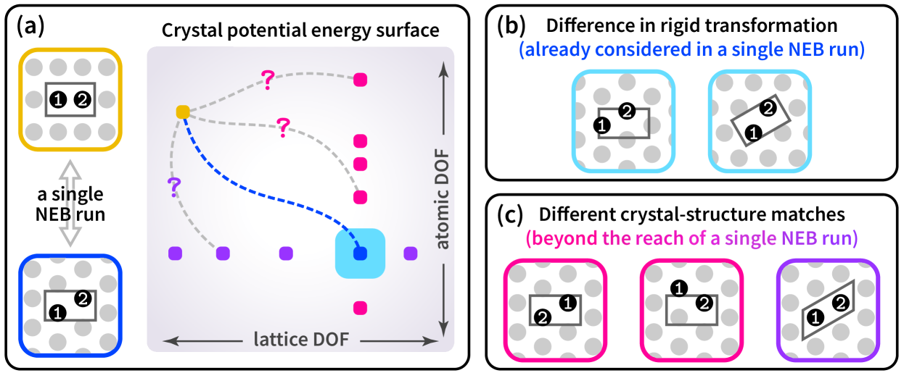
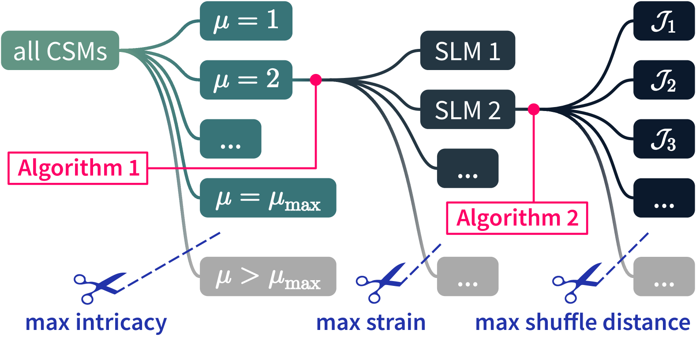
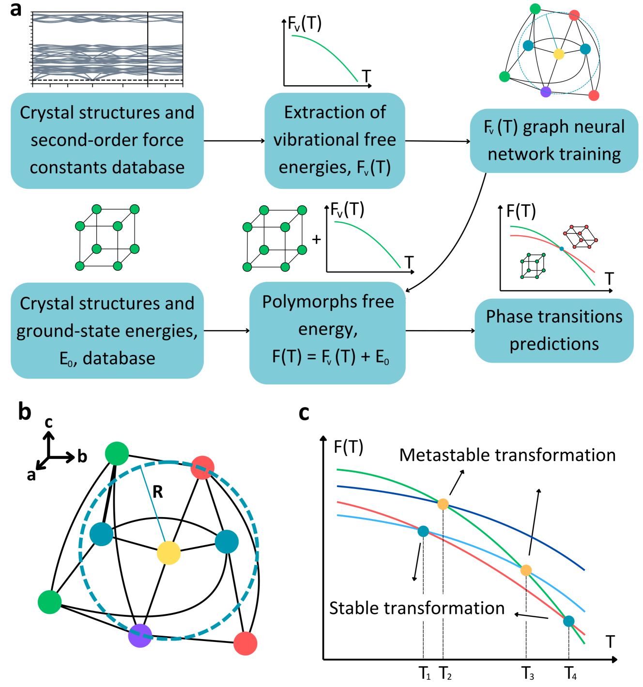

# 固固相転移の経路を計算で解き明かす：大規模NEB法が示す核形成駆動機構

- **執筆日**: 2026-04-01
- **トピック**: NEB法による固固相転移の経路計算と核形成機構
- **タグ**: Structure and Microstructure / Phase Transitions; Nonequilibrium Phase Transitions / First-Principles Calculations; Machine Learning
- **注目論文**: arXiv:2510.16721 "Scalable cell filter nudged elastic band (CFNEB) for large-scale transition-path calculations"
- **参照関連論文数**: 7

---

## 1. なぜ今この話題なのか

物質の結晶構造が一つの安定な配置から別の安定な配置へと切り替わる「固固相転移」（solid-solid phase transition; SSPT）は、材料科学と物性物理の根幹に位置する現象だ。鉄の加熱・冷却による体心立方（BCC）から面心立方（FCC）への転移は鉄鋼産業を支え、グラファイトから超高圧下でダイヤモンドへと変換するプロセスは工業用ダイヤモンドの製造に直結する。近年では、光や圧力によって可逆的に相が切り替わる「スイッチング材料」（例：Ti₃O₅）や、熱電・固体冷却デバイスへの応用が期待される相転移物質の設計が活発になっている。これらすべてにおいて、「どの原子がどのように動いて一方の結晶構造から他方へと遷移するのか」という経路の問いが、応答速度・エネルギー効率・実現可能性を左右する中心問題である。

ところが固固相転移の原子スケール機構を実験で直接観測することは極めて難しい。相転移は通常ピコ秒からナノ秒の時間スケールで進行し、中間状態の観察は困難を極める。そこで頼りになるのが計算科学だ。とりわけ「**ナッジド弾性バンド法**」（Nudged Elastic Band method; **NEB法**）は、二つの安定状態をつなぐ「最小エネルギー経路」（Minimum Energy Path; MEP）とその最高点にある「遷移状態」（saddle point）を系統的に求める計算手法として、化学反応・表面拡散・相転移の機構解析に広く使われてきた。NEB法は1990年代後半にJónsson、Mills、Jacobsenらによって定式化され、その後Henkelman・Jónssonによる改良（Climbing Image NEB; CI-NEB）を経て今日の標準ツールとなっている。

しかし、NEB法を固固相転移に適用しようとするとき、長年にわたって大きな障壁が立ちはだかってきた。第一に、結晶相転移では原子位置の変化だけでなく単位格子の形状・体積も同時に変化する。このため「格子ベクトルも含めた一般化された経路」を扱える**変分セルNEB**（Variable-Cell NEB; VC-NEB）の枠組みが必要となる。第二に、そしてより本質的な問題として、現実の相転移は「すべての原子が一斉に動く協調型機構」ではなく、局所的な**核形成**（nucleation）から始まりその核が成長するという機構をとることが多い。核形成を捉えるためには、1000原子あるいはそれ以上の大きな超格子を計算対象とする必要があるが、DFT計算でそのような大系を扱うのはコスト的に不可能に近く、従来の研究はほぼ例外なく数十～数百原子の小さな計算セルに限られていた。

この「有限サイズの壁」を機械学習力場（Machine Learning Force Field; MLFF）の急速な発展が崩しつつある。原子間相互作用を第一原理精度で近似する機械学習ポテンシャルを使えば、100万原子規模の分子動力学（MD）計算が現実的になった。この波に乗るように、大規模計算に対応したNEB法の新しい枠組みが登場している。2025年10月に公開されたarXiv:2510.16721は、その代表例である。この論文は「**セルフィルター・ナッジド弾性バンド法**」（Cell Filter NEB; **CFNEB**）と呼ぶ手法を提案し、10万原子規模でも安定に動作するNEB計算の実装を実現した。CFNEBをTi₃O₅のβ-λ相転移とグラファイト→ダイヤモンド変換に適用すると、小さいセルでは見えていた「協調型スライド機構」が大きなセルでは「核形成・成長機構」に置き換わるという驚くべき有限サイズ効果が明らかになった。

同時期には、NEB計算の「前工程」にも革新が起きている。NEB計算を実行するには初期状態・最終状態の「原子対応」（crystal-structure match; CSM）を事前に決める必要があるが、従来の手法では利用者が特定のCSMを「仮定」して計算を始めるしかなかった。2025年6月のarXiv:2506.05105（crystmatch法）は、二つの結晶構造間で有限個の「意味のあるCSM」を**網羅的に列挙**するアルゴリズムを確立した。これにより「本当に最低エネルギー障壁を持つ経路は何か」という問いに系統的に答えられるようになった。NEB法は各CSMに対して一本のMEPしか見つけられないため、CSMの網羅的探索との組み合わせは非常に強力な方法論を構成する。

さらに、2025年6月のarXiv:2506.01449は機械学習による振動自由エネルギー予測を使い、約5万化合物のスクリーニングから2000以上の固固相転移候補を同定した。これは「相転移が起きるかどうか」の予測を高スループットで行う新しい流れを示している。実験・理論・機械学習が互いに補完し合いながら、固固相転移研究は今まさに大転換点を迎えているのである。

---

## 2. この分野で何が未解決なのか

固固相転移の原子機構研究において、現在も活発に議論されているいくつかの根本問題を整理しておこう。

**問い①：核形成か、協調型変換か**

固固相転移には大きく二つの機構がある。ひとつは「協調型変換」（concerted mechanism）で、すべての原子が一様に（あるいはほぼ同時に）新しい配置へと動く。もうひとつは「核形成・成長機構」（nucleation-and-growth）で、新相の小さな核（nucleus）が母相の中に生まれ、それが拡大していく。どちらの機構が実現するかは材料・条件・スケールによって異なり、同じ系でも計算セルのサイズによって「見える機構」が変わることがある。CFNEB論文（arXiv:2510.16721）が示したのは、従来の小セル計算が核形成機構を見逃している可能性があるという衝撃的な事実だ。

**問い②：どの経路が真に最低障壁か**

二つの結晶構造をつなぐ「原子の対応」（CSM）は一般に複数存在し、異なるCSMは異なる経路・異なるエネルギー障壁をもつ。NEB計算は「指定したCSMの下で最低障壁経路を見つける」ことはできるが、「全CSMの中で最低障壁のCSMを見つける」ことはできない。crystmatch法（arXiv:2506.05105）が示したように、同じ二相間の転移でも数千を超えるCSM候補が存在しうる。従来研究の多くは一つあるいは少数のCSMしか調べていない可能性があり、真の最低障壁経路が見過ごされている恐れがある。

**問い③：温度と自由エネルギーの役割**

NEB法が直接与えるのはポテンシャルエネルギーの鞍点であり、これは絶対零度の「静的な障壁」に相当する。しかし現実の相転移は有限温度で起きるため、エントロピー効果・量子揺らぎ・フォノン自由エネルギーが障壁の大きさを変える。CaSnF6の事例（arXiv:2603.23851）が示すように、相転移点近傍では熱伝導率が非単調な異常を示し、アンハーモニック効果（特に4フォノン散乱）が支配的になる。NEB法では捉えきれないこうした有限温度効果をMLMDや自由エネルギー計算でどう補完するかが重要な課題だ。

**問い④：機械学習力場の精度と転移可能性**

大規模NEB計算の実現は機械学習力場の精度に強く依存する。訓練データに含まれていない中間状態（遷移状態付近の構造）でも精度が保たれるかどうか──いわゆる「転移可能性」（transferability）の問題──は現在も活発に議論されている。特にNEB経路上の構造は、エネルギー極小でも平衡構造でもない特異な配置をとるため、訓練データの設計が難しい。

---

## 3. 注目論文の核心：何が前進し、何がまだ仮説か

### CFNEB法の提案（arXiv:2510.16721）

Álvaro Ruiz-Serranoら（Málaga大学ほか）が2025年10月に公開したこの論文は、固固相転移を大規模に計算するための新しいNEB実装を提案している。その中核的なアイデアは「セルフィルター」（cell filter）と呼ばれる変数変換にある。

通常のNEB法は原子位置 $\mathbf{R}$ を変数として扱う。しかし結晶相転移では単位格子のベクトル $\mathbf{h}$ も変化するため、従来の「変分セルNEB」（VC-NEB）では格子ベクトルと原子位置を同一フレームで扱う工夫が必要だった。CFNEBが導入するのは、**変形勾配テンソル** $\mathbf{D} = \mathbf{h}_0^{-1}\mathbf{h}$（参照セル $\mathbf{h}_0$ に対する現在のセル $\mathbf{h}$ の変形）を使った座標変換である。修正後の原子座標 $\tilde{\mathbf{R}} = \mathbf{R}\mathbf{D}^{-1}$ は参照セル内での「歪み除去済み座標」に相当し、バンド（NEB法でいう経路上の「イメージ」のつながり）の回転ドリフトを抑制する。さらに変形テンソルの対称成分としてコーシー・グリーン歪みテンソル $\mathbf{B} = \mathbf{D}\mathbf{D}^T$ を使うことで、純粋な剛体回転（物理的内容のない自由度）を経路から除去できる。

この定式化により、原子座標と格子ベクトルが統一的な一般化座標として扱われ、NEB法の標準的な最適化アルゴリズムをそのまま適用できる。実装はPython（ASEラッパー）とC++（GPUMD；GPU加速）の二系統で提供され、後者では消費者向けGPU1枚で**1秒あたり約100万原子ステップ**のスループットを達成している。この速度は従来比で桁違いの高速化であり、10万原子規模のNEB計算を現実的な計算時間で可能にする。

**前進した点**：小セル計算でしか示せなかった協調型機構が「有限サイズの人工物」である可能性を、大セル計算で初めて系統的に示せるようになった。10万原子規模でのNEB計算という新しい「計算顕微鏡」が誕生した。

**まだ仮説段階の点**：CFNEB自体は絶対零度のポテンシャルエネルギー面の情報しか与えない。「核が実際に生成・成長するかどうか」は有限温度の自由エネルギー計算やMD計算で別途確認する必要がある。また、どのCSMを初期・最終状態として選ぶかという問題はCFNEBでは解決されていない（これはcrystmatch法の役割）。

### Ti₃O₅のβ-λ相転移：核形成が意味するもの

Ti₃O₅はチタン酸化物の一種で、β型（高温・高圧相）とλ型（常圧安定相）の間で可逆的な再構成型相転移を示す。特異なのはこの転移がピコ秒スケールで進行し、光（レーザーパルス）や温度変化で高速にスイッチングできることで、光学的メモリデバイスへの応用が検討されている。

CFNEBを使って5単位セルを超えるb軸方向の超格子でNEB計算を行うと、経路は「同一平面内でのスライド」という以前から知られた協調型機構から自発的に「**螺旋・ヘリカル型変位パターン**」へと変化する。隣接する層が順次位相をずらしながら転移する、ネジ状の伝播機構が現れるのだ。これは「一層ずつ順番に転移する」という先行研究（arXiv:2310.05683; Nat. Commun. 2024）が示した層ごとの機構（layer-by-layer mechanism）と整合的であり、CFNEB計算がその静的な経路論的対応物を与えたと解釈できる。

重要なのは、この螺旋型経路では**各層の平均的なエネルギー障壁がほぼゼロに収束する**という点だ。これは小セルで計算した協調型機構（有限の障壁をもつ）とは根本的に異なる。障壁がゼロに近いということは、条件さえ整えば転移が超高速で進行できることと整合する。Ti₃O₅の実際の超高速応答が、核形成・ヘリカル機構によって説明できる可能性を示している。

### グラファイト→ダイヤモンド：圧力下での核形成経路

40 GPaの圧力下でのグラファイト→立方ダイヤモンド変換は、工業的にも基礎科学的にも重要な再構成型相転移の典型例だ。CFNEBによる大セル計算は、十分に横方向のサイズが大きくなると「協調的な均一変換（concerted buckling）」から「核形成駆動の経路」へと最低エネルギー経路が切り替わることを示した。核形成経路では、グラファイト層がまず局所的に曲がって層間結合を形成し、小さなダイヤモンド核が生まれ、その核が球状に近い形で（若干の結晶学的ファセットを持ちながら）成長する。

均一変換経路は小さなセルでは低障壁に見えるが、系のサイズが「核形成に必要なサイズ」を超えると核形成経路の方がエネルギー的に有利になる。つまり、過去の小セルNEB計算が示してきた「協調型機構」は、系のスケールを大きくすると核形成機構に置き換わる可能性が高く、実際の高温高圧（HPHT）合成条件でもグラファイト→ダイヤモンド変換は核形成・成長によって進行していると解釈される。

---

## 4. 背景と研究史：この論文はどこに位置づくか

### NEB法の誕生と発展

最小エネルギー経路を求める計算手法の歴史は古く、1970年代の「反応経路」計算に遡る。現代的なNEB法の基礎を確立したのは1998年のJónsson・Mills・Jacobsenによる論文で、ポテンシャルエネルギー面（PES）上の経路を等間隔に並んだ「イメージ」の列（バンド）で表現し、バンドを弾性力とポテンシャル力の組み合わせで最小エネルギー経路に収束させるアイデアが提案された。その後Henkelman・Jónssonは「鞍点により正確に収束するCI-NEB（Climbing Image NEB）」を2000年に発表し、これが現在最も広く使われているNEB法の変種となっている。

固固相転移への応用では「格子ベクトルも変数にする」必要があり、2005年にCaspersonとCarterが変分セルNEB（VC-NEB）を開発した。これにより岩塩構造→CsCl構造のような「再構成型相転移」のMEPが計算できるようになった。しかし従来のVC-NEBは実用上小セルに限られており、核形成機構の探索には不十分だった。

2024年、Zhangら（arXiv:2310.05683）はTi₃O₅のβ-λ転移について、機械学習力場を使ったCI-NEB計算とメタダイナミクス・大規模MDを組み合わせ、層ごとの核形成・成長機構を発見した（Nature Communications 2024）。この研究はML力場で初めてTi₃O₅の転移機構を正確に記述したマイルストーン的仕事だが、NEB計算自体はまだ1層分の小さなセルに限られていた。CFNEBはこの制約を取り除き、複数層を同時に含む大きなセルで経路がどう変化するかを直接示した。

2026年1月のarXiv:2601.12630（Enhanced CI-NEB with Hessian Eigenmode Alignment）はNEB法の収束アルゴリズム自体の改善を目指したもので、CI-NEB と「最小モード追跡法（MMF）」を自動的に切り替える適応型ハイブリッドアルゴリズムを提案した。ベンチマーク計算ではCI-NEBに比べてエネルギー・力の計算コストを中央値で46%削減できる。こうした効率改善は高スループット計算環境でのNEB自動化（arXiv:2603.14737；2026年3月）と組み合わせることで、大量の経路計算を自動的に実行するワークフローを構成しつつある。

### crystmatch法：CSM列挙という新しいパラダイム

NEB計算の「上流工程」として重要なのが結晶構造マッチング（CSM）だ。あるいはもっと直感的に言えば、「相Aの原子1番が相Bのどの原子に対応するか」という対応関係（マッピング）の選択問題である。

Wang・Ye・Zhu・Li（北京大学）らがarXiv:2506.05105で発表したcrystmatch法は、この問題を数学的に完全に解決しようと試みた。彼らのキーアイデアは「実用的に意味を持つCSMは有限個しか存在しない」という定理（Theorem 1）の確立で、整数行列を使ってCSMを体系的に列挙するアルゴリズムを提供した。歪みエネルギー密度の上限、シャッフル距離の上限、多重度（μmax）の上限を設けることで、無限の候補から実用的な有限集合に絞り込む「刈り込み」が可能になる。

*図1：固固相転移における「結晶構造マッチング」問題の概念図（arXiv:2506.05105 Figure 1より）。NEB法は指定したCSMに対応するMEP（青破線）しか見つけられない。シアン（剛体変換で同値）、ピンク（同一sublattice match）、紫（異なるsublattice match）の終端状態はいずれも異なる経路に対応する。*

従来の方法はBoerdijk–Cahn法やStefanovic–Haataja法のように特定のCSMを見つけることはできても「全CSMを確実に列挙する」ことは保証されていなかった。crystmatchは10 CPU分程度で既知の転移機構を再現しつつ、数千の新規CSM候補を同定できる。これらをNEB計算の入力として使えば、「本当に最低障壁のCSMはどれか」という問いに初めて包括的に答えられる。

B1–B2転移（岩塩→CsCl型）やグラファイト→ダイヤモンド変換など、古典的な再構成型相転移に適用した結果、既知機構（Buerger機構、Hexagonal機構など）はすべて再現され、加えて多数の新規候補が発見された。今後これらのCSMに対してNEB計算を系統的に行い、各経路の活性化エネルギーを比較することで、実際の転移経路の全貌が明らかになると期待される。

*図2：crystmatch法のアルゴリズム：CSMを多重度とsublattice matchによって木構造に分類し、物理的制約から刈り込む。*

---

## 5. どの解釈が最も妥当か：証拠・比較・限界

### 核形成 vs 協調型変換：現時点の合意と不確定性

CFNEB論文が提示した「大セルにすると協調型から核形成機構へ切り替わる」という知見は、先行するML-MD研究（Ti₃O₅の層ごと転移機構；arXiv:2310.05683）と良く整合している。Zhangらのメタダイナミクス計算は、β-λ転移においてab面内に2次元核が生成し、それがc軸方向に層ごとに伝播するというメカニズムを見出していた。CFNEBのヘリカル経路は、この層ごと核形成の「静的対応物」として解釈でき、二つのアプローチが同じ物理的描像を支持する。

ただし、合意が強固かどうかについては注意が必要だ。第一に、CFNEBの計算で得られた「ヘリカル経路」が本当にグローバルな最小エネルギー経路（全CSMの中での）なのかどうかは、crystmatch法と組み合わせた系統的なCSM探索なしには断言できない。CFNEB論文は特定のCSMを仮定した上での大セル計算であり、別のCSMがより低い障壁を持つ可能性は排除されていない。

第二に、温度効果を無視した零温度計算である点は重要な制限だ。Ti₃O₅のβ-λ転移は実験的には約450 Kで起き、エントロピー効果が無視できない温度域にある。CaSnF6の事例（arXiv:2603.23851）が示すように、相転移点近傍では4フォノン散乱によるアンハーモニック効果が顕著になり、熱伝導率の非単調異常として現れる。こうした有限温度効果は零温度NEB計算では捉えられない。

第三に、機械学習力場の精度問題がある。Ti₃O₅のML力場はDFT計算を近似精度で再現することが確認されているが、NEB経路上の「非平衡中間状態」でどこまで精度が保たれるかについては独立した検証が限られている。遷移状態近傍の構造は訓練データから外れる可能性があり、エネルギー障壁の定量的な値には数10 meV程度の不確かさが残ると考えるべきだろう。

### シリコンの圧力誘起相転移での検証

arXiv:2408.12358ではGAPポテンシャルを使った固体状態NEB（SS-NEB）計算と分子動力学を組み合わせ、圧力下でのシリコンのBC8・R8相→六方晶（hd）相転移の原子機構を解析した。小さなセルでは均一な変形経路が得られるが、核形成を明示的に含む計算では不均一な局所的核形成が現れる。これはTi₃O₅・グラファイトの結果と同じ傾向を示しており、「小セルNEB→協調型、大セルNEB→核形成型」という一般則が複数の系で成立しつつあることを示唆する。

この傾向が普遍的かどうかを確認するには、さらに多くの材料系でのCFNEB計算が必要だ。特に「核形成への切り替えが起きる臨界セルサイズ」が材料や温度にどう依存するかは、今後の重要な研究課題だ。

### 分子結晶への拡張

固固相転移はフッ化物やシリコンのような無機結晶だけでなく、有機分子結晶の多形（polymorph）転移でも重要だ。医薬品の製造では結晶多形の制御が薬効・安定性に直結する。arXiv:2410.10506はSO3kratesアーキテクチャの機械学習力場と球面線形補間（SLERP）を組み合わせた新しいNEB経路生成法を提案し、有機分子結晶の多形転移に適用した。DFT格子エネルギーとの平均絶対誤差は最小エネルギー経路全体で0.4 kJ/molと高精度で、無機結晶向けのNEB法を有機系に拡張するための重要な方法論的貢献だ。

有機結晶は分子の回転自由度や水素結合ネットワークの再構成を含むため、無機系とは質的に異なる複雑さを持つ。SLERP補間を使うことで、分子の剛体回転を滑らかに扱い、非物理的な原子衝突を避けた初期経路を生成できる。これはcrystmatch法でも指摘されているCSM問題の有機版解決策と位置づけられる。

### 機械学習による高スループット相転移探索

個々の系のNEB計算とは別の方向性として、機械学習による大規模な相転移候補スクリーニングがある。arXiv:2506.01449はグラフニューラルネットワーク（GNN）で振動自由エネルギーを予測するML枠組みを使い、約5万の無機化合物から300〜600 K域で固固相転移を示す2000超の候補物質を同定した。

*図3：ML-guided高スループットアプローチのワークフロー（arXiv:2506.01449 Figure 1より）。DFT計算で訓練したGNNが振動自由エネルギーを高速に予測し、大量の化合物について有限温度での相安定性を評価する。*

この研究が特に示唆的なのは、大きなエントロピー変化（>300 J K⁻¹ kg⁻¹）を示す固固相転移物質が2000超も存在すること、また熱伝導率が20〜70%変化する熱スイッチング材料が21化合物同定されたことだ。固固相転移は固体冷凍や熱スイッチとして重要なエネルギーデバイス応用が期待されており、こうしたスクリーニング結果はNEB計算による詳細機構解析の候補リストとなる。ここに「ML-guidedスクリーニング → crystmatch法によるCSM探索 → CFNEB計算による詳細機構解析」という強力なワークフローが見えてくる。

---

## 6. 何が一般化できるのか：材料・手法・応用への広がり

### 固固相転移を示す材料の多様性

NEB法が適用可能な固固相転移は非常に広い。Ti₃O₅の光誘起相転移やグラファイト→ダイヤモンド変換は特に印象的な例だが、材料科学の観点からは以下のような系でも核形成機構の理解が重要だ。

**ペロブスカイト強誘電体**：BaTiO₃（arXiv:2603.29198）は菱形晶→直方晶→正方晶→立方晶という一連の相転移を示す。ML力場を使ったMD計算はこれらの転移温度を良好に再現するが、各相転移の原子経路とエネルギー障壁についてはNEB計算による詳細が今後求められる。

**フッ化物リジッドユニット系**：CaSnF₆（arXiv:2603.23851）に見られるような、コーナー共有八面体の協調的回転によるチルト相転移は、SrTiO₃やCaTiO₃などのペロブスカイトでも広く見られる普遍的な現象だ。NFEBを使ったセルフィルター計算によって、八面体チルトが「協調型の全サイト同時回転」か「ドメイン核形成と成長」によって進むのかが明らかになる可能性がある。

**高圧相転移**：シリコンのBC8→hd転移（arXiv:2408.12358）のように、圧力誘起の再構成型相転移は半導体・鉄合金など幅広い材料で重要だ。高圧装置の設計（anvil cell材料の選定など）にも相転移機構の理解は不可欠だ。

**形状記憶合金・強誘電体**：マルテンサイト転移は材料の形状記憶効果の基礎であり、相転移の「可逆性」と「ヒステリシス」の原子的起源の理解にNEB法の知見が貢献できる。

### 手法的一般化

今回紹介したNEB計算の発展が示す方向性は、固固相転移に限らない。触媒反応の活性化エネルギー、材料中の欠陥（vacancy）や間質原子（interstitial）の拡散経路、表面反応など、「二状態間の最低障壁経路」が問われる多くの問題に同じ枠組みが適用できる。特にCFNEBの大規模化の恩恵は、「局所的な核形成と周辺の弾性変形との相互作用」が重要な問題──すなわち欠陥・界面・亀裂伝播を含む幅広い材料現象──で顕著になるだろう。

機械学習力場の側面では、NEB計算のための訓練データをどう収集するかが今後の重要課題だ。平衡構造だけでなく、NEB経路上の非平衡中間状態を能動的に訓練データに含める「アクティブラーニング」（arXiv:2310.05683で採用）が標準的なワークフローになりつつある。

### 応用への波及

**光誘起相転移デバイス**：Ti₃O₅の超高速相転移機構の原子レベル理解は、光スイッチング・光メモリデバイスの設計原理を提供する。CFNEB計算が示す「ヘリカル核形成経路」の知見から、「どのような格子歪みが転移を加速するか」「どの方向に光学的に励起すれば最も効率よく転移が進むか」を予測できる可能性がある。

**ダイヤモンド・超硬材料合成**：グラファイト→ダイヤモンドの核形成機構の理解は、最適な圧力・温度・触媒の選定に直結する。大規模CFNEB計算が示す臨界核サイズやエネルギー障壁の圧力依存性は、工業的HPHT合成条件の最適化に貢献しうる。

**固体冷凍・熱スイッチ材料の設計**：ML-guidedスクリーニング（arXiv:2506.01449）で同定された候補物質について、NEB計算で活性化障壁を評価することで「室温で確実に転移が起き、かつ高速で可逆的なスイッチング材料」を絞り込める。これはカーボンニュートラル社会へ向けた省エネ冷却技術開発への貢献だ。

---

## 7. 基礎から理解する

### 7.1 ポテンシャルエネルギー面と最小エネルギー経路

量子力学的なBorn-Oppenheimer近似のもとでは、電子の自由度を積分した結果として原子核の「ポテンシャルエネルギー面」（Potential Energy Surface; PES）が定義される。N原子系なら $3N$ 次元のPES $V(\mathbf{R})$ が存在し、安定な結晶構造はPES上の局所極小点に対応する。

二つの局所極小をつなぐ経路を考えるとき、最も重要な特殊な経路が「最小エネルギー経路」（MEP）だ。直感的には、谷から谷へ向かうルートで「峠を最も低く越える道」だと思えばよい。峠の頂点（一階のサドル点）が「遷移状態」であり、その高さ $\Delta E^\dagger$（活性化エネルギー）がArrhenius式

$$k = \nu_0 \exp\left(-\frac{\Delta E^\dagger}{k_B T}\right)$$

に現れる反応速度定数を決める。ここで $\nu_0$ は試行振動数（attempt frequency）、$k_B$ はボルツマン定数、$T$ は温度だ。活性化エネルギーが小さければ小さいほど転移は高速に進む。

### 7.2 NEB法の原理

NEB法ではMEPを「**イメージ**」（image）と呼ぶ離散的な原子配置の列で表現する：

$$\{\mathbf{R}_0, \mathbf{R}_1, \mathbf{R}_2, \ldots, \mathbf{R}_{P-1}, \mathbf{R}_P\}$$

ここで $\mathbf{R}_0$ は初期状態、$\mathbf{R}_P$ は最終状態、中間の $\mathbf{R}_i$（$i=1,\ldots,P-1$）は経路上のイメージだ。各イメージ $\mathbf{R}_i$ には二種類の力が作用する：

1. **ポテンシャル力**（真の物理的な力）$-\nabla V(\mathbf{R}_i)$
2. **弾性力**（隣接イメージとの距離を均等化する人工的な力）$k(|\mathbf{R}_{i+1} - \mathbf{R}_i| - |\mathbf{R}_i - \mathbf{R}_{i-1}|)$

これら二種類の力をそのまま足すと、バンドが経路からずれてしまう（corner-cutting問題）。NEB法の核心は「**ヌッジング**（nudging）」と呼ばれる力の射影操作で、経路接線方向の弾性力成分と、接線に垂直なポテンシャル力成分だけを使うことでこの問題を回避する：

$$\mathbf{F}_i^{NEB} = -\nabla V(\mathbf{R}_i)_\perp + \mathbf{F}_i^{elastic}_\parallel$$

$\perp$ は経路接線に垂直な成分、$\parallel$ は経路接線方向成分を表す。このバンドを繰り返し最適化することで、イメージ列はMEPに収束する。

さらにCI-NEB（Climbing Image NEB）では最もエネルギーの高いイメージを「登坂」させる特別な操作を加え、そのイメージがサドル点に正確に収束するように設計している。

### 7.3 変分セルNEB（VC-NEB）とCFNEB

通常のNEB法は原子位置 $\mathbf{R}$ のみを最適化変数とするが、固固相転移では単位格子行列 $\mathbf{h}$（列ベクトルが格子ベクトルである $3\times 3$ 行列）も変化する。VC-NEBではこれを含めた拡張された配置空間

$$\Xi_i = \{\mathbf{h}_i, \mathbf{R}_i\}$$

でNEBを定式化する。ただし格子ベクトルと原子座標は次元も物理単位も異なるため、単純な線形補間では「格子の剛体回転」という非物理的な人工物が経路に混入する問題があった。

CFNEBが導入する変形勾配フィルターはこれを解決する。参照セル $\mathbf{h}_0$（初期状態の格子行列）を固定し、変形勾配テンソル $\mathbf{D} = \mathbf{h}_0^{-1}\mathbf{h}$ を介した修正座標

$$\tilde{\mathbf{R}} = \mathbf{R}\mathbf{D}^{-1}$$

を使うことで、格子変形と原子移動を独立した自由度として扱いつつ、回転ドリフトを抑制する。さらにCauchy-Green歪みテンソル $\mathbf{B} = \mathbf{D}\mathbf{D}^T$ を使うことで、剛体回転自由度を完全に除去できる。この定式化のもとで通常のNEBアルゴリズムがそのまま適用でき、大規模ML力場との組み合わせで10万原子規模の計算が可能になる。

### 7.4 核形成の古典理論との接続

古典核形成理論（Classical Nucleation Theory; CNT）では、半径 $r$ の球形核の生成自由エネルギー変化を

$$\Delta G(r) = -\frac{4}{3}\pi r^3 \Delta g_v + 4\pi r^2 \gamma$$

と表す。ここで $\Delta g_v$（<0）は新相の体積自由エネルギー密度（安定化に寄与）、$\gamma$（>0）は界面エネルギー密度（不安定化）だ。$\Delta G(r)$ は臨界半径

$$r^* = \frac{2\gamma}{\Delta g_v}$$

で極大をとり、この極大が「核形成障壁」に対応する。$r > r^*$ の核は成長して転移が完了し、$r < r^*$ の核は消滅する。

NEB法による大系計算は、この臨界核の原子構造・形状・エネルギーを直接与える。グラファイト→ダイヤモンド転換でCFNEB計算が見出した「球状に近い核」「結晶学的ファセットをもつ核」という記述は、まさにCNTの臨界核の原子スケール像に対応している。CNTは連続体近似だが、大規模NEB計算との比較によってその適用限界と修正の方向が明らかになる。

---

## 8. 専門用語の解説

**1. ナッジド弾性バンド法（NEB法）**
二つの安定な原子配置をつなぐ最小エネルギー経路（MEP）とその途中にある遷移状態（鞍点）を求める計算手法。経路をイメージの列（バンド）で表現し、弾性力と物理的ポテンシャル力のバランスで最適化する。化学反応・固体拡散・相転移の機構解析に広く使われている。

**2. 最小エネルギー経路（MEP）**
ポテンシャルエネルギー面（PES）上で、初期状態から最終状態へ向かう経路のうち、周辺経路より低いエネルギーを持つ特殊な経路。経路上の最高点が「遷移状態」（一階サドル点）であり、その高さ（活性化エネルギー）が転移速度を決める。

**3. 遷移状態・鞍点**
PES上の一階サドル点。一つの方向にはエネルギー極大、その他の方向にはエネルギー極小となる特殊な点。反応・転移が進む際に系が必ず通過する「峠」に相当し、活性化エネルギーはこの点のエネルギーから出発点のエネルギーを引いた値。

**4. セルフィルター NEB（CFNEB）**
格子ベクトルと原子位置を同時に変数とするNEB法の変種で、変形勾配テンソルを使った座標変換により剛体回転ドリフトを除去した枠組み。GPU加速と機械学習力場の組み合わせで10万原子規模の大系でも動作する。

**5. 結晶構造マッチング（CSM; Crystal-Structure Match）**
固固相転移において、初期相のどの原子が最終相のどの原子に対応するかを定める「原子対応」。NEB計算の前提として必要であり、一般に複数のCSMが存在し異なる転移経路・障壁を与える。crystmatch法はCSMを網羅的に列挙するアルゴリズム。

**6. 再構成型相転移（reconstructive phase transition）**
転移の際に第1近傍原子間の結合が切断・再形成される相転移。変位型相転移（結合を切断せずに微小変位だけで起きる転移）より一般に大きなエネルギー障壁を持ち、通常はゆっくり進行する。しかしTi₃O₅のように超高速で進む再構成型転移の存在が近年明らかになっている。

**7. 層ごと転移機構（layer-by-layer mechanism）**
結晶の一層ずつが順次相転移を起こし、転移前線がab面内に展開しながらc軸方向に伝播する機構。協調型（全層が同時に転移）に比べて各層の局所的なエネルギー障壁が低く、高速な転移を可能にする。Ti₃O₅のβ-λ転移で発見された。

**8. 機械学習力場（MLFF; Machine Learning Force Field）**
第一原理計算（DFT等）の計算結果を訓練データとして学習し、同程度の精度で原子間力を高速に計算できる機械学習モデル。GAP、NNP、ACE、NEP、MACEなど多くの手法がある。DFTの数千〜数百万倍の速度で力を評価できるため、大規模・長時間MD計算やNEB計算を可能にする。

**9. 協調型変換（concerted mechanism）**
相転移において、多くの原子が一斉に（ほぼ同時に）動いて新しい構造へ移行する機構。核形成を必要とせず、小さな計算セルでも再現できる。しかし実際の材料では核形成・成長が支配的であることが多く、小セル計算で見えた協調型機構が「有限サイズの人工物」である可能性がある。

**10. 有限サイズ効果（finite-size effect）**
計算セルのサイズが物理的に意味のある長さスケール（核の臨界半径など）より小さい場合に現れる、計算結果のサイズ依存性。核形成を必要とする機構では核が計算セルに入りきらず、核形成機構が人工的に抑制されて協調型機構が「観測」されてしまう。大規模CFNEB計算の重要性はこの有限サイズ効果を克服することにある。

---

## 9. おわりに：何が分かり、何がまだ残っているのか

本稿で見てきたように、NEB法と機械学習力場の融合は固固相転移研究を根本的に変えつつある。「大規模セルフィルターNEB（CFNEB）」によってTi₃O₅のヘリカル核形成経路やグラファイト→ダイヤモンドの核形成機構が明らかになり、「crystmatch法」によって全CSM候補の網羅的な探索が可能になった。さらにMLに基づく高スループットスクリーニングが約5万化合物から2000超の固固相転移候補を同定した。これらを統合すれば、「まず候補物質をMLで絞り、次にcrystmatchで全経路候補を列挙し、最後にCFNEBで詳細機構を解析する」という強力なワークフローが見えてくる。今かなり確からしくなったことは、従来の小セルNEB計算が示してきた「協調型変換機構」の多くが有限サイズの人工物である可能性が高く、実際の転移は核形成・成長によって進行していることだ。

一方、まだ多くの不確定要素も残る。第一に、CFNEB計算は零温度のポテンシャルエネルギー面の情報しか与えない。CaSnF₆が示すような有限温度でのフォノン異常・アンハーモニック効果・熱伝導率の非単調異常はNEB単独では捉えられず、自由エネルギー計算やML-MDとの組み合わせが不可欠だ。第二に、ML力場の転移可能性（遷移状態付近での精度）の系統的な検証が今後さらに求められる。第三に、複数の結晶方向を持つ多形間の転移でcrystmatch法が提案するCSMのうちどれが実際の実験で実現するかは、まだ未解明の問題だ。

今後1〜3年で最も注目すべき論点は二つある。一つは「核形成の普遍性」──すなわちどのような材料・相転移条件下で核形成機構が協調型機構より支配的になるのか、その条件を整理する研究だ。もう一つは「自由エネルギー面上でのNEB」──ポテンシャルエネルギーだけでなくエントロピー効果を含む自由エネルギー面上で経路計算を行う手法の開発と、有限温度相転移への適用だ。CFNEBとcrystmatchの組み合わせが標準ツールとなり、機械学習力場の転移可能性が向上すれば、固固相転移の「計算設計」が夢物語でなくなる日は近いかもしれない。

---

## 参考論文一覧

1. **[arXiv:2510.16721](https://arxiv.org/abs/2510.16721)** — Scalable cell filter nudged elastic band (CFNEB) for large-scale transition-path calculations. Ti₃O₅のβ-λ転移とグラファイト→ダイヤモンド変換に大規模NEB法（CFNEB）を適用し、小セルでは見えなかった核形成機構を発見した注目論文。

2. **[arXiv:2506.05105](https://arxiv.org/abs/2506.05105)** — Classification and enumeration of solid-solid phase transition mechanisms. 固固相転移のCSM（結晶構造マッチング）を網羅的に列挙するcrystmatch法を提案し、B1–B2転移やグラファイト→ダイヤモンド転換での応用を示した。CC BY 4.0。

3. **[arXiv:2310.05683](https://arxiv.org/abs/2310.05683)** — Layer-by-layer phase transformation in Ti₃O₅ revealed by machine-learning molecular dynamics simulations. ML力場によるメタダイナミクスと大規模MDを用いて、Ti₃O₅β-λ転移の層ごと核形成機構を発見した。Nature Communications 2024掲載。

4. **[arXiv:2603.23851](https://arxiv.org/abs/2603.23851)** — Coupling of phase transition, anharmonicity, and thermal transport in CaSnF₆. ML力場（NEP）と第一原理計算でCaSnF₆の構造相転移を調べ、4フォノン散乱が支配的な熱伝導率の非単調異常を示した。CC BY 4.0。

5. **[arXiv:2601.12630](https://arxiv.org/abs/2601.12630)** — Enhanced Climbing Image Nudged Elastic Band method with Hessian Eigenmode Alignment. CI-NEBとMMF法を自動切り替えする適応型ハイブリッドアルゴリズムを提案し、計算コストを中央値で46%削減した。

6. **[arXiv:2408.12358](https://arxiv.org/abs/2408.12358)** — Unraveling the Atomic-Scale Pathways Driving Pressure-Induced Phase Transitions in Silicon. GAPポテンシャルを使ったSS-NEB計算でシリコンのBC8・R8→hd相転移の局所核形成機構を解析した。

7. **[arXiv:2506.01449](https://arxiv.org/abs/2506.01449)** — Machine Learning-Guided Discovery of Temperature-Induced Solid-Solid Phase Transitions in Inorganic Materials. GNN-DFT統合ワークフローで約5万化合物をスクリーニングし、2000超の固固相転移候補（固体冷却・熱スイッチ材料含む）を同定した。CC BY 4.0。

8. **[arXiv:2410.10506](https://arxiv.org/abs/2410.10506)** — Nudged-Elastic Band Calculations of Polymorph Transitions and Solid-State Reactions in Molecular Crystals. SLERP補間とSO3krates機械学習力場を組み合わせ、有機分子結晶の多形転移・固相Diels-Alder反応のNEB計算を実現した。
