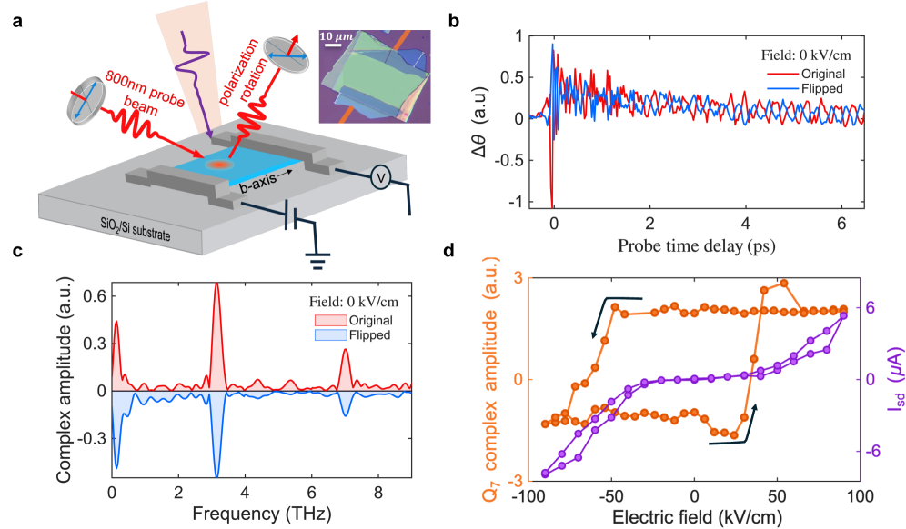
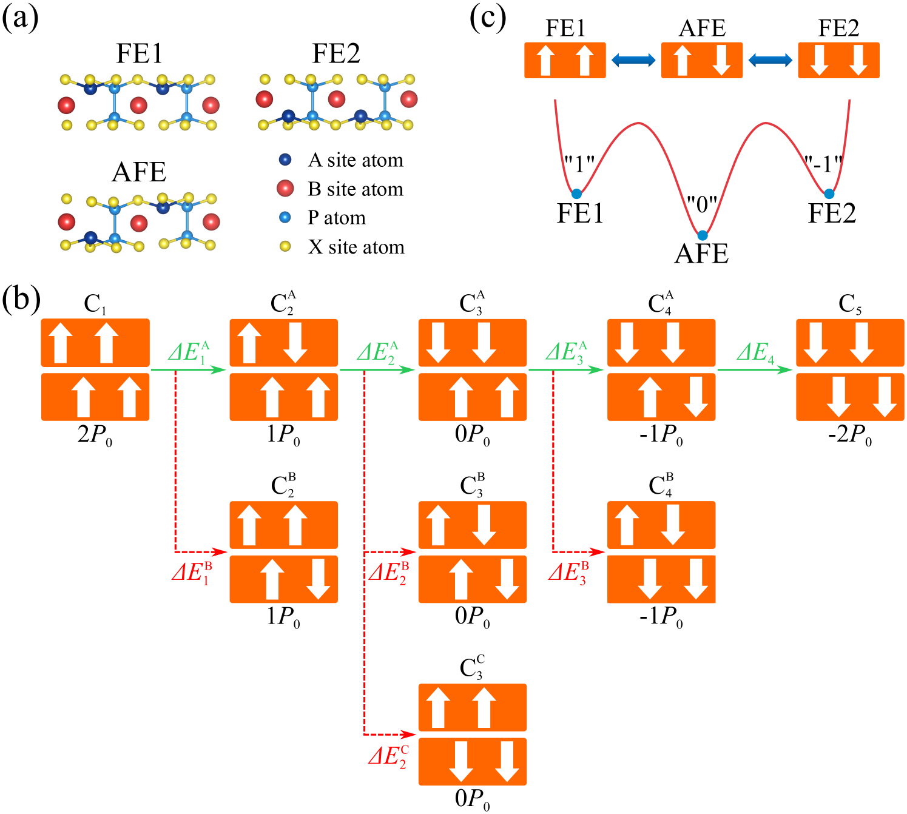

# 光で書き換える2次元強誘電体：NbOI₂の多相転移と多値記憶への道

- 執筆日：2026-04-20
- トピック：コヒーレントフォノン励起による2次元強誘電体 NbOI₂ の多強誘電相制御
- タグ：Devices and Functional Materials / Low-Dimensional Materials, Phase Transitions / First-Principles Calculations
- 注目論文：Chuanlin Liu et al., "Reversable phase transitions in ferroic two-dimensional Nb₂O₂I₄ through optically excited coherent phonons", arXiv:2604.14894 (2026)
- 参照論文数：7

---

## 1. なぜ今この話題なのか

半導体デバイスの微細化が限界に近づき、「次の記憶素子」として2次元（2D）材料への期待が急速に高まっている。とりわけ、van der Waals（vdW）力で積層された原子層状の強誘電体は、バルクの酸化物強誘電体では難しかった「原子レベルの薄さでも失われない自発分極」を実現し、超薄膜不揮発メモリや神経形態素子の新しい基盤材料として注目されている。

従来のBaTiO₃やPZTに代表されるペロブスカイト系強誘電体は、厚さを数ナノメートル以下にすると表面効果や脱分極場によって強誘電秩序が消失してしまう。これに対し、**vdW層状強誘電体** は弱いファン・デル・ワールス結合で積層されるため、1〜数層まで剥離しても固有の強誘電性が保持される。CuInP₂S₆（CIPS）、α-In₂Se₃、そして近年急速に研究が進む二ハロゲン化ニオブオキシ材料（NbOX₂、X = Cl, Br, I）がその代表例である。

特にニオブオキシアイオダイド **NbOI₂** は、室温で顕著な面内強誘電分極を示し、2D材料の中で最高クラスの圧電性能、および強烈なテラヘルツ（THz）発光を持つことが明らかになってきた。さらに最近、NbOI₂の自発分極の集団振動として「**フェロン** (ferron)」と呼ばれる新しい準粒子が発見され、その驚異的な長寿命（>100 ps）と超音速伝播（~10⁵ m/s）が報告された。NbOI₂はもはや単なる強誘電体ではなく、「分極波を用いた新しい情報処理」の実験場になりつつある。

こうした流れの中、2026年4月に注目すべき理論計算論文が登場した。Chuanlin Liuらによる arXiv:2604.14894 は、NbOI₂の単位胞2個分に対応する Nb₂O₂I₄ に対して実時間時間依存密度汎関数理論（rt-TDDFT）を適用し、「レーザーパルスで特定のコヒーレントフォノンモードを選択的に励起することで、通常の強誘電（FE）状態から三種の反強誘電（AFE）相および一種の準強誘電（FiE）相への可逆的転換が可能」であることを示した。これは、光パルスの周波数を変えるだけで2D強誘電体に「多値状態」を書き込めることを意味し、4値以上の多値不揮発メモリへの道を開く可能性を示唆する。

*図1（arXiv:2604.14894, CC BY-NC-ND 4.0）：Nb₂O₂I₄の強誘電（FE）相および光誘起で現れる AFE-1, AFE-2, AFE-3, FiE の4強誘電相の原子構造。青・赤矢印はNb原子の局所分極方向を示す。*

---

## 2. 未解決問題は何か

2D強誘電体を多値メモリ材料として実用化しようとすると、三つの根本的な問いに突き当たる。

**問い①：安定した複数の強誘電相を同一材料で実現できるか？**

従来の強誘電体メモリは「分極up（1）」と「分極down（0）」の2値切り替えを基本とする。多値化するには、エネルギー的に安定した複数の分極状態が必要だが、これをバルク材料で実現するのは容易ではない。2D vdW系では、積層順序（スライディング強誘電性）や反強誘電秩序を利用した多値化が理論的に提案されているが、「単一材料でAFE・FiE・FEの間を任意に行き来する」という制御はまだ達成されていない。Liu らの論文が正面から取り組んでいるのがまさにこの問いである。

**問い②：光パルスは強誘電体の分極を選択的・可逆的に切り替えられるか？**

強誘電分極をレーザーで操作する研究は活発だが、多くは「加熱→冷却」という非選択的な熱的プロセスか、強電場下でのドメイン反転に依存していた。コヒーレントフォノン励起による「選択的」相転換—つまり「この波長のレーザーを当てればこの相に行く」というアドレス指定性—が可能かどうかは未解決であった。これが実現すれば、電極を使わずに光だけで記憶素子を書き換えるという新しい操作パラダイムが開かれる。

**問い③：フォノン媒介の相転移メカニズムはどこまで一般的か？**

rt-TDDFT計算が示すメカニズムは「光電子励起→電子-フォノン結合→格子変形→相転移」という経路を辿る。しかしこの計算は0 Kの理想的な条件での話であり、有限温度・有限サイズの実試料での実験的検証は行われていない。また、同じNbOX₂族のNbOCl₂やNbOBr₂にも同様の多相制御が可能かどうか、さらには他のvdW強誘電体（α-In₂Se₃、CIPSなど）へどこまで展開できるかも未確定である。

---

## 3. 注目論文の核心

### Nb₂O₂I₄ = NbOI₂ の別表記

まず用語について整理しよう。「Nb₂O₂I₄」という化学式は、原子2個のニオブ・2個の酸素・4個のヨウ素からなる従来型の単位胞表記であり、実質的に NbOI₂（1式量単位で表した経験式）の2倍に相当する。つまり本論文は、コミュニティで広く知られる **NbOI₂** の電子状態計算を、単位胞を4×2×1に拡張した超セルで行ったものと理解してよい。NbOI₂ は空間群 P2₁/c（斜方晶）に属し、ニオブ原子が酸素・ヨウ素の配位多面体の中心からb軸方向にずれることで面内の自発分極（~141 pC/cm²）を生じる。この原子変位は弱い共有結合的なNb–O結合と、より長いNb–I結合の非対称性から生まれており、層内で均一に向きをそろえて強誘電秩序を形成する。

### 計算手法：rt-TDDFT

注目論文の最大の特徴は、**実時間時間依存密度汎関数理論（rt-TDDFT）** を用いた点にある。通常の時間依存DFTは「光に対する線形応答」を計算するが、rt-TDDFT はコボット電子・イオン状態を時間発展方程式に基づいてフェムト秒ステップで積分する。これにより、光励起直後の非平衡電子分布→電子-格子相互作用→格子変形→相転移、という一連のダイナミクスを統一的に記述できる。超セル（4×2×1）を用いた計算は、単位胞では見えないY点フォノン（波数ベクトルが単位胞の端にあたる）を含む折りたたみモードも扱える点で重要である。

### 6つの鍵フォノンモードと4つの新相

フォノン分散計算から、FE→AFE/FiE転移に関与する6つのモードが特定された。

- **A1-1**（Γ点）：FE位相で軟化し、全Nb原子が同方向に振動する「強誘電性維持モード」。このモードが大振幅で励起されると面内分極の反転を引き起こす。
- **A1-2**（Γ点）：A1-1と組み合わさって分極反転の最終段階を担う。
- **B1-1, B1-2**（Γ点）：横波的な変位モード。特定のレーザー周波数（3.1 eV）で選択的に活性化される。
- **B2-1**（Y点）：単位胞の2倍長周期を持つ反強誘電秩序形成に関与するゾーン境界モード。AFE-2 の形成に必須。
- **A1-3**（Γ点）：高エネルギー（4.25 eV）レーザーのみが活性化し、最も複雑な AFE-3 を生成する。

生成される新強誘電相は以下の通りである。

| 相 | 分極パターン | 自発分極 | 逆転経路 |
|---|---|---|---|
| AFE-1 | ↑↓↑↓（完全交互） | 0 pC/cm² | 熱的（400 K） |
| AFE-2 | ↑↑↓↓（2×2周期） | 0 pC/cm² | 熱的（400 K） |
| AFE-3 | ↑↑↑↓（非整合的） | 0 pC/cm² | 熱的（400 K） |
| FiE | ↑↑↑↓（+↑） | 80.4 pC/cm² | 光学的（↔FE） |

AFE-3相とFiE相の間のエネルギー差は ~25 meV/原子程度と小さく、これらの相はFE相と熱力学的に拮抗している。FiE相（強誘電・反強誘電の混合状態）は FE相との直接的な光学的スイッチングが可能であり、「FiE ↔ FE」という完全光学的な可逆スイッチングが初めて示された。

*図2（arXiv:2604.14894, CC BY-NC-ND 4.0）：Nb₂O₂I₄のフォノン分散と、相転移に関与する6つの特殊モードの固有ベクトル（矢印）。ΓおよびY点での各モードがどのNb原子を動かすかを示している。*

### 電子的励起とフォノン選択性

興味深い点は、異なるレーザーエネルギー（2.1, 3.1, 4.25 eV）を使っても、励起電子・正孔の電荷分布パターンが「ほぼ同一」であることだ。これはレーザーエネルギーに依存せず、内因的な電子-フォノン結合の強度がフォノンモードを選択的に活性化することを示唆する。言い換えれば、光が行うのは「フォノン系を励起するためのエネルギー供給」であり、「どのモードが活性化されるか」はNb原子とその配位多面体の幾何学的・電子的構造によって決まっている。

*図3（arXiv:2604.14894, CC BY-NC-ND 4.0）：4つのレーザー条件下でのrt-TDDFT計算。秩序パラメータ Pm（各Nb原子の分極振幅）とフォノンモード振幅の時間発展を示す。0.2〜1.1 ピコ秒で各相への転移が完了する。*

---

## 4. 背景と研究史

### NbOI₂ 族の発見と圧電性の特別さ

NbOI₂ という材料が強誘電体として注目されるようになったのは比較的最近である。Jia ら（2019）が NbOX₂ 族（X = Cl, Br, I）の強誘電性と反強誘電性の共存を理論的に予言し、その後 Wu ら（2022、arXiv:2202.01373）が高スループット計算による2940種類のモノレイヤーのスクリーニングを通じて、NbOI₂が2D材料中で最高の電気機械結合係数（near unity）を持つことを発見した。同時に実験的なレーザー走査振動計測でもその優れた圧電性が確認された。この圧電性能はIn₂Se₃やCuInP₂S₆など競合材料を明確に上回る。

NbOI₂の圧電性の「特別さ」は、その結晶構造に由来する。Nb–O–Nb原子鎖に沿った非中心対称変位と、I原子が形成する非対称な配位殻が相互作用し、格子変形に対する分極変化（Born有効電荷）が異常に大きい。この特徴が後述のフェロン出現とも深く関係している。

### フェロンの発見—分極波という新概念

NbOI₂研究に革命をもたらしたのが「**フェロン** (ferron)」の発見である。Choe らのグループが2025年に報告した arXiv:2505.22559 では、短パルスレーザーによって励起されたNbOI₂の自発分極場が、3.1 THzの狭帯域テラヘルツ放射を伴いながら超音速（~10⁵ m/s）で伝播する「コヒーレントな分極波」として観測された。フェロンは固有双極子を持ち、電磁場との強い相互作用から強い非線形応答を示し、伝播長は~20 μm に及ぶ。これはマグノン（磁性体の自発磁化の集団振動）の強誘電類似体であり、強誘電体における「分極情報の波として運ぶ」新しい自由度である。

フェロンの発見は注目論文の文脈で二重に重要である。第一に、NbOI₂のA1対称フォノンモードが3.1 THz付近に存在し、これがフェロンモードそのものであること。第二に、注目論文がNb₂O₂I₄の「コヒーレントフォノン励起」で相転移を起こすとき、このフェロンモード（A1-1, A1-2）が位相転移の引き金になっている可能性があること、である。

### 電気的に制御可能なフェロン非線形ダイナミクス

arXiv:2603.19394（Subediら、2026年）は、NbOI₂でのフェロン上方変換（ferron upconversion）を実験的に実証した。3.1 THz のフェロンモードをTHzパルスで共鳴励起すると、7.0 THz の光学フォノンへのコヒーレント変換が起きる。この過程の微視的機構は立方非調和結合（Q₃Q₇² 相互作用）であり、結合定数は ~8.4 meV·Å·amu⁻³/²と定量化された。さらに、グラフェン電極を介した電場印加によって強誘電分極を反転させると、フェロン振動の位相が反転し、この上方変換も非線形に変化する——すなわち「電気的に書き換え可能な非線形フォノンデバイス」が実証された。

*図4（arXiv:2603.19394, CC BY-NC-ND 4.0）：THz励起されたフェロンの電場制御。(a) デバイス模式図、(b,c) 分極反転前後の時間域スペクトル（フェロン位相が反転）、(d) 7.0 THzモードと電流の非線形ヒステリシスループ。強誘電スイッチングと連動した非揮発的フォノン制御を示す。*

### 他のvdW強誘電体との比較：CuInP₂S₆の多値分極

多値強誘電記憶というコンセプト自体は、NbOI₂に限られたものではない。Yu らのグループ（arXiv:2312.13856）は、CuInP₂S₆（CIPS）のビレイヤー・トリレイヤーが「五値・七値分極状態」を持つことを計算で示した。これは反強誘電秩序をもつCIPS固有の「ハーフレイヤー反転機構」—層ごとに異なるエネルギー障壁を持ち、電界によって上層・下層が独立にスイッチングできる—から生まれる。ビレイヤーならば（+2, +1, 0, -1, -2）×P₀ の5値を、トリレイヤーでは7値を保持できる計算である。

*図5（arXiv:2312.13856, CC BY 4.0）：CuInP₂S₆ビレイヤーにおける5値分極状態のモデル。矢印は各層の分極方向。電場によるハーフレイヤー反転によって状態間を遷移できる。*

CIPSの多値分極が電界制御に基づくのに対し、NbOI₂の注目論文は「光制御」という異なる自由度で多相状態を実現しようとしている。電界操作は高速スイッチングが得意である一方、局所分解能が高い。光操作は電極不要・非接触で面内局所書き込みが可能という長所を持つ。二つのアプローチは競合するというよりも、補完的と見るべきである。

---

## 5. どの解釈が最も妥当か

### 注目論文の主張を支える根拠

Liu らの計算が示す「フォノン選択的相転移」は、いくつかの重要な証拠によって支えられている。まず、各レーザー周波数に対応するフォノンモード振幅の時間発展（図3）は、当該モードが0.2〜1.1 psという超高速で大振幅になり、その後 Pm 秩序パラメータが変化することを明確に示す。相転移の時間スケールがフォノン振動1周期（~0.3 ps）と同程度であることも、熱的な「ゆっくりした」相転移ではなくコヒーレントなフォノン駆動の相転移であることと整合する。また、各AFE・FiE相のエネルギーがFE相と~25 meV以内に収まっていることは、低いエネルギー障壁ゆえに光励起で到達可能であることの理論的根拠となる。

実験的な支持証拠としては、超高速電子回折を用いた arXiv:2504.08089（Wangら、2025）の結果がある。この実験では、NbOI₂ ナノ結晶に紫外レーザーを照射したとき、2 ps 以内に強誘電分極が抑制され、その後回復と「過回復（overshoot）」が20 ps以上続くことが観測された。分極の抑制と回復のタイムスケールがrt-TDDFT計算のサブピコ秒スケールとおおよそ対応することは、理論と実験の重要な橋渡しとなっている。

### 残された疑問点と対立する解釈

ただし、いくつかの重要な注意点がある。

第一に、**計算は0 Kの理想条件** での結果である。室温では熱的ゆらぎが25 meVのエネルギー障壁（kBT at 300 K ≈ 26 meV）と同程度であり、誘起した相が熱的に不安定化される可能性がある。論文自体も「AFE-1への逆転は400 Kでの分子動力学で確認された」と報告しているが、これは逆に言えば室温付近でAFE-1が熱的に不安定な可能性を示唆する。多値メモリとして実用化するには、より高いエネルギー障壁を持つ組成・ひずみ条件の探索が必要であろう。

*図6（arXiv:2604.14894, CC BY-NC-ND 4.0）：分子動力学シミュレーションによる逆転経路。AFE相からFiEへの熱的転移（400 K）、およびFiEからFEへの光学的逆転を時間軸で示す。*

第二に、rt-TDDFTは時間ステップ50 アト秒・PBE汎関数という設定で行われており、ハイブリッド汎関数を使った場合にエネルギー障壁がどう変わるかは示されていない。強誘電体ではPBEがギャップと誘電率を過小評価する傾向があり、フォノンモードの周波数・結合定数に系統誤差が入る可能性がある。

第三に、NbOI₂の超高速電子回折実験（2504.08089）では「コヒーレント音響フォノン生成とその圧電応答」が観測されたが、光学フォノン（A1-1等）の直接的な振幅変化は電子回折で測定が難しく、実験側の空間・時間分解能の向上が待たれる。

### より強い結論、より弱い結論

現時点で比較的強く支持されるのは「コヒーレント光学フォノンがNbOI₂の格子対称性破れ（相転移）に寄与できる」という点である。これはNbOX₂族全体に共通する強いNb原子変位ポテンシャルと低いエネルギー障壁を背景に持ち、実験的傍証（超高速電子回折、THz応答）も整合している。

一方、「任意の相を光選択的にアドレス指定できる」という主張はまだ弱い。室温・有限サイズの試料で各AFE相が十分な熱的安定性を持つか、またフォノンモードの選択性が熱的ゆらぎに耐えるかは今後の実験課題である。

---

## 6. 何が一般化できるのか

### NbOX₂族への展開

最も自然な一般化の方向は、同族のNbOBr₂とNbOCl₂への展開である。Dansouら（arXiv:2503.16787）はこの3種の材料（NbOX₂, X = Cl, Br, I）に対して光誘起相転移と光歪み効果を計算で調べ、いずれも光によってFE→反強誘電または常誘電への転移が起きることを示した。ただし詳細なフォノンモード選択性については注目論文より踏み込んでいない。ヨウ素（I）はそのソフトな分極率ゆえにNb–I結合が最も弱く、エネルギー障壁が最小となるため、Nb₂O₂I₄は「最も操作しやすい」系として実験の最前線になることが期待される。

### α-In₂Se₃ やスライディング強誘電体との関係

α-In₂Se₃は面内・面外の双方に強誘電性を示す2D材料であり、近年はシリコン互換プロセスでの成長も報告されている（arXiv:2602.08381）。しかしIn₂Se₃の強誘電分極は本質的にはSeイオンの垂直変位に起因し、NbOI₂の「Nb–O–Nb鎖沿いの面内変位」とは機構が異なる。また、h-BNやMoS₂などでのスライディング強誘電性（層間ずれによる分極発生）は、単一層の固有変位を使う NbOI₂ とは設計原理が根本的に異なる。したがって注目論文の「コヒーレントフォノン駆動の多相制御」は NbOX₂ に特有の戦略であり、そのまま他の2D強誘電体に適用できるわけではない。

### フォノン工学とデバイス応用

過渡吸収分光（arXiv:2510.19188）が示すNbOI₂の励起子寿命（~数十ps）は、光書き込み後にキャリアが素早く消失し強誘電秩序が残存するという「光書き込み→残留」のシナリオと整合する。このシナリオが実証されれば、光アドレス可能・電気読み出し可能なハイブリッドメモリセルという概念が具体化できる。また、フェロンの電気制御（arXiv:2603.19394）と組み合わせれば、「光で多値書き込み→フェロン波で並列読み出し」という情報処理アーキテクチャさえ視野に入る。

2D強誘電体の多値制御が一般的なデバイス設計原理になるためには、（1）高い読み出しコントラスト比、（2）~10⁸回以上の書き換え耐久性、（3）データ保持時間（retention）の確保、（4）室温での十分な熱安定性、という工学的ハードルを越える必要がある。これらは今後の実験研究が評価すべき課題である。

---

## 7. 基礎から理解する

### 強誘電体とは何か

**強誘電体** (ferroelectric) とは、外部電場がなくても自発的な電気分極（自発分極 Ps）を持ち、かつその分極の方向が外部電場によって反転できる材料のことである。「電場で制御できる永続的分極」という特徴が不揮発メモリの根幹をなす。強誘電体における分極は、「正イオンと負イオンの重心が一致しない」という結晶構造の非中心対称性から生まれる。

$$\mathbf{P} = \frac{1}{\Omega}\sum_{i} Z_i^* \mathbf{u}_i$$

ここで $\Omega$ は単位胞体積、$Z_i^*$ は第 $i$ 番原子の **Born 有効電荷** テンソル、$\mathbf{u}_i$ は平衡位置からの変位である。Born 有効電荷は「原子が動いたとき、周囲の電子がどれだけ再分布して実効的な電荷を増幅するか」を表すテンソルであり、NbOI₂のようなイオン性が強い系では$|Z^*_{\rm Nb}|$が形式電荷（+5）を大幅に超えた値（例えば +7〜+9）を取りうる。これが NbOI₂の巨大分極・圧電性の物理的起源である。

### van der Waals 層状材料の特徴

**van der Waals（vdW）材料** は、原子が共有結合またはイオン結合で連結された2次元層が、弱いファン・デル・ワールス力（ロンドン分散力、静電四重極相互作用など）によって積層した固体である。층間結合が非常に弱いため（~数十 meV/nm²）、機械的に剥離して単層や数層のフレークを得ることができる。単層になっても面内の化学結合は変わらないため、面内の強誘電性・圧電性は保持される——これがvdW強誘電体の最大の強みである。

### フォノンとコヒーレントフォノン

**フォノン** は結晶格子の集団振動を量子化した準粒子で、原子の変位 $\mathbf{u}(\mathbf{r}, t) = \mathbf{e}_k e^{i(\mathbf{k}\cdot\mathbf{r} - \omega_k t)}$ のような平面波として記述される（$\mathbf{e}_k$：偏光ベクトル，$\omega_k$：角振動数）。熱平衡状態のフォノンは各モードが独立に（位相関係なく）励起されるが、**コヒーレントフォノン** は超短パルスレーザーで特定モードが「同位相で」大振幅に励起された状態であり、古典的な格子振動として振る舞う。コヒーレントフォノンの大振幅励起は、平衡構造が保てないほど格子を非線形に歪め、相転移の引き金となりうる——これが本論文の基本コンセプトである。

### rt-TDDFT の概念

**rt-TDDFT** では、時間依存コーン・シャム方程式

$$i\hbar \frac{\partial}{\partial t}\psi_j(\mathbf{r}, t) = \hat{H}_{\rm KS}[n(\mathbf{r}, t)]\, \psi_j(\mathbf{r}, t)$$

を時間ステップ $\Delta t$（本論文では50アト秒）ずつ数値的に積分する。$\hat{H}_{\rm KS}$ は電子密度 $n(\mathbf{r}, t) = \sum_j |\psi_j|^2$ に依存したコーン・シャムハミルトニアンであり、外部光場（レーザー）を $\mathbf{A}(t)$（ベクトルポテンシャル）として加える。イオンの時間発展は古典的なニュートン方程式（Ehrenfest動力学）で記述され、電子からイオンへの力はHellmann-Feynman力として計算される。この「電子量子力学＋古典イオン動力学」の組み合わせにより、光励起→電子-フォノン結合→格子変形の全ダイナミクスを追跡できる。

---

## 8. 専門用語の解説

**1. van der Waals 強誘電体（vdW ferroelectric）**
層間がvdW力で結合した2次元層状結晶が示す強誘電性。単原子層でも自発分極を保持できるため、究極の薄膜強誘電デバイスへの道を開く。代表例：NbOI₂、α-In₂Se₃、CuInP₂S₆、スライディング強誘電体（h-BN、MoS₂ビレイヤー）。

**2. 反強誘電体（antiferroelectric, AFE）**
隣接ユニットセルの自発分極が互いに逆向きに整列し、巨視的な分極がゼロになる秩序相。外部電場を加えると双峰ヒステリシスを示し、FEへのスイッチングが起きる。NbOI₂ではNb変位が交互反転したAFE相が複数存在する。

**3. 準強誘電体（ferrielectric, FiE）**
ferrimagnetic（フェリ磁性）の電気的類比。同方向・逆方向の分極単位が共存し、正味の分極は非ゼロだが最大値より小さい。本論文ではFiE相の自発分極は80.4 pC/cm²で、FE相（141 pC/cm²）の約57%に相当する。

**4. Born 有効電荷（Born effective charge, Z*）**
原子 $i$ が変位 $\mu$ したときに生じる電気分極の変化を、$\delta P_\alpha = (e/\Omega) Z^*_{\alpha\mu} u_\mu$ として定義するテンソル。イオン性が強い系では形式電荷を大きく超える「異常」な値をとり、大きな分極と高い圧電性の起源となる。

**5. コヒーレントフォノン（coherent phonon）**
超短パルスレーザーによって特定フォノンモードが全結晶で同一位相で励起された状態。巨視的な格子変位として観測でき、X線・電子回折の回折強度変化や光反射率変化として測定される。大振幅コヒーレントフォノンは非調和ポテンシャルを感じて非線形応答・相転移を誘起しうる。

**6. フェロン（ferron）**
強誘電体における自発分極の集団振動から生まれる準粒子。マグノン（磁化の集団振動）の電気的類比であり、NbOI₂では3.1 THzの横型光学フォノンモードに由来する。双極子性を持ち、電磁場と強く相互作用し、超音速（~10⁵ m/s）で伝播する。寿命は>100 psと長く、磁性体のマグノンに匹敵する。

**7. 実時間時間依存密度汎関数理論（rt-TDDFT）**
光励起した電子状態の時間発展を実時間でシミュレートする第一原理計算手法。周波数応答（線形応答TDDFT）と異なり、大きな光場や超高速・強非線形現象を記述できる。電子-格子結合を通じた非平衡ダイナミクス（超高速相転移、フォノン励起など）の研究に威力を発揮する。

**8. 電気機械結合係数（electromechanical coupling factor, k²）**
電気エネルギーと弾性エネルギーの相互変換効率を表す無次元量。$k^2 = e^2 / (\varepsilon c)$ の比として定義される（$e$：圧電応力定数、$\varepsilon$：誘電率、$c$：弾性定数）。$k^2 = 1$（unity）が理論的上限であり、NbOI₂ モノレイヤーはこの上限に近い値をもつ。

**9. スライディング強誘電性（sliding ferroelectricity）**
本来は非極性の単層からなるvdW積層で、層間の相対ずれ（slide）によって面直分極が生じる現象。h-BN やMoS₂ビレイヤーが代表例。分極の大きさ・方向は層のスタッキング状態（AA', AB, AB'等）によって決まり、機械的スライドまたは電場によってスイッチングできる。NbOI₂のような「固有単層強誘電性」とは物理機構が異なる。

**10. 光歪み（photostriction）**
光照射によって材料の寸法（格子定数）が変化する現象。光吸収で生成したキャリアが逆圧電効果（分極変化→ひずみ）を介して格子を歪める。NbOX₂ ではNb原子の光誘起変位が格子定数変化を引き起こし、これがFE→AFE相転移時の体積変化とも連動する。

---

## 9. 今後の展望

NbOI₂（Nb₂O₂I₄）の光誘起多強誘電相転移の理論予測は、2D強誘電体研究に新たな方向性を示した。rt-TDDFT計算が示した「フォノンモード選択的な多相制御」と「FiE ↔ FE の完全光学的スイッチング」は、計算内部での整合性は高く、フォノン解析・分子動力学・電子構造計算が支え合う説得力ある結果である。最近の実験研究——超高速電子回折によるサブピコ秒分極ダイナミクス（2504.08089）、フェロン上方変換の電気的制御（2603.19394）——も理論シナリオと矛盾しない。したがって、「コヒーレントフォノン励起がNbOI₂の格子秩序を超高速に変容させる」という基本命題はほぼ確からしいと言える。一方で、AFE相の室温安定性・热的保持時間・エネルギー障壁の精密な値については、ハイブリッド汎関数やGW補正を用いた高精度計算と、時間分解X線・電子回折による実験的検証が不可欠であり、現時点ではまだ未確定の部分として残る。

今後1〜3年で特に注目すべき論点は三つある。第一は「超高速電子顕微鏡（UEM）を用いた実空間・実時間でのAFE/FiEドメイン生成の可視化」であり、どのドメイン核形成機構が働くかを空間分解能1 nm、時間分解能1 ps 以下で捉える実験が鍵となる。第二は「有限温度でのフリーエネルギー比較」であり、マシンラーニングポテンシャルを利用した有限温度分子動力学が各相の熱安定性・保持時間を精密に評価するうえで有力なアプローチになる。第三は「NbOI₂との異種vdW材料の混合系」であり、CIPSやIn₂Se₃など他の強誘電体との積層によって新しいヘテロ強誘電界面が出現し、多値スイッチングのコントラスト比と熱安定性を同時に向上させる可能性がある。フェロン波を用いた「光書き込み→分極波伝送→電気読み出し」というパラダイムはまだ構想段階だが、NbOI₂固有の優れた圧電性・フェロン特性を最大限に活かした素子設計として、今後数年の実験的実証が期待される。

---

## 参考論文一覧

1. **[arXiv:2604.14894]** Chuanlin Liu, Dan Liu, Jie Guan, Chao Lian, "Reversable phase transitions in ferroic two-dimensional Nb₂O₂I₄ through optically excited coherent phonons," (2026). — 本記事の注目論文。rt-TDDFTにより、NbOI₂でレーザー波長選択的なコヒーレントフォノン励起が4種の強誘電多相転移を引き起こすことを初めて示した計算論文。 [https://arxiv.org/abs/2604.14894](https://arxiv.org/abs/2604.14894)

2. **[arXiv:2603.19394]** Sujan Subedi et al., "Electrically switchable ferron upconversion in a van der Waals ferroelectric," (2026). — NbOI₂においてTHz励起フェロン（3.1 THz）から光学フォノン（7.0 THz）への非線形上方変換を実験実証し、電場による非揮発的切り替えを示したグラフェン電極デバイス実験。 [https://arxiv.org/abs/2603.19394](https://arxiv.org/abs/2603.19394)

3. **[arXiv:2505.22559]** Jeongheon Choe et al., "Observation of Coherent Ferrons," (2025). — NbOI₂に短パルスレーザーを照射したとき生じる超音速伝播・長寿命コヒーレント分極波「フェロン」を初めて観測し、その双極子性と強いTHz放射を報告した実験論文。 [https://arxiv.org/abs/2505.22559](https://arxiv.org/abs/2505.22559)

4. **[arXiv:2504.08089]** Yibo Wang et al., "Ultrafast dynamics of ferroelectric polarization of NbOI₂ captured with femtosecond electron diffraction," (2025). — 超高速電子回折・偏向計測法によりNbOI₂ナノ結晶の分極がUVレーザー照射後2 ps以内に抑制され、その後20 ps以上にわたって増強される様子を実験で直接観測した論文。 [https://arxiv.org/abs/2504.08089](https://arxiv.org/abs/2504.08089)

5. **[arXiv:2510.19188]** Salman Ahsanullah et al., "Transient Absorption Spectroscopy of NbOI₂," (2025). — フェムト秒ポンプ・プローブ反射率測定によりNbOI₂の励起子特性（2.34 eV共鳴、寿命数十ps）と面内光学異方性を詳細に解明した過渡吸収分光実験。 [https://arxiv.org/abs/2510.19188](https://arxiv.org/abs/2510.19188)

6. **[arXiv:2312.13856]** Guoliang Yu et al., "Polarization multistates in antiferroelectric van der Waals materials," (2023). — CuInP₂S₆ビレイヤー・トリレイヤーで「半層ずつの反転」メカニズムにより5値・7値分極状態が安定存在することを第一原理計算で示した、vdW多値強誘電の先駆的理論論文。 [https://arxiv.org/abs/2312.13856](https://arxiv.org/abs/2312.13856)

7. **[arXiv:2202.01373]** Yaze Wu et al., "Data-driven discovery of high performance layered van der Waals piezoelectric NbOI₂," (2022). — 2940種モノレイヤーの高スループット計算スクリーニングによりNbOI₂が最高の電気機械結合係数（near unity）を持つことを発見し、実験的にも圧電優位性を確認した、NbOI₂研究の出発点となった論文。 [https://arxiv.org/abs/2202.01373](https://arxiv.org/abs/2202.01373)
