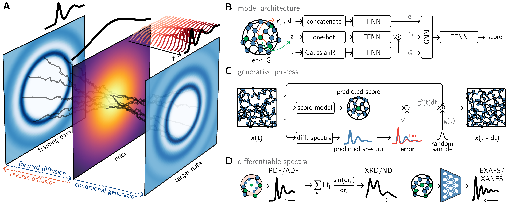
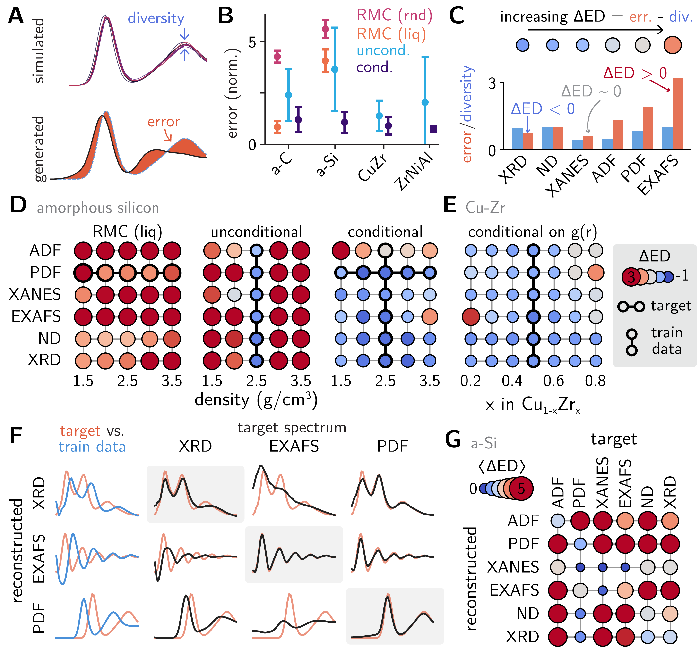
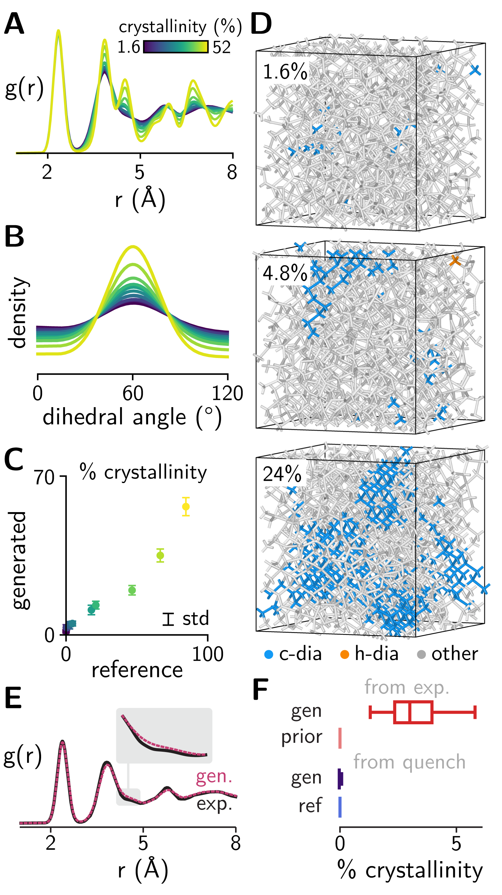
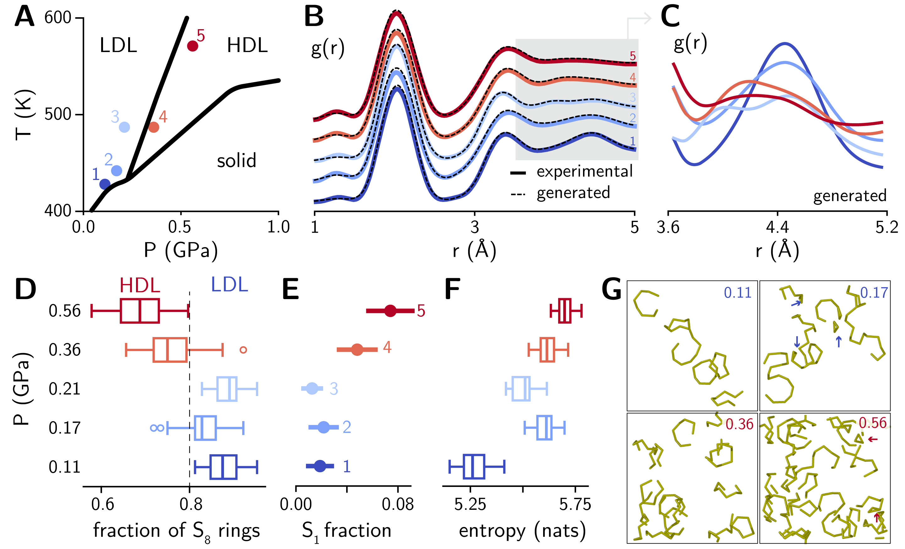
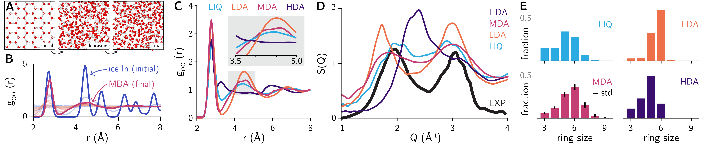

# スペクトルから原子配列を解く：生成AIが非晶質構造解析の逆問題に挑む

- **執筆日**: 2026-04-04
- **トピック**: 非晶質材料の局所構造解析における逆問題と生成AIの応用
- **タグ**: Measurement and Spectroscopy / Nanostructures; Defects and Impurities / Machine Learning; Synchrotron Measurements
- **注目論文**: Guo & Schwalbe-Koda, "Generative Inversion of Spectroscopic Data for Amorphous Structure Elucidation," arXiv:2603.23210 (2026)
- **参照関連論文数**: 7本

---

## 1. なぜ今この話題なのか

ガラス、非晶質半導体、金属ガラス、バッテリー電極材料——これらはいずれも「アモルファス（非晶質）材料」と呼ばれる。結晶のように原子が規則正しく並んではいないが、だからといって完全にでたらめに原子が並んでいるわけでもない。ナノメートルスケールでの短距離・中距離秩序（short-range order / medium-range order）が、その電気的・機械的・光学的特性を決定的に支配している。

にもかかわらず、非晶質材料の原子構造を「実験から直接読み取る」ことは、長年にわたって材料科学における最難関課題のひとつであり続けてきた。結晶性材料であればX線回折のブラッグピークから格子定数・対称性・原子位置を精密に決定できるが、非晶質ではブラッグ散乱が消えてしまう。残るのは幅広いハローパターンと拡散散乱だけであり、そこから原子の三次元配置を再構成することは——原理的には情報が存在していても——「逆問題」として極めて困難である。

この難問に現実的な突破口を開いてきたのが、**ペア分布関数（Pair Distribution Function, PDF）** 解析であった。PDF は全散乱（total scattering）測定から得られる実空間の構造情報であり、ある原子から距離 $r$ だけ離れた場所に別の原子が見つかる確率密度を与える。結晶・非晶質・ナノ粒子を問わず短距離から中距離の原子間相関を直接反映するため、この20年で第三世代放射光施設・中性子散乱施設の整備とともに広く普及し、現在では非晶質材料解析の標準的な武器となっている。

ところが、PDFそのものは「1次元の情報」である。実際の材料には数千〜数万個の原子が三次元空間に配置されており、「このPDFを再現する原子配列はどれか」という問いへの答えは一般に無数に存在する。これがPDF解析における逆問題の本質であり、従来は専門家による試行錯誤的なモデリング（逆モンテカルロ法など）に頼らざるを得なかった。

この状況を根本から変えようとしているのが、機械学習——とりわけ「生成モデル」の急速な発展である。2022年ごろから生成拡散モデル（diffusion model）がタンパク質構造予測・分子設計・結晶材料探索に次々と応用されはじめ、非晶質材料への展開も加速している。2026年3月に公開された Guo & Schwalbe-Koda の論文（arXiv:2603.23210）は、この流れの最前線に位置する。彼らが開発した GLASS（Generative Learning of Amorphous Structures from Spectra）フレームワークは、PDFをはじめとする複数のスペクトルデータから非晶質の三次元原子構造を直接生成するという、従来とは根本的に異なるアプローチを提案している。

なぜ今この問題が注目を集めるのか。その背景には少なくとも三つの時代的要請がある。第一に、リチウムイオン電池・固体電池・水素貯蔵材料・触媒など、次世代エネルギー材料において非晶質相の正確な構造理解が不可欠になっていること。第二に、超高速X線自由電子レーザー（XFEL）の利用が拡大し、フェムト秒タイムスケールでのPDF測定が現実のものとなりつつあること（2504.21462）。そして第三に、大規模言語モデルに端を発する生成AIの技術的成熟が、他分野からの類推的応用を可能にしていることである。

*図1. GLASS フレームワークの概要。スコアベース生成モデルによる構造事前分布の学習と、微分可能なスペクトルモジュールによる条件付け生成の組み合わせ。(arXiv:2603.23210, CC BY-SA 4.0)*

---

## 2. この分野で何が未解決なのか

PDF解析と非晶質構造解明の分野に横たわる未解決問題は、いくつかの異なるレベルに整理できる。

**問い①：逆問題の一意性——どんな原子配列がPDFを生み出したのか？**

PDFは一次元の関数であり、与えられたPDFパターンを再現する三次元原子配列は無数に存在しうる。この非一意性は単なる数学的問題ではなく、物理的にも意味を持つ。たとえばアモルファスシリコンには、連続ランダムネットワーク（CRN）モデルと準結晶的秩序（paracrystalline）モデルという二つの競合する構造モデルが長年議論されてきた（arXiv:2407.16681）。どちらのモデルも実験PDFをほぼ同等に再現できてしまうため、スペクトルフィッティングだけでは決着がつかなかった。生成モデルがこの論争にどこまで決定的な答えを与えられるかは、依然として開かれた問いである。

**問い②：中距離秩序の捕捉——1〜3 nmスケールの相関をどう読むか？**

非晶質材料の性質を決定する上で特に重要なのは、第1近接（〜3 Å）を超えた中距離秩序（3〜20 Å）である。例えばガラスの第1シャープ回折ピーク（FSDP: First Sharp Diffraction Peak）はこのスケールの構造を反映しているが、その物理的起源については今も議論が続いている。Rodriguez らが指摘するように（arXiv:2603.06484）、異なるクラスの非晶質材料——アモルファス半導体と金属ガラス——ではPDFの「第1〜2ピーク間の非ゼロ値の有無」という違いが中距離秩序の本質的な差異を示している可能性がある。しかしこのような微細な構造的差異を逆問題で捕捉するには、単純なPDFフィッティングでは不十分である。

**問い③：多相・非均一系への対応——均一なモデルでは捉えられない構造とは？**

アモルファスシリコンの「準結晶的クラスター」、液体硫黄の「液液相転移」、ボールミル処理した水氷の「中密度アモルファス氷」など、現実の非晶質材料はしばしば局所的に不均一な構造を持つ。従来の解析では均一なランダムモデルに平均化されてしまいがちなこれらの構造を、いかに確率論的に表現するかという問題は未解決のままである。

**問い④：マルチモーダル情報の統合——PDFだけでは足りないのか？**

PDFは強力な構造プローブだが、単独では化学種の識別（X線PDFはX線散乱因子に依存）や局所配位化学（XANESやEXAFSが得意）の詳細な情報を十分には与えてくれない。複数のスペクトル情報を整合的に組み合わせて三次元構造を推定することが理想的だが、これを系統的に行う方法論はまだ発展途上にある。

---

## 3. 注目論文の核心：何が前進し、何がまだ仮説か

### GLASSフレームワークの設計思想

Guo & Schwalbe-Koda (arXiv:2603.23210) が提案する GLASS は、「非晶質構造の逆問題」をスコアベース生成モデルとして定式化した点で従来手法と根本的に異なる。

従来の逆モンテカルロ（RMC）法では、実験PDFを目標として原子位置をランダムウォーク的に更新し、チ・スクエアが最小になるような配置を探索する。これは最適化問題として問題を設定しているため、（a）解の探索効率が低い、（b）「最大エントロピー原理」に引っ張られ過度に無秩序な解に収束しやすい、（c）専門家による制約条件の手動設定が必要——といった問題があった。

GLASSの核心にあるのは二段階のプロセスである。

**第1段階：構造事前分布の学習。** 低品質のアモルファス構造（高速焼き入れ分子動力学シミュレーションで生成）を大量に用意し、これらに対してdenoising score matchingを適用する。グラフニューラルネットワーク（GNN）が原子配置のノイズ除去を学習することで、「物理的に妥当なアモルファス構造の分布」という事前知識がモデルに埋め込まれる。

**第2段階：スペクトル条件付き生成。** 逆時拡散（reverse-time denoising）の各ステップにおいて、学習済みの構造事前分布からのスコアと、ターゲットスペクトルとの残差から計算される勾配の両方を組み合わせて原子配置を更新する。スペクトルの計算（PDF、角度分布関数ADF、X線回折XRD、中性子回折ND、XANESサロゲート、EXAFSサロゲート）はすべて微分可能な形式で実装されており、誤差逆伝播が可能である。

この設計の本質は、「物理的妥当性（事前分布）」と「実験との整合性（条件付け）」をなめらかに結合している点にある。従来のRMCが純粋な最適化であり物理的事前知識を組み込みにくかったのに対し、GLASSは生成モデルの事前分布に物理的な構造の分布を事前学習している。

### 三つのテストケースが示す成果と限界

論文では三つの実験的に意味のある系でGLASSを検証している。

**アモルファスシリコンの準結晶性。** 実験的なa-SiのPDFを入力とした生成では、GLASSは「概ね無秩序なネットワークの中に約3%の結晶的秩序領域が分散している」構造を一貫して生成した。これはいわゆる「準結晶（paracrystalline）モデル」を支持する結果であり、長年の論争に対して生成モデルという新しい視点から証拠を提示している。連続ランダムネットワークモデルを入力すると、PDFへの適合精度がわずかに低下することも確認された。

**液体硫黄の液液相転移（LLT）。** 液体硫黄は温度に依存してS₈環構造と高分子鎖構造の割合が変化し、低密度相（LDL）と高密度相（HDL）の間に不連続な転移が存在する。GLASSはPDFのみを入力として、この相転移に際した局所構造変化——S₈環の割合、鎖末端の数、情報エントロピー——を高精度で再現した。拡散散乱の微細な変化からこれほど豊かな局所構造情報を抽出できたことは注目に値する。

**ボールミル処理したアモルファス氷の中密度相。** 機械的処理によって得られる「中密度アモルファス氷（MDA）」は、低密度相（LDA）と高密度相（HDA）の中間的な構造をもつとされている。GLASSは実験PDFを入力として、酸素—酸素ペア分布と水素結合ネットワークのリングサイズ分布の両方においてLDA・HDAの中間的な特徴を持つ構造を生成した。これはMDAが単なる混合相ではなく固有の構造的特徴を持つ相であることを示唆する。

### 前進した点と仮説的な点

明確に前進したのは以下の点である。第一に、PDFが「単一スペクトルモダリティの中で最も情報量が高い」ことを定量的に実証した。PDF条件付けで生成された構造はEXAFSもXRDも再現するが、逆（EXAFSやXRDのみから構造を生成）は成り立たない。第二に、従来のRMCと比べて、生成速度（5000原子系で約1分/GPU）・解の多様性・物理的妥当性のすべてで優れていることを示した。第三に、GNNによる低精度の事前学習データで高精度な生成が可能であることを示した——これは高品質なシミュレーションデータへの依存から解放される可能性を示唆する。

一方でまだ仮説的・限定的な点もある。生成構造が「真の構造」である保証はなく、あくまで「実験PDFを再現する物理的に妥当な構造候補の集合」を提示しているに過ぎない。また、GLASS の学習は対象物質系（a-C、a-Si、SiO₂など）ごとに個別の事前学習を必要とし、汎用モデルには至っていない。多成分系や表面を含む系、長時間相関を持つ系への適用可能性も今後の検証が必要である。

*図2. 複数の非晶質系（a-C, a-Si, SiO₂, Cu-Zr, Zr-Ni-Al）における再構成精度の比較。GLASS（条件付き生成）は逆モンテカルロ（RMC）および無条件生成に対して、誤差・多様性の両面で優れた性能を示す。(arXiv:2603.23210, CC BY-SA 4.0)*

---

## 4. 背景と研究史：この論文はどこに位置づくか

### PDF解析の誕生と発展

ペア分布関数の概念自体はデバイ（1915年）にまで遡れるが、材料科学における「現代的PDF解析」の幕開けは1990年代である。T. Egami と S. J. L. Billinge らは、パルス中性子スパレーション源から得られる広いQ範囲（Q: 散乱ベクトルの大きさ）の全散乱データをフーリエ変換することで、非晶質から結晶性まで統一的に扱える原子スケール構造解析ツールとしてPDFを確立した。PDFの定義を改めて書けば：

$$G(r) = 4\pi r [\rho(r) - \rho_0] = \frac{2}{\pi} \int_0^{Q_{\max}} Q[S(Q)-1]\sin(Qr)\,dQ$$

ここで $G(r)$ は還元PDF、$\rho(r)$ は原子密度のペア相関、$\rho_0$ は平均原子密度、$S(Q)$ は全散乱構造因子（total structure factor）、$Q_{\max}$ は実験的に到達可能な最大散乱ベクトルである。X線または中性子を用いた全散乱（ブラッグ散乱＋拡散散乱）を測定し、バックグラウンドや多重散乱を補正した後でフーリエ変換を行うことでPDFが得られる。

ピーク位置は原子間距離、ピーク面積は配位数、ピーク幅は静的・動的な原子変位を反映する。結晶では$r$が大きくなっても鋭いピークが続くが、非晶質では$r \gtrsim 10$ Å 程度でピークが消えていく——この「相関の消え方」がアモルファス構造の特徴を直接映し出している。

### 逆モンテカルロ（RMC）法の時代

PDFが測定できるようになると次の問題は「そのPDFを生み出す原子配列は何か」という逆問題である。1990年に McGreevy & Pusztai が提案した逆モンテカルロ（Reverse Monte Carlo, RMC）法は、この問題への最初の実践的回答であった。ボックス内に原子をランダムに配置し、RDF（ペア相関関数）が実験PDFに近づくように原子をランダムに動かすという、単純なメトロポリス的モンテカルロアルゴリズムである。RMCProfile（現在はRMCProfile7）はこの手法を洗練させ、PDF・EXAFS・ブラッグ散乱の同時フィッティングを可能にした。

しかしRMCには本質的な弱点がある。「最大エントロピー原理」に基づくため、過度に無秩序な解を好む傾向がある。また非常に多くの試行ステップを必要とし（典型的に10⁷〜10⁸回）、計算コストが高い。さらに、化学結合や配位数の合理的な範囲を明示的に指定するための「専門家判断」が不可欠であった。

### 機械学習による変革

2018年ごろを境に、機械学習的アプローチがPDF解析にも波及してきた。初期の試みとしては、PDFからナノ粒子の構造モデルを決定するためにDFT計算をオンラインで機械学習と組み合わせた手法（arXiv:2209.01358, Kløve et al.）があり、出発配置を必要とせずに未知化合物の構造を同定できることを示した。この研究はナノ結晶・非晶質ナノ粒子を対象としていたが、アモルファスバルクへの拡張には大きなギャップがあった。

2025年には Sapnik ら（arXiv:2504.21462）が、欧州XFELを用いて単一の〜30 fsパルスから高品質な全散乱データとPDFを取得することに成功した。結晶・ナノ結晶・非晶質・液体・溶液と幅広い材料で実証されたこの成果は、フェムト秒タイムスケールでの非晶質構造ダイナミクス測定への扉を開くものである。これにより「PDF逆問題」は静的構造だけでなく時間分解の文脈でも深刻な課題となりつつある。

### 生成拡散モデルの台頭と非晶質材料への応用

2020年代に入り、画像生成・タンパク質構造予測の分野で開発された拡散モデル（denoising diffusion probabilistic model, DDPM）が材料科学に流入し始めた。Yang & Schwalbe-Koda（arXiv:2507.05024）は、GNNベースの拡散モデルで非晶質構造を直接生成することに挑戦し、アモルファスSiO₂やCu-Zr金属ガラスについて「分子動力学の1000倍高速」な生成を実現した。短距離・中距離秩序、弾性特性が忠実に再現され、さらには低冷却速度に相当する大規模構造の探索も可能にした。この研究は、「スペクトル条件付け」なしでの非晶質構造生成の可能性を示したものであり、GLASS の前段となる重要な布石である。

Rodriguez ら（arXiv:2603.06484）は同時期に、アモルファス半導体と金属ガラスのPDFに見られる構造的共通性を体系的に整理した。アモルファス半導体同士ではPDFパターンが類似している一方で、金属系では第1〜2ピーク間に非ゼロの「象の背」ピークが現れるという違いが報告されている。このような材料クラス間の体系的な比較は、生成モデルの事前学習データ設計にも指針を与えうる。

GLASSはこうした一連の研究の合流点に位置する。拡散モデルによる構造生成（Yang & Schwalbe-Koda 2025の先行研究）を土台としながら、これに「微分可能なスペクトル計算」という革新的な要素を組み合わせることで、実験データによる構造の条件付け生成を初めて実現した論文である。

---

## 5. どの解釈が最も妥当か：証拠・比較・限界

### GLASSの結論を支える根拠

GLASS の主要な主張——「PDFは非晶質構造決定における最も情報量の高い単一プローブである」——は、複数の独立した証拠によって支持されている。

まず、クロスモーダル再現性が顕著である。PDF条件付けで生成した構造は、明示的に条件として与えていないEXAFSやXRDのパターンを自動的に再現する。これはPDFが短距離と中距離の両方の秩序を同時に拘束しているために、他のスペクトルと高い相関を持つためと解釈できる。逆に、EXAFSやXANESのみを条件付けとした場合にはPDFパターンの再現性が大幅に低下する。これはPDFが包括的な構造情報を持つ一方で、X線吸収スペクトルが局所的な化学環境に特化した情報を持つという、両者の性質の違いを反映している。

次に、RMCとの定量比較が重要な証拠を提供している。図2に示すように、5種類のアモルファス系（a-C, a-Si, SiO₂, Cu-Zr, Zr-Ni-Al）すべてにおいて、GLASSは誤差（再現精度）と多様性（解の分布の広さ）の両方でRMCを上回っている。特に多様性の観点では、RMCが単一の解に収束する傾向があるのに対し、GLASSは確率的に異なる複数の妥当な構造を生成できる。これは非晶質の「構造的多様性」——同じ組成でも多様な局所環境が共存しているという性質——をよりリアルに反映している。

*図3. GLASSが実験的PDF条件下で生成したa-Siの構造。二面角分布・結晶性パラメータの分布が示され、生成構造の約3%が局所的な結晶的秩序を持つ準結晶的モデルを支持する。(arXiv:2603.23210, CC BY-SA 4.0)*

### 他のアプローチとの比較

同時期に発表された ActiveStructOpt（arXiv:2602.20959, Slagle et al.）は、グラフニューラルネットワークとアクティブラーニング（ベイズ最適化）を組み合わせて、X線PDFやXANES/EXAFSから構造を決定する別のAIベースフレームワークである。ActiveStructOptとGLASSは相補的な位置づけにある。GLASSが数千原子規模の非晶質バルクに特化し「生成モデルの事前分布」を活用する一方、ActiveStructOptは結晶・非晶質を問わずさまざまな系に適用可能な汎用性を持つが、大規模非晶質系への拡張は課題として残っている。

また、AMDEN（arXiv:2509.13916, Finkler et al.）は逆設計（目的特性から構造を生成）を目指した拡散モデルであり、GLASS とは目標が異なる。GLASS が「実験スペクトルから構造を再構成する」のに対し、AMDEN は「所望の特性（バンドギャップ・弾性率など）を持つ構造を生成する」。この二つのアプローチは将来的に統合される可能性がある——実験PDFから得られた構造をシードとして特性最適化を行うというワークフローが考えられる。

### 限界と残された不確定性

最大の未解決問題は「生成された構造の検証」である。実験的なPDFは実験誤差・Q分解能制限・バックグラウンドを含む不完全な情報であり、GLASS はあくまでこの不完全な情報と整合する構造候補を生成するにすぎない。生成構造が物理的・化学的に「真」であるかを独立に検証するには、例えば計算PDFだけでなくラマン分光・核磁気共鳴（NMR）・電子顕微鏡との比較が必要だが、この多面的検証は論文では十分には行われていない。

また、GLASS の構造事前分布は低精度のアモルファス構造モデルで学習されるが、この「低精度の学習データ」が生成構造の多様性にどう影響するかは十分に分析されていない。誤ったバイアスが事前分布に混入している可能性も排除できない。さらに、5000原子系で1 GPU分という計算速度は、リアルタイム測定中の構造解析には依然として速度が不足している。特にXFELの超高速PDF測定（2504.21462）で得られるフェムト秒〜ピコ秒スケールのデータを処理するには、さらなる高速化が必要である。

液体硫黄の液液相転移については、GLASSが相転移の前後でS₈環の割合を定量的に変化させることを示したが（図4参照）、この結論は分子動力学シミュレーションとの比較に基づいている。実験的な独立検証——例えばラマン分光や中性子PDFとの同時フィッティング——による確認は今後の課題である。

*図4. 液体硫黄のLDL-HDL転移に伴うPDFの変化と、GLASSが推定するS₈環割合・鎖末端数の変化。(arXiv:2603.23210, CC BY-SA 4.0)*

---

## 6. 何が一般化できるのか：材料・手法・応用への広がり

### 材料系への展開

GLASS が示した「生成モデルによるPDF逆問題の解法」は、原理的にはあらゆる非晶質材料系に拡張可能である。最も直接的な展開先として以下が考えられる。

**金属ガラス（metallic glass）** : 軽量高強度材料として注目される金属ガラス（Zr-Cu-Ni-Al系など）では、原子スケールの局所構造が脆化・延性に直結する。Yang & Schwalbe-Koda（arXiv:2507.05024）はすでにCu-Zr二成分系での検証を行っているが、多成分系への拡張が次のステップである。

**電池電極材料**: アモルファスシリコン（a-Si）は高容量リチウムイオン電池の負極材として注目されているが、充放電サイクルによる構造変化の詳細は不明な点が多い。In-situのX線全散乱PDFにGLASSを適用すれば、リアルタイムでの構造変化追跡が原理的に可能になる。

**触媒材料**: ゼオライト・アルミノシリケートガラス・金属酸化物ナノ粒子などの触媒活性サイトは局所構造に強く依存するため、PDFからの構造再構成は重要な意味を持つ。

### 測定手法との接続

GLASS の枠組みは、PDF以外のスペクトルデータとも組み合わせられる設計になっている。特に有望なのは以下の組み合わせである。

**XFEL + GLASS によるフェムト秒構造解析**: Sapnik ら（arXiv:2504.21462）が実証したように、単一XFELパルスから高品質PDFが取得できるようになった。これをGLASSと組み合わせることで、レーザー励起・衝撃波・超高圧などの極限条件下での非晶質構造ダイナミクスをフェムト秒分解能で追跡できる可能性がある。現在の計算速度（5000原子/GPU分）では追いつけないが、ハードウェアの進歩と並列化によって実現が近づいている。

**電子線PDF（ePDF）** : 最近の電子顕微鏡技術の発展により、従来は高輝度放射光や強力な中性子源でしか不可能だったPDF測定が、透過電子顕微鏡（TEM）でも可能になりつつある。ePDFは局所微小領域の構造解析に強く、GLASS との組み合わせでナノスケール不均一構造の解析が期待される。

**NMR-PDF 同時フィッティング**: 固体NMRは短距離の局所化学環境に非常に感度が高く、PDFが捉えにくい化学種依存の情報を与える。GLASSフレームワークへのNMR化学シフトの微分可能な計算を組み込むことは、技術的には可能であり、将来の発展方向として論文でも示唆されている。

### 設計原理への接続

GLASS を材料設計に直結させる試みも始まっている。逆問題（スペクトル→構造）と逆設計（特性→構造）を組み合わせることで、「このPDFを持つ材料はどの特性を持つか」あるいは「この特性を達成するにはどのPDFを目指すべきか」という問いに答える統合的なフレームワークが構想されている。AMDEN（arXiv:2509.13916）が後者を、GLASSが前者を担うとすれば、両者の統合は非晶質材料の「計算科学的設計」において重要なツールになりうる。

*図5. ボールミル処理アモルファス氷（MDA）の構造再構成結果。O-Oペア分布と水素結合ネットワークのリングサイズ分布が、LDA/HDAの中間的特徴を示す。(arXiv:2603.23210, CC BY-SA 4.0)*

---

## 7. 基礎から理解する

### ペア分布関数（PDF）とは何か

PDF解析を理解するには、まず「全散乱（total scattering）」という測定方法から出発する必要がある。

X線や中性子を試料に照射すると、原子が周期的に並んでいる結晶性材料では特定の散乱角度にブラッグ反射（鋭いピーク）が現れる。これがX線回折（XRD）やX線粉末回折（XRPD）で通常観測されるものである。ところが非晶質材料や高い熱振動・欠陥を含む材料では、ブラッグ反射に加えてブラッグ反射以外の散乱角度にも強度が分布する「拡散散乱（diffuse scattering）」が存在する。

全散乱とは、このブラッグ散乱と拡散散乱の両方を含む全散乱強度 $I(Q)$ を広いQ範囲（$Q_{\max}$ は通常20〜50 Å⁻¹程度）にわたって測定することである。ここで $Q = 4\pi\sin\theta/\lambda$ は散乱ベクトルの大きさ、$\theta$ は散乱半角、$\lambda$ は波長である。高いQ値まで測定するためには、短波長のX線（高エネルギー放射光の場合は60〜120 keV）または短波長中性子（パルス中性子源）が必要である。

測定されたI(Q)を補正・規格化して全散乱構造因子 $S(Q)$ を得た後、フーリエ変換を行うと実空間のPDF（厳密には還元PDF $G(r)$）が得られる：

$$G(r) = \frac{2}{\pi} \int_0^{Q_{\max}} Q[S(Q)-1]\sin(Qr)\,dQ$$

ここで $r$ は原子間距離（Å）である。$G(r)$ の解釈は直感的である。$G(r)$ のピークが存在する $r$ の値は、原子間の特徴的な距離（最近接原子間距離、第二近接、…）に対応する。第1ピークの位置は最近接距離、面積は配位数（最近接原子の数）、ピーク幅は原子の熱振動や静的変位の大きさを反映する。$r$ が大きくなるにつれてピークが消えていく「相関長」が、その材料の秩序の到達範囲を示している。

このような実空間での解釈の直接性が、PDFを非晶質材料解析において特に強力なツールとしている理由である。

### スコアベース生成モデルの仕組み

GLASS が使用するスコアベース生成モデル（score-based generative model）は、拡散モデルの数学的基盤の一つであり、近年の生成AIの中核技術である。

**基本的なアイデア**は「ノイズ除去によって構造の分布を学習する」ことである。まず多数のサンプルデータ（ここでは非晶質構造の原子配置）に対して、ガウスノイズを段階的に加えていく「前向き拡散」を考える。最終的には純粋なランダムノイズになる。次に、このノイズが加わった構造から元の構造を復元する「逆向き拡散」をニューラルネットワークに学習させる。

スコアとは確率密度 $p_t(\mathbf{x})$ の対数勾配 $\nabla_\mathbf{x} \log p_t(\mathbf{x})$ のことであり、「どの方向に構造を更新すれば確率密度が高くなるか」を示すベクトル場である。ニューラルネットワークがこのスコア関数を近似することを学習すると、ランダムな配置から出発して繰り返しスコアに従って更新することで、学習データと同様の分布から新しい構造を生成できる。

GLASS では、この逆向き拡散（reverse-time denoising）の各ステップにおいて、

$$\mathrm{更新} = \underbrace{\nabla_\mathbf{x}\log p_t(\mathbf{x})}_{\text{学習済みスコア（構造事前分布）}} + \lambda \underbrace{\nabla_\mathbf{x}\log p(\mathbf{y}|\mathbf{x})}_{\text{実験スペクトルとの整合性}}$$

という形で、事前分布のスコアと尤度のスコアを組み合わせる。$\mathbf{y}$ は実験スペクトル（PDF など）、$\lambda$ は重みパラメータである。この「ディフュージョン・ポステリア・サンプリング」の枠組みは画像の逆問題（ブラインド逆畳み込み、インペインティングなど）で確立された手法を、原子構造生成に適応したものと理解できる。

グラフニューラルネットワーク（GNN）が原子系の表現に使われるのは、原子配置が自然にグラフ（原子＝ノード、原子間結合・近接距離＝エッジ）として表現できるためである。GNNは座標系の回転・並進・反転に対して等変（equivariant）または不変（invariant）な形式で設計でき、物理的対称性を満たした構造学習が可能になる。

### PDFの計算と微分可能な実装

GLASS の重要な技術要素は、スペクトルの計算が「微分可能」であることである。

PDFを原子座標 $\{r_i\}$ から計算することは原理的には容易である。各原子対 $(i,j)$ の距離 $r_{ij} = |\mathbf{r}_i - \mathbf{r}_j|$ を列挙し、ヒストグラムを作ることでPDFが得られる。ただし通常のヒストグラムは微分不可能（不連続関数）であるため、GLASS では「ガウス関数によるスミアリング」を用いてなめらかな（微分可能な）PDF近似を計算している。これにより、生成中の原子座標に対してPDFの誤差の勾配を計算でき、誤差逆伝播（backpropagation）によって生成プロセスを実験スペクトルに向けて「引き寄せる」ことが可能になっている。

---

## 8. 専門用語の解説

**ペア分布関数（Pair Distribution Function, PDF）**
全散乱測定データをフーリエ変換して得られる実空間の構造関数。ある原子から距離 $r$ だけ離れた位置に別の原子が存在する確率密度を表す。ピーク位置が原子間距離、面積が配位数、幅が原子変位を反映する。結晶・非晶質・ナノ粒子を統一的に扱える。

**全散乱（Total Scattering）**
X線または中性子の散乱実験において、ブラッグ散乱（長距離周期性に起因）と拡散散乱（局所構造の乱れに起因）の両方を含む散乱強度全体を測定すること。広いQ範囲を測定するために高エネルギーX線（放射光）や中性子パルス源が使われる。

**逆モンテカルロ（Reverse Monte Carlo, RMC）**
実験PDF（またはS(Q)）を目標として原子位置をランダムに更新し、実験データとの整合性を最大化する確率的最適化手法。1990年に提案され、非晶質構造解析の標準手法となった。ただし過度に無秩序な解に収束する傾向がある。

**スコアベース生成モデル（Score-based Generative Model）**
確率密度関数の対数勾配（スコア関数）をニューラルネットワークで近似することで、ランダムノイズから目標分布のサンプルを生成する手法。拡散モデルの数学的基盤の一つで、画像・音声・タンパク質など多様なデータに応用されている。GLASS ではこれを非晶質構造の事前分布学習に使用する。

**短距離秩序（Short-Range Order, SRO）**
最近接原子の配置・結合角・配位数など、Å〜数Åスケールでの局所的な原子の並び方の規則性。結晶と非晶質の両方に存在し、材料の基本的な化学結合状態を反映する。

**中距離秩序（Medium-Range Order, MRO）**
数Å〜数十Åスケール（典型的に3〜20 Å）の構造相関。ガラスの第1シャープ回折ピーク（FSDP）はMROの存在を示す代表的な証拠。非晶質材料の弾性・光学・電子的特性と深く関連している。

**準結晶性（Paracrystallinity）**
アモルファス材料の中に、完全結晶でも完全ランダムでもない、局所的に結晶類似の秩序を持つドメインが散在している状態。アモルファスシリコンにおける連続ランダムネットワーク（CRN）モデルとの論争として知られる。

**微分可能なスペクトル計算（Differentiable Spectral Computation）**
原子座標からスペクトル（PDF、XRDなど）を計算する操作を、勾配計算が可能ななめらかな数学的形式で実装すること。これにより、生成AIの訓練（誤差逆伝播）と推論（条件付き生成における勾配誘導）において、スペクトルの誤差から原子座標の更新方向を直接計算できる。

**X線自由電子レーザー（XFEL）**
超強力で波長可変のX線を生成する大型加速器施設。フェムト秒（10⁻¹⁵ 秒）オーダーのX線パルスを生成でき、従来の放射光では不可能だった超高速構造ダイナミクス測定が可能。欧州XFEL（ドイツ）や SACLA（日本）などが世界に数カ所存在する。

**グラフニューラルネットワーク（Graph Neural Network, GNN）**
原子配置をグラフ（原子がノード、原子間の近接関係がエッジ）として表現し、各ノードとエッジの特徴量をメッセージパッシングにより更新する深層学習モデル。座標系の回転・並進に対する等変性を持つ設計が材料科学に広く使われている（E(3)-equivariant GNN など）。

---

## 9. おわりに：何が分かり、何がまだ残っているのか

GLASS の登場によって、「非晶質材料のPDF逆問題を生成AIで解く」という考え方の実現可能性は大きく高まった。確かになったことをまとめると、PDFが非晶質構造を決定する上で最も情報量の高い単一のスペクトルプローブであること、スコアベース生成モデルが物理的に妥当な構造事前分布を学習できること、そして従来のRMCに比べて速度・多様性・物理的整合性のすべての面で優れた解が得られることは、複数の材料系で定量的に実証された。長年の論争であったアモルファスシリコンの準結晶性についても、生成モデルが「約3%の結晶ドメインを含むモデル」を一貫して生成するという独立した証拠が提示された。

しかし、重要な問いはまだ開かれたままである。生成された構造が「真の構造」であることを独立に検証する手段が十分に確立されていない点は今後の本質的課題である。また汎用モデルへの道のりも遠く、現状では各材料系に個別の事前学習が必要である。多成分・多相系・表面効果を含む現実的な材料への適用、XFEL超高速PDFとのリアルタイム統合、さらには特性最適化との統合（AMDEN型アプローチとの融合）など、解くべき問題は多く残っている。

今後1〜3年で注目すべき最大の論点は「検証問題」と「汎化問題」であろう。前者については、固体NMRやX線吸収分光など独立した手法との同時フィッティングによって生成構造の物理的信頼性を定量化する研究が重要になる。後者については、基盤モデル（foundation model）的なアプローチ——すなわち大量の多様な非晶質材料データで事前学習した後、少数の対象系データでファインチューニングする——が有望な方向性である。GLASSが切り開いた「スペクトルから原子配列を逆算する」というパラダイムは、実験科学と計算科学の境界を再定義しつつある。PDFという古典的な測定技術に生成AIという現代的な計算ツールを接続することで、非晶質材料の構造科学は新たなフェーズに入ったと言えるだろう。

---

## 参考論文一覧

1. **[arXiv:2603.23210](https://arxiv.org/abs/2603.23210)** — Guo & Schwalbe-Koda, "Generative Inversion of Spectroscopic Data for Amorphous Structure Elucidation" (2026) — スコアベース生成モデルとPDFを始めとする微分可能なスペクトル計算を組み合わせ、非晶質材料の三次元原子構造を実験スペクトルから直接生成するGLASSフレームワークを提案した**注目論文**。

2. **[arXiv:2507.05024](https://arxiv.org/abs/2507.05024)** — Yang & Schwalbe-Koda, "A Generative Diffusion Model for Amorphous Materials" (2025, npj Comput. Mater.) — 拡散モデルのみで（スペクトル条件付けなしに）非晶質SiO₂・金属ガラスの構造を分子動力学の1000倍高速に生成できることを示し、GLASSの前段となる研究。

3. **[arXiv:2602.20959](https://arxiv.org/abs/2602.20959)** — Slagle et al., "Determining Atomic Structure from Spectroscopy via an Active Learning Framework" (2026) — GNNサロゲートモデルとアクティブラーニング（ベイズ最適化）を組み合わせ、X線PDF・XANES・EXAFSから構造を決定するActiveStructOptを提案、GLASSとは異なるAIアプローチとして比較対象となる。

4. **[arXiv:2209.01358](https://arxiv.org/abs/2209.01358)** — Kløve et al., "Machine learning based approach for solving atomic structures of nanomaterials combining pair distribution functions with density functional theory" (2022) — DFT計算と機械学習モデルをオンラインで組み合わせてPDFから出発配置なしにナノ材料の構造を決定する初期的なML+PDFアプローチ。

5. **[arXiv:2504.21462](https://arxiv.org/abs/2504.21462)** — Sapnik et al., "High-Quality Ultra-Fast Total Scattering and Pair Distribution Function Data using an X-ray Free Electron Laser" (2025, IUCrJ) — 欧州XFELの単一30 fsパルスから高品質な全散乱PDFデータを取得することに成功し、超高速スペクトル測定の実現可能性を実証した実験的革新。

6. **[arXiv:2407.16681](https://arxiv.org/abs/2407.16681)** — Rosset, Drabold & Deringer, "Signatures of paracrystallinity in amorphous silicon" (2024, Nature Commun.) — 機械学習ポテンシャルによる大規模シミュレーションで、アモルファスシリコンにおける準結晶的秩序の存在を実験PDFとの整合性から支持し、GLASSが扱う論争の背景を与える。

7. **[arXiv:2603.06484](https://arxiv.org/abs/2603.06484)** — Rodriguez et al., "Structural Commonalities in Different Classes of Non-Crystalline Materials" (2026) — アモルファス半導体と金属ガラスのPDFパターンの体系的な比較から、材料クラス間の構造的共通性と差異を明らかにした、PDF解析の応用例として有用な論文。

8. **[arXiv:2509.13916](https://arxiv.org/abs/2509.13916)** — Finkler et al., "Inverse Design of Amorphous Materials with Targeted Properties" (2025) — 所望の特性を持つ非晶質材料の構造を拡散モデルで生成するAMDENフレームワーク。GLASSとは逆方向（特性→構造）の逆設計を担うアプローチとして比較される。
