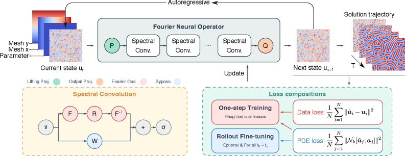
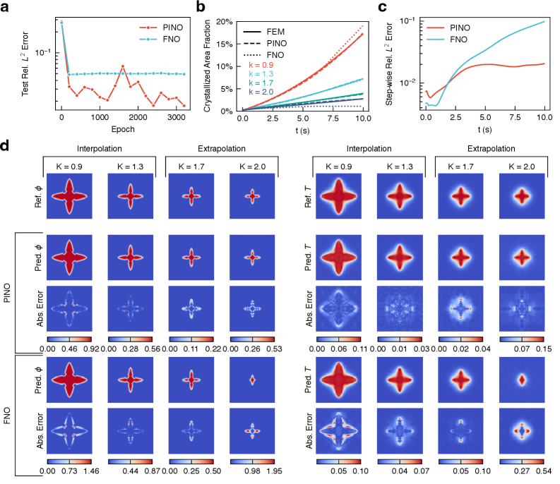
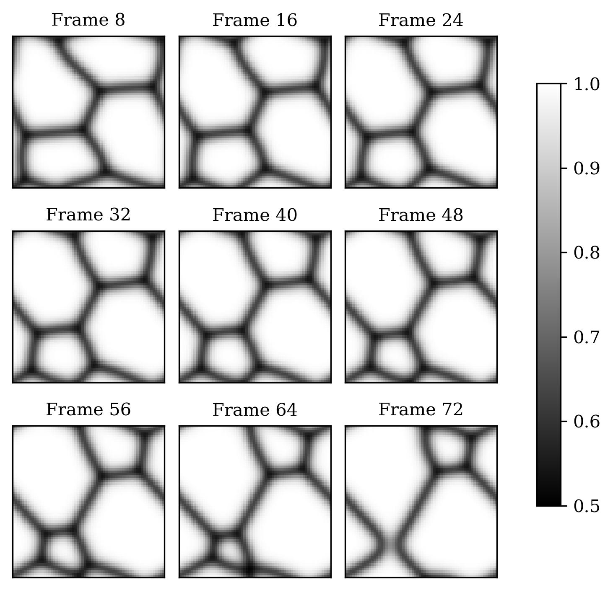
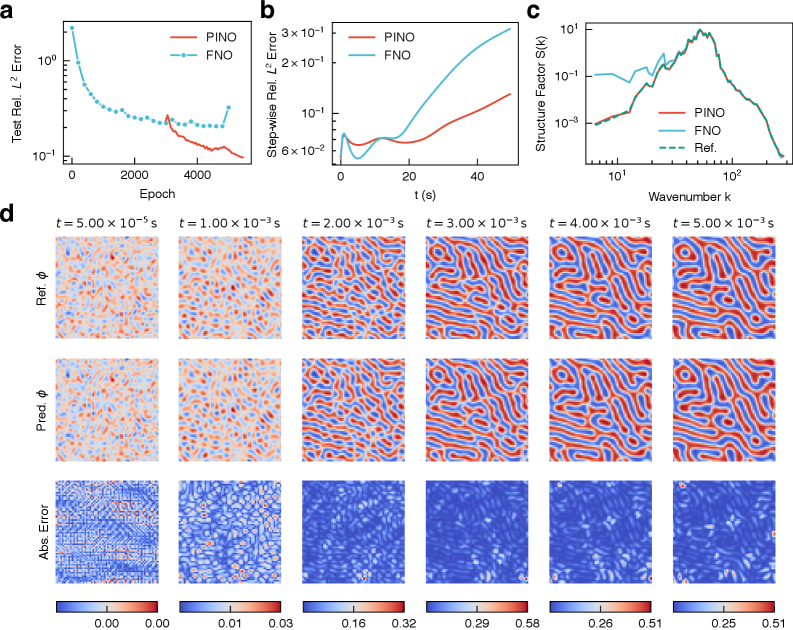

# 物理制約を組み込んだニューラル演算子は材料マイクロ組織シミュレーションをどこまで変えるか――フェーズフィールド法と深層学習の融合

- **執筆日**: 2026-04-12
- **トピック**: PF-PINO-phase-field-neural-operator
- **タグ**: Computation and Theory / Phase Transitions; Nonequilibrium Phase Transitions / PINNs; Machine Learning
- **注目論文**: Nanxi Chen, Airong Chen, Rujin Ma, "Physics-informed neural operator for predictive parametric phase-field modelling," arXiv:2603.09693 (2026)
- **参照関連論文数**: 6本

---

## 1. なぜ今この話題なのか

材料の機能は、原子配列だけでなくその空間的な組織構造（マイクロ組織）によっても大きく規定される。鉄鋼材料の強度、電池電極の充放電効率、半導体薄膜の欠陥密度——これらはすべて、材料の凝固・析出・相分離といった動的過程を経て形成されるマイクロ組織に依存している。したがって「どのような組成・温度プロファイルでどのようなマイクロ組織が得られるか」を計算で予測できれば、材料設計は試行錯誤から論理的探索へと転換できる。

この予測を可能にする有力な計算手法が**フェーズフィールド法（phase-field method）** である。フェーズフィールド法は、相の境界を拡散界面として滑らかな秩序変数（フェーズフィールド変数）で表現し、その時間発展を偏微分方程式（PDE）として記述する。デンドライト凝固、スピノーダル分解、粒界移動、電気化学腐食など、幅広いマイクロ組織形成現象に適用でき、現代の計算材料科学において不可欠なツールとなっている。

しかし、フェーズフィールド法には根本的な計算コストの壁がある。高解像度の2次元や3次元シミュレーションでは、時間発展の積分に膨大な計算ステップが必要であり、材料設計に実用的な「多数のパラメータ組み合わせの網羅的探索」には向かない。たとえばデンドライト凝固のモルフォロジーを冷却速度・潜熱係数・組成の3変数でグリッドサーチしようとすれば、従来の数値解法では数万CPUコア時間規模の計算が必要になる。

こうした課題に対して、近年**ニューラル演算子（neural operator）** と呼ばれる深層学習アプローチが急速に発展してきた。特に2021年に提案された**フーリエニューラル演算子（FNO: Fourier Neural Operator）** は、パラメータを変えた際のPDE解を「関数から関数への写像」として学習し、一度学習すれば新しいパラメータ条件でも瞬時に解を推定できることを示した。FNOは流体力学・気候モデルなどで既存のPDEソルバーより3桁程度高速という結果を報告しており、材料シミュレーション加速への期待が高まっていた。

ところが材料科学固有の問題——長時間予測、非線形結合、保存則——にFNOを適用すると、データ忠実度の最適化だけでは**物理的整合性が担保されない**ことが明らかになってきた。特に長時間の自己回帰的（autoregressive）予測では、各ステップの小さな誤差が積み重なり、最終的に非物理的な解へ発散するケースが相次いで報告されている。

2026年3月、Chenらは**PF-PINO（Physics-informed neural operator for phase-field modelling）** を提案した（arXiv:2603.09693）。これは物理制約（フェーズフィールドPDEの残差）をニューラル演算子の損失関数に直接組み込むことで、この問題を克服しようとする新しいアプローチである。本記事では、このPF-PINOが切り開いた視野を軸に、ニューラル演算子によるフェーズフィールドシミュレーション加速の現状と課題を整理する。

---

## 2. この分野で何が未解決なのか

### 問い1：ニューラル演算子はフェーズフィールドの長時間予測で本当に使えるのか？

FNOをはじめとするニューラル演算子は、一般的な流体PDEで驚異的な加速性能を示してきた。しかしフェーズフィールド方程式は、非線形性が強く（Cahn-Hilliard方程式の4階偏微分）、熱場・組成場が連成した複雑な構造を持つ。また材料設計で重要な「長い時間スケールでのモルフォロジー安定性」を予測するには、100〜1000ステップの自己回帰予測が必要となる。各ステップで誤差が蓄積するニューラル演算子がこの要求を満たせるかどうかは、いまだ確定していない。

### 問い2：物理制約の組み込みはどこまで汎化性能を改善するのか？

**PINNs（Physics-Informed Neural Networks）** に代表される物理制約付き学習は、PDEの残差を損失関数に加えることで学習データが少ない場合や未知パラメータの補外（extrapolation）においても物理的に整合した解を得られることを実証してきた。しかし従来のPINNsはパラメータを固定した特定のPDE境界値問題を解くために設計されており、「パラメータが変わるたびに再学習する必要がある」という実用上の制約があった。ニューラル演算子に物理制約を組み合わせたとき——つまりパラメータ汎化性能と物理整合性を同時に達成したとき——どのくらいの性能改善が期待できるのか、その定量的な評価は始まったばかりである。

### 問い3：3次元・マルチフィジクスへのスケーラビリティはどうか？

実際の材料プロセスでは3次元形状、温度勾配、流動場、電磁場など複数の物理場が連成する。現状のPF-PINOを含むほとんどの手法は2次元の比較的単純な系で検証されており、3次元大規模系やマルチフィジクス連成へのスケーラビリティは未検証の段階である。3D-4D時空間フーリエ変換を使うPENCO（arXiv:2512.04863）のような試みも始まっているが、計算コストの増大と精度維持の両立は依然として課題である。

---

## 3. 注目論文の核心

### PF-PINOとは何か

Chenら（arXiv:2603.09693, 2026）が提案したPF-PINOは、Fourier Neural Operator（FNO）をバックボーンとして使いつつ、フェーズフィールドPDEの残差を訓練損失に加えることで物理整合性を保つフレームワークである。

**アーキテクチャ**：入力として現在の状態場（フェーズフィールド変数・温度場など）とパラメータ場（材料定数の分布）を受け取り、次の時刻の状態場を出力する。FNOの特徴であるスペクトル畳み込み層は、フーリエ空間で学習可能なフィルタを適用することで$\mathcal{O}(N \log N)$の計算量で大域的な空間相関を捉える。

**物理制約付き損失関数**：訓練は以下の複合損失を最小化する。

$$\mathcal{L} = w_a \mathcal{L}_a + \sum_k w_{p,k} \mathcal{L}_{p,k}$$

$\mathcal{L}_a$はニューラル演算子の出力と参照解（数値シミュレーション結果）との差を測るデータ忠実度損失であり、$\mathcal{L}_{p,k}$は$k$番目のフェーズフィールドPDEの残差損失である。残差は出力場に対して有限差分またはスペクトル微分を適用して計算される。重み$w_{p,k}$は勾配ノルムに基づく動的調整（gradient normalization）で学習過程を通じて自動的にバランスされる。

この「物理制約のファインチューニング」が、PF-PINOの特徴的な訓練戦略である。まずデータ忠実度損失だけで事前学習を行い、収束後に物理残差損失を加えたファインチューニングを実施する。これは、補剛されたPDE（Cahn-Hilliard方程式のような4階微分を含む系）では最初から物理制約を加えると最適化が不安定になりやすいためである。

*図1：PF-PINOフレームワークの概略。FNOバックボーンに物理残差損失を加えた複合損失で訓練される（arXiv:2603.09693, Fig.1、CC BY-NC-ND 4.0）*

### 4つのベンチマークで何が示されたか

Chenらは1次元・2次元の4種類のフェーズフィールドベンチマーク問題でPF-PINOを検証し、いずれでも標準FNOを大幅に上回る性能を示した。

**（1）鉛筆電極の電気化学腐食（1D）**: 界面動力学係数Lをパラメータとした系（訓練5条件・テスト6条件）で、相対$L^2$誤差はPF-PINO 0.53%に対してFNO 1.58%と約3倍の差。100ステップの自己回帰予測でFNOが誤差を蓄積させる一方、PF-PINOは安定した予測を維持した。

**（2）電解研磨腐食（2D）**: 2次元系での差はさらに顕著で、PF-PINO 1.44%に対してFNO 22.02%と約15倍もの誤差差が生じた。FNOは周期的境界条件への依存に由来するアーティファクトが顕著で、界面のハウスドルフ距離（Hausdorff distance）でも17.0対1.0という大差がついた。

**（3）デンドライト結晶凝固（2D）**: アレン-カーン方程式と熱拡散方程式の連成系で、潜熱係数$K$をパラメータとした。補外域（訓練範囲外のK=1.7, 2.0）でPF-PINOはFNOより明確に高い汎化性能を示し、結晶化面積分率の時間推移を忠実に再現した。

*図2：デンドライト凝固ベンチマーク。左列が参照解、中列がPF-PINO、右列がFNOの予測。補外条件（K=1.7）でFNOが破綻する一方、PF-PINOは形態を保持している（arXiv:2603.09693, Fig.4、CC BY-NC-ND 4.0）*

**（4）スピノーダル分解（2D）**: Cahn-Hilliard方程式を用いた二元合金相分離で、移動度Mと初期摂動をパラメータとした。スペクトル解析（構造因子$S(q)$の動径平均）での比較で、PF-PINOはFNOより広い空間周波数範囲で参照解に一致することが示された（図3）。これは物理制約がマルチスケール構造形成の再現に特に効果的であることを示唆している。

### 注目される新規性と限界

PF-PINOの最も重要な新規性は「推論コストを増やさずに物理整合性を担保できる」点である。物理制約の計算は訓練時のみに必要であり、学習後の推論（inference）は標準FNOと同一の計算コストで実行できる。このことは実用的な観点で非常に重要で、訓練という「一度限りのコスト投資」によって、繰り返し使用する推論を高品質かつ高速に実行できる。

ただし本論文が取り扱った系はいずれも2次元の比較的単純なベンチマーク問題である。実際の材料で重要な3次元形状、多相系、マルチフィジクス連成については検討されておらず、これらへの拡張性は今後の検証課題として残っている。また物理残差損失のハイパーパラメータ（重み・ファインチューニングの開始タイミング）が性能に敏感であり、実用化に際しては体系的なチューニング手順の確立が求められる。

---

## 4. 背景と研究史

### フェーズフィールド法：材料シミュレーションの標準的枠組み

フェーズフィールド法の基礎は1990年代に確立され、Allan-Cahnモデルやカーン-ヒリアード（Cahn-Hilliard）モデルとして体系化された。**カーン-ヒリアード方程式**は二元合金のスピノーダル分解を記述する保存型方程式であり、

$$\frac{\partial c}{\partial t} = \nabla \cdot \left[ M \nabla \left( \frac{\partial f}{\partial c} - \kappa \nabla^2 c \right) \right]$$

ここで$c$は組成場、$M$は移動度、$f(c)$はバルク自由エネルギー密度、$\kappa$は勾配エネルギー係数である。この方程式は組成の保存（$\int c \, dV = \text{const}$）を厳密に満たし、4階の偏微分を含むため数値的に扱いにくく、小さな時間刻みが必要となる。

一方、**アレン-カーン方程式**は非保存型で、デンドライト凝固や磁区移動など「位相的な界面の移動」を記述する：

$$\frac{\partial \phi}{\partial t} = -M_\phi \frac{\delta F}{\delta \phi}$$

ここで$\phi$はフェーズフィールド変数、$F$は自由エネルギー汎関数である。Chenらが扱ったデンドライト凝固問題では、アレン-カーン方程式と熱拡散方程式が連成した非等温系を考えており、潜熱の放出が冷却場に干渉しながら固液界面の形態が決まる。

フェーズフィールド法の数値シミュレーションは、格子ベルツマン法、有限差分法、スペクトル法などで実装される。2D系でも典型的に$512^2$〜$1024^2$の格子、$10^3$〜$10^5$時間ステップが必要であり、パラメータスタディ（例えば材料設計空間の探索）では計算コストが現実的な障壁となる。

### ニューラル演算子の台頭

2021年、Li et al.が提案したFNO（Fourier Neural Operator）は、パラメータに依存したPDE解族を学習する新しいパラダイムを切り開いた。FNOの鍵となるアイデアは、中間の積分演算子を

$$(\mathcal{K}(a;\phi) u)(x) = \int_D \kappa(x,y;a) u(y)\, dy$$

の形でパラメータ化し、これをフーリエ空間でのスペクトル畳み込みとして効率的に実装する点にある。入力関数$a$（パラメータ場）を固定すると$u$（解場）への写像を学習し、推論時に新しい$a$を与えれば瞬時に対応する$u$の近似が得られる。

Peivaste et al.（arXiv:2503.14568, 2025）は、このFNOをカーン-ヒリアード式ファン-チェン（Fan-Chen）モデルに基づく粒成長シミュレーションに適用した（CC BY 4.0）。訓練に使用した粒成長シミュレーションとは異なる「未見の初期配置」や「より高い解像度（$256^2$格子）」に対しても、FNOが高精度な予測を維持することが実証された。これは「解像度不変性（resolution-invariant）」というFNOの固有の性質——フーリエ空間での演算が格子解像度に依存しないこと——によるものである。

*図3：2D粒成長シミュレーションのFNO予測例。参照解（上段）とFNO予測（下段）は長時間にわたって良好な一致を示す（arXiv:2503.14568, Fig.2、CC BY 4.0）*

### ハイブリッドアプローチの模索

Oommen et al.（arXiv:2312.05410, 2023）は「直接数値シミュレーションとニューラル演算子を組み合わせるハイブリッドアプローチ」を提案し（CC BY 4.0）、液相堆積プロセス（physical vapor deposition）のフェーズフィールドシミュレーションで16.5倍の加速を実証した。この手法ではU-Netニューラル演算子が高忠実度ソルバーのサロゲートとして使われ、精度が保証できる場合はニューラル演算子の予測を、不確かな場合は高忠実度ソルバーへ切り替えるアダプティブな戦略が採られている。

Bonneville et al.（arXiv:2406.17119, 2024）は液体金属脱合金（liquid-metal dealloying: LMD）という特殊な腐食プロセスに対して、U-Netバックボーン付きの適応型フーリエニューラル演算子（U-AFNO）を開発した（CC BY 4.0）。LMDのフェーズフィールドPDEは強い計算剛性（computational stiffness）を持ち、数値積分が極めて困難な系であるが、U-AFNOはU-Netによる局所的特徴抽出とフーリエ視覚変換（AFNO）を組み合わせることで、フル自己回帰モードでも安定した長時間予測を達成した。

これらの先行研究は、フェーズフィールドシミュレーション加速においてニューラル演算子が有望なアプローチであることを支持する一方、**「純粋にデータに頼った学習では物理制約を満たす保証がない」** という問題が残ることも示唆してきた。

---

## 5. どの解釈が最も妥当か

### 物理制約の追加は「正則化」として機能している

PF-PINOの結果で最も印象的なのは、補外域（訓練パラメータ範囲外）での性能改善である。デンドライト凝固ベンチマークで潜熱係数$K=1.7$（訓練範囲の上限$K=1.6$を超える値）を与えた場合、FNOの相対$L^2$誤差が大きく増大する一方で、PF-PINOの誤差増加は抑制されている。

この振る舞いは、物理制約が**正則化項**（regularization）として機能しているという解釈で自然に説明できる。訓練データが希薄な補外域では、ニューラルネットワークの解は訓練データへのフィッティングだけでは一意に定まらず、過剰適合や非物理的な解へ向かう危険がある。ここでPDEの残差ペナルティを加えると、解空間が物理的に整合した状態のみに制限され、補外性能が向上する。

この解釈は、標準的なPINNsの研究で早くから指摘されていた「物理知識がデータの少ない領域での推定を安定化させる」という知見と一致している。PF-PINOはこの考え方を、パラメータ可変の演算子学習という文脈に拡張したものと位置づけられる。

### スペクトル安定性における差異の意味

スピノーダル分解ベンチマークでの構造因子$S(q, t)$の比較は特に興味深い（図4）。構造因子は組成場のフーリエ変換から求まり、マイクロ組織の特徴スケール（ドメインサイズ）を反映する。FNOは低波数側（大スケール構造）ではおおよそ参照解に一致するが、高波数側（小スケール）で偏差が生じる。PF-PINOはフルスペクトルにわたって参照解と一致する。

*図4：スピノーダル分解のスペクトル解析。PF-PINO（橙）は参照解（黒）との一致度が標準FNO（青）より全波数域で改善している（arXiv:2603.09693, Fig.5、CC BY-NC-ND 4.0）*

Cahn-Hilliard方程式の数学的構造を考えると、この結果は物理的に説得力がある。同方程式の線形安定解析から、$q$が増大するにつれて界面エネルギーの寄与（$\kappa q^2$項）が安定化作用を持つ。FNOが高波数成分で誤差を生じやすいのは、FNOが低波数モードから優先的に学習しやすいという帰納的偏り（inductive bias）の問題と関連している可能性がある。物理制約は$\nabla^2 c$や$\nabla^4 c$といった高次微分を含むため、高波数成分の正確な再現を促す方向に損失を誘導していると考えられる。

### PENCO・U-AFNOとの比較から見える設計思想の違い

Bamdad et al.のPENCO（arXiv:2512.04863, 2025）は、物理制約に加えてエネルギー散逸制約（thermodynamic consistency）と数値整合性（Fourier空間での半陰的スキームを模倣）を課すという、より多層的な物理制約を採用している。3Dベンチマーク（相秩序・結晶化・エピタキシャル成長）での長期安定性はPF-PINOより高い可能性があるが、実装の複雑さとハイパーパラメータの多さが障壁となる。

一方、Trimboli et al.の完全畳み込みアーキテクチャ（arXiv:2602.19915, 2026）は物理制約を一切使わず、自己教師あり学習（self-supervised learning）によって粒成長とスピノーダル分解の時系列予測を実現した。このアプローチは実装が単純で汎用性が高い反面、訓練データの外での汎化性能やエネルギー的整合性は保証されない。

これらの比較から浮かび上がる設計思想の分岐点は、「どれほど多くの物理知識を明示的に組み込むか」というトレードオフである：

- **純粋データ駆動**（FNO, 完全畳み込み）：実装容易、十分なデータがあれば高性能、汎化は不安定
- **部分的物理制約**（PF-PINO）：実装中程度、補外性能・スペクトル安定性を改善、ハイパーパラメータ調整要
- **多層物理制約**（PENCO）：実装複雑、高い物理整合性、3Dスケールで真価発揮か

PF-PINOはこのスペクトルの中間に位置し、「現実的な実装コストで物理整合性を高める実用的選択」として評価できる。

### まだ弱い結論と今後の検証課題

(a) **3Dでの優位性は未確認**：本論文の全ベンチマークが2次元系であり、3次元系でPF-PINOの優位が維持されるかは不明である。FNOの計算コストは次元数に対して線形にスケールするが、物理残差損失の計算コストは格子点数に対して線形であり、3D高解像度では訓練コストが問題になりうる。

(b) **多相系・マルチフィジクスへの拡張性**：現在のベンチマークは2相系（固相-液相、または2元合金の相分離）に限られている。実際の材料設計では、介在物・粒界・析出物が複合する多相系や、電場・磁場・応力場との連成が重要になる。こうした高次元のPDE系にPF-PINOがどう拡張できるか、明確な指針はまだない。

(c) **実材料への適用**：現在のベンチマークはすべて既知の解析的モデル（アレン-カーン型・カーン-ヒリアード型）に基づく人工的問題である。実材料では自由エネルギー関数$f(c)$や移動度$M$が第一原理計算や実験データから決定される複雑な形を持つ。これらの「不確かな入力」に対してPF-PINOがどう機能するかは、将来の重要な検証点となる。

---

## 6. 何が一般化できるのか

### 他の材料プロセスへの展開

PF-PINOの基本的なアイデア——FNOに材料特定のPDE残差を付加して訓練する——は、フェーズフィールド法が適用されるあらゆる材料プロセスに原理的に適用可能である。

**積層造形（アディティブマニュファクチャリング）**：Kushwaha et al.（arXiv:2403.14795, 2024）は深層演算子ネットワーク（DeepONet）を鉄鋼の連続鋳造と直接エネルギー堆積型3Dプリンティングの熱・力学場予測に適用し（CC BY 4.0）、有限要素法より数桁高速な推定を実証した。PF-PINOアプローチで物理制約を追加すれば、補外域での信頼性がさらに向上する可能性がある。

**電池材料の劣化予測**：Li-ionバッテリーの電極における活物質の相分離はカーン-ヒリアード型の方程式で記述されることが多い。バッテリーの充放電サイクルごとにパラメータが変化する状況（時変型PDE）への拡張ができれば、電池劣化シミュレーションの加速に直結する。

**高エントロピー合金（HEA）の微細組織設計**：多元系合金では組成空間が高次元で、従来の計算では探索が困難である。PF-PINOによるパラメータ空間の効率的探索は、HEA設計の計算ワークフローに組み込める可能性がある。

### 設計原理としての一般化可能性

PF-PINOが示す「事前学習 + 物理制約ファインチューニング」という訓練戦略は、より一般的な物理科学の計算問題にも応用できる設計原理として位置づけられる。特に：

- 訓練データが限られている（実験コストが高い系）
- 補外が重要（新しい材料組成・プロセス条件への適用）  
- 物理法則が既知（保存則・熱力学第二法則など）

という条件が重なる場面では、物理制約の追加が系統的な改善をもたらすと期待できる。

一方、この設計原理の限界として、PDEが明示的に分かっている系にしか直接は適用できない点がある。実験のみでモデル化される現象（非線形光学応答など）や、PDEが極めて複雑で残差計算が実用的でない場合（量子多体系の電子構造など）には、異なるアプローチが必要となる。

---

## 7. 基礎から理解する

### フーリエニューラル演算子（FNO）の仕組み

FNOの中心的なアイデアを直感的に説明しよう。PDEを数値的に解く標準的手法（有限差分法・有限要素法）は、初期条件や境界条件を与えると解を計算する「アルゴリズム」である。一方FNOは、「パラメータ（例えば移動度M）を変えると解がどう変わるか」というパターンを大量のシミュレーション結果から「学習する演算子」である。

FNOの各層での演算は：

1. **局所線形変換**：各点での状態を線形変換する（通常の全結合層に相当）
2. **スペクトル畳み込み**：入力をフーリエ変換し、低波数成分のみにフィルタを適用した後、逆フーリエ変換して戻す

ステップ2が重要である。フーリエ変換後は、各フーリエモード（特定の空間周期成分）が互いに独立して扱えるため、格子全体にわたる非局所的な空間相関を効率的に捉えられる。フーリエ空間でのフィルタリングは$\mathcal{O}(N\log N)$（FFTの計算量）で実行でき、直接空間での全結合層（$\mathcal{O}(N^2)$）より遥かに効率的である。

また重要な性質として、スペクトル畳み込みは空間解像度$N$が変わっても同じフィルタを使い回せる（「解像度不変性」）。これにより、粗い格子で学習しておいて細かい格子で推論することが可能になる。

### 物理制約の意味：なぜPDE残差を損失に加えるのか

FNOを訓練するときの通常の損失関数は：

$$\mathcal{L}_a = \frac{1}{N_{\text{train}}} \sum_{i=1}^{N_{\text{train}}} \| u_\theta(a_i) - u^*_i \|^2$$

つまり「ニューラル演算子の出力$u_\theta(a_i)$と参照解$u^*_i$の差の二乗」を最小化する。ここに物理残差損失を加えると：

$$\mathcal{L}_{p} = \frac{1}{N_c} \sum_{j=1}^{N_c} \left| \mathcal{F}\left[u_\theta(a_i)\right](x_j, t_j) \right|^2$$

ここで$\mathcal{F}[\cdot]$はフェーズフィールドPDEの演算子（例えばカーン-ヒリアード方程式の左辺−右辺）を表し、解が方程式を満たすほど$\mathcal{L}_{p} \to 0$となる。

この制約を加えると何が変わるのか。直感的には「PDEを満たさない解にはペナルティを課す」ことで、学習済みネットワークの出力が「物理的に可能な軌跡」に制約される。とくに訓練データがない補外域では、この制約がほぼ唯一の指針となるため、汎化性能の向上が期待できる。

数学的には、この複合損失の最適化は、データ忠実度と物理整合性という2つの目的関数を同時に最適化する多目的最適化問題と解釈できる。勾配ノルムに基づく重み動的調整（gradient normalization）はこの多目的最適化のバランスを取るための実用的な処方である。

### カーン-ヒリアード方程式の物理的意味

スピノーダル分解を記述するカーン-ヒリアード方程式の右辺には、化学ポテンシャルの拡散項が入っている：

$$\mu = \frac{\partial f}{\partial c} - \kappa \nabla^2 c$$

第1項$\partial f/\partial c$はバルクの熱力学的駆動力（双安定型の自由エネルギー$f(c)$に由来）、第2項$-\kappa \nabla^2 c$は界面エネルギー項である。バルク項は組成$c$を2つの安定相へ押し分ける力を生み出し、界面エネルギー項は界面の鋭さ（高波数成分）を抑制する安定化力として機能する。これら2つのバランスが、特徴的なスピノーダル分解の波長（最速成長波数$q_{\max}$）を決定する。

PF-PINOがスペクトル全域で良い予測を示すことの物理的意味は、この「バルク項と界面エネルギー項のバランス」を正しく捉えていることに対応する。特に高波数成分への影響が大きい界面エネルギー項（$\kappa q^2$に比例）を損失関数で制約することで、FNOが苦手としていた高波数での精度低下が抑制されたと解釈できる。

---

## 8. 専門用語の解説

**フェーズフィールド法（phase-field method）**: 材料の相（固相・液相・気相など）の境界を拡散界面として表現し、秩序変数（フェーズフィールド変数$\phi$）の空間分布の時間発展を偏微分方程式で記述する計算手法。界面を追跡する必要がなく、デンドライト凝固・スピノーダル分解・粒成長など幅広い現象に適用される。

**カーン-ヒリアード方程式（Cahn-Hilliard equation）**: 二元系の組成場$c$の時間発展を記述する4階偏微分方程式。組成の総量を保存しながら、自由エネルギー最小化の方向にスピノーダル分解（均一系から二相分離）が進む過程を記述する。高次微分のため数値的剛性が高い。

**アレン-カーン方程式（Allen-Cahn equation）**: 非保存型のフェーズフィールド変数の時間発展を記述する2階偏微分方程式。デンドライト凝固における固液界面の移動や磁区壁の移動などを記述する。カーン-ヒリアード方程式と組み合わせた連成系も多く使われる。

**フーリエニューラル演算子（FNO: Fourier Neural Operator）**: Li et al. (2020)が提案したニューラルネットワークアーキテクチャ。スペクトル畳み込みにより、パラメータ可変PDEの解族を解像度不変な形で学習する。入力関数（パラメータ場）から出力関数（解場）への演算子を近似する。

**Physics-Informed Neural Network（PINN）**: Raissi et al. (2019)が提案した、PDEの残差を損失関数に直接組み込んだニューラルネットワーク。データなしでも既知の物理方程式から解を求める（forward problem）、あるいは観測データと物理方程式の両方から未知パラメータを推定する（inverse problem）ことができる。

**自己回帰的予測（autoregressive prediction）**: ある時刻の状態を入力として次の時刻の状態を予測し、その結果を再び入力として繰り返す長時間予測の方式。各ステップの誤差が蓄積する（error accumulation）問題があり、長時間安定性が課題となる。

**スペクトル畳み込み（spectral convolution）**: フーリエ空間（波数空間）で行われる畳み込み演算。実空間の畳み込みを高速フーリエ変換（FFT）でフーリエ空間に変換し、フィルタリング後に逆変換する操作で、$\mathcal{O}(N\log N)$の計算量で実現できる。

**スピノーダル分解（spinodal decomposition）**: 均一な混合物が濃度揺らぎに対して不安定になり、自発的に2つの相に分離する過程。核生成を経ない連続的な相分離で、カーン-ヒリアード方程式で記述される。二元合金の析出組織や高分子ブレンドの相分離などに観測される。

**デンドライト凝固（dendritic solidification）**: 溶融金属が冷却される際、固液界面が樹枝状（dendritic）形態を発達させながら成長する凝固様式。アニソトロピック（方位依存性を持つ）界面エネルギーが形態を決定し、アレン-カーン型フェーズフィールド方程式で記述される。

**構造因子（structure factor）**: 材料のマイクロ組織の空間的不均一性をフーリエ解析した量$S(\boldsymbol{q})$。組成場$c(\boldsymbol{r})$のフーリエ変換の絶対値の二乗として定義され、スピノーダル分解の特徴波長（マイクロ組織の特徴スケール）を定量評価するために使われる。

---

## 9. 今後の展望

PF-PINOが実証したことで、現在かなり確からしくなっていることは「物理制約をニューラル演算子に組み込むことがフェーズフィールド系の汎化性能と長時間安定性を改善する」という事実である。特に補外域と高波数スペクトル再現において、標準FNOとの差は明確で、複数のベンチマークで再現性よく示されている。また「物理制約の追加が推論コストを増やさない（コストは訓練時のみ）」という実用的な利点は、実際の材料設計ワークフローへの統合において重要な意味を持つ。

一方でまだ確定していないことは多い。最も重要な未解決課題は、3次元系・マルチフィジクス連成への拡張である。PENCOのような試みはあるが、実際の材料設計に必要なスケール（数百μmの微細組織を数十nmの界面精度で扱う）での検証はまだ不十分である。また「どのような物理制約をどのような強さで加えるべきか」というハイパーパラメータの選択は未だ経験的であり、体系的なガイドラインが求められる。第一原理計算や実験データから得られる「不確かな自由エネルギー関数」をもつ実材料系での検証も急務である。

今後1〜3年で注目すべき論点は2つある。第1に、基盤モデル（foundation model）的アプローチの台頭——多様なフェーズフィールド系の解を単一モデルで扱う汎用演算子の開発——が研究の焦点となるだろう。すでにMACEのような機械学習ポテンシャルでは材料種を超えた転移学習が実用化されており、同様の発想がPDE解法にも波及する可能性がある。第2に、逆問題への応用——マイクロ組織の観測データから材料パラメータを推定するインバース問題——である。物理制約付きニューラル演算子は、実験的に測定困難な材料定数（移動度・界面エネルギーなど）を非破壊で推定するための有力なツールになりえる。この方向性は、実験と計算の融合という材料科学の大きなトレンドとも合致しており、今後の活発な展開が期待される。

---

## 参考論文一覧

1. **[arXiv:2603.09693]** Nanxi Chen, Airong Chen, Rujin Ma, "Physics-informed neural operator for predictive parametric phase-field modelling" (2026). — FNOに物理残差損失を組み込んだPF-PINOを提案し、腐食・凝固・スピノーダル分解の4ベンチマークで標準FNOを上回ることを実証した注目論文。 https://arxiv.org/abs/2603.09693

2. **[arXiv:2503.14568]** Iman Peivaste, Ahmed Makradi, Salim Belouettar, "Teaching Artificial Intelligence to Perform Rapid, Resolution-Invariant Grain Growth Modeling via Fourier Neural Operator" (2025). — カーン-ヒリアード粒成長シミュレーションにFNOを適用し、異なる格子解像度への解像度不変性を実証した比較論文。 https://arxiv.org/abs/2503.14568

3. **[arXiv:2312.05410]** Vivek Oommen et al., "Rethinking materials simulations: Blending direct numerical simulations with neural operators" (2023). — 直接数値シミュレーションとU-Netニューラル演算子を組み合わせるハイブリッドアプローチで、PVDフェーズフィールドシミュレーションを16.5倍加速した背景論文。 https://arxiv.org/abs/2312.05410

4. **[arXiv:2406.17119]** Christophe Bonneville et al., "Accelerating Phase Field Simulations Through a Hybrid Adaptive Fourier Neural Operator with U-Net Backbone" (2024). — 強い計算剛性を持つ液体金属脱合金のフェーズフィールドPDEに、U-Netバックボーン付き適応型FNO（U-AFNO）を適用した比較論文。 https://arxiv.org/abs/2406.17119

5. **[arXiv:2512.04863]** Mostafa Bamdad et al., "PENCO: A Physics-Energy-Numerics-Consistent Operator for 3D Phase Field Modeling" (2025). — 物理制約・エネルギー散逸制約・数値整合性制約を多層的に組み込んだ3Dフェーズフィールド神経演算子を提案し、より高次の物理制約アプローチの可能性を示した比較論文。 https://arxiv.org/abs/2512.04863

6. **[arXiv:2602.19915]** Michael Trimboli et al., "Fully Convolutional Spatiotemporal Learning for Microstructure Evolution Prediction" (2026). — 物理制約を用いない完全データ駆動の畳み込みアーキテクチャで粒成長・スピノーダル分解を予測し、純粋データ駆動アプローチの性能と限界を示した対照論文。 https://arxiv.org/abs/2602.19915

7. **[arXiv:2403.14795]** Shashank Kushwaha et al., "Advanced Deep Operator Networks to Predict Multiphysics Solution Fields in Materials Processing and Additive Manufacturing" (2024). — DeepONetを連続鋳造・積層造形の熱・力学場予測に適用し、材料プロセスへのニューラル演算子応用の広がりを示した波及論文。 https://arxiv.org/abs/2403.14795
