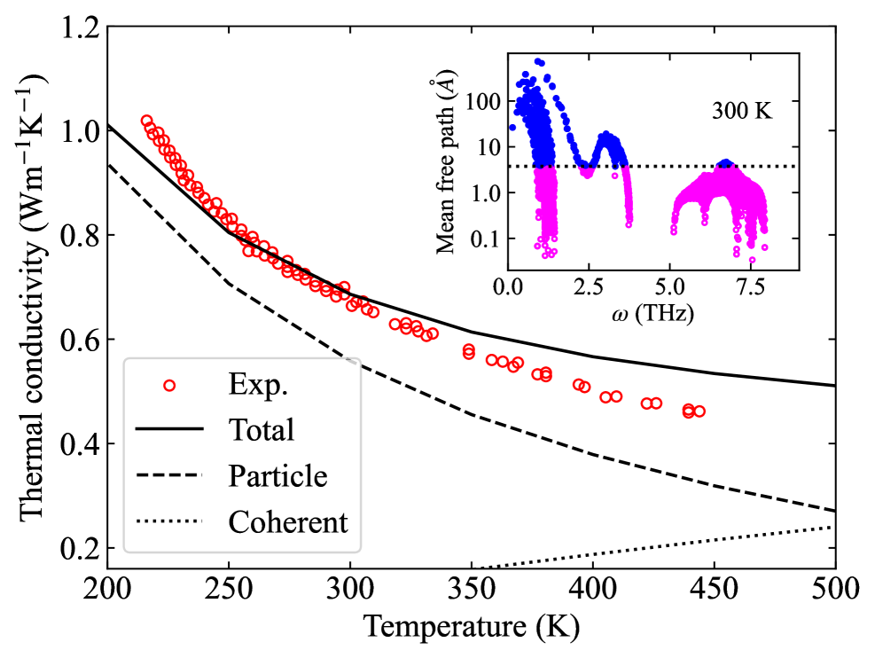
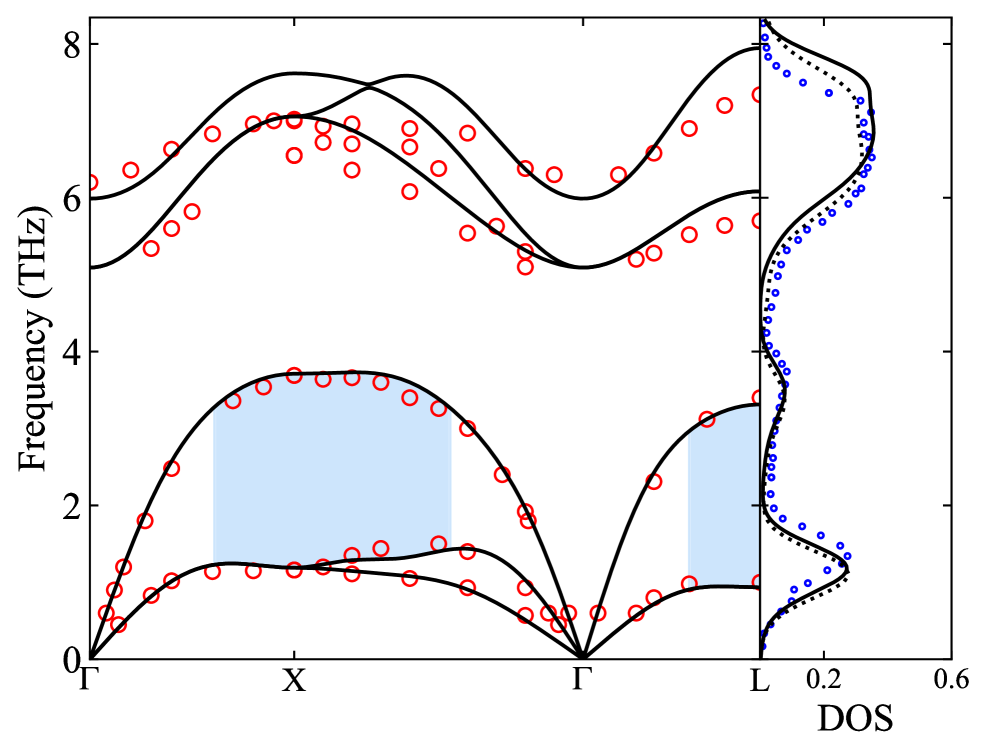

# 物理制約型ニューラルネットワーク（PINNs）によるナノスケール熱輸送の新展開：フォノン輸送方程式を解く多重スケール補助変数アプローチ

- **執筆日**：2026-04-01
- **トピック**：PINNs を用いたフォノンボルツマン輸送方程式の多重スケール求解と逆問題解析
- **タグ**：Computation and Theory / Phonons and Thermal Properties / Nonequilibrium Phase Transitions / PINNs / Machine Learning / Surrogate Modeling
- **注目論文**：Roberto Riganti, Luca Dal Negro, "A Unified Multiscale Auxiliary PINN Framework for Generalized Phonon Transport," arXiv:2603.28932 (2026)
- **参照関連論文数**：7 本

---

## 1. なぜ今この話題なのか

半導体デバイスの微細化が進む現代において、熱管理はもはや工学的な後付けの課題ではなく、デバイス設計の根幹に関わる物理問題として浮上している。スマートフォンのプロセッサから高性能計算機のGPUに至るまで、現代の電子デバイスはトランジスタ密度の飛躍的な向上に伴い、単位面積あたりの発熱量が急増している。特に問題となるのは、特徴的な長さスケールがナノメートル領域に突入した現代デバイスでは、古典的なフーリエの熱伝導則がもはや適用できないという事実である。

フーリエの法則 $\boldsymbol{q} = -\kappa \nabla T$（$\boldsymbol{q}$ は熱流束、$\kappa$ は熱伝導率、$T$ は温度）は、系の特徴的長さがフォノンの平均自由行程（典型的にはシリコン室温で数百ナノメートル）よりも十分大きい場合にしか成立しない。この長さの比を表すクヌーセン数 $\mathrm{Kn} = \Lambda / L$（$\Lambda$ は平均自由行程、$L$ は特徴的長さ）が 1 に近づく領域では、熱キャリアであるフォノンが系の境界を「感知」し、バリスティック（弾道的）な輸送が支配的になる。この領域では、伝統的な熱伝導解析手法は信頼性を失い、フォノンの統計分布関数を直接追跡する輸送方程式——フォノンボルツマン輸送方程式（Boltzmann Transport Equation, BTE）——が必要となる。

ところが、フォノンBTEを数値的に解くことは容易ではない。方程式が定義される位相空間（実空間 × 波数空間 × 偏波）の次元は極めて高く、従来の格子ボルツマン法や離散座標法（DOM）では、特に3次元問題で計算コストが爆発的に増大する。そこに登場したのが、物理制約型ニューラルネットワーク（Physics-Informed Neural Networks, PINNs）である。PINNsは支配方程式そのものを損失関数に組み込むことで、学習データなしに偏微分方程式（PDE）の解を近似するニューラルネットワークであり、2019年のRaissiらによる先駆的研究[^raissi2019]以来、さまざまな物理問題への応用が急速に拡大してきた。

2026年3月末、Boston Universityの Riganti と Dal Negro は、フォノン輸送の一般化された方程式（Generalized Equation of Phonon Radiative Transfer, GEPRT）を解くための統一的な多重スケール補助PINNフレームワーク「MTNet」を提案した（arXiv:2603.28932）。この論文は、PINNsをフォノン輸送に適用するうえで従来から障壁となっていた「積分微分方程式の自動微分との不整合」という技術的課題を、補助変数導入という優雅なアイデアで解決し、シリコン薄膜の熱輸送シミュレーションと逆問題解析の両方に成功したという点で、この分野における重要な前進を示している。本記事では、この論文を中心に据えながら、PINNsとフォノン輸送研究の交差点における現状と課題を包括的に論じる。

---

## 2. この分野で何が未解決なのか

フォノンBTEおよびその関連方程式（GEPRT）の数値求解をめぐっては、現在も複数の根本的な問いが残っている。

**問い1：高次元位相空間の「次元の呪い」をいかに克服するか**

フォノンBTEは、実空間 $(x, y, z)$、波数空間 $(k_x, k_y, k_z)$、時間 $t$ 、さらにフォノン偏波モード（音響・光学各枝）にわたる高次元空間上の積分微分方程式である。離散座標法（DOM）では角度方向を離散化するが、バリスティック輸送が支配的な領域（高クヌーセン数）では十分な角度分解能が必要となり、計算コストが急増する。分子動力学（MD）は原子レベルから熱輸送を再現できるが、デバイスレベルの空間スケールには計算コストが高すぎる。モンテカルロ法（DSMC）は確率的誤差を持ち、定常問題への適用が難しい。PINNsはこの問題をメッシュレス近似によって回避できる可能性を持つが、「特定の問題への収束保証の欠如」「損失関数の重みバランスの難しさ」「バリスティック限界でのスペクトルバイアス（高周波成分の学習困難）」が依然として課題として残っている。

**問い2：積分散乱項をニューラルネットワーク枠組みでどう扱うか**

フォノンBTEの散乱項 $(e^{eq} - e)/\tau$ には、平衡分布 $e^{eq}$ が含まれる。これは全フォノンエネルギーの積分（すなわち温度）に依存するため、方程式全体が積分微分方程式となる。自動微分（automatic differentiation）を基盤とするPINNsは微分演算には強力だが、積分演算の扱いに工夫が必要である。補助変数の導入によってこの積分を陽的に制御する方法を見出すことが、PINNsをフォノン輸送に適用するための鍵となる。

**問い3：逆問題解析の精度と汎用性**

実験で観測できるのは通常、デバイス内部全体の温度分布ではなく、表面での一部の情報のみである。観測データから材料の熱特性（熱伝導率、膜厚、境界熱抵抗など）を推定する「逆問題」は、ナノ熱計測学の核心課題である。PINNsはこの逆問題を、追加のパラメータをネットワークの学習対象として組み込むことで自然に解ける可能性を持つが、問題の不適切性（ill-posedness）や観測ノイズへの頑健性については、さらなる検証が必要である。

**問い4：コヒーレントフォノン輸送の定量的理解**

近年、強非調和材料（CuClなど）でフォノンコヒーレンス（量子力学的干渉効果）が熱輸送に寄与することが明らかになりつつある（Dangić 2025, arXiv:2511.20360）。バリスティック–拡散クロスオーバー領域の記述に加え、このコヒーレント輸送をBTE的枠組みにどう組み込み、PINNsで再現するかという問いは、まだ答えが出ていない。

---

## 3. 注目論文の核心：何が前進し、何がまだ仮説か

### MTNet とは何か

Riganti と Dal Negro（arXiv:2603.28932）が提案する MTNet（Multiscale auxiliary PINN network）の核心は、GEPRTを「完全微分方程式系」へと変換したことにある。GEPRTは以下の形式で書ける：

$$\frac{\partial e_\omega}{\partial t} + v_{g,\omega} \boldsymbol{s} \cdot \nabla e_\omega = \frac{e_\omega^{eq} - e_\omega}{\tau_\omega}$$

ここで $e_\omega$ はフォノン角周波数 $\omega$ における（方向 $\boldsymbol{s}$ の）エネルギー密度、$v_{g,\omega}$ はグループ速度、$\tau_\omega$ は緩和時間、$e_\omega^{eq}$ は平衡分布である。問題は右辺の $e_\omega^{eq}$ が温度 $T$ を介して全フォノンエネルギーの積分に依存する点にある：

$$T(\boldsymbol{x}, t) = \frac{1}{C} \int_0^{\omega_\mathrm{max}} \int_{4\pi} e_\omega \, d\Omega \, d\omega$$

ここで $C$ は体積比熱である。この積分は自動微分で直接扱えないため、従来のPINNsでは精度の劣化や収束困難が生じていた。

MTNetの解決策は、温度 $T$ および各モードの方向平均エネルギー $\bar{e}_\omega$ を「補助変数」として独立したサブネットワークで近似し、それらの間の関係を（微分方程式の形で書き直した）整合性条件として損失関数に加えることである。これにより、散乱項全体が自動微分で評価可能な完全微分系として記述される。具体的には、損失関数が次のように構成される：

$$\mathcal{L} = w_r \mathcal{L}_\mathrm{BTE} + w_T \mathcal{L}_T + w_{bc} \mathcal{L}_{bc} + w_{data} \mathcal{L}_{data}$$

ここで $\mathcal{L}_\mathrm{BTE}$ はBTE残差、$\mathcal{L}_T$ は補助変数の整合性条件、$\mathcal{L}_{bc}$ は境界条件残差、$\mathcal{L}_{data}$ は（逆問題解析時の）観測データとの整合項である。

### 主要結果

論文はシリコン薄膜の定常断面方向熱輸送を主なベンチマークとしている。クヌーセン数 $\mathrm{Kn} = 0.1$ から $\mathrm{Kn} = 10$ の広い範囲（拡散的〜バリスティック）を単一のフレームワークで再現し、温度勾配が最大100Kに達する強非平衡状態でも解析解や参照数値解と良好な一致を示した。さらに注目すべきは逆問題解析への応用で、表面温度の部分的な観測データからシリコン薄膜の厚さ（幾何的パラメータ）を正確に推定することに成功したことである。これは、MTNetが「順問題ソルバー」にとどまらず、材料特性診断ツールとしての可能性を持つことを示している。

### 何がまだ仮説か

MTNetの有効性はシリコンの1次元/準2次元ベンチマークで検証されているが、3次元複雑形状への拡張性、複数材料系（異なる散乱機構を持つ半導体、金属、誘電体の複合構造）への適用、および時間依存問題における安定性については、まだ評価途上である。損失関数の重み係数（$w_r, w_T, w_{bc}$ など）の最適な設定指針も経験的な部分が残っており、他系への転用には試行錯誤が必要になると予想される。また、逆問題解析における測定ノイズへの頑健性の体系的な評価は行われておらず、実験との定量的比較が今後の重要な検証課題として残っている。

---

## 4. 背景と研究史：この論文はどこに位置づくか

### フォノンBTE数値解法の変遷

ナノスケール熱輸送の数値解法は、大きく分けて3世代の進化をたどってきた。第1世代は、Callawayモデルや単一緩和時間近似に基づく解析的手法と、実空間有限差分/有限要素法による拡散方程式の数値解法であった。これらはフーリエの法則が成立する領域（Kn << 1）では十分に機能するが、ナノスケールでは根本的に不適切である。

第2世代は、フォノンBTEを直接解く数値手法群であった。離散座標法（DOM）は位相空間を格子で離散化し、輸送項と散乱項を分離して解く。モンテカルロ法（DSMC/phononMC）は統計的なサンプリングによってBTEを解く。これらは精度の高い解を与えるが、3次元問題では計算コストが $O(N_x^3 \times N_k^3)$ 程度に膨れ上がり、実用的なデバイスシミュレーションには適していない。

第3世代が、機械学習・ディープラーニングを活用したアプローチである。2021年、Li、Lee、Luoは PhysicaStatus Solidi でフォノンBTEに対するPINNsの最初の本格的な応用を報告した（arXiv:2103.07983）。彼らのアプローチは、多重周波数・多重偏波（モード分解）のフォノンBTEを、ニューラルネットワークの損失関数として定式化し、1次元から3次元の定常問題でDOMとの良好な一致を示したものである。特筆すべきは、特徴的長さスケール $L$ を入力変数の一つとして扱い、単一のネットワークが複数のKnに対して汎化（parametric solution）できることを示した点で、これは従来の数値解法では不可能な能力である。

翌2022年には同じグループが、温度非平衡が大きい（温度勾配が大きい）状況に対応した改良版を報告した（arXiv:2201.04731）。従来の線形化近似（小温度勾配の仮定）を外し、温度依存の緩和時間を自動微分で扱えるよう定式化し直したことで、より現実的な熱輸送条件に対応可能となった。

2023年には Zhou、Li、Luo が時間依存版のモード分解フォノンBTEに対してPINNsを適用し、過渡熱輸送の予測に成功した（npj Computational Materials 2023）。これにより、定常問題から時間発展問題への展開が実証された。

そして2024年、Lin らが提案したモンテカルロPINNs（MC-PINNs、arXiv:2408.10965）は、フォノンBTEの角度空間の離散化を確率的サンプリングで代替するという独創的なアイデアで、バリスティック限界での計算効率を従来PINNs比で大幅に改善した。2段階サンプリング（実空間と角度空間のテンソル積）により、高Kn条件での相対L2誤差を1〜2%以下に維持しながら、メモリ使用量を同等精度の決定論的DOMの約16〜66%に削減できることを3次元問題まで検証した。

2603.28932のMTNetはこの流れに位置づけられるが、既存手法と明確に異なるのは「補助変数を明示的に導入することで積分微分方程式を完全微分系へ変換する」という定式化の改善と、「逆問題解析への自然な拡張」の両方を統一的な枠組みで実現したことである。

### ボルツマン方程式に対するPINNsの一般的展開

フォノンBTEはボルツマン方程式の一種であり、同様の構造を持つ方程式系へのPINNs適用は他分野でも進んでいる。Oh ら（arXiv:2403.06342）は気体分子運動の BGK-ボルツマン方程式に対して、テンソル積分解能を持つ分離可能PINNs（SPINNs）を適用し、3次元リーマン問題（衝撃波問題）を高精度で解くことに成功した。彼らが導入したガウス減衰正則化と相対損失関数は、分布関数のテール部分（希薄気体の高速粒子成分）の精度を劇的に改善するものであり、フォノン分布のウィグナー関数的なテール処理と概念的に類似している。このような方法論的な知見の相互参照が、フォノンBTE-PINNs研究の精度向上にも寄与しうる。

### ナノスケール熱輸送における逆設計の文脈

Romano と Johnson（arXiv:2202.05251）は、フォノンBTEに対する形状最適化（トポロジー最適化）を伴う逆設計手法を提案した。彼らの「透過率補間モデル（TIM）」は、周期的ナノ構造の有効熱伝導テンソルを最大化・最小化するために、BTEの随伴感度解析を使うものであり、フォノンサイズ効果を利用した熱電材料設計への応用を示した。この研究は「BTEを逆問題の文脈で用いる」という方向性の先駆けであり、MTNetが達成した「逆問題解析（材料寸法の推定）」と概念的に対応する。MTNetは随伴法の代わりにPINNsの勾配情報を活用するという点で、より汎用的な枠組みを提供している。

---

## 5. どの解釈が最も妥当か：証拠・比較・限界

### PINNs vs. 従来数値法：何が優れ、何が不足か

MTNetおよびその前身であるPINNsベースのフォノン輸送ソルバー（2103.07983, 2201.04731, 2408.10965）に共通する主要な主張は「メッシュレスであること」と「パラメトリック汎化能力」である。メッシュレスであることの実質的な利点は、複雑な境界形状や不均質な材料系に対してメッシュ生成の煩雑さなしに適用できる点にある。パラメトリック汎化とは、学習済みのネットワークが未知のパラメータ値（例：新しい膜厚、新しいKn）に対してもゼロショット予測できる能力であり、これは実際のデバイス設計最適化で強力なメリットとなる。

一方で、PINNsの一般的な弱点として「スペクトルバイアス」が知られている。通常のフォリエの展開で言うと、ニューラルネットワークは低周波成分の学習を優先し、高周波成分（例：バリスティック輸送に現れる鋭い温度勾配や境界層）の学習が遅れる傾向にある。MC-PINNs（2408.10965）はモンテカルロサンプリングでこれを部分的に緩和したが、根本的な解決には至っていない。MTNet（2603.28932）もこの問題の完全な克服を主張しているわけではなく、シリコン薄膜という比較的滑らかな温度プロファイルを持つ系でのベンチマークにとどまっている点は留意が必要である。

### 補助変数アプローチの妥当性

MTNetの中核的な革新である「補助変数による完全微分化」は、数学的には積分方程式を微分方程式に「ほどいている」操作に対応する。同様のアプローチは、非局所的な積分項を持つ流体方程式（例：薄膜流れの重力ポテンシャル積分、磁気流体力学の電流積分）への応用が知られており、数学的正当性は高い。ただし、補助変数を導入することで損失関数の項数が増え、各重み係数の調整が難しくなる。論文では重み設定の詳細が示されているが、異なる材料系（例：散乱時間 $\tau$ の周波数依存性が大きく異なる材料）への適用時に同じ重み設定が有効かどうかは、現状では未検証である。

### 逆問題解析の証拠の強さ

MTNetは逆問題として「表面温度の観測から膜厚を推定する」タスクを示した。これは概念実証（proof of concept）として重要だが、実際の実験条件への適用を考えると以下の点が未解決である。

まず、実験観測には常に測定ノイズが伴う。現状の論文ではノイズフリーの「合成データ」（シミュレーションで作った模擬観測）を使った逆問題解析のみが示されており、ノイズ存在下での推定精度への影響は評価されていない。Chen ら（arXiv:2502.19533）はフォノン輸送方程式の逆問題をPDE制約最適化として定式化し、確率的勾配降下法（SGD）で解く手法を提案しているが、この研究も同様にノイズの影響を部分的にしか評価していない。逆問題の不適切性（測定データへの微小変動が解の大きな変動を引き起こす）を制御するための正則化戦略が、PINNs枠組みでどれだけ効果的かは重要な未解決問題である。

### コヒーレントフォノン輸送との接点

Dangić（arXiv:2511.20360）が提案する「周波数依存熱伝導率 $\kappa(\nu)$ のピーク構造をコヒーレント輸送のシグネチャとして使う」というアイデアは、BTE的な（粒子的な）フォノン描像を超えた量子干渉効果の定量的証拠として興味深い。CuClという強非調和材料でこの効果が顕著であることが示された（図参照）。

*図1：CuClの格子熱伝導率（Dangić 2025, arXiv:2511.20360, CC BY 4.0より）。黒実線は全熱伝導率、破線は通常の粒子的フォノン輸送による対角成分、点線はコヒーレント（量子干渉）効果による非対角成分を示す。低温ではコヒーレント成分が全体の熱伝導率を大きく変える。*

PINNsは現状ではBTE的枠組み内の半古典的フォノン輸送を扱う手法であり、このようなコヒーレント効果を自然に取り込む定式化は存在していない。BTE的アプローチとコヒーレント輸送の接続は、今後の大きな理論的課題である。

---

## 6. 何が一般化できるのか：材料・手法・応用への広がり

### 材料系の一般化

MTNetはシリコンをプロトタイプ材料として使っているが、その方程式的な枠組みはフォノン分散と緩和時間の情報があれば任意の結晶性材料に適用可能である。実際、Li ら（2103.07983）はシリコンに加えてダイヤモンドや窒化ガリウム（GaN）への応用例を示している。熱伝導率が高い材料（GaN, AlN, h-BN）は次世代パワーエレクトロニクスの基板として注目されており、これらに対するナノスケール熱輸送解析の需要は大きい。

また、界面熱抵抗（カピツァ抵抗）を持つ多層構造への拡張も重要な方向性である。Romano と Johnson（2202.05251）のアプローチがフォノン透過率の界面条件を陽的に扱っていたように、MTNetにも界面境界条件を損失関数に組み込む自然な拡張経路がある。

### 測定手法との接続

ナノスケール熱輸送の実験計測として広く使われる手法は、時間領域サーモリフレクタンス（TDTR）および周波数領域サーモリフレクタンス（FDTR）である。これらは超短パルスレーザーによるポンプ-プローブ法で表面温度の時間変化を測定するが、そこから材料の熱パラメータを推定するには通常フーリエ則に基づく解析モデルが使われる。MTNetのような逆問題フォノンBTEソルバーが高精度・高速化されれば、TDTR/FDTRデータからBTEレベルの材料情報（分モード熱伝導率、フォノン平均自由行程スペクトルなど）を直接抽出する次世代解析パイプラインが実現しうる。Dangić（2511.20360）が指摘したように、既存のサーモリフレクタンス実験の解釈にも非フーリエ効果やコヒーレント輸送の補正が必要なケースが出てきており、これはPINNsベースの逆問題解析への実需につながる。

### 熱設計・デバイス応用への一般化

次世代半導体デバイス（Fin-FET, GAA-FET, GaN HEMTなど）では、チャネル厚がナノメートル領域に達し、フォノン輸送のバリスティック成分が顕著になる。このような構造では、デバイスシミュレーターとフォノンBTEを連成させることが理想だが、計算コストの観点からほとんど実施されていない。MTNetのような高速フォノン輸送ソルバーが、デバイスシミュレーション中に何千回も呼び出されるサロゲートモデルとして機能すれば、現実的な規模の熱設計最適化が可能になる。この方向性は、AI駆動のナノ熱工学（AI-driven nanoscale thermal engineering）として、Guo ら（2510.26058）のレビューが展望として指摘している。

*図2：CuClのフォノンバンド構造（Dangić 2025, arXiv:2511.20360, CC BY 4.0より）。低周波の軟らかい光学フォノン枝が非調和性の高さを示す。このような材料では粒子的BTEだけでなく波動的（コヒーレント）効果も重要になる。*

---

## 7. 基礎から理解する

### フォノンとは何か

固体中の格子振動を量子化した準粒子をフォノンと呼ぶ。固体内の熱エネルギーは、電子系とフォノン系によって担われるが、電気絶縁体や半導体では熱の主要なキャリアはフォノンである。フォノンは波数ベクトル $\boldsymbol{k}$、偏波（音響枝・光学枝など）、および角周波数 $\omega(\boldsymbol{k})$（フォノン分散関係）によって特徴づけられる。室温のシリコンでは、音響フォノンの平均自由行程は数十〜数百ナノメートル程度であり、現代の半導体デバイスの特徴的長さに匹敵する。

### フーリエ則の破綻と Kn 数

熱流束 $\boldsymbol{q}$ と温度勾配 $\nabla T$ を結ぶフーリエ則 $\boldsymbol{q} = -\kappa \nabla T$ は、「フォノンが散乱によって局所的な熱平衡に十分達している」という仮定のもとで成立する。この仮定が崩れる指標がクヌーセン数である：

$$\mathrm{Kn} = \frac{\Lambda}{L}$$

ここで $\Lambda$ はフォノン平均自由行程、$L$ は特徴的長さスケール（例：薄膜の厚さ）である。$\mathrm{Kn} \ll 1$ （拡散限界）ではフーリエ則が成立するが、$\mathrm{Kn} \gtrsim 0.1$ では修正が必要になり、$\mathrm{Kn} \gg 1$ （バリスティック限界）ではフォノンが散乱なく系を横断するため、フーリエ則は完全に破綻する。

### フォノンボルツマン輸送方程式（BTE）

フォノン分布関数 $f_\lambda(\boldsymbol{x}, t)$（モード $\lambda = (\boldsymbol{k}, p)$ のフォノンが時刻 $t$ に位置 $\boldsymbol{x}$ に存在する数の統計的期待値）の時間発展は、ボルツマン輸送方程式（BTE）で記述される：

$$\frac{\partial f_\lambda}{\partial t} + \boldsymbol{v}_{g,\lambda} \cdot \nabla f_\lambda = \left(\frac{\partial f_\lambda}{\partial t}\right)_\mathrm{scatt}$$

左辺は自由輸送（ドリフト）項、右辺は散乱項である。実用的な計算では、散乱項を緩和時間近似（RTA）で簡略化する：

$$\left(\frac{\partial f_\lambda}{\partial t}\right)_\mathrm{scatt} \approx -\frac{f_\lambda - f_\lambda^{eq}}{\tau_\lambda}$$

$f_\lambda^{eq}$ はボーズ-アインシュタイン分布（平衡状態のフォノン分布）、$\tau_\lambda$ はモード $\lambda$ の緩和時間（フォノン-フォノン散乱、フォノン-欠陥散乱などの効果を含む）。

エネルギー密度表示への書き換えとして、$e_\lambda = \hbar \omega_\lambda f_\lambda$（$\hbar\omega_\lambda$ は1フォノンのエネルギー）を導入すると：

$$\frac{\partial e_\lambda}{\partial t} + \boldsymbol{v}_{g,\lambda} \cdot \nabla e_\lambda = \frac{e_\lambda^{eq}(T) - e_\lambda}{\tau_\lambda}$$

この式が GEPRT（Generalized Equation of Phonon Radiative Transfer）の基本形である。問題は $e_\lambda^{eq}(T)$ が局所温度 $T$ に依存し、$T$ は全フォノンエネルギーの積分で与えられる点にある。

### PINNs の基本的な考え方

Physics-Informed Neural Networks（PINNs）は、支配方程式の残差を損失関数として組み込んだニューラルネットワークである。通常の教師あり学習ではラベル付き訓練データ $\{(\boldsymbol{x}_i, u_i)\}$ から $u(\boldsymbol{x})$ を学習するが、PINNsでは偏微分方程式 $\mathcal{N}[u] = 0$ の残差そのものが損失となる：

$$\mathcal{L}_r = \frac{1}{N_r} \sum_{i=1}^{N_r} |\mathcal{N}[u_\theta](\boldsymbol{x}_i)|^2$$

ここで $u_\theta(\boldsymbol{x})$ はパラメータ $\theta$ を持つニューラルネットワーク（以下、NN）で表現される近似解であり、$\boldsymbol{x}_i$ は計算領域内にランダムサンプリングされた「コロケーション点」である。PDE演算子 $\mathcal{N}[\cdot]$ の評価は自動微分（automatic differentiation, AD）によって厳密に行われる。境界条件と初期条件も同様に損失項として加え、重みを付けて合計した損失関数を最小化するようにNNのパラメータを最適化する。

### 補助変数アプローチ

GEPRTの散乱項に現れる積分（全エネルギーから温度を求める積分）を ADで直接扱うのは困難である。MTNetが採用する補助変数アプローチでは、温度 $T(\boldsymbol{x}, t)$ を独立したNNサブネットワーク $T_\theta(\boldsymbol{x}, t)$ で近似し、エネルギー保存則（体積熱平衡）を別の損失項として加える。具体的には：

$$\sum_\lambda \frac{e_\lambda^{eq}(T_\theta) - e_{\lambda,\theta}}{\tau_\lambda} = 0 \quad \Leftrightarrow \quad C T_\theta = \sum_\lambda e_{\lambda,\theta}$$

という整合性条件（エネルギー保存）を損失に組み込む。これにより、積分が微分方程式の形に変換され、自動微分が適用可能になる。逆問題解析では、材料パラメータ（例：膜厚 $L$）もNNのパラメータとして学習対象に加え、観測データとの整合性を損失に加えることで、順問題と逆問題を統一的に扱う。

---

## 8. 専門用語の解説

**フォノン（phonon）**：固体中の格子振動の量子化準粒子。熱の主要キャリア（絶縁体・半導体）。音響フォノン（低周波・長波長）と光学フォノン（高周波）に大別される。シリコンの室温熱伝導率（約150 W/mK）はほぼ音響フォノンが担う。

**ボルツマン輸送方程式（BTE）**：気体分子やフォノン・電子などの準粒子の分布関数の時間発展を記述する方程式。輸送（ドリフト）項と散乱項から成る。フーリエ則やオームの法則はBTEの拡散（低Kn）極限として導出される。

**クヌーセン数（Kn）**：キャリアの平均自由行程 $\Lambda$ と系の特徴的長さ $L$ の比。Kn << 1で拡散（フーリエ）則が成立し、Kn >> 1でバリスティック輸送が支配的になる。ナノデバイスではKn ~ 1の中間領域が問題になる。

**緩和時間近似（RTA）**：BTE散乱項を「現在の分布から平衡分布への指数的緩和」として近似する最もシンプルなモデル。実際のフォノン-フォノン散乱は三フォノン過程（Umklapp過程）を含む複雑な積分だが、RTAはこれを単一の緩和時間 $\tau_\lambda$ で置き換える。

**GEPRT（Generalized Equation of Phonon Radiative Transfer）**：フォノン放射伝熱の一般化方程式。電磁波の放射輸送方程式（RTE）のフォノン版。エネルギー密度の輸送と散乱を記述する形式で、BTEのエネルギー表示とほぼ等価。特に半導体・絶縁体のナノ熱輸送計算でよく用いられる。

**物理制約型ニューラルネットワーク（PINNs）**：支配方程式の残差を損失関数に組み込んだニューラルネットワーク。訓練データなしにPDEを解くことができ（データフリー）、またパラメータを入力に加えることでパラメトリック解（surrogate model）として機能する。Raissi ら（2019）が提案。

**自動微分（automatic differentiation, AD）**：ニューラルネットワークの出力の入力変数に対する偏微分を、連鎖律を機械的に適用して厳密に計算する技術。PyTorch/JAXなど深層学習フレームワークに標準搭載。PINNsでPDEの微分残差を計算する際の根幹技術。

**補助変数法（auxiliary variable method）**：積分や非局所的な量を補助変数として明示的に導入し、元の積分微分方程式を微分方程式系に書き換える手法。BTEにおける温度（全エネルギーの積分）を補助変数とすることで、ADとの整合性が保たれる。

**逆問題（inverse problem）**：直接の測定量（例：表面温度）から材料特性や形状パラメータを推定する問題。順問題（物性が与えられたときの温度場計算）の逆。一般に不適切（ill-posed）であり、正則化が重要。PINNsは損失関数に観測データを加えることで逆問題を自然に解ける。

**コヒーレントフォノン輸送（coherent phonon transport）**：複数のフォノンモードが量子力学的な位相の干渉（コヒーレンス）を維持しながら熱を運ぶ現象。通常の粒子的（非コヒーレント）BTE描像では捉えられない。強非調和材料（CuClなど）や低温で顕著になり、熱伝導率の非対角（off-diagonal）成分として現れる。

---

## 9. おわりに：何が分かり、何がまだ残っているのか

MTNet（2603.28932）の登場により、フォノンBTEのPINNsによる求解において「積分微分演算子と自動微分の不整合」という長年の技術的ボトルネックに対する明確な解答が与えられた。補助変数の導入によって完全微分系へと変換するこのアプローチは、数学的に整合性が高く、損失関数の設計が直感的であることから、今後の標準的な定式化として広まる可能性がある。またPINNsが順問題と逆問題を統一的に扱える枠組みであることが、材料特性同定（膜厚、熱伝導率など）という実用的な応用への経路を示している点も重要な前進である。MC-PINNs（2408.10965）との比較では、MTNetは補助変数導入による定式化の改善に注力し、MC-PINNsは角度空間のサンプリング効率改善に注力しており、両者は補完的なアプローチとして解釈できる。

しかし、現時点では未解決の問いも多い。まず実験条件（測定ノイズ、部分的な観測、複雑な3次元形状）での逆問題解析の頑健性の検証が、最も緊急の課題である。次に、フォノンBTEのPINNsソルバーを実際のデバイスシミュレーターと連成させるサロゲートモデル化——すなわち学習コストを前払いして推論を高速化するアプローチ——の実証も、実用化に向けた重要ステップである。さらに長期的には、Dangić（2511.20360）が示したコヒーレントフォノン輸送効果のように、BTE的な粒子描像を超えた量子波動効果の組み込みが、PINNsの次世代的な課題として浮上してくるだろう。今後1〜3年でGaN、AlN、h-BNなど次世代パワーデバイス材料への適用、実験計測データと連携した材料同定パイプラインの実証、そして3次元複雑形状でのスケーラビリティ検証が、この分野を次のステージへ進める鍵となる。

---

## 参考論文一覧

1. **[arXiv:2603.28932](https://arxiv.org/abs/2603.28932)**（注目論文）
   Roberto Riganti, Luca Dal Negro, "A Unified Multiscale Auxiliary PINN Framework for Generalized Phonon Transport" (2026).
   補助変数導入によってGEPRTを完全微分系に変換し、シリコン薄膜の定常・非定常熱輸送と逆問題解析を統一的に扱うMTNetを提案した論文。

2. **[arXiv:2103.07983](https://arxiv.org/abs/2103.07983)**
   Ruiyang Li, Eungkyu Lee, Tengfei Luo, "Physics-Informed Neural Networks for Solving Multiscale Mode-Resolved Phonon Boltzmann Transport Equation" (2021).
   モード分解フォノンBTEに対して初めてPINNsを本格適用し、パラメトリック汎化能力を示した先駆的研究。

3. **[arXiv:2201.04731](https://arxiv.org/abs/2201.04731)**
   Ruiyang Li, Jian-Xun Wang, Eungkyu Lee, Tengfei Luo, "Physics-Informed Deep Learning for Solving Phonon Boltzmann Transport Equation with Large Temperature Non-Equilibrium" (2022).
   温度依存の緩和時間を含む大温度非平衡フォノンBTEにPINNsを拡張した論文。

4. **[arXiv:2408.10965](https://arxiv.org/abs/2408.10965)**
   Qingyi Lin, Chuang Zhang, Xuhui Meng, Zhaoli Guo, "Monte Carlo Physics-Informed Neural Networks for Multiscale Heat Conduction via Phonon Boltzmann Transport Equation" (2024).
   角度空間のモンテカルロサンプリングによりバリスティック限界での精度と効率を改善したMC-PINNsを提案した論文。

5. **[arXiv:2403.06342](https://arxiv.org/abs/2403.06342)**
   Jaemin Oh, Seung Yeon Cho, Seok-Bae Yun, Eungkyu Park, Youngjoon Hong, "Separable Physics-Informed Neural Networks for Solving the BGK Model of the Boltzmann Equation" (2024/2025).
   BGK-ボルツマン方程式にSPINNsを適用し、3次元衝撃波問題を高精度に解くことに成功した論文。フォノンBTEのMTNetと方法論的に関連する。

6. **[arXiv:2202.05251](https://arxiv.org/abs/2202.05251)**
   Giuseppe Romano, Steven G. Johnson, "Inverse Design in Nanoscale Heat Transport via Interpolating Interfacial Phonon Transmission" (2022).
   フォノンBTEの随伴感度解析に基づくナノ構造のトポロジー最適化（逆設計）を提案した論文。逆問題へのBTE活用の先駆研究。

7. **[arXiv:2511.20360](https://arxiv.org/abs/2511.20360)**
   Đorđe Dangić, "Signatures of Coherent Phonon Transport in Frequency Dependent Lattice Thermal Conductivity" (2025).
   周波数依存熱伝導率のピーク構造がコヒーレントフォノン輸送のシグネチャであることをCuClで示した論文。BTE描像を超えた輸送現象の実験的同定に向けた指針を示す。

8. **[arXiv:2510.26058](https://arxiv.org/abs/2510.26058)**
   Ziqi Guo, Daniel Carne, Krutarth Khot, Dudong Feng, Guang Lin, Xiulin Ruan, "A Review of AI-Driven Approaches for Nanoscale Heat Conduction and Radiation" (2025).
   機械学習・AIによるナノスケール熱伝導・放射熱輸送解析の包括的レビュー。PINNsを含むAI熱輸送研究の全体像を俯瞰する。
