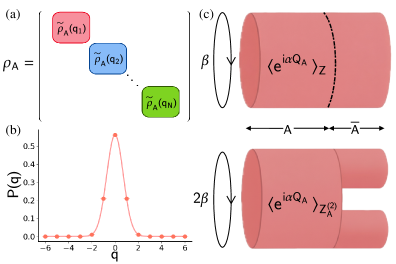
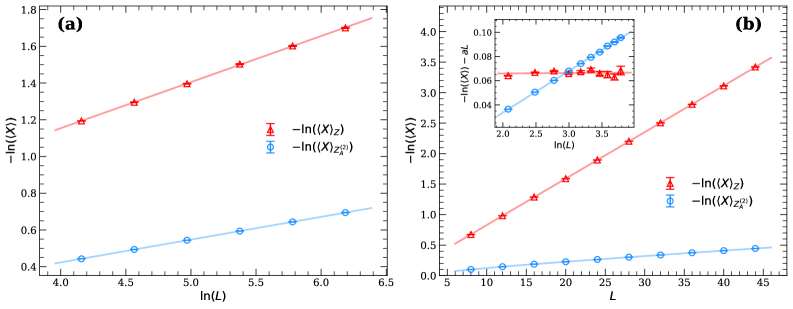
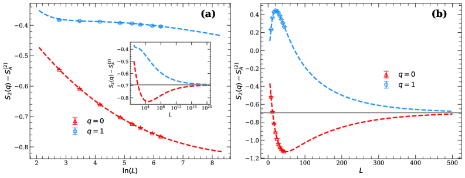
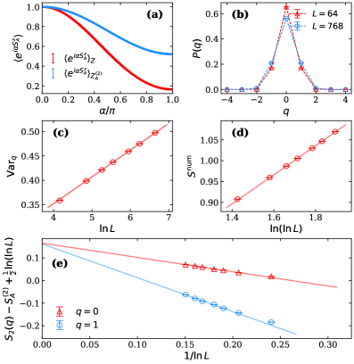
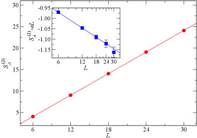
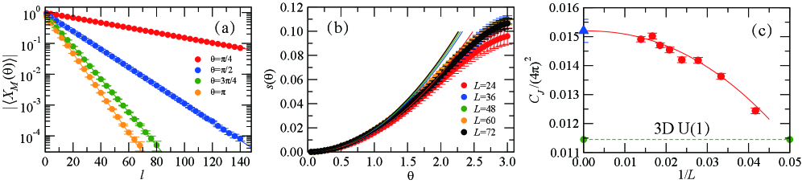

# 量子モンテカルロで迫る対称性分解エンタングルメント：量子臨界点における「もつれの内訳」を測る

- **執筆日**: 2026-04-04
- **トピック**: 量子モンテカルロ法による対称性分解エンタングルメントエントロピーの計算と量子臨界現象への応用
- **タグ**: Superconductivity and Strongly Correlated Systems / Spin Liquids and Quantum Many-Body Systems; Phase Transitions / Monte Carlo
- **注目論文**: arXiv:2604.02307「Detecting Symmetry-Resolved Entanglement: A Quantum Monte Carlo Approach」(Kuangjie Chen, Weizhen Jia, Xiaopeng Li, René Meyer, Jiarui Zhao, 2026)
- **参照関連論文数**: 8本

---

## 1. なぜ今この話題なのか

量子多体系の物理を理解するうえで、「もつれ（エンタングルメント）」の定量化はもはや欠かせない道具になっている。エンタングルメントエントロピーは量子情報理論から生まれた概念だが、凝縮系物理や素粒子理論の研究者たちがこぞって使うようになったのは、それが量子相転移の普遍的な特徴量を鋭く抽出できるからだ。特に1次元系では、共形場理論（CFT）の予言するスケーリング則がエンタングルメントエントロピーを通じて数値的に検証できることが示され、以来この量は「量子系の診断ツール」として広く定着してきた。

しかし近年、もつれの「合計量」を見るだけでは不十分であることが次第に明らかになっている。多くの量子系には電荷保存・スピン保存・粒子数保存などの大域的対称性が備わっており、エンタングルメントはこれらの対称性に対応したセクターごとに異なる分布を持っている。たとえばある系では、もつれの大部分が特定の電荷セクターに集中している一方で、他のセクターはほとんど寄与していない、という状況があり得る。この「もつれの内訳」を明らかにするのが**対称性分解エンタングルメントエントロピー（Symmetry-Resolved Entanglement Entropy: SREE）**である。

SREEへの注目が急速に高まっている背景には、複数の動機が重なっている。理論的には、CFTにおけるエンタングルメント等分配（equipartition）という予言があり、これは「全ての対称性セクターが等しいエントロピーを持つ」という驚くべき普遍性を主張する。ただしこれは漸近的な性質であり、有限サイズ系や有限温度では補正が現れる。実験的には、超冷却原子系での量子ガス顕微鏡技術の発展により、粒子数・スピン各セクターのエンタングルメントを個別に測定する手法が現実味を帯びてきた。また理論物理の観点からは、SREEが非従来型量子相転移（deconfined quantum criticality）や対称性保護トポロジカル相を識別する敏感な指標になることが分かってきた。

問題は、強相関系においてSREEを理論・数値的に計算することが極めて難しいことだ。CFT解析解は1次元の自由度の低い系に限られ、テンソルネットワーク法は2次元以上で急速に困難になる。そこで登場するのが量子モンテカルロ（QMC）法である。QMCは大規模な格子系を直接シミュレートできる強力な手法だが、エンタングルメントエントロピーのような非線形な量の計算には工夫が必要だ。2026年4月、Kuangjie Chenらが arXiv に投稿した論文（2604.02307）は、この問題に対して「乱れ演算子（disorder operator）を複製多様体上で測定する」という巧みなアプローチを提案し、複数の模型で対称性分解エンタングルメントの計算に初めて成功した。本稿ではこの論文を軸に、QMCでSREEを測る最前線を掘り下げる。

---

## 2. この分野で何が未解決なのか

強相関格子系におけるSREE研究には、いくつかの根本的な未解決問題がある。

**問い①：強相関系でのSREE計算をいかに実行可能にするか。**
自由フェルミオンや可積分系では、相関行列を使った効率的な計算が可能だが、相互作用がある場合には空間的に絡み合った波動関数を直接扱わなければならない。テンソルネットワーク（DMRG）は1次元では機能するが、2次元の大規模系への拡張には限界がある。QMCは2次元でも機能するが、従来の方法はエンタングルメントエントロピーの計算にさえ数値的な困難が伴っていた（後述）。SREEはその計算がさらに一段難しく、複素数値を含む「チャージドモーメント」を正確に評価しなければならない。

**問い②：エンタングルメント等分配はいつ・どの程度「壊れるか」。**
CFTの予言するエンタングルメント等分配とは、十分大きなシステムでは各対称性セクターのSREEが全体の$1/N_s$（$N_s$はセクター数）に漸近するという主張だ。しかし実際の系では有限サイズ効果があり、また非従来型量子臨界点（DQCP）では分数励起子の存在によりこの等分配が通常と異なる収束挙動を示す可能性がある。どのモデルでどのような補正が現れるかの体系的理解はまだ不完全だ。

**問い③：乱れ演算子のスケーリングは量子相転移の「指紋」を与えるか。**
乱れ演算子（disorder operator）はSREEのチャージドモーメントと密接に関連し、量子臨界点では特定のCFTデータ（中心電荷、スピン剛性など）によってそのスケーリング指数が決まる。しかし強相関系の多くで、このスケーリングが本当に予測された指数に従うかどうかは系統的に検証されていない。特に、1次転移が弱い連続転移に「偽装」する場合（弱い1次転移）には、乱れ演算子が誤った信号を出す可能性が指摘されている。

**問い④：どのモデルでsign問題なくSREEを計算できるか。**
QMCの最大の障壁はフェルミオン符号問題だが、フラストレーションのないスピン系（ハイゼンベルク模型、横磁場イジング模型など）ではsign問題が回避できる。しかしフラストレート磁性体や多くのフェルミオン系では、sign問題が復活する。SREEを複雑な系に拡張するためには、補助場QMC（AFQMC）や制約経路QMCとの組み合わせが必要になるが、これらの方法での精度保証に未解決点が残っている。

---

## 3. 注目論文の核心：何が前進し、何がまだ仮説か

### これまで何が分かっていたか

SREEを計算するための基礎的な枠組みは、2017年のGoldsteinとSelaの論文（arXiv:1711.09418）で確立された。彼らは「1次元共形場理論において、各チャージセクター$q$のレニーエントロピー$S_n(q)$はフーリエ変換によってチャージドモーメントから復元できる」ことを示した。チャージドモーメントとは

$$Z_n(\alpha) = \mathrm{Tr}\!\left(\rho_A^n \, e^{i\alpha Q_A}\right)$$

という量で、$\rho_A$は部分系Aの縮約密度行列、$Q_A$は部分系A中の電荷演算子、$\alpha$はU(1)フラックス角度である。$Z_n(\alpha)$は$\alpha$の周期関数なので、フーリエ変換

$$\mathcal{Z}_n(q) = \int_{-\pi}^{\pi} \frac{d\alpha}{2\pi} e^{-i\alpha q} Z_n(\alpha)$$

によって各電荷セクター$q$の「分配関数」が得られ、対称性分解レニーエントロピーは

$$S_n(q) = \frac{1}{1-n} \ln \frac{\mathcal{Z}_n(q)}{[\mathcal{Z}_1(q)]^n}$$

と定義される。CFTの予言によれば、$|Z_1(\alpha)|$（乱れ演算子の期待値）は1次元系では$L$のスケールで対数的に減衰し、その係数はCFTの中心電荷$c$と$n$に依存する。

しかしこれを実際の強相関格子系でQMCを使って計算する方法は確立されていなかった。特に、乱れ演算子$\langle e^{i\alpha Q_A}\rangle$の測定において「複製多様体（replica manifold）を用いながら複素数値を扱う」という技術的困難があった。

### 注目論文の新しいアプローチ

Chen et al.（2604.02307）の核心的なアイデアは、**チャージドモーメント$Z_n(\alpha)$を「複製多様体上の乱れ演算子の積」として書き換える**ことにある。

$n$枚のコピー（複製）を使ったパーティション関数の比$Z_n(\alpha)/Z_n(0)$は、$n$複製系における部分系Aへの対称性ツイスト境界条件（symmetry-twisted boundary condition）を課した際の自由エネルギー変化に対応する。ここで著者らが示したのは：

$$\frac{Z_n(\alpha)}{Z_n(0)} = \langle e^{i\alpha Q_A^{(1)}} \rangle_{U_n} \cdot \frac{\langle e^{i\alpha Q_A^{(1)}} \rangle_{\text{single}}}{\langle e^{i\alpha Q_A^{(1)}} \rangle_{\text{single}}}$$

という関係ではなく、より直接的に「$n$複製アンサンブル上での部分系Aの電荷演算子$e^{i\alpha Q_A}$の期待値」と「単一系での同じ演算子の期待値の$n$乗」の比として表現できるということだ。

具体的には、確率的級数展開（SSE: Stochastic Series Expansion）QMCを用いて、1複製系および2複製系におけるツイスト境界条件下のパーティション関数比を測定することで$Z_2(\alpha)$を評価する。本論文では特に$n=2$（2次レニーエントロピー）に焦点を当て、Z$_2$対称性を持つ横磁場イジング模型（TFIM）とU(1)対称性を持つ1次元ハイゼンベルク鎖に適用している。

**図1**（arXiv:2604.02307より、CC BY 4.0）：左部分は部分系Aの縮約密度行列がチャージセクターごとにブロック対角構造を持つことを示す。中央は1次元ハイゼンベルク鎖での電荷分布$p(q)$（ガウス型）を示す。右部分は1複製（上）と2複製（下）での配位図を示す。

### 主要な数値結果

**1次元横磁場イジング模型（1D TFIM）の臨界点**（$h_c = 1.0$）では、乱れ演算子のスケーリングが

$$\langle X_A^{(1)} \rangle \sim L^{-c/(8)}$$（$c=1/2$のIs ing CFT）
$$\langle X_A^{(2)} \rangle \sim L^{-c/(16)}$$（2複製系）

という理論予測と精確に一致することが確認された（係数0.25および0.125の数値検証）。

**2次元横磁場イジング模型（2D TFIM）**では、2複製系の乱れ演算子が面積則にlogの補正を加えた形でスケールすることが確認され、補正係数$0.00793(2)$が得られた。

**図2**（arXiv:2604.02307より、CC BY 4.0）：(a) 1次元TFIMの臨界点での乱れ演算子$|\langle X_A^{(n)}\rangle|$のシステムサイズ$L$依存性（両対数プロット）。赤丸が1複製、青丸が2複製系のデータで、それぞれ理論予測の傾き1/4および1/8（破線）と一致。(b) 2次元TFIM臨界点での同様のスケーリング。

**エンタングルメント等分配の検証**：TFIMの各チャージセクター（$Z_2$対称性なので$q=0,1$のみ）での対称性分解レニーエントロピーが、大サイズ極限で収束する様子を確認した。ただし収束はきわめて遅く、系の大きさが$L\sim 10^{20}$程度にならないと等分配に近づかないという推定が得られた。これは理論的には分かっていたことだが、数値的に確認されたのは重要な進展である。

**図3**（arXiv:2604.02307より、CC BY 4.0）：1次元TFIM（a）と2次元TFIM（b）における、サブトラクションした対称性分解レニーエントロピー$S_2(q)-S_A^{(2)}$のシステムサイズ依存性。両セクター（$q=0$：赤、$q=1$：青）が$L\to\infty$でゼロに収束する傾向が見えるが、収束はきわめて遅い。

**1次元ハイゼンベルク鎖**ではU(1)対称性（スピン$S^z$保存）を持つため、連続的なフーリエ変換が必要になる。電荷分布の分散のサイズ依存性が$\mathrm{Var}_n(L) = 0.0547(1)\ln L + 0.1334(8)$という対数則に従うことを確認し、係数がCFTのスピン剛性と一致することを示した。

**図4**（arXiv:2604.02307より、CC BY 4.0）：1次元ハイゼンベルク鎖での各種測定値。（上段）電荷分布の分散の対数スケーリング。（中段）各電荷セクターの乱れ演算子。（下段）対称性分解レニーエントロピーの有限サイズスケーリング。

### 何がまだ仮説段階か

この論文の手法はフラストレーションのないスピン系（sign問題なし）に限定されており、フェルミオン系や強フラストレート磁性体への拡張は自明ではない。また$n=2$を主に使っているが、$n\neq 2$での計算はより困難であり、$n\to 1$の極限（フォン・ノイマンエントロピー）への解析接続も課題として残る。乱れ演算子と複製多様体のスキームが相互作用の強い系でどこまで精度良く機能するかも、系統的な検証が待たれる。

---

## 4. 背景と研究史：この論文はどこに位置づくか

### エンタングルメントエントロピーとQMCの融合の歴史

エンタングルメントエントロピーをQMCで計算する試みは、2010年代初頭にHastings, González, Melko, Renner（2010年）によるSWAP演算子法の提案から本格化した。この方法は、$n$枚の複製系を結合した「複製パーティション関数」の比 $\mathrm{Tr}(\rho_A^n)/[\mathrm{Tr}(\rho_A)]^n$ がSWAP演算子の期待値として書けることを利用する。SSEや世界線（world-line）QMCにおけるサンプリング変更として自然に組み込める利点があり、ハイゼンベルク模型や横磁場イジング模型で初めてエンタングルメントエントロピーのCFT予言を数値検証することに成功した。

しかしこの方法はひとつの根本的な困難を抱えていた。それは「指数的に小さい確率のイベントをサンプリングしなければならない」という問題だ。部分系が大きくなるほどエントロピーは増大し、$Z_n/Z_n(0)$は$\exp(-S_n)$のオーダーで小さくなる。系が大きかったりエントロピーが大きかったりすると、分散が爆発し、実際的な計算が困難になる。

この問題に対する改善策として、2023〜2024年にかけて複数のアルゴリズム改良が提案された。Song et al.（arXiv:2310.01490）によるResumEE法は、SU($N$)スピン模型のSSEにおいて、多数の着色ループ配位を非着色ループとして再加算することで指数的に加速された測定を実現した。これにより、以前は到達困難だった大サイズでのエンタングルメントエントロピーの精密測定が可能になり、SU($N$)ハイゼンベルク模型の弱1次転移の発見につながった。

Zhou et al.（arXiv:2401.07244）は「増分SWAP演算子（incremental SWAP operator）」を導入し、従来のSWAP測定における指数的な分散増大を多段階計算に分解することで抑制した。これにより2次元反強磁性ハイゼンベルク模型での面積則係数とその対数補正を高精度で抽出することに成功している。

### 乱れ演算子：フラックスから始まった概念

乱れ演算子（disorder operator）は、元来スピン系の双対変換の文脈で登場した概念だ。例えば1次元横磁場イジング模型では、秩序変数（スピン相関）とその双対（ドメイン壁相関）が「秩序-乱れ双対性（order-disorder duality）」を構成する。この枠組みをU(1)やSU($N$)対称性に拡張したのが、Goldstein & Sela（2017年）の仕事だ。彼らはリーマン面を用いた複製技法と組み合わせることで、SREEを乱れ演算子のフーリエ変換として定式化した。

強相関系への応用として特に重要なのが、非従来型量子臨界点（DQCP: Deconfined Quantum Critical Point）との関わりだ。J-Qモデルで示されるネール相とVBS（原子価結合固体）相の間の臨界点は、長らく「連続相転移」として解釈されてきたが、乱れ演算子と現在の中心電荷（current central charge）を組み合わせた研究（Zhao et al., arXiv:2406.02681）により、実は「弱い1次転移」が偽装している可能性が強まった。同論文は易平面JQモデルで乱れ演算子のスケーリング係数が通常のCFTではなくゴールドストーンモードに対応する値（0.5）に収束することを示し、秩序相と臨界点の区別が曖昧になっているという証拠を提示している。

このように乱れ演算子は「この量子相転移は本当にCFTで記述できるのか」という問いに答える鋭い診断ツールとして機能し始めている。Liu et al.（arXiv:2308.07380）は対称質量生成（Symmetric Mass Generation: SMG）転移を調べ、乱れ演算子の角度依存係数$s(\theta)$が「全角度で正」であることを確認し、それが真の(2+1)次元ユニタリCFTであることの証拠を固めた。これは反対称的な振る舞い（$s(\theta)<0$となる角度の存在）が弱1次転移を示すDQCPと対照的であり、乱れ演算子が定性的に異なる相転移を識別する指標として機能することを示している。

### チャージドモーメントの解析的アプローチ

QMCとは独立して、チャージドモーメントを解析的に計算する試みも近年進展している。Li, Dupays, Ruggiero（arXiv:2602.12185）は「バリスティック変動理論（Ballistic Fluctuation Theory: BFT）」という枠組みを使い、積分可能系や自由フェルミオン系でのチャージドモーメントを一般化ギブスアンサンブルや量子クエンチ後のダイナミクスに対して解析的に計算した。彼らの結果はクワジ粒子描像と整合し、平衡・非平衡の両方での対称性分解エンタングルメントの普遍的構造を明らかにしている。このアプローチは非摂動的な相互作用を持つ系には直接適用できないが、QMCの数値計算結果を検証するベンチマークとして重要だ。

---

## 5. どの解釈が最も妥当か：証拠・比較・限界

### Chen et al.の手法の強みと弱み

本論文の最大の強みは「乱れ演算子の複製多様体上での測定」というアイデアがきわめてシンプルで、既存のSSE-QMCのフレームワークに自然に組み込めることだ。測定量は実数である（$|Z_n(\alpha)| = |\langle e^{i\alpha Q_A}\rangle_{U_n}|$）ため、虚部の符号問題的な困難を回避できる。また$n=2$に限定することで、2複製系という比較的小さな拡張だけで済む。

しかし弱点もある。第一に、$Z_2$対称性（イジング系）では$q\in\{0,1\}$の2セクターしかなく、フーリエ変換が自明に近い。U(1)対称性のハイゼンベルク鎖では連続フーリエ変換が必要になるが、論文中での実装は限定的で、主にモーメント（分散）の計算に留まっている。各セクターの完全なSREEを精度良く復元するためには、より多くの$\alpha$点でのサンプリングが必要だ。

第二に、1次元系ではCFTの解析予言が既に存在するため、QMCの結果はあくまで「検証」にとどまる。QMCが真に威力を発揮するのは2次元系だが、2D TFIMの臨界点での計算は少数の点に留まっており、スケーリングの精度は1D系より低い。

### カゴメDQCPへの応用と中心電荷の増強

Wang et al.（arXiv:2601.13774）は同様のQMC手法を使い、カゴメ格子のBoson-Hubbardモデル上のDQCP候補点で乱れ演算子とエンタングルメントエントロピーを測定した。

**図（arXiv:2601.13774より、CC BY 4.0）**：カゴメDQCP候補点での2次レニーエントロピー$S_A^{(2)}$のシステムサイズ$L$依存性。赤線（面積則+log補正）のフィットが示す通り、正の対数補正係数$s\approx 0.1$が得られており、ユニタリCFTと整合。

特に注目すべき発見は、電流中心電荷（current central charge）$C_J$が従来のO(2)臨界点より約4/3倍に増強されているという点だ。この値は、フラクション化した励起子（量子弦と解放されたスピノン）が速度比約3で共存することから導かれる理論予測と一致する。

**図（arXiv:2601.13774より、CC BY 4.0）**：(a) 乱れ演算子$|\Delta_{d,M}(0)|$の距離依存性（指数減衰）。(b) コーナー関数$s(\theta)$の角度依存性。(c) 電流中心電荷$C_J$の$1/L$依存性；$L\to\infty$外挿値はO(2)臨界点（緑破線）より明確に上にあり、増強が確認できる。

こうした結果は、カゴメ格子上のDQCPが通常の連続相転移より「豊かな」臨界点であることを示唆し、Chen et al.の方法論の波及力を示すひとつの例になっている。ただしDQCPの「真に連続かつCFTで記述できるか」という問いは未だ議論中であり、さらに大きな系での計算と独立した理論解析が必要だ。

### 弱1次転移の落とし穴：乱れ演算子が「嘘をつく」とき

しかし乱れ演算子の解釈には注意が必要だという示唆もある。Zhao et al.（arXiv:2406.02681）が易平面JQモデルで示したように、系が実際には弱い1次転移をするにもかかわらず、有限サイズ系では乱れ演算子が対数的なスケーリングを示し、CFTの予言と区別しにくい挙動を示すことがある。これは「偽陰性」（真の相転移を誤検出するリスク）と呼べる問題だ。有限サイズスケーリングの解析だけでは、真のCFTと偽装した1次転移を区別するのが難しいケースがある。

この問題への対策として：(1) より大きな系サイズでの計算、(2) 複数の診断量（エンタングルメントエントロピー、乱れ演算子、秩序変数）の組み合わせによる交叉確認、(3) 有限温度スケーリングとの比較、などが考えられるが、どれもより多くの計算コストを要求する。

### フェルミオン系への拡張：AFQMCとの統合

フェルミオン系（ハバード模型など）においてSREEを計算する試みも並行して進んでいる。Shen et al.（arXiv:2312.11746）は増分スワップアルゴリズムをAFQMC（補助場QMC）の再帰的カノニカルアンサンブル法と組み合わせ、引力型ハバード模型（attractive Hubbard model）でのSREEを計算した。彼らの結果は、ペアリングと電荷密度波の競合が各チャージセクターのエントロピーに明確な「指紋」を残すことを示した。これは通常の相関関数では見えにくい情報であり、SREEが強相関フェルミオン系のキャラクタリゼーションに有効であることを示す重要な事例だ。

ただしAFQMCにおけるSREEの計算は符号問題の再導入というリスクを伴っており、制約経路近似（constrained-path approximation）や射影的QMC法との組み合わせで生じる系統誤差が懸念される。Roberts et al.（arXiv:2603.25858）は制約経路QMCでのペア相関関数の精度ベンチマークを行い、バックプロパゲーション法が過小評価をもたらす可能性を指摘しており、SREEにも同様の注意が必要だろう。

### 証拠の強さの評価

現時点で比較的確からしいこと：(1) SSEベースのQMCはsign問題のないスピン系においてSREEを精度よく計算できる。(2) 乱れ演算子のスケーリングはCFTデータ（中心電荷、カレント中心電荷）と整合する情報を与える。(3) エンタングルメント等分配は原理的には成立するが収束がきわめて遅い。

まだ不確実なこと：(1) 弱1次転移との区別に乱れ演算子がどこまで信頼できるか。(2) フェルミオン系でのSREEがAFQMCで系統誤差なく計算できるか。(3) DQCPの増強された中心電荷が真にフラクション化の証拠かどうか。

---

## 6. 何が一般化できるのか：材料・手法・応用への広がり

### モデルから物質へ：SREEの実験的な対応物

格子模型でのSREEが実験とどう繋がるかは、まだ開拓途上の問いだ。超冷却原子の量子ガス顕微鏡では、粒子数分解されたエンタングルメント測定が原理的には可能だ。光格子中のボーズ・ハバード模型を使い、各粒子数セクターでの量子もつれを個別に測定する提案がなされており、実験グループも注目している。凝縮系物質への直接応用は困難だが、量子スピン液体や重フェルミオン系では核磁気共鳴（NMR）や中性子散乱の測定と間接的に対応する可能性がある。

### 手法の一般化：拡張すべき方向

Chen et al.の方法は現状では横磁場イジング模型とハイゼンベルク鎖に限られているが、以下の拡張が自然に考えられる。

まず、**非可換対称性（SU($N$）など）への拡張**。ResumEE（arXiv:2310.01490）で開発されたSU($N$)スピン模型のSSEフレームワークに、乱れ演算子の複製多様体測定を組み込むことで、多成分系や高スピン系のSREEが計算可能になる。SU(3)やSU(4)の磁性体は銅酸化物の軌道自由度を模擬するモデルとして有用であり、軌道自由度分解のエンタングルメントが各軌道秩序相でどう振る舞うかは材料設計の観点からも興味深い。

次に、**有限温度へのアプローチ**。現在の方法は主に基底状態（または低温）に限られているが、経路積分QMCとの組み合わせにより有限温度でのSREEが原理的には計算できる。量子臨界ファンとしては、量子相転移から有限温度クロスオーバーへの「もつれの変化」を追うことが興味深い。

さらに、**拡張エンタングルメント（multipartite entanglement）への展開**。2つ以上の部分系に対するSREE（例えばトライパータイトエンタングルメント）は位相幾何的な性質と関連し、トポロジカル秩序の検出に有望だ。トポロジカルエンタングルメントエントロピー（topological entanglement entropy）のチャージ分解版を計算することで、トポロジカル量子数をセクターごとに識別できる可能性がある。

### 量子情報との接続

SREEは「アクセシブルなエンタングルメント（accessible entanglement）」という概念とも密接に関わる。超選択則（superselection rule）を考慮すると、量子通信や量子計算に実際に利用できるもつれは全体のエンタングルメントエントロピーより少なく、チャージ保存の制約に縛られた部分のみ操作できる。アクセシブルエンタングルメントの定量化は、実用的な量子デバイス性能の評価に繋がる。Shen et al.（arXiv:2312.11746）の仕事はまさにこの方向を向いており、電子相関の「使える」もつれ成分の特定を目指している。

---

## 7. 基礎から理解する

### レニーエントロピーとその意味

エンタングルメントを定量化する最も自然な指標は**フォン・ノイマンエントロピー**$S_1 = -\mathrm{Tr}(\rho_A \ln \rho_A)$だ。しかし数値的に計算しやすいのは、整数$n$に対して定義される**$n$次レニーエントロピー**

$$S_n(A) = \frac{1}{1-n} \ln \mathrm{Tr}(\rho_A^n)$$

である。$n=1$の極限でフォン・ノイマンエントロピーに一致する。$n=2$は$S_2 = -\ln \mathrm{Tr}(\rho_A^2)$で、「純度」$\mathrm{Tr}(\rho_A^2)$の対数だ。

なぜこれが計算しやすいか？ $\mathrm{Tr}(\rho_A^n)$は「$n$枚のコピーを持つ系でAの自由度を一巡させた際のパーティション関数の比」として解釈できる。QMCでは$\mathrm{Tr}(\rho_A^2)/[\mathrm{Tr}(\rho_A)]^2$をSWAP演算子の期待値として測定できる：

$$\frac{Z_2}{Z_1^2} = \langle \mathrm{SWAP}_A \rangle$$

ここでSWAP$_A$は2複製系において部分系Aの自由度を入れ替える演算子だ。この等式はハルダーらにより2010年代に示された。

### 部分系電荷と対称性分解

系にU(1)対称性（電荷保存など）があるとき、縮約密度行列$\rho_A$は部分系内の電荷$Q_A$で分解できる。すなわち

$$\rho_A = \bigoplus_q p(q) \rho_A^{(q)}$$

のようにブロック対角になる（$p(q)$は電荷$q$の測定確率、$\rho_A^{(q)}$はセクター内の密度行列）。このとき全エンタングルメントエントロピーは

$$S_n(A) = \frac{1}{1-n}\ln\sum_q p(q)^n \, \exp[(1-n)S_n(q)]$$

のように分解できる。対称性分解レニーエントロピー$S_n(q)$は上式の各セクターの寄与を与える。

### チャージドモーメントと乱れ演算子

$Z_n(\alpha) = \mathrm{Tr}(\rho_A^n e^{i\alpha Q_A})$のフーリエ変換が$\mathcal{Z}_n(q)$を与えるという定式化の鍵は、$e^{i\alpha Q_A}$という因子が「部分系Aに位相$\alpha$の対称性変換を施す演算子」であることにある。これはちょうどAharonov-Bohm磁束をリーマン面の穴に通した設定に対応する。

$Z_n(\alpha)/Z_n(0)$の$n$複製系での解釈：$n$枚の複製のそれぞれで独立に$e^{i\alpha Q_A}$を掛けるのではなく、$n$複製が「ねじれた」境界条件で結合した系を考える。このねじれた配位でのパーティション関数比が$Z_n(\alpha)/Z_n(0)$であり、QMC上では「部分系Aの電荷演算子$e^{i\alpha Q_A}$の$n$複製アンサンブルでの期待値」として測定できる。

### CFT予言：乱れ演算子のスケーリング

(1+1)次元CFTでは、乱れ演算子の期待値は部分系サイズ$\ell$（全系サイズ$L$のうち長さ$\ell$の区間）に対して

$$|Z_n(\alpha)| \sim \left(\frac{\ell}{L}\sin\frac{\pi\ell}{L}\right)^{-\frac{c}{12n}(1-\frac{6\alpha^2}{\pi^2 n})}$$

という形に書けることが知られている。ただしこれは連続CFTの結果であり、格子模型では有限サイズ補正が加わる。$\alpha=\pi$（最大フラックス）のとき

$$|Z_n(\pi)| \sim L^{-c/(8n)}$$（半鎖カットの場合）

という冪則が得られ、その指数が中心電荷$c$と$n$によって決まる。これがChen et al.の数値検証の軸になっている。

(2+1)次元系では解析的なCFT予言が少なく、数値計算が特に重要になる。2D TFIMの臨界点では理論的な乱れ演算子スケーリングの表式が確立していないため、Chen et al.の数値結果はそれ自体が「(2+1)D Ising CFTにおける乱れ演算子の普遍的振る舞い」を与える新しいデータになっている。

### SSE-QMCの概要

確率的級数展開（Stochastic Series Expansion: SSE）は、Sandvikにより1990年代に開発されたQMCの一種で、逆温度$\beta$でのパーティション関数を演算子の文字列の展開として表現する：

$$\mathcal{Z} = \sum_{n=0}^\infty \frac{\beta^n}{n!} \sum_{\{o_1,\ldots,o_n\}} \langle\alpha|\prod_{i} H_{o_i}|\alpha\rangle$$

ここで$H_{o_i}$はハミルトニアンの分解した各項（ボンド演算子など）。この表現でのMCサンプリングはマルコフ連鎖（ループ更新など）で実行でき、spin-1/2ハイゼンベルク模型や横磁場イジング模型で高精度の結果を与える。

SSEでの複製多様体は、2枚の複製を独立にサンプリングしながら部分系Aの境界でエンタングルさせた「接合された時空間シリンダー」として実装される。$n=2$の場合、これは通常の計算に比べて約2倍の計算コストで実行できる。

---

## 8. 専門用語の解説

**エンタングルメントエントロピー（entanglement entropy）**：量子系をAとBに分けたとき、Aの縮約密度行列$\rho_A$から計算されるフォン・ノイマンエントロピー$S = -\mathrm{Tr}(\rho_A\ln\rho_A)$。量子もつれの強さを測る指標で、分離可能な状態では$S=0$、最大もつれ状態で$S=\ln\dim(\mathcal{H}_A)$となる。

**レニーエントロピー（Rényi entropy）**：整数$n$に対して定義される$S_n = \frac{1}{1-n}\ln\mathrm{Tr}(\rho_A^n)$。$n\to 1$でフォン・ノイマンエントロピーに一致する。QMCではSWAP演算子法により$n=2$が特に計算しやすい。

**チャージドモーメント（charged moment）**：$Z_n(\alpha) = \mathrm{Tr}(\rho_A^n e^{i\alpha Q_A})$。U(1)対称性を持つ系で定義され、そのフーリエ変換が各電荷セクターのエンタングルメントを与える。複素数値を持つが、$|\alpha|\leq\pi$の範囲でフーリエ変換することで実数の$\mathcal{Z}_n(q)$が得られる。

**対称性分解エンタングルメントエントロピー（symmetry-resolved entanglement entropy, SREE）**：大域的対称性の各セクター$q$における部分系Aのレニーエントロピー$S_n(q)$。全エンタングルメントは全セクターにわたる加重平均で復元される。CFTではエンタングルメント等分配が成立する。

**乱れ演算子（disorder operator）**：部分系Aに対称性変換$e^{i\alpha Q_A}$を施した演算子の期待値$\langle e^{i\alpha Q_A}\rangle$。秩序-乱れ双対性の文脈で登場し、量子臨界点での冪則スケーリングを示す。CFTデータ（中心電荷など）を抽出するために使われる。

**エンタングルメント等分配（entanglement equipartition）**：CFTにおいて、大サイズ極限で各対称性セクターのSREEが全体の$S_n(A)/N_s$（$N_s$はセクター数）に漸近するという性質。有限サイズでは収束が非常に遅く、系の大きさが指数的に大きくなって初めて成立する。

**複製多様体（replica manifold）**：$n$次レニーエントロピーを計算するために系の$n$枚のコピーをある境界で接続した虚時間の多様体。$n$複製パーティション関数の比$Z_n/Z_1^n$がエントロピーを与え、QMCではこれを明示的にサンプリングする。

**確率的級数展開（Stochastic Series Expansion: SSE）**：ハミルトニアンを演算子列の高温展開として表現し、MCサンプリングで期待値を計算するQMCの一種。sign問題のないスピン系で高精度。ループ更新により効率的なサンプリングが可能。

**非従来型量子臨界点（Deconfined Quantum Critical Point: DQCP）**：ネール反強磁性相と原子価結合固体（VBS）相の間に出現すると提案された量子臨界点。フラクション化したスピノン励起が解放（deconfined）されており、従来のLandau-Ginzburg-Wilson理論では記述できないとされる。J-Qモデルが代表的な模型だが、実際には弱1次転移の可能性も指摘されている。

**電流中心電荷（current central charge）$C_J$**：U(1)あるいはより一般のリー群対称性を持つCFTで定義される普遍定数。対称性流の2点関数の振幅として現れ、乱れ演算子のコーナー関数の傾き$s'(\pi/2)$から数値的に抽出できる。DQCPでの$C_J$の増強は分数励起の存在を示唆する。

---

## 9. おわりに：何が分かり、何がまだ残っているのか

Chen et al.（arXiv:2604.02307）の仕事が示したことは、量子モンテカルロというよく確立された方法が、従来は解析的手法の独壇場だった「対称性分解エンタングルメント」の計算に侵入できるという技術的ブレークスルーだ。乱れ演算子を複製多様体上で測定するというアイデアは、SSEのループ更新と自然に結合し、特定の$n=2$の場合には通常の計算の約2倍のコストで実行できることが示された。1次元・2次元の横磁場イジング模型と1次元ハイゼンベルク鎖での検証は、CFT予言との定量的な一致を確認し、特に2次元系での新たな数値データを提供した。一方でカゴメ格子のDQCP研究（arXiv:2601.13774）は同様の手法の応用として、フラクション化励起による電流中心電荷の増強という興味深い現象を数値的に捉えた。これらを総合すると、「乱れ演算子とSREEは量子相転移のCFT的性質を診断する有力な指標になりうる」という立場が、徐々に実証的な根拠を固めつつあると言えるだろう。

しかし未解決の問題も多く残る。フェルミオン系（ハバード模型、強相関電子系）へのSREEの拡張は、符号問題という本質的な壁に突き当たっており、AFQMCや制約経路法との組み合わせで生じる系統誤差の評価が不可欠だ。また弱1次転移が有限サイズでCFTを「偽装する」問題（arXiv:2406.02681）は、乱れ演算子の解釈に慎重さを要求する。今後1〜3年で最も注目すべき論点は、(1) SU($N$）対称性を持つスピン・軌道結合系でのSREEのQMC計算、(2) 強フラストレート磁性体（カゴメ・三角格子スピン液体候補）での乱れ演算子スケーリングによるスピン液体相の識別、(3) $n\to 1$極限のフォン・ノイマン型SREEへの解析接続手法の開発、そして(4) 量子ガス顕微鏡実験との対応づけ、になるだろう。量子多体系の「もつれの内訳」を解明する試みは、材料科学・量子情報・場の理論の境界線をますます曖昧にしながら、今後数年で急速に発展すると予想される。

---

## 参考論文一覧

1. **[arXiv:2604.02307](https://arxiv.org/abs/2604.02307)** — K. Chen, W. Jia, X. Li, R. Meyer, J. Zhao (2026): *Detecting Symmetry-Resolved Entanglement: A Quantum Monte Carlo Approach* — 本論文の注目論文。SSE-QMCを用いて乱れ演算子の複製多様体測定によりSREEを計算し、1D/2D横磁場イジング模型と1Dハイゼンベルク鎖でCFT予言を検証した。

2. **[arXiv:2601.13774](https://arxiv.org/abs/2601.13774)** — Y.-C. Wang, Z. Yan, X.-F. Zhang (2026): *Entanglement entropy and disorder operator at kagome deconfined quantum criticality* — カゴメ格子Bose-HubbardモデルのDQCP候補点でQMCを使い乱れ演算子と第2レニーエントロピーを測定、電流中心電荷の4/3倍増強を発見した。

3. **[arXiv:2406.02681](https://arxiv.org/abs/2406.02681)** — J. Zhao, Z. Y. Meng, Y.-C. Wang, N. Ma (2024/2025): *Scaling of Disorder Operator and Entanglement Entropy at Easy-Plane Deconfined Quantum Criticalities* — 易平面JQモデルで乱れ演算子が弱1次転移においてCFT的スケーリングに見せかける「偽陽性」の危険性を示した。

4. **[arXiv:2308.07380](https://arxiv.org/abs/2308.07380)** — Z. H. Liu et al. (2023): *Disorder Operator and Rényi Entanglement Entropy of Symmetric Mass Generation* — 対称質量生成転移が真のユニタリCFTであることを乱れ演算子の角度依存係数$s(\theta)>0$で確認し、DQCPとの定性的区別を示した。

5. **[arXiv:2602.12185](https://arxiv.org/abs/2602.12185)** — G. Li, L. Dupays, P. Ruggiero (2026): *Charged moments and symmetry-resolved entanglement from Ballistic Fluctuation Theory* — バリスティック変動理論を用いてチャージドモーメントを解析的に計算する枠組みを提案し、QMC数値計算の独立な検証基準を与えた。

6. **[arXiv:2310.01490](https://arxiv.org/abs/2310.01490)** — M. Song, T.-T. Wang, Z. Y. Meng (2023): *Resummation-based Quantum Monte Carlo for Entanglement Entropy Computation* — SU($N$)スピン模型のSSE-QMCにおいてループ再加算法（ResumEE）を導入し、指数的に難しいエンタングルメントエントロピーの測定を指数加速した。

7. **[arXiv:2401.07244](https://arxiv.org/abs/2401.07244)** — X. Zhou, Z. Y. Meng, Y. Qi, Y. D. Liao (2024): *Incremental SWAP Operator for Entanglement Entropy* — 増分スワップ演算子法を提案し、2次元反強磁性ハイゼンベルク模型でエンタングルメントの面積則係数と対数補正を高精度で抽出した。

8. **[arXiv:2312.11746](https://arxiv.org/abs/2312.11746)** — T. Shen, H. Barghathi, A. Del Maestro, B. Rubenstein (2023): *Disentangling the Physics of the Attractive Hubbard Model via the Accessible and Symmetry-Resolved Entanglement Entropies* — 増分スワップ+再帰的AFQMCの組み合わせで引力型ハバード模型のSREEを計算し、ペアリングと電荷密度波の競合の指紋を示した。

9. **[arXiv:1711.09418](https://arxiv.org/abs/1711.09418)** — M. Goldstein, E. Sela (2018, PRL): *Symmetry-Resolved Entanglement in Many-Body Systems* — SREEの概念を提唱し、リーマン面上のAharonov-Bohm磁束を用いたチャージドモーメントの定式化と1D CFTでの解析予言を与えた先駆的論文。
