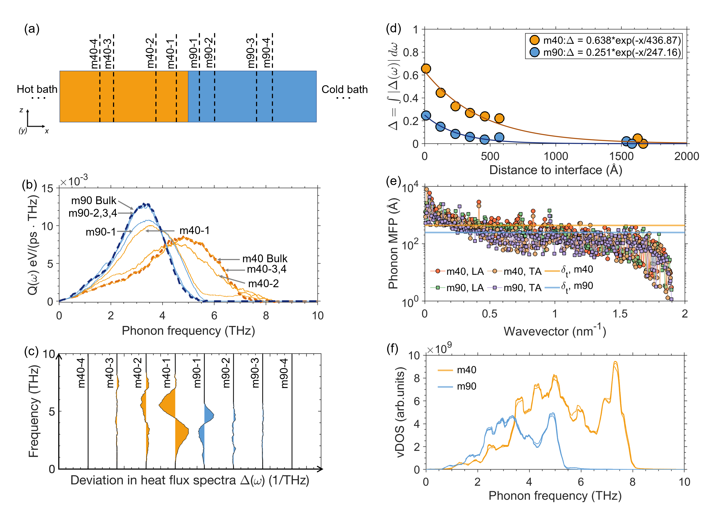
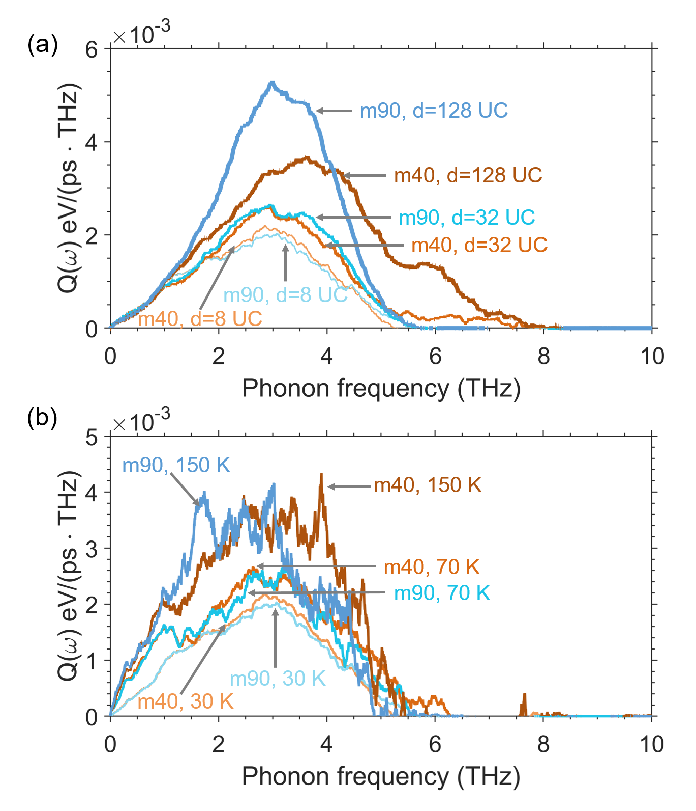

# β-Ga₂O₃/4H-SiC界面の熱境界コンダクタンス：原子秩序がフォノン輸送を決定する

- **執筆日**: 2026年4月20日
- **トピック**: β-Ga₂O₃/4H-SiC界面における熱境界コンダクタンスの原子スケール制御
- **タグ**: Phonons and Thermal Properties / Thermal Transport / Heterostructures / Machine Learning / Molecular Dynamics
- **注目論文**: Yang, H. et al., "Atomic-scale order enables high thermal boundary conductance at β-Ga₂O₃/4H-SiC interfaces", arXiv:2604.15394 (2026)
- **参照論文数**: 7本

---

## 1. なぜ今この話題なのか

パワーエレクトロニクスの未来を担う材料として、**β型酸化ガリウム（β-Ga₂O₃）** が急速に注目を集めている。電気自動車、電力変換装置、5Gインフラなど、現代社会の基幹をなすシステムには、高電圧・大電流を高効率で制御できる半導体デバイスが不可欠である。現在主流のシリコン（Si）の性能的な限界を超えるべく、シリコンカーバイド（4H-SiC）や窒化ガリウム（GaN）といった**ワイドバンドギャップ半導体**が実用化され始めているが、次の一手として研究者たちが注目するのが、バンドギャップ約4.9 eVを誇る「超ワイドバンドギャップ半導体（UWBG: Ultra-Wide Bandgap Semiconductor）」β-Ga₂O₃である。

β-Ga₂O₃の最大の魅力は、その高い絶縁破壊電界（約8 MV/cm）にある。半導体の電力デバイスとしての性能を表す指標の一つに、**Baligaの品質指数（BFOM: Baliga's Figure of Merit）** がある。BFOMは比誘電率を $\varepsilon_r$、電子移動度を $\mu$、絶縁破壊電界を $E_c$ としたとき、

$$\text{BFOM} = \varepsilon_r \mu E_c^3$$

と定義され、オン抵抗と耐圧の兼ね合いを表す。β-Ga₂O₃はSiの約3,200倍、GaNの約5倍ものBFOMを示すとされており、理論上は極めて高性能なスイッチング素子の実現が期待される。さらに、溶融法による大口径バルク結晶の育成が可能という製造上のメリットも大きく、GaNで課題となる大口径基板の問題を原理的に回避できる。

しかし、β-Ga₂O₃には致命的な弱点がある。それが、**極めて低い熱伝導率**である。結晶方向によって異方性があるものの、典型的な値は10〜20 W/(m·K)程度で、GaN（約200 W/(m·K)）やSiC（4H-SiC: 約490 W/(m·K)）と比較すると1桁以上低い。Alkandariら（2024年、arxiv:2410.11106）は第一原理計算によってこの低熱伝導率の起源を解析し、β-Ga₂O₃の単斜晶構造に存在する8面体配位Gaサイト（Ga(Ⅱ)）の強い非調和性がフォノン散乱を増大させる主因であることを特定した。ジュール熱として発生した熱がデバイス内に蓄積すると、動作温度の上昇、電子移動度の低下、最終的にはデバイスの劣化・破壊につながる。つまり、Ga₂O₃本来のポテンシャルを引き出すには、**熱管理（サーマルマネジメント）** が最大のボトルネックとなっている。

この問題へのアプローチとして注目されているのが、**高熱伝導基板との異種接合集積化**である。特に4H-SiCは高熱伝導率（約490 W/(m·K)）に加え、Ga₂O₃とのエピタキシャル成長の相性も比較的良く、「Ga₂O₃-on-SiC」構造による熱拡散促進が活発に研究されている。しかし、Ga₂O₃層で発生した熱をSiC基板に逃がすためには、**両者の界面における熱の流れやすさ、すなわち熱境界コンダクタンス（TBC: Thermal Boundary Conductance）** が極めて重要になる。界面でのフォノン散乱・反射が大きければ、せっかく高熱伝導基板を使っても十分な冷却効果が得られない。

2026年4月15日にarXivに投稿されたYangら（arxiv:2604.15394）の論文は、まさにこの問題に正面から向き合い、**機械学習原子間ポテンシャル（MLIP）** を用いた大規模分子動力学シミュレーションによって、β-Ga₂O₃/4H-SiC界面のTBCが**原子スケールの界面秩序**によって決定的に支配されることを明らかにした。その最大の成果は、原子的に鋭い界面において231 MW m⁻²K⁻¹という記録的なTBC値を達成したことである。この値は従来の実験値（典型的に30〜100 MW m⁻²K⁻¹）を大幅に上回り、本系における熱伝導の新たな上限を提示するものとして注目されている。

---

## 2. 未解決問題は何か

β-Ga₂O₃/SiC界面における熱輸送を巡っては、現在も次のような本質的な問いが未解決のまま残っている。

**問い①：界面での原子混合は熱輸送に有利か不利か？**

従来の直感的理解では、界面に乱雑な混合層（インターミックス層）が生じると、そこでフォノンが散乱されてTBCが低下すると考えられてきた。しかし一方で、組成が連続的に変化するグレーデッド界面は、弾性的なインピーダンスを緩やかに変化させることでフォノンの透過率を上げ、TBCを向上させる可能性も指摘されている。実際、GaN/SiC界面に関する計算研究（Yin et al., arxiv:2508.12744）では、GaN側に欠陥があるとTBCが54%低下する一方、SiC側に欠陥があるとTBCが57%向上するという非直感的な結果が報告されており、界面乱れの効果は材料系と方向性に強く依存する。Ga₂O₃/SiC界面において、どのような原子配置が最適かはまだ十分には解明されていない。

**問い②：フォノンコヒーレンスは界面TBCにどこまで寄与するか？**

フォノンには粒子的な側面（散乱支配の輸送）と波動的な側面（コヒーレンス）がある。Diamond/cBN界面では11 GW m⁻²K⁻¹という驚異的なTBCが実現されており（Wang et al., arxiv:2504.18473）、これはコヒーレントなモード拡張（extended phonon modes）および局在したC-B架橋モードによるものとされている。しかしGa₂O₃/SiC系の格子不整合はdiamond/cBNより大きく、このようなコヒーレンス効果がどこまで有効かは不明確である。界面秩序とコヒーレンスの定量的な関係を解明することが、本系のTBC理解の核心をなす。

**問い③：実用デバイス条件での最適界面構造は何か？**

実際のデバイスは200〜400℃以上の高温条件下で動作する。温度が上がると非調和散乱が増加し、フォノンの平均自由行程が短くなる。原子的に鋭い界面が室温で高いTBCを示しても、高温では性能が劣化する可能性がある。また、デバイス製造の現実的なプロセス（エピタキシャル成長、直接接合、アニール処理）で原子的に鋭い界面を再現性よく作製できるかどうかも、実用化に向けた重要な課題として残っている。

---

## 3. 注目論文の核心

### 何を問いとし、どう解いたか

Yangら（2026年、arxiv:2604.15394）の研究の核心的な問いは、「β-Ga₂O₃/4H-SiC界面でのTBCはどこまで高くできるか、そしてそれを決定する原子スケールの要因は何か」である。

この問いに答えるため、著者らはまず**機械学習原子間ポテンシャル（MLIP）** を開発した。具体的にはNeuroevolution Potential (NEP) という手法を採用し、DFT計算から得られたエネルギー・力・応力のデータを学習した。NEPはDFT並みの精度を持ちながら、DFTの何百〜何千倍もの速度で原子間力を計算できる。これにより、実際のデバイス界面に近い複雑な構造（数万原子）の長時間・長スケールMDシミュレーションが可能になった。得られたNEPは10〜1000 Kという広い温度範囲と22種類の構造設定に対してテストされ、10 nsを超える長時間MDを実行している。

次に、著者らはこのMLIPを用いた**非平衡分子動力学（NEMD）シミュレーション**を実施し、原子的に鋭い界面から様々な厚さのインターミックス層を持つ界面まで、系統的にTBCを計算した。フォノン輸送の機構解明には、**振動状態密度（VDOS）、フォノン参加率（PPR）、スペクトル熱コンダクタンスG(ω)** という三つの解析ツールが組み合わせて用いられた。

### 主要な結果と新規性

**（1）原子的に鋭い界面でのTBC：231 MW m⁻²K⁻¹という記録値**

界面に原子混合がない、完全に鋭い接合では、TBCは231 MW m⁻²K⁻¹に達した。これはβ-Ga₂O₃/4H-SiC系でこれまでに実験・計算で報告された最高値であり、従来のイオンカット法や接合法で作製された界面（典型的に30〜80 MW m⁻²K⁻¹程度）を大幅に上回る。この値は、古典的なAMM予測値も超えており、単なる弾性的なフォノン透過以上の機構が働いていることを示唆している。

**（2）界面の乱れはTBCを単調に低下させる**

インターミックス層の厚みが増すと、TBCは単調に低下することが定量的に示された。著者らはこの低下の機構として、無秩序な原子配置が**フォノンコヒーレンスを破壊する**ことを指摘している。秩序ある界面ではフォノンが波として界面を透過できるが、乱れた界面では位相情報が失われ、フォノンが粒子的に散乱されやすくなる。重要なのは、従来「界面に適度な乱れがフォノン散乱を緩和してTBCを上げる可能性がある」という議論に対して、本系では明確に「秩序が有利」というエビデンスが得られた点である。

**（3）スペクトル解析による機構の解明**

スペクトル熱コンダクタンスG(ω)の計算から、原子的に鋭い界面では低周波数（アコースティックフォノン）領域でG(ω)が高く、界面フォノンモードが体積フォノンと強く結合していることが示された。一方、乱れた界面では中間周波数領域に新たなピーク（インターフェイシャルモード）が現れるが、これらのモードはPPRが低く（局在振動）、体積フォノン輸送への実質的な寄与は限定的である。つまり、乱れた界面で出現する局在モードは、一見「新しい輸送チャネル」に見えながら実際には機能せず、TBCを改善しない。

**何が前進し、何がまだ仮説か**

今回の研究で明確に前進したのは、(1) 機械学習ポテンシャルによって高精度の大規模シミュレーションが実現し、界面構造とTBCの定量的な関係が得られたこと、(2) 231 MW m⁻²K⁻¹という理論的上限値が示されたこと、(3) コヒーレンスとPPR解析によって「なぜ秩序が有利か」の機構的説明がなされたことである。一方、コヒーレンスがTBCに寄与する割合の定量評価や、高温動作時の性能変化、実際の成長プロセスで原子的に鋭い界面が再現できるかどうかは、今後の実験と追加計算による検証が必要な段階である。

---

## 4. 背景と研究史

### カピッツァ抵抗の発見から現代の課題へ

界面における熱流の障壁は、1941年にロシアの物理学者カピッツァ（Pyotr Kapitsa）が、液体ヘリウムと固体の間で熱流に対する境界抵抗を発見したことに端を発する。これが**カピッツァ抵抗（Kapitza resistance）** あるいは**熱境界抵抗（TBR: Thermal Boundary Resistance）** の起源であり、その逆数がTBCである。カピッツァ抵抗は当初、極低温の量子現象として注目されたが、その後の研究により、常温においても異種材料の界面では必ずTBRが存在することが明らかになった。現代では、ナノスケールデバイスの微細化に伴い、TBCが素子全体の熱特性を左右するほど重要になっている。

TBCの理論モデルとして長年用いられてきたのが、**音響不整合モデル（AMM: Acoustic Mismatch Model）** と**拡散不整合モデル（DMM: Diffuse Mismatch Model）** である。AMMはフォノンを連続弾性波として扱い、界面での透過確率を弾性定数と音速の不整合から計算する。一方DMMは、界面でフォノンが完全に散乱（diffuse）されると仮定し、界面両側の振動状態密度から透過確率を求める。これらは解析的に扱いやすいが、界面の原子構造、局所的な欠陥、フォノン-フォノン相互作用などを無視するため、実際のTBC値を正確に再現できないことが多い。特に高TBCを示す系では、AMMもDMMも予測値を大幅に過小評価する傾向がある。

### β-Ga₂O₃の熱物性：異方性と非調和性

β-Ga₂O₃の低熱伝導率の原因は、その複雑な結晶構造に由来する。β-Ga₂O₃は単斜晶系に属し（空間群C2/m）、4面体配位Gaサイト（Ga(Ⅰ)）と8面体配位Gaサイト（Ga(Ⅱ)）の二種類のGaサイトを持つ。熱伝導率は結晶方向によって異なり（[100]方向: ~11 W/(m·K)、[010]方向: ~15 W/(m·K)、[001]方向: ~13 W/(m·K)が典型値）、この異方性の理論的解明には計算手法の選択が重要である。

Alkandariら（2024年、arxiv:2410.11106）は、第一原理計算をベースに調和近似（harmonic phonons）、フォノン繰り込み（phonon renormalization）、四フォノン散乱の三段階モデルを系統的に比較した。調和近似では理論値が実験値を過小評価するのに対し、**フォノン繰り込み**を考慮すると、方向依存的なフォノン群速度の変化と寿命の増加により実験値との一致が改善されることを示した。特に、Ga(Ⅱ)サイト（8面体配位）の原子が最も大きな非調和性を持ち、この特異な局所環境がGa₂O₃全体の熱輸送特性を決定的に支配していることが明らかになった。この知見は、Ga₂O₃の熱特性をドーピングや構造制御によって改善するうえでの指針となる。

一方、Arabovら（2026年3月、arxiv:2603.29484）はMLIPを用いてβ-Ga₂O₃の結晶・アモルファス状態での熱伝導率を比較し、アモルファスGa₂O₃の熱伝導率（約0.9 W/(m·K)）が結晶状態の約10分の1であることを報告した。これは、デバイス製造工程でアニール不十分な場合や、イオン照射によって部分アモルファス化した界面層が形成された場合に、熱輸送が著しく阻害されることを意味する。

### 半導体異種接合のTBC研究の最前線

MLIPを用いたTBC研究は近年急速に進展し、様々な材料系でAMM/DMMを超える精度の予測が可能になっている。

Si/Diamond界面の研究（Yin et al., 2025年7月、arxiv:2507.22490）は、特に重要な戦略的知見を提供する。SiとDiamondは音響インピーダンスが大きく異なり、直接接合ではTBCが低くなる。そこで著者らは、SiCという「フォノンブリッジ」材料を中間層として挿入することを提案した。SiCは、Siの低周波フォノンとダイヤモンドの中高周波フォノンをスペクトル的に橋渡しする中間的なフォノン状態密度を持ち、最適厚さ40 nmのSiC中間層でTBCを46.6%向上させることに成功した。この「フォノンブリッジ」という考え方は、Ga₂O₃/SiCにとどまらず、広帯域ギャップ半導体一般の熱管理設計に応用できる可能性がある。

欠陥効果に関するYinら別報（2025年8月、arxiv:2508.12744）は、4つの半導体界面（Si/SiC、GaN/SiC、Si/Diamond、GaN/Diamond）を対象に、欠陥が両側のTBCに与える影響の非対称性を示した。特にGaN/SiC界面では、SiC側の欠陥がフォノンエネルギーの再分布（低周波フォノンへのダウンコンバージョン）を促し、TBCを逆に向上させるという非直感的な結果が得られた。これは、欠陥の「どちら側に」「どのような欠陥が」あるかによって効果が逆転することを示しており、界面エンジニアリングの複雑さを示している。

最も極端なTBCの例として、diamond/cBN界面（Wang et al., 2025年4月、arxiv:2504.18473）が挙げられる。MLIPを用いたMDにより、理想的なdiamond/cBN界面のTBCは11.0 GW m⁻²K⁻¹という前例のない値を示すことが明らかになった。この値はGa₂O₃/SiCの記録値（231 MW m⁻²K⁻¹）の約48倍であり、両材料の音響インピーダンスが近く、さらに炭素原子がB-C結合を介して局在モードで熱を受け渡す特殊な機構が働くことによる。ただし、原子拡散が混合層を形成すると、このTBCが最大71%も低下することも示されており、界面秩序の維持がここでも決定的に重要であることが確認されている。

スペクトル的な観点から界面フォノン輸送を理解する枠組みとして、Cuiら（2024年、arxiv:2409.00312）の研究は不可欠である。彼らはモデル材料からなる界面において、フォノンが界面を通過した後にスペクトル熱フラックス $Q(\omega)$ が「瞬時に」切り替わるのではなく、**特性熱化長 $\delta_t$（数百Å）** にわたって徐々に再分布することを明らかにした（図1）。

*図1：単一界面（m40/m90モデル材料）におけるスペクトル熱フラックスQ(ω)の空間変化。(a) シミュレーションセットアップ（ホット/コールドバス間の界面）、(b) 各位置でのQ(ω)スペクトル（バルク値との比較）、(c) 各位置での偏差のバイオリンプロット、(d) 界面からの距離に対するQ(ω)偏差の指数的減衰（特性熱化長δt）、(e) フォノン平均自由行程、(f) 振動状態密度（vDOS）。界面両側の直近ではQ(ω)が互いに一致し、バルク値からずれることが分かる。(Cui et al., arXiv:2409.00312, CC BY 4.0)*

$\delta_t$ はフォノン平均自由行程と強く相関しており、材料によって数十〜数百Å程度である。薄膜やナノスケール構造では、フォノンが $\delta_t$ 内に再分布を完了できないため、バルク的な熱伝導の描像が成立しない。この「熱化長」の概念は、デバイスの極薄機能層でTBCが特に支配的になるという事実の微視的な裏付けを与えている。

---

## 5. どの解釈が最も妥当か

### 「秩序が勝る」の根拠と内部整合性

Yangらの中心的主張は、「原子スケールの界面秩序がフォノンコヒーレンスを保存し、その結果としてTBCが高くなる」というものである。この解釈を支持する根拠は複数の計算量から独立に確認されている。

第一に、**スペクトル熱コンダクタンスG(ω)の解析**が直接的な根拠を与える。原子的に鋭い界面では、特に低周波数（アコースティックフォノン）領域でのG(ω)が高く、界面フォノンモードが体積フォノンと強く結合していることが示された。乱れた界面では中間周波数に局在したインターフェイシャルモードが出現するが、これらの振動参加率（PPR）が低い。PPRが低いということは、これらのモードが界面に局在しており、熱エネルギーを体積の彼方へ輸送できないことを意味する。つまり、乱れた界面で出現する新しいモードは「熱輸送の補助チャンネル」ではなく「熱を閉じ込めるトラップ」として機能してしまうのである。

第二に、**diamond/cBN系との対比**が解釈を補強する。Wang et al.（2025年4月、arxiv:2504.18473）のdiamond/cBN界面では、原子拡散による混合層形成がTBCを71%低下させることが示された。これはGa₂O₃/SiC系とは材料が異なるが、「界面秩序の乱れがTBCを下げる」という主張の普遍性を支持している。diamond/cBN系がほぼ完全な音響的整合性（最小限の不整合）という「理想条件」でも秩序の維持が必要であることを示しており、Ga₂O₃/SiCのような不整合が大きい系では、コヒーレンス維持の重要性がさらに高い。

第三に、**欠陥の非対称効果**という事実もこの解釈と整合する。Yin et al.（2025年8月、arxiv:2508.12744）のGaN/SiC界面での結果では、SiC側の欠陥がTBCを上げるという例外的な事例もあったが、これはSiCのフォノンスペクトルが広帯域であるため、欠陥散乱によって生じる低周波フォノンへの再分布がGaN界面での透過率を偶然に向上させるという特殊な機構による。Ga₂O₃/SiC系のスペクトル構造はGaN/SiCとは異なり、このような「例外的な」欠陥支援効果が働く条件は限定的と考えられる。

### 代替解釈と未解決点

「界面に適度な乱れが有益である」という代替解釈の可能性は完全には排除できない。音響不整合モデル（AMM）に基づけば、Ga₂O₃とSiCの間には弾性的なインピーダンスの差があり、完全に鋭い界面は大きな反射率を生じさせる。グレーデッド組成界面はこの不整合を緩和し、アコースティックフォノンの透過率を上げる可能性がある。

ただし、Yangらのシミュレーション結果は、少なくとも彼らが扱った構造範囲と温度条件では、混合層の増加が一貫してTBCを低下させることを定量的に示している。この結果の一般性を検証するには、混合層の化学的な偏析（偏析傾向、局所的な結合状態の変化）をより詳細にモデル化した計算が必要である。また、グレーデッド組成とランダム混合では界面のフォノン透過特性が大きく異なる可能性があり、両者を区別した解析が今後の課題となる。

### 実験・理論・計算の整合度

MLIPを用いたMDシミュレーションによるTBC予測は、近年様々な系で実験値との整合が確認されており、信頼性が向上している。Ga₂O₃/SiC系では、232 MW m⁻²K⁻¹という記録値を直接検証する実験報告はまだないが、熱反射法（TDTR/FDTR）を用いた精密測定と、高分解能STEM・APTによる界面構造同定を組み合わせた実験が近い将来に期待される。このような「構造と熱特性の同時測定」が確立すれば、理論と実験の定量比較が可能になる。

薄膜・デバイス条件での挙動については、図2が示すように、フォノンのスペクトル分布は界面を越えた後も一定の距離 $\delta_t$ にわたって変化し続ける。デバイス中の薄いGa₂O₃層（数十〜数百nm）ではこの再分布効果が重要になり、単純なTBCの足し算では素子の熱抵抗を正確に評価できない可能性がある。

*図2：薄膜厚さ（UC: unit cells）と温度がスペクトル熱フラックスQ(ω)に与える影響。(a) 厚さ依存性：薄い層（8 UC）では両材料のQ(ω)が均一化されるが、厚い層（128 UC）ではバルク的なスペクトルが回復する。(b) 温度依存性（30 K、70 K、150 K）：温度上昇とともにフォノン散乱が増加し、スペクトルが変化する。界面近傍の薄膜では層厚がδtより小さい場合にバルク的な輸送の描像が破綻する。(Cui et al., arXiv:2409.00312, CC BY 4.0)*

---

## 6. 何が一般化できるのか

### 超ワイドバンドギャップ半導体群への横断的な展開

Ga₂O₃/SiC界面で得られた知見——「原子秩序がフォノンコヒーレンスを保ち、TBCが高くなる」——は、パワーデバイス材料全般に適用できる汎用原理である。材料系を超えた設計指針として、以下への波及が期待される。

**GaN-on-Diamond** は、ダイヤモンド（~2000 W/(m·K)）の熱伝導を活かす次世代パワー増幅器として注目される。現在の接合法では典型的なTBCは20〜100 MW m⁻²K⁻¹であり、大きな改善余地がある。Yin et al.（arxiv:2507.22490）がSi/Diamond系で示したフォノンブリッジ戦略（SiC中間層、+46.6%向上）は、適切な中間層（AlN等）を選べばGaN/Diamond系にも応用でき、エピタキシャル成長技術の進歩と組み合わせることで記録的なTBCの達成が期待される。

**β-Ga₂O₃-on-Diamond** はさらに高熱伝導基板を用いる系であり、Van der Waals接合でのTBCは約17 MW m⁻²K⁻¹と非常に低い。しかし、エピタキシャル接合が実現できれば、diamond/cBN系で示されたような劇的なTBC向上（~11 GW m⁻²K⁻¹）の一端を得られる可能性がある。Ga₂O₃とダイヤモンドの格子不整合はcBNよりはるかに大きいため同等の値は望めないが、MLIPによる系統的な界面最適化計算がロードマップの設計に役立つ。

**窒化アルミニウム（AlN）** はバンドギャップ6.2 eV、熱伝導率~320 W/(m·K)で、GaN系デバイスのバッファ層として広く使われている。AlN/SiCやAlN/Diamondのエピ界面は比較的良好なTBCを示すことが知られており、Ga₂O₃デバイスとAlNバッファの組み合わせも熱設計の選択肢となる。

### フォノン工学の設計原理として

今回の研究は、半導体異種接合の熱設計における設計思想を豊かにする。従来の経験則「界面をきれいにする（欠陥・混合を減らす）」の背後に「コヒーレンス保存」という物理的概念が加わったことで、次のような設計指針が導かれる。

まず、**格子定数の整合性** を重視すべきである。格子不整合が小さい材料系ほど、エピタキシャル界面でのコヒーレントフォノンモードが維持されやすく、高いTBCが期待できる。逆に不整合が大きい系では、転位の発生によってコヒーレンスが失われ、TBCが低下するリスクがある。次に、**フォノンスペクトルの整合性** も重要で、特にアコースティック分岐の周波数範囲が近い材料の組み合わせ（diamond/cBN系が典型例）は高いTBCを示す傾向がある。さらに、Cuiら（arxiv:2409.00312）が示した「熱化長δt」の概念は、薄膜デバイスの現実的なサーマル設計において不可欠な考慮事項となる。$\delta_t$ より薄い機能層では、TBCがバルク熱伝導率よりも支配的な因子になることを設計段階から考慮しなければならない。

### 機械学習ポテンシャルが可能にした転換点

本研究の技術的革新の本質は、高精度MLIPが大規模MD（数万原子、数十ns）を可能にしたことで、従来はアクセスできなかった「界面の統計的多様性」の評価が初めて可能になったことにある。DFTベースの計算では数百原子のモデルが限界であり、界面の乱れや欠陥を統計的に扱うことは困難だった。MLIPはこの障壁を取り除き、実際のデバイス界面に近い複雑な構造を扱える。このアプローチは、β-Ga₂O₃のような大きなユニットセル（20原子/ユニットセル）を持つ複雑酸化物にとって特に有効であり、他のペロブスカイト酸化物やスピネル型酸化物の界面熱輸送解析へも広く展開できる。

---

## 7. 基礎から理解する

### フォノンとは何か：格子振動の量子

固体中の原子は格子点を中心に熱振動している。隣り合う原子は化学結合（バネ）でつながっているため、一つの原子の振動は隣に波として伝わる。この格子振動の波を量子化した準粒子が**フォノン（phonon）** である。フォノンはボース粒子として統計力学的に扱われ、温度が高いほど多く励起される（ボース-アインシュタイン分布）。

フォノンには主に二種類ある。**音響フォノン（acoustic phonon）** は隣接原子が同位相で振動するモードで、長波長・低周波数の極限では固体中の音波（縦波または横波）と一致する。**光学フォノン（optical phonon）** は異なる原子が逆位相で振動するモードで、単位胞に複数の原子を持つ結晶で現れ、比較的高周波数を持つ。絶縁体・半導体の熱伝導を主に担うのは音響フォノンであり、特に低周波数の長波長フォノンが重要である。

格子熱伝導率 $\kappa$ は、フォノン気体の輸送理論（Peierls-Boltzmann輸送方程式）から導かれる。簡単な近似では、

$$\kappa = \frac{1}{3} \sum_{\lambda} C_{\lambda} v_{\lambda} \lambda_{\lambda}$$

と書ける。ここで $C_{\lambda}$ はフォノンモード $\lambda$ の比熱、$v_{\lambda}$ はグループ速度（音速に相当）、$\lambda_{\lambda}$ は平均自由行程である。$\lambda$ はフォノン同士の非調和散乱（Umklapp過程）や欠陥散乱によって制限される。β-Ga₂O₃の低熱伝導率は、$v_{\lambda}$ が相対的に小さく、また非調和性が強いため $\lambda_{\lambda}$ が短いことの両方に起因している。

### 熱境界コンダクタンス（TBC）の基礎

二つの異なる固体が界面を形成するとき、フォノンは界面で一部透過し、一部反射される。これは光が二つの媒質の境界面で屈折・反射するのと類似している。界面を横切る単位面積・単位時間あたりの熱流量 $J$ と界面両側の温度差 $\Delta T$ の比が熱境界コンダクタンスである：

$$\text{TBC} = \frac{J}{\Delta T}$$

単位は W m⁻² K⁻¹（あるいは MW m⁻² K⁻¹）であり、大きいほど界面での熱の流れが良い。TBCはその逆数の**熱境界抵抗（TBR）** でも表され、$\Delta T_{\text{interface}} = J \times \text{TBR} = J / \text{TBC}$ という関係が成り立つ。

TBCの大きさを決める主な因子は以下の通りである。(1) 界面両側の材料のフォノン分散関係（音速、振動状態密度）の整合性が高いほど透過率が高い。(2) 界面の原子構造が原子的に鋭いほどコヒーレントな透過が起こりやすい。(3) 界面の化学結合状態（共有結合か、Van der Waals接合か）が透過率に影響する。(4) 温度が高いほど非調和フォノン散乱が増し、TBCが低下する傾向がある。

### 音響不整合モデル（AMM）の物理

最もシンプルなTBCのモデルは音響不整合モデル（AMM）である。材料1と材料2の間の界面を考えると、音響インピーダンス $Z_i = \rho_i v_i$（$\rho_i$: 密度、$v_i$: 音速）の不整合から、フォノンの透過率は（正入射・横波/縦波の一種の場合）：

$$t_{12} = \frac{4 Z_1 Z_2}{(Z_1 + Z_2)^2}$$

で与えられる。$Z_1 = Z_2$ の場合、$t_{12} = 1$（完全透過）であり、$Z_1 \gg Z_2$ または $Z_1 \ll Z_2$ の場合、$t_{12} \to 0$（完全反射）となる。AMMはフォノンを平面波として扱い、界面が完全に平坦であることを仮定する。Ga₂O₃とSiCの音響インピーダンスには差があるため、AMMによる予測は低めのTBCを与えるが、実際の実験値やMLIP計算値はAMM予測を上回ることが多い。その理由として、(1) inelastic（非弾性）散乱過程が実際の透過率を増大させること、(2) 界面に固有のローカルモードが存在して輸送を補助すること、などが挙げられる。

### フォノンコヒーレンスとスペクトル熱フラックス

フォノンは波動として扱うと、干渉効果（コヒーレンス）を示す。原子的に鋭い界面ではフォノンの位相情報が保たれたままで透過するが、乱れた界面ではランダム散乱によって位相が破壊される（デコヒーレンス）。コヒーレントな透過は、フォノンが「量子力学的なトンネル」のように界面を通過することに相当し、粒子的散乱を超えた輸送を可能にする。

Cuiら（arxiv:2409.00312）が明らかにした「**特性熱化長 $\delta_t$**」は、このコヒーレンス効果の空間スケールを定量化したものである。具体的には、界面を通過したフォノンのスペクトル熱フラックス $Q(\omega)$ がバルク的な分布（その材料固有のスペクトル）を回復するまでの距離であり、フォノン平均自由行程と相関して数十〜数百Å程度である。デバイスのチャネル層やゲート誘電体が $\delta_t$ より薄い場合、バルク熱伝導率の概念は成立せず、TBCが素子全体の熱特性を決定する支配的な因子になる。

### 機械学習原子間ポテンシャル（MLIP）の仕組み

密度汎関数理論（DFT）は電子系を量子力学的に記述し、原子間力を高精度で計算できるが、計算コストがO(N³)のスケーリングのため、扱える原子数は数百個が限界である。**機械学習原子間ポテンシャル（MLIP）** はDFT計算データを機械学習で学習し、原子配置から直接エネルギー・力を高速に予測するモデルである。

本研究では、**Neuroevolution Potential (NEP)** という手法が用いられた。NEPは、原子の局所環境を記述する記述子（descriptor）と、そこから原子エネルギーを予測するニューラルネットワークから構成される。記述子の設計においてニューロン進化（neuroevolution）の手法を用いることで、効率よく汎化性能の高いモデルが構築できる。この方法によって、DFT並みの精度で数万〜数十万原子を10 nsオーダーの時間にわたってシミュレーションすることが初めて可能になり、界面の構造多様性を統計的に扱えるようになった。

---

## 8. 専門用語の解説

**熱境界コンダクタンス（TBC: Thermal Boundary Conductance）**：二種類の固体間の界面が熱を通す容易さを表す量（単位: MW m⁻²K⁻¹）。値が大きいほど界面での熱の流れが良い。その逆数が熱境界抵抗（カピッツァ抵抗）であり、$\Delta T_{\text{界面}} = J / \text{TBC}$ という温度降下を生じさせる。デバイスのサーマルマネジメントにおいて、特にナノスケール構造では支配的な熱抵抗源となる。

**フォノン（Phonon）**：固体中の格子振動を量子化した準粒子。電子が電荷の担い手であるように、フォノンは熱エネルギーの担い手である。音響フォノン（長波長・低周波）が絶縁体・半導体の熱伝導を担い、光学フォノン（高周波）は電子-フォノン散乱や赤外吸収に関わる。波と粒子の両方の性質を持ち、界面での振る舞いにはこの二面性が現れる。

**音響不整合モデル（AMM: Acoustic Mismatch Model）**：界面でのフォノン透過確率を、界面両側の材料の音響インピーダンス（密度×音速）の差から計算する古典的モデル。連続弾性体の近似で有効だが、実際の原子構造を無視するため定量的精度は限られる。二材料の音響インピーダンスが近いほど高いTBCが予測される。

**スペクトル熱コンダクタンス G(ω)**：TBCを周波数（$\omega$）ごとに分解したもの。$\text{TBC} = \int_0^\infty G(\omega)\, d\omega$ と書ける。低周波数のアコースティックフォノンが支配的か、高周波数の光学フォノンや界面局在モードが重要かを識別できる。MLIP-MDシミュレーションによって計算可能であり、TBC機構解明の中心的ツール。

**機械学習原子間ポテンシャル（MLIP: Machine Learning Interatomic Potential）**：DFT計算データを学習し、原子配置から高速にエネルギー・力を予測するニューラルネットワーク。DFT並みの精度で大規模MD（数万〜数百万原子）が可能。本研究ではNeuroevolution Potential (NEP) を使用。訓練データの品質と多様性が性能を左右する。

**振動状態密度（VDOS: Vibrational Density of States）**：フォノンの振動周波数の分布を示す関数。界面近傍のVDOSはバルクと異なり、界面固有のフォノンモード（インターフェイシャルモード）の存在を反映する。VDOSの整合性が良い材料系（両側でフォノン周波数が重なる範囲が広い）は、界面での透過率も高い傾向がある。

**フォノン参加率（PPR: Phonon Participation Ratio）**：ある振動モードが全体にどれだけ「広がっているか」を示す指標。値が1に近いほど全原子が参加する拡張モード（extended mode）、0に近いほど局所的な局在モード（localized mode）。界面近傍の局在モードはPPRが低く、体積への熱輸送に寄与しにくい。

**超ワイドバンドギャップ半導体（UWBG Semiconductor: Ultra-Wide Bandgap Semiconductor）**：バンドギャップが3.5 eV以上の半導体の総称。β-Ga₂O₃（4.9 eV）、ダイヤモンド（5.5 eV）、立方晶BN（6.4 eV）などが含まれる。高い絶縁破壊電界を持ち、次世代パワーデバイスへの応用が期待されるが、熱管理が大きな課題である。

**フォノンコヒーレンス（Phonon Coherence）**：フォノンが波として干渉効果を示す性質。コヒーレントなフォノン輸送では波の位相情報が保たれ、界面を「波として」透過する。乱れた界面では位相が崩れ（デコヒーレンス）、フォノンが粒子的に散乱される。原子的に鋭い界面はコヒーレンスを保つため高いTBCをもたらす。

**特性熱化長（Thermalization Length δₜ）**：界面を通過したフォノンがバルク的なスペクトル分布（そのバルク材料固有のQ(ω)）を回復するのに要する空間スケール。フォノン平均自由行程と相関し、典型的に数十〜数百Å。デバイスの機能層がδₜより薄い場合、界面TBCが素子の熱特性を支配する主因となる。Cuiら（arXiv:2409.00312）によって定義・定量化された概念。

---

## 9. 今後の展望

β-Ga₂O₃/4H-SiC界面のTBC研究において、現時点でかなり確からしくなったことは、「完全エピタキシャル（原子的に鋭い）界面が231 MW m⁻²K⁻¹という高いTBCを原理的に達成できる」という理論予測である。この値は従来の接合法・イオンカット法で作製された界面（典型的に30〜80 MW m⁻²K⁻¹）の3〜7倍に相当し、Ga₂O₃-on-SiCデバイスのサーマルマネジメントに対する楽観的な展望を与える。また、その機構として「フォノンコヒーレンスの保存」という説明が、VDOSやPPRといった複数の独立した解析量から支持されており、メカニスティックな理解は着実に深まっている。diamond/cBN系（arxiv:2504.18473）などの比較研究も「秩序が有利」という主張を横断的に支持しており、これは特定の計算条件に依存しない一般的な原理として受け入れられつつある。

一方、不確定要素もいくつかある。最も重要なのは実験的検証であり、実際のMBEや化学気相成長で作製したGa₂O₃/SiCエピタキシャル界面が本当に原子的に鋭いかどうか、計算予測に近いTBCが実測されるかどうかは、TDTR/FDTRと原子分解能STEMを組み合わせた実験で初めて明らかになる。また、β-Ga₂O₃の単斜晶対称性による界面方位依存性（異なる面終端でのTBCの違い）、高温動作条件（300℃以上）でのTBCの維持、Ga₂O₃側とSiC側のフォノンスペクトルを最大限に整合させる「フォノンブリッジ中間層」の設計、といった課題が今後1〜3年の重要な研究テーマとなるだろう。長期的には、MLIPと逆設計手法を組み合わせた「熱的に最適な界面の計算設計」が実現すれば、超ワイドバンドギャップ半導体デバイスのサーマルマネジメントに根本的な革新をもたらす可能性がある。

---

## 参考論文一覧

1. **Yang, H. et al., arXiv:2604.15394 (2026)**
   [https://arxiv.org/abs/2604.15394](https://arxiv.org/abs/2604.15394)
   MLIPを用いた非平衡MDにより、β-Ga₂O₃/4H-SiC界面の原子スケール秩序がTBCを決定的に支配し、原子的に鋭い界面で記録値231 MW m⁻²K⁻¹を達成することを示した本特集の注目論文。

2. **Alkandari, A. et al., arXiv:2410.11106 (2024)**
   [https://arxiv.org/abs/2410.11106](https://arxiv.org/abs/2410.11106)
   第一原理計算（フォノン繰り込みと四フォノン散乱）により、β-Ga₂O₃の異方的熱伝導率における計算値と実験値の乖離を解消し、8面体配位Gaサイトの強い非調和性が支配的因子であることを特定した研究。

3. **Arabov, R. et al., arXiv:2603.29484 (2026)**
   [https://arxiv.org/abs/2603.29484](https://arxiv.org/abs/2603.29484)
   MLIPを用いた計算により、結晶β-Ga₂O₃とアモルファスGa₂O₃の熱伝導率・バンドギャップ繰り込みを評価し、アモルファス化が熱伝導率を約10分の1に低下させることを明らかにした研究。

4. **Cui, H. et al., arXiv:2409.00312 (2024)**
   [https://arxiv.org/abs/2409.00312](https://arxiv.org/abs/2409.00312)
   界面を通過したフォノンのスペクトル熱フラックスが特性熱化長δtにわたって徐々に再分布することをMDシミュレーションで示し、薄膜構造での界面TBC支配の微視的根拠を与えた研究。

5. **Yin, E. et al., arXiv:2508.12744 (2025)**
   [https://arxiv.org/abs/2508.12744](https://arxiv.org/abs/2508.12744)
   第一原理計算とMCシミュレーションにより、Si/SiC・GaN/SiC・Si/Diamond・GaN/Diamond四界面系での欠陥がTBCに与える非対称・非直感的な効果を系統的に解析した研究。

6. **Yin, E. et al., arXiv:2507.22490 (2025)**
   [https://arxiv.org/abs/2507.22490](https://arxiv.org/abs/2507.22490)
   SiCを中間層（フォノンブリッジ）として挿入することでSi/Diamond界面のTBCを46.6%向上させることを第一原理+MCで実証し、フォノンスペクトル整合化という設計戦略を提示した研究。

7. **Wang, X. et al., arXiv:2504.18473 (2025)**
   [https://arxiv.org/abs/2504.18473](https://arxiv.org/abs/2504.18473)
   MLIPを用いたMDにより、ideal diamond/cBN界面がTBC = 11.0 GW m⁻²K⁻¹という半導体接合の理論的最高値を示すことを明らかにし、拡張音響モードと局在C-Bモードの寄与機構を解明した研究。
