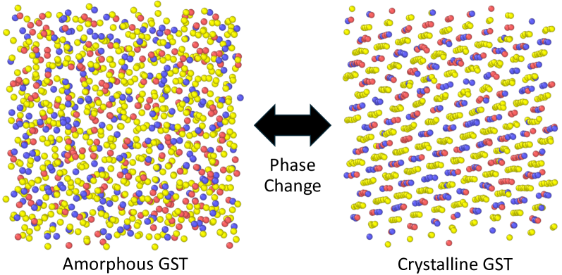
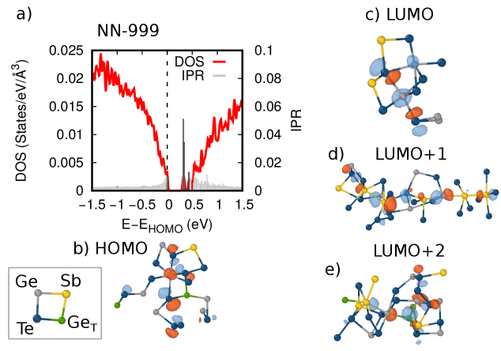
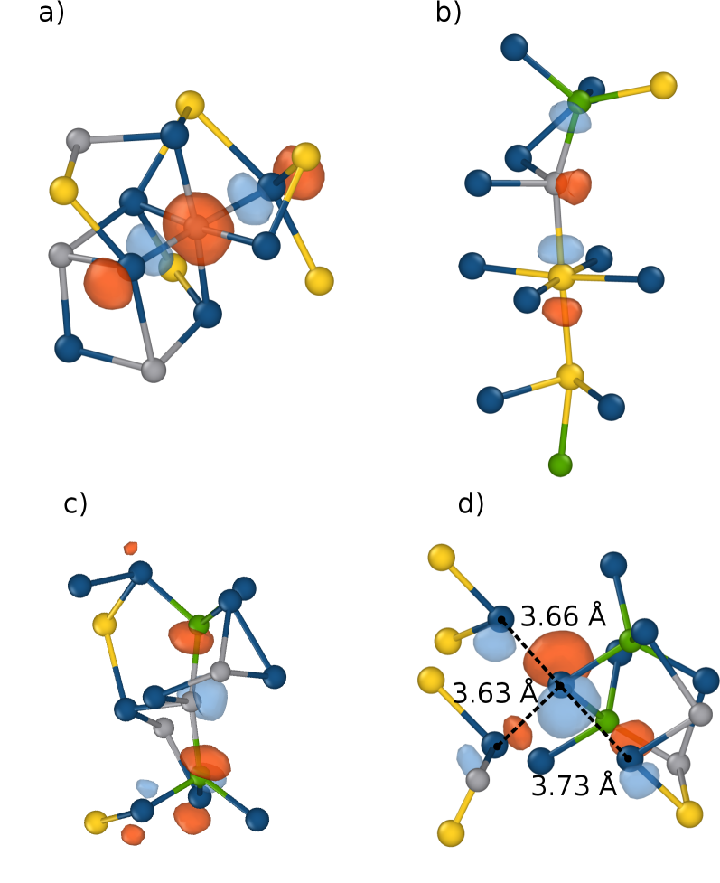
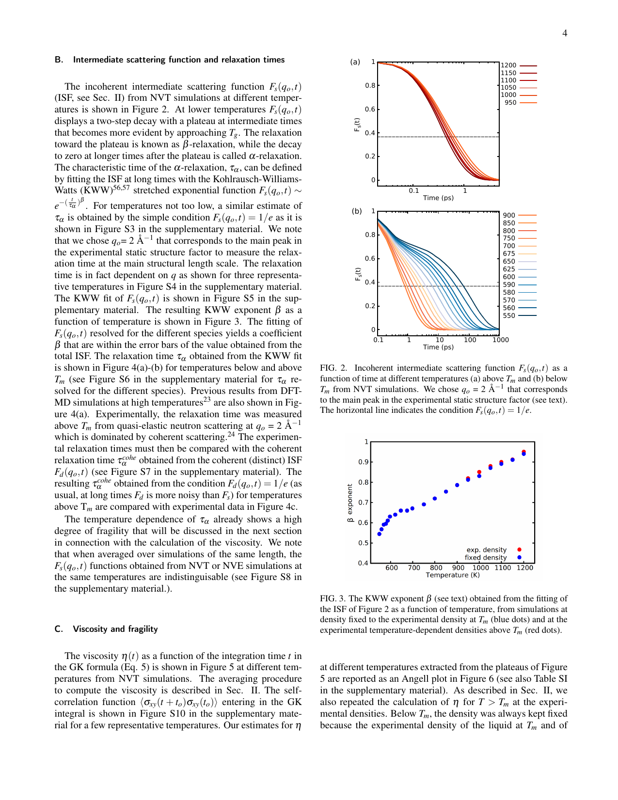
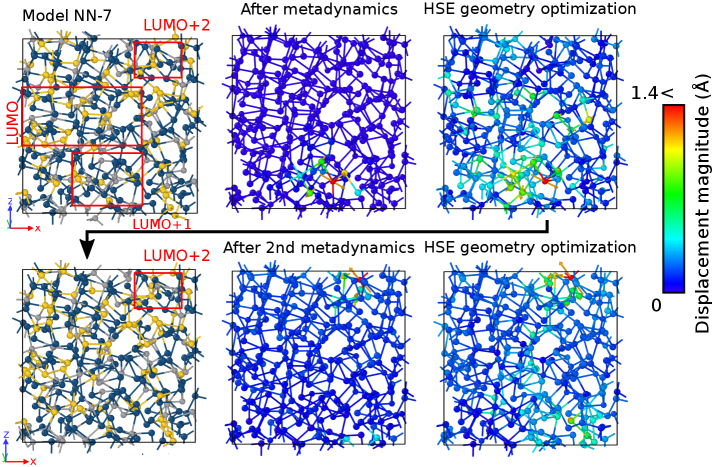
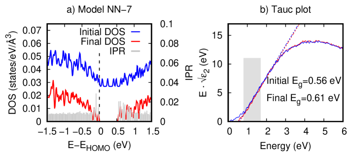
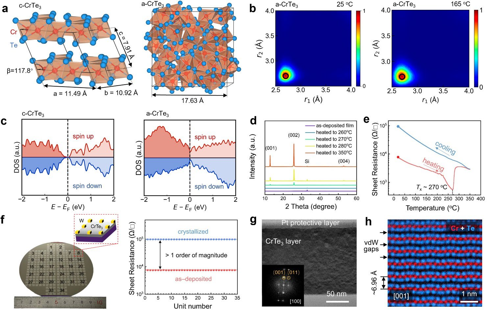

# アモルファスGe₂Sb₂Te₅のバンドギャップ内準位——機械学習ポテンシャルが解明する構造欠陥と抵抗ドリフトの起源

- **執筆日**: 2026-04-12
- **トピック**: amorphous-GST-in-gap-states
- **タグ**: Computation and Theory / Phase Transitions; Defects and Impurities / Machine Learning; Molecular Dynamics
- **注目論文**: [arXiv:2602.15446](https://arxiv.org/abs/2602.15446) — Omar Abou El Kheir, Marco Bernasconi, "On the origin of in-gap states in amorphous Ge₂Sb₂Te₅" (2026)
- **参照関連論文数**: 6本

---

## 1. なぜ今この話題なのか

次世代の不揮発性メモリとして、**相変化メモリ** (Phase Change Memory, PCM) が注目を集めている。PCMはGe₂Sb₂Te₅（以下 GST）に代表される相変化材料がアモルファス（非晶質）相と結晶相を電気的に行き来できる性質を利用したデバイスであり、書き換え可能で高密度、かつ高速なデータ保持が可能という特性から、現在も活発な研究開発が続いている。GSTは1980年代末にYamadaらによって発見された材料であり、CD-RWやDVD-RAMなどの光学ストレージにも応用されてきた。これを電気的なスイッチングで動作させたのがPCMである。

PCMの最大の課題の一つが**抵抗ドリフト** (resistance drift) と呼ばれる現象だ。アモルファス状態に書き込まれた直後から、時間の経過とともに電気抵抗が $R(t) \sim t^\nu$（$\nu \approx 0.1$）の冪乗則で増大し続ける。これは単なる特性劣化ではなく、メモリが保持する「0/1」の区別そのものが時間とともにぼやけていくことを意味する。特に近年注目される**インメモリコンピューティング**や**ニューロモルフィックコンピューティング**への応用では、アナログ的な多値抵抗状態を長時間安定して維持することが必要とされるため、抵抗ドリフトは致命的な問題である。

抵抗ドリフトの根本原因は、アモルファス状態に存在する**バンドギャップ内準位** (in-gap states) にある。アモルファス相はガラス転移点以下の準安定状態にあり、時間の経過（ガラスの「エイジング」）とともに構造がわずかに緩和し、それに伴ってギャップ内準位の密度が変化することで抵抗が変動すると考えられている。しかし、こうした準位がどの原子構造欠陥から生じるのか、またエイジングの過程でどのような構造変化が起きるのかは、長い間明確ではなかった。

この状況を打開したのが**機械学習ポテンシャル** (Machine Learning Interatomic Potential, MLIP) の登場である。密度汎関数理論 (DFT) に近い精度で原子間力を計算しながら、古典力場の数千〜数百万倍の速度でシミュレーションを実行できる MLIPは、数百原子・数十ナノ秒程度に限られていた従来のDFT-MDの限界を突破し、数万〜数百万原子規模でアモルファス構造を生成・解析することを可能にした [arXiv:2304.03109]。これにより、統計的に十分な数のアモルファスGSTモデルを用いた電子構造解析が初めて実現したのである。

---

## 2. この分野で何が未解決なのか

GSTのアモルファス相における未解決問題を整理すると、大きく三つの問いに集約される。

**問い①：バンドギャップ内準位はどの構造欠陥から生じるのか？**
アモルファス相では結晶周期性が失われるため、厳密な意味での「欠陥」は定義できない。しかし局所的な化学的・配位的異常——同種原子間のホモポーラー結合（Ge-Ge、Sb-Sb、Te-Te）や異種原子間のwrongボンド（Ge-Sb）、**四面体 Ge** 配位、Ge・Sbの過剰配位——がバンドギャップ内に局在した電子状態を生み出すという説が有力視されてきた。しかしどの欠陥が支配的なのか、また複数の欠陥が協同して働くのかについては議論が続いていた。

**問い②：ガラスエイジングはどの構造変化を通じてギャップ内準位を除去するのか？**
アモルファス相は熱力学的に非平衡な準安定状態にあるため、室温放置でも構造がゆっくりと弛緩（エイジング）する。この弛緩がギャップ内準位の密度を下げ、移動度ギャップを広げ、抵抗を増大させると考えられている。しかし、どの原子スケールの変化（どのタイプの欠陥がどのように除去されるのか）が抵抗ドリフトに対応するのかは明確でなかった。

**問い③：抵抗ドリフトを根本的に解消するには何が必要か？**
ドリフトは従来、PCMの固有の限界と考えられてきたが、近年の研究ではドリフトが本質的にゼロに近い相変化材料の設計可能性が示されてきた [arXiv:2503.21446]。この設計原理を確立するためには、ドリフトの原因となる構造的特徴を原子レベルで同定し、その最小化戦略を立てる必要がある。

---

## 3. 注目論文の核心

本記事の中心となる論文は、Omar Abou El KheirとMarco Bernasconiによる「On the origin of in-gap states in amorphous Ge₂Sb₂Te₅」[arXiv:2602.15446] である。この論文は、MLIPを用いて生成した統計的に十分な数のアモルファスGSTモデルに対してハイブリッドDFT（HSE06汎関数）による電子構造解析を行い、ギャップ内準位の構造的起源を初めて包括的に明らかにしたものである。

### 方法の概要

アモルファスGSTのモデル生成には、同じグループが開発した **DeePMD** 基盤の神経回路網ポテンシャルを使用した [arXiv:2304.03109]。このMLIPは約18万件のDFT（PBE汎関数）計算から成るデータベースを学習したもので、57〜108原子の小さなスーパーセルから、数千〜数万原子の大規模系での液体・アモルファス・結晶各相の構造・ダイナミクスを忠実に再現できる。今回の研究では、このMLIPを用いたメルトクエンチ法（液体状態から急冷）によって生成した**7992原子モデル**を基に、297原子スーパーセル30個、216原子スーパーセル10個、459原子スーパーセル4個、999原子スーパーセル1個の計45モデルを生成した。

これらすべてのモデルについて、PBEによる構造最適化の後、ハイブリッド汎関数HSE06を用いて電子構造を計算した。HSE06はバンドギャップの過小評価がないため、アモルファス半導体の欠陥準位解析に適している。各電子状態の空間的局在度を評価するために**逆参加比** (Inverse Participation Ratio, IPR) を使用した。

### 主要な結果

45モデル中22モデルにギャップ内準位が確認され、計168個の準位が同定された（価電子帯側の被占準位22個、浅い空準位82個、深い空準位64個）。深い準位の密度は**1.80 × 10²⁰ cm⁻³** であり、光伝導率測定から得られた実験値（~10²⁰ cm⁻³ 台）とよく一致する。また、価電子帯テールのUrbach エネルギーは $E_U = 85$ meV であり、実験値（81 meV）と極めて近い一致が得られた。移動度ギャップの平均は0.75 ± 0.085 eV で、実験値の0.7 eVとも整合する。

ギャップ内準位の構造的起源の統計解析では、**168個中138個（82%）が少なくとも1つのwrongボンドを持つ原子上に局在**していることが明らかになった。wrongボンドとは、アモルファス相に特有のGe-Ge、Sb-Sb、Ge-Sb、Te-Te といった同種または化学的に異常な原子間結合であり、結晶相のロックソルト構造ではGe/Sbのサイトは常にTeに囲まれているため、wrongボンドは存在しない。加えて、多くのギャップ内準位は **四面体配位のGe**（4本の共有結合を持つsp³混成のGe）や**過剰配位のGe/Sb**（通常より多くの近接原子を持つ原子）といった特徴を同時に持っており、これらの構造的特徴が複合的に局在した電子状態を生み出すことが示された。

Figure 2 （上図）はこの結果を端的に示している。横軸はフェルミ準位付近のエネルギー、縦軸は各電子状態の IPR である。バンドギャップ内に高い IPR を持つ状態（空間的に強く局在した状態）が離散的に現れており、それらが特定の欠陥原子クラスターに局在していることがわかる。

---

## 4. 背景と研究史

### 機械学習ポテンシャルによるGSTシミュレーションの発展

GSTの計算シミュレーションの歴史は、DFT計算（数十〜数百原子、数ナノ秒規模）と古典力場計算（数万原子、数百ナノ秒規模）という二つの流れから始まった。前者は精度が高いが系のサイズと時間スケールが厳しく制限され、後者は大規模シミュレーションが可能だがパラメータ調整が困難で精度に限界があった。

この分断を橋渡ししたのが MLIPである。GSTに対する本格的なMLIPとして特筆されるのは、Abou El Kheirら（Bernasconiグループ）が2024年に npj Computational Materials 誌に発表した DeePMD 型神経回路網ポテンシャルである [arXiv:2304.03109]。このポテンシャルは液体・アモルファス・結晶の全相にわたる構造・動力学特性を精度よく再現し、**10,000原子以上を100ナノ秒以上にわたってシミュレート**することを初めて可能にした。結晶化の核生成・成長速度、ガラス転移温度、アモルファス相の短・中距離秩序などが実験値と定量的に一致することが確認された。

この論文で開発されたMLIPは、注目論文（arXiv:2602.15446）のアモルファスモデル生成にも直接流用されており、同一グループが積み上げてきた方法論的基盤の上に今回の成果が立っていることがわかる。

さらに2025年には、同グループがこのMLIPを用いた**百万原子規模のデバイスレベルシミュレーション** [arXiv:2501.07384] を発表した。Wall型 PCMセルを模した半円柱状アモルファスドーム（~100万原子）において、SET過程（結晶化プロセス）を原子スケールで追跡した。ドーム周縁からの結晶成長と内部での均一核生成の競合が明らかになり、成長した結晶内のアンチサイト欠陥（カチオンと何かの位置交換）の分布まで定量化された。これは、同一のMLIPが電子構造解析（注目論文）からデバイスレベルのプロセスシミュレーションまで統一的に活用されることを示す好例である。

超冷却液体の動力学特性についても、同じMLIPを用いた大規模MD計算が行われている [arXiv:2506.13668]。粘性・拡散係数・構造緩和時間を広い温度域（1200 K〜ガラス転移直上）にわたって計算したこの研究では、GSTが「強度性の高い液体（*fragile* liquid）」であることが確認され、特に過冷却温度域で**Stokes-Einstein関係の破綻**と動的不均一性が顕在化することが示された。動的不均一性の担い手は特定の局所配置にある Ge 原子であり、注目論文が示した「Ge の構造的異常がギャップ内準位の起源」という知見と整合的な描像が見えてくる。

### ギャップ内準位の電子構造的背景

アモルファスGSTの電子構造研究には、MLIPが登場する以前から様々な試みがあった。2019年の Nature Communications 論文では、64原子程度の小さなDFTモデルを用いて、5配位Geが中ギャップ準位の主要な担い手であるという分析が示されていた。しかし小さなモデルサイズによる統計的不確かさと、当時は難しかったwrongボンドの正確な再現という問題があった。注目論文はMLIPによって初めて統計的に十分な数のモデルを解析することで、wrongボンドが「82%の場合に関与している」という定量的な結論を導き出した。

一方で、異なるアプローチとして、Nepal らは空間分解輸送計算を組み合わせた計算 [arXiv:2510.04783] で12個のモデルのうち5個に準位が存在し、中ギャップ・浅ギャップ・クリーンギャップという4分類を提案した。ただし、この論文は arXiv exclusive ライセンスであるため図の引用は行わないが、注目論文と概ね整合的な結論（特定の構造欠陥が準位を生む）を支持している。

実験的な視点からは、arXiv:2210.14035 が高電場印加による強制エイジング実験を行い、アモルファスGST に正孔の熱活性化ホッピング伝導を確認した。低電場での抵抗は $R \propto \exp(E_a / k_B T)$ の挙動を示し、活性化エネルギー $E_a$ が 0.2〜0.4 eV の温度依存性を持つことが報告された。これは、**プールフレンケル機構**（クーロントラップからの正孔の熱活性化脱出）と定性的に整合する実験的証拠を与えており、注目論文が明らかにした欠陥準位の描像を間接的に支持している。

### ポテンシャルの多様性と比較

GSTを対象とした MLIPは現在複数の実装が存在する。DeePMD 型の神経回路網ポテンシャル [arXiv:2304.03109] に加え、Duntonら [arXiv:2411.08194] はACE（原子クラスター展開）フレームワークを用いた GST ポテンシャルを開発した。ACEポテンシャルは DeePMD 型と同等の精度（エネルギー誤差 ~19 meV/atom、力誤差 ~88 meV/Å）を持ちながら、GAP（ガウス近似ポテンシャル）の**約1000倍の計算速度**を達成し、GPU 加速と組み合わせることで数百万原子系での繰り返し相変化サイクル（結晶化→アモルファス化→再結晶化）のシミュレーションを可能にした。これは、デバイスの繰り返し動作を計算機内で完全に追跡する可能性を開く技術的進歩である。

---

## 5. どの解釈が最も妥当か

本章では、注目論文の主張に対するさまざまな解釈と証拠の強さを、関連研究と対比しながら整理する。

### 「wrongボンドが一義的な起源」か「複合的な欠陥が起源」か

注目論文の核心的主張は、「ギャップ内準位の82%がwrongボンドを含む環境に局在する」という統計的事実である。しかし著者自身も指摘するように、wrongボンドは多くの場合、四面体GeやSbの過剰配位など他の異常と共存している。したがって「wrongボンドが単独で準位を生む」のではなく、「wrongボンドを含む局所的な構造欠陥複合体が準位を生む」という解釈が正確である。

この点は、2019年の先行研究が「5配位Geが支配的」と主張したこととどのように整合するのか？ 注目論文の著者はこれについて、5配位Ge（過剰配位 Ge）はしばしばwrongボンドと共存しており、過去の小モデルでは統計が不十分だった可能性が高いと説明している。MLIP による大規模統計（168個の準位）によって初めて、wrongボンドが不可欠な要素として明確に浮かび上がってきたと言える。

### メタダイナミクスによるエイジング機構の検証

注目論文のもう一つの重要な貢献は、**メタダイナミクス**（拡張空間探索MD法の一種）を用いてガラスエイジングの過程を直接シミュレートし、ギャップ内準位の消失と構造変化の因果関係を示した点である。バンドギャップ内準位を持つモデル NN-7 に対し、ギャップ内準位を持つ原子クラスターを標的にした2段階のメタダイナミクスシミュレーションを行ったところ、四面体Geの正規化または過剰配位の解消が起こり、4つのギャップ内準位が消失した。構造変化に伴うエネルギー利得は**約0.6 eV** であり、Tauc プロットから見積もられる光学ギャップは**約50 meV 広がった**。

この値は、実験で観測されるエイジング時のバンドギャップ拡大量と定量的に一致する。つまり、「四面体Geや過剰配位原子を含む欠陥複合体が選択的に弛緩する → ギャップ内準位が消失する → 移動度ギャップが広がる → プールフレンケル伝導の活性化エネルギーが増大する → 抵抗が上昇する」という一連のメカニズムが、計算と実験の双方から支持される形で示された。

### 支持される結論と残る不確かさ

現時点で比較的強く支持される結論は以下である。

第一に、アモルファスGSTのギャップ内準位の大部分はwrongボンドを中核とする複合的な構造欠陥に起因する。第二に、これらの欠陥複合体はエイジング中に優先的に弛緩し、ギャップ内準位の密度を下げ、移動度ギャップを広げ、抵抗ドリフトを引き起こす。第三に、実験で観測されるプールフレンケル型の輸送特性は、これらの局在状態がクーロントラップとして機能していることと整合する。

一方で、残る不確かさも存在する。まず、「どのwrongボンドタイプ（Ge-Ge, Sb-Sb, Ge-Sb, Te-Te）が最も準位を生みやすいか」の系統的分離はまだ不完全である。次に、準位の消失に至るエイジング経路の多様性——どの程度の温度・時間スケールで各経路が支配的になるか——は今後の大規模メタダイナミクスや強化サンプリング手法によってより明確にする必要がある。さらに、注目論文はエイジングの初期段階（ガラス転移直後の急速な構造弛緩）を対象としており、長期エイジングの挙動（デバイス使用中の年単位の変化）への外挿については慎重な検討が求められる。

---

## 6. 何が一般化できるのか

### 他の相変化材料系への展開

GSTで明らかになった知見が他の相変化材料にも適用できるかは、実用的に重要な問いである。GeSbTe合金の組成を変えた系（Ge-richGST、In₃SbTe₂など）はすでに実用化・研究がなされているが、これらの系でもwrongボンドと四面体Geが抵抗ドリフトの主因であるかどうかは、個別に MLIPと電子構造計算を組み合わせて検証が必要となる。

注目すべき展開は、**CrTe₃** を用いたドリフトフリーPCMの実証 [arXiv:2503.21446] である。この研究では、GSTのような Peierls 型歪みを持たない「分子状」安定構造単位 CrTe₃ を設計し、アモルファス相のエイジングを本質的に抑制することに成功した。アモルファス CrTe₃ 薄膜は -200 °C から 165 °C のすべての温度域で抵抗ドリフト係数 $\nu \approx 0$（実験誤差内でゼロ）を示し、ニューロモルフィックコンピューティングへの応用（車両経路追跡タスク）においても優れた性能が確認された。

この設計戦略は、注目論文が示した「wrongボンドや四面体Ge などの不安定な構造モチーフがドリフトの起源」という知見と表裏一体の関係にある。GSTではこれらの不安定モチーフが室温でも長時間かけて弛緩するためドリフトが生じるが、CrTe₃ではアモルファス相でもCrTe₃分子状単位が安定に存在するためエイジングが起きない。ここに「構造欠陥の同定（原子論的理解）→ 欠陥フリー設計（材料工学への応用）」という一般的な設計サイクルが成立している。

### アモルファス材料一般への示唆

今回の研究が示す「MLIP+ハイブリッドDFT」という二段階手法は、アモルファス半導体一般に適用可能なフレームワークである。例えばアモルファスSiの欠陥（ダングリングボンド）、アモルファスSiO₂の酸素空孔、アモルファスIn-Ga-Zn-O（IGZO）の電子トラップなど、他のアモルファス機能材料でも同様の「大規模統計サンプリング + 電子構造精密評価」のアプローチが欠陥起源の解明に有効と考えられる。ただし、各材料系で高精度なMLIPを新たに開発（または既存の汎用モデルをファインチューニング）する必要がある点は重要な制約として残る。

また、GLASS フレームワーク [arXiv:2603.23210] のような「分光データからアモルファス構造を逆問題的に再構築する」アプローチが進展すれば、MLIPが必要とする訓練データ生成コストをさらに下げ、より多様な組成系へのアクセスが容易になるかもしれない。これらの展開は、本論文が示した MLIP 解析手法の適用範囲を大きく広げる可能性を持つ。

---

## 7. 基礎から理解する

### 相変化材料とGSTの結合特性

GSTは結晶相とアモルファス相という2つの安定（準安定）状態を持ち、両者の間を nsオーダー（書き込み）またはµsオーダー（消去）で遷移する。これを可能にする基盤は「**メタ原子価結合**」 (metavalent bonding) と呼ばれる特殊な化学結合様式にある。この結合は共有結合とイオン結合の中間に位置し、分極率が非常に大きく、結合エネルギーは比較的小さい。そのため、温度上昇（短パルス：アモルファス化）や緩やかな加熱（長パルス：結晶化）によって容易に相変化が起きる。

結晶相のGSTはロックソルト型（岩塩型）構造に近い配置を取り、GeSbとTeが交互に近似的な正方格子を形成する。一方アモルファス相では周期性が失われ、Geの配位数は4〜6、Sbは3〜6と幅広い分布を持つ。このときに生じるwrongボンド（Ge-Ge、Ge-Sbなど）がバンドギャップ内に電子状態を生み出す起源となることが本論文で明確化された。

### 機械学習ポテンシャル（DeePMD）の仕組み

深層学習型ポテンシャル（DeePMD）はDFT計算から生成した原子配置・エネルギー・力のデータベースを用いて神経回路網を学習し、新しい原子配置に対してエネルギーと力を予測する。全エネルギーは各原子の環境依存的な「原子エネルギー」の和として表現される：

$$E_{\rm tot} = \sum_i E_i(\{r_{ij}\}_{j \in \mathcal{N}_i})$$

ここで $E_i$ は原子 $i$ のエネルギー寄与、$r_{ij}$ は近傍原子 $j$ との相対位置、$\mathcal{N}_i$ はカットオフ半径内の近傍原子集合である。DeePMDでは入力特徴量の構築に「環境行列」と呼ばれる回転・並進・置換に不変な記述子を用いることで、物理的な対称性が自動的に保証される。GSTのMLIPは約18万件のDFT構成のデータで訓練され、エネルギー誤差は~数meV/atom、力誤差は~数十 meV/Å と、ハイブリッドDFTでなくPBE-DFTと比較しても十分な精度を達成している。

### バンドギャップ内準位とアンダーソン局在

理想的な結晶半導体はクリーンなバンドギャップを持ち、ギャップ内に電子状態は存在しない。しかしアモルファス相では、ランダムなポテンシャルの揺らぎに伴い、バンドエッジ付近から価電子帯・伝導帯テール状態（Urbach テール）が生じる。さらにより深いエネルギー位置に孤立した局在準位（ギャップ内準位）が生じる場合がある。

局在の度合いを定量化するのが**逆参加比** (IPR) である：

$${\rm IPR}_n = \frac{\sum_i |\psi_n(\mathbf{r}_i)|^4}{\left(\sum_i |\psi_n(\mathbf{r}_i)|^2\right)^2}$$

$\psi_n$ は第 $n$ 番目のKohn-Sham軌道、$\mathbf{r}_i$ は格子点（またはサイト）の位置である。IPR はある原子1つに完全局在した場合に最大値（$= 1/N$）、完全非局在（ブロッホ波）のとき最小値（$= 1/N$）に近づく。注目論文ではこのIPRを使って、ギャップ内に現れる局在準位を定量的に識別した。

### プールフレンケル伝導

アモルファスGSTの電気抵抗は低電場では以下のプールフレンケル型の伝導によって記述される：

$$J \propto F \exp\!\left(-\frac{E_a - \beta_{\rm PF}\sqrt{F}}{k_B T}\right), \quad \beta_{\rm PF} = \sqrt{\frac{e^3}{\pi \varepsilon_0 \varepsilon_r}}$$

ここで $F$ は電場強度、$E_a$ は活性化エネルギー（クーロントラップの束縛エネルギー）、$\varepsilon_r$ は比誘電率である。電場印加によってクーロントラップのポテンシャル障壁が下がり、正孔が隣のトラップへホッピングしやすくなることでキャリアが流れる。実験 [arXiv:2210.14035] で確認された 0.2〜0.4 eVの温度依存活性化エネルギーは、注目論文が示したギャップ内準位の位置（価電子帯テールより深い位置）と定性的に一致する。

---

## 8. 専門用語の解説

**相変化メモリ (Phase Change Memory, PCM)** 　GSTなどの相変化材料がアモルファス（高抵抗）と結晶（低抵抗）を電気的に遷移する性質を用いた不揮発性メモリ。電気パルスの長さと強度を制御することで書き込み・消去・読み出しが可能。フラッシュメモリより高速で書き換え耐性が高い。

**機械学習ポテンシャル (Machine Learning Interatomic Potential, MLIP)** 　DFT等の量子化学計算から生成したデータベースで機械学習モデルを訓練し、原子間相互作用ポテンシャルを近似する手法。計算コストはDFTの 1/1000〜1/10000 以下でDFTに近い精度を実現し、数万〜数百万原子・数100 ns規模のシミュレーションを可能にする。

**バンドギャップ内準位 (In-gap states)** 　半導体や絶縁体のバンドギャップ内に存在する局在した電子状態。理想結晶にはないが、不純物・空孔・wrongボンドなどの構造欠陥が局所的なポテンシャルを生み出して電子を捕捉する。PCMでは電気伝導経路（クーロントラップ）として機能し、抵抗ドリフトの原因となる。

**逆参加比 (Inverse Participation Ratio, IPR)** 　電子軌道の空間的局在度を表す無次元量。局在が強いほど大きな値を取る。アモルファス材料の計算研究では、電子状態がバンド状か局在欠陥状かを区別するのに広く使われる。

**抵抗ドリフト (Resistance drift)** 　PCMのアモルファス（高抵抗）状態において、時間経過とともに電気抵抗が $R \propto t^\nu$（$\nu \approx 0.05\mbox{-}0.15$）で増大する現象。構造弛緩によるギャップ内準位の減少とバンドギャップの拡大が原因。多値メモリやニューロモルフィックコンピューティングにおける精度低下の根本要因。

**メタダイナミクス (Metadynamics)** 　自由エネルギー地形のサンプリングを促進する拡張アンサンブルMD法。選択した集団変数（今回はポテンシャルエネルギーそのもの）の履歴に沿ってガウスポテンシャルを蓄積することで、エネルギー障壁を超えた構造変化を短時間に実現する。ガラスエイジング等の希少事象のシミュレーションに有効。

**プールフレンケル伝導 (Poole-Frenkel conduction)** 　絶縁体・半導体中に分布するクーロントラップから電場によって熱励起されたキャリアがホッピングする電気伝導機構。低電場では熱活性化が支配的で $J \propto \exp(-E_a/k_B T)$、高電場では電場が障壁を下げて $J \propto \exp(+\sqrt{F})$ の依存性が現れる。GSTのアモルファス相の電気伝導に適用される。

**wrongボンド (Wrong bond)** 　アモルファス相変化材料に特有の、化学的に「不正常な」原子間結合。GSTでは通常 Ge-Te・Sb-Te のみが形成されるべきところ、Ge-Ge・Sb-Sb・Ge-Sb・Te-Te などの同種または組み合わせ的に不正常な結合が生じる。これらはギャップ内準位の主要な起源であることが注目論文で示された。

**アンダーソン局在 (Anderson localization)** 　ランダムポテンシャルが存在する系で電子波が干渉によって局在化する量子力学的効果。強い無秩序のある系では全電子状態が局在し（金属絶縁体転移）、弱い無秩序では拡張状態とバンドエッジ付近の局在状態が共存（移動度端）する。アモルファス半導体のバンドテールや欠陥準位はこの機構で理解される。

**DeePMD (Deep Potential Molecular Dynamics)** 　Wang らが開発した深層学習型 MLIP フレームワーク。DFT データを学習し、回転・並進・置換対称性を保証した記述子のもとで高精度・高速な力場を提供する。GSTへの適用により、デバイスレベルのMDシミュレーションが初めて実現した。ソフトウェアパッケージとして DeePMD-kit が公開されている。

**動的不均一性 (Dynamical heterogeneity)** 　超冷却液体において、分子・原子が空間的に不均一な動的挙動を示す現象。ある領域では原子が速く動き、別の領域では遅い「動的クラスター」が形成される。GSTの超冷却液体では四面体Geを含む局所環境が高い移動度を持ち、粘性の温度依存性（液体の脆性）と Stokes-Einstein 関係の破綻と関連付けられる。

---

## 9. 今後の展望

本論文を起点に、近い将来に進展が期待される研究課題を整理する。

まず、かなり確からしくなったこととして、wrongボンドを核とする複合的な局所構造欠陥がアモルファスGSTのギャップ内準位と抵抗ドリフトの主因であるという描像は、注目論文の統計解析・メタダイナミクス・実験との定量的一致によってかなり強固な根拠を持った。この知見を受けた材料設計——分子状安定モチーフを持つ CrTe₃ [arXiv:2503.21446] はその先駆け——が様々な組成系に展開されることが予想される。また、DeePMD などのMLIPが実デバイス寸法の百万原子モデルへ適用可能になったことで、PCMの書き込み・消去・読み出しサイクルを統一的に原子論シミュレーションする研究が加速するだろう。

一方で未確定な部分も大きい。第一に、どのタイプのwrongボンド（Ge-Ge、Ge-Sb、Sb-Sbなど）が最もギャップ深い準位を生みやすいかという系統的な分離はまだ十分でない。これを明らかにするには、wrongボンドの種類を制御したモデルの系統的作成——活性学習や生成モデルとの組み合わせが有効かもしれない——が必要である。第二に、注目論文はエイジングの初期過程を対象としているため、長時間エイジング（年単位）への外挿や、温度変化を伴う繰り返しサイクルの影響は今後の課題である。第三に、CrTe₃ のようなドリフトフリー材料のアモルファス構造のMLIPと電子構造の詳細解析は、なぜ CrTe₃ が GSTよりドリフトしないのかを原子論的に理解するうえで不可欠であり、今後1〜2年以内に進展が期待される論点の一つである。さらに、アモルファスIGZOや酸化ハフニウムなど他の不揮発性メモリ材料への「MLIP + ハイブリッドDFT」手法の展開も、材料設計の観点から重要な方向性である。

---

## 参考論文一覧

1. **[arXiv:2602.15446](https://arxiv.org/abs/2602.15446)** — Abou El Kheir & Bernasconi (2026). *On the origin of in-gap states in amorphous Ge₂Sb₂Te₅.* 　**【注目論文】** DeePMD型MLIPで生成した大規模アモルファスGSTモデルのハイブリッドDFT電子構造解析により、ギャップ内準位の82%がwrongボンドを含む局所構造欠陥に起因することを統計的に示した論文。メタダイナミクスで欠陥除去→ギャップ拡大を実証。

2. **[arXiv:2304.03109](https://arxiv.org/abs/2304.03109)** — Abou El Kheir et al. (2023/2024). *Unraveling the Crystallization Kinetics of the Ge₂Sb₂Te₅ Phase Change Compound with a Machine-Learned Interatomic Potential.* （npj Comput. Mater.）　GSTの全相（液体・アモルファス・結晶）にわたって機能するDeePMD型MLIPを開発・検証した論文。10,000原子・100 ns規模の結晶化シミュレーションで実験を定量的に再現した。

3. **[arXiv:2411.08194](https://arxiv.org/abs/2411.08194)** — Dunton, Arbaugh & Starr (2024). *Computationally Efficient Machine-Learned Model for GST Phase Change Materials via Direct and Indirect Learning.* 　ACEフレームワークを用いたGST用MLIPを開発し、DeePMDと同等の精度でGAPの約1000倍の計算速度を実現した論文。繰り返し相変化サイクルのデバイスレベルシミュレーションに道を開く。

4. **[arXiv:2506.13668](https://arxiv.org/abs/2506.13668)** — Marcorini et al. (2025). *Viscosity, breakdown of Stokes-Einstein relation and dynamical heterogeneity in supercooled liquid Ge₂Sb₂Te₅ from simulations with a neural network potential.* （J. Chem. Phys.）　同じDeePMD型MLIPを用いて超冷却GST液体の粘性・拡散・動的不均一性を計算し、Ge環境が動的挙動を支配することを示した論文。

5. **[arXiv:2501.07384](https://arxiv.org/abs/2501.07384)** — Abou El Kheir & Bernasconi (2025). *Million-atom simulation of the set process in phase change memories at the real device scale.* 　DeePMD型MLIPを実デバイス寸法（~100万原子）PCMセルモデルに適用し、SET過程の結晶化ダイナミクスと欠陥分布を原子分解能で解析した論文。

6. **[arXiv:2503.21446](https://arxiv.org/abs/2503.21446)** — Nie et al. (2025). *Amorphous phase-change memory alloy with no resistance drift.* （Nature Materials）　分子状安定モチーフを持つCrTe₃を設計し、全温度域で抵抗ドリフトがほぼゼロの相変化メモリを実証した論文。ニューロモルフィックコンピューティングへの応用も示す。

7. **[arXiv:2210.14035](https://arxiv.org/abs/2210.14035)** — Kerber et al. (2022). *Stopping Resistance Drift in Phase Change Memory Cells and Analysis of Charge Transport in Stable Amorphous Ge₂Sb₂Te₅.* 　高電場印加によってアモルファスGSTの抵抗ドリフトを強制停止させる実験手法を確立し、低電場でのホッピング伝導（プールフレンケル型）の活性化エネルギーを定量した実験論文。
