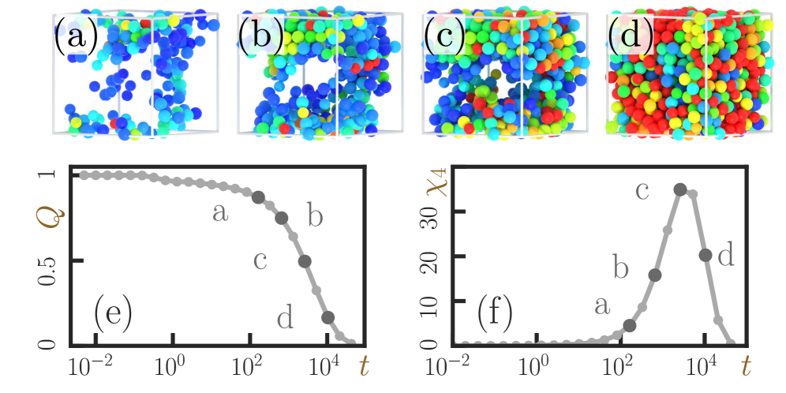
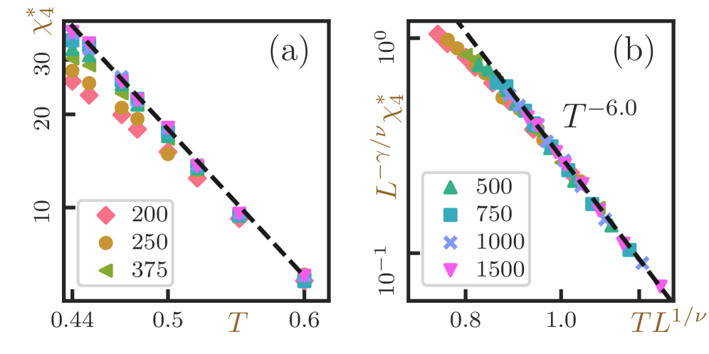
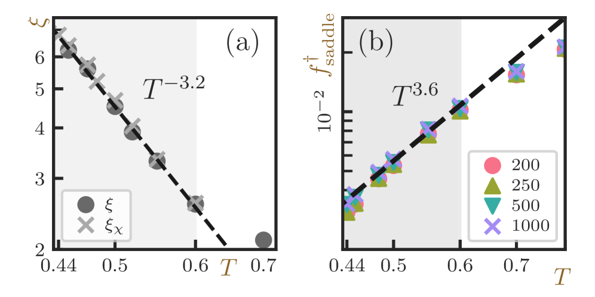
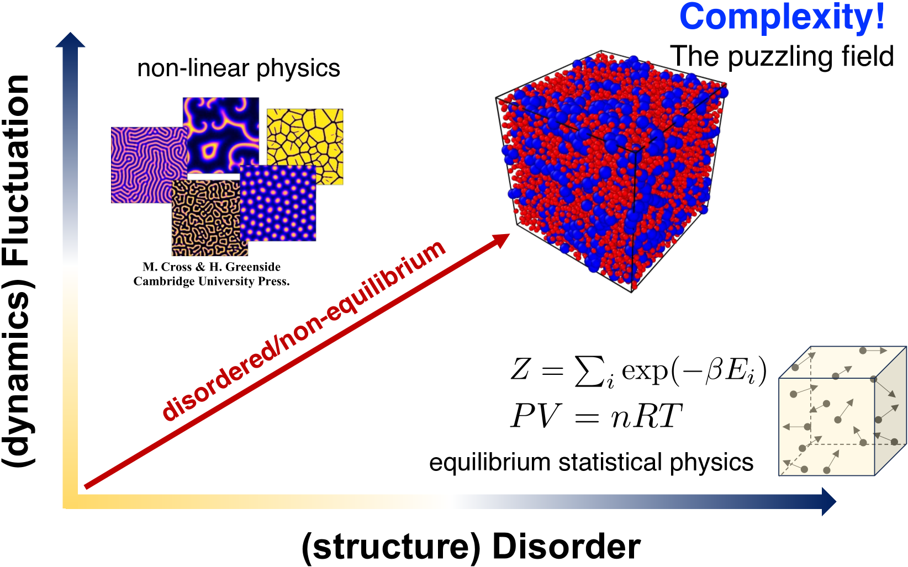
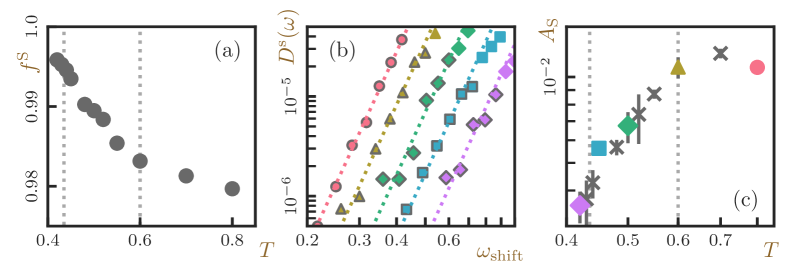
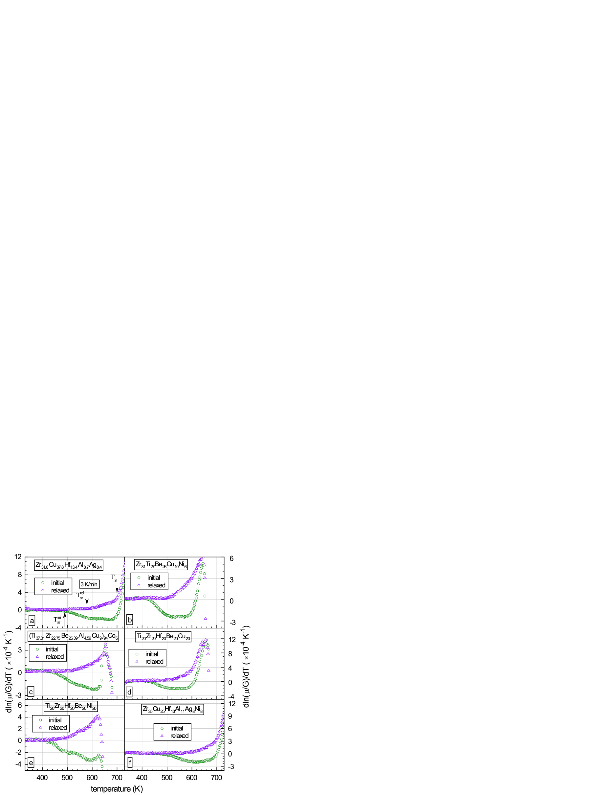
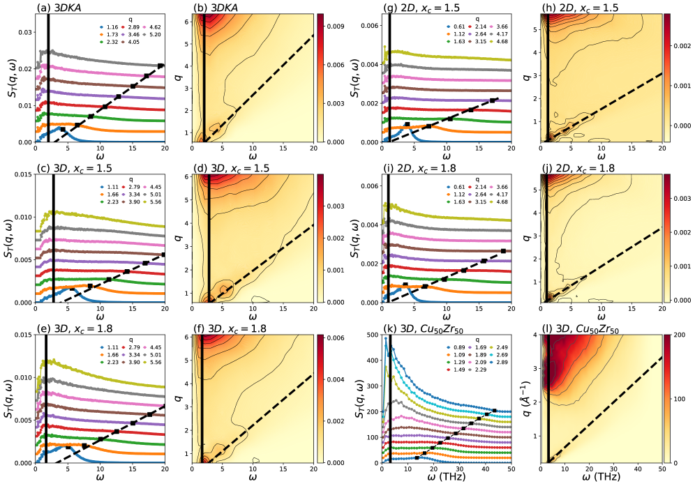

# 金属ガラス形成液体の動的不均一性はアバランシェ臨界から生まれる：過冷却金属合金の遅い動力学を解き明かす新視点

- **執筆日**: 2026-04-08
- **トピック**: 過冷却金属ガラス形成液体における動的不均一性とゼロ温度アバランシェ臨界
- **タグ**: Nonequilibrium and Dynamic Response / Phase Transitions; Nonequilibrium Phase Transitions / Molecular Dynamics
- **注目論文**: arXiv:2604.03573 — *Zero-temperature Avalanche Criticality Governing Dynamical Heterogeneity in Supercooled Liquids*, Oyama, Hara, Kawasaki & Kim (2026)
- **参照関連論文数**: 8本

---

## 1. なぜ今この話題なのか

金属ガラス（**Metallic Glass**, MG）とは、鉄・ジルコニウム・アルミニウムなどの金属合金を融点以上から急冷し、原子配列が結晶秩序をもたないまま固化させた材料である。1960 年にカリフォルニア工科大学の Duwez らが Au–Si 合金をガラス化したのが最初の報告だが、現在では Zr–Cu–Ni–Al 系や Pd–Ni–P 系など多種多様な**バルク金属ガラス（BMG）** が開発され、一辺が数センチメートル以上の大型部品として製造可能になっている。金属ガラスは結晶金属と比較して硬度・強度が非常に高く、弾性限界が大きく、腐食にも強い。精密ギア、スポーツ用品、医療機器、超精密金型など幅広い用途への応用が進んでいる。

しかし金属ガラスの実用化を阻む壁のひとつが、変形機構の脆性的な性質だ。室温では変形が**せん断帯（Shear Band）** と呼ばれる幅数十ナノメートルの薄い層に集中し、ほとんど延性を示さないまま破断してしまう。この問題は、ガラスの微視的構造と力学的応答の間にある深い謎に直結している。そして、そのさらに根底には「なぜ金属合金は液体から冷やされるとガラスになるのか」という、凝縮系物理学が半世紀以上悩み続けてきた問いがある。

液体を融点以下に冷却すると粘度が急激に上昇し、ある温度（ガラス転移温度 $T_g$）付近で固体的な性質を示す。この**ガラス転移**は熱力学的な相転移ではなく、動力学的な凍結プロセスである。注目すべきは、この急激な粘度上昇が始まる前後、液体の内部で**動的不均一性（Dynamical Heterogeneity, DH）** という不思議な現象が現れることだ。動的不均一性とは、マクロには一様に見える液体の内部に、動きやすい（モバイルな）領域と動きにくい（イモバイルな）領域が共存するメゾスコピックな空間構造のことである。温度を下げるにつれてこのドメインのサイズが成長し、最終的にガラス転移に至る。

動的不均一性の起源について、過去 30 年にわたり様々な理論が競合してきた。モード結合理論（MCT）は $T_\mathrm{MCT}$ での発散を予言するが、実験ではその発散が現れずに $T_g$ まで緩和が続く。ランダム第一次転移理論（RFOT）は熱力学的なモザイク構造を想定するが、その静的長さスケールと動的長さスケールの対応関係は依然として議論中だ。2026 年 4 月、Toyota 中央研究所の Oyama・Hara・Kim と大阪大学の Kawasaki らは、まったく新たな視点——**ゼロ温度アバランシェ臨界（Zero-temperature Avalanche Criticality）**——から動的不均一性を統一的に説明できることを分子シミュレーションで示した（arXiv:2604.03573）。この知見は、金属ガラスの塑性変形を記述する**せん断変換帯（STZ）** 理論とガラス形成液体の緩和動力学を、同一の臨界現象として理解する可能性を拓く。

---

## 2. この分野で何が未解決なのか

動的不均一性は実験・シミュレーションの両面でよく確認された現象だが、その物理的起源には少なくとも以下の問いが積み残されている。

**問い①：動的不均一性のドメインが成長する物理的機構は何か？** 過冷却液体を冷やすと、移動度の高い（速い）領域と低い（遅い）領域の空間的クラスターサイズが増大する。その特性長さ $\xi$ は $T_g$ に近づくにつれてべき乗則で発散するように見えるが、その指数が何によって決まるのか、またその臨界点が有限温度に存在するのかゼロ温度に存在するのかすら定まっていない。

**問い②：動的感受率 $\chi_4$ は MCT 転移点付近でなぜ飽和するのか？** 4 点相関関数のピーク高さ $\chi_4^*$ は低温になるにつれて増大するが、理論的に発散が期待される MCT 転移温度 $T_\mathrm{MCT}$ のすぐ上で飽和し、その後むしろ低下に転じることが知られている。これは MCT の素朴な予言と矛盾しており、長年「飽和の謎」として残ってきた。

**問い③：固体（ガラス）の塑性変形とガラス形成液体の熱的緩和は同じ物理で記述できるか？** せん断変換帯モデルや弾塑性モデルでは、少数の原子が協同的に再配列する「STZ イベント」がアバランシェ（雪崩）状に伝播することで塑性流動が生じると説明する。一方、ガラス形成液体でも $\alpha$ 緩和は同様に協同的な原子運動を伴うように見える。両者が本質的に同じ臨界現象の異なる側面である可能性はあるのか？

**問い④：金属ガラスの組成と構造はその動力学をどう決定するか？** 高エントロピー金属ガラス（HEMG）など多成分系では、局所構造の多様性が緩和時間分布に影響を与える。構造的特徴量（例えば二十面体秩序の多様性）と動力学の相関をどこまで普遍的な原理で記述できるのか？

これらの問いはどれも、金属ガラスの設計・制御という工学的課題にも直結している。過冷却液体の動的不均一性を制御することは、ガラス形成能の向上や延性金属ガラスの開発に通じるからだ。

---

## 3. 注目論文の核心：何が前進し、何がまだ仮説か

Oyama らの論文（arXiv:2604.03573）が主張する核心は「過冷却液体の動的不均一性は、ゼロ温度アバランシェ臨界によって支配される」というものだ。以下では、この主張の内容と根拠を丁寧にほぐす。

### 研究対象：Kob-Andersen モデルと金属ガラスとのつながり

シミュレーションに用いられたのは **Kob-Andersen モデル（KAM）**——80% の A 原子と 20% の B 原子からなる二元 Lennard-Jones 液体で、非加算的な相互作用パラメータが結晶化を抑制する設計になっている。このモデルはもともと金属ガラス **Ni₈₀P₂₀** を念頭に構築されたモデルであり、ガラス物理学の「標準モデル」として半世紀近く広く使われてきた。したがって KAM での知見は金属ガラス形成液体の本質的な物理を反映していると考えられる。系サイズは $N = 200 \sim 1500$ 粒子、温度範囲は $T = 0.44 \sim 1.0$（モード結合温度 $T_\mathrm{MCT} \approx 0.435$ より上）。

*図1：過冷却液体の動的スナップショット（arXiv:2604.03573, CC BY 4.0）。温度を下げると動きやすい粒子（明るい領域）と動きにくい粒子（暗い領域）のドメインサイズが大きくなることが視覚的に確認できる。*

### アバランシェ臨界とは何か

「ゼロ温度アバランシェ臨界」とは、臨界点が絶対零度（$T=0$）に存在する臨界現象のことである。従来の臨界現象（例えば強磁性体の Curie 点）では有限温度に臨界点があるが、せん断を受けるアモルファス固体（弾塑性モデル）では $T=0$ で降伏転移があり、臨界指数で特徴づけられる多様なスケーリングが成立することが知られている。この「ゼロ温度アバランシェ臨界」の支配域が、有限温度・十分に過冷却された液体にまで及んでいるというのが Oyama らの主張の核心だ。

具体的には、ある温度 $T_\mathrm{ava} \approx 0.6$（$T_\mathrm{MCT}$ よりもかなり高温）以下では、系の安定性が増大し、局所的な原子再配列（= STZ イベントに対応するプロセス）がアバランシェ状に連鎖する。この連鎖が動的不均一性の空間的ドメインを作り出している、というのである。

### 主要結果：べき乗則スケーリングと有限サイズスケーリング

著者たちが定量的に示したのは以下の 4 点だ。

**（1）動的感受率 $\chi_4^*$ のべき乗則スケーリング**
動的感受率のピーク値 $\chi_4^*$（移動度の空間的不均一さを定量する指標）が温度の低下とともに

$$\chi_4^* \sim T^{-\gamma}, \quad \gamma \approx 6.0$$

というべき乗則に従うことを示した。これはアバランシェ臨界から独立に予言されるスケーリングと定量的に一致する。

**（2）相関長 $\xi$ のべき乗則スケーリング**
動的不均一性のドメインサイズ（相関長）が

$$\xi \sim T^{-\nu}, \quad \nu \approx 3.2$$

に従い、さらに $\gamma = \nu d_f$（$d_f \approx 1.9$ はフラクタル次元）という関係が成立することを確認した（図3参照）。この指数の組はアバランシェ臨界の独立な予言と整合する。

**（3）有限サイズスケーリングの崩壊**
異なる系サイズ $N$ でのデータを、上記の臨界指数を用いてスケーリングすると高品質な**データ崩壊（データコラプス）** が得られた（図2参照）。この崩壊の質は、従来の RFOT 描像やその他の理論では達成されていなかったものであり、アバランシェ臨界描像の定量的な強力な根拠となっている。

*図2：動的感受率のスケーリング崩壊（arXiv:2604.03573, CC BY 4.0）。縦軸は $\chi_4^*$、横軸はスケーリング変数。各色は系サイズの違いを表す。*

**（4）安定性の温度依存性：振動密度状態（vDOS）の変化**
$T_\mathrm{ava} \approx 0.6$ 以下では、鞍点配置（エネルギーランドスケープ上の不安定方向）における非安定モード（固有値が負の振動モード）の割合 $f^\dagger_\mathrm{saddle}$ が

$$f^\dagger_\mathrm{saddle} \sim T^{3.6}$$

という温度依存性を示すことが確認された。これは「温度が下がるほど系が安定化し、アバランシェ的な挙動が支配的になる」ことを意味し、$T_\mathrm{ava}$ がアバランシェ臨界域の上限温度であることを支持している（図3参照）。

*図3：相関長 $\xi$ および非安定モード割合 $f^\dagger_\mathrm{saddle}$ の温度依存性（arXiv:2604.03573, CC BY 4.0）。*

### まだ仮説段階のこと

現時点では、アバランシェ臨界描像はモデル系（KAM）での分子動力学シミュレーションで示されたものであり、実際の金属ガラス形成系（例えば Zr–Cu–Al 系）での直接的な実験的検証はまだ行われていない。また $T < T_\mathrm{MCT}$ の深過冷却域（ガラス転移のすぐ上）での挙動については、シミュレーションの時間スケール制限から十分なデータが得られていない。さらに、アバランシェ臨界からガラス転移温度 $T_g$ に至るまでの動力学の変化を完全に説明する理論的枠組みはまだ構築中だ。

---

## 4. 背景と研究史：この論文はどこに位置づくか

### 金属ガラスと過冷却液体の研究史

金属ガラスの研究は 1960 年代に始まったが、「なぜ液体が結晶化せずにガラスになるのか」という問いは古くから物理化学者を魅了してきた。1970〜80 年代に**モード結合理論（Mode-Coupling Theory, MCT）** が確立され、過冷却液体の粘度上昇を $\alpha$ 緩和時間のべき乗則発散として定量的に記述する枠組みが得られた。MCT は $T_\mathrm{MCT}$ でガラス転移を予言するが、実際のガラス転移温度 $T_g$ は $T_\mathrm{MCT}$ より数十 K 低い。この「MCT 転移の実験的回避」は、熱活性化過程（活性化障壁を乗り越える確率的プロセス）が $T < T_\mathrm{MCT}$ でも緩和を継続させるためと解釈されてきた。

1990 年代から 2000 年代にかけて、動的不均一性という概念が実験・シミュレーション・理論のすべてから支持を得るようになった。**4 点相関関数** $G_4(r,t)$ とその積分量である**動的感受率** $\chi_4(t)$ が動的不均一性の定量指標として確立され、 $\chi_4^*$（ピーク値）の温度依存性が過冷却の程度を反映することが広く認識された。

**ランダム第一次転移理論（RFOT）** は、熱力学的コンフィギュレーション・エントロピーが $T_K$（Kauzmann 温度）でゼロになることと動的不均一性を関連づける理論であり、モザイク状のコオペラティブ再配列領域（CRR）の成長がガラス転移をもたらすと主張する。RFOT は多くの現象を説明できるが、動的長さスケールの指数が実験・シミュレーションと一致しないケースもあり、論争が続いてきた。

### エラストプラスティックモデルとアバランシェ

2000 年代以降、別のアプローチとして**エラストプラスティックモデル（EPM）** が発展した。これは弾性場に埋め込まれた「流れブロック」（STZ に対応）の確率的遷移をシミュレートするメゾスケールモデルであり、アモルファス固体の降伏・流動・せん断帯形成を記述する。EPM の分析から、降伏転移はゼロ温度の臨界現象として理解でき、応力アバランシェ（局所的な塑性イベントが弾性場を介して周囲の STZ を誘発する連鎖）がべき乗則分布に従うことが示された（Tahaei ら 2023; Martens ら）。

Oyama らの研究の位置づけは、この EPM・アバランシェ描像を「熱的に駆動される過冷却液体」に拡張した点にある。つまり、「アモルファス固体の塑性変形 ↔ 過冷却液体の熱的緩和」という二者を統一する枠組みを提示したのである。これは 2024 年に発表された Oyama・Kawasaki らによる先行研究（arXiv:2409.15775: *Avalanche criticality emerges by thermal fluctuation in a quiescent glass*）を発展させたものでもある。先行研究では急冷後のガラス（$T < T_g$）における熱的アバランシェを示したが、今回の論文（2604.03573）ではガラス転移より上の過冷却液体域でも同じ臨界現象が支配することを示した。

### 並行する研究：拡散、構造、機械特性

この主流の動力学研究と並行して、金属ガラスの拡散・構造・機械特性についても重要な知見が蓄積されている。

Annamareddy ら（arXiv:2603.18317）はガラス中の原子拡散の活性化エネルギーが**エネルギーランドスケープの非対称性**によって支配されることを示した。局所的な前進・後退バリアの非対称性が「行きつ戻りつ」の相関運動を生み出し、その相関が巨視的拡散を抑制することを金属ガラス（および SiO₂・LJ ガラス）のシミュレーションで定量化した。この知見は、アバランシェ臨界描像における「相関した原子運動」の微視的起源を、ランドスケープの非対称性という視点から補完している。

Oyama ら（arXiv:2503.09278）は同じグループによる別の研究で、CuZr 金属ガラス形成液体において粒子の緩和挙動が**ネットワーク位相幾何**（transient network の局所接続性）と統計的に対応することを示した。高接続性を持つ粒子（二十面体秩序に近い配置にある粒子）は遅い緩和を示し、その緩和時間と接続性の関係が指数関数的に成立する。これは「動的不均一性の構造的起源の一端」を示しており、アバランシェ臨界描像と補完的な知見だ。

*図1（2503.09278, CC BY 4.0）：CuZr 液体における transient network 構造の可視化。局所接続性が高いほど粒子の緩和が遅いことが示されている。*

Makarov ら（arXiv:2503.04443）はジルコニウム系 BMG（Vit106）とその高エントロピー系において、**深い緩和（Deep Relaxation）** 後のガラス転移近傍の比熱ピークが一次転移的に鋭くなることを実験と理論の両面から示した。その理論では高周波せん断弾性率が制御パラメータになっており、ガラスの「欠陥濃度」と弾性率変化の関係が定式化されている。これは 2604.03573 のアバランシェ描像が力学的・熱力学的観測量に対して持つ示唆と密接につながる。

---

## 5. どの解釈が最も妥当か：証拠・比較・限界

### アバランシェ臨界描像を支持する根拠

Oyama ら（2604.03573）が提示した証拠は多面的で、いずれも定量的な一致を示している。

第一に、**独立に決定した臨界指数による有限サイズスケーリング崩壊**の成功が最も重要な根拠だ。$\nu \approx 3.2$ と $\gamma \approx 6.0$ の二つの指数はアバランシェ臨界から理論的に独立に計算・推定でき、これらを用いて異なる系サイズのデータを重ね合わせると高品質の崩壊が得られた。これはチューニングパラメータなしの定量的検証であり、偶然の一致とは考えにくい。

第二に、**Stokes-Einstein 関係のずれ**の定量的説明だ。過冷却液体では、拡散係数 $D$ と緩和時間 $\tau$ の積 $D \cdot \tau$ が通常液体では一定になるが、過冷却時に増大するという「Stokes-Einstein 違反」が知られている。アバランシェ臨界描像では $D \cdot \tau_4 \sim T^{\nu(d_f-d)}$（$d$ は空間次元）というスケーリングが予言でき、シミュレーションデータとの一致が確認された（図5参照）。

第三に、**MCT 転移点付近での $\chi_4^*$ 飽和の自然な説明**。MCT では $T \to T_\mathrm{MCT}$ で $\chi_4^*$ が発散すべきだが、実際には飽和する。アバランシェ臨界描像では、$T_\mathrm{MCT}$ は特別な臨界点ではなく単なるクロスオーバー温度であり、$\chi_4^*$ が飽和するのは有限サイズ効果（系サイズによって $\xi$ の成長が打ち切られる）の自然な帰結として説明できる。

*図5（arXiv:2604.03580, CC BY 4.0）：ポテンシャルエネルギーランドスケープ上の安定性指標 $A_s$ の温度依存性。$T_\mathrm{ava} \approx 0.6$ 以下で安定性の増大が起きる。*

同グループによる companion paper（arXiv:2604.03580）では、ポテンシャルエネルギーランドスケープ（PEL）の観点からさらに包括的な証拠が提示されている。鞍点配置における KWW ストレッチ指数 $\beta_{KWW}$ の温度依存性（アバランシェ臨界域で一定になる）と、不安定モードの局在化転移（$T_\mathrm{MCT}$ 近傍で不安定モードが局在から非局在に切り替わる）が、アバランシェ臨界描像と整合することを示している。

### 他の理論との比較

RFOT 理論の予言する動的長さスケールの指数は $\nu \approx 2/3$（$d = 3$ 次元での Kirkpatrick-Thirumalai-Wolynes 予言）に対し、Oyama らの観測は $\nu \approx 3.2$ とはるかに大きい。もっとも RFOT 理論では動的長さと静的長さが別物であり、単純な比較はできない。MCT 自体は有限温度での発散を予言するため、そもそもアバランシェ描像とは異なる数学的構造をもつ。

**拡散の非対称エネルギーバリア**との関係（Annamareddy ら 2603.18317）は特に興味深い。アバランシェ臨界描像では「相関した原子運動が動的不均一性を作る」ことが主張されるが、なぜ相関が生じるかの微視的理由として「前進・後退バリアの非対称性が行きつ戻りつ運動を生む」という説明が与えられている。この二つの描像は矛盾しておらず、ランドスケープのトポグラフィーから動力学スケーリングへという因果連鎖が合理的に成立している。

### 現時点での限界

最大の未解決点は**実験的検証**だ。4 点相関関数 $\chi_4(t)$ を直接測定することは困難であり、中性子散乱や X 線光子相関分光（XPCS）による間接的な測定が行われているが、アバランシェ臨界の臨界指数を精密に決定するには十分ではない。また KAM 以外のモデル系（例えば三元・四元の金属合金系）での検証や、$T < T_\mathrm{MCT}$ の深過冷却域での挙動確認が今後の課題として残っている。さらに、BMG の機械特性（せん断帯形成）とこの臨界現象を定量的につなぐ理論的架け橋も未完成だ。

Akimoto ら（arXiv:2504.01229）は、密度揺らぎが BMG のせん断帯形成を促進することを Zr₅₀Cu₅₀ の計算で示しており、「密度の不均一性 ↔ 塑性の局所化」という接続を明示しているが、これを動的不均一性・アバランシェ臨界描像の文脈でどう解釈するかは今後の研究に委ねられている。

---

## 6. 何が一般化できるのか：材料・手法・応用への広がり

### ガラス形成能とアバランシェ臨界

アバランシェ臨界描像が正しければ、温度 $T_\mathrm{ava}$ は金属ガラス形成液体の動力学的性質を特徴づける重要な温度スケールになり得る。過冷却耐性（結晶化に対する抵抗力）が高い合金系では $T_\mathrm{ava}$ が低い（アバランシェ臨界域が広い）可能性があり、これは逆数的に「アバランシェ的な原子再配列を起こしにくい構造を持つ合金がガラスになりやすい」という直感と一致するかもしれない。ただしこの方向の議論はまだ推測の域を出ない。

### 高エントロピー金属ガラスへの示唆

Makarov ら（arXiv:2503.04436）は高エントロピー金属ガラス（HEMG）における**せん断弾性率 $G$ と欠陥濃度の関係**を実験的に明確にし、構造緩和が起こっていない状態ではガラスの $G$ の温度依存性が母相結晶の $G$ の温度依存性と一致することを示した。これは「ガラス中の欠陥」という概念が定量的に定義できることを意味する。

*図1（arXiv:2503.04436, CC BY 4.0）：HEMG における $G$ の温度依存性。初期状態・緩和状態・結晶の比較から欠陥濃度が定量化される。*

アバランシェ臨界描像では欠陥（STZ サイト）の濃度が臨界性に影響すると考えられる。高エントロピー系では混合エントロピーが大きく局所構造の多様性が増すため、欠陥の分布やアバランシェ連鎖のダイナミクスが従来の二元系とは異なる可能性がある。このあたりは HEMG 研究（2503.04436, 2503.04443）とアバランシェ描像（2604.03573）の接続が特に期待されるフロンティアだ。

### ボゾンピークと軟モードの接続

過冷却液体やガラスには**ボゾンピーク（Boson Peak）** と呼ばれる低エネルギー振動の超過が存在し、その起源もまた長年の謎とされてきた。Baggioli ら（arXiv:2509.06340）は、ボゾンピークが実は動力学的構造因子 $S(q,\omega)$ における**フラットバンド**として現れる現象であることを金属ガラス（Cu₅₀Zr₅₀, ZrAlNiCu）を含む多様なアモルファス系で示した。フラットバンドの出現は局所振動（ソフトモード）が運動量依存性を持たないことを意味し、アバランシェ臨界で議論される「不安定モードの局在」と通底する物理を含む可能性がある。

*図1（arXiv:2509.06340, CC BY 4.0）：ボゾンピーク周波数での $S(q,\omega)$ フラットバンド。多様なアモルファス固体で普遍的に見られる。*

### ガラス中拡散の設計への含意

Annamareddy ら（2603.18317）の知見——「ガラス中の拡散は局所バリアではなく相関運動で決まる」——は材料設計上の重要な示唆を持つ。界面拡散を促進したい場合（例えば固体電解質や拡散結合）には表面での相関を崩すような局所化学修飾が有効かもしれず、逆にバルク拡散を抑制したい場合（耐腐食性向上）にはアモルファス構造の均一化が鍵になる可能性がある。

---

## 7. 基礎から理解する

### ポテンシャルエネルギーランドスケープ（PEL）

$N$ 個の原子からなる系の全ポテンシャルエネルギーは $3N$ 次元の高次元空間における「ランドスケープ」を形成する。液体は高温では多数の**局所エネルギー極小**（inherent structure）間を自由に遷移し、温度を下げると特定の谷に閉じ込められる。ガラス転移はこの「系がランドスケープのある谷に捕捉される」過程として直感的に理解できる。

ランドスケープ上の**鞍点**は、二つの極小を隔てる山の頂を意味し、原子再配列（STZ イベント）の遷移状態に対応する。鞍点における Hessian 行列（エネルギーの二階微分）の負固有値モードが「不安定モード」（saddle mode）であり、その割合 $f^\dagger_\mathrm{saddle}$ が系の不安定さの指標になる。Oyama らが示したように、この指標の温度依存性がアバランシェ臨界域の境界 $T_\mathrm{ava}$ を特定するために使われた。

### モード結合理論（MCT）

MCT は密度変動の「自己整合方程式」として定式化される。構造因子 $S(q)$ を入力に、$\alpha$ 緩和時間 $\tau_\alpha$ が発散する臨界温度 $T_\mathrm{MCT}$ が決まる。発散の形は

$$\tau_\alpha \sim (T - T_\mathrm{MCT})^{-\gamma_\mathrm{MCT}}$$

であり、$T_\mathrm{MCT}$ ではガラス転移が起きる予言になる。しかし実際には $T_\mathrm{MCT}$ より低温でも熱活性化によって緩和が続くため、MCT は「過冷却液体の高温側での応答」を記述するが、深過冷却域には不完全だ。アバランシェ臨界描像では、$T_\mathrm{MCT}$ はアバランシェ臨界の支配域内の一つのクロスオーバー温度として再解釈される。

### 4 点相関関数と動的感受率

液体の「動きやすさ」を空間的に定量するために**4 点相関関数** $G_4(\mathbf{r}, t)$ が使われる。これは時刻 $t$ に距離 $r$ 離れた二点での「移動度の相関」を測る。

$$G_4(\mathbf{r}, t) = \langle \delta C(\mathbf{0}, t) \, \delta C(\mathbf{r}, t) \rangle$$

ここで $C(\mathbf{r}, t)$ は位置 $\mathbf{r}$ の粒子の「時刻 $t$ での可動性」を表す指標（例えばオーバーラップ関数）だ。この関数を $q$ 積分した量が動的感受率

$$\chi_4(t) = N \, \mathrm{Var}[C(t)]$$

であり、そのピーク値 $\chi_4^*$ が動的不均一性の「強さ」を定量する。Oyama らはこの $\chi_4^*$ が $T_\mathrm{ava}$ 以下でアバランシェ臨界の予言通りのべき乗則に従うことを示した。

### アバランシェ統計と臨界指数

ゼロ温度のアバランシェ臨界では、降伏応力以下でせん断を増やすと STZ イベントがアバランシェ状に発生する。アバランシェサイズ $S$ の分布が

$$P(S) \sim S^{-\tau_\mathrm{av}}$$

というべき乗則（冪分布）に従い、特徴的なサイズスケールが存在しない。相関長は $\xi \sim |\delta \sigma|^{-\nu}$ で発散する。Oyama らはこの同じ数学的構造が、熱的な過冷却液体にも現れることを示した——つまり「熱的 STZ イベントのアバランシェ」が動的不均一性を生成している。

### ボゾンピークとソフトモード

ガラスの振動密度状態（vDOS）の低エネルギー側にはデバイ理論の予言を超えた**超過モード**——ボゾンピーク——が存在する（周波数 $\omega_\mathrm{BP}$）。このピークはアモルファス固体に普遍的に現れる。Baggioli ら（2509.06340）はこのボゾンピークが $S(q,\omega)$ のフラットバンドとして理解できることを示した。フラットバンドの起源は「局所振動が協同的な波として伝播せず、ほぼ局在した状態で留まる」ことにあり、これはアバランシェ臨界描像における STZ の「空間的局在性 ↔ 相関的連鎖」という二重性と深くつながっている可能性がある。

ガラスの機械的特性（せん断弾性率 $G$）は、ボゾンピーク周波数 $\omega_\mathrm{BP}$ と密接に関連する。Makarov ら（2503.04443, 2503.04436）が示したように、BMG の $G$ の温度依存性は「欠陥濃度」というパラメータ一つで制御でき、その欠陥は STZ サイトと対応する可能性が高い。この欠陥-弾性率の関係式は

$$G(T) = G_\mathrm{cryst}(T) \left[1 - \frac{c(T) \cdot \Omega_\mathrm{defect}}{\Omega_0}\right]$$

というような形で記述でき（$c(T)$：欠陥濃度、$\Omega_\mathrm{defect}$：欠陥の緩和強さ）、この欠陥の温度依存性がガラス転移前後の比熱ピークを決める。アバランシェ臨界描像でこのような「欠陥」の動力学を統一的に記述できるかが今後の重要課題だ。

---

## 8. 専門用語の解説

**動的不均一性（Dynamical Heterogeneity, DH）**
過冷却液体において、原子・分子の移動速度が空間的に不均一に分布する現象。速い（モバイルな）領域と遅い（イモバイルな）領域のクラスターが共存し、そのサイズ（相関長 $\xi$）がガラス転移に近づくにつれて成長する。ガラス転移の本質的特徴の一つで、粘度急増の微視的起源でもある。

**アバランシェ臨界（Avalanche Criticality）**
系の臨界点（しばしばゼロ温度に存在）付近でイベントがべき乗則サイズ分布（$P(S) \sim S^{-\tau}$）に従って連鎖的に発生する臨界現象。地震の Gutenberg-Richter 則や砂山崩れなどに類似した「自己組織化臨界」の一形態。金属ガラスでは STZ イベントが弾性場を介して連鎖するアバランシェとして現れる。

**ゼロ温度臨界点（Zero-temperature Critical Point）**
臨界点が絶対零度 $T = 0$ に存在する場合の臨界現象。有限温度では $T = 0$ の臨界点から「離れた」クロスオーバー的挙動が見えるが、十分に低温（Oyama らの場合 $T < T_\mathrm{ava}$）ではその臨界点の影響が及ぶ。

**モード結合理論（Mode-Coupling Theory, MCT）**
過冷却液体の密度揺らぎが自己整合的にフィードバックすることで動的緩和が急激に遅くなる機構を記述する理論。臨界温度 $T_\mathrm{MCT}$ でガラス転移を予言するが、実際には $T < T_\mathrm{MCT}$ でも熱活性化緩和が続くため、MCT は高温側の近似理論として位置づけられる。

**動的感受率 $\chi_4(t)$（Four-point Dynamic Susceptibility）**
動的不均一性の大きさを定量する指標。オーバーラップ関数の分散として定義され、そのピーク値 $\chi_4^*$ は動的相関体積（協同的に動く粒子の数）に比例する。温度を下げるにつれて増大するが、MCT 転移点付近で飽和することが知られている。

**せん断変換帯（Shear Transformation Zone, STZ）**
金属ガラスの塑性変形の素過程。約 100 原子程度が協同的に再配列し、局所的なせん断ひずみを生み出す領域。STZ の空間的連鎖がマクロなせん断帯形成につながる。アバランシェ臨界描像では、過冷却液体における局所的原子再配列（$\alpha$ 緩和の素過程）も STZ と本質的に同じプロセスと見なされる。

**ポテンシャルエネルギーランドスケープ（Potential Energy Landscape, PEL）**
$N$ 個の原子の配置空間 $(3N$ 次元）におけるポテンシャルエネルギー関数の全体像。極小（inherent structure）、鞍点、障壁の空間的分布がガラスの動力学・緩和・ガラス転移を決める。高温では系が多くの極小間を遍歴し、低温では少数の深い谷に閉じ込められる。

**ボゾンピーク（Boson Peak）**
アモルファス固体の振動密度状態（vDOS）における低エネルギー超過ピーク（周波数 $\omega_\mathrm{BP}$）。デバイモデルの $\omega^2$ 依存性を超える過剰な低エネルギーモードが存在する。その起源は長年議論されており、最近の研究（2509.06340）では動力学的構造因子における「フラットバンド」として再解釈されている。

**Kob-Andersen モデル（KAM）**
ガラス物理学の標準的シミュレーションモデル。80% の A 原子（大粒子）と 20% の B 原子（小粒子）の Lennard-Jones 混合液体で、非加算的相互作用が結晶化を抑制する。金属ガラス Ni₈₀P₂₀ を念頭に構築されており、ガラス形成液体の動力学研究のベンチマーク系として広く使われる。

**高エントロピー金属ガラス（High-Entropy Metallic Glass, HEMG）**
5 種類以上の金属元素を等比率程度に混合した金属ガラス。高い配置エントロピーによる混合効果が結晶化を抑制し、広い組成範囲でガラス形成能が発現する。従来の二元・三元系と比較して局所構造の多様性が高く、せん断弾性率や緩和挙動に独特の特徴を示す。

---

## 9. おわりに：何が分かり、何がまだ残っているのか

2026 年 4 月の Oyama・Hara・Kawasaki・Kim による論文（arXiv:2604.03573）は、過冷却液体の動的不均一性という半世紀来の謎に対して「ゼロ温度アバランシェ臨界」という統一的な回答を提示した。この描像では、アモルファス固体の塑性変形（STZ・アバランシェ）を支配する同じ物理が、過冷却液体の熱的緩和・動的不均一性にも及んでいることになる。独立に決定した臨界指数による有限サイズスケーリング崩壊、$\chi_4^*$ の飽和の定量的説明、Stokes-Einstein 違反の定量的予言、そしてポテンシャルエネルギーランドスケープの解析——これらの多面的証拠が揃ったことで、少なくとも Kob-Andersen モデル系においては、この描像はかなり確からしくなったと言えるだろう。

しかし実際の金属ガラス形成系への展開には、まだ多くの検証が残されている。4 点相関関数の実験的精密測定（XPCS や中性子スピンエコー法）、深過冷却域（$T < T_\mathrm{MCT}$）での挙動確認、高エントロピー金属ガラスや多成分系での普遍性検証、そして機械的変形（せん断帯形成、脆性-延性転移）とのアバランシェ臨界描像を通じた定量的な接続——これらが今後 1〜3 年で特に注目すべき論点だ。また、アバランシェ臨界からガラス形成能（どの組成が、どの冷却速度でガラスになるか）を予測する理論的枠組みが確立できれば、機械学習支援の材料設計と組み合わせて、新しい高性能 BMG の合理的設計が見えてくるかもしれない。Makarov ら（2503.04443, 2503.04436）のせん断弾性率・欠陥濃度研究や、Oyama ら（2503.09278）のネットワーク動力学研究、Baggioli ら（2509.06340）のボゾンピーク研究が次第に一枚の絵に収束しつつある今、金属ガラス物理は新たな総合化の段階に向かいつつある。

---

## 参考論文一覧

1. **arXiv:2604.03573** — Oyama, Hara, Kawasaki, Kim, *"Zero-temperature Avalanche Criticality Governing Dynamical Heterogeneity in Supercooled Liquids"* (2026). [https://arxiv.org/abs/2604.03573](https://arxiv.org/abs/2604.03573)
   分子動力学シミュレーションにより、過冷却液体の動的不均一性がゼロ温度アバランシェ臨界によって支配されることを示した注目論文（本記事の主軸）。

2. **arXiv:2604.03580** — Oyama, Hara, Kawasaki, Kim, *"Potential energy landscape picture of zero-temperature avalanche criticality governing dynamics in supercooled liquids"* (2026). [https://arxiv.org/abs/2604.03580](https://arxiv.org/abs/2604.03580)
   上記の companion paper。ポテンシャルエネルギーランドスケープの視点から、アバランシェ臨界がガラス動力学を決める機構をより包括的に解析した論文。

3. **arXiv:2603.18317** — Annamareddy, Wang, Voyles, Szlufarska, Morgan, *"Asymmetric Energy Landscapes Control Diffusion in Glasses"* (2026). [https://arxiv.org/abs/2603.18317](https://arxiv.org/abs/2603.18317)
   ガラス中の原子拡散が局所バリアではなく前進・後退バリアの非対称性による相関運動で決まることを金属ガラスで明示した論文。

4. **arXiv:2503.04443** — Makarov, Afonin, Mitrofanov, Kobelev, *"On the nature of the glass transition in metallic glasses after deep relaxation"* (2025). [https://arxiv.org/abs/2503.04443](https://arxiv.org/abs/2503.04443)
   Zr 系 BMG において深い緩和後のガラス転移近傍比熱ピークが鋭くなる理由を、高周波せん断弾性率と欠陥濃度の関係から説明した実験・理論論文。

5. **arXiv:2503.04436** — Makarov, Afonin, *"Relationship between the shear moduli and defect-induced structural relaxation of high-entropy metallic glasses"* (2025). [https://arxiv.org/abs/2503.04436](https://arxiv.org/abs/2503.04436)
   7 種類の高エントロピー金属ガラスの弾性率測定を通じて、構造緩和と欠陥濃度の普遍的関係を一つの式で記述した論文。

6. **arXiv:2503.09278** — Oyama, Kim, *"Graph-Dynamics correspondence in metallic glass-forming liquids"* (2025). [https://arxiv.org/abs/2503.09278](https://arxiv.org/abs/2503.09278)
   CuZr 金属ガラス形成液体において粒子の緩和時間と transient network のトポロジー的特徴量（接続性）が指数関数的に対応することを示した論文。

7. **arXiv:2509.06340** — Baggioli, Zaccone, et al., *"A flat-band perspective on the boson peak in amorphous solids"* (2025). [https://arxiv.org/abs/2509.06340](https://arxiv.org/abs/2509.06340)
   金属ガラスを含む多様なアモルファス固体でボゾンピークが動力学的構造因子のフラットバンドとして現れることを示し、理論描像を制約する証拠を提示した論文。

8. **arXiv:2504.01229** — Akimoto, et al., *"Computational Study of Density Fluctuation-Induced Shear Bands Formation in Bulk Metallic Glasses"* (2025). [https://arxiv.org/abs/2504.01229](https://arxiv.org/abs/2504.01229)
   Zr₅₀Cu₅₀ BMG において密度揺らぎ（欠陥密度の局所的変化）がせん断帯形成臨界ひずみを大きく低下させることをシミュレーションで示した論文。
