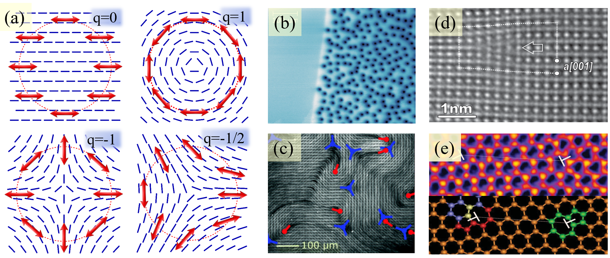
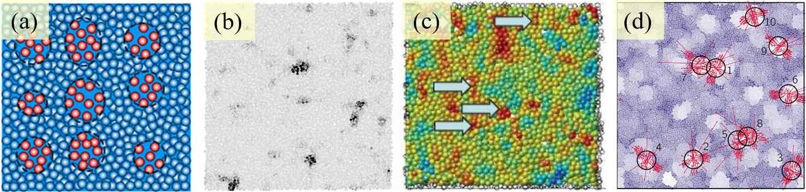
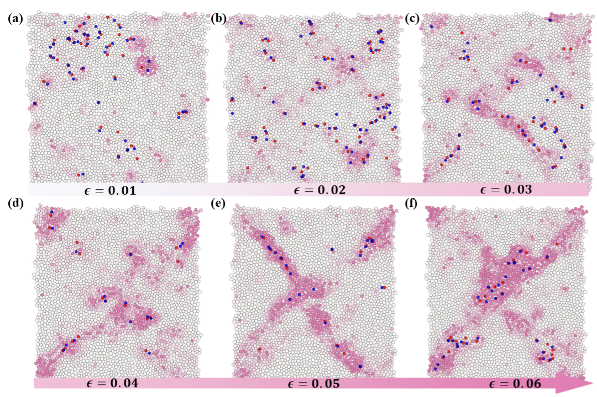
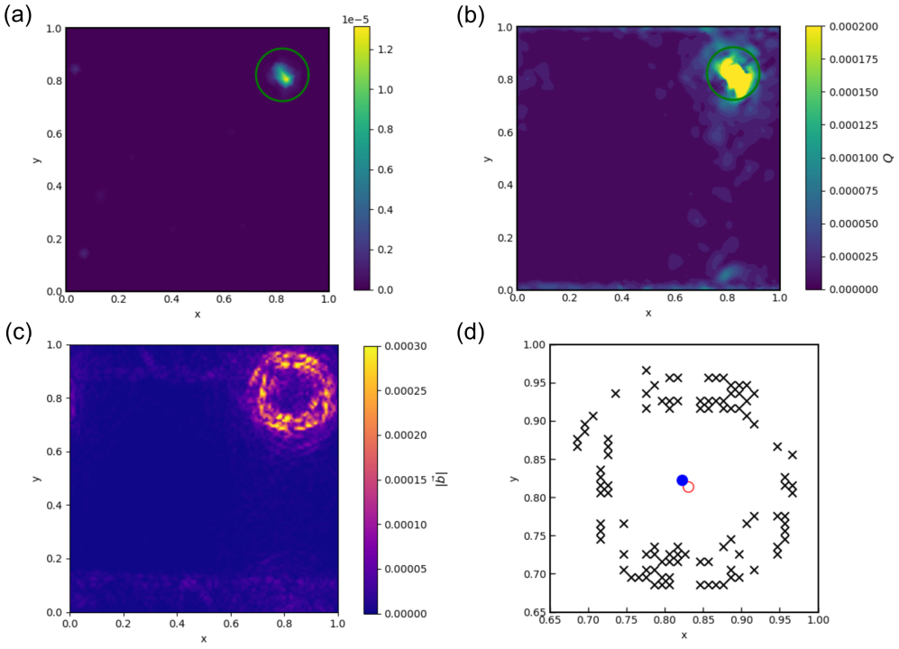

# アモルファス金属における塑性変形の位相的起源：トポロジカル欠陥理論の新展開

- 執筆日：2026-04-19
- トピック：アモルファス固体（金属ガラス）における塑性変形とトポロジカル欠陥
- タグ：Structure and Microstructure / Defects and Impurities; Bulk Alloys / Molecular Dynamics
- 注目論文：Baggioli, Falk, Kob, "Topological Defects in Amorphous Solids" (arXiv:2604.07061, 2026)
- 参照論文数：7

---

## 1. なぜ今この話題なのか

アモルファス金属（非晶質合金、あるいは金属ガラスとも呼ばれる）は、結晶構造をもたず原子配置が無秩序な合金の一種である。急速冷却や気相蒸着によって作製されるこれらの材料は、高い硬度と弾性限界、優れた耐食性、さらにはFe-Si-B系やFe-B系に代表される優れた軟磁気特性を示すことから、変圧器鉄心や磁気センサ、医療機器など多くの産業応用で重要な役割を担っている。

しかしアモルファス金属には大きな弱点がある。それは**脆性破壊**（brittle fracture）の傾向である。結晶金属であれば、原子配列の乱れである**転位**（dislocation）が移動することで応力を緩和し、材料全体が大きく塑性変形できる。ところがアモルファス金属では転位という概念そのものが成立しない。原子配置に「周期性」がなければ、「格子のずれ」である転位も存在できないからである。では、アモルファス金属はどのようにして塑性変形するのか？何が変形の担い手なのか？これこそが、アモルファス金属の材料科学における中心的未解決問題である。

1990年代末にFalkとLangerが提唱した**せん断変換ゾーン（shear transformation zone; STZ）理論**は、この問いへの最初の体系的な答えであった。STZとは、わずか数十個程度の原子が集団的に再配置する局所的な領域であり、これが塑性変形の「基本単位」と見なされる。しかしSTZ理論は現象論的な性格が強く、「どの原子群がSTZになりやすいか」という微視的な予測に難があった。構造的な「柔らかさ」と結びつけようとする試みは続いてきたが、明確な第一原理的枠組みはなかった。

一方、液晶や超流動ヘリウム、超伝導体といった秩序相の物理学では、**トポロジカル欠陥**（topological defects）という概念が長年にわたって大きな力を発揮してきた。液晶のディスクリネーション、超流動体のヴォルテックス、超伝導体のアブリコソフヴォルテックスなど、これらはいずれも位相的に保護された「欠陥」であり、物質の変形・流動・相転移と深く関係している。

では、「秩序のない」アモルファス固体にも、トポロジカル欠陥に相当するものが存在するのだろうか？近年、この問いに積極的に取り組む研究グループが現れ、アモルファス固体の変形時に生じる**非アフィン変位場**（non-affine displacement field）の中に、ワインディング数で特徴づけられる位相的な構造を同定できることが示されてきた。そして2026年4月、Baggioli・Falk・Kobの3名が、この新興分野を体系的に整理したパースペクティブ論文「Topological Defects in Amorphous Solids」（arXiv:2604.07061）を発表した。

この論文の登場は、アモルファス固体の変形物理学に新たな枠組みをもたらす可能性を秘めている。結晶体における転位理論の成功を、無秩序固体にも展開できるかもしれない。その射程と限界を、関連研究とともに深く掘り下げていこう。

---

## 2. 未解決問題は何か

アモルファス固体の塑性変形を位相的に理解しようとする試みには、本質的に困難な問いが三つある。

**第一の問い：アモルファス固体における「欠陥」の定義**。結晶体では、欠陥は格子周期性からの逸脱として明確に定義できる。バーガースベクトルは格子ベクトルの積分として計算でき、トポロジカルチャージは量子化された整数をとる。しかしアモルファス固体には格子周期性がそもそも存在しない。非アフィン変位場にワインディング数を定義することはできるが、それが「真に位相的な量であるか」、それとも「変位場の幾何学的特徴を表す便宜的な量であるか」は議論の余地がある。「欠陥」が何かを定義するためには、その系の秩序パラメータと対応するホモトピー群を特定する必要があるが、アモルファス固体でこれが何に相当するかは不明である。

**第二の問い：トポロジカル欠陥と塑性の因果関係**。実験・シミュレーションの結果は、トポロジカル欠陥の密度や配置が塑性変形と高い相関を示すことを明らかにしている。しかしこれは、欠陥が塑性を**駆動する**（原因）のか、あるいは塑性が欠陥を**生成する**（結果）のか、あるいは両者が互いを促進する**フィードバック機構**が働いているのかを明確に区別していない。特に、変形前の弾性状態における固有ベクトル場のトポロジカル欠陥が変形後の塑性イベントと相関するという知見は「原因」側の証拠を示唆するが、決定的な因果関係の確立には至っていない。

**第三の問い：三次元への拡張**。二次元系では、ワインディング数は整数または半整数の点欠陥として明確に定義できる。しかし三次元では、欠陥は点状ではなく線状（ヴォルテックスライン）または点状（ヘッジホッグ）の形態をとりうる。三次元アモルファス固体でどの欠陥定義が物理的に最も重要か、また実験的にアクセスしやすいかという問いは、まだ解決されていない。

---

## 3. 注目論文の核心

Baggioli・Falk・Kobによる2026年4月のパースペクティブ論文（2604.07061）は、原著論文というよりも「新興分野の現状整理と今後の課題提示」を目的とした総説的論文である。しかしその意義は大きい。なぜなら著者の一人であるFalkは、STZ理論の創始者の一人であり、彼自身がこの新たな位相的枠組みに積極的に取り組んでいることは、この分野の重要性を示す強いシグナルだからである。

**図1** （2604.07061より、CC BY 4.0）：液晶ディスクリネーション、超伝導ヴォルテックス、アクティブネマティックの欠陥、結晶中の転位など、さまざまな物理系でのトポロジカル欠陥の例。

**ワインディング数による欠陥の同定**。論文の中心的なアプローチは、アモルファス固体の変形時に生じる**非アフィン変位場**$\mathbf{u}(\mathbf{r})$にトポロジカル欠陥の概念を適用することである。非アフィン変位場とは、均一な（アフィン）変形成分を差し引いた「残差」の変位場であり、局所的な原子再配置を反映する。

この変位場を単位ベクトル場に正規化し、

$$q = \frac{1}{2\pi} \oint_C \mathrm{d}\phi$$

というワインディング数 $q$ を閉曲線 $C$ に沿って計算すると、$q = \pm 1$（整数量子化された欠陥）や $q = \pm 1/2$ などのトポロジカルチャージをもつ点が同定できる。ここで $\phi$ は変位ベクトルの方向角である。

特筆すべき発見は、$q = -1$ の欠陥（「反ヴォルテックス」あるいは「ハイパボリック欠陥」と呼ばれる四重極構造をもつ）が、エシェルビー型の塑性イベント（STZ）の中心と非常によく一致することである。すなわち、非アフィン変位場に現れるトポロジカル欠陥は、STZの「幾何学的シグネチャ」を与えていると解釈できる。

**連続バーガースベクトルの応用**。さらに論文では、アモルファス固体の変位場に対して連続的な意味での**バーガースベクトル** $\mathbf{b}$ を定義するアプローチも紹介されている（2505.23069と連動した内容）。塑性イベントの周囲を囲む閉曲線に沿ってバーガースベクトルの大きさを積分すると、「バーガースリング」（Burgers ring）と呼ばれる環状の高強度領域が現れ、これがエシェルビー型構造の中心位置と向きを精密に同定できることが示されている。

**図2** （2604.07061より、CC BY 4.0）：アモルファス固体における塑性イベントとトポロジカル欠陥の対応。非アフィン変位場（左）に現れるSTZ型の四重極構造と、対応するトポロジカルチャージの空間分布。

**変形前からの予測**。この論文が強調する最も重要な点の一つは、「変形後の変位場ではなく、変形前の固有ベクトル場（振動モード）にも同様のトポロジカル欠陥が現れ、それが後の塑性イベントと空間的に相関する」という知見である。これは、アモルファス固体の**ソフトスポット**（塑性変形を起こしやすい局所領域）の同定に位相的手法が使える可能性を示唆する。ただしこの相関は完全ではなく、偽陽性（実際には塑性変形しない領域に欠陥が検出される）も多い。

**実験的支持**。シミュレーションだけでなく、実験的支持も得られている。Vaibhavらの研究（2025年）では、二次元二成分コロイド混合系を用いた実験において、$q = -1$ 欠陥と塑性スポットの間に明確な短距離相関が確認された。また後述するWangらの研究（2507.03771）では、光弾性ディスクを使った粒状体実験でも、トポロジカル欠陥が剪断バンド形成を予測することが示されている。

**論文の限界と課題**。著者らは率直に、この分野の現状を「有望な萌芽段階」と位置づけている。特に以下の課題を列挙している。(i) ワインディング数は変位場の**向き**にのみ依存し、振幅には鈍感である（重要な塑性イベントを見逃す可能性）。(ii) 三次元での欠陥定義が一意でない。(iii) アモルファス固体固有の「秩序パラメータ」が不明なため、厳密なトポロジカル保護の意味が不明確。(iv) 統計力学的な枠組み（欠陥間相互作用、熱揺動の効果）が未整備。

---

## 4. 背景と研究史

アモルファス金属の変形・破壊の微視的メカニズムを理解しようとする試みは、少なくとも1970年代まで遡る。

**自由体積モデル**。最初に広く受け入れられた理論の一つが、Spaepen（1977年）およびTurnbull・Cohenによる**自由体積モデル**（free volume model）である。このモデルでは、原子間の「すきま」を表す自由体積の局所的な増加が、原子の移動を容易にして塑性変形を引き起こすと考える。このモデルは流動応力の温度依存性やひずみ速度依存性をある程度説明できるが、集団的な原子運動の空間的構造を記述する力には限界がある。

**せん断変換ゾーン（STZ）理論**。1998年にFalkとLangerが提唱したSTZ理論は、塑性変形の基本単位として「数十個程度の原子からなる局所領域がせん断変形によって不可逆的に再配置する」という描像を導入した。STZは弾性媒質中のエシェルビー包含体（Eshelby inclusion）として扱われ、その周囲に生じる長距離の弾性場が他のSTZの活性化を促進する。STZ理論は金属ガラスの変形挙動（流動応力、ひずみ軟化、剪断バンド形成）を半定量的に説明することに成功し、現在も最も広く使われるアモルファス塑性の理論枠組みの一つである。

**エシェルビー包含理論とのつながり**。エシェルビー（Eshelby, 1957年）は、弾性媒質中に埋め込まれた楕円体状の「変態ひずみ」をもつ包含体が引き起こす応力場を厳密に計算した。この解では、包含体の周囲に四重極対称をもつ変位場が形成される。この四重極構造は、非アフィン変位場に観察される $q = -1$ 型トポロジカル欠陥の対称性と一致する。すなわち、STZ = エシェルビー包含体 = $q = -1$ トポロジカル欠陥、という三者の等価性が、この新興分野の中核的仮説となっている。

**先駆的研究：2401.07109**。DesmarcherlierとFajardo、そしてFalkによる2024年の研究（arXiv:2401.07109）は、この分野の先駆的な論文である。彼らは二次元レナード・ジョーンズガラスのシミュレーションにおいて、塑性イベントの非アフィン変位場に $q = -1$ 型欠陥が対応することを定量的に示し、さらに欠陥パラメータ（方向、固有ひずみの大きさ）から応力降下量を合理的に予測できることを示した。この研究は、トポロジカル的な欠陥パラメータがSTZ理論の現象論的パラメータと橋渡しできることを初めて示した点で画期的である。

**幾何学的欠陥の枠組み（Mosheら）**。より数学的に厳密なアプローチとして、Mosheらは「幾何学的欠陥」の枠組みを提案している。この枠組みでは、欠陥はユークリッド計量からの逸脱として定義される計量欠陥の幾何学的チャージであり、多極展開によって単極子（ディスクリネーション）、双極子（転位）、四重極子（ストーン・ウェールズ型欠陥）に分類される。この四重極子がSTZの弾性場と対応することは、論文2604.07061でも強調されている。

---

## 5. どの解釈が最も妥当か

注目論文2604.07061が提示する「アモルファス固体におけるトポロジカル欠陥」という概念について、証拠の強弱を、関連研究との対比を通じて多角的に評価しよう。

**実験的支持の強さ**。最も説得力のある証拠は、Wangら（2507.03771）による光弾性ディスクを用いた粒状体実験（2025年）から得られている。この実験では、準二次元の粒状体充填体を純粋せん断変形させながら、非アフィン変位場のトポロジカル欠陥を追跡した。主な知見は以下の通りである：(i) 欠陥数密度の発展が全体的な応力比の発展と高い相関を示す。(ii) 弾性領域では欠陥が等方的に分布するが、塑性流動が始まると欠陥が剪断バンドに沿って配列し始める。(iii) 剪断バンドは、交互に符号が異なるトポロジカル欠陥（$q = +1$ と $q = -1$ の鎖）の空間的整列と対応する。

**図3** （2507.03771より、CC BY 4.0）：粒状体実験での剪断バンド形成とトポロジカル欠陥の配置。非アフィン変位場の欠陥（赤：$q=+1$、青：$q=-1$）が剪断バンドに沿って整列する様子が見える。

この実験的結果は、数値シミュレーションだけでなく実際の巨視的変形においても、トポロジカル欠陥が塑性の担い手として機能することを示唆する。ただし、粒状体は原子スケールの金属ガラスとは異なるメゾスケール系であるため、この結果が直接的に金属ガラスに適用できるかは慎重に検討する必要がある。

**バーガースリング：精密な塑性イベントの同定**。Beraら（2505.23069、2025年）は、連続バーガースベクトル $\mathbf{b}(\mathbf{r})$ を用いた新たな解析手法を導入した。非アフィン変位場を単位ベクトル場に正規化した後、任意の閉曲線に沿ってバーガースベクトルの大きさを計算すると、エシェルビー型塑性イベントの周囲に「バーガースリング」と呼ばれる環状のピーク構造が現れる。この手法はワインディング数より情報量が多く、個々の塑性イベントの位置・向き・強さを一度に同定できる。

**図4** （2505.23069より、CC BY 4.0）：エシェルビー型塑性イベント周囲のバーガースリング。（a）非アフィン変位場 $D^2_{\min}$、（b）四重極チャージ分布、（c）バーガースベクトルの大きさ。バーガースリングはイベントの正確な位置を囲む環状のピーク構造として現れる。

この発見は実用上も重要で、多体シミュレーションでの個々の塑性イベントのリアルタイム追跡に使えるだけでなく、金属ガラスの変形機構をナノスケールで理解するための新しいツールになりうる。

**偽陽性の除去：Nye密度フィルタリング**。しかし、固有ベクトル場に基づく変形前予測には重大な問題がある。振動モードに見られるヴォルテックス状欠陥の多くは、実際の塑性に無関係な「平面波」由来の偽陽性であるからだ。Huangら（2512.12668、2025年）は、結晶の転位理論で使われる**Nye転位密度テンソル**（Nye dislocation density）を応用して、これらの偽陽性を幾何学的に除去するフィルタリング手法を開発した。

$$\alpha_{ij} = -\epsilon_{ikl} \partial_k \hat{e}_j^{(l)}$$

ここで $\hat{e}_j^{(l)}$ は第 $l$ 固有モードの正規化固有ベクトルの $j$ 成分であり、$\epsilon_{ikl}$ はレヴィ・チヴィタ記号である。このNye密度 $\alpha_{ij}$ は平面波成分には感度が低く、真の「位相的欠陥的」な構造にのみ反応する。

この手法を二次元ガラスシミュレーションに適用した結果、特に小さなひずみ域で従来のワインディング数法より予測精度が大幅に向上した。この結果は、「変形前の構造情報から塑性ソフトスポットを予測できる」という命題の実現可能性を大きく高めるものである。

**メゾスケール弾塑性モデルとの関係**。Elgailaniら（2603.22684、2026年）のメゾスケール弾塑性モデルの研究は、トポロジカル的アプローチとは一見無関係に見えるが、重要な文脈を提供する。このモデルでは、剪断弾性率 $\mu$ に対する体積弾性率 $K$ の比（$K/\mu$）が材料の変形挙動を強く左右することが示された。$K/\mu$ が小さい（高い圧縮性をもつ）系では、逆説的に「硬い」弾性域をもち、等方的ひずみ硬化が現れる。

この発見は、金属ガラスの組成依存性の力学応答（たとえばCuZr系とPt-Cu-Ni-P系での脆性・延性の違い）を説明する可能性を秘めている。トポロジカル欠陥の理論がこのような$K/\mu$依存性をどう取り込むか、あるいは取り込めるかは未解決であり、両アプローチの接続が今後の課題となる。

**ゲージ理論：根本的に異なる枠組みから見ると**。Grosvenorら（2603.16619、2026年）のゲージ理論的アプローチは、塑性変形を「対称性に起因する現象」として定式化する試みである。この枠組みでは、転位・ディスクリネーション・ねじれ欠陥がゲージ場のチャージとして現れ、その動力学方程式はガウス則（保存則）から導かれる。散逸的な流動は、この理想的なゲージ的枠組みへの「制御された修正」として現れる。

このアプローチはトポロジカル欠陥の理解とは数学的に異なる出発点をとるが、最終的に「欠陥の幾何学」という共通の描像に収束する可能性がある。実際、結晶の転位をゲージ場として扱う理論（歪みゲージ理論）は古くから存在しており、アモルファス固体への拡張がどこまで有効かは重要な検証事項である。

**現在の評価：何が確かで、何が未確定か**。以上の証拠を総合すると、「アモルファス固体の変形時に生じる非アフィン変位場には、STZ（エシェルビー型塑性イベント）と高い空間的相関をもつトポロジカル的な構造が存在する」という命題は、かなり強く支持されている。粒状体実験（2507.03771）、コロイドガラス実験（2604.07061で引用）、二次元LJガラスシミュレーション（2401.07109、2505.23069）など、異なる手法・材料系での収束した結果がある。

一方、「これらの欠陥が塑性を能動的に駆動する（単なる相関でなく因果関係）」という命題は、まだ十分に確立されていない。固有ベクトル場での欠陥→塑性イベントの相関（2512.12668）は因果関係を示唆するが、予測精度はまだ低い。三次元での定義の一意性も未解決であり、また温度効果（実際の金属ガラス変形では有限温度が重要）の扱いも理論的に未整備である。

---

## 6. 何が一般化できるのか

この分野の面白い点の一つは、研究対象が「金属ガラス」に限定されないことだ。トポロジカル欠陥の枠組みは、さまざまなアモルファス固体に横断的に適用できる普遍的な記述である可能性がある。

**材料系の普遍性**。二次元レナード・ジョーンズガラス（基準系）、光弾性粒状体（実験的メゾスケール）、コロイドガラス（低温実験系）、シリカ（ネットワーク形成ガラス）など、相互作用ポテンシャルも組成も全く異なる系で類似の結果が得られている。実際、論文2604.07061の著者らも「潜在的な普遍性があるが、まだ検証が不十分だ」と明確に述べている。アモルファス固体の塑性が共通のトポロジカル言語で記述できるなら、これはガラス科学全般に影響を与える重要な一般化原理となる。

**金属ガラスの剪断帯形成と脆性**。金属ガラスの実用上最大の問題の一つは、変形が少数の局所的な**剪断帯**（shear band）に集中することで、これが巨視的な脆性破壊につながることである。粒状体実験（2507.03771）の結果は、剪断バンドが $\pm 1$ の欠陥鎖として核形成・成長することを示唆する。もしこれが金属ガラスでも成立するなら、剪断帯の抑制（延性向上）を欠陥密度・配置の制御という視点で設計できる可能性がある。たとえば、局所組成変調（ナノ結晶の導入、多成分化）が欠陥の空間分布を均質化し、剪断帯の集中を防ぐという仮説が立てられる。

**軟磁性アモルファス金属への接続**。Fe-Si-B系やFe-B系のアモルファム金属は、高い透磁率・低保磁力という優れた軟磁気特性で知られ、変圧器鉄心などに用いられる。このような材料では、外部磁場に対する磁区壁（domain wall）の移動も、ある意味でのトポロジカルな特性をもつ（磁区壁そのものがトポロジカル欠陥である）。アモルファス金属の構造的トポロジカル欠陥と磁気トポロジカル欠陥の関係、たとえば「機械的応力による欠陥の再配置が磁気特性にどう影響するか」は、磁気弾性効果の新たな視点を提供するかもしれない。

**機械学習との接続**。塑性イベントの予測は近年、機械学習（ML）とも組み合わされている。MLは構造記述子から局所的な「ソフトネス」を予測するが、そのモデルの物理的解釈には課題があった。トポロジカル欠陥の密度・配置という明確な幾何学的特徴量は、MLの入力変数として自然であり、物理的に解釈可能なMLモデルの構築に貢献できる可能性がある。

---

## 7. 基礎から理解する

### アモルファス固体とは

固体は結晶性（crystalline）とアモルファス（amorphous、非晶質）に大別できる。結晶は原子位置が長距離にわたる規則的な周期性をもつが、アモルファス固体はこの長距離秩序を欠く。ガラスは代表的なアモルファス固体であり、過冷却液体が十分速く冷却されて「凍結」した状態と考えられる。金属ガラスの場合、100万〜1億 K/s という非常に高い冷却速度が必要な場合が多いが、多成分化（Cu-Zr-Al、Zr-Ti-Ni-Cu-Be など）によってより緩やかな冷却速度でも作製可能なものが開発されている。

アモルファス固体には、近距離秩序（nearest-neighbor shellの統計）は存在するが、長距離秩序はない。二体相関関数（動径分布関数）が数個のシェルまでしか構造を示さないことが典型的特徴である。

### 非アフィン変位場と $D^2_{\min}$

外部変形（たとえばせん断ひずみ $\gamma$）を加えたとき、固体の各原子が移動する。もしすべての原子が一様な（アフィン）変換に従うなら、変位場は単純な均一変形に対応する。しかし実際のアモルファス固体では、局所的な再配置のため一部の原子は均一変形から「ずれる」。この「ずれ」を表す量が非アフィン変位場であり、その大きさを表すスカラー量が$D^2_{\min}$である。

$$D^2_{\min}(i) = \min_{\text{best affine } \mathbf{J}} \frac{1}{N_i} \sum_{j \in \text{neighbors}} |\mathbf{r}_{ij}(t+\Delta t) - \mathbf{J}\mathbf{r}_{ij}(t)|^2$$

ここで $\mathbf{r}_{ij}$ は原子 $i$ と近隣原子 $j$ の相対位置ベクトル、$\mathbf{J}$ は局所的なアフィン変換行列の最適値である。$D^2_{\min}$ が大きな原子は集団的な不可逆再配置（塑性イベント）に関与している。

### ワインディング数とトポロジカル欠陥

二次元ベクトル場（たとえば単位非アフィン変位場）において、閉曲線 $C$ を一周したときにベクトルの向きが何回転するかを数える量が**ワインディング数**（winding number）$q$ である。

$$q = \frac{1}{2\pi} \oint_C \frac{\mathbf{u}(\mathbf{r})}{|\mathbf{u}(\mathbf{r})|} \times \mathrm{d}\left(\frac{\mathbf{u}(\mathbf{r})}{|\mathbf{u}(\mathbf{r})|}\right)$$

$q = +1$ はヴォルテックス（渦）型の欠陥で、ベクトルが閉曲線沿いに一回転する。$q = -1$ はアンチヴォルテックス（ハイパボリック）型で、向かい合う流れが現れる四重極構造をとる。この四重極構造こそが、エシェルビー包含体の変位場と一致する。液晶のネマティックでは $q = \pm 1/2$ 型の欠陥も存在し、ディスクリネーションと呼ばれる。

ワインディング数はトポロジカルに保護された量であり、連続変形では消えず、必ず対生成・対消滅（$q=+1$ と $q=-1$ の対が生まれるか消える）によってのみ数が変わる。ただし振幅が $0$ の点（特異点）でのみ欠陥は「消える」ことができる。

### エシェルビー包含理論とSTZの関係

エシェルビー（1957年）の理論は、弾性媒質中に埋め込まれた包含体（異なる弾性定数や「変態ひずみ」を持つ領域）が引き起こす応力場を解析的に求めるものである。球状包含体が平均せん断ひずみ $\epsilon_T$ をもつ場合、周囲の変位場は四重極対称（$\cos 2\theta$ 型）をとる。これが剪断変換ゾーン（STZ）の弾性場の基本的な描像であり、また $q = -1$ トポロジカル欠陥の変位場対称性と一致する。この三者（エシェルビー包含体＝STZ＝$q=-1$ 欠陥）の等価性が、このトピックの核心的な物理的洞察である。

---

## 8. 専門用語の解説

**アモルファス金属（非晶質合金、金属ガラス）**：原子配置が長距離秩序を持たない金属合金。急速冷却などによって作製され、結晶粒界や転位がなく高強度・高耐食性を示す。一方で脆性破壊しやすい傾向がある。CuZr、ZrCuNiAl、Fe-Si-B などが代表的組成。

**せん断変換ゾーン（shear transformation zone; STZ）**：アモルファス固体の塑性変形の基本単位とされる局所的な原子群。数十個の原子がせん断変形によって集団的・不可逆的に再配置する。STZはFalkとLangerが1998年に理論化し、弾性媒質中のエシェルビー包含体として扱われる。

**ワインディング数（巻き数）**：二次元ベクトル場において、閉曲線に沿ってベクトルの向きが何周するかを表す整数または半整数の位相不変量。ベクトル場の位相（トポロジー）を特徴づけ、連続変形では変化しないことが保証されている。$q = 0, \pm 1, \pm 1/2$ などの値をとる。

**バーガースベクトル**（Burgers vector）：結晶中の転位を特徴づける量。転位コアを囲む閉曲線（バーガース回路）に沿った格子ベクトルの積分値として定義される。転位の「ずれの量と方向」を表す。アモルファス固体では厳密な格子がないため、連続的なバーガースベクトルとして一般化される。

**エシェルビー包含理論**（Eshelby inclusion theory）：弾性媒質中に「変態ひずみ」をもつ楕円体領域（包含体）が引き起こす応力・変位場を解析的に記述する理論（1957年）。包含体の周囲に四重極対称の変位場が形成される。STZ理論の弾性的枠組みの基礎となっている。

**非アフィン変位場と $D^2_{\min}$**：固体の変形時に、均一変形（アフィン変換）からの逸脱として定義される局所的な変位。$D^2_{\min}$ はその大きさを表すスカラー量であり、塑性的な原子再配置に高感度なセンサーとして使われる。

**剪断帯（shear band）**：アモルファス固体が変形するとき、塑性変形が局所的な帯状領域に集中したもの。帯の幅は数十nm程度で、その内部では非常に大きなせん断ひずみが生じる。剪断帯への変形集中はマクロな脆性破壊の原因となる。

**ガラス転移**（glass transition）：液体を冷却していくと、結晶化せずに粘度が急増して「固化」するプロセス。ガラス転移温度 $T_g$ は明確な相転移ではなく、冷却速度依存性をもつ。$T_g$ 以下で得られる非結晶固体がアモルファス固体（ガラス）である。

**Nye転位密度テンソル**（Nye dislocation density tensor）：結晶中の転位の分布を連続体的に表すテンソル量（1953年）。変位場の回転（curl）から定義される。アモルファス固体への拡張が、塑性予測における「偽陽性フィルタリング」に利用されている（2512.12668）。

**位相的不変量**（topological invariant）：連続変形（同相変換）によって変化しない量。ワインディング数やチャーン数などが代表例。位相的に保護された量は「滑らかな変形では消えない」ため、アモルファス固体の変形においても意味のある保存的特徴量として機能しうる。

---

## 9. 今後の展望

この分野は現在、概念的な検証段階から定量的な予測・設計への移行期にある。「アモルファス固体にもトポロジカル欠陥が存在し、塑性と相関する」という基本事実はかなりよく確立されつつある。特に、粒状体実験（2507.03771）での直接観察、コロイドガラスでの実験的確認、多種の数値シミュレーションからの収束的な結果は、この描像の普遍性を強く示唆する。バーガースリング（2505.23069）やNye密度フィルタリング（2512.12668）などの方法論的進歩も、実用的な解析ツールとしての成熟を示している。

しかし、重要な問いはまだ多く残る。第一に、三次元アモルファス金属（Cu-Zr、Zr-Cu-Al など実際の金属ガラス組成）での定量的な検証が必要である。これまでの研究の多くは二次元モデル系や実験的に観察しやすいメゾスケール系（コロイド、粒状体）に偏っており、実際の三次元金属ガラスでの実験的確認は乏しい。この検証には、実験的にはナノメートルスケールでの非アフィン変位場の測定（高分解能TEM、4D-STEM など）が有力な手法となるだろう。第二に、有限温度での欠陥の熱揺動の扱い、さらには欠陥間の相互作用の統計力学的定式化（有効欠陥間ポテンシャル、欠陥の集積・消滅の熱力学）が理論的に未整備であり、実際の金属ガラスの変形（温度・速度依存性、時効効果）を説明するには必須の拡張である。今後1〜3年の焦点は、(i) 三次元金属ガラスでのシミュレーション検証、(ii) 実験的手法（TEM、高分解能X線）による原子スケールでの欠陥観察、(iii) ゲージ理論（2603.16619）や弾塑性モデル（2603.22684）との理論的統合、(iv) 機械学習を組み合わせた塑性ソフトスポット予測の精度向上、にあると考えられる。

---

## 参考論文一覧

1. [Baggioli M., Falk M.L., Kob W., "Topological Defects in Amorphous Solids" (arXiv:2604.07061, 2026)](https://arxiv.org/abs/2604.07061)
   アモルファス固体におけるトポロジカル欠陥の現状と課題を整理したパースペクティブ論文。本記事の主軸。

2. [Wang X., Shang J., Wang Y., Zhang J., Baggioli M., "Topological defects govern plasticity and shear band formation in two-dimensional amorphous solids" (arXiv:2507.03771, 2025)](https://arxiv.org/abs/2507.03771)
   光弾性ディスクを用いた粒状体実験により、トポロジカル欠陥が塑性流動を支配し剪断バンド形成に先行することを示した実験的研究。

3. [Bera A., Regev I., Zaccone A., Baggioli M., "Burgers rings as topological signatures of Eshelby-like plastic events in glasses" (arXiv:2505.23069, 2025)](https://arxiv.org/abs/2505.23069)
   連続バーガースベクトルを用いた「バーガースリング」の発見により、ガラス中のエシェルビー型塑性イベントを精密に同定する手法を確立。

4. [Huang L.-Z., Yang X., Jiang M.-Q., Wang Y.-J., Baggioli M., "A geometric approach to predicting plasticity in disordered solids" (arXiv:2512.12668, 2025)](https://arxiv.org/abs/2512.12668)
   Nye転位密度テンソルを用いたフィルタリングにより、固有ベクトル場からの塑性ソフトスポット予測の精度を改善した計算的研究。

5. [Desmarchelier P., Fajardo S., Falk M.L., "Topological characterization of rearrangements in amorphous solids" (arXiv:2401.07109, 2024)](https://arxiv.org/abs/2401.07109)
   q=-1型トポロジカル欠陥パラメータからSTZ由来の応力降下量を予測できることを示した先駆的研究。

6. [Elgailani A., Vandembroucq D., Maloney C.E., "Finite compressibility and strain hardening in elasto-plastic models of amorphous matter" (arXiv:2603.22684, 2026)](https://arxiv.org/abs/2603.22684)
   K/μ比がアモルファス固体の弾塑性挙動を支配し、圧縮性の高い系では逆説的に大きな弾性域が現れることを示したメゾスケールモデル研究。

7. [Grosvenor K.T., Solís M., Surówka P., "Plasticity from Symmetry: A Gauge-Theoretic Framework" (arXiv:2603.16619, 2026)](https://arxiv.org/abs/2603.16619)
   塑性変形を対称性の破れに基づくゲージ場理論として定式化し、転位・ディスクリネーションをゲージチャージとして導出した理論的研究。
