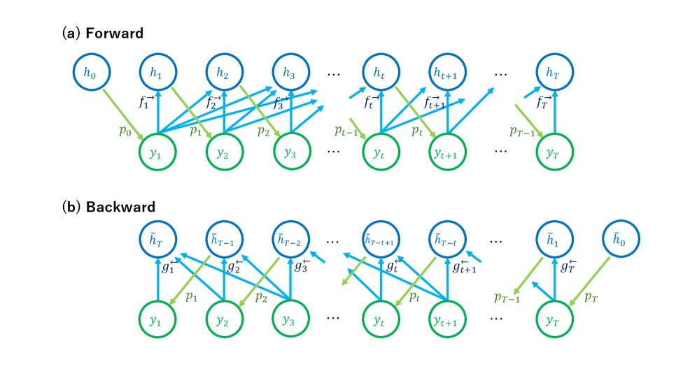
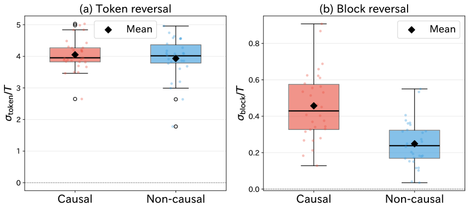
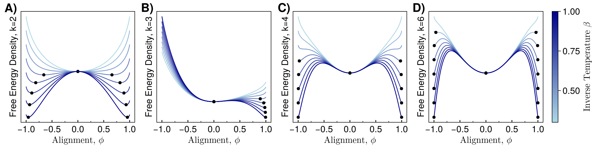
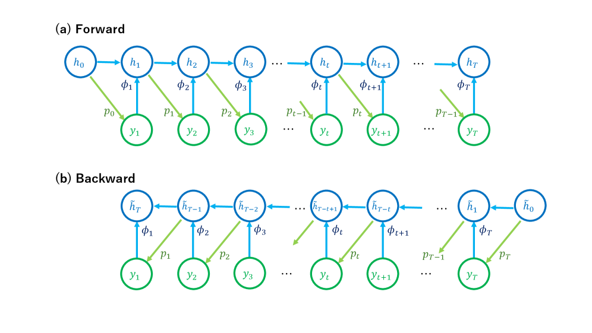
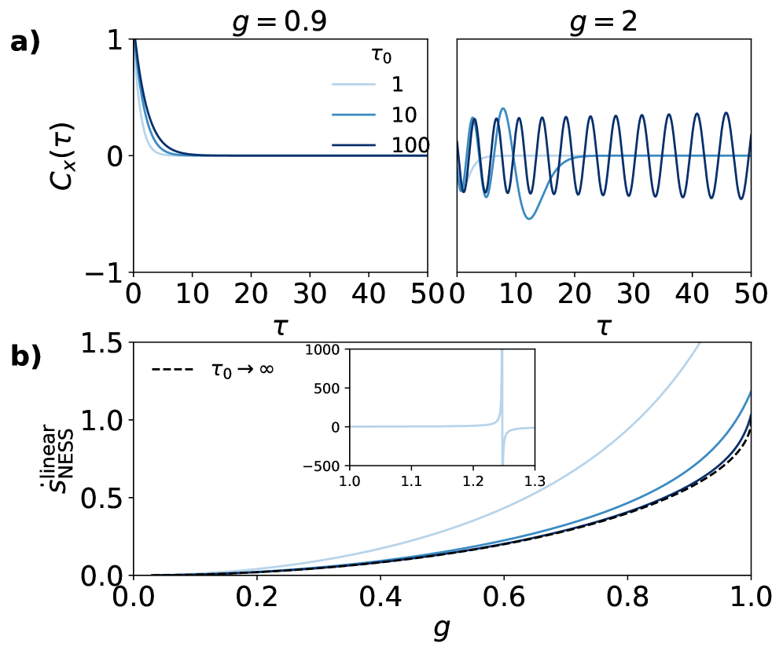

# 自己回帰モデルの非平衡熱力学：RNN・Transformer・Mambaが生み出す情報的不可逆性

- **執筆日**: 2026-04-13
- **トピック**: 自己回帰生成モデルにおけるエントロピー産生の統計力学的解析
- **タグ**: Computation and Theory / Nonequilibrium Phase Transitions; Memory and Information Functionality / Machine Learning
- **注目論文**: Sagawa, "Stochastic Thermodynamics for Autoregressive Generative Models: A Non-Markovian Perspective," arXiv:2604.07867 (2026)
- **参照関連論文数**: 7本

---

## 1. なぜ今この話題なのか

大規模言語モデル (Large Language Model; LLM) や生成 AI の急速な普及に伴い、「知能的な情報処理の物理的コストとは何か」という問いが俄然注目を集めている。LLM の根幹をなすアーキテクチャ—**再帰型ニューラルネットワーク (RNN)** 、**Transformer** 、そして近年急浮上した状態空間モデルの **Mamba** —は、過去のトークン列を参照しながら次のトークンを確率的に生成する。この「確率的な時系列生成」というプロセスは、物理的に見れば非平衡確率過程そのものである。

物性物理・材料科学の観点から見ると、こうした機械学習モデルへの統計力学的アプローチには二重の意義がある。第一に、材料中の複雑な動力学（スピングラス、アモルファス材料、生体高分子）を記述するための理論的枠組みとして確率熱力学が長年発展してきたが、それが機械学習モデルの解析にも適用可能であることが明らかになりつつある。第二に、材料や物質系の時系列データを解析するための「測定ツール」として機械学習が活用される場面が増えており、そのモデルの物理的な特性を理解することが実践的にも重要である。

特に中心的な概念となるのが **エントロピー産生 (entropy production)** だ。非平衡統計力学において、エントロピー産生は「系がどれほど時間反転対称性を破っているか」を定量化する指標である。エネルギーを散逸する非平衡系は正のエントロピー産生を持ち、逆に逆方向の過程が同じ確率で起こるような可逆な系ではエントロピー産生はゼロとなる。

RNN や Transformer が文章を生成するとき、この過程は明らかに「不可逆」である。「今日は天気が良い」という文を生成する際、各単語の選択は前の文脈に強く依存しており、時系列を逆にすれば全く別の意味になる。しかし問題は、こうした **非マルコフ的 (non-Markovian)** なプロセスに対して、エントロピー産生を厳密に定義することが理論的に非自明だという点にある。古典的な確率熱力学の枠組みはマルコフ過程を前提とし、観測変数の時系列は一般に非マルコフ的になってしまうからだ。

Sagawa (2026) は、この本質的な難問に正面から取り組んだ。RNN・Transformer・Mamba などの自己回帰モデルには「決定論的な潜在状態 (latent state) が過去の情報を要約している」という共通構造があることに着目し、この構造を利用することで非マルコフ的な観測過程に対してもエントロピー産生を効率的に定義・計算できることを示した。これは機械学習モデルの「物理的な不可逆性」を初めて定量的に議論する、理論的に重要な一歩である。

---

## 2. この分野で何が未解決なのか

自己回帰モデルと非平衡熱力学の交点には、未解決の根本問題が複数ある。

**問い1: 非マルコフ系のエントロピー産生をどう定義・計算するか？**

古典的な確率熱力学ではマルコフ過程を前提とし、エントロピー産生率はマスター方程式や Langevin 方程式から自然に導かれる。しかし RNN が生成するトークン列は非マルコフ的である。次のトークンの確率分布は「前のトークンだけ」ではなく「全過去のトークン列の要約 (潜在状態)」に依存する。一般の非マルコフ過程に対してエントロピー産生を定義する場合、指数関数的な計算コストが必要になり、長い系列では実用上不可能になる。「潜在状態の存在を利用して計算コストを劇的に削減できるか」が核心的な問いだ。

**問い2: 自己回帰モデルの「不可逆性」は何を反映しているか？**

仮にエントロピー産生が定義・計算できたとして、それは何を意味するのか。言語モデルの生成する文章が「因果的な構造」を持つほどエントロピー産生は大きいのか小さいのか。物語文と羅列的な事実文ではどちらが「より不可逆」か。これらの問いは LLM の物理的解釈だけでなく、材料系のデータ駆動型モデリングにおいても意義がある。

**問い3: 情報処理の熱力学コストとモデルの「質」は関係しているか？**

Landauer 原理は「情報の消去に熱力学的コストが伴う」ことを主張するが、逆に「より良い生成モデルは熱力学的にどうあるべきか」という問いはまだ開かれている。エントロピー産生が低い（より可逆な）モデルほど高品質なのか、あるいは逆なのか。連想記憶ネットワークについては近年の研究 [2601.01253] で「記憶精度と熱力学的コストのトレードオフ」が示されているが、LLM への一般化は未解決だ。

---

## 3. 注目論文の核心

### 自己回帰モデルの統一フレームワーク

Sagawa (2026) の出発点は、RNN・Transformer・Mamba といった一見異なるアーキテクチャが共通の数学的構造を持つという観察だ。これらすべてにおいて、各時刻 $t$ での出力 $y_t$ は、過去の情報を圧縮した「決定論的な潜在状態」 $h_{t-1}$ から確率的にサンプリングされる：

$$y_t \sim p_t(\,\cdot\,|\,h_{t-1})$$

そして潜在状態は決定論的な関数で更新される：

$$h_t = \Phi_t(h_{t-1},\, y_t)$$

RNN の場合は $h_t = \tanh(W_h h_{t-1} + W_y y_t + b)$ という再帰的更新、Transformer の場合は $h_t = \Phi(y_1,\ldots,y_t)$ という因果的な自己注意機構、Mamba の場合は線形の状態方程式として実現される。観測変数 $y_t$ の列だけを見ると非マルコフ的だが、拡大された空間 $(h_t, y_t)$ でのプロセスはマルコフ的になる。これが理論の鍵となる。

*図1 (arXiv:2604.07867, CC BY 4.0): 自己回帰モデルにおける前向き過程（左）と後向き過程（右）の因果構造。潜在状態 $h_t$ が観測変数 $y_t$ をまとめ、非マルコフ的な観測過程を生み出す。*

### エントロピー産生の定義

「時系列 $y_{1:T}$ が観測される確率」（前向きパス測度 $\mathcal{P}_\rightarrow$）と「その逆順 $y_{T:1}$ が後向きモデルで観測される確率」（後向きパス測度 $\mathcal{P}_\leftarrow$）の KL ダイバージェンスとしてエントロピー産生が定義される：

$$\Sigma = \mathbb{E}_{\mathcal{P}_\rightarrow}\left[\ln \frac{\mathcal{P}_\rightarrow(y_{1:T})}{\mathcal{P}_\leftarrow(y_{T:1})}\right] \geq 0$$

ここでの後向きモデルは、前向きモデルと同じ潜在状態更新関数 $\Phi_t$ と放射カーネル $p_t$ を使いながら時間を逆転させたものとして定義される。この定義の巧妙な点は、後向きプロセスを新たに学習するのではなく、前向きモデルを時間反転して使うことで、計算コストを（原理的には）2 回の前向きパスで済ませられることにある。

### 圧縮損失とモデル不一致

Sagawa はエントロピー産生を各時刻の非負の寄与の和に分解した：

$$\Sigma = \sum_{t=1}^{T-1} \mathcal{D}_t, \quad \mathcal{D}_t = \mathcal{L}_t + \mathcal{M}_t$$

ここで **圧縮損失 (compression loss)** $\mathcal{L}_t$ は「後向き潜在状態が未来の情報の非可逆的な要約である」ことから生じ、**モデル不一致 (model mismatch)** $\mathcal{M}_t$ は「前向き用に設計された放射カーネルを後向き方向に再利用する」ことから生じる。

この分解は情報理論的に意義深い。圧縮損失は潜在状態の「次元的限界」—RNN の隠れ状態の次元が有限であるため、過去の情報を有限ビット数で要約せざるを得ないこと—に対応する。一方モデル不一致は、モデルが「真の生成プロセス」とどれだけ離れているかを反映する。

### GPT-2 での実証実験

Sagawa は 117M パラメータの GPT-2 を用いて実証実験を行った。120 トークンの系列を生成し、トークン順反転（トークンレベル）と文順反転（ブロックレベル）の2つのエントロピー産生を測定した。

トークンレベルのエントロピー産生はほぼゼロより大きな値を示し、個々のトークンを逆順にすることが強い不可逆性を生むことを確認した。より重要な知見はブロックレベルの実験で得られた。**因果的なテキスト（物語・説明文）は、非因果的なテキスト（独立した事実の羅列）に比べて有意に高いブロックレベルエントロピー産生を示した** ($p = 4.5 \times 10^{-6}$)。これは「文脈依存性の高いテキスト（時間的なつながりがある）ほど逆順にすると大きく確率が変わる」という直感と一致する。

*図2 (arXiv:2604.07867, CC BY 4.0): 因果的テキストと非因果的テキストのブロックレベルエントロピー産生の比較。箱ひげ図と散布図の重ね合わせ。因果的テキスト（赤）が有意に高い値を示す。*

---

## 4. 背景と研究史

### 確率熱力学の発展

確率熱力学 (stochastic thermodynamics) は 1990 年代以降に発展した比較的新しい枠組みで、コロイド粒子・分子モーター・光ピンセット実験などの「揺らぎが無視できない小さな系」の熱力学を記述する [1205.4176]。Seifert の包括的レビューが示すように、この枠組みでは熱・仕事・エントロピー産生を「系の個々の軌跡 (trajectory)」レベルで定義できる。特に重要な成果が揺らぎ定理 (fluctuation theorems) であり、Jarzynski 等価式や Crooks 揺らぎ定理は、非平衡プロセスの確率分布が平衡量とどう結びつくかを精密に述べる。

エントロピー産生の基本的な定義は、前向き軌跡と後向き（時間反転）軌跡の確率比の対数期待値として与えられる：

$$\Sigma = \mathbb{E}\left[\ln \frac{P_{\rm fwd}[\omega]}{ P_{\rm bwd}[\tilde{\omega}]}\right]$$

ここで $\omega$ は前向き軌跡、$\tilde{\omega}$ はその時間反転である。これが Sagawa (2024) の定式化の出発点であり、確率熱力学の言語をそのまま自己回帰モデルに移植したものと解釈できる。

### 情報熱力学の誕生

確率熱力学のもう一つの重要な潮流が情報熱力学だ。Sagawa 自身が 2017 年のレビュー [1712.06858] でまとめているように、この分野では Maxwell の悪魔問題—フィードバック制御によって熱力学第二法則が見かけ上破れるように見える思考実験—が出発点となった。Sagawa と Ueda の重要な結果は、情報（正確には相互情報量）を適切に考慮することで第二法則が一般化された形で成立することを示した。情報の消去には最低 $k_B T \ln 2$ のエネルギーが必要だという **Landauer 原理** も、この文脈で厳密に再定式化された。

自己回帰モデルを解析するにあたって、情報熱力学の視点は本質的だ。RNN の隠れ状態はある意味で「Maxwell の悪魔のメモリ」として機能し、過去の情報を保持して将来の生成に利用する。この過程での情報の圧縮・消去・再生がエントロピー産生を生む源泉である。

### 学習とエントロピー産生

Goldt と Seifert [1611.09428] は 2016 年に「学習の確率熱力学」という先駆的な問いを立てた。彼らは単純な教師あり学習のモデルを解析し、「ニューラルネットが環境からの信号を学習する際に取得する情報は、学習の熱力学コストで上限が与えられる」という不等式を導出した。これは機械学習を熱力学的プロセスとして見なす最初の厳密な結果の一つである。

Sagawa (2026) の研究はこの方向をさらに進め、「学習済みモデルが系列を生成する」プロセスの熱力学を扱っている。学習そのものではなく、推論・生成過程の熱力学的性質を問うところが新しい。

### 連続時間 RNN の非平衡熱力学

Aguilera et al. [2511.11150] は、連続時間再帰型ニューラルネットワーク (Continuous-Time RNN; CTRNN) が連想記憶として機能する際の非平衡熱力学を解析的に導出した。彼らのモデルはホップフィールドネットワークを非対称な結合行列に拡張したもので、スピン系の平均場理論を使って巨視的観測量（符号化されたパターンの重なり）の時間発展と同時に **エントロピー産生率** を厳密に計算できることを示した。

$$\dot{\Sigma} = \dot{S} + N\langle \beta(\Theta + Am)^\top \dot{m} \rangle$$

ここで $S$ は Shannon エントロピー、$m$ はパターンとの重なり（オーダーパラメータ）、$A$ は非対称な相互作用行列を表す。**重要な知見として、結合行列が対称ならエントロピー産生はゼロ（詳細つり合いが成立）となる**が、非対称性が生じると正のエントロピー産生が現れ、系は真の非平衡状態となる。RNN の「記憶の動的遷移」（一つのパターンから次へと循環する挙動）には必ずエントロピー産生が伴う。

### 密な連想記憶の熱力学

Rooke et al. [2601.01253] は、最近注目されている **密な連想記憶 (Dense Associative Memory; DenseAM)** の熱力学的解析を行った。DenseAM はホップフィールドネットワークの一般化であり、指数的に多くのパターンを記憶できる上に、Transformer や拡散モデルとの数学的等価性が指摘されている。Rooke et al. は **動的平均場理論 (Dynamical Mean Field Theory; DMFT)** を用いて、記憶検索の精度・動作速度・エントロピー産生のトレードオフを明確にした。

*図3 (arXiv:2601.01253, CC BY 4.0): DenseAM の自由エネルギー景観の温度依存性。k=2,3,4,6 に対して、特定の次数では有限温度で偽の局所最小値が現れ、記憶検索の失敗につながる。*

### 非対称ネットワークにおける乱雑な相互作用

Pham と Gupta [2603.27658] は 2026 年に、非対称な結合を持つ非線形ネットワークにおいてランダムに時間変化する相互作用がエントロピー産生率にどう影響するかを DMFT で解析した。「乱れ（disorder）」がエントロピー産生に与える影響を定量化し、相関時間 $\tau_0$ と乱れの強度によってエントロピー産生率がどのように変化するかを精密に導出した。

$$\dot{s}_{\rm NESS} = -\frac{\ddot{C}_x(0^+)}{T} + 1$$

ここで $C_x(\tau)$ は定常状態での自己相関関数である。この結果は、乱れたネットワーク（材料中の不規則なネットワーク構造を模した系）のエントロピー産生が「自己相関の時間微分」という測定可能な量で記述できることを意味し、実験的な検証可能性を持つ。

---

## 5. どの解釈が最も妥当か

### 圧縮損失の物理的解釈

Sagawa の圧縮損失 $\mathcal{L}_t$ は、後向き潜在状態が未来の情報を「非可逆的に要約」することから生じる。これは RNN の隠れ次元 $d_h$ が有限であることに由来する根源的な制限だ。もし潜在状態がすべての過去の情報を完全に保持できれば（すなわち次元が無限大ならば）、圧縮損失はゼロになる可能性がある。実際の言語モデルでは有限サイズのコンテキストウィンドウや有限次元の隠れ状態しか使えないため、この「忘却」が必然的に不可逆性を生む。

材料科学の文脈で言えば、これは系の「有効自由度」の問題に対応する。材料の時間発展を記述する場合、完全な原子運動の情報を保持することは不可能であり、何らかの粗視化によって情報を失う。この粗視化が非平衡系のエントロピー産生を増大させることは確率熱力学の一般的な知見であり [2512.07772]、Sagawa の圧縮損失はその機械学習版といえる。

### モデル不一致の物理的解釈

モデル不一致 $\mathcal{M}_t$ は、前向き用に設計された放射カーネルを後向き方向に「不適切に」再利用することから生じる非対称性を測る。RNN が「次のトークンを予測する」ように最適化されているとすれば、「前のトークンを予測する」タスクには同じカーネルは最適ではない。この非対称性がモデル不一致として現れる。

Aguilera et al. [2511.11150] の CTRNN 研究との対応を見ると、非対称な結合行列が CTRNN のエントロピー産生を生む主因であるように、言語モデルにおける「前向き vs 後向き」の非対称性がモデル不一致の源泉となっている。両者は異なるモデル・異なる文脈だが、「対称性の欠如がエントロピー産生を生む」という共通の物理的原理を示している。

*図4 (arXiv:2604.07867, CC BY 4.0): 再帰型アーキテクチャ（RNN 型）における前向き過程（a）と後向き過程（b）の比較。*

### GPT-2 実験の意義と限界

GPT-2 を用いた実証実験の結果—因果的テキストのほうが高いブロックレベルエントロピー産生を示す—は、エントロピー産生が「テキストの時間的依存構造の度合い」に相関することを示唆する。これは物理的直感に合致している：因果的な物語では後の文が前の文に強く依存しており、逆順にすると意味が大きく変わる（つまり高い不可逆性）。

しかし重要な注意点がある。この実験はトークン列を言語モデル内部で反転させるという「内部的な反転」を測定しており、実際の物理的エントロピー産生（熱として散逸するエネルギー）とは異なる。Sagawa が定義するエントロピー産生は情報理論的な量であり、物理的な熱力学第二法則における「熱散逸」と直接対応するわけではない。これは理論の枠組み上の意図的な選択だが、概念的な注意が必要だ。

### 比較研究との整合性と食い違い

Das と Manikandan [2503.20427] は深層学習を使って非平衡軌跡に沿ったエントロピー産生の「局所化」を行う手法を提案している。彼らのアプローチは高次元の拡散モデルを使って散逸力場を学習するもので、方向性は異なるが「機械学習でエントロピー産生を推定する」という共通点を持つ。

違いは対象の違いに由来する。Das et al. は「物理系の時系列データからエントロピー産生を学習する」ツールを作るのに対し、Sagawa は「機械学習モデル自身が生み出すエントロピー産生を理論的に定義する」。前者はツールとしての ML、後者は対象としての ML という立ち位置の違いだ。

比較的強く支持される結論は「自己回帰モデルのエントロピー産生は2回の前向きパスで効率的に推定できる」という計算上の結果で、これは数学的に厳密に証明されている。一方、「エントロピー産生がモデルの質や因果構造の指標になりうる」という解釈はまだ探索的段階にある。GPT-2 の1つの実験だけでは根拠が弱く、より多様なモデル・タスク・言語での検証が必要だ。

---

## 6. 何が一般化できるのか

### Mamba への拡張

Mamba [2312.00752] は選択的状態空間モデル (Selective SSM) と呼ばれるアーキテクチャで、Transformer の self-attention を線形コストの状態更新で置き換えることで、長系列に対してもスケールする。数式的には状態更新 $h_t = \bar{A}(x_t) h_{t-1} + \bar{B}(x_t) x_t$（ここで $\bar{A}, \bar{B}$ は入力依存の行列）という形を持つ。この構造は Sagawa の枠組みに直接収まり、Transformer では $O(T^2)$ になっていた計算コストが $O(T)$ に改善される。これは Mamba への適用が Transformer より計算効率の面で有利であることを意味し、長系列でのエントロピー産生解析が実用的になりうる。

### 生物神経回路との接続

Aguilera et al. が示したように [2511.11150]、CTRNN のエントロピー産生解析は生体神経回路の非平衡動力学の理解にも接続できる。脳内の神経回路は対称的な結合を持たず、本質的に非平衡系として機能している。記憶・時系列処理・情報統合などの機能がどのような熱力学的コストと結びついているかは、神経科学の重要課題だ。Sagawa の枠組みはこうした生物学的 RNN を解析する理論的ツールにもなりうる。

### 材料科学への応用

材料系の非平衡ダイナミクスを記述する場合、時系列データからエントロピー産生を推定することは重要な測定課題だ。相変態・ガラス転移・フォノン輸送などの材料過程を自己回帰モデルで学習した場合、そのモデルのエントロピー産生がプロセスの「不可逆性の度合い」をキャラクタリゼーションする指標になりうる。特に Pham & Gupta [2603.27658] が示した「不規則なネットワークのエントロピー産生が自己相関関数から導出できる」という結果は、不規則な材料系への直接的な接続点を持つ。

*図5 (arXiv:2603.27658, CC BY 4.0): 不規則な結合を持つ非線形ネットワークの自己相関関数（左）とEPRの結合強度依存性（右）。乱れのない（アニール）場合と「焼き固め (quench)」場合での比較。*

### 量子系への展開

確率熱力学は量子系（量子確率熱力学）にも拡張されており、量子コンピュータや量子センサなどの非平衡量子デバイスの解析に応用されている。一方で「量子 RNN」や量子自己回帰モデルも提案されつつある。Sagawa の古典的枠組みを量子系に拡張することは自然な方向性であり、量子情報処理の熱力学コストを問う新しい分野を開拓する可能性がある。

---

## 7. 基礎から理解する

### 確率過程とマルコフ性

物理・化学・工学の様々な系に現れる「ランダムな時間発展」は確率過程として記述される。特に重要なのが **マルコフ過程** で、「次の状態の確率分布が現在の状態だけで決まり、過去の状態には依存しない」性質（マルコフ性）を持つ。コインの連続投げや酔歩 (random walk) がその典型例だ。

一方 **非マルコフ過程** では、次の状態の確率が過去の状態の「記憶」に依存する。粘弾性流体中のコロイド粒子の運動（浴の記憶効果による）や、長周期相関を持つ系がその例だ。言語モデルが生成する文章もまた非マルコフ的であり、前の単語や文の内容が後の単語の選択に影響を与える。

### エントロピー産生の物理的意味

熱力学第二法則は「孤立系のエントロピーは増大する」と述べるが、より精密な確率熱力学では「エントロピー産生 $\Sigma \geq 0$」を軌跡レベルで定義できる。エントロピー産生は系が「時間反転に対してどれだけ非対称か」を測る量であり、正の値は系が非平衡状態にあって散逸が起きていることを示す。

直感的には：可逆過程（例：等温準静プロセス）ではエントロピー産生がゼロ、不可逆過程（例：自由膨張、摩擦）ではエントロピー産生が正となる。言語モデルの文章生成も「時間を逆にしたら全く別の確率で起きる」という意味で不可逆であり、その不可逆性の度合いがエントロピー産生として定量化される。

### 詳細つり合い条件と非平衡定常状態

**詳細つり合い (detailed balance)** は、任意の2状態間の遷移率が「前向き = 後向き」となる条件であり、熱平衡状態の特徴づけとして重要だ：

$$W_{ij} \pi_j = W_{ji} \pi_i$$

ここで $W_{ij}$ は状態 $j$ から状態 $i$ への遷移率、$\pi$ は定常分布。詳細つり合いが破れると系は非平衡定常状態 (Non-Equilibrium Steady State; NESS) にあり、正のエントロピー産生を持つ。

Aguilera et al. の CTRNN において対称な結合行列 $W = W^T$ が詳細つり合いに対応し、非対称性 ($W \neq W^T$) が詳細つり合い破れ → 正のエントロピー産生という対応関係になっていることは、この物理的原理の直接的な表れだ。

### KL ダイバージェンスと情報幾何

**KL ダイバージェンス** (Kullback-Leibler divergence) $D_{\rm KL}(P || Q)$ は2つの確率分布 $P, Q$ の「非対称な距離」を測る量で、常に非負である：

$$D_{\rm KL}(P || Q) = \sum_x P(x) \ln \frac{P(x)}{Q(x)} \geq 0$$

これがゼロになるのは $P = Q$ の場合のみ。Sagawa の定義するエントロピー産生 $\Sigma = D_{\rm KL}(\mathcal{P}_\rightarrow || \mathcal{P}_\leftarrow)$ は、確率過程のパス測度に対して KL ダイバージェンスを適用したものであり、「前向きパスの確率分布と後向きパスの確率分布の乖離度」を定量化している。

### RNN のアーキテクチャ

**RNN (Recurrent Neural Network)** は隠れ状態 $h_t$ を持つネットワークで、各時刻 $t$ の状態更新は：

$$h_t = f(W_h h_{t-1} + W_x x_t + b)$$

と書ける。ここで $f$ は非線形活性化関数（tanh や ReLU）、$W_h$ は再帰的な重み行列、$W_x$ は入力の重み行列だ。RNN の本質は「現在の入力 $x_t$ と前の隠れ状態 $h_{t-1}$ から新しい隠れ状態 $h_t$ を計算する」という再帰的構造にある。

実用的な問題として RNN は **勾配消失・勾配爆発** に悩まされる。長い系列で誤差逆伝播をすると、勾配が指数的に減衰または発散するためだ。これを緩和するのが **LSTM (Long Short-Term Memory)** と **GRU (Gated Recurrent Unit)** であり、いずれも「ゲート機構」によって情報の流れを制御し、長期依存性の学習を可能にする。

### 自己回帰モデルと Mamba

**自己回帰モデル (autoregressive model)** は、系列 $y_{1:T}$ の同時確率を条件付き確率の積として表すモデルである：

$$P(y_{1:T}) = \prod_{t=1}^{T} P(y_t | y_{1:t-1})$$

Transformer における条件付き確率 $P(y_t | y_{1:t-1})$ の計算は self-attention を介して行われ、過去のすべてのトークン $y_1, \ldots, y_{t-1}$ を直接参照する。計算量は系列長 $T$ に対して $O(T^2)$ となり、長い系列では非効率だ。

**Mamba** はこの問題を「選択的状態空間モデル」で解決する。線形のリカレント構造を持ちながら入力依存の行列を使うことで、各トークンを処理する時間複雑度を $O(T)$ に抑える。Sagawa の枠組みでは、Mamba は RNN と同様の再帰的更新構造を持つため、エントロピー産生の計算コストも $O(T)$ で済む。

---

## 8. 専門用語の解説

**エントロピー産生 (Entropy Production)**
非平衡系の「不可逆性の度合い」を定量化する物理量。前向き軌跡と後向き（時間反転）軌跡の確率比の対数平均として定義される。平衡系ではゼロ、非平衡系では正。熱力学第二法則の精密化として機能する。

**確率熱力学 (Stochastic Thermodynamics)**
揺らぎが無視できない小さな系（コロイド粒子、分子モーター、ナノデバイスなど）に対して、軌跡レベルで仕事・熱・エントロピーを定義する理論体系。マルコフ過程を前提とし、揺らぎ定理（Jarzynski 等価式、Crooks 定理）を包含する。

**詳細つり合い (Detailed Balance)**
任意の2状態間の遷移率が前向きと後向きで等しいという条件。熱平衡状態の必要十分条件であり、破れると系は非平衡定常状態（NESS）となってエントロピーが持続的に産生される。ホップフィールドネットワークでは対称結合行列が詳細つり合いに対応する。

**自己回帰モデル (Autoregressive Model)**
系列を条件付き確率の積として生成するモデル。各時刻で「過去のすべてを条件として次を予測」する。言語モデル（GPT, Mamba など）の基本的な生成戦略。確率的サンプリングにより多様な系列を生成できる。

**非マルコフ過程 (Non-Markovian Process)**
次の状態が現在の状態だけでなく過去の履歴にも依存する確率過程。長期記憶・溶媒の記憶効果・複雑なフィードバック系などが典型例。エントロピー産生の定義が一般のマルコフ過程より難しくなる。

**圧縮損失 (Compression Loss)**
Sagawa の分解における一方の項。有限次元の潜在状態が未来の情報を有損で要約することによる不可逆性への寄与。RNN の隠れ次元が有限であるため、過去の情報を「忘れざるを得ない」ことから生じる情報理論的コスト。

**モデル不一致 (Model Mismatch)**
Sagawa の分解におけるもう一方の項。前向き予測用に設計された放射カーネルを後向き方向に再利用することで生じる非対称性。モデルが真の生成プロセスとどれだけ乖離しているかを反映する。

**KL ダイバージェンス (Kullback-Leibler Divergence)**
2つの確率分布 $P$ と $Q$ の「非対称な距離」を測る情報量理論的指標 $D_{\rm KL}(P||Q) = \sum_x P(x) \ln (P(x)/Q(x)) \geq 0$。ゼロは2分布が一致する場合のみ。エントロピー産生の定義に中心的な役割を果たす。

**密な連想記憶 (Dense Associative Memory; DenseAM)**
ホップフィールドネットワークを高次非線形関数で一般化したモデル。パターン容量が指数的に増加し、Transformer や拡散モデルと数学的に等価な構造を持つ。Rooke et al. による熱力学的解析では記憶精度・速度・エントロピー産生のトレードオフが明らかになった。

**Landauer 原理 (Landauer Principle)**
「情報の消去（メモリリセット）は少なくとも $k_B T \ln 2$ の熱を発生する」という情報熱力学の基本原理。Maxwell の悪魔問題の解決に重要な役割を果たす。機械学習モデルにおける「学習・推論のエネルギーコスト」を論じる際の理論的基礎となる。

---

## 9. 今後の展望

Sagawa (2026) が確立した自己回帰モデルに対するエントロピー産生の定義は、機械学習の統計力学的解釈において一つの明確なマイルストーンである。RNN・Transformer・Mamba といった主要な自己回帰アーキテクチャすべてを統一的に扱える点、かつ計算コストが系列長に対して多項式時間で済む点は実用上の強みだ。特に「圧縮損失とモデル不一致への分解」は情報理論的な解釈可能性を持ち、モデルの不可逆性を二つの独立した源泉に帰属させる新しい視点を提供する。GPT-2 での実証実験は因果構造とエントロピー産生の相関を示したが、これはまだ探索的な結果であり、解釈の確定には多様なモデル・タスク・言語での系統的な検証が必要だ。

今後 1〜3 年で注目すべき論点を挙げると、まず第一に「エントロピー産生がモデル選択・最適化の指標になりうるか」という問いがある。訓練の安定性・過学習・汎化能力とエントロピー産生の関係を明らかにすることで、新しい正則化や早期停止の判断基準が生まれるかもしれない。第二に Rooke et al. [2601.01253] や Aguilera et al. [2511.11150] の方向性と統合された「学習 + 推論の完全な熱力学的解析」が期待される。学習フェーズのエントロピー産生（Goldt & Seifert が始めた問い）と推論フェーズのエントロピー産生（本論文の問い）を結合した理論は、機械学習の熱力学の完全な絵を描くために必要だ。また材料科学・物性物理の観点からは、材料の非平衡ダイナミクス（相変態・フォノン輸送・スピン緩和など）を記述する自己回帰モデルに対してこの枠組みを適用し、モデルの「物理的妥当性」を熱力学的に検証するという新しい方向性も見えてくる。

---

## 参考論文一覧

1. **[arXiv:2604.07867](https://arxiv.org/abs/2604.07867)** — T. Sagawa, "Stochastic Thermodynamics for Autoregressive Generative Models: A Non-Markovian Perspective," (2026). 本記事の注目論文。RNN・Transformer・Mamba などの自己回帰モデルに確率熱力学を適用し、非マルコフ的観測過程のエントロピー産生を定義・分解・実証した。

2. **[arXiv:2511.11150](https://arxiv.org/abs/2511.11150)** — M. Aguilera et al., "Nonequilibrium Thermodynamics of Associative Memory Continuous-Time Recurrent Neural Networks," (2025). 非対称な結合を持つ CTRNN における非平衡熱力学を平均場理論で解析し、エントロピー産生率を解析的に導出した。

3. **[arXiv:2601.01253](https://arxiv.org/abs/2601.01253)** — S. Rooke et al., "Stochastic Thermodynamics of Associative Memory," (2026). 密な連想記憶（DenseAM）の熱力学的解析を行い、記憶精度・速度・エントロピー産生のトレードオフを DMFT で明らかにした。

4. **[arXiv:2603.27658](https://arxiv.org/abs/2603.27658)** — T. Pham and D. Gupta, "Entropy Production Rate in Stochastically Time-evolving Asymmetric Networks," (2026). 時間変動する乱雑な相互作用を持つ非線形ネットワークのエントロピー産生率を DMFT と解析的手法で導出した。

5. **[arXiv:2503.20427](https://arxiv.org/abs/2503.20427)** — B. Das and S. K. Manikandan, "Localizing entropy production along non-equilibrium trajectories," (2025). 深層学習を使って非平衡軌跡に沿ったエントロピー産生を空間的・時間的に局所化する手法を開発した。

6. **[arXiv:1205.4176](https://arxiv.org/abs/1205.4176)** — U. Seifert, "Stochastic thermodynamics, fluctuation theorems, and molecular machines," Reports on Progress in Physics (2012). 確率熱力学の包括的レビュー。マルコフ過程でのエントロピー産生・仕事・揺らぎ定理を体系化した。

7. **[arXiv:1712.06858](https://arxiv.org/abs/1712.06858)** — T. Sagawa, "Second law, entropy production, and reversibility in thermodynamics of information," (2017). 情報熱力学—Landauer 原理・Maxwell の悪魔・相互情報量と第二法則の関係—を包括的にレビューした。

8. **[arXiv:1611.09428](https://arxiv.org/abs/1611.09428)** — S. Goldt and U. Seifert, "Stochastic Thermodynamics of Learning," Physical Review Letters (2017). ニューラルネットが環境から学習する際の熱力学的コストを解析し、取得情報が熱力学的コストで上限付けられることを示した先駆的研究。
