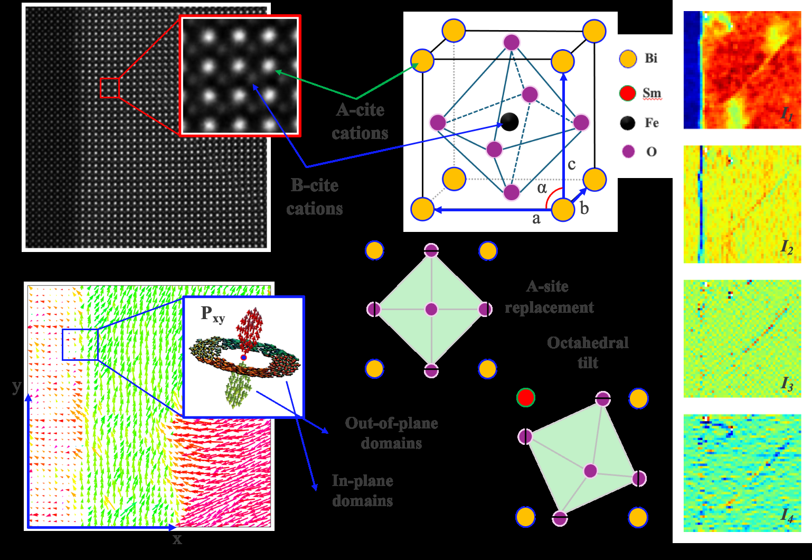
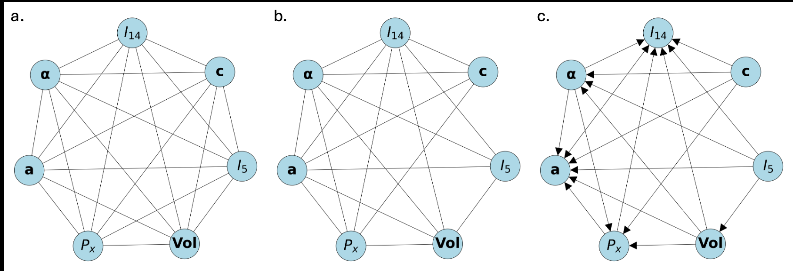
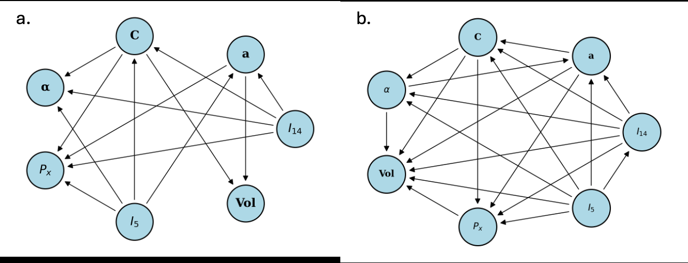
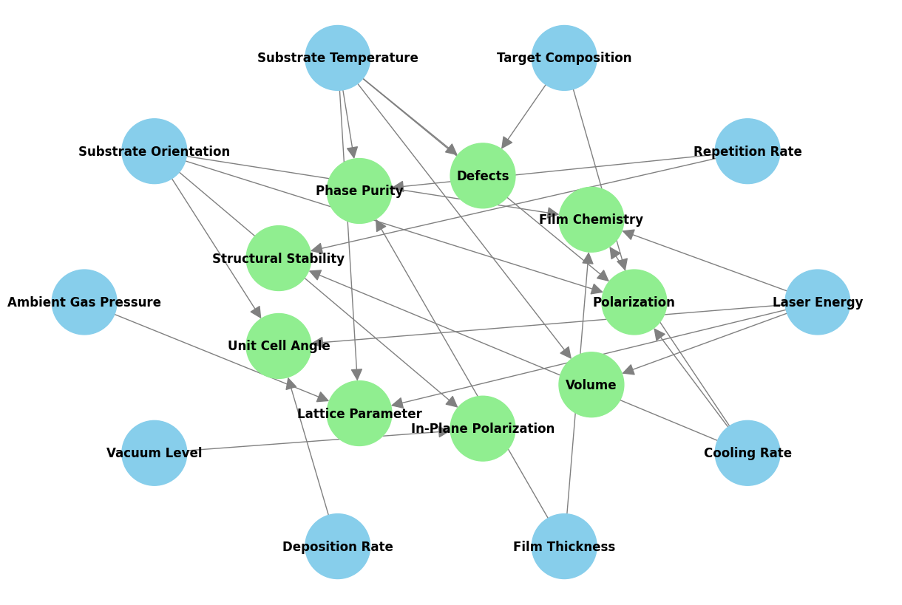
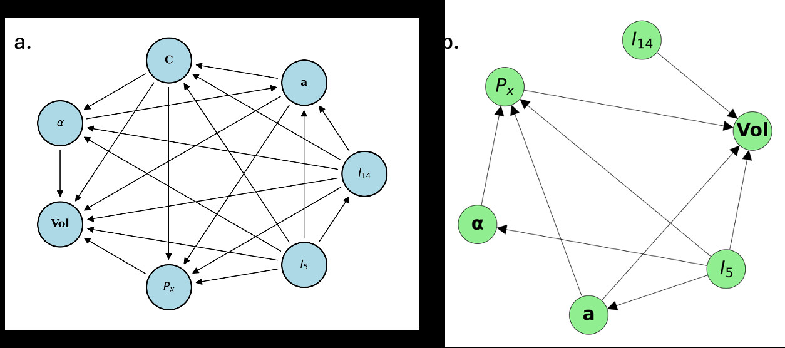

# マテリアルズインフォマティクスにおける因果探索：LLMと走査透過電子顕微鏡データが拓く構造–機能関係の因果的理解

- **執筆日**: 2026-04-25
- **トピック**: LLM（大規模言語モデル）を活用した因果探索アルゴリズム（PCアルゴリズム・LiNGAM）とSTEMデータを統合し、強誘電体材料における構造・化学・分極の因果連鎖を有向非循環グラフ（DAG）として可視化する
- **タグ**: Computation and Theory / Phase Transitions; Charge, Orbital, and Spin Order / Machine Learning; TEM
- **注目論文**: Barakati et al., "Causal Discovery from Data Assisted by Large Language Models," *APL Machine Learning* **3**, 021904 (2025), arXiv:2503.13833
- **参照論文数**: 6

---

## 1. なぜ今この話題なのか

材料科学の中心的な問いの一つは、「どの構造パラメータが、どのメカニズムを通じて、どの機能特性を決めているのか」という構造–機能関係の解明である。この問いは数十年にわたって研究されてきたが、近年のマテリアルズインフォマティクス（MI）の台頭により、その取り組み方が根本的に変わりつつある。機械学習を用いた予測モデルは、膨大な実験・計算データから統計的パターンを抽出し、材料特性を高精度で予測することに成功してきた。しかし、これらのモデルの多くは**相関**を学習しているに過ぎず、**因果**関係を明示的に取り出すことができない。

相関と因果の区別は、材料設計において決定的に重要である。例えば、強誘電体セラミックスにおいて「Sm（サマリウム）ドープ量」と「保磁電場」に高い相関が見られたとしても、それはSm濃度が直接保磁電場を変えているのか、Smが格子定数や酸素八面体の傾きを変え、その結果として分極反転エネルギーが変わるのか、あるいはSmが単に相転移の位置をシフトさせているのかを、相関係数だけからは判断できない。設計に応用するためには、介入（ドーピング量を変える実験）を正しく予測できる因果モデルが必要になる。

この問題意識を背景に、近年「因果探索（causal discovery）」という統計学・機械学習の手法が材料科学に持ち込まれつつある。因果探索は、観測データのみから変数間の因果的方向性を推定する一群のアルゴリズムであり、**有向非循環グラフ（DAG: Directed Acyclic Graph）** を出力として与える。DAGのノードは各変数（格子定数、分極、ドープ量など）を表し、エッジは「原因→結果」の方向性を示す。

一方で、材料科学における因果探索には大きな課題がある。それは、扱う変数の数が多く（STEMデータ一枚から数十種類の局所記述子が得られる）、観測データのサンプル数が限られ、さらに未観測の交絡変数（hidden confounders）が存在しうることである。また、統計的アルゴリズムだけでは、物理的に意味のない因果方向が推定されることがある。

この状況を打開する新しいアプローチとして、**LLM（大規模言語モデル）の事前知識を統計的因果探索に統合する**手法が2025年に提案された。Barakatiらの研究（arXiv:2503.13833）は、ChatGPTを強誘電体分野の論文で特化学習（fine-tuning）し、そこから得られる定性的な因果知識をPCアルゴリズムの事前分布として組み込んだ。走査透過電子顕微鏡（STEM）データで得た局所記述子に適用することで、Sm添加BiFeO₃（SmBFO）における構造・化学・分極の因果連鎖を同定することに成功した。この研究は、物理の先験知識と統計的厳密性を「DAGの文法」で統合するという、材料インフォマティクスの新しい方向性を示している。

---

## 2. 未解決問題は何か

この分野には、現在も解決されていない本質的な問いが複数存在している。ここでは特に重要な三点を整理する。

**観測データから真の因果方向を識別できるか？**　因果グラフの学習において最大の困難は、同じ結合同時分布を説明するDAGが複数存在しうることである（Markov equivalence class問題）。例えば「X→Y」と「X←Y」は、変数が共に正規分布に従う線形関係にある場合、観測データだけでは区別できない。LiNGAM（Linear Non-Gaussian Acyclic Model）に代表される非ガウス仮定の利用や、PCアルゴリズムにおけるv-structure（合流点）の検出がこの問題を部分的に解決するが、実際の材料データでは分布の仮定が崩れることが多く、識別可能性（identifiability）の保証は限定的である。

**未観測の交絡変数はどう扱うか？**　材料の局所構造とマクロ特性の間には、STEM像に現れない隠れた変数（欠陥密度、粒界構造、熱処理履歴など）が介在しうる。PCアルゴリズムは観測変数間の条件付き独立性を利用するが、未観測交絡があると誤ったエッジが残る。FCI（Fast Causal Inference）アルゴリズムのように、潜在変数の存在を明示的に許容する手法もあるが、それでも真の因果構造の完全な復元は困難である。

**ドメイン知識と統計推論をどう統合するか？**　材料科学者は、電子顕微鏡データを解析する際に膨大な先験知識（「A-siteカチオンは格子定数を制御する」「分極はB-site変位から生じる」など）を持っている。しかしこの知識を従来の機械学習モデルに組み込む方法論は確立されていない。LLMをDAG学習の事前分布として使うアプローチは有望だが、LLM自体の知識の正確性・一貫性・バイアスをどう評価・補正するかは未解決のままである。

---

## 3. 注目論文の核心

### SmBFO系の何が問題か

Barakatiらが対象とした材料は、**Sm（サマリウム）添加BiFeO₃（SmBFO）** である。BiFeO₃（BFO）はR3c対称性の強誘電性ペロブスカイト酸化物で、室温で分極をもつ数少ない鉛フリー強誘電体の一つとして知られている。Smを添加すると、R3c強誘電相から非分極の斜方晶Pnma相への相転移が近傍に存在し、組成・温度・電場に対して急激な構造変化が起こる。この相境界（morphotropic phase boundary）近傍では優れた圧電応答が得られる一方、保磁電場（coercive field）の制御が難しくなる。SmのA-site置換は格子定数、酸素八面体の傾き角、B-site（Fe）の変位量、そして単位胞体積をすべて同時に変化させるため、どのパラメータが保磁電場の直接の原因かを実験的に分離することが極めて困難であった。

### STEMデータから得られる局所記述子

この研究ではSTEM-HAADF（高角散乱暗視野）像から、各単位胞ごとに以下の記述子を抽出している（Table 1 / Fig. 1）。A-siteカチオン強度（I14）、A-siteとB-siteのカチオン変位ベクトル（a, b）、酸素八面体の傾き角（θ）、単位胞体積（Vol）、そして各原子カラムの強度から推定される局所Sm濃度などである。これらは一枚のSTEM像から数百～数千の「局所」観測値として得られ、組成によって連続的に変化する構造–化学–分極記述子の分布を与える。

*図1：Sm添加BiFeO₃（SmBFO）のSTEMデータから抽出した局所記述子の空間マップ。A-siteカチオン強度（I14）、格子定数（a, b）、酸素八面体傾き角（θ）、単位胞体積（Vol）が各単位胞ごとに示されている。これらの局所パラメータが因果探索の変数として用いられる。(Barakati et al., arXiv:2503.13833, APL Machine Learning 2025, CC BY-SA 4.0)*

### PCアルゴリズムによる因果グラフ構築

統計的因果探索の核心には、**PCアルゴリズム（Peter-Clark algorithm）** が使われている。このアルゴリズムは、以下の3段階で動作する。

**第1段階（スケルトン発見）**: まず全変数が互いに完全に連結された無向グラフを作る。次に、変数のペアに対して「条件付き独立性検定」を繰り返し行い、ある変数集合Zが与えられたとき X と Y が独立であれば（つまり X ⊥ Y | Z）、X–Y のエッジを除去する。これを全ペアに対して実行し、条件付き独立が成立しない変数ペアのみを繋ぐ「スケルトン」グラフを得る。

**第2段階（方向付け）**: スケルトン中のv-structure（合流点）、すなわち「X→Z←Y」という構造（XとYが直接繋がっておらず、Zを条件付けないと独立だが、Zで条件付けると従属になる構造）を検出し、エッジの向きを部分的に決定する。

**第3段階（伝播）**: Meek's rulesに従い、サイクル（循環）が生じないように残りのエッジの向きを論理的に伝播させる。

出力はDAGであり、複数のDAGが同じ条件付き独立関係を持つ場合（Markov等価クラス）は一部のエッジが向き付けされない「PDAG」として出力される。この研究では実装にgCastleフレームワークを使用している。

*図2：PCアルゴリズムによるDAG構築の3段階。(a) 完全グラフからスタート、(b) 条件付き独立性検定によるエッジ除去（スケルトン発見）、(c) v-structure検出とMeek則によるエッジ方向付けを経て最終的なDAGが得られる。(Barakati et al., arXiv:2503.13833, APL Machine Learning 2025, CC BY-SA 4.0)*

### LLMによる先験知識の統合

このアルゴリズムの最大の新規性は、**ChatGPTを強誘電体分野のarXiv論文で特化学習**し、得られた定性的因果知識をPCアルゴリズムの「初期エッジ重み行列」として与えている点である。具体的には、LLMに「X は Y の原因となりますか？」という質問を系統的に投げかけ、その回答を0〜1の連続値（因果の強さの推定値）として符号化し、PCアルゴリズムが使う事前隣接行列（adjacency matrix）を構成する。

LLMが与える情報は完全には正確でないが、「物理的にありえない」因果方向を除外し、「統計的には同値だが物理的には一方が正しい」方向を選ぶ際の拘束条件として機能する。これは、統計的識別可能性の限界をドメイン知識で補完するという戦略である。

### 発見された因果構造と物理的意味

LLM統合PCアルゴリズムが発見した因果グラフ（Figure 3）では、次のような主要な因果連鎖が明確になった。A-siteカチオン強度（I14 ∝ Sm濃度）が格子定数（a）を通じて単位胞体積（Vol）に影響し、体積変化がB-site変位（分極）を制御するという連鎖である。また酸素八面体傾き角（θ）は、Sm置換によるA-site–O結合の変化を反映する独立した因果経路として現れた。

*図3：LLMの事前知識を組み込んだPCアルゴリズムが発見したDAG（有向非循環グラフ）。(a) LLMが生成したエッジ方向の初期推定、(b) データ駆動条件付き独立性検定とLLM事前知識の統合結果。矢印は推定された因果の方向を示す。(Barakati et al., arXiv:2503.13833, APL Machine Learning 2025, CC BY-SA 4.0)*

さらにFigure 5では、成膜パラメータ（基板温度、酸素分圧、冷却速度など）から材料特性（分極、構造安定性、相純度、欠陥量）への因果グラフが構成されており、プロセス–構造–特性関係への拡張可能性が示されている。

*図4：成膜パラメータ（成長条件）から材料特性へのLLM支援因果グラフ。基板温度や酸素分圧などの成長制御変数が、どのような因果経路を通じて分極・欠陥・相安定性を決定するかが示されている。(Barakati et al., arXiv:2503.13833, APL Machine Learning 2025, CC BY-SA 4.0)*

---

## 4. 背景と研究史

### 相関から因果へ：材料科学における機械学習の転換点

マテリアルズインフォマティクスの第一世代は「相関ベース」のアプローチであった。ランダムフォレスト、ガウス過程回帰、ニューラルネットワークなどが材料特性の予測に使われ、組成や構造記述子から転移温度・バンドギャップ・硬度などを学習した。これらのモデルは高い予測精度を達成した一方で、「なぜ」その特性が生じるのかという機構的理解を直接与えない。さらに、学習データの分布外（out-of-distribution）では急速に信頼性を失う。

この課題を意識した研究者たちは、2020年代に入って因果推論を材料科学に持ち込み始めた。その先駆的な仕事の一つが、Kalininグループによる2020年の研究（arXiv:2002.04245）である。Ziatdinovらは、SmBFO系のSTEMデータにIGCI（Information Geometric Causal Inference）とANM（Additive Noise Model）という2種類のペアワイズ因果推定法を適用した。IGCIはエントロピーの情報幾何的な非対称性を利用し、ANMは「X→Y+ノイズ」モデルのフィットの良さから方向を決める。これらにより、A-siteカチオン変位、B-siteカチオン変位、酸素八面体傾き、局所Sm濃度の間のペアワイズ（二変数間）因果関係が明らかにされた。この研究は材料STEMデータへの因果探索の初めての本格的な適用として位置づけられる。

ただし、ペアワイズ手法には本質的な限界がある。二変数の関係しか扱えないため、「XとYの間の見かけの因果は実はZを通じた間接効果だった」という多変数的な構造を識別できない。これを克服するのが、条件付き独立性を利用したグラフ全体を同時に学習するPCアルゴリズムや、FCI（Fast Causal Inference）アルゴリズムである。

### LiNGAMと非ガウス性の活用

Liuら（arXiv:2110.06888）は2021年に、PFM（圧電応力顕微鏡）マルチチャンネルデータへの因果分析フレームワークを提案した。このアプローチの核心はLiNGAM（Linear Non-Gaussian Acyclic Model）の応用である。LiNGAMは、変数が線形関係 $X_j = \sum_{k \neq j} b_{jk} X_k + e_j$ に従い、外生ノイズ $e_j$ が非ガウス分布をとるという仮定のもとで、DAGの完全な識別が可能であることを示した手法である。

通常のガウス線形モデルでは「X→Y」と「X←Y」は観測上区別できないが、非ガウス性があれば独立成分分析（ICA）的な手法によって因果方向を一意に特定できる。LiNGAMはPFMデータのモーフォロジー（表面形状）、圧電応答、弾性率などの間の因果連鎖を分析するために使われ、表面条件と物理特性の相互作用がナノスケールで明らかにされた。さらにLiuらは、このアプローチをDeep Kernel Learning（DKL）と組み合わせることで、非線形な記述子に対しても拡張した。Barakatiら（2503.13833）がLiNGAMを比較手法の一つとして使っていることは、この2021年の研究との直接的な連続性を示している。

### 他材料系・他プロセスへの応用：ホットコロージョン問題

Varghese ら（arXiv:2402.07804）は、ガスタービン超合金のホットコロージョン（高温硫酸腐食）問題にFCI（Fast Causal Inference）アルゴリズムを適用した。FCIはPCアルゴリズムの拡張版で、潜在的な未観測交絡変数が存在する場合にも対応できる。超合金IN738やCM247LCの腐食速度データに対して、温度、Na₂SO₄濃度、合金組成などの変数間の因果構造が推定され、どの冶金因子が腐食経路の直接の原因かが明示された。この研究は、因果探索が電子顕微鏡画像データ以外のマクロな材料試験データにも適用できることを示し、材料設計とプロセス最適化への接続を与えている。

### マルチスケールMIの文脈

2026年に公開されたNasirら（arXiv:2604.18086）の総合レビューは、量子・原子・メゾスケール・連続体にわたるMIの現在地を整理している。このレビューは、因果的解釈可能性をMIの次の課題として明示的に位置づけ、実験データの不確実性定量化・能動学習・因果グラフ構築が今後のMIの中核になるという展望を示している。Barakatiらの仕事は、このレビューが予想するMIの発展方向と正確に符合している。

---

## 5. どの解釈が最も妥当か

### LLM統合DAGの評価

Barakatiら（2503.13833）が発見した因果グラフの解釈において、最も重要なのは、LLM先験知識がPCアルゴリズムの結果をどの方向に「修正」したかである。PCアルゴリズムは条件付き独立性検定に基づき、統計的に等価なDAGの集合（Markov等価クラス）を出力するが、その中からLLMが物理的に妥当な方向を選択する役割を果たす。

*図5：LLM統合PCアルゴリズムと独立したLiNGAM解析の比較。双方が一致するエッジは統計的・物理的に支持が強い因果関係を示す。(Barakati et al., arXiv:2503.13833, APL Machine Learning 2025, CC BY-SA 4.0)*

比較として行われたLiNGAM解析（Figure 4）と照合すると、いくつかのエッジは両手法で一致しており（例えばI14 → Vol の連鎖の存在）、これらは比較的強く支持された因果関係と解釈できる。一方、方向が一致しないエッジも存在し、それらはデータの非ガウス性の程度やサンプル数の限界によって感度が異なることを示している。

### 解釈の支持根拠と不確かさ

**支持が強い結論**として、A-siteカチオン置換（Smドープ）が格子パラメータを介して単位胞体積を制御し、体積変化がB-siteのFe変位（分極）に影響するという因果連鎖は、既存の第一原理計算および構造精密化の結果と整合している。SmのA-siteへの置換がA–O結合長を変え、それがFeO₆八面体の傾き角を変え、強誘電変位を変調するという物理像は、電子構造計算でも支持されている。

**弱い、または未確定の結論**として、酸素八面体傾き角（θ）と分極の因果的優先順位が挙げられる。θ → 分極なのか、両者が共通の上位原因（体積）に制御されているのかは、観測データからは容易に区別できない。また、STEMデータから直接推定された局所Sm濃度は、実際の化学量論とどの程度対応しているか（電子ビームの非弾性散乱効果やサンプルの厚さ依存性）についての不確かさが残る。これらの問題は、エネルギー分散X線分光法（EDS）や電子エネルギー損失分光法（EELS）との相補的な測定によって検証可能であろう。

### 能動的因果学習との接続

一方、Foxら（arXiv:2404.04224）が分子系で示した**能動的因果学習（active causal learning）** の視点も重要である。受動的な観測データから因果グラフを推定するのではなく、「どの実験的介入（intervention）を行えば因果グラフの不確かさを最も効率的に減らせるか」を情報理論的に計算し、次の実験を自律的に設計するというアプローチである。QM9分子データセット（約13万の有機分子）に適用したこの研究では、ランダムな介入選択と比べて大幅に少ない実験数で因果グラフを同定できることが示された。

このアプローチをSmBFO系に適用するならば、次に行うべきSTEM観察条件（特定のSm組成、温度、電場履歴）を能動的に選択するシステムが構築できるだろう。Barakatiらの研究は受動的観測データへの因果探索にとどまっているが、「次の実験をどう設計するか」というループを加えることで、材料発見サイクルが劇的に加速する可能性がある。

### PCアルゴリズムの限界と代替手法

PCアルゴリズムの根本的な制約の一つは、真の因果グラフが有向非循環グラフ（DAG）であるという仮定である。材料系には、温度–応力–ひずみのように循環的なフィードバックが存在する場合があり、そのようなケースではDAG仮定自体が破綻する。また、連続的に測定した時系列データがある場合はGranger因果性やDYNOTEARS（動的版NOTEARS）のような時系列因果探索が適切となる。Varghese ら（2402.07804）が適用したFCIは潜在変数を許容しながら「因果充足集合（PAG: Partial Ancestral Graph）」を出力するため、未観測交絡が疑われるケースでPCアルゴリズムより有利である可能性がある。

---

## 6. 何が一般化できるのか

### 他の強誘電体・多強性物質への展開

SmBFO系で確立された「STEM記述子 → LLM先験 → PCアルゴリズム → DAG」というパイプラインは、他のペロブスカイト系（BaTiO₃、PbZrTiO₃、KNbO₃など）や多強性材料（BiMnO₃、LuFeO₃など）に直接適用できる可能性が高い。特に複数の強いカップリング（強誘電–強磁性–弾性）をもつ系では、どのカップリングが因果的に上位に位置するかを理解することが重要であり、因果グラフは「どの自由度を制御すれば他を動かせるか」という設計指針を直接与える。

### 測定手法の多様化：STEM以外へ

STEMは局所構造情報の宝庫だが、電子ビーム損傷や真空条件など制約もある。今後は光学顕微鏡（例：フォノン分光の空間マッピング）、原子間力顕微鏡（AFM/PFM）、X線回折マッピング（μ-XRD）などからの局所記述子にも同じ因果探索フレームワークを適用することが期待される。Liuら（2110.06888）がPFMデータに同種の手法を適用したことはすでにその可能性を示しており、測定モダリティを超えた一般的なフレームワークが形成されつつある。

### LLMの役割：ドメイン知識の定量的橋渡し

Barakatiらのアプローチの最も汎用的な貢献は、LLMを「文献知識の確率的エンコーダ」として使う枠組みである。任意の材料系・任意の特性について、分野特化LLMに「XはYの原因か」と尋ね、その回答を確率的先験として組み込むことができる。この枠組みは特定の材料系に縛られず、材料科学全般に適用できる。Nasirら（2604.18086）のスケール横断MIレビューが指摘するように、今後のMIはナノスケールから連続体まで複数のスケールで同時に機能モデルを学習する方向に向かっており、LLMはその中で各スケールの先験知識を供給するプラットフォームとして機能しうる。

### 因果グラフから制御・最適化へ

因果グラフが確立されると、Pearl のdo計算（do-calculus）を使って「もし変数Xをx₀に介入操作したとき、変数Yの期待値はどうなるか」を計算できる（交絡変数があっても backdoor criterion が満たされれば推定可能）。これは材料合成の最適制御問題に直接接続する。例えば、「保磁電場を下げるためにSm濃度をどう変えるべきか、基板温度との相互作用はどうか」を因果グラフから定量的に予測する、という材料設計支援システムへの発展が見込まれる。

---

## 7. 基礎から理解する

### 相関と因果の本質的な違い

相関（correlation）は「Xが大きいときYも大きい（または小さい）」という統計的共変関係を表し、対称性がある（XとYの相関係数は $r_{XY} = r_{YX}$）。一方、因果（causation）は非対称であり、「XをX' に変えたとき、Yが変化する」という介入に関する主張である。気温が高い日にはアイスクリームの売上と溺死事故が共に増えるが、アイスクリームの販売を禁止しても溺死は減らない（共通原因「夏・海水浴」があるため）。これが相関と因果の乖離の典型例である。材料系では、二つの構造パラメータが同じプロセス変数（焼結温度など）から生じている場合、両者には強い相関があっても一方から他方を制御することはできない。

### 有向非循環グラフ（DAG）と構造因果モデル

**DAG（Directed Acyclic Graph）** は、ノード（変数）と有向エッジ（因果関係）からなるグラフで、サイクル（A→B→C→A という循環）を持たない。各ノードの値は、その直接の親ノード（PA）と独立した外生ノイズ $U_i$ によって決まる：

$$X_i = f_i(	ext{PA}(X_i), U_i)$$

この設定を**構造因果モデル（SCM: Structural Causal Model）** と呼ぶ。PearlのSCMでは、$f_i$ が因果メカニズムを表し、外生ノイズ $U_i$ は各変数の独立な「固有変動」を表す。「介入（do(X=x)）」は特定のノードの式を $X = x$ で置き換え、他のメカニズムは変えないという操作として定義される。これにより $P(Y | 	ext{do}(X=x))$（Xをxに固定したときのYの分布）が計算でき、観測分布 $P(Y | X=x)$（Xが自然にxになったときのYの分布）と一般に異なる値を与える。

### PCアルゴリズムの数学的基礎

PCアルゴリズムの根拠は二つの基本仮定にある。**マルコフ条件**：DAGにおいて、各ノードは自分の親ノードが与えられると他のすべての非子孫変数と条件付き独立になる。**忠実性（faithfulness）条件**：観測分布において成立する条件付き独立関係はすべてDAGのマルコフ条件から生じる（偶然の相殺による独立は無い）。これら二つの仮定のもとで、PCアルゴリズムは真の因果グラフのMarkov等価クラスを一致推定量として漸近的に正しく復元する。実データでは有限サンプルによる誤差が生じるため、$lpha$検定（通常 $lpha = 0.05$）で条件付き独立性を判定し、偽陰性・偽陽性が生じうる。

### LiNGAMと非ガウス性の役割

線形SCMでは変数の関係が $X_j = \sum_k b_{jk} X_k + e_j$ という線形方程式で表される。すべてのノイズ $e_j$ がガウス分布に従う場合（ガウス線形SCM）、「X→Y: $Y = bX + e$」と「X←Y: $X = b'Y + e'$」は同じ結合分布 $P(X,Y)$ を生成するため、観測データだけでは識別できない。

しかし、ノイズが非ガウス（例えば一様分布、ラプラス分布）の場合、状況が変わる。ShimizuらによるLiNGAMは、独立成分分析（ICA）を応用して、データ行列を $X = BX + E$（$B$：係数行列、$E$：独立非ガウスノイズ）と分解し、因果順序（causal ordering）を一意に決定できることを示した。非ガウス性が存在する材料データ（局所記述子は多峰性分布をとることが多い）では、LiNGAMはPCアルゴリズムが残した方向の曖昧性を解消できる強力な手段となる。

### 条件付き独立性検定の実際

PCアルゴリズムで用いられる条件付き独立性検定にはいくつかの選択肢がある。連続変数の線形関係を仮定できるなら、偏相関係数のフィッシャーZ変換検定（Fisher's Z-test）が計算コストが低く広く使われる。非線形関係や非正規分布には、カーネルベースの条件付き独立性検定（KCIT）や情報量ベースの検定が使われるが、計算コストは大幅に増加する。変数数（ノード数）$p$ に対してアルゴリズムの計算量はスパースなグラフでも $O(p^2 \cdot 2^p)$ の最悪値をとりうるため、高次元データへの適用にはスパース構造の仮定（多くのエッジが存在しない）が実質的に必須となる。

---

## 8. 専門用語の解説

**有向非循環グラフ（DAG: Directed Acyclic Graph）** とは、ノード（変数）と向き付けされたエッジ（矢印）からなり、矢印をたどることで元のノードに戻れない（サイクルがない）グラフである。因果関係を表現する標準的な数学的道具であり、ノードは測定可能な変数（格子定数、温度、特性値など）を表し、エッジはそのノードが原因でその先が結果であることを示す。

**構造因果モデル（SCM: Structural Causal Model）** は、各変数がその原因変数と独立なノイズの関数として決まるという枠組みである。Judea Pearlが体系化した枠組みであり、相関・条件付き確率・介入効果・反事実的推論を統一的に扱う。「do計算（do-calculus）」という演算体系により、観測データから介入効果を計算する条件が明示される。

**PCアルゴリズム** は、Peter SpirtesとClark Glymourが1991年に提案した因果探索アルゴリズムである。条件付き独立性検定を繰り返しながら、変数間の因果グラフを観測データから学習する。マルコフ条件と忠実性条件を仮定のもとで、真の因果グラフのMarkov等価クラスを回復する。

**LiNGAM（Linear Non-Gaussian Acyclic Model）** は、ShimizuらによってICAを応用して提案された線形因果モデルである。変数間の線形関係に加えてノイズの非ガウス性を仮定することで、DAGの完全な識別（エッジの向きの一意決定）が可能になる。ICA分解によって因果係数行列 $B$ を推定し、因果順序を決定する。

**FCI（Fast Causal Inference）アルゴリズム** は、PCアルゴリズムの拡張版であり、潜在変数（未観測の交絡変数）が存在する場合に対応できる。出力は通常のDAGではなく「部分祖先グラフ（PAG: Partial Ancestral Graph）」であり、「双方向エッジ（X↔Y）」によって観測されない共通原因の存在を示すことができる。

**Markov等価クラス（Markov Equivalence Class）** とは、同じ条件付き独立関係の集合を含むDAGの集合である。同じ観測分布を生成するが、エッジの一部が逆向きになった複数のDAGが同一のMarkov等価クラスに属する。PCアルゴリズムはこのクラス全体（PDAG として表現）を識別できるが、クラス内の個別のDAGを選ぶにはドメイン知識や非ガウス性仮定などの追加情報が必要になる。

**バックドア基準（Backdoor Criterion）** は、PearlのDAG理論において、観測データから介入効果（因果効果）を識別するための条件である。DAGにおいて、XからYへの「バックドアパス」（Xに矢印が入ってくる側を経由する間接パス）をすべてブロックする変数集合Zが存在するとき、$P(Y | 	ext{do}(X=x)) = \sum_z P(Y | X=x, Z=z) P(Z=z)$ として因果効果が計算できる。交絡変数の適切な統制がこの計算を可能にする。

**STEM-HAADF（高角散乱暗視野走査透過電子顕微鏡）** は、試料を透過した電子のうち大角度に散乱したものを検出する手法である。像コントラストは原子番号（Z）のほぼ2乗に比例するため、重元素（Bi、Sm）と軽元素（Fe、O）を明暗のコントラストで判別できる。各原子カラムの位置・強度から格子定数・変位ベクトル・局所組成を精度よく定量化できる。

**特化学習（fine-tuning）** とは、大規模に事前学習されたニューラルネットワーク（LLMなど）を、特定のドメインのデータでさらに学習させる手法である。Barakatiらは一般目的ChatGPTを強誘電体分野のarXiv論文に特化学習させることで、強誘電体物理の用語と因果関係の知識を強化した専門モデルを作成した。

**gCastle** は、因果探索アルゴリズムのPythonライブラリであり、Huawei Noahの方舟研究室が開発・公開しているオープンソースツールである。NOTEARS、DAGMA、PC、LiNGAMなど多数のアルゴリズムを統一インタフェースで実装しており、因果探索の実験環境として広く使われている。Barakatiらはこのフレームワークを用いてSTEMデータの因果分析を実施した。

---

## 9. 今後の展望

Barakatiらの研究が示したLLM統合因果探索フレームワークは、材料インフォマティクスの方法論において重要な前進である。特に「かなり確からしくなったこと」として、次の点が挙げられる。まず、LLMの定性的因果知識はPCアルゴリズムのMarkov等価クラス問題を緩和する有効な手段であり、物理的に整合したDAGを得る上での実用的な方策として機能することが示された。また、Sm系BFOのような複雑な多変数ペロブスカイトにおいても、STEM記述子間の主要な因果連鎖（組成 → 格子 → 体積 → 分極）は複数の手法が整合する方向で同定されており、このトポロジーは比較的信頼性が高い。さらにFoxら（2404.04224）の能動学習との接続が示すように、因果グラフの不確かさを定量化し次の実験を自動選択するサイクルは、材料探索の効率を根本的に変える可能性をもっている。

一方で「まだ未確定なこと」も多い。LLM自体のバイアス（誤った物理的信念、文献の偏り）が因果グラフに与える影響の定量的評価がまだ不十分であり、LLM先験の「信頼性スコア」を設定する客観的な方法論が確立されていない。また、STEMデータが本質的に局所的・二次元的な情報であることから、バルク特性や三次元的な微細構造を因果グラフに組み込む方法は未解決である。今後1〜3年で注目すべき展開として、（1）複数の測定モダリティ（STEM、EDS、EELS、PFM）を統合したマルチモーダル因果探索の実装、（2）時系列STEMデータへの動的因果探索（in-situ実験との融合）、（3）因果グラフからdo計算を通じた材料逆設計（保磁電場を最小化するプロセス条件の自動探索）への発展、（4）量子化学計算・分子動力学との因果推論の統合（Nasirら 2604.18086 が示す方向）が期待される。この分野は統計学・機械学習・量子化学・材料科学の交差点に位置しており、今後の発展が特に速い研究フロンティアの一つである。

---

## 参考論文一覧

1. **[arXiv:2503.13833]** Barakati, S., Molak, A., Nelson, C. T., Zhang, X., Takeuchi, I., & Kalinin, S. V. (2025). ["Causal Discovery from Data Assisted by Large Language Models."](https://arxiv.org/abs/2503.13833) *APL Machine Learning*, **3**, 021904. ―― LLMをファインチューニングしてPCアルゴリズムの事前知識として使い、SmBFO系のSTEMデータから因果グラフを構築した本記事の注目論文。

2. **[arXiv:2002.04245]** Ziatdinov, M., Nelson, C. T., Zhang, X., Vasudevan, R. K., Eliseev, E., Morozovska, A. N., Takeuchi, I., & Kalinin, S. V. (2020). ["Causal analysis of competing atomistic mechanisms in ferroelectric materials from high-resolution Scanning Transmission Electron Microscopy data."](https://arxiv.org/abs/2002.04245) *npj Computational Materials*, **6**, 127. ―― IGCIとANMによるペアワイズ因果推定をSmBFO系のSTEMデータに初めて適用し、構造–化学パラメータ間の因果方向を推定した先駆的研究。

3. **[arXiv:2110.06888]** Liu, Y., Ziatdinov, M., & Kalinin, S. V. (2021). ["Exploring causal physical mechanisms via non-gaussian linear models and deep kernel learning: applications for ferroelectric domain structures."](https://arxiv.org/abs/2110.06888) *APL Machine Learning*, **1**, 016104. ―― LiNGAMとDeep Kernel Learningを組み合わせ、PFMマルチチャンネルデータの因果分析を行い、ナノスケールの形態–物性カップリングを解明した。

4. **[arXiv:2402.07804]** Varghese, S., et al. (2024). ["Causal Discovery to Understand Hot Corrosion Mechanisms of High-Temperature Alloys."](https://arxiv.org/abs/2402.07804) *npj Computational Materials*. ―― FCI（潜在変数対応の因果探索）を超合金ホットコロージョンデータに適用し、腐食プロセスの因果グラフを推定した異材料系・異プロセスへの展開例。

5. **[arXiv:2404.04224]** Fox, C., & Ghosh, S. (2024). ["Active Causal Learning for Decoding Chemical Complexities with Targeted Interventions."](https://arxiv.org/abs/2404.04224) *arXiv preprint*. ―― 能動学習と因果グラフを組み合わせ、QM9分子データセット上で最小の介入実験数で因果構造を効率的に同定するフレームワークを提案した。

6. **[arXiv:2604.18086]** Nasir, M. U., et al. (2026). ["Materials Informatics Across the Length Scales."](https://arxiv.org/abs/2604.18086) *arXiv preprint*. ―― 量子・原子・メゾスケール・連続体にわたるMIの現状を整理し、因果的解釈可能性・不確実性定量化・能動学習を次世代MIの核として位置づけた総合レビュー。
