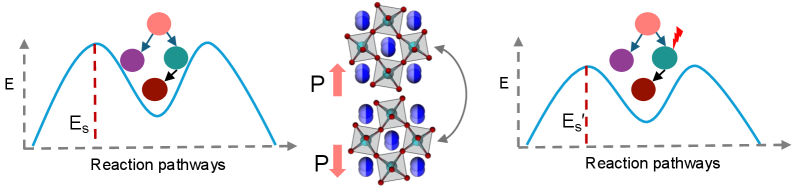
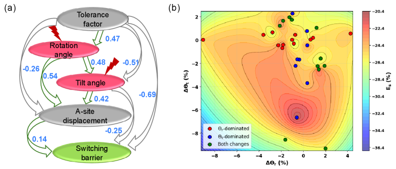
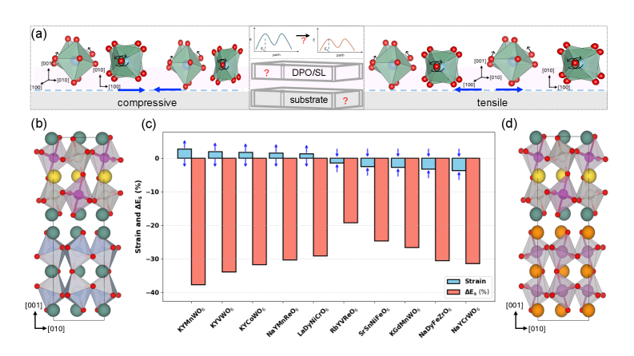
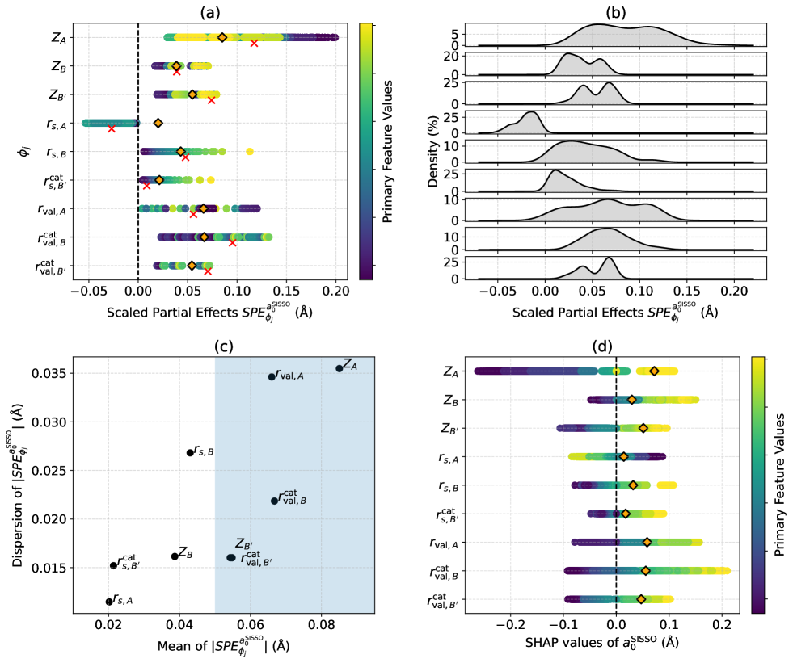

# 因果推論が材料設計を変える：ハイブリッド非固有型強誘電体における分極スイッチングの介入的解析

- **執筆日**: 2026-04-12
- **トピック**: causal-ML-ferroelectric-switching
- **タグ**: main-area: Computation and Theory / sub-area: Phase Transitions; Coupled-Field Response / method-tag: Machine Learning; First-Principles Calculations
- **注目論文**: Ghosh et al., "Intervention Strategies for Polarization Switching in Hybrid Improper Ferroelectrics," arXiv:2512.02916 (2025)
- **参照関連論文数**: 6

---

## 1. なぜ今この話題なのか

材料科学における機械学習（Machine Learning; ML）の応用は、この10年で劇的な広がりを見せた。結晶構造の予測、バンドギャップや誘電率の回帰、熱電特性の最適化など、ML が従来の第一原理計算や実験を補完・加速する事例は数え切れない。しかし、こうした成功の多くは「相関」に基づくものであり、「因果」を明示的に扱うものではなかった。モデルが学習するのは、あくまで訓練データにおける統計的な共変関係であり、「この構造パラメータを変えたら、特性がどう変わるか」という **介入的問い** に直接答える能力は本質的に欠如している。

この問題は、材料設計の現場では深刻な課題となる。たとえば、多変量データから「許容因子（トレランスファクター）が小さいほどスイッチング障壁が低い傾向がある」という相関を発見したとしても、それは「許容因子を下げれば障壁が下がる」という設計指針を意味しているとは限らない。交絡因子（confounding factor）の存在や、隠れた因果構造が無視されているかもしれないからだ。

この問題を克服するために、**因果推論（causal inference）** の枠組みを機械学習と組み合わせる試みが急速に発展している。構造因果モデル（Structural Causal Model; SCM）や有向非巡回グラフ（Directed Acyclic Graph; DAG）を用いて変数間の因果方向を識別し、仮想的な「介入（intervention）」に基づく予測を可能にするアプローチは、医療・経済学・複雑系科学での実績を経て、いよいよ材料科学の中核的な問いへと侵入しつつある。

特に、**ハイブリッド非固有型強誘電体（hybrid improper ferroelectrics; HIF）** と呼ばれる機能性酸化物は、次世代の不揮発性メモリや強誘電体トランジスタの候補として注目されている。この材料クラスでは、自発分極が二種類の非極性変位モードの結合から生じるという独自のメカニズムのため、分極スイッチングの障壁を低く保ちながら大きな分極を実現することが設計の核心課題となる。しかし、この障壁を左右するパラメータ空間は多次元であり、数百種類の材料候補を第一原理計算で網羅するのはコスト的に現実的ではない。

2025年末に登場した Ghosh らの研究（arXiv:2512.02916）は、この問題に正面から向き合い、**LiNGAM（Linear Non-Gaussian Acyclic Model）** という統計的因果探索アルゴリズムと DFT（密度汎関数理論）計算を組み合わせることで、159種類のダブルペロブスカイトと超格子における分極スイッチング障壁の制御因子を特定し、実験的に検証可能な設計指針を抽出した。この論文は、材料科学における因果推論活用の成熟期を告げる一つの節点として位置づけられる。

*図1: 因果的介入がハイブリッド非固有型強誘電体における分極スイッチングのアトミスティックメカニズムを解明する方法を示す概念図 (Ghosh et al., 2025, CC BY 4.0)。*

---

## 2. この分野で何が未解決なのか

### 問い①：相関と因果の壁をどう越えるか

材料科学における ML モデルの多くは、ランダムフォレストやニューラルネットワークなどのブラックボックスモデルを用い、入力特徴量と目標特性の間の相関を学習する。SHAP（SHapley Additive exPlanations）値などの解釈可能性手法がその後導入されるとしても、それが示すのは「この特徴量がモデルの予測に統計的に貢献した度合い」であり、「この特徴量を実際に変化させたらどうなるか（介入効果）」とは根本的に異なる。Parafita ら（2509.20211）が指摘するように、通常の SHAP は因果構造を無視するため、交絡変数の影響を正しく排除できない。この「相関と因果の壁」をどう越えるかが、現在の材料インフォマティクスにとって本質的な未解決問題である。

### 問い②：多次元パラメータ空間における設計則の一般化

HIF 材料のスイッチング障壁は、A サイトカチオンの種類（イオン半径、価数）、B/B' サイトの組み合わせ、エピタキシャル歪み、結晶温度など複数の変数が複雑に絡み合う。ランドウ理論のような現象論的モデルは定性的理解を与えるが、新規組成の定量的予測には限界がある。一方で DFT は精度が高いが計算コストが高く、広大な組成空間を網羅することはできない。「どの変数を、どの方向に、どれだけ変えれば障壁が下がるか」を少ない DFT 計算で効率的に解明する手法が求められている。

### 問い③：物理知識と因果グラフをどう統合するか

因果探索アルゴリズムはデータ駆動的に DAG を構築するが、材料科学では「この物理量がこの現象に先行する」というドメイン知識がしばしば存在する。このような先験的知識を適切に組み込みながら、残りの因果構造をデータから学習するアプローチの設計は未解決のままである。また、LLM（大規模言語モデル）を活用した文献知識の自動抽出と組み合わせる試み（Barakati ら, 2503.13833）も始まっているが、まだ草稿段階にある。

---

## 3. 注目論文の核心

### ハイブリッド非固有型強誘電体とは

Ghosh ら（2512.02916）の研究対象は、一般式 AA'BB'O₆ で表されるダブルペロブスカイト酸化物と、同等の超格子構造である。通常の強誘電体（たとえば BaTiO₃）では、B サイトイオンの局所変位が直接分極を生み出す「固有型（proper）」の機構が支配的である。これに対し HIF では、**面内回転モード（in-phase rotation）** と **面外傾斜モード（tilt）** という二種類の非極性変位が結合することで、対称性の低下とともに自発分極が現れる。この「非固有型」メカニズムにより、分極の大きさと温度安定性は B サイト変位モードに相対的に依存しにくく、スイッチング経路の自由度が増すという特長がある。

スイッチング障壁 $E_s$ を定義すると、低対称相（分極をもつ状態）の安定点から遷移状態（中心対称相）までのエネルギー差に相当する。この $E_s$ を小さく保つことが高速・低電圧スイッチングの前提条件であり、同時に分極値 $P$ を十分大きくすることがデバイス応用の要件となる。

### LiNGAM を用いた因果グラフ構築

因果探索の手順は次のように設計された。まず 159 種類の材料に対して DFT 計算を実施し、回転角 $\theta_r$、傾斜角 $\theta_t$、Aサイトカチオン半径 $r_A$、$r_{A'}$、許容因子 $\tau$、コーン・シャムエネルギー $E_{\rm KS}$ などの特徴量と目標変数 $E_s$ を取得した。次に **LiNGAM アルゴリズム** を適用した。LiNGAM は変数間の線形関係に非ガウス性残差を仮定し、残差の非ガウス性を最小化することで因果順序（causal ordering）を推定する。詳しくは §7 で説明するが、ガウス分布では因果方向を統計的に特定できないのに対し、非ガウス分布ではこれが原理的に可能となる。

得られた隣接行列 $A$（各要素が因果係数を表す）に閾値処理（下位10パーセンタイルを除去）とドメイン知識に基づく特徴量選択を適用し、最終的な DAG を構築した。この DAG では、たとえば許容因子 $\tau$ が回転角 $\theta_r$ および傾斜角 $\theta_t$ に因果的に影響を与え、それらがさらに $E_s$ に影響するという構造が明示される。

*図2: (a) 特徴量と目標変数 $E_s$ の間の因果関係を示す有向非巡回グラフ（DAG）。(b) 回転角と傾斜角の変化量の組み合わせに対するスイッチング障壁変化のコントゥア図。3種類の異なる経路が識別できる (Ghosh et al., 2025, CC BY 4.0)。*

### 3種類の回転‐傾斜メカニズムと予想外の協調経路

構築した因果モデルに基づき、著者らはさまざまな「介入」をシミュレートした。「$\theta_r$ を強制的に増加させたら $E_s$ はどう変わるか？」というように、特定の変数に do-演算子的な操作を加えたときの効果を体系的に評価したのである。その結果、材料によって **3種類の異なる回転‐傾斜メカニズム** が現れることが判明した。

- **補完的変化型（complementary changes）**: 回転角と傾斜角が互いに補い合いながら同時に変化し、障壁が低下する。
- **傾斜主導型（tilt-dominated）**: 傾斜角の増大が主役で、回転角はほぼ一定のまま障壁が下がる。
- **回転主導型（rotation-dominated）**: 回転角の減少が主役で、傾斜角は変動しない。

特に注目すべきは「**補完的変化型**」において発見された **逆直感的な協調メカニズム** である。古典的なランドウ理論は、回転変位と傾斜変位を独立した秩序変数として扱い、一方を増大させると他方のエネルギーコストが増えると予測する。ところがこの研究では、エピタキシャル歪みをうまく調整することで、回転角と傾斜角が **同時に増大しながら** $E_s$ が低下するという現象が現れた。自由エネルギー展開の枠組みで解釈すると、歪み依存の有効曲率 $\kappa_{\rm eff}(\varepsilon) < 0$ となるとき、協調方向に沿って回転・傾斜の両方を増大させることで正味のエネルギーが下がる——という「歪みが媒介する協調効果」が存在することになる。この結果は、ランドウ理論の単純な適用では予測できない非自明な現象として重要である。

### 歪みエンジニアリングによる実験的検証

因果モデルが予測した設計指針の有効性を確認するため、著者らは DFT を用いた歪みエンジニアリング計算を実施した。NdScO₃ 基板（引っ張り歪み +1.3〜+2.7%）とNdGaO₃ 基板（圧縮歪み -1.4〜-3.7%）を想定し、KYMnWO₆、NaYMnReO₆、RbYVReO₆ など複数の材料で障壁変化を計算した。その結果、因果介入が予測した回転・傾斜角の変化方向と DFT 計算の結果は高い整合性を示し、障壁の「数十パーセント」の低減が確認された。許容因子 $\tau > 0.8$ を満たす材料群では、基板選択によって最適な歪み状態を実現できることも示されており、実験的な材料エンジニアリングへの直接的な指針が与えられた。

*図3: (a) エピタキシャル歪みによるスイッチング障壁制御の概念図。(b)-(d) 基板‐材料ペアの構造モデル。（c）各材料ペアでの DFT 計算によるスイッチング障壁変化のバープロット (Ghosh et al., 2025, CC BY 4.0)。*

---

## 4. 背景と研究史

### 材料科学における因果推論の黎明期

材料科学に因果推論を持ち込む試みの嚆矢は、2020年の Ziatdinov ら（2002.04245）による研究に求められる。彼らは、Sm ドープ BiFeO₃（Sm-BFO）の走査型透過電子顕微鏡（STEM）像から局所的な組成・構造・分極のデスクリプターを抽出し、**情報幾何学的因果推論（IGCI）** と **加法的ノイズモデル（ANM）** という2種類の統計的因果検出手法を適用した。この研究では、ペロブスカイト材料系内の相転移を横断する「共通の因果メカニズム」の存在が示唆された。しかし手法としては対（pairwise）の因果方向検出に留まり、多変量間の因果ネットワーク全体を一度に推定するものではなかった。

IGCI は２変数系において、情報幾何学的な考え方に基づいて因果方向を特定する手法である。原因変数の周辺分布と、因果方向の条件分布の複雑さの「独立性」を利用する。一方 ANM は、$Y = f(X) + \text{noise}$ というモデルを仮定し、残差ノイズが原因 $X$ と独立であることを因果方向の判定基準とする。これらは数値的に扱いやすい半面、スケールが限定されるという制約があった。

### LLM と因果探索の融合という新潮流

2025年の Barakati ら（2503.13833）は、この問題に大規模言語モデル（LLM）を組み合わせるというユニークなアプローチを提案した。彼らはまず ChatGPT を強誘電体関連の arXiv 文献で fine-tuning し、ドメイン知識を持つ LLM を構築した。次に、この LLM が文献から推定した因果仮説と、実際の STEM データから gCastle ツールボックスによって抽出した統計的因果構造とを組み合わせ、Sm ドープ BiFeO₃ の合成条件・構造・分極の間の因果関係を表す DAG を構築した。この研究が目指したのは、「文献の人間知識」と「実験データの統計的規則性」を統合する新たな材料インフォマティクスのパラダイムであった。

このアプローチの強みは、LLM が持つ膨大な文献知識を先験的制約として因果グラフに導入できる点にある。ただし、LLM の出力が真の因果構造を反映しているかどうかは LLM の hallucination 問題とも絡み合い、独立した検証が不可欠である。Ghosh ら（2512.02916）との比較でいえば、LLM 利用なしに LiNGAM だけで因果構造を推定するアプローチは、実験データへの依存度が高い分、より客観的ではあるが、利用可能なドメイン知識を十分活用できないという別のトレードオフがある。

### 解釈可能 ML：SISSO と感度分析のアプローチ

因果推論を明示的に使用しない「解釈可能 ML」の系譜も同時に発展している。Foppa & Scheffler（2604.08122）は、**SISSO（Sure-Independence Screening and Sparsifying Operator）** と呼ばれる記号回帰手法を用いてペロブスカイトの平衡格子定数を予測し、複数の等精度モデルが存在するという「非一意性問題」を **微分ベースの感度分析** で解決した。導関数に基づく偏効果（Partial Effect; PE）を全訓練材料について計算し、どの一次特徴量が材料特性の支配因子であるかを定量的に評価した。その結果、価電子軌道半径と核電荷（およびそれらの積）が格子定数の本質的な支配量であることが明確にされた。

*図4: SISSO モデルに対する感度分析の結果。(a) 各一次特徴量の規格化偏効果（SPE）値の分布。(b) SPE の絶対値分布。(c) 平均値と分散の比較（Morris 感度分析との類似）。(d) SHAP 解析との比較 (Foppa & Scheffler, 2026, CC BY 4.0)。*

SISSO + 感度分析と Ghosh らの LiNGAM アプローチの本質的な違いは、**因果的介入（do-calculus）の有無** にある。SISSO が与えるのは「どの特徴量がモデルの予測に影響するか」という感度情報であり、因果方向や交絡因子の排除は必ずしも保証されない。これに対し LiNGAM ベースのアプローチでは、変数間の因果方向を明示的に推定することで、「特定の変数を操作したときの効果（interventional effect）」と「同じ変数が他の変数と共変して動くときの効果（correlational effect）」を原理的に区別できる。

### 解釈可能 ML の物理学への応用：レビューの視点

Wetzel ら（2503.23616）による包括的なレビューは、解釈可能 ML が物理学の各サブフィールドでどのように活用されているかを体系化している。物性物理・量子力学・高エネルギー物理・宇宙物理・複雑系のそれぞれにおいて、シンボリック回帰・ニューラルネットワークの解釈・因果的表現学習などの手法が固有の問いに答えようとしている。同レビューはとりわけ「解釈可能性と予測精度のトレードオフ」を軸に各手法を評価しており、線形モデルや SISSO は高解釈性を持つが表現力に限界があり、ディープニューラルネットワークは逆に高精度だが解釈困難という傾向を整理している。

---

## 5. どの解釈が最も妥当か

### LiNGAM の信頼性を支える根拠

Ghosh ら（2512.02916）が採用した LiNGAM アプローチの信頼性を評価するには、いくつかの観点から論拠を整理する必要がある。

まず **アルゴリズムの理論的保証** として、LiNGAM は線形非ガウス系では真の因果グラフを漸近的に同定できることが理論的に示されている（Shimizu ら, 2006）。今回の特徴量（回転角、傾斜角、許容因子など）が真に線形かつ非ガウスな依存関係にあるという仮定は強いが、論文中では4種類の反証可能性テスト（structure consistency、order consistency、edge stability、distributional shift）によってモデルの頑健性が確認されている。DFT データは実質的にノイズがほぼゼロの「シミュレーションデータ」であり、統計的な因果探索に適した条件が整っている。

次に **DFT 計算による因果介入の直接検証** が信頼性の核心をなす。著者らは単に DAG を示すだけでなく、因果モデルが予測した「介入経路」を DFT 歪み計算で逐一検証した。NdScO₃・NdGaO₃ 基板を想定した計算では、因果モデルが予測した回転角・傾斜角の変化方向が DFT 結果と高い一致を示し、障壁低減効果も定量的に確認された。これは、因果モデルが単なるデータ内の相関を捉えているのではなく、ある程度の「介入効果」を正しく予測できている証拠といえる。

一方で、**残る不確定性と限界** も存在する。LiNGAM の線形性仮定は、高次の非線形効果（たとえば歪みが大きい領域での格子不安定性）を見落とす可能性がある。また 159 種類という訓練データ数は因果グラフ推定にとって必ずしも十分ではなく、エッジの安定性（edge stability test）で弱いエッジが除去されているとはいえ、偽陰性（本当は存在する因果関係の見逃し）のリスクが残る。

### IGCI/ANM アプローチとの比較

2020年の Ziatdinov ら（2002.04245）が用いた IGCI・ANM は、対（pairwise）の因果検出に特化しており、多変量系の DAG 全体を一度に推定するツールではない。これに対し LiNGAM は多変量のネットワーク構造を直接推定できる利点がある。ただし IGCI・ANM は強固な非パラメトリック検定に基づいており、線形性を仮定しない。材料特性が非線形な関数関係にある場合には IGCI/ANM の方が理論的に有利である可能性がある。LiNGAM と非線形因果探索（ANM を含む）の使い分けは、今後の研究で検証されるべき論点である。

### SHAP vs. do-SHAP：因果構造を意識した特徴帰属

Parafita ら（2509.20211）の do-SHAP 研究は、材料 ML への因果推論導入という観点から重要な文脈を与える。通常の SHAP 値は、「モデルの予測への貢献度」という観点から特徴量を順位付けする際、因果グラフ上の祖先関係を無視して周辺分布を使う（marginal SHAP）か、交絡因子も含めた条件分布を使う（conditional SHAP）かという2通りの実装があるが、いずれも因果的に正しい特徴量の寄与を保証しない。do-SHAP では、do 演算子 $P(Y | \text{do}(X_S = x_S))$ に基づく **介入的クエリ** を用いることで、観察されたデータ分布ではなく介入後の分布において特徴量の貢献度を評価する。

この理論的精緻化は重要であるが、Parafita らが認めるように、実際の材料データへの適用には SCM（構造因果モデル）のある程度の事前知識が必要であり、すべての材料問題に即座に適用できるわけではない。現実的な提案として、Ghosh ら（2512.02916）のように LiNGAM で因果グラフを構築した後、do-SHAP 型の評価でその信頼性を高めるというパイプラインが今後の有力な方向性といえる。

### 比較的強く支持される結論

以上の証拠から、次のことは比較的確からしいと評価できる。

- 許容因子 $\tau$ は HIF のスイッチング障壁に対して統計的・因果的に有意な制御因子であり、$\tau > 0.8$ の材料群では基板歪みによる低障壁化が期待できる。
- 回転角 $\theta_r$ と傾斜角 $\theta_t$ の間に「補完的協調」が成立する材料クラスが存在し、エピタキシャル歪みによってその経路を意図的に誘起できる。
- KYMnWO₆、NaYMnReO₆、RbYVReO₆ は当該メカニズムを示す具体的な材料候補として DFT 検証を通過している。

### まだ弱い結論・今後の検証が必要な点

- LiNGAM の線形性仮定が破れる条件（大歪み、高温、相競合が激しい組成）における予測精度
- 現実の薄膜試料における欠陥・ドメイン壁・界面効果が因果メカニズムを変えるかどうか
- 他の非線形因果探索手法（Additive Noise Model、カーネルベース手法）との結果の一致度

---

## 6. 何が一般化できるのか

### 材料設計への因果 ML の汎用性

Ghosh ら（2512.02916）の成果を他の材料系に拡張できるかどうかを検討しよう。方法論的には、LiNGAM アルゴリズム自体は材料系を選ばず適用できる。必要な条件は：(i) 目標特性と候補説明変数の定量的なデータセット、(ii) 変数間の線形非ガウス関係（の近似的成立）、(iii) 因果モデルを検証するための独立実験または計算シミュレーションの可能性——の3点である。

Liu ら（2601.20892）による水素貯蔵用金属水素化物の設計研究は、この汎用性を示す一例である。彼らは 450 サンプルのデータセットに対して因果探索を適用し、新たな生成モデルと組み合わせることで 1000 種の候補化合物を生成した。このうち 6 種が実験的に未報告の組成・構造であり、4 種が DFT によって水素貯蔵特性を確認された。この結果は、因果探索＋生成 ML というパイプラインが、強誘電体以外の機能性材料の探索においても有力であることを示している。

### 物性物理の他トピックへの接続

因果推論の枠組みは、強誘電体に限らず多くの物性問題に接続できる。

**強相関電子系・磁性**：複数の秩序変数（電荷・軌道・スピン）が絡み合う系では、交絡因子の問題が特に深刻である。たとえば磁気転移温度と格子定数・電子構造の間の因果構造を DAG で表現できれば、「磁気秩序が格子を引き起こすのか、逆か」という問いに定量的に答えられる可能性がある。

**相転移のダイナミクス**：Wetzel ら（2503.23616）のレビューが指摘するように、解釈可能 ML はすでに超流動 BKT 転移の秩序変数認識や、量子臨界点近傍の相図マッピングに応用されつつある。こうした系に因果推論を組み込めば、「どのパラメータが相転移温度の本質的な駆動力か」という問いに因果的な答えが得られるかもしれない。

**デバイス設計への逆問題**：因果グラフが確立されれば、「目標とするスイッチング障壁 $E_s^* < 50$ meV を実現するには、どのような組成・歪みが必要か」という **逆問題（inverse design）** を do-calculus の枠組みで定式化できる。これは従来のベイズ最適化と組み合わせることで、さらに効率的な探索が可能になる。

### 解釈可能性モデルとしての一般化能力

SISSO + 感度分析（Foppa & Scheffler, 2604.08122）が示したように、解釈可能な数式（記号回帰モデル）は特定の材料系を超えて普遍的な物理則を表現できる可能性がある。価電子軌道半径と核電荷の積がペロブスカイト格子定数を決めるという結果は、原子の電子構造に立ち返った解釈を可能にする。因果推論と記号回帰が組み合わさることで、「発見された因果則を物理的に解釈可能な数式で表現する」という目標が視野に入ってくる。

---

## 7. 基礎から理解する

### 因果推論の基礎：相関と因果の違い

「相関関係は因果関係を意味しない（correlation does not imply causation）」という統計学の金言は広く知られているが、その定式化には少し準備が必要である。

まず **結合分布（joint distribution）** $P(X, Y)$ は $X$ と $Y$ の間の相関を記述するが、「$X$ を変えたら $Y$ はどう変わるか」という介入効果を教えてくれない。これは $X$ を観察した際に $X$ と $Y$ の背後にある共通の原因（交絡因子 $Z$）によって見かけの相関が生じている可能性があるからだ。

**do演算子** $P(Y | \text{do}(X = x))$ は、$X$ の構造方程式をそのまま $X = x$ に置き換えたときの $Y$ の分布を表す。これは $X$ に外部から介入した場合の効果であり、$P(Y | X = x)$（観察値 $X=x$ の条件付き分布）とは根本的に異なる。

$$P(Y | X = x) \neq P(Y | \text{do}(X = x))$$

交絡因子 $Z$ がある場合は $X \leftarrow Z \rightarrow Y$ というパスが存在し、$P(Y|X=x)$ は $Z$ の影響を含むが $P(Y|\text{do}(X=x))$ ではバックドアパスが切断される。

### 有向非巡回グラフ（DAG）と構造因果モデル（SCM）

**有向非巡回グラフ（Directed Acyclic Graph; DAG）** $\mathcal{G} = (\mathcal{V}, \mathcal{E})$ は、変数（ノード）$\mathcal{V}$ と因果関係の方向（エッジ）$\mathcal{E}$ からなる有向グラフで、閉路（サイクル）を含まない。各ノード $X_i$ は、その直接原因（親ノード）のセット $\text{pa}(X_i)$ とノイズ $U_i$ の関数として表される：

$$X_i = f_i(\text{pa}(X_i), U_i)$$

このような方程式系を **構造因果モデル（Structural Causal Model; SCM）** という。SCM が与えられれば、do演算子に基づく介入効果の計算、反事実的推論（counterfactual reasoning）、識別可能な因果量の推定などが定義された形で実行できる。

### LiNGAM アルゴリズム

**LiNGAM（Linear Non-Gaussian Acyclic Model）** は、SCM として線形モデルを仮定する：

$$\mathbf{X} = B\mathbf{X} + \boldsymbol{\varepsilon}, \quad \boldsymbol{\varepsilon} \sim \prod_i p(\varepsilon_i)$$

ここで $B$ は下三角行列（因果順序を反映）、各残差 $\varepsilon_i$ は非ガウス分布に従うと仮定する。**中心極限定理の逆** を活用した重要な定理がある：ガウス変数の線形結合は元変数より「よりガウス的」になるが、非ガウス変数の場合はこの単調性が崩れる。LiNGAM はこの非ガウス性（**尖度 kurtosis** や **負のエントロピー negentropy** で評価）を最大化する因果順序を探索することで、データから因果方向を同定する。

Ghosh ら（2512.02916）の文脈では、DFT 計算によって得られた材料特性の分布（回転角、傾斜角、許容因子など）が非ガウス的であることが LiNGAM の前提を支持する根拠となる。実際、これらの変数は多くの場合多峰性分布や裾の重い分布を示し、LiNGAM の適用を正当化する。

### 強誘電体の分極とスイッチング

**強誘電性（ferroelectricity）** とは、外部電場がゼロでも自発的な電気分極 $\mathbf{P}$ を持ち、電場によって $\mathbf{P}$ の方向を反転できる性質を指す。BaTiO₃ を例にとると、高温の立方晶（常誘電相）から低温の正方晶（強誘電相）への相転移によって、B サイトの Ti⁴⁺ イオンが酸素八面体の中心から変位し、分極が生じる。この変位量と方向が「秩序変数」の役割を担う。

スイッチング障壁 $E_s$ は、一つの分極方向から反転状態への最小エネルギー経路（最小エネルギーパス; MEP）に沿ったエネルギーの最大値と最小値の差として定義される。ランドウ理論では、自由エネルギー $F$ を秩序変数 $P$ の偶関数として展開し：

$$F(P) = \frac{a}{2}P^2 + \frac{b}{4}P^4 + \frac{c}{6}P^6 - E \cdot P$$

$a < 0, b > 0$ のとき $P = 0$ は不安定で $P \neq 0$ の状態が安定となる（2次転移）。スイッチング障壁は $F(P=0) - F(P_0)$ に相当し、$|a|$ が大きく $b$ が小さいほど大きくなる。

HIF では秩序変数が単純な $P$ でなく、回転モード $Q_R$ と傾斜モード $Q_T$ の組み合わせとして記述されるため、より高次元のエネルギーランドスケープを扱う必要がある。因果グラフはこの複雑な多次元空間における「設計の道案内」として機能する。

---

## 8. 専門用語の解説

**① 因果推論（Causal Inference）**  
変数間の相関ではなく「因果」の方向と強度を統計的・数理的に明示化する研究分野。do演算子による介入効果、反事実的推論、識別可能性の理論などを含む。医療や経済学での確立された手法が近年、材料科学にも持ち込まれている。

**② 有向非巡回グラフ（DAG; Directed Acyclic Graph）**  
因果関係を表現する数学的グラフ。ノードが変数、有向エッジが因果方向を示し、閉路を持たない。DAG を通じて、介入効果の計算やバックドア調整による交絡因子の排除が可能になる。

**③ LiNGAM（Linear Non-Gaussian Acyclic Model）**  
線形SCMを仮定した因果探索アルゴリズム。各変数が親変数の線形結合に非ガウスノイズを加えた形で生成されると仮定し、非ガウス性の最大化という基準で因果順序を同定する。データからグラフ構造を推定できる点が特徴。

**④ do演算子（do-calculus）**  
$P(Y|\text{do}(X=x))$ と記される介入的確率。「$X$ を外部から $x$ に設定したとき $Y$ がどう分布するか」を表し、観察されただけの条件付き分布 $P(Y|X=x)$ と原理的に異なる。Pearl のdo演算子理論は因果推論の数学的基盤をなす。

**⑤ ハイブリッド非固有型強誘電体（HIF; Hybrid Improper Ferroelectrics）**  
BaTiO₃ のように単一の極性変位が直接分極を生む「固有型」と対比して、二種類の非極性モード（回転＋傾斜）の結合によって分極が誘起される材料クラス。AA'BB'O₆ ダブルペロブスカイトが代表例。分極制御の自由度が高く、機能設計の柔軟性に優れる。

**⑥ 許容因子（Tolerance Factor, τ）**  
ペロブスカイト構造の安定性指標。A サイトイオン半径 $r_A$、B サイト半径 $r_B$、酸素半径 $r_O$ を用いて $\tau = (r_A + r_O)/[\sqrt{2}(r_B + r_O)]$ と定義される。$\tau \approx 1$ のとき理想的な立方晶が安定であり、値がこれからずれると八面体の回転や傾斜が生じやすくなる。

**⑦ エピタキシャル歪み（Epitaxial Strain）**  
薄膜試料が基板の格子定数に整合させられることで生じる面内の弾性変形。圧縮歪み（compressive strain）と引っ張り歪み（tensile strain）があり、酸化物強誘電体では分極の大きさや方向、スイッチング機構に大きな影響を与える。基板選択による「歪みエンジニアリング」は現実的な設計手法として広く使われる。

**⑧ SISSO（Sure-Independence Screening and Sparsifying Operator）**  
シンボリック回帰の一種。基底となる物理量（一次特徴量）に対して演算子（加算・乗算・対数など）を繰り返し適用して大規模な記述子候補ライブラリを作り、圧縮センシングで最も疎な説明モデルを選ぶ。解釈可能な数式表現（"materials gene"）を目標特性と結びつける点に特徴がある。

**⑨ SHAP（SHapley Additive exPlanations）**  
ゲーム理論のシャープレイ値を応用し、各特徴量が ML モデルの予測にどれだけ「貢献したか」を定量化する手法。広く使われるが、因果構造を考慮しないため、交絡因子がある場合には介入効果と混同される可能性がある。do-SHAP はこの限界を因果推論で補完するアプローチ。

**⑩ 構造因果モデル（SCM; Structural Causal Model）**  
変数と因果関係の完全な数学的記述。各変数を親変数と外生ノイズの決定論的関数として表し、DAG で表現される因果構造と組み合わせることで、観察・介入・反事実のすべての確率的問いに統一的に答えられる。LiNGAM は SCM の特殊ケースとして位置づけられる。

---

## 9. 今後の展望

因果推論と機械学習の組み合わせが材料設計に根づくには、いくつかの重要なステップが残されている。まず **実験的検証** の拡充が喫緊の課題である。Ghosh ら（2512.02916）の研究は DFT レベルでの検証に留まっており、提案された KYMnWO₆ や NaYMnReO₆ などの具体的な材料について薄膜合成・誘電測定・分極反転の実証が求められる。因果モデルが予測した「歪みによる障壁低減」が実際の試料でどこまで再現されるかは、界面欠陥や微細組織の影響が加わるため、必ずしも自明ではない。また、本研究が用いた LiNGAM の線形性仮定を緩和した非線形因果探索手法（カーネルベース独立性検定を用いたPC アルゴリズム、ANM の多変量拡張など）との比較によって、因果グラフの推定精度と適用限界を明確化する作業も重要である。

より長期的な視点では、**因果グラフに基づく逆設計（causal inverse design）** のパイプラインが新たな材料探索の標準的手法として台頭しうる。LiNGAM や非線形因果探索で DAG を構築し、do演算子に基づく介入シミュレーションで目標特性を実現する材料組成・歪み・欠陥制御を特定し、生成 ML モデル（拡散モデルやフローベース生成モデル）で候補化合物を提案する——というパイプラインは、Liu ら（2601.20892）の水素貯蔵材料研究でその原型が示されており、今後 1〜3 年での急速な発展が期待される。Barakati ら（2503.13833）が試みたように、大規模文献データを LLM で解析して因果仮説を生成し、それをデータ駆動因果探索と組み合わせるアプローチも成熟することで、材料設計の「知識循環」が加速するだろう。こうした潮流の中で、因果推論は材料インフォマティクスの「エンジン」として、相関ベースの従来 ML を補完・更新するポジションを確立しつつある。

---

## 参考論文一覧

1. **[anchor]** Ghosh, A., Gayathri, P., Buvaneswaran, S., & Ghosh, S. (2025). *Intervention Strategies for Polarization Switching in Hybrid Improper Ferroelectrics.* arXiv:2512.02916. [https://arxiv.org/abs/2512.02916](https://arxiv.org/abs/2512.02916)  
   LiNGAMを用いた因果探索とDFT介入計算により、ハイブリッド非固有型強誘電体の分極スイッチング障壁を制御する構造パラメータと歪み設計指針を解明した論文。

2. **[background]** Ziatdinov, M., Nelson, C., Zhang, X., Vasudevan, R., Eliseev, E., Morozovska, A. N., Takeuchi, I., & Kalinin, S. V. (2020). *Causal analysis of competing atomistic mechanisms in ferroelectric materials from high-resolution Scanning Transmission Electron Microscopy data.* arXiv:2002.04245. [https://arxiv.org/abs/2002.04245](https://arxiv.org/abs/2002.04245)  
   IGCI・ANM を用いた先駆的な因果解析で、Sm ドープ BiFeO₃ の STEM データから強誘電体材料の因果メカニズムを抽出した論文。

3. **[related method]** Barakati, K., Molak, A., Nelson, C., Zhang, X., Takeuchi, I., & Kalinin, S. V. (2025). *Causal Discovery from Data Assisted by Large Language Models.* arXiv:2503.13833. [https://arxiv.org/abs/2503.13833](https://arxiv.org/abs/2503.13833)  
   LLM（ChatGPT）のファインチューニングと gCastle ツールボックスを組み合わせ、文献知識とSTEMデータから BiFeO₃ の因果グラフを構築した論文。

4. **[comparison]** Foppa, L., & Scheffler, M. (2026). *Unveiling the Core of Materials Properties via SISSO and Sensitivity Analysis.* arXiv:2604.08122. [https://arxiv.org/abs/2604.08122](https://arxiv.org/abs/2604.08122)  
   SISSO記号回帰と微分ベース感度分析を組み合わせ、ペロブスカイト格子定数の本質的支配因子を解釈可能な解析式で同定した論文。

5. **[review/background]** Wetzel, S. J., Ha, S., Iten, R., Klopotek, M., & Liu, Z. (2025). *Interpretable Machine Learning in Physics: A Review.* arXiv:2503.23616. [https://arxiv.org/abs/2503.23616](https://arxiv.org/abs/2503.23616)  
   物理学全般における解釈可能ML（記号回帰・因果的表現学習・後処理解釈手法など）の包括的レビュー。

6. **[theory]** Parafita, Á., Garriga, T., Brando, A., & Cazorla, F. J. (2025). *Practical do-Shapley Explanations with Estimand-Agnostic Causal Inference.* arXiv:2509.20211. [https://arxiv.org/abs/2509.20211](https://arxiv.org/abs/2509.20211)  
   通常のSHAP値が因果構造を無視する問題を指摘し、do演算子に基づく介入的クエリで因果的に正しい特徴帰属を行う do-SHAP 手法を提案した論文（NeurIPS 2025）。

7. **[wave/application]** Liu, X., Hacker, C., Wang, S., & Duan, Y. (2026). *A generative machine learning model for designing metal hydrides applied to hydrogen storage.* arXiv:2601.20892. [https://arxiv.org/abs/2601.20892](https://arxiv.org/abs/2601.20892)  
   因果探索と軽量生成MLモデルを組み合わせ、水素貯蔵用金属水素化物の新規化学式を設計した論文（International Journal of Hydrogen Energy, 2026）。
