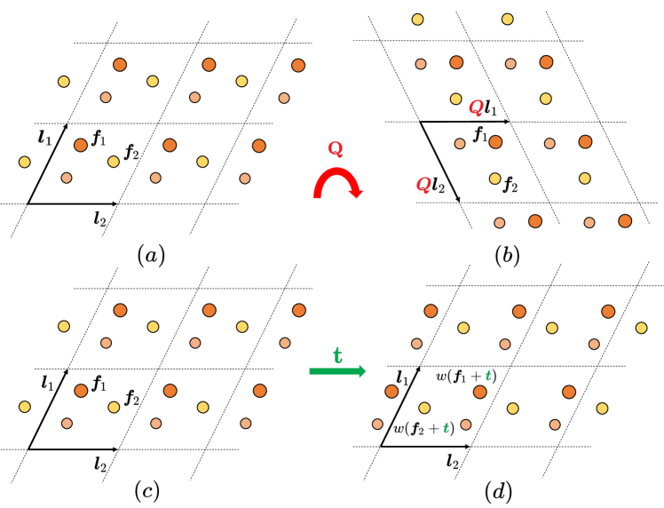
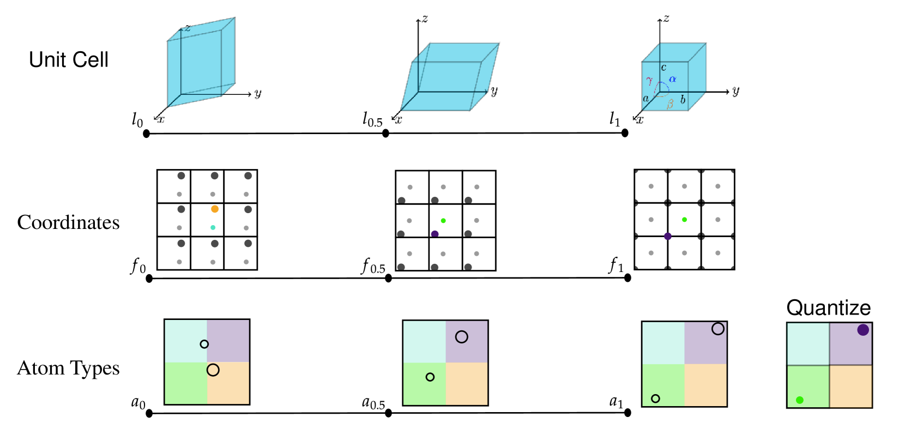
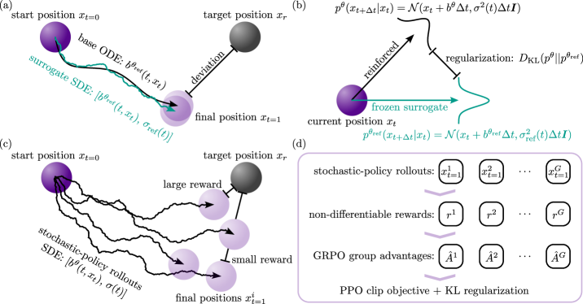
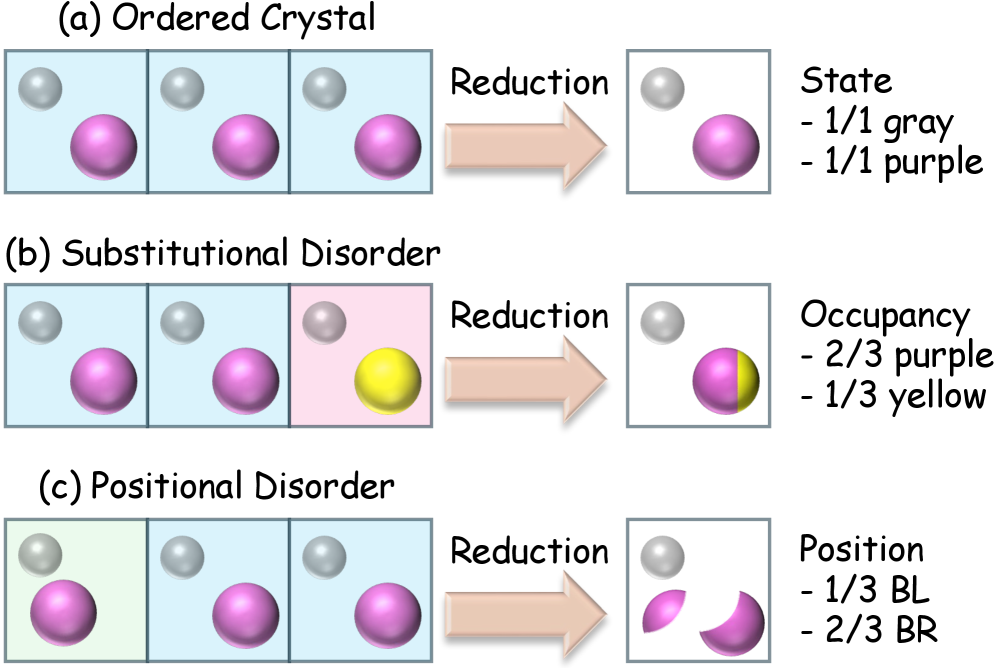

# 等変グラフニューラルネットワークなしで結晶は生成できるか？——軽量拡散Transformerが切り開く材料設計

- **執筆日**: 2026-04-13
- **トピック**: crystal-generation-diffusion-transformer
- **タグ**: Computation and Theory / Nanostructures; Phase Transitions / Machine Learning; Inverse Design
- **注目論文**: Tin Hadži Veljković et al., "Crystalite: A Lightweight Transformer for Efficient Crystal Modeling," arXiv:2604.02270 (2026)
- **参照関連論文数**: 6

---

## 1. なぜ今この話題なのか

材料科学における最大の課題のひとつは、「所望の特性をもつ材料をどうやって見つけるか」という問いである。歴史的には、実験者が試行錯誤によって候補を絞り込むか、第一原理計算（DFT）に基づく高スループットスクリーニングで既知の結晶構造データベースを探索するという手法が主流であった。しかしこのアプローチには本質的な制約がある——探索できるのは「すでに知られている構造の近傍」に限られるのだ。

2022年以降、この状況は劇的に変化しつつある。**生成モデル（generative model）** を用いて、DFTを使わずに安定な結晶構造を直接「生成」する研究が加速しているのだ。特に2023年末にMicrosoftが発表した **MatterGen** （arXiv:2312.03687）は、拡散モデル（diffusion model）を用いて原子種・座標・格子パラメータを同時に生成するアーキテクチャを提示し、「生成された構造が先行手法の2倍以上の確率で新規かつ安定」と示した。この結果は分野に衝撃を与え、多くの後続研究が生まれた。

生成モデルによる結晶設計の魅力は、探索空間の拡大だけではない。特定の特性（バンドギャップ、磁気モーメント、弾性定数など）を条件として与えれば、それを満たす構造を直接出力できる**逆設計（inverse design）**が実現できる点にある。従来のスクリーニングが「出来合いの衣服から選ぶ」作業であるとすれば、生成モデルによる逆設計は「採寸して仕立てる」作業に例えられる。これはバッテリー材料・触媒・半導体・磁性体など、幅広い応用で大きな意義をもつ。

しかし現在の生成モデルにはまだ多くの課題が残っており、特に「生成速度」と「アーキテクチャの複雑さ」が実用化の壁となっていた。この壁に正面から挑んだのが、2026年4月に登場したCrystalite（arXiv:2604.02270）である。本記事では、このCrystaliteを核に、結晶生成AIの最前線を整理し、分野の問いと論点を深掘りする。

---

## 2. この分野で何が未解決なのか

結晶生成AIが急成長する一方で、解決すべき本質的な問いが3つ横たわっている。

**問い①：等変グラフニューラルネットワーク（GNN）は本当に必要か？**

結晶構造には、回転・並進・置換（原子のラベル付けの恣意性）に対する不変性という物理的対称性がある（図1参照）。この対称性を厳密に守るためには、従来は **E(3)等変グラフニューラルネットワーク**（equivariant GNN）が必要とされてきた。代表例が DiffCSP（Jiao et al., 2023）で、格子ベクトルとフラクショナル座標を等変ネットワークで同時拡散する手法を提案した。しかし等変GNNは計算コストが高く、スケールアップが難しい。DiffCSPで1000構造生成するのに237秒、MatterGenでは2639秒かかる。「等変性を保ちながら高速化できないか」というのが一つ目の核心的問いである。

**問い②：生成構造の「安定性」と「多様性」はなぜトレードオフになるのか？**

生成モデルの評価には、**安定性（stability）**・**ユニーク性（uniqueness）**・**新規性（novelty）**——これらをまとめた指標が**SUN（Stable, Unique, Novel）スコア**——が広く使われる。ところが実験によって、安定性の高いモデルほど多様性（novelty）が低下するという逆相関が観察されている。これはモデルが「覚えた組成を繰り返す」傾向——いわば**暗記（memorization）**——に起因する。この安定性と多様性のトレードオフは単純な訓練工夫では解消しきれず、損失関数の設計・評価指標の解釈も含めた根本的な議論が求められている。

**問い③：無秩序（disordered）な結晶をどう生成するか？**

現実の材料、特に固体電解質・合金・触媒材料などには、原子が確率的に異なる位置を占める**置換無秩序（substitutional disorder）** や、原子が確率的に異なる席に配置される**位置的無秩序（positional disorder）** が普遍的に存在する。ところが多くの生成モデルは「完全に秩序だった結晶」のみを扱う。これは実材料への応用可能性を大きく制限する問題である。

---

## 3. 注目論文の核心

**Crystalite**（arXiv:2604.02270、Veljković et al., 2026）は、この3つの問いのうち特に①と②に正面から向き合い、「等変GNNなしで状態最先端の結晶生成が可能」という命題を実証した論文である。

### アーキテクチャの概要

Crystaliteは結晶を $({\bf H}, {\bf F}, {\bf y})$ という3成分のタプルとして表現する。ここで ${\bf H}$ は原子ごとの化学的トークン（連続ベクトル）、${\bf F}$ はフラクショナル座標（周期境界条件を持つ3次元トーラス上の座標）、${\bf y}$ は格子パラメータ（下三角行列の6次元表現）である。モデルは約6700万パラメータの標準的なTransformerブロックを14層積み重ねた構造をもち、適応型レイヤー正規化（AdaLN）でノイズレベルを条件付けする。

### 革新①：サブアトミックトークン化

従来の手法では原子種の表現に89次元以上のone-hotエンコーディングを用いる。これは要素間の化学的類似性を無視するうえ、連続的な拡散過程と相性が悪い。Crystaliteは原子を**34次元の連続ベクトル**で表現する。このベクトルは、周期表における周期・族（グループ）・ブロック（s/p/d/f）・最外殻の電子数（規格化済み）を符号化したものだ。

この工夫の恩恵は大きい。サンプリング時に連続予測を最も近い原子種にデコードする際、「誤るとすれば化学的に置換可能な元素と誤る」という **化学的に整合したエラー分布** が実現される。例えば、FeとCoのような隣接元素を混同することはあっても、FeとUを混同するようなことは起きない。

数式で表せば、各元素 $a$ のトークン ${\bf h}_a$ は

$${\bf h}_a = \text{standardize}\bigl(\text{concat}[\,\text{period}(a),\ \text{group}(a),\ \text{block}(a),\ n_\text{valence}(a)\,]\bigr)$$

のように構成される。標準化とグループサイズによるリバランスを経て、場合によってはPCAで次元圧縮する。

### 革新②：幾何強化モジュール（GEM）

等変GNNが「ネットワークの構造自体」で幾何的対称性を保証するのに対して、Crystaliteは**Attention機構への加算バイアス**として周期的幾何情報を注入するGEMを提案する。

GEMは以下の2種類のAttentionバイアスを構築する。

1. **距離ベースのペナルティ**：周期境界条件下での最小像（minimum image）距離 $d_{ij}$ を計算し、学習可能な単調増加スロープによる距離ペナルティとして付加。近距離の原子ペアにAttentionを集中させる効果がある。

2. **エッジバイアス**：変位ベクトルをFourier変換した特徴量とRBFカーネルエンコードした距離をMLPで処理し、方向性を含む双方向バイアスとして計算。

これら2つのバイアスをスカラーゲーティングで合成し、Attentionスコア $A_{ij}$ に加算する：

$$A_{ij}' = A_{ij} + \gamma_t \cdot b_{\text{dist}}(d_{ij}) + \beta_t \cdot b_{\text{edge}}({\bf r}_{ij})$$

$\gamma_t, \beta_t$ はノイズレベル $t$ に依存する学習済みゲートであり、拡散の進行に応じてバイアスの強度が調整される。GEMは原子-原子間のAttentionにのみ適用され、格子トークンへの入力は対称性の観点から意図的にバイアスをかけない設計になっている。

### 革新③：チャネル別アンチアニーリング

サンプリング時の工夫として、Crystaliteは**チャネル別アンチアニーリング（Channel-wise Anti-annealing）** を提案する。拡散過程を逆転させるリバースサンプリングにおいて、原子種（H）・フラクショナル座標（F）・格子（y）の3チャネルは収束速度が異なる。この手法は各チャネルに独立した「時間ワープ」を適用し、収束の遅いチャネルをより積極的に更新することで、最終的な生成品質を向上させる。

### 実験結果

Crystaliteの性能を定量的に示す（表1）。

**表1：結晶構造予測（CSP）タスクでのマッチ率**

| モデル | MP-20 | MPTS-52 | Alex-MP-20 | 速度（秒/1k構造） |
|--------|-------|---------|-----------|----------------|
| CDVAE | 33.90% | — | — | — |
| DiffCSP | 51.49% | 25.08% | — | 237 |
| MatterGen | 53.9% | — | — | 2,639 |
| **Crystalite** | **66.05%** | **31.49%** | **67.52%** | **22.4** |

de novo 生成（DNG）タスクでは、SUN（安定・ユニーク・新規）スコアが48.55%とベースライン中最高値を達成し、MatterGenの約118倍の速度でサンプリング可能なことが示された。

これらの結果が示す核心メッセージは単純明快だ——「E(3)等変GNNは必ずしも必要ではない。幾何情報をAttentionバイアスとして明示的に注入すれば、標準Transformerでも結晶生成の精度と速度を両立できる」。

---

## 4. 背景と研究史

Crystaliteの登場を正しく理解するには、結晶生成AIがどのような問いに対してどのように発展してきたかを知る必要がある。

### CDVAE：変分自己符号化器の時代

この分野の礎を築いたのは、2022年のXie et al.によるCDVAE（Crystal Diffusion Variational Autoencoder）である。CDVAEは組成（元素の種類と比率）を条件として、潜在空間からのデコード過程でフラクショナル座標に拡散を適用する。アーキテクチャは「Encoder → 潜在空間 → Decoder（拡散）」という2段階構造であり、格子パラメータは別途回帰モデルで予測した。強みは条件付き生成の容易さだが、格子と座標が独立したモデルで生成されるため整合性に課題があった。

### DiffCSP：等変性と結合拡散の両立

2023年NeurIPS採録のDiffCSP（Jiao et al.）は、格子と座標を**一つの等変拡散モデルで同時生成**するという大きな前進を遂げた（図2）。フラクショナル座標には通常のガウス拡散ではなく、周期境界条件を内包したWrapped Normal分布を適用することで、自然な周期性を扱える。等変アーキテクチャには **EGNN（E(n) Equivariant Graph Neural Network）** を採用し、並進・回転・置換の各不変性を厳密に保証した。MP-20データセットでのマッチ率は51.49%（20サンプル中）で、CDVAEの33.90%を大幅に上回った。

DiffCSPの成功は、「等変GNNを使った結合拡散こそが正しい方向性」という印象を与えた。しかしその代償として、モデルの訓練・推論コストが高くなるという問題が残った。

### MatterGen：スケールと制御可能な生成の時代

Microsoftが2023年末に公開したMatterGen（Zeni et al., arXiv:2312.03687）は、CDVAEのエンコーダー部分を完全に除去し、格子・原子種・座標の**3チャネルをすべて統一的に拡散**する設計に進化した。訓練データは60万件超の安定構造（Materials ProjectとAlexandria DB）であり、訓練後にアダプター層を追加することで特定の特性（弾性率、バンドギャップ、磁化など）を目標とする**ファインチューニング**が可能になった。これにより「磁化密度が高くかつサプライチェーンリスクの低い磁性材料」のような複合条件指定も実現した。

MatterGenは生成品質で先行手法を大きく超えたが、推論速度の遅さ（1000構造に2639秒）が実用的な課題として残った。

### FlowMM：拡散からフローマッチングへ

拡散モデルとは別のアプローチとして、2024年のFlowMM（Miller et al., arXiv:2406.04713）は**リーマン多様体上のフローマッチング（Riemannian Flow Matching）** を結晶生成に適用した（図3）。フローマッチングは拡散過程の確率微分方程式（SDE）の代わりに、連続正規化フロー（CNF）による確定的ベクトル場を学習するアプローチであり、スコアベース拡散と比べてサンプリングステップを大幅に削減できる可能性がある。

FlowMMの特徴は基底分布の設計にある。格子長さには対数正規分布を、角度とフラクショナル座標には一様分布を採用することで、化学的に「あり得そうな格子」から出発できる。並進不変性の処理も巧みで、接線空間での平均フラクショナル座標の差し引きにより、周期境界条件下での並進不変性を達成する。実験ではDiffCSPと同等以上の性能を約3倍高速で実現し、「等変GNN + 拡散」以外のルートが機能することを示した点で重要な貢献である。

このように、研究の流れは「CDVAEの2段階VAE → DiffCSPの等変結合拡散 → MatterGenのスケールアップ + アダプター → FlowMMのフローマッチング」と発展し、Crystaliteはこの文脈で「Transformerを核としたさらなる高速化と精度向上」として位置づけられる。

---

## 5. どの解釈が最も妥当か

Crystaliteが提示した「等変GNNなしでも最先端性能が出る」という主張に対して、どこまで確証的でどこに留保が必要か、関連研究との比較を通じて検討する。

### GEMは等変性を「代替」しているのか、それとも「近似」しているのか

等変GNNは数学的に厳密な不変性・等変性を保証する。それに対してGEMが提供するのは「距離と相対位置に基づく注意バイアス」であり、任意の直交変換に対する厳密な等変性は保証しない。ではなぜCrystaliteが優れた性能を出せるのか？

考えられる解釈は次の2つである。

**解釈A（近似等変性で十分説）**：実際の訓練データには有限の対称性クラスしか出現しないため、厳密な等変性よりも「化学的に意味のある近距離相互作用を捉える柔軟性」の方が重要である。GEMは等変性の近似的な代理として十分機能する。

**解釈B（Transformerのスケーリング則説）**：GPTなどの言語モデルと同様に、Transformerはスケールアップによって暗黙的に構造的バイアスを学習できる。GEMはその学習を補助するが、本質はTransformerのスケールにある。

論文内のアブレーションスタディは解釈Aを部分的に支持している。GEMなしのモデルはマッチ率は変わらないが**RMSE（構造精度）が20%悪化**する。つまりGEMは「どの構造に対応するか」ではなく「見つけた構造の精度」を改善している。この結果は「GEMが等変性に代わる役割を果たしている」よりも「GEMが座標の細かい最適化を助けている」という解釈を強く支持する。

### 安定性-多様性トレードオフをどう理解するか

Crystaliteの論文は、訓練初期は安定性が向上し新規性も保たれるが、訓練後期になると組成の**暗記**が始まり新規性が急減することを報告している。この現象はDiffCSP・MatterGenでも同様に観察される一般的な問題であり、原子種チャネルの損失重み付けを下げることで緩和できるが完全には解決しない。

DMFlow（Wu et al., arXiv:2602.04734）は、この問題に対する一つのアプローチを示している。DMFlowは無秩序結晶を扱うためにフローマッチングの新たな変形を提案しているが、その論文中でも「生成分布と訓練分布の乖離をどう評価するか」という問題が議論されている。重要なのは、現在の評価指標（CSPマッチ率、SUN）が「どれだけ訓練データを暗記したか」と「どれだけ新規な安定構造を生成できるか」を十分に分離できていない可能性があることだ。

この問題に対して比較的強く支持される結論は次の通りである——**「SUNスコアは安定性と多様性のバランスを反映する最低限の指標として有用だが、現実的な新材料探索の観点からはLeMat-GenBenchのような多面的評価が必要」**。Crystaliteの論文も、LeMat-GenBenchリーダーボードでの評価で有効性（97.20%）と競争的なSUN（1.50%）を示している。

### OMatG-IRL：RL によるアライメントは補完関係か競合か

OMatG-IRL（Hoellmer & Martiniani, arXiv:2602.00424）は、フローベースの生成モデルに**推論時強化学習（inference-time RL）** を組み合わせることで、特定の特性（エネルギーなど）に向けて生成を誘導する手法を提案した（図4）。この研究は生成モデルの汎化性能を補強するアプローチとして注目される。

OMatG-IRL とCrystaliteは直接競合するわけではなく、補完的な関係にある。Crystaliteは「高速かつ高品質な基礎生成モデル」を提供し、OMatG-IRLのようなRLアライメント層はその上に特性最適化レイヤーとして追加できる。しかし現時点では両者の統合は試みられておらず、「軽量Transformer + RL推論時アライメント」という組み合わせが有効かどうかは未検証の問いである。

### 無秩序材料への応用可能性

DMFlow（図5参照）が示した通り、現実材料の多くは置換無秩序または位置的無秩序を持つ。Crystaliteの現在の実装は完全に秩序だった結晶のみを生成対象としており、この問題に対応していない。

この限界はCrystaliteに限った問題ではなく、拡散ベース・フローベースを問わず多くの生成モデルが共有する課題である。「無秩序構造の確率的表現をどう拡散過程に組み込むか」は2026年時点でもまだ解決途上にあり、DMFlowが一つの解答（確率単体上のリーマンフローマッチング）を提示しているが、そのアプローチが最終的に主流となるかは未確定である。

---

## 6. 何が一般化できるのか

Crystaliteの結果は結晶生成という特定のタスクを超えて、いくつかの重要な一般化可能な知見を示唆している。

### 等変性なしのTransformerは他の材料系に使えるか

Crystaliteが示した「GEMによる幾何バイアス注入」のアイデアは、無機結晶に限らず他の材料系にも原理的に適用できる。例えば有機分子結晶では、分子内の結合情報とともに分子間相互作用（ファンデルワールス力、水素結合）を捉えるバイアスを設計することが求められる。OrgFlow（arXiv:2602.20195）はすでにこの方向——有機結晶のフローマッチング——を探索しており、Crystaliteとのアーキテクチャ統合が今後の課題となろう。

### 条件付き生成への拡張

Crystaliteは現在、組成（元素の種類・比率）を条件として格子と座標を生成するCSPモードと、組成も同時に生成するDNGモードを持つ。しかしMatterGenが示したような「特定の物性を条件とする生成」は現在実装されていない。これはアダプター層（lora的なファインチューニング）を追加することで原理的には実現可能であり、MatterGPT（arXiv:2408.07608）が採用したSLICES表現との組み合わせも興味深い選択肢である。

実際にMatterGPT応用論文（Wu et al., arXiv:2603.13920）では、MatterGPTをフェルミ面付近にエネルギーギャップを持つ**冷却金属（cold metal）**の探索に適用し、148,506個の候補構造から257個の新規冷却金属を発見した。これは「生成モデルがデータベーススクリーニングを超えた探索空間の拡大に実際に使える」ことを示した重要な実証であり、Crystaliteのような高速生成モデルへの需要を後押しするものである。

### 評価基準の標準化と普及

LeMat-GenBench（arXiv:2512.04562）の登場は、結晶生成モデルの評価基準が標準化される方向性を示している。Crystaliteがこのベンチマークで競争力ある結果を出していることは、将来的なモデル比較の文脈で重要である。ただし「ベンチマーク最適化」が目的化する危険——本来の材料探索能力と乖離したベンチマークスコアの追求——は、機械学習研究一般でも問題となっているため注意が必要だ。

### デバイス応用への接続

低消費電力エレクトロニクス向け冷却金属の発見（2603.13920）、バッテリー電解質（FlowMM, 2406.04713で議論）、触媒設計など、生成モデルの応用先は急速に広がっている。DMFlowが示した無秩序結晶生成の能力は、固体電解質（イオン伝導経路の設計）や高エントロピー合金（化学無秩序の制御）への直接応用につながりうる。

---

## 7. 基礎から理解する

このトピックを理解するために必要な基礎概念を丁寧に説明する。

### 結晶構造の数学的表現

結晶構造は**格子（lattice）** と**基底（basis）** の組み合わせで記述される。格子は3つの基底ベクトル ${\bf a}_1, {\bf a}_2, {\bf a}_3$ で定義される周期的な空間分割であり、格子行列 ${\bf L} = [{\bf a}_1, {\bf a}_2, {\bf a}_3]$ で表される。基底は単位胞（unit cell）中に配置された原子の位置を記述し、各原子 $i$ の位置は**フラクショナル座標**（分率座標） ${\bf f}_i \in [0,1)^3$ で与えられる。実空間でのカルテシアン座標との関係は

$${\bf r}_i = {\bf L}\, {\bf f}_i$$

であり、この表現の最大の長所は、フラクショナル座標が格子の変形（格子定数の変化や回転）に対して不変——すなわち周期境界条件を自動的に保つ——ことだ。拡散モデルが座標空間に定義されるとき、カルテシアン座標ではなくフラクショナル座標を使うのが有利なのはこのためである。

### E(3)等変性とは何か

ある関数 $f$ が**E(3)等変（equivariant）** であるとは、入力に対して回転・反転・並進を行ったとき、出力にも対応する変換が作用することをいう。

$$f(R{\bf x} + {\bf t}) = R\, f({\bf x}) + {\bf t}$$

（ただしRは回転行列、tは並進ベクトル）。逆に不変（invariant）とは出力が変換に依存しない場合を指す（例：エネルギーは回転に不変）。結晶生成で等変性が重要なのは、「回転した結晶は同じ物理状態を持つ」という物理的要請を反映するからだ。等変GNNはこの性質をネットワーク構造自体に埋め込む。DiffCSPやMatterGenが採用するEGNN、SE(3)-Transformer、FAENetなどがその代表例である。

Crystaliteの革新は、「等変性をネットワーク構造に埋め込む代わりに、幾何情報をAttentionバイアスとして明示的に与える」ことで、より軽量な標準Transformerで競争力のある性能を達成した点にある。ただし前述のように、GEMは厳密な等変性を保証するわけではなく、その成功の理由を「幾何的近似等変性で十分」と解釈するか「Transformerのスケーリング則による暗黙的学習」と解釈するかは未確定である。

### 拡散モデルの基礎

拡散モデルは、データ ${\bf x}_0$ に徐々にガウスノイズを加える**順方向過程（forward process）**

$$q({\bf x}_t | {\bf x}_0) = \mathcal{N}\bigl({\bf x}_t;\, \sqrt{\bar{\alpha}_t}\,{\bf x}_0,\, (1-\bar{\alpha}_t){\bf I}\bigr)$$

と、ノイズから元のデータを復元する**逆方向過程（reverse process）** を学習する生成モデルである。ここで $\bar{\alpha}_t$ はノイズレベルを制御するスケジュールで、$t = T$ では ${\bf x}_T \approx \mathcal{N}(0,{\bf I})$ となる。逆方向過程のデノイジングモデル $\phi_\theta({\bf x}_t, t)$ は、ノイズ $\boldsymbol{\epsilon}$ の推定（スコアマッチング）または ${\bf x}_0$ の直接推定（v-predictionなど）を学習する。

結晶生成における特殊性は、フラクショナル座標が $[0,1)^3$ のトーラス上に存在するため、通常のユークリッド空間のガウス拡散が使えない点にある。DiffCSPとFlowMMはそれぞれWrapped Normal分布と測地的フローでこれを解決した。Crystaliteでもフラクショナル座標のラップ（周期折り返し）を考慮した損失関数を用いる。

### フローマッチングとの関係

フローマッチング（Flow Matching, FM）は拡散モデルの近縁手法であり、確率微分方程式の代わりに**常微分方程式（ODE）**

$$\frac{d{\bf x}_t}{dt} = u_\theta({\bf x}_t, t)$$

で記述されるフローを学習する。学習目標は条件付きベクトル場の回帰であり、拡散モデルのスコアマッチングと同様の枠組みで訓練できる。一般にFMのほうがサンプリングステップが少なく、訓練も安定しやすい傾向がある。FlowMMやDMFlowはリーマン多様体上のFMを採用しており、結晶のフラクショナル座標（トーラス）や無秩序パラメータ（確率単体）に自然な幾何的構造を与える。

---

## 8. 専門用語の解説

**拡散モデル（diffusion model）**：ノイズ付加と除去の繰り返しによって生成を行う確率的モデル。大規模画像生成（Stable Diffusion等）で有名になったが、現在は結晶・分子・タンパク質構造生成にも広く応用されている。スコアベース生成モデルとも呼ばれる。

**フローマッチング（flow matching）**：確率的微分方程式ではなく常微分方程式で表されるフロー（確率の流れ）を学習する生成手法。拡散モデルに比べてサンプリングステップが少ない利点がある。リーマン多様体への拡張により、球面・トーラス・確率単体などの非ユークリッド空間にも適用できる。

**等変グラフニューラルネットワーク（equivariant GNN）**：入力の回転・並進などに対して出力が対応する変換を受ける性質（等変性）を保証するGNN。原子間力場や構造生成で物理的対称性を守るために用いられる。SE(3)-Transformer、EGNN、FAENetなどが代表例。

**フラクショナル座標（fractional coordinates）**：結晶の格子ベクトルを基底とした座標系で表した原子位置。各成分が $[0,1)$ の値をとり、自動的に周期境界条件を満たす。格子が変形しても原子の相対的な位置を自然に記述できる。

**SUN スコア（Stable, Unique, Novel score）**：生成された結晶構造が、（安定）緩和後にエネルギー的に安定かつ、（ユニーク）生成結果の中で重複がなく、（新規）訓練データに存在しない——この3条件を満たす割合。生成モデルの総合的な性能を表す主要指標の一つ。

**Crystal Structure Prediction（CSP）**：組成（元素種と比率）が与えられたときに、エネルギー的に安定な結晶構造を予測するタスク。生成モデルの重要な評価ベンチマークであり、マッチ率（既知構造との一致度）で評価される。

**空間群（space group）**：結晶が持つ対称性の全体を記述する群。並進対称性・回転・反転・らせん操作などを組み合わせた230種類が存在する。空間群を条件とした生成は、特定の構造クラス（ペロブスカイト型など）への誘導に重要。

**Wyckoff 位置（Wyckoff position）**：各空間群において原子が占めることのできる対称的な位置の種類。ある空間群においてどのWyckoff位置を占めるかを指定することは、原子位置の自由度を大幅に削減する。WyckoffDiff等の生成モデルはこれを明示的に利用する。

**置換無秩序（substitutional disorder）**：一つの格子点に複数種の原子が確率的に配置されている状態。例えばペロブスカイト酸化物のA-siteに異なる希土類元素が混在する場合など。通常の生成モデルが苦手とする実材料の特性で、DMFlowが新たに取り組んだ問題領域。

**逆設計（inverse design）**：所望の物性を与えて、その物性を持つ物質の構造・組成を求める設計手法。順方向のスクリーニング（候補を列挙して計算で評価）と対比される。条件付き生成モデルがこれを可能にし、MatterGenやMatterGPTが代表的な実装例。

---

## 9. 今後の展望

Crystaliteの登場は、結晶生成AIの一つの成熟段階を示すものである。「等変GNNが必要か？」という問いに対して「必ずしも必要ではないが、幾何情報の明示的な注入は有効」という実証的な答えが得られた。そして生成速度がMatterGenの118倍になったことで、「生成モデルを材料探索の日常的ツールとして使う」ための技術的ハードルが大きく下がった。今かなり確からしくなったことは、（1）Transformerが等変GNNの有力な代替となること、（2）SUNスコアを主指標としつつLeMat-GenBenchのような多面的評価が有効なこと、（3）フローマッチングと拡散モデルが拮抗する性能水準に達していること、の3点である。MatterGPTを用いた冷却金属探索（2603.13920）は、これらのモデルが実際の材料発見に使えることの具体的な証拠でもある。

一方で、まだ未確定なこと・これから重要になることは多い。最大の課題は**無秩序構造の一般的な生成**であり、DMFlowのアプローチが固体電解質や高エントロピー合金設計へ実際に役立つかどうかの検証が待たれる。また、OMatG-IRLが示した「推論時RLによるアライメント」とCrystaliteのような高速基礎モデルの統合、さらには「生成モデルが提案する構造をどこまで信頼してDFT計算を省略できるか」という実験的検証が今後1〜3年の重要な論点となろう。空間群条件付き生成（WyckoffDiff等）との融合、長距離クーロン相互作用をどう表現するか（MACE-POLARなどの電荷考慮型MLIPとの接続）、そして生成モデルと基礎モデルとしてのML原子間ポテンシャル（MACE-MP-0等）の統合的な設計が、次の展開として有望な方向性である。

---

## 参考論文一覧

1. **[Crystalite]** Tin Hadži Veljković et al., "Crystalite: A Lightweight Transformer for Efficient Crystal Modeling," [arXiv:2604.02270](https://arxiv.org/abs/2604.02270) (2026) — 本記事の注目論文。Subatomic TokenizationとGEMを組み合わせ、等変GNN不要でCSP・DNG双方で最先端性能と最速サンプリングを達成した。

2. **[DiffCSP]** Rui Jiao et al., "Crystal Structure Prediction by Joint Equivariant Diffusion," [arXiv:2309.04475](https://arxiv.org/abs/2309.04475) (NeurIPS 2023) — 格子とフラクショナル座標を等変拡散で同時生成する先駆的手法で、CSP分野のベンチマークを大きく前進させた。

3. **[MatterGen]** Claudio Zeni et al., "MatterGen: a generative model for inorganic materials design," [arXiv:2312.03687](https://arxiv.org/abs/2312.03687) (2024) — MicrosoftのVAE-free拡散モデルで、アダプター層を使った多目的特性制御の逆設計を実現し分野に衝撃を与えた。

4. **[FlowMM]** Benjamin Miller et al., "FlowMM: Generating Materials with Riemannian Flow Matching," [arXiv:2406.04713](https://arxiv.org/abs/2406.04713) (2024) — リーマン多様体上のフローマッチングを結晶生成に適用し、拡散モデルに比べて約3倍の高速化と同等以上の性能を示した。

5. **[DMFlow]** Liming Wu et al., "DMFlow: Disordered Materials Generation by Flow Matching," [arXiv:2602.04734](https://arxiv.org/abs/2602.04734) (2026) — 置換無秩序・位置無秩序を含む現実的な結晶の生成フレームワークを提案し、フローマッチングを確率単体上のリーマン多様体に拡張した。

6. **[OMatG-IRL]** Philipp Hoellmer and Stefano Martiniani, "Open Materials Generation with Inference-Time Reinforcement Learning," [arXiv:2602.00424](https://arxiv.org/abs/2602.00424) (2026) — フローベースの結晶生成モデルに推論時RLを組み込む手法を提案し、速度-品質トレードオフのさらなる改善を達成した。

7. **[Cold Metals]** Kedeng Wu et al., "Generative Inverse Design of Cold Metals for Low-Power Electronics," [arXiv:2603.13920](https://arxiv.org/abs/2603.13920) (2026) — MatterGPTとSLICES表現を使い、フェルミ面付近のエネルギーギャップを持つ冷却金属257種を発見した逆設計の実例。
