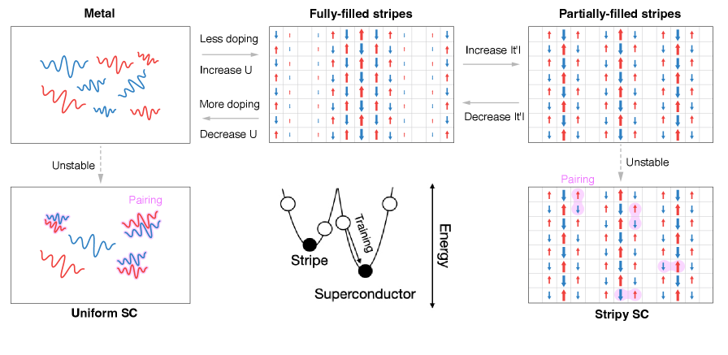
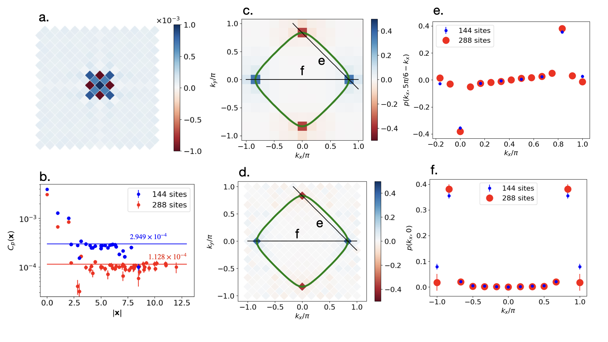
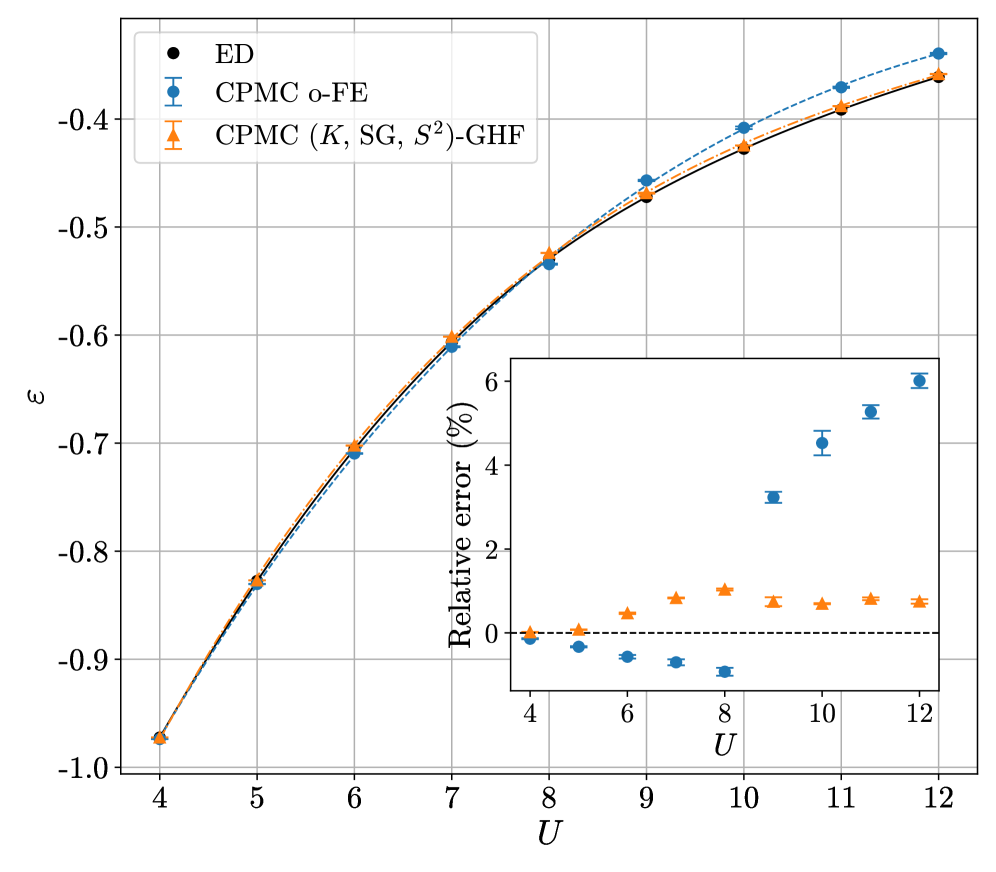

# フェルミオン符号問題を突破する：ドープHubbard模型で探るd波超流動密度ドームの全貌

- **執筆日**: 2026-04-11
- **トピック**: ドープHubbard模型のd波超伝導とDQMCにおける符号問題の克服
- **タグ**: Superconductivity and Strongly Correlated Systems / Spin Liquids and Quantum Many-Body Systems; Phase Transitions / Monte Carlo
- **注目論文**: Wang & Lin, "Sign-Free Evidence for a d-Wave Superfluid Stiffness Dome in the Doped Hubbard Model," arXiv:2604.01737 (2026)
- **参照関連論文数**: 7

---

## 1. なぜ今この話題なのか

銅酸化物高温超伝導体（cuprate）の発見から40年近くが経った今も、その超伝導メカニズムは物性物理学の最大の謎のひとつであり続けている。La₂₋ₓSrₓCuO₄ や Bi₂Sr₂CaCu₂O₈₊δ に代表される cuprate は、液体窒素温度（77 K）を超える高い転移温度 $T_c$ を持ち、フォノン媒介の BCS 理論では到底説明できない。電子間の強いクーロン斥力（強相関）が本質的な役割を担うと考えられており、その理論的記述の出発点として最も広く使われているのが**Hubbard模型** (Hubbard model) である。

Hubbard模型は、格子上の電子をホッピング項 $t$（電子の量子トンネル）とオンサイトクーロン斥力 $U$ だけで記述するシンプルな模型である：

$$H = -t\sum_{\langle i,j\rangle,\sigma}(c^\dagger_{i\sigma}c_{j\sigma} + \text{h.c.}) + U\sum_i n_{i\uparrow}n_{i\downarrow} - \mu\sum_{i,\sigma}n_{i\sigma}$$

ここで $c^\dagger_{i\sigma}$（$c_{i\sigma}$）は電子の生成（消滅）演算子、$n_{i\sigma} = c^\dagger_{i\sigma}c_{i\sigma}$ は占有数演算子、$\mu$ は化学ポテンシャル（ドーピング量を制御する）である。モデルの単純さにもかかわらず、ハーフフィリング（格子サイト当たり1電子）から電子を引き抜く（正孔ドープ）と、反強磁性絶縁体・擬ギャップ相・d波超伝導・奇妙金属など、cuprate の実験相図を想起させる豊かな競合相が現れることが数値計算で示唆されてきた。

「示唆」という言葉を使ったのは理由がある。Hubbard模型が実際に d 波超伝導の基底状態を持つかどうかを、数値的に厳密に証明することは極めて困難だった。この困難の核心にあるのが、**フェルミオン符号問題 (fermion sign problem)** である。強相関電子系の最強の数値手法である**行列式量子モンテカルロ法 (Determinant Quantum Monte Carlo, DQMC)** は、ドープされた系では計算精度が低温で指数関数的に悪化するという根本的な障害を抱えてきた。

2026年4月、Xidi Wang と H. Q. Lin は DQMC の計算枠組みの中で符号問題を根本的に迂回する**有効ハミルトニアン $K_\text{eff}$ アプローチ**を提案し、cuprate 的なパラメータのドープ Hubbard 模型において d 波超流動密度ドームが存在するという初めての「符号自由な」証拠を示した（arXiv:2604.01737）。この論文は、30年以上 DQMC 研究者を悩ませてきた符号問題を新たな角度から突破し、高温超伝導の数値的理解に向けた重要な一里塚を刻む成果として注目される。

---

## 2. この分野で何が未解決なのか

ドープ Hubbard 模型と d 波超伝導を巡る本質的な問いは、複数の軸で整理できる。

**問い①：ドープ Hubbard 模型は熱力学的極限で真の d 波超伝導基底状態を持つのか？**

この問いに対する答えは、驚くほど長い間「曖昧」なままだった。平均場理論や乱位相近似 (RPA) は d 波ペアリングを予言するが、強相関領域では近似の精度そのものが問題になる。DMRG（密度行列繰り込み群）は円筒形有限系での高精度計算を実現したが、長距離超伝導秩序の評価には系サイズの壁がある。最近では神経量子状態（NQS）を使った変分 Monte Carlo（2511.07566）が 288 格子点規模での d 波ペアリングの存在を強く示唆したが、変分計算には必ず「局所極小に落ちていないか」という疑問が付きまとう。有限温度計算ができる DQMC が符号問題なしにこの問いに答えられれば、それは質的な前進である。

**問い②：d 波超伝導とストライプ相はどのような条件で競合・共存するのか？**

実験では、cuprate の多くの系でストライプ（電荷・スピンが空間的に周期的に分布する状態）が観測されており、超伝導と競合するという描像がある。NQS 計算（2511.07566）は次隣接ホッピング $t'/t$ の値に応じて「充填ストライプ（超伝導なし）」と「半充填ストライプ（超伝導共存）」が入れ替わることを示したが（図1参照）、真の基底状態の判定はモデルパラメータに鋭く依存する。ドーピング量・$t'$・$U$ の三次元パラメータ空間で超伝導ドームの位置と形状を系統的に決定することは未達成の課題である。

**問い③：符号問題は本質的なのか、それとも計算上の便宜の問題なのか？**

符号問題は数学的には NP 困難問題と等価とされるが、特定のモデルや観測量に対しては「符号問題フリー」な計算が存在する（ハーフフィリング Hubbard、特殊なビリヤード格子など）。近年はバイアス付きの AFQMC（補助場 QMC）や CPMC（制約経路 QMC）がドープ系にも適用されているが、試験波動関数の選択に依存するバイアスは避けられない。符号問題を「バイアスを導入せずに」迂回する方法の開発は分野全体の課題であり、Wang & Lin のアプローチはこの方向での新たな可能性を示す。

**問い④：超流動密度のドームはどのような機構で形成されるのか？**

cuprate 実験では転移温度 $T_c$ と超流動密度 $\rho_s(0)$ が比例するという Uemura 関係が知られており、underdoped 領域では $T_c$ がペアリング強度ではなく位相コヒーレンスの確立によって制限されると解釈されている。しかし Hubbard 模型の計算でこの「ドーム型 $\rho_s$」が符号問題なしに示されたことはなく、「ドームがフェルミ面幾何によって決まるのか、スピン揺らぎの強さによって決まるのか」という機構論的な問いも未解答のままだった。

---

## 3. 注目論文の核心：何が前進し、何がまだ仮説か

Wang と Lin の論文（2604.01737）が達成した最大の前進は、DQMC の伝播行列に**行列対数（matrix logarithm）**を適用することで「乗法的な符号問題」を「加法的な揺らぎ」に変換し、符号に依存しない有効ハミルトニアン $K_\text{eff}$ を構成したことである。

### $K_\text{eff}$ の構成原理：対数が符号問題を消す

通常の DQMC では、虚時間 $\beta = 1/k_BT$ にわたる伝播行列 $B(\beta, 0) = \prod_\tau e^{-\Delta\tau V(\tau)}e^{-\Delta\tau K}$ を計算する。ここで問題が二つある。第一に、$B(\beta, 0)$ の条件数（最大固有値と最小固有値の比）が $e^{\beta W}$（$W$ は帯域幅 $W \approx 9.2t$）のスケールで指数増大し、$\beta = 16$, $L = 12$ のパラメータでは $10^{64}$ に達して数値精度が崩壊する。第二に、HS（ハバード・ストラトノビッチ）補助場の配位によって行列式の符号が揺れ、モンテカルロ平均の信号対雑音比が指数的に悪化する（符号問題）。

Wang & Lin のアイデアは、伝播行列全体の代わりに、$n_c = 5$ 程度の小さなチャンクごとに**対数を取ってから平均する**ことだ：

$$K_\text{eff} = -\frac{1}{n_c\Delta\tau}\langle \log B_\text{chunk} \rangle_\text{MC}$$

このアプローチには二つの独立な利点がある。まず数値安定性の面では、各チャンクの条件数は $e^{n_c\Delta\tau W} \approx 10$ 程度に収まり、精度崩壊が回避される。次に符号問題の面では、積の符号揺らぎ（乗法的問題）が対数を取ることで加法的な揺らぎに変換され、中心極限定理（Central Limit Theorem）により Monte Carlo 平均が安定化される。著者らは実際に、正の符号と負の符号を持つ配位から独立に構成した $K_\text{eff}$ の固有値が 1\% 未満の精度で一致することを確認し、$K_\text{eff}$ の「符号独立性」を実証している。

### 三つの符号自由な物理量が示す一貫した描像

$K_\text{eff}$ は「補助場配位の典型的な集合で平均した有効一粒子ハミルトニアン」と解釈でき、電子相関（自己エネルギー）が繰り込まれた「ドレスト（dressed）準粒子バンド構造」 $\varepsilon(k)$ を与える。このバンド構造から三つの観測量が引き出される。

**ギャップ比 $R_g = |\varepsilon(\pi/2,\pi/2)|/|\varepsilon(\pi,0)|$：** 準粒子エネルギーの比で、値が 1 を超えると d 波型擬ギャップ（節点より反節点でのギャップが大きい）を意味する。計算では全ドーピング域で $R_g \approx 1.55$–$1.65$ と 1 より有意に大きく、温度変化に対してほぼ一定である（$T < T^*$ で）。これは、d 波擬ギャップが超伝導秩序変数の前兆ではなく、正常状態バンド構造そのものに「焼き込まれた」特性であることを示している。アンチノードでは $\Sigma(\pi,0) = -0.19t$（フェルミ準位に引き寄せられる）、節点では $\Sigma(\pi/2,\pi/2) = +0.09t$（フェルミ準位から押し出される）という方向性の自己エネルギーが d 波異方性の起源である。

**超流動密度 $\rho_s$：** $K_\text{eff}$ から得られるドレスト準粒子の反磁性応答量で、ドーピング量に対してドーム型の振る舞いを示す。系サイズ $L = 8, 10, 12$ で一致するドーム構造が確認されており、最適ドープ付近（$\mu/t \approx -0.90$）でのピーク値は BKT 臨界条件 $\rho_s^\text{BKT} = 2T/\pi$ の 5〜7 倍に達する。この「BKT 閾値をはるかに超える」という事実は、この温度域・ドープ域で系が 2次元 BKT 超伝導転移に近いことを強く示唆している。

**反強磁性構造因子 $S(\pi,\pi)$：** $(\pi,\pi)$ 波数でのスピン-スピン相関の指標。これがドーピング量にほぼ依存せず平坦であることは決定的な重要性を持つ。もしスピン揺らぎの強さがドームを作っているなら $S(\pi,\pi)$ もドーム型になるはずだが、実際には平坦だ。著者らはこの事実から「ドームの形状はフェルミ面幾何が一様なスピン揺らぎに応答することで決まる」と結論する。この「媒体一様・幾何が決める」描像は、スピン揺らぎ媒介 d 波超伝導理論の特定の側面を定量的に支持している。

### 前進したことと仮説のままのこと

この論文が確かに前進させたのは、DQMC の枠組みで追加近似なしに符号問題を迂回できる $K_\text{eff}$ 手法の確立と、d 波擬ギャップ・超流動密度ドーム・スピン揺らぎ一様性という三つの観測量の整合性の実証である。一方で、$K_\text{eff}$ は異常グリーン関数（ペア振幅 $\langle c_{i\uparrow}c_{j\downarrow}\rangle$）を構造上持たないため、「本当の超伝導秩序パラメータが有限か」という直接的な問いには答えていない。超流動密度ドームは「超伝導への近接性」の証拠であり、長距離超伝導秩序の確立を直接示すものではないことには注意が必要だ。より大きな系サイズでの有限サイズスケーリング解析、ならびに $U/t$ のより広い範囲での計算が今後の重要な検証課題として残る。

---

## 4. 背景と研究史：この論文はどこに位置づくか

DQMC の歴史は 1980 年代の Blankenbecler, Scalapino, Sugar らによる定式化に遡る。補助場のハバード・ストラトノビッチ変換により電子間相互作用をスカラー場との結合に置き換え、電子の自由度を厳密に積分消去することで分配関数を補助場配位上の行列式の積として書き、モンテカルロ法でサンプリングするという基本思想は40年間変わっていない。ハーフフィリング正方格子 Hubbard 模型では粒子正孔対称性により $\det M_\uparrow = \det M_\downarrow \geq 0$ が保証され符号問題がなく、反強磁性 Mott 絶縁体や Mott 転移の研究に多大な成果をあげてきた。

ドープ系への DQMC 適用には 1990 年代から取り組まれてきたが、符号問題に阻まれて低温での定量的な計算は困難だった。この問題への主要なアプローチが「バイアスと引き換えに符号問題を解消する」手法群である。**補助場 AFQMC（Auxiliary-Field QMC）** は重要度サンプリングと試験波動関数による拘束経路近似（phaseless approximation）を組み合わせて符号問題を排除し、分子系から固体の Hubbard 模型まで広く適用されている。近年では等尺テンソル超縮約（Isometric Tensor Hypercontraction, ITHC）による計算コスト削減も提案されており（2604.02054）、系統的な改善が進んでいる。**制約経路 QMC（CPMC）** は磁場下や幾何学的フラストレーション系への適用も試みられており、三角格子 Hubbard 模型への最新の適用（2603.14808, Ung et al., 2026）では対称適応された試験波動関数（スピン射影・空間群射影・複素共役対称性の投影を施した一般化ハートリーフォック GHF）の使用が、$U \geq 8$ での精度を大幅に向上させることが示された。

**図1.** 2次元正方格子 Hubbard 模型における相の競合の概念図（2511.07566より、CC BY 4.0）。右上から最適化を出発すると反強磁性ストライプ秩序（充填ストライプ、上部）が現れ、右下から出発すると超伝導と共存した半充填ストライプ（下部）へと最適化される。中央のエネルギーランドスケープの模式図は、ストライプと超伝導が局所極小を形成し、$t'$ の値がどちらが真の基底状態かを決定することを示す。ランダムな初期状態から最適化したニューラル量子状態（左上・左下）は最終的にいずれかの秩序へと収束する。

一方、**ニューラル量子状態（NQS）を用いた変分 Monte Carlo（VMC）** は 2020 年代に入って急速に発展した。Roth et al.（2511.07566, Nov. 2025）は Pfaffian 型 NQS を使い、288 格子点の正方格子 Hubbard 模型で d 波超伝導の証拠を示した。この研究の方法論的な貢献は、実空間でのペアリング振幅が小さくなる傾向を避けるため、「運動量空間でのペアリング相関関数 $p(k)$」という系サイズ不変量を新たに定義したことにある（後述 Section 5 参照）。また $t'/t$ の役割を系統的に調べ、$|t'|/t > 0.1$ で「充填ストライプ（非超伝導）→半充填ストライプ（超伝導共存）」の転移が起きることを示した。

低温での DQMC の数値安定性という技術的問題にも最近大きな進展があった。Luu et al.（2604.00815, April 2026）は UDT（ユニタリ・対角・三角）行列分解を再帰的に適用することで、グラフェン系において $\beta \approx 90$（室温相当）まで安定な DQMC シミュレーションを実現した。この手法が示したのは、$O(N_x^3 N_t)$ の計算コストを維持しながらも行列演算の数値精度を系統的に保つ設計原理である。Wang & Lin の $K_\text{eff}$ アプローチがチャンク分割によって条件数問題を迂回したのに対し、Luu et al. は行列分解の精緻化によって正面から数値安定性を確保するという対照的な方向性を示している。

この文脈で 2604.01737 を位置づけると、AFQMC/CPMC（バイアスあり・符号問題なし）でも NQS（変分・基底状態限定）でもない「第三の道」として、有限温度での DQMC フレームワーク内で追加近似なしに符号自由な計算を行う初めての実用的手法として登場したと言える。

---

## 5. どの解釈が最も妥当か：証拠・比較・限界

### 三角形の整合：$K_\text{eff}$、NQS、CPMC が示す同じ方向性

最も重要な観察は、互いに独立な三つのアプローチが同一の方向性を示している点である。$K_\text{eff}$ DQMC（2604.01737）は有限温度で d 波擬ギャップと超流動密度ドームを符号自由に計算する。NQS VMC（2511.07566）は基底状態変分計算で d 波ペアリング相関の系サイズ不変性を示す。CPMC（2603.14808, 2603.25858）は試験波動関数を用いた地道なバイアス低減でエネルギーの定量的精度を高めながら強相関系への適用範囲を拡大する。これらが同じパラメータ域（正方格子、ドープ系、$U/t \sim 4$–8）で整合的な描像を示すことは、「符号問題さえ解決できれば答えが出る」というリスクを大幅に低下させた。

**図2.** NQS 変分 Monte Carlo による 2D Hubbard 模型の d 波ペアリング相関（2511.07566より、CC BY 4.0）。（a）: 実空間でのペアリング相関（d 波パターン）。（c, d）: フェルミ面（ダイヤモンド形）上でのペアリング相関の符号構造。$e$ 領域（正値）と $f$ 領域（負値）の交代が d 波対称性 $\Delta_k \propto \cos k_x - \cos k_y$ を反映している。（e, f）: 144 サイト（青◇）と 288 サイト（赤●）での運動量空間ペアリング相関関数 $p(k)$ の比較。系サイズを 2 倍にしても $p(k)$ がほぼ一致する「系サイズ不変性」が、d 波超伝導の強力な証拠となっている。

### $K_\text{eff}$ 解釈の強みと限界

**強み：** 有限温度での計算が符号問題なしにできるため、BKT 転移温度の見積もりに必要な $\rho_s(T)$ の温度依存性を追跡できる。三つの独立な観測量（$R_g$, $\rho_s$, $S(\pi,\pi)$）が整合的なスピン揺らぎ媒介超伝導の描像を与えている。ギャップ比 $R_g$ が温度依存しないことは「擬ギャップが正常状態バンド構造に属する」という解釈を強力に支持し、それが超伝導ゆらぎの結果か競合秩序の結果かという問いに答えを与える。

**限界：** $K_\text{eff}$ は一体的な有効ハミルトニアンであり、構造上異常グリーン関数（ペア振幅 $\langle c_{i\uparrow}c_{j\downarrow}\rangle$）を持たない。したがって「ペアリングが起きているかどうか」を直接見るのではなく、ペアリングの「反磁性的な側面（超流動密度）」と「ギャップの対称性」を間接的に見ているに過ぎない。より適切には、$\rho_s$ は「超伝導転移への近接性」の指標であり、熱力学的相転移の確立には $L \to \infty$ 極限での系統的なスケーリング解析が必要だ。

### NQS との定量的な比較：どこで一致し、どこで食い違うか

$K_\text{eff}$ 計算は $U/t = 4$, $t'/t = -0.30$ を採用しているのに対し、NQS 計算（2511.07566）で d 波が明確に見えるのは $U/t = 8$, $t'/t = -0.30$ の強結合域が主であり、$t' = 0$ では $U/t = 4$ の中間結合域でも証拠が得られている。定性的方向性（$t' < 0$ が d 波安定化に寄与、ドーム型 $\rho_s$ の存在）は一致しているが、超伝導が出現するパラメータ空間の境界については定量的な相違が残る。特に $t'$ の閾値については NQS では $|t'|/t > 0.1$ と明示されているが、$K_\text{eff}$ 計算では $t' = -0.30$ という単一点のみで d 波が確認されており、$|t'|$ がより小さい場合にどうなるかは未検討である。

### CPMC ベンチマークが示す方法論的教訓

Roberts et al.（2603.25858）は CPQMC でのペアリング相関の計算手法を比較した。「バックプロパゲーション法」は超伝導相関を系統的に過小評価する傾向があり、「制約解除法」は精確な結果を与えるが符号問題を再導入するというジレンマを明らかにした。これは QMC 計算においてある特定の物理量の精度追求が常に何らかのトレードオフを伴うことを示すものであり、$K_\text{eff}$ アプローチが超流動密度を見ているとはいえ直接のペアリング振幅を見ていないことと並行する困難として理解できる。

**図3.** 三角格子 Hubbard 模型（半充填）における CPMC のエネルギー精度（2603.14808より、CC BY 4.0）。縦軸はサイト当たりエネルギー $\varepsilon$、横軸は相互作用強度 $U$（ホッピング単位）。黒点が厳密対角化 (ED)、青◇が通常の自由電子基底試験関数を用いた CPMC（o-FE）、橙★が対称射影 GHF 試験関数を用いた CPMC（$(K,\text{SG},S^2)$-GHF）。挿入図の相対誤差 (%) を見ると、$U \geq 8$ で通常試験関数の誤差が急増（最大 6%）するのに対し、対称射影試験関数は $U = 12$ でも 1% 未満に抑制される。試験波動関数の対称性が QMC 精度の鍵を握ることを実証する結果であり、$K_\text{eff}$ アプローチとは異なる方向からの CPMC 精度向上を示す。

### スピン揺らぎ描像の証拠の強さと残る不確定性

$K_\text{eff}$ 論文が主張する「スピン揺らぎ媒介の d 波超伝導」は、$S(\pi,\pi)$ のドーピング不依存性（一様なスピン揺らぎ）と $\rho_s$ のドーム（フェルミ面幾何の役割）という整合性ある証拠に支えられている。また電子ドープ Hubbard 模型の DQMC 研究（2510.16616）が「正孔ドープより電子ドープで d 波 SC シグナルが明確」という非対称性を示したことも、$t'$ の符号依存性と整合する。一方で「スピン揺らぎが時間・空間的にどう広がっているか」という動的なスペクトル構造は $K_\text{eff}$ の静的描像には含まれず、この点の定量的検証は今後の課題として残る。光学 Hall 伝導率の符号問題フリー計算（2602.17959）はこの方向への一歩であり、スピン揺らぎの動的構造因子と輸送特性の相関を追跡する研究が重要になる。

---

## 6. 何が一般化できるのか：材料・手法・応用への広がり

### 正方格子を超えた適用：幾何学とフラストレーション

$K_\text{eff}$ アプローチは Hubbard 模型の格子依存性によらず原理的に適用可能であり、三角格子への拡張は自然な次ステップである。三角格子では幾何学的フラストレーションにより $(0,0) \to (\pi,0)$ 方向の反強磁性揺らぎが弱まり、代わりに 120° ネール秩序と関連したスピン揺らぎが優勢になる（2603.14808）。この異なるスピン揺らぎのモードが d 波超伝導ドームをどう変形させるかは、「ペアリングの糊はどのモードか」という普遍的な問いに答える舞台となる。有機超伝導体（$\kappa$-BEDT-TTF 塩など）の三角格子型 Hubbard 模型への適用も視野に入る。

### ニッケレートと多バンド拡張

2023 年の La₃Ni₂O₇ の 80 K 超伝導発見（高圧下）は、cuprate に次ぐ高温超伝導の新クラスとして急速な関心を集めた。この系の超伝導対称性（$d$-wave か $s^\pm$-wave か）を巡る理論研究が活発化しており、2バンド $t$-$J$ 模型や Hubbard-Kanamori 模型への QMC 適用が始まっている。Sibo Guo et al.（2601.13108）の「対称質量生成（SMG）絶縁体をドープした際の超伝導」は、Hubbard 反発がむしろ超伝導を強化するという反直感的な結果を示しており、ニッケレートへの接続も示唆される。$K_\text{eff}$ をマルチバンド DQMC に拡張することで、複数のニッケル $d$ 軌道が絡む問題への精密計算が可能になる。

### 電子フォノン混合系への展開

DQMC は電子-格子振動（フォノン）を含む系にも自然に適用できる。Casebolt et al.（2604.04123）は三角格子上の光学的 Su-Schrieffer-Heeger (SSH) モデルを DQMC で研究し、1/4充填では Bond-Order-Wave (BOW) 絶縁体、3/4充填ではフォノンエネルギーに依存して BOW と $s$ 波超伝導の競合を示した。注目すべきは、超伝導傾向がホッピングの大変位時の符号変化と関連するという報告で、これは電子相関とフォノンの非線形結合が新しい種類の超伝導ドームを生む可能性を示唆する。$K_\text{eff}$ をフォノンモードを含む系に拡張することで、電子相関由来の d 波とフォノン由来の $s$ 波の混合競合を温度・ドープの関数として追跡することができる。

### 数値安定性の向上と低温限界の拡大

Luu et al.（2604.00815）が実現した UDT 分解による $\beta > 90$ の安定 DQMC は、$K_\text{eff}$ 計算の現在の動作範囲（$\beta \lesssim 16$）を大幅に拡張する可能性を持つ。低温極限での $\rho_s$ の収束をより精確に追跡することで BKT 転移温度の定量的評価が可能になり、Uemura 関係の数値的検証が達成できる。両手法の組み合わせは、次のフロンティアとして強く期待される方向性である。

### NQS と DQMC のハイブリッド化

現時点では NQS VMC（2511.07566, 2604.06841）と DQMC は独立した手法として使われているが、将来的なハイブリッド化の可能性が示唆されている。NQS を AFQMC/CPMC の試験波動関数として使用することで、バイアスをさらに低減できると期待される。逆に $K_\text{eff}$ を教師あり学習で近似するニューラルネット型有効ハミルトニアンも構想されており、DQMC の計算コストを大幅に削減できる可能性がある。強相関系の数値計算においては、「モンテカルロ的サンプリング」と「機械学習的表現能力」の融合がこれからの主流になると見られている。

---

## 7. 基礎から理解する

### Hubbard 模型と電子相関のエッセンス

「なぜ Hubbard 模型が難しいのか」を理解することが出発点である。非相互作用（$U = 0$）の場合、電子は波数 $k$ で特徴づけられ、バンド理論で完全に記述できる。相互作用（$U > 0$）を加えると、ある格子点に電子が 2 個入るコスト $U$ が生じ、電子の動きに「他の電子がどこにいるか」への依存性が生まれる。これが「多体相関」であり、解析的にも数値的にも扱いが極端に難しくなる要因だ。Hilbert 空間の次元は格子点数 $N$ に対して指数関数的（$\propto 4^N$）に増大し、$N = 30$ 程度でさえ全状態の厳密な保持は不可能である。

### DQMC の基本的な流れ

DQMC の目標は、分配関数 $Z = \text{Tr}[e^{-\beta H}]$ から物理量の熱平均を計算することである。鈴木-トロッター分解により $e^{-\beta H}$ を $L_\tau = \beta/\Delta\tau$ 個の演算子の積に書き、各スライスで**ハバード・ストラトノビッチ (HS) 変換**を行う：

$$e^{-\Delta\tau U n_{i\uparrow}n_{i\downarrow}} = \frac{1}{2}\sum_{s_i = \pm 1} e^{\lambda s_i(n_{i\uparrow} - n_{i\downarrow})}$$

ここで $\lambda = \text{arccosh}(e^{\Delta\tau U/2})$ である。各時刻・各サイトで離散補助場 $s_i(\tau) = \pm 1$ が導入される。この変換のポイントは、元々「四次形式」だった電子間相互作用 $Un_{i\uparrow}n_{i\downarrow}$ が、補助場を所与としたときには「二次形式（一体問題）」になることだ。電子の自由度を積分消去すると、

$$Z = \sum_{\{s\}}\det M_\uparrow[\{s\}] \cdot \det M_\downarrow[\{s\}]$$

という形になる。右辺は全補助場配位 $\{s_i(\tau)\}$（合計 $N \times L_\tau$ 個のビット列）についての和であり、各配位に対応する重みが行列式の積で与えられる。この重み（正・負の実数）を「確率」に見立てて Monte Carlo サンプリングを行うのが DQMC の核心である。

**符号問題**が生じるのは、この重みが負になりうるからだ。ハーフフィリングの正方格子では粒子正孔対称性から $\det M_\uparrow = \det M_\downarrow \geq 0$ が保証されるが、ドープ系ではこの対称性が破れ $\det M_\uparrow \cdot \det M_\downarrow$ が負になる配位が現れる。符号が揺れると、大きな正と負の寄与の差引きによって物理量を計算することになり、統計誤差が

$$\delta\langle O \rangle \propto \frac{1}{\langle \text{sign}\rangle} \propto e^{\beta N \Delta f/2}$$

のように指数増大する（$\Delta f$ は自由エネルギー密度差、$N$ はサイト数）。$\beta = 10$, $N = 100$ では誤差が $e^{500 \Delta f}$ というスケールになりうる。

### $K_\text{eff}$ の数学的基礎と物理的解釈

対数を取ることで乗法的符号問題が加法的問題に変換される仕組みを、簡単な例で考えよう。$B_1 = e^a$ と $B_2 = e^{-2a}$ という二つの数（$a > 0$）の積 $B_1 B_2 = e^{-a}$ は負になりうる（もし $e^{-a} < 0$ なら）。しかし対数を取ってから平均すると $\log B_1 + \log B_2 = a + (-2a) = -a$ となり、「正と負の大きな行列式の積の符号揺らぎ」が「固有値の加法的な揺らぎ」に変換される。行列の場合も同様に、Baker-Campbell-Hausdorff の公式 $\log(e^A e^B) = A + B + \frac{1}{2}[A,B] + \ldots$ が成立し、短いチャンクでは非可換補正項が小さく収まる。Monte Carlo 平均を取ることで、中心極限定理により統計誤差が $1/\sqrt{N_\text{sample}}$ で減衰する「加法的な問題」に帰着する。

$K_\text{eff}$ の物理的意味は「電子相関が繰り込まれた有効一粒子ハミルトニアン」であり、自己エネルギー効果を取り込んだ「ドレスト準粒子バンド構造」を表す。Fourier 変換により 運動量空間での準粒子分散 $\varepsilon(k)$ が得られ、$(\pi,0)$ 点と $(\pi/2,\pi/2)$ 点のエネルギーの比較がd波対称性の判定に使われる。この $K_\text{eff}$ の概念は、強相関系の「局所フェルミ液体」描像や DMFT（動的平均場理論）における自己エネルギーの概念と深く関連しており、DQMC の新しい解析枠組みとして今後広く使われていく可能性がある。

---

## 8. 専門用語の解説

**1. フェルミオン符号問題 (Fermion Sign Problem)**  
フェルミオン系の QMC 計算で、補助場配位の重み（行列式の積）が正負両方の値を取るために生じる確率論的困難。大きな正負の寄与が相殺する中から物理量を引き出すため統計誤差が指数増大する。数学的には NP 困難問題と等価とされ、一般的な解法は存在しないが、特定のモデルや観測量では問題フリーな定式化が存在する。

**2. 行列式量子モンテカルロ (Determinant QMC, DQMC)**  
Hubbard 模型など強相関電子系の有限温度計算手法。ハバード・ストラトノビッチ変換で電子間相互作用を補助場に置き換え、電子を積分消去して行列式の積として分配関数を表現し、Monte Carlo サンプリングで熱平均を計算する。1980 年代の Blankenbecler, Scalapino, Sugar らの基礎研究以来、強相関系数値計算の標準手法となっている。

**3. 有効ハミルトニアン $K_\text{eff}$**  
Wang & Lin が提案した DQMC における符号自由な観測量。DQMC 伝播行列のチャンク分割と行列対数の Monte Carlo 平均から構成され、電子相関が繰り込まれた有効準粒子分散を与える。符号問題を乗法から加法に変換することで中心極限定理を適用でき、符号に依存しない収束を実現する。

**4. 制約経路量子モンテカルロ (Constrained-Path QMC, CPMC)**  
符号問題を、ウォーカーと試験波動関数の重なり（内積）が常に正という拘束条件で回避する DQMC の変形。試験波動関数の精度がバイアスの大きさを決め、対称適応した GHF 試験関数の使用で精度が大幅に向上する。AFQMC と並んでドープ Hubbard 模型の標準的な数値手法のひとつ。

**5. ニューラル量子状態 (Neural Quantum States, NQS)**  
ニューラルネットワークを量子多体波動関数の Ansatz として使う変分 Monte Carlo の手法。Pfaffian 型 NQS（反対称性を正確に扱える）は多電子系の相関を高精度で記述でき、Hubbard 模型での d 波超伝導やフラストレート磁性体の研究に活用されている。古典コンピュータ上で指数的な Hilbert 空間を多項式コストで扱える点が強み。

**6. d波超伝導 (d-Wave Superconductivity)**  
Cooper ペアの運動量空間波動関数が $d_{x^2-y^2}$ 対称性 $\Delta_k \propto \cos k_x - \cos k_y$ を持つ超伝導状態。$(\pm\pi/2, \pm\pi/2)$ 方向にギャップゼロの「節点（node）」が現れ、熱的・磁気的応答が通常の $s$ 波超伝導と異なる。銅酸化物高温超伝導体では d 波対称性が実験的に確立されており、スピン揺らぎによるペアリング機構と密接に関連する。

**7. 超流動密度 (Superfluid Density) $\rho_s$**  
超伝導状態での位相剛性を表す量で、横方向電磁場への応答から決まる。2次元系では BKT 臨界条件 $\rho_s(T_\text{BKT}) = 2T_\text{BKT}/\pi$ で相転移が起きる。underdoped cuprate では $T_c \propto \rho_s(0)$ という Uemura 関係が成り立ち、$T_c$ の制限要因が強結合ペアリングではなく位相コヒーレンスの欠如であることを示す。

**8. BKT 転移 (Berezinskii-Kosterlitz-Thouless Transition)**  
2次元系で起きる位相転移で、渦（vortex）と反渦（antivortex）対の解離・束縛を伴う。連続対称性の自発的破れが禁止される 2D 系では（Mermin-Wagner 定理）長距離秩序は成立しないが、BKT 温度以下で準長距離秩序（相関が冪乗で減衰）への転移が起きる。2D 超伝導・超流動の転移メカニズムとして基本的に重要であり、薄膜や单層材料の超伝導を理解する鍵概念。

**9. ハバード・ストラトノビッチ変換 (Hubbard-Stratonovich Transformation)**  
Gauss 積分の恒等式 $e^{a^2/(2c)} = \sqrt{c/(2\pi)}\int_{-\infty}^{\infty} d\phi\, e^{-c\phi^2/2 + a\phi}$ を用いて、四次形式の相互作用（電子間斥力 $Un_{i\uparrow}n_{i\downarrow}$）を補助場（$\phi$）との二次結合に変換する操作。DQMC の根幹をなし、これにより「多体問題（四次形式）→多数の一体問題（二次形式）のアンサンブル」という変換が実現し、電子の厳密積分が可能になる。

**10. Uemura 関係 (Uemura Relation)**  
超伝導転移温度 $T_c$ と超流動密度（μSR 実験の失活率 $\sigma_{sc} \propto \rho_s(0)$ で測定）の比例関係 $T_c \propto \sigma_{sc}(0)$。1989 年に Uemura らが銅酸化物・有機超伝導体など様々な非従来型超伝導体で発見した経験則で、underdoped 領域ではドープ量が減るにつれ $\rho_s(0)$ が低下し $T_c$ もそれに比例して低下する。「ペアリング強度ではなく位相コヒーレンスが $T_c$ を制限する」という描像（位相揺らぎ機構）の根拠となる。

---

## 9. おわりに：何が分かり、何がまだ残っているのか

Wang & Lin の $K_\text{eff}$ アプローチ（2604.01737）の登場により、ドープ Hubbard 模型の低温状態についての理解が具体的に前進した。かなり確からしくなったこととして、以下の三点を挙げることができる。第一に、cuprate 的なパラメータ（$t'/t = -0.30$, $U/t = 4$, 正方格子）のドープ Hubbard 模型において、低温で d 波擬ギャップが正常状態バンド構造に確立され、その温度不変性が「超伝導秩序とは独立した正常状態特性」であることを示すこと。第二に、超流動密度がドーピング量に対してドーム型を示し、ピーク値が BKT 閾値の数倍に達することで 2次元超伝導転移への近接性が示されること。第三に、スピン揺らぎの空間的一様性とフェルミ面幾何の役割という整合的な機構描像が、$K_\text{eff}$、NQS、CPMC という互いに独立な三手法の証拠によって支持されることである。

一方で未解決の問いは依然として多い。最も重要な未確定点は、$K_\text{eff}$ が示す $\rho_s$ ドームが真の BKT 転移として現れるかどうか、つまり熱力学的極限での相転移の存在を確定させるための系統的有限サイズ解析である。また、より強い結合（$U/t > 8$）や $t'$ の小さい値、電子ドープ側のパラメータでの振る舞いは未検討である。ニッケレート La₃Ni₂O₇ など新高温超伝導体へのマルチバンド拡張も急務の課題だ。今後 1〜3 年で特に注目すべき展開として、(i) $K_\text{eff}$ の有限サイズスケーリングによる BKT 転移温度の定量化、(ii) UDT 分解安定化との組み合わせによる超低温（$\beta > 30$）計算の実現、(iii) NQS を試験波動関数とした AFQMC/CPMC ハイブリッド手法の精度検証、(iv) 三角格子・ニッケレート系への $K_\text{eff}$ の適用と d 波 vs $s^\pm$ 波の判別、の四点が挙げられる。Hubbard 模型の高温超伝導問題は、理論・数値・実験の接点として今後数年でさらに具体的な答えに近づく可能性が高い。

---

## 参考論文一覧

1. **[arXiv:2604.01737](https://arxiv.org/abs/2604.01737)** — *注目論文*  
   Wang X., Lin H.Q., "Sign-Free Evidence for a d-Wave Superfluid Stiffness Dome in the Doped Hubbard Model" (2026).  
   DQMC 伝播行列の対数平均から有効ハミルトニアン $K_\text{eff}$ を構成し、符号問題を迂回しながらドープ Hubbard 模型の d 波擬ギャップとドーム型超流動密度を示した注目論文。

2. **[arXiv:2604.00815](https://arxiv.org/abs/2604.00815)**  
   Luu T., Ostmeyer J., Sinilkov P., Temmen F.L., "Stable Determinant Monte Carlo Simulations at Large Inverse Temperature β" (2026).  
   UDT 行列分解を再帰的に適用することで大きな $\beta$（低温）における DQMC の数値不安定性を解消し、グラフェン・ナノチューブ系で $\beta = 90$ まで安定な計算を実現した論文。

3. **[arXiv:2603.14808](https://arxiv.org/abs/2603.14808)**  
   Ung S.F., Mahajan A., Reichman D.R., "Study of the triangular-lattice Hubbard model with constrained-path quantum Monte Carlo" (2026).  
   対称射影 GHF 試験波動関数を使った CPMC により、三角格子 Hubbard 模型のエネルギーを ED/DMRG と 1% 精度で一致させ、対称適応の重要性を示したベンチマーク論文。

4. **[arXiv:2511.07566](https://arxiv.org/abs/2511.07566)**  
   Roth C., Chen A., Sengupta A., Georges A., "Superconductivity in the two-dimensional Hubbard model revealed by neural quantum states" (2025).  
   Pfaffian 型 NQS を用いた変分 Monte Carlo で 2D Hubbard 模型の d 波超伝導をストライプ相との競合の文脈で示し、系サイズ不変な運動量空間ペアリング相関という新しい指標を導入した論文。

5. **[arXiv:2602.17959](https://arxiv.org/abs/2602.17959)**  
   Liu X., Li T., "Optical and Hall conductivity of the 2D Hubbard model: sign-problem-free Monte Carlo simulation and applications to cuprate superconductors" (2026).  
   局所モーメント揺らぎのランダウ減衰モデルを用いた符号問題フリー Monte Carlo で 2D Hubbard 模型の光学・Hall 伝導率を計算し、cuprate 実験との詳細な比較を行った論文。

6. **[arXiv:2510.16616](https://arxiv.org/abs/2510.16616)**  
   Wang W.O., Devereaux T.P., "Finite-temperature signatures of underlying superconductivity in the electron-doped Hubbard model" (2025).  
   電子ドープ Hubbard 模型の DQMC で虚時間中間点相関を活用し、d 波超伝導の有限温度シグナルを正孔ドープとの非対称性とともに明示した論文。

7. **[arXiv:2603.25858](https://arxiv.org/abs/2603.25858)**  
   Roberts J., Thompson B.A., Clay R.T., "Benchmarking the accuracy of superconducting pair-pair correlations within Constrained Path Quantum Monte Carlo" (2026).  
   CPQMC でのペアリング相関測定手法（バックプロパゲーション vs 制約解除）を比較し、前者の系統的過小評価と後者の符号問題再導入というトレードオフを明確化したベンチマーク論文。

8. **[arXiv:2604.04123](https://arxiv.org/abs/2604.04123)**  
   Casebolt M. et al., "The optical Su-Schrieffer-Heeger model on a triangular lattice" (2026).  
   三角格子の光学的 SSH モデルに DQMC を適用し、電子フォノン結合による Bond-Order-Wave 絶縁体転移と $s$ 波超伝導の競合を明らかにした論文。
