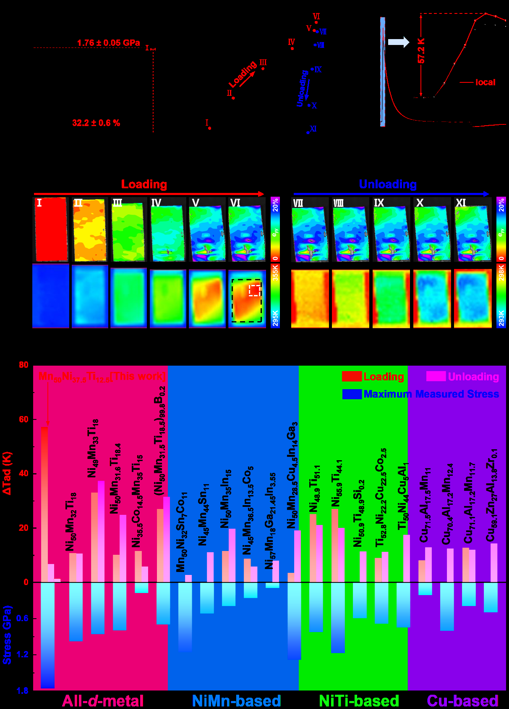
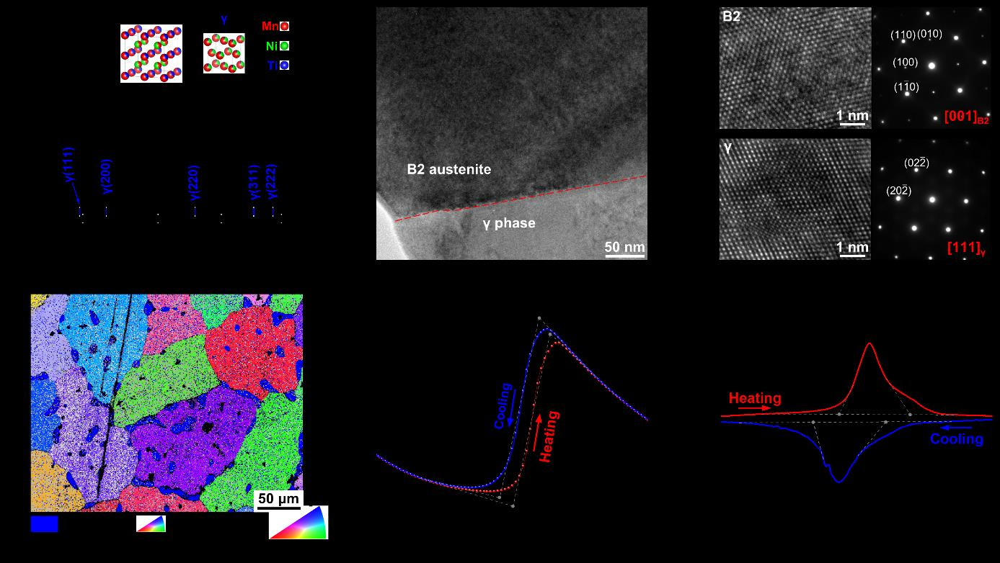
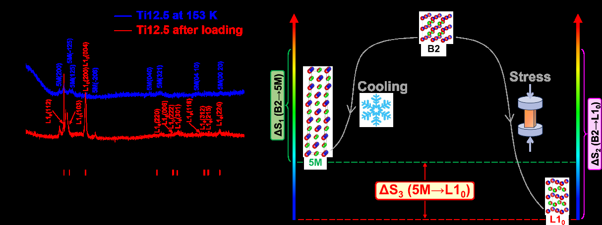

# 弾性熱量効果の新地平：全d金属ハーフホイスラー合金における記録的断熱温度変化と固体冷却材料の展望

- **執筆日**: 2026-04-06
- **トピック**: 弾性熱量材料・固体冷却・形状記憶合金マルテンサイト変態
- **タグ**: Devices and Functional Materials / Phase Transitions; Coupled-Field Response / Transport Measurements; Extreme Condition Measurements
- **注目論文**: Cai et al., "Huge Stress-induced Adiabatic Temperature Change in a High-Toughness All-d-metal Heusler Alloy," arXiv:2503.01186 (2025)
- **参照関連論文数**: 7

---

## 1. なぜ今この話題なのか

現代社会の冷却需要は急速に拡大している。データセンターの廃熱処理、電気自動車用バッテリーの温度管理、冷蔵・空調のエネルギー消費——これら熱管理の課題は年々深刻さを増している。そのうえで最も差し迫った問題が、従来の蒸気圧縮冷凍サイクルが依存するハイドロフルオロカーボン（HFC）系冷媒の環境負荷である。HFCは温暖化係数（GWP）がCO₂の数百〜数千倍に達し、冷蔵庫・空調機器からの漏洩が地球温暖化加速の一因となっている。欧州をはじめ世界各国でHFCの規制強化が進む中、「冷媒を一切使わない固体冷却技術」への期待が急速に高まっている。

固体冷却の主役候補として注目されているのが **カロリック効果（caloric effect）** を示す材料群だ。カロリック効果とは、外部から何らかの場（磁場・応力・圧力・電場）を印加・除去したときに材料が示す熱的変化——具体的には断熱条件下での温度変化 ΔTad や等温条件下でのエントロピー変化 ΔS——を指す総称である。磁場を使う磁気熱量効果（MCE）、静水圧を使うバロカロリック効果（BCE）、電場を使う電気熱量効果（ECE）、そして **一軸応力を使う弾性熱量効果（elastocaloric effect; eCE）** がその代表例だ（Mañosa & Planes, 2017; Fähler et al., 2012）。

なかでも弾性熱量効果が最近とりわけ注目を集めているのには理由がある。第一に、機械的応力は磁場や電場に比べて印加が容易でスケーラブルであり、圧縮・引張機構を使った熱交換デバイスが実証段階に入りつつある。2023年にはNiTiチューブを用いた弾性熱量冷却システムが冷却能力260 W・温度スパン22.5 Kを達成したという報告（*Science*, 2023）も登場し、実用への道筋が見えてきた。第二に、弾性熱量材料は一般に毒性・希少性の低い元素から構成され、熱伝導率も良好なため、材料・デバイスの両面でスケールアップしやすい。第三に、一軸応力下では水静圧に比べて格段に大きい駆動力を相変態に与えられるため、より大きな ΔTad が期待できる。

その核心にあるのが形状記憶合金（SMA）のマルテンサイト変態であり、変態に伴う潜熱を冷却に利用するという原理だ。しかし現状の材料には依然として大きな壁がある——ΔTad の不足と機械的脆性という「二律背反」がそれだ。2025年3月、この難問に正面から挑み記録的な成果を打ち立てた論文が発表された。Cai らによる「Huge Stress-induced Adiabatic Temperature Change in a High-Toughness All-d-metal Heusler Alloy」（arXiv:2503.01186）である。本稿ではこの論文を核に据え、弾性熱量材料の研究最前線を俯瞰する。

---

## 2. この分野で何が未解決なのか

弾性熱量効果研究の現状を整理すると、未解決の問題は大きく四つに絞られる。

**第一の問題：ΔTad の天井——いかに潜熱を最大化するか**

弾性熱量効果の大きさは ΔTad ≈ T·ΔS/Cp（T は変態温度、ΔS は変態エントロピー変化、Cp は比熱）で記述される。現行の代表材料である NiTi 系 SMA では、最大でも ΔTad ～ 20–30 K 程度（単結晶・配向材）が上限とされてきた。実用的な固体冷却サイクルには 20 K 以上の温度スパンが必要なため、ΔTad の天井を破る材料の探索が喫緊の課題だ。特に多結晶体では結晶粒間の拘束によって変態分率が下がり、単結晶に比べて ΔTad が著しく低下する問題がある。

**第二の問題：機械的耐久性——繰り返し応力への耐性**

弾性熱量冷却サイクルでは材料が何百万回も応力サイクルに晒される。多くの NiMn 系ハーフホイスラー合金は大きな ΔTad を持つ一方、脆性が高く、数千サイクルで破断する。NiTi 系は繰り返し特性に優れるが、ΔTad が大きくない。「大きな ΔTad」と「高い疲労寿命」の両立は、材料科学上の根本的なトレードオフだ。

**第三の問題：可逆性——ΔTad のローディング・アンローディング非対称**

ΔTad は応力印加時（加熱）と除去時（冷却）で絶対値が異なる。この非対称性は主に塑性変形・残留ひずみ・ヒステリシスに起因する。大きな ΔTad を示す材料ほど大きな応力が必要なため塑性変形を伴いやすく、可逆性が犠牲になる傾向がある。実用では、アンローディング時の ΔTad（すなわち実際の冷却量）が設計の核心となる。

**第四の問題：変態機構の解明——応力誘起変態と熱誘起変態の差**

外部応力下で誘起されるマルテンサイト相が、熱誘起変態で現れる相と必ずしも同一でないことが最近明らかになってきた。両者の差は潜熱・エントロピー変化の大きさに直結するが、その微視的メカニズムはいまだ解明途上である。特に「なぜ応力誘起変態では熱誘起変態より大きな ΔTad が出ることがあるのか」という問いは、2503.01186 の中心課題でもある。

---

## 3. 注目論文の核心：何が前進し、何がまだ仮説か

### 記録的 ΔTad = 57.2 K の達成

Cai ら（arXiv:2503.01186、CC BY 4.0）は、全d金属ハーフホイスラー合金 Mn₅₀Ni₃₇.₅Ti₁₂.₅（以下 Ti12.5）において、赤外線サーモグラフィーによる直接測定で **ΔTad = 57.2 K（局所最大値）・49.6 K（全体平均値）** というこれまでに報告されたいかなる弾性熱量合金の記録も凌駕する断熱温度変化を観測した（Figure 2）。別サンプルでは ΔTad = 64.5 K という数値も再現されており、偶発的な測定誤差ではないことが確かめられている。

この数値の圧倒的さを実感するために比較しておこう。従来の最高記録は配向 Ni₅₀Mn₃₂Ti₁₈ 単結晶で報告された −37.3 K であった。Ti12.5 はその約 1.5 倍もの ΔTad を多結晶体で記録したことになる。

*Fig. 2（arXiv:2503.01186、CC BY 4.0）. 上段左：Ti12.5 の圧縮破断試験結果（破壊強度 1.76 GPa）。上段中・右：eCE サイクル中の応力-ひずみ曲線（ステージ I–XI）および赤外線温度画像の連続変化（ローディング→アンローディング）。白枠内の局所領域で ΔTad = 57.2 K が観測される。下段：主要な弾性熱量合金の ΔTad（カラーバー）と最大応力（白バー）の比較。Ti12.5 は最大 ΔTad を示しつつ高い破壊強度も保持している。*

### 二相微細組織が生み出す「二重の強化」

Ti12.5 の微細組織は、**B2 規則構造（空間群 No. 221）のオーステナイト主相**と、粒内・粒界に分散した **立方晶 γ 相（Mn₆₇.₉Ni₂₈Ti₄.₁、空間群 No. 225）** からなる二相複合体である。XRD・EBSD・TEM で確認されたこの二相組織が、以下の二つの機能を果たしている。

1. **機械的強靭化**：γ 相は延性に富んだ相であり、破壊靭性 452.5 ± 23.5 J/cm³・破壊強度 ～1.76 GPa というNiMnTi 系で最高水準の機械特性を実現している。「弱い d-d 共有結合と金属結合の競合」というオール d 金属ハーフホイスラー合金固有の特性と相まって、多くの NiMn 系合金が抱える脆性問題を大幅に軽減した。

2. **多点核生成による高変態分率**：γ 相が核生成サイトとして機能することで、応力誘起マルテンサイト変態（MT）が試料全域で同時多発的に起こる（赤外線画像の初期段階で温度上昇が一様に分布していることで確認）。これが高い変態分率——すなわち大きなマクロ ΔTad——につながる。

*Fig. 1（arXiv:2503.01186、CC BY 4.0）. a) Ti12.5 の室温 XRD パターン（B2 主相 + γ 相ピーク）。b) 明視野 TEM 像（B2 オーステナイトと γ 相の相界面）。c) 高分解能 TEM と SAED。d) EBSD 逆極点図（β 相の方位分布と γ 相の分布）。e) M-T 曲線（500 Oe）。f) DSC 曲線（昇温・降温）。DSC から求めた熱誘起 MT のエントロピー変化は ΔS = 65.8 J kg⁻¹ K⁻¹、理論 ΔTad = 39.9 K。*

### 熱誘起変態と応力誘起変態のマルテンサイト相の違い

論文の最も重要な知見の一つは、Ti12.5 の **熱誘起** MT では B2 → 5 層変調（5M）マルテンサイトが生成するのに対し、**応力誘起** MT では正方晶 L1₀ マルテンサイトが優先的に生成するという事実だ（Figure 4）。

*Fig. 4（arXiv:2503.01186、CC BY 4.0）. 左：Ti12.5 の室温 XRD（加圧前・加圧後）および 153 K での XRD。加圧後に L1₀ 相の回折ピークが出現。右：熱誘起 MT（B2 → 5M）と応力誘起 MT（B2 → L1₀）のエネルギースキーム。L1₀ は熱力学的により安定な低エネルギー相であり、B2 → L1₀ の エントロピー変化 ΔS₂ は ΔS₁（B2 → 5M）よりも大きい（差分 ΔS₃ = ΔS₂ − ΔS₁）。*

5M 変調構造は中間的メタ安定相であり、L1₀ 正方晶は熱力学的に安定な低エネルギー相である。したがって B2 → L1₀ 変態の潜熱は B2 → 5M よりも ΔS₃（5M → L1₀ 変態に相当する分）だけ大きい。著者らは近傍組成の Ti11.5 合金（室温でマルテンサイト相にある）を同様に高ひずみ加圧し、5M → L1₀ 変態由来の ΔTad 寄与が約 18.0 K であることを実験的に確認した。これを加えると理論的最大値は 39.9 + 18.0 ≈ 57.9 K となり、実測 57.2 K と見事に一致する。

この一致は、**「応力によって通常の熱誘起変態とは異なる高エントロピー相が生成し、余分な潜熱が放出される」という機構を強く支持する証拠**である。ただし「なぜ応力印加によって L1₀ 相が安定化するのか」という微視的機構については DFT 計算や詳細な構造解析が必要であり、現段階では現象論的な説明にとどまる点は注意を要する。

### 不可逆性という課題

一方で正直な欠点も記しておく必要がある。アンローディング時の ΔTad は −3 K にとどまり、ローディング時の 57.2 K と大きく乖離する。この不可逆性の原因は、大きな圧縮応力（～1.53 GPa）下での塑性変形（DIC 画像で局所ひずみ最大 20%を確認）にある。つまり現段階では「一回の応力印加で巨大な熱量を取り出せる」が、「繰り返しサイクルで安定して冷却できる」には至っていない。論文では低ひずみサイクル（変位 1.0 mm）では全体平均 9.7 K のローディング・6.6 K のアンローディングという、ある程度対称的な ΔTad が得られており、低ひずみ側での最適化によって実用サイクルに近づけられる可能性が示されている。

---

## 4. 背景と研究史：この論文はどこに位置づくか

弾性熱量効果の研究史を簡単に整理しておこう。

### NiTi：弾性熱量研究の出発点

弾性熱量材料研究の事実上の出発点は NiTi（ニチノール）系 SMA だ。Bonnot ら（2008）が NiTi シングルクリスタルで ΔTad = 13 K を報告して以来、NiTi は実用性と再現性のバランスから最も広く研究されてきた。その後の改良で、アディティブ・マニュファクチャリング（AM）を用いたナノコンポジット NiTi では ΔTad ≈ 16–20 K と百万サイクル以上の疲労寿命が報告された（Reginato et al., 2019; arXiv:1908.07900）。Liang ら（arXiv:2107.11092、CC BY 4.0）はナノ結晶 NiTi チューブが繰り返し圧縮サイクルによって自発的に微細組織が最適化し、性能係数（COP）が 40–104% 向上するという興味深い現象（機能的劣化に伴う自己強化）を報告した。

NiTi の特長は **超弾性（superelasticity）** に由来する安定した繰り返し特性と、比較的小さなヒステリシス（低エネルギー散逸）にある。一方で ΔTad には 20 K 程度の実質的な上限があり、これは B2 → B19' 変態の潜熱によって規定される。

### NiMn 系ハーフホイスラー：大きな ΔS と脆性のトレードオフ

NiMnX（X = Ga, Sn, Sb, In）系ハーフホイスラー合金は、磁気構造連成変態（magneto-structural transition）を持ち、MCE・eCE・BCE の全てで大きな効果を発揮する「マルチカロリック材料」として注目を集めてきた。特に Ni₅₀Mn₃₂Ti₁₈ 系は B2 → 5M 変調変態に伴う大きなエントロピー変化をもち、ΔTad = 30–37 K 以上という従来最高水準のeCEを達成した。

しかし NiMn 系ハーフホイスラーは，p 元素（Ga, Sn, In, Sb）を含む p-d ハイブリダイゼーションに依存するため、共有結合性が弱く脆性が高い。粒界でのクラックが数百サイクルで進展し、実用耐久性に乏しいという深刻な問題が長く指摘されてきた。Pfeuffer ら（arXiv:2111.01621）は Fe ドーピングによる粒界強化で 16,000 サイクルの安定動作を実証しつつも、ΔTad = −4.5 K という性能的な妥協を余儀なくされた例を報告している。

一方でヒステリシスとエントロピー変化のトレードオフも重要だ。Beckmann ら（arXiv:2301.03934）は NiCoMnTi 系ハーフホイスラーで極低温（75–300 K）における散逸損失が異常増大し、見かけの高い ΔS が実効的な冷却能力に直結しないという基本的制約を明らかにした。この「ヒステリシス損失の壁」は第一次相転移材料全般に共通する課題として認識されつつある。

### 全d金属ハーフホイスラー概念の登場

こうした背景のもと、2019 年に劉らのグループが「全d金属ハーフホイスラー（all-d-metal Heusler）」概念を提唱した。従来の p-d ハイブリダイゼーションに代えて **d-d ハイブリダイゼーション**（d ブロック遷移金属元素のみで Heusler 型格子を構成）を用いると、金属結合と弱い共有結合の競合によって通常の NiMn 系より延性・靭性が向上するという考え方だ。NiCoMnTi 系がその代表であり、破壊強度と ΔTad の両立において飛躍的な改善が見られた。

深冷温度域（200–255 K）への応用を目指す Huang ら（arXiv:2502.19034、CC0）は、NiMnIn 系ハーフホイスラーへの Cu・Ga 共ドープ戦略を採用した。この手法では格子非調和性と体積変化を同時に最適化し、磁気エントロピーの負の寄与を抑制しながら格子エントロピー変化を増大させることに成功した。その結果、弾性熱量 COP ≈ 30・ΔTad = −7 K（5%ひずみ・230 K）という**深冷領域で最高クラスの性能**を達成した（arXiv:2502.19034, Fig. 2 下段 d）。

こうした先行研究を踏まえると、Ti12.5 は「全d金属ハーフホイスラー高靭性化」と「応力誘起 L1₀ 相による追加エントロピー」という二つの革新を重ねた成果として位置づけられる。

---

## 5. どの解釈が最も妥当か：証拠・比較・限界

### 「応力誘起 L1₀ 変態による過剰潜熱」仮説の検証

Ti12.5 で ΔTad が 57.2 K に達した主因として、論文が提唱するのは「応力印加によって熱誘起 5M 変態より安定な L1₀ 相が選択的に生成し、B2 → L1₀ の潜熱が B2 → 5M よりも大きいため余分な熱量が放出される」という機構である。この仮説を支持する証拠を整理しよう。

**定量的整合性**：実測 ΔTad = 57.2 K、熱力学的予測（B2→5M 寄与 39.9 K + 5M→L1₀ 寄与 18.0 K = 57.9 K）——この一致は偶然の一致とは考えにくく、仮説の定量的妥当性を強く支持する。

**XRD による相同定**：加圧後のサンプルに L1₀ 相ピークが明確に観測されており、応力誘起 L1₀ 相の生成は直接的証拠として確立している。熱誘起変態（153 K 冷却後）では 5M 変調相が現れることも確認されており、両経路の相の違いが実験的に立証された。

**体積変化との整合性**：応力誘起 MT の格子定数から計算される体積変化は −3.13% であり、これは従来の NiMnTi 系で報告された −2.54% を上回る。体積変化は格子歪みの尺度であり、大きな体積変化は大きなエントロピー変化と相関する——この観点でも L1₀ 相の寄与が整合的に説明できる。

**多点核生成との相乗効果**：DIC 画像が示すように、γ 相分散による多点核生成が高変態分率を実現し、局所的な ΔTad だけでなく全体平均 ΔTad も高水準に保たれている。この「核生成サイトとしての γ 相」という役割は、先行研究で二相 Heusler 合金における変態均一化が報告されていたことと一致する。

### 残る不確定要素

一方で以下の点は慎重に評価する必要がある。

**摩擦熱の寄与**：高速変形（500 mm/min）下では塑性変形・応力誘起変態に伴う摩擦・散逸熱が ΔTad に加算される可能性がある。論文では最大 ΔTad が最大ひずみ域ではなく形状がほぼ保たれた領域で生じることから「摩擦熱でない」と主張するが、非断熱性の完全な定量化は今後の課題だ。

**応力誘起 L1₀ 安定化の微視的機構**：なぜ応力印加によって L1₀ 相が熱力学的に安定化するのかは、第一原理計算（DFT）による格子動力学・自由エネルギー比較によって裏付けが必要だ。軸率比（c/a）や Grüneisen パラメータの応力依存性など、原子スケールの理解が進めば設計指針が明確になろう。

**可逆 ΔTad と実用 COP**：大ひずみ（13%）では不可逆性が顕著であり、実際の冷凍サイクルに使えるのは小ひずみ域の ΔTad（10 K 弱）である。Huang ら（arXiv:2502.19034）が NiMnIn 系で COP = 30 を達成したことと比べると、Ti12.5 はまだ実用 COP の評価が進んでいない段階にある。

### 他材料との比較から見えるもの

**FeRh の多重カロリック効果**：Amirov ら（arXiv:2502.18087、CC BY 4.0）は FeRh₅₂ 合金で磁場（1 T）と一軸張力（104 MPa）を同時印加した際に ΔTad = −3.4 K という「相乗的多重カロリック効果」を報告した。これは単独場の和（MCE + eCE = −2.9 + (−0.5) = −3.4 K）と偶然に等しいが、論文は幾何学的効果や印加プロトコルによって加算性が崩れる場合があることを示している。FeRh は AFM → FM の磁気変態を伴う特殊系であり、全d金属ハーフホイスラーとは変態機構が根本的に異なる。ただし「複数の駆動場を組み合わせてエントロピーを最大化する」多重カロリック戦略は普遍的な方向性として注目に値する。

**プラスチック結晶のバロカロリック効果**：Rendell-Bhatti ら（arXiv:2504.16488、CC BY 4.0）はペンタグリセリン/ネオペンチルグリコール/ペンタエリスリトールの三元固溶体が低圧（1 kbar）で逆熱力学エントロピー変化 13.4 J kg⁻¹ K⁻¹、温度スパン 18 K を示すことを報告した。Sanuy ら（arXiv:2501.14403、CC BY 4.0）の分子動力学研究は、プラスチック結晶の巨大バロカロリック効果には分子回転だけでなく格子振動・分子コンフォメーション変化が約 45% 寄与することを明らかにした。これらの研究は、弾性熱量効果に留まらず「固体相転移に伴うエントロピー変化を冷却に活用する」という大きな潮流の中での比較材料を提供している。固体冷却材料の設計原理において「何のエントロピー自由度を使うか」は、材料選択の本質的な問いである。

**マルテンサイト変態の動的挙動**：Ge ら（arXiv:2509.06513、CC BY-NC-SA 4.0）は NiMnGa 薄膜においてレーザー誘起変態を利用してオーステナイト → マルテンサイト → オーステナイトの完全サイクルを 5 ナノ秒以内に完了させるという「これまでで最速のマルテンサイト変態」を実証した。機械学習力場を使った分子動力学シミュレーションが変態メカニズムを再現しており、高速サイクルを可能にする熱応力効果の重要性が明らかになった。弾性熱量冷却デバイスの高頻度サイクル化には変態ダイナミクスの理解が不可欠であり、この研究は Ti12.5 の応力誘起変態が秒以下のスケールでどのように進行するかを考えるための基盤知識を提供する。

---

## 6. 何が一般化できるのか：材料・手法・応用への広がり

### 「応力誘起 L1₀ 相」の設計指針としての一般性

Ti12.5 で見出された「応力誘起変態が熱誘起変態とは異なる相を生成し、より大きなエントロピーを放出する」という機構は、他の全d金属ハーフホイスラー系——MnNiTiCo や MnNiTiCu など——でも検証される価値がある。応力誘起 L1₀ 相の安定性は組成や熱処理によって制御できる可能性があり、「どの組成で B2 → L1₀ の優先的生成が起きるか」を系統的にマッピングすることが次のステップだ。第一原理計算による自由エネルギー地形の把握と、in-situ X 線回折（放射光）による応力下での相同定を組み合わせた研究が求められる。

### 二相微細組織設計の一般化

γ 相（Mn₆₇.₉Ni₂₈Ti₄.₁）を主相（B2）中に均一分散させた Ti12.5 の二相戦略は、NiTi 系での Ni₃Ti や Ti₄Ni₂O ナノ析出物による強化・安定化戦略（Nature Communications 2026）と構造的に類似している。「軟質延性相を分散させて核生成サイトとする」「同時に力学的靭性を向上させる」という二相設計の概念は、より広い SMA・Heusler 合金系へ展開できる汎用設計則として機能しうる。

### 深冷・室温・高温への応用温度域の拡張

弾性熱量材料の実用温度域は現在、大まかに 200–350 K（室温周辺）に集中している。Huang ら（arXiv:2502.19034）が深冷域（200–255 K）を開拓し、Beckmann ら（arXiv:2301.03934）が低温（75 K 以下）での散逸増大問題を提起したように、温度域の拡張が大きな研究課題だ。Ti12.5 は変態温度が 270 K 付近にあり室温冷却向けとして適切だが、組成調整による変態温度チューニング（Ti 含有量を変えるとTMが大きく変わる）で、より広い温度帯に対応した全d金属合金群を設計できる可能性がある。

### デバイス化とシステム統合

固体冷却の実用化には、材料の性能だけでなく、熱交換サイクルの設計・高速機械アクチュエーション・固体伝熱の最適化が必要だ。Hirai ら（Adv. Funct. Mater., 2022）の「弾性熱量キリガミ温度モジュレーター」のように、材料・加工・デバイス設計を統合したアプローチが現実の熱管理への応用を加速する。Ti12.5 の高靭性は、従来の Heusler 合金では困難だったデバイス加工（ワイヤ放電加工、プレス成形など）を可能にする点でも注目される。

---

## 7. 基礎から理解する

### 7.1 マルテンサイト変態とは何か

形状記憶合金の弾性熱量効果を理解するには、まず「マルテンサイト変態（martensitic transformation; MT）」を押さえる必要がある。これは拡散を伴わない（原子が集団として協調的にシフトする）一次の構造相転移で、高温側のオーステナイト相（高対称性、通常立方晶）から低温・高応力側のマルテンサイト相（低対称性、通常単斜晶・斜方晶・正方晶）への変態だ。変態は界面の移動によって進行し、ひずみエネルギーと化学自由エネルギーの競合で決まる。

Ti12.5 の場合、オーステナイト相は B2 型（CsCl 型、立方晶、格子定数 a = 2.974 Å）。熱誘起変態では 5 層変調（5M）マルテンサイトが生成するが、応力誘起では正方晶 L1₀ 相（格子定数 a = b = 3.705 Å, c = 7.424 Å）が優先的に生成する。

### 7.2 弾性熱量効果の熱力学

弾性熱量効果の熱力学的記述の出発点はクラウジウス-クラペイロン関係である。一軸応力 σ と変態温度 T₀ の間には：

$$\frac{d\sigma_{cr}}{dT} = -\frac{\rho \Delta S}{\varepsilon_0}$$

ここで σcr は変態臨界応力、ρ は密度、ΔS は変態エントロピー変化（J kg⁻¹ K⁻¹）、ε₀ は変態ひずみ（変態ひずみ）。これはある温度で応力を印加すると変態温度が変化することを意味する——言い換えれば、「応力が熱力学的ポテンシャルとして作用し、変態の駆動力を変える」。

断熱条件下での ΔTad は近似的に：

$$\Delta T_{ad} \approx -\frac{T \Delta S}{C_p}$$

と書ける。T は絶対温度（変態温度）、ΔS は変態エントロピー変化、Cp は比熱。この式から、大きな ΔTad を得るには「大きな |ΔS|」または「高い変態温度」が有利であることが直ちに分かる。Ti12.5 の場合、B2 → L1₀ 変態の ΔS = 94.4 J kg⁻¹ K⁻¹（実測 ΔTad = 57.2 K、T = 270 K、Cp より逆算）であり、これは従来の NiMn 系（ΔS ≈ 30–70 J kg⁻¹ K⁻¹）を大幅に凌ぐ。

### 7.3 弾性熱量サイクルと性能評価

実際の冷却デバイスでは、応力の印加（オーステナイト → マルテンサイト変態、発熱）→ 熱放出（高温端側へ放熱）→ 応力除去（マルテンサイト → オーステナイト変態、吸熱）→ 熱吸収（低温端から吸熱）という Brayton-like サイクルが用いられる。性能指数として重要なのは：

- **断熱温度変化 ΔTad**（応力印加時の発熱量の指標）
- **性能係数 COP = Q/W**（冷却熱量 Q ÷ 投入仕事 W）
- **疲労寿命 N**（何サイクル繰り返せるか）

これら三つはトレードオフの関係にある。大きな ΔTad を実現するには大きな応力・大きなひずみが必要だが、それは機械的劣化と大きなヒステリシス損失（= 小さな COP）につながる。Ti12.5 の記録的 ΔTad = 57.2 K は大ひずみ（13%）条件でのみ得られており、実用 COP を考えれば低ひずみ域での動作が現実的だ。

### 7.4 ハーフホイスラー構造と全d金属化の意義

Heusler 合金とは一般式 X₂YZ（フルハーフホイスラー）または XYZ（ハーフハーフホイスラー）で表される L2₁ 型または B2 型規則合金で、多彩な磁性・輸送・変態特性を示す機能性合金群だ。従来型（NiMnX、X = Ga, Sn, In, Sb）では p 軌道と d 軌道のハイブリダイゼーション（p-d hybridization）が構造安定性を担うが、これは同時に脆性をもたらす。

一方「全d金属ハーフホイスラー」では X = Ti, Co 等のd遷移金属が Z 位を占め、d-d ハイブリダイゼーションのみで格子が構成される。d-d 結合は p-d 結合より拡がりが大きく指向性が弱いため、金属結合的な延性と共有結合的な構造安定性を同時に持ちやすい。これが Ni₅₀Mn₃₂Ti₁₈ 系や今回の Mn₅₀Ni₃₇.₅Ti₁₂.₅ 系で高靭性を示す根本的な電子論的理由だ。

---

## 8. 専門用語の解説

**1. 弾性熱量効果（elastocaloric effect; eCE）**
一軸応力（圧縮・引張）の印加・除去に伴って材料が示す熱的変化。応力によってマルテンサイト変態が誘起され、変態潜熱として熱量が放出・吸収される。環境負荷ゼロの「固体冷却」技術への応用が期待される。

**2. マルテンサイト変態（martensitic transformation; MT）**
拡散を伴わない一次の構造相転移。冷却や応力印加によってオーステナイト（高温・高対称）からマルテンサイト（低温・低対称）へと変態し、潜熱を放出・吸収する。形状記憶効果・超弾性の起源。

**3. 断熱温度変化（ΔTad）**
断熱条件下で外部場（応力・磁場・圧力など）を急速印加・除去したときの材料温度変化。固体冷却材料の性能を直接表す最重要指標。Ti12.5 で 57.2 K という記録値が報告された。

**4. 全d金属ハーフホイスラー合金（all-d-metal Heusler alloy）**
Heusler 型格子内の全元素が d ブロック遷移金属（Mn, Ni, Ti, Co など）で構成された合金。d-d ハイブリダイゼーションによって従来の NiMnX（p 元素含有）系より延性・靭性が高い。磁気熱量・弾性熱量・バロカロリック効果を同時に示す多機能材料。

**5. L1₀ 型マルテンサイト相（L1₀ martensite）**
正方晶構造（空間群 No. 139、c/a ≠ 1）をもつ熱力学的安定マルテンサイト相。Ti12.5 では応力誘起変態によって生成し、熱誘起変態で現れる 5M 変調相より自由エネルギーが低い（より安定）。B2 → L1₀ の変態エントロピーが大きいことが巨大 ΔTad の根拠。

**6. 5M 変調マルテンサイト（5M modulated martensite）**
5 層変調された準安定マルテンサイト相。NiMnTi 系合金の熱誘起変態で典型的に生成する中間的な相。L1₀ 相より自由エネルギーが高く、エントロピー変化も小さい。Ti12.5 では応力下で L1₀ 相が選択的に安定化することが確認された。

**7. 超弾性（superelasticity）**
マルテンサイト変態温度以上の温度で応力を印加すると応力誘起マルテンサイト変態が生じ、除荷後に逆変態して原形状に戻る現象。弾性熱量冷却サイクルにおいてアンローディング時の冷却（逆変態吸熱）を担う。

**8. d-d ハイブリダイゼーション（d-d hybridization）**
d ブロック元素間の d 軌道のハイブリッド（混成）。全d金属ハーフホイスラーで金属結合的な延性と弱い共有結合的な方向性の両方を与え、従来の p-d ハイブリダイゼーション合金より高靭性を実現する電子構造的要因。

**9. γ 相（γ phase）**
Ti12.5 の二相微細組織において主 B2 相の粒内・粒界に分散する二次相（Mn₆₇.₉Ni₂₈Ti₄.₁、面心立方晶 No. 225）。延性に富み核生成サイトとして機能することで、力学的強化と変態均一化の両方に寄与する。

**10. 多重カロリック効果（multicaloric effect）**
磁場・応力・圧力など複数の外部駆動場を組み合わせて誘起されるカロリック効果。複数の自由度（磁気・格子・電子）からのエントロピー変化を同時に活用できるため、単一刺激の場合より大きな効果を期待できる。FeRh₅₂ や NiCoMnTi 系でその相乗効果が実証されつつある。

---

## 9. おわりに：何が分かり、何がまだ残っているのか

arXiv:2503.01186 の最大の貢献は「弾性熱量効果の ΔTad 記録を大幅に更新した（57.2 K）と同時に、その機構として応力誘起 L1₀ 変態による余剰潜熱放出を実験的・定量的に実証した」点にある。とりわけ、「応力誘起変態が熱誘起変態とは異なるマルテンサイト相を選択的に安定化し、より大きなエントロピー変化を生む」という知見は、他の全d金属ハーフホイスラー系や Heusler 合金全般での設計指針として一般化できる重要な発見だ。加えて γ 相分散による機械的強化が ΔTad 向上と力学耐久性向上を同時に実現するという「二重の強化戦略」は、固体冷却材料設計における新しい概念を打ち立てている。これらの成果は、弾性熱量冷却が従来の MCE 材料や NiTi 系 SMA を超える性能水準に到達しつつあることを強く示唆する。

一方で残された課題も明確だ。現段階での最大 ΔTad = 57.2 K は大ひずみ（13%）・大応力（1.5 GPa 超）条件下での値であり、実用サイクル（小ひずみ・多サイクル）での ΔTad は 10 K 以下にとどまる。「記録的な一回限りの ΔTad」と「実用的な繰り返し冷却性能」の橋渡しが今後の最大課題だ。そのためには、応力誘起 L1₀ 変態を **より低いひずみで誘起できる組成設計**（e.g., 配向単結晶化・テクスチャー制御・結晶粒微細化）、**L1₀ 変態後の逆変態完全性の確保**、および **変態パス（5M vs L1₀）を熱処理で精密制御する手法**の開発が鍵を握る。今後 1–3 年で注目すべき研究方向は、(1) in-situ 放射光・中性子散乱による応力下マルテンサイト相同定の精密化、(2) 第一原理計算による L1₀ 相の応力誘起安定化機構の解明、(3) 配向/テクスチャー制御試料での可逆 ΔTad 向上、(4) デバイスレベルでの COP 評価と熱管理システムへの組み込みである。弾性熱量材料は確実に「実験室の記録」から「工学的応用」へと舞台を移しつつあり、この分野の進展から目を離せない。

---

## 参考論文一覧

1. **[arXiv:2503.01186](https://arxiv.org/abs/2503.01186)** — Cai et al. (2025). 本記事の主軸論文。Mn₅₀Ni₃₇.₅Ti₁₂.₅ 全d金属ハーフホイスラー多結晶体で ΔTad = 57.2 K という記録的弾性熱量効果を報告し、応力誘起 L1₀ 変態による過剰潜熱機構と γ 相分散による高靭性化を実証した。(*License: CC BY 4.0*)

2. **[arXiv:2502.19034](https://arxiv.org/abs/2502.19034)** — Huang et al. (2025). NiMnIn 系ハーフホイスラーへの Cu・Ga 共ドープで深冷域（230 K）における弾性熱量 COP ≈ 30・ΔTad = −7 K を達成し、格子非調和性と電子構造最適化による高性能化戦略を示した。(*License: CC0*)

3. **[arXiv:2502.18087](https://arxiv.org/abs/2502.18087)** — Amirov et al. (2025). FeRh₅₂ 合金で磁場（1 T）と一軸張力（104 MPa）の同時印加による相乗的多重カロリック効果（ΔTad = −3.4 K）を報告し、単一場の単純和を超えない複合刺激の有効性を示した。(*License: CC BY 4.0*)

4. **[arXiv:2504.16488](https://arxiv.org/abs/2504.16488)** — Rendell-Bhatti et al. (2025). ネオペンチル系プラスチック結晶の三元固溶体系で低圧（1 kbar）バロカロリック効果を大幅に改善（逆熱力学エントロピー変化 13.4 J kg⁻¹ K⁻¹・温度スパン 18 K）し、組成最適化による固体冷却材料設計の汎用性を示した。(*License: CC BY 4.0*)

5. **[arXiv:2501.14403](https://arxiv.org/abs/2501.14403)** — Sanuy et al. (2025). 分子動力学シミュレーションによってプラスチック結晶（ネオペンチルグリコール）の巨大バロカロリック効果に格子振動・分子コンフォメーション変化が 45% 寄与することを明らかにし、従来の分子回転モデルを超えた機構理解を示した。(*License: CC BY 4.0*)

6. **[arXiv:2509.06513](https://arxiv.org/abs/2509.06513)** — Ge et al. (2025). 放射光時間分解 X 線回折と機械学習力場 MD シミュレーションを組み合わせ、NiMnGa 薄膜でのマルテンサイト変態を 5 ナノ秒以内で完了させることに成功し、変態ダイナミクスにおける熱応力の重要性を明らかにした。(*License: CC BY-NC-SA 4.0*)

7. **[arXiv:2107.11092](https://arxiv.org/abs/2107.11092)** — Liang et al. (2021). ナノ結晶 NiTi チューブの繰り返し圧縮により微細組織が自己最適化され、残留マルテンサイト誘起圧縮応力によってヒステリシス損失が低下し性能係数が 40–104% 改善するという自己強化現象を報告した。(*License: CC BY 4.0*)

