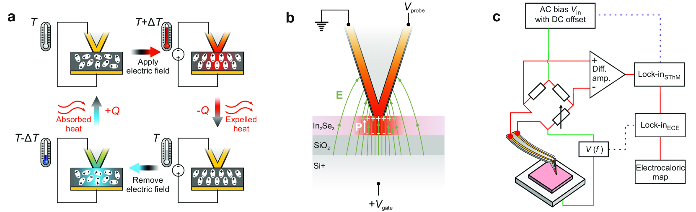
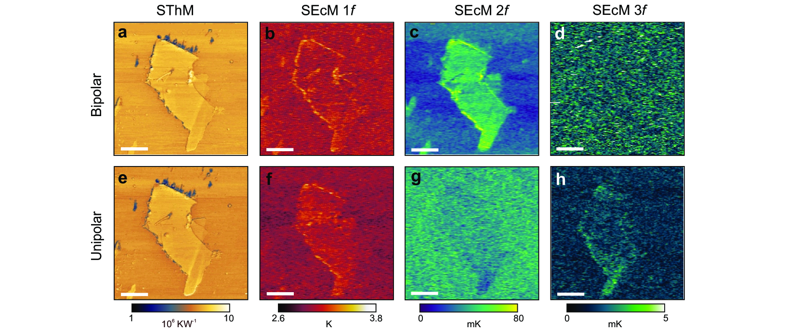

# 電気熱量材料の極性フラストレーション

- **執筆日**: 2026-04-06
- **トピック**: 電気熱量効果（ECE）／弛緩型強誘電体における極性フラストレーション戦略
- **タグ**: Devices and Functional Materials / Phase Transitions; Coupled-Field Response / First-Principles Calculations; Neutron Scattering
- **注目論文**: Feng Li et al., "Robust Electrocaloric Performance Enabled by Highly-Polar Frustrated Nanodomains in NaNbO₃-Based Ferrodistortive Relaxor," arXiv:2602.21520 (2026)
- **参照関連論文数**: 7本

---

## 1. なぜ今この話題なのか

現代社会において冷却技術が消費するエネルギーは膨大である。冷蔵庫、エアコン、データセンター、医療機器など、私たちの生活と産業を支える冷却システムの多くが、ハイドロフルオロカーボン（HFC）系の気体冷媒を用いた蒸気圧縮サイクルに依存している。しかし HFC は強力な温室効果ガスであり、モントリオール議定書のキガリ改正（2016年）はその段階的削減を国際的に義務付けた。この規制の流れを受け、次世代の固体冷却技術への期待は急速に高まっている。

固体冷却の有力な候補として注目されているのが、**電気熱量効果**（electrocaloric effect: ECE）を利用する手法である。ECE とは、強誘電体や誘電体に電場を印加・除去する操作によって材料が断熱的に温度変化する現象であり、いわば「電場で制御できる熱力学サイクル」を材料の内部に実現するものだ。圧縮機を必要とせず、駆動部品がないため機械振動もなく、デバイスの小型化・集積化にも適している。特に半導体チップの局所冷却や、携帯型医療機器など小型デバイスへの応用が期待されており、近年は研究が急速に加速している。

しかし ECE 材料の実用化には、解決すべき根本的な課題が存在する。それは「大きな温度変化（ΔT）」と「広い動作温度範囲（ΔTspan）」を**同時に**達成することの難しさである。現在の高性能材料の多くは、特定の相転移温度近傍でのみ大きな ECE を示すが、その動作温度窓は数 K〜数十 K 程度と狭い。これに対し、産業利用に必要な温度域（室温付近の約 60〜100 K 幅）を確保しようとすると、今度は ΔT が小さくなってしまう。この「ΔT 対 ΔTspan トレードオフ」こそが、ECE 研究が今まさに正面から向き合っている中心課題である。

2025 年に Nature 誌に掲載された高極性エントロピーペロブスカイト酸化物に関する研究（Du et al.）は、A サイトと B サイト双方を多元素置換することで「極性エントロピー」を高め、10 MV/m の電場下で約 15 J/kg/K という大きなエントロピー変化を 60°C 以上の温度幅で達成したことを報告した。この結果は業界に衝撃を与え、固体冷却の実用化に向けた設計指針として「無秩序な極性状態」の導入が有効である可能性を強く示唆した。そして 2026 年 2 月、それを受ける形で arXiv に投稿された Feng Li らの研究（2602.21520）は、鉛フリーの NaNbO₃ 系セラミックに全く新しいアプローチ——「極性フラストレーション」戦略——を適用し、ΔT と ΔTspan を同時に最適化することに成功した。本記事ではこの論文を主軸に据えながら、ECE 材料の現在地と今後の展開を論じる。

---

## 2. この分野で何が未解決なのか

電気熱量材料研究は活発であるにもかかわらず、実用化に向けた道のりには依然として複数の未解決問題が横たわっている。ここでは主要な論点を整理する。

**問い①：ΔT と ΔTspan のトレードオフはなぜ起きるのか、そして打破できるか？**

ECE の大きさは相転移の鋭さに強く依存する。一次の強誘電体相転移は急峻な分極変化を伴うため大きな ΔT を生むが、その温度応答は鋭すぎるが故に動作温度窓が極めて狭い。一方、連続的（二次的）な相転移や弛緩型強誘電体（リラクサー）では相転移がブロードになることで ΔTspan は広がるが、代償として相転移に伴うエントロピー変化のピーク値が低下し ΔT が縮小する。この根本的なトレードオフは、材料の自由度設計（ドーピング、格子歪み、化学的無秩序）によって部分的に克服できると考えられているが、どのような設計パラメータが最も有効かは現在も議論が続いている。

**問い②：直接測定と間接測定はなぜ一致しないのか？**

ECE の実験的評価には、断熱温度変化を直接計測する「直接法」と、誘電率の温度依存性からマクスウェル関係式を使って ΔT を計算する「間接法」の二つがある。理論的には両者は等価のはずだが、実際には両者の間に系統的なずれが報告されている。間接法は高電場・非線形応答域では誤差が大きくなる可能性があり、また非可逆な分極挙動が含まれると過大評価の原因になる。現在も多くの研究が主に間接法に依拠しているが、直接法との比較検証が不十分な論文が多く、報告値の信頼性に懸念が残る。

**問い③：鉛フリー材料は鉛含有材料に匹敵する ECE を実現できるのか？**

従来の高性能 ECE 材料の多くが Pb(Zr,Ti)O₃ (PZT) や Pb(Mg₁/₃Nb₂/₃)O₃ (PMN) など鉛含有系であった。これらは毒性と環境負荷が問題視されており、EU の RoHS 規制なども踏まえた鉛フリー代替材料への転換が急務である。BaTiO₃、NaNbO₃、KNbO₃、HfO₂ 系などが候補として挙げられているが、その ECE 性能は鉛含有系に比べて一般に劣るとされてきた。この格差をどのような材料設計で埋めるかが最重要課題の一つである。

**問い④：ナノドメイン構造と ECE の関係をどこまで定量的に理解できるか？**

弛緩型強誘電体において ECE が広い温度域で発現する背景には、**極性ナノ領域**（polar nano-regions: PNRs）の存在があると考えられている。PNRs は電場によって秩序化・膨張し、これがエントロピー変化の源となる。しかし PNRs のサイズ・形状・密度・ダイナミクスと ECE 大きさの定量的な関係は未だ十分には確立されていない。原子分解能顕微鏡、中性子散乱、フェーズフィールドシミュレーションを組み合わせた多角的アプローチが求められているが、その接続はようやく緒に就いたばかりである。

**問い⑤：ECE デバイスはいつ実用段階に達するのか？**

材料単体の性能向上が進む一方で、ECE を実際の冷却デバイスに組み込む工学的課題は独立した困難を持つ。ECE 材料は電場印加によって温度変化するが、それだけでは材料内部に「熱がたまる」だけで外部への熱輸送は起こらない。熱輸送を実現するためには、固体材料と熱交換流体の間で熱のやり取りをする**能動型カロリック冷却サイクル**（active caloric cooling cycle）の構築が必要である。このサイクルでは電場の印加・除去と流体の流れを同期させる精密制御が求められるが、ECE 材料の動作速度（応答時間）が流体のポンプ速度と整合しているかどうかも重要な設計パラメータとなる。材料の電場応答が遅い（ms 以上）と、デバイスの冷却効率が大幅に低下する。NaNbO₃ 系のような多成分系リラクサーにおいて、電場印加時のドメイン応答速度が十分高速かどうかは、2602.21520 の論文では直接評価されていない。

---

## 3. 注目論文の核心：何が前進し、何がまだ仮説か

2026 年 2 月に投稿された Feng Li らの論文（arXiv:2602.21520）は、「**広温度帯と高 ECE を同時に実現する**」という目標に対して、従来と全く異なる設計思想からアプローチした点で注目に値する。

### 何が達成されたのか

著者らは NaNbO₃（NNO）に対してダブル B サイト置換成分として Ba(Ti,Hf)O₃（BTH）を導入した。ここで BTH は単なるドーパントではなく、NNO の正八面体 TiO₆ 傾斜秩序を意図的に乱す「**極性レンチ**（polar wrench）」として機能する。BTH が局所的な格子歪みを発生させることで、正八面体の酸素傾斜（oxygen octahedral tilting: OOT）が撹乱され、その結果として局所的に**高い分極を持つ強誘電性ナノドメイン**（ferrodistortive nanodomain）が無数に生成される。

この論文の中心的主張は、これらの**高分極フラストレーテッドナノドメイン**が ECE の増大と温度域の拡大を同時にもたらすというものである。具体的な実験結果として、最適化組成において以下の性能が報告されている。

- **断熱温度変化 ΔT = 0.85 K / 0.70 K**（2 組成について直接測定）
- **動作温度域 ΔTspan = 118 K / 130 K**
- **性能指数（FOM）= ΔT × ΔTspan > 90 K²**

この性能指数 90 K² 超という値は、同等の試験条件（鉛フリーセラミックス、室温動作）における既報の材料と比較して顕著に高く、著者らは「これまでの NaNbO₃ 系の最高値を上回った」と主張している。

### 方法論と証拠基盤

著者らはこの主張を複数の独立した手法で裏付けている。

**フェーズフィールドシミュレーション**を設計ガイドとして用い、BTH ドーピング量と酸素傾斜の撹乱の関係を事前に予測した。次に、**原子分解能走査透過型電子顕微鏡（STEM）**を用いて 2 次元の局所構造を可視化し、高分極ナノドメインの空間分布を実験的に確認した。さらに**中性子全散乱・3次元大箱モデリング（3D big-box modeling）**という手法を駆使することで、単なる平均構造ではなく局所的な原子変位分布の 3 次元情報を取得し、フラストレーションの物理的実体を定量的に評価した。そして**第一原理計算（DFT）**により電子構造レベルから OOT の変調メカニズムを考察した。

これらの異なる手法が整合した結果を示していることは、主張の根拠として比較的強い。しかし一方で、現時点ではまだ「仮説段階」と言える側面も残る。

### 何がまだ仮説か

最も重要な未解決点は、**「高分極ナノドメインが広い ΔTspan をもたらすメカニズム」の詳細**である。著者らのシナリオでは、これらのナノドメインは電場に対して段階的・非均一に応答するため、ひとつの鋭い相転移を示す代わりに、広い温度・電場範囲にわたって断続的なエントロピー変化が起きると解釈している。この「段階的・分散的な応答」というモデルは一見合理的だが、それを直接実証する実験——例えばナノスケールでの局所温度マッピングや、個々のナノドメインの動的挙動の観察——は本研究では行われていない。

また、報告された FOM > 90 K² という値が**反復サイクル下での耐久性**（耐疲労性）を保つかどうかも不明である。セラミックス系 ECE 材料の実用化では 10⁶ サイクル以上の繰り返し動作が求められるが、その評価は本論文の範囲外である。Du et al. の Nature 論文ではサイクル耐久性（100万サイクル以上）が明示されていたが、Feng Li らの論文ではこの点に関するデータは限定的である。

さらに、電場印加前と印加後で試料の「電気的疲労」が蓄積し、ΔT が経時的に低下する問題（ECE 劣化）の評価も重要な課題として残っている。強誘電体セラミックスでは高電場での繰り返し電気的応力によって欠陥が集積し、分極の可逆性が失われることが知られている。フラストレーテッドナノドメインを持つリラクサー系では、通常の強誘電体よりもヒステリシスが小さく可逆性が高いとされるが、BaTiO₃-NBT 系の研究（arXiv:2507.07290）でも耐疲労性の系統的な評価は十分には行われていない。実用デバイスに組み込む前に、材料ごとの疲労特性データの蓄積が不可欠である。

---

## 4. 背景と研究史：この論文はどこに位置づくか

ECE の現代的な研究史は、2006 年の Mischenko らによる薄膜 PZT の発見——ΔT ≃ 12 K という当時破格の値——に始まるとしばしば語られる。それ以前にも ECE の理論と実験は存在していたが、この発見が分野全体に火をつけ、現在に至る活発な研究競争の号砲となった。

その後、研究の焦点は**どの材料クラスで大きな ECE が得られるか**という問いを中心に展開してきた。PZT 系の薄膜では相転移温度近傍の大電場下で大きな ΔT が報告されたが、厚膜・バルクセラミックスでは性能が低下し、また高温動作（200°C 以上）が多かった。このため「室温・バルク材料・低電場」という実用条件下での ECE 実現が次の課題として浮上した。

**リラクサー強誘電体**（relaxor ferroelectric）が ECE の主役に躍り出たのはこの文脈においてである。PMN-PT（Pb(Mg₁/₃Nb₂/₃)O₃–PbTiO₃）系などの弛緩型強誘電体は、B サイト化学的無秩序に起因する PNRs を持ち、外場に対して段階的かつ可逆的な応答を示す。Jiang らは 2018 年に有効ハミルトニアンを用いた原子論的シミュレーションで PMN のリラクサー ECE を計算し、PNRs の電場誘起パーコレーション——すなわち孤立した極性ナノ領域が電場を加えると互いに連結して巨大な分極ドメインに成長する現象——が巨大 ECE の起源であることを示した（arXiv:1802.01784）。これは ECE の物理メカニズム理解において重要な一歩であった。PMN が示すリラクサー特性の鍵は、Pb²⁺、Mg²⁺、Nb⁵⁺という異なる原子価・イオン半径の B サイト混晶による局所的なランダム電場であり、この「化学的無秩序」が PNRs を安定化させると理解されている。

しかしこれらの系は依然として**鉛を含む**。環境・毒性の観点から鉛フリー代替材料の探索が加速し、BaTiO₃（BTO）系が最初の有力候補として注目された。BTO は 3 つの強誘電相転移（立方→四方→斜方→三方、温度を下げる方向）を持ち、各転移近傍で ECE が期待できる。2024 年に発表された Hsu・Wendler・Grünebohm による分子動力学シミュレーション研究（arXiv:2402.00777）は、印加電場の方向が BTO の ECE 特性を劇的に変化させることを計算で示した。特に、従来の研究では見落とされていた**逆電気熱量効果**（電場除去で温度上昇）が特定の電場方向で発現することを予言し、さらに適切な電場方向の選択によって熱ヒステリシスを最小化できることを明らかにした。これは多結晶セラミックスにおける ECE 設計に新たな視点を与えた。

、[110](O相)、[111](R相)と、それらを結ぶ連続的方向が示されている。](figures/2402.00777/fig1_direction.png)
*図1: BaTiO₃ペロブスカイトにおける電場方向のサンプリングスキーム。立方体対称の 3 つの高対称方向（T[100], O[110], R[111]）を頂点とし、その間の面上に密に方向をサンプリングしている（Hsu et al., arXiv:2402.00777, CC BY 4.0）。*

BTO 系の改良として、NBT（Na₀.₅Bi₀.₅TiO₃）置換による性能向上の研究も進んでいる。Karakaya らの 2025 年の実験研究（arXiv:2507.07290）は、BaTiO₃ に NBT を 5〜30 mol% 置換した系を直接測定と間接測定の双方で評価し、20 mol% NBT が最適組成であることを見出した。この組成では、NBT 添加による正方晶性（c/a 比）の強化が一次相転移の特性を維持しつつ弛緩型挙動を部分的に付与するため、ΔT ≈ 1.65 K（40 kV/cm 下、直接測定）という比較的大きな値が得られた。ただし ΔTspan については約 20〜30 K 程度にとどまり、FOM では 2602.21520 に及ばない。

並行して、**鉛フリー NaNbO₃ 系**も有望材料として研究されてきた。NNO は常温・常圧でアンチポーラーな相（反強誘電相）と強誘電相の境界近傍にあり、電場誘起 AFE→FE 転移を伴う大きなヒステリシスが ECE やエネルギー貯蔵に利用できる可能性がある。しかし純粋な NNO では反強誘電性が支配的であり、ECE のための適切な電場誘起相転移のチューニングが必要であった。Li らの研究（2602.21520）は、このチューニング手段として Ba(Ti,Hf)O₃ の「極性レンチ」という発想を導入することで、従来の NNO 系研究の限界を突破したと言える。

一方、全く異なるアプローチとして、**強誘電体ネマティック液晶**（ferroelectric nematic liquid crystal: FNLC）が ECE の新材料として台頭してきた。2025 年 10 月に投稿された Nikolova らの研究（arXiv:2510.26386）は、FNLC における ECE の最初の直接測定を報告し、ΔE ≈ 0.1 V/μm という極めて低い電場でも |ΔT| ≈ 0.2 K が達成でき、ECE 強度（|ΔT/ΔE|）が既存の固体材料の最大 2 倍に達する可能性を示した。また著者らが同定した 100 種以上の FNLC が 0〜100°C の温度範囲をカバーするという事実は、「組み合わせることで広い動作温度域を確保できる」という設計自由度の高さを示している。液体材料であることから機械的接触を介した熱交換が容易であり、将来の冷却デバイスにおいてはセラミックス系と FNLC 系が相補的な役割を担うシナリオも考えられる。

---

## 5. どの解釈が最も妥当か：証拠・比較・限界

### 「極性フラストレーション」メカニズムの妥当性

2602.21520 の中心的主張——「BTH 導入による酸素八面体傾斜の撹乱が高分極フラストレーテッドナノドメインを生成し、これが大きな ΔT と広い ΔTspan を同時にもたらす」——をどう評価すべきか。

支持する証拠として最も説得力があるのは、**中性子全散乱と 3D big-box モデリング**の組み合わせによる局所構造解析である。この手法は単結晶・粉末 X 線回折では得られない、原子変位の確率分布を 3 次元で可視化することができる。酸素八面体傾斜秩序のフラストレーションが確かに導入されており、その程度が BTH 濃度と相関していることは、著者らの主張を構造論的に支持する。加えて STEM による原子カラム変位マッピングも、局所的な高分極ナノドメインの存在を 2 次元で裏付けており、多角的な証拠が一致している点は印象的である。

しかし、「なぜナノドメインの存在が ΔTspan を広げるのか」というメカニズム論については、より詳細な検証が必要だ。著者らが提案する「段階的エントロピー放出モデル」——各ナノドメインがやや異なる電場・温度で応答することで全体として広い温度域に ECE が分散される——は直感的に魅力的だが、これを直接証明するには個々のナノドメインの動的挙動を観察する必要がある。現在の実験技術では、**走査電気熱量顕微鏡**（Scanning Electrocaloric Thermometry: SEcT）が最も有力なアプローチとなりうる。

*図2: 走査電気熱量顕微鏡（SEcT）の動作原理。(a) ECE の基本サイクル：電場印加で温度上昇し熱浴に放熱（正 ECE）、除去で温度低下し熱浴から吸熱（冷却効果）。(b) 走査熱顕微鏡探針を In₂Se₃ フレークに接触させ局所電場と温度を同時測定する配置。(c) AC 励起電圧とロックイン検出回路（Spièce et al., arXiv:2412.15884, CC BY 4.0）。*

Spièce らが開発した SEcT は、走査熱顕微鏡（SThM）探針を通じてナノスケールの電場と温度変化を同時測定する技術であり、2024 年末に 2 次元強誘電体 In₂Se₃ への適用が報告された（arXiv:2412.15884）。この技術では 2f 成分（電場の 2 倍周波数の温度応答）をロックインアンプで選択検出することで、ジュール熱などの非 ECE 的な熱応答を除去し、ECE 固有の温度変化のみを抽出できる。同研究では、In₂Se₃ フレーク内の局所的な ECE 強度の空間分布と、分域構造（強誘電ドメイン）との相関を初めて直接可視化した。フラストレーテッドナノドメインを持つ NNO-BTH 系の試料に同様の手法を適用すれば、ナノドメイン由来の分散的 ECE 応答を直接検証できる可能性がある。

*図3: In₂Se₃ フレーク上の走査 ECE マッピング。2f 成分（ECE 由来）の空間分布がドメイン構造と強い相関を示しており、局所的 ECE の起源が分域にあることを示す（Spièce et al., arXiv:2412.15884, CC BY 4.0）。*

### 比較材料系との対照

**ハフニア系 ECE** との対比は、設計思想の多様性を際立たせる。La ドープ HfO₂ における Mott 転移を利用した研究（arXiv:2403.18475）は、極低温（125〜140 K）で断熱温度変化 ΔT ≈ 106 K という破格の値を報告した。この「巨大低温 ECE」は、底部電極（La:NiO₃）の Mott 金属絶縁体転移が HfO₂ の強誘電相転移を近接効果的に誘起することで発現するというユニークなメカニズムを持つ。室温での動作という点では NaNbO₃ 系に及ばないが、オンチップ冷却（半導体プロセス温度域での局所冷却）という新たな応用概念を提示しており、HfO₂ という CMOS 互換材料を使う点でも工学的意義は大きい。両者は「何を冷やすか・どの温度域を対象にするか」という目標が異なるため、直接の競合というより相補的関係にある。

**反強誘電体**（antiferroelectric: AFE）系については、Catalan らの 2025 年のレビュー（arXiv:2503.20423）が最新の理解を整理している。AFE は「二重ヒステリシスループ」——電場を加えると突然 FE 状態に転移し大きな分極変化が生じる——を特徴とし、エネルギー貯蔵と ECE 冷却の両方に有望とされてきた。しかし同レビューは、「反強誘電性」の定義そのものが揺らいでいることを指摘している。非共線的・ハイブリッド極性-反極性秩序を持つ新材料が次々と発見されており、従来の「反極性基底状態 + 電場誘起 FE 相転移」という枠組みでは説明できない二重ヒステリシスも確認されている。NaNbO₃ の場合も、純粋には AFE と FE の境界近傍にあり、Li らが操作している「フェロ歪み性（ferrodistortive）リラクサー」という状態はある意味でこの境界領域の新たな実例とも解釈できる。

**液晶 ECE** については、Nikolova らの研究（arXiv:2510.26386）が示した高い ECE 強度（|ΔT/ΔE|）は固体セラミックスと比較して魅力的だが、絶対的な ΔT は 0.2 K 程度と小さい。固体冷却デバイスでは一定のΔT が熱ポンプ効率の下限を決めるため、液晶系を実用化するには温度スパンを機械的手段（カスケード型デバイス）で稼ぐか、ΔT を向上させる材料改良が必要となる。

### 測定方法論と信頼性の問題

BTO-NBT 系の研究（arXiv:2507.07290）では、直接法と間接法（マクスウェル関係式）を同じ試料で比較しており、両者がよく一致することを示している。これは間接法の信頼性を支持する重要なデータだが、非線形応答域や不可逆なドメイン挙動が関係する領域では依然として注意が必要である。

Li ら（2602.21520）も直接測定に基づく ΔT 値を報告しているが、測定手順の詳細（熱電対の配置・サイズ、熱絶縁条件、電場の印加速度）が ECE 測定値に大きく影響することは広く知られており、独立した追試による検証が望まれる。

ECE の温度域（ΔTspan）を決定する方法論も標準化されていない。Li らは ECE 信号が有意な値を示す温度範囲として ΔTspan を定義しているようだが、しきい値の設定によって値が変化しうる。分野全体として評価プロトコルの標準化が急務である。

![BaTiO₃ の電場方向に依存した熱ヒステリシス。(a) 二次相転移（斜方→単斜）、(b) 三次相転移（単斜→三方）における、各結晶方向に対する熱ヒステリシス幅。[100] 方向から少しずれると熱ヒステリシスが大幅に低減することが示されている。](figures/2402.00777/fig4_phase_diagram.png)
*図4: BaTiO₃ における電場方向と熱ヒステリシスの関係（Hsu et al., arXiv:2402.00777, CC BY 4.0）。ECE の可逆性を確保する上で電場方向の最適化が重要であることを示す計算結果。*

---

## 6. 何が一般化できるのか：材料・手法・応用への広がり

### 「極性エントロピー増大」という設計原理の一般性

Li らが 2602.21520 で実証した「極性フラストレーション戦略」は、より一般的な設計原理——**極性エントロピーを意図的に高めることで広温度帯 ECE を実現する**——の具体的実装と捉えることができる。Du らが提唱した「高極性エントロピー」概念（Nature 2025）との親族関係は明白であり、A サイト・B サイト多元素置換による化学的無秩序（Du ら）か、B サイト置換による構造的無秩序（酸素傾斜フラストレーション、Li ら）かの違いはあれど、「局所的に多様な極性配置を実現する」という戦略は共通している。

この設計原理は NaNbO₃ 系だけでなく、他の鉛フリーペロブスカイト系（BaTiO₃、(K,Na)NbO₃、BiFeO₃ 系など）にも応用できる可能性がある。特に KNbO₃（KNO）は BaTiO₃ と同型の相転移を持つ鉛フリー強誘電体であり、Aiden Ross らは 2026 年 1 月に KNO の熱力学と強誘電特性の統一的フレームワークを報告している（arXiv:2601.17150）。このような基礎研究の蓄積が、KNO 系への極性フラストレーション戦略の展開を可能にするかもしれない。

一方、極性エントロピー増大という考え方は、**逆説的なトレードオフ**をはらんでいることも忘れてはならない。化学的・構造的無秩序を増大させると確かにリラクサー的な特性が強まり ΔTspan は広がるが、同時に誘電率のピーク値が低下し ECE の最大値（ΔT_max）も抑制される。最適な「無秩序の程度」が材料系ごとに存在し、その最適点を実験と計算の連携によって精密に探索する必要がある。Li ら（2602.21520）のフェーズフィールドシミュレーションと実験の統合アプローチは、このような最適化を加速するための強力な枠組みであり、今後は機械学習を用いた多元組成探索（高スループット計算と実験の組み合わせ）へと発展する可能性が高い。

### 多段冷却デバイスへの統合

実用的な ECE デバイスを構築するには、単一材料の ΔT だけでなく、複数のスタック材料による「カスケード型冷却」が重要な概念となる。各材料の動作温度窓が異なる場合、それらを直列にスタックすることで全体の冷却温度スパンを拡大できる。Li らが報告した ΔTspan > 118 K という広い動作温度域は、単一材料でカスケードの一段を担いながらも比較的広い温度幅をカバーできることを意味し、デバイス構成の単純化に繋がる可能性がある。

**マルチカロリック効果**（multicaloric effect）も注目分野として台頭している。磁場と電場、あるいは応力と電場を組み合わせることで ECE を増強または制御する概念であり、Fe₄₈Rh₅₂ のような磁気的・弾性的・電気的カロリック効果を合わせ持つ材料でその有効性が実証されている。NaNbO₃ 系においても、圧力誘起相転移と ECE を組み合わせる「マルチカロリック」応用の可能性が理論的に示唆されている。

### 2D 材料・van der Waals 系への展開

Spièce らの走査 ECT（arXiv:2412.15884）が対象とした In₂Se₃ に代表されるように、van der Waals 層状強誘電体における ECE の研究も活発化している。これらの 2D 材料は原子層厚の薄膜を形成でき、その超薄膜化により誘電率が飛躍的に向上するため（サイズ効果）、同じ電圧でも大きな電場を印加できる。また層間相互作用のチューニングによって相転移特性を大幅に変えられる。バルクセラミックスで確立された設計原理を 2D 系に転用するには、境界条件（表面効果、基板歪み）の制御が課題だが、スマートフォン用チップ冷却など超小型デバイスへの応用において固有の優位性がある。

### 新しい測定技術の普及

SEcT（arXiv:2412.15884）の他にも、近年は ECE の時間分解測定や局所測定技術が急速に発展している。時間分解 X 線回折を用いた電場誘起相転移の動的観察、マルチハーモニック赤外線サーモグラフィーによる大面積 ECE マッピングなど、従来の平均的な ECE 測定では見えなかった空間的・時間的不均一性を明らかにする手法が確立されつつある。これらの技術は、フラストレーテッドナノドメインの挙動解明に直接役立てられる可能性がある。

### ECE 強度と材料クラスの横断比較

様々な材料クラスの ECE 強度（|ΔT/ΔE|）や FOM（ΔT × ΔTspan）を横断的に比較することで、各材料クラスの位置づけをより明確にできる。Li ら（2602.21520）が達成した NaNbO₃-BTH セラミックスの FOM > 90 K² は、同条件（鉛フリーセラミックス・室温動作・バルク材料）の中では上位に位置する。BaTiO₃-NBT（arXiv:2507.07290）は ECE 強度こそ高め（0.04 K·mm/kV 程度）だが ΔTspan が約 20〜30 K と狭く、FOM ≈ 50 K² 程度にとどまる。FNLC（arXiv:2510.26386）は電場に対する分極感受率が固体材料の数桁上という特異な材料群であり、「低電場で大きなエントロピー変化」という観点では他を圧倒するが、流体であるため機械的耐久性・デバイス集積化に固有の課題がある。HfO₂ 系（arXiv:2403.18475）は極低温での ΔT > 100 K という桁違いの数字を誇るが、動作温度域が 125〜140 K と低く、室温冷却への直接応用は困難である。

この比較が示す重要な結論は、「単一の FOM だけで ECE 材料を評価することはできない」ということである。応用目標（室温冷却か低温冷却か、小型チップ冷却か大型産業冷凍か）によって最適な材料クラスが異なり、研究コミュニティ全体が多元的な設計指針を追求すべき段階にある。Li らの研究は「鉛フリー・バルクセラミックス・室温動作」という最も広い応用を想定したカテゴリーで前進したという点で、社会的インパクトが大きい。

---

## 7. 基礎から理解する

### 熱力学：電気熱量効果とは何か

電気熱量効果（ECE）は熱力学の基本原理から自然に導出される。電気分極 *P* を秩序変数とする系の自由エネルギー *G*（Gibbs エネルギー）は電場 *E* の関数として記述でき、エントロピー *S* は

$$S = -\left(\frac{\partial G}{\partial T}\right)_E$$

と与えられる。断熱（等エントロピー）条件下での電場変化 *dE* による温度変化 *dT* は、マクスウェル関係式

$$\left(\frac{\partial S}{\partial E}\right)_T = \left(\frac{\partial P}{\partial T}\right)_E$$

を用いて

$$dT = -\frac{T}{\rho C_E} \left(\frac{\partial P}{\partial T}\right)_E dE$$

と表される。ここで *ρ* は質量密度、*C*_E は等電場比熱である。この式が示す重要な点は三つある。

第一に、（∂P/∂T）_E——電場一定での分極の温度微分——が大きいほど ΔT が大きくなること。この量は相転移温度近傍で最大となるため、ECE は相転移に強く結びついている。第二に、符号が重要であること。通常の強誘電体では昇温とともに分極が減少する（∂P/∂T < 0）ため、電場印加（dE > 0）により断熱温度は上昇し（dT > 0）、電場除去（dE < 0）で冷却が起こる（通常 ECE）。しかし特定の条件——例えば電場が特定の非対称方向に印加される場合や、特定の相転移種では——（∂P/∂T > 0）になり得る。これが**逆電気熱量効果**（inverse ECE、電場印加で冷却）であり、Hsu ら（arXiv:2402.00777）はこの現象が BaTiO₃ で発現する電場方向条件を計算で明確にした。

第三に、積分形 ΔT = −∫(T/ρC_E)(∂P/∂T)_E dE の分母にある比熱 C_E が分母に現れること。格子的には比熱が小さい方が大きな ΔT が得られる一方、比熱が小さいと熱容量も小さくなるため冷却能力（単位質量当たりの熱輸送量）とのバランスを考慮しなければならない。

### 強誘電体の分極とヒステリシス

強誘電体とは、外場（電場）がゼロでも自発分極（spontaneous polarization: P_S）を持ち、さらに電場によって P_S の方向を反転できる材料を指す。典型例が BaTiO₃ で、130°C 以下では Ti イオンが酸素八面体内で偏心することで自発分極が生じる。

強誘電体に正弦波的に変化する電場を印加すると、特徴的な「蝶形」または「ヒステリシスループ」（P-E ループ）が観測される。ループが閉じないこと、つまり電場を増減する際に分極が同じ経路をたどらないことが、熱的・電気的損失の原因となり実用上の課題となる。ECE の効率を高めるためにはこのヒステリシスをいかに小さくするか——可逆性を高めるか——が重要である。

弛緩型強誘電体（リラクサー）では、通常の強誘電体のような長距離秩序を持たず、代わりに nm スケールの極性ナノ領域（PNRs）が分散している。このため P-E ループは細くスリム化し（細い蝶形）、ヒステリシスが減少する。一方、相転移は「ブロード化」してシャープな Curie 温度が消え、幅広い温度域で誘電率のピークが平坦に分布する。これがリラクサーの ECE 特性——小さい ΔT だが広い ΔTspan——の物理的起源である。

### 酸素八面体傾斜とペロブスカイト相転移

ペロブスカイト構造（ABO₃）では、B サイト陽イオンを囲む BO₆ 酸素八面体が「傾斜（tilt）」することで様々な結晶相が生じる。この傾斜は Glazer 記号（例：a⁻b⁺a⁻）で記述され、傾斜のパターンが変わることで立方、四方、斜方、三方などの相転移が起こる。NaNbO₃ の場合、複数の酸素傾斜パターン（Pbcm, Pbnm など）が競合しており、これが反強誘電性と強誘電性の微妙なバランスを生み出している。Li ら（2602.21520）が導入した BTH の「polar wrench」効果は、この酸素傾斜秩序を局所的に撹乱し、傾斜が「フラストレート」した状態——複数の傾斜パターンが同一材料内で競合している状態——を意図的に作り出すことで機能する。このフラストレーションが多様な極性ナノドメインの発生源となる。

### 性能指数（FOM）の定義

ECE 材料を比較するための指標としていくつかの FOM が提案されているが、最も直接的なものの一つが **ΔT × ΔTspan** である。大きな ΔT を達成してもそれが狭い温度域でのみ発現するなら、実用的なカスケード型デバイスに組み込みにくい。逆に広い温度域で ECE が発現しても ΔT が微小では冷却効果が弱い。この FOM はその両立性を評価する指標として Li らが用いており、90 K² 超という達成値は同等条件の鉛フリーセラミックスでは報告例が少ない。

---

## 8. 専門用語の解説

**電気熱量効果（electrocaloric effect: ECE）**
誘電体・強誘電体に電場を印加または除去する際に生じる断熱温度変化の現象。電場印加で温度上昇・除去で冷却（通常 ECE）、あるいはその逆（逆 ECE）が起こる。エントロピーの電場依存性に起因し、冷却デバイスへの応用が期待されている。

**弛緩型強誘電体（relaxor ferroelectric）**
化学的無秩序を持ち、長距離の強誘電秩序ではなくナノスケールの極性ナノ領域（PNRs）が分散する誘電体。シャープな Curie 温度を持たず、誘電率の温度・周波数依存性が「ブロード」なピークを示す。PMN、BZT（Ba(Zr,Ti)O₃）などが代表例で、その ECE 動作温度域の広さが特徴。

**極性ナノ領域（polar nano-regions: PNRs）**
弛緩型強誘電体中に nm スケールで存在する局所的な強誘電秩序のクラスター。周囲の常誘電マトリックス中に分散しており、電場や温度変化に応答して成長・合体（パーコレーション）する。このダイナミクスが弛緩型強誘電体の特異な誘電・電気熱量特性の起源。

**極性フラストレーション（polar frustration）**
互いに競合する複数の分極秩序が同一材料内に共存し、どの秩序も完全には安定化できない状態。スピンフラストレーション（磁性体における幾何学的磁気フラストレーション）の電気的類似物。フラストレーションが解除される過程でエントロピー変化が生じ、ECE に寄与すると考えられている。

**酸素八面体傾斜（oxygen octahedral tilting: OOT）**
ペロブスカイト構造において、BO₆ 酸素八面体が隣接八面体と協調的に傾いて晶系対称性を低下させる歪みモード。Glazer 記号で体系的に分類される。OOT のパターンが強誘電秩序の種類や安定性を大きく左右し、電気熱量効果の大きさとも密接に関連する。

**断熱温度変化（adiabatic temperature change: ΔT）**
ECE の大きさを表す最も基本的な指標。電場を断熱的に印加・除去したときの試料温度の変化量。単位は K。直接測定（熱電対などによる実温度計測）と間接測定（マクスウェル関係式による計算値）がある。

**動作温度域（working temperature span: ΔTspan）**
材料が有意な ECE を示す温度範囲。単位は K。ΔT のみ大きくても ΔTspan が狭いと実用性が低いため、現代の ECE 材料設計では「ΔT と ΔTspan の積」を FOM として用いることが多い。

**マクスウェル関係式（Maxwell relation）**
熱力学のポテンシャルの偏微分を入れ替える等式。ECE において (∂S/∂E)_T = (∂P/∂T)_E が最重要で、これにより分極の温度依存性から ECE（エントロピー変化）を「間接的に」算出できる。非線形・非可逆な応答が存在する場合、この等式の適用には注意が必要。

**走査電気熱量顕微鏡（Scanning Electrocaloric Thermometry: SEcT）**
走査熱顕微鏡（SThM）探針を使ってナノスケールの局所 ECE を直接測定する手法。AC 電場を印加し、その 2 倍周波数の温度応答（ジュール熱など他の熱源とは周波数で区別可能）をロックイン検出する。強誘電ドメイン単位での ECE の空間分布を可視化できる画期的な技術。

**高極性エントロピー（high polar entropy）**
A サイトと B サイト双方の多元素置換によって誘起された「極性状態の多様性」を表す概念（Du et al., Nature 2025）。さまざまな方向・大きさの局所分極が共存することで、電場印加時の秩序化過程において大きなエントロピー変化が生じる。Feng Li ら（2602.21520）の「極性フラストレーション」と類似の思想を持つが、実装方法が異なる（多元素化 vs 酸素傾斜フラストレーション）。

**性能指数（figure of merit: FOM）**
ECE 材料の実用性を評価する複合指標。ΔT × ΔTspan（単位 K²）が最も単純で直接的なものの一つ。その他にも冷却サイクル効率、Carnot 効率比、冷凍能力（J/kg）、消費電力あたりの冷却量などが FOM として用いられる。定義が統一されていないため、文献比較の際には FOM の定義を確認する必要がある。

---

## 9. おわりに：何が分かり、何がまだ残っているのか

今回の注目論文（arXiv:2602.21520）が拓いた視界は、「極性フラストレーション戦略」という明快な設計指針で鉛フリーセラミックスにおける ΔT と ΔTspan のトレードオフを同時に克服できることを示した点にある。BTH を「極性レンチ」として機能させ酸素八面体傾斜秩序を意図的に撹乱する——このアプローチは NaNbO₃ 系の枠を超えて、酸素傾斜が重要な役割を果たす他の鉛フリーペロブスカイト（BaTiO₃ 系、KNbO₃ 系など）にも転用可能な原理である可能性がある。また Du ら（Nature 2025）の高極性エントロピー戦略と合わせて考えると、「局所的な極性配置の多様性を意図的に創出する」という設計思想が次世代 ECE 材料の共通基盤として確立されつつあると言える。同時に、測定技術の面では走査 ECT（arXiv:2412.15884）のようなナノスケール局所測定や、強誘電体ネマティック液晶（arXiv:2510.26386）という全く異なる物質相における ECE の発見が、この分野に新鮮な視点をもたらしている。

一方で、多くの本質的な問いが依然として未解決である。フラストレーテッドナノドメインの「動的挙動」——電場印加下での成長速度、隣接ドメインとのカップリング、サイクル疲労——は実験的にほとんど検証されていない。間接 ECE 測定と直接 ECE 測定の体系的な乖離問題も、材料横断的な評価プロトコルが確立されていない現状では解決されていない。今後 1〜3 年で最も重要な展開となりうるのは、第一に SEcT のようなナノスケール ECE 観察とフェーズフィールドシミュレーションの融合による「ナノドメイン—ECE 対応関係の定式化」、第二に中性子散乱・X 線散漫散乱を活用した「電場印加下のリアルタイム局所構造観察」、そして第三に「ΔT > 2 K かつ ΔTspan > 100 K を室温付近・低電場（< 40 kV/cm）・鉛フリー条件下で達成する」材料の実証——この三点であろう。ECE 研究はいよいよ基礎物理から応用デバイスへの橋渡しを迫られる段階に入りつつある。

---

## 参考論文一覧

1. **Feng Li et al.**, "Robust Electrocaloric Performance Enabled by Highly-Polar Frustrated Nanodomains in NaNbO₃-Based Ferrodistortive Relaxor," *arXiv:2602.21520* (2026).
   [https://arxiv.org/abs/2602.21520](https://arxiv.org/abs/2602.21520)
   【本記事の注目論文】NaNbO₃ に Ba(Ti,Hf)O₃ を導入した「極性レンチ」戦略により、酸素八面体傾斜フラストレーションを活用した高分極ナノドメインを生成し、ΔT = 0.85 K・ΔTspan = 118 K・FOM > 90 K² という広温度帯 ECE を実現した鉛フリーセラミックスの実験・計算統合研究。

2. **F. Du, T. Yang, H. Hao et al.**, "Giant electrocaloric effect in high-polar-entropy perovskite oxides," *Nature* **640**, 924–930 (2025).
   [https://doi.org/10.1038/s41586-025-08768-8](https://doi.org/10.1038/s41586-025-08768-8)
   【背景】A・B サイト多元素置換による高極性エントロピー化で、10 MV/m 下で約 15 J/kg/K のエントロピー変化を 60°C 以上の温度域で実現した高インパクトな実験研究。本記事の注目論文と同じ「極性秩序の多様化」思想を共有する。

3. **M. Karakaya, I. Gurbuz, L. Fulanovic, U. Adem**, "Stabilization of the first-order phase transition character and Enhancement of the Electrocaloric Effect by NBT substitution in BaTiO₃ ceramics," *arXiv:2507.07290* (2025).
   [https://arxiv.org/abs/2507.07290](https://arxiv.org/abs/2507.07290)
   【背景/比較】BaTiO₃ への NBT 置換量を系統的に変化させて ECE を直接・間接測定し、20 mol% NBT で ΔT ≈ 1.65 K が得られることを実証した。直接法と間接法の整合性検証データを提供している。

4. **Lan-Tien Hsu, Frank Wendler, Anna Grünebohm**, "Electric field direction dependence of the electrocaloric effect in BaTiO₃," *arXiv:2402.00777* (2024).
   [https://arxiv.org/abs/2402.00777](https://arxiv.org/abs/2402.00777)
   【理論・計算】分子動力学シミュレーションにより、BaTiO₃ のすべての強誘電相転移において電場方向が ECE の大きさ・方向（通常/逆 ECE）・熱ヒステリシスを決定することを明らかにした。多結晶セラミックス設計への示唆も含む。

5. **Jalaja M A, Shubham Kumar Parate, Binoy Krishna De, Sai Dutt K, Pavan Nukala**, "Record cryogenic cooling in ferroelectric hafnia proximity induced via Mott transition," *arXiv:2403.18475* (2024).
   [https://arxiv.org/abs/2403.18475](https://arxiv.org/abs/2403.18475)
   【比較・異手法】La ドープ HfO₂ において Mott 金属絶縁体転移を利用した近接効果でペロブスカイト様強誘電相転移を誘起し、ΔT ≈ 106 K という極低温域での記録的 ECE を実証。CMOS 互換材料による on-chip 冷却概念を提示。

6. **G. Catalan, A. Gruverman, J. Íñiguez-González, D. Meier, M. Trassin**, "Switching on Antiferroelectrics," *arXiv:2503.20423* (2025).
   [https://arxiv.org/abs/2503.20423](https://arxiv.org/abs/2503.20423)
   【比較・背景】反強誘電性の定義の更新、非共線的・ハイブリッド極性-反極性秩序の発見、エンジニアリングされた二重ヒステリシスの議論など、AFE の最新動向を整理したパースペクティブ論文。NaNbO₃ の相競合との関連で重要な文脈を提供。

7. **Diana I. Nikolova, Rachel Tuffin, Mengfan Guo, Neil D. Mathur, Xavier Moya et al.**, "Large electrocaloric strength in ferroelectric nematic liquid crystals with a tuneable operational temperature range," *arXiv:2510.26386* (2025).
   [https://arxiv.org/abs/2510.26386](https://arxiv.org/abs/2510.26386)
   【波及・新材料】強誘電体ネマティック液晶における ECE の最初の直接測定。極めて低い電場（0.1 V/μm）で ECE 強度が固体材料の最大 2 倍に達することを実証し、100 種超の FNLC が 0〜100°C をカバーするとして液体 ECE という新しい応用概念を提案。

8. **Jean Spièce, Valentin Fonck, Charalambos Evangeli et al.**, "Direct measurement of the local electrocaloric effect in 2D ferroelectric In₂Se₃ by Scanning Electrocaloric Thermometry," *arXiv:2412.15884* (2024).
   [https://arxiv.org/abs/2412.15884](https://arxiv.org/abs/2412.15884)
   【測定技術】走査熱顕微鏡（SThM）探針を用いてナノスケールの局所 ECE を可視化する SEcT 技術を開発・実証。2D 強誘電体 In₂Se₃ のドメイン構造と ECE 空間分布の相関を初めて直接観察した先駆的測定研究。
