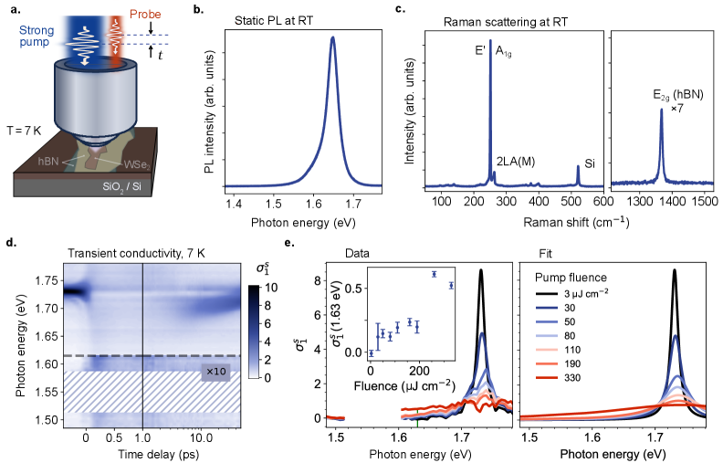
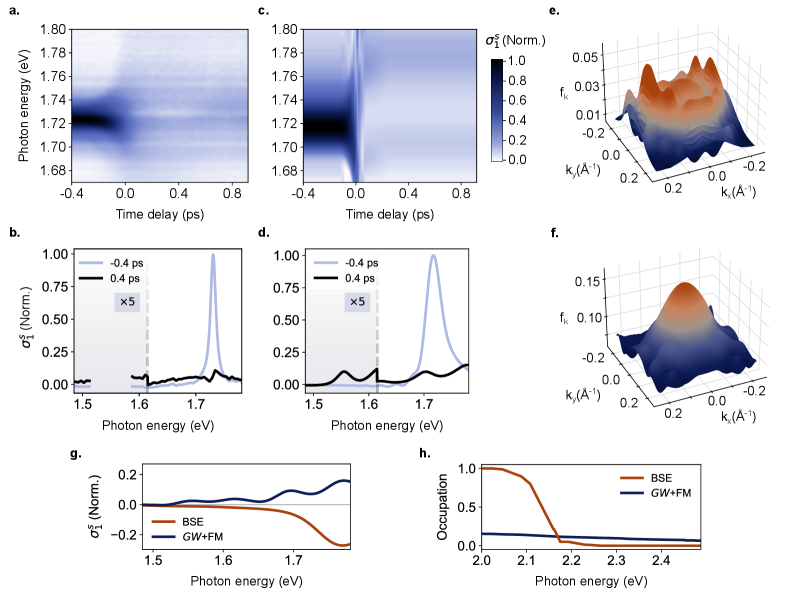
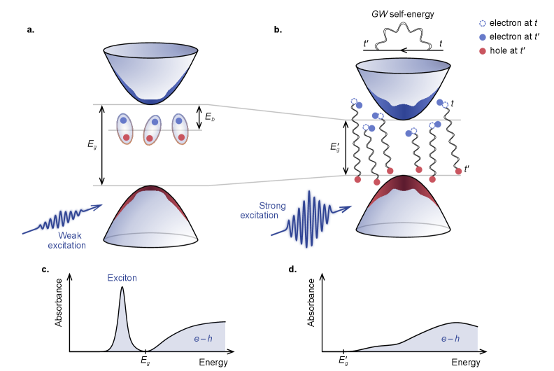
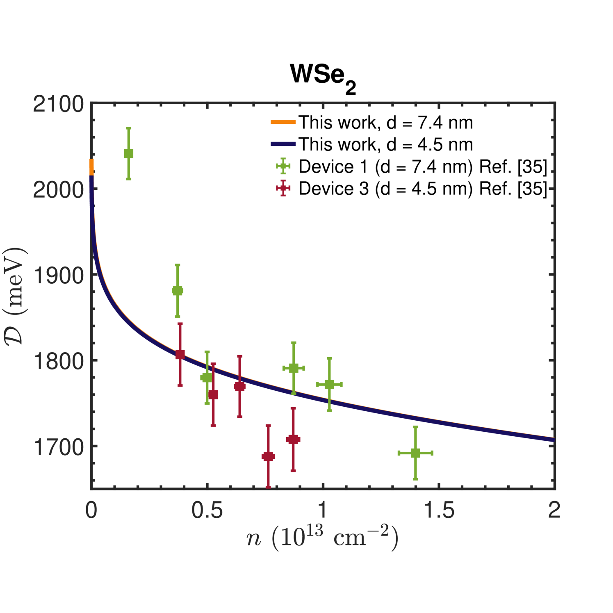
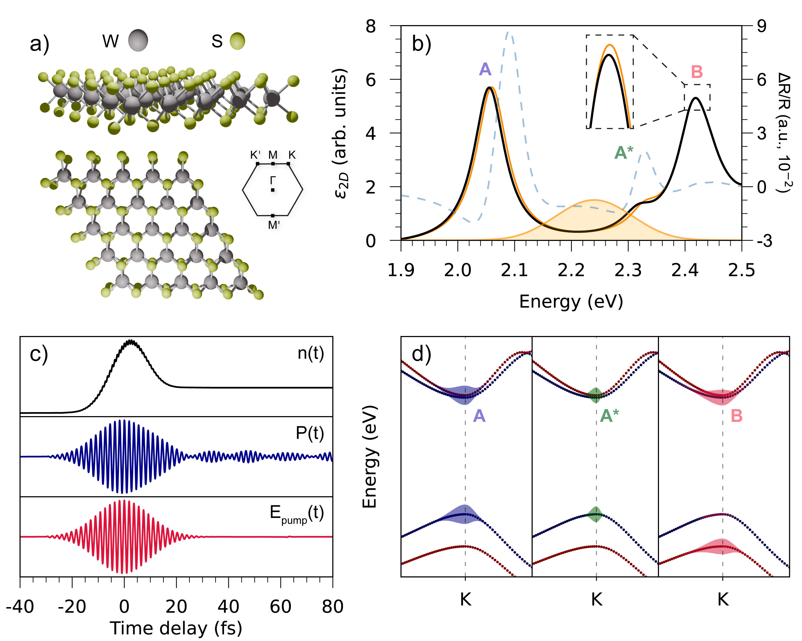

# 反転分布なき励起子モット転移：非平衡ダイナミカルスクリーニングが問い直す2次元半導体の光物理

- **執筆日**: 2026-04-11
- **トピック**: Excitonic Mott Transition without Population Inversion in 2D TMDs
- **タグ**: Nonequilibrium and Dynamic Response / Excitons and Photoinduced Response; Low-Dimensional Materials / Pump-Probe Measurements; First-Principles Calculations
- **注目論文**: Dogadov et al., "Excitonic Mott transition without population inversion," arXiv:2604.06897 (2026)
- **参照関連論文数**: 6

---

## 1. なぜ今この話題なのか

2次元遷移金属ダイカルコゲナイド（2D TMD：MoS₂、WS₂、WSe₂など）は、原子1層の厚みを持つ半導体として、過去15年間で急速に研究が進んだ材料群である。これらの材料は単層になると直接遷移型バンドギャップを持つようになり、発光効率が飛躍的に高まるという特異な性質を示す。加えて、2次元閉じ込めによってクーロン相互作用が強まることから、**励起子**（電子と正孔が電気的に束縛した準粒子）の結合エネルギーが0.5 eV前後と非常に大きく、室温でも安定して存在する。この強い光励起子相互作用が、光物理研究の絶好の舞台として2D TMDを押し上げている。

こうした背景の中で特に注目されているのが、**励起子モット転移（excitonic Mott transition, EMT）** と呼ばれる現象である。これは、フォトポンピングによって多数のキャリア（電子・正孔）が生成されると、ある臨界密度（モット密度）を境に励起子が解離し、自由な電子正孔プラズマへと移行する転移である。この転移は半導体の強い光励起下での基本的な多体効果を体現するだけでなく、実用面でも重要である。なぜなら、EMTに伴う「反転分布（population inversion）」の形成は、半導体レーザーの動作原理そのものであり、2D TMDを用いた超薄型レーザーや光スイッチの実現に直結するからである。ここで反転分布とは、伝導帯のキャリア分布関数 $f_c$ と価電子帯のキャリア分布関数 $f_v$ が、あるエネルギー範囲で $f_c + f_v > 1$ を満たす状態を指す。これが成立すると、そのエネルギー域で誘導放射が吸収を上回り、光学ゲインが生まれる。

2015年、Chernikov らは単層WS₂において強い光励起下でバンドギャップが約500 meV 赤方偏移し、反転分布と誘導放射ゲインが生じることを観測したと報告した（Nature Photonics, 2015）。この報告は「2D半導体でもフォトポンピングにより超高速レーザー動作が可能ではないか」という期待を大いに高めた。しかし近年、高品質なヘキサゴナル窒化ホウ素（hBN）封止試料と精密な過渡分光実験が整備されてきたことで、EMTの描像は再検討を迫られている。

2026年4月、Dogadov らは単層WSe₂においてEMTが「反転分布なしに」起きることを実験・理論の両面から示した（arXiv:2604.06897）。励起子共鳴は約100 fs以内に完全に消滅するが、光学ゲインはどのエネルギー域にも現れない。この結果は、EMTを「準熱的な静的スクリーニング」で理解する従来の枠組みを根底から問い直すものであり、非平衡ダイナミカルスクリーニングという新しい機構が支配的であることを示唆する。

---

## 2. この分野で何が未解決なのか

EMTの研究には、現在も活発に議論されている問いが複数存在する。

**問い1：EMTは連続転移か不連続転移か？**
WS₂とWSe₂では転移の様相が異なることが指摘されてきた。2026年1月、Mohapatra らは単層WS₂において、励起密度が閾値を超えると励起子ピークのエネルギーが急激に赤方偏移し、プラズマが突然出現するという不連続的な転移を報告した（arXiv:2601.17167）。一方WSe₂では連続的な変化が多く見られるとされる。この差異が材料固有の電子構造（スピン軌道相互作用の強さ、谷の縮退度など）に由来するのか、試料品質や温度の違いに起因するのかはまだ確定していない。

**問い2：EMTに反転分布は伴うのか？**
EMTが起きたとき、光学ゲインが生じるかどうかは光デバイス応用に直結する問いである。準熱的なシナリオでは、バンドギャップ繰り込みによって光学ギャップが励起子準位を下回り、その赤方偏移したギャップ付近で反転分布が形成されて光学ゲインが生まれると予測される。実際Chernikov ら（2015）の実験はその証拠と解釈されてきた。しかし、これが室温・低品質試料での測定であったこと、WSe₂ではなくWS₂が対象であったことを考えると、より純粋な系での再検証が不可欠である。

**問い3：超高速領域でのEMT機構は何か？**
100 fs以下の超高速時間スケールでは、電子間・電子正孔間の多体相互作用が他のどの緩和過程よりも速く展開する。熱化（キャリアが Fermi-Dirac 分布に落ち着く過程）は一般にピコ秒スケールかかるため、100 fs の範囲ではキャリアは強く**非熱的（nonthermal）** である。このとき、スクリーニング自体も時間とともに変化する「ダイナミカルスクリーニング」が重要になる。従来の静的スクリーニング理論やマルコフ近似に基づく半導体ブロッホ方程式では、この効果を正しく取り込めない。非平衡グリーン関数（NEGF）のような非マルコフ的・記憶効果を含む第一原理理論が必要となる。

---

## 3. 注目論文の核心

Dogadov et al.（arXiv:2604.06897, 2026）は、この第三の問いに真正面から答えた論文である。

**試料と測定条件**  
試料は hBN に両面封止された単層WSe₂で、界面の乱れや欠陥が最小化された最高品質のものである（図1a）。測定は液体ヘリウム温度（7 K）で行われ、光フォノン散乱や熱的なキャリア散乱を大幅に抑えた条件下に置かれた。励起には330 μJcm⁻²（モット密度を超える高フルエンス）のフェムト秒パルスを用い、広帯域フェムト秒過渡反射率分光でWSe₂の励起子共鳴近傍のスペクトル変化を時間分解観測した（図1d）。

*図1：(a) hBN封止単層WSe₂試料の概念図。(b) 室温でのフォトルミネッセンス、(c) ラマンスペクトル。(d) 高フルエンス励起（330 μJcm⁻²）における過渡導電率のカラーマップ。励起子ピークが約100 fs以内に消滅していることが分かる。[Dogadov et al., arXiv:2604.06897 (2026), CC BY-NC-ND 4.0]*

**主要な実験結果**  
観測された過渡スペクトルには二つの際立った特徴がある。第一に、WSe₂のA励起子共鳴（～1.7 eV）が光励起後100 fs足らずで完全に消失する。これは確かにEMTが超高速で起きていることを示す。第二に——そしてこれが最重要の発見だが——光学ゲイン（負の吸収、すなわち誘導放射）の証拠がスペクトルのどこにも見当たらない（図2b）。バンドギャップ繰り込みに対応する低エネルギー側での吸収増加は観測されるが、そこにゲインはない。従来の準熱的シナリオでは、モット転移後のプラズマにより光学ギャップが赤方偏移し、そのギャップ付近に反転分布が形成されてゲインが生じるはずだが、これは実現していない。

**理論との突き合わせ**  
同グループは、実験と並行して**実時間非平衡グリーン関数（real-time NEGF）法**に基づく第一原理シミュレーションを行った。この方法は Perfetto、Stefanucci らが近年開発した計算手法（arXiv:2109.15209, 2021）に立脚し、時間依存 GW 自己エネルギーをカダノフ-バイム方程式（Kadanoff-Baym equations）の一般化カダノフ-バイム近似（GKBA）のもとで解く。この手法の最大の特徴は、スクリーニングの**時間的な記憶効果**（非マルコフ効果）を自然に取り込める点にある。

計算結果は実験と驚くほどよく一致した（図2c,d）：励起子共鳴の消失、ゲインの不在、低エネルギー側の自由キャリア吸収増加、いずれも再現された。さらに、計算ではキャリア分布関数の時間発展も得られており、100 fs の段階でキャリアが強く非熱的であることが確認された（図2e,f）。

*図2：(a,b) 実験、(c,d) 理論計算による過渡導電率マップおよび選択した時間遅延でのスペクトル。(e,f) 計算から得られたキャリア分布関数（nonthermal状態を示す）。準熱平衡シナリオは光学ゲインを予測するが、実験・NEGF計算ともにゲインは現れない。[Dogadov et al., arXiv:2604.06897 (2026), CC BY-NC-ND 4.0]*

**物理的メカニズム：非平衡ダイナミカルスクリーニング**  
Dogadov らが提唱するメカニズムは以下のように整理できる（図3）。低密度励起（図3a）では、バンドギャップ繰り込みはわずかで、クーロン引力は実質的に静的（時間依存性が小さい）と見なせる。電子と正孔は束縛状態（励起子）を形成し、結合エネルギー $E_b$ で安定している。

一方、モット密度を超える高密度励起（図3b）では、フォトポンピングによって急速に生成された高密度の非熱的キャリアが、励起子形成の時間スケール（～100 fs）と同等以下の時間スケールでダイナミカルなスクリーニングを発達させる。このスクリーニングは二重の効果をもたらす：

1. バンドギャップが繰り込まれ $E_g \to E_g'$（赤方偏移）
2. クーロン引力そのものが弱まり、励起子結合エネルギー $E_b$ が消失する

重要なのは、これら二つの効果が**同時に**非平衡・非熱的に進行する点である。熱化前のキャリアは価電子帯の上方・伝導帯の下方に偏って分布しているため、反転分布の条件（$f_c + f_v > 1$）を満たさない。したがって、励起子が消滅した後もゲインは生まれない。

*図3：低密度(a)と高密度(b)励起における励起子形成・消滅の概念図。(b)では非熱的キャリアによる非平衡ダイナミカルスクリーニングが励起子を解離させるが、キャリア分布は反転しておらず光学ゲインは生じない。[Dogadov et al., arXiv:2604.06897 (2026), CC BY-NC-ND 4.0]*

---

## 4. 背景と研究史

単層TMDにおける励起子物理の確立は、2010年代初頭のMak、Splendiani らによる直接遷移ギャップの発見に始まる。2014年にはChernikov らが反射コントラスト分光によりWSe₂とWS₂の励起子結合エネルギーを実測し（arXiv:1404.2331）、~500 meV にも達する巨大な値を示した。これは3次元半導体の典型値（数meV〜数十meV）を桁違いに凌ぐもので、2次元閉じ込めと非局所スクリーニングが組み合わさることで初めて理解できる。

**励起子スクリーニングの理論的理解**  
2D励起子の静的スクリーニングを記述する標準的な枠組みとして、Rytova-Keldyshポテンシャルに基づくモデルが広く使われてきた。しかし近年、より第一原理的な手法も進展している。Ninhos ら（arXiv:2603.10966, 2026）は、ランダム位相近似（RPA）で計算した2次元誘電関数を Bethe-Salpeter 方程式（BSE）に組み込む「量子スクリーニング」アプローチを開発し、従来の古典的モデルとほぼ同等の精度を保ちつつ計算効率を向上させた。彼らの研究は、平衡状態における励起子の結合エネルギーと光スペクトルを精度よく再現できる枠組みを提供する。これはいわば、本稿の注目論文が超える「出発点」となる静的な理論的背景である。

**静的BGR理論と実験との比較**  
キャリア誘起バンドギャップ繰り込みの理論研究も精緻化が進んでいる。Engdahl ら（arXiv:2501.08578, 2025）は、MoS₂およびWSe₂に対して虚数周波数形式フェインマンダイアグラム法を用いたBGR理論を構築し、MoSe₂やWSe₂のゲート調整実験と良い一致を示した。彼らの計算によれば、$n \sim 10^{12}$ cm⁻² 程度のキャリア密度でも数十〜数百 meV のギャップ縮小が起きうる（図、下記参照）。この静的BGR理論が予測する光学ギャップの赤方偏移は、エネルギー保存と熱的キャリア分布を仮定すれば反転分布の条件を満たしやすくなる。しかしこれはあくまで**静的かつ準熱平衡**な描像であり、超高速領域では適用範囲を超える。

*図：WSe₂/hBN系でのバンドギャップ繰り込みの理論計算（青：ダイナミカルスクリーニングモデル）と実験データの比較。数十meVから数百meVの繰り込みがキャリア密度とともに増大するが、この計算は静的・準熱平衡を仮定する。[Engdahl et al., arXiv:2501.08578 (2025), CC BY 4.0]*

**WS₂における不連続EMT**  
Mohapatra ら（arXiv:2601.17167, 2026）は単層WS₂をA励起子に共鳴したフェムト秒パルスで励起し、励起密度を変えながら過渡スペクトルを系統的に測定した。その結果、励起密度が閾値を超えると励起子ピーク位置が急激に赤方偏移し、プラズマ相が不連続に出現することを見出した。この「一次相転移的」な振る舞いは、EMTが漸進的なクロスオーバーではなく真の転移である可能性を示唆する。しかしこの実験は室温で行われており、反転分布の有無については本稿の注目論文ほど精密な分析がなされていない。WSe₂とWS₂の違い（スピン軌道分裂の大きさ、明状態・暗状態の配置など）が、EMTの性格の違いを生む可能性も議論されている。

**励起子理論の異なる枠組み：半導体ブロッホ方程式アプローチ**  
Mittenzwey ら（arXiv:2512.03198, 2025/2026）は、高密度かつコヒーレント励起下の2次元半導体をクラスター展開法（動的クラスター展開理論, DCT）に基づく励起子理論で記述した。彼らの研究対象はモット密度以下のMoSe₂であり、強い円偏光励起下での励起子ラビ振動が Pauli ブロッキングと クーロン多体効果によって著しく抑制される様子を示した。この理論的枠組みは、Knorr グループが長年開発してきた半導体ブロッホ方程式の励起子表現への拡張であり、本稿の注目論文とは異なる第一原理NEGF手法と対照的である。両者を比較すると、DCTアプローチは励起子のコヒーレント相における物理（ラビ振動、二励起子相関）を詳細に取り扱えるが、キャリアの非熱的分布とダイナミカルスクリーニングの記憶効果を同等の精度で取り込むことは難しい。

**Perfetto-Stefanucci グループの実時間 GW 手法の発展**  
注目論文の理論的根幹を支えるのは、Perfetto、Pavlyukh、Stefanucci ら（arXiv:2109.15209, 2021）が開発した実時間 GW–NEGF 法である。この手法は、時間依存する GW 自己エネルギーを GKBA のもとで解くことで、2D材料の超高速ダイナミクスを第一原理的に記述できる。特に彼らは2021年の先行研究で、共鳴ポンピングされた半導体において「自己持続的スクリーニングカスケード」がモット転移を誘発することを示しており、今回の注目論文はそれを実験的に検証・拡張したものと位置づけられる。

---

## 5. どの解釈が最も妥当か

現時点で最も証拠に支持されている解釈を整理し、未確定な要素を明確にする。

**強く支持される結論：非熱的キャリア＋ダイナミカルスクリーニングがEMTを駆動する**  

注目論文の結論は、実験（hBN封止WSe₂, 7K）と実時間NEGF計算の間に**定量的な一致**があることで強く支持されている。特に重要なのは、計算から直接得られるキャリア分布関数が100 fs時点で強く非熱的である点である。また、準熱平衡モデル（Fermi-Dirac 分布 + 静的BGR）をあえて用いると光学ゲインが予測されるにもかかわらず実験ではゲインが現れないという「陰画的証拠」も説得力がある。

さらに、BGRの理論計算（Engdahl ら, arXiv:2501.08578）と整合させると次の解釈が成り立つ：高フルエンス励起でもバンドギャップは確かに繰り込まれるが、繰り込みの速度とキャリア熱化の速度が競合し、熱化前にスクリーニングが成立して励起子が解離する。このとき「ゲインが生じる」のに必要な反転分布は形成されていない。

**比較による解釈の絞り込み**  

WS₂（2601.17167）とWSe₂（2604.06897）を比較すると、前者では不連続な「プラズマ出現」が観測されたが、後者では超高速・ゲインなしのEMTが確認された。この差異の一つの解釈は、WSe₂では「暗励起子」（スピン禁制遷移）の役割が異なり、熱化や散乱の経路が変わることで非熱的なダイナミクスが顕著に現れるというものである。ただし、2601.17167 は室温測定であり、温度の差も見逃せない。温度が下がると格子との熱交換が減り、キャリアはより長時間にわたって非熱的状態にとどまりやすい。

Cervantes-Villanueva ら（arXiv:2603.26386, 2026）の ab initio GW-BSE ワニエ方程式による WS₂研究は、コヒーレント励起下（低密度）でのA, A*, B 励起子間の結合と振動を記述する。これは注目論文のモット密度超え・インコヒーレント領域とは異なる物理を扱っており、直接比較はできない。しかしこのアプローチは「低密度・コヒーレント」から「高密度・インコヒーレント」へのどの時点で NEGFが本質的に必要になるかを理解するうえで重要な文脈を与える。

*図：WS₂単層の結晶構造・平衡吸収スペクトル・バンド構造（左）と、GW-BSE ワニエ方程式によるA, A*, B 励起子の時間発展（右）。これは低密度コヒーレント励起での計算であり、注目論文の高密度・非熱的領域とは対照をなす。[Cervantes-Villanueva et al., arXiv:2603.26386 (2026), CC BY 4.0]*

**まだ弱い結論：WS₂でも同様かどうか**  

注目論文はWSe₂のみを対象としており、WS₂での同様の実験はまだ明確に行われていない。WS₂とWSe₂では明暗励起子の順序が逆転しており、光学活性な「明」励起子のダイナミクスが異なりうる。また、WS₂では過去に反転分布の証拠（Chernikov 2015）が報告されており、その結果が温度・試料品質・測定手法のどれに起因するかを区別するためには、WS₂の hBN封止試料での低温・精密実験が必要である。

**より根本的な疑問：他の材料・構造への普遍性**  
モアレヘテロ構造（例: MoSe₂/WSe₂ twisted bilayer）やポラリトン系（キャビティ中のTMD）でのEMTはどうか。モアレ系では有効質量や誘電スクリーニングが著しく変調されており、モット密度の評価そのものが変わりうる。また、ポラリトン系ではフォトン部分が光子浴との結合を通じてさらに別の非平衡チャンネルをもたらす。これらの系における EMT 機構は未解明のまま残っている。

---

## 6. 何が一般化できるのか

本研究の最も重要な一般的含意は、「超高速励起下でのEMTには反転分布が不要である」という命題が、少なくともWSe₂について実験的・理論的に確立されたことである。これは以下のような広がりを持つ。

**超高速光スイッチへの含意**  
光通信や量子情報処理への応用として、超高速（~100 fs）で励起子共鳴を消滅させる「光スイッチ」の動作原理として、今回のEMTメカニズムは有力である。光スイッチに光学ゲインは必要ないため、反転分布がなくとも吸収の急激な変化（励起子共鳴の消失）は応用上有用である。ただし、スイッチング後のキャリアが散乱・再結合して励起子共鳴が復活するまでの時間（本研究では約0.65 psのオーダー）が「オフ時間」となる制約も明らかになった。

**2D TMDレーザーへの教訓**  
一方、フォトポンピングによる反転分布を利用した2D TMDレーザーを設計するには、単純にモット密度以上に励起するだけでは不十分であることが示唆される。キャリアの熱化が完了するまで（ピコ秒スケール）待って準熱平衡な反転分布を利用する、あるいは準CW励起で非熱的領域を避けるといった設計が必要になるかもしれない。逆に言えば、従来の（室温・準熱平衡な）実験報告はそれなりに正確だった可能性もあり、デバイス動作条件（温度・励起パルス幅）を適切に選べばゲインは実現できうる。

**モット転移物理の枠組みとしての意義**  
より抽象的なレベルでは、「静的スクリーニング」と「動的スクリーニング」、「熱的キャリア」と「非熱的キャリア」という二つの対比が、超高速現象を理解する鍵として際立った。この枠組みは TMD に限らず、ペロブスカイト、GaN、GaAs などの従来型半導体の超高速ポンプ実験にも適用できる。特に薄膜・ナノ構造で閉じ込め効果が強い場合、2次元での知見は有用な先行例となる。

**理論的枠組みの射程：NEGFとその限界**  
実時間NEGF（GW-GKBA）が今回のような超高速・高密度領域の記述で有効であることが実証されたことは、計算材料科学としても重要である。NEGF は電子間相互作用のダイナミクスを非摂動的・非マルコフ的に扱えるため、静的スクリーニング理論（Engdahl et al.）や半導体ブロッホ方程式（Mittenzwey et al.）の適用範囲を超えた領域を切り開ける。ただし現状の計算は比較的小さいk点サンプリングと2バンドモデルに限られており、実際のTMDにおける複数のバンド（スピン分裂した伝導帯・価電子帯）や谷間散乱、フォノン結合を完全に組み込むには計算コストの壁がある。

---

## 7. 基礎から理解する

このトピックを理解するために必要な基礎概念を順を追って解説する。

### 励起子とは何か

半導体に光を当てて価電子帯の電子を伝導帯に励起すると、電子が抜けた穴（正孔）が残る。この電子と正孔はともに電荷を持つため、クーロン引力で束縛されて「水素原子」に似た準粒子を形成する。これが**励起子**（exciton）である。

励起子の結合エネルギーは水素原子のリュードベリ公式と類比できる：

$$E_b = \frac{\mu e^4}{2\hbar^2 \varepsilon^2} \cdot \frac{1}{n^2}$$

ここで $\mu = m_e m_h / (m_e + m_h)$ は電子正孔換算質量、$\varepsilon$ は誘電率、$n$ は主量子数である。バルク半導体（例：GaAs）では $E_b \sim 10$ meV 程度で、室温の熱エネルギー $k_BT \sim 25$ meV より小さく、室温では励起子は熱的に解離してしまう。

ところが2次元TMD単層では事情が異なる。閉じ込めにより電子と正孔の軌道が重なりやすくなるうえ、2次元系特有の非局所誘電スクリーニング（Rytova-Keldyshポテンシャル）によってクーロン引力が強まる。その結果 $E_b \sim 0.5$ eV に達し、室温でも安定した励起子が存在できる。

### 励起子モット転移とモット密度

キャリア密度 $n$ が増加すると、他の電子正孔対によるスクリーニングが強まり、励起子の結合エネルギーが縮小していく。同時に、バンドギャップ自体がBGRによって赤方偏移する。ある臨界密度（**モット密度** $n_M$）を超えると励起子が不安定化し、自由キャリアプラズマへと移行する。モット密度の目安は、励起子ボーア半径 $a_B$ を使って

$$n_M \sim a_B^{-2}$$

と見積もられ、2D TMD では $n_M \sim 10^{12}$〜$10^{13}$ cm⁻² のオーダーである。

### バンドギャップ繰り込みとは

自由キャリアが存在するとき、電子間・電子正孔間の交換相関相互作用によってバンドギャップが狭まる。これを**バンドギャップ繰り込み**（BGR）と呼ぶ。3次元では交換エネルギーの寄与が主であり、$\Delta E_g \propto -e^2 k_F / \pi$ と密度の1/3乗に比例する。2次元では対数補正や誘電環境依存性が入るため、より複雑な表式になるが、本質的には「密度が高いほどギャップが縮まる」という傾向は同じである。BGRによってシングル粒子ギャップが赤方偏移し、かつ励起子結合エネルギーが縮小することで、実際に観測される励起子共鳴エネルギーは双方の競合によって決まる。

### 反転分布と光学ゲイン

光学ゲイン（誘導放射）が生じるためには、**反転分布**が必要である。バンドエッジ付近のエネルギー $E$ での反転の条件は、伝導帯の占有率 $f_c(E)$ と価電子帯の空孔率（正孔占有率）$f_v(E)$ を用いて

$$f_c(E) + f_v(E) > 1$$

と表せる。熱平衡に近い準フェルミ準位 $E_{Fc}$、$E_{Fv}$ を持つキャリア分布では、$E_{Fc} - E_{Fv} > E_g'$（BGRで縮小したギャップ）のとき光学ゲインが生まれる。従来の準熱平衡描像では、高密度励起後に熱化したキャリアが大きな $E_{Fc} - E_{Fv}$ を形成してゲインが期待されていた。

しかし今回の注目論文が示したように、100 fs の超高速時間スケールでは熱化が不完全で、キャリアが注入エネルギー近傍に偏った非熱的分布を持つ。この状態では $f_c + f_v > 1$ の条件が満たされにくい。

### 非平衡グリーン関数（NEGF）と記憶効果

非平衡量子多体系を記述する強力な枠組みが**非平衡グリーン関数法**（NEGF; Kadanoff-Baym 方程式）である。単粒子グリーン関数 $G(t,t')$ の時間発展は次のような積分微分方程式（KB方程式）に従う：

$$i\hbar \frac{\partial}{\partial t} G(t,t') = h_0 G(t,t') + \int_{t_0}^{t} \Sigma(t,\bar{t}) G(\bar{t},t') d\bar{t}$$

ここで $\Sigma(t,\bar{t})$ は自己エネルギーで、過去の時刻 $\bar{t}$ における系の状態との相関を記憶している（**記憶効果**・非マルコフ効果）。マルコフ近似では $\Sigma(t,\bar{t}) \propto \delta(t-\bar{t})$ と瞬間的な応答に置き換えるが、超高速ダイナミクスではこれが不十分となる。GW 自己エネルギー（1粒子グリーン関数と遮蔽クーロン相互作用 $W$ の積）を GKBA のもとで解くことで、ダイナミカルスクリーニング（$W(t,t')$; 時間依存）を完全に取り込んだ計算が可能となる。

---

## 8. 専門用語の解説

**1. 励起子（Exciton）**  
半導体でクーロン引力によって束縛した電子と正孔の対。光吸収スペクトルにシャープな共鳴ピーク（励起子共鳴）として現れる。2D TMD 単層では結合エネルギーが数百 meV と大きく、室温でも安定して存在する。

**2. 励起子モット転移（Excitonic Mott Transition, EMT）**  
フォトポンピングなどでキャリア密度がモット密度 $n_M$ を超えると、励起子が解離して自由電子正孔プラズマへ移行する密度駆動の転移。Mott（モット）は本来金属-絶縁体転移の文脈で使われる名前で、スクリーニングによる束縛状態の不安定化という概念が共通する。

**3. バンドギャップ繰り込み（Bandgap Renormalization, BGR）**  
自由キャリアが存在するとき、交換相関相互作用によってバンドギャップが縮小する現象。2D TMD では高密度励起下で数百 meV 以上に達することがある。EMT と密接に関連し、ギャップの縮小が励起子共鳴の赤方偏移を引き起こす。

**4. 非平衡グリーン関数法（Non-Equilibrium Green's Function, NEGF）**  
平衡状態から大きく離れた系の量子多体ダイナミクスを厳密に記述するための理論枠組み。Kadanoff-Baym 方程式を基礎とし、電子・正孔間の時間的相関（記憶効果）や非マルコフ効果を自然に取り込める。

**5. 非熱的キャリア（Nonthermal Carriers）**  
フォトポンピング直後など、Fermi-Dirac 分布へ熱化する前のキャリア。注入されたフォトンエネルギー付近に偏った非熱的な分布関数を持ち、熱化が完了した状態（準フェルミ準位で特徴づけられる）とは全く異なる光学応答を示す。

**6. ダイナミカルスクリーニング（Dynamical Screening）**  
スクリーニング（クーロン相互作用の遮蔽）が時間依存し、周波数依存性（記憶）を持つ状態。静的スクリーニング（瞬時応答）と対比される。超高速励起下では、スクリーニングの発達速度が他のダイナミクスと競合するため、時間依存を正しく取り込む必要がある。

**7. 反転分布（Population Inversion）**  
光学ゲイン（誘導放射）が生じる条件として必要な、伝導帯に正孔より電子が多い状態。準熱平衡系では大きな準フェルミ準位差 $E_{Fc} - E_{Fv}$ がこれに対応する。半導体レーザーの動作原理の核心である。

**8. ポンプ-プローブ分光（Pump-Probe Spectroscopy）**  
強いフェムト秒パルス（ポンプ）で系を励起し、時間遅延後に弱いプローブパルスで過渡的な光学応答を測定する手法。時間分解能は数十 fs まで達し、超高速ダイナミクスの直接観測が可能。本論文では広帯域プローブを用いてスペクトル全域の過渡変化を同時に測定している。

**9. 遷移金属ダイカルコゲナイド（Transition Metal Dichalcogenide, TMD）**  
MX₂（M = Mo, W；X = S, Se, Te）の化学式を持つ層状半導体群。単層では直接遷移型になり、高い発光効率と巨大な励起子結合エネルギーを示す。K点とK'点の2つの谷（valley）が存在し、「バレートロニクス」と呼ばれる新しい自由度の利用も研究されている。

**10. hBN 封止（Hexagonal Boron Nitride Encapsulation）**  
六方晶窒化ホウ素（hBN）で TMD 単層を挟み込む試料作製技術。hBN は超平坦な絶縁体で、TMD表面の欠陥や異物を著しく減らし、励起子の線幅を細くして本質的な物性を観測できる試料品質を実現する。近年の精密光学・輸送実験はほぼすべてこの技術に依拠している。

---

## 9. 今後の展望

Dogadov らの研究が確立したこと、そして残した課題について整理する。

**確からしくなったこと**  
今回の研究により、単層WSe₂を低温（7 K）・高フルエンス・フェムト秒励起という条件のもとで超高速にEMTが起きる際には、反転分布が形成されず光学ゲインも生じないことが、実験とNEGF理論の定量的一致によって確立された。その機構は「非熱的キャリアによる非平衡ダイナミカルスクリーニング」という概念によって統一的に説明できる。この結果は、超高速 2D フォトスイッチ（ゲイン不要）の設計原理として直接的に活用できる知見である。また、NEGF（GW-GKBA）が実際の超高速 TMD 実験を定量的に説明できることが示されたことは、計算手法として重要なベンチマークとなる。

**未解決な問いと今後の展望**  
最も重要な未解決問題は、室温・WS₂・他の TMDにおける状況の精密な解明である。Chernikov らの2015年報告（WS₂、室温）で示唆された反転分布は、今回と異なる温度・材料・試料品質・励起条件でのものであり、それが本当に熱化後の準平衡反転分布を反映しているのか、あるいは別の解釈（例えば誘起吸収の誤帰属など）が妥当なのかを区別するためには、hBN封止WS₂の低温精密実験が急務である。また、時間分解 ARPES（角度分解光電子分光）などのk空間・エネルギー分解キャリア分布直接観測実験は、非熱的分布仮説を直接検証できる有力な手段として注目される。理論側では、フォノン結合を NEGF 枠組みに組み込んで温度依存性を記述し、室温・常温環境でのEMTとの接続を図ることが次のステップとなる。さらに1〜3年のスパンでは、モアレ超格子（ひねり積層TMD）での EMT 研究が活発化するだろう。モアレポテンシャルで局在した「モアレ励起子」のモット転移は、通常のTMD単層とは全く異なる密度スケールと相挙動を示す可能性があり、非平衡・非熱的なダイナミクスが強い影響を持つ新しい舞台として期待される。

---

## 参考論文一覧

1. **[Dogadov et al., arXiv:2604.06897 (2026)](https://arxiv.org/abs/2604.06897)**  
   【注目論文】hBN封止単層WSe₂において反転分布なき励起子モット転移をポンプ-プローブ実験と実時間NEGF計算で示した論文。

2. **[Mohapatra et al., arXiv:2601.17167 (2026)](https://arxiv.org/abs/2601.17167)**  
   単層WS₂において励起密度閾値を超えると励起子ピークが急激に赤方偏移するという不連続なEMTを超高速分光で報告した論文。

3. **[Mittenzwey, Voigt, Knorr, arXiv:2512.03198 (2025)](https://arxiv.org/abs/2512.03198)**  
   モット密度以下のMoSe₂単層において励起子理論（クラスター展開）を使って高密度下での光学応答を計算し、パウリブロッキングによるラビ振動の抑制を示した論文。

4. **[Ninhos et al., arXiv:2603.10966 (2026)](https://arxiv.org/abs/2603.10966)**  
   ランダム位相近似に基づく量子スクリーニングをベーテ-ソルピター方程式に組み込み、2D材料の励起子結合エネルギーを高精度・高効率に計算する手法を提案した論文。

5. **[Engdahl et al., arXiv:2501.08578 (2025)](https://arxiv.org/abs/2501.08578)**  
   虚数周波数形式フェインマンダイアグラム法を用いてMoS₂およびWSe₂でのキャリア誘起バンドギャップ繰り込みを理論計算し、実験と良い一致を示した論文。

6. **[Cervantes-Villanueva et al., arXiv:2603.26386 (2026)](https://arxiv.org/abs/2603.26386)**  
   第一原理GW-BSEワニエ方程式を用いて、低密度コヒーレント励起下の単層WS₂でA, A*, B励起子間のコヒーレント振動を計算し、その制御可能性を示した論文。

7. **[Perfetto, Pavlyukh, Stefanucci, arXiv:2109.15209 (2021)](https://arxiv.org/abs/2109.15209)**  
   実時間GW-NEGF（時間線形スケーリング）を2D材料に適用し、共鳴励起された半導体で「スクリーニングカスケード」によるモット転移が起きることを理論的に予測した方法論的先駆論文。
