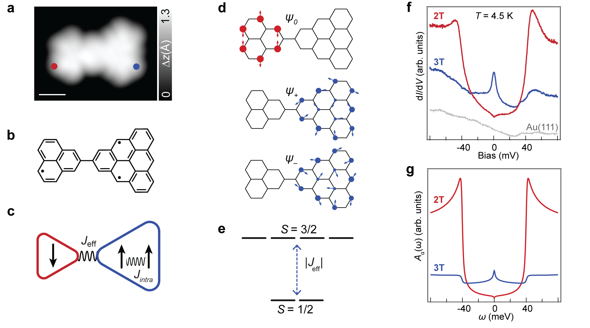
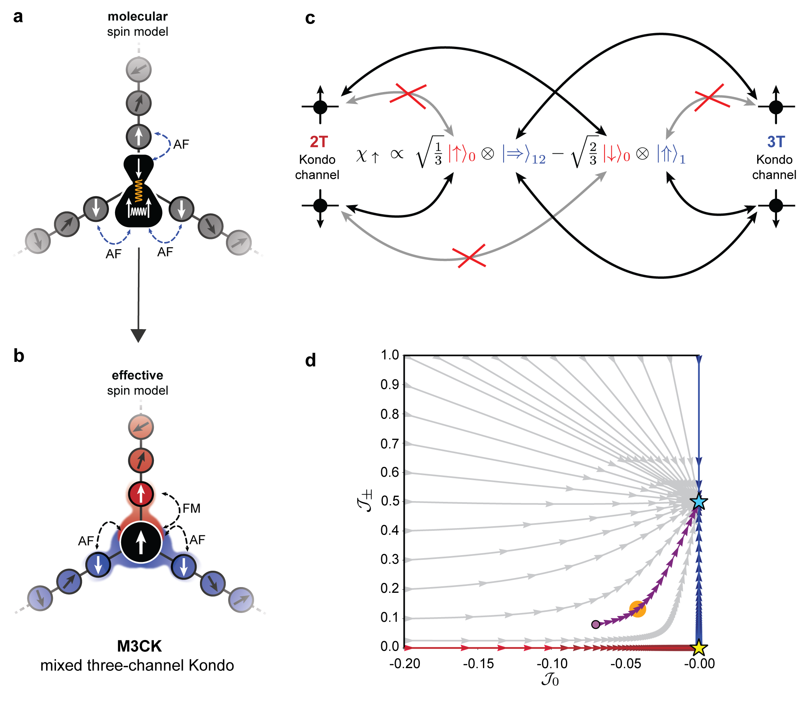
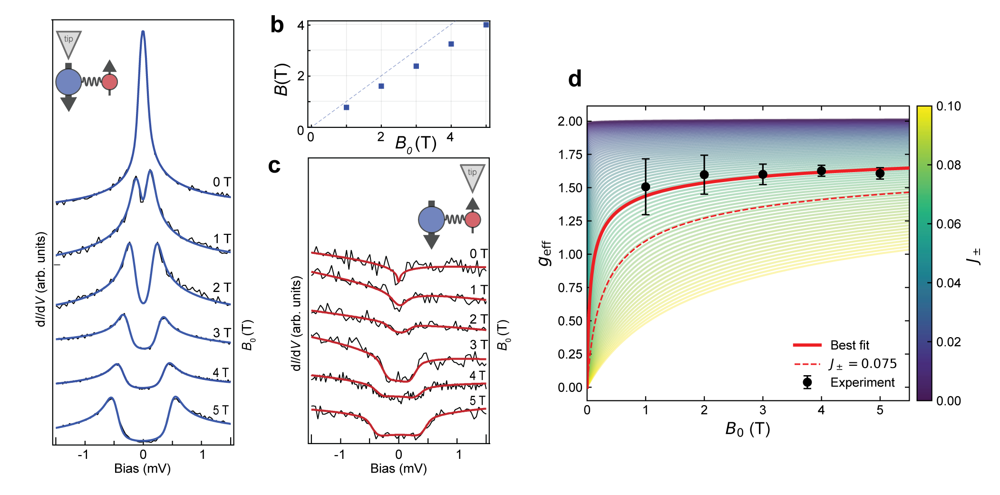
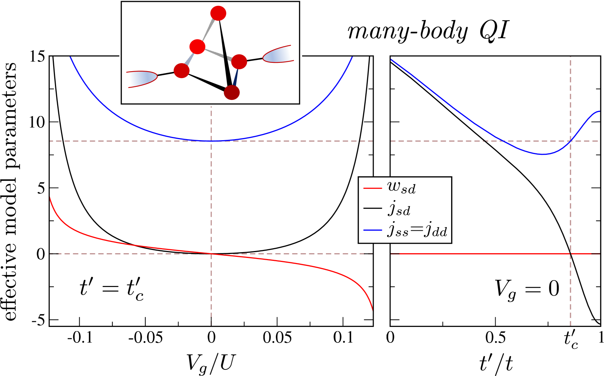
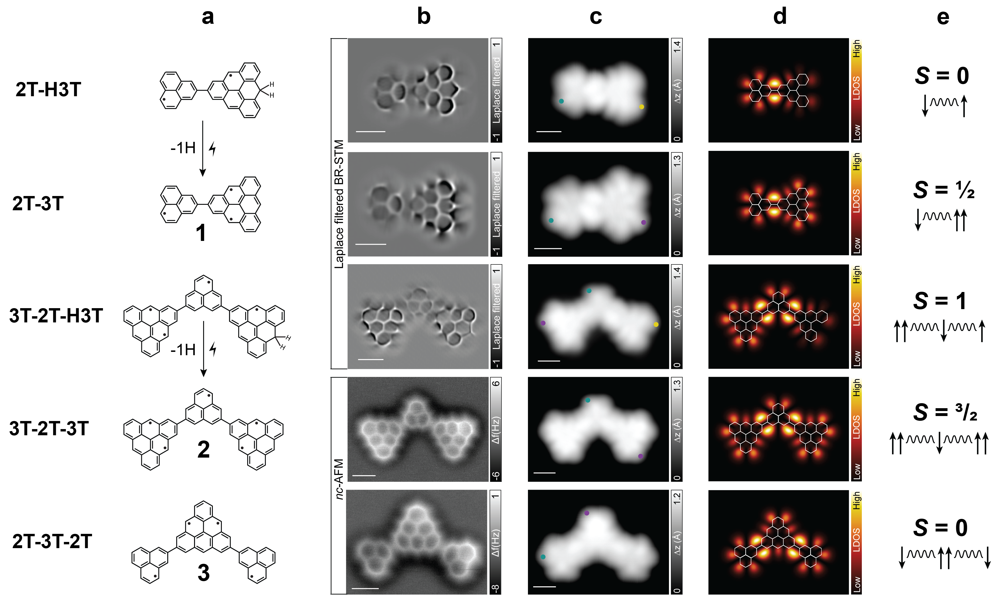

# 強磁性近藤効果の実験的発見：ナノグラフェン分子が拓くノン・フェルミ液体物理

- **執筆日**: 2026年4月11日
- **トピック**: 強磁性近藤効果、多チャンネル近藤、ナノグラフェン分子スピン系
- **タグ**: Superconductivity and Strongly Correlated Systems / Low-Temperature Properties; Low-Dimensional Materials / STM/STS
- **注目論文**: E. Turco et al., "Observation of the Ferromagnetic 近藤 Effect," arXiv:2604.07174 (2026)
- **参照関連論文数**: 8

---

## 1. なぜ今この話題なのか

1964年、物理学者の近藤淳は希薄磁性合金における電気抵抗の極小（「近藤効果」）を理論的に説明した。磁性不純物スピンと伝導電子の間に生じる反強磁性的な相関が、低温で急激に強まる——その核心にある物理は、今日でも強相関電子系の中心的パラダイムである。近藤効果は以来60年間、量子臨界現象、重い電子系、トポロジカル物質など多くの文脈で登場し続けてきた。

しかし、「反強磁性」的な結合だけが近藤効果を引き起こすわけではない。理論的には、磁性不純物と伝導電子の間の交換結合が**強磁性的**（J < 0）になる場合も考えられ、その場合には全く異なる量子多体状態——**強磁性近藤効果（ferromagnetic 近藤 effect）** ——が実現するとされてきた。この状態では不純物スピンが「スクリーニング」されず、むしろ伝導電子と非自明な多体共鳴状態を形成し、**特異フェルミ液体（singular Fermi liquid）** と呼ばれるノン・フェルミ液体が現れると予言されている。

予言が出されてから半世紀近くが過ぎてもなお、強磁性近藤効果は実験的に一度も観測されていなかった。その理由は、適切な物理系を作り込む難しさにある。交換結合の符号を制御するには、磁性不純物の電子軌道とその基底状態を原子精度で設計する必要がある。伝統的な希薄磁性合金では、この制御は事実上不可能に近い。

状況を変えたのが「表面上の精密合成（on-surface synthesis）」と呼ばれるアプローチだ。金属表面上で炭素系有機分子を精密に結合させ、原子レベルで設計された磁性ナノ構造——**ナノグラフェン分子**——を作り出す技術が急速に発展してきた。特に**トライアングレン（triangulene）** と呼ばれる三角形のナノグラフェン分子群は、炭素原子の位相幾何学的配置から生じるゼロエネルギーモードによって、制御されたスピン状態を持つことが知られている。近年、2T（phenalenyl、スピン1/2）と3T（トライアングレン、スピン1）という2種の分子を共有結合でつないだダイマーを金（Au）表面上に合成し、走査型トンネル分光（STS）によって精密に計測する研究が台頭してきた。

2026年4月、スイスEMPAのPascal RuffieuxとRoman Faselらを中心とするグループは、この2T-3Tダイマー系において**初めて強磁性近藤効果を実験観測した**と報告した（arXiv:2604.07174）。彼らが観測したのは、STSスペクトルに現れる「ゼロバイアスの**ディップ**（dip）」という独特の特徴で、これは通常の反強磁性近藤効果で現れる「ゼロバイアスピーク（peak）」とは対照的な信号である。さらに、磁場依存性の精密解析から、このシステムが**特異フェルミ液体**の理論的特徴を完全に満たすことが示された。ナノグラフェン分子が提供する精密な量子プラットフォームによって、60年来の未解決問題が解決した瞬間である。

*図1: 2T-3Tダイマーの実験的観測。(a) Au(111)面上のSTM像。赤点が2T（phenalenyl）、青点が3T（トライアングレン）の位置を示す。(b) ダイマーの化学構造式。(c) スピン間交換結合モデル（J_effとJ_intra）。(d) ゼロエネルギーモードの空間分布（ψ₀, ψ₊, ψ₋）。(e) 分子内エネルギー準位（S=1/2基底状態、S=3/2励起状態）。(f) 実験dI/dVスペクトル：2T上では「ゼロバイアスディップ」（赤）、3T上では「ゼロバイアスピーク」（青）が観測される。(g) 理論的スペクトル関数A_s(ω)。Turco et al. (2026), CC BY 4.0。*

---

## 2. この分野で何が未解決なのか

**問い1: 強磁性近藤効果は本当に存在するのか**

Nozières-Blandin理論（1980年）は、多チャンネル近藤モデルを体系化し、強磁性結合の場合には「特異フェルミ液体」と呼ばれる固有の量子臨界状態が出現すると予言した。しかし、この予言を実験的に確かめた例は報告されていなかった。反強磁性近藤効果は量子ドットやナノ構造で多数観測されているが、強磁性符号を意図的に実現した系での観測は皆無であった。

**問い2: 特異フェルミ液体の実験的指紋は何か**

理論は、強磁性近藤状態において比熱係数の対数発散、非整数次元の「残留インピーダンス」などを予言する。しかし、STSで観測できる最も直接的な特徴は何か？ゼロバイアスディップと近藤温度スケールの磁場応答がその候補とされてきたが、フォノンとの干渉（Fano共鳴）や他の非近藤起源と区別する方法が明確でなかった。

**問い3: ナノグラフェン分子は「コヒーレントな量子インピュリティ系」として機能するか**

分子内スピン状態の制御は進んでいたが（2405.15958, 2505.09587）、分子と金属基板の界面での近藤結合の**符号**まで設計できるかは未知だった。強磁性符号が生じる条件を解明することが、分子近藤工学の中核的課題であった。

**問い4: 多チャンネル近藤系における固定点の性質**

2チャンネル近藤効果（2CK）はPotokら（2007）によって量子ドット系で観測され、ノン・フェルミ液体の証拠とされた。しかし「混合型多チャンネル近藤（Mixed Three-Channel 近藤, M3CK）」——強磁性チャンネルと反強磁性チャンネルが共存する場合——の固定点の物性は、実験的には白紙のままであった。

---

## 3. 注目論文の核心：何が前進し、何がまだ仮説か

### 2T-3Tダイマー系の設計

注目論文の核心は、単一分子内に「強磁性近藤チャンネル」と「反強磁性近藤チャンネル」を同時実現したことである。用いた分子は**2T-3Tダイマー**（arXiv:2604.07174）——2T（phenalenyl、C₁₀H₈、スピン1/2）と3T（[3]トライアングレン、C₂₂H₁₂、スピン1）を共有結合で連結した分子である。

2Tの1つのゼロエネルギーモード（ZEM）は特定の炭素サブラティス（A格子）に局在する。3Tは2つのZEMを持ち、それぞれA・B格子に分布する。分子を金表面に置いたとき、各ZEMは基板の伝導電子と混成する。シュリーファー-ウルフ変換によって導かれる実効的な近藤結合の符号は：

$$J_0 = -\frac{4}{3}\frac{\bar{V}_0^2}{\delta E_0} < 0 \quad \text{（2T：強磁性）}$$

$$J_{\pm} = \frac{8}{3}\frac{\bar{V}_{\pm}^2}{\delta E_{\pm}} > 0 \quad \text{（3T：反強磁性）}$$

ここで $\bar{V}$ はZEMと基板の混成振幅、$\delta E$ は電荷揺らぎのエネルギースケールである。符号の違いは、ZEMの空間分布（局在するサブラティス）と基板との軌道対称性に起因する。2T側では強磁性（J₀≈−0.07）、3T側では反強磁性（J₊≈J₋≈0.075）という値が得られ、これにより3チャンネル近藤（1強磁性＋2反強磁性）の**M3CK模型**が構成される。

### 理論的枠組み：M3CK固定点

M3CKモデルのくりこみ群（RG）流れを解析すると（図2d）、結合定数 (J₀, J₊) の空間での物理的な軌跡は、（J₀→0⁻, J₊→有限値）の「M3CK固定点」へと収束する。これは：

- 強磁性チャンネル（2T側）: J₀が0⁻に漸近する「漸近的自由」——スピンはスクリーニングされず、低エネルギーで結合がゼロに近づく。この「スピンの解放」が**特異フェルミ液体**の根源である。
- 反強磁性チャンネル（3T側）: J₊が強結合に流れ、「過剰スクリーニング」（スピン1を2チャンネルが争ってスクリーニング）によってノン・フェルミ液体的な振る舞いが生じる。

両者が共存するM3CK固定点では、システム全体として非自明なノン・フェルミ液体状態が実現する。

*図2: M3CKモデルの理論的枠組み。(a) 分子スピン模型：2T（赤、スピン1/2）と3T（青、スピン1）の各スピンが基板伝導電子（灰色の丸）と交換結合する。(b) 実効的スピン模型：2Tサイトには強磁性（FM）チャンネル、3Tサイトには2本の反強磁性（AF）チャンネルが現れる。(c) チャンネル構造とチャンネル波動関数。(d) くりこみ群スケーリング図：横軸がJ₀（強磁性、負方向）、縦軸がJ₊（反強磁性、正方向）。物理的軌跡（紫）がM3CK固定点（黄色の星印）へ収束することを示す。Turco et al. (2026), CC BY 4.0。*

### 実験的証拠

**ゼロバイアスディップ（2T側）**: 4.5 KでのdI/dVスペクトルで、2T上にゼロバイアス付近の「くぼみ（ディップ）」が観測された。これは通常の反強磁性近藤効果が示す「ゼロバイアスピーク」とは逆の形状であり、強磁性近藤効果の典型的シグネチャである。同時に±40 meV付近に非弾性スピン励起のステップが見られる。

**近藤ピーク（3T側）**: 3T上では、明確なゼロバイアスピークが観測された。これは2Tの反強磁性チャンネルによる「過剰スクリーニング近藤」に対応する。

**磁場依存性**: 特に決定的なのは磁場実験である（図3）。54 mKという極低温で行われた磁場依存測定では：

1. 2Tのゼロバイアスディップは磁場印加で消失する——これは強磁性近藤結合特有の振る舞いと一致する。
2. 3Tの近藤ピークは磁場で分裂するが、臨界磁場 $B_c \to 0$ という**異常に小さい値**を示す。
3. 実効的なg因子 $g_\text{eff}$ が磁場に依存しながら、自由電子値（g=2）から大きく外れた値（≈1.5-1.6）を示す。

この $g_\text{eff}$ の繰り込みは、ノン・フェルミ液体固定点近傍の量子揺らぎによるものと解釈され、OCA（1交差近似）による理論計算と定量的に一致する。

*図3: 磁場依存分光実験。(左パネル) 2TサイトのdI/dVスペクトルの磁場変化：ゼロバイアスディップが印加磁場とともに消失する。(中パネル) 3Tサイトの近藤ピークの磁場分裂。(右パネル) 実効g因子の磁場依存性：実験データ（黒点）とOCA理論計算（赤実線、J₊≈0.075）の比較。自由電子値g=2から大きく外れた繰り込みを示す。Turco et al. (2026), CC BY 4.0。*

### まだ仮説段階の事項

注目論文が示した証拠は説得力あるものの、いくつかの点はまだ確定していない。第一に、特異フェルミ液体の最も直接的な熱力学的証拠——比熱の対数発散——はSTSでは測定できず、今後の熱測定が必要である。第二に、金表面上の不均一性や分子のコンフォメーション揺らぎが結果にどれだけ影響するかは十分に定量化されていない。第三に、M3CK固定点の正確な位置と残留エントロピーの値は、理論的には予言されているが実験的確認が残る。

---

## 4. 背景と研究史：この論文はどこに位置づくか

### 近藤効果の60年

近藤効果の理解の歴史は、量子多体物理の発展そのものといえる。1964年に近藤が発見した「磁性不純物による電気抵抗極小」の起源は、それから10年以上、物理学者を悩ませ続けた。近藤の結合定数の発散（「近藤問題」）は、1975年にウィルソンが開発した数値くりこみ群（NRG）法によって完全に解決された。近藤温度 $T_K$ 以下では不純物スピンは伝導電子によって完全にスクリーニングされ、系はフェルミ液体に落ち着く。

しかし問題はここで終わらない。1980年のNozières-Blandin理論は、複数のコンダクションチャンネルが存在する場合——**多チャンネル近藤（multi-channel 近藤, MCK）** ——の挙動を解析した。チャンネル数 $M$ と不純物スピン $S$ の関係によって：

- $M = 2S$: 完全スクリーニング → フェルミ液体（従来の近藤効果）
- $M > 2S$: 過剰スクリーニング → **ノン・フェルミ液体**（量子臨界状態）
- $M < 2S$: 不完全スクリーニング → 残留スピン

特に $M > 2S$ の「過剰スクリーニング」では、固定点が非フェルミ液体的となり、有効g因子の繰り込みや低エネルギー密度状態の非整数的振る舞いが現れる。さらに同論文は、結合が強磁性的（$J < 0$）な場合には「特異フェルミ液体」という別の非標準的状態が現れると予言した。これが強磁性近藤効果の理論的起源である。

その後、2チャンネル近藤効果（2CK）はPotokら（2007）によって半導体量子ドット系で初めて観測された。しかし、強磁性結合に対応する近藤状態は、適切な実験系の設計が困難なため、観測されてこなかった。

### ナノグラフェンの台頭

2019年以降、スイスEMPAグループ（Fasel, Ruffieux, Feng, Mishra ら）は表面上精密合成の技術を駆使して、炭素系ナノグラフェン分子の磁性の探索を進めてきた。彼らが注目したのは**非ケクレ型ポリラジカル**——ベンゼン環のタイリングが偶数でないため、完全な閉殻構造が作れず、局在スピンが残る炭素分子——の一群である。

特に**トライアングレン（triangulene）** は、そのプロトタイプである。三角形のグラフェンフラグメントを表面上で合成すると、グラフェンのAサブラティスとBサブラティスの不均衡（不等面積の二部格子）からLiebの定理によって基底状態スピンが決まる：スピン $S = (N_A - N_B)/2$。2T（phenalenyl）はスピン1/2、3Tはスピン1を持つ。

2020年にMishraらが3Tトライアングレンダイマー（2003.00753）の磁性測定に成功して以来、この分野の発展は著しい。一重項-三重項励起のSTSによる観測、Heisenbergモデルの実現、スピンチェーンのトポロジカル相……様々な量子磁性現象がナノグラフェン分子で実現されてきた。

近藤効果との接点は、分子を金属基板に置いたときに自然に生じる：局在スピンと伝導電子が混成することで近藤共鳴が発生する。Jacobら（2021）はトライアングレン系の近藤共鳴の繰り込みを理論的に解析し、スピン励起と近藤共鳴の共存を論じた。Calvo-Fernándezら（2024, 2405.15958）はより複雑な多軌道分子での近藤スクリーニングの理論モデルを開発し、「近藤軌道（近藤 orbital）」という概念を導入してどの分子軌道がスクリーニングに寄与するかを同定した。

これらの背景の上に、今回の注目論文が立っている。強磁性近藤結合が実現するための**必要条件**——ZEMの軌道位相がシュリーファー-ウルフ変換で負の結合定数を生む——が理論的に同定されており、2Tがその条件を満たすことが計算によって示された。これが実験設計を可能にした。

### 競合解釈の整理

2Tサイトのゼロバイアスディップについては、少なくとも3つの候補解釈があり得る。

第一の解釈は**Fano共鳴**である。単一共鳴状態が連続バンドと干渉するとき、ゼロバイアス付近にディップ状の特徴が現れることがある。しかし、Fano共鳴は磁場依存性が強磁性近藤とは異なるパターンを示す——実験の磁場応答はFano解釈と一致しない。

第二は**不完全スクリーニング近藤（アンダースクリーニング）** である。3Tのスピン1を1チャンネルしかスクリーニングできない状況では、残留スピンが残ってディップが現れる場合がある。しかし本系では3Tサイトの近藤共鳴は明確なピークを示しており、アンダースクリーニングの特徴（通常はピーク＋低T発散）とは合わない。

第三が本論文の主張する**強磁性近藤効果**である。磁場依存性、特にg因子の繰り込みと $B_c \to 0$ というシグネチャが、M3CK理論の予言と定量的に一致する。現時点ではこの解釈が最も支持される。

---

## 5. どの解釈が最も妥当か：証拠・比較・限界

### M3CK解釈を支える根拠

証拠の強さという観点から順位をつけると、最も説得力があるのは**g因子の繰り込み**である。自由電子のg因子はg=2だが、実験から得られた $g_\text{eff}$ は、磁場が0.5 T程度の低磁場では $g_\text{eff} \approx 1.5$ 付近に繰り込まれ、磁場増加とともにg=2に近づいていく。この非単調な磁場依存性は、OCA計算で $J_+ = 0.075$ とした場合のM3CK予言と定量的に一致する。これはFano共鳴やアンダースクリーニングでは再現できない特徴である。

第二の証拠は**ディップとピークの共存**である。同じ一つの分子の中に、「ゼロバイアスディップ（2T側）」と「ゼロバイアスピーク（3T側）」が同時に存在するという事実は、単一の起源では説明が難しい。M3CK解釈は、同じ3チャンネル近藤模型から両者を自然に導く。

第三は**スケーリング軌跡の整合性**である。シュリーファー-ウルフ変換から数値的に推定された結合定数（$J_0 \approx -0.07$, $J_+ \approx 0.075$）がRGスケーリング図上でM3CK固定点へ向かう流れを示すことは、模型の内部一貫性を担保する（図2d）。

### 他の可能な解釈と反論

**Fano共鳴説**: ゼロバイアスディップの別の起源として、分子共鳴と基板伝導バンドの量子干渉（Fano共鳴）が考えられる。Fano共鳴は磁場不感応か、あるいは磁場で単純に移動する。実験ではディップが磁場印加で**消失**するという近藤らしい振る舞いを示しており、Fano解釈とは相容れない。また、STSの非対称Fano線形は通常の近藤系でも見られるが、2Tのディップは対称的な形状で、Fano線形とは異なる。

**単純な不純物効果**: 表面吸着分子が「磁性不純物」として機能する場合でも、その磁気的性質はコンフォメーション揺らぎや表面欠陥に敏感である。本論文では多数の分子を観測して再現性を確認しているが、系統的な不均一性の評価は補足的情報に留まる。今後、原子精度の表面清浄度制御と組み合わせた研究が望まれる。

**まだ弱い結論**

最も重要な未確認事項は**熱力学的測定**である。非フェルミ液体の本来の定義は、比熱係数 $\gamma = C/T$ の対数的温度依存性（$\gamma \sim \ln(T_K/T)$）にある。STSは局所電子密度状態を反映するが、熱力学的情報を直接与えない。特異フェルミ液体であることの最終的な証明には、ナノスケールの熱測定か、より詳細な輸送測定が必要である。

また、本研究の理論的枠組みはOCA（one-crossing approximation）に基づいており、これは近藤温度以下では精度が低下することが知られている。NRG（数値くりこみ群）やQMC（量子モンテカルロ）による厳密計算との比較が求められる。

### 関連研究との比較

直接比較できるのは2チャンネル近藤（2CK）の先行実験である。Potokら（2007）の半導体量子ドット実験は、Bc→0と非整数の有効電荷という信号で2CKを同定したが、シグナルは微弱で解釈に議論の余地があった。本研究の強磁性近藤観測では、ゼロバイアスディップという**定性的に異なる線形**が強磁性起源を示す独立な証拠を提供しており、より強い実験的根拠といえる。

SenとMitchell（2310.14775）による逆設計アプローチは、量子干渉効果を利用した2CK実現のための系統的設計法を提案している。彼らの枠組みは分子接合や結合量子ドットで4〜5サイトモデルを対象とするが、本研究と同様に「多体量子干渉が非フェルミ液体固定点を生成する」という原理を共有する。

*図4: 多体量子干渉による2チャンネル近藤効果の実現（SenとMitchell, 2023-2024, PRL 133, 076501）。4または5サイト分子の適切な結合配置（インセット：5サイトモデル）を選ぶことで、2CK臨界点を実現できることを示す。横軸は結合パラメータ、縦軸は有効結合定数 $w_{sd}$（赤）と $j_{sd}$（黒）。2CK固定点では $j_{ss} = j_{dc}$ という関係が成立する（青）。CC BY 4.0。*

---

## 6. 何が一般化できるのか：材料・手法・応用への広がり

### ナノグラフェン分子プラットフォームの拡張

注目論文で使われた2T-3Tダイマーは、ナノグラフェン分子量子プラットフォームのごく一例に過ぎない。Turcoらは同時に発表した論文（arXiv:2604.08227）で、さらに複雑なヘテロスピン系を設計している。

2604.08227では、2T-3T（S=1/2）、3T-2T-3T（S=1）、3T-2T-3Tトリマー（S=3/2の場合もS=0の場合もある）といった多様な組み合わせを合成・測定した（図1）。これらの系では：

- S=1の3T-2T-3T: 完全補償 → S=0 またはS=1 の基底状態
- S=3/2の3T-2T-3T: 不完全補償 → アンダースクリーニング近藤
- S=0の2T-3T-2T: 非磁性

この体系的な「スピン工学」は、分子の組み合わせを変えることで望みの量子状態を選択できることを示す。強磁性・反強磁性チャンネルの割合を調整することで、将来的にはM3CKだけでなく、様々な多チャンネル近藤固定点を「オンデマンド」で実現することが視野に入ってくる。

*図5: ヘテロスピン分子の合成と磁気特性の制御（Turco et al., 2604.08227, CC BY 4.0）。左列：2T-3T（S=1/2）、3T-2T-3T（S=1）、3T-2T-3Tトリマー（S=3/2）、2T-3T-2T（S=0）の化学構造と合成経路（-1H：脱水素化による共有結合形成）。中列：Laplace-filtered BR-STM像（非接触原子間力顕微鏡）。右列：LDOS（局所状態密度）マップ。右端：各系のスピン状態模式図。多様なスピン量子数の実現を示す。*

Vegliante ら（arXiv:2505.09587）は、純粋に炭素のみから成る強磁性スピントリマー（TTAT）を合成した。このS=3/2の分子は「アンダースクリーニング近藤効果」を示し、ゼロバイアスに近藤共鳴を示す。Calvo-Fernándezらの多軌道近藤理論（2405.15958）はこのような複雑な分子系でのスクリーニング機構を分析する枠組みを提供する——特に「近藤軌道」の概念は、どの分子軌道が実際のスクリーニングに寄与するかを特定する助けとなる。

### 磁性センシングへの応用

Bassiら（arXiv:2505.10313）は、2T（phenalenyl）を磁性希土類表面合金（TbAu₂）の上に置くと、近藤共鳴（ゼロバイアスピーク）が**分裂**することを観測した（図1の下パネル参照）。この分裂は、表面の局所交換磁場が2Tの近藤スクリーニングを抑制し、ゼーマン的に分裂させることを示す。重要なのは、この分裂が表面の磁気構造の周期性を反映する点である——ナノグラフェン分子をプローブとして使い、原子スケールで磁性表面の交換磁場をマッピングすることが可能になる。これは単なる磁気イメージングを超えた「磁性量子センサー」への展望を開く。

### トポロジカル量子相への接続

ナノグラフェン分子を連結したスピンチェーンは、量子磁性の「量子シミュレーター」としても機能する。Henriquesら（arXiv:2510.23555）は、スピン1トライアングレンの鎖で「Haldane相と二量化相の間のトポロジカル相転移」が起こることを予言し、STS-IETSで検出可能であることを示した（図5参照）。Haldane相は1次元スピン1鎖の有名なトポロジカル相であり、「バルクギャップ＋端の自由スピン1/2」という特徴を持つ。

これらの展開は、ナノグラフェン分子プラットフォームが単なる「単一分子近藤系」を超えた広範な量子多体物理の舞台になりつつあることを示す。強磁性近藤（今回の観測）→ 多体非フェルミ液体状態の制御 → トポロジカル相へのトンネル → 分散型量子ネットワーク……という技術発展のシナリオが、この分野の長期的展望として浮かびあがってくる。

---

## 7. 基礎から理解する

### 7.1 近藤効果：磁性不純物と伝導電子の多体相関

まず、最もシンプルな近藤問題から始めよう。金属中にごく少量の磁性不純物（例えば鉄原子）が溶け込んでいる場合を考える。不純物は局在スピン $S=1/2$ を持ち、金属の伝導電子（s電子）と交換相互作用を介して結合する：

$$\mathcal{H}_K = J \, \mathbf{S} \cdot \mathbf{s}_F$$

ここで $\mathbf{S}$ は不純物スピン、$\mathbf{s}_F$ はフェルミ面の伝導電子スピン密度、$J$ は交換結合定数である。

- $J > 0$（反強磁性）: 伝導電子は不純物スピンを「反平行」に向けたがる。温度を下げるとこの傾向が強まり、最終的に「近藤雲」と呼ばれる多体スクリーニング状態が形成される。不純物スピンは隠れ（スクリーニング）、系はフェルミ液体に落ち着く。
- $J < 0$（強磁性）: 伝導電子は不純物スピンを「平行」に向けたがる。スクリーニングは起こらず、不純物スピンは漸近的に自由になる（近藤結合がくりこみ群の流れで小さくなっていく）。しかしゼロにはならず、有限の「特異な」揺らぎが残る——これが**特異フェルミ液体（singular Fermi liquid）** である。

直感的に言えば: $J > 0$ の近藤効果では「不純物スピンが隠れる」のに対し、$J < 0$ では「不純物スピンが解放されたまま揺らぎ続ける」。後者が強磁性近藤効果である。

具体的な実験観測量として：
- 反強磁性近藤（$J>0$）: STSのdI/dVに**ゼロバイアスピーク**（幅は近藤温度 $T_K$ でスケール）
- 強磁性近藤（$J<0$）: dI/dVに**ゼロバイアスディップ**（スペクトル密度の抑制）

この符号の違いがなぜスペクトルに逆の構造をもたらすかは、グリーン関数 $G(\omega)$ の虚部の符号変化として理解できる。局在準位の自己エネルギーの符号が $J$ の符号に依存し、スペクトル密度に反対向きの寄与をもたらす。

### 7.2 アンダーソン不純物模型

実際の系は近藤モデルより一般的な「アンダーソン不純物模型（Anderson impurity model）」で記述される：

$$\mathcal{H} = \sum_{k\sigma} \epsilon_k c^\dagger_{k\sigma} c_{k\sigma} + \epsilon_d \sum_\sigma d^\dagger_\sigma d_\sigma + U n_{d\uparrow} n_{d\downarrow} + \sum_{k\sigma} \left(V_k c^\dagger_{k\sigma} d_\sigma + \text{h.c.}\right)$$

ここで $\epsilon_k$ は伝導電子の分散、$d_\sigma$ は不純物の局在軌道の消滅演算子、$\epsilon_d$ はその準位エネルギー、$U$ はオンサイト・クーロン反発、$V_k$ は混成振幅である。

近藤模型との関係は**シュリーファー-ウルフ（SW）変換**によって明らかになる。局在準位が完全に1電子に占有されている（$|\epsilon_d| \gg V, U+\epsilon_d \gg V$）場合、SW変換によってアンダーソン模型は近藤模型に帰着する：

$$J = \frac{2|V|^2}{\epsilon_d} + \frac{2|V|^2}{U+\epsilon_d}$$

通常（$\epsilon_d < 0$, $U + \epsilon_d > 0$）は $J > 0$（反強磁性）。しかし、特定の軌道対称性条件下では、2つの項の符号が異なり、合計が負になる——すなわち $J < 0$ （強磁性）となる場合がある。これが、本研究での2Tゼロエネルギーモードが強磁性近藤結合をもたらす理由である。トライアングレン分子における具体的な計算では:

$$J_0 = -\frac{4}{3}\frac{\bar{V}_0^2}{\delta E_0} < 0$$

この負符号は、2TのZEMがAサブラティスのみに局在するという位相幾何学的特性から生じる。

### 7.3 多チャンネル近藤効果と非フェルミ液体

多チャンネル近藤（MCK）模型では、$M$ 本の独立なチャンネルが同じ不純物スピンをスクリーニングしようとする：

$$\mathcal{H}_{MCK} = \sum_{m=1}^M J_m \, \mathbf{S} \cdot \mathbf{s}_{F,m}$$

くりこみ群解析（「貧乏人のスケーリング」, Anderson 1970; Nozières-Blandin 1980）では、低エネルギー極限での有効結合定数のベータ関数が：

$$\frac{dJ_m}{d\ell} = -\rho \left( J_m^2 - \sum_{n \neq m} J_m J_n \right) + \cdots$$

ここで $\ell = \ln(D/\omega)$（$D$：バンド幅）はくりこみのスケール。$M = 2S$（完全スクリーニング）では強結合固定点に流れてフェルミ液体。$M > 2S$（過剰スクリーニング）では、すべての $J_m$ が有限値の固定点に流れ着き、非フェルミ液体が実現する。この固定点では残留エントロピー $S_0 = k_B \ln g$（$g$：非整数グラウンドステート縮退度）がゼロでなく、ウィルソン比も非フェルミ液体的な値をとる。

今回のM3CK（混合3チャンネル近藤）では、$J_0 < 0$ の強磁性チャンネルと $J_+ > 0$ の2本の反強磁性チャンネルが競合する。RGスケーリング図（図2d）では、物理的な流れは $J_0 \to 0^-$, $J_+ \to$ 有限値というM3CK固定点に収束する。この固定点は「強磁性近藤」（$J_0$ の漸近的自由）と「過剰スクリーニング近藤」（$J_+$ の強結合）が共存する非自明な状態である。

### 7.4 トライアングレンのトポロジーとスピン

トライアングレンの局在スピンがなぜ特定の値をとるかは、グラフェンの二部格子（bipartite lattice）構造から理解できる。グラフェンはAサブラティスとBサブラティスからなる二部格子であり、Liebの定理（1989年）によって:

$$S = \frac{|N_A - N_B|}{2}$$

ここで $N_A$（$N_B$）はAサブラティス（Bサブラティス）の炭素原子数。完全に対称な閉殻分子では $N_A = N_B$ だが、非ケクレ型のトライアングレンでは $N_A \neq N_B$：

- 2T（phenalenyl, C₁₃H₉相当）: $N_A - N_B = 1 \Rightarrow S = 1/2$
- 3T（[3]triangulene, C₂₂H₁₂相当）: $N_A - N_B = 2 \Rightarrow S = 1$

これらのスピンは各サブラティスの「ゼロエネルギーモード（ZEM）」として現れる——分子の量子力学的厳密状態（HOMO-LUMO中間のゼロエネルギー状態）に対応し、STSで直接観測できる。

STSで観測されるdI/dVの強度は、その空間位置でのZEMの波動関数密度に比例する（図1d参照）。2TのZEMはAサブラティスに、3TのZEMはA・B両サブラティスに分布することが分かっており、これが近藤結合の符号の違い（$J_0 < 0$ vs $J_+ > 0$）の根拠となっている。

---

## 8. 専門用語の解説

**1. 近藤効果（近藤 effect）**
希薄磁性合金において、ある温度以下で電気抵抗が増加する現象。磁性不純物スピンと伝導電子の反強磁性的交換相互作用が、低温でコヒーレントな多体共鳴状態（「近藤雲」）を形成することに起因する。その温度スケールを近藤温度 $T_K$ と呼ぶ。STSでは $T_K$ のエネルギースケールをもつゼロバイアス共鳴（peak）として観測される。

**2. 強磁性近藤効果（ferromagnetic 近藤 effect）**
磁性不純物と伝導電子の交換結合が強磁性的（$J < 0$）な場合に生じる量子多体状態。スピンはスクリーニングされず漸近的に自由になる。STSではゼロバイアスに「ディップ」として現れ、特異フェルミ液体と呼ばれる非標準的なフェルミ液体的振る舞いを示す。今回の実験で初めて観測された。

**3. ノン・フェルミ液体（non-Fermi liquid）**
通常の金属はフェルミ液体論（ランダウ理論）で記述され、電子の比熱係数が温度 $T$ に対して定数 $\gamma = C/T = \text{const}$ をとる。ノン・フェルミ液体ではこれが破れ、$\gamma \propto \ln(T_0/T)$ などの異常な温度依存性が現れる。多チャンネル近藤固定点や量子臨界点近傍で現れ、高温超伝導体や重い電子系でも議論される。

**4. 過剰スクリーニング近藤（overscreened 近藤）**
不純物のスピン $S$ に対して $M > 2S$ 本の伝導チャンネルが結合する状況（多チャンネル近藤）。複数チャンネルが「過剰に」スピンをスクリーニングしようと競合することでフェルミ液体が破れる。例えば2CK（$M=2$, $S=1/2$）では、残留スピン1/2をめぐって2チャンネルが競合し、非フェルミ液体固定点が現れる。

**5. ゼロエネルギーモード（zero-energy mode, ZEM）**
二部格子構造を持つ分子の電子状態において、フェルミエネルギーに存在する状態。トライアングレンなどの非ケクレ型分子では、AサブラティスとBサブラティスの不均衡からLiebの定理によって必然的に生じ、その数が局在スピンの大きさを決定する。STSのdI/dVマッピングで空間分布を直接観測できる。

**6. シュリーファー-ウルフ変換（Schrieffer-Wolff transformation）**
アンダーソン不純物模型から近藤模型への変換。局在準位を仮想的な電荷励起を介して積分消去することで、有効的なスピン間交換相互作用（近藤結合定数 $J$）を導く二次摂動論的手法。$J$ の符号が局在軌道のエネルギーと混成振幅の相対的な大きさで決まることを示し、強磁性近藤結合が実現する条件の理解に不可欠である。

**7. 特異フェルミ液体（singular Fermi liquid）**
強磁性近藤固定点で現れるフェルミ液体の変形形態。完全な非フェルミ液体とは異なり、準粒子描像はある程度成立するが、比熱係数などに対数的な発散（$\gamma \propto \ln(T_K/T)$ 的）を持つ「特異性」が残る。強磁性近藤結合では不純物スピンが完全に自由（unscreened）ではなく、対数的な相関が残るため「特異」な振る舞いが生じる。

**8. くりこみ群（renormalization group, RG）**
物理系の長波長・低エネルギー的振る舞いを調べるための枠組み。高エネルギーの自由度を順次積分消去し、有効理論の結合定数がどのように変化するか（「RG流れ」）を追跡する。近藤問題では、結合定数 $J$ がくりこみとともにどのような固定点に流れるかを分析することで、低温相（近藤状態か特異フェルミ液体か）を決定する。今回は「貧乏人のスケーリング」（Anderson 1970）とNozières-Blandin理論が基礎として用いられた。

**9. 走査型トンネル分光（scanning tunneling spectroscopy, STS）**
STM（走査型トンネル顕微鏡）のプローブ電圧を変えながら微分コンダクタンス（dI/dV）を測定する手法。dI/dV は試料表面の局所状態密度（LDOS）に比例するため、原子スケールの空間分解能で電子状態を測定できる。近藤共鳴はdI/dVのゼロバイアスピーク（または強磁性型ではディップ）として現れる。本研究では4.5 Kと54 mKの二段階の温度で測定が行われた。

**10. 表面上精密合成（on-surface synthesis）**
金属基板（主にAu(111)）上に有機前駆体分子を吸着させ、熱処理や電圧パルスによって化学反応（脱水素・共有結合形成）を促し、目的のナノ構造分子を作成する手法。原子力顕微鏡（AFM）やSTMで反応前後を観察することで、精密な分子構造確認が可能。トライアングレン系では、前駆体を金表面に置き250°C程度で熱処理することで脱水素が起き、ラジカル性の開殻分子が得られる。

---

## 9. おわりに：何が分かり、何がまだ残っているのか

今回の実験（arXiv:2604.07174）は、いくつかの重要な事柄を確からしいものにした。第一に、**強磁性近藤効果は実験的に実現可能**であり、ナノグラフェン分子のゼロエネルギーモードとシュリーファー-ウルフ変換の枠組みで符号制御が可能であることが示された。第二に、**M3CK模型が示すノン・フェルミ液体固定点**——ゼロバイアスディップ・異常g因子・$B_c \to 0$ ——が、単一の分子系で複合的に観測されたことは、非フェルミ液体物理の実験的に最も明確な事例の一つとなった。第三に、**ナノグラフェン分子プラットフォームが「量子多体状態のオンデマンド設計」に向けた有望な基盤**であることが、今回と同時発表の2604.08227とあわせて立証された。

一方、まだ未確定・未解決な事項も多い。最も重要なのは**熱力学的測定の不在**である。特異フェルミ液体であることの直接的証拠となる比熱の対数発散は、現在の測定手法では捉えられていない。極低温ナノカロリメトリーや、分子接合を通じた熱電測定などへの拡張が今後の課題である。また、**表面・分子界面の乱れの定量的評価**も必要で、再現性と普遍性の立証には多数の分子での統計的検証が求められる。さらに、**理論面でも**OCAを超えたNRGや密度行列くりこみ群（DMRG）による厳密計算が期待される。

今後1〜3年で注目すべき論点としては、まず**スピン1の3Tに対する独立した近藤実験**が挙げられる——本研究のダイマーからではなく、単一3T分子での近藤シグネチャを詳細測定することで、M3CK模型における各チャンネルの役割をより明確に分離できる。次に、**ナノグラフェンスピンチェーンでのHaldane相観測**（2510.23555が予言）が、同グループによって間もなく報告される可能性が高い——これはトポロジカル量子相と近藤物理の接続というさらに深い問題につながる。また、**異なる基板（超伝導体、磁性体）上での近藤競合**——SenとMitchell（2310.14775）や超伝導リードとの結合（2512.11965）で議論されるように——は、Yu-Shiba-Rusinov状態や位相的不純物状態など、新しい量子状態の探索として注目される。ナノグラフェン分子が量子スピンデバイスの「構成要素」として機能する日は、以前より近くなったといえる。

---

## 参考論文一覧

1. **Turco et al.** (2026), "Observation of the Ferromagnetic 近藤 Effect," arXiv:[2604.07174](https://arxiv.org/abs/2604.07174) — 本記事の注目論文。2T-3Tトライアングレンダイマー系において、強磁性近藤効果と過剰スクリーニング近藤効果の共存を初めて実験観測した。

2. **Turco et al.** (2026), "Engineering Ferrimagnetic Interactions in Molecular Quantum Systems," arXiv:[2604.08227](https://arxiv.org/abs/2604.08227) — 同グループによる姉妹論文。2T・3Tトライアングレンから成るヘテロスピンダイマーおよびトリマーを設計・合成し、多様なスピン基底状態（S=0, 1/2, 1, 3/2）をSTSで特定した。

3. **Calvo-Fernández et al.** (2024), "Theoretical model for multi-orbital 近藤 screening in strongly correlated molecules with several unpaired electrons," arXiv:[2405.15958](https://arxiv.org/abs/2405.15958) — 複数の不対電子を持つ強相関分子での近藤スクリーニング機構を理論的に解析し、「近藤軌道」の概念を導入した分子近藤系の理論的基盤。

4. **Vegliante et al.** (2025), "On-surface Synthesis of a Ferromagnetic Molecular Spin Trimer," arXiv:[2505.09587](https://arxiv.org/abs/2505.09587) — 窒素置換トライアングレンを用いたS=3/2強磁性分子スピントリマー（TTAT）の合成と、アンダースクリーニング近藤効果の観測。同プラットフォームの高スピン系への展開を示す。

5. **Bassi et al.** (2025), "Sensing a magnetic rare-earth surface alloy by proximity effect with an open-shell nanographene," arXiv:[2505.10313](https://arxiv.org/abs/2505.10313) — 2T（phenalenyl）を磁性TbAu₂表面合金上に置くと近藤共鳴が磁場分裂することを発見し、ナノグラフェン分子を用いた原子スケール磁性センシングの可能性を示した。

6. **Sen and Mitchell** (2023-2024), "Many-body quantum interference route to the two-channel 近藤 effect: Inverse design for molecular junctions and quantum dot devices," arXiv:[2310.14775](https://arxiv.org/abs/2310.14775) — 量子干渉効果を活用した2CK臨界点の「逆設計」アプローチを提示。分子接合・量子ドット系での多チャンネル近藤実現に向けた理論的枠組みを与える。

7. **Kattel, Zhakenov, and Andrei** (2025), "Multichannel 近藤 Effect in Superconducting Leads," arXiv:[2512.11965](https://arxiv.org/abs/2512.11965) — Bethe-Ansatz法で超伝導リードに結合した多チャンネル近藤を厳密解析し、過剰スクリーニング相・ゼロモード相・YSR相・局在モーメント相の4相ダイアグラムを導出した。

8. **Henriques et al.** (2025), "Prediction of a topological phase transition in exchange alternating spin-1 nanographene chains," arXiv:[2510.23555](https://arxiv.org/abs/2510.23555) — スピン1ナノグラフェンで作る鎖において、Haldane相と二量化相の間のトポロジカル量子相転移が起こることをDMRGと第一原理計算で予言し、STS-IETSによる実験検証を提案した。

9. **Mishra et al.** (2020), "Collective All-Carbon Magnetism in Triangulene Dimers," arXiv:[2003.00753](https://arxiv.org/abs/2003.00753) — 表面上精密合成でトライアングレンダイマーを実現し、スピン励起の共同磁性（singlet-triplet）をSTSで観測した先駆的論文。本研究の分子プラットフォームの出発点となった背景論文。
