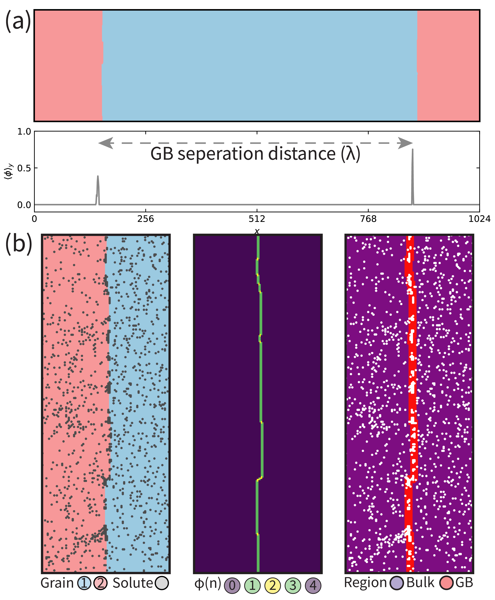
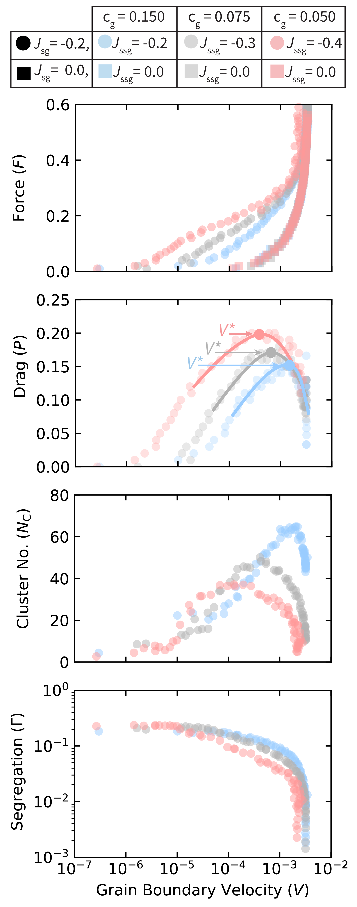

# 粒界自己ピン止め機構：動的モンテカルロが明かすナノ結晶合金の安定化と粒界相転移

- **執筆日**: 2026-04-01
- **トピック**: grain-boundary-self-pinning-KMC
- **タグ**: Structure and Microstructure / Defects and Impurities; Phase Transitions / Monte Carlo
- **注目論文**: arXiv:2602.10353 — "Self-pinning mechanism for grain boundary stabilization" (Hussein & Mishin, 2026)
- **参照関連論文数**: 7本

---

## 1. なぜ今この話題なのか

ナノ結晶材料（grain size < 100 nm の多結晶体）は、超微細な粒組織に由来する高強度・高硬度・優れた拡散特性など、通常の多結晶材料にはない魅力的な物性を示す。しかし、この特性を担う微細粒組織は熱力学的に不安定であり、温度が上がると粒界（grain boundary, GB）が移動して粒成長（grain growth）が進行し、ナノ構造が失われる。この熱不安定性こそが、ナノ結晶合金を実用材料として展開するうえで何十年もの間、最大の障壁となってきた。

粒成長を抑制するための研究は大きく二つの方向で進んできた。一つは熱力学的アプローチ：粒界エネルギーを低下させることで粒成長の駆動力そのものを消す。適切な溶質を粒界に偏析（segregation）させると粒界エネルギーが下がり、理論的にはゼロまで下げることができれば熱力学的に安定な粒組織が実現できる。もう一つは動力学的アプローチ：粒界移動速度そのものを遅くする。第2相粒子による Zener ピン止めや、溶質原子が粒界にまとわりつく溶質ドラッグ（solute drag）がその代表例だ。

長年にわたって、これら熱力学的安定化と動力学的安定化は独立した機構として議論されてきた。しかし 2024〜2026 年にかけて、Hussein & Mishin グループによる一連の動的モンテカルロ（kinetic Monte Carlo, KMC）シミュレーション研究（arXiv:2406.05277; arXiv:2503.17129; arXiv:2602.10353）が、両者は本質的に結びついており、溶質偏析が引き起こす粒界上での「相転移」が新たなピン止めメカニズムを生み出すという，鮮烈な知見をもたらしている。

粒界が単なる 2 次元欠陥ではなく、独自の熱力学的状態（粒界コンプレキション, GB complexion）を持ちうることは，Dillon & Harmer（2007）以来実験的にも認識されてきた。最近の実験では，Ti-Fe 合金粒界で Fe 偏析により正20面体ケージ構造が形成される「位相学的偏析転移（topological segregation transition）」が Science 誌に報告され（arXiv:2405.08193）、粒界の相転移的挙動が実際の材料でも起きることが明確になった。一方で理論・計算の側では，Mishin（2019, arXiv:1905.04126）が移動する粒界での溶質ドラッグと相転移を理論的に定式化し、実際に粒界が動いているときも「動的粒界相（dynamic GB phases）」が存在すると示した。

こうした背景のなかで，Hussein & Mishin の最新論文（arXiv:2602.10353）は，**粒界が移動するときに溶質が自発的にクラスターを形成し，そのクラスターが内発的な「自己ピン止め（self-pinning）」として機能する**という，これまで理論的に見落とされてきた機構を KMC シミュレーションによって初めて明示的に示した。この発見は，ナノ結晶合金の安定化設計において粒界相転移を意図的に利用するという新しい指針を提示するものであり，分野横断的に注目されている。

---

## 2. この分野で何が未解決なのか

### 問い①：熱力学的安定化と動力学的安定化は独立か，それとも本質的に結びついているか

これまでの多くの研究では，粒界エネルギーを下げる「熱力学的安定化」と，粒界の移動速度を下げる「動力学的安定化」は，別々に評価されてきた。たとえば Weissmüller（1993）が提唱した熱力学的モデルは，粒界エネルギーがゼロになる「理想安定化状態」を定義したが，そこには動力学は陽には入っていない。一方，溶質ドラッグの古典理論（Cahn 1962; Lücke-Detert 1957; Hillert-Sundquist 1976）は動力学を扱うが，粒界エネルギーの低下による駆動力減少と偏析による移動度低下を別々のパラメータとして扱う傾向がある。Hussein & Mishin の KMC 研究は，この二つが粒界上での溶質クラスタリングという同一現象の熱力学的側面と動力学的側面であることを示唆するが，その因果関係はまだ完全に整理されているわけではない。

### 問い②：溶質ドラッグの古典理論はどこまで正確か

Cahn（1962）の溶質ドラッグ理論は，均一な溶質偏析プロファイルを仮定し，粒界移動速度 V の関数として抵抗力 P(V) を計算する。この理論では，P(V) は低速で線形に増加し，高速で V に反比例して減少し，中間速度で最大値を持つ。この「峰」が境界速度 V* に相当し，V < V* では溶質が粒界に付着し（solute drag）、V > V* では溶質が粒界から引き離される（breakaway）。しかし古典理論は，溶質の空間的不均一分布（局所クラスター形成）を考慮しない。自己ピン止め機構はまさにこの不均一性から生じており，古典理論が予測できない新しい P(V) の振る舞いをもたらす可能性がある。これをどう理論に組み込むかは未解決である。

### 問い③：粒界相転移と粒界コンプレキションはどう分類・予測するか

粒界が「薄い偏析層」から「アモルファス層」や「中間相」へと転移する現象は，GB complexion transition と呼ばれ，実験的には Cu-Zr, W-Ni, Al-Y など多くの系で観察されている。しかし，どの組成・温度・粒界方位で どの complexion が安定になるかを計算から事前に予測する体系的な手法はまだ確立されていない。加えて，Hussein らが示した「自己ピン止め」は動いている粒界上での自発的なクラスター形成であり，平衡状態での complexion 分類とどう対応するかも課題として残っている。

### 問い④：KMC で扱えるスケールの限界と第一原理との接続

Hussein & Mishin の KMC モデルは2次元の抽象的格子モデルであり，実在する具体的な金属合金への定量的な適用は直接にはできない。実際の材料系への展開には，第一原理計算（DFT）や分子動力学（MD）で求めた原子間ポテンシャルや移動バリアを KMC に組み込む「第一原理-KMC連成手法」が必要となる。近年，Linda et al.（arXiv:2510.15840）のような DFT + フェーズフィールド法による多スケール手法も台頭しているが，KMC の時間スケール問題（レアイベント）も含めてスケールギャップをどう埋めるかは依然として重要な課題である。

---

## 3. 注目論文の核心：何が前進し，何がまだ仮説か

### 論文の問いと背景

Hussein & Mishin（arXiv:2602.10353, 2026 年 2 月）の出発点は，「粒界上で溶質間の引力的相互作用が強いとき，移動する粒界はどう振る舞うか」という問いである。同グループは先行研究（arXiv:2406.05277）で，平衡状態において強い溶質-溶質引力が粒界上での「1次相転移」を引き起こし，溶質リーン状態と溶質リッチ状態が共存することを示していた。新論文では，これを「動いている粒界」に拡張した。

### KMC モデルの構成

シミュレーションは，2次元正方格子上の Potts モデルと格子ガスモデルを組み合わせた KMC フレームワークで実施されている（図1参照）。各格子点は結晶配向変数 $\sigma_k \in \{1, \ldots, q\}$ を持ち，隣接点と配向が異なる点の数 $n_k$ を使って粒界判定関数 $\phi(n_k) = 1 - \tfrac{1}{4}(n_k - 2)^2$ が定義される。$\phi$ は粒界環境（$n_k = 2$）でピーク値 1 を持つように設計されており，これが溶質の「粒界上であるかどうか」を連続的に判定する。

溶質は $\xi_k \in \{0, 1\}$ の占有変数で表され，平均濃度 $\bar{c}$ を保つ（格子ガスモデル）。エネルギーには以下の寄与が含まれる：

$$E = J_s \sum_k (1 - \phi(n_k))\xi_k + J_{sm}\sum_k \phi(n_k)\xi_k + J_{ss}\sum_{\langle k,l\rangle}\xi_k \xi_l + J_{ssm}\sum_{\langle k,l\rangle}\phi(n_{k,l})\xi_k \xi_l$$

ここで $J_s$ は粒内の溶質-溶媒相互作用，$J_{sm} < 0$ は溶質が粒界に引き付けられる偏析エネルギー，$J_{ss}$ は粒内溶質-溶質相互作用，$J_{ssm} < 0$ は粒界での溶質-溶質引力（これが自己ピン止めの鍵となる）である。

KMC イベントは 2 種類：**配向フリップ**（粒成長/縮小）と**溶質ジャンプ**（拡散）である。移行速度は非線形遷移状態理論に基づき，$\nu_{ij} = \nu_0 \exp(-\varepsilon_{ij}/k_B T)$ で与えられる。バリア $\varepsilon_{ij}$ は状態間のエネルギー差 $\Delta E$ に非線形に依存する関数（指数-線形型）を採用しており，大きなエネルギー差でも物理的に妥当な速度を与える工夫がなされている。また粒界では溶質の拡散バリアが $\varepsilon_0^s \to \varepsilon_0^s [1 - \eta\phi(n_{k,l})]$（$\eta = 1/2$）と低減され，粒界の「短絡拡散（short-circuit diffusion）」が再現されている。系には一定の駆動力 $F$ を加えて粒界を一方向に移動させ，その応答を測定する（図2参照）。

*図1 | KMCモデルの粒界検出法。2つの粒界を含む系での構造秩序パラメータのプロファイルを示す（arXiv:2602.10353 Fig.1, CC BY 4.0）。*

### 自己ピン止め機構の発見：4段階のシナリオ

注目論文の最大の成果は，$J_{ssm}$ が強い（溶質間引力が強い）条件下で粒界が移動する際の時間発展を追い，**自己ピン止め**と名付けた新機構を特定したことである。Fig.3 と Fig.4 に示された KMC の時系列シナリオは以下の 4 段階からなる。

**第1段階（古典的溶質ドラッグ）**：駆動力を印加すると粒界は移動を開始し，偏析した溶質雰囲気全体が粒界に引きずられる。この段階はCahn理論で記述される通常の溶質ドラッグに相当する。

**第2段階（クラスター核生成）**：速度が大きくなるにつれ，均一だった溶質偏析層が不安定化し，溶質リッチな局所クラスターと溶質リーンな領域に自発的に相分離する。これは粒界上での1次相転移（GB complexion transition）の動力学的発現であり，外部から第2相を加えなくても生じる。

**第3段階（自己ピン止め）**：形成されたクラスターが粒界に「くっついた」まま，その局所でピン止め点として機能する。粒界はクラスター間では前進できるが，クラスター部分で曲折・ファセット化（faceting）が起き，見かけ上の移動速度が急激に減少する。

**第4段階（準定常状態）**：粒界はクラスターを核として間欠的にピン止め・脱ピン止めを繰り返す動的な定常状態に達する。クラスターは形成・粗大化・溶解を繰り返しながら，全体として粒成長を強く抑制し続ける。

*図2 | 自己ピン止め機構の4段階時間発展。駆動力印加後，溶質クラスターが形成されて粒界を内発的にピン止めする様子（arXiv:2602.10353 Fig.3, CC BY 4.0）。*

### 速度依存性の定量的結果

Fig.5 は，溶質ドラッグ力 $P(V)$ の速度依存性が，古典的な Cahn モデルから定性的に異なることを示している（図3参照）。特に溶質間引力 $|J_{ssm}|$ が大きいとき，P(V) は特定の速度 $V^*$ で**急峻な極大**を持つ。この極大の高さと $V^*$ は $|J_{ssm}|$ とともに増大する。また，クラスター数 $N_c$ も $V^*$ 付近でピークを持ち，クラスター形成とドラッグ力極大が直接連動していることが明確に示されている。

溶質間引力がない（$J_{ssm} = 0$）場合は，P(V) の極大は浅く，Cahn 型の振る舞いに近い。つまり，P(V) の急峻な極大は溶質クラスタリング（粒界相転移）の動力学的シグネチャであり，新機構を示す明確な証拠となっている。

*図3 | 溶質ドラッグ力の速度依存性。溶質間引力が強いほど P(V) の峰が高く，Cahn 古典理論の予測を大きく超える（arXiv:2602.10353 Fig.5, CC BY 4.0）。*

### 何が前進し，何がまだ仮説か

**明確に前進した点**としては，① 粒界上で溶質間引力が強い場合に自己ピン止めが KMC シミュレーションで再現されること，② そのメカニズムが粒界相転移（溶質リッチ/リーン相の共存）に起因することの定性的証明，③ P(V) の急峻な極大が古典 Cahn 理論では説明できないことの定量的示唆，が挙げられる。

一方，**まだ仮説段階ないし課題として残っている点**としては，① このシミュレーションは 2 次元抽象モデルであり，3 次元実在材料系への定量的な適用可能性は未検証，② 実験的な観察との直接比較は行われていない（どの実際の合金系で自己ピン止めが起きているかは不明），③ クラスター形成の時間スケールと粒成長の時間スケールの分離条件が実際の温度・組成範囲でどう対応するかは不明，が挙げられる。

---

## 4. 背景と研究史：この論文はどこに位置づくか

### 粒界偏析研究の系譜

粒界偏析（grain boundary segregation）の概念は 1950〜60 年代に確立し，McLean（1957）の平衡偏析理論，Cahn（1962）の溶質ドラッグ理論が基礎を形成した。その後 Hillert & Sundquist（1976），Lücke & Stüwe（1971）らが溶質ドラッグの定式化を洗練させ，今日でも教科書的な枠組みとして使われている。

これらの古典理論の共通した仮定は，溶質が粒界上に均一に分布しているというものである。この仮定のもとでは，粒界移動速度と溶質濃度場の連成は比較的単純に解析でき，閉じた形の式が得られる。一方，実際の粒界では溶質が不均一に集まっている可能性があるが，それを正面から扱った理論は長らく存在しなかった。

### 粒界コンプレキション概念の登場

2007 年に Dillon & Harmer が提唱した「粒界コンプレキション（grain boundary complexion）」という概念は，粒界を熱力学的な相として捉える視点を与えた。粒界が単なる無秩序な界面ではなく，特定の温度・組成条件で異なる構造状態（たとえば，単原子層偏析，多原子層偏析，アモルファス前駆体層など）をとりうるというものであり，その遷移は相転移と同等の現象として理解される。実験的には，アルミナ（α-Al₂O₃）や W-Ni, Al-Mg 等の系でコンプレキション転移が観察されてきた。

2024 年に Science 誌に掲載された Devulapalli ら（arXiv:2405.08193）の論文は，Ti に Fe を添加した系において，Fe 偏析が正20面体ケージ構造を形成し，それらが階層的に集合して複数の粒界相を形成するという「位相学的偏析転移」を，高分解能電子顕微鏡と原子シミュレーションで実証した。これは，粒界上での相転移が抽象的な概念ではなく，実在の金属材料で直接観察できる現象であることを示す強力な証拠である。

### Hussein & Mishin グループの一連の研究

Hussein & Mishin は 2024〜2026 年にかけて，同一の KMC フレームワークを基盤として段階的に問題の範囲を広げている。

まず arXiv:2406.05277（Acta Materialia 2024 掲載）では，**平衡状態における粒界の熱力学的安定化**を扱った。Potts モデル + 格子ガスモデルで構成された KMC シミュレーションにより，溶質-溶媒相互作用が適切であれば粒界自由エネルギーをゼロまで下げる「完全熱力学的安定化状態」が実現できることが示された。粒界が安定化する条件として，「毛管波振幅（capillary wave amplitude）の発散」が平坦粒界で起きることと「大粒が小粒の集合体に分裂（fragmentation）すること」が示されている。

*図4 | ナノ結晶合金の相図（KMCによる）。溶質-溶媒引力が強い場合（右パネル）に安定多結晶相が現れる（arXiv:2406.05277 Fig.9, CC BY 4.0）。*

続いて arXiv:2503.17129（2025 年）では，**多結晶系全体への拡張**が行われた（図4参照）。Potts モデルで多数の粒を同時にシミュレートし，溶質-溶質相互作用が斥力的（$J_{ssm} > 0$）な場合に完全安定化した多結晶状態が得られることを示した。興味深いことに，安定化した多結晶は「粒成長と粒細化の動的平衡状態」にあり，表面的には粒成長しているように見えながら全体のサイズ分布は変化しない。この予測された安定ナノ結晶構造の形態は，従来の不安定なナノ結晶材料と全く異なることが強調されている。

最新の arXiv:2602.10353（本注目論文）はこれらの延長として，溶質-溶質引力（$J_{ssm} < 0$）が強い系に焦点を当て，**動的過程（移動する粒界）** での振る舞いを調べた。先行研究（2406.05277）で扱った平衡系では，強い引力により溶質リッチ/リーンの1次相転移が起きることが示されていたが，本論文では，この相転移が移動する粒界の上で動的に発現し，自己ピン止めをもたらすという新たな知見を加えた。

### 理論的文脈：Mishin（2019）の動的粒界相理論

理論の文脈では，Mishin（arXiv:1905.04126）が 2019 年に提唱した「動いている粒界での溶質ドラッグと動的相転移」の理論が重要な先行研究である。この理論は離散モデルと正則溶液近似を組み合わせ，粒界が移動しているときにも「動的粒界相（dynamic GB phases）」が存在し，その安定性が速度に依存することを示した。移動速度が変わると，動的粒界相の安定性が変化し，相転移に伴い粒界移動度が大きく変化する。

Hussein & Mishin（2602.10353）の自己ピン止め機構は，この動的粒界相理論の枠組みでは，移動する粒界上で溶質リッチ相と溶質リーン相が相分離することに対応する。理論が予言した「動的相転移」を，KMC シミュレーションで初めて具体的な原子的描像として可視化した点に本論文の貢献がある。

---

## 5. どの解釈が最も妥当か：証拠・比較・限界

### 自己ピン止め解釈を支持する証拠

注目論文が提示する証拠の核心は，KMC シミュレーションで直接観察された時系列データである。第一に，溶質クラスターの形成と速度の急落が時間的に相関している（Fig.4）。第二に，P(V) の極大高さが $|J_{ssm}|$ とともに増大し，クラスター数 $N_c$ の極大と同じ速度で生じる（Fig.5）。第三に，$J_{ssm} = 0$（溶質間引力なし）の場合は自己ピン止めが起きず，P(V) の極大も小さい。これらは，ピン止めが溶質クラスタリング（粒界上の相分離）によって引き起こされるというメカニズムと完全に整合している。

さらに，平衡偏析等温線（Fig.2）が溶質リッチ/リーンの2相共存を示すことも重要な間接証拠である。これは移動する粒界の実験的時系列を直接観察した証拠ではないが，「なぜクラスターが形成されるか」の熱力学的根拠を与えている。

### 古典溶質ドラッグ理論との整合と矛盾

古典 Cahn 理論との比較では，**整合する点**と**矛盾する点**がある。整合する点は，① V < V* での P(V) の増加（均一偏析の溶質ドラッグ），② V > V* での P(V) の急減（breakaway 後）の定性的な振る舞いである。矛盾する点は，古典理論の P(V) 極大が比較的なだらかであるのに対し，自己ピン止めが起きると P(V) が非常に急峻な峰を持つことである。古典理論は均一偏析を仮定するため，クラスター形成による「局所的な固定点」の効果を再現できない。

Mishin のシミュレーション（2019, arXiv:1905.04126）による理論曲線と比較しても，強い溶質-溶質引力がある場合の P(V) の急峻な極大は，均一偏析を前提とした理論では説明できない。この点が本論文の最も重要な定量的新規性である。

### 他の解釈の可能性

「溶質クラスターが形成され粒界を止める」という解釈の代わりに，単に「溶質濃度が高い領域で局所的な粒界エネルギーが低下し，ピニングではなく低速移動域が生じる」という解釈も原理的には考えられる。しかし，図3のスナップショットでは粒界が明確なファセット化（凸凹構造）を示しており，これはクラスターによる幾何学的ピン止めと整合する。また，クラスター数の時系列データが ピン止め-脱ピン止めの間欠性と相関することは，「局所的ピン止め点」という物理的描像を強く支持する。

### 関連研究との整合性

Zhang & Deng（arXiv:2507.19429）は，溶質偏析による粒界相転移が「ディスコネクション（disconnection）」の核生成を引き起こすことを原子シミュレーションで示した。ディスコネクションは粒界の歩（step）と転位の複合欠陥であり，その形成が粒界の移動挙動を大きく変える。自己ピン止めのクラスターがディスコネクションのパターニングと関連する可能性があり，Hussein らのモデルに原子スケールの描像を補完する研究として位置づけられる。ただし，Zhang & Deng の系（Al-Ni, Al-Fe の置換型合金）は Hussein らの抽象モデルと直接比較できるものではなく，両者がどの程度共通の機構を反映しているかは今後の課題である。

Linda ら（arXiv:2510.15840）の多スケール DFT + フェーズフィールド法は，全く異なるアプローチで類似した問題（溶質偏析による粒成長の異常化）を扱っている。この研究では，粒界移動度を支配するのは粒界エネルギーよりも**粒界移動度の異方性**であることを見出し，自己ピン止めのような粒界上の局所クラスターは陽に扱っていない。これは，全く異なるスケール・対象（フェーズフィールドは $\sim \mu$m スケール，Hussein らは数十 nm スケール）での比較であるため，矛盾というよりも相補的な関係と見るべきであろう。

### 今後必要な検証

最も重要な検証は，実際の金属合金で自己ピン止めが起きているかどうかの直接的観察である。透過型電子顕微鏡（TEM）や原子プローブトモグラフィ（APT）を使って，移動している粒界上での溶質クラスターの動的観察ができれば，シミュレーションの予測と直接比較できる。特に，原子スケールで時間分解した観察（liquid cell TEM や in-situ TEM）は有力な手段となる。また，第一原理計算で $J_{ssm}$ の強い実在系（強い溶質-溶質引力を持つ 2元合金）を特定し，KMC に組み込んで定量予測を行うことも不可欠である。

---

## 6. 何が一般化できるのか：材料・手法・応用への広がり

### ナノ結晶合金設計への示唆

自己ピン止め機構は，従来の粒成長抑制戦略に対して重要な補完視点を与える。従来は「第2相粒子の Zener ピン止め」と「溶質ドラッグ」が二本柱とされていたが，自己ピン止めは「溶質を意図的に粒界上でクラスター化させる」という第三の戦略を示唆する。鍵となる材料パラメータは：

- **溶質-粒界引力** $J_{sm}$：偏析の駆動力。大きいほど溶質が粒界に集まりやすい（McLean偏析エネルギー）
- **溶質-溶質引力** $J_{ssm}$：クラスタリングの駆動力。これが十分大きいとき，自己ピン止めが発現する
- **溶質拡散速度**：クラスターの形成・解消の時間スケールを決める

この観点では，溶質-溶質間の引力的相互作用（原子サイズ不整合や化学的親和性）が粒界での相分離を引き起こしやすい系が候補となる。例えば W-Ni 系（Ni の W 粒界への強い偏析），Cu-Bi 系，Fe-Ce 系などは粒界コンプレキション転移が報告されており，自己ピン止め候補として興味深い。

### 多元系（高エントロピー合金）への展開

多主元素合金（HEA）や中エントロピー合金（MEA）では，多種の溶質が同時に粒界に偏析し，複雑な相互作用を示す可能性がある。Hussein らのモデルは現状 2 元系ベースだが，多元系への拡張は原理的に可能である。多元素が共存する場合，「どの元素がクラスターを形成し，どの元素がクラスターを妨害するか」という競合が自己ピン止めの有効性を左右すると考えられる。

### セラミックスやソフトマテリアルへの適用

粒界上の相転移は金属合金に限らない。セラミックス（特に Al₂O₃, SiO₂, ZnO 等では impurity-induced complexion の報告が多い）や，コロイド結晶，ポリマーナノコンポジットにおいても，粒子間界面での相分離・クラスタリングが類似の機構を生じうる。Hussein らのモデルはエネルギー関数を変えれば原理的にこれらの系にも適用できる。

### 動的モンテカルロ法の方法論的貢献

本研究はまた，KMC が粒界物理の研究ツールとして非常に強力であることを改めて示した。分子動力学（MD）は時間スケールが femtosecond オーダーに限られ，粒界移動のような ms〜s オーダーの現象は直接扱えない。一方，本論文の KMC モデルは，エネルギーランドスケープに基づいてイベントの確率を計算することで，粒界移動と溶質拡散の両方の時間スケールを同時に適切に扱っている。「非線形バリア-エネルギー関係」という工夫も，物理的に妥当なレートを保ちながら大きなエネルギー差を扱うために重要な技術的貢献である。

一方で，このモデルは 2 次元・抽象的格子モデルという制約がある。実在材料への定量的適用のためには，CALPHAD や DFT と組み合わせた「多スケール KMC」へと発展させる必要があるが，Linda ら（2510.15840）のような DFT + フェーズフィールド法や，Zhishun ら（arXiv:2601.15699）のような MD + MC ハイブリッド手法との比較・統合も今後の重要な方向性である。

---

## 7. 基礎から理解する

### キネティック・モンテカルロ（KMC）とは何か

KMC は，系の時間発展を「確率的なイベント列」として模擬する計算手法である。従来の（平衡）モンテカルロ（MC）法が熱平衡状態を統計的にサンプリングするのに対して，KMC は各イベントが「どのくらいの速度で起きるか（レート）」を明示的に扱い，物理的な時間の流れを再現する。

KMC の核心は**遷移速度（transition rate）** $k_{ij}$ の設定にある。Arrhenius 型では：

$$k_{ij} = \nu_0 \exp\left(-\frac{\Delta G_{ij}^{\ddagger}}{k_B T}\right)$$

ここで $\nu_0$ は試行頻度（attempt frequency），$\Delta G_{ij}^{\ddagger}$ は活性化ギブス自由エネルギー（活性化バリア），$k_B$ はボルツマン定数，$T$ は温度である。原子が格子点間をホップするような系では，$\Delta G_{ij}^{\ddagger}$ は最小エネルギー経路（NEB 法などで計算）上の鞍点エネルギーに対応する。

KMC の時間積分には**rejection-free アルゴリズム（Bortz-Kalos-Lebowitz, BKL アルゴリズム）**が標準的に使われる。手順は以下の通り：① 全イベントのレートを計算して合計 $R = \sum_i k_i$ を求める，② 乱数 $r_1 \in (0,1)$ を使ってどのイベントが起きるかを $k_i / R$ の確率で選択する，③ もう一つの乱数 $r_2 \in (0,1)$ で時間を $\Delta t = -\ln(r_2)/R$ だけ進める。これにより，「次に何かが起きるまでの時間」を正確に追跡し，無駄な「何も起きない」ステップを排除できる。

Hussein らのモデルではイベントは「配向フリップ」（粒界の前進・後退）と「溶質ジャンプ」（空格子点への1次近接ホップ）の2種類であり，前者は粒成長，後者は拡散を担う。

### Potts モデルとは何か

Potts モデルは Ising モデルの一般化であり，各格子点が $q$ 種類の状態（$\sigma \in \{1, \ldots, q\}$）を取れるようにしたもの。エネルギーは：

$$H = -J \sum_{\langle k,l \rangle} \delta_{\sigma_k, \sigma_l}$$

ここで $J > 0$ は同種状態間の結合エネルギー，$\delta$ はクロネッカーデルタ（$\sigma_k = \sigma_l$ のとき 1，それ以外 0）。多結晶シミュレーションでは，$\sigma_k$ は各格子点の「結晶粒配向インデックス」を表し，同じ粒の中の格子点は同じ $\sigma$ を持つ。異なる配向を持つ隣接格子点の間が「粒界」に対応し，そこでは $J$ の利得がないため，エネルギーが相対的に高い。粒成長の駆動力はこの粒界エネルギー（= 粒界面積 × 粒界エネルギー密度）を下げる方向に働く。

Potts モデルは実際の粒界の方位依存性（Read-Shockley モデル等）を取り込んでいないという単純化がある一方，粒構造のトポロジー的変化（粒の消失，三重点の移動）を自然に扱える利点があり，粒成長シミュレーションで広く使われている。

### 粒界偏析の熱力学：McLean の平衡偏析

溶質が粒界に偏析する駆動力は，粒内に比べた粒界サイトの偏析エネルギー $\Delta H_{seg} < 0$ である。McLean（1957）の等温式は：

$$\frac{\theta}{1 - \theta} = \frac{c}{1 - c} \exp\left(-\frac{\Delta H_{seg}}{k_B T}\right)$$

ここで $\theta$ は粒界サイトの占有率，$c$ は粒内（バルク）の溶質濃度である。$\Delta H_{seg}$ は原子サイズ不整合によるひずみエネルギーと化学的相互作用エネルギーの和で決まる（Seah-Rice の分解）。$|\Delta H_{seg}|$ が大きいほど，同じバルク濃度 $c$ でも粒界偏析量 $\theta$ が大きくなる。

この等温式は，溶質原子が独立に（互いに無相関に）偏析するという仮定に基づいている。溶質間に引力的相互作用がある場合，$\Delta H_{seg}$ は $\theta$ に依存するようになり（Bragg-Williams 近似）：

$$\frac{\theta}{1-\theta} = \frac{c}{1-c}\exp\left(-\frac{\Delta H_{seg} + \Omega(2\theta - 1)}{k_B T}\right)$$

ここで $\Omega < 0$ は溶質間の引力的相互作用エネルギーである。$\Omega < -k_B T/2$ 程度で等温線が不連続になり（S字型になる），これが粒界上での「1次相転移」（溶質リーン相 ↔ 溶質リッチ相）に対応する。Hussein らのモデルはまさにこの非線形偏析等温線のあるレジームを扱っており，Fig.2a がそれを直接示している。

### 溶質ドラッグの基礎：Cahn（1962）モデル

粒界が速度 $V$ で移動するとき，溶質原子は拡散によって追いかけようとする。粒界からの距離 $x$ での溶質濃度は拡散方程式から決まり，その非対称プロファイルが粒界に対して抵抗力（ドラッグ力）を生じる。Cahn の解析では：

$$P(V) = \int_{-\infty}^{\infty} \frac{\partial E}{\partial x} \Delta C(x) dx$$

ここで $E(x)$ は粒界エネルギーの $x$ 依存，$\Delta C(x) = C(x) - C_0$ は均一濃度からの偏差である。低速極限 ($V \to 0$) では $\Delta C$ が偏析プロファイルと同期し $P \propto V$，高速極限 ($V \to \infty$) では拡散が追いつけず $\Delta C \to 0$ で $P \propto V^{-1}$。したがって最大が存在し，その速度が $V^* \sim D/\delta$（$D$ は粒界拡散係数，$\delta$ は粒界幅）で決まる。Hussein らの「自己ピン止め機構」による P(V) 極大は，この Cahn 型の極大とは別のもの（クラスター形成による），または Cahn 型に付加されたもの（両方が同時に存在する）である可能性がある。

---

## 8. 重要キーワード10個

**1. 粒界コンプレキション（grain boundary complexion）**
粒界を熱力学的な2次元相として捉えた概念。温度・組成・粒界方位の変化により，異なる構造状態（薄い偏析層，多原子層，アモルファス前駆体など）が安定となりうる。これらの状態の遷移を「コンプレキション転移」と呼ぶ。粒界物性（移動度，拡散率，破壊靱性など）に大きく影響するため，近年の界面工学の中心概念となっている。

**2. 動的モンテカルロ法（kinetic Monte Carlo, KMC）**
各可能な遷移（イベント）に物理的な速度定数（Arrhenius レート）を割り当て，確率的にイベントを選択して時間を進めるシミュレーション手法。分子動力学では到達できない長い時間スケールでの拡散，反応，欠陥移動，結晶成長などを扱える。Rejection-free BKL アルゴリズムにより計算効率が高い。実際の材料では第一原理計算やクラスター展開（CE）から速度定数を計算し，定量的な予測が可能。

**3. 溶質ドラッグ（solute drag）**
移動する粒界に溶質原子が付随することで，粒界移動速度が低下する現象。溶質の粒界偏析エネルギーが大きいほど，また移動速度が小さいほど効果が強い。Cahn（1962）の理論では，溶質ドラッグ力は速度 V の増加とともに最大値を経て低下する（breakaway 転移）。材料強化や粒成長制御に実際に活用されており，鉄鋼のオーステナイト粒粗大化防止（Nb, Ti, V 等の溶質添加）はその典型例。

**4. 自己ピン止め（self-pinning）**
Hussein & Mishin が提唱した新しい粒界安定化機構。粒界上での溶質クラスター形成（粒界相分離）によって，外部から第2相粒子を加えることなく粒界が内発的にピン止めされる現象。強い溶質-溶質引力が粒界で相分離を引き起こすことが前提であり，この相分離が「動的」な過程（粒界が移動しながら）で起きることが鍵。

**5. Potts モデル（Potts model）**
Ising モデルを $q$ 状態に一般化した格子スピンモデル。粒成長シミュレーションでは，各スピン状態が結晶粒配向を表し，隣接する異なるスピン間の境界が粒界を模擬する。モンテカルロ法や KMC と組み合わせて粒成長のトポロジー変化（粒の消滅・融合）を自然に取り込める。格子ガスモデルと連成することで，溶質拡散を同時に扱った合金の粒成長シミュレーションが可能。

**6. 粒界偏析（grain boundary segregation）**
バルクと比べて原子配列が乱れた粒界に，特定の溶質元素が優先的に濃集する現象。駆動力は，(1) 溶質原子の粒内でのひずみエネルギー解放（サイズ不整合），(2) 粒界と溶質間の化学的親和性，の2つ。McLean モデル（1957）が平衡偏析量を記述する基礎式を与える。粒界偏析は粒界エネルギーを下げ，粒成長の熱力学的駆動力を低減する一方，粒界脆化（水素，S, P, Sn 偏析による）の原因にもなる，両面のある現象。

**7. 粒界相転移（grain boundary phase transition）**
粒界上の溶質構造が，温度・濃度・速度の変化に伴って不連続に変わる転移。バルクの相転移と同様に，1次（不連続）と2次（連続）の区別がある。1次粒界相転移では，溶質リーン状態と溶質リッチ状態が共存し，それらの間で突然の切り替えが起きる。Hussein らのモデルの中心にある偏析等温線の不連続性（Fig.2a）がこれに対応する。粒界移動度の急変，粒界拡散率の変化，焼結挙動の変化など，加工特性に直接影響する。

**8. Zener ピン止め（Zener pinning）**
行列中に散在する第2相粒子（析出物，酸化物など）が粒界の移動を妨げるメカニズム。Zener（1948）の古典的モデルでは，球形粒子が粒界と交差する際にピン止め力が生じ，平衡粒径は $D \propto r/f$（$r$ は粒子半径，$f$ は体積分率）で決まる。自己ピン止めとの違いは，Zener では外部から加えた第2相が必要な「外部ピン止め」であるのに対し，自己ピン止めは偏析溶質が「in-situ」でクラスターを作る「内部ピン止め」であることである。

**9. ナノ結晶材料（nanocrystalline materials）**
結晶粒径が約 1〜100 nm の範囲にある多結晶材料。Hall-Petch 関係（強度 $\propto d^{-1/2}$，$d$ は粒径）から，通常の粗粒材に比べて大幅に高い降伏強度を示す。粒径が小さいほど粒界の体積分率が大きく，粒界支配の特性（高拡散率，優れた放射線耐性など）が顕著になる。一方，高温で急速な粒成長が起きやすく，熱安定性の確保が実用化のボトルネックとなっている。溶質偏析やコンプレキション制御が安定化の主要戦略。

**10. 非線形遷移状態理論（nonlinear transition state theory）**
遷移速度 $k$ をエネルギー変化 $\Delta E$ の関数として計算する際，単純な ハーモニック近似（$\Delta G^{\ddagger} = \Delta E/2$）や詳細平衡（$k_{ij}/k_{ji} = \exp(-\Delta E/k_B T)$）から逸脱する状況を扱う枠組み。Hussein らのモデルでは，エネルギー変化が大きい極端なケースでバリアが非物理的にゼロや負にならないよう，「指数-線形（exponential-linear）」型の非線形関数を採用している。これにより，強いエネルギー差がある条件（高溶質濃度粒界など）でも熱力学的に整合したシミュレーションが可能。

---

## 9. おわりに：何が分かり，何がまだ残っているのか

Hussein & Mishin の一連の研究（arXiv:2406.05277; arXiv:2503.17129; arXiv:2602.10353）は，KMC シミュレーションを通じて，ナノ結晶合金の粒成長抑制に「自己ピン止め」という新しいメカニズムが存在することをモデル系で示した。この機構の核心は，溶質-溶質間の強い引力的相互作用が粒界上での相分離（溶質リッチ/リーンの共存）を引き起こし，移動する粒界上に動的なクラスターが自発的に形成されることである。このクラスターが外部粒子なしに粒界を内発的にピン止めするという描像は，古典的な Cahn 溶質ドラッグ理論や Zener ピン止め論とは本質的に異なる。特に，溶質ドラッグ力 P(V) の急峻な極大という定量的シグネチャは，古典理論では説明できない「クラスター支配の新レジーム」を示している。かなり確からしくなったこととして，溶質-溶質引力が十分に強い系では（少なくとも抽象的モデル系では）自己ピン止めが実現し，ナノ結晶合金の熱安定化に寄与することが挙げられる。

一方，まだ未確定な点は多い。最も重要な課題は，実在の金属合金系での実験的検証である。どの合金系（どの溶質元素，どの母材）で $J_{ssm}$ に相当する溶質-溶質引力が十分に強く，自己ピン止めが発現するかは，第一原理計算から見積もる試みが必要である。また，2 次元格子モデルから実際の 3 次元多結晶体へのスケールアップも未達成であり，粒界方位・結晶構造・格子ひずみなどの影響を組み込んだ，より実際に近い KMC モデルの開発が急務だろう。さらに，自己ピン止め下での粒成長速度の温度依存性，活性化エネルギー，粒径分布など，実験と直接比較できる定量予測への展開も重要な次ステップである。今後 1〜3 年では，(1) DFT や分子動力学と連成した多スケール KMC による実在合金系での予測，(2) In-situ TEM や原子プローブを使った移動粒界上のクラスター観察，(3) 粒界コンプレキションの系統的なデータベース構築（AI/機械学習との連携）が分野の進展を担う主要な論点となるだろう。粒界の相転移的挙動を材料設計に積極的に利用する「コンプレキション工学」という視点が，今後の高性能ナノ結晶合金開発を切り拓く鍵となりうる。

---

## 参考論文一覧

1. **arXiv:2602.10353** | O. Hussein, Y. Mishin, "Self-pinning mechanism for grain boundary stabilization," (2026) — **注目論文**

2. **arXiv:2406.05277** | O. Hussein, Y. Mishin, "A model of thermodynamic stabilization of nanocrystalline grain boundaries in alloy systems," *Acta Materialia* 281 (2024) — **背景：熱力学的安定化の先行研究**

3. **arXiv:2503.17129** | O. Hussein, Y. Mishin, "A model of full thermodynamic stabilization of nanocrystalline alloys," (2025) — **支持：多結晶への拡張，動的平衡の予測**

4. **arXiv:2510.15840** | A. Linda, R. Mukherjee, S. Bhowmick, "Multiscale Modeling of Abnormal Grain Growth: Role of Solute Segregation and Grain Boundary Character," *Acta Materialia* (2026) — **比較：DFT+フェーズフィールドによる異常粒成長**

5. **arXiv:2507.19429** | Z. Zhang, C. Deng, "Disconnection formation via segregation-induced grain boundary phase transitions," (2025) — **関連機構：偏析誘起粒界相転移によるディスコネクション形成**

6. **arXiv:2405.08193** | V. Devulapalli et al., "Topological grain boundary segregation transitions," *Science* 386 (2024) — **実験的背景：Ti-Fe における位相学的粒界偏析転移**

7. **arXiv:1905.04126** | Y. Mishin, "Solute drag and dynamic phase transformations in moving grain boundaries," (2019) — **理論的基礎：動的粒界相転移の理論**

8. **arXiv:2601.15699** | Z. Chen et al., "Atomic-Scale Insights into Solute Drag Effects on Grain Boundary Motion in Mg-Al and Mg-Ca Alloys," (2026) — **応用・比較：実際の Mg 合金での溶質ドラッグ**
