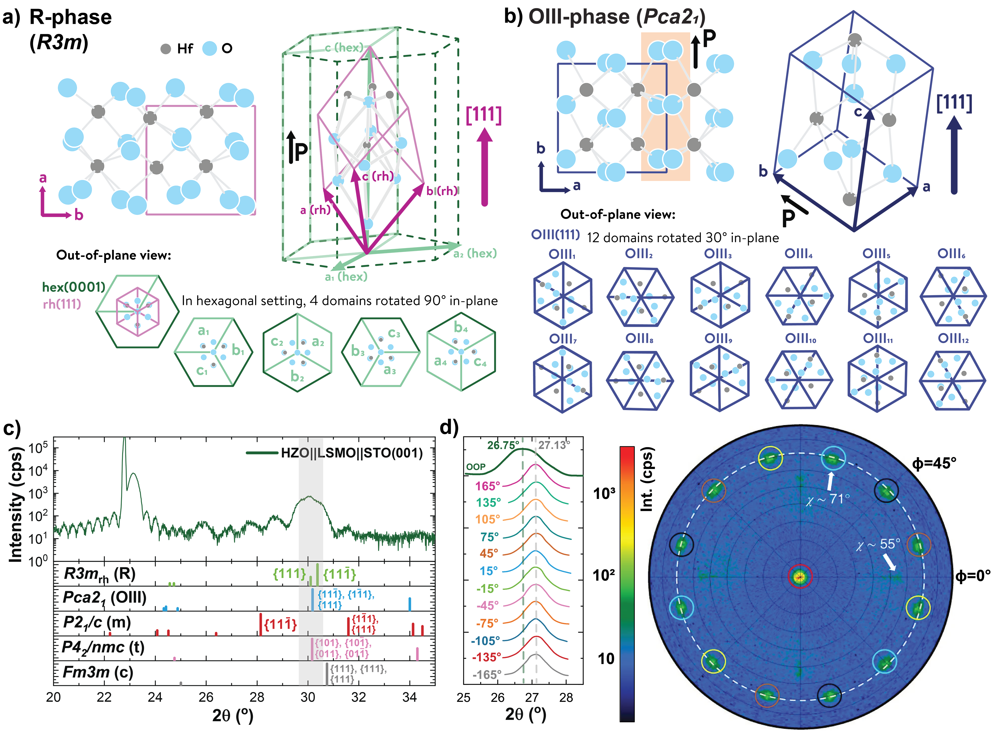
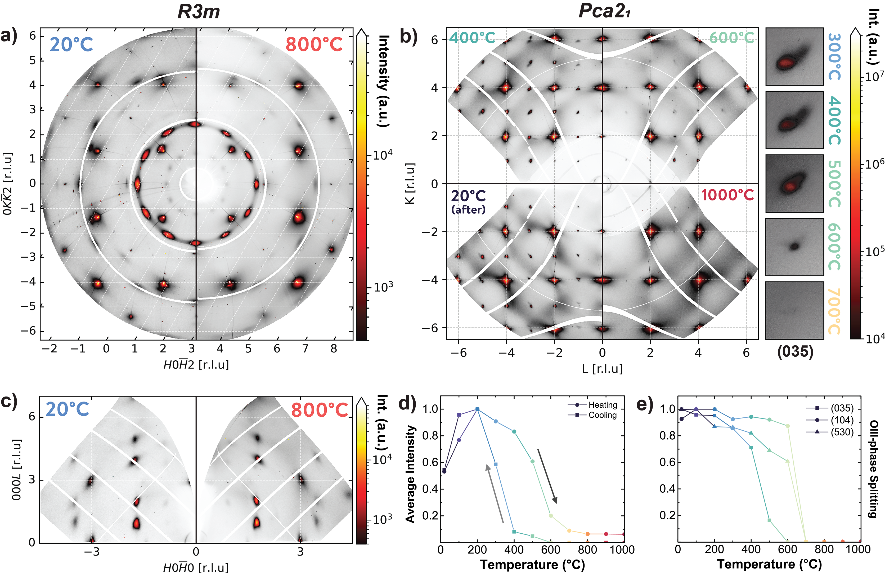
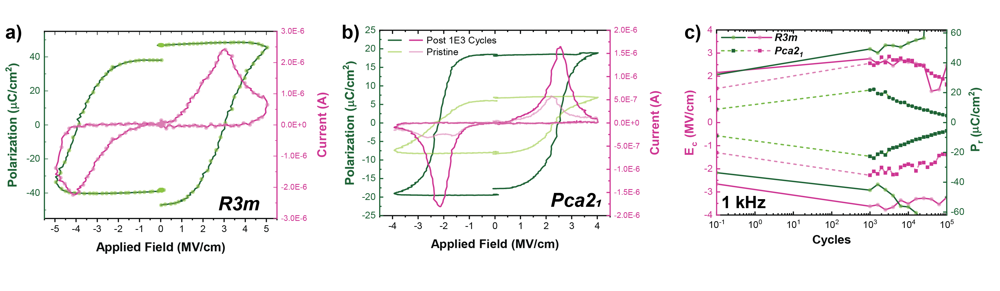
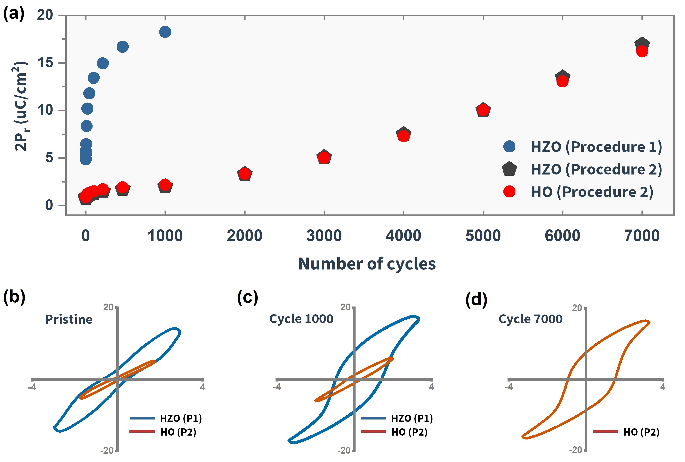

# ハフニア薄膜の二つの強誘電相：菱面体晶 R 相と斜方晶 OIII 相の正体と安定化メカニズム

- **執筆日**: 2026-04-19
- **トピック**: エピタキシャル酸化ハフニウム（HfO₂）薄膜における二種類の強誘電相——菱面体晶 R 相（R3m）と極性斜方晶 OIII 相（Pca2₁）——の構造的同定と、強誘電性の物理的起源
- **タグ**: Devices and Functional Materials / Thin Films and Interfaces; Phase Transitions / Synchrotron Measurements; First-Principles Calculations
- **注目論文**: Johanna van Gent Gonzalez et al., "Disentangling the ferroelectric phases of epitaxial hafnia," arXiv:2604.15081 (2026)
- **参照論文数**: 6本

---

## 1. なぜ今この話題なのか

現代の半導体産業は、メモリデバイスの縮小限界という根本的な壁に直面している。シリコン CMOS プロセスに組み込まれた従来の強誘電体メモリ材料——PZT（Pb(Zr,Ti)O₃）や SBT（SrBi₂Ta₂O₉）——は、デバイスが 50 nm 以下のスケールに縮小されると強誘電性を失うという臨界的なサイズ問題を抱えていた。そのため、2000 年代後半までには強誘電体メモリ（FeRAM）の量産化は一時停滞していた。

この状況を劇的に変えたのが、2011 年にドレスデン工科大学の Böscke らが発表した報告であった。シリコンゲート絶縁膜として利用されてきた二元系酸化物、すなわち**ハフニウム酸化物**（hafnium oxide、HfO₂）の薄膜に、Si をドープするだけで強誘電性が発現することを示したのである。HfO₂ はすでに 45 nm 世代以降の半導体プロセスの高誘電率（high-k）ゲート絶縁膜として標準的に使われていた材料であり、既存の製造インフラとの完全な親和性を持つ。厚さ 10 nm 以下のナノスケールフィルムでも強誘電性が失われないという実験事実は、業界に大きな衝撃を与え、「CMOS 互換の強誘電体メモリ」という新たな研究潮流を生み出した。

この発見以来、HfO₂ をベースにした強誘電体薄膜（Hf₀.₅Zr₀.₅O₂（HZO）や Y, La, Si 添加 HfO₂ など）は FeRAM（強誘電体ランダムアクセスメモリ）、FeFET（強誘電体電界効果トランジスタ）、FTJ（強誘電体トンネル接合）への応用を目指して急速に研究が進んでいる。特に FeFET は、強誘電体分極状態をゲートに使って不揮発性メモリを実現する素子であり、Samsung や TSMC をはじめとする主要な半導体メーカーがその量産化に取り組んでいる。

しかし約 15 年の歴史を持つ HfO₂ 強誘電体研究において、一つの根本的な疑問が依然として解消されていなかった——「この薄膜の中で強誘電性を担っている結晶相は、正確にはどのような対称性を持つ相なのか？」という問いである。特に 2018 年以降、エピタキシャル HZO 薄膜において「菱面体晶相」（R 相）の存在が報告されてから、この問いは急激に複雑さを帯びた。2026 年 4 月に arXiv に投稿された van Gent Gonzalez らの論文（2604.15081）は、シンクロトロン X 線を用いた三次元逆格子空間マッピングという強力な手法によって、この論争に初めて決着をつけようとする試みである。

---

## 2. 未解決問題は何か

ハフニア強誘電体研究において、現在も活発に議論されている本質的な問いを三つに整理しておこう。

**問い①：菱面体晶相（R 相）と斜方晶 OIII 相は本当に異なる相であり、それぞれ独立して制御・安定化できるのか？**

2018 年に Wei らが発表したエピタキシャル HZO 薄膜の研究（1801.09008）以来、「菱面体晶相」の存在が議論されてきた。しかし通常の薄膜 X 線回折（2θ スキャン）では、菱面体晶相と斜方晶 OIII 相のピーク位置が極めて近く、区別が困難である。一部の研究者は、この「R 相」は OIII 相が基板から受ける応力によって歪んだ形態にすぎず、独立した相ではないと主張してきた。また、第一原理計算による相安定性の議論では菱面体晶構造の形成エネルギーが OIII 相より有意に高く、「R 相が安定に存在するのはなぜか」という問いに計算上の根拠が乏しかった。この問いに対して、注目論文は明確な回答を与えようとしている。

**問い②：HfO₂ の強誘電性はどのような物理機構で発生するのか？**

ペロブスカイト型強誘電体（BaTiO₃ や PbTiO₃）では、特定の格子振動モード（**軟モード**）が相転移温度で振動数がゼロに近づき（軟化し）、その凍結によって格子のポテンシャルエネルギー地形が対称性を破った二重井戸型になることで自発分極が発生する——これが「強誘電性の軟モード機構」である。しかし HfO₂ の場合、安定相である単斜晶相と強誘電性 OIII 相の間に明確な連続的相転移経路が存在せず、軟モードは直接は観測されない。強誘電相は熱力学的に準安定であり、なぜその状態に系が「閉じ込められる」のか、そのメカニズムは長年の謎であった。

**問い③：強誘電相をどのように安定化・制御するか？**

OIII 相は薄膜状態では準安定であり、アニール条件、ドーパント種、薄膜厚さ、電極材料、エピタキシャルひずみなどの多くのパラメータに依存して安定性が変化する。さらに、繰り返し電場を印加するとデバイスの分極量が変化する**ウェイクアップ効果**（wake-up effect）や**疲労**（fatigue）も重要な実用的問題となっている。ウェイクアップのメカニズムとして酸素空孔の再分布が有力とされているが、その原子スケールの詳細は未確定の部分が多い。R 相と OIII 相でウェイクアップ挙動が大きく異なることも、この問いの重要性を際立たせている。

---

## 3. 注目論文の核心

van Gent Gonzalez らの研究（arXiv:2604.15081）の核心は、「エピタキシャルハフニア薄膜において、従来の薄膜 X 線回折で混同されてきた二種類の強誘電相を、シンクロトロン放射光を用いた**掠入射 X 線回折**（grazing incidence X-ray diffraction: GI-XRD）による三次元逆格子空間の完全マッピングによって明確に識別した」という点にある。

**実験の設計思想**

従来の薄膜評価で用いられる実験室系の 2θ–ω スキャンや逆格子空間マッピング（RSM）は、薄膜の面外方向（[001] 方向）に沿った限られた逆格子空間の情報しか与えない。しかし菱面体晶 R3m 対称性と斜方晶 Pca2₁ 対称性の違いを明確に区別するには、面内成分を含む三次元の逆格子空間全体を観測する必要がある。van Gent Gonzalez らは ESRF（欧州放射光施設）の ID28 ビームラインに設置された Pilatus3 検出器を用いて、薄膜を様々な φ 角度で回転させながら GI-XRD データを取得し、逆格子空間の三次元的再構成を行った。これにより「歪んでいない真の対称性」を読み取ることが可能になった。

**試料と実験条件**

試料は Y をドープした HfZrO₂（YHO、Y/(Hf+Zr) ≈ 15%）薄膜をパルスレーザー堆積法（PLD、基板温度 800°C）で成長させたものである。基板の組み合わせとして、(1) SrTiO₃（STO）基板上に La₀.₆₇Sr₀.₃₃MnO₃（LSMO）バッファ層を介したもの（R 相試料の前駆体条件）と、(2) イットリア安定化ジルコニア（YSZ）基板に ITO 電極を介したもの（OIII 相試料の前駆体条件）の二種類を比較した。

**菱面体晶 R 相の確定（STO/LSMO 上）**

STO/LSMO 上に成長した YHO 薄膜の三次元逆格子再構成データを R3m 構造のシミュレーション結果と比較したところ、観測されたピークの位置・強度比・多重度（ドメイン数）がすべて R3m の予測と一致した。特に重要なのは、LSMO の四回対称性に由来する **4 種類の 90° 回転エピタキシャルドメイン**の存在が正確に再現されたことである。また、斜方晶 Pca2₁ 相であれば必ず現れるはずのピーク分裂が一切観測されなかった。逆格子空間の三次元マッピングから導かれた菱面体晶の格子角は 82.9〜84.0° であり、これは理想的な立方晶（90°）からの顕著な歪みを示している。加えて X 線光電子分光（XPS）による組成分析から、R 相試料は OIII 相試料に比べて酸素が欠乏していることが判明した（YHO₁.₇₂ vs. YHO₁.₈₆）。これは基板との界面エネルギーや成膜雰囲気の違いを反映していると考えられ、酸素化学量論が相選択に影響することを示唆する。

**OIII 相の確定（YSZ/ITO 上）**

YSZ(110) 上に成長した薄膜では、逆格子空間マッピングは明確な**三角形状のピーク分裂**（斜方晶 Pca2₁ の特徴）を示し、YSZ の三回対称性に由来する **3 種類のエピタキシャルドメイン**の存在と一致した。シミュレーションとの比較も OIII 構造を強く支持した。

**温度挙動の対比**

高温その場 GI-XRD 測定（室温〜1000°C）によると、R 相試料は 800°C まで相転移なしに安定であり、900°C を超えると立方晶相に直接転移した（ピーク分裂が消失）。一方、OIII 相は ~700°C で正方晶相（テトラゴナル、T 相）への一次マルテンサイト型転移を経て立方晶相へ変化した。これは R 相と OIII 相の熱的安定性が根本的に異なることを意味し、両者が独立した準安定相であることをさらに裏付ける。

**電気的特性の違い**

強誘電 P-E ヒステリシス測定（PUND プロトコル、1 kHz）からは、二相の電気特性の顕著な違いが明らかになった。R 相試料は成膜直後から高い残留分極（40 μC/cm²）を示し、**ウェイクアップ効果がほとんど見られない**。分極反転電流（I-E ループ）は幅が広く、複数のスイッチング機構が並存していることを示唆する。一方、OIII 相試料は初期残留分極が ~20 μC/cm² にとどまるが、繰り返し電場印加によって分極値が増大する典型的なウェイクアップ挙動を示し、その後に疲労（分極低下）が訪れる。このウェイクアップ挙動は OIII 相に特有のものであり、R 相では発現しない。これは両相が独立した相であることをデバイス機能の観点からも裏付ける最も重要な実験的証拠の一つである。

---

## 4. 背景と研究史

ハフニア強誘電体の研究史を正確に理解するには、まず HfO₂ の複雑な多形（polymorph）体系を把握することが不可欠である。バルクの HfO₂ は室温で**単斜晶（モノクリニック）P2₁/c 相**（m 相）が熱力学的安定相であるが、薄膜状態では表面エネルギー・界面応力・ドーパント・成膜速度などの影響で複数の準安定相が競合する。強誘電性を担う主要な相は二つある。一つは**斜方晶 Pca2₁ 相**（OIII 相あるいは o-III 相）であり、2011 年の Böscke らによる最初の報告以来、ポリクリスタル薄膜で観測される強誘電性の主役として認識されてきた。もう一つが本稿の主役である**菱面体晶 R3m 相**（R 相）である。

2011 年の Böscke らの発見は Si ドープ HfO₂ 薄膜についてであったが、その後すぐに HZO（Hf₀.₅Zr₀.₅O₂）、Y:HfO₂、La:HfO₂ などの各種ドープ系でも強誘電性が確認された。OIII 相は「高い自発分極（20〜30 μC/cm²）」「CMOS 친和性」「スケーラビリティ」という点で魅力的であるが、デバイス実用化において大きな障壁となるウェイクアップ効果と疲労特性の問題が浮上してきた。ウェイクアップとは、デバイス製造直後には分極量が小さいが、電場を繰り返し印加（サイクリング）するうちに分極量が増大していく現象であり、製品の初期特性が保証できないという製造管理上の深刻な問題を生む。この現象の起源は、強誘電相の内部に存在する酸素空孔の電場による再分布——すなわち非均質な内部電場の均質化——によるものと現在は広く理解されている。

こうした状況の中、2018 年に Groningen 大学（オランダ）の Beatriz Noheda グループ（wei et al.、1801.09008）が発表したエピタキシャル HZO 薄膜の研究は、新たな局面を開いた。彼女らは STO 基板上に LSMO 電極バッファを挟んで成長させた HZO 薄膜が、34 μC/cm² という OIII 相より高い残留分極を示し、しかもウェイクアップを必要とせず成膜直後から高い分極を示すことを報告した。構造解析の結果、この薄膜は「従来の OIII 相とは異なる菱面体晶構造を持つ」という結論に達した。この発見は材料コミュニティに大きなインパクトを与えた——もしウェイクアップなし・高分極の R 相を再現性よく安定化できるなら、FeTJ や FeRAM のデバイス性能を飛躍的に向上させる可能性があるからである。

しかしこの 2018 年の報告は同時に大きな論争を呼んだ。批判的な立場の研究者たちは次のように指摘した。「菱面体晶 R3m 相の形成エネルギーは第一原理計算によると OIII 相より有意に高く、なぜ安定化するのかが理論的に説明できない。観測された回折パターンは OIII 相が基板応力で歪んだだけであり、独立した相ではない可能性がある。」実際、標準的な 2θ スキャンや実験室系 RSM では、R 相と歪んだ OIII 相のピークを確実に区別することは困難であった。この論争は数年間にわたって続き、両相の共存を主張する研究や、R 相はドーパント濃度や基板の組み合わせに敏感に依存するという実験結果が蓄積されていった。そして 2026 年に van Gent Gonzalez らがシンクロトロン GI-XRD による決定的な証拠を提示したことで、ようやく「R 相は OIII 相とは異なる独立した結晶相である」という結論が強固な実験的基盤を持つことになった。

---

## 5. どの解釈が最も妥当か

注目論文が提示した実験的証拠は強固であるが、そこから生じる物理的解釈にはまだいくつかの重要な問いが残されている。ここでは関連論文を横断的に参照しながら、現時点での最も妥当な解釈を整理する。

**R 相の安定化メカニズム：なぜ STO/LSMO 上に成長するのか**

注目論文の実験結果は、R 相の安定化が LSMO バッファ層の四回対称性と格子定数に密接に関係していることを示している。LSMO（ペロブスカイト構造、a ≈ 3.87 Å）上に成長した YHO は、STO の立方格子に整合した [001] 配向の「シード層」を先行形成し、その上に菱面体晶 R 相が成長することが観察されている。これはエピタキシャルひずみが特定の相の安定化を誘導するという解釈と整合的である。すなわち、LSMO が与える特定の面内格子定数と四回対称性の境界条件が、立方晶 HfO₂ が冷却過程で菱面体晶構造へ歪む方向性を決定づけると考えられる。R 相の格子角（82.9〜84.0°）は立方晶（90°）に近いが明確に異なり、[111] 方向に自発分極を持つ R3m 構造と一致している。

一方で 2026 年の Shen らの研究（2601.16420）は、この安定化に関して異なる側面を明らかにしている。彼らは機械学習力場（machine learning force field）と自己無撞着フォノン（self-consistent phonon）理論を組み合わせて HfO₂ の有限温度自由エネルギーを精密計算した。その結果、調和近似のみで計算すると 1500 K 以上の高温で OIII 相が安定になるという従来の予測があったが、非調和効果（anharmonic effects）を正確に取り込むと、OIII 相は広い温度・圧力範囲（600〜1500 K、0〜7.5 GPa）で 0.1k_BT 以下という極めて小さなエネルギー差の中で準安定であることが示された。これは「HfO₂ の自由エネルギー地形は非常に平坦で、界面・表面・欠陥などの微小なエネルギー寄与が最終的な相選択を決定づける」という描像を支持する。換言すれば、基板界面やバッファ層が与えるわずかなエネルギー的有利さが、様々な準安定相（OIII 相、R 相、T 相など）の間の競合を決定づけているという解釈である。

**強誘電性の起源：軟モードなき分極発生**

HfO₂ 強誘電性の最も根本的な謎の一つは「どうやって分極が生まれるのか」という問いである。ペロブスカイト強誘電体のような単純な軟モード描像（特定の光学フォノンが相転移温度でゼロに軟化する）が成り立たないことは以前から知られていた。2025〜26 年にかけての Jung と Birol の研究（2502.08633）は、この問いに対して「**トリガー型強誘電性**（triggered ferroelectricity）」という新しい概念を提案した。

通常の**固有強誘電体**（proper ferroelectric）では、不安定な極性フォノンモードが秩序変数となり分極が生じる。一方、ペロブスカイト系で知られる**非固有強誘電体**（improper ferroelectric）では、二つの非極性モードの三重線形結合（trilinear coupling）を介して間接的に分極が誘起される。HfO₂ の場合、Jung らの第一原理計算によると、単斜晶（m 相）から OIII 相への転移に際して駆動モードは不安定な極性モードではなく、安定な（正の周波数を持つ）非極性のゾーン境界フォノンモードの組み合わせである。これら安定モードが複数のトリリニアおよびクワドリリニア結合を介して相互に絡み合い、その「組み合わせ」（ハイブリッドモード）が意外にも大きな動的電荷を持ち、40% 以上の分極量を担うことが判明した。しかも分極反転の際には、不安定なモードを経由する必要がなく、安定モードどうしの組み合わせが変化するだけでよいため、スイッチングエネルギー障壁がペロブスカイト系より大幅に低い（臨界変位が 0.49 Å から 0.17 Å まで減少）可能性がある。この機構はデバイスの低電圧動作設計に重要な示唆を与える。

**ドメイン壁の役割：準安定相の「岩盤」**

OIII 相が熱力学的に準安定であるならば、なぜ薄膜中でその状態が長時間維持されるのか——この問いに対して、Yu らの 2026 年の研究（2603.15041）はドメイン壁の役割という視点から重要な答えを提供している。彼らはフォノンモード展開に基づく統一的な枠組みを構築し、第一原理計算と透過型電子顕微鏡（TEM）観察を組み合わせることで、HfO₂ 中のドメイン壁が「界面フォノンモード」によって構造的に安定化されていることを明らかにした。さらに、La ドープ HfO₂ 薄膜の電子エネルギー損失分光（EELS）・走査透過電子顕微鏡（STEM）実験では、欠陥がドメイン壁を固定（ピン留め）し、強誘電ドメインの長寿命化と OIII 相の維持に貢献していることが直接確認された。

この描像は注目論文の観察とも一致する。R 相では成膜直後からウェイクアップなしに高い分極が得られるのは、R3m 構造がより安定なドメイン配置を持ちやすいためと考えられ、一方で OIII 相のウェイクアップは酸素空孔の再分布によってピン留めされたドメイン壁が解放される過程と解釈できる。すなわち、「ドメイン壁がどのようにピン留めされているか」が、デバイスのウェイクアップ特性を決定づける根本的な構造因子であるという解釈が浮かび上がる。

**整合するものと食い違うもの**

現時点での証拠の強さを評価すると、以下のように整理できる。

「R 相が R3m 対称性を持つ独立した相である」という主張は、van Gent Gonzalez らの三次元逆格子マッピングによって非常に強く支持されており、この点に関しては疑問の余地はほとんどない。「R 相の安定化が LSMO バッファ層のエピタキシャルひずみによって誘導される」という解釈も、現在の実験データと計算結果の両面から高い蓋然性がある。一方、「R 相は OIII 相よりも高い自発分極（40 μC/cm²）を示す」という観測値については、注意が必要である。注目論文の著者らも指摘しているように、R 相試料では絶縁破壊（フィラメント状破壊）が問題になりやすく、高電場での分極測定値は一部が漏れ電流成分を含んでいる可能性がある。また酸素欠乏（YHO₁.₇₂）という組成的な特殊性も、分極値の解釈に不確定要因を導入している。

「トリガー型強誘電性機構（Jung & Birol）」については、計算の枠組みは精巧であるが、実験的検証——たとえばラマン散乱や非弾性 X 線散乱による問題のフォノンモードの直接観察——はまだ不十分である。同様に Shen らの非調和熱力学計算は機械学習力場の品質に依存しており、独立した検証が求められる。

---

## 6. 何が一般化できるのか

van Gent Gonzalez らの研究は「エピタキシャル HZO 薄膜における R 相と OIII 相の識別」という非常に具体的な問題を扱っているが、その含意は広く一般化できる。

**他の材料系・薄膜形態への波及**

まず、「ポリクリスタル薄膜でも R 相は存在するか」という問いが生じる。実用的な FeTJ や FeRAM のデバイスは多くの場合ポリクリスタル薄膜で作製される。エピタキシャルひずみが R 相安定化の鍵だとすれば、ポリクリスタル膜での R 相形成は困難かもしれないが、局所的なナノ結晶ドメインに R 相が混在している可能性は否定できない。HfO₂-ZrO₂ 多層膜を用いた Mandal ら（2411.08683）の研究は、溶液プロセスで成膜した 50 nm 厚の多層膜にも強誘電性が発現することを示しており、多層構造の界面が局所的な相安定化に寄与する可能性を示唆している。この研究では初期ウェイクアップが単層 HZO 膜に比べて加速されることも報告されており、界面の数が分極スイッチングの動力学に影響することが示された。

**二次元的拡張：ツイストビレイヤーハフニア**

より大胆な一般化として、Huang ら（2602.16051）は立方晶 HfO₂ の (111) 面から劈開可能な 1T-HfO₂ 単層を提案し、この単層を積み重ねてツイストすることで**モアレ超格子**を形成すると、層間対称性の破れによって面外方向の自発分極が発現することを第一原理計算で予測した。特に 7.34° というツイスト角において約 16 μC/cm² の面外分極と 8 meV/f.u. という非常に低いスイッチング障壁が得られるという。これはバルクまたは薄膜の HfO₂ でのフェロエレクトリックスイッチングとは全く異なる機構——ツイスト誘起の対称性破れによる「摺動（スライディング）強誘電性」——を利用したものであり、2D 材料系との接続を示す興味深い理論的展望である。ただしこれはあくまで計算予測であり、実験的な実証はまだなされていない。

**デバイス設計への示唆**

エピタキシャル R 相は高い初期分極とウェイクアップなしという特性を持つことから、**強誘電体トンネル接合（FTJ）** のような電気的な書き込みサイクル数が少なく、高分極が重要なデバイスへの応用に適している可能性がある。一方、OIII 相は繰り返し電場印加後に高い分極を達成し、スイッチングピークが明瞭なため **FeFET** における閾値電圧シフトの制御には有利かもしれない。二相の使い分けという設計指針は、HfO₂ 系強誘電体の次世代デバイス開発に新しい自由度を与える。

---

## 7. 基礎から理解する

このトピックを正確に理解するために、強誘電体物理の基礎概念、結晶対称性、エピタキシャル薄膜、X 線回折の基本を段階的に説明しよう。

**強誘電体とは何か**

固体に電場を印加すると、電荷の再配置によって電気分極 $\boldsymbol{P}$（単位体積あたりの電気双極子モーメント、単位：C/m²）が生じる。多くの誘電体では $P = \varepsilon_0 \chi_e E$（$\chi_e$: 電気感受率）と電場 $E$ に線形に比例する。しかし**強誘電体**では、$E = 0$ においても自発的に $\boldsymbol{P} \neq 0$ の状態（自発分極）を持ち、さらに外部電場によってその向きを反転できる材料を指す。P-E ヒステリシスループが閉じたループを描くことがその特徴であり、残留分極 $P_\mathrm{r}$（電場ゼロで残る分極）と保磁電場 $E_\mathrm{c}$（分極をゼロにするのに必要な電場）がデバイス性能の重要指標となる。

強誘電体が「自発分極を持つ」ということは結晶対称性の観点からは「結晶が**中心対称性**（点対称操作の一種）を持たない」ことを意味する。中心対称性があると、$+\boldsymbol{r}$ の原子位置と $-\boldsymbol{r}$ の原子位置が対応し、双極子モーメントが互いにキャンセルしてしまう。HfO₂ の安定なバルク相（単斜晶 P2₁/c）は中心対称性を持ち非強誘電性であるが、OIII（Pca2₁）相と R3m 相はいずれも中心対称性を持たない**極性空間群**に属するため、自発分極が可能となる。

自発分極の大きさは、正電荷と負電荷の重心の相対変位 $\boldsymbol{u}$ を用いて（最も単純なモデルでは）

$$P = \frac{Z^* e}{\Omega} \boldsymbol{u}$$

と書ける。ここで $Z^*$ は**ボーン有効電荷**（Born effective charge）、$e$ は素電荷、$\Omega$ は単位格子体積である。ボーン有効電荷は通常の形式電荷とは異なり、長波長電場に対する原子の「動的な」応答を反映する。HfO₂ のトリガー型強誘電性メカニズム（Jung & Birol）では、非極性ハイブリッドモードが従来の予想より大きな有効電荷寄与を持つことが分極の主要部分を担うという、この式の「$Z^*$」の非自明な性質が核心をなしている。

**エピタキシャル薄膜とひずみ**

**エピタキシャル成長**とは、基板の結晶格子に整合させながら薄膜を成長させる手法であり、格子定数が異なる材料を積層する場合に面内方向に弾性ひずみが生じる。基板格子定数 $a_\mathrm{sub}$ に対して薄膜の固有格子定数を $a_\mathrm{film}$ とすると、完全整合（コヒーレント）エピタキシャル成長の場合の面内ひずみは

$$\varepsilon_\parallel = \frac{a_\mathrm{sub} - a_\mathrm{film}}{a_\mathrm{film}}$$

と定義される。$\varepsilon_\parallel > 0$（圧縮ひずみ）と $\varepsilon_\parallel < 0$（引張ひずみ）のどちらが HfO₂ に与えられるかは、基板の選択に依存する。注目論文では STO（a ≈ 3.905 Å）上の LSMO（a ≈ 3.87 Å）が与えるひずみ場が、HZO の菱面体晶 R 相への変態を促進していると解釈される。このひずみが熱力学的自由エネルギーの相対的な大きさを変化させ、R 相を局所的に最も低エネルギーの状態にするという描像は、Shen らの計算が示す「HfO₂ の自由エネルギー地形が平坦で外部因子に敏感」という知見と整合的である。

**逆格子空間マッピングと三次元 X 線解析**

X 線が結晶に入射して強め合い干渉を生じる条件は、**ブラッグの法則**によって与えられる。逆格子（reciprocal space）は実空間の結晶格子に対するフーリエ対偶であり、結晶の各格子面は逆格子空間中の一点（逆格子点）に対応する。薄膜 X 線回折では通常、面外方向 $Q_z$ に沿ったスキャンしか行わないため、逆格子空間の情報は一次元的なスライスに限定される。これに対してシンクロトロン GI-XRD 実験では、薄膜面と平行な方向（低入射角）からの X 線でより広い $Q_\parallel$-$Q_z$ 空間をカバーでき、試料を φ 回転させながらデータを取得することで完全な三次元逆格子空間を再構成できる。菱面体晶と斜方晶は空間群が異なるため、特定の逆格子点における系統的消滅の条件と対称的に等価な点の数（多重度）が異なる。注目論文ではこれを利用して、実験データがどちらの空間群のシミュレーションと最もよく一致するかを判定した。三次元マッピングによって初めて「斜方晶なら現れるが菱面体晶には現れないピーク分裂の不在」を確認できたことが、この研究の決定的な強みである。

---

## 8. 専門用語の解説

**強誘電体（ferroelectric）**　外部電場ゼロでも自発分極を持ち、その分極方向が電場で反転可能な誘電体材料の総称。「ferro-」は鉄を意味するが、铁との直接の関係はなく、強磁性体（ferromagnet）と類似した性質を持つことから命名された。分極の可逆的スイッチングが不揮発性メモリへの応用を可能にする。

**ハフニア（hafnia、HfO₂）**　ハフニウムの酸化物。高誘電率（k ≈ 20〜25）と広いバンドギャップ（5〜6 eV）を持ち、45 nm 世代以降の半導体の high-k ゲート絶縁膜として標準使用されてきた。薄膜状態で強誘電性を示すことが 2011 年に発見された。CMOS プロセスとの完全な親和性が最大の利点。

**OIII 相（Pca2₁ 相）**　HfO₂ 薄膜で最も広く観測される強誘電相。空間群 Pca2₁（非中心対称斜方晶）に属し、自発分極は [001] 方向（長軸方向）に向く。Si や Y のドーパントや、薄膜の表面エネルギーと電極界面によって準安定化される。ウェイクアップ効果を示すことが多い。

**R 相（R3m 相）**　エピタキシャル HZO 薄膜で観測される菱面体晶強誘電相。空間群 R3m に属し、自発分極は [111] 方向に向く。2018 年に初めて報告され、その実在性が長年議論されてきた。ウェイクアップなしに高い残留分極（最大 40 μC/cm²）を示す。注目論文によって独立した相として確定された。

**エピタキシャル成長**　基板の結晶構造に整合させながら薄膜を成長させる技術。格子不整合によって面内ひずみが生じ、バルクとは異なる相や性質が現れることがある。HfO₂ の R 相は、LSMO/STO 基板系が与える特定のエピタキシャルひずみ条件によって安定化されると考えられている。

**ウェイクアップ効果**　HfO₂ 系強誘電体デバイスで観測される、繰り返し電場印加によって残留分極量が増大する現象。酸素空孔の電場誘起再分布によってピン留めされたドメイン壁が解放され、スイッチング可能なドメイン体積が増加することが原因とされる。デバイス初期特性の不安定性という実用上の問題を引き起こす。

**逆格子空間マッピング（RSM）**　X 線回折において、逆格子空間の二次元または三次元分布を測定する手法。薄膜中の結晶相や格子ひずみ、ドメイン構造の詳細な情報を得られる。シンクロトロン放射光を用いた三次元 RSM は、通常の実験室系 X 線では識別困難な相の区別を可能にする。

**軟モード（soft mode）**　強誘電相転移の際に振動数がゼロ（または非常に小さく）なる格子振動モード。振動数 $\omega^2 \propto (T - T_\mathrm{C})$（$T_\mathrm{C}$: キュリー温度）という温度依存性を持つことが特徴。HfO₂ では明確な軟モード機構が成立しないことが、Jung & Birol のトリガー型強誘電性の提案につながっている。

**ボーン有効電荷（Born effective charge）**　原子が長波長の電場（または自発分極の生成）に応じて誘起する「動的な」電荷量。形式的な化学的酸化数（形式電荷）とは異なり、電子雲の変形（分極可能性）を含む。強誘電体では通常の形式電荷より有意に大きな値を持ち、これが大きな自発分極を可能にする。

**FeFET（強誘電体電界効果トランジスタ）**　ゲート絶縁膜として強誘電体を用いた不揮発性メモリトランジスタ。強誘電体の分極状態（上向き/下向き）に応じてチャネルのキャリア密度が変化し、閾値電圧がシフトするため、2 値（0/1）の不揮発性情報を書き込める。HfO₂ 系強誘電体はその CMOS 親和性から FeFET の有力材料として研究されている。

**非調和フォノン**　格子振動のうち、調和近似（原子間ポテンシャルを変位の 2 次までで近似）を超える高次の項が重要になる振動。高温・大振幅では非調和効果が顕著になり、熱膨張・熱伝導・相安定性の予測に不可欠である。Shen ら（2601.16420）は非調和効果の正確な取り扱いが HfO₂ の相安定性の予測を質的に変えることを示した。

---

## 9. 今後の展望

van Gent Gonzalez らの研究によって、エピタキシャル HfO₂ 薄膜における R 相と OIII 相が独立した結晶相であることは実験的に確定した。これにより今後の研究の焦点が明確になった。最も緊急の課題は「R 相の安定化条件を一般化し、ポリクリスタル薄膜やデバイス関連の成膜プロセスでも再現性よく R 相を形成する技術を確立すること」である。現在のところ R 相は特定のエピタキシャル条件下でのみ安定化されており、実用デバイスへの直接適用には大きな技術的ギャップが存在する。基板・バッファ・ドーパント・成膜温度の組み合わせを体系的に探索する実験と、機械学習力場を用いた大規模分子動力学シミュレーションが連携することで、この設計空間の探索が加速すると期待される。

また、R 相の高い分極値（40 μC/cm²）と低ウェイクアップという特性は魅力的だが、注目論文が指摘したフィラメント状絶縁破壊の問題と酸素欠乏組成の問題を解決しない限り、デバイス応用における信頼性は保証されない。R 相薄膜の絶縁破壊機構の解明と、それを抑制するための電極設計（界面への酸素供給層の導入など）が次のステップとなろう。強誘電性の起源メカニズムについては、Jung & Birol が提案したトリガー型強誘電性の実験的検証——具体的には軟化しない高周波ゾーン境界フォノンモードの温度依存性をラマン散乱や非弾性 X 線散乱で追跡すること——が 1〜3 年以内の重要な検証実験として浮上してくるだろう。さらに、近年急速に進展している因果的機械学習（causal ML）を用いた強誘電体スイッチングの予測制御研究（arXiv:2604 周辺）とも連携し、デバイスレベルでの相安定性制御の最適化が期待される。

---

## 参考論文一覧

1. **[arXiv:2604.15081](https://arxiv.org/abs/2604.15081)** — Johanna van Gent Gonzalez et al., "Disentangling the ferroelectric phases of epitaxial hafnia" (2026). **【注目論文】** シンクロトロン GI-XRD による三次元逆格子マッピングで、エピタキシャル HZO 薄膜の菱面体晶 R 相（R3m）と斜方晶 OIII 相（Pca2₁）が独立した相であることを確定的に示した論文。

2. **[arXiv:1801.09008](https://arxiv.org/abs/1801.09008)** — Yingfen Wei et al., "A rhombohedral ferroelectric phase in epitaxially-strained Hf₀.₅Zr₀.₅O₂ thin films," *Nature Materials* 17, 1095 (2018). **【背景】** STO/LSMO 上のエピタキシャル HZO に 34 μC/cm² の高い残留分極とウェイクアップなしの菱面体晶相を初めて報告し、HfO₂ 強誘電体研究の新たな潮流を開いた landmark 論文。

3. **[arXiv:2502.08633](https://arxiv.org/abs/2502.08633)** — Seongjoo Jung and Turan Birol, "Triggered ferroelectricity in HfO₂ from hybrid phonons and higher-order dynamical charges" (2025/2026). **【支持・機構】** HfO₂ の強誘電性が不安定な極性軟モードではなく、安定な非極性フォノンの組み合わせ（ハイブリッドモード）によるトリガー型機構で生じることを第一原理計算で示し、従来の強誘電体理論の枠組みを更新する重要な理論論文。

4. **[arXiv:2601.16420](https://arxiv.org/abs/2601.16420)** — Yiheng Shen et al., "Anharmonic thermodynamics redefines metastability and parent phases in ferroelectric HfO₂" (2026). **【比較・計算】** 機械学習力場と自己無撞着フォノン理論を用いて HfO₂ の有限温度熱力学を精密計算し、非調和効果を取り込むと OIII 相の準安定性が広い条件範囲で成立することを示した。従来の調和近似の限界を指摘する計算論文。

5. **[arXiv:2603.15041](https://arxiv.org/abs/2603.15041)** — Chenxi Yu et al., "Domain Walls Stabilized by Intrinsic Phonon Modes and Engineered Defects Enable Robust Ferroelectricity in HfO₂" (2026). **【支持・構造】** HfO₂ 中のドメイン壁が界面フォノンモードによって安定化されており、欠陥がドメイン壁をピン留めして OIII 相の準安定状態を長時間維持させることを、第一原理計算と STEM/EELS 実験で実証した論文。

6. **[arXiv:2411.08683](https://arxiv.org/abs/2411.08683)** — Barnik Mandal et al., "Ferroelectric HfO₂-ZrO₂ multilayers with reduced wake-up" (2024). **【応用】** 溶液プロセスで作製した HfO₂-ZrO₂ 積層多層膜（50 nm）が強誘電性を示し、単層膜に比べてウェイクアップが加速されることを報告。多層界面が相安定化と分極スイッチング動力学に与える影響を論じた応用論文。

7. **[arXiv:2602.16051](https://arxiv.org/abs/2602.16051)** — Jian Huang et al., "Twist-induced Out-of-plane Ferroelectricity in Bilayer Hafnia" (2026). **【展開・一般化】** 立方晶 HfO₂ の (111) 面から理論的に取り出せる 1T-HfO₂ 単層をツイスト積層すると、モアレ超格子が形成され面外強誘電性が発現することを第一原理計算で予測。HfO₂ 強誘電体の 2D 系への展開可能性を示した理論論文。
