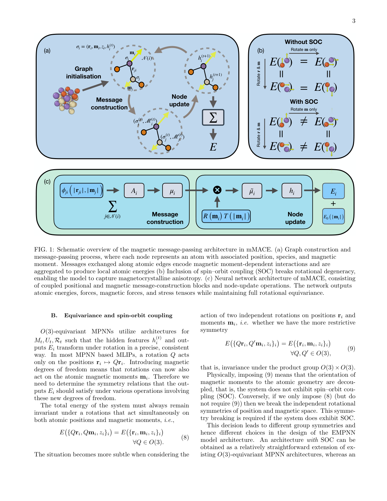
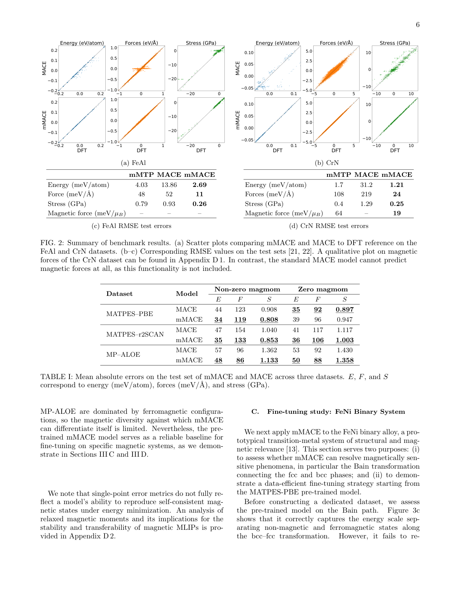
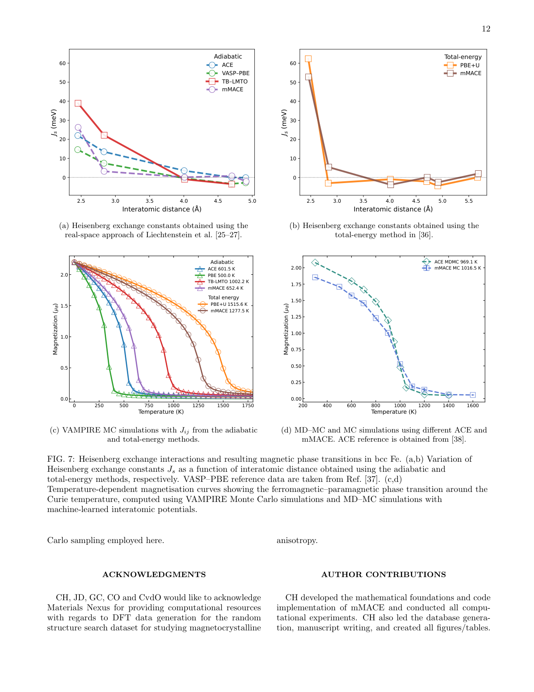
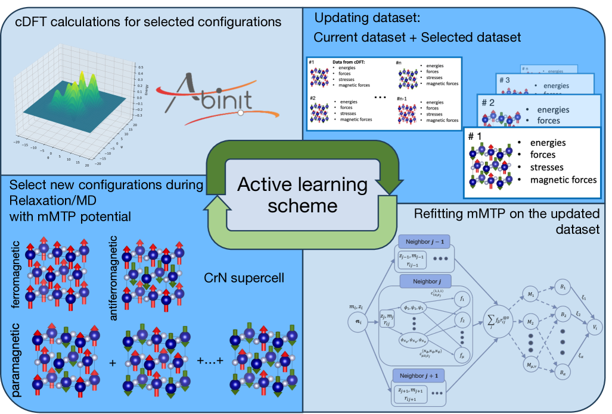
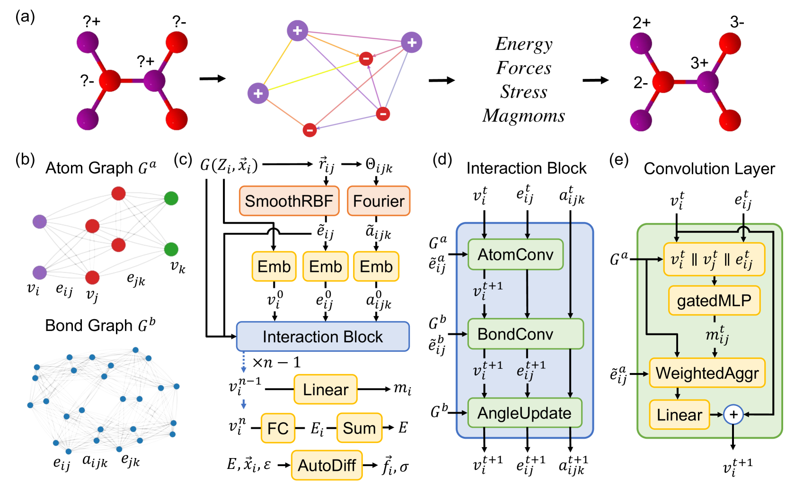
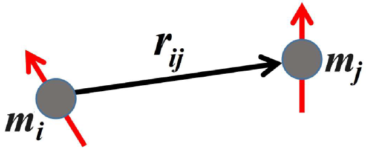

# スピン自由度を学習する機械学習原子間ポテンシャル——等変多体メッセージパッシングで非コリニア磁性に挑む

- 執筆日：2026-04-12
- トピック：mMACE（magnetic MACE）——磁性材料向け等変MLIPの新展開
- タグ：Computation and Theory / Magnetism and Spin; Low-Dimensional Materials / Machine Learning; First-Principles Calculations
- 注目論文：arXiv:2604.08143「Equivariant Many-body Message Passing Interatomic Potentials for Magnetic Materials」
- 参照関連論文数：6

---

## 1. なぜ今この話題なのか

磁性は現代技術の至るところに顔を出す。ハードディスクや磁気テープに代表される情報記録技術、永久磁石を使ったモーターや発電機、そして次世代デバイスとして期待されるスピントロニクス素子——これらすべてが原子スケールでのスピンの挙動に支えられている。材料設計の観点からいえば、「どの元素をどう組み合わせればどんな磁気特性が得られるか」という問いに答えることが、エネルギー変換効率の改善や新しいデバイス機能の開拓に直結する。

この問いに対して、第一原理計算（密度汎関数理論、DFT）は非常に強力なツールとなってきた。スピン分極DFTはサイズが数十原子程度の系に対してサブmeV精度でエネルギーや磁力を計算できる。しかし代償として計算コストは著しく大きく、とりわけ有限温度での磁気相転移やスピン格子ダイナミクスの解析には、数千原子を数十ナノ秒にわたって追跡する必要があり、DFTのみでは太刀打ちできない。

こうした状況を一変させたのが**機械学習原子間ポテンシャル** **(Machine-Learned Interatomic Potential, MLIP)** の台頭である。DFTで計算した少数の構造からポテンシャルエネルギー面を学習し、古典MDシミュレーション並みのコストで近DFT精度を実現するMLIPは、2010年代後半から急速に発展してきた。とりわけグラフニューラルネットワーク（GNN）と**等変性** **(equivariance)** の組み合わせ——代表例がMACE（arXiv:2206.07697）やNequIP（arXiv:2101.03164）——は、原子位置の回転・反転に対して正確に変換するフィーチャー表現を実現し、少ないデータで高精度な汎用ポテンシャルを構築することを可能にした。

しかし既存のMLIPには大きな盲点があった。磁気モーメントを「明示的な自由度」として扱う仕組みが欠けていたのである。磁性材料ではイオンの位置だけでなく各原子のスピン方向・大きさによってもエネルギー面が大きく変化する。コリニア（同方向）な強磁性・反強磁性配置だけを扱うならある程度の近似で逃げられるが、スカイルミオン、フラストレート反強磁性体、磁気構造転移点近傍の揺らぎなど**非コリニア磁性**が本質的な役割を果たす系では従来のMLIPは根本的に不十分だった。さらにスピン軌道結合（SOC）が生み出す**磁気結晶異方性**（特定の結晶方向にスピンが揃いやすい性質）はサブmeVスケールのエネルギー差によって決まるが、この微細なエネルギー差を信頼性高く学習することも既存モデルには難しかった。

2026年4月に公開されたarXiv:2604.08143「Equivariant Many-body Message Passing Interatomic Potentials for Magnetic Materials（mMACE）」は、この空白に正面から取り組んだ論文である。MACEアーキテクチャを土台に、原子磁気モーメントを等変な自由度として多体メッセージパッシングに組み込み、コリニア・非コリニア・SOCありの磁性を統一的に学習できる枠組みを提示している。

---

## 2. この分野で何が未解決なのか

磁性材料向けMLIPの開発には、長年にわたり三つの中心的な問いが横たわってきた。

**問い①：非コリニアスピンをどう正確に記述するか。** 強磁性や単純な二副格子反強磁性では各原子のスピンは±z方向に揃っており、スカラー量（スピンのz成分あるいは大きさ）だけを扱えば済む。しかし三角格子の幾何学的フラストレーション（競合する交換相互作用によってすべてのスピン対が同時に安定化できない状況）を持つ系、たとえばMn₃Ptのようなカゴメ副格子上の非コリニアマグネットでは、スピンは三次元空間内の任意方向を向き得る。このような配置では、スピンベクトル**$m_i$** の内積にしか依存しない初期世代のモデル（SpinGNN, arXiv:2203.02853）は、向きの全ベクトル情報を捨てているため表現力に限界がある。「内積不変」から「回転等変」への飛躍が問われている。

**問い②：スピン軌道相互作用に起因する磁気結晶異方性をMLIPで解像できるか。** 磁気結晶異方性（MCA）エネルギーはorientation依存で、典型的には原子あたり10⁻³〜1 meVというサブmeVスケールの値を示す。これは最新のMLIPの単点エネルギー予測誤差（通常数meV/atom）と同程度かそれ以下である。したがって単純な回帰では信号がノイズに埋もれてしまう。SOCを明示的に学習させる枠組みが必要だが、SOCは「スピン空間」と「実空間」の独立した回転対称性を破るという点で数学的にも難しい。

**問い③：元素横断的な汎用磁性MLIPを構築できるか。** 既存の研究（Rinaldi et al. arXiv:2305.15137の非コリニアACE）は主に鉄(Fe)という一元素系を対象としており、大量の訓練データを必要とする。現実の磁性材料設計には多元素系のハイスループットスクリーニングが不可欠だが、そのためには少ないデータから広い組成空間をカバーできる転移学習戦略と、磁性配置の多様性に対する汎化能力が求められる。

この三つの問いは互いに絡み合っており、一つを解決しようとすると他に波及する。mMACEはこれらを一つのアーキテクチャ的枠組みで扱おうとしており、それが本論文の野心的な点である。

---

## 3. 注目論文の核心

### mMACEの提案とアーキテクチャ

mMACEは、等変メッセージパッシングニューラルネットワーク（EMPNN）の枠組みに磁気モーメント$m_i$ ∈ ℝ³を明示的な等変自由度として組み込んだものである。各原子$i$の状態を$({\bf r}_i, {\bf m}_i, z_i)$——位置・磁気モーメント・元素種——のタプルで表現し、これをグラフのノードとして扱う。

*図1（arXiv:2604.08143 Fig.1より、CC BY 4.0）: mMACEの磁気メッセージパッシングアーキテクチャの概略。（a）グラフ構築とメッセージパッシング過程。各ノードは原子を表し、磁気モーメント依存の情報がエッジ沿いに交換される。（b）SOCの有無による対称性の違い。SOCなし（上段）では位置とモーメントを独立に回転してもエネルギーは不変だが、SOCあり（下段）では位置とモーメントを同時に回転した場合のみ不変となる。（c）ニューラルネットワーク計算グラフ：位置・磁気のメッセージ構築ブロックとノード更新演算からなる。*

アーキテクチャの核心は**対称性の適切な設定**にある。SOCを含まない系では、原子の位置空間での回転$Q$と磁気モーメント空間での回転$Q'$が独立して行える。すなわち$E(\{Q{\bf r}_i, Q'{\bf m}_i, z_i\}) = E(\{{\bf r}_i, {\bf m}_i, z_i\})$という$O(3)\times O(3)$対称性を満たす必要がある。一方、SOCが存在する系では位置とモーメントは結合しており、同じ回転$Q$を両方に同時に加えた場合のみ不変性が成立する。この区別はアーキテクチャ設計上の根本的な分岐点であり、mMACEはSOCあり（O(3)等変）の実装を主版として採用し、SOCなしはデータ拡張または付録の別実装で対応している。

メッセージパッシングでは、エッジ特徴量$\phi_{ji}$をベクトル相互作用を含む形で構築する。具体的には球面調和関数$Y_{l_1}^{m_1}(\hat{\bf r}_{ji})$と磁気モーメントに依存する回転行列$R({\bf m}_j)$を組み合わせ、位置・磁気の両方の情報を含んだ多体基底${\bf B}_{i,\eta,kLM}^{(t)}$をClebsch-Gordan係数を用いて構築する（式(19)）。中心原子$i$のモーメントと隣接環境を相関付ける「磁気多体メッセージ」$\mathcal{M}_{i,kLM}^{(t)}$（式(22)）は、従来のMLIPには存在しない新たな要素である。エネルギーは原子間相互作用エネルギー$E_i^{\rm inter}$と、スピン大きさのみに依存する一体磁気エネルギー$E_{0,z_i}(|{\bf m}_i|)$の和として与えられる。さらに磁力$F_i^{\rm mag} = -\nabla_{{\bf m}_i} E$が自動微分で得られるため、磁気モーメントの自己無撞着最適化も可能となる。

### 主要結果

**ベンチマーク（FeAlおよびCrN）：** 図2に示すように、コリニアスピン分極FeAlデータセットに対してmMACEは力のRMSEをMACE比で約5分の1、応力RMSEをmMTP比で約3分の1に削減した。コリニアCrNでは磁力RMSEがmMTP比で3倍以上改善し、通常のMACEでは磁力の予測自体が不可能なのに対しmMACEは信頼性高く再現する。

*図2（arXiv:2604.08143 Fig.2より、CC BY 4.0）: FeAlおよびCrNデータセットでのベンチマーク結果。散布図はmMACEとMACEをDFTリファレンスと比較したもの。上段（標準MACE）は非ゼロ磁力領域で力・応力をゼロと予測してしまう（ゼロへのアーティファクト）が、下段（mMACE）では対角線上に良く一致している。下の表はRMSE数値：FeAlでは力RMSEがmMACE=11 meV/Å対MACE=52 meV/Å、応力はmMACE=0.26 GPa対mMTP=0.79 GPa。*

**FeNi二成分合金（Bainパス）：** FeNi合金のbcc→fcc相変態を記述するBainパスでは、強磁性(FM)・反強磁性(AFM)・非磁性(NM)の3状態のエネルギー順序を正確に再現することが求められる。事前訓練されたMATPES-PBEモデルをそのまま使うとFM/AFM順序が崩れるが、少数の標的データを加えた反復ファインチューニング（iter2で既に良い結果、iter3でほぼDFT並み）で、エネルギーMAE=2.44 meV/atom、力MAE=3.06 meV/Åまで改善できる。

**Mn₃Ptフラストレート非コリニア磁石：** カゴメ様副格子上で幾何学的フラストレーションを持つMn₃Ptは、競合する交換相互作用が非コリニアな磁気基底状態を安定化させる。mMACEは乱数的な初期スピン方向（訓練・検証セット外の配置）から出発した100回の磁気モーメント最小化すべてをカゴメ様基底状態へ収束させた。MACE基準値（DFT基底状態から緩和）はゼロ誤差・ゼロエネルギー残差を示し、自己無撞着解が正しく再現されていることを確認している。

**FeMnの磁気結晶異方性：** FeMnフェリ磁性体の異方性エネルギー$K_1$について、DFT=2.22 Jm⁻³に対しmMACE=2.20 Jm⁻³という良好な一致が得られた。また多様な化学組成のランダム構造探索（RSS）データベースに対してスピンランク相関係数$\rho_{\rm Spearman}=0.894$を達成しており、SOC感度の高い構成を正しく同定できる。

**Feのキュリー温度：** キュリー温度（$T_C$、強磁性→常磁性転移温度）の予測では、mMACE駆動のモンテカルロシミュレーションが$T_C \approx 1016$ K（実験値1043 K）を与えた。ハイゼンベルグモデルに基づくVAMPIRE計算は断熱近似では$500 \sim 1000$ Kと大きくばらつくのに対し、mMACEのMDMCは非コリニア配置と多体交換相互作用を明示的に取り扱う点で本質的に優れている（図7）。

*図3（arXiv:2604.08143 Fig.7より、CC BY 4.0）: bcc Feにおけるハイゼンベルグ交換定数と磁気相転移。（a,b）断熱法・全エネルギー差法で求めた交換定数$J_s$の原子間距離依存性。mMACEはACE, VASP-PBE参照に近い定性的傾向を再現。（c,d）キュリー温度付近での磁化の温度依存性。VAMPIRE MC（ハイゼンベルグモデル）は断熱近似の限界から過大/過小評価になるのに対し、mMACE MCは実験値（1043 K）に近い$\sim 1016$ Kを与える。*

### 何が新しいのか

それ以前にわかっていたことを整理しよう。コリニアMLIPは磁気モーメントの大きさをスカラーとして取り込むことができたが、方向の変化（スピン回転、非コリニア）を正確に扱う機能は持っていなかった。SpinGNNはスピンの内積を特徴量に使うことで非コリニア系へのある程度の対応を実現したが、内積不変アーキテクチャのためモーメント方向の全ベクトル情報が失われ、SOCを自然に扱えなかった。Rinaldi et al.の非コリニアACEは非コリニア+SOCなし系でFe単元素に対して優れた結果を示したが、元素横断的な事前訓練との組み合わせは実現されていなかった。

mMACEの本質的な前進は、（1）スピン自由度**$m_i$**  をベクトル量としてO(3)等変的に扱うこと、（2）多体メッセージパッシングで位置とスピンの結合した多体相互作用を自動的に学習できること、（3）SOC有無の両方を数学的に整合した形で統一的に扱えること、（4）大規模事前訓練モデルからの少量データによるファインチューニングが有効に機能することの4点に集約される。

---

## 4. 背景と研究史

磁性を意識したMLIPの歴史は比較的新しい。Dragoni et al.（2017年）がGAP（Gaussian Approximation Potential）でFeの磁気的・構造的性質を同時学習しようとした先駆的試みがあるが、磁気自由度はスカラーとしてのみ組み込まれていた。その後、Eckhoff & Behler（2021年）がスピン依存の原子中心対称関数を使った高次元ニューラルネットワークポテンシャル（HDNNP）を提案し、コリニア系への適用を示した。

**mMTP（Magnetic Moment Tensor Potential）** という枠組みはKotykhov et al.によって体系化されており、その最新版（arXiv:2412.20214）はCrN系に対してアクティブラーニングを組み合わせたプロトコルを提案している（図4）。mMTPはFM・AFM・PM（常磁性）状態を記述でき、フォノンスペクトルや熱膨張係数などの実験データとの比較でも良好な結果を示すが、非コリニア磁性への対応は基本的にコリニア近似の枠組み内に留まる。

*図4（arXiv:2412.20214 Fig.2より、CC BY-NC-ND 4.0）: mMTPアクティブ訓練プロトコルの概略。初期mMTPからスタートし、アクティブラーニングで訓練セットを自動拡充するループ。拘束DFT（cDFT）計算によって様々なスピン配置のエネルギー・力・応力・磁力を取得する。mMACEではこの種の反復ファインチューニング戦略がさらに発展している。*

**SpinGNN++**（arXiv:2211.11403, Phys. Rev. B 2024）はCrI₃やCrTe₂などの二次元磁性体を対象に、ハイゼンベルグ・DMI（Dzyaloshinskii-Moriya相互作用）・北原型相互作用・単イオン異方性・双二次項といった明示的なスピン格子Hamiltonianを多タスク学習で同時にフィットする。時間反転O(3)等変アーキテクチャを採用しており、CrTe₂ではDFT基底状態が強磁性ではなくフェリ磁性であることを予測するなど、定性的な誤りも訂正している点が重要である。ただし、物理的に動機付けられた明示項（Heisenberg Jij等）に依存するため、その枠外の複雑な相互作用を自動的に学習する柔軟性はmMACEほどではない。

**非コリニア磁性ACE**（Rinaldi et al., arXiv:2305.15137, npj Comput. Mater. 2024）は現在最も高精度な単元素磁性MLIPの一つで、bcc Feに対してコリニア・非コリニアのDFTデータを統合学習し、磁気励起、フォノン、点欠陥、マグノンスペクトルまで広範に再現する。モデルはFe一元素だけで元素ごとに数千の配置を必要とし、多元素系への拡張はまだ実現されていない。

**CHGNet**（Deng et al. arXiv:2302.14231, Nature Machine Intelligence 2023）はMaterials Project軌跡データセット（~150万構造）上で事前訓練された汎用ポテンシャルで、コリニアスピン偏極磁気モーメントを出力の一つとして予測する。エネルギー・力・ストレスのほかに磁気モーメントを訓練ターゲットに含めることで、LiₓMnO₂の相変態など磁性が関わる過程のMDが可能になっている。

*図5（arXiv:2302.14231 Fig.1より、CC BY 4.0）: CHGNet のワークフローとアーキテクチャ。グラフ構造から原子電荷（磁気モーメントを通じた軌道占有率）を推定し、エネルギー・力・ストレス・磁気モーメントを同時予測する。CHGNetはコリニアな磁気モーメントを出力として扱い、mMACEが入力（等変自由度）として扱う点が根本的に異なる。*

こうした先行研究の流れのなかで、mMACEが果たした「等変ベクトル量としてのスピン自由度 + 多体相互作用 + 汎用事前訓練との接続」という組み合わせが、分野のパラダイムシフトをもたらしうる理由が見えてくる。

---

## 5. どの解釈が最も妥当か

### mMACEの主張を支える根拠

mMACEの最も重要な主張は「スピン自由度を等変ベクトルとして明示的に組み込むことで、コリニアから非コリニアおよびSOC系まで統一的に扱え、かつDFT精度に近い結果が少量データで得られる」というものである。

この主張を支える証拠は多層的だ。第一に、FeAlとCrNというコリニアベンチマークで力・応力のRMSEが既存の最良手法（mMTP）を大きく上回る。特に磁力の予測はmMACE固有の能力であり、通常のMACEでは原理的に不可能である。第二に、FeNi Bainパスのファインチューニング実験では、わずか147訓練配置・100検証配置という少量データでFM/AFM/NM順序を正確に捉え、さらに明示的なBainパス配置を加えなくても（iter2時点で）DFTをほぼ再現できることが示された。これはmMACEの表現力が十分に高く、訓練データから磁気と構造の物理を汎化して学んでいることを示唆する。第三に、Mn₃Ptの非コリニア基底状態を乱数初期値から100回連続で正しく見つけられるという結果は、磁気エネルギー地形が定性的に正確に学習されていることの説得力ある証拠である。

### 他の解釈と比較

**SpinGNNとの比較：** SpinGNNとその後継SpinGNN++は、物理的に解釈可能な明示的スピン格子項（Heisenberg、DM、Kitaev等）を直接フィットするアプローチである。この設計は二次元磁性体の基本パラメータ抽出には強みを持つが、これらの明示項以外の複雑な相互作用（例えば多体磁気交換相互作用）を自動学習する柔軟性は低い。mMACEが採用する「データ駆動の多体メッセージパッシング」は物理的解釈性という点では劣るかもしれないが、表現力と汎化能力に優れる。どちらのアプローチが優れているかは対象系と目的次第であり、シンプルな系では解釈可能なモデルが望ましく、複雑な多元素系では柔軟なアーキテクチャが有利と考えられる。

**Rinaldi ACEとの比較：** 非コリニアACEはFe単元素に対しては本論文でmMACEの参照として使われており、定性的な一致はある（ハイゼンベルグ交換定数の傾向が合う）が、mMACEのモンテカルロシミュレーションによるキュリー温度（~1016 K）はACEの分子動力学-MCアプローチ（~969 K）よりも実験値（1043 K）に近い。この差の一因は、mMACEが事前訓練によってより多様な磁気配置を学習していることにある可能性がある。ただしACEとの直接比較は使用した訓練データセットが異なるため厳密ではない。

**mMTPとの比較：** arXiv:2412.20214のmMTP CrNはアクティブラーニングを駆使してパラメグネティックCrNの力学・熱的性質を精度良く再現するが、磁力のRMSEはmMACE比で3倍以上大きい。これは「磁力を訓練ターゲットに含める」というmMACEの設計思想の優位性を反映している。Kotykhov et al.（arXiv:2405.07069）も磁力を訓練に組み込むことで信頼性が向上することを別途示しており、この点ではmMACEの方針を間接的に支持している。

**GAP磁気交換場（arXiv:2403.10769）との比較：** Rinaldi & Braams（2024）のGAP拡張は、非コリニアスピンに対するexchange fieldを学習し、断熱近似下でabフィリオスピンダイナミクスシミュレーションを可能にする。bcc Feでスピン1個あたりのエネルギー誤差が1 meV以内という精度を示している。

*図6（arXiv:2403.10769 Fig.2より、CC BY 4.0）: 2スピン間に働く様々な相互作用の模式図。スピン**m**_iと**m**_jの大きさmと向き**ê** = **m**/m、および相対位置**r**_{ij}に依存する相互作用がクラスタ展開の形で記述される。ハイゼンベルグ交換項（最近接・次近接）から高次の多体交換まで、異なる方法論がどの相互作用を学習するかを示す概念図。*

### 比較的強く支持される結論

コリニア系における精度改善と磁力の予測は、証拠の強さが高い。複数の独立したデータセット（FeAl, CrN, MATPES-PBE, MATPES-r2SCAN, MP-ALOE）で一貫した改善が見られることは、アーキテクチャの設計が機能しているという強い指標である。非コリニア系への適用（Mn₃Pt）も、100回収束という定量的な結果があり説得力がある。

### まだ弱い結論

キュリー温度（$T_C$）の予測精度については、より慎重に評価すべきである。$T_C$はスピン揺らぎや格子-スピン結合の細部に敏感であり、論文ではMDMC（分子動力学-モンテカルロ）シミュレーションのステップ比やサイズ収束について十分な検討が保留されている。また事前訓練データセット（MATPES等）は強磁性コリニア配置が支配的であり、反強磁性やフラストレート系への汎化がどこまで可能かはまだ未検証の部分が多い。SOCを自己無撞着に訓練手続きに統合する方法も「今後の課題」として明示的に残されている。

### 今後必要な検証

最も重要な検証として、(a) 反強磁性・フラストレート磁性体を含む多様な磁気配置の訓練データを大量に含む基盤モデルの構築、(b) 実験的に磁気スペクトル（中性子散乱によるマグノン分散等）が精密に測定された物質でのmMACEシミュレーションとの比較、(c) SOCの自己無撞着統合、の三点が挙げられる。

---

## 6. 何が一般化できるのか

### スカイルミオンと反強磁性スピントロニクスへ

mMACEが拓く最も直接的な応用の一つは、スカイルミオン（位相的に保護されたスピン渦）が現れる材料系の大規模シミュレーションである。スカイルミオンの安定性はDMI（Dzyaloshinskii-Moriya相互作用）と交換エネルギーの競合によって決まり、非コリニアスピン配置が本質的な役割を果たす。mMACEはこのような競合エネルギースケールをDFT精度で学習できるため、実材料系でのスカイルミオン安定化条件の探索に直接使える。

また近年注目される**オルタマグネット**や反強磁性スピントロニクスの分野でも、ゼロ正味磁化を持ちながら異方的なスピン分裂を示す材料の設計に磁力まで含めた精密なポテンシャルが必要であり、mMACEが有力なツールとなりうる。

### スピン格子ダイナミクスへの接続

mMACEが予測する磁力$F_i^{\rm mag} = -\nabla_{{\bf m}_i} E$は、スピン格子ダイナミクスシミュレーションの直接入力となる。格子振動（フォノン）とスピン自由度が結合した系（磁歪材料、磁気カロリック効果材料など）では、二つの自由度を分離して扱う従来の近似は本質的に不十分であり、mMACEの磁力を使って自己無撞着に両者を更新するMD-MCシミュレーションが実現できれば、有限温度での磁気相転移や磁気散乱メカニズムの精密な記述が可能になる。

### ハイスループット磁性材料探索への展開

論文で示されたランダム構造探索（RSS）データセットに対するSOCスクリーニング（$\rho_{\rm Spearman}=0.894$）は、mMACEが多元素系にわたって磁気結晶異方性の強さをランク付けできることを示している。これは希土類フリー永久磁石の探索や、スピントロニクスデバイス向け高MCA材料の高速スクリーニングへの橋渡しとなる。数百万の構造に対してDFTによる非自己無撞着SOC計算（磁力定理を使ったMAEの近似計算）を行う代わりに、mMACEの推論コストでほぼ同等のランキングが得られるとすれば、探索の加速効果は絶大である。

ただし一般化の限界も認識すべきである。現時点のmMACEは主にコリニアFM配置が支配的な訓練データに基づいており、複合酸化物、ランタノイド・アクチノイド系、強いHund結合を持つ系（二重交換相互作用が重要なマンガン酸化物など）への汎化はまだ保証されていない。また電荷秩序と磁気秩序が強く結合する系（eg：コロッサル磁気抵抗マンガン酸塩）では、スピン自由度だけでなく軌道自由度も明示的に取り込む必要があり、このような拡張は今後の課題となっている。

---

## 7. 基礎から理解する

### 等変性とは何か

物理法則には対称性がある。分子や結晶をある角度だけ回転させても、そのエネルギーは変わらない——これが**回転不変性** **(rotational invariance)** である。関数$f: X \to Y$が「入力を$g$で変換したとき、出力も$g$で（対応する方法で）変換される」という性質を**等変性** **(equivariance)** という。

$$f(g \cdot x) = \rho_Y(g) \cdot f(x)$$

ここで$g$は対称変換（回転$Q \in O(3)$など）、$\rho_Y(g)$は出力空間での$g$の作用を表す。エネルギーのようなスカラー量に対しては$\rho_Y(g)=1$（不変性）だが、力ベクトルや磁気モーメントのようなベクトル量に対しては$\rho_Y(g) = Q$（ベクトルとして変換）となる。等変性を学習アーキテクチャに組み込むことで、訓練データに含まれない回転配置にも自然に汎化でき、データ効率が劇的に向上する。

球面調和関数$Y_l^m(\hat{\bf r})$は回転変換に対して$\ell$次の**球面テンソル表現**を与える。これをGNNのエッジ特徴量の基底として使うことで、各エッジの空間方向情報が等変的に伝播される。MACE（mMACEの基盤）はClebsch-Gordan係数$C_{lm,l'm'}^{LM}$を使って複数のテンソル積を縮約し、高次の多体相互作用を表現する：

$${\bf B}_{i,\eta,kLM}^{(t)} = \sum_{\bf lm} C_{\eta,\bf lm}^{LM} \prod_{k=1}^{\nu} \sum_{\tilde{k}} W_{\tilde{k}kl_{\tilde{k}}}^{(t)} A_{i,\tilde{k}l_{\tilde{k}}m_{\tilde{k}}}^{(t)}$$

ここで$A_{i,klm}^{(t)}$は各原子の隣接原子情報を集約した2体基底、$\nu$は多体相関の次数を表す。mMACEではこれに加えて磁気モーメントを介した相関項$\mathcal{M}_{i,kLM}^{(t)}$が加わり、スピンと位置の多体相関が自動的に学習される。

### メッセージパッシングの直感的理解

グラフニューラルネットワークでは原子をノード、原子間結合をエッジとして表現する。「メッセージパッシング」とは、各ノードが近隣ノードから情報（メッセージ）を受け取り、自分の表現を更新するというプロセスの繰り返しである。1ステップのメッセージパッシングでカットオフ半径内の隣接原子の情報が取り込まれ、2ステップでは隣の隣まで届く。MACEは2ステップで十分な表現力を達成することを示している。

mMACEではメッセージがスカラーだけでなく磁気モーメント依存の等変テンソル成分を含むため、近傍スピン配置の空間的パターンがより豊富に伝播される。これは従来のスカラー記述子ベースの磁性MLIPと本質的に異なる点である。

### スピン軌道相互作用と磁気結晶異方性

スピン軌道相互作用（SOC）は電子スピン角運動量${\bf S}$と軌道角運動量${\bf L}$の結合$\xi(r) {\bf L} \cdot {\bf S}$によって生じる。SOCの直接的な効果は、スピンを特定の結晶方位に固定しようとする磁気結晶異方性（MCA）エネルギーである。一軸対称の系では

$$\frac{E_A}{V} \approx K_1 \sin^2\theta + K_2 \sin^4\theta$$

として表され、$K_1 > 0$なら**磁化容易軸** **(easy axis)** が$z$軸に、$K_1 < 0$なら**磁化容易面** **(easy plane)** が$xy$面になる。FeMnの場合$K_1 \approx 2.2 \text{ Jm}^{-3}$という値をmMACEが精度よく再現した。

計算的には、MCAエネルギーはSOCを含む非自己無撞着計算で磁化方向を変えてバンドエネルギーの差として求められる（磁力定理）。このSOC誘起の微細なエネルギー差（サブmeVスケール）を、mMACEは等変テンソルアーキテクチャと適切なデータ生成手順によって学習できることを示した。

### ハイゼンベルグモデルとその限界

磁性の平均場的理解では、最近接スピン間の交換相互作用をハイゼンベルグ模型$\mathcal{H} = -\sum_{\langle ij \rangle} J_{ij} \hat{S}_i \cdot \hat{S}_j$で記述することが多い。$J_{ij} > 0$なら強磁性、$J_{ij} < 0$なら反強磁性的結合を表す。しかしこの模型は2体交換のみを含み、多体相互作用（リング交換等）や有限温度での格子振動との結合を無視している。その結果、古典ハイゼンベルグ模型から求めたキュリー温度は実験値から系統的にずれることが知られている。mMACEのMDMCシミュレーションはこれらの高次効果を暗黙的に含んでいるため、より実験に近いキュリー温度が得られると解釈できる。

---

## 8. 専門用語の解説

**①機械学習原子間ポテンシャル（MLIP: Machine-Learned Interatomic Potential）**
第一原理計算（DFT）で求めたエネルギー・力・ストレスを訓練データとし、ニューラルネットワークや核関数法でポテンシャルエネルギー面を近似するモデル。計算コストはDFTの数千分の一以下でDFT並みの精度を達成できるため、大規模・長時間の原子シミュレーションが可能になる。

**②等変性（Equivariance）**
入力を対称変換（回転・反転など）した際に、出力が対応する方法で共変する性質。エネルギーはO(3)に対して不変（等変の特殊ケース）だが、力ベクトルやスピンはベクトルとして変換される。アーキテクチャに等変性を組み込むと、対称性を学習で発見する必要がなくなりデータ効率と精度が向上する。

**③MACE（Message-passing Atomic Cluster Expansion）**
Batatia et al.（NeurIPS 2022）が提案したO(3)等変メッセージパッシングGNNアーキテクチャ。球面調和関数と多体相関（ACE）を組み合わせ、2層のメッセージパッシングで高い表現力を実現する。mMACEはMACEを磁気自由度対応に拡張したものである。

**④非コリニア磁性（Noncollinear magnetism）**
隣接するスピンが揃う（コリニア：強磁性・反強磁性）のではなく、各原子のスピンが三次元空間で異なる方向を向く磁性状態。幾何学的フラストレーション（三角格子など）、DMI、スカイルミオンなどで現れる。量子力学的には電子が複数の磁気配置の量子重ね合わせをとり得る状況。

**⑤スピン軌道結合（SOC: Spin-Orbit Coupling）**
相対論的効果によってスピン角運動量${\bf S}$と軌道角運動量${\bf L}$が結合する現象。$\xi(r){\bf L}\cdot{\bf S}$として表現される。この結合が磁気結晶異方性（特定方向への磁化の優先）、DMI（スカイルミオン安定化）、トポロジカルホール効果などの物理の起源となる。

**⑥磁気結晶異方性（MCA: Magnetocrystalline Anisotropy）**
結晶格子の対称性とSOCの結合によって、スピン（磁化）が特定の結晶軸方向を好む性質。永久磁石の保磁力の源であり、$K_1$（一軸異方性定数）で定量化される。値はサブmeV/atom程度と小さいが、デバイス特性に決定的な役割を果たす。

**⑦磁力（Magnetic force）**
エネルギーの磁気モーメントベクトルに対する勾配$F_i^{\rm mag} = -\nabla_{{\bf m}_i} E$。原子に働く力（$F_i = -\nabla_{{\bf r}_i} E$）の磁気版。磁力をゼロにすることがスピン配置の自己無撞着緩和条件に相当し、mMACEが磁力を訓練ターゲットとして含めることで自己無撞着な磁気状態の探索が可能になる。

**⑧転移学習・ファインチューニング（Transfer learning / Fine-tuning）**
大量のデータで事前訓練した汎用モデルを、少数の標的データで特定系に適応させる技術。mMACEではMATPES-PBE（~40万構造）で事前訓練したモデルを、247配置のFeNiデータや147配置のMn₃Ptデータで微調整することで高精度を達成。磁性材料探索の計算コストを大幅に削減できる。

**⑨キュリー温度（Curie temperature: $T_C$）**
強磁性体が加熱によって常磁性に転移する温度。スピン熱揺らぎによって長距離磁気秩序が失われる点で、磁気秩序相転移の臨界温度に相当する。Feの$T_C$は1043 Kで、mMACEのモンテカルロシミュレーションは~1016 Kを与えた。

**⑩幾何学的フラストレーション（Geometric frustration）**
格子構造と相互作用の組み合わせによって、すべての原子ペアが同時にエネルギー最小配置をとれない状況。三角格子上の反強磁性体がその代表例で、三角形の3つのスピンをすべてが隣と反平行にすることは不可能である。その結果、高度に縮退した磁気基底状態やスピン液体相が出現する。Mn₃Ptはこの典型例として論文で検討されている。

---

## 9. 今後の展望

mMACEの登場によって、磁性材料計算において「スピン自由度を陽に組み込んだ等変機械学習ポテンシャルが原理的に動作する」という概念実証は完成した。コリニアから非コリニア、SOCあり系までの統一的な扱い、少量データからのファインチューニングの有効性、キュリー温度やMCA定数などの磁気派生量の予測という成果は、磁性材料シミュレーションの新しい地平を切り開くものである。かなり確からしくなったこととして、(i) 等変メッセージパッシング+磁気自由度というアーキテクチャが既存手法を正確さ・汎用性の両面で上回る、(ii) 磁力を訓練に組み込むことがMCA計算やスピン緩和に本質的に重要である、の2点は複数の独立した証拠に支えられている。

一方、未確定な部分も無視できない。現在の基盤モデルは強磁性コリニア配置が支配的な訓練データに偏っており、反強磁性体・フラストレート磁性体・常磁性金属への汎化能力は検証途上である。SOCをポテンシャル内で自己無撞着に扱う方法論（SOC誘起エネルギーを摂動補正として事後的に加えるのではなく、訓練手続きに組み込む）の確立は大きな開発課題として残る。さらにスピンが位置とは独立に動く系（ハイブリッドスピン格子動力学）での検証も必要である。今後1〜3年で注目すべき論点としては、(a) 非コリニア・AFMを大量に含む汎用磁性基盤モデルの整備（mMACEによる版を含む）、(b) スカイルミオン安定化材料や異方性磁気抵抗材料でのmMACE予測と実験比較、(c) mMACEをスピン格子動力学ソルバー（Vampire、SPIRIT、SLaDyS等）と接続したMDMCシミュレーションのフルパイプライン化、(d) 希土類元素を含む高MCA材料（SmCo₅、Nd₂Fe₁₄B類）への適用が挙げられる。本論文は一つのアーキテクチャ提案に留まらず、磁性材料のデータ駆動的理解と設計を実用レベルに押し上げる出発点として、今後の発展が強く期待される。

---

## 参考論文一覧

1. **[arXiv:2604.08143]** Ho, C. H. et al. "Equivariant Many-body Message Passing Interatomic Potentials for Magnetic Materials." arXiv (2026). https://arxiv.org/abs/2604.08143
   — 本稿のアンカー論文。O(3)等変多体メッセージパッシングに磁気モーメントを陽な自由度として組み込んだmMACEを提案し、コリニア・非コリニア・SOC系を統一的に学習できることを示した。

2. **[arXiv:2206.07697]** Batatia, I. et al. "MACE: Higher Order Equivariant Message Passing Neural Networks for Fast and Accurate Force Fields." NeurIPS 2022. https://arxiv.org/abs/2206.07697
   — mMACEが拡張の基盤とした等変メッセージパッシングアーキテクチャMACEを提案し、原子間ポテンシャルにおける多体等変表現の優位性を確立した。

3. **[arXiv:2305.15137]** Rinaldi, M. et al. "Non-collinear Magnetic Atomic Cluster Expansion for Iron." npj Comput. Mater. 10, 12 (2024). https://arxiv.org/abs/2305.15137
   — Fe単元素の非コリニア磁性ACEを構築し、マグノンスペクトル・点欠陥・相変態を高精度に再現した。mMACEの比較対象として論文内で参照されている。

4. **[arXiv:2211.11403]** Zhong, X. et al. "General time-reversal equivariant neural network potential for magnetic materials." Phys. Rev. B (2024). https://arxiv.org/abs/2211.11403
   — 時間反転O(3)等変ニューラルネットと明示的スピン格子項（Heisenberg, DM, Kitaev等）を組み合わせたSpinGNN++を提案し、二次元磁性体CrI₃・CrTe₂に適用。

5. **[arXiv:2403.10769]** (機関学習交換場論文) "Machine Learning Exchange Fields for Ab-initio Spin Dynamics." arXiv (2024/2025). https://arxiv.org/abs/2403.10769
   — GAP（Gaussian Approximation Potential）を非コリニアスピンへ拡張し、磁気交換場を学習することでbcc Feのアブイニシオスピンダイナミクスシミュレーションを実現した。

6. **[arXiv:2412.20214]** Kotykhov, A. et al. "Actively-trained magnetic Moment Tensor Potentials for mechanical, dynamical, and thermal properties of paramagnetic CrN." arXiv (2024). https://arxiv.org/abs/2412.20214
   — アクティブラーニングを使ったmMTPを使い、パラメグネティックCrNのフォノン・熱膨張・熱容量をDFTおよび実験と良く一致した精度で再現した。mMACEのCrNベンチマークにおける比較対象。

7. **[arXiv:2302.14231]** Deng, B. et al. "CHGNet as a pretrained universal neural network potential for charge-informed atomistic modelling." Nature Mach. Intell. 5, 1031 (2023). https://arxiv.org/abs/2302.14231
   — MPtrjデータセット（~150万構造）上で事前訓練したGNN普遍ポテンシャルで、エネルギー・力・ストレスとともにコリニア磁気モーメントを出力する。mMACEとの根本的な違いは磁気モーメントを「入力の等変自由度」ではなく「出力ターゲット」として扱う点。
