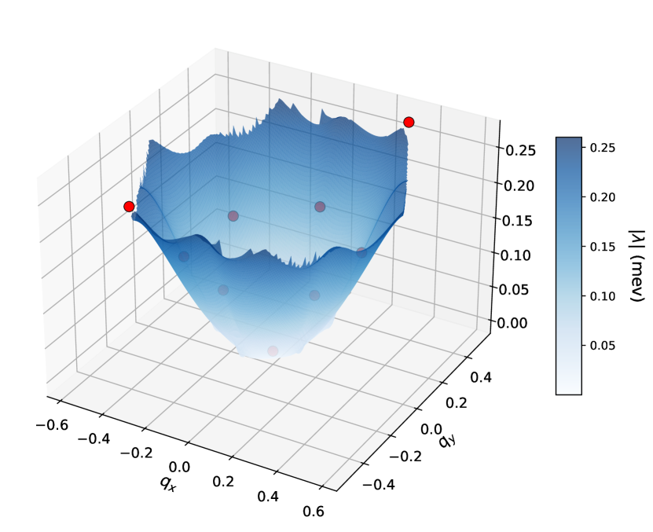
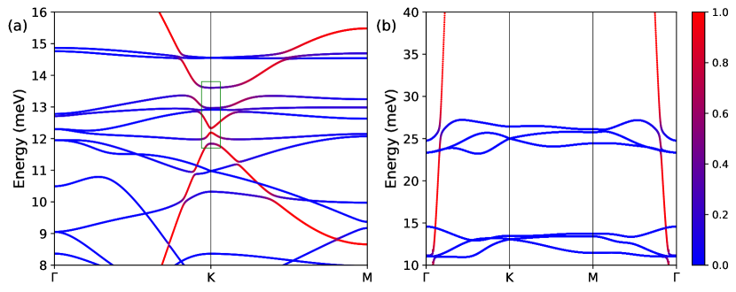
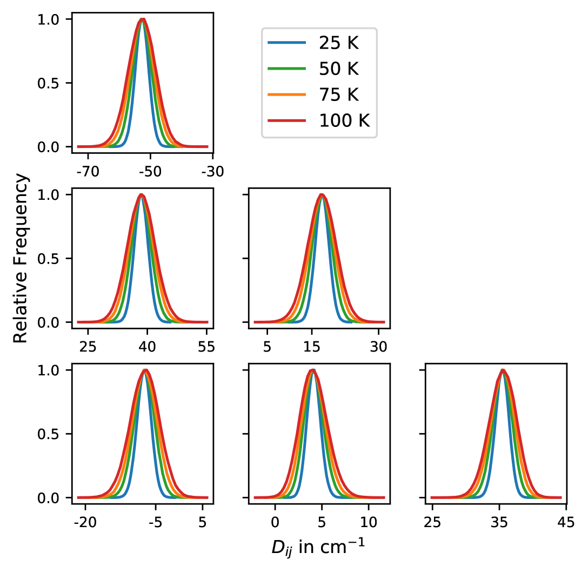
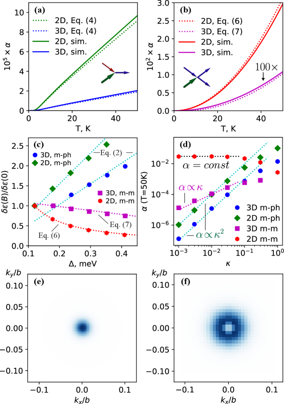
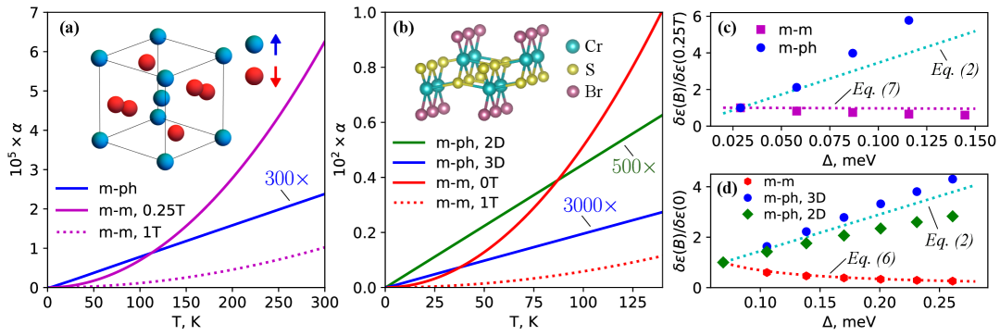

# マグノン–フォノン結合の第一原理計算：2次元磁性体における音響波によるマグノン励起まで

- **執筆日**: 2026-04-20
- **トピック**: 2次元磁性体におけるマグノン–フォノン結合の第一原理計算と機械学習応用
- **タグ**: Multiphysics and Coupled Phenomena / Magnons and Spin Dynamics; Low-Dimensional Materials / First-Principles Calculations; Machine Learning
- **注目論文**: arXiv:2604.12866 "Acoustically-driven magnons in CrSBr bilayers"
- **参照論文数**: 9本

---

## 1. なぜ今この話題なのか

磁性体の中を走る「スピン波（マグノン）」と、格子振動の量子「フォノン」が互いに影響し合う現象——**マグノン–フォノン結合**（magnon-phonon coupling）——は、凝縮系物理の最前線で急速に重要性を増している。その背景には、大きく3つの潮流が絡み合っている。

第一は、**スピントロニクスへの要求**である。従来の電子スピンを担体とするデバイスに加え、マグノンを情報のキャリアとして使う「マグノニクス」が注目されている。マグノンは電気的に中性であるため、ジュール発熱を伴わずに信号を伝達できる可能性を秘める。しかしマグノンが長距離伝搬するためには、フォノンとの散乱による減衰（マグノン散乱）をいかに抑制するかが鍵となる。逆に、マグノンとフォノンを意図的に共鳴させることで、音響波を使ってマグノンを励起・制御するという新しいパラダイムも生まれつつある。

第二は、**2次元van der Waals磁性体の台頭**である。CrI₃、CrTe₂、CrSBrなどの原子層磁性体は、2017年以降次々と実験的に確認され、磁性の次元性・異方性・トポロジーを自在に制御できる新しい舞台を提供している。これら2次元系では、フォノン分散にバルク材料とは異なる「フレキシュラルモード（屈曲振動）」が現れ、マグノン–フォノン結合が3次元系とは質的に異なる様相を示す。さらに、層を積み重ねる（ヘテロ構造化）ことで層間交換相互作用を通じたマグノン–フォノン結合という新しいチャネルが開く。

第三は、**第一原理計算と機械学習の急速な発展**である。密度汎関数理論（DFT）を基盤とした計算手法が成熟し、マグノン分散とフォノン分散を同一の電子構造計算から導出する「統一的な第一原理フレームワーク」が整備されつつある。一方で、スピン自由度を含む機械学習力場（MLIP）の開発が急ピッチで進んでおり、大規模系でのスピン–格子結合のシミュレーションが現実的になってきた。これらの計算手法の整備が、マグノン–フォノン結合の定量的理解を大きく押し進めている。

この流れの中で2026年4月に登場したのが、本記事の注目論文 arXiv:2604.12866「CrSBr二層膜における音響波駆動マグノン」である。この論文は、積層型2次元磁性体 CrSBr の二層膜において、外部から印加した音響波（フォノン）が共鳴的にマグノンを励起できることを理論的に示した。その鍵となるのは、層間のひずみ（strain）に敏感な**層間交換結合**であり、この機構は従来の報告とは異なる「機械的マグノン励起」の新たな経路を提示している。

---

## 2. 未解決問題は何か

マグノン–フォノン結合の分野には、現在も活発に議論されている根本的な問いが少なくとも3つある。

**問い①：マグノン–フォノン結合定数をどう定量的に計算するか？**

マグノン–フォノン結合は、スピンハミルトニアン（具体的にはハイゼンベルク交換定数 $J$）の原子変位に対する依存性として定義される。しかし、その第一原理計算は長らく方法論的に確立されていなかった。電子–フォノン結合（electron-phonon coupling）に対するMigdal–Eliashbergの枠組みに相当する体系的な理論が、マグノン–フォノン系には存在しなかったのである。2025年以降、いくつかのグループが独立に第一原理法を提案しているが（後述）、計算手法の選択や適用範囲をめぐる議論はまだ収束していない。

**問い②：マグノン–フォノン結合はマグノンの寿命・輸送をどの程度支配するか？**

マグノンが散乱されるチャネルとしては、フォノンとの散乱（マグノン–フォノン散乱）のほか、マグノン同士の散乱（マグノン–マグノン散乱）、磁性不純物・欠陥による散乱などがある。どの散乱チャネルが材料・温度・エネルギー域ごとに支配的かは、スピントロニクス材料の設計に直結する問いだが、定量的な比較は難しかった。最近の第一原理計算が初めてこれを定量的に扱い始めている。

**問い③：マグノン–フォノン共鳴を利用したスピン制御は実現可能か？**

マグノンとフォノンが同じ周波数・波数で「共鳴」する条件（分散の交差点）が存在するとき、両者の間でエネルギーと情報のやりとりが起きる。この共鳴点付近では混成モード（マグノン–フォノンポラリトンとも呼ばれる）が生じ、バンド構造に反交差（anticrossing）ギャップが開く。この効果をどのように外部制御可能な形で引き出すか——音響波・レーザー・電場・磁場などを使って——は、デバイス応用の観点から重要な未解決課題である。CrSBrのような層間交換結合が敏感に変化する系では、音響波によるマグノン励起という新規な制御経路が浮かび上がっている。

---

## 3. 注目論文の核心

### 3.1 問題設定と鍵となるアイデア

arXiv:2604.12866（Shubnicら、2026年4月14日）は、CrSBr の二層膜（bilayer）における音響フォノンとマグノンの共鳴的結合を理論的に解析した論文である。CrSBr は層状のvan der Waals反強磁性絶縁体であり、近年その特異なエキシトン–マグノン結合で注目を集めている材料だ（本記事のCSV履歴にも CrSBr 関連のトピックが登録されている）。しかし本論文が注目するのは光ではなく、音（音響フォノン）とマグノンの相互作用である。

論文の核心的なアイデアは次の通りである：CrSBr の二層膜では、上下の層の間に層間交換相互作用 $J_\perp$ が働く。この $J_\perp$ は層間距離（あるいはひずみ）に敏感であるため、格子が音響波によって周期的に変形すると、$J_\perp$ も時間的に振動する。この振動する $J_\perp$ がマグノンに対する「ポンプ項」として機能し、共鳴条件が満たされると効率よくマグノンを励起できる——これが論文の主張である。

$$\delta J_\perp(t) \propto \delta u(t) \frac{\partial J_\perp}{\partial u}$$

ここで $\delta u(t)$ は音響フォノンによる原子変位、$\partial J_\perp / \partial u$ は層間距離に対する交換定数の微分（すなわちマグノン–フォノン結合定数の本質）である。

### 3.2 主要結果と新規性

論文は以下の3つの主要結果を報告している。

**（1）共鳴条件の特定**：マグノン分散曲面とフォノン分散曲面が交差する周波数・波数（共鳴点）を求め、その点でマグノン生成効率が最大になることを示した。

**（2）磁場チューナビリティ**：外部磁場を変えることで、マグノンのギャップ（ゼーマン分裂による）を制御でき、共鳴周波数を広い範囲でチューニングできることを示した。この磁場可変性は実際のデバイス応用で非常に重要な特性である。

**（3）振幅の応答特性**：マグノン振幅の駆動周波数依存性を詳細に計算し、ローレンツ型の共鳴ピークを示した。ピーク幅はマグノンの減衰（ダンピング）に対応しており、材料パラメータとの対応関係が明確にされた。

この論文の最大の新規性は、これまで CrSBr で研究されていた「光による励起（光励起エキシトン–マグノン結合）」とは全く異なる励起経路——「音響波による機械的マグノン励起」——を定量的に示したことである。CrSBr の層間交換結合 $J_\perp$ が極めて変形感受性（strain-sensitive）であるという材料特性が、この機構を他の材料より有利にしている。

### 3.3 まだ仮説段階なこと

本論文はモデル理論計算（現象論的パラメータを使った解析）であり、DFT 第一原理計算による $\partial J_\perp / \partial u$ の定量値は論文中で独自には計算されていない。層間交換結合のひずみ依存性については、既存の DFT 計算から推定したパラメータを使っている。また、実験的な検証はまだない。したがって、実際にどの周波数・磁場条件でどれだけ効率よくマグノンが励起されるかは、実験と組み合わせた今後の検証が必要な段階にある。

---

## 4. 背景と研究史

### 4.1 マグノン–フォノン結合の理論的基盤

マグノン–フォノン結合の最も基本的な描像は、スピンハミルトニアンのパラメータが格子変位に依存するという考え方から出発する。ハイゼンベルクモデルを例に取ると、

$$\hat{H} = -\sum_{\langle ij \rangle} J(\mathbf{u}_{ij}) \hat{\mathbf{S}}_i \cdot \hat{\mathbf{S}}_j$$

ここで $\mathbf{u}_{ij}$ は原子 $i, j$ の相対変位である。$J$ を変位について展開すると、

$$J(\mathbf{u}_{ij}) = J_0 + \frac{\partial J}{\partial u_\alpha} u_\alpha + \cdots$$

の線形項が、マグノン演算子とフォノン演算子を結合する相互作用ハミルトニアン $\hat{H}_\text{mag-ph}$ を与える。この $\partial J / \partial u_\alpha$ こそがマグノン–フォノン結合定数の本体である。

この概念自体は古く、「スピン–格子緩和」（spin-lattice relaxation）として核磁気共鳴（NMR）の文脈で1950年代から知られていた。しかし、マグノン分散全体にわたる $\mathbf{q}$ 依存の結合定数を第一原理から系統的に計算するという試みは、2次元磁性体の登場とともに2020年代になってようやく本格化した。

### 4.2 第一原理計算の登場：CrI₃とCrTe₂での開拓

この方向での重要な進展が、Fangら（arXiv:2501.14239, 2025年1月）によって達成された。彼らは、線形スピン波理論（LSWT：linear spin-wave theory）のフレームワーク内で、マグノン–フォノン結合定数を「実空間の非対角交換定数の微分をHelmann-Feynman力から求める」という効率的な手法を開発した。

この手法の特徴は次の通りである。まず原子をわずかに変位させた複数の超格子計算を行い、各変位に対する交換定数 $J_{ij}$ を求める。次にこれらを実空間でフーリエ変換し、任意のブリルアンゾーン点での結合定数を得る（図参照）。従来の有限差分法と比べて計算コストが大幅に削減される。

*図1：単層 CrI₃ における音響マグノンモードと第16フォノンモード間の線形マグノン–フォノン結合定数のブリルアンゾーン内分布。青い曲面がフーリエ補間、赤点が3×3×1超格子上の直接計算値。[Fang et al., arXiv:2501.14239, CC BY 4.0]*

CrI₃（単層）での検証では、この手法で得た結合定数が実験的なマグノン線幅と整合していることが確認された。さらに CrTe₂ への適用から、超交換相互作用を仲介する非磁性原子（Te など）がマグノン–フォノン結合に大きく寄与することが明らかになった。この発見は、「磁性原子だけを見ていても結合の全貌はわからない」という重要な示唆を与える。

*図2：単層 CrI₃（a）と CrTe₂（b）の混成マグノン–フォノンバンド構造。緑枠（a）は K 点での線形マグノン–フォノン結合による反交差ギャップ開口を示す。[Fang et al., arXiv:2501.14239, CC BY 4.0]*

一方、多体第一原理計算（Bethe–Salpeter方程式）を用いた先駆的研究として、2502.05385（Marrazzo & Lischner, 2025年2月）があり、水素化グラフェンと単層 CrI₃ での「マグノン平均自由行程の温度依存性」を完全第一原理で初めて計算した（本記事CSVでは magnon-phonon-magnetothermal トピックの関連論文として登録済）。この研究から、マグノン–フォノン結合の強い（弱い）フォノンモードと電子–フォノン結合の強い（弱い）モードが必ずしも一致しないという非自明な事実が示された。これは、電子–フォノン結合の知見をそのまま流用できないことを意味する。

### 4.3 実験的証拠：フォノン異常が映し出す磁気秩序

マグノン–フォノン結合は実験的には、磁気転移点付近でのフォノン軟化・線幅ブロードニングとして観測される。典型例が Fe₄GeTe₂ での研究（arXiv:2512.18544, Palら, 2025年12月）である。Fe₄GeTe₂ は約270 Kのキュリー温度 $T_C$ と、約110 K でのスピン再配向転移（spin reorientation transition, SRT）を持つ準2次元磁性体である。

ラマン分光測定では、$T_C$ 以下でのフォノン硬化（linewidth narrowing）が観察されると同時に、SRT付近で異常なフォノン軟化とピーク幅増大が見られた。DFT+DMFT 計算とアトミスティックスピンダイナミクスシミュレーションの組み合わせにより、マグノン分散がちょうど問題のフォノンエネルギーと重なる温度域でこの異常が現れることが確認された——これが「スピン再配向によるマグノン–フォノン結合の増強」の証拠と解釈されている。

また、より巨視的なスケールでの実験的証拠として、FeRh薄膜上でのGHz帯表面弾性波（SAW）伝搬実験（arXiv:2604.14845, 2026年4月）がある。FeRh は室温よりわずかに高い温度で反強磁性から強磁性に相転移する材料であり、この転移をまたいで SAW の速度と振幅が変化することが観測された。弾性波（フォノン）が磁気秩序に応答するというこの実験は、GHz 帯における磁気音響デバイスへの道を示すものだ。

NiPS₃（反強磁性絶縁体）での類似実験（arXiv:2511.21968, 2025年11月）では、ネール温度 $T_N$ を通過する際に表面弾性波の速度が5.5%もの大きな軟化を示すことが報告された。第一原理計算と有限要素法解析により、ジグザグ型反強磁性秩序が長波長の弾性定数を繰り込む（magnetoelastic renormalization）ことが確認されており、巨大なスピン–格子結合の直接証拠となっている。

### 4.4 理論の多様性：二次元金属磁性体での議論

三次元絶縁体とは異なる挙動を示すのが、2次元金属磁性体 Fe₃GeTe₂ での研究（arXiv:2406.05229, Badrtdinovら, 2024年6月, Phys. Rev. B 110, L060409）である。この研究では、電子–フォノン結合を介してフォノンが交換相互作用 $J$ を繰り込む機構（phonon-induced renormalization of exchange interactions）が定量的に解析された。Fe₃GeTe₂ では、平衡フォノン分布（有限温度でのフォノン占有）が $J$ を最大約10%抑制し、キュリー温度を約10%低下させるという。

この機構は、絶縁体でのマグノン–フォノン直接散乱とは異なる：金属系では電子–フォノン結合を介した「間接的なマグノン–フォノン結合」が重要になる。また、非平衡フォノン（レーザー励起や電流注入による）があればこの抑制効果がさらに増幅されると予測されており、ポンプ–プローブ実験との接続が期待される。

---

## 5. どの解釈が最も妥当か

### 5.1 注目論文の解釈を支える根拠

CrSBr二層膜での音響波によるマグノン励起（注目論文2604.12866）の解釈は、次の証拠によって支持されている。

まず、**層間交換結合の強いひずみ感受性**は複数の実験・計算で裏付けられている。CrSBr は層間距離が大きく、超交換相互作用の経路が長いため、層間距離（ひずみ）変化に対して $J_\perp$ が敏感に応答する。第一原理計算（文献2501.14239の手法を適用すれば計算可能）は、この感受性の大きさを裏付けると期待される。

次に、**共鳴条件の設定可能性**については、外部磁場がマグノンのギャップを制御できることを利用して、音響フォノンとマグノンを広い周波数範囲でチューニングできることが理論的に示された。磁場可変のスピントロニクスデバイスとの親和性が高い。

さらに、**類似の音響駆動スピン励起機構**は別の系でも報告されている。FeRh での弾性波–磁性相転移の相互作用（2604.14845）や NiPS₃ での巨大磁弾性効果（2511.21968）は、音響波が磁性自由度と強く結合できることを実験的に裏付けている。

### 5.2 不確定な点と他の解釈

一方、いくつかの重要な不確定要素が残る。

**（1）第一原理的な $\partial J_\perp / \partial u$ の定量値**：注目論文はモデルパラメータを文献値や見積もりから採用しているが、DFT によって独立に計算された $\partial J_\perp / \partial u$ の信頼できる値がまだない。Fangらの手法（2501.14239）を CrSBr 二層膜に適用した計算が今後必要である。

**（2）単層とバルクでの差異**：マグノン–フォノン結合の強さは次元性に大きく依存する。2次元系では「フレキシュラルフォノン」（低エネルギーで $q^2$ 分散を持つ屈曲振動モード）が存在し、3次元系のような音響フォノン（$q$ に線形分散）とは性質が異なる。この違いがマグノン–フォノン散乱率にどう影響するかは、基板上に置かれた場合と自由立膜の場合で大きく変わる（2602.21885が論じている通り）。

**（3）マグノン–マグノン散乱との競合**：フォノンとの散乱だけでなく、マグノン同士の非線形散乱（4マグノン過程など）もマグノンのダンピングに寄与する。Shuminら（2602.21885）の第一原理計算によれば、YIG（イットリウム鉄ガーネット）のような三次元強磁性絶縁体ではマグノン–フォノン散乱が支配的だが、単層 CrSBr では4マグノン散乱がより強くなる——「2次元性が4マグノン散乱を強める」という次元効果がある。

### 5.3 現時点での最も強い結論

複数の研究を総合すると、現在最もよく支持される結論は次の通りである。

第一に、**CrSBr 二層膜の層間交換結合は音響フォノンと顕著に結合できる**。これは同材料での大きな磁弾性感受性と、CrSBr における層間距離と磁性の緊密な関係から支持される。

第二に、**マグノン–フォノン結合定数は材料によって大きく異なり、DFT 第一原理計算で予測可能**である。Fangらの手法（2501.14239）は CrI₃ と CrTe₂ で実証されており、同様の枠組みが CrSBr、Fe₃GeTe₂ などに拡張できる。

第三に、**マグノンのダンピングにはフォノン散乱が温度を通じて重要な役割を果たすが、次元性によって機構が異なる**。3次元系では低エネルギーフォノンとの散乱、2次元系では4マグノン散乱が相対的に重要になる傾向がある（2602.21885）。

---

## 6. 何が一般化できるのか

### 6.1 材料の多様性と設計原理への接続

マグノン–フォノン結合が強く現れる条件として、以下が一般化できる。

まず、**超交換相互作用を介した磁性材料**では $J$ のひずみ依存性が大きく、結合定数が大きくなる傾向がある。CrI₃ や CrTe₂ は Cr–X–Cr（X = I, Te）の超交換経路を持ち、非磁性原子 X の変位が $J$ を大きく変える（2501.14239）。これは磁性体の組成・構造設計でマグノン–フォノン結合を制御できることを示唆する。

次に、**スピン再配向転移付近**では磁気秩序の「柔らかさ」がマグノン–フォノン結合を一時的に増強する。Fe₄GeTe₂（2512.18544）の例がこれを実証しており、磁気的に不安定な領域をデバイス動作温度に設定することで強い結合を引き出せる。

さらに、**層状 van der Waals 材料の積層構造**では、層間距離の変化（呼吸振動モード）が層間交換結合に直結するため、積層による新しい結合チャネルを設計できる。CrSBr 二層膜はその典型例だが、同様の原理は CrI₃ 積層体や Fe₃GeTe₂/Fe₃GaTe₂ ヘテロ構造にも適用できる可能性がある。

### 6.2 測定手法・理論枠組みへの接続

マグノン–フォノン結合の実験的検出には複数の手法がある。ラマン散乱（2512.18544）や非弾性中性子散乱（INS）はフォノン異常を検出し、ブリルアン散乱（2511.21968）は表面弾性波の磁気変調を観測し、フェロ磁気共鳴（FMR）線幅（2602.21885）はマグノンダンピングを定量化する。これらを第一原理計算と組み合わせることで、測定可能量と微視的結合定数を定量的に結びつける理論的基盤が整いつつある。

理論的には、電子–フォノン結合の多体計算（Bethe–Salpeter方程式法、2502.05385）をマグノン–フォノン系に拡張する方向と、実空間の結合定数からの線形応答理論（LSWT + Hellmann-Feynman力法、2501.14239）という2つのアプローチが相補的に機能している。前者は精度が高いが計算コストが大きく、後者は効率的だが多体効果の一部を無視する。

### 6.3 機械学習への接続と将来展望

第一原理計算でマグノン–フォノン結合定数を求めるためには、多数のスーパーセル計算（原子変位ごとのDFT計算）が必要であり、大規模系や合金系への適用は現状では困難である。ここで機械学習が重要な役割を担いつつある。

分子磁性体（単一分子磁石）の分野では、Zaverkinら（arXiv:2312.01415, 2023年12月）が Gaussian-moment ニューラルネットワークを使って、ゼロ場分裂テンソル $D$ を核座標の関数として機械学習し、分子振動との結合（スピン–フォノン緩和）を予測することに成功している。このアプローチでは、機械学習分子間ポテンシャル（MLIP）が原子ダイナミクス（MD）を担当し、ニューラルネットワークが $D$ テンソルを予測する。

*図3：単分子磁石における D テンソル要素の熱平均値の温度依存性と MD トラジェクトリからの統計。左は 2.5 ns の MD サンプリングから得た D テンソル要素の熱的広がり。[Zaverkin et al., arXiv:2312.01415, CC BY 4.0]*

拡張磁性体（bulk 系や 2D 系）への ML 適用は始まったばかりだが、スピン自由度を明示的に扱う磁性 MLIP（磁気 MACE、磁気 ACE、磁気 Moment Tensor Potential など）の開発が近年急速に進んでおり、近い将来には大規模なスピン–格子結合シミュレーションが可能になると予想される。特に、$J(\mathbf{u})$ の機械学習（Sørensen & Jacobsen の枠組みなど）が実現すれば、CrSBr 二層膜のような複雑な積層系でのマグノン–フォノン結合定数のマップを効率的に作成できる。

---

## 7. 基礎から理解する

### 7.1 スピン波（マグノン）とは

磁性絶縁体を考える。最も単純なハイゼンベルク強磁性体では、全てのスピンが同じ方向を向いた「完全強磁性秩序」が基底状態である。この状態から一つのスピンを傾けると、その傾きが隣のスピンに伝わって波として伝搬する——これがスピン波である。

量子力学的に見ると、スピン波は**マグノン**という準粒子として記述される。マグノンは「スピン角運動量 1 の励起」であり、フォノン（格子振動の量子）と同様に、ボーズ–アインシュタイン統計に従う。マグノンのエネルギー $\hbar \omega_\mathbf{q}$ は波数 $\mathbf{q}$ に依存し、その関係 $\omega(\mathbf{q})$ がマグノン分散関係である。

強磁性体の長波長極限では、マグノン分散は

$$\hbar \omega_\mathbf{q} \approx \Delta + D q^2$$

という放物型（$q^2$ 依存）をとる（$\Delta$ はアニゾトロピーギャップ、$D$ はスピン波スティフネス）。これは音速に比例する音響フォノンの線形分散（$\omega = v_s q$）とは形が異なるため、低エネルギー（低 $q$）ではマグノンとフォノンが「交差」しにくい。しかし反強磁性体や特定の強磁性体では、マグノンが線形分散（$\omega \propto q$）を持つ場合があり、音響フォノンと交差・共鳴しやすい。

### 7.2 フォノンとは

フォノンは格子振動の量子である。$N$ 原子からなる結晶では、$3N$ 個のフォノンモードがある。各モードは「原子が特定のパターンで振動する正規振動モード」に対応し、そのエネルギーは $\hbar \omega_\mathbf{q,\nu}$（$\mathbf{q}$：波数、$\nu$：モードインデックス）で与えられる。

フォノンの計算には、DFT から導出された「動的行列（dynamical matrix）」を対角化する。原子 $\kappa$ の変位 $u_\kappa$ に対するエネルギーの2階微分が動的行列であり、これを第一原理で計算する方法を「密度汎関数摂動理論」（DFPT）と呼ぶ。

$$D_{\kappa\alpha,\kappa'\beta}(\mathbf{q}) = \frac{1}{\sqrt{M_\kappa M_{\kappa'}}} \frac{\partial^2 E}{\partial u_{\kappa\alpha}(-\mathbf{q}) \partial u_{\kappa'\beta}(\mathbf{q})}$$

この動的行列を対角化すると、フォノン固有周波数と固有ベクトル（偏光方向）が得られる。

### 7.3 マグノン–フォノン結合の数理

マグノン–フォノン結合は、スピンハミルトニアンの交換定数 $J$ が原子変位 $u$ に依存することから生じる。線形スピン波理論の範疇で、マグノン演算子 $\hat{\alpha}_\mathbf{q}$（消滅）を用いると、マグノン–フォノン結合ハミルトニアンは次の形をとる。

$$\hat{H}_\text{mag-ph} = \sum_{\mathbf{q},\nu} g_\mathbf{q}^\nu \hat{\alpha}_\mathbf{q} (\hat{b}_\mathbf{q}^\nu + \hat{b}_{-\mathbf{q}}^{\nu\dagger}) + \text{h.c.}$$

ここで $\hat{b}_\mathbf{q}^\nu$ はフォノンの消滅演算子、$g_\mathbf{q}^\nu$ がマグノン–フォノン結合定数（coupling matrix element）である。この $g_\mathbf{q}^\nu$ は交換定数の原子変位に対する1階微分 $\partial J / \partial u$ と関連しており、第一原理計算で求められる量である（2501.14239）。

マグノン–フォノン散乱によるマグノンの散乱率（逆緩和時間）は、フェルミの黄金律から

$$\frac{1}{\tau_\mathbf{q}} = \frac{2\pi}{\hbar} \sum_\nu |g_\mathbf{q}^\nu|^2 \left[ (n_\mathbf{q}^\nu + 1) \delta(\omega_\mathbf{q}^\text{mag} - \omega_\mathbf{q}^\nu) + n_\mathbf{q}^\nu \delta(\omega_\mathbf{q}^\text{mag} + \omega_\mathbf{q}^\nu) \right]$$

のように計算される（$n_\mathbf{q}^\nu$ はフォノン占有数、ボーズ分布）。第一項はフォノン放出、第二項はフォノン吸収に対応し、いずれもマグノンとフォノンのエネルギー保存（デルタ関数）を要求する。この散乱率から、マグノンの平均自由行程 $\ell = v_\text{mag} \tau$ が温度の関数として計算できる。

### 7.4 磁気ダンピング（Gilbert減衰）との関係

スピントロニクスで重要な量に、**ギルバートダンピング定数 $\alpha$** がある。これはマグノンが熱浴（格子、電子系）にエネルギーを散逸する速さを表し、フェロ磁気共鳴（FMR）の線幅に直接対応する。

マグノン–フォノン散乱は $\alpha$ に寄与する。Shuminら（2602.21885）は、3次元系（YIG）では $\alpha$ のほぼ全てがマグノン–フォノン散乱で説明でき（ギルバートダンピングの「固有項」）、2次元 CrSBr では4マグノン散乱の寄与が追加されることを示した（図4）。

*図4：最小モデルでのマグノンダンピング温度依存性。(a) マグノン–フォノン散乱によるダンピング、(b) マグノン–マグノン（4マグノン）散乱によるダンピング、(c) マグノン線幅とギルバート則との比較、(d)(e)(f) 2次元・3次元でのダンピングの次元依存性。[Shumilin et al., arXiv:2602.21885, CC BY 4.0]*

さらに同グループは、第一原理スピンハミルトニアンを用いた実材料計算も行った（図5）。バルク YIG の計算では実験的な FMR 線幅の温度依存性が再現され、単層 CrSBr では4マグノン散乱の支配的な役割が予測された。この「材料の次元性に応じてダンピング機構が異なる」という知見は、スピントロニクス材料のダンピング工学（damping engineering）に直結する設計指針を与える。

*図5：第一原理スピンハミルトニアンからのマグノンダンピング計算。(a) バルク YIG のマグノン–フォノン散乱とマグノン–マグノン散乱の温度依存性、(b) 単層 CrSBr の同計算、(c)(d) それぞれの FMR 線幅の実験比較。[Shumilin et al., arXiv:2602.21885, CC BY 4.0]*

### 7.5 CrSBr の特性

注目論文の舞台である CrSBr は、Cr-S-Br 層からなる層状 van der Waals 磁性体（空間群 Pmmn）で、単層では強磁性、積層した二層・バルクでは反強磁性（A型）的な配列をとる。キュリー温度は単層で約 150 K、バルクで 132 K と比較的高い。最大の特徴は、**ジグザグ型の磁気秩序**と強い1次元的な電子・光学的異方性で、励起子が高い結合エネルギーを持つ。また、層間の交換結合 $J_\perp$ が層間距離に非常に敏感であり（圧力や歪みで容易に変調できる）、これが注目論文での音響マグノン励起の基盤となっている。

---

## 8. 専門用語の解説

**マグノン（Magnon）**  
磁性体中のスピン波（集団的スピン振動）を量子化した準粒子。フォノン同様にボーズ粒子であり、有効磁場・交換相互作用・異方性によってその分散関係が決まる。電気的に中性のため、ジュール加熱なしに情報を伝搬できるマグノニクス研究の主役。

**フォノン（Phonon）**  
結晶格子振動を量子化した準粒子。原子の整合した集団振動として記述され、熱伝導・電子–フォノン相互作用・超伝導などに関与する。音速に沿った「音響フォノン」と、光学的に活性な「光学フォノン」に大別される。

**マグノン–フォノン結合定数 $g_\mathbf{q}$**  
マグノンとフォノンが相互作用する強さを表すパラメータ。物理的には「原子が変位したときに交換定数 $J$ がどれだけ変化するか」$(\partial J / \partial u)$ の量的な表れ。第一原理計算で求められ、マグノンの寿命・スピンゼーベック効果・磁熱効果などに直結する。

**線形スピン波理論（LSWT）**  
磁性体の低エネルギー励起を、スピン演算子を Holstein–Primakoff 変換でボゾン化した後、低次の非線形項を無視して扱う理論。マグノン分散関係と固有ベクトルを第一原理的に計算する際の標準的な枠組み。

**Hellmann–Feynman 力**  
量子力学的変分原理から導かれる「原子に働く力は電子密度と原子位置の関数として解析的に計算できる」という定理から得られる力。DFT 計算において格子力定数・動的行列の計算に用いられる。マグノン–フォノン結合定数の計算にも利用される（2501.14239）。

**スピン再配向転移（Spin Reorientation Transition, SRT）**  
温度変化などによって磁化容易軸の方向が変わる相転移。Fe₄GeTe₂（2512.18544）の～110 K でのSRT 付近では、磁気異方性エネルギーが小さくなり（「磁気的に柔らかい」状態）、フォノンとの強い結合が現れる。

**ギルバートダンピング（Gilbert Damping）**  
マクロスピンが歳差運動するときに働く現象論的減衰を記述する定数 $\alpha$。微視的には電子–磁子–フォノン散乱の複合過程で決まる。FMR 線幅の半値全幅 $\Delta H = \alpha \cdot 2\omega / \gamma$ の関係から実験的に決定される。

**層間交換結合 $J_\perp$**  
van der Waals 磁性体において、異なる層間のスピン間に働く超交換相互作用。バルクとは異なる「反強磁性的」な $J_\perp$ が CrSBr の反強磁性秩序を安定化する。層間距離に敏感なことが、音響波によるマグノン制御の鍵となる。

**音響マグノン（Acoustic Magnon）**  
反強磁性体や多副格子強磁性体において、スピン波分散の最低エネルギーブランチ（アコースティックブランチ）に属するマグノン。バンド端（Γ 点）でエネルギーが消失する（または磁気異方性ギャップのみを持つ）モード。音響フォノンと混成しやすい。

**磁弾性効果（Magnetoelastic Effect）**  
磁気秩序（スピン整列）が弾性定数・格子定数に与える影響。磁気転移点付近でのフォノン軟化や弾性定数の異常として観測される。NiPS₃（2511.21968）や FeRh（2604.14845）でのフォノン速度変化がその例。

**機械学習力場（MLIP: Machine Learning Interatomic Potential）**  
DFT から計算したエネルギー・力・応力データを学習した机械学習ポテンシャル。従来のMLIPはスピンを扱えなかったが、近年スピン自由度を含む磁性 MLIP（磁気 MACE、磁気 ACE など）が開発されており、大規模スピン–格子シミュレーションへの応用が始まっている。

---

## 9. 今後の展望

### 9.1 かなり確からしくなったこと

現在の研究状況を総合すると、次のことがほぼ確立されつつある。第一に、2次元 van der Waals 磁性体（CrI₃、CrTe₂、CrSBr など）のマグノン–フォノン結合定数は第一原理計算で定量的に予測可能であり、実験（FMR 線幅、ラマン分光など）と定量的に比較できる（2501.14239, 2602.21885）。第二に、磁弾性効果の実験的シグナル（ネール点や SRT 付近でのフォノン速度異常）は複数の材料系で再現よく観測されており、スピン–格子結合が巨視的な弾性応答に直結することが確立されている（2511.21968, 2512.18544, 2604.14845）。

### 9.2 まだ未確定なこと・次に重要になる問題

未解決の核心は「音響波による効率的なマグノン生成の実験的実証」である。2604.12866 が提唱する CrSBr 二層膜での共鳴的マグノン励起は、まだ理論予測の段階にある。今後1〜3年で最も重要な実験は、（1）GHz 帯の弾性波（SAW や超音波）を CrSBr 薄膜に入射し、その際のマグノン信号（FMR または BLS: ブリルアンライトスキャッタリング）を時間分解で検出する実験、（2）外部磁場による共鳴周波数チューニングの実証、の2点であろう。

理論・計算面では、（1）CrSBr 二層膜での $\partial J_\perp / \partial u$ の第一原理計算（2501.14239の手法の適用）、（2）磁性 MLIP（mMACE など）を使った CrSBr 多層膜のスピン–格子ダイナミクスの大規模シミュレーション、（3）2次元磁性体での4マグノン散乱とマグノン–フォノン散乱の相対寄与の系統的な第一原理比較、が重要な課題となる。また、機械学習の観点からは、スピン–フォノン結合の予測モデルを分子磁性体から拡張磁性体に橋渡しする枠組みの構築（2312.01415の精神を2D磁性体に適用）が近い将来の研究フロンティアと見られる。

---

## 参考論文一覧

1. **[arXiv:2604.12866](https://arxiv.org/abs/2604.12866)** — A. Shubnic et al., "Acoustically-driven magnons in CrSBr bilayers" (2026). CrSBr 二層膜の層間交換結合が音響フォノンによって変調され、共鳴的にマグノンを励起できることを理論的に示した本記事の注目論文。

2. **[arXiv:2501.14239](https://arxiv.org/abs/2501.14239)** — W. Fang et al., "Efficient method for calculating magnon-phonon coupling from first principles" (2025). Hellmann–Feynman 力を用いた効率的な第一原理マグノン–フォノン結合計算法を開発し、CrI₃ と CrTe₂ で実証した。

3. **[arXiv:2602.21885](https://arxiv.org/abs/2602.21885)** — A. Shumilin et al., "Intrinsic (non)-Gilbert damping in magnetic insulators" (2026). 第一原理スピンハミルトニアンからマグノン–フォノン散乱とマグノン–マグノン散乱によるギルバートダンピングを計算し、YIG と CrSBr で次元効果を明らかにした。

4. **[arXiv:2601.16374](https://arxiv.org/abs/2601.16374)** — D. Dhariwal et al., "Energy Eigenstates of Electrons, Magnons and Phonons in Fe₃O₄, MnFe₂O₄, and mixed Mn-Zn ferrites" (2026). DFT+U+J と線形スピン波理論を組み合わせてフェライトの電子・マグノン・フォノン固有状態を統合的に計算した第一原理研究。

5. **[arXiv:2512.18544](https://arxiv.org/abs/2512.18544)** — R. Pal et al., "Spin Reorientation Driven Renormalization of Spin-Phonon Coupling in Fe₄GeTe₂" (2025). ラマン分光測定と DFT+DMFT 計算を組み合わせ、スピン再配向転移付近でのスピン–フォノン結合増強を実験・理論両面から実証した。

6. **[arXiv:2406.05229](https://arxiv.org/abs/2406.05229)** — D. I. Badrtdinov et al., "Phonon-induced renormalization of exchange interactions in metallic two-dimensional magnets" (2024, Phys. Rev. B 110, L060409). 電子–フォノン結合を介して平衡フォノン分布が交換相互作用を抑制し、Fe₃GeTe₂ でキュリー温度を約10%低下させることを第一原理で示した。

7. **[arXiv:2312.01415](https://arxiv.org/abs/2312.01415)** — V. Zaverkin et al., "Thermally Averaged Magnetic Anisotropy Tensors via Machine Learning Based on Gaussian Moments" (2023). 単一分子磁石のゼロ場分裂テンソルをGaussian moment ニューラルネットワークで機械学習し、スピン–フォノン緩和を予測するMLアプローチを提案した。

8. **[arXiv:2604.14845](https://arxiv.org/abs/2604.14845)** — (Authors), "Propagation of laser-generated GHz surface acoustic wavepackets in FeRh/MgO(001) below and above the antiferromagnetic-ferromagnetic phase transition" (2026). フェムト秒レーザー励起 SAW を用いて FeRh/MgO の反強磁性–強磁性相転移付近での弾性波伝搬を測定し、磁気音響結合の実験的証拠を示した。

9. **[arXiv:2511.21968](https://arxiv.org/abs/2511.21968)** — Z. Ebrahim Nataj et al., "Anomalous spin-lattice coupling in a 2D antiferromagnetic semiconductor revealed by surface acoustic Rayleigh waves" (2025). ブリルアン–マンデルシュタム散乱分光法で NiPS₃ 薄膜のネール温度付近での表面弾性波速度の5.5%軟化を観測し、第一原理計算で反強磁性秩序による弾性定数の巨大繰り込みを実証した。
