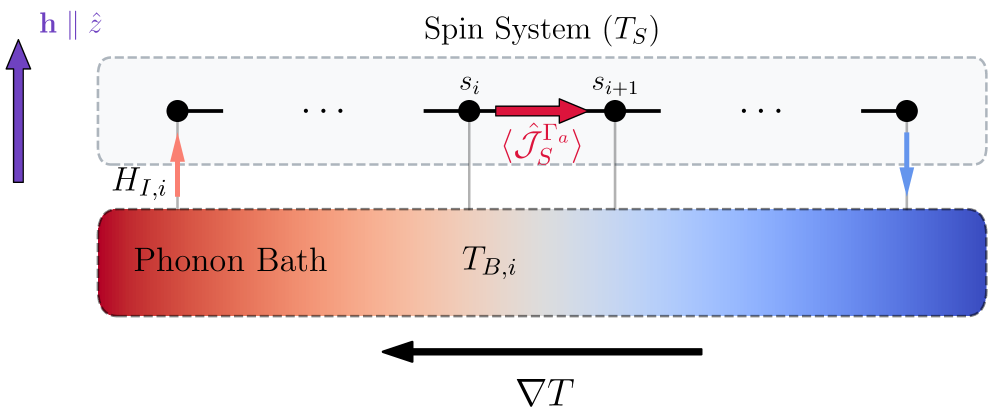
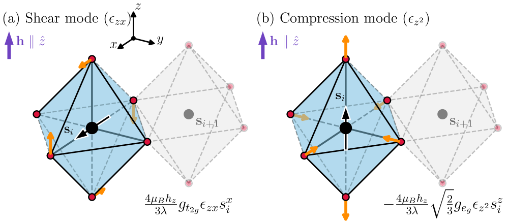
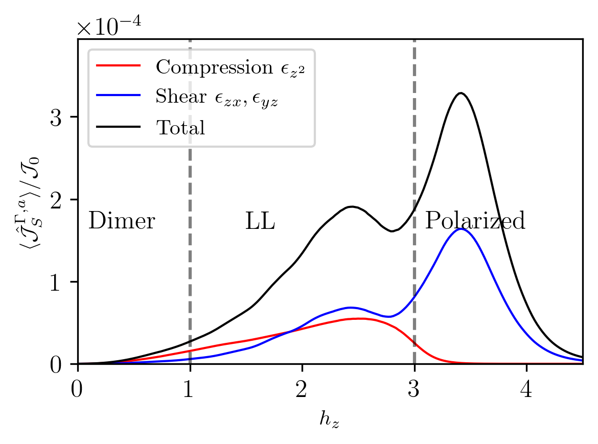
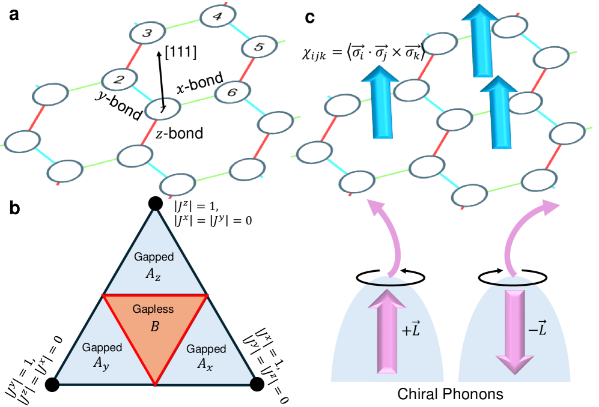
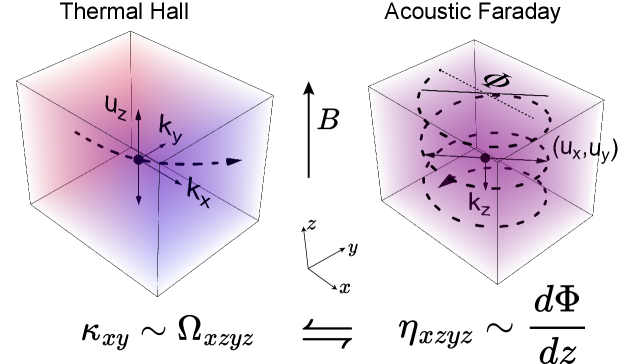
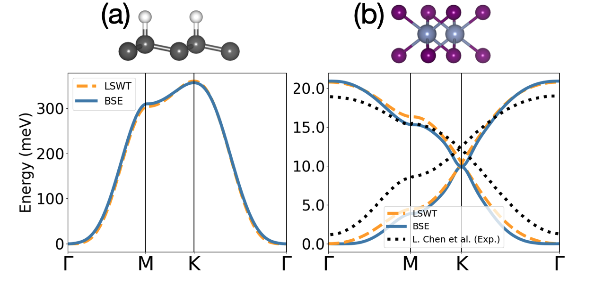
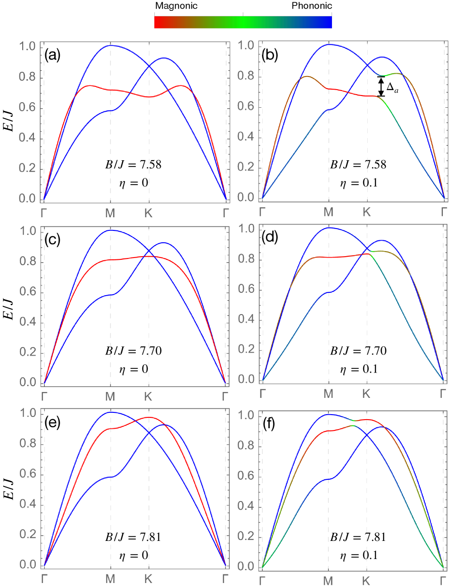

# スピン-フォノン結合のモード選択性と異常磁気熱輸送——圧縮波とせん断波が解くKitaev磁性体の謎

- **執筆日**: 2026-04-14
- **トピック**: magnon-phonon-magnetothermal
- **タグ**: Multiphysics and Coupled Phenomena / Coupled-Field Response; Thermal Transport / Transport Measurements; First-Principles Calculations
- **注目論文**: Haoting Xu, Antoine Matar, Hae-Young Kee, "Disentangling Shear and Compression Phonons: Route to Anomalous Magnetothermal Transport," arXiv:2603.18137 (2026)
- **参照関連論文数**: 6

---

## 1. なぜ今この話題なのか

磁気絶縁体の熱輸送は、一見地味に見えて実は凝縮系物理学の最前線に立っている。その理由は、スピン、フォノン、そして場合によっては分数化した準粒子という異なる自由度が競合・協調しながら熱を運ぶという本質的な複雑さにある。なかでも過去数年の注目の的となっているのが、ハニカム格子磁性体 α-RuCl₃ における一連の異常現象だ。

α-RuCl₃ は絶縁体でありながら、面内磁場をかけると反強磁性秩序が消え、奇妙な磁気状態が現れる。2019年から2021年にかけて、この領域で熱伝導率の振動的な磁場依存性と、半整数量子化に近い熱Hall係数が相次いで観測された [Czajka et al., Nat. Phys. 2021: arXiv:2102.11410]。これらは Kitaev 量子スピン液体（QSL）の証拠であり、マヨラナフェルミオンという分数化した準粒子が熱を運ぶ証拠である——という解釈が一時期メディアをにぎわせた。

しかし科学はそれほど単純には進まなかった。超高純度試料を用いた精密測定 [Xing et al., npj Quantum Mater. 2025: arXiv:2410.18342] は振動的構造の大幅な抑制を示し、「結晶積層欠陥による偽の振動ではないか」という疑問を呼び起こした。半整数量子化の主張も精査され続けている。一方でフォノン——ごく普通の格子振動——が磁場の影響を受けてスピン系と結合し、熱Hall効果や異常な熱伝導を生じさせる機構もにわかに注目を集めてきた。

2026年3月、Haoting Xu, Antoine Matar, Hae-Young Kee（トロント大学）は上記の謎に正面から向き合う理論論文 "Disentangling Shear and Compression Phonons: Route to Anomalous Magnetothermal Transport" を arXiv に投稿した [arXiv:2603.18137]。彼らのメッセージは鮮明だ。「圧縮フォノンとせん断フォノンはスピンの異なる成分に選択的に結合する」——この左右非対称な結合が磁場依存の異常熱輸送を自然に生みだす、という主張である。マヨラナ粒子などを一切仮定しなくても、群論と強いスピン軌道結合だけで実験を説明できるという点で、この論文はこれまでの議論に新たな視座をもたらしている。

スピン-フォノン結合という概念自体は古く、磁気Raman散乱や磁気弾性効果の研究で培われてきた。ところが「どの偏極のフォノンが、どのスピン成分に結合するか」という**モード選択性**（mode selectivity）を熱輸送の文脈で系統的に論じた研究は少なかった。本論文はその空白を埋めるものであり、Kitaev 磁性体を超えてより一般的なスピン軌道結合モット絶縁体への展開も視野に入れている。

---

## 2. この分野で何が未解決なのか

この分野には少なくとも三つの核心的な問いが未解決のまま残っている。

**問い①：α-RuCl₃ の異常熱輸送はどの準粒子が担っているのか？**
Kitaev 量子スピン液体モデルでは、マヨラナフェルミオンの熱Hall応答が予想される。しかしフォノンも磁場下でスピン系と結合して Berry 曲率を持ち得る。最近の実験は音波を用いてフォノンが Hall 粘性を持つことを直接示し [Shragai et al., arXiv:2510.06443]、フォノン寄与が少なくとも「半定量的には無視できない」ことが明らかになった。分数化準粒子由来の本質的な信号とフォノン寄与を分離するための実験的・理論的方法論の確立が急務である。

**問い②：スピン-フォノン結合における対称性の役割は何か？**
スピン軌道結合の強い物質では、フォノンの偏極モードとスピン演算子の間に群論的な「選択則」が生じる。この選択則が磁場強度に応じてどう変わるか、どの格子対称性がモード選択性を強化または弱化するかは体系的に理解されていない。Xu らの論文はこの問いへの最初の体系的な答えを示しているが、三次元や非コリニア磁性体への拡張はまだ研究途上だ。

**問い③：フォノン-スピン結合の「第一原理」記述はどこまで可能か？**
結合強度の予測には第一原理計算が不可欠だが、強いスピン軌道結合を持つ系での「スピン-フォノン結合の第一原理的評価」は技術的に難しく、最近ようやく本格的なアプローチが登場した [Le et al., arXiv:2502.05385; Dhakal et al., arXiv:2407.00659]。これらの計算が実験を定量的に再現するまでには、さらなる方法論の発展が必要だ。

---

## 3. 注目論文の核心

### 何を問い、何を明らかにしたか

Xu, Matar, Kee が問うたのは「スピン軌道結合の強い磁性絶縁体で、なぜ磁場に応じた熱伝導率が非単調な（ピーク-ディップ-ピーク型の）構造を示すのか」である。従来の説明は二方向に分かれていた。一方は「マヨラナフェルミオンなどの分数化励起が熱を運ぶ」という量子スピン液体シナリオ、他方は「磁気転移によりフォノン散乱が変化する」という散乱機構シナリオである。本論文はその両者とは異なる第三の道——スピン-フォノン結合そのものの「モード選択性」——を提示した。

### モデルと方法

対象とする物質の骨格は**辺共有八面体構造**（edge-sharing octahedral structure）である。α-RuCl₃ はまさにこの構造を持ち、Ru³⁺（$d^5$ 電子配置）が強いスピン軌道結合のもとで有効スピン $j=1/2$ を形成している。彼らはこの系に強いスピン軌道結合の極限で有効スピン-フォノン相互作用ハミルトニアンを対称性の議論から導出した。

核心となる結果が次の相互作用項 $H_{I,i}$ である：

$$H_{I,i} = \frac{4\mu_B h_z}{3\lambda} \left[ -\sqrt{\frac{2}{3}}\, g_{e_g} \varepsilon_{z^2} s_i^z + g_{t_{2g}} \varepsilon_{zx} s_i^x + g_{t_{2g}} \varepsilon_{yz} s_i^y \right]$$

ここで $h_z$ は外部磁場、$\lambda$ はスピン軌道結合定数、$g_{e_g}, g_{t_{2g}}$ はそれぞれ $e_g$, $t_{2g}$ 軌道の電子-フォノン結合定数、$\varepsilon_{z^2}$ は**圧縮歪みモード**（compression mode）、$\varepsilon_{zx}, \varepsilon_{yz}$ は**せん断歪みモード**（shear modes）である。

この式の意味は非常に明快だ。圧縮モード（$\varepsilon_{z^2}$）は縦方向のスピン成分 $s_i^z$ とのみ結合し、せん断モード（$\varepsilon_{zx}, \varepsilon_{yz}$）は横方向成分 $s_i^x, s_i^y$ とのみ結合する。しかも結合強度は全体として外部磁場 $h_z$ に比例する——つまり磁場で制御可能なスピン-フォノン結合である。

*図1: 計算セットアップの概念図。スピン系（上）とフォノン浴（下）が各格子点でスピン-フォノン相互作用を介して熱を交換する（出典: arXiv:2603.18137、CC BY 4.0）。*

*図2: 辺共有八面体構造におけるモード選択的スピン-フォノン結合の模式図。橙色矢印がフォノン変位を、緑色がスピン成分との結合を表す（出典: arXiv:2603.18137、CC BY 4.0）。*

### 計算手法と主要結果

熱電流の計算にはランダウアー（Landauer）形式と久保（Kubo）公式を組み合わせた手法を用いた。スピン系は1次元ダイマー化 XXZ 鎖（鎖長 $N=20$、異方性パラメータ $\varepsilon=3.0$、ダイマー化 $\delta=0.2$）で近似し、厳密対角化（exact diagonalization: ED）でスピン励起スペクトルを求めた。

計算された熱電流の磁場依存性を図3に示す。黒曲線が全熱電流、青が圧縮モード寄与、赤がせん断モード寄与である。$h < h_{c1}$（ダイマー相）では圧縮モードが支配的、$h_{c1} < h < h_{c2}$（ラッティンジャー液体相）では両モードが拮抗、$h > h_{c2}$（偏極相）ではせん断モードが $h_{c2}$ 直上でピークを示してから指数的に減衰する。この合計が**ピーク-ディップ-ピーク構造**を生み出す——これはまさに α-RuCl₃ の実験データが示すパターンと対応している。

*図3: スピン熱電流の磁場依存性。三つの磁気相（ダイマー相、ラッティンジャー液体相、偏極相）にわたるモード別寄与の違いが非単調な全熱電流を生む（出典: arXiv:2603.18137、CC BY 4.0）。*

### 新規性と限界

この論文の最大の新規性は、スピン-フォノン結合の**対称性に基づいたモード選択的な機構**を熱輸送の文脈で明示した点である。実験の「振動的」構造を説明するために分数化準粒子を持ち出す必要はなく、標準的なスピン物理学とフォノン物理学の組み合わせで十分だ、と主張している。

ただし、モデルは1次元系であり、α-RuCl₃ の二次元ハニカム構造やそれに伴う複雑な磁気相図を直接扱っているわけではない。また結合強度のパラメータ（$g_{e_g}, g_{t_{2g}}$）は理論的に導出されるが、α-RuCl₃ の具体的な数値との定量的な比較は今後の課題である。加えて、フォノン系の Berry 曲率（トポロジカルな効果）による**横方向**熱輸送（熱 Hall 効果）への寄与は本論文の主眼ではなく、別途検討が必要である。

---

## 4. 背景と研究史

### α-RuCl₃ を中心とした問題の歴史

α-RuCl₃ は Kitaev 量子スピン液体の候補材料として理論的に注目を浴びた後、実験的な探索が急速に進んだ。2019年頃から熱伝導率や熱 Hall 効果の精密測定が行われ、特に Czajka ら [arXiv:2102.11410] は磁場下の熱伝導率が大きな振動的構造を示すことを発見した。この振動パターンが「金属中のド・ハース-ファン・アルフェン効果に類似している」と指摘されたことが、スピノンの Fermi 面仮説の一つの根拠となった。

一方 Bruin ら [2205.15839] は複数の試料成長法で測定を比較し、振動構造が磁気転移に対応した逐次的変化（quantum oscillation ではなく field-induced phase transitions）であることを示した。さらに超高純度単結晶での研究 [Xing et al. 2025: arXiv:2410.18342] は、振動的構造の振幅が試料の完全性に強く依存し、超清浄試料では著しく抑制されることを実証した——積層欠陥が振動を誘起していたという結論だ。

これらの実験的な精査と並行して、理論側でも「フォノンを主役にした説明」が台頭してきた。その流れに本論文は一つの完結した理論的枠組みを提供した、と位置づけられる。

### フォノン Berry 曲率と熱 Hall 効果

スピン-フォノン結合の別の重要な帰結は、フォノンが Berry 曲率を獲得し、横方向の熱流——**熱 Hall 効果**——を生じさせる点である。この機構はスカラースピンカイラリティ（scalar spin chirality, SSC）によるフォノンのスキュー散乱として Oh & Nagaosa [arXiv:2501.11272] が定式化した。Kitaev モデルにおけるスピンの三角形ループが有限のカイラリティ $\langle \boldsymbol{S}_i \cdot (\boldsymbol{S}_j \times \boldsymbol{S}_k) \rangle \neq 0$ を持ち、これがキラルフォノンを非対称に散乱して非零の熱 Hall 伝導率を生む。

*図4: Kitaev モデルにおけるフォノンスキュー散乱機構（出典: arXiv:2501.11272、CC BY 4.0）。*

Shragai ら [arXiv:2510.06443] は音波実験でさらに踏み込み、α-RuCl₃ のフォノンが**Hall 粘性**（phonon Hall viscosity）——フォノンの偏極を回転させる非散逸的な粘性——を持つことを超音波測定で直接実証した。これはフォノンが Berry 曲率を持つ直接的な実験証拠であり、熱 Hall 効果の「相当部分」を説明できるという。

*図5: 音響ファラデー効果と熱 Hall 効果の対応。フォノン偏極の回転が直接測定可能な実験量として熱 Hall 電流と対応する（出典: arXiv:2510.06443、CC BY 4.0）。*

### ハニカム反強磁性体 NiPS₃ での実験

α-RuCl₃ だけでなく、同じハニカム格子をもつ van der Waals 反強磁性体 NiPS₃ でも類似の現象が観測されている。Meng ら [arXiv:2403.13306] は低温・高磁場での精密熱輸送測定により、NiPS₃ の熱 Hall 導電率が磁化の方向依存性と強く相関する一方、フォノン平均自由行程とは相関しないことを示した。5種類の試料で縦方向熱伝導は同一なのに横方向熱伝導が10倍異なる——これは熱 Hall 効果の「散逸に依存しない熱力学的起源」を示唆する。磁子（マグノン）と音響フォノンのバンドが逆格子の M 点付近で 3.7 meV に交差することが確認されており、この hybridization 点でフォノンが磁気的 Berry 曲率を取り込んでいると解釈されている。

### 他の物質系でのスピン-フォノン結合証拠

フラストレートした二重ペロブスカイト Sr₂CuTeO₆ などでも Raman 分光により磁気転移点でのフォノン異常と 2-マグノン散乱ピークが観測され、スピン-フォノン結合の直接的証拠とされている [Badola et al., arXiv:2401.04624]。こうした「ごく普通の絶縁体磁性体」における証拠の蓄積が、本トピックを α-RuCl₃ 固有の議論から脱して一般的な物質設計原理へと押し上げつつある。

---

## 5. どの解釈が最も妥当か

### 三つの立場を整理する

現在の熱輸送異常の解釈は大きく三つの立場に分かれている。

**立場A（分数化準粒子説）**：Kitaev 量子スピン液体相においてマヨラナフェルミオンが熱を運ぶ。半整数量子化熱 Hall が証拠。しかし超清浄試料での再現性問題や、分数化を支持する独立した証拠（例：非弾性中性子散乱での quasiparticle 連続体）の解釈も依然議論中である。

**立場B（フォノンスキュー散乱説）**：SSC によるフォノンスキュー散乱が熱 Hall 効果を担う [Oh & Nagaosa, 2501.11272]。スピン液体相でなくとも有限温度で SSC が発達すれば機能し、実験との半定量的一致が報告されている。ただし低温の量子化領域での説明は別途必要である。

**立場C（モード選択的スピン-フォノン結合説）**：本注目論文 [Xu et al., 2603.18137] の立場。縦熱伝導の非単調磁場依存性は圧縮-せん断フォノンのモード選択的結合で自然に説明される。外場をかけるだけで磁場誘起スピン転移が起き、各フォノンモードの寄与が変化して全体的な非単調構造が生まれる。

### 証拠の整合性と不整合

三者は実は相互排他的ではない可能性が高い。低温での量子化熱 Hall は依然として立場A（あるいはそれに近い）が有力であるが、有限温度・中程度の磁場域での異常には立場B と C が無視できない寄与をもたらしていると考えるほうが自然である。Shragai ら [2510.06443] の音響ファラデー実験は「フォノン Berry 曲率が熱 Hall のかなりの部分を説明する」としており、立場B・Cを支持する実験的証拠と言えよう。

一方、Xu ら の論文が扱うのは主に縦方向の熱電流の磁場依存性（熱伝導率の非単調性）であり、熱 Hall 効果（横方向）はスコープ外である。したがって、本論文が直接解釈する現象（縦熱伝導の振動的構造）と、熱 Hall 効果の量子化に関する議論は一定程度独立した問いとして扱う必要がある。

### 何が比較的確かで、何が不確かか

比較的強く支持される点は：
- フォノンが磁場下でスピン軌道結合材料において Berry 曲率を獲得する事実（Shragai ら実験、Oh & Nagaosa 理論）
- 群論的な選択則（圧縮→縦スピン、せん断→横スピン）が辺共有八面体系で普遍的に成立すること（Xu ら理論の中心的主張）
- NiPS₃ での熱 Hall が散乱平均自由行程に依存せず熱力学量と相関すること（Meng ら）

まだ弱い結論、あるいは未解決な点：
- 量子化熱 Hall 効果が本当にマヨラナ起源かフォノン起源かの定量的分離
- α-RuCl₃ の具体的なパラメータを用いた Xu らモデルの定量計算
- Xu らの1次元モデルが α-RuCl₃ の2次元構造にどこまで外挿できるか

---

## 6. 何が一般化できるのか

### 他の物質系への展開

Xu ら が示したモード選択的スピン-フォノン結合の機構は、辺共有八面体構造 + 強いスピン軌道結合という条件さえ満たせば幅広い物質に適用できる。この条件を満たす物質として：

- **Kitaev 系**：α-RuCl₃、Na₂IrO₃、Li₂IrO₃（強いスピン軌道結合の $d^5$ 系）
- **コバルト酸化物**：CoO、BaCo₂(AsO₄)₂（$d^7$ 系は同じ J=1/2 有効スピン）  
- **van der Waals 反強磁性体**：NiPS₃（$d^8$）、FePS₃（$d^6$）、CoPS₃

NiPS₃ でのフォノン熱 Hall [Meng ら 2403.13306] はすでに本機構の有力な類例と見なせる。2D van der Waals 磁性体での「スピン-フォノン結合が熱 Hall を駆動する」という流れは今後さらに拡大するだろう。

### スピン-フォノン結合の第一原理的設計

Le ら [arXiv:2502.05385] が開発した第一原理マグノン-フォノン結合計算（AB 法：ab initio Bethe-Salpeter 方程式に基づく手法）は、モード選択性の理論予測を実物質で定量的に検証する道を開く。同グループは2D強磁性体 CrI₃ や水素化グラフェンに適用し、「電子-フォノン結合が弱いモードでもマグノン-フォノン結合は強いことがある」という直感に反する結果を示した。

*図6: 第一原理によるマグノン-フォノン結合強度の計算（出典: arXiv:2502.05385、CC BY 4.0）。*

### フォノンをスピン状態のプローブとして使う

Tang ら [arXiv:2602.22283] は「フォノンをスピン-ネマティック秩序の検出器として使う」という発想で理論を展開した。スピンの四極子モーメントが秩序化する「スピンネマティック相」は、磁化測定などの通常の手法では見えにくい「隠れた秩序」である。しかしスピン-格子結合を通じてフォノンスペクトルに特徴的な変化（ソフトニングや新たなピーク）が現れるため、ラマン散乱や非弾性X線散乱で検出できるという。

*図7: フォノン分散を通じたスピンネマティック秩序の検出原理（出典: arXiv:2602.22283、CC BY-NC-ND 4.0）。*

この視点はモード選択的スピン-フォノン結合と直結する。圧縮/せん断フォノンがどのスピン秩序と結合するかを制御できれば、フォノン分光がスピン状態のモード別センサーになりうる。

### デバイス応用への示唆

熱 Hall 効果は「横方向熱流」の制御を意味し、熱整流やスピンカロリトロニクスデバイスへの応用が期待される。磁場でスピン-フォノン結合の大きさ・種類を調整できるなら、外部磁場を「ノブ」として横方向熱電流を制御するデバイスが原理的に可能だ。ただし室温動作に必要な強い結合を実現する物質探索は今後の課題である。

---

## 7. 基礎から理解する

### スピン波（マグノン）とフォノンの基礎

**フォノン**とは結晶格子の集団振動の量子化準粒子である。結晶を質点とバネのネットワークと見なすと、波数 $\mathbf{k}$ の振動モードが古典的に分析できる。量子力学的には各モードは調和振動子として扱われ、$n$ 個のフォノンが励起された状態は $n+1/2$ 本の量子を持つ。フォノンは電気を通さない絶縁体の主要な熱担体であり、熱伝導率 $\kappa = C v_s \ell / 3$（$C$：比熱、$v_s$：音速、$\ell$：平均自由行程）という简単な式でその大きさが理解できる。

**マグノン**は磁気秩序の集団的スピン波の量子化準粒子である。磁気絶縁体でスピンが一方向に揃った基底状態から、隣接スピンが少しずつ傾いて波として伝播する励起がスピン波であり、その量子がマグノンだ。エネルギーと波数の関係（分散関係）は交換相互作用の大きさで決まり、磁場をかけるとゼーマンギャップ $\Delta = g\mu_B H$ が開く。

### スピン-フォノン結合とは何か

スピン軌道結合（spin-orbit coupling, SOC）は電子のスピン自由度と軌道自由度を結びつける相互作用で、強度は原子番号の4乗に比例するため重い元素（Ru, Ir など）では特に重要になる。SOC がある系では、格子が変形すると軌道状態が変わり、それを通じてスピン状態も変化する。この**格子変形によるスピン有効ハミルトニアンの変化**がスピン-フォノン結合の起源だ。

数式的には、スピン-フォノン結合ハミルトニアン $H_{\text{sp-ph}}$ は

$$H_{\text{sp-ph}} = \sum_{i, \Gamma_a} V_i^{\Gamma_a} \hat{Q}_i^{\Gamma_a}$$

と書ける。ここで $\hat{Q}_i^{\Gamma_a}$ は格子変形の Normal coordinate（フォノン座標）、$V_i^{\Gamma_a}$ はスピン演算子の函数（結合テンソル）である。群論から $V_i^{\Gamma_a}$ に課される「選択則」——「どの $\Gamma_a$ 対称性の歪みが、どのスピン成分に結合できるか」——が Xu ら の論文の核心にある。辺共有八面体では $\Gamma_{A_{1g}}$ 対称の圧縮モードが $\Gamma_1$ 対称の $s^z$ と、$\Gamma_{E_g}$ 対称のせん断モードが $s^x, s^y$ と結合する、というのがその帰結である。

### Landauer 公式による熱輸送

Xu ら が用いた Landauer 形式は、「左の熱浴から送り込まれたフォノンが、スピン系に一部エネルギーを与えながら右の浴に抜けていく」という概念的に分かりやすい枠組みだ。スピン系は「フォノンを吸収・放出するチャンネル」として機能し、スピン系のスペクトル関数 $S_\mu(\omega)$ とフォノン密度 $J(\omega)$ の積分の重なりが熱電流を決める：

$$J_{\text{heat}} \propto \int d\omega\, (\hbar\omega)^2\, J(\omega)\, S_\mu(\omega)\, n(\omega)$$

ここで $n(\omega) = [e^{\hbar\omega/k_B T}-1]^{-1}$ はボーズ-アインシュタイン分布。磁場を変えると $S_\mu(\omega)$（$\mu = z$：圧縮モード用、$\mu = x,y$：せん断モード用）が変化し、それが熱電流の磁場依存性を生む。

### なぜ「ピーク-ディップ-ピーク」が現れるのか

直感的に理解するため、3つの磁気相に分けて考えよう。

**ダイマー相（低磁場）** では基底状態が近接スピン対のシングレット（$\uparrow\downarrow - \downarrow\uparrow$）で埋まっている。このシングレットを壊すには縦方向の励起（$s^z$ の期待値を変える）が最も効率的。したがって圧縮フォノン（$s^z$ に結合）がよく熱を運ぶ。磁場を上げるとシングレット-トリプレット ギャップが縮まり、熱電流が増大（**第一ピーク**）。

**ラッティンジャー液体相（中間磁場）** では磁気励起が gapless になり、縦・横ともにスピン揺らぎが有限になる。圧縮・せん断の両方が寄与するが、競合して全体が平坦になる（**ディップ**）。

**偏極相（高磁場）** では全スピンが磁場方向を向くので $s^z$ はほぼ固有値で揺らがず、圧縮モードのスペクトル重みはほぼゼロ。一方、せん断モードは横方向スピンフリップを励起でき、磁場ギャップ（$\sim g\mu_B H$）が開く直上でスペクトル重みが集中。これが**第二ピーク**を生む。さらに磁場が上がるとギャップが開きすぎてフォノンとの共鳴が外れ、熱電流は指数的に減少する。

---

## 8. 専門用語の解説

**スピン軌道結合（spin-orbit coupling, SOC）**
電子の軌道運動による有効磁場と電子スピンの相互作用。強度は原子番号 $Z$ の4乗に比例し、Ru、Ir、Os などの第2・第3遷移金属では特に重要。SOC が強い系では有効スピン $j = 1/2$（Kramers 二重項）が形成され、軌道・スピン混合した新しい自由度が磁性を担う。

**Kitaev 量子スピン液体（Kitaev QSL）**
ハニカム格子上で Kitaev 相互作用（各結合方向ごとに異なるスピン成分を結合するイジング型交換）が支配的な系に現れると理論予測されるトポロジカルな磁気状態。基底状態に長距離秩序がなく、励起がマヨラナフェルミオンとフラックスという分数化した準粒子からなる。α-RuCl₃ がその候補物質。

**マグノン-フォノン混成（magnon-phonon hybridization）**
マグノンとフォノンのエネルギーが同程度の波数で交差すると、スピン-フォノン結合によりバンドが反交差して混成状態（マグノンポラロン）が形成される現象。熱伝導や熱 Hall 効果、スピン Seebeck 効果などに直接影響を与える。

**フォノン Berry 曲率と熱 Hall 効果**
量子力学の Berry 位相は波数空間において「局所的な曲率」として現れる。フォノンが磁気的な環境でスピン系と結合すると Berry 曲率を獲得し、フォノンが磁場に直交する方向に偏向されて横方向熱流（熱 Hall 電流）が生じる。この効果は電子の異常 Hall 効果のフォノン版と理解できる。

**スカラースピンカイラリティ（scalar spin chirality, SSC）**
3スピンが作る三角形ループのスピンベクトルの三重積 $\boldsymbol{S}_i \cdot (\boldsymbol{S}_j \times \boldsymbol{S}_k)$ で定義される擬スカラー量。これが有限だとフォノンがスキュー散乱（非対称散乱）を受け、熱 Hall 効果を生む。Oh & Nagaosa の機構の核心。

**モード選択的スピン-フォノン結合（mode-selective spin-phonon coupling）**
フォノンの偏極（振動方向）によって結合するスピン成分が異なる現象。対称性（群論）から決まり、辺共有八面体では圧縮 → $s^z$、せん断 → $s^x, s^y$ の選択則が生じる。この非対称性が磁場依存の熱輸送の非単調構造を生む Xu らの中心概念。

**辺共有八面体構造（edge-sharing octahedra）**
遷移金属を囲む酸素八面体が辺を共有して連結した構造。α-RuCl₃ や多くの Kitaev 候補物質に見られ、隣接金属イオン間の Kitaev 型相互作用が大きくなりやすい。この幾何学がスピン-フォノン結合の具体的な形（モード選択則）を決定する。

**Hall 粘性（Hall viscosity）**
非散逸的な（エントロピーを増加させない）粘性で、フォノン偏極を回転させる効果をもたらす。Berry 曲率に由来するトポロジカルな輸送係数の一つ。Shragai らが α-RuCl₃ で超音波測定（音響ファラデー効果）によって実証した。

**ラッティンジャー液体（Luttinger liquid）**
1次元強相関系で通常のフェルミ液体論が破れた場合に現れる相。励起が個々のスピンや電荷のモードに分離（スピン-電荷分離）し、冪乗則的な相関を示す。Xu らのモデルでは中間磁場相がラッティンジャー液体状態に対応し、縦・横スピン揺らぎが共存する。

**van der Waals 磁性体**
弱いファンデルワールス力で積層された層状磁性体（NiPS₃、CrI₃、Fe₃GeTe₂ など）。層間を剥離して単層から原子層レベルで磁性を研究できる。スピン-フォノン結合研究では、層間の複雑さを排除した2D系として基礎的な検証場として活躍。

---

## 9. 今後の展望

今回の一連の研究を踏まえると、「フォノンが磁場下のスピン軌道結合系で能動的な役割を果たす」という事実はほぼ確実性が高い。Shragai ら [2510.06443] の実験はフォノン Berry 曲率の直接測定として画期的であり、「熱 Hall 効果の主役はフォノンかマヨラナか」という問いに対して「フォノンがかなりの部分を担う」という方向に証拠が傾きつつある。一方でモード選択的スピン-フォノン結合 [Xu ら 2603.18137] は縦熱伝導の非単調磁場依存性の「スピン液体を仮定しない」説明を提供し、理論的な枠組みとして今後の実験解釈に広く使われると予想される。また第一原理計算 [Le ら 2502.05385] は具体的な物質のスピン-フォノン結合定数を非経験的に求める方法論を与えており、Xu ら の理論パラメータを α-RuCl₃ で具体的に決定する試みが近い将来進むだろう。

未解決な論点としては、まず「熱 Hall 効果の量子化」の解釈問題がある——低温極限での半整数量子化の精度と起源についての議論はまだ収束していない。モード選択的機構は縦熱伝導を美しく説明するが、Hall 成分の「量子化」を説明するには追加のトポロジカル的要素が必要かもしれない。また2D van der Waals 磁性体においても類似の実験が加速しており、NiPS₃ [Meng ら]、CoPS₃（新興候補）、さらには磁場調整可能な moiré 系への展開が1〜3年内の重要な論点となろう。さらに Tang ら [2602.22283] のアイデア——フォノンをスピン多極子秩序のプローブとして活用する——は、実験的には Raman 分光・非弾性 X 線散乱などで「スピン-フォノン結合が大きい物質の系統探索」として進展が見込まれ、マテリアルズ・インフォマティクスと連携した物質スクリーニングとの相乗効果にも期待がかかる。

---

## 参考論文一覧

1. **[arXiv:2603.18137]** Haoting Xu, Antoine Matar, Hae-Young Kee, "Disentangling Shear and Compression Phonons: Route to Anomalous Magnetothermal Transport" (2026). — 本記事の注目論文。辺共有八面体系でのモード選択的スピン-フォノン結合を理論的に導出し、異常磁気熱輸送の非単調磁場依存性を説明する。  
   https://arxiv.org/abs/2603.18137

2. **[arXiv:2102.11410]** P. Czajka et al., "Oscillations of the thermal conductivity observed in the spin-liquid state of α-RuCl₃," Nature Physics 17, 915 (2021). — α-RuCl₃ の面内磁場下で振動的な熱伝導率を発見した実験的先駆論文。スピノン Fermi 面仮説の根拠の一つ。  
   https://arxiv.org/abs/2102.11410

3. **[arXiv:2501.11272]** Taekoo Oh, Naoto Nagaosa, "Spin-phonon coupling and thermal Hall effect in the Kitaev model," Phys. Rev. B 112, L081104 (2025). — Kitaev モデルでのスカラースピンカイラリティによるフォノンスキュー散乱機構を提案し、有限温度の熱 Hall 効果を説明する理論論文。  
   https://arxiv.org/abs/2501.11272

4. **[arXiv:2510.06443]** Avi Shragai et al., "Phonon Hall Viscosity and the Intrinsic Thermal Hall Effect of α-RuCl₃" (2025). — 超音波実験（音響ファラデー効果）でフォノン Hall 粘性を直接測定し、フォノン Berry 曲率が α-RuCl₃ の熱 Hall 効果の相当部分を担うことを示す実験論文。  
   https://arxiv.org/abs/2510.06443

5. **[arXiv:2403.13306]** Qingkai Meng et al., "Thermodynamic origin of the phonon Hall effect in a honeycomb antiferromagnet," (2024). — van der Waals 反強磁性体 NiPS₃ での熱 Hall 効果がフォノン散乱ではなく熱力学的（Berry 曲率）起源をもつことを5試料の比較実験で示す。  
   https://arxiv.org/abs/2403.13306

6. **[arXiv:2502.05385]** Khoa B. Le et al., "Magnon-phonon interactions from first principles," (2025). — ab initio Bethe-Salpeter 方程式によるマグノン-フォノン結合の第一原理計算枠組みを構築し、CrI₃ などの2D強磁性体に適用してモード依存の結合強度を明らかにする。  
   https://arxiv.org/abs/2502.05385

7. **[arXiv:2602.22283]** Junyu Tang, Hong-hao Song, Gang v. Chen, "Phononic enhancement and detection of hidden spin-nematicity and dynamics in quantum magnets," (2026). — スピン-格子結合によりフォノン分散がスピン四極子（ネマティック）秩序のシグネチャーとして機能することを理論的に示し、ラマン分光・非弾性散乱での検出を提案する。  
   https://arxiv.org/abs/2602.22283

8. **[arXiv:2401.04624]** Shalini Badola et al., "Signatures of novel magnon-phonon coupling in frustrated double perovskite square lattices," (2024). — フラストレートしたダブルペロブスカイト Sr₂CuTeO₆ など3物質の Raman 分光でスピン-フォノン結合の直接的証拠（磁気転移点でのフォノン異常）を示す実験論文。  
   https://arxiv.org/abs/2401.04624
