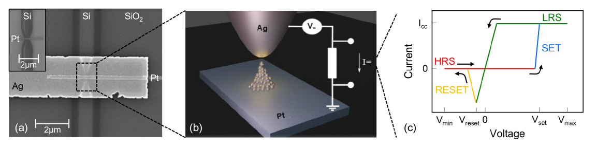
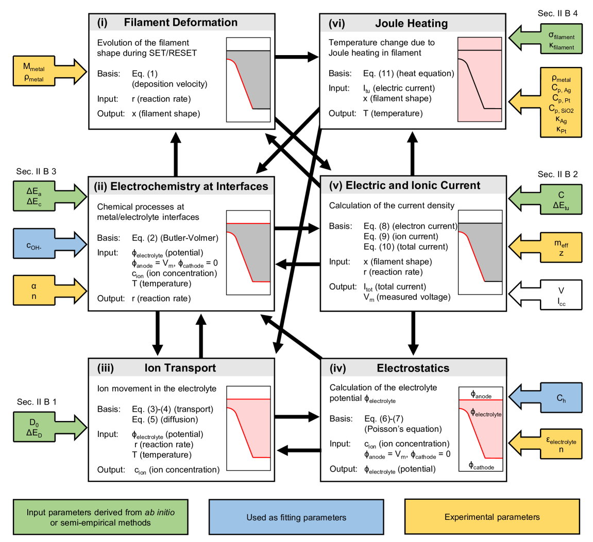
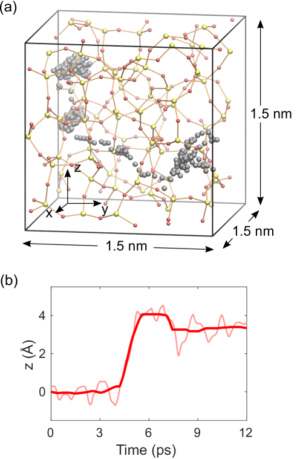
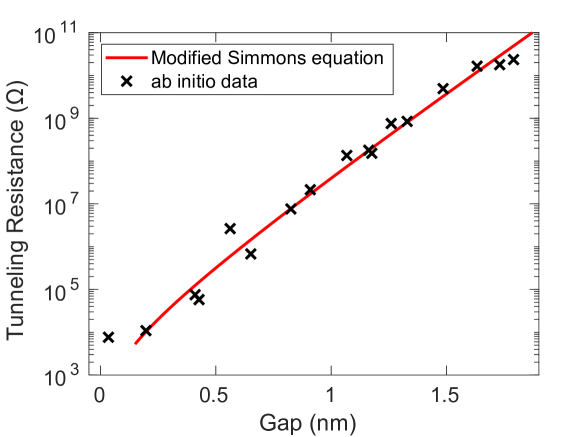
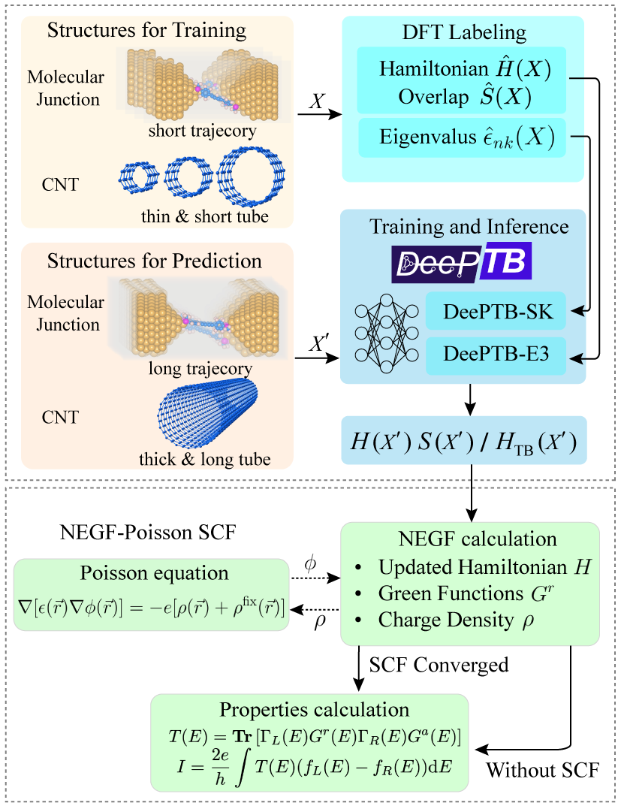
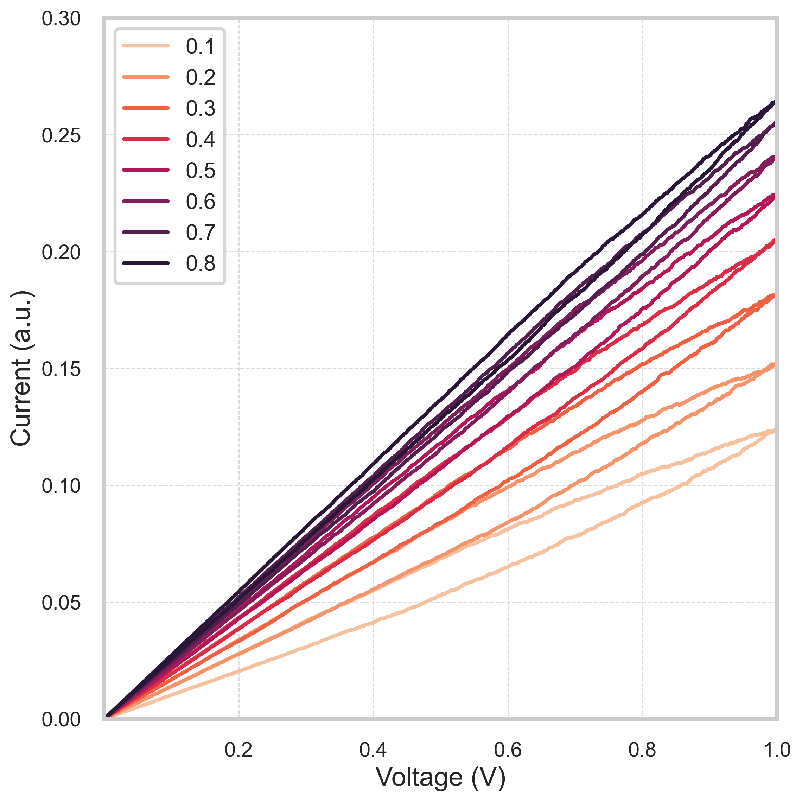

# 第一原理からデバイスへ：伝導性フィラメント型メモリのマルチスケールシミュレーション

- **執筆日**: 2026-04-13
- **トピック**: CBRAM（伝導性架橋型抵抗変化メモリ）のマルチスケール計算による設計・解析
- **タグ**: Computation and Theory / Devices and Functional Materials / Thin Films and Interfaces / Multiscale Computation; Surrogate Modeling; First-Principles Calculations
- **注目論文**: Jan Aeschlimann et al., "Multiscale Modeling of Metal/Oxide/Metal Conductive Bridging Random Access Memory Cells: from Ab Initio to Finite Element Calculations," arXiv:2602.10034 (2026)
- **参照関連論文数**: 6本

---

## 1. なぜ今この話題なのか

コンピュータアーキテクチャの世界では長年「メモリウォール問題」が議論されてきた。プロセッサの演算性能はムーアの法則に沿って急成長したのに対し、メモリの読み書き速度は著しく遅れをとってきた。この格差はAI・機械学習の台頭によりいっそう深刻になっている。大規模言語モデルや深層ニューラルネットワークの推論処理では、重み行列とベクトルの積演算（ベクトル行列乗算）が計算の大半を占めるが、現代のCPU/GPUではメモリとプロセッサ間の帯域幅が律速となりエネルギー効率が著しく損なわれる。

この問題を根本から解決しうる候補の一つが、**メモリスタ**（Memristor）、とりわけ**CBRAM**（Conductive Bridging Random Access Memory、伝導性架橋型抵抗変化メモリ）と呼ばれる不揮発性メモリデバイスである。CBRAMは金属フィラメントの可逆的形成・溶解によって抵抗状態を切り替えるデバイスであり、従来のDRAMやフラッシュメモリには存在しない「ニューロモルフィックコンピューティング」との親和性を持つ。一素子が複数の抵抗値（アナログ状態）を記憶でき、それ自体が重みの演算を担うインメモリコンピューティングが実現できるのだ。

デバイスの動作原理は比較的単純に見えるが、原子スケールの物理（金属イオンの拡散・電気化学反応・量子トンネル電流）とマクロスケールの動作特性（電流‐電圧特性、熱分布）が密接に絡み合っている。これまでの計算モデルは多くの場合、現象論的なパラメータに依存する有限要素法（FEM）や、原子分解能は高いが時間・空間スケールが限られる第一原理計算のいずれかに片寄っていた。原子スケールの知見を損なわずにデバイス全体を予測する統合的マルチスケール計算フレームワークの確立が、CBRAM研究における大きな未解決課題であった。

ETH Zürichのグループが2026年2月に公開したarXiv:2602.10034は、この課題に正面から挑んだ論文である。第一原理計算・量子輸送シミュレーション・分子動力学から抽出したパラメータを、6つの物理モジュールからなるFEMに橋渡しする枠組みを構築し、Ag/a-SiO₂/Pt系のCBRAMセルで実験的なI-V特性を再現することに成功した。この論文が提起する問いと解答を軸に、近年のメモリデバイスシミュレーション研究の到達点と課題を俯瞰する。

## 2. この分野で何が未解決なのか

CBRAM研究においては、以下の三つの核心的問いが未解決あるいは不十分にしか答えられていない。

**問い①　「金属フィラメントはどのように形成・溶解するのか」**

CBRAMのスイッチング動作を支配する金属フィラメントの形成プロセスは、酸化アノードでの金属溶解（酸化）、固体電解質中でのイオン輸送（拡散＋電場ドリフト）、カソード近傍での金属析出（還元）という一連の電気化学反応からなる。しかしフィラメントの直径は通常数nm以下であり、TEM（透過型電子顕微鏡）によるin-situ観察は技術的に難しく、原子分解能での動的挙動は依然として多くが計算に依存している。どのような界面でどのような活性化障壁を持つ反応が律速段階なのか、明確なコンセンサスはまだない。

**問い②　「ナノスケールの自己発熱はどこから無視できなくなるのか」**

フィラメント内に電流が集中する際には局所的なジュール発熱（自己発熱）が生じる。マクロスケールのデバイスモデルでは通常この効果は無視されるが、フィラメント直径が数nmの極限では状況が変わる可能性がある。自己発熱が有意になる臨界的な条件（直径、電流量、材料系）を定量的に明らかにした研究はこれまで限られていた。

**問い③　「物質・デバイス未知の系を経験的フィッティングなしに予測できるか」**

従来の多くの有限要素モデルはイオン拡散係数、反応障壁、トンネル電流パラメータなどを実験フィッティングから決定していた。パラメータが10個以上になることも珍しくなく、そのモデルを別の材料系や未試作デバイスへ転用する際には新たな実験データを必要とした。第一原理計算からパラメータをボトムアップに与え、経験的フィッティングの依存を断ち切ることができるか——これが本注目論文が正面から向き合った問いである。

## 3. 注目論文の核心

### CBRAMとは何か

まず対象デバイスを整理しよう。CBRAMは**電気化学的金属化メモリ**（Electrochemical Metallization Memory, ECM）とも呼ばれ、酸化可能な活性電極（多くの場合Ag, Cu）、固体電解質（a-SiO₂, a-Al₂O₃など）、不活性電極（Pt）の三層構造からなる（図1）。正のバイアスを活性電極に印加すると電気化学的酸化反応で金属イオン（Ag⁺）が生成し、電解質中を移動して陰極側で析出することでナノスケールの金属フィラメントが形成される（SETプロセス）。このとき抵抗は高抵抗状態（HRS）から低抵抗状態（LRS）へ急激に変化する。逆バイアスを印加するとフィラメントが溶解し（RESETプロセス）、抵抗は再びHRSに戻る。このスイッチング動作は再現可能で不揮発性という特徴を持ち、~0.1 pJ/bitという低エネルギー消費、10⁵以上の抵抗比、50×50 nm²以下での高集積化が報告されている。

*図1: Ag/a-SiO₂/Pt CBRAM素子の構造。(a) 作製された素子のSEM像（下部にSiウェーバガイドがある）、(b) アクティブスイッチング領域の模式図（フィラメント形成メカニズムを含む）、(c) 典型的な電流−電圧ヒステリシス特性（SETとRESET転移が明確）。図は arXiv:2602.10034 (CC BY 4.0) より引用。*

### 6モジュールFEM：マルチスケールの全体像

Aeschlimannらの核心的貢献は、CBRAMの動作を記述する有限要素モデルを6つの物理モジュールに分解し、それぞれのパラメータを独立した第一原理計算から直接抽出した点にある（図3）。

*図3: 6つの連成FEMモジュールの構成と依存関係。各モジュールに対して、パラメータの導出方法（色分け）、出力変数、モジュール間のデータフローが示されている。図は arXiv:2602.10034 (CC BY 4.0) より引用。*

6つのモジュールとその役割を整理すると以下の通りである。

**モジュール(i)　変形（フィラメント形状の追跡）**: フィラメントの成長・溶解に伴う移動境界問題をラプラス平滑化を使った動的メッシュアルゴリズムで追跡する。境界の法線方向速度は $v_\mathrm{dep} = -(M_\mathrm{metal}/\rho_\mathrm{metal})\, r$ で与えられる（$r$は界面での正味反応速度、$M$は原子量、$\rho$は密度）。

**モジュール(ii)　電気化学反応**: 金属の溶解・析出反応をButler-Volmer方程式で記述する。反応速度は活性化障壁$\Delta E_a$（酸化）および$\Delta E_c$（還元）に指数的に依存する。これらの障壁はモジュールの中で最も実験的に不確定なパラメータであり、本論文ではNEB（Nudged Elastic Band）法によって第一原理的に決定される。

**モジュール(iii)　イオン輸送**: 固体電解質中のAg⁺イオンの輸送を漂流-拡散方程式で記述する。拡散係数は $D = D_0 \exp(-\Delta E_D / k_B T)$ のアレニウス則に従い、活性化エネルギー$\Delta E_D$と前指数因子$D_0$はAIMD（ab initio分子動力学）から抽出される。

**モジュール(iv)　静電場**: 固体電解質内の電位分布をポアソン方程式で求める。金属/酸化物界面での電気二重層容量もアカウントされる。

**モジュール(v)　電流計算**: 電子電流はModified Simmons式（改良シモンズ式）で記述されるFN（Fowler-Nordheim）トンネル電流として評価され、イオン電流は界面反応速度から直接計算される。トンネル電流パラメータ（バリア高さ$\Delta E_{tu}$とフィッティング係数$C$）は非平衡グリーン関数（NEGF）を用いた量子輸送計算から取得される。

**モジュール(vi)　ジュール発熱**: フィラメントおよびその周囲の温度分布を熱方程式で求める。電気伝導率と熱伝導率は、ナノスケール効果（界面散乱等）を反映したサイズ依存の値を用いる。

以上の6モジュールは相互に結合して自己無撞着に解かれる。重要なのは、各モジュールのパラメータがすべて第一原理計算によって独立に決定されているという点だ。実験フィッティングに頼るのは最後の精密調整（誤差範囲内での微調整）のみである。

### AIMDによるイオン拡散パラメータの抽出

固体電解質中のAg⁺イオン拡散係数の第一原理的決定はCBRAMモデリングの要の一つである。Aeschlimannらは非晶質SiO₂（a-SiO₂）のサンプルを11個作成し、6つの温度（700〜1500 K）でそれぞれ約40 psのAIMD軌跡を計算した。各軌跡からイオンの平均二乗変位を追うことでアインシュタイン式を通じて拡散係数$D(T)$を得て、アレニウスプロットのフィッティングから活性化エネルギーと前指数因子を統計的に抽出した（図4, 6）。

$$D = D_0 \exp\!\left(-\frac{\Delta E_D}{k_B T}\right)$$

得られた値は$\Delta E_D = 0.196 \pm 0.013$ eV、$D_0 = 2.962 \times 10^{-5} \pm 2.907 \times 10^{-6}$ cm²/sであった。NEB法による独立検証（25サンプル平均 $\Delta E_D = 0.234 \pm 0.122$ eV）とよく整合する。このような小さな活性化エネルギーは、Ag⁺イオンが室温付近でも比較的容易にa-SiO₂中を移動できることを示唆している（比較として、Si自己拡散の障壁は〜4.5 eVで桁違いに大きい）。

*図4: a-SiO₂中のAg⁺イオンのAIMD軌跡（1200 K, 39 ps）。左: 生の軌跡、右: 平滑化後の軌跡。拡散係数の統計解析に使われる。図は arXiv:2602.10034 (CC BY 4.0) より引用。*

### NEBによる界面反応障壁の決定

金属/酸化物界面でのAg原子の酸化（Ag → Ag⁺ + e⁻）および還元（Ag⁺ + e⁻ → Ag）の活性化障壁はButler-Volmer式の指数に入る最重要パラメータだが、実験では直接測定が困難である。NEBはスタート・エンド構造を与えて中間遷移状態を原子一つずつ追跡する計算手法であり、Aeschlimannらは25種類のa-SiO₂サンプルに対してNEB計算を実行した。

分布は広く（$\Delta E_a = 1.80 \pm 0.57$ eV、$\Delta E_c = 0.44 \pm 0.30$ eV）、これは非晶質構造のサンプル依存性を反映している。非晶質デバイスの動作変動（サイクル間ばらつき、デバイス間ばらつき）の微視的起源をこのデータが説明しうる点は重要な洞察である。FEM計算には平均値である1.85 eVと0.49 eVを採用した（誤差範囲内の微調整）。

### 量子輸送計算によるトンネル電流パラメータの決定

フィラメントと電極の間に残るサブナノメートルの酸化物ギャップを電子がトンネル透過する電流は、Simmons式の改良版で記述される：

$$J = \frac{A}{d_{\rm gap}^2}\left[ \phi_1 \exp\!\left(-B\sqrt{\phi_1}\, d_{\rm gap}\right) - \phi_2 \exp\!\left(-B\sqrt{\phi_2}\, d_{\rm gap}\right) \right]$$

ここで$\phi_{1,2}$は実効トンネル障壁高さ、$d_{\rm gap}$はギャップ長である。Aeschlimannらは17種類のAg/a-SiO₂/Ag構造に対してLandauer-Büttiker形式のNEGF量子輸送計算を実行し、得られたトンネル抵抗対ギャップ長の関係（図8）にSimmons式をフィットした。

$$\Delta E_{tu} = 1.03 \text{ eV}, \quad C = 5.1, \quad m^* = 0.63\, m_0$$

特筆すべきは、埋め込み銀フィラメントの電気伝導率が$1.18 \times 10^6$ S/m（バルク銀の1/50以下）であることだ。ナノスケール構造では界面散乱が著しく効き、単純にバルク値を使うことができない。

*図8: 17種類のAg/a-SiO₂/Ag構造に対する量子輸送計算によるトンネル抵抗とギャップ長の関係（×印）と、Modified Simmons式へのフィット（赤線）。図は arXiv:2602.10034 (CC BY 4.0) より引用。*

### 主要結果：自己発熱の条件と実験再現性

このマルチスケールフレームワークをAg/a-SiO₂/Pt CBRAMセルに適用した結果、実験的なI-V特性がほぼフィッティングなしに再現できることが確認された。さらに詳細な熱解析から、**自己発熱が顕著になる条件は直径数nm以下のフィラメントに10μAを超える電流が集中する場合**だと定量的に示された。通常の操作条件（コンプライアンス電流が数μA程度）ではジュール発熱の影響は限定的であるが、高電流リセット操作では熱効果が動作を左右しうる。この知見は「フィラメントを薄くするほど同一電流でも高い温度上昇が生じ、RESET操作の制御性が変わる」という設計指針を与える。

## 4. 背景と研究史

CBRAMをはじめとする抵抗変化メモリ（ReRAM）の計算モデリングは、技術開発と並行して2000年代後半から本格化した。初期のモデルの多くは現象論的なButler-Volmer動力学とイオン拡散を組み合わせたものであり、マクロ観測量（SET/RESET電圧、保持時間）を実験フィッティングで再現することを目的としていた。Dirkmann and Mussenbrock（2017）[arXiv:1703.02946]はKMC（Kinetic Monte Carlo）法を用いてAg/TiO₂/PtのECMスイッチングを記述し、フィラメント形成・溶解の動力学とI-V特性を再現した。しかしこのアプローチでもパラメータは基本的に実験的なデータからの抽出であり、未試作デバイスへの転用には限界があった。

より野心的な試みとして、VCM（Valence Change Memory）—— 酸素欠陥の移動で抵抗が変化するHfO₂ベースのReRAM —— への適用がETH Zürichのグループ（Kaniselvanら、2023年公開 arXiv:2212.14090）によって行われた。このVCM論文は、DFT計算でパラメータ化されたKMCを用いて原子の再配置を追い、同時に量子輸送計算で電子電流を計算する枠組みを構築した。TiN/HfO₂/Ti/TiNスタックを対象とし、酸素欠陥近傍の低配位Hf原子間に伝導経路が形成されるメカニズムを解明した。

注目論文（2602.10034）はこのVCM研究の姉妹論文とも言える。VCMでKMCを使ったのに対し、CBRAMではFEMを採用している点が主な違いであり、KMCが原子個々の離散的なホッピングを追跡するのに適しているのに対し、FEMはフィラメント形状変化という連続的な動的問題に向いている。両手法はそれぞれの長所を活かした選択と言える。

別のアプローチとして、Amaramら（2024〜2025、arXiv:2407.11437）はAu/MoS₂/Au構造での抵抗スイッチングをReaxFF反応分子動力学（RMD）と非平衡グリーン関数（NEGF）を組み合わせて解析した。RMDでフィラメントの原子構造を直接追跡し、その構造をNEGF計算に入力することで高抵抗・低抵抗状態での電子輸送を評価した。電流密度~10⁷ A/cm²という実験値との整合を示した点は重要だが、このアプローチにはFEMが含まれず、デバイス全体（電極形状、熱分布など）の連続的記述が困難という限界もある。

## 5. どの解釈が最も妥当か

### マルチスケールFEMアプローチの説得力

注目論文（2602.10034）の主張の核心は「第一原理パラメータだけでCBRAMのI-V特性が再現できる」というものである。これを支える根拠は三重に積み重なっている。第一に、AIMDによる拡散係数（$\Delta E_D = 0.196$ eV）がNEBによる独立計算（$0.234 \pm 0.122$ eV）と誤差範囲内で一致していること。第二に、量子輸送計算によるトンネルパラメータが、異なる17種類のサンプルにわたって安定した値を与えていること。第三に、これらを入力とするFEMが実験的なI-V曲線を合理的な精度で再現していることである。

ただし注意が必要な点もある。「ほぼフィッティングなし」と言っても、最終的なFEM計算では反応障壁を誤差範囲内でわずかに調整（1.80 → 1.85 eV）している。非晶質材料特有の構造ばらつきがパラメータに大きな不確定性をもたらしており（$\Delta E_a$の標準偏差は0.57 eV）、シミュレーションがどのサンプルを選ぶかによって結果が変わりうる。現実のデバイスでは多数のフィラメント核生成サイトが競合しており、この不均一性の扱いが今後の課題である。

### VCMとの比較：ECMとVCMの微視的違いが鮮明に

2212.14090（VCM, KMC+QT）との比較は、CBRAMとVCMのスイッチングメカニズムの本質的違いを浮き彫りにする。VCMのHfO₂では、スイッチング担体は**酸素欠陥（酸素空孔）** であり、空孔の移動が電気的に感じられる局所的な伝導経路（低配位Hf原子の連鎖）を形成する。一方CBRAMでは、**金属イオン**（Ag⁺）の移動と、固体電解質/電極界面での電気化学的なイオン析出/溶解が主役である。このため電気化学的活性化障壁の役割がCBRAMでははるかに大きく、Butler-Volmer式のモデリングが不可欠となる。

注目論文はCBRAM特有のこの電気化学的側面を第一原理レベルで定式化した点で、VCMの先行研究を補完・超えている。逆に、VCM研究ではKMCによって原子一つ一つの確率的ホッピングを追跡しているため、デバイス間・サイクル間のばらつき（variability）の定量評価がより自然に行える。注目論文のFEMアプローチは平均的な挙動の記述に優れているが、確率論的なばらつきを評価するにはKMCとの組み合わせや多数サンプル統計解析が必要であり、この点は著者らも今後の課題として認識している。

### Au/MoS₂/Auとの比較：2D材料CBRAMの可能性と課題

2407.11437（Au/MoS₂/Au、RMD+NEGF）との比較は方法論的に興味深い。このアプローチではFEMを使わず、RMDで直接フィラメントの原子構造を時間発展させ、その瞬間的な構造をNEGFに流すというより「直接的」なパイプラインを採っている。直径数原子のナノスケールフィラメントを原子分解能で追跡できる点は強みである。しかし現実的なCBRAMデバイスのスケール（数十nm〜数百nmの酸化物層、多数のイオン）をカバーするには計算コストが問題になる。また熱効果（ジュール発熱）の自己無撞着な評価が困難であり、RESET動作のシミュレーションには限界がある。注目論文のFEMフレームワークは逆に熱効果を自然に扱えるが、原子分解能の構造情報は失われている。理想的にはRMDとFEMの連成——たとえばRMDで生成したフィラメント構造をFEMの境界条件として使う——が補完的になりうる。

### 自己発熱の役割：どこまで確からしいか

注目論文が示した「直径数nm・電流>10μAで自己発熱が顕著になる」という結論は、デバイス設計上の重要な指針である。ただしこの結論の確実性を評価する際には二点の留意が必要だ。第一に、フィラメントの電気伝導率をバルク銀の1/50と設定しているが、この値は計算されたものであり、実験での直接測定は極めて困難である。第二に、a-SiO₂の熱伝導率もナノスケールでは大きく低下するが、その値の不確定性が自己発熱の絶対値に影響する。さらに最近（2025年）のACS Applied Materials & Interfacesに掲載されたTaOₓ/HfO₂系の研究では、電場と温度が空孔形成・移動に協同的に寄与することが示されており、熱と電気の連成が想定よりも複雑な可能性を示唆する。注目論文の知見は定性的方向性については信頼性が高いが、定量的な数値は材料・構造依存性があり、他系への一般化には再計算が必要だ。

## 6. 何が一般化できるのか

### 方法論的枠組みの転用可能性

Aeschlimannらが構築したマルチスケールパイプライン（AIMD/NEB/量子輸送 → FEM）は、CBRAMに限らず幅広いデバイスへの転用が原理的に可能である。必要なのは(i) イオン輸送の担体が明確であること、(ii) 界面反応のNEB計算が実行できること、(iii) トンネル電流が存在してそのパラメータを量子輸送で決定できること、の三点であり、これはCu-CBRAMやTaOₓ系VCMなど多くの抵抗変化メモリに当てはまる。

特に注目されるのは、このフレームワークが「未試作デバイスの設計最適化」に直接使えるという点だ。たとえば酸化物層厚を変えた場合のフォーミング電圧の変化、あるいは新しい金属電極材料（Cuへの置換）でのスイッチング特性を計算から予測し、試作前に最適化することができる。従来のフィッティングベースモデルではパラメータを再取得する必要があったのに対し、材料が変わっても第一原理計算から再計算すればよい。これはスクリーニングコストの劇的な削減を意味する。

### 機械学習による加速という次の地平

このフレームワークの最大のボトルネックは計算コストである。AIMDで11サンプル×6温度の軌跡、NEB計算で25サンプルの障壁、量子輸送計算で17サンプルのトンネルパラメータ……これらを新材料のたびに全て再計算するのは時間がかかる。ここに機械学習加速の余地が大きい。

Zouら（2024〜2025、arXiv:2411.08800）が開発したDeePTB-NEGFは、深層学習によって電子ハミルトニアンを予測し、それをNEGF計算と組み合わせることで、量子輸送計算を従来比**2〜3桁**加速した（図: workflow）。EquivariantグラフニューラルネットワークでSlater-Koster積分（あるいはDFTハミルトニアン）を原子構造から直接予測することで、各構造に対してDFT計算を実行することなく電子構造と輸送特性を得られる。この手法が本論文の量子輸送計算ステップに適用されれば、17サンプルのトンネルパラメータ取得が劇的に高速化される。

*図: DeePTB-NEGFのワークフロー。原子構造からEquivariantグラフニューラルネットワークがハミルトニアンを予測し、NEGF計算によって輸送特性を得る。DFT-NEGFに対して2〜3桁の加速が実現されている。図は arXiv:2411.08800 (CC BY 4.0) より引用。*

さらにAIMD計算を機械学習ポテンシャル（MLIPs）で置き換えることも有望である。MLIPはDFT精度を維持しつつ数桁高速な分子動力学を実現し、より長い時間・大きな系でのイオン拡散統計を得ることができる。実際、メモリ材料のGST（Ge₂Sb₂Te₅）についてはすでにMLIPを使った数百万原子規模のデバイスシミュレーションが実現されており（2501.07384など）、a-SiO₂でも同様の展開が期待される。

### ソフトマター・ポリマーメモリへの拡張

Gutiérrez-Finolら（2025、arXiv:2511.09413）はポリマーベースのメモリスタに対してGPU加速KMCプラットフォームを構築し、イオン緩和減衰、I-Vヒステリシス（図）、学習・忘却応答といった一連の記憶ダイナミクスを再現した。対象はイオン伝導性高分子であり、無機酸化物のCBRAMとは材料クラスが全く異なるが、「イオン輸送+界面電気化学反応」というメカニズムの骨格は共通している。

*図: ポリマーベースのメモリスタにおけるI-Vヒステリシスシミュレーション。電圧掃引速度（0.1〜0.8 V/s）による特性変化が示されている。図は arXiv:2511.09413 (CC BY 4.0) より引用。*

このポリマー系の研究が示唆するのは、Aeschlimannらの枠組みの「骨格」（AIMD → 輸送パラメータ → FEM/KMC → I-V特性）がポリマーメモリスタや生物模倣型シナプスデバイスにも適用拡張できる可能性である。ただし非晶質ポリマーでは長距離秩序がなく拡散経路の多様性が高いため、より大規模なサンプリングが必要になる。

### ニューロモルフィックコンピューティングへの接続

Otienoら（2026、arXiv:2602.03700）は拡散型メモリスタ（diffusive memristor）を用いたスパイキングニューラルネットワーク回路を実験・計算両面から研究し、シナプス収束（複数ニューロンからの入力が一つの下流ニューロンに収束する構造）を電圧入力パターンによって制御できることを実証した。これはCBRAMなどのメモリスタが単なる記憶素子ではなく、生物神経系に近い計算機能を担いうることを示している。

ニューロモルフィックデバイスの信頼性と設計最適化には、素子レベルの動作変動（cycle-to-cycleおよびdevice-to-device variability）を予測する計算ツールが不可欠であり、Aeschlimannらのフレームワークはまさにその原子レベルの起源（非晶質構造のばらつき → 障壁のばらつき → スイッチング電圧の分布）を扱える基盤となる。

## 7. 基礎から理解する

### 電気化学的金属化メモリのスイッチング原理

CBRAMの動作を理解するには、電気化学の基礎概念から始めることが重要だ。金属電極（Ag）を酸化させる反応は以下のように書ける：

$$\mathrm{Ag} \rightarrow \mathrm{Ag}^+ + e^-$$

この反応の速度はButler-Volmer方程式で記述される。Butler-Volmer式は電気化学における最も基本的な速度論式の一つで、電流密度$j$と電極過電位$\eta$（印加電圧と平衡電位の差）の関係を次のように与える：

$$j = j_0\left[\exp\!\left(\frac{\alpha F \eta}{RT}\right) - \exp\!\left(-\frac{(1-\alpha)F\eta}{RT}\right)\right]$$

ここで$j_0$は交換電流密度、$\alpha$は移行係数（通常0.5程度）、$F$はファラデー定数、$R$は気体定数、$T$は温度である。第一項がアノード反応（酸化）、第二項がカソード反応（還元）に対応する。重要なのは、この式が「活性化障壁$\Delta E_a$とその逆方向の障壁$\Delta E_c$」によって支配される点で、これらをNEB計算で第一原理的に決定するというのが注目論文の着眼点である。

### アレニウス則とイオン拡散

固体中のイオン拡散は熱的に活性化されたホッピング過程として理解できる。ポテンシャルエネルギー面に「谷（安定点）」と「峠（遷移状態）」があり、フォノン振動がイオンに運動エネルギーを与えて峠を越えさせる。この描像からアレニウス則が導かれる：

$$D = D_0 \exp\!\left(-\frac{\Delta E_D}{k_B T}\right)$$

$D_0$は頻度因子（格子振動の特性時間と試行頻度に対応）、$\Delta E_D$は拡散の活性化エネルギー（「峠の高さ」）である。AIMDでは原子の実際の軌跡から平均二乗変位$\langle |\mathbf{r}(t) - \mathbf{r}(0)|^2 \rangle = 6Dt$の関係を使ってDを求め、複数温度での結果をアレニウスプロットすることで$D_0$と$\Delta E_D$を抽出する。

a-SiO₂中のAg⁺の場合、$\Delta E_D \approx 0.20$ eVという小さな値は、Ag⁺が室温（$k_BT \approx 0.026$ eV）でも比較的頻繁にホッピングできることを意味する。一方で、ポテンシャルエネルギー面の「平坦さ」は非晶質構造に由来しており、結晶性SiO₂の場合とは質的に異なる。

### 量子トンネル電流とSimmons式

フィラメントと電極の間に数Åのギャップがある状態では、古典的には電子が越えられないはずのエネルギー障壁を電子が「トンネル」して通過する量子効果が支配的になる。このトンネル電流は指数的にギャップ長$d$に依存する：

$$I_{\rm tun} \propto \exp\!\left(-2\sqrt{\frac{2m^* \phi}{\hbar^2}} d\right)$$

$m^*$は有効質量、$\phi$は障壁高さ（電位によって変化）、$\hbar$はディラック定数である。これをよりリアルな台形型障壁に対して積分したのがSimmons式であり、注目論文ではこのパラメータを量子輸送計算から決定した。量子輸送計算（NEGF）ではSchrödinger方程式と電流保存を自己無撞着に解き、原子構造から直接透過率$T(E)$を計算する。透過率はランダウアー式$G = (2e^2/h)\int T(E)(-\partial f/\partial E) dE$を通じてコンダクタンスに結びつく。

### ジュール発熱とフーリエの法則

電流$I$がフィラメントに流れると電力$P = I^2 R_{\rm fil}$が熱として散逸する（ジュール発熱）。定常状態では熱の散逸レートと熱伝導による放熱レートがバランスし、フーリエの熱伝導方程式の定常解として温度分布が決まる：

$$-\nabla \cdot (\kappa \nabla T) = \sigma_e |\nabla V|^2$$

右辺は単位体積あたりのジュール発熱（$\sigma_e$は電気伝導率、$V$は電位）、左辺は熱伝導（$\kappa$は熱伝導率）による放熱を表す。フィラメント直径$d$が小さくなると断面積$\sim d^2$が減少して電気抵抗$R \sim 1/d^2$が増し、かつ熱が逃げる経路も細くなるため、温度上昇は$\sim d^{-2}$より急激になる。これが「直径数nmで自己発熱が顕著になる」という結論の物理的根拠である。

## 8. 専門用語の解説

**CBRAM（Conductive Bridging RAM）** は伝導性架橋型抵抗変化メモリの略称で、電気化学的金属化メモリ（ECM）とも呼ばれる。活性金属電極（AgやCuなど）を電気化学的に溶解させ、固体電解質中に金属フィラメントを形成・溶解することで高抵抗状態と低抵抗状態を可逆的に切り替えるデバイスである。

**マルチスケールシミュレーション** とは、原子・電子スケール（Å〜nm、fs〜ps）の計算と、メゾ・マクロスケール（nm〜μm、ns〜ms）の計算を階層的あるいは連成的に組み合わせるアプローチである。異なるスケールに働く物理を一つのフレームワークに統合することで、スケールをまたいだ現象を予測できる。

**NEB（Nudged Elastic Band）法** は二つの安定状態（出発状態とゴール状態）を繋ぐ最小エネルギー経路と遷移状態（鞍点）を探索する計算手法である。「バンド」と呼ばれる中間構造の連鎖をエネルギー最小化しながらも経路方向へのバネ力でつなぎとめることで、反応障壁（活性化エネルギー）を精密に決定できる。

**AIMD（Ab Initio Molecular Dynamics）** は、各タイムステップでDFTによる電子構造計算から原子間力を求め、ニュートン方程式で原子を時間発展させる分子動力学法。経験的ポテンシャルを使わずに量子力学から直接力を計算するため精度は高いが計算コストも高い。

**NEGF（Non-Equilibrium Green's Function）** は非平衡グリーン関数法と呼ばれる量子輸送理論のフレームワークで、電極や散乱体を含むオープン系（電流が流れる系）での電子輸送を量子力学的に計算する標準的な手法である。ランダウアー式の多体・散乱版への一般化にあたる。

**Butler-Volmer方程式** は電気化学的反応速度と電極過電位（平衡電位からのズレ）の関係を与える基本方程式である。活性化エネルギーの電位依存性から導かれ、正の過電位では酸化（アノード反応）、負の過電位では還元（カソード反応）が促進される。

**KMC（Kinetic Monte Carlo）** は状態遷移の確率（レート）が既知の場合に、系の時間発展を確率論的にシミュレートする手法である。各遷移レートをアレニウス則等から与えることで、実時間スケールでの原子レベルの現象を追跡できる。CBRAM研究ではイオンのホッピング過程やフィラメント形成動力学の追跡に用いられる。

**有限要素法（FEM）** は偏微分方程式（拡散方程式、熱方程式、Maxwell方程式など）を有限個の要素に分割した弱形式で数値的に解く手法である。複雑な形状・境界条件を扱えるため工学的なデバイスシミュレーションに広く使われる。注目論文では6つの物理モジュールをFEMで結合した。

**機械学習ポテンシャル（MLIP）** はDFT計算データを訓練データとしてニューラルネットワーク等の機械学習モデルに学習させた原子間ポテンシャルである。DFT精度を維持しながら計算コストは数桁低く、MLIPを使った分子動力学は大規模・長時間シミュレーションを可能にする。

**ニューロモルフィックコンピューティング** は生物の神経回路の動作原理に着想を得たコンピューティングパラダイムで、スパイキングニューラルネットワーク（SNN）などを使い、脳型の時空間並列処理や超低消費電力演算を目指す。メモリスタ（CBRAM含む）はシナプスの重みを模倣する素子として有望視されている。

**ランダウアー式** はバリスティック（無散乱）量子輸送における電気伝導度と透過率$T(E)$の関係を与える基礎式$G = (2e^2/h)\int T(E)(-\partial f/\partial E) dE$である（$f$はフェルミ分布関数）。コンダクタンス量子$G_0 = 2e^2/h \approx 77.5$ μSが基本単位となる。

## 9. 今後の展望

### 確からしくなっていること

今回の注目論文の登場によって、CBRAMの動作パラメータを純粋に第一原理計算から抽出し、FEMデバイスシミュレーションの入力として利用することの技術的な実現可能性は、少なくともAg/a-SiO₂/Ptという代表的な系については示された。「経験的フィッティングに頼らないデバイスシミュレーション」という目標に向けた重要な一歩と言える。自己発熱が直径数nmのフィラメントと高電流密度という条件下で初めて顕著になるという知見は、低電流動作を目指したデバイス設計の方向性を理論的に支持する。また、VCMとCBRAMの両方で「第一原理パラメータ化 + 量子輸送モデリング」という方法論が機能することが確認されたことで、この枠組みがより広いクラスの抵抗変化メモリに適用できる汎用性を持つという見方が強まっている。

### 残されている重要な問い

一方で、多くの根本的問いは未解決のまま残っている。非晶質材料の構造不均一性から生まれるパラメータ分布が、デバイスのサイクル間・デバイス間ばらつきとどの程度定量的に対応するかは、まだFEMレベルで検証されていない。フィラメントの「核生成」——最初の伝導性橋がどのサイトで形成されるか——の確率論的記述も残された課題である。複数サイクルにわたるフィラメントの構造変化（劣化・不可逆変化）のモデリングもほとんど手つかずだ。

今後1〜3年で特に注目されるのは以下の方向である。第一に、機械学習ポテンシャル（MLIP）を用いたナノ秒〜マイクロ秒スケールのイオン拡散シミュレーションの実現であり、これにより低温でのイオン移動度の精密評価や、保持時間（retention）の予測に道が開けるだろう。第二に、DeePTB-NEGF（arXiv:2411.08800）のような深層学習加速量子輸送計算の、フィラメント成長ダイナミクスとのオンザフライ連成——分子動力学ステップごとにフィラメント構造が変わるなかで量子輸送を逐次評価する——であり、これが実現すれば原子分解能でのダイナミックI-V曲線の追跡が可能になる。第三に、Ag以外の金属（Cu、Znなど）や酸化物（a-Al₂O₃、Ta₂O₅）への系統的な転用であり、材料依存性を理論的に整理することで設計指針の一般化が進む。

## 参考論文一覧

1. **J. Aeschlimann et al., "Multiscale Modeling of Metal/Oxide/Metal Conductive Bridging Random Access Memory Cells: from Ab Initio to Finite Element Calculations," arXiv:2602.10034 (2026).** [[arXiv]](https://arxiv.org/abs/2602.10034) CBRAM セルの動作をAIMD・NEB・量子輸送・FEMを連鎖させたマルチスケールフレームワークで記述し、第一原理パラメータからI-V特性を再現した注目論文。

2. **M. Kaniselvan, M. Luisier, M. Mladenović, "An Atomistic Model of Field-Induced Resistive Switching in Valence Change Memory," arXiv:2212.14090 (2022).** [[arXiv]](https://arxiv.org/abs/2212.14090) DFTパラメータ化されたKMC＋量子輸送によりHfO₂ベースVCMのスイッチングを原子スケールで記述し、酸素欠陥連鎖が伝導経路となるメカニズムを解明した。

3. **A. K. Amaram, S. Kharwar, T. K. Agarwal, "Investigation of Resistive Switching in Au/MoS₂/Au using Reactive Molecular Dynamics and Ab-Initio Quantum Transport Calculations," arXiv:2407.11437 (2024).** [[arXiv]](https://arxiv.org/abs/2407.11437) ReaxFF反応分子動力学でAu/MoS₂/Au構造のフィラメント形成を原子分解能で追跡し、NEGF計算により抵抗状態を評価した2D材料ベースCBRAMの解析。

4. **J. Zou et al., "Deep Learning Accelerated Quantum Transport Simulations in Nanoelectronics: From Break Junctions to Field-Effect Transistors," arXiv:2411.08800 (2024).** [[arXiv]](https://arxiv.org/abs/2411.08800) EquivariantグラフニューラルネットワークによるハミルトニアンとNEGF計算を組み合わせ、従来の量子輸送計算を2〜3桁加速するDeePTB-NEGFフレームワークを開発した。

5. **G. M. Gutiérrez-Finol et al., "A Scalable Kinetic Monte Carlo Platform Enabling Comprehensive Simulations of Charge Transport Dynamics in Polymer-Based Memristive Systems," arXiv:2511.09413 (2025).** [[arXiv]](https://arxiv.org/abs/2511.09413) GPU加速KMCによりポリマー系メモリスタのI-Vヒステリシス・学習・忘却応答を包括的にシミュレートし、ニューロモルフィックデバイス設計に向けた計算プラットフォームを確立した。

6. **W. Otieno et al., "Stochastic Dynamics of Diffusive Memristor Blocks for Neuromorphic Computing," arXiv:2602.03700 (2026).** [[arXiv]](https://arxiv.org/abs/2602.03700) 拡散型メモリスタを用いたスパイキングニューロン回路でシナプス収束を実験・計算両面から実証し、ニューロモルフィックコンピューティングへの応用可能性を示した。

7. **S. Dirkmann, T. Mussenbrock, "Resistive Switching in Memristive Electrochemical Metallization Devices," arXiv:1703.02946 (2017).** [[arXiv]](https://arxiv.org/abs/1703.02946) KMC法によってAg/TiO₂/Pt系ECMデバイスのフィラメント形成・溶解ダイナミクスとI-V特性を再現し、局所電場と熱の効果を考慮したCBRAMモデリングの初期基盤となった。
