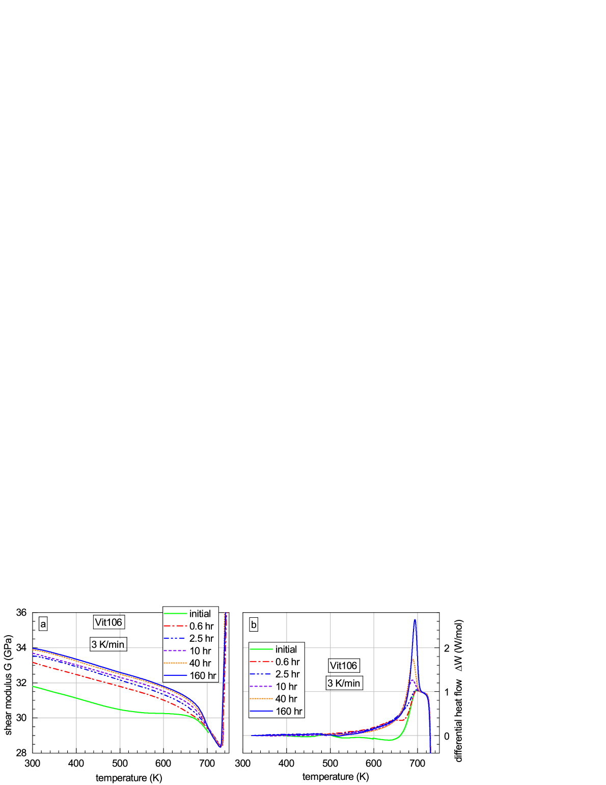
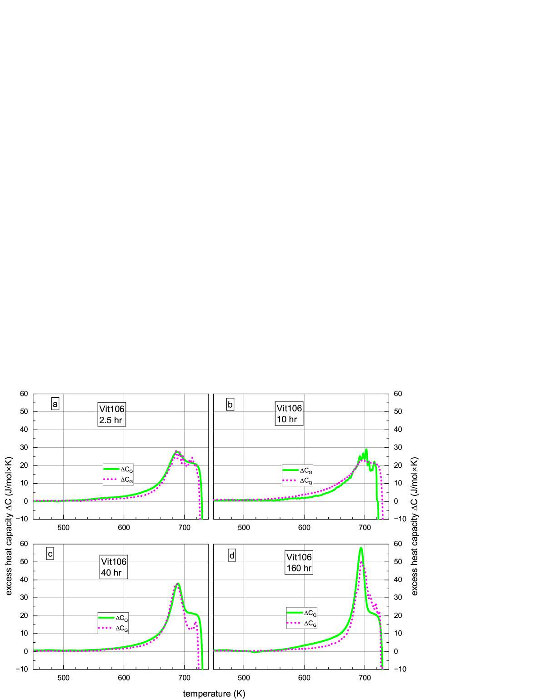
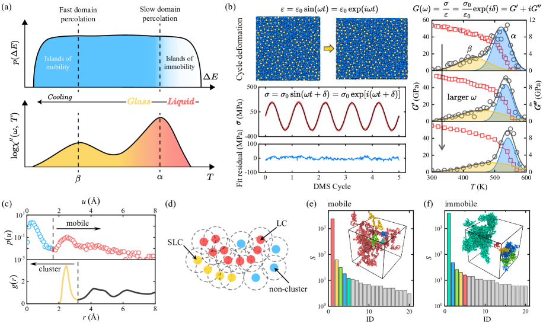

# 深部緩和した金属ガラスのガラス転移は何者か：熱容量ピークが語る相転移の本質

- **執筆日**: 2026-04-27
- **トピック**: 金属ガラスの深部緩和とガラス転移の性質 ── 過剰熱容量ピークとインタースティシャル理論
- **タグ**: Nonequilibrium and Dynamic Response / Bulk Alloys / Phase Transitions / Transport Measurements / Molecular Dynamics
- **注目論文**: arXiv:2503.04443 — Makarov et al., "On the nature of the glass transition in metallic glasses after deep relaxation" (2025)
- **参照論文数**: 6

---

## 1. なぜ今この話題なのか

ガラスはありふれた物質でありながら、その根本的な問いは今も未解決のまま残る。「液体が冷えてガラスになるとき、何が起きているのか」という問いは、物性物理学のなかでも最も古く、かつ最も手強いものの一つだ。結晶化では原子が周期配列に落ち着き、融点という明確な転移温度が存在する。一方でガラス化では、原子の動きが急速に遅くなって「凍りつく」だけで、原子配列に目立った変化は起きない。この転移のような非転移 ── 「ガラス転移」── の正体は何なのか。

この問いは純粋学術的な興味にとどまらない。**バルク金属ガラス**（BMG）は高強度・高弾性・高耐食性をもつ機能材料として、微小部品、医療用機器、スポーツ用品など多様な応用が期待される。しかし熱安定性や使用中の構造変化を正確に予測するには、ガラス転移温度 $T_\mathrm{g}$ 付近での物理を精密に理解することが不可欠だ。ガラスが「何次」の転移に近い振る舞いをするかという問いは、材料の設計にも直結する。

従来の金属ガラス研究では、ガラス転移付近での過剰熱容量 $\Delta C_p$ の変化はごく小さく、酸化物ガラスやポリマーガラスで見られるような熱容量ピークはほとんど観察されてこなかった。このため多くの研究者は「金属ガラスのガラス転移は純粋に動力学的なプロセス（凍結過程）に過ぎない」と考えてきた。

ところが近年、**深部緩和（deep relaxation）** を施した金属ガラスでは $T_\mathrm{g}$ 付近に顕著な熱容量ピークが現れることが報告され始めた。この観察は、ガラス転移が「単なる凍結」ではなく、より本質的な相転移的性質をもつ可能性を示唆する。2025年3月にMakarovらが発表したarXiv:2503.04443は、この謎に正面から挑んだ実験・理論の両面からの包括的な研究であり、インタースティシャル理論を駆使して熱容量ピークの起源と、深部緩和後のガラス転移が一次相転移に類似した特徴をもつことを主張した。

---

## 2. 未解決問題は何か

この分野における本質的な問いは大きく三つに整理できる。

第一の問いは「**ガラス転移の熱力学的な性質**」である。ガラス転移は二次相転移なのか、単なる動力学的な凍結なのか、あるいは一次相転移的な特徴をもつのか。結晶での融解と異なり、明確な潜熱は観測されないが、$T_\mathrm{g}$ における熱容量の不連続な変化は二次転移的に見える。しかし「二次転移」であれば背後に秩序変数と対称性の破れが必要であり、それが何かはいまだ明確でない。

第二の問いは「**金属ガラスの構造緩和を支配するのは何か**」である。原子論的な描像では、局所的な原子再配列（**せん断変換ゾーン**や**欠陥的構造**）の動態が緩和を決める。インタースティシャル理論（IT）はこの欠陥を「ダンベル型格子間原子」に類似した弾性双極子と見なし、高周波せん断弾性率 $G$ を支配パラメータとする。しかし他のアプローチ ── 粒子の固定化・非固定化をパーコレーション転移で捉える見方（arXiv:2411.02922）や、グラフ構造から緩和ダイナミクスを記述する見方（arXiv:2503.09278）── も近年有力視されており、どの描像が最も本質を捉えているかは未決着だ。

第三の問いは「**深部緩和とは何をしているのか**」である。長時間・高温でのアニールによってガラスをより安定な構造（より結晶に近い状態）に近づけることを深部緩和と呼ぶ。この操作が熱容量ピークを際立たせるメカニズム ── 欠陥濃度の低下、エネルギー障壁の均質化、弾性的不均一性の変化 ── の中で何が本質的かはまだ議論の途中にある。

---

## 3. 注目論文の核心

**arXiv:2503.04443**（Makarov, Gonchrova, Qiao, Konchakov, Khonik, 2025年3月）は、Zr系BMG「Vit106」（組成：$\mathrm{Zr_{57}Nb_5Al_{10}Cu_{15.4}Ni_{12.6}}$）と高エントロピー系金属ガラス（$\mathrm{Zr_{35}Hf_{13}Al_{11}Ag_8Ni_8Cu_{25}}$）を対象に、熱流（DSC計測）と高周波せん断弾性率 $G$（振動リード法）の**並行測定**を行った実験・理論研究である。

**何をどこまで明らかにしたか**

最大の実験的発見は、653 K での長時間アニール（0.6〜160時間）によってVit106を深部緩和させると、$T_\mathrm{g}$ 直下に強烈な過剰熱容量ピーク $\Delta C_Q$ が出現し、アニール時間が長いほどピークが鋭く・高くなるという観測だ（Fig. 1, Fig. 5）。一方、せん断弾性率の温度依存性は初期緩和後に変化し、その後も若干の増加を示すが、熱容量と比べると変化は穏やかであった。

*Fig. 1: Vit106のせん断弾性率G（上）および差熱流量ΔW（下）の温度依存性。アニール時間が長いほどΔWピークが鋭くなる（arXiv:2503.04443, CC BY 4.0）*

**理論的な核心：弾性率から熱容量を計算する**

著者らがインタースティシャル理論（IT）に基づいて導いた最重要の式は、ガラスの過剰熱容量 $\Delta C_G$ をせん断弾性率 $G(T)$ とその微分だけから計算できるというものだ。

$$
\Delta C_G(T) = -\frac{B \cdot V_0}{T}\left[G \frac{d^2G}{dT^2} - \left(\frac{dG}{dT}\right)^2 \right] \cdot \text{(補正項)}
$$

ここで $B$ と $\gamma$ は材料定数であり、$V_0$ は参照体積である（論文のEq. 12参照）。この式の物理的意味は「弾性率の温度変化が原子再配列のエネルギー障壁高さの変化を決め、その変化が熱容量として現れる」ということだ。

実験的に計測した $\Delta C_Q$（熱流計測）と理論的に計算した $\Delta C_G$（弾性率計測）の比較を行ったところ、初期状態・中程度緩和・深部緩和のすべての状態で二つが**非常によく一致**した（Fig. 3, Fig. 5）。これはITが熱容量の記述においても強力な予測力をもつことを示す。

*Fig. 5: 深部緩和後のVit106における過剰熱容量 $\Delta C_Q$（実験）と $\Delta C_G$（弾性率計算）の比較（arXiv:2503.04443, CC BY 4.0）*

**一次転移的性質の提案**

もう一つの重要な主張は、深部緩和後のガラス転移が**一次相転移に近い特徴**をもつという点だ。著者らは $\ln\Delta C_Q$ を $\ln(T_0 - T)$（$T_0$ はある特徴温度）に対してプロットすると、深部緩和状態では $-\alpha \approx 0.5$ に近い冪乗関係が現れることを示した。これは二次相転移の臨界指数（ $\alpha$ の発散）を想起させるが、一次転移特有の「欠陥の急激な再生」が $T_\mathrm{g}$ 上方で生じると解釈される。深部緩和で欠陥濃度が非常に低く抑えられているほど、加熱時の欠陥突発的増加はより劇的であり、熱容量ピークが鋭くなるという物理像だ。

**何が仮説段階か**

「深部緩和後のガラス転移が一次転移か二次転移かどちらに近いか」は完全には決着していない。著者自身が「一次転移的特徴に近い（close to）」と表現しており、厳密な相転移であることを主張しているわけではない。また使用した試料（Vit106と一種の高エントロピーガラス）での結果が他系でも普遍的かは未確認である。

---

## 4. 背景と研究史

金属ガラスのガラス転移を巡る議論は数十年の歴史をもつ。初期の解釈では、$T_\mathrm{g}$ における物性変化は単なる「動力学的凍結」として理解され、超冷却液体での粘性の急上昇と構造緩和時間の発散が主役だった。Angell のフラジリティ分類（strong/fragile）はこの枠組みを整理した重要な概念であり、金属ガラスは比較的「strong」液体に位置づけられる。

しかし「ガラス転移は二次転移か」という問いについては、理論・実験の両面で矛盾した結果が積み重なってきた。Gibbs–DiMarzio 理論や Adam–Gibbs モデルは配置エントロピーの消失と結びつけた第二種転移描像を提案したが、実験的に確認しにくい「理想ガラス転移（Kauzmann 温度 $T_K$）」に依拠する問題があった。

**インタースティシャル理論（IT）の登場**

IT は Granato（2002年）が提案し、その後 Khonik グループが発展させてきたモデルで、金属ガラスの緩和現象を「ダンベル型格子間原子欠陥（弾性双極子）の消滅・生成・状態変化」として一元的に記述する。ガラスの構造は大部分が5〜7個の欠陥が正二十面体的に集まったクラスターで占められ（全欠陥濃度 5〜10%）、そのうち流動性の高い単独欠陥・小クラスター（濃度 0.2〜0.5%）だけが構造緩和を担う。せん断弾性率 $G$ は欠陥濃度に指数関数的に依存し、原子再配列の活性化エネルギーは $r = GV_0$ に比例する（ダイアエラスティック効果）。

この枠組みでは、熱容量は「欠陥濃度の変化に伴う弾性エネルギーの変化」と「弾性率変化が活性化エネルギーを通じて引き起こすフォノン分布の変化」の二つの寄与に分解できる。注目論文arXiv:2503.04443はこの分解を定量的に示し、せん断弾性率データのみから熱容量全体を高精度に再現できることを実証したのだ。

この枠組みを高エントロピー金属ガラス（HEMG）に展開した研究が arXiv:2503.04436（同グループ、2025年3月）である。7種類のHEMGでせん断弾性率と熱容量を計測し、「緩和が存在しない状態ではガラスのせん断弾性率の温度係数が母結晶のそれに一致する」という一つの普遍的方程式ですべての結果が記述できることを示した。これは $G$ が欠陥濃度と本質的に結びついているという IT の核心主張を独立に支持するものだ。

さらに arXiv:2408.03207（Khmyrovら、2024年8月）は HEMGで $G$ と体積 $V$ の並行測定を行い、せん断弾性率と体積の緩和変化の比（温度非依存な無次元量 $K_i = d\ln G / d\ln V$）が $-44$〜$-53$ という値をとり、これが「格子間原子型欠陥の関与」を強く示す数値であることを示した。体積緩和もまた欠陥濃度に線形依存するという結果は、IT の適用範囲が熱容量・弾性率・体積という異なる物性を横断することを示している。

---

## 5. どの解釈が最も妥当か

### 5.1 IT による熱容量記述の強さ

arXiv:2503.04443 の最も説得力のある部分は、**一つの統一された式でガラス転移前後の熱容量全体を定量的に再現した**点にある。初期状態では $T_\mathrm{g}$ 付近でなだらかな吸熱ピークしか現れないが、160時間深部緩和後は鋭い大きなピークが生じる。この変化を同じ式が $B, \gamma$ という二つのパラメータで記述できるのは、ITが緩和の物理を正しく捉えていることを示す強い根拠だ。とくに「$\Delta C_G$ の計算に用いるのはせん断弾性率データだけ」という点は重要で、まったく異なる測定系から得た二つの量が一致することは、偶然の一致である可能性を排除する。

また、arXiv:2503.04436 と arXiv:2408.03207 による異なる物性（熱容量・弾性率・体積）での IT の成功は、この理論の普遍性を示す独立した証拠である。

### 5.2 一次転移的解釈の評価

深部緩和後の熱容量ピークが「一次転移的」かという点は、より慎重な評価が必要だ。著者が示した $\ln\Delta C_Q$ 対 $\ln(T_0 - T)$ の冪乗挙動は、一次転移近傍の臨界的性質と整合するが、真の一次転移であれば潜熱（熱流の積分量）が急峻な温度幅に集中するはずであり、測定された熱容量ピークの幅は数十 K と比較的広い。「一次転移的特徴」の定量的な強さはサンプルによって異なると予測され、現時点では「深部緩和ほど一次転移的になる」という方向性は支持されるが、普遍的かどうかは未決着だ。

### 5.3 競合するアプローチとの整合

**パーコレーション描像**（arXiv:2411.02922、Gaoら、Nature Physics 2025）は、α緩和（ガラス転移）と β緩和（二次緩和）を「固定化粒子（immobile particles）」と「流動粒子（mobile particles）」それぞれのパーコレーション転移として統一的に記述する。せん断弾性率を温度とともに追跡すると、固定化粒子のパーコレーション閾値が α転移温度に対応することを数値シミュレーションで示した。この枠組みはITとは独立で、単純なガラス形成液体（LJ液体など）に対する計算モデルを使っており、金属ガラスへの直接適用はまだ限定的だが、「動的不均一性」を幾何学的に捉えるという点で有力な視点を提供する。

*Fig. 1: パーコレーション描像によるα過程とβ過程の統一的理解（arXiv:2411.02922, CC BY 4.0）*

パーコレーション描像と IT は競合するというより相補的な関係にある。IT は「欠陥の弾性的特性」、パーコレーション描像は「動的不均一性の幾何」に着目しており、両者は同じ現象の異なる側面を記述している可能性が高い。

**グラフ-ダイナミクス対応**（arXiv:2503.09278）は、液体・ガラスの原子配置をネットワーク（グラフ）として捉え、そのトポロジーが緩和の多様性と関連するという新しい視点を提供する。この枠組みは構造的不均一性（局所的な短距離秩序の違い）が緩和時間の分布を生む機構の説明に向いており、ITの欠陥論とは記述言語が異なる。

**振動変形誘起アモルファス化のMDシミュレーション**（arXiv:2504.07798）は、繰り返し変形によるメカニカルアモルファス化を「有効温度モデル」で記述し、エネルギー障壁としての融解エンタルピー $\Delta H_m$ が決定因子であることを示した。これは静的な熱アニールとは異なる経路でガラス化する現象を扱っており、IT の枠組みとは方向が異なるが、「エネルギー障壁が物性を決める」という物理像では共通する。

### 5.4 比較的強く支持される結論と弱い点

比較的確からしい結論として以下が挙げられる。まず「せん断弾性率 $G$ が金属ガラスの緩和ダイナミクスの支配的パラメータである」という点は複数の独立した実験・測定系によって支持されており、かなり確立されている。次に「深部緩和が熱容量ピークを生み出す機構として、欠陥濃度の大幅な低下と加熱時の突発的な欠陥回復が本質的役割を果たす」という解釈も、実験データと理論の整合性から相当の信頼性がある。

一方、弱い点として「深部緩和後のガラス転移が一次転移的性質をもつ」という主張については、より広い組成系・より精度の高い熱量計測、そして第一原理計算による欠陥構造の直接検証が必要だ。また、IT では欠陥をダンベル型格子間原子と見なすが、アモルファス中でのこの実体の構造的同定はMD計算では示唆されているものの実験的には難しい。

---

## 6. 何が一般化できるのか

### 他の材料系への接続

深部緩和による熱容量ピークの出現は、Zr系BMGに限らず、Fe系、La系、Pd系など様々な組成でも報告されており、普遍的現象と考えられる。arXiv:2503.04443 では高エントロピーガラス $\mathrm{Zr_{35}Hf_{13}Al_{11}Ag_8Ni_8Cu_{25}}$ でも同様の $\Delta C_G$ と $\Delta C_Q$ の一致を確認しており、多主元素系にも適用できることを示した。また arXiv:2503.04436 はさらに7種のHEMGにわたってIT の普遍的方程式を検証した。

酸化物ガラス・ポリマーガラスとの比較という観点では、これらでは深部緩和に相当する操作（超安定ガラスの気相蒸着）によって類似した熱容量ピークが得られることが知られており、ガラス形成材料に横断的な普遍性があることが示唆される。

### 設計原理への示唆

「$G$ が緩和を支配する」という知見は実用上も重要だ。BMGの熱安定性向上を目指す場合、$G$ を高める合金設計（転移金属濃度の調整など）が有効であることが示唆される。また arXiv:2408.03207 が示した「体積緩和と弾性率緩和が一つの無次元数 $K_i$ で結びつく」という知見は、一方を測るだけで他方を予測できる可能性を示す。この効率的な物性予測は、ハイスループットスクリーニングや機械学習的なアプローチ（arXiv:2503.14092）との相性が良い。

arXiv:2503.14092（Machine Learning + ECNLE 理論）は、弾性集団非線形ランジュバン方程式（ECNLE）理論にMLを統合して、Tg・Tm・緩和時間を高精度で予測するモデルを構築した。この枠組みでは $G$ に関連する量を入力することで緩和ダイナミクス全体を予測でき、IT で強調される弾性率の中心的役割と整合する。

---

## 7. 基礎から理解する

### ガラス転移とは何か

液体を急冷すると結晶化が抑制され、原子が無秩序なまま固体化したものがガラスだ。液体から固体への移行点（「ガラス転移温度」$T_\mathrm{g}$）は、試料を一定速度で加熱または冷却したときに熱容量・体積・粘性などが急変する温度として定義される。$T_\mathrm{g}$ は冷却速度に依存する（速く冷やすと $T_\mathrm{g}$ が高くなる）。

ガラス中の原子はポテンシャルエネルギー地形（エネルギーランドスケープ）の谷（局所ミニマム）に閉じ込められており、隣の谷へ移動するには活性化エネルギー $E_a$ 以上の熱エネルギーが必要だ。$T_\mathrm{g}$ 以下では原子はほとんど動けず、$T_\mathrm{g}$ 以上では原子が頻繁に再配置を繰り返して液体となる。

### インタースティシャル理論の骨格

インタースティシャル理論（IT）は、金属結晶の融解を「ダンベル型格子間原子（自己格子間原子：2個の原子が1格子点を占有した構造）の雪崩的増加」と見なすモデルだ。液体は多数のこうした欠陥（弾性双極子）を含む状態であり、ガラスはその液体状態が急冷によって凍結されたものと理解される。

ITの中心的な関係式は、せん断弾性率 $G$ と欠陥濃度 $c$ が次のように結びついているというものだ。

$$G = G_c \exp(-\alpha_i \beta c)$$

ここで $G_c$ は欠陥がない仮想結晶の弾性率、$\alpha_i$ と $\beta$ は材料定数だ。欠陥が増えると $G$ が下がり、欠陥が減ると $G$ が上がる。この指数関係が実験的に支持されており、「ガラスの弾性率を測れば欠陥濃度がわかる」という強力なツールになっている。

### 活性化エネルギーとダイアエラスティック効果

原子再配列の活性化エネルギー $r$ は媒質の弾性抵抗力に比例する：

$$r = G V_0$$

$G$ は高周波せん断弾性率（GHz程度の周波数での計測値）、$V_0$ は参照体積だ。これをダイアエラスティック効果と呼ぶ。このことは「$G$ が小さい（欠陥が多い）ほど原子再配置が起きやすい」という直観と合う。深部緩和によって欠陥が減り $G$ が増大すると、原子再配置には高い活性化エネルギーが必要になり、その状態が $T_\mathrm{g}$ まで保たれる。$T_\mathrm{g}$ を超えると欠陥が一気に増加し、急激な熱容量増大（ピーク）として観測される。

### 過剰熱容量と弾性率の関係

熱容量 $C_p$ は温度変化に対してどれだけの熱エネルギーが蓄積されるかを表す量だ。ガラスの過剰熱容量 $\Delta C$ は「ガラス状態の熱容量から（仮想的な）結晶の熱容量を引いたもの」であり、欠陥の消滅・生成に伴うエネルギー変化と欠陥濃度の変化による弾性エネルギー変化の二成分から成る。IT に基づく導出では：

$$\Delta C_G \propto G \frac{d^2G}{dT^2} - \left(\frac{dG}{dT}\right)^2$$

というように、$G(T)$ の一階・二階微分の組合せで熱容量が表現される。これが実験的な $\Delta C_Q$ と一致するという結果は、「$G$ こそが緩和ダイナミクスを支配する熱力学量である」という IT の主張を熱容量という独立な物理量で検証したことを意味する。

---

## 8. 専門用語の解説

**1. バルク金属ガラス（BMG）**
金属合金を急速冷却してアモルファス構造を保った固体。複数の金属元素を混合することで結晶化を抑制しやすくなる。Zr系、Fe系、La系などが代表例で、高強度・高弾性率・高耐食性を示す。

**2. ガラス転移温度（$T_\mathrm{g}$）**
液体からガラス（または逆）への移行が観測される温度。冷却速度依存性があり、厳密な意味での相転移温度ではないが、物性が急変する特徴的な温度として実用的に定義される。

**3. 深部緩和（deep relaxation）**
ガラスを $T_\mathrm{g}$ 直下の温度で長時間アニールして、より安定なエネルギー状態（欠陥が少ない状態）へ近づける操作。単純な低温・短時間の緩和とは区別される。深部緩和後には $T_\mathrm{g}$ 付近の熱容量ピークが顕著になる。

**4. インタースティシャル理論（Interstitialcy Theory, IT）**
Granatoが提案し Khonik グループが発展させた理論。金属の融解と固体ガラスの緩和をダンベル型格子間原子（弾性双極子）の増減で統一的に記述する。高周波せん断弾性率 $G$ を支配的パラメータとし、欠陥濃度との指数関係を中心に置く。

**5. せん断弾性率（shear modulus, $G$）**
材料がせん断変形に抵抗する能力を表す弾性定数。ここで「高周波」弾性率とは、振動法（kHz〜MHz 周波数）によって測定される弾性率で、ガラスの瞬間的な弾性応答を反映する。

**6. ダイアエラスティック効果（diaelastic effect）**
原子再配置の活性化エネルギーがせん断弾性率 $G$ に比例するという現象。$r = GV_0$ で表され、欠陥が少ない（$G$ が大きい）ほど原子再配置が難しくなる。

**7. 過剰熱容量（excess heat capacity, $\Delta C$）**
ガラスの熱容量から対応する結晶の熱容量を差し引いた量。$\Delta C > 0$ の領域では吸熱（エンタルピーが増加）、$\Delta C < 0$ の領域では発熱（緩和による構造安定化）が起きていることを意味する。

**8. α緩和とβ緩和**
ガラス形成液体で観測される二つの主要な緩和モード。α緩和（主緩和）はガラス転移と結びついた長距離・協調的な運動で、$T_\mathrm{g}$ 付近で時間スケールが急増する。β緩和（二次緩和または Johari-Goldstein 緩和）は $T_\mathrm{g}$ 以下で観測される、より局所的・速い運動だ。

**9. パーコレーション転移**
ランダムなネットワーク（粒子・結合など）の一部が「連結した無限のクラスター」を形成し始める閾値での転移。ガラス緩和の文脈では、固定化粒子（或いは流動粒子）が空間的に連結し始める温度が α（あるいは β）緩和温度に対応するという描像がarXiv:2411.02922 によって提案されている。

**10. 高エントロピー金属ガラス（HEMG）**
5種以上の金属元素をほぼ等モル比で混合した非晶質合金。元素の多様性による「カクテル効果」で安定化された独自の特性をもち、IT の検証に有用な「試料の多様性」を提供する。

---

## 9. 今後の展望

今回の一連の研究が示した最も確からしい成果は、「せん断弾性率が金属ガラスの熱容量・体積・欠陥緩和を一元的に支配する」というITの予測能力の高さである。Zr系BMGと高エントロピー系という異なる組成系で同様の定量的一致が得られたことは、この枠組みの材料非依存的な普遍性を示唆する。また深部緩和が熱容量ピークを生み出す機構についても、「欠陥濃度の大幅な低下と $T_\mathrm{g}$ 付近での突発的な欠陥回復」という描像はよく支持されている。

しかし「深部緩和後のガラス転移が一次転移的性質をもつ」という主張にはまだ多くの検証が必要だ。最も直接的な実験として、高精度断熱型熱量計を用いた**電位差熱量測定**（$\pm 1\,\mathrm{mJ/mol \cdot K}$ 精度）による熱容量の精密計測と、**X線・中性子散乱**による加熱中のナノスケール構造変化の追跡が有力な次のステップになる。理論・計算の面では、IT で仮定されているダンベル型格子間原子欠陥の実際の構造をMD計算で可視化し、深部緩和前後での欠陥クラスターの変化を直接追う研究が重要だ。

より長期的な視点では、パーコレーション描像（arXiv:2411.02922）との統合が有望な方向性だ。「固定化粒子のパーコレーション」と「欠陥のITモデル」は、どちらも $T_\mathrm{g}$ 付近での急激な変化を捉えようとしており、両者を橋渡しする統一理論の構築が今後1〜3年の重要な課題になると予想される。機械学習との融合（arXiv:2503.14092）は、多組成系を網羅したデータベースの構築と $G$ に基づく熱的特性の自動予測へと発展し、BMG設計の合理化に貢献するだろう。

---

## 参考論文一覧

1. **[arXiv:2503.04443](https://arxiv.org/abs/2503.04443)** — Makarov et al., "On the nature of the glass transition in metallic glasses after deep relaxation" (2025). 【注目論文】Vit106と高エントロピーBMGにおける深部緩和後の熱容量ピークをITで定量的に記述し、ガラス転移が一次転移的特徴をもつと主張した本研究の核心論文。

2. **[arXiv:2503.04436](https://arxiv.org/abs/2503.04436)** — Makarov et al., "Relationship between the shear moduli and defect-induced structural relaxation of high-entropy metallic glasses" (2025). 7種のHEMGでせん断弾性率と熱容量を測定し、欠陥濃度と弾性率の関係が一つの普遍的方程式に従うことを実証した支持論文。

3. **[arXiv:2408.03207](https://arxiv.org/abs/2408.03207)** — Khmyrov et al., "Relationship between the shear modulus and volume relaxation in high-entropy metallic glasses" (2024). HEMGでせん断弾性率と体積の並行測定を行い、無次元パラメータ $K_i = d\ln G/d\ln V$ による統一的記述と格子間原子型欠陥の役割を示した背景論文。

4. **[arXiv:2504.07798](https://arxiv.org/abs/2504.07798)** — "Mechanical Amorphization of Glass-Forming Systems Induced by Oscillatory Deformation" (2025). MDシミュレーションで振動変形誘起アモルファス化を研究し、有効温度モデルと融解エンタルピーによる障壁記述を提案したMD比較論文。

5. **[arXiv:2503.09278](https://arxiv.org/abs/2503.09278)** — "Graph-Dynamics correspondence in metallic glass-forming liquids" (2025). 液体の原子配置をグラフとして表現し、そのトポロジーが緩和ダイナミクスの多様性と対応することを示した代替理論論文。

6. **[arXiv:2411.02922](https://arxiv.org/abs/2411.02922)** — Gao et al., "Unified percolation scenario for the α and β processes in simple glass formers" (Nature Physics 2025). 固定化粒子と流動粒子のパーコレーション転移によってα緩和とβ緩和を統一的に記述し、より広い文脈でのガラス動力学の枠組みを提供した比較論文。

7. **[arXiv:2503.14092](https://arxiv.org/abs/2503.14092)** — "Machine Learning-Integrated Modeling of Thermal Properties and Relaxation Dynamics" (2025). ECNLE 理論と機械学習を統合し、Tg・Tm・緩和時間を高精度で予測するモデルを構築した応用論文。（本文で言及、ライセンスの都合で図は不使用）
