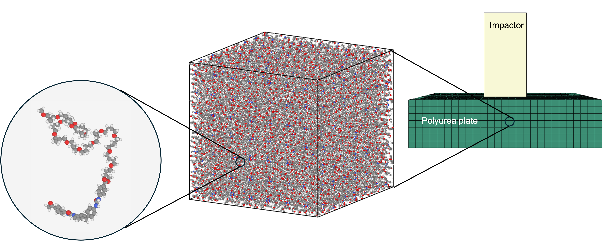
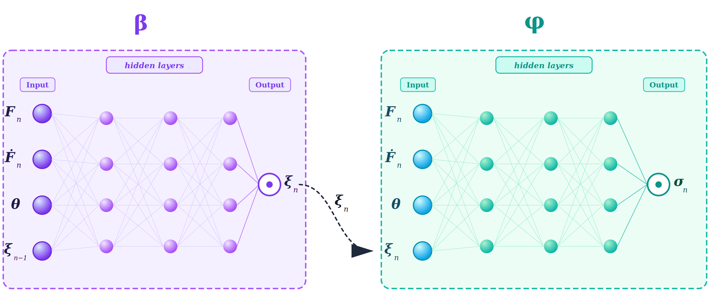
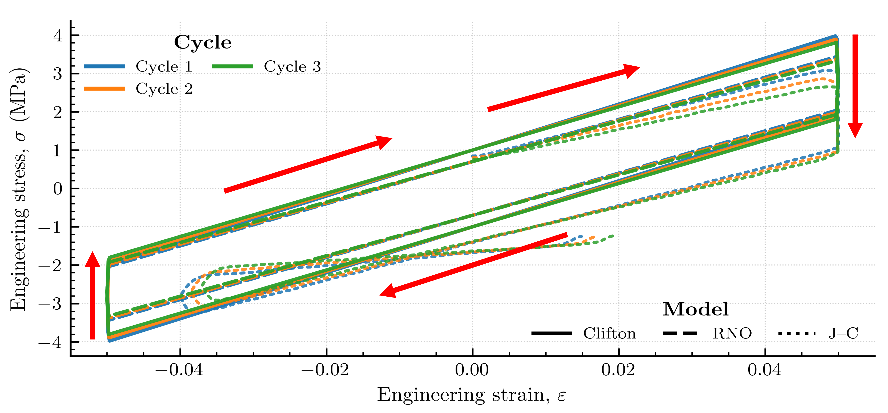
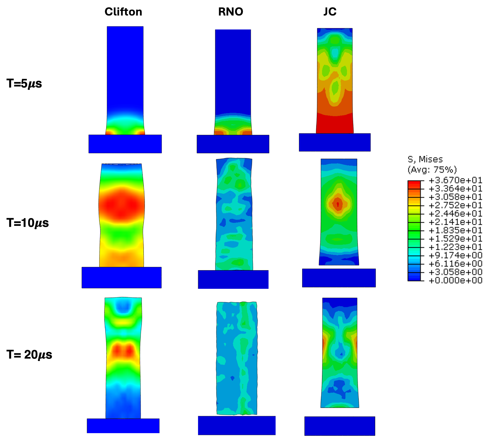

# ニューラルオペレータが拓く原子–連続体マルチスケール計算：粘弾性ポリマーへの応用

- **執筆日**: 2026-04-13
- **トピック**: マルチスケール計算 / ニューラルオペレータ / 粘弾性ポリマー
- **タグ**: Computation and Theory / Multiphysics and Coupled Phenomena; Nonequilibrium and Dynamic Response / Multiscale Computation; Surrogate Modeling
- **注目論文**: Sohail, Liu, Ghosh, "Neural operator accelerated atomistic to continuum concurrent multiscale simulations of viscoelasticity," arXiv:2603.27430 (2026)
- **参照関連論文数**: 6本

---

## 1. なぜ今この話題なのか

材料科学のシミュレーションは今、大きな転換点を迎えている。高分子材料・複合材料・金属材料のいずれにおいても、実際の材料挙動は複数のスケールが絡み合って決まる。たとえば、爆風や衝撃から構造物を守るコーティングとして広く使われるポリウレア（polyurea）は、数ナノメートルのハードセグメント（剛直な尿素基を含む分子鎖）とソフトセグメント（柔軟なポリオール系分子鎖）が自己組織化した相分離微細構造を持つ。この原子スケール（オングストロームからナノメートル）の構造が、マクロな粘弾性応答――すなわちエネルギー吸収率や衝撃緩和能力――を支配している。しかし原子スケールのシミュレーションをそのまま構造スケール（センチメートル〜メートル）まで引き上げることは、現在の計算資源では不可能に近い。1センチ角の試験片に含まれる原子数はおよそ $10^{23}$ 個であり、これを分子動力学（MD）で扱うには天文学的な計算量が必要となる。

この「スケールの壁」を乗り越えるための手法が**マルチスケール計算** (multiscale computation) である。マルチスケール計算には大きく2つの戦略がある。「逐次型」（sequential）アプローチでは、まず原子スケールで材料の基礎的な性質（弾性定数、拡散係数など）を計算し、その結果を現象論的な連続体モデルのパラメータとして利用する。一方「同時並行型」（concurrent）アプローチでは、原子スケールと連続体スケールを同時に走らせ、リアルタイムで情報を交換する。後者は材料の非線形・経路依存性を正確に扱える点で理想的だが、計算コストが桁違いに大きい。

同時並行型の代表格が**FE² 法**（FE-squared method）であり、各積分点でミクロ代表体積要素（RVE）問題を毎回解くことでマクロ–ミクロの双方向カップリングを実現する。しかしFE² 法には深刻な計算コスト問題がある。連続体メッシュの各積分点において毎ステップMD計算や詳細有限要素ミクロ計算を行えば、計算時間は積分点数（工学的な構造問題では $10^4$〜$10^6$ 点に達する）に比例して爆発する。工学的に意味のある構造スケールの問題では、直接的なFE²は非現実的である。この問題に対して近年急浮上してきた解決策が、**ニューラルオペレータ**（neural operator）をMDや詳細ミクロモデルの代替物（サロゲートモデル）として使う戦略である。

さらに近年の研究の流れを加速させているのは、機械学習（ML）の材料科学への深い浸透である。MLポテンシャルによるMD加速、逆設計、物性予測と連動する形で、「データ駆動型構成則」の開発が一大分野となりつつある。特に、フーリエニューラルオペレータ（FNO）やDeepONetに代表される**ニューラルオペレータ**が、偏微分方程式（PDE）の解オペレータを学習する枠組みとして注目を集め、流体力学・固体力学・熱伝導など広い応用を見せている。こうした潮流の中で、「原子–連続体マルチスケール計算のサロゲート化」は材料計算科学のフロンティアの一つとして急速に発展中である。

2026年3月に投稿されたSohailらの論文（arXiv:2603.27430）は、まさにこの課題の核心に挑んだ研究である。**ポリウレアの粘弾性応答**を学習した**再帰型ニューラルオペレータ**（RNO: Recurrent Neural Operator）を構成則サロゲートとして構築し、これを連続体FEMシミュレーションに組み込むことで、原子スケールの情報を保持しながら工学的スケールの動的シミュレーションを実現した。同時に転移学習（transfer learning）を温度依存性の汎化に応用し、少量の高温MDデータから高精度な温度依存構成則を獲得することにも成功した。

---

## 2. この分野で何が未解決なのか

マルチスケール計算の分野では、以下の3つの問いが現在も中心的な未解決問題として議論されている。

**問い①：原子スケールの情報をいかにして連続体へ効率的かつ正確に引き渡すか**

最も基礎的な問いは、MDやDFTで得られる詳細な構成則情報を、FEMが扱えるコンパクトなサロゲートモデルとして表現できるか、という問題である。FE² 法は原理的には厳密だが、毎積分点でのミクロ解法が計算コストを致命的に引き上げる。ニューラルネットワークやニューラルオペレータによるサロゲートは速いが、「経路依存性」（path-dependence）の正確な捕捉、すなわち過去の変形履歴に応じた応力変化の再現が難しいとされてきた。従来のRNNやLSTMは時間ステップ幅に依存した予測を行うため、訓練時とは異なる時間離散化でFEMと組み合わせると誤差が生じやすい。ニューラルオペレータはこの離散化依存性を克服できる可能性を持つが、どこまでの精度・外挿性が保証されるかは依然として問われている。

**問い②：温度・ひずみ速度などのパラメータを跨いだ汎化はどこまで可能か**

材料は温度や変形速度に応じて挙動が大きく変化する。ポリウレアのような粘弾性材料では、温度によってガラス転移が関係し、応力緩和の時定数が数桁変わることもある。実際のエンジニアリング応用では、室温から数百度の範囲で材料モデルが機能することが求められる。各温度条件でいちいちMDを大量に走らせて再学習するコストを避けるため、転移学習や温度を明示的に考慮したアーキテクチャが求められている。しかし、どこまでの外挿が安全で信頼できるかの理論的保証はまだ乏しい。特に相変態や分子構造の変化を伴う温度範囲では、表現の連続性が崩れる可能性がある。

**問い③：物理的整合性（保存則・熱力学的一貫性）をデータ駆動モデルで担保できるか**

純粋なデータ駆動型モデルは、訓練データ外の条件でエネルギー非保存や非物理的な挙動を示すリスクがある。構成則の観点では、熱力学第二法則（散逸の非負性）や非負の弾性エネルギー密度、変形ゲージ不変性（客観性）といった物理的要請を満たすことが求められる。このため「物理制約付き」アーキテクチャの開発が重要になっている。PRNNやEquiNOはそれぞれ異なる方法で物理制約を組み込むが、その制約の強さと表現力のトレードオフをどのようにバランスさせるかが現在の主要な研究テーマである。また、MD自体の「正確さ」を規定する原子間力場（力場パラメータ）の不確かさがサロゲートを通じてマクロ予測に伝播する問題も、実用上は重要な未解決課題である。

---

## 3. 注目論文の核心

### 何を問題として設定したか

Sohailら（arXiv:2603.27430）が解こうとした問題は明確である：「分子動力学シミュレーションから直接学習した粘弾性構成則を、実際の有限要素構造解析に組み込み、工学的スケールの動的問題を精度良く解けるか？」。注目すべきは、FEMとMDを直接連成させる代わりに、MD計算の**演算子（オペレータ）そのもの**を学習するという発想の転換にある。計算の実体はオフライン（前処理）段階でのMDシミュレーションとRNO訓練であり、オンライン（構造解析）段階では軽量なニューラルネットワーク評価のみが行われる。

### ポリウレアという材料選択の意味

ポリウレアは軍事・土木・スポーツ保護具など幅広い分野で使われる衝撃吸収コーティング材であり、高い粘弾性を持つことが知られる。原子スケールでは、MDシミュレーションを通じてその構成則が比較的よく調べられており（PCFF力場が確立されている）、また連続体スケールでは実験的に校正されたClifton粘弾性モデルが存在する。つまり、MDと連続体の双方で「答え合わせ」ができる良いベンチマーク材料である。著者らはPCFF力場を使い、300K, 400K, 500K の3温度でポリウレアのMDシミュレーションを実施し、訓練データとなるひずみ–応力経路を多数生成した（300K で1000本、400K・500K で各500本）。

### 再帰型ニューラルオペレータ（RNO）の構築

本研究の核となるのは**再帰型ニューラルオペレータ**（RNO）である。これはLiuら（2023）によって提案された手法（arXiv:2210.17443）を、原子–連続体マルチスケールという文脈に拡張したものである。通常のニューラルネットワークが有限次元ベクトルから有限次元ベクトルへの写像を学ぶのに対し、ニューラルオペレータは**関数から関数へのマッピング**（無限次元関数空間における写像）を学習する。これにより、時間ステップ幅や空間分解能に依存しない（discretization-independent）予測が可能になる点が実用上の大きな利点である。

RNOにおいて重要なのは**内部変数**（internal variables）の設計である。粘弾性材料では現在の応力が過去の変形履歴全体に依存するが、この「記憶」をどうエンコードするかが問題となる。RNOでは隠れ状態（latent state）として内部変数 $\boldsymbol{z}$ を陽に導入し、現在の内部変数の進化を

$$\boldsymbol{z}_{n+1} = \mathcal{G}_{\theta_1}(\boldsymbol{z}_n, \boldsymbol{\varepsilon}_{n+1})$$

と定義する（$\boldsymbol{z}_n$：内部変数ベクトル、$\boldsymbol{\varepsilon}_{n+1}$：現在のひずみ、$\mathcal{G}_{\theta_1}$：学習済みゲート関数）。そして応力は

$$\boldsymbol{\sigma}_{n+1} = \mathcal{F}_{\theta_2}(\boldsymbol{z}_{n+1}, \boldsymbol{\varepsilon}_{n+1})$$

として与えられる。この構造はLSTMやGRUと外形が似ているが、入力・出力が連続関数空間に属するオペレータとして設計されており、時間離散化の変化に対してロバストである点が本質的に異なる。内部変数の数は経験的に決定され、本研究では誤差が収束する最小数を選択している（著者らは内部変数数と予測誤差のトレードオフを系統的に調査した）。

### 転移学習による温度汎化

本研究のもう一つの重要な貢献が**温度間の転移学習**（transfer learning across temperatures）である。300K でまず豊富な訓練データでRNOを学習し、その重みを初期値として400K, 500K の少量データで再訓練する。この結果、各温度で独立に学習するより大幅にデータ量を節約しながら、高温での粘弾性応答を正確に再現できた。これは、ポリウレアの粘弾性機構が温度を超えて共通の構造的特徴（水素結合ネットワークの動的再形成、ハードドメインとソフトドメインの相互作用など）を持ち、温度による変化は内部変数の「スケール調整」として表現できることを示唆している。

### 有限要素シミュレーションへの組み込みと検証

訓練済みRNOはABAQUSの**VUMATサブルーチン**を通じてFEMシミュレーターに組み込まれた。各積分点での応力更新はRNOの順伝播計算として実行されるが、積分点ごとの計算が完全に独立しているため効率的な並列化が可能で、計算コストはMD直接連成の何桁も下回る。著者らは3つのベンチマーク問題でRNO-FEMの精度を検証した。

**サイクル負荷試験**では、ドッグボーン形状試験片に対してサイクル変形を印加し、応力–ひずみ履歴（ヒステリシスループ）を3種類のモデル（RNO、Cliftonモデル、Johnson-Cookモデル）で比較した。RNOはCliftonモデルと高い一致を示し、粘弾性特有のエネルギー散逸挙動を正確に再現した。Johnson-CookモデルはヒステリシスLoopを全く再現できなかった。**テイラー衝撃試験**では、円柱ポリウレア試験片を高速でターゲットに衝突させる高速大変形問題を解き、RNO-FEMはCliftonモデルと同等のフォンミーゼス応力場・温度場分布を与えた。さらに**平板衝撃試験**でも同様の結果が得られ、RNOの外挿性の高さが確認された。

*Fig. 2 from arXiv:2603.27430 (CC BY 4.0) — ポリウレアの原子–連続体マルチスケール模式図。左：ポリウレア分子鎖、中：MDによる原子RVE、右：FEMによる構造スケールシミュレーション。RNOが原子スケールと連続体スケールの橋渡しを担う。*

---

## 4. 背景と研究史

### 同時並行マルチスケール法の系譜

マルチスケール計算の発展は、1990年代後半のタドモア（Tadmor）らによる**準連続体法**（quasicontinuum method）に遡る。これは原子スケールと連続体スケールを空間的に分割し、界面近傍のみを原子分解能で扱う「空間分割型」マルチスケール手法であった。一方、フェイエル（Feyel）とシャブーシュ（Chaboche）が2000年に提案した**FE² 法**は、全域を連続体FEMで解きつつ、各積分点でミクロRVEの詳細計算（有限要素または分子動力学）を行うという完全同時並行の枠組みを確立した。FE² はその理論的完全性から理想的な手法とみなされているが、計算コストが積分点数に比例して増加するという根本的な問題を持つ。工学的な構造問題では数十万〜数百万の積分点が存在することもあり、各積分点でのMD計算は実質的に不可能である。

この計算コスト問題への初期の対処として、Ghavamian and Simone（2019）はRNN（Recurrent Neural Network）をFE² のサロゲートとして使う先駆的研究を発表した。その後、Mozaffarら（2019）やWuら（2020）はLSTMを用いたデータ駆動型構成則モデルを発展させ、弾塑性材料の経路依存挙動を比較的良好に再現できることを示した。しかしこれらはすべて有限次元ベクトルから有限次元ベクトルへの写像であり、特定の時間ステップ幅に訓練されたモデルは異なる時間刻みでは精度が低下するという汎化問題があった。

### ニューラルオペレータの登場と発展

決定的な転換点となったのは、Liuら（arXiv:2210.17443）が2022年に発表した「マクロ内部変数の学習」論文である。この研究では、多結晶体の結晶塑性MDシミュレーションデータからRNOを学習し、FE² 精度の結果を経験則的な構成則並みのコストで実現できることを示した。このRNOの核心的な革新は**無限次元関数空間でのオペレータ学習**にあり、ひずみ経路の関数空間 $\mathcal{E}$ から応力の関数空間 $\mathcal{S}$ への写像 $\mathcal{G}: \mathcal{E} \to \mathcal{S}$ を近似する。この「discretization-independent」な性質により、訓練時と異なる時間ステップ幅でも一貫した予測が可能となる。

Sohailらの2026年論文はこのRNOをさらに発展させ、①原子MDと直接連成した点（Liuらの先行研究はミクロFEMからの学習が主体だった）、②温度汎化に転移学習を活用した点、③完全なFEM構造計算への組み込みと動的大変形問題への適用、という3点で先行研究を大きく前進させた。特に①は、原子間力場さえあれば実験データや半経験則なしに構成則を自動生成できることを意味し、新規材料の設計・探索に向けた大きな一歩である。

### HollenwegerらのTRNOと温度依存塑性

Hollenweger, Kochmann, Liu（arXiv:2508.18806）は六方最密充填（HCP）金属（チタン合金等）の温度依存異方性塑性にTRNO（Temperature-aware Recurrent Neural Operator）を適用した。Sohailらが転移学習で温度を扱ったのに対し、TRNOは温度を明示的な入力として扱い、単一モデルで広い温度範囲を統一的に記述する。HCP金属では結晶の変形機構（すべり系、双晶）が温度によって大きく変化するという複雑さがあるが、TRNOは従来の唯現象論的モデルより3桁以上の高速化を達成しながら高精度を保つと報告されている。この2つのアプローチ（転移学習 vs. 温度を明示的入力とする単一モデル）の比較は、温度の広い範囲を扱う場合にどちらが有利かという実用的な問いへの示唆を与える。一般に、温度が訓練範囲内であれば単一モデルアプローチが有利で、外挿が必要な場合は転移学習がリスクを下げる傾向があると考えられる。

### ポリウレア研究の文脈

ポリウレアはその相分離微細構造（ハードセグメントとソフトセグメントの交互配列）が複雑な粘弾性応答の源泉であり、ナノスケール〜マクロスケールのマルチスケール特性評価が長年の課題だった。従来の研究では、ポリウレアのMD計算でマクロ粘弾性特性（緩和弾性率など）を計算する試みが多く行われてきたが、この知識をFEM構造解析に自動的に組み込む枠組みは欠如していた。Sohailらの研究は、MDシミュレーション→RNO学習→FEM組み込みという自動化パイプラインを構築することで、この連携を実現した。先行する唯現象論的アプローチ（Cliftonモデルなど）は実験データへのフィッティングを必要とするが、MD-RNOパイプラインは原理的にはノーパラメータ調整で構成則を導出できる。

---

## 5. どの解釈が最も妥当か

### ニューラルオペレータ系のアプローチ：支持する根拠

Sohailらの結果が説得力を持つ最大の根拠は、**複数の独立したベンチマーク問題で一貫した精度**を示した点である。サイクル負荷（低速・小変形・線形粘弾性域）からテイラー衝撃（高速・大変形・強非線形域）まで、幅広い変形モードと速度領域でCliftonモデルと同等の結果が得られた。これは単なる過学習ではなく、RNOがポリウレアの粘弾性機構を本質的な特徴として捉えていることを示す。

さらに、300K で訓練したモデルを高温に転移できたことは材料科学的に重要な示唆を持つ。ポリウレアの粘弾性挙動は温度によって大きく変化するが、その変化が「共通の潜在表現空間上での係数調整」として表現されることは、ポリマー物理学の文脈でも自然な解釈である。分子スケールでは、水素結合の切断・再形成ダイナミクス（時定数）が温度と強く相関し、これがマクロな応力緩和特性を決めているが、このメカニズムの構造（どの内部変数がどう変化するか）は温度を跨いで共通していると考えられる。

### 競合するアプローチとの比較

**EquiNO**（arXiv:2504.07976、Eivazら 2026）は別のアプローチを採り、固体力学の平衡方程式をハードコードした物理インフォームドニューラルオペレータを提案した。具体的には、固有直交分解（POD）から導出した無発散（divergence-free）基底を使い、運動量保存則を構造的に満たすようにアーキテクチャを設計する。これにより少量の訓練データで8000倍以上の高速化を達成したと報告している。EquiNOの最大の強みは**物理整合性の構造的保証**であるが、現状では弾性問題に限定されており、粘弾性・経路依存挙動への拡張は将来の課題として残っている。Sohailらのデータ駆動型RNOは弾性以外の複雑な履歴依存挙動も扱えるが、その代償として物理制約が明示的には課されていない。

**Jeyarajらのハイブリッドニューラルオペレータ**（arXiv:2506.16918）は、ニューラルオペレータをミクロスケールのサロゲートとして使いつつ、構成則の物理的法則を陽に保持するハイブリッドアーキテクチャを採用した。このアプローチはPODによるモード分解とニューラルオペレータを組み合わせ、ミクロスケールの変位場・内部変数場を6%以下の誤差で予測し、FE² と比べて約100倍の速度向上を達成したと報告されている。Sohailらとの違いは、ミクロモデルがFE²スタイル（有限要素で解かれる繊維強化RVE）であるのに対し、Sohailらは原子MDからの学習という点である。Jeyarajらの手法は連続体ミクロスケールに対してより精度が高い可能性があるが、原子な情報（化学結合・水素結合・構造等）を直接取り込む枠組みにはなっていない。

**物理再帰型ニューラルネットワーク（PRNN）**は、Maiaら（2022）が提案したアーキテクチャで、古典的な材料構成則モデル（弾性・弾塑性等）をネットワークの隠れ層に陽に組み込む。KovácsらはPRNNを用いてポリマー複合材料の不確実性定量化（UQ）を行い（arXiv:2504.11625）、材料パラメータの変化がマクロ応答の確率分布にどう影響するかを7000倍の高速化で解析した。PRNNの強みは**物理的整合性の自動保証**と**再訓練不要のパラメータ適応**にある。しかし、PRNNに組み込める構成則は弾塑性モデルなど比較的シンプルなものに限られ、粘弾性ポリマーへの直接適用には工夫が必要である。

*Fig. 1 from arXiv:2603.27430 (CC BY 4.0) — 再帰型ニューラルオペレータ（RNO）のアーキテクチャ。$\boldsymbol{\varepsilon}_n$：ひずみ、$\boldsymbol{z}_n$：内部変数（材料の「記憶」を担う）、$\boldsymbol{\sigma}_{n+1}$：予測応力。ゲート機構が長時間スケールの粘弾性記憶を管理する。*

### 比較的強く支持される結論

現時点の証拠を総合すると、以下の点は比較的強く支持される。

第一に、**ニューラルオペレータ（RNOを含む）は、従来のRNNやMLPと比べて「時間解像度非依存」という重要な優位性を持ち、FEMとの連成における実用性を大きく高める**。訓練時と異なるタイムステップサイズに対して予測が崩れにくいという性質は、FEM解析では特定のタイムステップが使われることが多い実際の計算で非常に重要である。

第二に、**転移学習による温度汎化は現実的に有効な戦略**であり、MDデータ生成コストを大幅に削減できる。Hollenwegerらが金属塑性でTRNOを使って同様の方向性を示しており、この戦略の有効性はポリウレアを超えて一般化される可能性が高い。

第三に、**原子MDを訓練データソースとする点は、実験データや半経験則パラメータへの依存を原理的に不要にする**という大きなメリットがある。ただし、この「第一原理性」はMD力場の精度に依存しており、力場の不確かさがサロゲートを通じてマクロ予測に伝播することへの注意が必要である。

### まだ弱い結論と未確定点

一方で、以下の点はまだ議論の余地がある。

第一に、**訓練データ生成のための「正しい」MDシミュレーション設計**が理論的に明確でない。どの程度の多様なひずみ経路を訓練データとすれば、工学的に重要な全ての変形パターンをカバーできるかの保証はない。能動学習（active learning）による訓練データの適応的生成が将来的に重要になると考えられる。

第二に、**熱力学的一貫性の保証**がRNOでは明示的でない。PRNNやEquiNOのような物理制約付きアーキテクチャとの融合が、将来的に必要になるかもしれない。特に極端な条件（超高温・超高圧・破壊近傍）では非物理的な挙動が顕れるリスクがある。

第三に、**大変形・き裂進展・材料破壊を含む問題への拡張**がどこまで可能かは未知数である。今回の検証はRNOが訓練データ分布内の条件で高精度であることを示したが、材料破壊のような不連続・不可逆的イベントをどう扱うかは開かれた問いである。

*Fig. 9 from arXiv:2603.27430 (CC BY 4.0) — サイクル負荷試験における3モデルのヒステリシスループ。横軸：軸ひずみ、縦軸：軸応力。RNO（データ駆動）はClifton粘弾性モデル（実験的）と一致し、金属向けJohnson-Cookモデルとは明確に異なる。*

---

## 6. 何が一般化できるのか

### 他の材料系への接続

本研究のアプローチが最も直接的に適用できる材料系は、**経路依存的な構成則を持つポリマー・複合材料**である。エポキシ樹脂・ゴム・シリコーン・形状記憶ポリマーなどの高分子材料は、いずれも現象論的モデルでは捉え切れない複雑な粘弾性・粘塑性挙動を示す。これらに対してRNO-FEMの戦略を適用すれば、材料固有のMDシミュレーションから直接学習した構成則を使った構造解析が可能になる。高分子電解質膜（燃料電池用ナフィオンなど）や生体材料（コラーゲン・ゴム靭帯）も同様の枠組みの恩恵を受けられる候補である。

金属材料への拡張もすでに始まっている。Hollenwegerら（arXiv:2508.18806）はHCP金属（チタン合金等）にTRNOを適用し、従来モデル比3桁以上の高速化を達成した。BCC金属（鉄・タングステン）やFCC金属（アルミ・銅）でも原子間力場（またはMLポテンシャル）を使えば同じパイプラインを適用できる。特に核融合炉材料として注目されるタングステンは照射損傷下での機械特性変化が重要であり、原子計算と連続体解析を橋渡しする枠組みが切実に求められている。

セラミクス複合材料や繊維強化プラスチック（FRP）では、Jeyarajらのハイブリッドモデル（arXiv:2506.16918）やKovácsらのPRNN-UQ（arXiv:2504.11625）が示した方向性が重要である。特にUQの観点から、RNOとPRNNの融合によって原子不確かさをマクロ予測まで伝播させる確率論的マルチスケール計算の実現も視野に入る。

### ソフトマター・液体への展開

Bui and Cox（arXiv:2603.20493）は異なる系（水・CO₂などの液体）に対して、MLIPと神経回路網古典密度汎関数理論（neural cDFT）を組み合わせた「ab initio マルチスケール」枠組みを発表した。この手法は、第一原理計算→MLIPによるMD→cDFTという3段階のスケール橋渡しで、バルク状態方程式から閉じ込め効果まで予測する。固体ポリウレアのRNO-FEMとはターゲット材料が異なるが、「機械学習を仲介者としてスケールを橋渡しする」という哲学は共通しており、固体・液体・ソフトマターを統一する視座となっている。

### デバイス・工学応用への接続

ポリウレアの衝撃吸収特性は防爆構造・ヘルメット・防弾ベストなど多くの安全工学応用に直結する。RNO-FEMが実用化されれば、新規ポリウレア組成の開発において「MD計算→構成則学習→構造シミュレーション→最適化」というワークフローが自動化・高速化される。これは材料設計のデジタルツインとも言うべき計算環境の構築につながり、実験と計算の反復サイクルを大幅に短縮できる。

*Fig. 11 from arXiv:2603.27430 (CC BY 4.0) — テイラー衝撃試験でのフォンミーゼス応力場。RNO（左）はClifton粘弾性モデル（中）と同等の空間分布を示す。金属向けJohnson-Cook（右）との差は粘弾性効果の有無に起因する。*

---

## 7. 基礎から理解する

### 有限要素法（FEM）とは

**有限要素法**（FEM: Finite Element Method）とは、連続体力学の支配方程式を空間的に離散化して解く数値計算手法である。構造体を小さな要素（エレメント）に分割し、各要素内では変位場などを多項式で近似する。FEMで解くべき基本方程式は動的問題では運動方程式：

$$\nabla \cdot \boldsymbol{\sigma} + \boldsymbol{b} = \rho \ddot{\boldsymbol{u}}$$

である。ここで $\boldsymbol{\sigma}$ は応力テンソル（$3 \times 3$ の対称テンソル）、$\boldsymbol{b}$ は体積力ベクトル（重力など）、$\rho$ は質量密度、$\ddot{\boldsymbol{u}}$ は変位場の加速度である。FEMはこの方程式をガラーキン法で弱形式化し、代数方程式系（時間積分を伴う連立方程式）に変換して解く。

重要なのは、この方程式を閉じるために「ひずみ $\boldsymbol{\varepsilon}$ から応力 $\boldsymbol{\sigma}$ をどう計算するか」という**構成則**（constitutive model）が必要なことである。線形弾性体ではフックの法則 $\boldsymbol{\sigma} = \mathbb{C} : \boldsymbol{\varepsilon}$（$\mathbb{C}$ は4階弾性テンソル）が構成則であるが、粘弾性体ではこれが時間積分を含む積分型または微分型の関係式となる。マルチスケール計算の課題は、まさにこの構成則をいかに原子スケールから自動的に引き出すかにある。

### 分子動力学シミュレーション（MD）の基礎

**分子動力学**（MD: Molecular Dynamics）では、各原子の運動をニュートン方程式に従って時間発展させる：

$$m_i \ddot{\boldsymbol{r}}_i = -\nabla_{\boldsymbol{r}_i} U(\{\boldsymbol{r}_j\})$$

ここで $m_i$ は原子 $i$ の質量、$\boldsymbol{r}_i$ はその位置、$U$ は全原子系のポテンシャルエネルギー（力場）である。高分子材料のMDシミュレーションでは、PCFF（Polymer Consistent Force Field）のような専用力場が使われ、共有結合（伸縮・曲げ・ねじれ）・水素結合・ファンデルワールス相互作用が記述される。

MDシミュレーションから応力テンソルを計算するにはビリアル定理を用いる：

$$\boldsymbol{\sigma} = \frac{1}{V} \left( \sum_i m_i \dot{\boldsymbol{r}}_i \otimes \dot{\boldsymbol{r}}_i + \frac{1}{2} \sum_{i \neq j} \boldsymbol{r}_{ij} \otimes \boldsymbol{f}_{ij} \right)$$

ここで $V$ はシミュレーションセルの体積、$\boldsymbol{r}_{ij} = \boldsymbol{r}_i - \boldsymbol{r}_j$、$\boldsymbol{f}_{ij}$ は原子 $j$ が原子 $i$ に及ぼす力である。MDの主な限界は時間スケール（通常ナノ秒以下）と空間スケール（通常数十ナノメートル以下）であり、工学的スケールとの橋渡し問題を引き起こす原因となる。

### RVE（代表体積要素）と均質化

**代表体積要素**（RVE: Representative Volume Element）は、材料の微細構造を統計的に代表する最小の体積である。マルチスケール計算では、連続体の各積分点に仮想的なRVEを対応させ、RVEのアンサンブル平均（均質化）として有効応力・有効剛性テンソルを算出する。均質化の基本的な関係式は：

$$\langle \boldsymbol{\sigma} \rangle_V = \frac{1}{|V|} \int_V \boldsymbol{\sigma}(\boldsymbol{x}) \, d\boldsymbol{x}$$

である（$\langle \cdot \rangle_V$ は体積平均を表す）。FE² 法では各積分点でRVE問題をFEMで解いて $\langle \boldsymbol{\sigma} \rangle_V$ を求め、これをマクロ構成則として使う。本研究ではこのRVE問題をRNOで代替する。すなわちRNOは、マクロひずみ経路 $\boldsymbol{\varepsilon}(t)$ を入力として受け取り、RVEを明示的に解かずにマクロ応力 $\langle \boldsymbol{\sigma} \rangle_V(t)$ を直接出力する。

### ニューラルオペレータとは何か

ニューラルオペレータは、通常のニューラルネットワーク（有限次元ベクトルの写像）を拡張し、**無限次元関数空間の要素（関数）から関数への写像**を学習する枠組みである。フーリエニューラルオペレータ（FNO）やDeepONetが代表的だが、本研究のRNOはこれに時間的な再帰構造を加えたものである。

数学的には、ニューラルオペレータ $\mathcal{G}_\theta$ は

$$v = \mathcal{G}_\theta[u], \quad u \in \mathcal{U}(\Omega_1), \quad v \in \mathcal{V}(\Omega_2)$$

という写像を学習する（$\mathcal{U}, \mathcal{V}$ は関数空間）。粘弾性構成則の場合、$u = \{\boldsymbol{\varepsilon}(\tau)\}_{\tau \leq t}$（時刻 $t$ までのひずみ履歴）、$v = \boldsymbol{\sigma}(t)$（応力）となる。重要なのは、通常の有限次元写像 $\mathbb{R}^n \to \mathbb{R}^m$（$n$ と $m$ は特定の時間ステップ数に依存）とは異なり、ニューラルオペレータは時間ステップ数に依存しない写像を学習する点である。これを「discretization-independent」性と呼ぶ。

### 転移学習（Transfer Learning）とその物理的意味

**転移学習**は、あるドメイン（ソース）で学習したモデルの重みを初期値として、別のドメイン（ターゲット）で少量のデータで再訓練する技法である。本研究での温度間転移が機能する物理的背景は、「ポリウレアの粘弾性挙動は温度を跨いで共通の構造的特徴を持ち、温度による変化は表現空間上での滑らかな変化として記述できる」という仮定に基づく。分子スケールでは、水素結合の切断・再形成の時定数が温度に対してアレニウス的に変化することが知られており、これがマクロな応力緩和時定数の温度依存性の起源となる。「時定数のスケール変化」という操作は表現空間上では比較的単純なものと考えられ、これが少量のデータでの転移を可能にしていると解釈できる。

---

## 8. 専門用語の解説

**再帰型ニューラルオペレータ（RNO, Recurrent Neural Operator）**　ひずみ履歴から応力を予測するオペレータを学習する機械学習アーキテクチャ。通常のRNNの「ベクトルからベクトル」写像を「関数から関数」写像に拡張したもので、時間ステップ幅に依存しない（discretization-independent）予測が可能。内部変数（latent state）が材料の「記憶」を担い、過去の変形履歴を圧縮してエンコードする。

**FE² 法（FE-squared method）**　連続体スケールのFEM（マクロFEM）の各積分点に、ミクロ構造のRVE問題（ミクロFEMまたはMD）を割り当て、同時並行で解くマルチスケール計算手法。Feyel and Chaboche（2000）により確立された。原理的には厳密だが、積分点数に比例した計算コスト増加が実用上の隘路。

**代表体積要素（RVE, Representative Volume Element）**　材料の微細構造を統計的に代表する最小の体積要素。ミクロとマクロを橋渡しする均質化計算の基本単位。RVEの応力・ひずみの体積平均が有効（ホモジナイズされた）マクロ量を与える。

**粘弾性（Viscoelasticity）**　弾性（変形が瞬時に回復）と粘性（変形が時間遅れを伴う）の両方の性質を持つ材料挙動。ポリウレアなど高分子材料に典型的で、応力緩和・クリープ・ヒステリシスループが特徴的。変形履歴に依存する「経路依存性」が構成則モデリングを困難にする。

**構成則（Constitutive Model）**　材料のひずみと応力の関係を記述する数学的モデル。線形弾性体ではフックの法則 $\boldsymbol{\sigma} = \mathbb{C}:\boldsymbol{\varepsilon}$、粘弾性体では緩和関数 $G(t)$ を含む時間積分型関係式が使われる。マルチスケール計算では、ミクロから学習した構成則をマクロFEMに渡すことが中心課題。

**内部変数（Internal Variables）**　材料の現在の状態を記述するが、直接観測できない潜在的な変数。熱力学的定式化では散逸プロセスや変形履歴の影響をコンパクトに表現する。RNOでは材料の「記憶」を内部変数として隠れ状態に埋め込み、経路依存挙動を効率的に表現する。

**均質化（Homogenization）**　ミクロな不均一構造を持つ材料を等価な均一体として記述するための理論・手法。漸近展開や変分原理に基づき、ミクロRVE問題からマクロ有効弾性テンソルや粘弾性核を導出する。FE² 法や本研究のRNO-FEMはともに均質化の概念に基づく。

**転移学習（Transfer Learning）**　あるドメインで学習したモデルを別のドメインで再利用・微調整する機械学習の技法。本研究では温度間の転移（300K → 400K, 500K）でMDデータ生成コストを大幅削減した。材料科学では組成・温度・材料クラスを跨いだ転移が広く研究されている。

**物理再帰型ニューラルネットワーク（PRNN, Physically Recurrent Neural Network）**　古典的な材料構成則モデル（弾性・弾塑性等）をネットワークの隠れ層に陽に組み込んだデータ駆動型サロゲートモデル。Maia et al.（2022）が提案し、複合材料の均質化サロゲートとして広く研究されている。訓練後も材料パラメータを変更でき物理的整合性が保証される点がRNOとの主な違い。

**テイラー衝撃試験（Taylor Impact Test）**　円柱形試験片を高速（通常100–400 m/s）でリジッドウォールに衝突させ、変形形状から動的降伏応力・材料モデルパラメータを同定する衝撃試験法。高ひずみ速度（$10^3$–$10^5$ s$^{-1}$）での挙動を評価する代表的手法で、材料モデルの外挿性の厳しいテストとなる。本研究ではRNOの外挿性検証に使われた。

---

## 9. 今後の展望

現在かなり確からしくなっていることが複数ある。まず、ニューラルオペレータを用いたデータ駆動型構成則の枠組みは、経路依存性・温度依存性を含む複雑な粘弾性挙動を工学的精度で再現できることが示された。Sohailらのポリウレア研究とHollenwegerらのHCP金属研究が互いに補完的な証拠を提供しており、原子–連続体マルチスケールの「パイプライン」（MD → RNO学習 → FEM組み込み）の実用的有効性は相当程度確立された。また転移学習による温度汎化が機能することも示され、これはデータ生成コストの現実的な削減につながる。さらに、EquiNO（2504.07976）やJeyarajら（2506.16918）の研究も加わり、「物理制約付きニューラルオペレータ」という方向性の有望性が裏付けられつつある。

一方で、まだ未確定な問いも多い。第一に、**破壊・き裂進展・相変態を含む問題**への拡張はほぼ未開拓である。材料が強い非線形・不連続挙動を示す領域ではRNOの訓練データ設計自体が困難で、外挿性の保証がない。「能動学習」（active learning）により、構造シミュレーション中にRNOの予測不確かさが大きい条件を自動検出してMDで追加データを生成し、オンラインで再学習するアプローチが有望な解決策として注目されている。第二に、**熱力学的一貫性の担保**という課題が残る。RNOは散逸の非負性などを構造的には保証しないため、极端な変形条件では非物理的な解が生じるリスクがある。EquiNOのような物理制約付きアーキテクチャとRNOの融合、すなわち「物理制約付きRNO」の開発が次の重要なステップとなるだろう。第三に、**不確かさ定量化（UQ）の統合**も重要な未解決問題である。MDシミュレーション自体が力場パラメータや初期構造の選択に依存した不確かさを持つが、これをマクロ予測の不確かさとして伝播させる枠組みはまだ発展途上である。KovácsらのPRNN-UQ研究（2504.11625）とRNOの組み合わせが、今後1〜3年で注目すべき研究方向となるだろう。より長期的な視点では、大量の異なる材料・条件のMDデータを統合的に学習した「基盤構成則モデル」（foundation constitutive model）の構築という方向性も現実味を帯びており、新材料へのファインチューニングで迅速に対応する汎用計算フレームワークが材料設計のパラダイムを変える可能性を秘めている。

---

## 参考論文一覧

1. **[注目論文]** T. Sohail, B. Liu, S. Ghosh, "Neural operator accelerated atomistic to continuum concurrent multiscale simulations of viscoelasticity," arXiv:2603.27430 (2026). [https://arxiv.org/abs/2603.27430](https://arxiv.org/abs/2603.27430)
   — ポリウレアのMDから学習したRNOをFEMに組み込み、粘弾性サイクル負荷・テイラー衝撃・平板衝撃を高精度に予測した本記事の主軸論文。

2. B. Liu, E. Ocegueda, M. Trautner, A. M. Stuart, K. Bhattacharya, "Learning macroscopic internal variables and history dependence from microscopic models," arXiv:2210.17443 (2022/2023). [https://arxiv.org/abs/2210.17443](https://arxiv.org/abs/2210.17443)
   — RNO（再帰型ニューラルオペレータ）の原型を多結晶体に適用し、FE² 精度を経験則コストで実現した先駆的研究。

3. Y. Hollenweger, D. M. Kochmann, B. Liu, "Temperature-Aware Recurrent Neural Operator for Temperature-Dependent Anisotropic Plasticity in HCP Materials," arXiv:2508.18806 (2025). [https://arxiv.org/abs/2508.18806](https://arxiv.org/abs/2508.18806)
   — 温度を明示的入力とするTRNOをHCP金属の異方性塑性に適用し、従来モデル比3桁以上の速度向上を達成。

4. D. Jeyaraj, H. Eivazi, J.-A. Tröger, S. Wittek, S. Hartmann, A. Rausch, "A Neural Operator based Hybrid Microscale Model for Multiscale Simulation of Rate-Dependent Materials," arXiv:2506.16918 (2025). [https://arxiv.org/abs/2506.16918](https://arxiv.org/abs/2506.16918)
   — 物理則組み込みハイブリッドミクロモデルとニューラルオペレータを組み合わせ、粘弾性複合材料で6%未満誤差・100倍高速化を実現。

5. H. Eivazi, J.-A. Tröger, S. Wittek, S. Hartmann, A. Rausch, "EquiNO: A physics-informed neural operator for multiscale simulations," arXiv:2504.07976 (2026). [https://arxiv.org/abs/2504.07976](https://arxiv.org/abs/2504.07976)
   — 運動量保存則をハードコードした物理インフォームドニューラルオペレータを提案し、弾性多スケール問題で8000倍超の高速化を達成。

6. N. Kovács, I. B. C. M. Rocha, F. P. van der Meer, C. Furtado, P. P. Camanho, "Uncertainty Quantification in Multiscale Modeling of Polymer Composite Materials Using Physically Recurrent Neural Networks," arXiv:2504.11625 (2025). [https://arxiv.org/abs/2504.11625](https://arxiv.org/abs/2504.11625)
   — PRNNを用いてポリマー複合材料の材料パラメータ不確かさをマクロ確率応答へ伝播させる不確かさ定量化手法；7000倍高速化を達成。

7. A. T. Bui, S. J. Cox, "A unified machine learning framework for ab initio multiscale modeling of liquids," arXiv:2603.20493 (2026). [https://arxiv.org/abs/2603.20493](https://arxiv.org/abs/2603.20493)
   — MLIPと神経回路網古典密度汎関数理論（neural cDFT）を連鎖し、水・CO₂の相図・閉じ込め効果を第一原理から予測するab initio マルチスケール枠組み。
