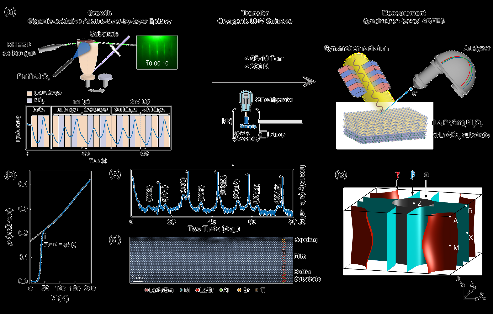
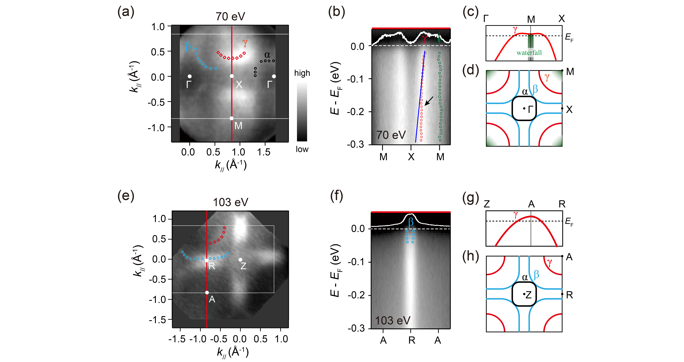
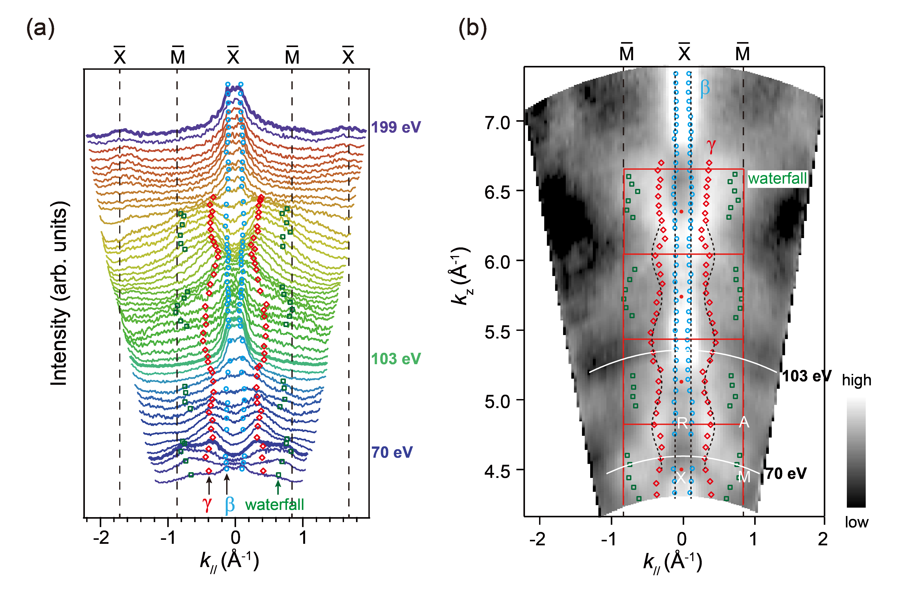
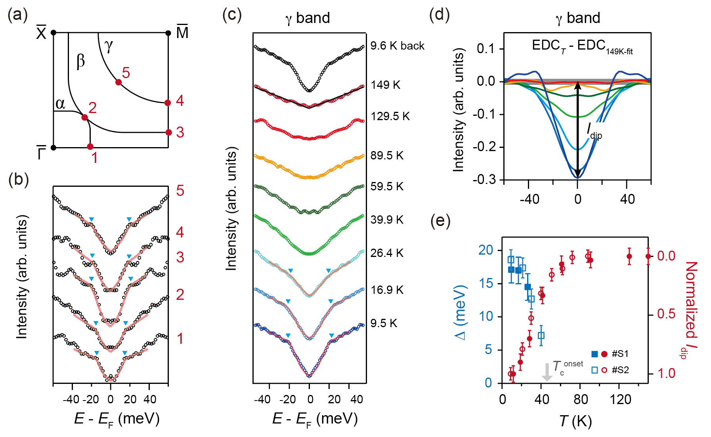
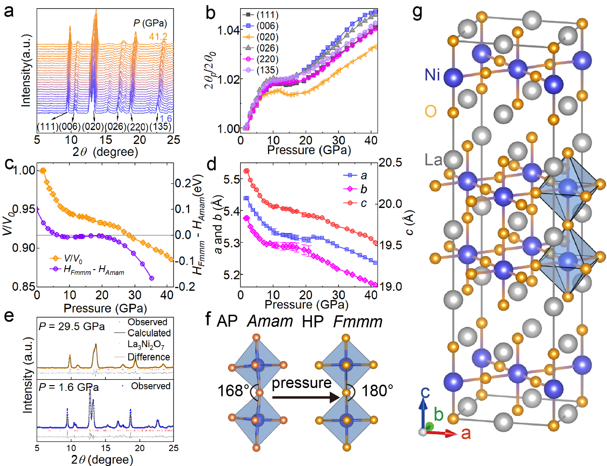
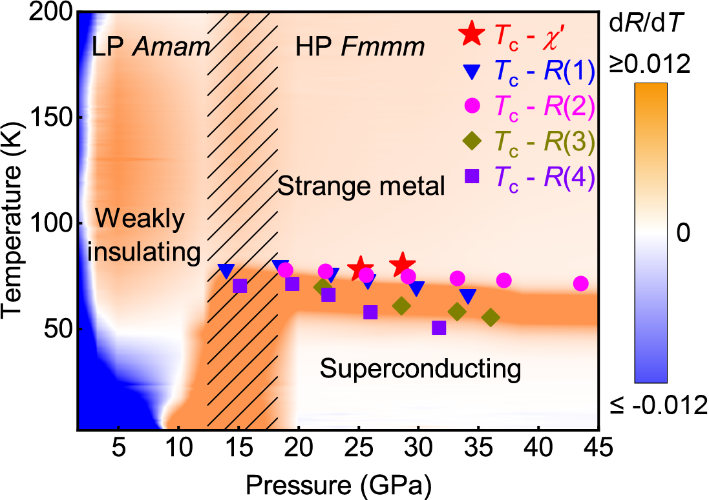
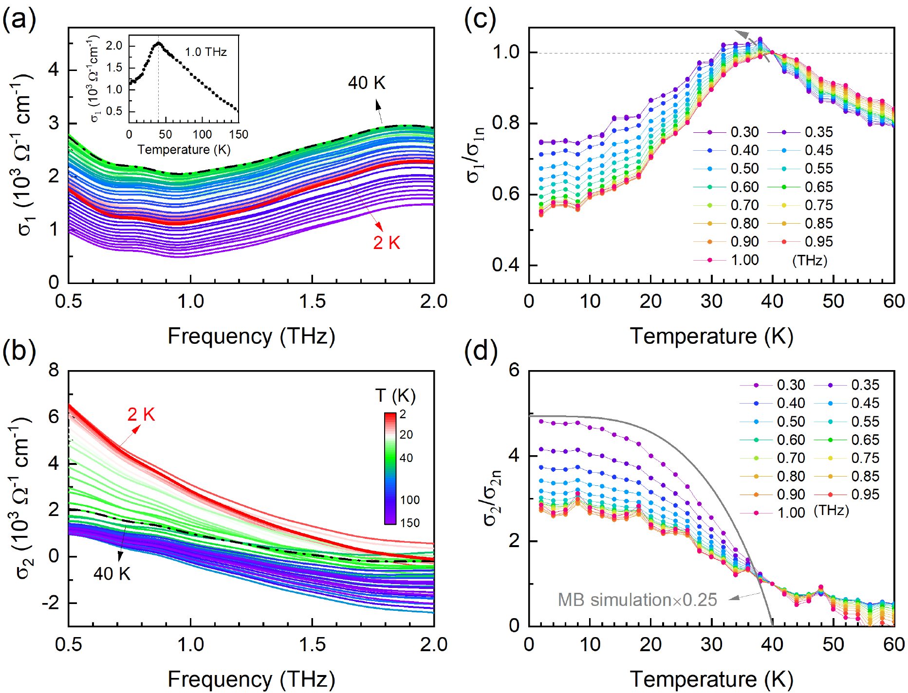
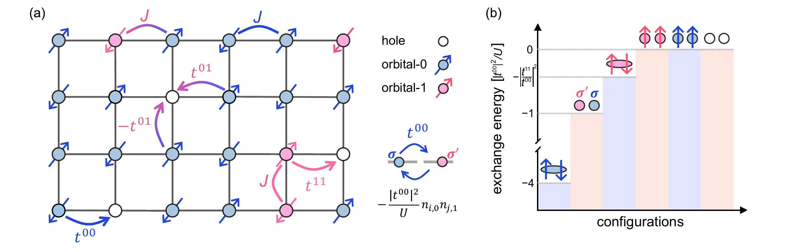
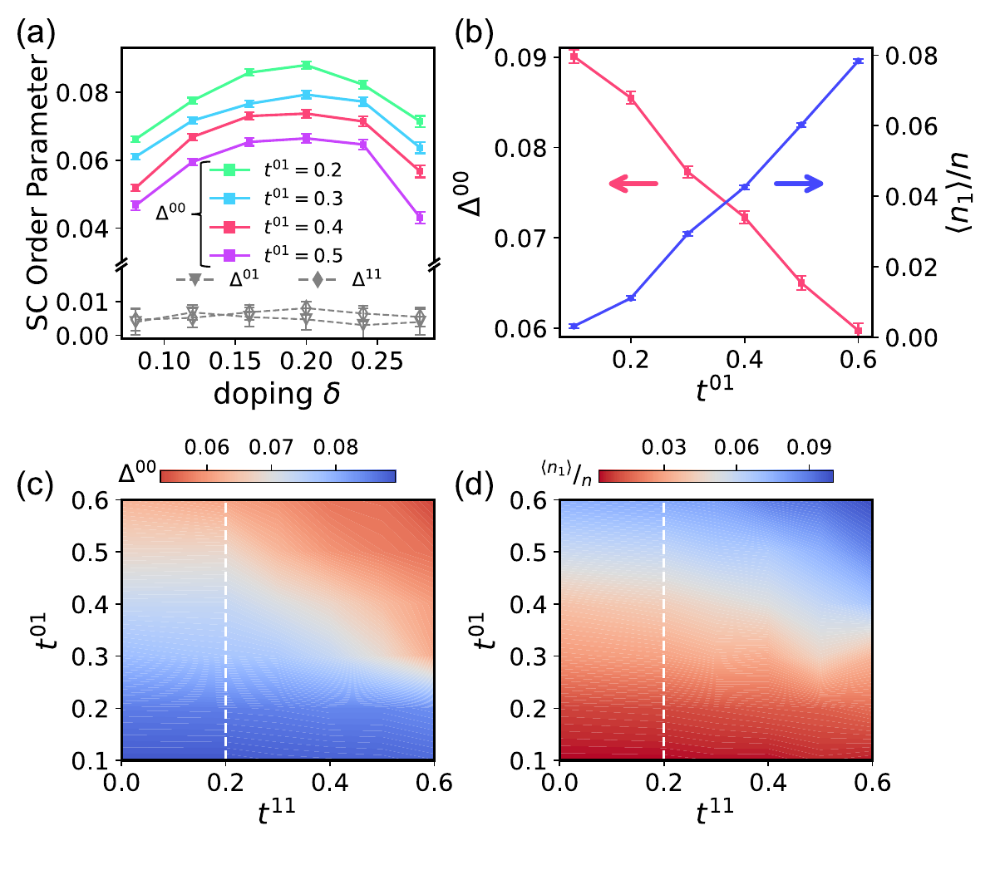

# 二層ニッケル酸化物超伝導体La₃Ni₂O₇の三次元電子構造と超伝導ペアリング機構

- **執筆日:** 2026-04-11
- **トピック:** 二層ニッケル酸化物（La₃Ni₂O₇）薄膜における3D ARPES測定が明らかにしたdz²軌道の三次元分散と強結合超伝導ギャップ
- **タグ:** Superconductivity and Strongly Correlated Systems / Electronic Structure; Thin Films and Interfaces / Synchrotron Measurements; First-Principles Calculations
- **注目論文:** "Three-Dimensional Electronic Structures in Superconducting Ruddlesden-Popper Bilayer Nickelate Films" (arXiv:2604.08430, 2026)
- **参照関連論文数:** 6本

---

## 1. なぜ今この話題なのか

2023年、中国の研究グループが単結晶La₃Ni₂O₇に14 GPa以上の静水圧をかけると転移温度Tc ≈ 80 Kで超伝導が現れることを報告した（arXiv:2305.09586）。液体窒素温度（77 K）を超えるTcを持つ非銅酸化物超伝導体はこれが初めてであり、発見の衝撃は瞬く間に凝縮系物理のコミュニティ全体に広がった。ただし当初の報告では測定の再現性に問題があり、「本当にバルク超伝導なのか、界面やフィラメント的な不均一超伝導ではないか」という根本的な疑問が残った。

状況が大きく変わったのは、エピタキシャル薄膜の登場によってである。SrLaAlO₄基板上に堆積された（La,Pr,Sm）₃Ni₂O₇薄膜が、常圧でTc_onset ≈ 40〜50 Kという超伝導を示すことが相次いで確認された。高圧実験では原子間隔を収縮させることで誘起されていた超伝導が、薄膜では基板との格子ミスマッチから生じる**エピタキシャル歪み（compressive strain）** によって、加圧なしに実現されたのである。これは超伝導研究の実験環境を根本的に変えるものだった。高圧下ではARPES（角度分解光電子分光）、THz分光、中性子散乱など多くの分光法が適用できないが、薄膜であれば原理上すべての実験ツールが使える。

薄膜超伝導の実現後、最大の関心はその**電子構造**と**ペアリング機構**に集まった。La₃Ni₂O₇は二つのNiO₂面が頂点共有酸素を介して積み重なった二層型（bilayer）ルッドレスデン・ポッパー（Ruddlesden-Popper: RP）構造を持ち、Ni の3d軌道のうちdx²-y²とdz²の二軌道が電気伝導を担う。dz²軌道は層間の頂点酸素を通じて強いσ結合を形成するために電子相関が特に強く、フラットバンドを形成することが予測されていた。しかしこの軌道は「超伝導を促進するのか、それとも局在化によって阻害するのか」という本質的な問いに対して、理論と実験の間に意見の食い違いがあった。

2026年4月に公開された注目論文（arXiv:2604.08430）は、放射光ARPESを用いて薄膜La₃Ni₂O₇の三次元（3D）電子構造を系統的に明らかにし、dz²由来バンドが有限のkz分散を持つ三次元的な性格を示すとともに、そこに強結合超伝導ギャップが開いていることを直接観測した。この結果はdz²軌道の役割に関する論争に重要な制約を与えるとともに、ペアリング機構の議論を一段と深めるものとなった。

*図1: 注目論文の実験概要。左から「有機酸化原子層単位エピタキシー（OAALL epitaxy）による薄膜成長」「低温UHV輸送」「放射光ARPES測定」の流れを示す。左下の挿入図には各unit cellのRHEEDオシレーション、中下には抵抗率のT依存性（Tc^onset ≈ 48 K）とXRD、右下には3次元ブリルアンゾーンのスキームを示す。出典: arXiv:2604.08430 (CC BY 4.0)*

---

## 2. この分野で何が未解決なのか

この分野の核心にある問いは、大きく分けて三つに整理できる。

**問い①：dz²軌道は超伝導を促進するのか、それとも阻害するのか？**
理論的には、層間のσ結合を通じたdz²軌道の強いペアリング相互作用が高いTcを生み出すという立場と、dz²軌道の電子が局在化して競合状態を形成しdx²-y²由来の超伝導を抑制するという立場が拮抗している。最近の変分モンテカルロ研究（arXiv:2604.08319）は後者を支持し、dz²軌道の占有を減らすことがTcを向上させると主張する。一方で多軌道CDMFT計算（arXiv:2501.06875）は、ちょうど中間的な相関の強さにおいてdz²軌道が支配的にペアリングを担うs±波状態が実現すると示唆する。注目論文のARPES測定はdz²由来バンドに最大の超伝導ギャップを観測しており、この問いに対して実験的な制約を与えている。

**問い②：ペアリング対称性はs±波かd波か？**
銅酸化物超伝導体（銅酸化物）ではd波ペアリングが確立されているが、ニッケル酸化物ではどちらが正しいのかが大きな争点である。THz非線形分光（arXiv:2604.04421）やCDMFT計算（arXiv:2501.06875）はs±波を支持し、スピン揺らぎによるフェルミ面ネスティング機構を提唱する。これに対し、二軌道t-Jモデルを用いた変分モンテカルロ（arXiv:2604.08319）は軌道選択的d波を示す。注目論文で観測された全バンドへのギャップ開口（2Δ/kBTc ≈ 8という強結合値）は、s±波かd波かを直接判別するものではないが、ペアリングが異常に強いことを示している。

**問い③：薄膜超伝導とバルク高圧超伝導は本質的に同じ状態か？**
薄膜の常圧超伝導（Tc ≈ 40〜50 K）はバルク高圧超伝導（Tc ≈ 80 K）の半分程度しかない。単純にTcが異なるだけなのか、あるいはペアリング機構や電子構造に本質的な違いがあるのか。またバルクの高Tcは均一な超伝導なのか、界面的・フィラメント的な不均一超伝導なのかという再現性問題（arXiv:2311.12361）も残る。圧力印加による外部圧縮と基板起因の格子歪みは似ているように見えるが、構造対称性（バルクAmam → HP Fmmm）の違いが結果を左右する可能性がある。

---

## 3. 注目論文の核心

### 実験手法：in-situ 低温ARPES

注目論文（arXiv:2604.08430）の著者たちが直面した最初の課題は試料の表面劣化であった。ニッケル酸化物薄膜は大気中への曝露で電気特性が急激に悪化するため、従来のex-situ測定ではきれいなARPESスペクトルが得られなかった。論文は**有機酸化原子層単位エピタキシー（OAALL epitaxy）** と呼ばれる独自の成長プロセスと、超高真空（< 5×10⁻¹⁰ Torr）・低温（< 200 K）を維持したまま試料を移送する「UHVスーツケース」を組み合わせ、成長直後の清浄表面で放射光ARPESを測定することを可能にした（図1）。測定には（La,Pr,Sm）₃Ni₂O₇/SrLaAlO₄薄膜が用いられ、抵抗率測定でTc_onset ≈ 48 Kの超伝導転移が確認されている。

### 主要結果①：軌道依存の次元性

ARPESの最大の特徴は運動量空間で電子構造を直接可視化できる点にある。フェルミ面の形状やバンド分散は、物質のトポロジーや相関の強さを直接反映する。通常の2次元的な物質では光子エネルギーhν（すなわちkz）を変えても同じバンドが見えるが、3次元的な分散があるとhνによってバンド位置が変化する。

論文は70〜199 eVの範囲で光子エネルギーを系統的に変えながら測定し、α、β、γの三本のバンドを追跡した。α、β バンド（主にdx²-y²起源）はhνを変えてもフェルミ面の形状が変わらず、**準二次元的な性格**を示した。一方、γバンド（主にdz²起源）はhνに対して顕著な分散を示し、kz方向に約0.2 Å⁻¹の波数シフトが確認された。これは**dz²バンドが三次元的な電子構造**を持つことを意味する。層間のσ結合（Ni-dz²-O_apex-dz²-Ni）が有意に機能しており、単純な積層二次元系ではないことが直接実証された。

*図2: 注目論文の主要ARPES結果。(a) 光子エネルギー70 eVでのフェルミ面マップ（kz ≈ 0に対応、Γ-X-M面）。赤・青・緑の破線でα, β, γバンドのフェルミ面を示す。(b) 70 eVでのM-X-M方向バンド分散。γバンドがフェルミ面付近に見える。"waterfall"はM点付近の高結合特徴を示す。(e) 光子エネルギー103 eVでのフェルミ面マップ（kz ≈ π/c、A-R-Z面）。γバンドの形状が70 eVとは異なり、kz依存性を示す。(f) 103 eVでのA-R方向分散。出典: arXiv:2604.08430 (CC BY 4.0)*

*図3: M点でのkz依存ARPES。(a) 70〜199 eVの光子エネルギーで測定したEDC（エネルギー分布曲線）の積み重ね。β（青丸）は位置がほぼ不変（2D的）、γ（赤丸）は明確にkzとともに移動（3D的）。"waterfall"特徴も示される。(b) kz-k∥マップにβ（青四角）とγ（赤丸）のピーク位置をプロット。γバンドのkz分散が明確。出典: arXiv:2604.08430 (CC BY 4.0)*

### 主要結果②：全バンドへの超伝導ギャップと強結合

次の重要な発見は、超伝導ギャップの観測である。ARPESでは低温でフェルミ準位E_F近傍のスペクトルが対称化（symmetrization）されることで、ギャップの存在と大きさを読み取れる。論文はα、β、γすべてのバンドでフェルミ面の複数のk点において低温でギャップが開くことを確認した。特に注目されるのがγ（dz²由来）バンドのギャップで、温度依存測定から超伝導ギャップΔ ≈ 15〜18 meVが得られた（図4）。

BCS弱結合理論ではギャップと転移温度の間に2Δ = 3.52kBTcという関係が成り立つ。Tc_onset = 48 KとΔ = 18 meVを代入すると2Δ/kBTc ≈ 8.7となり、**弱結合BCSの2倍以上の値**となる。これは強い電子ペアリング（強結合超伝導）を示しており、単純なフォノン機構では説明しにくい。鉄系超伝導体（2Δ/kBTc ≈ 3〜7）と比較しても大きく、銅酸化物の一部と同程度かそれ以上の強い結合である。また、ギャップはTcを超えた温度でも完全にはゼロにならないという兆候も見られ、後述する擬ギャップ（pseudogap）との関連が示唆される。

*図4: 超伝導ギャップの直接観測。(a) フェルミ面上の測定点（1〜5）を示すスキーム。(b) 各k点でのARPESギャップスペクトル（対称化EDC）。α, β, γバンドすべてにギャップが存在。(c) γバンドの温度依存EDC（9.5〜149 K）。低温でギャップが明瞭に見え、約40〜50 Kで消失。(d) 差分EDCからI_dipを定義。(e) Δ(T)の温度依存性（2試料#S1, #S2）。T → Tc でゼロに近づく。Tc_onset ≈ 48 Kに対してΔ ≈ 15〜18 meVが得られ、2Δ/kBTc ≈ 8という強結合比を示す。出典: arXiv:2604.08430 (CC BY 4.0)*

### 主要結果③：waterfall構造と相関の直接証拠

ARPESスペクトルに現れた**waterfall（滝）構造**も重要な知見である。M点付近において、バンドがフェルミ準位から200〜300 meV下方の高結合エネルギー領域で垂直に急峻に落ち込む「滝のような」特徴が観測された。これは銅酸化物超伝導体でも知られる特徴で、電子と光学フォノンまたはスピン励起との強い相互作用（電子-ボソン結合）により自己エネルギーに強い虚数部が生じた結果と解釈されることが多い。銅酸化物と同様の構造がニッケル酸化物でも現れることは、両者の電子相関の強さが類似していることを示唆するとともに、スピン揺らぎを媒介したペアリングという機構の妥当性を高める。

---

## 4. 背景と研究史

### 発見と構造転移

La₃Ni₂O₇の超伝導は、Sun et al. が2023年5月にarXiv（arXiv:2305.09586）に投稿した論文で初めて報告された。Ruddlesden-Popper n=2相であるLa₃Ni₂O₇は常圧では斜方晶Amam対称性を持つが、14 GPa以上の高圧下でより対称性の高い正方晶（Fmmm対称性）へと転移し、この構造転移とほぼ同時に超伝導が現れる（図5）。この転移の鍵はNi-O-Ni結合角で、Amam相では168°程度だったのがFmmm相では180°に近づき、dz²軌道の層間重なり積分（interlayer hopping）が大幅に増大する。第一原理計算はこのタイミングでdz²軌道からなるσ結合バンドが金属化し、超伝導に関与することを示した。

*図5: 発見論文（arXiv:2305.09586）より。(a) 各圧力でのX線回折パターン（積み重ね表示）。14 GPa付近でFmmm相への構造転移が見られる。(b,c) 格子定数と対称性パラメータの圧力依存性。(d) 格子体積と結晶学的秩序パラメータの圧力依存性。(e,f) 詳細なリートフェルト解析。右端(g)は構造模型：La（灰）、Ni（青）、O（橙）。bilayer構造のNiO₂面と頂点酸素、ランタン間層が明確に見える。出典: arXiv:2305.09586 (CC BY 4.0)*

圧力-温度相図（図6）では、低圧側（< 14 GPa）にAmam相の弱絶縁体領域、14 GPa以上にFmmm相が現れ、その中に超伝導とストレンジメタル領域が存在する。Tcは加圧とともにほぼ一定（75〜80 K）で推移し、約40 GPa以上では低下する傾向が見られる。この相図の構造は、圧力を歪みで置き換えた薄膜系にも類推できるが、薄膜では「Fmmm相相当の高対称性構造」が格子整合によって安定化されていると解釈される。

*図6: 発見論文（arXiv:2305.09586）による圧力-温度相図。横軸：圧力（GPa）、縦軸：温度（K）。色はdR/dTを表し、橙色は金属的（dR/dT > 0）、青は絶縁体的。LP Amam相（weakly insulating）、ハッチング領域がHP Fmmm相への転移域、右側に超伝導領域（Superconducting）とストレンジメタル（Strange metal）が示される。赤星は磁化率から得たTc、他の記号は抵抗から得たTc。出典: arXiv:2305.09586 (CC BY 4.0)*

### 再現性問題と不均一超伝導

発見直後からバルク高圧超伝導の再現性が問題視された。arXiv:2311.12361の研究グループはTEM（透過型電子顕微鏡）と電気抵抗測定を組み合わせ、加圧La₃Ni₂O₇の超伝導がフィラメント的（filamentary）な性格を持ち、La₃Ni₂O₇とLa₄Ni₃O₁₀の相界面に局在している可能性を指摘した。また酸素含有量が7.35〜6.89の範囲内でのみ超伝導が安定化し、酸素量の制御が重要であることも示した。この発見はバルク超伝導の主張を弱めるものとして大きく注目された一方、同じグループも含めてその後の研究では均一なバルク超伝導を支持するデータも報告されており、議論は現在も続いている。

薄膜系においても不均一性の問題は残る。La₂PrNi₂O₇薄膜（arXiv:2604.07807）ではゼロ抵抗転移温度がTc ≈ 10 Kと著しく低く、二段階の抵抗転移が観測された。この研究はこれをジョセフソン接合で結合した二種類の超伝導グレインの共存（granular superconductivity）として解釈し、均一なバルク超伝導のためには酸素均一性のさらなる向上が必要であると結論付けた。

### 薄膜ARPESの先行研究

注目論文に先立つ薄膜ARPES研究（arXiv:2309.01148、Nature Communications誌掲載）は、大気移送の制約の下でもある程度の電子構造情報を得ており、dz²起源のフラットバンドがゾーン角（M点）付近にE_Fから約50 meV下方に存在し、特に強い相関を示すことを報告していた。このバンドの準粒子重みZdz² ≈ 0.2（強い波動関数の繰り込み）はdx²-y²のZdx²-y² ≈ 0.5〜0.7と対照的であった。しかし当時の測定ではin-situ低温転写が実現しておらず、表面劣化の影響もあってkz方向の系統測定や低温ギャップ観測は困難だった。注目論文はこれらの制約を完全に克服し、3D電子構造と超伝導ギャップの同時観測を実現した点で大きな前進である。

### CDMFT理論との整合

arXiv:2501.06875のグループはDFT+cRPA+CDMFTを組み合わせた多軌道計算を行い、中間的な相関の強さ（U ≈ 3.6 eV）でのフェルミ面がARPES実験（先行研究）とパラメータ調整なしに定量的に一致することを示した。特に注目すべきは、対称性の観点から薄膜のOctahedral rotation pattern（a⁰a⁰a⁰）がバルク（a⁻a⁻c⁰）と異なることを確認しており、これがdx²-y²バンドの構造に影響することが指摘されている。さらにCDMFT+RPA計算では、dz²軌道間のフェルミ面ネスティングによって引き起こされるスピン揺らぎが**s±波**ペアリングを安定化させることが示されている。

---

## 5. どの解釈が最も妥当か

### s±波ペアリングを支持する証拠

実験面でs±波を最も直接的に支持するのはTHz分光（arXiv:2604.04421）である。（La,Pr）₃Ni₂O₇薄膜に対する線形THz分光では、Tc以下で低周波光学伝導度σ₁(ω)が抑制され、σ₂(ω)が上昇するという典型的な超伝導応答が観測された（図7）。特に注目されるのはTc直下の**弱いコヒーレンスピーク**で、これはs±波超伝導の特徴と整合する。純粋なs波（同符号ギャップ）ならコヒーレンスピークは強く現れるはずだが、s±波では符号反転によりコヒーレンスピークが抑制される。また観測されたロンドン侵入長λ ≈ 620 nmという大きな値は、超流体密度の減少（ペアリング欠如）を示し、d波と区別は難しいが、強い無秩序散乱によるs±波でのペア破壊という解釈と矛盾しない。さらに同論文では非線形THz（第三高調波発生）測定で100 K付近に**擬ギャップ**に由来する異常が観測されており、ノーマル状態においても秩序状態が競合していることを示唆する。

*図7: arXiv:2604.04421 より。(a) 光学伝導度の実部σ₁(ω)の温度依存性（2〜150 K）。Tc以下（赤線が2 K）で低周波成分が減少し、超伝導凝縮を反映。(b) σ₂(ω)は2 Kで急増（超流体成分）。Mattis-Bardeen（MB）理論との比較が示され、有限残留電子密度（65%）がs±波でのペア破壊と整合。(c,d) 規格化した温度依存性。Tc ≈ 40 Kで明確な異常。出典: arXiv:2604.04421 (CC BY-NC-ND 4.0)*

理論面では arXiv:2501.06875（CDMFT+RPA）がs±波を支持し、次のメカニズムを提案している。βフェルミ面（dx²-y²起源）とγフェルミ面（dz²起源）の間のネスティングベクトルQ₁付近でスピン感受率χ(Q₁)が増大し、このスピン揺らぎがβとγの間で反符号のギャップを誘起するs±波ペアリングを安定化させる。このシナリオでは層間のdz²-dz²ホッピングとそこから生まれるγフェルミ面が超伝導の主役を担う。

### d波ペアリングを支持する議論

一方、arXiv:2604.08319の二バンドt-Jモデルによる変分モンテカルロ計算はd波ペアリングが有利という結論に達している（図8）。このモデルでは遍歴性の高いorbital-0（主にdx²-y²）のみに有意なd波秩序パラメータΔ₀₀が現れ、局在的なorbital-1（主にdz²）はΔ₁₁ ≈ Δ₀₁ ≈ 0という軌道選択的な超伝導が実現する。さらに重要なのは、orbital-1の占有率⟨n₁⟩/nを増やすほどΔ₀₀が単調に減少するという知見で、dz²軌道の関与が超伝導を**阻害する**という逆説的な結論である。このモデルではdz²軌道は軌道間密度-密度相互作用（inter-orbital density-density）を通じて「エネルギー欠陥（energy defects）」として働き、コヒーレントなクーパー対形成を乱す。

*図8: arXiv:2604.08319 より。(a) 二軌道t-Jモデルの模式図。青（orbital-0）と桃色（orbital-1）のサイトに分かれており、軌道内ホッピングt⁰⁰とt¹¹、軌道間ホッピングt⁰¹、交換相互作用Jが示される。(b) 各電子配置のエネルギー概念図。orbital-1が「エネルギー欠陥」として超伝導位相コヒーレンスを乱す様子を示す。出典: arXiv:2604.08319 (CC BY 4.0)*

*図9: arXiv:2604.08319 より。(a) ドーピングδを変えたときのd波秩序パラメータΔ₀₀。t⁰¹が大きいほど（orbital-1の関与が大きいほど）Δ₀₀が抑制される。(b) t⁰¹増大とともにΔ₀₀が減少し⟨n₁⟩/nが増加（競合関係）。(c,d) t⁰¹-t¹¹パラメータ空間でのΔ₀₀と⟨n₁⟩/nの2Dカラーマップ：白破線に向かってΔ₀₀が最大化。出典: arXiv:2604.08319 (CC BY 4.0)*

### 注目論文との整合性の検討

注目論文の実験結果（全バンドへのギャップ開口、γバンドの最大ギャップ）はs±波とd波のどちらとも単純には矛盾しないが、解釈の重みは異なる。

s±波解釈との整合点は多い。まず全バンドへの有限ギャップという観測はs±波と一致する（d波でも有限ギャップはあり得るが、線ノードがあると一部のk点でΔ→0になる）。また2Δ/kBTc ≈ 8という大きな値は強結合s±波の予測（例えばArsenides鉄系ではΔ/kBTc ≈ 2〜3.5）よりも大きいが、dz²軌道の強い相関がさらなる有効相互作用を増強しているという解釈は可能である。さらにγ（dz²）バンドに最大のギャップが開口することはCDMFT計算が予測するdz²の主役という描像と整合する。

d波解釈との比較では、t-Jモデルでの理論（arXiv:2604.08319）がdz²の関与を有害と見なすのに対し、実験ではγバンドに最大ギャップが観測されており、表面的な矛盾がある。ただしt-Jモデルはdx²-y²主体のd波を予測しており、もしγバンドのギャップが「競合相互作用による誘起ギャップ」（軌道間誘起）であれば完全な矛盾とはならない可能性もある。しかしこの解釈は現状では間接的である。

**最も妥当な解釈**として現時点では、(1) dz²軌道が強い層間結合を持ち超伝導に積極的に関与していること、(2) ペアリング対称性はスピン揺らぎ媒介のs±波が有力候補であること、(3) ただし強結合比2Δ/kBTc ≈ 8は弱結合BCS理論を大きく外れており、電子相関の強さを正確に取り入れた理論が必要であること、という立場がデータと最も整合的であると判断される。d波の可能性は理論的には残るが、現状の実験的証拠の重みはs±波寄りである。

### 擬ギャップと競合秩序

THz非線形測定で100 K付近に観測された擬ギャップ的な応答は、銅酸化物超伝導体との興味深い類比を示す。銅酸化物では超伝導転移温度よりはるかに高い温度から擬ギャップが開き、電荷密度波や電荷秩序との競合が議論される。ニッケル酸化物でも同様の競合秩序の存在が示唆される。時間分解光学分光（arXiv:2604.02843）では1.8 eVと2.4 eVの二つのバンド間遷移に54 meVと67 meVという二種類の密度波的ギャップが観測されており、超伝導と共存または競合する密度波秩序の可能性を示唆している。これらの「秩序の競合」がTcを制限している可能性も否定できない。

---

## 6. 何が一般化できるのか

### ルッドレスデン・ポッパー系列の縦断比較

La₃Ni₂O₇（RP n=2）に対し、La₄Ni₃O₁₀はRP n=3相に対応する三層ニッケル酸化物であり、こちらも加圧下で超伝導を示す（Tc ≈ 20〜30 K）。arXiv:2604.04643はLa₄Ni₃O₁₀のRIXS（共鳴非弾性X線散乱）測定を行い、軌道励起エネルギーはLa₃Ni₂O₇と同程度だが集団スピン励起のスペクトル重みが有意に抑制されていることを示した。スピン励起の重みの差がTcの差（bilayer: 80 K vs trilayer: 20〜30 K）と相関している可能性を示しており、スピン揺らぎの強さとTcが連動しているという s±波シナリオを傍証する。このRP系列の体系的な比較は「層数が増えると相関・スピン揺らぎ・Tcはどう変化するか」という設計原理を導ける可能性がある。

### 銅酸化物との類比と相違点

La₃Ni₂O₇と銅酸化物（高温超伝導体）の比較は避けて通れない。共通点として、両者は遷移金属酸化物の層状構造を持ち、dx²-y²軌道が重要な役割を果たし、強い電子相関を示し、waterfall構造や擬ギャップが観測される。一方で相違点もある。銅酸化物はdx²-y²単一軌道の多体問題であるが、La₃Ni₂O₇は本質的にdx²-y²とdz²の二軌道問題であり、層間ホッピングがdz²を通じて実現されることが構造的な特異性となっている。また銅酸化物のTcは最大で134 K（HgBa₂Ca₂Cu₃O₈₊δ）に達し、やはりニッケル酸化物より高い。この差が単にキャリア濃度や構造の問題か、それとも電子相関の性質の違いかは未解明である。

### 薄膜工学と圧力工学の等価性

薄膜研究（arXiv:2603.29531）は（La,Pr）₃Ni₂O₇薄膜に外部圧力を加えると、Tcが62 K（常圧）から68.5 K（2.0 GPa）へと上昇することを示した。さらに圧力印加で「抵抗ディップ」（超伝導転移前の局所的抵抗増大）が消滅し、酸素欠陥による電子局在の解消が示唆された。基板歪みとその上に乗せた外部圧力の組み合わせによってTcを制御できるという知見は、薄膜の超伝導をチューニングする新しい手段を示す。また外部圧力でTcが上昇したとき構造が高圧バルクのFmmm相に近づいているとすれば、薄膜と高圧バルクの超伝導が同じ機構に従うという描像を強化する。

### デバイス応用への展開

薄膜での常圧超伝導の実現は、デバイス応用に向けた大きな一歩である。ジョセフソン接合、超伝導量子ビット、単一光子検出器、超伝導配線などの応用にはウェーハスケールの超伝導薄膜が必要であり、La₃Ni₂O₇系はRP型の多層構造を持つ故に界面エンジニアリングによる機能制御（例えば電場によるペアリング対称性切り替え：arXiv:2604.07185）という新しい方向性も提示している。ただし現時点では均一な超伝導層の再現性の問題と、低Tcの問題（薄膜では最大50 K程度）が応用を制限しており、材料品質の向上が最優先課題である。

---

## 7. 基礎から理解する

### ルッドレスデン・ポッパー構造とは

ルッドレスデン・ポッパー（Ruddlesden-Popper: RP）構造は化学式A_n+1B_nO_3n+1で表される層状ペロブスカイト型構造の一群である。ここでAはランタノイド・アルカリ土類元素、BはNiやCuなどの遷移金属、nは一つのブロック内のBO₂面の枚数を表す。n=1ではLaNiO₃のような単層型（La₂NiO₄がその代表）、n=2では二層型（La₃Ni₂O₇）、n=3では三層型（La₄Ni₃O₁₀）に対応する。n→∞では無限層ペロブスカイトLaNiO₃に収束する。

La₃Ni₂O₇ではNi原子が正方形頂点を共有した酸素八面体（NiO₆）の中心に座り、二枚のNiO₂面が「頂点共有酸素（apical oxygen）」を挟んで二層となったブロックが、LaO層によって積み重なっている。この頂点酸素はNi-O-Ni結合を通じてdz²軌道間の強い直接的σ結合を可能にする。常圧Amam相ではNi-O-Ni角が168°程度であり、この歪みがdz²のσ結合を部分的に阻害している。14 GPa以上のFmmm相（または歪み薄膜）ではNi-O-Ni ≈ 180°に近づき、dz²の層間ホッピングt_⊥が大幅に増大する。

### ARPES原理とkz測定

ARPESは光電効果の逆問題として、固体から放出される光電子のエネルギーEkとそれが運動量空間上のどの点から来たかを同時に測定することで、電子のバンド構造E(k)を直接可視化する手法である。二次元物質であれば面内の波数kx, kyは光電子の放出角から直接決まる。一方、垂直方向の波数kzは（内部ポテンシャルV₀の仮定のもと）次式で求められる：

$$k_z = \frac{1}{\hbar}\sqrt{2m(E_k\cos^2\theta + V_0)}$$

ここでθは表面法線方向からの放出角、mは自由電子質量である。光子エネルギーhνを変えるとEkが変わりkzが変化するため、異なるhνで測定することで三次元のブリルアンゾーンを探索できる。内部ポテンシャルV₀は典型的に10〜20 eVであり、実験的に決定する必要がある。

kzに対してバンドエネルギーが変化する場合（3次元分散）は層間の電子ホッピングが有効であることを意味し、kzに対して変化しない場合（2D的）は層間ホッピングが弱いことを示す。注目論文でdz²バンド（γ）がkzに対して顕著な分散を示し、dx²-y²バンド（β）が変化しないというコントラストは、この原理に基づいて二つの軌道の「次元性」の違いを直接示したものである。

### 二バンドモデルと層間ホッピング

La₃Ni₂O₇の最低エネルギーモデルは、各Ni サイトにdx²-y²とdz²の二軌道を持つ bilayer Hubbard モデルである。Hamiltonian は概略的に：

$$H = -\sum_{i,j,\sigma,\mu} t^{\mu\mu'}_{ij} c^\dagger_{i\mu\sigma} c_{j\mu'\sigma} + U \sum_{i,\mu} n_{i\mu\uparrow} n_{i\mu\downarrow} + V \sum_{i} n_{i,dz^2} n_{i,dx^2-y^2} + \text{(層間項)}$$

ここでμ, μ'は軌道指標（dz², dx²-y²）、tは各ホッピング積分、Uはオンサイトクーロン相互作用、Vは軌道間相互作用である。特に重要なのは層間ホッピングt_⊥で、これはdz²軌道を介したNi-O-Ni経路によって与えられる。圧力や歪みでNi-O-Ni角が180°に近づくにつれてt_⊥が増大し、フェルミ面のγポケットが形成されてスピン揺らぎによるネスティングが強まる、というのがs±波シナリオの骨格である。

### s±波とd波ペアリングの対称性

超伝導ギャップΔ(k)は Cooper 対の内部波動関数を記述する。s波ではΔ(k) = const（全k点で同符号）、s±波では二つのバンド間でギャップが反符号（Δ_α > 0, Δ_β < 0）、d_{x²-y²}波ではΔ(k) = Δ₀(cos kx - cos ky) で成分k上にライン・ノード（ギャップがゼロになる線）を持つ。

実験的な判別手段として：(1) ARPESでギャップの波数依存性を直接測定、(2) THz分光でコヒーレンスピークの有無（s±波では弱い）、(3) 準粒子散乱（ARPES線幅、NMR 1/T₁T）の温度依存性、(4) 磁束量子化やアンドレーフ反射分光などがある。注目論文は全バンドにギャップを観測しているが、ギャップの符号（正/負）まではARPESで直接決定できないため、s±波かd波かの最終判断にはさらなる実験が必要である。

---

## 8. 専門用語の解説

**ルッドレスデン・ポッパー（Ruddlesden-Popper: RP）構造** : A_{n+1}B_nO_{3n+1}の化学式を持つ層状ペロブスカイト。Bサイト遷移金属を含むBO₂面がn枚積層したブロックがAO層で区切られる。n=2のLa₃Ni₂O₇では二層NiO₂ブロックと2層LaO層が繰り返す。層数nが超伝導特性を強く左右する。

**ARPES（角度分解光電子分光）** : 試料に紫外線・X線を照射し放出された光電子の運動エネルギーと角度を測定することで、電子のバンド構造E(k)を直接観測する手法。同期放射光（シンクロトロン）を使うことでエネルギー分解能・運動量分解能が飛躍的に向上し、フェルミ面形状・バンド分散・超伝導ギャップを可視化できる。

**dz²軌道とdx²-y²軌道** : Ni原子の3d軌道のうち、dx²-y²は面内のx軸・y軸方向に張り出し隣のNi-O-Niの面内ホッピングを担う。dz²はz軸（層間）方向に張り出し頂点酸素を介した層間σ結合に寄与する。La₃Ni₂O₇では両方がフェルミ準位付近にあり、二軌道系として振る舞う点が無限層ニッケル酸化物と本質的に異なる。

**エピタキシャル歪み（エピタキシャルストレイン）** : 薄膜が基板と格子定数の違いによりコヒーレント成長するとき生じる面内の引張または圧縮応力。La₃Ni₂O₇ / SrLaAlO₄系では薄膜が基板から面内圧縮を受け、面垂直方向に伸びることでNi-O-Ni角が180°に近づく。このことが高圧下と類似した電子構造を常圧で実現する鍵となる。

**強結合比 2Δ/kBTc** : 超伝導ギャップΔと転移温度Tcから算出するペアリング強度の指標。BCS弱結合理論では2Δ/kBTc = 3.52が予測される。La₃Ni₂O₇薄膜で観測された2Δ/kBTc ≈ 8は強い電子-ボソン（スピン揺らぎまたはフォノン）相互作用を意味し、単純な弱結合機構では説明できない。

**s±波（s-plusminus wave）** : 符号反転s波対称性。複数バンドの超伝導でギャップΔが一部のバンドで正、他のバンドで負になる状態。マルチバンド系でのスピン揺らぎネスティングによって安定化される。フェルミ面β（dx²-y²）とγ（dz²）のネスティングによる媒介がLa₃Ni₂O₇で提案されている。コヒーレンスピーク消失、対称性破れによる節なしギャップが特徴。

**waterfall構造** : ARPESで高結合エネルギー側（フェルミ準位から200〜400 meV下方）においてバンドが運動量依存性を失いほぼ垂直に急峻に落ち込む特徴。電子-ボソン相互作用による自己エネルギーの大きな虚数部が原因とされ、強い相関の指標の一つ。銅酸化物超伝導体でも同様の特徴が観測される。

**擬ギャップ（pseudogap）** : 超伝導転移温度Tcよりはるかに高い温度（例えば数百 K）において、スピン励起スペクトルや光学応答にギャップ的な抑制が現れる現象。銅酸化物超伝導体で有名であり、前駆超伝導（位相コヒーレンスなし）、電荷密度波、軌道秩序など複数の解釈が提案されている。La₃Ni₂O₇でも100 K付近でTHzの非線形応答に擬ギャップ的異常が観測され、注目を集めている。

**変分モンテカルロ法（VMC）** : 多体系の基底状態を試行波動関数のパラメータ空間で最小エネルギーを求める量子モンテカルロ手法。Gutzwiller投影を組み合わせることで強相関系でのペアリング対称性を信頼性高く議論できる。t-Jモデルと組み合わせてLa₃Ni₂O₇の軌道選択的d波を示したarXiv:2604.08319で用いられた手法。

**動的平均場理論（DMFT）** : 格子モデルの多体問題をAnderson不純物モデルに写像して自己無撞着に解く計算手法。空間的な量子揺らぎは無視するが局所的な量子揺らぎ（時間方向相関）を厳密に扱えるため、中間〜強相関系に有効。クラスター拡張（CDMFT）では短距離の空間相関も取り込める。arXiv:2501.06875ではDFT+CDMFT計算でLa₃Ni₂O₇の実験フェルミ面を定量的に再現した。

**フィラメント的超伝導（granular/filamentary superconductivity）** : 超伝導が試料全体に均一に存在するのではなく、超伝導グレイン（粒子）がジョセフソン接合で連結するか、細い超伝導フィラメントが試料を貫く形で現れる状態。バルク抵抗はゼロになれるが磁化率（Meissner効果）は弱い。La₃Ni₂O₇の初期高圧実験では再現性問題からこの描像が提唱された。

---

## 9. 今後の展望

現時点でかなり確からしくなったこととして、まずLa₃Ni₂O₇の薄膜系ではdz²軌道由来のγバンドが明確に三次元的な分散を持ち、かつ全バンドの中で最大の超伝導ギャップ（Δ ≈ 15〜18 meV、2Δ/kBTc ≈ 8）を持つことが注目論文によって直接実証された。この事実はdz²軌道が超伝導に本質的に関与していることを示しており、単純なdx²-y²単一バンドモデルによる記述を排除する。また、THz分光やCDMFT計算との整合性からペアリング対称性はs±波が有力候補であるという立場が理論・実験の両面から支持を集めている。さらに薄膜における超伝導発現がバルク高圧超伝導と共通のメカニズムに従うという描像も、圧力印加でTcが連続的に上昇することや電子構造の類似から蓋然性が高い。

一方で重要な未解決事項も多く残る。最優先課題はペアリング対称性の実験的確定で、ARPESによるギャップの符号決定、中性子散乱や核磁気共鳴（NMR）による準粒子散乱の温度依存性測定、トポグラフィ（走査トンネル顕微鏡、STS）による実空間ギャップイメージングが有効であろう。またdz²軌道が超伝導を「担う」のか「阻害する」のかという問いに対しては、歪み・ドーピング・電場などによるγバンドの選択的チューニング実験が決定打になりうる。THz非線形応答で観測された擬ギャップ（100 K）の正体解明と、それが超伝導との競合か前駆かの判定も重要な課題である。今後1〜3年で特に注目されるのは、(1) 中性子散乱によるスピン揺らぎの直接観測とそのdoping・圧力依存性、(2) STS/STMによる実空間超伝導ギャップの可視化（s±波ならギャップ内ボーアー準位に特徴的なパターンが現れる）、(3) RP n=1〜3系列の電子構造比較による設計原理の抽出、である。バルク高圧超伝導のTcが80 Kであるのに対し薄膜では50 K程度に留まっている原因の解明も、材料設計の観点から急務である。

---

## 参考論文一覧

1. **arXiv:2604.08430** (2026) — [Three-Dimensional Electronic Structures in Superconducting Ruddlesden-Popper Bilayer Nickelate Films](https://arxiv.org/abs/2604.08430)  
   本記事の注目論文。薄膜（La,Pr,Sm）₃Ni₂O₇でin-situ低温ARPES測定を実施し、dz²バンドの三次元的kz分散と強結合超伝導ギャップ（2Δ/kBTc ≈ 8）を初めて直接実証した。

2. **arXiv:2305.09586** (2023) — [Superconductivity near 80 Kelvin in single crystals of La₃Ni₂O₇ under pressure](https://arxiv.org/abs/2305.09586)  
   La₃Ni₂O₇単結晶でのTc ≈ 80 Kの高圧超伝導を初めて報告した発見論文。構造転移（Amam → Fmmm）と超伝導の相関を示す圧力-温度相図を確立した。

3. **arXiv:2311.12361** (2023) — [Investigations of key issues on the reproducibility of high-Tc superconductivity emerging from compressed La₃Ni₂O₇](https://arxiv.org/abs/2311.12361)  
   バルク高圧超伝導の再現性問題を取り上げ、フィラメント的超伝導・界面局在・酸素量依存性を指摘した。均一バルク超伝導の条件を制約する。

4. **arXiv:2501.06875** (2025) — [Correlated electronic structures and unconventional superconductivity in bilayer nickelate heterostructures](https://arxiv.org/abs/2501.06875)  
   DFT+cRPA+CDMFT計算により薄膜フェルミ面を実験と定量一致させ、dz²軌道の強相関（Z ≈ 0.2）とs±波ペアリング（スピン揺らぎネスティング機構）を提案した。

5. **arXiv:2604.08319** (2026) — [Orbital-Selective d-wave Superconductivity in the Two-Band t-J Model: Possible Applications to La₃Ni₂O₇](https://arxiv.org/abs/2604.08319)  
   二軌道t-Jモデルの変分モンテカルロ計算で軌道選択的d波超伝導を示し、dz²軌道の占有率増大が超伝導を阻害するという反直感的な知見を提示した。

6. **arXiv:2604.04421** (2026) — [Multimodal Terahertz Spectroscopy of the Pairing Symmetry and Normal-State Pseudogap](https://arxiv.org/abs/2604.04421)  
   THz線形・非線形分光で薄膜La₃Ni₂O₇の超伝導応答とs±波の兆候、100 K付近の擬ギャップ的異常を観測した。ペアリング対称性を非接触で探る実験的アプローチ。

7. **arXiv:2604.02843** (2026) — [High-energy electronic excitations in La₃Ni₂O₇ by time-resolved optical spectroscopy](https://arxiv.org/abs/2604.02843)  
   時間分解光学分光で1.8 eV・2.4 eVの二つのバンド間遷移に密度波的ギャップを観測し、フォノン結合との複雑な相互作用を明らかにした。超伝導と共存する密度波の可能性を示唆。

