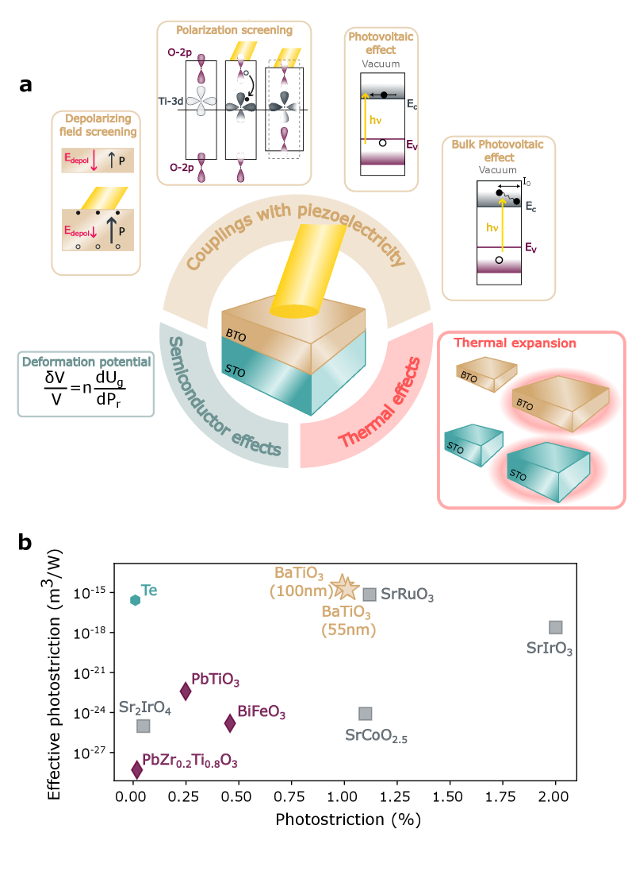
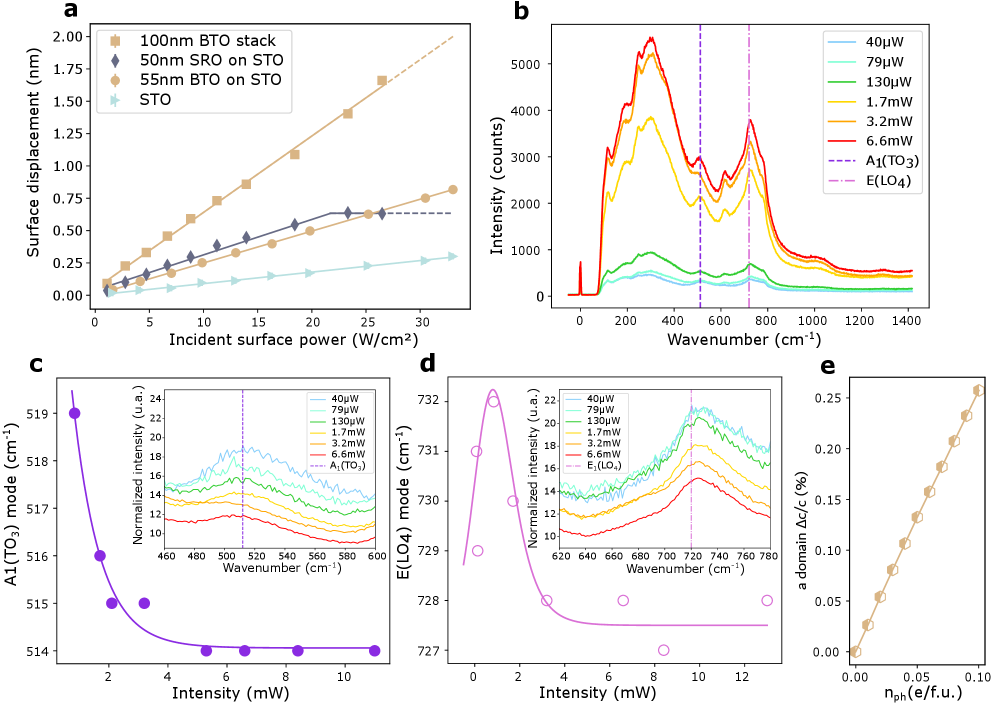
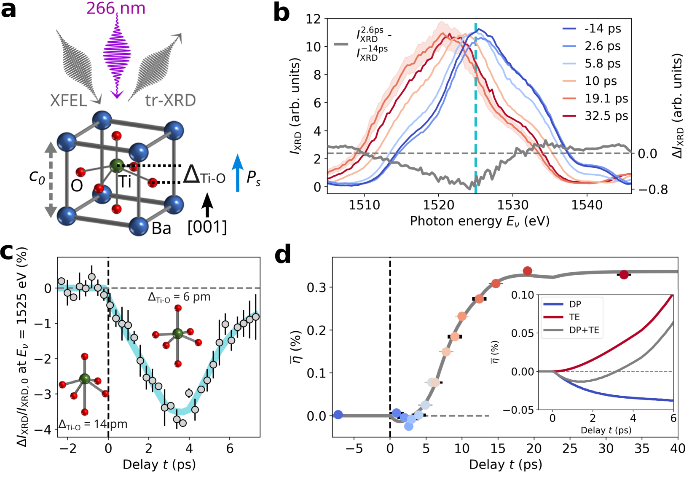
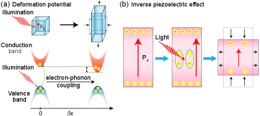
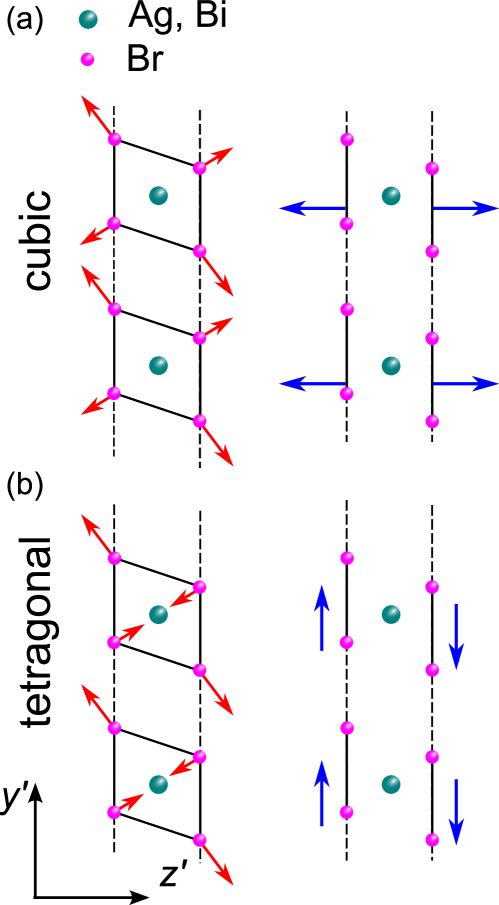

# 強誘電体の光歪みを支配するメカニズム：BaTiO₃における熱化キャリアスクリーニングの確立

- **執筆日**: 2026-04-11
- **トピック**: photostriction-BaTiO3-thermalized-carriers
- **タグ**: Multiphysics and Coupled Phenomena / Coupled-Field Response; Nonequilibrium Phase Transitions / First-Principles Calculations; Pump-Probe Measurements
- **注目論文**: Vitali-Derrien et al., "Giant photostriction in lead-free ferroelectric stemming from photo-excited thermalized carriers," arXiv:2604.08218 (2026)
- **参照関連論文数**: 6

---

## 1. なぜ今この話題なのか

光を当てるだけで材料が変形する——この「光歪み効果（フォトストリクション）」は、ワイヤレスアクチュエーターや光駆動センサー、マイクロ・ナノスケールの機械システムへの応用が期待される魅力的な現象だ。とりわけ強誘電体薄膜を用いた光歪みデバイスは、電気接点を必要としない非接触駆動が可能であり、医療用マイクロロボットや宇宙用精密構造物など、従来の電気的アクチュエーターが届かない環境での活用が期待されている。

強誘電体（ferroelectric）は自発分極をもつ誘電体材料であり、電場や応力を加えることで分極方向が反転する。その代表格であるチタン酸バリウム **BaTiO₃（BTO）** は、室温でペロブスカイト構造をとり、強い圧電性（piezoelectricity）をもつ。圧電効果とは、外部応力によって電気分極が生じる（または逆に電場により変形が生じる「逆圧電効果」）現象である。光を当てて電子正孔対を生成すると、その電荷が強誘電体の分極を部分的に「遮蔽（スクリーニング）」し、分極量が変化した分だけ逆圧電効果を介して格子変形が生じる——これが光歪みの最も直感的な描像の一つだ。

しかし実際には、光歪みを生じさせうるメカニズムは複数あり、「どのメカニズムが主役なのか」が長年の論争点となってきた。バルク光起電力効果（BPVE: Bulk Photovoltaic Effect）＋逆圧電効果なのか、熱膨張なのか、それともキャリアが格子に与える電子的圧力（変形ポテンシャル）なのか——この問いへの答えは材料系によって異なり、普遍的な設計原理の確立を阻んでいた。

こうした状況を大きく動かしたのが、2026年4月にarXivに投稿されたVitali-Derrienらの論文 [2604.08218] である。彼らはエピタキシャルBaTiO₃薄膜において強誘電体中で最大となる約1%の光誘起歪みを達成し、その起源が**熱化した光励起キャリアによる分極スクリーニング**にあることをDFT計算を含む複数の手法で示した。このトピックは、強誘電体フォトストリクションの機構論争に一定の決着をもたらすとともに、鉛フリー材料による高性能光歪みデバイスへの道を開く意義をもつ。

*図1: (a) 光歪みの微視的メカニズムの模式図。(b) 各種無機薄膜の光歪みフィギュア・オブ・メリット比較。BaTiO₃（ベージュ星印）が他材料を圧倒することがわかる。[arXiv:2604.08218, CC BY 4.0]*

---

## 2. この分野で何が未解決なのか

### 問い①：光歪みの「主役メカニズム」は何か？

光を当てた強誘電体が変形するメカニズムとして、現在まで三つの主要経路が提唱されている。

第一は、**バルク光起電力効果（BPVE）＋逆圧電効果**モデルである。非中心対称な結晶構造をもつ強誘電体では、光照射によりバンドギャップを超えた「ホット（熱化前）キャリア」が非対称な運動量をもち、接合なしに電流（光起電力電流）が生じる。生成された光起電力電圧が逆圧電効果を駆動して格子変形をもたらすとするこのモデルは、BiFeO₃での巨大光歪みを説明する主流モデルとされてきた。

第二は、**変形ポテンシャル**（deformation potential）機構である。電子が励起されることで、平衡格子定数を変化させる「電子的圧力」が生じる。半導体一般に存在するこの効果は、BPVEとは独立であり、強誘電的な分極の有無に依存しない。

第三が、**熱化キャリアによる分極スクリーニング＋逆圧電効果**モデルである。光吸収で生じた電子・正孔がフォノン散乱によってバンドの底・頂点付近に「熱化」した後、その空間電荷が強誘電分極を部分的に遮蔽し、自発分極量が減少する。この分極の減少が逆圧電効果を通じて格子歪みを生む。

どのメカニズムが「主役」かは材料ごとに異なると考えられており、BaTiO₃については長らく不明確だった。

### 問い②：どの材料・構造が最大の光歪みを与えるか？

BiFeO₃はBPVEが大きく長らく光歪みの主材料とされてきたが、バンドギャップが比較的小さく可視光吸収効率は高い反面、鉛を含まないが毒性のある bismuth を含む。鉛フリー・環境負荷低減の観点からBaTiO₃が候補として浮上するが、BaTiO₃薄膜での光歪みは有機・無機ハライドペロブスカイトより小さいとされていた。この認識を覆す証拠が今回の研究で示された。

### 問い③：「超高速」と「定常」の光歪みは同じ現象か？

フェムト秒レーザーを用いた超高速ポンプ—プローブ実験では、光励起後350 fsという極めて短い時間で分極と歪みが「解結合」することが見出されている [2503.19808]。これは、光に瞬間的に変形する「超高速フォトストリクション」の存在を示唆するが、この現象と連続光（CW）もしくはゆっくりした変調光による「準定常的なフォトストリクション」が同じメカニズムで理解できるかは自明でない。

---

## 3. 注目論文の核心

### 何を示したのか

Vitali-Derrienら [2604.08218] は、パルスレーザー堆積法（PLD）によってSrTiO₃基板上にエピタキシャル成長させたBaTiO₃薄膜（厚さ約200 nm）を対象に、光励起による格子変形を高感度干渉計で計測した。405 nm（可視光）ポンプレーザーを10 Hzで変調しながら照射し、594 nmプローブレーザーの干渉縞変化から表面変位をサブナノメートルの精度で測定した。

### 主要結果

最大の特徴は、光誘起歪みが**約1%**に達したことだ。これは強誘電体材料中で最大の光歪み値であり、これまでのBaTiO₃に関する報告値（～10⁻⁴）の実に数十倍に当たる。有効フォトストリクション係数は3×10⁻¹⁵ m³/Wに達し、BiFeO₃を含む他の酸化物薄膜を大きく上回る（図1b参照）。

次に重要なのは、この巨大光歪みが**熱起源ではない**という証拠である。照射中の試料温度上昇はわずか6 mKに過ぎず、熱膨張で説明できる変形量（～10⁻⁵程度）を遥かに超えることが確認された。

また、光起電力電圧は約1Vが計測されたが、これをBPVE経由の逆圧電効果として解釈した場合に予想される歪み量は実際の観測値より1〜2桁小さい。すなわち、BPVEが主役ではないことが定量的に示された。

### 提案メカニズムとDFT支持

著者らが提案するのは「**熱化キャリア（thermalized carriers）スクリーニング機構**」である。光吸収によって生成されたホットキャリアは、数ピコ秒以内にフォノン放出により「熱化」し、バンドの底・頂点付近に分布する。この熱化キャリア（電子と正孔）が正味の空間電荷として機能し、BaTiO₃の自発分極（～26 μC/cm²）を部分的に遮蔽する。自発分極が減少すると、Tiイオンの変位量（c軸方向の偏りがBaTiO₃の正方晶歪みを生む）が減少し、逆圧電効果を通じてc軸が変化する——これが観測された大きな格子変形の正体だというわけだ。

密度汎関数理論（DFT、ABINITコード）を使った計算では、キャリア密度の増加とともにBaTiO₃のc軸格子定数が変化するトレンドが実験結果と良好に一致した（図3e参照）。

### 何が前進したか

以前の研究では、BaTiO₃薄膜での光歪みはそれほど大きくないと考えられており、BiFeO₃やハライドペロブスカイトが光歪み材料の主役だった。今回の研究は、（i）薄膜の品質（エピタキシャル成長・単ドメイン化）と（ii）適切な励起条件（連続的または低周波変調の照射）が揃えば、BaTiO₃でも巨大な光歪みが実現できることを示した。また、機構論として「BPVE主導」ではなく「熱化キャリアスクリーニング主導」であるという明確な立場を示したことも重要な前進である。

*図2: (a) レーザー強度に対する光誘起表面変位の実験値。(b-d) 各ラマンモードのシフト（レーザー強度依存）。(e) DFT計算による格子定数変化と光励起キャリア密度の関係。[arXiv:2604.08218, CC BY 4.0]*

---

## 4. 背景と研究史

### 光歪み研究の系譜

強誘電体の光歪みに関する系統的研究は1990年代のPZT（チタン酸鉛ジルコニウム）セラミックスや鉛を含む修飾PLZT（ランタン置換PZT）を対象とした実験に遡る。当時から「BPVE＋逆圧電」モデルが支配的だったが、光照射時の熱的効果との分離が難しく、定量的な議論は限られていた。

強誘電体の光歪み研究に大きな転換をもたらしたのは、2010年代のBiFeO₃を対象とした超高速研究だった。Lejmanらは2014年にNature Communicationsで、BiFeO₃にフェムト秒レーザーを照射したときの超高速光歪み（剪断歪み）を報告し、光起電力電流とのタイミング関係から「超高速BPVEが光歪みを駆動する」という描像を確立した。一方でKundysらはBiFeO₃単結晶での光誘起寸法変化を報告し、光歪みがデバイス応用に耐えうる規模（ミクロン単位）に達しうることを示した。

BaTiO₃については、Zenkevichら（2014, Phys. Rev. B）がナノ薄膜でのバルク光起電力効果を報告したが、光歪みは10⁻⁴程度に留まっていた。Weiらは2017年にSrRuO₃での光歪みを報告するなど、酸化物全体で光歪み研究が広がった。

### 超高速ダイナミクスが明かした新知見

BaTiO₃を巡る重要な先行研究として、Hoangらの2025年の論文（Nature Communications）[2503.19808] がある。彼らはフェムト秒レーザーによるバンドギャップ以上の光励起後、**わずか350 fsで分極と格子歪みが「解結合」する**ことをX線回折と第二高調波発生（SHG）偏光解析の組み合わせで実証した。このとき、Ti-O結合が光励起電子によって軟化し、格子の変形なしに分極が変化しうることが明らかになった（図3参照）。

*図3: 超高速X線回折とSHG解析によるBaTiO₃の時間分解動力学。光励起後350 fs以内に分極と格子変形が解結合する様子が示されている。[arXiv:2503.19808, CC BY 4.0 / Nature Communications]*

この結果は、「光励起直後のダイナミクス（超高速regime）」と「熱化キャリアが支配する準定常的な光歪み（slow regime）」が本質的に異なる物理を反映している可能性を示唆する。[2503.19808] では、ホットキャリアが存在する初期の段階では歪みなしに分極変化が起き、その後キャリアが熱化してからは分極スクリーニングを介した歪みが発達すると理解できる。これは注目論文 [2604.08218] が説明する「熱化キャリア主導」という枠組みと矛盾せず、むしろそれを時間分解の観点から補完する。

### 別材料系：BiFeO₃でのBPVE研究

BiFeO₃では、2025年9月にGangulyらがNature相当の論文[2509.01729]で「バルク光起電力効果の直接的な時空間イメージング」を実現した。非接触のポンプ—プローブ顕微鏡法を用いることで、BiFeO₃単結晶の分極軸に沿って非対称なキャリア輸送が起きることを直接可視化し、これが酸素空孔による非平衡条件下でのナノ秒スケールの長寿命効果であることを示した。

この結果はBiFeO₃における「BPVE主導の光歪み」を支持する一方で、同様のBPVE機構はBaTiO₃ではあまり効果的でないことを示唆する。BaTiO₃では、BPVE電流が小さいため「BPVE＋逆圧電」では1%級の歪みを説明できず、代わりに熱化キャリアスクリーニングが主役になると考えられる。

---

## 5. どの解釈が最も妥当か

### 三つのメカニズムの競合関係

これまでの実験・理論的知見をまとめると、強誘電体での光歪みには少なくとも三つの競合するメカニズムがあり、それぞれの相対的寄与は材料系によって大きく異なる（図4参照）。

*図4: 光歪みの二つの主要機構の模式図。(a) 変形ポテンシャル主導：電子的圧力が格子を変形させる。(b) 逆圧電効果主導：分極スクリーニングが格子を変形させる。SnSでは(a)が支配的。BaTiO₃では熱化キャリアによる(b)が支配的と示された。[arXiv:2602.09275, CC BY 4.0]*

**BaTiO₃の場合**（注目論文 [2604.08218]）: 熱化キャリアスクリーニング＋逆圧電効果が主役。これを支持する証拠は：
- 温度上昇が無視できること（熱膨張を除外）
- BPVE由来の光起電力電圧から予想される歪みより実測値が1〜2桁大きいこと（BPVE＋逆圧電を除外）
- DFT計算がキャリア密度に応じた格子定数変化を再現すること
- Ganguly et al. (2024, [2305.03193]) でのBaTiO₃フリースタンディング膜実験において、強誘電体のみで光歪みが大きく、分極スクリーニングとの定性的一致が確認されていること

**SnSの場合**（Puriら, [2602.09275]）: 変形ポテンシャルが主役。SnSは積層型ファン・デル・ワールス強誘電体で、光励起によりc軸が理論予測と逆方向（膨張）に変形した。SHG偏光マッピングと超高速反射分光、DFT計算の組み合わせから、この挙動を説明するのはBPVE経由でも単純な分極スクリーニングでもなく、電子的圧力（変形ポテンシャル）であることが示された。この発見は「変形ポテンシャルが強誘電体薄膜のフォトストリクションで重要な役割を果たす」という一般的な設計原理を提案する。

**BiFeO₃の場合**（Ganguly et al., [2509.01729]）: BPVE主導の長寿命キャリア輸送。非対称な結晶構造による強いBPVEが光起電力電圧を生成し、それが逆圧電効果を通じて光歪みをもたらす。ただし、酸素空孔などの点欠陥がキャリア寿命を延ばし、長寿命光起電力応答を可能にしているという「欠陥依存性」も重要である。

### 三機構の比較と整合性

これら三つのメカニズムを表にまとめると：

| メカニズム | 材料 | キャリアの種類 | 圧電性への依存 | 時間スケール |
|---|---|---|---|---|
| BPVE＋逆圧電 | BiFeO₃ | ホットキャリア（非熱化） | 大（非中心対称性が必要） | ns〜ms |
| 変形ポテンシャル | SnS | 熱化キャリア | 小（独立） | ps〜ns |
| 熱化キャリアスクリーニング＋逆圧電 | BaTiO₃ | 熱化キャリア | 大（分極・圧電係数依存） | ns〜ms |

BaTiO₃でBPVEが相対的に弱い理由：BaTiO₃はBiFeO₃と比べてBPVEを生むシフト電流（shift current）係数が小さく、生成されるホットキャリアの非等方的運動量が少ない。結果として、長距離に輸送されるキャリアが少なく、光起電力電圧が小さい。

BaTiO₃で変形ポテンシャルが相対的に弱い理由：SnSと違い、BaTiO₃は強い圧電係数をもつ。分極スクリーニングによる逆圧電効果が変形ポテンシャルより大きな格子変形を生む。したがって、大きな自発分極と高い圧電係数をもつBaTiO₃では分極スクリーニング機構が優位になる。

### まだ弱い結論と今後必要な検証

一方で、いくつかの点はまだ不確定だ。

第一に、「熱化キャリアのスクリーニング」と「変形ポテンシャル」は実際には同時に存在し、BaTiO₃での両者の相対的寄与の精密な定量は未達成である。著者らはDFT計算でスクリーニング機構の支持を示したが、変形ポテンシャル寄与を明示的に分離した実験はない。

第二に、今回の実験は10 Hz変調での準定常的な計測であり、ナノ秒〜マイクロ秒スケールの過渡的ダイナミクスは十分に捉えていない。超高速実験 [2503.19808] との橋渡しとなる、ピコ秒〜ナノ秒スケールでの時間分解測定が重要な今後の課題である。

第三に、記録的な1%光歪みが再現性よく得られた条件（エピタキシャル薄膜の品質、基板拘束による単ドメイン化）を他のグループが再現できるかの検証が必要である。

---

## 6. 何が一般化できるのか

### ハライドペロブスカイトへの接続

光歪みは酸化物強誘電体だけの現象ではない。鉛ハライドペロブスカイト（MAPbI₃など有機—無機ハイブリッド材料）では2016年にZhouらが巨大光歪みを報告しており、無機ダブルペロブスカイト（Cs₂AgBiBr₆）でも近年研究が進んでいる。

Horiachuiらの2025年の研究[2506.04932]は、Cs₂AgBiBr₆（正方晶相、122 K以下）での光歪みが**剪断（shear）歪み**を生じ、横波（横音響）フォノンを効率よく励起することを実証した（図5）。立方晶ではこうした剪断歪みは生じないが、正方晶特有の異方性光歪みにより面内方向の力が働き、特定の横波モードが選択的に励起される。

*図5: Cs₂AgBiBr₆の正方晶相において、異方性フォトストリクションが横波（剪断）フォノンを効率よく生成するメカニズムの模式図。[arXiv:2506.04932, CC BY 4.0]*

ハライドペロブスカイトでの光歪みのメカニズムは酸化物とは異なり、格子の軟さや有機成分の存在が歪み応答を変化させる。ただし、「光励起キャリアが格子変形に寄与する」という基本原理は共通であり、より軟らかい格子をもつハライド系では変形ポテンシャル的な寄与が相対的に大きいと考えられる。

### BaTiO₃系の材料設計への示唆

注目論文 [2604.08218] の著者らは、BaTiO₃での光歪みをさらに強化するために「共ドーピングによる光吸収係数の増大」「エピタキシャル歪みの最適化」「単ドメイン化による分極の向き統一」の三方向を提案している。特に、BaTiO₃はバンドギャップが約3.2 eVと比較的大きいため、可視光吸収が少ない。遷移金属共ドーピング（例えばFe, Ni, Nb）でバンドギャップを縮め、可視光での光励起キャリア密度を増やせば、さらなる光歪みの増大が期待できる。

### フリースタンディング薄膜と光アクチュエーター

Ganguly et al. [2305.03193] が実証したように、BaTiO₃のフリースタンディング膜（基板から切り離した薄膜）は光照射で共振振動するナノドラムとして機能する。パラエレクトリックなSrTiO₃膜と比べて2桁大きい光歪み応答を示し、光で駆動するワイヤレスアクチュエーターとして機能することが示された。

今回の注目論文で示された「熱化キャリアスクリーニング」という機構理解は、こうしたデバイス設計に直接的な指針を与える。すなわち、「大きな自発分極」と「高い圧電係数」をもつ強誘電体（BaTiO₃、KNbO₃、BaNiO₃-BaTiO₃固溶体など）が光歪みアクチュエーターの有望な候補であり、「高いBPVE」や「巨大変形ポテンシャル」は必ずしも必要条件ではないことが明確になった。

---

## 7. 基礎から理解する

### 強誘電性と自発分極

強誘電体（ferroelectric）は、外部電場なしに「自発分極」$\bm{P}_s$ をもつ誘電体だ。BaTiO₃の場合、室温での正方晶構造ではBa²⁺とTi⁴⁺が理想的な位置からずれており（Tiが+c方向に変位）、これが正の分極を生む。電場を加えると分極方向を反転（スイッチング）できる点が強誘電体の特徴で、分極の大きさは$P_s \approx 26\ \mu\text{C/cm}^2$ に達する。

この分極の微視的起源は、Ti-O結合の非対称性にある。Tiイオンが酸素八面体の中心から変位するほど、$P_s$ は大きくなる。後述するように、光励起キャリアがこの変位を変化させることが光歪みの核心である。

### 圧電効果と逆圧電効果

圧電効果（piezoelectric effect）は、外部応力 $\sigma$ により電気分極変化 $\Delta P$ が生じる現象で、

$$
\Delta P_i = d_{ijk}\, \sigma_{jk}
$$

と書かれる（$d_{ijk}$ は圧電定数テンソル）。逆に、外部電場 $E$ により歪み $\varepsilon$ が生じるのが「逆圧電効果」で、

$$
\varepsilon_{jk} = d_{ijk}\, E_i
$$

これが「電場をかけると変形する」というアクチュエーター動作の基本だ。

光歪みでは、「電場」の代わりに「光励起によって引き起こされた実効的な分極変化 $\Delta P$」が格子変形をもたらす。具体的には：

$$
\varepsilon \propto d \cdot \frac{\Delta P}{\varepsilon_0}
$$

ここで $d$ はBaTiO₃の圧電定数（$d_{33} \approx 85\ \text{pm/V}$）、$\varepsilon_0$ は真空誘電率、$\Delta P$ は光励起により変化した分極量である。$\Delta P$ が大きく、$d$ が大きいほど光歪みが大きくなる。

### バルク光起電力効果（BPVE）とは

通常の光電効果（太陽電池など）では、pn接合や界面の内部電場がキャリアを分離して電流・電圧を生む。しかしBPVEでは、**接合なしに単一均質な非中心対称結晶**で光起電力電流が生じる。その起源は、光励起キャリア（特に熱化前のホットキャリア）が非等方的な運動量をもつことで生じる「シフト電流」（shift current）または「ボルン電流」にある。

数式的には、BPVEによる直流光電流密度 $J_i^{\text{DC}}$ は、

$$
J_i^{\text{DC}} = \sigma_{ijk}^{\text{BPVE}}\, E_j\, E_k^*
$$

と書ける。ここで $\sigma_{ijk}^{\text{BPVE}}$ は三次元テンソルで、結晶の対称性（非中心対称性）に依存する。BaTiO₃では、非中心対称な正方晶構造はあるが、BiFeO₃と比較して$\sigma_{ijk}^{\text{BPVE}}$ の値が小さく、BPVEが弱い。

### 熱化キャリアと変形ポテンシャル

光吸収直後に生じた電子・正孔は「ホットキャリア」と呼ばれ、バンドの底・頂点よりも高いエネルギー状態にある。これらはフォノン放出（電子—格子相互作用）を通じて数百フェムト秒〜数ピコ秒で「熱化」し、有効温度 $T_e \approx T_{\text{lattice}}$ になる。

熱化した電子・正孔の存在は、局所的に格子定数を変化させる効果（変形ポテンシャル）をもつ。バンドギャップ $E_g$ の圧力依存性 $dE_g/dP$ が有限であれば、局所的な光励起（つまり局所的な「電子的な圧力」）が格子定数を変化させる。この変形ポテンシャル効果は強誘電性の有無とは独立に存在する。

一方、熱化キャリアはまた電荷を運ぶため、強誘電体中では自発分極の空間電荷による「脱分極場」を遮蔽する働きもある。この遮蔽が $\Delta P$ をもたらし、逆圧電効果を駆動する。

---

## 8. 専門用語の解説

**光歪み効果（フォトストリクション、photostriction）**
光照射によって材料が変形する現象。強誘電体では光起電力効果や分極スクリーニングを介した変形が特に大きく、光駆動アクチュエーターへの応用が期待される。

**強誘電性（ferroelectricity）**
外部電場なしで自発的な電気分極をもち、電場によりその分極方向を反転できる性質。BaTiO₃、BiFeO₃、PZTなどが代表材料。分極と格子変形は圧電効果を通じて密接に連動する。

**圧電効果（piezoelectricity）/ 逆圧電効果**
応力により電気分極が生じる（圧電効果）、または電場により機械的変形が生じる（逆圧電効果）現象。強誘電体は強い圧電性をもつ。光歪みでは、光誘起の実効的な電場変化（分極変化）が逆圧電効果を通じて格子変形をもたらす。

**バルク光起電力効果（BPVE: Bulk Photovoltaic Effect）**
非中心対称な単一均質結晶において、光照射だけで電流（光電流）が生じる現象。通常の光電効果とは異なり、pn接合などの界面がなくても電流が流れる。シフト電流が主たる微視的機構の一つ。BiFeO₃での光歪みの主要な駆動力とされる。

**熱化キャリア（thermalized carriers）**
光吸収によって生成された直後の電子・正孔（ホットキャリア）がフォノン放出を経てバンドの極値付近に落ち着いた状態。通常数百フェムト秒〜数ピコ秒で生じる。BaTiO₃では、この熱化キャリアによる分極スクリーニングが光歪みの主役とされる。

**変形ポテンシャル（deformation potential）**
半導体・絶縁体において、格子定数が変化するとバンドエネルギーが変化する現象の結合係数。逆に言えば、電子・正孔の励起によって局所的な格子定数変化（電子的圧力）が生じる効果を生む。SnSの光歪みでは変形ポテンシャルが支配的とされる。

**分極スクリーニング（polarization screening）**
強誘電体の自発分極に伴う内部電場を、自由電荷（キャリア）が部分的に遮蔽する効果。光励起により生成されたキャリアが分極を弱めることで、逆圧電効果を通じた格子変形が生じる。

**エピタキシャル薄膜（epitaxial thin film）**
単結晶基板の格子と方位が揃うように成長させた薄膜。BaTiO₃/SrTiO₃エピタキシャル膜では、基板との格子定数差による面内圧縮歪みが単ドメイン化を促進し、分極を膜面法線方向（c軸方向）に揃える。これが大きな光歪みを得るための前提条件の一つ。

**パルスレーザー堆積法（PLD: Pulsed Laser Deposition）**
高パワーのパルスレーザーで固体ターゲットを蒸発させ、基板上に薄膜を成長させる手法。酸化物の複雑な組成を維持したまま高品質薄膜を作製するのに有用で、BaTiO₃やBiFeO₃のエピタキシャル成長に広く使われる。

**剪断フォノン（shear phonon, transverse acoustic phonon）**
格子振動のうち、波の進行方向に垂直な方向への変位を伴う横波モード。ハライドペロブスカイトの正方晶相では、異方性光歪みが面内方向の力を生じ、特定の横波フォノンを効率よく励起できる。

**フィギュア・オブ・メリット（figure of merit）**
材料の特性を比較するための無次元化された指標。光歪みでは、単位光強度あたりの歪み量（有効フォトストリクション係数 [m³/W] などで表現）が材料比較に使われる。BaTiO₃は3×10⁻¹⁵ m³/Wと、他の無機薄膜を圧倒する値を示した。

---

## 9. 今後の展望

今回の研究が示した最も確からしい結論は、「BaTiO₃薄膜での巨大光歪みは熱化キャリアによる分極スクリーニングに起因し、BPVE＋逆圧電モデルや熱膨張では説明できない」という点だ。この結論は、DFT計算との定量的一致と、BPVE・熱起源の定量的除外という二重の根拠で支えられている。さらに、これはBaTiO₃フリースタンディング膜での光アクチュエーター実験 [2305.03193] とも整合する。一方、BaTiO₃での変形ポテンシャルの相対的寄与の定量や、超高速regime [2503.19808] との橋渡しとなるピコ秒スケールの時間分解光歪み計測は未達成である。SnS [2602.09275] やCs₂AgBiBr₆ [2506.04932] での知見と合わせると、「材料によって支配メカニズムが変わる」という多様性が浮かび上がり、どの材料でどのメカニズムが優位かを規定する設計パラメータ（分極の大きさ、圧電係数、バンド構造の非対称性）の体系化が今後の重要課題だ。

今後1〜3年で最も注目される論点は三つある。第一に、BaTiO₃以外の鉛フリー強誘電体（KNbO₃、NaNbO₃、BaNiO₃-BaTiO₃固溶体など）でのエピタキシャル薄膜光歪みの比較研究が進み、「高分極＋高圧電係数」系の光歪みポテンシャルが明らかになるだろう。第二に、フェムト秒〜ナノ秒の時間分解光歪み計測（時間分解X線回折やTHz放射計測との組み合わせ）により、熱化プロセスのどの段階で格子変形が始まるかが解明されると期待される。これにより、超高速光アクチュエーターへの道が開けるかもしれない。第三に、BaTiO₃フリースタンディング膜の光アクチュエーターが高解像度の機械的応答を実証し、ナノ・マイクロEMS（電気機械システム）への応用研究が本格化するだろう。光歪みの機構理解と材料最適化が揃うことで、「光だけで動く強誘電体デバイス」の実用化が視野に入ってきた。

---

## 参考論文一覧

1. **[2604.08218]** Vitali-Derrien, G. et al., "Giant photostriction in lead-free ferroelectric stemming from photo-excited thermalized carriers," arXiv:2604.08218 (2026). [[link](https://arxiv.org/abs/2604.08218)] — 本記事の注目論文。エピタキシャルBaTiO₃薄膜で1%の巨大光歪みを実証し、その起源が熱化キャリアスクリーニングにあることをDFT計算とともに示した。

2. **[2602.09275]** Puri, S. et al., "Deformation potential driven photostriction in layered ferroelectrics," arXiv:2602.09275 (2026). [[link](https://arxiv.org/abs/2602.09275)] — van der WaalsフェロエレクトリックSnSでは変形ポテンシャルが光歪みを支配し、分極軸が理論予測と逆方向に膨張することを超高速反射分光とDFTで示した。

3. **[2503.19808]** Hoang, L.P. et al., "Ultrafast decoupling of polarization and strain in ferroelectric BaTiO₃," Nature Communications 16, 7966 (2025). [[link](https://arxiv.org/abs/2503.19808)] — BaTiO₃において光励起後350 fsで分極と格子歪みが解結合することを超高速X線回折とSHGで実証した。

4. **[2506.04932]** Horiachyi, D. et al., "Efficient launch of shear phonons in photostrictive halide perovskites," Science Advances (2025). [[link](https://arxiv.org/abs/2506.04932)] — Cs₂AgBiBr₆の正方晶相で異方性光歪みが横波フォノンを効率よく励起することを示し、鉛フリーハライドペロブスカイトでの光音響制御の可能性を示した。

5. **[2305.03193]** Ganguly, S. et al., "Photostrictive actuators based on freestanding ferroelectric membranes," Advanced Materials 36, 2310198 (2024). [[link](https://arxiv.org/abs/2305.03193)] — BaTiO₃フリースタンディング薄膜が光で共振するナノドラムとして機能することを実証し、光駆動ワイヤレスアクチュエーターとしての可能性を示した。

6. **[2509.01729]** Ganguly, S. et al., "Direct spatiotemporal imaging of a long-lived bulk photovoltaic effect in BiFeO₃," arXiv:2509.01729 (2025). [[link](https://arxiv.org/abs/2509.01729)] — BiFeO₃でのBPVEが内因性かつ長寿命であることを非接触ポンプ—プローブ顕微鏡で直接実証し、酸素空孔が長寿命光起電力応答に寄与することを示した。

7. **[2603.26229]** Kwaaitaal, M. et al., "Photoinduced strain and polarization switching in barium titanate in the far-infrared spectral range," arXiv:2603.26229 (2026). [[link](https://arxiv.org/abs/2603.26229)] — 遠赤外線（5-8 THz）励起でもBaTiO₃の分極スイッチングと格子歪みが生じることを示し、中赤外域とは異なる光吸収主導の機構を提案した。
