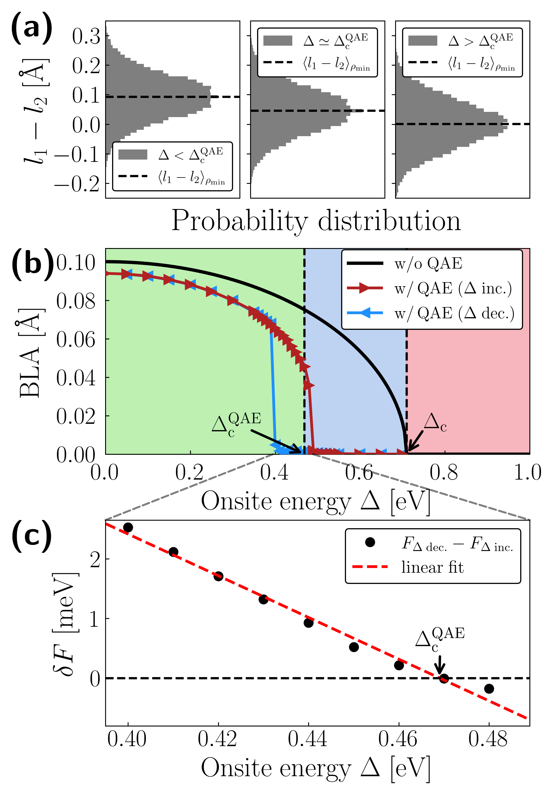
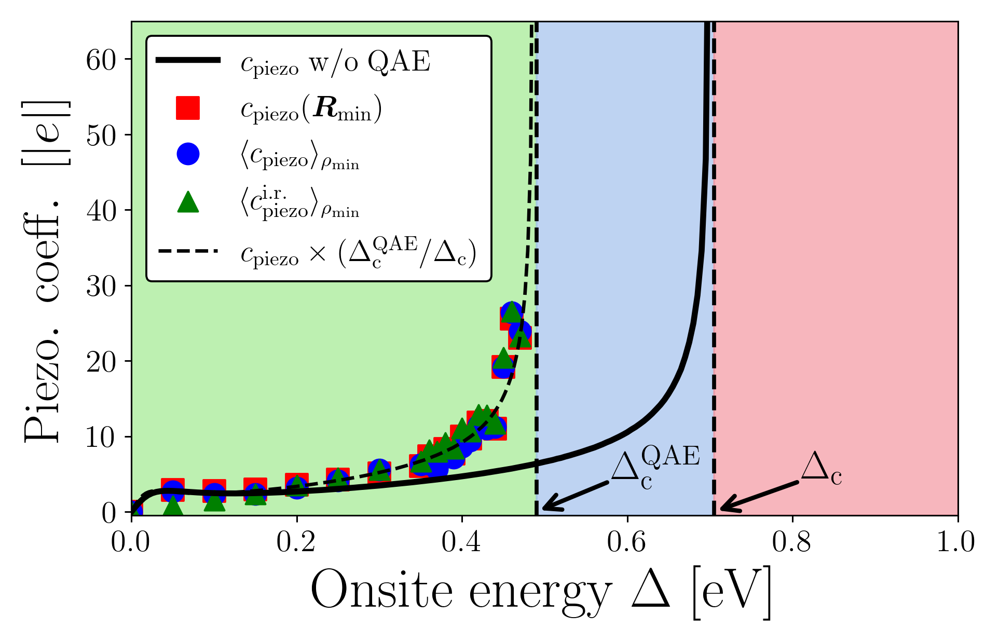
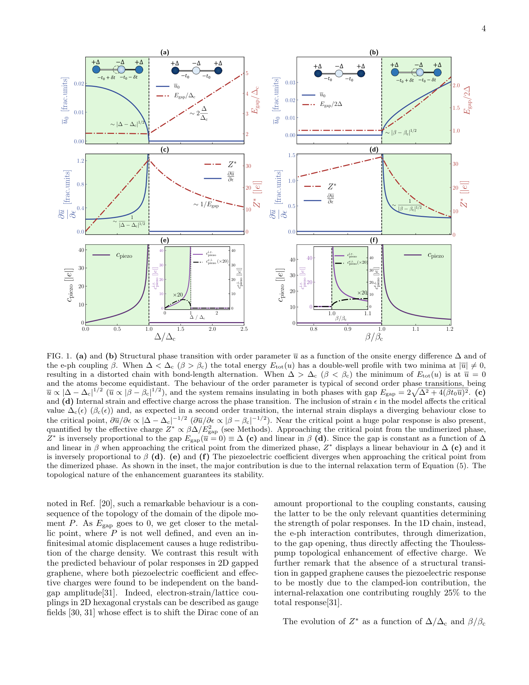

# 共役ポリマーの巨大圧電効果と量子ゆらぎ：トポロジカル増強はどこまで頑健か

- 執筆日：2026-04-28
- トピック：共役ポリマーにおける巨大圧電効果に対する量子イオン揺らぎの影響
- Multiphysics and Coupled Phenomena / Coupled-Field Response / Low-Dimensional Materials / First-Principles Calculations
- 注目論文：arXiv:2603.14472（Villani, Monacelli, Barone, Mauri, 2026）
- 参照論文数：6

---

## 1. なぜ今この話題なのか

圧電材料は、力学的な変形と電気分極とを相互に変換する物質であり、センサー、アクチュエータ、超音波振動子、エネルギーハーベスティングデバイスなど幅広い応用を担う。現在の主流はジルコン酸チタン酸鉛（PZT）に代表される無機セラミクスであるが、これらは鉛を含む有害物質であり、高温焼結プロセスが不可欠で、また硬くて脆いという欠点を持つ。フレキシブルエレクトロニクスや生体埋め込み型デバイスへの応用を考えると、低毒性・柔軟・軽量な有機系圧電材料への需要は急速に高まっている。

有機圧電体の代表格はポリフッ化ビニリデン（PVDF）であり、1969年に川井弘之によって発見された。しかし PVDF の圧電定数は無機系に比べると1〜2桁小さく、応用上の性能で劣ることが長年の課題であった。この状況に対し、2023年に Barone, Mauri らのグループ（arXiv:2308.16070）は、π 電子が高度に非局在化した**共役ポリマー (conjugated polymer)** において、通常とはまったく異なる電子論的機構によって桁違いに大きな圧電応答が生じることを第一原理計算で予測した。その核心にあるのは**Thouless ポンプ (Thouless pump)** という位相幾何学的な電荷輸送機構であり、これが Born 有効電荷（BEC）を劇的に増大させ、炭素原子の BEC が通常の 1e 程度から最大 30e 以上に達しうることが示された。

しかし、この巨大な圧電応答の予測は静的かつ古典的な構造を前提としていた。現実の物質において炭素のような軽い元素は量子力学的なゼロ点振動を示し、その大きさは時に構造的秩序そのものを揺るがすほどになる。共役ポリマーの圧電機構が**二量化相転移 (dimerization phase transition)** の近傍における増強に依存する以上、量子イオン揺らぎはこの相転移自体を変質させ、巨大圧電応答を消滅させてしまわないだろうか──これが、本記事の中心に据える注目論文 arXiv:2603.14472（Villani, Monacelli, Barone, Mauri, 2026）が正面から取り組んだ問いである。

この研究が2026年に登場した背景には、有機フレキシブル圧電材料への応用需要の高まりだけでなく、**SSCHA (stochastic self-consistent harmonic approximation)** と呼ばれる量子非調和効果の第一原理的計算手法が近年急速に整備されたことがある。SSCHA は従来の調和近似では捉えられなかった零点運動・熱ゆらぎの非調和補正を自己無撞着に扱う手法であり、リチウムや水素などの軽元素系の相転移問題で実績を上げてきた。これを π 電子系特有のトポロジカル機構と組み合わせることで初めて、「量子ゆらぎ存在下での有機圧電体の真の性能」を定量的に評価できるようになった。

---

## 2. 未解決問題は何か

この分野における核心的な問いは、主として三つに整理できる。

**問い①：量子ゼロ点揺らぎは二量化秩序を壊すか？** 共役ポリマーの巨大圧電応答は、鎖方向の結合長が長短交互に並ぶ二量化によって生じる対称性の破れを前提とする。しかし軽い炭素のゼロ点振動のエネルギーは熱エネルギーと比較して無視できず、特に相転移境界付近では量子ゆらぎが古典的な二量化秩序を溶かす可能性がある。事前の研究では静的な第一原理計算のみが行われており、この点の定量評価は未解決であった。

**問い②：BEC のトポロジカル増強は量子揺らぎに対して頑健か？** Thouless ポンプ機構による BEC の増大は電子バンドギャップの縮小と直結しており、ギャップが逆数として効く（$Z^* \propto 1/E_\text{gap}$）。量子ゆらぎが構造を変化させれば、ギャップも変わり、BEC の増大度も変わるはずである。さらに、結合長の大きな量子揺らぎ自体が BEC の「期待値」をどう変えるかは、単純な平均場論では答えられない。

**問い③：形態相境界（MPB）アナロジーは量子補正後も成立するか？** 無機圧電体 PZT では、正方晶と菱面体晶の相境界（MPB）近傍で圧電定数が最大化される。Barone ら（2023）は共役ポリマーの二量化転移でも類似の増強が起きると予測したが、量子ゆらぎが相境界を移動させた後もこの「最適窓」が維持されるかどうかは不明であった。

---

## 3. 注目論文の核心

Villani, Monacelli, Barone, Mauri（2026, arXiv:2603.14472）は、この三つの問いすべてに数値的に明確な答えを与えた。彼らのアプローチは、SSCHA（確率的自己無撞着調和近似）を **Rice-Mele 二原子鎖モデル (Rice-Mele model)** と組み合わせ、そのモデルパラメータをカービン（carbyne）の hybrid-functional 第一原理計算によって較正するというものである。

**モデルの設定と検証。** Rice-Mele モデルは交互ホッピング $t_1, t_2$ とオンサイトエネルギー差 $\Delta$ を持つ1次元二原子鎖であり、二量化転移とそれに伴う BEC・圧電係数の振る舞いを捉える最もシンプルな模型である。論文ではまず、このモデルから計算した BEC（$Z^*$）と内部歪み圧電係数（$c_\text{piezo}$）が、第一原理計算値と良く一致することを確認している。オンサイトエネルギー $\Delta$ の増大に伴って $Z^*$ と $c_\text{piezo}$ がともに単調増加する様子が第一原理と良く一致しており、モデルの精度が確認された。

**結果①：相境界の34%移動。** 古典的（調和近似）計算では二量化転移が消える臨界オンサイトエネルギーを $\Delta_c$ と定義すると、量子非調和効果（QAE）を含めた SSCHA 計算では臨界点が $\Delta_c^\text{QAE} \approx 0.66\, \Delta_c$ へと**34%** も低エネルギー側にシフトすることが判明した（図1）。つまり量子ゆらぎは相転移を「押し下げる」方向に働き、古典的には二量化していたパラメータ領域の一部が量子効果によって非二量化相へと移行する。しかし、二量化相そのものが消滅するわけではなく、最適な材料設計窓が移動するにとどまる。

*図1：結合長交代（BLA）のオンサイトエネルギー $\Delta$ 依存性。黒線：量子効果なし（古典）、赤・青マーカー：SSCHA を用いた量子効果あり（Δ増加／減少方向）。量子ゆらぎが一次相転移の境界を $\Delta_c^\text{QAE}$ へと34%シフトさせることが見てとれる。緑領域：二量化相、青領域：QAEによって移動した境界付近、赤領域：非二量化相。（出典: arXiv:2603.14472, CC BY 4.0）*

**結果②：BEC のトポロジカル増強は20%さらに強化される。** 驚くべきことに、量子ゆらぎは BEC を消滅させるどころか、約**20%** 増強した。これは、量子的なゼロ点揺動が電子バンドギャップを縮小させる効果（量子誘起のギャップ縮小）によるものであり、$Z^* \propto 1/E_\text{gap}$ の関係を通じて BEC が増大する。結合長揺らぎの振幅が平均 BLA 値と比較可能な大きさになっても、トポロジカルな増強機構そのものは頑健に維持される。

**結果③：圧電係数は内部歪み寄与が支配的で、MPB的振る舞いを保持。** 圧電係数は「固定イオン（クランプドイオン）」寄与と「内部歪み（内部緩和）」寄与に分解できる。注目論文では、量子補正後も内部歪み寄与が支配的であることが確認された。さらに圧電係数は量子補正された相境界 $\Delta_c^\text{QAE}$ の近傍で最大値を示す「形態相境界的」な増強を保持している（図2）。最大値は約 $25|e|$ 程度に達し、最先端の無機圧電体にも匹敵しうる値である。

*図2：圧電係数 $c_\text{piezo}$ のオンサイトエネルギー $\Delta$ 依存性。黒実線：量子効果なし、各マーカー：SSCHA 量子計算の三種類の評価方法。量子ゆらぎは主に境界を左にシフトさせるが（破線）、巨大圧電応答の増強は $\Delta_c^\text{QAE}$ 近傍で保持される。緑：二量化相、青：量子補正領域、赤：非二量化相。（出典: arXiv:2603.14472, CC BY 4.0）*

---

## 4. 背景と研究史

有機圧電体の歴史は1969年の PVDF 圧電効果の発見に始まる。PVDF は CH₂-CF₂ 単位からなる半結晶性ポリマーであり、β晶において CF₂ 基の双極子が揃うことで自発分極が生じる。圧電定数は $d_{33} \approx -33\ \text{pC/N}$ 程度で、PZT（$d_{33} \approx 200$–$600\ \text{pC/N}$）と比べると1桁以上低い。PVDF の圧電機構は「局所双極子の整列」という古典的な描像に基づいており、長距離の電子的非局在化とは本質的に異なる。

共役ポリマーへの関心が圧電の文脈で高まったのは比較的最近のことである。ポリアセチレン、カービン（sp炭素鎖）、フルオロアセチレン誘導体などはすべて、主鎖に沿って非局在化した $\pi$ 電子系を持ち、**Peierls 不安定性 (Peierls instability)** によって二量化する性質がある。1次元金属では、フェルミ準位での電子状態がフォノンと結合して二倍周期変調を起こし（電荷密度波）、ギャップが開いて安定化する——これが Peierls 不安定性であり、共役ポリマーの二量化の物理的起源である。

現代の分極理論の基盤となる **Berry 位相公式 (Berry phase formula)**（King-Smith & Vanderbilt, 1993）の確立と、その延長としての Born 有効電荷の第一原理的計算手法（DFPT：密度汎関数摂動理論）の整備が、有機圧電体を定量的に議論することを可能にした。BEC は原子変位に対する分極の線形応答として定義され、圧電定数の内部緩和寄与を支配する量である。通常の絶縁体では BEC は名目的な（形式的な）電荷に近いが、Barone ら（2023）が示したのは、二量化した共役ポリマーでは Thouless ポンプ機構によって BEC が劇的に増大するという事実であった。

Barone らの 2023 年の仕事（arXiv:2308.16070）はこの分野のブレークスルーであった。彼らは1次元二量化共役ポリマーを「Thouless ポンプの物理的実現」として捉え、BEC がバンドギャップに反比例して増大すること（$Z^* \propto t/E_\text{gap}$）を解析的・数値的に示した。さらに、二量化転移の臨界点近傍では BEC が発散的に増大し、圧電係数も同様に最大化されることを予測した。図3に示すように、この増強は $\Delta/\Delta_c \to 1$ の極限で発散的になり、圧電係数も同様の振る舞いを示す。この「形態相境界的」増強の概念は無機圧電体の MPB（morphotropic phase boundary）から着想を得たものであり、有機材料でも同様の設計指針が成り立つことを示唆する点で革新的であった。

*図3：Barone ら (2023) による BEC $Z^*$（c, d）と圧電係数 $c_\text{piezo}$（e, f）のΔ依存性。相転移点（$\Delta/\Delta_c = 1$ または $\beta/\beta_c = 1$）近傍で両者が発散的に増大することが示されている。（出典: arXiv:2308.16070, CC BY 4.0）*

同グループの 2024 年の仕事（arXiv:2404.18329）では、Haldane モデルや Kane-Mele モデルといったトポロジカル絶縁体モデルにおいても BEC が位相転移点で量子化的なジャンプを示すことが示されており、BEC とバンドトポロジーの深い関係が系統的に整理されつつある。特に、位相転移点を挟んで BEC がほぼ量子化した値で不連続にジャンプするという現象は、バンドトポロジーが直接赤外応答に現れることを示しており、共役ポリマーの BEC 増強の位相幾何学的起源を支持する独立な根拠を与えている。

一方で Jung & Birol（2025, arXiv:2512.00628）は、非極性フォノン（対称性上は赤外不活性なモード）が高次 BEC（電気四重極モーメントなど）を通じて分極に有限の寄与を与えることを明らかにし、BEC の理論的記述が一次の双極子近似を超えた豊かな構造を持つことを示した。これは圧電係数の精密評価においても重要な補正となりうる。

Sadman & Lambrecht（2026, arXiv:2604.14554）は、Mg-IV-N₂（Mg₂SiN₂, Mg₂GeN₂ など）窒化物半導体に対して標準的な DFPT を用いて BEC・圧電定数を体系的に計算した。量子非調和効果は含まれていないが、半導体の「通常の」圧電応答の精密ベースラインを与えており、共役ポリマーの桁違いな BEC との対比が鮮明になる。同論文では BEC が名目電荷に近い（$Z^* \approx 2$–$3$）ことが確認されており、Barone らの $Z^* > 5$、さらには $Z^* \to 30$ という値がいかに異常かが改めて浮き彫りになる。このような「標準的な材料での精密計算」と「トポロジカル機構を持つ材料での増強」の対比は、圧電設計の文脈での方向性を明確にする上で重要な参照点となる。

---

## 5. どの解釈が最も妥当か

**トポロジカル増強の解釈の強さ。** 注目論文の中心的主張は「量子ゆらぎがあっても Thouless ポンプ由来の BEC 増強は消えず、むしろ強まる」というものである。この解釈を支える根拠は三層ある。第一に、SSCHA の枠組みの信頼性：カービンの第一原理計算と量子効果あり・なしの両方で検証されたモデルがベースにあり、恣意的なパラメータへの依存は最小限である。第二に、BEC 増強のメカニズムの明快さ：量子ゆらぎがバンドギャップを縮小させ、$Z^* \propto 1/E_\text{gap}$ を通じて BEC を強化するという因果連鎖は物理的に透明である。第三に、圧電係数の内部緩和寄与が支配的であること：内部緩和（内部歪み）寄与が dominant であれば、クランプドイオン圧電係数の変動による不定性が小さく、結果が robust になる。

**残る不確定性と限界。** 一方で、いくつかの点は今後の検証を必要とする。第一に、Rice-Mele モデルの普遍性：論文はカービンをプロトタイプとして選んでおり、側鎖官能基を持つ実際の機能化共役ポリマー（たとえばフルオロ基付きポリアセチレン）への定量的移行には、モデル再較正が必要である。第二に、有限温度での振る舞い：SSCHA は温度依存の計算にも適用可能であるが、本論文の主要結果はゼロ温度に集中しており、室温での二量化秩序の維持については追加計算が必要である。第三に、1次元モデルの限界：本質的に1次元の Rice-Mele モデルは、実際の3次元高分子固体における鎖間相互作用・無秩序・ドメイン壁の影響を無視している。

**他の系との比較が示すこと。** Janus モノレイヤー Cr₂SSe を対象とした Shen ら（2026, arXiv:2604.00629）は、圧電・フレキソ電・磁気電気など複数の電気力学応答が同一材料で共存する「multipiezo」効果を理論予測している。2次元材料では鏡像非対称（Janus 構造）が極性を生じさせる機構が主役であり、Thouless ポンプとは異なる起源を持つ。しかし共通するのは、「相転移・対称性破れの近傍で複数の応答が増強される」という設計原理であり、1D 共役ポリマーと 2D Janus 材料は異なる次元・機構でも類似の指針を共有していると言える。

Visser ら（2026, arXiv:2604.18324）の「アルターエレクトリクス（alterelectrics）」の概念は、対称性の観点から重要な示唆を与える。アルター磁性体（altermagnet）が逆空間での対称性によって非共線磁気秩序を区別するように、アルターエレクトリクスは電荷の四重極的配列によって逆空間でのベクトル分極を生じさせる。この対称性分類は、1次元ポリマーの BEC を「双極子的」か「四重極的」かという観点から再解釈する可能性を開く。Jung & Birol（2025）の高次 BEC 理論と合わせると、圧電応答の完全な記述には双極子を超えた多極子展開が必要であることが明確になる。

現時点での最も確からしい結論は、共役ポリマーの Thouless ポンプ機構によるトポロジカル BEC 増強は量子非調和効果に対して頑健であり、巨大圧電応答は二量化秩序が保たれる限り維持されるというものである。ただし最適な材料設計には、量子補正後の相境界 $\Delta_c^\text{QAE}$ を基準にした精密な化学的チューニングが必要であり、単純な古典的計算では不十分という点で従来の設計指針の更新が求められる。

---

## 6. 何が一般化できるのか

**他の共役ポリマー系への展開。** 本論文はカービン（炭素鎖）をプロトタイプとして選んでいるが、Barone ら（2023）はすでにポリアセチレンや官能基付きポリアセチレン誘導体でも同様の巨大圧電応答が期待されることを示している。これらへの SSCHA の適用は自然な次のステップであり、量子補正量は使用する元素の質量に敏感であることから、軽元素を含む系（H, Li, C, N）では量子効果がより顕著になると予想される。特にフッ素置換（ポリフルオロアセチレン誘導体）は PVDF との連続性においても実験的に興味深いターゲットである。

**2次元・3次元系への接続。** 1次元の Rice-Mele/Thouless ポンプの論理は、2次元版 Thouless ポンプ（量子ホール系）へと自然に拡張できる。Janus モノレイヤー系（arXiv:2604.00629）では、層の非対称性が作る内部電場が複数の電気力学応答を同時に引き起こすことが示されており、「1次元ポリマーの巨大 BEC + 2次元材料の multipiezo」という軸でのマテリアルズデザインが展望できる。さらに、トポロジカル絶縁体の表面状態や強相関系でのソフトモード近傍でも類似の増強が期待されうる。

**方法論の普遍性：SSCHA の適用範囲。** SSCHA は元来、高圧水素化物（LaH₁₀ など）の超伝導転移温度計算で威力を発揮した手法であり、量子ゼロ点振動が格子の動的安定性を変える系に広く適用できる。圧電材料の観点では、PbTiO₃ や BaTiO₃ などの強誘電体ペロブスカイトでも光学ソフトモードへの量子補正が転移温度を数十K変化させることが知られており、SSCHA とトポロジカル BEC 理論を組み合わせた記述は圧電・強誘電体全般への一般化が可能である。

**材料設計原理としての示唆。** 本研究から抽出できる最も汎用的な設計原理は「小さなバンドギャップと相境界への近さを同時に達成する材料が最大の圧電応答を示す」という点である。ただし量子効果を含めると、古典的に相境界近傍に設計した材料は量子補正によって最適窓が外れる可能性があり、$\Delta_c^\text{QAE}$ を予め計算した上で設計する必要がある。これはハイスループット計算と機械学習によるサーチにおいても SSCHA レベルの量子補正を取り込む必要があることを示唆しており、計算コストと精度のトレードオフが新たな研究課題となる。

---

## 7. 基礎から理解する

### 7.1 圧電効果の基礎：力と電気の変換

**圧電効果 (piezoelectric effect)** とは、機械的な応力（または歪み）を電気分極に変換し、あるいはその逆を行う現象である。正圧電効果は「力 → 電気」の変換、逆圧電効果は「電気 → 変形」の変換に相当する。圧電体に力をかけると表面に電荷が現れ、電圧をかけると形が変わる。これはセンサー（力を電気信号に変換）とアクチュエータ（電気で変形を起こす）の動作原理である。

圧電効果が存在するためには、材料が**反転対称性（中心対称性）を持たない**ことが必要である。これは結晶の点群が反転対称性を含まないことに対応し、空間群のうちの 20 結晶クラス（全 32 クラスのうち）が圧電性を示す。典型的な無機圧電体 PZT は正方晶に歪んだペロブスカイト構造をとり、Ti または Zr イオンの変位が自発分極を生む。有機圧電体 PVDF の β晶では CF₂ 基の双極子が結晶中で同じ方向に揃うことで分極が生じる。

圧電応答を定量化する量として、**圧電応力定数** $e_{\lambda\alpha}$ と**圧電歪み定数** $d_{\lambda\alpha}$ がよく使われる。前者は「一定歪みのもとでの分極の歪み微分」、後者は「一定応力のもとでの歪みの電場微分」として定義される。実用的な材料スペックとして $d_{33}$（ポーリング方向への応力に対する同方向の分極変化）がよく引用される。PZT では $d_{33} \approx 200$–$600\ \text{pC/N}$ に達する一方、PVDF は $|d_{33}| \approx 33\ \text{pC/N}$ 程度にとどまる。

### 7.2 Born 有効電荷：分極応答の核心量

圧電定数を微視的に理解する鍵となる量が、**Born 有効電荷 (Born effective charge, BEC)** $Z^*_{i\alpha\beta}$ である。これは $i$ 番目の原子の $\beta$ 方向への変位 $u_{i\beta}$ に対して生じる巨視的電気分極の $\alpha$ 成分の変化率として定義される：

$$Z^*_{i\alpha\beta} = \frac{\Omega}{e} \frac{\partial P_\alpha}{\partial u_{i\beta}}\bigg|_{\mathcal{E}=0}$$

ここで $\Omega$ は単位胞体積、$e$ は素電荷、$\mathcal{E}$ はゼロ電場条件で評価することを示す。直感的に言えば、「原子を少し動かしたときに周囲の電子がどれだけついてくるか（あるいは逃げるか）」を表す量であり、イオン的な形式電荷とは異なる。

BEC は形式的な電荷とは大幅に異なる値をとりうる。たとえばイオン性固体 NaCl では Na の BEC は約 +1.1e（形式電荷 +1 に近い）だが、強誘電体 BaTiO₃ の Ti では形式電荷 +4 に対して BEC は約 +7e と大幅に大きく、Ti-O 結合の動的な電荷移動を反映している。BEC の和則（電荷中性則）として

$$\sum_i Z^*_{i\alpha\beta} = 0$$

が常に成立する。これは「分子全体を一様に動かしても分極は生じない」という物理的要請から導かれる。

圧電係数の「内部緩和寄与 (internal relaxation contribution)」は BEC を通じて表され、

$$e_{\lambda\alpha}^\text{relax} \propto \sum_i Z^*_{i\alpha\beta}\, u^{(\lambda)}_{i\beta}$$

となる（$u^{(\lambda)}$ は格子歪みに伴う内部座標緩和）。したがって BEC が大きいほど、内部緩和寄与によって圧電係数が増大する。注目論文が示したように、共役ポリマーでは通常の10倍以上の BEC が生じるため、圧電係数が桁違いに大きくなることが期待できる。

### 7.3 現代の分極理論：Berry 位相の登場

古典的には「単位胞の双極子モーメントの和」として電気分極を定義するが、これは周期系では格子ベクトルの整数倍の曖昧さを持ち、絶対値として意味を持たない（これを「多値性問題」という）。この問題を解決したのが King-Smith & Vanderbilt（1993）による**現代の分極理論**であり、その核心は分極の変化を電子状態の**Berry 位相 (Berry phase)** として表すことにある。

電子分極の変化は、Bloch 関数 $|u_{n\mathbf{k}}\rangle$ を使って

$$\Delta P_\alpha = -\frac{2ie}{(2\pi)^3} \int_\text{BZ} \sum_n \left\langle u_{n\mathbf{k}} \left| \frac{\partial}{\partial k_\alpha} \right| u_{n\mathbf{k}} \right\rangle d^3k$$

というブリルアンゾーン積分（Berry 接続の積分）で与えられる。この量はゲージ変換に対して不変な幾何学的位相であり、物理的に意味を持つ。BEC もこの枠組みで定義され、原子変位に対する Berry 位相の変化率として表現される。

この公式の重要な点は、分極が電子波動関数の位相空間トポロジーと結びついていることである。特に1次元系では Berry 位相が $[0, 2\pi)$ に値をとる「Zak 位相」として重要な役割を果たし、Thouless ポンプとの直接的なつながりを持つ。

### 7.4 Rice-Mele モデルと Thouless ポンプ：1次元版トポロジー

**Rice-Mele モデル** は1次元二原子鎖を記述する最小モデルであり、ハミルトニアンは

$$H = -\sum_n \left[ t_1 c^\dagger_{2n+1} c_{2n} + t_2 c^\dagger_{2n+2} c_{2n+1} + \text{h.c.} \right] + \frac{\Delta}{2} \sum_n (-1)^n c^\dagger_n c_n$$

で与えられる。ここで $t_1, t_2$ は交互ホッピング定数（二種類の結合の強さ）、$\Delta$ はオンサイトエネルギー差（二種類の原子の電気陰性度の差に相当）である。$t_1 \neq t_2$ や $\Delta \neq 0$ の場合、系はギャップ $E_\text{gap} \propto |t_1 - t_2|$ または $\propto \Delta$ を持つ絶縁体となる。

$t_1 = t_2, \Delta = 0$ は均一金属鎖（高対称相）であり、$t_1 < t_2, \Delta = 0$ は SSH モデル（Su-Schrieffer-Heeger モデル）に帰着してトポロジカル絶縁体相を示す。共役ポリマーではこのモデルが Peierls 不安定性による二量化を記述し、パラメータ $\Delta$ が「二種類の部位の区別の大きさ」（フッ素置換などの化学的非等価性）に対応する。

**Thouless ポンプ**は、ハミルトニアンのパラメータを時間の関数としてゆっくり（断熱的に）一周期変化させたとき、電荷が1単位胞あたり正確に整数個だけ輸送される現象である（Thouless, 1983）。これは Berry 位相の周期的変化として記述され、輸送電荷量は Chern 数という位相幾何学的な整数に等しい。

共役ポリマーでは、伸長・圧縮という機械的変形がパラメータ空間でのループを形成し、擬似的な Thouless サイクルとして機能する。このとき BEC は

$$Z^* \approx \frac{2e\, t}{E_\text{gap}} \times f(\theta)$$

という形でギャップに反比例して大きくなる（$t$ は典型的なホッピング定数、$f(\theta)$ は配置に依存する関数）。二量化転移の臨界点では $E_\text{gap} \to 0$ となるため BEC は発散的に増大し、これが「巨大圧電応答」の本質的な起源である。

### 7.5 Peierls 不安定性と二量化転移：1次元特有の現象

なぜ共役ポリマーで二量化が起きるのか。その答えは**Peierls 不安定性**にある。1次元の金属的電子系では、フェルミ準位で状態密度が有限であり、$2k_F$（$k_F$：フェルミ波数）の格子変調（電荷密度波）が自発的に安定化する。変調によって系は電子的エネルギーを失うが、弾性エネルギーを払う。半充填（1原子あたり1電子）のバンドでは $2k_F = \pi/a$（$a$：格子定数）となり、格子定数が2倍になる二量化が起こる。この Peierls 不安定性は厳密に1次元系でのみ自発的に起き（3次元系では格子の剛性と競合するため通常は起きない）、炭素π電子系の特有の性質である。

二量化の大きさを表す秩序変数が**BLA（Bond Length Alternation）** であり、隣接する長・短の結合長の差 $\delta = l_\text{long} - l_\text{short}$ で定義される。BLA が有限ならば二量化相（絶縁体）、BLA＝0 なら均一鎖（金属・高対称相）に対応する。注目論文では $\Delta$ パラメータ（Rice-Mele モデルのオンサイトエネルギー差）と BLA の関係を系統的に調べており、量子ゆらぎによって「BLA が有限にとどまる最小の $\Delta$」（臨界点）が34%変化することを示した。

### 7.6 SSCHA：量子非調和効果を自己無撞着に扱う方法

標準的な DFT の格子動力学計算は**調和近似**に基づいており、原子は平衡位置の周りを小振動する独立な調和振動子として扱われる。しかし軽い原子（H, Li, C など）では、ゼロ点振動エネルギー（$\hbar\omega/2$）が格子振動の典型的なエネルギーと同程度か、場合によってはそれ以上になる。このとき調和近似は破綻し、非調和補正が本質的になる。

**SSCHA（確率的自己無撞着調和近似）** は、量子非調和効果を含む全自由エネルギー $F$ を変分的に最小化する手法である。基本的なアイデアは次のとおり：「試験密度行列 $\rho_0$ を調和型（ガウス型の量子核密度行列）に制限するが、その中心位置（平均原子位置）$\mathbf{R}$ と力定数テンソル $\boldsymbol{\Phi}$ を変分パラメータとして最適化する」。

自由エネルギーの変分条件から導かれる自己無撞着方程式は

$$\left\langle \frac{\partial V(\mathbf{r})}{\partial r_{i}} \right\rangle_{\rho_0(\mathbf{R}, \boldsymbol{\Phi})} = 0, \quad \Phi_{ij}^\text{SSCHA} = \left\langle \frac{\partial^2 V}{\partial r_i \partial r_j} \right\rangle_{\rho_0}^\text{SSCHA corrected}$$

で与えられ、「真のポテンシャル $V$ の勾配（力）と曲率（力定数）の量子核平均」が自己無撞着に決まる。「確率的」という名称は、$\rho_0$ で記述されるガウス分布から原子配置を Monte Carlo サンプリングし、各配置について第一原理計算（DFT）で力を評価することに由来する。

SSCHA の重要な特徴として、（1）非調和ポテンシャルエネルギー面の全情報を原理的に取り込める、（2）量子核効果（ゼロ点運動）と熱ゆらぎを同一の枠組みで扱える、（3）調和近似では「不安定」となるソフトモードを動的に安定化できる、という点がある。本論文では炭素鎖（カービン）のポテンシャルエネルギー面を DFT で計算し、その上で SSCHA を走らせることで量子補正後の相境界と BEC を求めている。

---

## 8. 専門用語の解説

**Born 有効電荷（Born effective charge, BEC）**
原子の変位に対する巨視的電気分極の変化率。単位は素電荷 $e$。イオン的な形式電荷とは異なり、電子雲の動的再分布も含んだ「動的電荷」であり、圧電・誘電・赤外応答すべてに中心的な役割を果たす。通常の絶縁体では形式電荷に近い値をとるが、共役ポリマーではトポロジカル機構によって数十倍に増大しうる。本論文では量子揺らぎ下での BEC の変化が中心的な問いとなっており、量子効果によってさらに 20% 増強されることが示された。

**Thouless ポンプ（Thouless pump）**
ハミルトニアンのパラメータを断熱的に一周期変化させたときに正確に整数個の電荷が輸送されるトポロジカル現象（Thouless, 1983）。輸送電荷量は Berry 位相の積分（Chern 数）として量子化されており、摂動に対して頑健。共役ポリマーでは機械的変形サイクルが実質的に Thouless ポンプを実現し、BEC の劇的な増大の起源となる。量子ゆらぎ（SSCHA）のもとでもこの機構が維持されることが本論文の核心的結果。

**SSCHA（stochastic self-consistent harmonic approximation）**
量子イオン揺らぎを含む自由エネルギーを変分的に最小化する計算手法。調和型の試験密度行列の力定数・平衡位置を自己無撞着に最適化し、Monte Carlo サンプリングによって第一原理計算から力を評価する。従来の準調和近似では捉えられない非調和補正（相転移温度の補正、ソフトモードの安定化など）を自然に含む。本論文では炭素鎖のポテンシャルエネルギー面から量子補正後の相境界と BEC を求めた。

**Peierls 不安定性（Peierls instability）**
1次元金属において、フェルミ波数の2倍に相当する格子変調が自発的に形成されてエネルギーギャップが開き、金属が絶縁体に転移する現象（Peierls, 1955）。共役ポリマーの二量化（交互の長・短結合）はその典型例。ギャップの大きさは変調の振幅（BLA）に比例し、ギャップが小さいほど BEC は大きくなるため、Peierls 臨界点近傍での圧電増強が起きる。

**Bond Length Alternation（BLA）**
結合長交代。共役ポリマー主鎖に沿った隣接する結合長の差。BLA＞0 が二量化秩序変数を表し、BLA＝0 が均一鎖（非極性相）に対応する。本論文では BLA の量子ゆらぎが平均値と同程度の大きさになること、しかしながら二量化秩序は有限の $\Delta$ のもとで維持されることが示された。

**形態相境界（morphotropic phase boundary, MPB）**
PZT（Pb(Zr,Ti)O₃）系で見られる特定の組成比において、正方晶と菱面体晶が共存する相境界。この境界近傍では分極の方向が変わりやすく、圧電定数が最大化される（$d_{33} > 600\ \text{pC/N}$）。共役ポリマーの二量化転移は「電子的 MPB」として類似の役割を果たすと捉えられており、量子補正後の境界 $\Delta_c^\text{QAE}$ が新しい最適設計点となる。

**Rice-Mele モデル（Rice-Mele model）**
交互ホッピング $t_1, t_2$ とオンサイトエネルギー差 $\Delta$ を持つ1次元二原子鎖の最小モデル。二量化絶縁体のトポロジー・分極・BEC を解析的に扱うための基本モデルとして広く使われ、SSH モデル（$\Delta=0$）の一般化。本論文ではカービンの第一原理計算でパラメータを較正した後に SSCHA 計算を行う舞台として使用された。モデルの精度は第一原理計算との直接比較で検証済み。

**密度汎関数摂動理論（DFPT: density functional perturbation theory）**
外部摂動（原子変位、電場など）に対する電子密度の線形応答を第一原理的に計算する枠組み。フォノン分散関係、BEC、誘電定数、圧電定数などを単一の計算で効率的に求められる。調和近似の範囲内で厳密であり、現在の第一原理圧電計算の標準手法。量子非調和効果は原理的に含まれないため、共役ポリマーのような軽元素系では SSCHA のような拡張が必要となる。

**内部歪み寄与（internal relaxation contribution）**
圧電係数を「クランプドイオン（原子固定）」部分と「内部歪み（原子が格子歪みに伴って緩和する）」部分に分解したときの後者。格子歪みに伴って内部座標が変化し、それが BEC を通じて分極変化を引き起こす寄与。大きな BEC を持つ系では特に重要で、共役ポリマーではこの寄与が支配的であり、量子補正後もその地位は変わらないことが本論文で確認された。

**アルターエレクトリクス（alterelectrics）**
Visser ら（2026）が提案した新しい対称性クラス。アルター磁性体のアナロジーとして、逆空間の対称性操作によって「電気的双極子ではなく四重極的な分極配列」を持つ物質群を指す。従来の圧電体・反強誘電体・強誘電体の分類を超えた新たな枠組みであり、BEC の多極子展開の重要性を示唆する。共役ポリマーの BEC 解釈にも新たな観点を加える可能性がある。

---

## 9. 今後の展望

今回の研究によって、共役ポリマーの巨大圧電応答が量子非調和効果に対してかなりの程度頑健であることは確立された。特に、BEC のトポロジカル（Thouless ポンプ）増強がゼロ点揺動の下でも持続するどころか 20% 強化されるという発見は、有機圧電体設計における新たな指針として重要である。また相境界が 34% シフトするという定量的知見は、第一原理計算に基づく材料設計において調和近似を超えた量子補正が不可欠であることを示しており、SSCHA 計算の材料探索への組み込みが急務であることを意味する。有限温度での二量化秩序の維持や、側鎖官能基の化学的チューニングによる最適 $\Delta$ の探索は、今後 1〜2 年で具体的な実験提案に結実しうる。特に、ラマン散乱や中性子散乱を用いた二量化フォノンソフトモードの直接観測と、SSCHA 計算との対比が決定的な実験になると予想される。

まだ未確定な重要課題も残されている。第一に、実際の高分子固体における鎖間相互作用・ドメイン形成・長距離秩序の効果は未解明であり、1次元モデルの記述がどこまで3次元固体に移行できるかを検証する必要がある。第二に、アルターエレクトリクス（arXiv:2604.18324）や高次 BEC 多極子展開（arXiv:2512.00628）の観点から BEC を再解釈することで、圧電応答の対称性分類が更新される可能性があり、特に非対称・非局所な圧電応答の存在を検証する精密誘電測定が重要になる。第三に、2次元 Janus 材料（arXiv:2604.00629）との統合的理解により、「次元＋トポロジー＋量子ゆらぎ」という三つの軸を統一した圧電設計理論の構築が今後 3〜5 年の大きな目標となりうる。計算面では SSCHA とハイスループット第一原理計算を組み合わせた「量子補正込み材料スクリーニング」の確立が、この分野の進展を大きく加速するだろう。

---

## 参考論文一覧

1. **[arXiv:2603.14472](https://arxiv.org/abs/2603.14472)** — Villani, Monacelli, Barone, Mauri (2026). 「共役ポリマーにおける結合長交代と巨大圧電効果への量子非調和イオン揺らぎの役割」。SSCHA を用いて量子ゆらぎが相境界を34%シフトさせるも巨大圧電応答は頑健に維持されることを示した本記事の注目論文。*[anchor]*

2. **[arXiv:2308.16070](https://arxiv.org/abs/2308.16070)** — Barone, Mauri et al. (2023). 「共役ポリマーにおける Thouless ポンプによる巨大圧電効果」。BEC のトポロジカル増強機構（$Z^* \propto 1/E_\text{gap}$）を初めて提唱し、共役ポリマーが既存有機圧電体を大幅に凌駕する可能性を DFT で示した先行研究。*[predecessor/background]*

3. **[arXiv:2404.18329](https://arxiv.org/abs/2404.18329)** — Barone et al. (2024). 「Haldane モデルと Kane-Mele モデルにおけるトポロジカル相転移の指標としての量子化 Born 有効電荷」。BEC が位相転移に伴って量子化的なジャンプを示すことを示し、BEC とバンドトポロジーの普遍的な関係を整理した背景論文。*[background]*

4. **[arXiv:2604.14554](https://arxiv.org/abs/2604.14554)** — Sadman, Lambrecht (2026). 「Mg-IV-N₂ 半導体の DFPT による Born 有効電荷と圧電定数の体系的計算」。標準的な調和 DFPT による BEC・圧電係数のベースラインを示し、共役ポリマーの異常に大きな BEC との対比を明確にする比較論文。*[comparison]*

5. **[arXiv:2604.00629](https://arxiv.org/abs/2604.00629)** — Shen et al. (2026). 「Janus モノレイヤー Cr₂SSe における multipiezo 効果」。圧電・フレキソ電・磁気電気応答が共存する 2D 材料を提案し、対称性破れを利用した多機能圧電設計の可能性を示した応用・波及論文。*[application/wave]*

6. **[arXiv:2604.18324](https://arxiv.org/abs/2604.18324)** — Visser et al. (2026). 「アルターエレクトリクス：電気四重極型圧電効果の新対称性クラス」。逆空間対称性に基づく新たな圧電機構を提案し、BEC の多極子展開の重要性を示唆する対称性論文。*[comparison/symmetry]*

7. **[arXiv:2512.00628](https://arxiv.org/abs/2512.00628)** — Jung, Birol (2025). 「非極性フォノンからの電気分極と高次 Born 有効電荷」。赤外不活性フォノンモードが高次 BEC を通じて分極に寄与する機構を示し、圧電応答の精密評価における高次補正の必要性を指摘した背景論文。*[background]*
