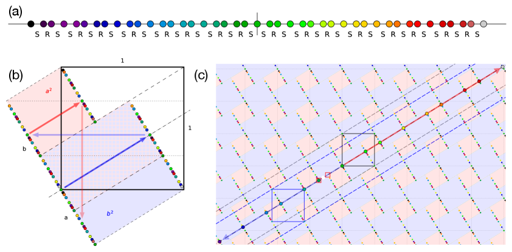
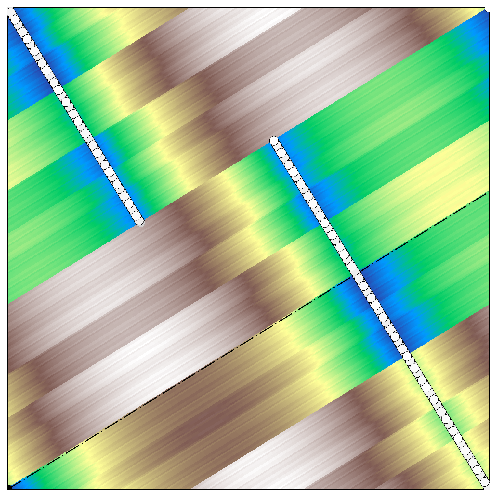
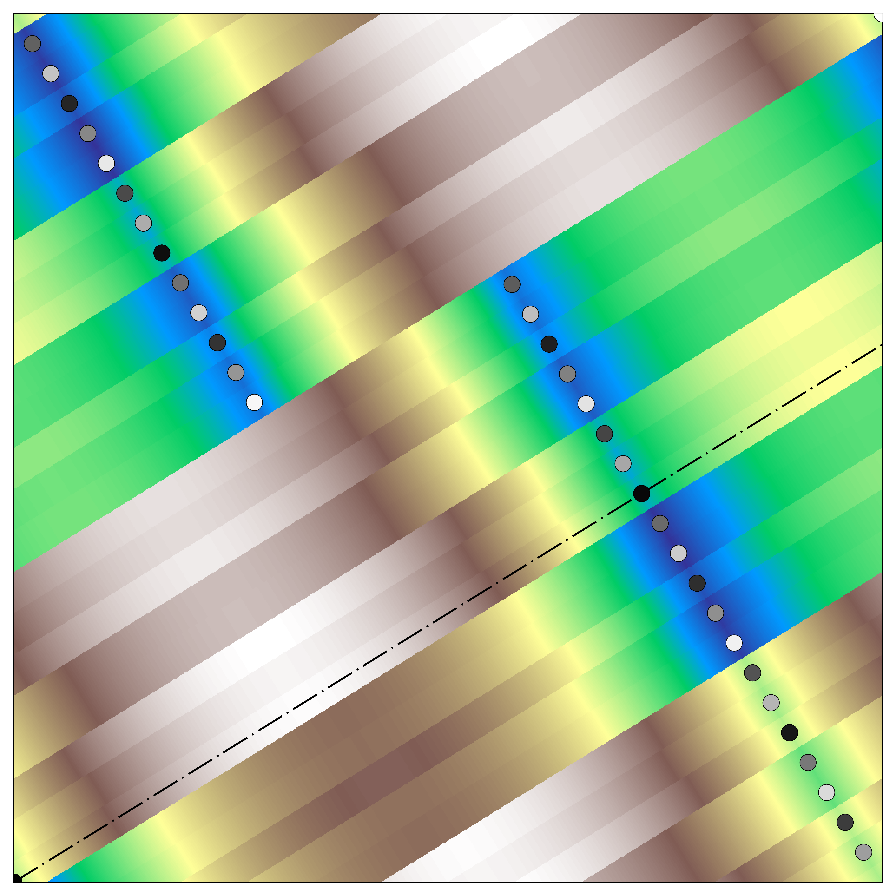
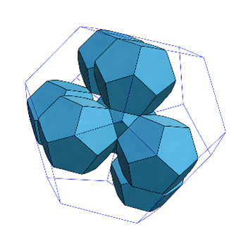
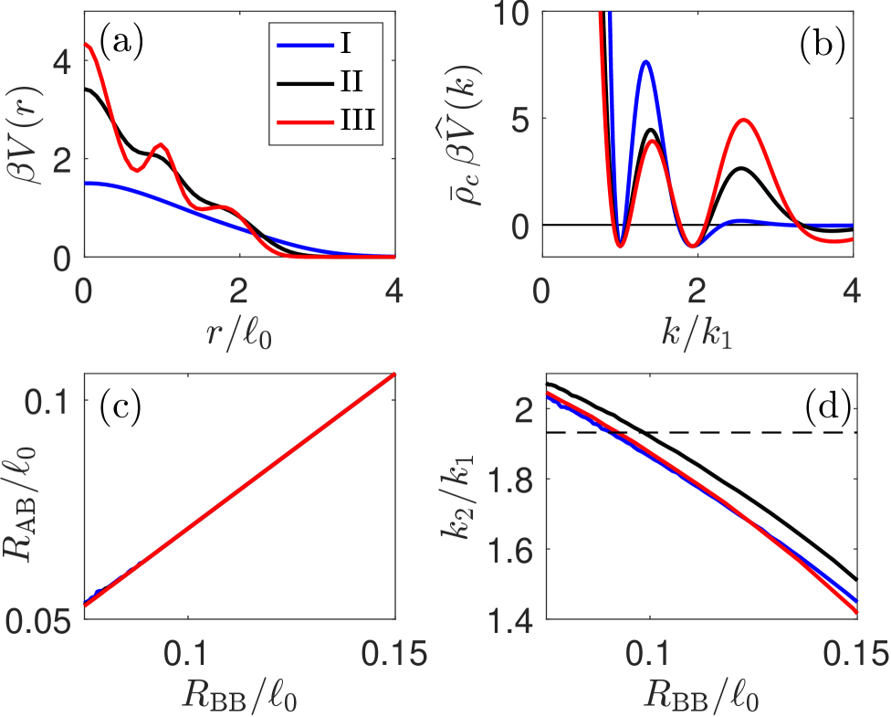
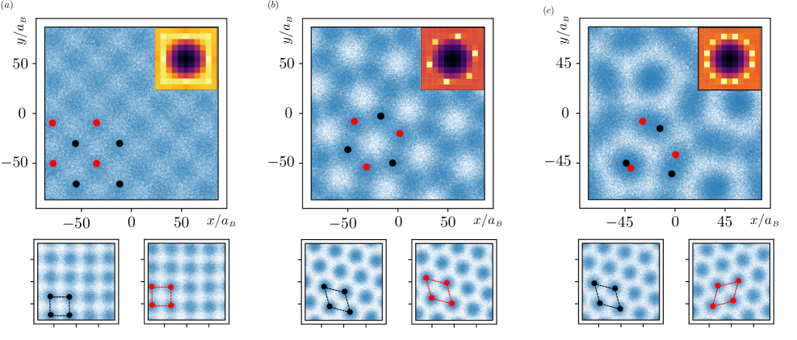

# 準結晶の電子構造を直接計算する：cut-and-project DFT++が切り拓く非周期構造の第一原理論

- **執筆日**: 2026-04-08
- **トピック**: 準結晶の電子構造への第一原理アプローチ：高次元からの射影と密度汎関数理論の融合
- **タグ**: Electronic Structure / Topological Properties; Phase Transitions / First-Principles Calculations
- **注目論文**: Nop et al., "Cut-and-Project Density Functional Theory for Quasicrystals", arXiv:2603.14590 (2026)
- **参照関連論文数**: 8

---

## 1. なぜ今この話題なのか

1984年、ダン・シェヒトマンはアルミニウム・マンガン合金の電子線回折パターンに、それまでの結晶学の常識を完全に覆す像を観測した。鋭い回折スポットが五回対称性（二十面体対称性）をもって並んでいたのである。当時の結晶学では、五回対称性をもつ周期格子は存在しえないとされていた。この発見は当初激しい批判にさらされたが、その後の研究で「準結晶（quasicrystal）」という新たな物質相の実在が証明され、2011年のノーベル化学賞の授与につながった。

準結晶は、長距離の方向秩序（回折パターンに現れる鋭いスポット）をもちながら、三次元的な並進対称性を欠くという特異な構造をとる。すなわち通常の結晶とも無秩序なガラスとも異なる第三の固体相である。発見から40年以上が経過した現在もなお、準結晶の電子構造・物性・安定性の根拠は完全には解明されていない。その最大の理由の一つが、計算物理学の根幹をなすブロッホの定理が適用できないことにある。

通常の固体物理では、電子の波動関数はブロッホ関数の形をとり、波数ベクトル $\mathbf{k}$ で分類できる。これはハミルトニアンが格子の周期性と交換可能であることから導かれる。ところが準結晶には並進対称性がないため、$\mathbf{k}$ という量子数が定義できず、エネルギーバンドを描くことさえ自明ではない。そのため従来の第一原理計算は、準結晶に構造的に近い「近似結晶（approximant crystal）」を代理として用い、その周期構造に対してバンド計算を行う間接的な手法に頼らざるを得なかった。

この状況を根本的に打開する試みが、2026年3月にプレプリントとして公開されたNopらの論文「Cut-and-Project Density Functional Theory for Quasicrystals」（arXiv:2603.14590）である。彼らは準結晶の構造記述として広く用いられてきた「cut-and-project法（切り出し射影法）」を、電子間相互作用を含む密度汎関数理論（DFT）の枠組みへと拡張し、準結晶の量子状態を直接・厳密・計算可能な形で記述する「DFT++定式化」を構築した。この成果は、準結晶の電子構造研究に全く新しい地平を開く可能性を秘めている。

同時期に、関連する方向からの研究も相次いで報告されている。Baekらは第一原理計算により正二十面体準結晶が熱力学的基底状態であることを実証し（arXiv:2404.05200、*Nature Physics* 2025掲載）、近似結晶を用いた手法による超伝導温度の第一原理予測（arXiv:2511.09224）や、準結晶への超伝導転移の実験的観測（arXiv:2501.00554）なども報告されている。さらに高分子系での十二回準結晶の安定化（arXiv:2603.18694）や、量子細線における電子準結晶相の発見（arXiv:2512.10909）など、準結晶概念は物性物理・材料科学の多岐にわたる分野へと広がりを見せている。これらの流れを総合的に理解するために、注目論文のDFT++を軸として、準結晶研究の現在地を俯瞰する。

---

## 2. この分野で何が未解決なのか

準結晶研究には、現在もいくつかの本質的な未解決問題が存在する。

**問い①：準結晶の電子構造はどのように記述すべきか？**

ブロッホの定理が使えない準結晶では、電子の状態をどう分類し、エネルギースペクトルをどう計算するかという問題がいまだ根本的には未解決である。近似結晶を使う手法は局所的な構造モチーフを正しく捉えるが、非周期性に由来する長距離の量子干渉効果（いわゆる「クリティカル状態」）を系統的に取り込めない。準結晶に固有の量子力学的現象を第一原理レベルで計算する方法論の確立が、この問いに対する答えへの鍵である。

**問い②：準結晶は本当に熱力学的基底状態なのか？**

長い間、準結晶は相転移における運動論的なトラップ（準安定相）に過ぎないのではないかという疑念が持たれていた。近似結晶の方が安定なのではないかという議論も続いてきた。2025年にBaekらが第一原理DFTで正二十面体準結晶の熱力学安定性を直接実証したことで、少なくともいくつかの系では真の基底状態であることが示された。しかし安定性の起源（電子的安定化？ファゾンエントロピー？）はまだ十分理解されていない。

**問い③：準結晶固有の物性は何によって支配されているのか？**

超伝導、重い電子系、磁気秩序など、近似結晶で観測される多くの物性は「局所構造モチーフ」が支配的であり、非周期性自体はそれほど重要でないという見方もある。一方で、準結晶に特有のクリティカルな電子状態やファゾン揺らぎが物性に与える効果を区別する実験・理論はいまだ少ない。DFT++のような直接的な理論枠組みが、この問いへの接近を初めて可能にするかもしれない。

**問い④：他の系（軟物質、光子系、電子系）の準結晶とどう共通しているのか？**

準結晶は合金系だけでなく、ブロック共重合体・デンドリマーなどの軟物質系、フォトニック結晶、さらには量子細線内の電子密度波としても発現することが知られている。これらに共通する安定化機構と、それぞれの系に固有の側面を区別することは、「準結晶性」という概念を物質横断的に理解するための重要な課題である。

---

## 3. 注目論文の核心：何が前進し、何がまだ仮説か

### 3.1 DFT++の背景：なぜ以前はできなかったのか

密度汎関数理論では、電子系の基底状態エネルギーを電子密度 $n(\mathbf{r})$ の汎関数として最小化する。その核心にある交換相関ポテンシャルは電子間の非線形な相互作用を含んでいるため、原理的には非局所的である。

通常の周期結晶では、ブロッホの定理によってハミルトニアンが単位胞のスーパーセル問題に帰着され、Kohn-Sham方程式を数値的に解くことができる。しかし準結晶では周期性がないため、単位胞が存在せず、この手続きが全く適用できない。

これまでの対処法は大きく二つに分類される。第一は「近似結晶アプローチ」：準結晶に近い有限サイズの周期結晶を用い、その結果を準結晶の代理として解釈する。第二は「ナノ粒子有限クラスターアプローチ」：Baekらが用いた方法で、増大するサイズのクラスターに対してDFT計算を行い、バルク値を外挿する。どちらも工学的には有用だが、準結晶の非周期性という本質的な構造を直接扱う枠組みではなかった。

### 3.2 cut-and-project法の物理的相互作用への拡張

Nopらの核心的アイデアは、「cut-and-project法は構造の記述だけでなく、物理的相互作用の記述にも使える」という洞察にある。

cut-and-project法では、準結晶の原子配置を高次元空間（higher space, HS）の周期格子から「切り出し・射影」することで生成する（詳細は第4節・第7節参照）。Nopらはこの手法を相互作用ポテンシャルにも適用した。すなわち、「物理空間（physical space, PS）における局所的な物理的相互作用は、対応する高次元空間における物理的相互作用からcut-and-projectすることによって正確に記述される」という「局在化定理（localization procedure）」を証明した。

この定理により、準結晶の電子系に対するKohn-Sham方程式を、高次元空間の**周期系**のSchrodinger方程式へと等価変換できる。高次元では並進対称性が回復しているため、ブロッホの定理が適用でき、通常のDFT計算の枠組みが使える。

具体的なDFT++定式化においては、電子ポテンシャル $\phi(\mathbf{x})$ を電子波動関数 $\psi_i(\mathbf{x})$ と並ぶ独立な一次変数として扱う。ラグランジアンは次の形をとる：

$$\mathcal{L}_\mathrm{LDA} = -\frac{\hbar^2}{2m_e}\sum_i f_i \int d\mathbf{x}\, \psi_i^*(\mathbf{x})\nabla^2\psi_i(\mathbf{x}) + \int d\mathbf{x}\, V(\mathbf{x})n(\mathbf{x}) + \int d\mathbf{x}\, \varepsilon_\mathrm{xc}(n(\mathbf{x}))n(\mathbf{x}) - \int d\mathbf{x}\, \phi(\mathbf{x})(n(\mathbf{x})-n_0) - \frac{\varepsilon_0}{2}\int d\mathbf{x}\, \|\nabla\phi(\mathbf{x})\|^2$$

ここで $f_i$ は軌道占有数、$V(\mathbf{x})$ はイオンポテンシャル、$\varepsilon_\mathrm{xc}$ は交換相関エネルギー密度、$n_0$ は均一正電荷背景の密度である。ポテンシャル $\phi(\mathbf{x})$ を明示的変数として導入することで、電子間のハートリー相互作用（本来は非局所的な汎関数）が局所的な形で書け、cut-and-projectによる高次元への持ち上げが可能になる。この操作が "DFT++" の "++" の部分に対応している。

### 3.3 フィボナッチ準結晶での実証

論文では一次元のフィボナッチ準結晶を対象に、この定式化の正当性を示している。フィボナッチ準結晶とは、二種類の原子間距離 $R$（長）と $S$（短）が黄金比 $\tau = (1+\sqrt{5})/2 \approx 1.618$ の比率で配置される非周期的一次元格子で、「RSSRSR...」のような置換規則 $R\to RS$, $S\to R$ で生成される（図1(a)）。

高次元空間では、傾き $1/\tau$ をもつ直線（切断線）に沿って二次元周期格子を切り出すことで、フィボナッチ数列が再現される（図1(b)(c)）。Nopらは、このHS上の二次元周期格子においてDFT++計算を実行し、PS上に射影することで準結晶の正確な電子ポテンシャルを求めた。

図2aはHS全体のポテンシャルを示す。傾いた切断線（白の球列）に沿ってポテンシャルが非連続的に変化しており、これが物理空間の非周期的な原子配置に対応している。これに対して近似結晶（傾き13/21の有理近似）のポテンシャル（図2b）は周期的で、切断線に沿った急激な変化が消えている。この比較は、近似結晶アプローチと真の準結晶計算との本質的な違いを可視化している。

### 3.4 何が前進し、何が残っているか

この論文の最大の貢献は、**準結晶の電子状態を近似なしに第一原理から直接指定できる枠組みを初めて構築した**ことである。理論の厳密性（rigorous）と計算可能性（computationally tractable）を両立させた点が画期的である。著者たちは、この方法論が電子系だけでなく、フォノン系・マグノン系・フォトニック系にも適用できると主張している。

一方で、いくつかの限界も明確に認識すべきである。第一に、現時点での実証はフィボナッチ準結晶という一次元の模型系に限られており、物理的に重要な三次元正二十面体準結晶への拡張は今後の課題として残されている。第二に、LDA近似の精度は通常の周期系でも問題になることがあり、準結晶における信頼性は別途検証が必要である。第三に、計算コストの評価：高次元での計算がPS上の計算よりどの程度効率的になるかの定量的な比較はまだ示されていない。

---

## 4. 背景と研究史：この論文はどこに位置づくか

### 4.1 タイリングと高次元結晶学の発展

準結晶の構造を数学的に理解する試みは、物理的な発見と前後して進んできた。1974年、ロジャー・ペンローズは「ペンローズタイリング」と呼ばれる、二種類の菱形を用いて平面を五回対称性をもった非周期的に充填できるタイリングを発見した。これは準結晶の構造モデルの原型となった。

三次元への拡張として重要なのは、二十面体対称群と高次元格子の関係である。正二十面体の対称性（点群 $I_h$）は六次元立方格子 $\mathbb{Z}^6$ の対称性に包含されており、これが「六次元からの射影」による正二十面体準結晶の記述を可能にする根拠になっている。

2026年にAl RaisiらはD₆ルート格子から得られる「修正Mosseri-Sadoc (MMS) タイル」を提案した（arXiv:2604.03988）。MMSタイルは正二十面体対称性をもちながら三次元空間を充填でき、膨張率 $\tau^3$（体積比）・$\tau$（Dehn不変量）の膨張行列をもつことが示された。

D₆格子からの射影によってMMSタイルを系統的に構築できることは、高次元結晶学的アプローチが準結晶の基本構造ブロックの記述においても有効であることを示しており、Nopらの方法論的立場（高次元周期性を基盤とする）と深く共鳴する。

### 4.2 準結晶の安定性：基底状態か準安定相か

Nopらの論文を理解する上で欠かせない背景として、準結晶の熱力学的安定性の問題がある。2024年に発表（Nature Physics掲載）されたBaekら（arXiv:2404.05200）の研究は、この問題に決定的な答えを与えた。

彼らのアイデアは独創的である：増大するサイズの準結晶ナノ粒子に対してDFT計算を実行し、バルクエネルギーと表面エネルギーを外挿するというものだ。この「ナノ粒子スケーリング法」により、$\mathrm{ScZn}_{7.33}$ および $\mathrm{YbCd}_{5.7}$ の正二十面体準結晶が**熱力学的基底状態**であること、すなわち並進対称性は固体の安定性の必要条件ではないことが初めて実証された。

さらに興味深いことに、$\mathrm{ScZn}_{7.33}$ は熱力学的に安定であるにもかかわらず、溶融物からの核生成に大きなエネルギー障壁をもつことも示された。これは「なぜ多くの準結晶が特殊な急冷条件を必要とするのか」という実験的観察を理論的に説明する。

この成果はNopらの研究との相補性が高い。Baekらのアプローチは熱力学安定性の証明には成功したが、電子バンド構造やコヒーレントな量子状態を得るには不向きである。一方、NopらのDFT++は電子状態の直接計算を目指しているが、一次元での証明にとどまっている。両者が補完することで、「準結晶は何故安定で、どのような電子状態をもつのか」という問いへの包括的な答えが得られると期待される。

### 4.3 近似結晶アプローチの現状と限界

準結晶の物性を理解するための最も広く使われてきた手法が「近似結晶アプローチ」である。近似結晶とは、黄金比などの無理数比を有理数比で近似することで得られる大きな単位胞をもつ周期結晶であり、準結晶と同じ局所構造クラスター（例：Tsai型クラスター、Mackay型クラスター）を共有する。

この手法の有力な成果として、PedroらによるAl₁₃Os₄（十角準結晶の近似結晶）の超伝導温度の第一原理計算（arXiv:2511.09224）が挙げられる。彼らはEliashberg理論を用いて $T_c$ を定量的に再現することに成功し、「超伝導の鍵となる要素は局所構造モチーフにすでにエンコードされている」と結論した。またFerreiraらによる実験（arXiv:2501.00554）は、同じAl₁₃Os₄において $T_c \approx 5.47\,\mathrm{K}$ の超伝導と非自明なZ₂トポロジカル電子状態（スピン偏極した表面状態）を観測した。

しかしCd₆CeのX線・軟X線光電子分光研究（arXiv:2510.24277）は、近似結晶アプローチの限界を暗示する興味深い結果を示している。Ce 4f軌道は、通常の重い電子系金属間化合物とは異なり、フェルミ準位での伝導電子との混成が極めて弱く、代わりにCd 5p軌道（フェルミ準位から約1 eV深い位置）と優先的に混成していることが明らかにされた。この異常な $c$-$f$ 混成は、Cd環境の特殊な幾何学（準結晶クラスター構造）に由来する可能性が高く、通常の結晶構造解析の枠組みでは説明が難しい。

---

## 5. どの解釈が最も妥当か：証拠・比較・限界

### 5.1 cut-and-project法の物理的相互作用への適用可能性

Nopらの主要な主張、すなわち「切り出し・射影によって構造を記述できるのと同様に、物理的相互作用も高次元から正確に記述できる」は、フィボナッチ準結晶という明確なモデル系で数学的に証明されている。この証明の核心は「局在化定理（localization procedure）」であり、物理空間における局所的な相互作用が高次元の対応する相互作用に一対一に対応することを保証する。

支持する根拠は多い。まず、cut-and-project構造の数学的な完備性は以前から確立されており（例：Mosseri-Sadocタイルの研究などの数理的発展）、これに物理的相互作用を乗せることの自然さが論文で示されている。次に、フィボナッチ準結晶のポテンシャルが近似結晶のそれとは質的に異なる急変構造をもつことが視覚的に確認できる（図2a vs 2b）。これは「近似結晶と真の準結晶は電子的に異なる」という命題を支持する。

一方、いくつかの注意点も挙げられる。(1) 一次元モデルから三次元への拡張は、高次元空間の次元数が増えるため計算コストが指数的に増加する可能性がある（六次元正二十面体準結晶では $n$=6 次元の格子計算が必要）。(2) LDA交換相関汎関数は、局在したf電子をもつ系（Cd₆Ce, Au-Al-Ybなど）では不十分であることが知られており、DFT+U あるいはハイブリッド汎関数の組み込みが必要になる可能性がある。(3) 原子位置の揺らぎ（ファゾン）の扱い：準結晶に固有のファゾン励起が有限温度でどう組み込まれるかは未示である。

### 5.2 「局所モチーフが物性を支配する」という解釈との対比

2511.09224（超伝導の第一原理計算）や近似結晶に関する多数の実験・理論は、「準結晶の物性は局所クラスター構造によって決まり、長距離の非周期秩序の寄与は小さい」という見方を支持している。この立場は、近似結晶アプローチの成功によって経験的に裏付けられており、実用的な材料探索においては強力なガイドラインとなってきた。

しかしこの解釈が普遍的かどうかは依然として疑問が残る。準結晶に特有の現象として以下が知られている：

- **クリティカルな電子状態**：通常の金属の伝播状態でも絶縁体のアンダーソン局在状態でもなく、自己相似的なフラクタル的構造をもつ電子波動関数が準結晶では理論的に予言されている。これは長距離の準周期秩序に本質的に依存するため、近似結晶では再現が難しい。
- **ファゾン揺らぎ**：通常の音響フォノンに加え、準結晶はファゾンと呼ばれる非周期構造固有の集団励起をもつ。ファゾンは準結晶の熱的・力学的・輸送特性に影響するが、その量子力学的記述はいまだ十分ではない。

Nopらの方法は、これらの準結晶固有の現象を第一原理的に計算する道を初めて開く。現時点では「クリティカル状態がDFT++で具体的に計算された」という結果はなく、これは今後の最重要検証課題の一つである。

### 5.3 実験との整合性：光電子分光からの問い

2510.24277のCd₆Ce研究は、近似結晶を通して準結晶の電子状態を間接的に調べた実験として注目に値する。異常な $c$-$f$ 混成は、準結晶クラスター特有の配位幾何学に起因すると推察されているが、それを確認するには「Cd₆Ceの準結晶版と近似結晶版で $c$-$f$ 混成の程度を比較する」実験が理想的である。

NopらのDFT++が三次元準結晶に拡張されれば、電子状態密度や光電子スペクトルを理論的に直接予測し、このような実験と比較することが可能になる。これは近似結晶アプローチでは達成できない定量的な比較を可能にし、「準結晶固有の電子構造」を同定する有力な手段となりえる。

---

## 6. 何が一般化できるのか：材料・手法・応用への広がり

### 6.1 二次元・三次元への拡張可能性

Nopらの論文は一次元フィボナッチ準結晶での証明にとどまっているが、著者らは方法論が高次元（二次元ペンローズ準結晶、三次元正二十面体準結晶）にも原理的に拡張できると主張している。三次元正二十面体準結晶は六次元超空間から射影されるため、DFT++計算は六次元周期系の問題に帰着される。計算コストは大幅に増加するが、超空間の格子対称性を最大限に利用することでかなりの削減が期待できる。

また、論文はフォノン系（弾性振動）・マグノン系（スピン波）・フォトニック系への適用も視野に入れている。フォノン計算に拡張されれば、ファゾン励起の微視的な記述が初めて可能になり、準結晶の熱輸送・力学特性の第一原理予測が開ける。

### 6.2 近似結晶の磁性研究から見える普遍性と個別性

WatanabeとIwasakiによる1/1近似結晶の磁気相図の理論研究（arXiv:2603.10716）は、正二十面体クラスターを構成する希土類サイトの結晶場・交換相互作用モデルから8種類の非共線・非共面磁気秩序を導出した。この多様な磁気相は、正二十面体の幾何学的フラストレーションから生まれており、近似結晶の磁気空間群（$I_{\rm P}m'\bar{3}'$, $C2'/m'$, $R\bar{3}$）と対応している。

これらの磁気構造が実際の準結晶に存在するかどうか、またファゾン揺らぎが磁気秩序を乱すかどうかは、準結晶電子構造の直接計算なしには評価が難しい。DFT++にスピン自由度を組み込む（スピン分極DFT++）ことで、この問いへの理論的アプローチが可能になると期待される。

### 6.3 軟物質準結晶：普遍的な安定化機構

高分子系での準結晶形成は、合金系とは全く異なる機構（電子安定化ではなくエントロピーと多スケール相互作用）によるものであり、準結晶性の普遍的理解にとって重要な対照例を提供する。

RatliffらはデンドリマーAB型（剛直リンカーで連結されたA（コア）とB（柔軟コロナ）からなる「ポンポン型」分子）の有効対相互作用ポテンシャルを解析し（arXiv:2603.18694）、コロナポリマー特性を変えることでポテンシャルのフーリエ変換における二つの最小値の比率 $k_2/k_1$ を制御できることを示した。この比が $\tau \approx 1.93$（黄金比近傍）になるとき、十二回対称の準結晶相が熱力学的に安定化される（図3）。

この「波数競合」機構は合金系でいう「ヒューム・ロザリールール（Fermi球とブリルアン帯の一致による電子安定化）」と概念的に対応している。すなわち合金準結晶では電子波数が、軟物質準結晶では密度波の波数が、それぞれ準結晶形成を駆動している。DFT++が合金準結晶の電子構造を直接計算できるようになれば、両者の安定化機構をより定量的に比較することが可能になる。

### 6.4 量子多体電子準結晶：新しい量子相としての可能性

最もエキサイティングな展開の一つが、GaggioliらによるGaAsなどの半導体量子細線中での「電子準結晶相」の発見である（arXiv:2512.10909）。彼らは神経回路網変分法を用いた第一原理的な多体計算を行い、二層配置の電子液体中に正方格子・ハニカム格子に並んで**十二回対称の準結晶的電子密度分布**が存在することを発見した（図4）。

注目すべきは、この電子準結晶が古典的エネルギー最小化では安定化されず、**量子ゆらぎ**によってのみ安定化されることである。これは電子間相互作用の量子多体効果が準結晶相を生み出すという、合金準結晶の電子安定化論とは根本的に異なる安定化機構を示している。NopらのDFT++は平均場（LDA）レベルであるため、このような多体相関起源の準結晶相を捉えることはできない。より高次の相関（量子モンテカルロ、ダイナミカル平均場理論など）への拡張が求められる。

---

## 7. 基礎から理解する

### 7.1 ブロッホの定理と周期性の役割

固体物理の礎をなすブロッホの定理は、「格子の周期性をもつポテンシャル中の電子の波動関数は、平面波と格子周期関数の積として書ける」というものだ：

$$\psi_{n\mathbf{k}}(\mathbf{r}) = e^{i\mathbf{k}\cdot\mathbf{r}} u_{n\mathbf{k}}(\mathbf{r})$$

ここで $u_{n\mathbf{k}}(\mathbf{r})$ は格子周期 $\mathbf{a}_i$ に対して $u_{n\mathbf{k}}(\mathbf{r}+\mathbf{a}_i) = u_{n\mathbf{k}}(\mathbf{r})$ を満たす周期関数、$\mathbf{k}$ は第一ブリルアン帯の波数ベクトル、$n$ はバンド指数である。これによりハミルトニアンの固有値問題が単位胞内の有限個の基底関数で展開でき、エネルギーバンド $E_n(\mathbf{k})$ が定義できる。

準結晶では $\mathbf{a}_i$ に対応する周期性がないため、$\mathbf{k}$ という量子数を定義できない。このことは単にバンド構造が描けないだけでなく、電子状態の基本的な分類方法が失われることを意味する。Nopらの方法は、物理空間では存在しない周期性を高次元空間で回復させることで、この問題を根本から解決する。

### 7.2 密度汎関数理論（DFT）の要点

DFTはHohenberg-Kohnの定理（電子系の基底状態は電子密度 $n(\mathbf{r})$ で完全に決まる）に基づき、多電子問題を一電子問題の自己無撞着な解として扱う。Kohn-Sham方程式は：

$$\left[-\frac{\hbar^2}{2m}\nabla^2 + V_\mathrm{ext}(\mathbf{r}) + V_\mathrm{H}(\mathbf{r}) + V_\mathrm{xc}(\mathbf{r})\right]\psi_i(\mathbf{r}) = \varepsilon_i \psi_i(\mathbf{r})$$

ここで $V_\mathrm{ext}$ はイオン由来の外部ポテンシャル、$V_\mathrm{H}$ はハートリーポテンシャル（電子の古典的クーロン反発）、$V_\mathrm{xc}$ は交換相関ポテンシャルである。 $V_\mathrm{H}(\mathbf{r}) = e^2\int n(\mathbf{r}')/|\mathbf{r}-\mathbf{r}'|d\mathbf{r}'$ は全電子密度分布に依存する非局所的な項であり、これがcut-and-projectによる高次元への持ち上げを困難にしている根本原因だった。DFT++では $\phi$ を独立変数化することでこの非局所性を局所形式に変換する。

局所密度近似（LDA）では $V_\mathrm{xc}(\mathbf{r}) = dE_\mathrm{xc}^\mathrm{hom}/dn|_{n=n(\mathbf{r})}$（一様電子ガスの結果を局所密度で評価）と近似する。これが DFT++ のラグランジアンに含まれる $\varepsilon_\mathrm{xc}(n)$ 項の意味である。

### 7.3 cut-and-project法：高次元からの準結晶の生成

cut-and-project法は、$d$次元の準結晶構造を $n$ 次元（$n > d$）の周期格子から「切り出し・射影する」ことで生成する最も強力な方法論である。

**フィボナッチ準結晶の場合（$n=2, d=1$）**：二次元正方格子 $\mathbb{Z}^2$ を考え、傾き $\theta = \arctan(1/\tau)$ の直線（切断線、傾き $1/\tau = \tau-1 \approx 0.618$）を引く。この直線の幅 $w$ （受容帯）に格子点が落ちる場合、その格子点の直線上への正射影を原子位置とする。傾きが無理数（$\tan\theta = 1/\tau$ は無理数）なので、生成される一次元配列は非周期的になるが、長距離秩序をもつ。

三次元正二十面体準結晶の場合には $n=6$ 次元の超空間からの射影が用いられ、六次元超空間の格子対称性（正二十面体対称群を含む）が物理空間の準結晶の対称性を保証する。

### 7.4 フォノンとファゾン

通常の結晶ではフォノン（原子の振動）が格子のただ一つの集団励起モードである。準結晶はこれに加え、「ファゾン（phason）」と呼ばれる固有の励起モードをもつ。ファゾンは高次元空間における原子の「受容帯」内での位置の変化に対応し、物理空間では原子の局所ジャンプとして現れる。フォノンは弾性論的に記述できるが、ファゾンは拡散的な緩和をし、時間スケールも通常のフォノンより遥かに長い。ファゾン揺らぎの量子効果はまだ十分理解されておらず、DFT++を用いた微視的計算が期待される分野の一つである。

### 7.5 ヒューメ・ロザリールールと準結晶の電子安定化

Hume-Rothery則は、合金において特定の電子数濃度（$e/a$ 比）でブリルアン帯とフェルミ球が接触することにより、そのブリルアン帯での電子状態密度に疑ギャップ（pseudogap）が生じ、エネルギーが安定化されるという経験則である。Al-Mn型の正二十面体準結晶でも、フェルミ準位近傍に広い疑ギャップが観測され、これが電子安定化の主たる機構の一つと考えられている。ただし準結晶には周期的なブリルアン帯が存在しないため、この説明は厳密には近似的であり、DFT++のような直接計算によって初めて定量的な評価が可能になる。

---

## 8. 専門用語の解説

**①　準結晶 (quasicrystal)** — 鋭い回折スポットをもつ（＝長距離秩序がある）が、三次元の並進対称性をもたない固体相。通常の結晶学では禁じられた五回・八回・十回・十二回対称性を示す。1984年にShechmanにより発見され、現在はAl-Mn, Al-Cu-Fe, Cd-Yb, Au-Al-Yb などの合金系で多数知られている。2011年ノーベル化学賞。

**②　cut-and-project法 (cut-and-project method)** — 高次元（$n$次元）の周期格子から低次元（$d$次元）の準周期構造を生成する方法。切断超平面（cut）と受容帯で選ばれた格子点を物理空間に正射影（project）することで、非周期だが長距離秩序をもつ原子配置が得られる。高次元空間では格子の周期性が回復するため、対称性の議論や計算が可能になる。別名「ストリップ射影法」ともいう。

**③　近似結晶 (approximant crystal)** — 準結晶の有理近似として得られる大きな単位胞をもつ周期結晶。黄金比 $\tau$ を分数 $p/q$（フィボナッチ数列の連続する比）で近似することで構築される。例えば $1/1$, $2/1$, $3/2$ 近似（各分母・分子がフィボナッチ数）が代表的。準結晶と同じ局所クラスター構造を共有するため、物性研究の代理として広く用いられてきた。

**④　ファゾン (phason)** — 準結晶に固有の集団励起モード。高次元超空間において原子が「受容帯」内で移動することに対応し、物理空間では原子の局所ジャンプ（ファゾン欠陥）として現れる。フォノン（弾性波）と異なり拡散的な緩和をする。ファゾン揺らぎは準結晶の構造安定性・熱的特性・輸送特性に影響するが、量子力学的記述はまだ発展途上である。

**⑤　DFT++ (DFT plus-plus)** — Nopらが提案した密度汎関数理論の拡張定式化。電子ポテンシャル $\phi(\mathbf{x})$ を電子波動関数と並ぶ独立な一次変数として扱うことで、ハートリー項（本来は非局所的）を局所形式に変換し、cut-and-project法との接合を可能にした。名称はDFT+Uなどの既存の拡張と区別するために "DFT++" とされている。

**⑥　Hume-Rothery則 (Hume-Rothery rule)** — 合金系において電子濃度（$e/a$ 比）とブリルアン帯の形状が一致するときに特定の結晶構造が安定化されるという経験則。準結晶への適用では「疑ギャップ（pseudogap）」がフェルミ準位に現れることで電子エネルギーが安定化されると説明される。準結晶の電子安定化機構の議論において重要な概念だが、厳密な理論的裏付けには第一原理計算が必要。

**⑦　クリティカル電子状態 (critical electronic state)** — 準結晶（および準周期ポテンシャル）中の電子固有状態の特徴的な形式。金属の伝播状態（拡張状態、デルタ関数的なブロッホ関数）でも絶縁体のアンダーソン局在状態でもなく、フラクタル的な自己相似構造をもつ波動関数。強い磁場をかけないと観測が難しく、理論的予言は多いが実験的確認は限られている。

**⑧　超空間 (superspace)** — 準結晶の構造を記述するために導入される高次元空間。通常の三次元物理空間（物理空間）に「内部空間」を付加した $n$ 次元空間（$n > 3$）。準結晶の原子配置は超空間の $n$ 次元格子（超空間格子）のある低次元切片として表現される。正二十面体準結晶には六次元超空間が用いられる。

**⑨　疑ギャップ (pseudogap)** — 電子状態密度が完全にゼロにはならないが、著しく減少する特徴的なエネルギー領域。真のバンドギャップ（半導体・絶縁体）と異なり残留状態密度がある。Al基準結晶や準結晶では $E_F$ 付近の疑ギャップが電子安定化に寄与していると解釈されている。光電子分光（PES）やトンネル分光（STM/STS）で実験的に観測できる。

**⑩　局在化定理 (localization procedure)** — Nopらが論文中に提案した定理。物理空間における局所的な物理的相互作用が、高次元超空間における対応する相互作用からのcut-and-project射影によって正確に再現されることを保証する。この定理がなければ、DFT++のように原子間相互作用を高次元に持ち上げることの正当性を示すことができなかった。

---

## 9. おわりに：何が分かり、何がまだ残っているのか

Nopらの研究が明示したもっとも重要な進展は、**準結晶の非周期構造をそのまま扱う厳密な第一原理計算の枠組みが存在する**という概念的な証明である。DFT++とcut-and-project法の融合により、高次元空間に問題を持ち上げることで周期性を回復させ、Kohn-Sham方程式を解くという戦略が数学的に正当化された。フィボナッチ準結晶での示範は、近似結晶のポテンシャルが真の準結晶のそれと質的に異なることを可視化し、「局所モチーフで全てが説明できる」とする近似結晶パラダイムの限界を理論的に指摘している。また同時期に、BaekらによるQCの熱力学安定性の実証、Baekら・Ferreiraらによる近似結晶の超伝導の第一原理的成功、Cd₆Ceの光電子分光による異常c-f混成の発見、デンドリマー系や半導体量子細線での準結晶相の発見など、準結晶研究が実験・理論・数値計算の多面的な展開を見せていることも明らかになった。

他方で、本質的な問いはまだ多く未解決である。DFT++の三次元正二十面体準結晶への実装と計算コストの評価は最優先課題である。クリティカル電子状態の直接計算・ファゾンの量子力学的扱い・多体相関（重い電子系・非従来型超伝導）への拡張はいずれも未着手であり、今後1〜3年の重要な論点となる。実験面では、ARPES（角度分解光電子分光）や軟X線分光によって真の準結晶と近似結晶の電子構造を直接比較する測定が、DFT++の予測と照合するために不可欠な役割を果たすだろう。また、軟物質準結晶（デンドリマー、ブロック共重合体）と電子準結晶（半導体量子細線）の安定化機構を合金準結晶と統一的に理解する「準結晶性の一般理論」の構築が、分野全体の大きな目標として浮かび上がっている。

---

## 参考論文一覧

1. **[arXiv:2603.14590](https://arxiv.org/abs/2603.14590)** — G. N. Nop, J. D. H. Smith, T. Koschny, D. Paudyal, "Cut-and-Project Density Functional Theory for Quasicrystals" (2026). **【注目論文】** cut-and-project法とDFT++を融合させ、準結晶の電子状態を高次元空間経由で直接・厳密に計算する枠組みを初めて構築した理論的先駆研究。

2. **[arXiv:2404.05200](https://arxiv.org/abs/2404.05200)** — W. Baek et al., "Quasicrystal bulk and surface energies from density functional theory" (*Nature Physics*, 2025). 増大するナノ粒子クラスターへのDFT計算外挿により、ScZn₇.₃₃とYbCd₅.₇の正二十面体準結晶が熱力学的基底状態であることを初めて実証した。

3. **[arXiv:2511.09224](https://arxiv.org/abs/2511.09224)** — P. N. Ferreira et al., "First-principles evidence for conventional superconductivity in a quasicrystal approximant" (2025). Al₁₃Os₄近似結晶でEliashberg理論を用いた第一原理計算により超伝導転移温度を定量的に再現し、超伝導の鍵が局所構造モチーフにあることを示した。

4. **[arXiv:2501.00554](https://arxiv.org/abs/2501.00554)** — P. K. Meena et al., "Observation of superconductivity in a nontrivial $\mathcal{Z}_2$ approximant quasicrystal" (*Communications Materials*, 2025). 十角準結晶の近似結晶Al₁₃Os₄で$T_c\approx5.47$ K の超伝導とZ₂トポロジカル電子状態を実験的に初めて観測した。

5. **[arXiv:2510.24277](https://arxiv.org/abs/2510.24277)** — (著者名省略), "Soft and hard x-ray orbital-resolved photoemission study of a strongly correlated Cd-Ce quasicrystal approximant" (2025). Cd₆Ceの軟・硬X線光電子分光により、Ce 4f軌道がフェルミ準位でなくCd 5p帯との異常な$c$-$f$混成をもつことを発見した。

6. **[arXiv:2603.18694](https://arxiv.org/abs/2603.18694)** — D. J. Ratliff et al., "Tuning polymer architecture for quasicrystal self-assembly" (2026). デンドリマー系の有効対相互作用ポテンシャルを分子構造パラメータで制御することで、十二回対称の安定な準結晶相が生成されることをモンテカルロ計算と理論モデルで示した。

7. **[arXiv:2604.03988](https://arxiv.org/abs/2604.03988)** — R. Al Raisi et al., "Modified Mosseri-Sadoc tiles from $D_6$" (2026). D₆ルート格子からの射影によって正二十面体対称性をもつ修正Mosseri-Sadocタイルを構築し、黄金比膨張率をもつ三次元タイリングの数理的性質を明らかにした。

8. **[arXiv:2512.10909](https://arxiv.org/abs/2512.10909)** — F. Gaggioli, P.-A. Graham, L. Fu, "Electronic crystals and quasicrystals in semiconductor quantum wells" (2025). 神経回路網変分法による第一原理的多体計算により、GaAs量子細線の二層電子系に十二回対称の電子準結晶相が量子ゆらぎによって安定化されることを発見した。

9. **[arXiv:2603.10716](https://arxiv.org/abs/2603.10716)** — S. Watanabe, J. Iwasaki, "Non-Collinear and Non-Coplanar Magnetic Orders in 1/1 Periodic Approximant to the Icosahedral Quasicrystal" (*J. Phys. Soc. Jpn.*, 2026). 正二十面体対称クラスターを単位とする1/1近似結晶の有効磁気モデルから、8種類の非共線・非共面磁気秩序構造を導出し、磁気的・トポロジカル的性質を明らかにした。
