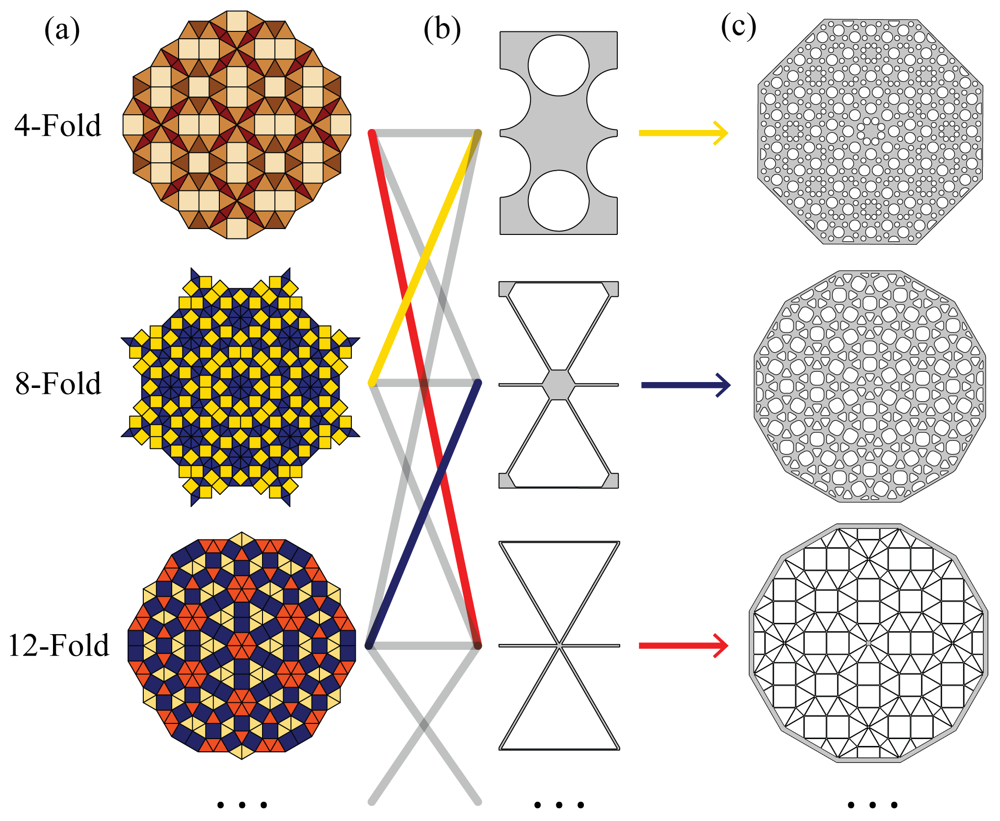
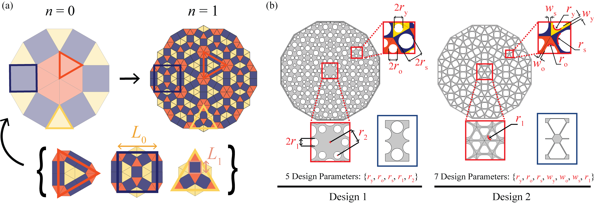
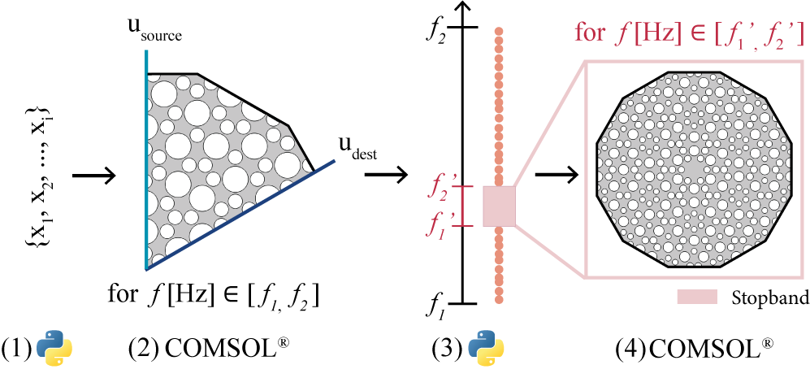
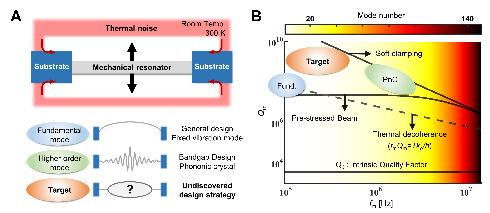
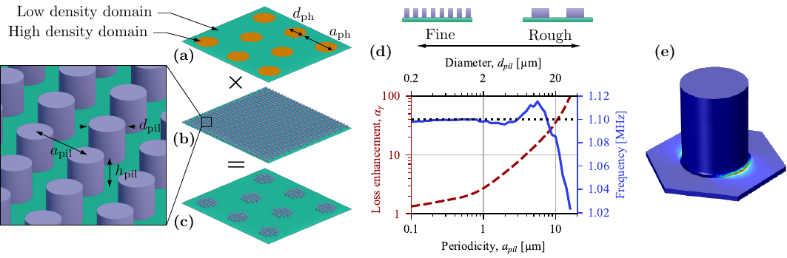
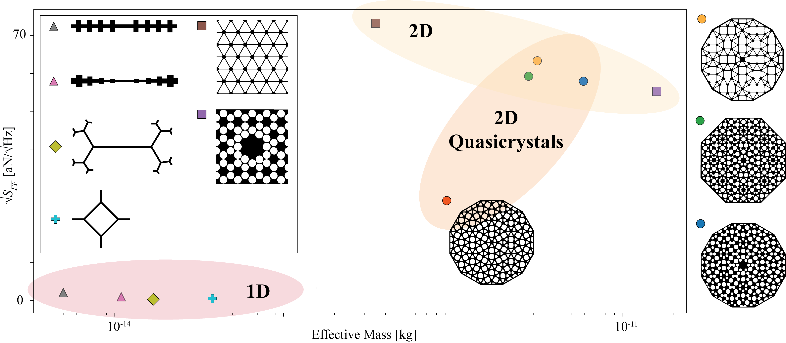
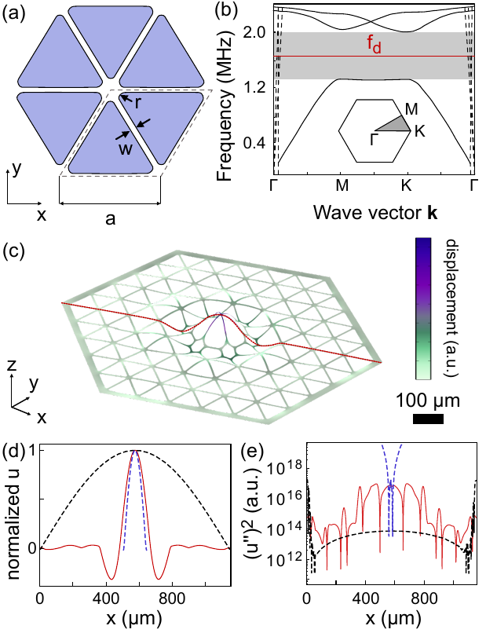

# 準結晶が拓くナノ機械共振器の新設計空間：データ駆動型アプローチによる非周期ソフトクランピング

- **執筆日**: 2026-04-13
- **トピック**: quasicrystal-nanomechanical-resonator
- **タグ**: Devices and Functional Materials / Nanostructures; Sensing / Machine Learning; Finite Element Method
- **注目論文**: Kawen Li, Hangjin Cho, Richard Norte, Dongil Shin, "Quasicrystal Architected Nanomechanical Resonators via Data-Driven Design," arXiv:2604.07379 (2026)
- **参照関連論文数**: 6

---

## 1. なぜ今この話題なのか

ナノ機械共振器（nanomechanical resonator）は、サブアトニュートン（sub-aN）級の力センシング、量子もつれ状態の生成、暗黒物質の超高感度検出、さらには重力波検出器の感度向上まで、現代物理学の最前線にある多様な応用を担いつつある。こうした用途に共通する要求が「極めて高い機械的品質因子 $Q_m$」である。品質因子とは共振器が振動エネルギーをどれだけ長く保持できるかを示す無次元数であり、$Q_m$ が高いほど熱雑音由来の力感度が向上し、量子基底状態への冷却も容易になる。

高応力シリコン窒化膜（high-stress Si₃N₄）を材料とするナノ機械共振器は、室温で $Q_m \sim 10^8$–$10^9$ を達成するプラットフォームとして過去十年に目覚ましい発展を遂げた。この飛躍をもたらした核心的な概念が**散逸希釈（dissipation dilution）** と**ソフトクランピング（soft clamping）** である。高引張応力下に置かれた薄膜では、弦のように伸張されたビームが保有する弾性エネルギーの大半が応力由来の伸長成分であり、材料固有の損失と直結する曲げ変形が相対的に小さくなる。この比率の大きさが $Q_m$ を材料限界 $Q_0$ から「希釈」して押し上げる仕組みであり、散逸希釈と呼ばれる。

しかし散逸希釈を最大限に発揮するにはもうひとつの条件が必要だ。支持点（クランプ部）近傍では支持体への曲げ変形が不可避であり、そこでエネルギーが漏洩する。この「クランプ損失」を抑制する手法として、2017年に Tsaturyan らが提唱したのが**フォノニック結晶によるソフトクランピング**である（arXiv:1608.00937）。周期的なフォノニック結晶パターンがバンドギャップを形成し、欠陥モードとして局在した共振モードが支持体から切り離される。この戦略は爆発的な波及を呼び、周期的なフォノニック結晶に基づく高 $Q_m$ 設計が標準的アプローチとなった。

ところが2026年4月、Kawen Li らは根本的な問いを投げかけた。「ソフトクランピングに**周期的な並進対称性は本当に必要か？**」——彼らが提示した答えは「否」であった。本論文（arXiv:2604.07379）は、周期性を持たない**準結晶（quasicrystal, QC）** 構造においても、データ駆動型の設計フレームワークを通じてストップバンドと軟弾性拘束を実現できることを数値的に実証した。この成果は、共振器設計空間を従来の周期系の外へと大きく広げるものであり、ナノ機械工学の新しい展開を予告している。

**図1** QC共振器設計の概要（arXiv:2604.07379 Fig.1, CC BY 4.0）。4-, 8-, 12-fold 回転対称性を持つ準結晶タイリングと、それを実装したナノ機械共振器ジオメトリを示す。

---

## 2. この分野で何が未解決なのか

この分野には現在、以下の三つの中心的な問いが存在する。

**問い①：ソフトクランピングに周期的並進対称性は必須か？**
フォノニック結晶によるソフトクランピングは Bloch の定理、すなわちユニットセルの周期的バンド構造計算に依拠して設計されてきた。周期性を崩した場合でも同様のバンドギャップが形成されるのかどうか、そして形成されるとすればどのように体系的に設計するのか——この問いは2026年以前にはほぼ手付かずであった。

**問い②：力感度と光学的アクセス性のトレードオフは回避できるか？**
1次元のストリング型共振器は有効質量 $m_{\mathrm{eff}}$ が極めて小さく（数 fg 〜 数 pg 程度）、熱力雑音限界感度が优れているが、自由空間光学系との結合効率が低い。一方、2次元の膜型・パッド型共振器は光学アクセス性が高いが、$m_{\mathrm{eff}}$ が増大して感度が犠牲になる。このトレードオフを構造設計によって打開する原理的な方策が求められていた。

**問い③：機械学習・データ駆動型最適化はナノ機械設計にどこまで有効か？**
ベイズ最適化（スパイダーウェブ共振器：arXiv:2108.04809）やトポロジー最適化（逆設計共振器：arXiv:2103.15601, arXiv:2412.18682）が先行して導入されてきたが、周期構造の場合は Bloch 解析を前処理として活用できた。周期性を持たない系での最適化はどのような設計フレームワークを必要とするのか、という方法論上の問いも未解決であった。

これら三つは互いに絡み合っており、arXiv:2604.07379 はこれらをまとめて一つの論文で正面から論じた点で際立った意義を持つ。

---

## 3. 注目論文の核心

### 何が新しいのか

Li らの論文が提示した中心命題は「**準結晶（QC）構造においても、フォノニック的なストップバンドが形成され、その内部に局在した欠陥モードをソフトクランプとして利用できる**」というものだ。この主張が成立すれば、設計者は厳密な並進対称性という拘束から解放され、QC が本来持つ多彩な回転対称性・階層的スケール構造という新自由度を活用できる。

### 対象とした準結晶

論文は12回回転対称（12-fold）の**ドデカゴナル QC**を主な参照系として扱った。この構造は **Stampfli 収縮則（Stampfli deflation）** によって生成される。すなわち、正方形と2種類の三角形の3種タイルから成る初期タイリングを出発点として、各タイルを対応する置換パターンで再帰的に置き換えることで、より細かい幾何学的詳細を持つ高次構造へと精緻化していく（図2参照）。

収縮次数 $n$ が増すごとに特徴長さスケールは

$$L_{n+1} = \frac{L_n}{2+\sqrt{3}}$$

に従って縮小し、それに応じてストップバンドが高周波側へシフトする。これは周期的 PnC の格子定数 $a_0$ に対する Bloch スケーリングと類似の役割を、収縮次数 $n$ が担うことを意味する。周期系では解析的な見積もりが可能だったストップバンド幅も、QC 系では数値的にしか得られないが、$n$ の増加とともにストップバンドが一貫して広がることが本論文の数値計算で示された。

**図2** 12-fold QC 共振器の設計定式化（arXiv:2604.07379 Fig.5, CC BY 4.0）。Stampfli 収縮による QC 格子生成と、二種類の構造モチーフ（Design 1：孔パターン；Design 2：厚板＋細弦）を示す。

### データ駆動設計パイプライン

周期系と異なり QC 構造には Bloch の定理が適用できないため、ユニットセルを用いたバンド構造計算は原理的に使えない。Li らはこの根本的制約に対して以下の2段階のデータ駆動アプローチで対処した（図3参照）。

**第1段階：ストップバンドの自動識別**
まず QC の離散回転対称性（12-fold の場合は6回対称）を利用し、構造全体の1/6セクターにフローケット型境界条件

$$\vec{u}_{\text{dest}} = e^{i\varphi} \mathbf{R}_{\theta} \vec{u}_{\text{source}}$$

（$\theta = \pi/3$、整数 $m$ を変えて $\varphi = m\theta$ を掃引）を課した縮約固有周波数解析を行う。これにより計算コストを一桁以上削減しつつ、構造全体を代表する1次元固有周波数スペクトルを取得する。続いて密度ベースのクラスタリングアルゴリズム **DBSCAN** を用いて、固有モード密度が著しく低い周波数帯域（ストップバンド候補）を自動的に抽出する。

**第2段階：$Q_m$ の最大化**
識別されたストップバンド周波数窓内で、構造全体の完全固有周波数解析を行い、中央部に空間的に強く局在した欠陥モードを選出する。各設計の機械的品質因子 $Q_m$ はエネルギー比

$$Q_m = \frac{2\pi E^{\mathrm{max}}_{\mathrm{kin}}}{W_{\mathrm{bend}}}$$

（$E^{\mathrm{max}}_{\mathrm{kin}}$：最大運動エネルギー、$W_{\mathrm{bend}}$：曲げエネルギー）で評価される。このプロキシを目的関数としてベイズ最適化によりジオメトリパラメータを探索し、最終的な最適設計を得る。

**図3** データ駆動型設計パイプライン（arXiv:2604.07379 Fig.7, CC BY 4.0）。

### 主要結果

最適化された2種類の設計の性能を表1に示す。

**表1** 最適化された QC 共振器の性能（シミュレーション値、室温 $T = 300$ K）

| 設計 | 周波数 $f$ (MHz) | 有効質量 $m_{\mathrm{eff}}$ (ng) | 品質因子 $Q_m$ | $Qf$ 積 (THz) | 熱力雑音 $\sqrt{S_{FF}}$ (aN/√Hz) |
|------|---------|------|------|------|------|
| Design 1（孔型） | 1.29 | 5.9 | $1.18 \times 10^8$ | 153 | 58.0 |
| Design 2（厚板型） | 0.88 | 0.92 | $6.05 \times 10^7$ | 53.3 | 26.4 |

室温での量子コヒーレンス条件 $Q_m f_m > 6 \times 10^{12}$ Hz を両設計が満たしており、この QC 共振器が量子力学的な応用の土俵に立てることが確認された。特に Design 2（厚板型）の 26.4 aN/√Hz という熱力雑音限界感度は、1次元ストリング型と2次元パッド型の中間領域を占め、両者の長所を橋渡しする性能を示している（後述の Ashby プロット参照）。

---

## 4. 背景と研究史

### 散逸希釈の発見からソフトクランピングへ

ナノ機械共振器の $Q_m$ を材料限界から引き上げる「散逸希釈」の概念は、高引張応力下の弦・膜が高い $Q_m$ を示すという実験観察から体系化された。直感的には、ピアノ弦を強く引き伸ばすと音が長く持続するイメージに近い。弦が保有するエネルギーの大部分が張力由来であり、材料の損失角 $\phi$ が絡む曲げエネルギーの寄与が相対的に小さいため、実効的な $Q_m$ は $Q_m \approx Q_0 \times (\text{散逸希釈因子})$ として材料限界 $Q_0$ を大きく超える。

しかしこの機構だけでは、構造端（クランプ部）近傍での曲げ損失を抑制できない。Tsaturyan ら（2017年, arXiv:1608.00937）は高応力 Si₃N₄ 膜の中央に欠陥を持つ周期的フォノニック結晶パターンを刻み込むことで、欠陥モードの振動振幅が境界に向かって指数関数的に減衰するソフトクランピングを実現した。この手法では $Q_m > 10^8$、$Qf > 10^{14}$ Hz（室温）を達成し、当時の記録を大幅に更新した。この先駆的成果が以後の設計革新の出発点となった。

### 機械学習・逆設計の参入

ソフトクランピングの概念が確立されると、次の競争軸は「いかに効率よく最高性能の設計を探索するか」に移った。Høj らは2021年（arXiv:2103.15601）に**トポロジー最適化**という逆設計手法を導入し、ヒトの設計直観を超えた共振器ジオメトリを生成した。この手法では格子点ごとに材料あり・なしを変数として有限要素法（FEM）シミュレーションと勾配ベースの最適化を組み合わせる。結果として記録的な $Qf$ 積を持つ共振器が得られ、室温での量子コヒーレント振動が実証された。

同じく2021年（発表は2022年, arXiv:2108.04809）に Shin ら（Norte、Bessa らを含む）はクモの巣にインスパイアされた**スパイダーウェブ共振器**を報告した。ベイズ最適化によってアルゴリズムが提案したデザインは一見単純な「6本の弦を組み合わせた網」であったが、これが新しい**ねじり型ソフトクランピング**機構を自律的に発見し、室温で $Q_m > 10^9$ を達成した。このことは、機械学習が人間の設計直感では思い至らない機構を「創造」しうることを劇的に示した。

**図4** スパイダーウェブ共振器（arXiv:2108.04809 Fig.1, CC BY 4.0）。ベイズ最適化によって自律発見されたクモの巣型 Si₃N₄ 共振器のジオメトリ。

### 密度型フォノニック結晶の展開

さらに2022年（PhysRevX に2024年掲載, arXiv:2207.06703）、Høj らはシリコン窒化膜の上面に周期的なナノピラー（高さ・径 ~100 nm）を配列した**密度変調型フォノニック結晶**を提唱した。従来のソフトクランピング設計が「穴を開ける」形で質量を減らして設計するのに対し、この手法は「ナノピラーで質量を追加する」という逆の発想である。各ピラー内部でも散逸は希釈されるため、従来比で $Q_m$ をさらに1桁近く向上させる可能性がある。

**図5** 密度変調型フォノニック結晶（arXiv:2207.06703 Fig.1, CC BY 4.0）。Si₃N₄ 膜上に周期的なナノピラーを配置し、質量変調によってフォノニックバンドギャップを形成する概念を示す。

### 物理駆動トポロジー最適化の新展開

2024年末には Algra ら（arXiv:2412.18682）が散逸希釈比（幾何学的非線形剛性 / 線形剛性）を直接最大化する**物理情報入りトポロジー最適化**を提唱した。直感的に妥当な4本テザー型デザインへの収束を確認するとともに、周波数と $Q_m$ のトレードオフを体系的に明示した。この手法は境界条件の依存性が低く、設計空間の定量的な分析ツールとして機能する。

### 2026年の李らの論文はどこに位置づくか

以上の流れを俯瞰すると、ソフトクランピング技術は「周期的フォノニック結晶」→「機械学習 / 逆設計による周期系の最適化」という2段階の進化を経てきた。Li らの論文は、これらいずれにも属さない**第3の設計パラダイム**——「准周期構造（準結晶）に基づく設計空間」——の扉を開いたものとして理解できる。周期系の拘束を完全に取り除きながら、データ駆動的アプローチで設計可能性を担保したことが最大の新規性である。

---

## 5. どの解釈が最も妥当か

### QC 設計の解釈を支える根拠

Li らの主張を支える核心的な根拠は、「ストップバンドが **Bloch 散乱に依存せず、準周期的秩序そのものから創発する**」という点である。論文が示すシミュレーション結果では、12-fold QC の固有周波数スペクトルに明確なモード密度の低い周波数帯域（ストップバンド候補）が現れ、DBSCAN によって一貫して識別可能であった。さらに、識別されたストップバンド内に局在した欠陥モードが得られ、そのエネルギー比 $Q_m$ は周期的 PnC の同等設計と比較して競合するか、またはそれを超える数値を示した。異なる回転対称次数（4-, 8-, 12-fold）でも同様の結果が得られており、特定の対称性に依存しない普遍的な現象であることが示唆される。

### 競合する解釈と注意点

一方で現時点での解釈には重要な留保が伴う。本論文の $Q_m$ 値はあくまで数値シミュレーション（FEM + エネルギー比プロキシ）から得られたものであり、実際の試料では**表面損失・残留応力の不均一性・界面欠陥**など様々な損失チャネルが加わる。Shin ら（スパイダーウェブ）の経験では、実験値はシミュレーション値よりも 1〜2 桁低下することが珍しくない。Li らも論文中でこの点を明記し、「絶対値は変動しうるが、局在のトレンドは実験においても保持されると期待される」と慎重に述べている。

また、QC 設計が周期的 PnC と比べて本当に「優れた」のかについては、単純な $Q_m$ 比較だけでは評価しきれない。既存の周期系（密度型 PnC など）は $Q_m \sim 10^9$ をすでに達成しており（arXiv:2207.06703）、Li らの設計の $Q_m \sim 10^8$ は数値上で劣る。ただし**評価軸が異なる**ことに注意すべきで、QC 設計の貢献は $Q_m$ の絶対値よりも、「1次元と2次元のトレードオフを架橋する $m_{\mathrm{eff}}$ vs. $\sqrt{S_{FF}}$ の新領域を切り開いた点」にある。

### Ashby プロット：新しい設計領域の証拠

**図6** Ashby 型の性能マップ（arXiv:2604.07379 Fig.4, CC BY 4.0）。横軸は有効質量 $m_{\mathrm{eff}}$、縦軸は熱力雑音限界感度 $\sqrt{S_{FF}}$。QC 設計（橙色）は1次元と2次元共振器の中間領域に位置し、2次元構造の光学的アクセス性を保ちつつ1次元並みの感度に迫ることを示す。

図6の Ashby プロットが如実に示すように、QC 設計は従来の設計パラダイムが埋め切れていなかった「感度と光学アクセス性の中間帯域」を占めている。これは単なるパラメータ最適化の結果ではなく、設計空間そのものの構造的な拡張を意味する。

### 比較的確度が高い結論

シミュレーションの確度と物理的論理の整合性を踏まえると、以下の点は比較的強く支持されると言える。

まず、**準周期的秩序はストップバンドを支持しうる**という点。12-fold 対称だけでなく複数の対称性での成立確認は普遍性の証左であり、また光子準結晶での先行知見とも整合する。次に、**DBSCAN + ベイズ最適化というパイプラインは QC 設計に対し有効に機能する**という点。DBSCAN によるモード密度解析は周期性を仮定しないため、原理的に任意の非周期構造に適用可能である。

### まだ弱い結論と今後の検証

一方で「QC 固有の優位性」——例えば、準周期秩序に由来する特殊なフォノン散乱機構や局在特性が周期系を超えるか否か——は本論文だけでは確定的でない。論文が引用するように、QC の準周期輸送では特異なフォノン分散（phason）が現れることが理論的に知られているが（Matsuura ら 2024）、これがナノ機械共振器の損失抑制にどう働くかは未解明である。このメカニズムの解明には実験的検証と理論モデルの両方が不可欠だ。

---

## 6. 何が一般化できるのか

### 材料系への拡張：AlN とその先

高応力 Si₃N₄ 以外の材料系への展開は、既に前進しつつある。Ciers ら（arXiv:2501.19151）は結晶性圧電材料**アルミニウム窒化物（AlN）** の薄膜（90 nm）にフォノニック結晶を実装し、室温で $Q \times f = 1.5 \times 10^{13}$ Hz を達成した。AlN の重要な特徴は**圧電性**の保持であり、外部電界によって機械モード周波数のリアルタイム調整や、マイクロ波量子回路との直接結合が可能になる。この拡張が示すのは、ソフトクランピングの設計原理（バンドギャップを使ったモード局在）が Si₃N₄ に固有ではなく、引張応力下に置ける材料であれば広く適用できるという普遍性である。

**図7** AlN 膜フォノニック結晶（arXiv:2501.19151 Fig.1, CC0）。90 nm 厚 AlN 薄膜に実装したフォノニック結晶欠陥共振器の概念図。圧電性を保持したまま高 $Q_m$ モードを実現し、量子回路との直接結合への道を開く。

### QC 設計の他材料・他形状への展開

Li らのデータ駆動フレームワーク（DBSCAN + ベイズ最適化）は、周期性の仮定を必要としない点で原理的に材料非依存である。AlN、SiC、ダイヤモンド、さらには MOF（金属有機構造体）薄膜など、様々な材料系への適用が可能であろう。また形状に関しても、論文では2次元膜状構造を主に扱ったが、1次元ビーム・3次元スラブ構造への拡張も考えうる。さらに8-fold・10-fold など他の準結晶対称性への展開も Supporting Information で示されており、設計の汎用性は高い。

### 計測・応用への接続

ナノ機械共振器の応用として最も直接的なのは以下の三領域である。第一に**力顕微鏡（quantum-limited AFM）** ：26.4 aN/√Hz という感度は単分子の化学結合力（~100 pN オーダー）よりも数桁低い「暗黒物質の結合力」を狙えるレベルに迫る。第二に**光機械系（optomechanics）** との結合：2次元パッド構造は自由空間光学系と高効率で結合できるため、量子状態の生成や転写に使える。第三に**慣性センシングと重力測定**：室温で量子コヒーレンス時間を超えるコヒーレンスを保てれば、マクロ量子センシングへの応用が現実的になる。

1次元型共振器が達成する $Q_m \sim 10^9$ 水準に QC 設計が到達すれば、感度と光学アクセス性を両立した「使いやすい量子センサー」という新たなプラットフォームが完成する可能性がある。

### 設計原理としての一般化可能性

Li らの成果は単に「新しい共振器を作った」という以上に、**「ソフトクランピングは並進対称性でなく局在秩序から生まれる」という設計原理の一般化**として読める。準周期秩序が作るストップバンドは、局所的なタイル配置の多様性が強い散乱を生み出す結果として創発する。この観点からは、ランダムな構造でなく「制御された非周期性」が重要であり、将来的には人工的に設計した非周期パターン（例：ペンローズタイリング、アモルファスフォノニック結晶）を活用した共振器設計への一般化も視野に入る。

---

## 7. 基礎から理解する

この節では、本トピックを理解するために必要な基礎概念を順に説明する。

### 7-1. 弦の振動と品質因子

まず「品質因子 $Q_m$」から始めよう。直感的には、チューニングフォークを叩いた後に音がどれだけ長く続くかを数値化したものだ。数学的には、共振周波数 $f_m$ における振動の1サイクルあたりのエネルギー損失率の逆数として定義される：

$$Q_m = 2\pi \frac{E_{\mathrm{stored}}}{\Delta E_{\mathrm{cycle}}}$$

$E_{\mathrm{stored}}$ が蓄積エネルギー、$\Delta E_{\mathrm{cycle}}$ が1サイクルの損失エネルギーである。$Q_m$ が高いほど振動は長く続き、熱雑音由来の力ゆらぎが小さくなる。ある温度 $T$ での共振器の熱力雑音限界感度（thermal force noise）は

$$\sqrt{S_{FF}} = \sqrt{\frac{4 \pi m_{\mathrm{eff}} f_m k_B T}{Q_m}}$$

と書ける。これは有効質量 $m_{\mathrm{eff}}$・周波数 $f_m$・温度 $T$ に比例し、$Q_m$ の平方根に反比例する。つまり、同じ材料・構造でも $Q_m$ を10倍にすれば力感度が $\sqrt{10} \approx 3.2$ 倍改善される。

### 7-2. 散逸希釈：高応力がもたらす魔法

高引張応力 $\sigma$ をかけられた薄膜が持つ弾性ポテンシャルエネルギーは、二つの成分からなる。ひとつは応力由来の「ストレッチ成分」$U_{\sigma}$、もうひとつは曲げ変形由来の「ベンディング成分」$U_{\kappa}$（曲げ剛性 $D$ に比例）である。

材料の損失角を $\phi = 1/Q_0$ とすると、現実の $Q_m$ は

$$\frac{1}{Q_m} = \frac{1}{Q_0} \cdot \frac{U_{\kappa}}{U_{\kappa} + U_{\sigma}} \approx \frac{1}{Q_0} \cdot \frac{U_{\kappa}}{U_{\sigma}}$$

（$U_{\sigma} \gg U_{\kappa}$ のとき）のように「希釈」される。ストレッチ成分が支配的な高応力薄膜では $U_{\kappa}/U_{\sigma} \ll 1$ となり、$Q_m \gg Q_0$ が実現する。Si₃N₄ の典型的なパラメータ（応力 ~1 GPa、固有 $Q_0 \sim 10^3$–$10^4$）では、最大で $Q_m \sim 10^8$–$10^9$ が原理的に到達可能である。

### 7-3. フォノニック結晶とバンドギャップ

「フォノニック結晶（phononic crystal, PnC）」とは、弾性波（フォノン）に対して周期的な媒質変調を施した構造体であり、光に対する光子結晶の弾性版である。周期的に配列された孔・スタッドなどが弾性波の Bragg 散乱を引き起こし、特定の周波数帯域（**バンドギャップ、ストップバンド**）では弾性波が伝播できなくなる。

結晶物理学の Bloch の定理を弾性波に適用すると、格子定数 $a$ の周期構造の分散関係は

$$\omega(\mathbf{k}) \quad \text{where} \quad \mathbf{k} \in \text{Brillouin zone}$$

として得られる。バンドギャップが開く周波数付近では群速度がゼロになり、波は構造内で「立ち止まる」。

### 7-4. ソフトクランピング：モードを境界から切り離す

PnC のバンドギャップ内に欠陥（例：中央に密な領域）を設けると、欠陥モードが形成される。この欠陥モードは隣接するバンドギャップ内の周波数を持ち、周囲の PnC 領域に向かって**指数関数的に振動振幅が減衰**する。クランプ（固定端）まで振幅がほぼゼロになれば、端での曲げ損失が生じない——これがソフトクランピングである。

直感的には、電子系での不純物準位（局在状態）と全く同じ物理である。半導体中の不純物がギャップ内エネルギー準位を作り、電子が局在するのと同様、PnC の欠陥が弾性波ギャップ内に局在した振動モードを作る。

### 7-5. 準結晶：長距離秩序なき長距離秩序

準結晶（quasicrystal）は1984年に Levine と Steinhardt が理論的に提唱し、同年 Shechtman が Al-Mn 合金で実験的に発見した構造クラスである。特徴は、5回・8回・10回・12回など**結晶学的には禁止された回転対称性**を持ちながら、並進対称性（周期性）は持たないという点だ。

原子スケールの準結晶では、「フォノン」（格子変位）に加えて「ファゾン（phason）」と呼ばれる準周期的な相（位相）揺らぎが特有の素励起として現れる。ナノ機械スケールの本論文では原子スケール効果は直接関係しないが、幾何学的な準周期秩序が生み出す多様な局所環境（ローカルコンフィギュレーションの多様性）が Bragg 条件に依らない散乱を強め、広いバンドギャップと強い局在を生むと考えられる。

### 7-6. DBSCAN とベイズ最適化

DBSCAN（Density-Based Spatial Clustering of Applications with Noise）は、データ点の密度に基づいてクラスターを識別するアルゴリズムである。バンドギャップはスペクトル上でモード密度が低い「隙間」として現れるため、DBSCAN でモードを「密集領域」と「疎領域」に分類することでバンドギャップを自動抽出できる。

ベイズ最適化は、評価コストが高い目的関数（ここでは FEM シミュレーションによる $Q_m$）を少数の評価点で最大化するための確率的最適化手法である。事前分布（ガウス過程など）と取得関数（Acquisition function）を組み合わせ、「これまでの評価結果から最も有望なパラメータ点」を逐次選択する。FEM 計算コストが高い状況でも10回〜数百回の評価で最適解近傍に収束できる。

---

## 8. 専門用語の解説

**機械的品質因子 $Q_m$**：共振器が1サイクルで失うエネルギーの割合の逆数（の $2\pi$ 倍）。高いほど振動が長持ちし、力感度や量子コヒーレンスが向上する。高応力 Si₃N₄ では室温で $Q_m \sim 10^7$–$10^9$ が達成されている。

**散逸希釈（dissipation dilution）**：高引張応力下のビームや膜で、弾性エネルギーの大部分が応力由来（損失のない伸長成分）に蓄積されることで、実効的な損失率が材料固有値より大幅に低下する現象。ソフトクランピングと組み合わせることで $Q_m$ を最大化する。

**ソフトクランピング（soft clamping）**：フォノニックバンドギャップ内の局在欠陥モードを利用し、振動振幅をクランプ部でほぼゼロにする技術。クランプ損失を指数関数的に低減する。フォノニック結晶の設計が要であり、本論文はこれを準結晶で実現した。

**フォノニック結晶（phononic crystal）**：弾性波（フォノン・音響フォノン）を制御するために設計された周期的構造体。フォトニック結晶の弾性版。バンドギャップ内の周波数の弾性波は伝播できない。Si₃N₄ ナノ機械共振器では孔・スタッドなどを周期配列して実装される。

**準結晶（quasicrystal）**：並進対称性（周期性）を持たないが、長距離の準周期的秩序と結晶学的に禁止された回転対称性（5-, 8-, 10-, 12-fold など）を持つ固体相。1984年の発見時はノーベル賞につながる革命的発見であり、ナノ機械工学への応用は本論文が初めての体系的試みの一つ。

**Stampfli 収縮則（Stampfli deflation）**：12-fold 準結晶格子を生成する幾何学的置換ルール。正方形と2種の三角形の3タイルを自己相似的に置き換えることで、任意の収縮次数 $n$ に対応した QC 格子を生成する。各収縮ごとに特徴長さが $1/(2+\sqrt{3})$ に縮小する。

**DBSCAN**：Density-Based Spatial Clustering of Applications with Noise の略。密度に基づいたクラスタリングアルゴリズム。本研究では固有周波数スペクトル上の「モードが少ない帯域」（ストップバンド候補）を自動抽出するために用いる。周期構造でなくても適用可能な点が本設計フレームワークのキーになっている。

**ベイズ最適化（Bayesian optimization）**：評価コストの高い目的関数の最大化に用いる確率的最適化手法。ガウス過程などの代理モデルを通じて事後分布を更新しながら逐次的に最良候補を探索する。スパイダーウェブ共振器（arXiv:2108.04809）でも採用され、本論文でも $Q_m$ 最大化のコアアルゴリズム。

**有効質量 $m_{\mathrm{eff}}$**：共振モードの等価質量。実際の質量ではなく、振動エネルギーと変位振幅の関係から定義される。小さいほど同じ変位で大きい熱運動を持ち、力センサーとして感度が高くなる（熱力雑音 $\propto \sqrt{m_{\mathrm{eff}}}$）。

**$Qf$ 積（quantum coherence figure of merit）**：$Q_m \times f_m$ の積。室温での量子コヒーレンス条件「1振動周期の間にデコヒーレンスが起きないこと」は $Qf > k_B T / h \approx 6 \times 10^{12}$ Hz に対応する（$T = 300$ K）。この条件を満たすことが、室温での量子実験の前提となる。

**熱力雑音限界感度 $\sqrt{S_{FF}}$**：共振器の温度 $T$、質量 $m_{\mathrm{eff}}$、共振周波数 $f_m$、品質因子 $Q_m$ から決まる最小検出可能力 $\sqrt{4\pi m_{\mathrm{eff}} f_m k_B T / Q_m}$。単位は N/√Hz（例：aN/√Hz = $10^{-18}$ N/√Hz）。本論文で達成した 26.4 aN/√Hz は既存の2次元 PnC 共振器を大幅に上回る値。

---

## 9. 今後の展望

2026年現在、ナノ機械共振器の分野においてかなり確かになったこととして、次の点が挙げられる。高応力 Si₃N₄ 膜に基づくフォノニック結晶ソフトクランピングが室温での量子コヒーレント振動を可能にする設計原理として確立されたこと、そしてベイズ最適化・トポロジー最適化といった機械学習・逆設計手法が有効に機能することが複数のグループによって実証されたこと——これらは疑いの余地が小さい。Li らの新しい貢献は、この確立された原理の適用範囲を「周期構造のみ」から「準周期構造を含む非周期構造全般」へと拡張できるという概念的な突破口を開いた点にある。数値的な Ashby プロットが示す設計空間の新領域占有は、実験的な追試によって確認されるべき重要な予測である。

未確定な論点は少なくない。第一に実験的検証の欠如：本論文はシミュレーションドリブンであり、実際の QC 共振器の製作・計測はまだ行われていない。表面損失・製作寸法誤差・残留応力分布などのリアルファブ効果がどの程度 $Q_m$ を低下させるかは未知数であり、今後1〜2年内での実証実験が最も重要な検証になるだろう。第二に物理機構の未解明：準周期秩序の「何が」散乱を強化し、どのような局在機構を支えるのかの理論的・解析的理解は、本論文ではデータ駆動的にしか扱われていない。QC のフォノン統計（phason 効果を含む）とモード局在の関係を明らかにする理論研究が待望される。第三に設計空間の系統的探索：現論文で扱われた QC 設計は12-fold を中心とした一部にすぎない。8-fold・10-fold・非整数対称の QC、さらにはランダム化した非周期構造との比較が、「どの程度の「秩序」がソフトクランピングに必要か」という根本問いに答えるだろう。今後1〜3年で注目すべき論点は、実験的 $Q_m$ の達成値がシミュレーション予測とどの程度合致するか、そしてこの設計フレームワークが Si₃N₄ 以外の材料——特に圧電性 AlN やダイヤモンド——に展開された場合に量子センサー・量子情報トランスデューサーとして実用的な性能を発揮するかどうかという点に集約される。

---

## 参考論文一覧

1. **[arXiv:2604.07379](https://arxiv.org/abs/2604.07379)** — Kawen Li, Hangjin Cho, Richard Norte, Dongil Shin, "Quasicrystal Architected Nanomechanical Resonators via Data-Driven Design," (2026). 【注目論文】12-fold 準結晶アーキテクチャに基づく Si₃N₄ ナノ機械共振器を提案し、データ駆動設計フレームワーク（DBSCAN + ベイズ最適化）によって非周期ソフトクランピングを初めて体系的に実証した論文。

2. **[arXiv:1608.00937](https://arxiv.org/abs/1608.00937)** — Yeghishe Tsaturyan, Andreas Barg, Eugene S. Polzik, Albert Schliesser, "Ultra-coherent nanomechanical resonators via soft clamping and dissipation dilution," *Nature Nanotechnology* 12, 776 (2017). 【背景】周期的フォノニック結晶によるソフトクランピングを初めて提唱・実証した先駆的論文。室温で $Q_m > 10^8$、$Qf > 10^{14}$ Hz を達成し、本分野の礎となった。

3. **[arXiv:2207.06703](https://arxiv.org/abs/2207.06703)** — Dennis Høj, Ulrich Busk Hoff, Ulrik Lund Andersen, "Ultra-coherent nanomechanical resonators based on density phononic crystal engineering," *Physical Review X* 14, 011039 (2024). 【背景・比較】ナノピラー配列による密度変調型フォノニック結晶を提唱し、室温で $Q_m \sim 10^9$ を実現した論文。周期的 PnC の新しい実装形態。

4. **[arXiv:2103.15601](https://arxiv.org/abs/2103.15601)** — Dennis Høj *et al.*, "Ultra-coherent nanomechanical resonators based on inverse design," *Nature Communications* 12, 5766 (2021). 【比較】トポロジー最適化（逆設計）を Si₃N₄ 共振器設計に適用して記録的 $Qf$ 積と室温量子コヒーレント振動を実証した論文。データ駆動設計の先行事例。

5. **[arXiv:2108.04809](https://arxiv.org/abs/2108.04809)** — Dongil Shin *et al.*, "Spiderweb nanomechanical resonators via Bayesian optimization: inspired by nature and guided by machine learning," *Advanced Materials* 34, 2106248 (2022). 【比較】ベイズ最適化がねじり型ソフトクランピング機構を自律発見し、室温で $Q_m > 10^9$ を達成したスパイダーウェブ共振器の論文。本注目論文のベイズ最適化手法の直接的な先行研究。

6. **[arXiv:2412.18682](https://arxiv.org/abs/2412.18682)** — Hendrik J. Algra *et al.*, "Dissipation Dilution-Driven Topology Optimization for Maximizing the Q Factor of Nanomechanical Resonators," (2024). 【比較】散逸希釈比を直接目的関数とした物理情報入りトポロジー最適化を提唱し、工学的に自然な4本テザー設計への収束を示した論文。FEM ベースの設計最適化の最新手法。

7. **[arXiv:2501.19151](https://arxiv.org/abs/2501.19151)** — Anastasiia Ciers *et al.*, "Membrane phononic crystals for high-$Q_m$ mechanical defect modes in piezoelectric aluminum nitride," *Applied Physics Letters* 126, 253503 (2025). 【波及・応用】圧電性 AlN 薄膜にフォノニック結晶欠陥モードを実装して $Q \times f = 1.5 \times 10^{13}$ Hz を達成した論文。Si₃N₄ 以外の材料系への拡張と、量子回路との直接結合への展望を示す。
