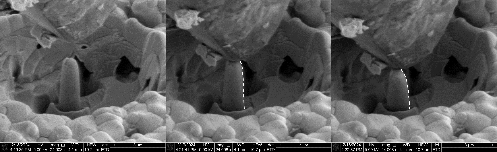
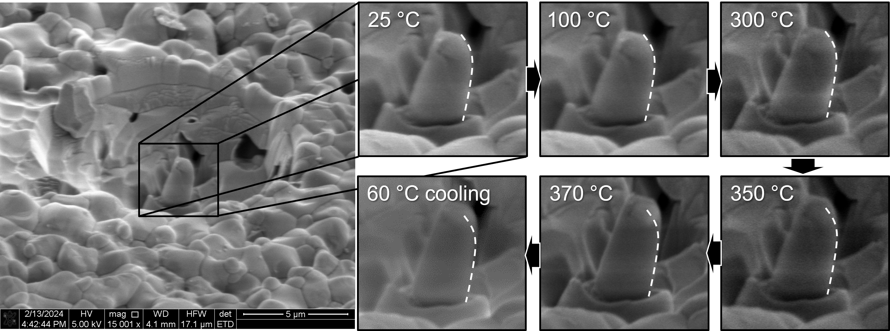
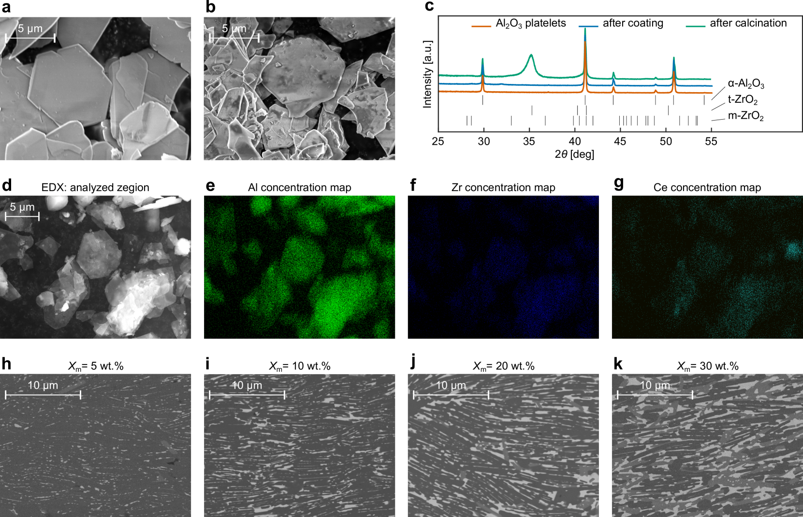

# 相変態が亀裂を閉じる：形状記憶セラミックスにおけるナノスケール自己修復機構

- 執筆日：2026-04-30
- トピック：イットリア安定化ジルコニア（YSTZ）のナノスケール自己修復メカニズム——正方晶→単斜晶相変態誘起き裂閉合の原子論的解明と実験的検証
- タグ：Structure and Microstructure / Phase Transitions; Defects and Impurities / Molecular Dynamics; Transport Measurements
- 注目論文：arXiv:1812.11136（N. Zhang, M. A. Zaeem, 2018）
- 参照論文数：6本

---

## 1. なぜ今この話題なのか

セラミックスはその化学的安定性・耐熱性・高硬度から、タービン翼、エンジン部品、生体インプラント、核融合炉ライニングなど過酷環境での利用が期待される材料である。しかし長年の最大の課題は、金属と異なりほぼ塑性変形を示さないためき裂が容易に進展し、脆性破壊が起きやすいという点であった。き裂発生後に材料自身が自律的に損傷を修復できる「自己修復（self-healing）セラミックス」は、この難題を根本から転換する可能性を持つ。

自己修復セラミックスは大きく二つの機構に分類される。第一はMAX相（Ti₃AlC₂やTi₂AlCなど層状三元炭化物）や一部のSiC系複合材料に見られる酸化誘起修復で、き裂内部で酸化物（TiO₂、Al₂O₃など）が生成してき裂を充填する。第二は、形状記憶セラミックスにおける相変態誘起き裂閉合機構である。後者の代表が、**イットリア安定化正方晶ジルコニア（Yttria-Stabilized Tetragonal Zirconia: YSTZ）** であり、加圧下での正方晶（tetragonal, t相）から単斜晶（monoclinic, m相）へのマルテンサイト変態に伴う体積膨張（約4〜5%）がき裂を圧縮閉合する。

この機構は変態靭化（transformation toughening）として1975年にGarvieらが発見して以来、高強度・高靭性ジルコニアセラミックスの理論的基盤となってきた。しかし「き裂先端での変態がどのように進行し、き裂を実際に閉じるか」という原子スケールのメカニズムは長らく実験的に直接観察することが困難であった。近年の分子動力学（MD）シミュレーションの精緻化と、FIB（集束イオンビーム）/SEM（走査型電子顕微鏡）を組み合わせたナノスケール力学試験の進展が、この問いに正面から向き合う環境を整えつつある。

2025年にはJetterとQuandtがYSZ単結晶マイクロピラーの圧縮・加熱実験でセラミックスの形状記憶効果（SME）を実験的に確認し（arXiv:2504.01505）、Edalatiらはナノ構造化YSZの新規プロセスによって従来比で顕著に高い硬度と靭性を実現した（arXiv:2507.22298）。これらの実験成果は、計算論的な予言が現実の材料設計に接続されつつあることを示している。

本記事では、MDシミュレーションによってYSTZナノピラー中のき裂・ボイド自己閉合機構を原子論的に解明したZhang & Zaeem（2018, arXiv:1812.11136）を中心に据え、関連する実験・計算・設計研究を有機的に統合することで、「相変態はなぜ・どのように・どの範囲でき裂を閉じることができるのか」という問いを多角的に考察する。

---

## 2. 未解決問題は何か

**問い1：原子スケールのき裂閉合メカニズムの詳細**

変態靭化の巨視的な効果（き裂先端での圧縮応力場の形成）は広く認められているが、原子スケールでどの程度のき裂幅・き裂形態が変態誘起閉合の対象になるのか、閉合後の界面がどのような構造をとるのか、完全な強度回復が達成されるのかといった問いは、実験では直接観察が難しく未解明な部分が多い。特に「臨界き裂幅」の存在——それ以下ならば完全閉合するが、それを超えると閉合が不完全になる限界——はシミュレーションで提示されたが実験的な検証はまだ限られている。

**問い2：ナノスケール知見はバルク材料でどこまで成り立つか**

MD計算は必然的にナノメートルスケールのシステムを扱う。現実のバルクセラミックスでは粒径・気孔・粒界・二次相の存在が複雑にからみあう。ナノピラー単結晶で示された閉合機構が、多結晶バルク材料のマクロな自己修復性能にどのように寄与するのかはいまだ定量的な橋渡しが不十分である。Edalatiら（2025）のように平均粒径80 nmのナノ構造YSZをバルクで実現した報告が現れるなど、実験の精度は着実に上がっているが、「き裂閉合」そのものをバルクで直接観察した報告はまだ少ない。

**問い3：他材料系・他機構との組み合わせで何が可能か**

YSTZは変態靭化と形状記憶効果を兼ね備えるユニークな材料系であるが、最大使用温度・化学的安定性の観点から適用範囲に制限がある。MAX相が示す酸化誘起修復との組み合わせ、あるいはBayesian最適化のような計算駆動型設計（arXiv:2406.14423）で別のセラミックス複合材にも変態靭化を導入することで、より汎用的な自己修復セラミックスを設計できるのかが問われている。

---

## 3. 注目論文の核心

**Zhang & Zaeem（2018, arXiv:1812.11136）「Nanoscale Self-Healing Mechanisms in Shape Memory Ceramics」**

### 何が解明されたか

この論文は、形状記憶セラミックスであるYSTZのナノピラーにき裂（crack）とボイド（void）を意図的に導入し、圧縮負荷下での自己修復挙動を原子論的シミュレーション（分子動力学法）で明らかにした。著者らはシリコンの間に挟んだ2方向性——[011̄]方向と[001]方向——のYSTZナノピラー（断面数nm〜数十nm）を計算モデルとして選択している。この二方向は、YSTZにおける支配的な変形機構が異なるため、き裂閉合の経路が質的に異なることを示す上で戦略的な選択である。

### 主要発見：二つのき裂閉合機構

**[011̄]方向ナノピラー：相変態誘起き裂閉合**

[011̄]方向に配向したYSTZナノピラーでは、圧縮負荷下でt相（正方晶）からm相（単斜晶）へのマルテンサイト変態が支配的な変形モードとなる。この変態は約4〜5%の体積膨張を伴い、き裂面を内側から圧縮する。計算結果は、き裂幅が特定の臨界値（おおよそ1 nm未満という原子数個レベル）以下であれば、圧縮変態によってき裂が完全に閉合することを示した。これが論文の主要な主張であり、「変態がき裂をふさぐ」という直感的なイメージに原子論的な根拠を与えた。

さらに著者らはき裂閉合後の応力分布を解析し、新たに形成されたm相帯域の境界部に応力集中が生じることを示している。これは修復後の材料がき裂閉合以前とは異なる内部応力状態を持つことを意味し、修復の「質」を評価するうえで重要な知見となる。

ナノピラーサイズ依存性についても系統的に検討されており、ピラーが大きくなる（より多くの原子数を含む）ほど自己修復挙動が改善されることが示された。これは、より大きな系ではt→m変態を起こす相体積が多く確保でき、き裂面に対してより多くの体積膨張が供給されるためと解釈されている。

**[001]方向ナノピラー：転位移動と非晶質相によるボイド閉合**

[001]方向では支配的な変形機構が転位（dislocation）の移動に変わる。転位移動の結果として局所的に非晶質（アモルファス）相が生成し、この非晶質相がボイドの閉合を助けることが示された。これは金属の塑性変形によるき裂閉合と概念的に類似しており、セラミックスにおける転位活動が一定条件下では損傷修復に寄与しうることを示す珍しい事例である。

### 何がまだ仮説段階か

論文の知見はナノスケールの単結晶モデルに限定されており、いくつかの重要な仮定を含む。MDに使われたYSZ用ポテンシャルは実験データを再現するよう最適化されているが、変態エネルギー障壁や界面エネルギーの厳密な定量性については議論の余地がある。また「完全に閉合した後、元の強度が回復するか」については本論文では未検討である。き裂閉合が原子的な接触を達成しても、界面の原子配列は元の完全結晶とは異なる場合があり、修復後の力学特性への影響は別途評価が必要だ。

---

## 4. 背景と研究史

### 変態靭化の発見と確立

ジルコニア（ZrO₂）が超高靭性を持てる可能性は、1975年にGarvieらによって初めて実証された。彼らは、正方晶ジルコニアが単斜晶への変態に際して体積が膨張することを利用すれば、き裂先端に圧縮応力を誘起してき裂進展を抑制できると示した——これが「**変態靭化（transformation toughening）**」の始まりである。その後2〜3 mol%のY₂O₃を添加することで正方晶を室温で準安定に保つ手法（イットリア安定化正方晶ジルコニア多結晶体：Y-TZP）が確立し、破壊靭性 $K_{IC}$ が5〜10 MPa√m という、アルミナ（3〜4 MPa√m）をはるかに凌ぐ値が実現された。

マルテンサイト変態の直接観察という実験的課題については、Deville & Chevalier（2003, arXiv:1710.04442）が原子間力顕微鏡（AFM）を用いてYSTZのき裂周辺表面を観察し、マルテンサイト浮き彫り（martensite relief）——t→m変態に伴う表面の変位——を初めて直接的に捉えることに成功した。この研究は、変態がき裂先端の応力集中域で優先的に発生し、自己収容マルテンサイト対（self-accommodating martensite pairs）を形成することを示した。変態の可能性がイットリア添加量の増加とともに低下し、靭化への寄与が減少することも定量化された。1710.04442はarXiv nonexclusiveライセンスのため図の引用はできないが、この実験的知見は注目論文のMD計算が「表面近傍でのマルテンサイト発生」を含む適切な境界条件設定をする上での実験的根拠となっている。

### バルクYSTZの靭性限界への挑戦

従来の3Y-TZP系では破壊靭性は金属の底辺（鉄鋼：50〜100 MPa√m）にはるかに及ばず、高強度と高靭性のトレードオフが長年の難題であった。Matsuiら（2021, arXiv:2112.14372）は、2.9 mass%のY₂O₃で安定化したZrO₂にAl₂O₃をドープすることで、従来のジルコニアセラミックスの靭性を大きく超え、金属材料に匹敵する靭性値を実現した。この成果は変態靭化の実験的到達点を示す重要な比較基準であり、注目論文が提示する「ナノスケールでの完全き裂閉合」が現実の高靭性化に向けた一つのアプローチであることを位置づけるうえで欠かせない。2112.14372はCC BY-NC-ND 4.0ライセンスである。

### ナノ構造化による新たな展開

Edalatiら（2025, arXiv:2507.22298）は、高圧ねじり（HPT）とスパークプラズマ焼結（SPS）を組み合わせた新規プロセスで、平均粒径80 nm・相対密度99%のバルクナノ構造YSZの作製に成功した。このYSZはHPTによってt→m変態を経験し、その後SPSで再びt相へ戻るが、多数の転位を内包したまま焼結される。結果として硬度1500 Hvという非常に高い値が得られ、圧痕試験でもき裂が観察されず良好な破壊靭性が確認された。一方、HPTを経ない試料は多数のき裂を生じた。ナノ構造化と転位の存在が靭性を大幅に向上させることを実証したこの研究は、注目論文が示した「ナノスケール系で相変態と転位活動がき裂閉合に寄与する」というメカニズムの実験的アナログとして理解できる。Hall-Petch則との整合もよく、粒径制御が力学特性設計の鍵であることを示している。

---

## 5. どの解釈が最も妥当か

### 注目論文の解釈を支える根拠

Zhang & Zaeem（2018）が示した「圧縮下でt→m変態によりき裂が閉合する」という機構は、いくつかの独立した実験・観察と整合している。

まず、Deville & Chevalier（2003）のAFM観察は、YSTZのき裂先端付近でマルテンサイト変態が実際に生じることを実験的に示しており、MD計算の前提——「圧縮応力下でt→m変態が誘起される」——の妥当性を裏付ける。次に、Edalatiら（2025）の研究は、ナノ粒径化と内部転位の導入がき裂抑制に有効なことを示した。これは注目論文の[001]方向ナノピラーで「転位移動→非晶質相生成→ボイド閉合」という機構が実際の材料でも一定の役割を担いうることを示唆する。さらにJetter & Quandt（2025, arXiv:2504.01505）の実験は、YSZ系で4%超の永久変形後に370°Cの加熱で形状回復が起きることを直接確認しており（次節で詳述）、SMEが実材料系で発現することの実験的証拠となる。

*図1: YSZ系セラミック単結晶マイクロピラーのin-situ圧縮実験（Jetter & Quandt, 2025, arXiv:2504.01505, CC BY-NC-ND 4.0）。FIBで作製したマイクロピラーを圧縮し、4%超の永久変形が観察された。*

*図2: 同試料を370°Cに加熱した後の形状回復（Jetter & Quandt, 2025, arXiv:2504.01505, CC BY-NC-ND 4.0）。熱誘起逆変態（m→t）による形状記憶効果が確認された。*

### 実験との相違点と残る不確定性

一方で、注目論文の結論にはいくつかの限界と未解決点がある。

第一に、**臨界き裂幅の定量的な実験的検証**が欠けている。MD計算は「〜1 nm以下のき裂なら完全閉合が可能」という示唆を与えるが、この値は用いたポテンシャルや境界条件に依存する可能性がある。実際のYSTZでは粒界、析出物、偏析などの影響でき裂先端形状が均一でなく、単純なナノピラーモデルとは異なる挙動を示しうる。

第二に、**スケールアップの問題**が未解決である。単結晶ナノピラーのき裂閉合が実際のバルク多結晶体での損傷回復にどう繋がるかは、粒界での変態挙動、き裂の三次元的な分岐形状、競合する破壊モードなどが絡み合うため単純に外挿できない。Jetter & Quandt（2025）の実験も単結晶マイクロピラーを対象としており、多結晶体への展開は今後の課題として残る。

第三に、**修復後の強度・疲労特性**の問題がある。き裂が「原子的に閉合」しても、界面における原子の再配列が元の完全結晶の状態と等価でなければ、繰り返し負荷に対する耐久性は元の材料に劣る可能性がある。現時点ではこれを評価した計算・実験報告はほとんどない。

### どの結論が比較的強く支持されるか

総合すると、「圧縮応力下でのt→m相変態がナノスケールのき裂を閉合できる」という基本的な機構は実験的・計算論的に整合した知見の積み上げによって比較的強く支持されている。しかしその効果が「完全な強度回復」まで達成できるかどうか、バルク材での実用的な自己修復につながるかどうかは現段階では弱い結論に留まり、今後の実験的検証が不可欠である。

---

## 6. 何が一般化できるのか

### 形状記憶効果の他材料系への展開

変態靭化の概念はジルコニア以外の材料系にも拡張されつつある。セリア安定化ジルコニア（Ce-TZP）はイットリア系より大きな変態ひずみを示し、マルテンサイト変態のリバーシビリティも高い。Aielloら（2024, arXiv:2406.14423）はCe-YSZをモルタル相として用い、Al₂O₃のレンガと組み合わせたブリックモルタル構造の「二重高靭性セラミックス」をBayesian最適化で設計した。この研究では、バイオインスパイアード微細構造（貝殻様の積層構造）と変態靭化の多スケール組み合わせにより、曲げ強度704 MPa・破壊靭性13.6 MPa√mという金属並みの特性を達成した。

*図3: Bayesian最適化によって設計されたブリックモルタル型多重靭化セラミックスの構造模式図（Aiello et al., 2024, arXiv:2406.14423, CC BY-NC-SA 4.0）。Al₂O₃（レンガ）をCe-YSZ（モルタル）でつなぐバイオインスパイアード設計。*

この逆設計アプローチは重要な示唆を与える——自己修復性能の設計においても、単に「変態靭化材料を選ぶ」のではなく、き裂発生・変態・体積膨張・閉合という一連の過程を最適化する目的関数として定式化し、機械学習・最適化アルゴリズムを活用するアプローチが有効になりうる。

### MAX相との比較

MAX相セラミックス（Ti₃AlC₂, Ti₂AlCなど）は高温（800〜1200°C）における酸化誘起の自己修復で有名であり、酸化で生じたTiO₂/Al₂O₃がき裂に充填する。この機構はYSTZの相変態誘起機構と相補的であり、異なる温度域・環境での自己修復をカバーする。理想的には、常温〜低温ではYSTZ型変態機構が、高温では酸化充填型が機能するハイブリッド材料の設計が考えられる。この方向の研究はまだ萌芽的段階にある。

### 計算科学的アプローチの可能性

MD計算が明らかにした「臨界き裂幅」「サイズ効果」「変形方向依存性」などの知見は、フェーズフィールドモデル（メゾスケール）へと橋渡しされることで、多結晶体でのき裂閉合ダイナミクスをより実用的なスケールで議論できる。現時点ではMDとフェーズフィールドを繋ぐマルチスケール計算はまだ限られているが、将来的な計算材料科学の重要課題となりうる。

---

## 7. 基礎から理解する

### セラミックスの脆性とGriffith破壊力学

材料が外力を受けたときにどのように壊れるかを理解するには、まず**破壊力学（fracture mechanics）** の基礎から始める必要がある。金属は降伏（塑性変形）によって応力集中を緩和できるが、セラミックスは共有結合・イオン結合を主体とするため転位の移動が非常に困難で、ほとんど塑性変形を示さずに脆性破壊する。

脆性破壊を支配する基本関係式はGriffithの破壊基準である。き裂長さを $a$、遠方応力を $\sigma$、材料のヤング率を $E$、表面エネルギーを $\gamma_s$ とすると、平面応力条件下でのき裂進展開始条件は

$$\sigma_c = \sqrt{\frac{2E\gamma_s}{\pi a}}$$

と書ける。この式は、き裂が長いほど（$a$ が大きいほど）低い応力でき裂が進展することを意味する。逆に言えば、き裂が短い段階で閉合できれば、材料は次の負荷に対してはるかに高い耐力を示す。これが自己修復の機械的な意義である。

実際の工学的評価では**破壊靭性 $K_{IC}$**（応力拡大係数の臨界値）が使われる。き裂先端付近の応力場は

$$K_I = Y\sigma\sqrt{\pi a}$$

と定義され（$Y$ は形状係数）、$K_I \geq K_{IC}$ となるとき破壊が進行する。Al₂O₃では $K_{IC} \approx 3$〜$4$ MPa√m、Y-TZPでは $K_{IC} \approx 5$〜$10$ MPa√m、そしてMatsuiらが達成した高靭性系では金属並みの値が実現されている。

### マルテンサイト変態とは何か

**マルテンサイト変態（martensitic transformation）** は、拡散を伴わずに原子の協調的な変位によって結晶構造が変わる一次相転移である。鉄鋼のオーステナイト→マルテンサイト変態が最もよく知られているが、ジルコニアのt→m変態も同じ分類に属する。

ジルコニアにおいては、正方晶（c軸が長い）から単斜晶（β≈99°の傾いた格子）への変態が、冷却または機械的応力によって引き起こされる。この変態は体積的に見ると約4〜5%の体積膨張を伴う。正確には、格子定数の変化から計算すると体積ひずみ

$$\epsilon_v = \frac{V_m - V_t}{V_t} \approx 0.04 \sim 0.05$$

が生じる。この膨張は等方的ではなく、主としてひとつの結晶方向に沿って大きなせん断ひずみを伴う点がマルテンサイト変態の特徴である。き裂先端付近で変態が生じると、この体積膨張がき裂面を内側から押さえつける「圧縮」として作用し、き裂の進展を妨げる——これが変態靭化の直感的な描像である。

### Y₂O₃添加によるt相の準安定安定化

純粋なZrO₂は室温で単斜晶（m相）が熱力学的に安定であり、約1170°CでZirconia is tetragonal (t相)、約2370°C以上で立方晶（c相）となる。製造の際に高温でt相を形成した後に冷却すると、通常は1170°C付近でm相への変態を起こし体積変化によって割れが生じる——これがジルコニアの実用化を長年妨げた問題であった。

イットリア（Y₂O₃）を2〜4 mol%程度添加すると、イットリウムイオン（Y³⁺）がジルコニウムイオン（Zr⁴⁺）の一部を置換することで酸素空孔が生じ、格子の歪みエネルギーが変態を「凍結」する効果を持つ。結果として、t相が室温で準安定に保たれる（**Y-TZP: Yttria-doped Tetragonal Zirconia Polycrystal**）。この準安定t相は応力を受けると変態を起こす——つまり「変態するための予備エネルギー」を蓄えた状態にある。き裂先端の大きな引張応力場がこの変態を誘起するのが変態靭化であり、ナノスケール自己修復機構もこの変態のリバーシビリティ（圧縮応力下でのt→m変態）を利用している。

### 形状記憶効果（SME）の基礎

金属のNiTi合金（Nitinol）に代表される**形状記憶効果（Shape Memory Effect: SME）** は、変形後に加熱すると元の形状に回復する現象で、マルテンサイト変態の熱的逆変態（m→t）によって実現される。セラミックスでは転位移動が困難なため大きな塑性ひずみが回復できず、SMEは稀にしか観察されないとされてきた。しかし近年、単結晶ジルコニアをマイクロスケールで変形させると数%のひずみ回復が観察されており（Jetter & Quandt 2025, arXiv:2504.01505）、これはSMEの発現として解釈されている。

形状回復の熱力学は、マルテンサイト変態の順逆の温度——$M_s$（変態開始温度）、$M_f$（変態終了温度）、$A_s$（逆変態開始温度）、$A_f$（逆変態終了温度）——によって特徴づけられる。YSTZではY₂O₃の量、粒径、加工履歴によってこれらの温度が変化するため、特定の用途に合わせたチューニングが可能である。Jetter & Quandt（2025）が観察した370°Cでの形状回復は、YSZ系における $A_f$ がこの温度付近にあることを示す直接的な実験証拠である。

### 分子動力学法（MD）の基礎と限界

**分子動力学法（Molecular Dynamics: MD）** は、各原子に作用する力を原子間ポテンシャル（AまたはAIMD等で求めた力場）から計算し、ニュートンの運動方程式

$$m_i \ddot{\mathbf{r}}_i = -\nabla_i U(\{\mathbf{r}_j\})$$

を数値的に積分する計算手法である。$m_i$は原子$i$の質量、$\mathbf{r}_i$はその位置、$U$ はすべての原子座標の関数としての全ポテンシャルエネルギーである。計算の時間ステップは通常フェムト秒（10⁻¹⁵秒）オーダーで、総計算時間はナノ秒程度までが現実的な限界となる。

YSTZのMD計算では、ZrとO、YとOの相互作用を記述するポテンシャルの精度が重要となる。Zhang & Zaeem（2018）が用いたBuck-Coul型のポテンシャルはYSZの格子定数・弾性定数・相変態エネルギーをよく再現するが、特に欠陥近傍の原子配置や動的な変態過程における精度については注意が必要である。MDの本質的な限界として、（1）系のサイズがナノメートルスケールに限られる（表面効果が大きい）、（2）シミュレーション時間が短く、熱活性化過程が十分に取り込まれない、（3）用いるポテンシャルの精度に依存する、の3点が常に念頭に置かれるべきである。

---

## 8. 専門用語の解説

**1. 変態靭化（transformation toughening）**
き裂先端近傍の応力場によってマルテンサイト変態が誘起され、体積膨張に伴う圧縮応力がき裂進展を抑制する靭化機構。Garvieら（1975）によって発見。YSTZがセラミックスの中で高い破壊靭性を持つ主要因である。本論文では、この機構をナノスケールで捉え、「変態がき裂そのものを閉じる」能動的修復として位置づけた点に新規性がある。

**2. マルテンサイト変態（martensitic transformation）**
拡散を伴わず、原子の協調的な変位によって起きる一次相転移。ジルコニアでは正方晶→単斜晶変態が該当し、約4〜5%の体積膨張とせん断ひずみを伴う。変態の速度は音速に近く、準瞬間的に生じる。温度または応力によって誘起される。

**3. イットリア安定化正方晶ジルコニア（YSTZ/Y-TZP）**
Y₂O₃を2〜4 mol%添加することでt相を室温で準安定に保ったジルコニア。YはZrサイトを置換し酸素空孔を形成することで相変態を抑制する。変態靭化と形状記憶効果の基盤となる材料系。本論文の主要計算対象。

**4. 自己収容マルテンサイト対（self-accommodating martensite pairs）**
マルテンサイト変態では、隣接した変形バリアントが互いのせん断ひずみを打ち消し合うように対をなして生成することがある。これにより全体の巨視的形状変化が最小化される。Deville & Chevalier（2003）がAFMでYSTZ表面に直接観察した。

**5. 臨界き裂幅（critical crack width）**
変態誘起き裂閉合が完全に達成できるき裂幅の上限値。Zhang & Zaeem（2018）のMD計算では、この値以下のき裂であれば圧縮変態によって完全閉合が可能だが、それを超えると閉合が不完全になることが示された。定量的な値はナノメートルスケールで、実験的な直接検証はまだ達成されていない重要なパラメータ。

**6. 高圧ねじり（High-Pressure Torsion: HPT）**
試料にGPaオーダーの高圧を加えながら回転せん断変形を与える強ひずみ加工法。金属では広く使われているが、本来はセラミックスには適用が難しいと考えられてきた。Edalatiら（2025）はYSZにHPTを施すことでt→m変態と高密度転位の導入を実現し、その後SPSで再焼結することで80 nmという極めて微細な粒径を持つバルクナノ構造YSZを得た。

**7. スパークプラズマ焼結（Spark Plasma Sintering: SPS）**
パルス状の大電流を粉末に通電しながら加圧焼結する手法。短時間・低温焼結が可能なため、粒成長を抑えてナノ構造を維持しながら高密度な焼結体を得ることができる。Edalatiら（2025）はHPT処理したYSZをSPSで99%相対密度に焼結した。

**8. Hall-Petch則**
「降伏応力（硬度）は粒径の平方根に反比例して増加する」という関係式。$\sigma_y = \sigma_0 + k/\sqrt{d}$ と表される（$d$: 粒径、$k$: Hall-Petch係数）。金属で広く成立することが知られているが、セラミックスでも一定範囲で成立することが確認されている。Edalatiら（2025）はYSZでのHardness-粒径関係がこの式とよく整合することを示した。

**9. 形状記憶効果（Shape Memory Effect: SME）**
変形後に加熱するとマルテンサイトの熱的逆変態によって元の形状に回復する現象。NiTi等の形状記憶合金で有名だが、セラミックスでは報告例が少なかった。Jetter & Quandt（2025）がYSZ単結晶マイクロピラーで370°Cでの形状回復を観察し、セラミックスSMEの実験的証拠を提示した。

**10. Bayesian最適化（Bayesian optimization）**
実験パラメータ空間を効率的に探索するための確率論的最適化アルゴリズム。試行ごとの結果をガウス過程回帰でモデル化し、次に試すパラメータを「獲得関数（acquisition function）」に従って選択する。コストの高い実験回数を最小化しながら最適解を見つけることができる。Aielloら（2024）はセラミックスの力学特性最適化にこのアプローチを適用し、従来の試行錯誤を大幅に効率化した。

---

## 9. 今後の展望

### 近い将来に確からしくなりつつあること

変態誘起き裂閉合というメカニズムの基本的な存在は、MD計算（Zhang & Zaeem 2018）、AFM観察（Deville & Chevalier 2003）、マイクロピラー実験（Jetter & Quandt 2025）の三者によって多角的に支持されており、比較的強固な科学的基盤を持つ。ナノ構造化が力学特性を大幅に向上させることも（Edalati et al. 2025、Matsui et al. 2021）、複数の独立した研究グループによって示されており、「ナノスケールで相変態とき裂閉合が連動する」という描像の信頼性は高まっている。今後1〜2年で期待されるのは、これらをつなぐ多結晶体MDとフェーズフィールドのマルチスケール計算、および透過電顕（TEM）やX線回折を用いたin-situき裂観察の進展である。特に冷却ステージ付きTEM中での圧縮実験は、変態の時空間発展を原子解像度で追える可能性があり、臨界き裂幅の実験的決定という懸案に答えをもたらすかもしれない。

### まだ未確定で重要な問い

修復後のき裂界面における原子構造と力学特性（残留応力、界面強度、疲労寿命）の問題は、自己修復セラミックスを実用材料として評価するうえで避けて通れないが、現段階では計算・実験ともに知見が極めて限られている。また、相変態誘起修復がバルク多結晶体のマクロな自己修復性能に定量的にどう貢献するかの実証も未達成である。Bayesian最適化に代表される計算駆動型設計が「自己修復性能」を目的関数に組み込んだとき、どのような微細構造・組成が最適解として浮かび上がるかも、今後3年程度で答えが出てくる可能性が高い論点である。セルフヒーリングとエネルギー変換や生体親和性を組み合わせた次世代機能セラミックスへの展開は、材料設計の新しい地平として注目に値する。

---

## 参考論文一覧

1. **arXiv:1812.11136** — N. Zhang, M. A. Zaeem, "Nanoscale Self-Healing Mechanisms in Shape Memory Ceramics" (2018). [https://arxiv.org/abs/1812.11136](https://arxiv.org/abs/1812.11136)
   YSTZナノピラーにき裂・ボイドを導入し、MDシミュレーションによって圧縮下での相変態誘起き裂自己閉合機構を原子論的に解明した注目論文。

2. **arXiv:2504.01505** — J. Jetter, E. Quandt, "In-situ compression and shape recovery of Ceramic single grain micro-pillar" (April 2025). [https://arxiv.org/abs/2504.01505](https://arxiv.org/abs/2504.01505)
   FIB/SEM+加熱ステージを用いてYSZ単結晶マイクロピラーの形状記憶効果を実験的に確認した最新報告。

3. **arXiv:2507.22298** — K. Edalati, K. Morita, S. Dangwal, Z. Horita, "Bulk Nanostructured Zirconia Ceramics with High Hardness and Toughness via Integration of High-Pressure Torsion and Spark Plasma Sintering" (July 2025). [https://arxiv.org/abs/2507.22298](https://arxiv.org/abs/2507.22298)
   HPT+SPSプロセスにより粒径80 nmのバルクナノ構造YSZを実現し、硬度1500 Hvと良好な破壊靭性を達成した実験研究。

4. **arXiv:2112.14372** — K. Matsui, K. Hosoi, B. Feng, H. Yoshida, Y. Ikuhara, "Ultrahigh toughness polycrystalline ceramics without fading of strength" (2021). [https://arxiv.org/abs/2112.14372](https://arxiv.org/abs/2112.14372)
   Y₂O₃-ZrO₂へのAl₂O₃ドープによって金属並みの破壊靭性を実現した実験的到達点を示す研究。

5. **arXiv:2406.14423** — F. Aiello, J. Zhang, J. C. Brouwer, M. Salazar, D. Giuntini, "Double-tough and ultra-strong ceramics: leveraging multiscale toughening mechanisms through Bayesian Optimization" (2024). [https://arxiv.org/abs/2406.14423](https://arxiv.org/abs/2406.14423)
   Al₂O₃/Ce-YSZブリックモルタル型複合材料をBayesian最適化で設計し、強度704 MPa・靭性13.6 MPa√mを達成した逆設計研究。

6. **arXiv:1710.04442** — S. Deville, J. Chevalier, "Martensitic relief observation by atomic force microscopy in yttria stabilized zirconia" (2003/arXiv 2017). [https://arxiv.org/abs/1710.04442](https://arxiv.org/abs/1710.04442)
   AFMによってYSTZき裂近傍でのマルテンサイト変態を初めて直接観察し、変態靭化の原子スケールの証拠を与えた古典的実験研究。
