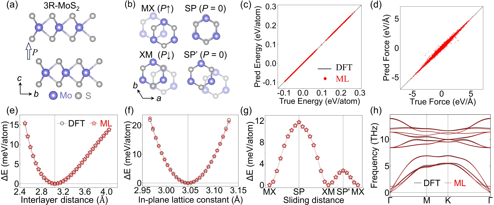
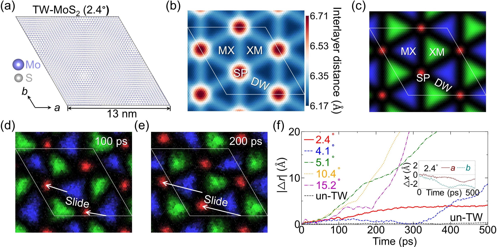
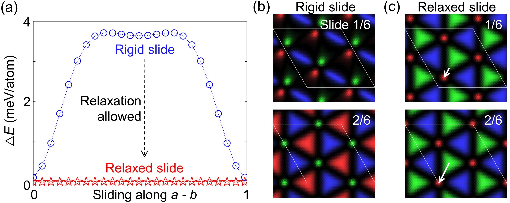
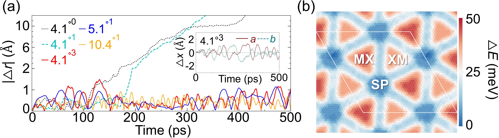

# スライディング強誘電体モアレ超格子における超低障壁滑走とピニング：機械学習が解き明かす微視的動力学

- 執筆日：2026-04-26
- トピック：モアレ強誘電体における超低障壁スライディングとドメイン壁ピニング転移の機械学習分子動力学による解明
- Devices and Functional Materials, Low-Dimensional Materials, Memory and Information Functionality, Machine Learning, Molecular Dynamics
- 注目論文：[2604.20277] Domain-Wall-Mediated Ultralow-Barrier Sliding and Pinning in Ferroelectric Moiré Superlattices Revealed by Machine Learning (Li et al., 2026)
- 参照論文数：7

---

## 1. なぜ今この話題なのか

次世代の不揮発性メモリや低消費電力デバイスの鍵を握る材料として、**スライディング強誘電体（sliding ferroelectrics）** が急速に注目を集めている。従来の強誘電体（ペロフスカイト型BaTiO₃など）が格子中のイオン変位によって分極を生じるのに対し、スライディング強誘電体では積層した二次元（2D）van der Waals（vdW）材料の層間を「滑らせる」ことで分極の向きが反転する。この動作原理は根本的に異なり、フォールトフリー・スイッチング（疲労劣化しない）、超高速動作、極めて薄い素子への適用可能性といった魅力的な特性をもたらす。

2021年から2022年にかけて、WTe₂、h-BN、MoS₂、WSe₂などの2D材料において界面強誘電性が次々と発見・確認された。特に、わずかにツイスト（積層角を少しずらす）した2D半導体の二層系では、ツイスト角に起因する**モアレ超格子**（moiré superlattice）が形成され、局所的な積層秩序のゆっくりとした空間変調が周期的なドメイン構造として現れる。この「モアレ強誘電体」は、メモリ素子・シナプス素子・フラクションウィング状態のプラットフォームとして多分野からの期待を一身に集めている。

しかし、こうした材料で分極スイッチングが「実際にどのように起こっているのか」という微視的な動力学は、理論・実験ともにほとんど解明されていなかった。電場を印加したとき、二層全体が剛体として一斉に滑るのか、それともドメイン壁が先行して動くのか？ 熱揺らぎはどこまで分極スイッチングを助けるのか？ そして現実の試料に不可避な硫黄欠損などの欠陥は、動作にどう影響するのか？ これらの問いに答えようとすると、モアレ周期（数十nm）かつナノ秒以上の時間スケールという二重の困難が立ちはだかる。第一原理計算は精度は高いが、これほど大きい系の長時間動力学を追うことはほぼ不可能である。

この壁を突破したのが、機械学習ポテンシャル（ML potential）を用いた**機械学習分子動力学**（ML-MD）という手法である。第一原理計算に近い精度を保ちながら、古典MDに匹敵する計算速度を実現するML-MDによって、初めてモアレ超格子スケール（数千原子、ナノ秒）の動的シミュレーションが可能になった。本稿で取り上げる2026年4月のプレプリント [2604.20277]（Li et al.）は、まさにこの手法を3R-MoS₂ツイストバイレイヤーに適用し、スライディング動力学の本質とピニング（固着）転移の起源を初めて微視的に明らかにした画期的な成果である。

---

## 2. 未解決問題は何か

### 問い①：スライディングは剛体並進か集団的ドメイン壁運動か？

従来の理論的枠組みでは、スライディング強誘電体のスイッチングは「両層全体が面内方向に剛体として一斉にずれる」プロセスとして記述されることが多かった。このとき重要な量は**剛体スライドバリア**（rigid-sliding barrier）、すなわち二層を剛体のまま相対変位させたときのエネルギー障壁である。第一原理計算によると、MoS₂バイレイヤーの剛体スライドバリアは数meV/原子程度と小さいが、ゼロではない。

しかしモアレ超格子は、RR積層（3R型：R極性）とMM積層（ミラー型：M極性）のドメインが周期的に並んだ「マルチドメイン」構造を形成している。この場合、分極スイッチングは剛体並進ではなく、RRドメインとMMドメインの境界にある**ドメイン壁**（domain wall，以下DW）の移動によって進行する可能性がある。DWを介した経路（**DW媒介スライディング**）では、局所的なストレイン・ソリトン（soliton）の集団運動が引き起こすモアレパターン全体のシフトが生じ得る。実際にそのような集団的経路があり、しかも剛体並進よりも格段に障壁が低いのかどうかが未解決だった。

### 問い②：欠陥はいつスライディングをピニングに変えるか？

現実の2D薄膜試料には、成長過程で不可避的に**硫黄欠損**（S vacancy）が導入される。欠損濃度はグレードによって異なるが、CVD成長のMoS₂では0.01〜0.1%程度が典型的とされる。このようなごくわずかな欠陥が分極スイッチングを阻害し、DWがその場に固着してしまう「ピニング」を引き起こす閾値は何%なのか。また、ピニング後のDWは完全に動けなくなるのか、それとも局所的な振動を続けるのかが不明だった。

### 問い③：モアレ強誘電体の動力学はツイスト角に依存するか？

モアレ超格子はツイスト角 θ によってモアレ波長が決まる。θ が大きくなるほどモアレ波長は短くなり、ドメインサイズが縮小する。これまでの実験では主に「わずかなツイスト」（θ ≲ 2°）の系が研究されていた。しかし DW 媒介スライディングや欠損ピニングがθ に強く依存するなら、動作特性を角度で制御できることになり、設計戦略上も重要である。一方、これらの現象がθ に依存しないなら、モアレ強誘電体に普遍的な物理として一般化できる。

---

## 3. 注目論文の核心

### 機械学習ポテンシャルの構築

Li et al. は最初に、3R-MoS₂（Mo原子を挟む上下二層のS原子が同じ方向に並んだ菱面体型積層）バイレイヤーの**MACEポテンシャル**（Message Passing Neural Network に基づく equivariant GNN）を構築した。MACEは、原子周辺の三体・多体相互作用を回転・反転・並進対称性を厳密に保ちながらニューラルネットワークで表現するアーキテクチャであり、vdW間力の扱いが難しい層間相互作用にも高い精度を示す。

学習データは第一原理計算（VASP + PBE-D3 + PAW）で生成され、力・エネルギー・応力の精度は DFT との平均誤差がそれぞれ 5 meV/Å、0.2 meV/原子、0.5 kbar 以下と報告されている（図1参照）。このポテンシャルにより、エネルギー面のリアルな記述と数千原子・ナノ秒スケールのMDが初めて同時に実現した。

*図1: バイレイヤー3R-MoS₂に対するMACEポテンシャルの精度検証（Li et al., arXiv:2604.20277, CC BY 4.0）。DFT参照値（横軸）とML予測値（縦軸）の高い一致が確認できる。*

### 熱的に駆動される自発スライディング

2.4°のツイスト角を持つ 3R-MoS₂ バイレイヤー（約4,000原子）に対して300 Kの NVT アンサンブルで MD シミュレーションを実施した。すると、**外場がないにもかかわらず**、層間の相対変位が一方向に持続的にドリフトすることが観察された。相対速度は約 1 m/s と、材料としては非常に速い速度での自発的スライディングである。

さらに重要なのは、その運動の「様式」である。剛体並進ならば両層全体が一体となってずれるはずだが、実際に観察されたのは**モアレパターン全体のグローバルなドリフト**であった（図2）。つまり、RRドメインとMMドメインの空間配置が全体として平行移動する運動であり、これはドメイン壁の集団的移動に対応する。

*図2: 熱的に駆動されるモアレパターンのグローバルドリフト。外場なしで300 Kにおいてモアレ全体が~1 m/sで移動する（Li et al., arXiv:2604.20277, CC BY 4.0）。*

### 超低障壁経路の発見

なぜ熱揺らぎ（室温エネルギー ~25 meV）だけでこれほど速いスライディングが起こるのか。剛体スライドバリアは数 meV/原子であり、系全体で積分すれば実際はかなり大きい障壁になるはずだ。

この謎を解くために、著者らは**拘束緩和付きのスライディングエネルギー曲線**を計算した。従来の「剛体経路」では各スライドポジションで原子座標を固定してエネルギーを評価するのに対し、「緩和経路」では各スライドポジションで面内方向の原子座標を完全弛緩させる。その結果は劇的だった（図3）：緩和経路のエネルギー障壁は剛体経路の**1/100以下**、すなわちほぼゼロまで減少した。

この超低障壁は、DW 媒介の集団的構造再配列によって説明できる。一方のドメインが収縮する一方で他方が拡張するという「波打ち」様の局所弛緩が連続的に進行することで、系全体のトポロジーを保ちながら実質的に障壁なしでモアレパターンが移動できる。これは走行機械学のソリトン伝播に類似した「**波型DW運動**」（wavelike domain wall motion）であり、超潤滑（superlubricity）との深い関係が示唆される。

*図3: スライドエネルギー障壁の比較。緩和経路（DW媒介）では剛体経路の1/100以下の超低障壁が実現する（Li et al., arXiv:2604.20277, CC BY 4.0）。*

### 硫黄欠損による滑走からピニングへの転移

現実の試料における欠損効果を調べるために、S原子の一部をランダムに取り除いた系でMDシミュレーションを実施した。図4に示す結果は非常に鮮明である：欠損濃度が **~0.1%** を超えると、それまで続いていた長距離スライディングが突然停止し、DWが欠損サイトに固着して**局所的な振動**（ローカルオシレーション）に移行する。

0.1%という数値は非常に少ない。Mo₆₄S₁₂₈の系でいえば、1万原子あたり数個の欠損に相当する。しかも重要なのは、欠損がDWを直接破壊するわけではなく、DWの自由な移動を阻害して「ピニングセンター」として機能するという点だ。欠損周辺では局所的な弾性変形場が形成され、DWが通過しようとするとエネルギー障壁を感じる。0.1%という臨界濃度は、欠損間の平均距離がDWのサイズ（幅）程度になる点として理解できる。

この「スライディング−ピニング転移」の存在は、実験で観察されていた「モアレ強誘電体の分極が自然には切り替わらない（固定されているように見える）」という現象の微視的起源に対する有力な説明を提供する。

*図4: S欠損濃度依存性。~0.1%という極めて低い欠損濃度でスライディング→ピニングへの転移が起きる（Li et al., arXiv:2604.20277, CC BY 4.0）。*

---

## 4. 背景と研究史

### スライディング強誘電体の発見

「スライディング強誘電体」という概念が実験で確認されたのは2021年以降のことである。Fei et al.（2018）が1T'-WTe₂での強誘電的金属転換を報告した後、Yasuda et al. と Wang et al.（2021）が独立に、六方晶BN（h-BN）バイレイヤーと遷移金属ダイカルコゲナイド（TMD）バイレイヤーでの界面強誘電性を示した。**Wang et al. [2108.07659]** は、WSe₂、MoSe₂、WS₂、MoS₂という4種のTMDバイレイヤーで電気的スイッチング可能な分極を実証し、圧電力顕微鏡（PFM）によるドメイン壁の可視化に成功した。

ほぼ同時期に **Weston et al. [2108.06489]** は、わずかにツイストしたWSe₂/WS₂（marginally twisted）ヘテロバイレイヤーで室温強誘電性を報告した。この系では格子不整合によるモアレパターンが自然に形成され、AB積層（R型）とAB'積層（H型）のドメインが交互に並んだ縞模様のドメイン構造が観察された。この発見は「わずかなツイストで2Dの非強誘電材料から強誘電体が誕生する」という驚くべき事実を示し、モアレエンジニアリングの可能性を大きく広げた。

### モアレ強誘電性の起源論争

一方、モアレ強誘電体がなぜ強誘電性を示すのかについては、2024年まで議論が続いた。理論的には、ツイストした系は全体として反転対称性を保つはずであり、自発分極は禁止のはずだ。**Niu et al. [2403.17326]**（2025年 Nature Nanotechnology 掲載）は、この謎に対して電気的な実験から答えを提示した。グラフェン/BNモアレヘテロ構造を用いた実験で、モアレ強誘電性の本質的な寄与が「BNの界面スライディング強誘電性」であることを突き止め、しかもその動作に「**伝導性モアレ強誘電体**」という特殊なモードが関与することを示した。ここでピニングされたドメイン壁（pinned domain wall）が電子遮蔽の「異常スクリーニング」（anomalous screening）を引き起こすという洞察は、Li et al. の仮説と深くつながっている。

一方、 **Fan, Ke, Liu [2510.13568]** は全く異なるアプローチから「ピニング」の解釈に異議を唱えた。彼らの大規模MD計算（有限電場MDS）によれば、ツイストh-BNに見られる「強誘電性」の起源は欠損によるDWピニングではなく、**面内圧縮ひずみによって誘起されるリップリング（面外たわみ変形）** であり、これがモアレドメイン壁網を歪ませて実効的な対称性破れを生み出すという。この「リップリング機構」（rippling mechanism）はLi et al. の「欠損ピニング機構」と直接対立する解釈である。

### フェイゾンとスーパールーブリシティ

モアレ超格子には特殊な低エネルギー集団モードである**フェイゾン**（phason）が存在する。**Maity et al. [1905.11538]**（PRR, 2020）は、ツイストTMDバイレイヤーにおいて「超低周波フェイゾン」（∼1 cm⁻¹以下）が存在することを示し、ツイスト角によって系が**超潤滑相**（superlubric phase：DWが自由に動ける状態）から**ピニング相**（pinned phase：DWが固着した状態）へ転移することを理論的に予測した。このフェイゾン的な集団モードは、Li et al. が発見した「DW媒介超低障壁経路」の物理的基盤として位置づけられる。

### MoS₂モアレドメイン構造の観察

最近の実験的研究も重要な文脈を提供している。**Aditya et al. [2510.10831]**（ACS Nano, 2026）は、様々なツイスト角のMoS₂モアレバイレイヤーについて、積層秩序とドメイン構造がツイスト角・熱処理条件に応じてどのように変化するかをPFMと第一原理計算で系統的に調べた。3R型と2H型の混合や、四角形ドメイン・六角形ドメインの共存が観察されており、モアレ強誘電体のドメイン多様性がよく整理されている。この実験的知見は、Li et al. がシミュレーションした2.4°ツイスト系のモアレドメイン構造と直接比較できる文脈を提供する。

---

## 5. どの解釈が最も妥当か

### DW媒介超低障壁説の支持証拠

Li et al. の中心的主張である「スライディングはDW媒介の集団的経路で進行し、その障壁は剛体経路の1/100以下」は、複数の観察に支えられている。

第一に、MDシミュレーションで観察された熱的スライディング速度（~1 m/s at 300K）は、剛体スライドバリアから予測される速度と**整合しない**。剛体バリアを障壁とした場合、Arrhenius型の推定では室温での自発スライディングはほぼ観察されないはずだが、実際にはナノ秒スケールで明確に観察された。これは「実効的な障壁がずっと低い」ことを強く示唆する。

第二に、弛緩経路計算で直接示された「超低障壁（≈0）」は、DW媒介経路の存在を具体的に支持する。この計算は基本的にはNEBに類似した手法であり、局所弛緩を許すことで活性化障壁がほぼ消えることを定量的に確認している。

第三に、スライディングの様式が「モアレパターンのグローバルドリフト」であることはDW媒介機構と一致する。剛体並進なら両層の相対変位がそのままスライディングに対応するが、観察された運動はモアレ全体のコヒーレントな移動であり、これはDWの集団的波伝播そのものである。

### リップリング機構との対比

Fan et al. [2510.13568] が提唱するリップリング機構は、Li et al. の欠損ピニング機構と一見対立するが、異なる系（h-BN モアレ vs MoS₂ モアレ）・異なる物理量（対称性の破れの原因 vs 動力学的な固着）を対象にしていることに注意が必要だ。

より精確に言えば：
- **リップリング機構**（Fan et al.）は「なぜ全体として一方の分極方向が安定化されるか（熱平衡の非対称性）」を説明する。
- **欠損ピニング機構**（Li et al.）は「DWがなぜ動きを止めるか（動力学的な固着）」を説明する。

両者は相補的な面もあるが、量子的な競合点もある。Fan et al. は欠損ピニング仮説に反論しているが、これはh-BNモアレの強誘電起源の議論であり、Li et al. が扱うMoS₂モアレの動力学的ピニングとは直接の対立ではない可能性もある。この解釈問題は、今後の実験（特に**欠損濃度を制御した試料でのPFM動的測定**）によって決着するだろう。

### DW媒介スイッチングの競合理論との比較

**Wang & Dong [2505.09084]** はh-BNを対象に「DW揺らぎと熱的ゆらぎがどのように電場駆動スイッチングに寄与するか」を理論的に分析した。彼らの議論は電場がかかった状況（非自発的スイッチング）に焦点を当てているのに対し、Li et al. は**外場なしの熱的自発スライディング**を扱っている。しかし「DWが媒介する経路の重要性」という点では両者の結論は一致しており、剛体並進描像が不完全であることへの共通認識が醸成されつつある。

さらに最近発表された **Chen et al.（2026, PRX）** は、3R-MoS₂バイレイヤーを対象にした実験的研究で、DW運動が核形成なしで決定論的に進行する「ニュークレーションフリー1D-DW運動」を実証した。この実験的観察は、Li et al. の「DW媒介集団経路」が実際の電場スイッチング過程でも支配的であることを示唆しており、大きな裏づけを提供している。

### ピニング転移の0.1%閾値の評価

0.1%のS欠損がピニング転移を引き起こすという結果は、一見非常に感度が高すぎるように見えるが、定性的には以下の見積もりと矛盾しない。2.4°ツイスト系のモアレ周期は約6 nmである。DWの幅は通常モアレ周期の数分の一であり、仮に2 nm程度とすると、DW沿いの面積は (モアレ周期)×(DW幅) ≈ 12 nm²程度。MoS₂の格子定数(~0.316 nm)で換算すると、この面積内の原子数は約150原子。このうち1個でも欠損があれば欠損濃度は~0.7%、それ以下でも影響を受け始める閾値として0.1%は定性的に妥当である。

ただし、この閾値は当然ながらモアレ構造のパラメータ（ツイスト角・材料）や欠損の空間分布（クラスタリングか一様分布か）に依存し、普遍的な値ではない。今後の重要な検証課題の一つとして、欠損濃度を0.01〜1%の範囲で精密制御した試料を用いたPFM or 電気測定による**ピニング転移閾値の実験的検証**がある。

---

## 6. 何が一般化できるのか

### ツイスト角依存性と普遍性

Li et al. は、今回の現象が 2.4° という特定のツイスト角に限られないことを明示している。より大きいツイスト角のシミュレーションでも、ドメイン壁が形成されさえすれば同様の超低障壁スライディングが観察される。これは「ツイスト角はモアレ周期（ドメインサイズ）を変えるが、DW媒介機構の本質は変わらない」ことを意味し、モアレ強誘電体に**普遍的な設計原理**をもたらす。

逆に言えば、完全に整合した（ツイスト角ゼロの）3R積層バイレイヤーではモアレドメイン構造が生じないため、DW媒介経路は存在せず、剛体スライドバリアが実効的な障壁になる。**Baek et al.（2025, Adv. Funct. Mater.）** はこの「DWフリースライディング強誘電体（完全整合3R-TMD）」において単純な剛体スライドで記述できる系を報告しており、ツイストによるDWの導入がスイッチング機構を根本的に変えることを間接的に支持している。

### HfO₂などへの展開

**Sun et al. [2505.08164]** は、全く異なる材料系であるHfO₂においても「スライディング強誘電体−モアレ型のねじれ強誘電転移」が起こることをMDで示した。HfO₂はシリコン技術と高度に適合した重要な材料であり、2D-vdW材料に限らず酸化物薄膜においてもDW媒介スライディング機構が一般化できる可能性を示している。これは産業応用への影響という観点で非常に重要なポイントである。

### 機械学習ポテンシャルの汎用性

本研究で使用されたMACEポテンシャルは、**DPmoire [Liu et al., npj Comput. Mater. 2025]** など、最近急速に整備されつつある「モアレ系専用ML-MDフレームワーク」の先端事例の一つである。MoS₂以外のTMD（WSe₂、WS₂など）や異種材料ヘテロバイレイヤーへのML-MDの展開は技術的に可能であり、同様のDW動力学研究が近い将来他の材料系でも報告されることが期待される。

### デバイス応用への示唆

実用的観点では、今回の成果は重要な二つの示唆を持つ。第一に、「超低障壁DW媒介スライディング」の発見は、スライディング強誘電体メモリが従来の理解以上に**低い書き込みエネルギー**で動作できることを示唆する。既報の「超高速・高耐久メモリ（Yasuda et al., 2024 Science）」の性能を微視的に説明する根拠となり得る。

第二に、欠損ピニングの0.1%閾値は、高品質なメモリ素子には**極めて低欠損の試料**が必要であることを示す。逆に意図的に欠損を導入すればDWを固着させ、多状態メモリや人工シナプスのような「固定分極状態」を実現できる可能性もある。設計自由度の拡大という観点で、欠損エンジニアリングが重要な戦略として浮上してきた。

---

## 7. 基礎から理解する

### モアレ超格子とは

二層の2D材料をわずかな角度 θ だけずらして重ねると、格子の干渉（うなり）によって元の格子より遥かに大きい周期の構造が出現する。これが**モアレ超格子**である。二層の格子定数が等しいと仮定すると、モアレ波長は

$$\lambda_\mathrm{M} = \frac{a}{2\sin(\theta/2)} \approx \frac{a}{\theta}$$

で与えられる（θが小さい場合の近似）。ここで $a$ は元の格子定数、θはラジアン単位のツイスト角である。3R-MoS₂では $a \approx 0.316$ nm なので、θ = 2.4° = 0.042 rad のとき $\lambda_\mathrm{M} \approx 7.5$ nm となる。これはナノスケール（数nm〜数十nm）の周期構造であり、TEM や PFM で観察可能な大きさだ。

モアレ超格子内では積層構造が空間的に変調し、局所的に AB（R型、MoS₂のRR積層）や AB'（H型、MM積層）などの高対称点が周期的に現れる。RR積層では Mo 原子が上下層で直接重なり、Mo-S の局所的な配置が出-of-plane 分極を生み出す。MM積層では反対の分極が生じる。これによりモアレ周期と同じ空間周期をもつ「分極ドメイン格子」が自然に形成される。

### スライドエネルギー面とピエロルス−ナバロ障壁

スライディング強誘電体の切り替えを記述する基本量は、相対変位ベクトル $\mathbf{u}$ の関数としての**スライドエネルギー面**（sliding energy landscape）$V(\mathbf{u})$ である。R積層（分極↑）からH積層（分極↓）への遷移には、 $V(\mathbf{u})$ 上のエネルギー極大（障壁）を越えなければならない。

剛体スライドの場合、この障壁は

$$\Delta E_\mathrm{rigid} = V(\mathbf{u}_\mathrm{saddle}) - V(\mathbf{u}_\mathrm{R})$$

で与えられ、MoS₂バイレイヤーでは典型的に数 meV/原子（~5〜10 meV/atom）程度である。

一方、モアレ超格子のDW構造では、局所的な積層が空間的に変調し、一様に滑らせるのではなく、ドメイン壁が**ペイエルス−ナバロ（Peierls-Nabarro）型の障壁**を越えながら移動するイメージで記述できる。一次元的に単純化したDWの運動方程式は、積層ズレ場 $\phi(x)$ のダイナミクスとして

$$m \ddot{\phi} = c^2 \partial_x^2 \phi - \frac{\partial V}{\partial \phi} + F_\mathrm{ext} + \xi(t)$$

と表せる（$m$：実効質量、$c$：フェイゾン速度、$\xi(t)$：熱揺らぎ力）。$V(\phi)$ が DW 内部での周期ポテンシャルとなり、この障壁が剛体バリアより小さいとき（場合によってはほぼゼロとなるとき）、熱揺らぎのみで自発的なDW移動が実現する。

### フェイゾンモード

モアレ超格子には通常の音響フォノン（弾性変形モード）に加え、**フェイゾン**（phason）と呼ばれる特殊な集団励起が存在する。フェイゾンは「モアレパターン全体の位相（空間位置）が変化する運動」に対応し、モアレ格子点を単位格子とみなしたときの音響的なブランチに相当する。

Maity et al. [1905.11538] が示したように、ツイストTMDバイレイヤーのフェイゾンは非常に低い周波数（∼1 cm⁻¹以下、熱エネルギーが容易に励起できる領域）をもつ「超低周波モード」である。これはつまり、フェイゾンを励起するコスト（エネルギー）が室温熱エネルギー $k_\mathrm{B}T \approx 25$ meV よりも遥かに小さいことを意味する。Li et al. が観察した熱的スライディングはこの超低エネルギーフェイゾン励起に対応しており、「ほぼゼロの障壁」という発見と一貫した描像を成している。

### ピニングの統計力学的描像

欠損（S空孔）があると、DWはその周辺でエネルギー的に有利なポジションに固着する。この現象は**ランダムピニング問題**（random pinning problem）として統計力学的に扱える。

欠損濃度 $c$ のとき、欠損間の平均距離は $\ell \sim c^{-1/2}$ であり（二次元面上）、DWの弾性コルゲーション長さ（Larkin 長）より $\ell$ が小さくなると DW は欠損に強くトラップされる。この転移は「ランダム場問題」のソフトモード転移と類似した臨界現象を示す可能性がある。Li et al. の 0.1% 閾値は、この弾性的クロスオーバーの微視的パラメータから定量的に理解でき得るが、精密な理論計算での確認は今後の課題として残る。

---

## 8. 専門用語の解説

**スライディング強誘電体（Sliding Ferroelectric）**  
二次元van der Waals材料の多層積層体において、層間の面内方向相対変位（スライディング）によって出-of-plane 分極が生じる強誘電体。分極反転は従来のイオン変位型ではなく層間のずれで実現される。疲労劣化がきわめて少なく、超薄型・高速動作が可能。

**モアレ超格子（Moiré Superlattice）**  
わずかなツイスト角または格子不整合をもつ二層の2D材料を積み重ねたときに現れる、元の格子よりも遥かに大きい周期構造。モアレ波長は $\lambda_M \approx a/\theta$（小角近似）。局所的な積層秩序が空間的に変調し、電気・磁気・光学などの多彩な創発特性を示す。

**ドメイン壁（Domain Wall, DW）**  
異なる分極方向（または磁化方向）のドメインが隣接する境界領域。モアレ強誘電体では、RR（R型）ドメインとMM（M型）ドメインの境界に形成されるストレイン・ソリトン（soliton）として現れる。DWの移動が実質的な分極スイッチングを担う。

**フェイゾン（Phason）**  
準周期構造（モアレ超格子など）に特有の低エネルギー集団モード。原子配置の周期的パターン全体の空間位相（位置）が変化する運動に対応する。超低周波（∼1 cm⁻¹以下）であり、室温熱エネルギーで容易に励起される。スライディング強誘電体の熱的自発移動の物理的基盤。

**超低障壁経路（Ultralow-Barrier Pathway）**  
DWが関与する弛緩（緩和）を伴うスライディング経路。原子座標を固定した「剛体スライドバリア」と異なり、各ステップで構造弛緩を許すとエネルギー障壁がほぼゼロになる特殊な反応経路。Li et al. の中核的発見。

**ピニング（Pinning）**  
DWや渦糸などの位相欠陥が点欠陥・不純物・格子欠陥などに固着して動けなくなる現象。スライディング強誘電体では、硫黄欠損などがDWのピニングセンターとして機能する。ピニングが起こると分極スイッチングが著しく抑制される。

**MACE（Message Passing Neural Network）ポテンシャル**  
原子間相互作用を表現するニューラルネットワーク型ポテンシャルの一種。E(3)-等変グラフニューラルネットワーク（GNN）を基盤とし、回転・反転・並進対称性を厳密に保ちながら多体相互作用を高精度で学習する。第一原理計算並みの精度と古典MD並みの計算速度を両立。

**PFM（Piezoelectric Force Microscopy）**  
原子間力顕微鏡（AFM）の一モード。探針に交流電圧を印加しながら試料表面を走査し、圧電応答（振動振幅・位相）を局所的にマッピングする。強誘電ドメインや分極方向のナノスケール分布を可視化するための標準的な実験手法。

**超潤滑（Superlubricity）**  
界面の摩擦がほぼゼロになる現象。六方晶BNやグラファイトなどの2D材料間では、格子不整合や角度ずれによって界面エネルギーの空間変調が均一化（周期平均化）されると超潤滑が実現される。スライディング強誘電体のDW媒介超低障壁スライディングは超潤滑と深く関連している。

**スライディング−ピニング転移（Sliding-to-Pinning Transition）**  
スライディング強誘電体において、欠損濃度が臨界値を超えたときにDWの長距離自由移動が消失し、局所的な固着振動状態に移行する相転移的な現象。Li et al. が発見し、~0.1%のS欠損濃度が臨界値となることを明らかにした。

---

## 9. 今後の展望

Li et al. の研究によって、スライディング強誘電体の微視的動力学に関する理解は大きく前進した。「DW媒介超低障壁スライディング」というメカニズムは、既報の実験（疲労フリー、超高速動作）を統一的に説明する強力な枠組みを提供する。また「0.1%欠損がピニング転移を引き起こす」という発見は、試料品質が分極スイッチング特性に与える影響を定量的に示した初めての微視的根拠として記憶されるだろう。

しかし重要な未確定事項がいくつも残る。第一は「リップリング機構 vs 欠損ピニング機構」の論争で、モアレ強誘電性の起源（特にh-BNモアレ系）をめぐる解釈対立はまだ決着していない。この解決には、**欠損濃度を系統的に制御した高品質CVD試料でのPFM動的測定**と、リップリングを人工的に誘導または抑制した実験の両方が必要だ。第二は、欠損ピニング閾値（0.1%）が実際の試料でどのように現れるかについての実験的検証であり、走査型トンネル顕微鏡（STM/STS）によるDW局所電子状態や、ナノスケール電気測定との定量的対応が求められる。

今後1〜3年の視点では、以下のトピックが注目される。ML-MDの手法進歩（DPmoire等）により、MoS₂以外のTMD（WSe₂、WS₂）やヘテロバイレイヤー（MoS₂/WS₂）においても同様のDW動力学研究が展開されることが予想される。また、電場印加下での非自発的スライディング過程のML-MDシミュレーションは、実デバイスの書き込み速度・消費エネルギーを直接予測するための重要な次の一歩である。さらに、ピニングDWが超伝導と結合する可能性（Chaudhary & Martin, 2024が指摘するdomain wall fluctuations → Cooper pair glue 機構）は、モアレ強誘電体と超伝導の接点として理論・実験ともに今後注目される問題である。メモリ・ニューロモルフィックデバイスへの応用を見据えた、欠損エンジニアリングを意図的に活用した多状態分極制御も重要な研究方向として浮上している。

---

## 参考論文一覧

1. **[注目論文]** Li, J.-W., Meng, S., Shi, X., Zhang, J., & Fang, W.-H. (2026). Domain-Wall-Mediated Ultralow-Barrier Sliding and Pinning in Ferroelectric Moiré Superlattices Revealed by Machine Learning. *arXiv:2604.20277* [cond-mat.mtrl-sci]. [https://arxiv.org/abs/2604.20277](https://arxiv.org/abs/2604.20277) — 3R-MoS₂モアレ超格子における機械学習分子動力学シミュレーションで、DW媒介超低障壁スライディングと0.1%硫黄欠損によるピニング転移を発見した注目論文。

2. Niu, R. *et al.* (2025). Unveiling the origin of unconventional moiré ferroelectricity. *Nature Nanotechnology*, 20, 346–352. *arXiv:2403.17326* [cond-mat.mtrl-sci]. [https://arxiv.org/abs/2403.17326](https://arxiv.org/abs/2403.17326) — グラフェン/BNモアレヘテロ構造の実験から、モアレ強誘電性の本質的な寄与がBNの界面スライディング強誘電性であり、ピニングされたドメイン壁が「異常スクリーニング」を生む「伝導性モアレ強誘電体」モードを提唱した研究。

3. Weston, A. *et al.* (2022). Interfacial ferroelectricity in marginally twisted 2D semiconductors. *Nature Nanotechnology*, 17, 390–395. *arXiv:2108.06489* [cond-mat.mtrl-sci]. [https://arxiv.org/abs/2108.06489](https://arxiv.org/abs/2108.06489) — わずかにツイストしたWSe₂/WS₂ヘテロバイレイヤーにおけるモアレ強誘電性の室温実験実証と、PFMによるドメイン構造可視化を報告した先駆的実験論文。

4. Aditya, A. *et al.* (2026). Emerging Ferroelectric Domains: Stacking and Rotational Landscape of MoS₂ Moiré Bilayers. *ACS Nano*, 20, 4702–4709. *arXiv:2510.10831* [cond-mat.mtrl-sci]. [https://arxiv.org/abs/2510.10831](https://arxiv.org/abs/2510.10831) — 様々なツイスト角のMoS₂モアレバイレイヤーにおけるドメイン構造がツイスト角・積層秩序とともにどう変化するかをPFMと計算で系統的に調べ、3R型と2H型の混合ドメイン多様性を実証した最新の研究。

5. Fan, D., Ke, C., & Liu, S. (2025). Rippled Moiré Superlattices for Decoupled Ferroelectric Bits. *arXiv:2510.13568* [physics.comp-ph]. [https://arxiv.org/abs/2510.13568](https://arxiv.org/abs/2510.13568) — 欠損ピニング仮説に対抗する「リップリング（面外たわみ）機構」を提唱し、h-BNモアレ超格子における強誘電性の対称性破れをひずみ誘起のリップリングで説明、ナノバブルを用いた局所制御可能な4状態強誘電体の概念を示した計算研究。

6. Maity, I., Naik, M. H., Maiti, P. K., Krishnamurthy, H. R., & Jain, M. (2020). Phonons in Twisted Transition Metal Dichalcogenide Bilayers: Ultrasoft Phasons, and a Transition from Superlubric to Pinned Phase. *Physical Review Research*, 2, 013335. *arXiv:1905.11538* [cond-mat.mtrl-sci]. [https://arxiv.org/abs/1905.11538](https://arxiv.org/abs/1905.11538) — ツイストTMDバイレイヤーに超低周波フェイゾンモードが存在することと、ツイスト角依存の超潤滑−ピニング転移を理論的に予測した、本トピックの理論的基盤となる研究。

7. Wang, Z., & Dong, S. (2025). Polarization switching in sliding ferroelectrics: Roles of fluctuation and domain wall. *Physical Review B*, 111, L201406. *arXiv:2505.09084* [cond-mat.mtrl-sci]. [https://arxiv.org/abs/2505.09084](https://arxiv.org/abs/2505.09084) — h-BNバイレイヤーを対象に電場誘起スイッチングにおけるDW揺らぎと熱揺らぎの役割を理論的に分析し、「DWが実効的な媒介経路として機能する」という主張を独立に支持した最新の理論研究。

