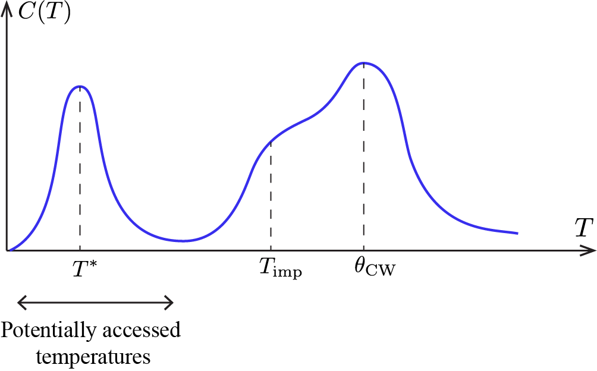
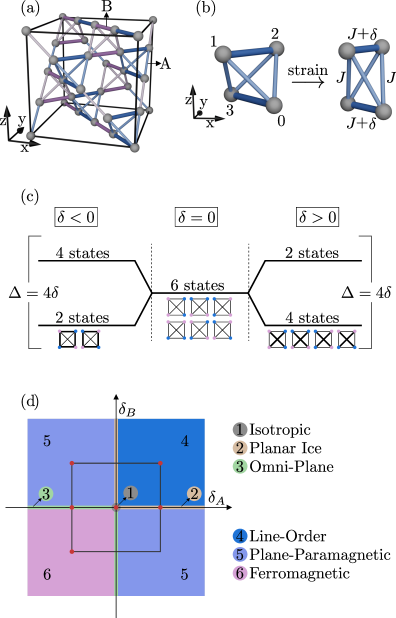
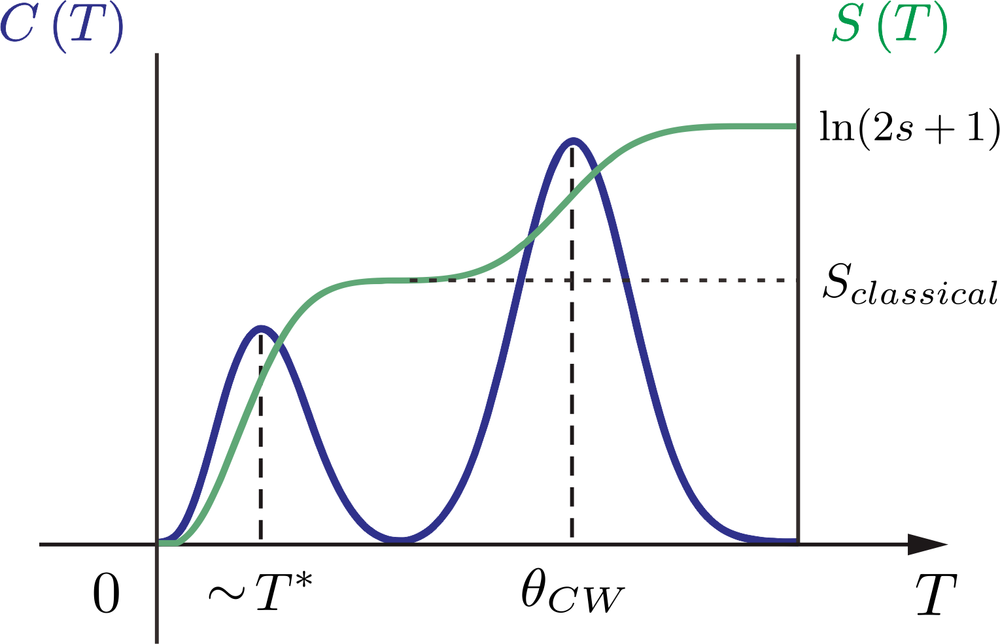
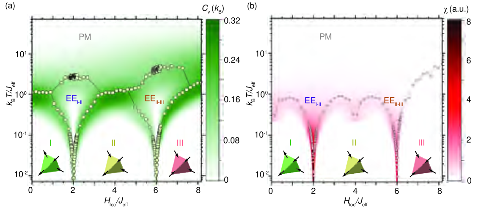
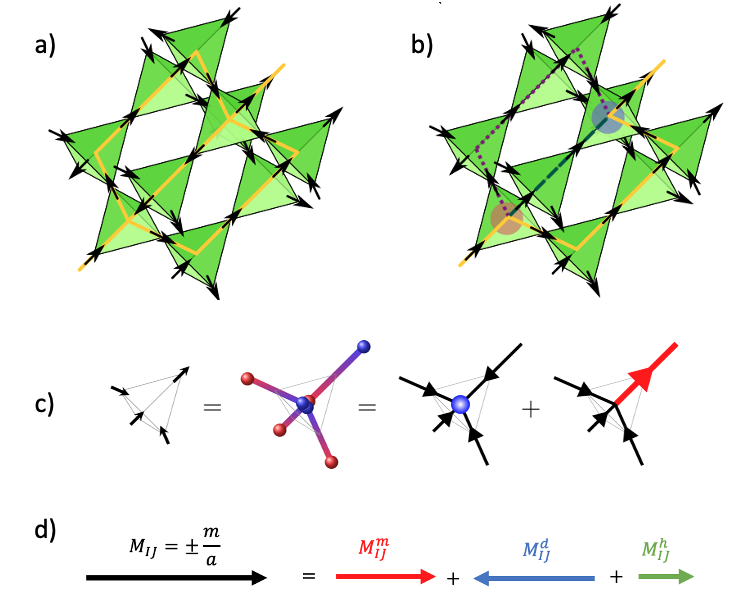
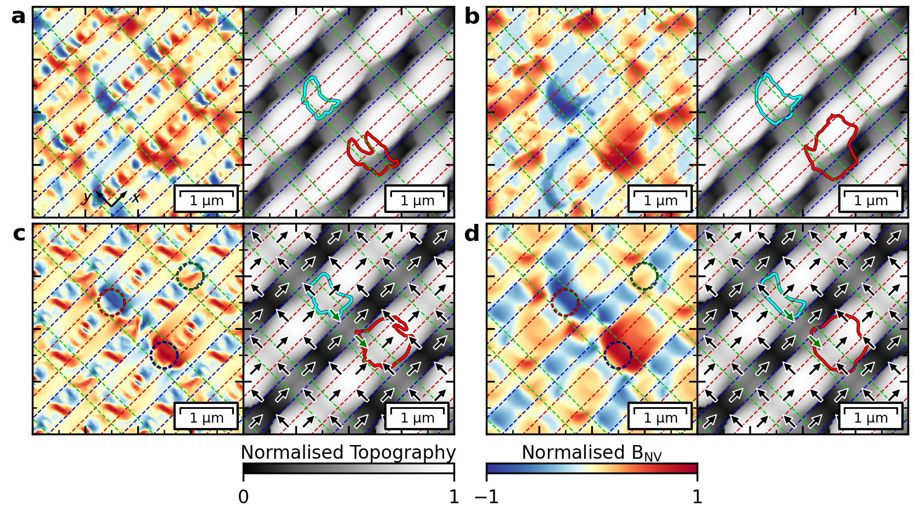

# スピンアイスの零点エントロピーとその熱力学的指標：マクスウェル関係式が解き明かすフラストレート磁性体の隠れた縮退

- **執筆日**: 2026-04-06
- **トピック**: spin-ice-zero-point-entropy
- **タグ**: Magnetism and Spin / Spin Liquids and Quantum Many-Body Systems; Low-Temperature Properties / Extreme Condition Measurements
- **注目論文**: Syzranov & Ramirez, "A footprint of zero-point entropy in higher-temperature magnetic thermodynamics," arXiv:2604.00115 (2026)
- **参照関連論文数**: 7本

---

## 1. なぜ今この話題なのか

物質の中で電子スピンは、温度をゼロに近づけると通常は秩序化して特定の向きに揃う。強磁性体なら全てのスピンが同じ方向を向き、反強磁性体なら隣り合うスピンが反対向きに並ぶ。しかしながら、「フラストレーション」と呼ばれる幾何学的制約が働く場合、スピンは絶対零度においてすら完全には秩序化できず、無数の等価な配置を取り続けることがある。このような状態では、熱力学第三法則が示すように「絶対零度でエントロピーはゼロになるべき」という直観が崩れ、低温でも有限の残留エントロピー（零点エントロピー、またはゼロ点エントロピーとも呼ばれる）が存在し続ける。

この「マクロな基底状態縮退」というアイデアは、1935年にポーリングが水の氷のプロトン配置の自由度として提案したことに始まり、後に磁性体でも実現することが明らかになった。特に代表的なのが「スピンアイス」と呼ばれる物質群で、ダイスプロジウム・チタン酸塩 Dy₂Ti₂O₇ やホルミウム・チタン酸塩 Ho₂Ti₂O₇ がその典型例である。これらの物質では、ジルコン型パイロクロア構造上のスピンが「2本入り・2本出し（2-in-2-out）」という水の氷のアイスルール類似の制約に従うため、基底状態が膨大な数の縮退を示す。

近年、フラストレート磁性体・量子スピン液体の研究が世界的に加速している背景には、いくつかの重要な動機がある。第一に、トポロジカル量子コンピューティングへの応用可能性である。スピンアイスの励起として「磁気モノポール」と呼ばれる分数化した準粒子が出現し、これらは非局所的な量子情報の担い手となりうることが理論的に示されている。第二に、材料科学における「エントロピー工学」の勃興である。高エントロピー合金や、近年活発に研究されている「エントロピー安定化酸化物」など、乱れからくるエントロピーを設計変数として活用するアプローチが急速に広まっている。スピンアイスの零点エントロピーはその磁性版として、磁気的エントロピー工学の可能性を示す先行例である。

しかし、こうした研究の最前線において長年にわたって根本的な困難が立ちはだかってきた。フラストレート磁性体が本当に零点エントロピーを持つかどうかを実験的に確認するには、熱容量を0 K から無限大まで積分するという原理的に不可能に近い測定が必要とされてきたのである。Syzranov と Ramirez は2026年3月末に発表した論文で、この長年の困難に対して、マクスウェル熱力学関係式を利用した新しい実験的指標を提案した。この提案は、スピンアイス物理における測定論のパラダイムシフトをもたらす可能性を秘めており、フラストレート磁性体研究の新たな扉を開く。

---

## 2. この分野で何が未解決なのか

スピンアイスおよびフラストレート磁性体における零点エントロピーの研究には、現在も複数の未解決問題が横たわっている。

**問い1：零点エントロピーを実験的にどう確認するか？**

最も根本的な問いは、測定の信頼性にある。伝統的なアプローチでは、熱容量 $C(T)$ を温度 $T$ で割った量を0から∞まで積分することで全エントロピーを求め、高温極限での理論値（スピン1/2なら $R\ln 2$）との差を零点エントロピーとみなす。しかしこの方法には根本的な落とし穴がある。現実の実験では測定可能な温度域は有限であり、特に磁気的な不純物や特定のエネルギースケールに起因する熱容量のピークが見逃されてしまうと、そのエントロピー寄与が零点エントロピーと誤って帰属されてしまう。Syzranov & Ramirez の注目論文が指摘するのは、こうした方法が「信頼性が低く、物議を醸す結果を生む」という厳しい現実である。

**問い2：スピンアイスの基底状態縮退はいつ解ける？**

理想的なスピンアイスモデルではアイスルール満足状態が全て縮退するが、現実の物質では双極子相互作用や量子効果、希薄な磁性不純物などが縮退を破りうる。Dy₂Ti₂O₇ でも極低温（数十 mK 以下）では緩やかな凍結が観測されており、真の熱力学的平衡に達しているのかどうかが問われている。この「スピンアイスはスピン液体なのか、それとも超冷却されたスピングラスなのか」という問いは、今も活発な議論を呼んでいる。

**問い3：磁気モノポールの統計力学はどこまで解明されているか？**

スピンアイスの励起は、テトラヘドラの「2-in-2-out」ルールを破った「3-in-1-out」または「1-in-3-out」配置を持つ頂点であり、これらが磁荷 $\pm 2\mu$ の磁気モノポールとして振る舞うことがCastellan ら（2008年）によって示された。しかし、これらのモノポールが形成する「ダイラック弦」の定義や、モノポールの長時間ダイナミクス、そしてモノポール流体の統計力学的記述はいまだ議論中である。特に、実験で観測される磁気ノイズのスペクトルがモノポール単体によるものか、ダイラック弦の寄与によるものかを区別することが課題であった（Szynal ら、arXiv:2505.14811）。

**問い4：エントロピー駆動相転移はどこまで普遍的か？**

近年、パイロクロア磁性体における「エンハンスド・エントロピー相（EE相）」の発見（arXiv:2505.13352）や準結晶近似結晶上でのエントロピー結晶化（arXiv:2604.02180）など、エントロピーが秩序化の駆動力になる例が相次いで報告されている。これらが局所的な特殊事例なのか、フラストレート系の普遍的な性質なのかは、まだ十分に理解されていない。

---

## 3. 注目論文の核心：何が前進し、何がまだ仮説か

**何が提案されたか**

Syzranov & Ramirez（2604.00115）の論文は、零点エントロピーの存在を示す実験的「足跡（footprint）」を、高温側の磁気熱力学的測定から抽出できるという新しい命題を示した。その中心にあるのは、熱力学的マクスウェル関係式の「見かけの破れ」という逆説的な発想である。

通常の熱力学では、エントロピー $S$、磁化 $M$、磁場 $H$、温度 $T$ の間に以下のマクスウェル関係式が成り立つ：

$$\left(\frac{\partial S}{\partial H}\right)_T = \left(\frac{\partial M}{\partial T}\right)_H \tag{1}$$

これは熱力学の自由エネルギーの混合偏微分の対称性から導かれる普遍的な関係式である。

ここで著者らは次の洞察を提示した。エントロピーを励起エントロピー $S_E(T, H)$（温度依存する部分）と零点エントロピー $S_0(H)$（基底状態の縮退に由来する温度非依存な部分）に分解する：

$$S(T, H) = S_0(H) + S_E(T, H) \tag{2}$$

実験でよく使われる近似、すなわち「$S_0$ が一定（場によらない）と仮定して励起エントロピーのみを積分する」という手続きを踏むと、得られる「見かけのエントロピー」 $\tilde{S}(T, H) = S_E(T, H)$ はマクスウェル関係式を「破って」見える：

$$\left(\frac{\partial \tilde{S}}{\partial H}\right)_T = \left(\frac{\partial M}{\partial T}\right)_H - \frac{dS_0}{dH} \neq \left(\frac{\partial M}{\partial T}\right)_H$$

この「見かけの破れ」の符号条件を整理すると、最終的に次の簡潔な実験的判定基準が得られる：

$$\left(\frac{\partial C}{\partial H}\right)_T \cdot \left(\frac{\partial M}{\partial T}\right)_H < 0 \tag{3}$$

この条件は、「熱容量の磁場微分」と「磁化の温度微分」の符号が反対であれば、零点エントロピーが存在（かつ磁場依存）することを示す指標となる。これは単一の温度・磁場で測定可能であり、温度積分を必要としない点が革命的である。

**Dy₂Ti₂O₇での実証**

著者らはこの基準を、最も研究された古典スピンアイスである Dy₂Ti₂O₇ に適用した。実験データが示すのは以下の通りである：

- 熱容量は約 0.7 K にピークを持ち、そのピーク以下では磁場を0から0.5 T に増加させると熱容量が減少する：$(\partial C/\partial H)_T < 0$
- 磁化は低温で温度とともに増加するため：$(\partial M/\partial T)_H > 0$（スピンアイスでは異常な符号！）
- よって積 $(\partial C/\partial H)_T \cdot (\partial M/\partial T)_H < 0$ が成立→零点エントロピーの存在を示す

この実証は、スピンアイスの残留エントロピー（ポーリング値 $S_{\rm Pauling} = \frac{1}{2}\ln\frac{3}{2} \approx 0.202 R$）の存在と整合し、測定自体はずっと扱いやすい温度域（0.5〜2 K）で行えるという実用上の利点がある。

**何がまだ仮説段階か**

この手法の汎用性については慎重に見る必要がある。式（3）が成立するのは、零点エントロピーが磁場依存する場合、つまり $dS_0/dH \neq 0$ の場合に限られる。また著者らが注目するのは、ある特性温度 $T^*$（隠れたエネルギースケール）以下での挙動であり、その温度域の特定自体が材料によって容易でない場合もある（図1参照）。さらに本論文はアイジング型の強磁性スピンアイスを念頭に置いており、反強磁性的フラストレーションや量子スピン液体への適用は、今後さらなる理論的整備が必要である。

*図1：フラストレート磁性体における熱容量の典型的挙動（arXiv:2604.00115, Fig. 1, CC BY-SA 4.0）。*

---

## 4. 背景と研究史：この論文はどこに位置づくか

**スピンアイスの発見と残留エントロピーの確認**

スピンアイスの物理は1997年、Harris らが Ho₂Ti₂O₇ においてスピンが強磁性的な交換相互作用を持ちながら磁気秩序を示さないことを発見したことに始まる。翌年、Anderson は水素結合のアイスルール（近藤-ポーリング則：各酸素に対して2本近いプロトンと2本遠いプロトンが配置される）が磁気スピン配置に類似して現れることを指摘した。そして1999年、Ramirez ら（著者の一人 Ramirez は当時 Bell Labs にいた）は Dy₂Ti₂O₇ の熱容量測定から、残留エントロピーが水の氷のポーリング値と一致することを直接示した。これはスピン系でのエントロピー操作が水の熱力学と深くつながっていることの証明であり、物性物理史上の金字塔とも言える結果であった。

その後2000年代に、スピンアイスの励起がデニス・ヘルマン（Castelnovo ら、Nature 2008）によって磁気モノポールとして記述されることが示された。スピン1本の反転がアイスルールを破った頂点（磁荷±2μ をもつ「ダンベル端点」）を2個生成し、これらが双極子弦で繋がれながら結晶内を移動する様子は、Dirac の磁気モノポール理論の直接的類似物として物理学者たちを驚かせた。

**測定の信頼性をめぐる論争**

Ramirez らの残留エントロピー測定（Dy₂Ti₂O₇）は美しい結果だが、その後、物質によっては測定値がポーリング値と異なる例も報告されている。最近の Hayashida ら（arXiv:2511.02899）の研究は、NiGa₂S₄ や FeAl₂Se₄ といった二次元フラストレート磁性体の熱容量ピークを詳細に解析し、低温ピークの起源がスピン状態の二重項構造に由来することを示した。この研究は、熱容量の多重ピーク構造を精密に解析することで物質固有の低エネルギー状態の情報が得られるという、今回の注目論文と本質的に補完的なアプローチである。

*図2：フラストレート磁性体 SCGO の結晶構造（arXiv:2511.02899, Fig. 2, CC BY 4.0）。*

**パイロクロア格子の理論的景観**

スピンアイスや量子スピン液体が実現するパイロクロア格子の磁性体について、Benton（arXiv:2411.03547）は2024年に「古典的パイロクロア・スピン液体のアトラス」と称すべき包括的な相図を発表した。最近傍異方性スピンハミルトニアンから出発すると、2-in-2-out 型スピンアイス、$\pi$-フラックス型スピン液体、反強磁性スピン液体など複数の古典スピン液体状態が現れ、それぞれが異なる「一般化されたガウス則」に従うことが示された。このアトラスは、スピンアイスが単なる特殊例ではなく、広大なスピン液体の風景の中の一局面であることを示している。

**量子効果とエントロピーの競合**

パイロクロア磁性体には量子効果が顕著な系も多い。Taillefumier & Moessner ら（arXiv:2505.15677）は、量子スピンアイスに動的な磁荷（物質）を結合させた際に生じる、従来の U(1) 量子スピンアイスとは異なる新しい量子スピン液体相の存在を理論的に示した。こうした量子効果は零点エントロピーにも影響し、フラストレーションが強い系では量子揺らぎが縮退を解き、異なるエントロピー値をもたらしうる。

息をのむようなブレークスルーは、「呼吸するパイロクロア格子（breathing pyrochlore）」と呼ばれる変形構造でも起きている。Pohle ら（arXiv:2505.00767）は異方的なスピンアイスを研究し、異方性の強さによって「ポーリング値以下のエントロピー密度をもつ制約されたスピンアイス多様体」への連続クロスオーバーと、対称性が破れた秩序相への転移の両方が現れることを示した。これはアイスルールの縮退が摂動に対してどれだけロバストかという問いに答えるものである。

*図3：呼吸するパイロクロア格子の構造（arXiv:2505.00767, Fig. 1, CC BY 4.0）。*

---

## 5. どの解釈が最も妥当か：証拠・比較・限界

**注目論文の解釈を支える根拠**

Syzranov & Ramirez の提案する判定基準（式3）が Dy₂Ti₂O₇ で機能することは、実験的に確認されている。特に注目すべきは、この基準が「標準的な」磁化測定と熱容量測定という、多くの実験室で実施可能な測定のみを必要とするという点である。

この提案の理論的基盤は、熱力学の一般的な原理（マクスウェル関係式の対称性）にあり、特定の模型に依存しない。つまりスピンアイスに限らず、零点エントロピーをもつあらゆる磁性体に原理的に適用できる。これは汎用性という観点で大きな強みである。

しかしながら、この理論的根拠には複数の仮定が潜む。まず、基底状態エントロピー $S_0(H)$ が磁場依存しない場合（たとえば完全に磁場に不感な縮退）はこの指標が使えない。Ising スピンアイスでは低磁場で $S_0(H) \approx S_{\rm Pauling}$ が磁場依存するため問題ないが、ハイゼンベルク型フラストレーション系では状況が異なりうる。

**他の測定手法との比較**

従来の零点エントロピー測定法の主な問題点は、低温での測定困難と、エントロピー積分の「見落とし」である。Hayashida ら（2511.02899）が SCGO や FeAl₂Se₄ で示したように、フラストレート系の熱容量には複数のエネルギースケールに対応するピークが現れ、全てのピークを測定しなければ正確なエントロピー積分は得られない。

Syzranov & Ramirez の手法は、この問題を根本的に迂回する。なぜなら、式（3）の判定基準は積分を必要とせず、特定の温度・磁場での微分係数の符号だけで判定できるからである。ただし、「どの温度域で測定すべきか」という点については、特性温度 $T^*$ 以下という条件が付く。この $T^*$ の事前決定には依然として熱容量の測定が必要であり、完全に積分から自由ではない点は留意すべきである。

*図4：フラストレート磁性体における熱容量とエントロピーの温度依存性（arXiv:2511.02899, Fig. 1, CC BY 4.0）。*

**エントロピー安定化相との比較：異なる視点**

Javanparast ら（arXiv:2505.13352）が発見したパイロクロア磁性体の「エンハンスド・エントロピー相（EE相）」は、今回の論文とは異なる観点からエントロピーの物理的役割を照らし出す。EE相は相境界付近で安定相同士のエネルギーが競合する結果、有限温度でエントロピー項（$-TS$）が内部エネルギー差を上回り、秩序なしに高エントロピーを保つ相が自由エネルギー最小を実現するというものだ。

*図5：パイロクロア磁性体の相図とエンハンスド・エントロピー相（arXiv:2505.13352, Fig. 3, CC BY 4.0）。*

この EE 相は、「エントロピーが自由エネルギーを最小化するために秩序を壊す」例である。一方、スピンアイスの零点エントロピーは「エネルギー的縮退からエントロピーが自然発生する」現象であり、発生メカニズムが根本的に異なる。しかし両者は、「有限温度でエントロピーが系の振る舞いを決定する」という点で深くつながっており、フラストレート磁性体の豊かな熱力学の二側面を示している。

**エントロピー結晶化という第三の側面**

さらに最近の Novat ら（arXiv:2604.02180）による準結晶近似結晶上のエントロピー結晶化の発見は、別の驚くべき可能性を示している。この系では、低温相において **残留エントロピーが完全には解放されない**（$S \approx 0.1767/{\rm spin}$）ままで磁気秩序が生じる。秩序化のメカニズムは「ドメイン壁の生成が残留エントロピーを局所的に低下させるため、ドメイン壁形成が抑制される」というものである。これは零点エントロピーを「保護する」新しいメカニズムとして注目される。ただしこの論文のライセンスは arXiv nonexclusive であるため、本記事での図の引用は行わない。

**磁気モノポールとエントロピーのダイナミクス**

スピンアイスでの零点エントロピーが動的に現れる局面が、磁気モノポール・ダイラック弦のダイナミクスである。Szynal ら（arXiv:2505.14811）は、スピンアイスにおけるダイラック弦を「モノポール軌跡の時空間経路」として厳密に定義し、磁気ノイズの長時間相関がモノポール自体よりもダイラック弦の寄与によって支配されることを示した（相関時間の比は約 24 倍）。

これはゼロ点エントロピーの動的側面とも深く関わる。基底状態縮退の多様体（Pauling 状態多様体）の中で、モノポールが弦で繋がれながら動き回ることが、スピンアイスにおけるエントロピー的ダイナミクスを構成する。Syzranov & Ramirez が測定しようとしている「零点エントロピーの熱力学的指標」は、まさにこのような動的過程が引き起こす高温側への足跡である。

*図6：スピンアイスのダンベルモデルと磁気モノポールの発生機構（arXiv:2505.14811, Fig. 2, CC BY 4.0）。*

**まだ弱い結論と今後必要な検証**

式（3）の判定基準は Dy₂Ti₂O₇ では機能が示されたが、この基準を使って「未知の系が零点エントロピーを持つかどうか」を判定するには、まだいくつかの理論的裏付けが必要である。

特に課題となるのは：（1）強い量子揺らぎを持つ系（量子スピン液体候補）への適用可能性、（2）反強磁性的フラストレーション（たとえばかご目格子、パイロクロア反強磁性体）への拡張、（3）複数の磁気副格子を持つ複雑な構造体への適用、（4）実際の測定における背景シグナルや不純物効果の除去法、の4点である。

---

## 6. 何が一般化できるのか：材料・手法・応用への広がり

**人工スピンアイスへの波及**

スピンアイスの物理は、最近急速に発展した「人工スピンアイス（artificial spin ice）」の研究分野にも直接的な関係を持つ。人工スピンアイスとは、ナノファブリケーション技術によってスピンアイスの幾何学的配置を模倣したナノ磁性体アレイで、個々のスピン（磁性島）を光学顕微鏡や磁気力顕微鏡で直接観察できるという利点がある。

Corte-Leon ら（arXiv:2511.04877）は2025年11月、窒素空孔（NV）中心を持つダイヤモンドプローブを使ったスキャニング磁気計測（NV磁気計測）により、三次元人工スピンアイスにおける磁気モノポールの磁場を初めて直接可視化することに成功した。測定では、アイスルール頂点がアンチボルテックス型のテクスチャーを持ち、モノポール（ルール破れ）頂点が強く発散する磁場分布を示すことが実証された。

*図7：人工スピンアイスにおけるモノポールの直接可視化（arXiv:2511.04877, Fig. 3, CC BY-NC-ND 4.0）。*

この人工系での研究は、Dy₂Ti₂O₇ のような実物質で見えにくいモノポールのダイナミクスを「模型系」で可視化する手段を提供する。Syzranov & Ramirez の提案する零点エントロピーの指標も、人工スピンアイスの設計・制御に応用できる可能性がある。

**量子スピン液体との接続**

零点エントロピーの問題は、量子スピン液体の探索とも直結する。Dy₂Ti₂O₇ のような古典スピンアイスでは、低温での凍結が量子状態への到達を妨げるが、より軽い元素からなる系（たとえば Yb₂Ti₂O₇、Pr₂Zr₂O₇）では量子揺らぎが重要になり、「量子スピンアイス」としての振る舞いが期待される。これらの物質では、零点エントロピーが量子効果で部分的に解放されるため、Syzranov & Ramirez の指標がどのように変化するかを系統的に調べることが、量子スピン液体の存在証拠を積み上げる上で有力な戦略となりうる。

**磁気冷凍・エントロピー工学への応用**

零点エントロピーの大きな磁性体は、磁気冷凍（磁気熱量効果：magnetocaloric effect）の材料としても注目される。磁場の印加・除去に伴って零点エントロピーが変化すれば（$dS_0/dH \neq 0$）、大きなエントロピー変化を利用した断熱冷却が可能になる。実際、スピンアイス物質 Dy₂Ti₂O₇ は100 mK 以下の極低温冷凍器への応用が議論されており、Syzranov & Ramirez の手法で「有望材料のスクリーニング」を高温側でできれば、材料探索の効率が大幅に向上する。

**他の材料系・方法論への汎用化**

パイロクロア格子に限らず、カゴメ格子やハイパーカゴメ格子、チェッカーボード格子といった他のフラストレート格子上の磁性体にも、原理的にはこの指標が適用できる。また Hayashida ら（2511.02899）が示したように、熱容量のピーク構造の精密解析と組み合わせることで、より定量的なエントロピー評価が実現できる。

さらに最近、パイロクロア磁性体の相図において発見されたエンハンスド・エントロピー相（EE相）（2505.13352）は、エントロピー由来の相の安定化という観点から磁気的エントロピー工学の新たな設計指針を与える。特定の相境界を狙ってエントロピー的に安定な相を作り出すという「エントロピー設計」の原理が、フラストレート磁性体において一般化されつつある。

---

## 7. 基礎から理解する

### フラストレーションと縮退とは何か

「フラストレーション」とは、物理学では「全ての相互作用を同時に最適化できない幾何学的制約」を意味する。最も単純な例は、三角格子上の反強磁性モデルである。隣り合うスピンはエネルギー的に反平行を好むが、三角形の3つのスピンが全て互いに反平行になることは不可能である（3頂点を2色で塗り分けることができない）。このような状況では、多くの配置がほぼ等価なエネルギーを持ち、基底状態が縮退する。

スピンアイスでは、この縮退がより巧みに実現されている。パイロクロア格子は四面体（テトラヘドラ）が頂点共有で繋がった三次元構造で、Dy³⁺ や Ho³⁺ イオンは強い単軸異方性のため、各格子点を通る ⟨111⟩ 方向（四面体の中心から各頂点に向かう方向）にしかスピンが向けない Ising 磁石として振る舞う。双極子相互作用と結晶場の組み合わせによって、各テトラヘドラで「2本入り・2本出し（2-in-2-out）」の配置がエネルギー的に優位となる（強磁性的な有効交換相互作用）。

この 2-in-2-out 制約を満たしながら全てのテトラヘドラを繋げる方法は指数関数的に多数あり、それが基底状態の縮退を生む。1 mol あたりの残留エントロピーを計算したのがポーリング（1935）で、水の氷でのプロトン配置の自由度として：

$$S_{\rm Pauling} = R \ln\frac{W_{\rm Pauling}}{1} = R \cdot \frac{1}{2}\ln\frac{3}{2} \approx 0.202 R$$

を得た。ここで $R$ は気体定数、$W_{\rm Pauling} = (3/2)^{N/2}$ は $N$ スピン系での基底状態数（テトラヘドラ数ベースの近似）である。この値 0.202 R は Dy₂Ti₂O₇ の実験で美しく確認されている。

### マクスウェル関係式とその熱力学的意味

熱力学の基本関係式 $dG = -SdT - MdH$（$G$：ギブス自由エネルギー）から、混合偏微分の対称性

$$\frac{\partial^2 G}{\partial T \partial H} = \frac{\partial^2 G}{\partial H \partial T}$$

を使えば即座にマクスウェル関係式（1）が導ける。これは熱力学の完全微分（exact differential）の性質に過ぎず、どんな平衡状態でも成り立つはずである。

ところが、Syzranov & Ramirez の発想の転換点はここにある。**もし実験者が「零点エントロピーがゼロだと誤って仮定して」励起エントロピーのみを積分し、それをエントロピーの全体と見なした場合、その「見かけのエントロピー」のマクスウェル関係式は破れて見える**というのである。

より正確には：真のエントロピーは $S = S_0(H) + S_E(T, H)$ なので、真のマクスウェル関係式は

$$\frac{dS_0}{dH} + \left(\frac{\partial S_E}{\partial H}\right)_T = \left(\frac{\partial M}{\partial T}\right)_H$$

一方、実験者が計算する $(\partial S_E/\partial H)_T = \int_0^T (\partial C/\partial H)_T dT'/T'$ が $(\partial M/\partial T)_H$ と等しくなるためには、$dS_0/dH = 0$ が必要だ。もしこれが成り立たなければ、見かけ上マクスウェル関係式が「破れた」ように見える。そしてこの破れの符号条件が、十分低温（$T < T^*$）では

$$\left(\frac{\partial C}{\partial H}\right)_T \cdot \left(\frac{\partial M}{\partial T}\right)_H < 0$$

と等価になるのである（積分の符号を追いかければ導出できる）。

### スピンアイスにおける符号の物理的解釈

Dy₂Ti₂O₇ で $(\partial M/\partial T)_H > 0$ になる（磁化が低温で増加する）のは、直感に反するようで実は自然である。スピンアイスのスピンは ⟨111⟩ 方向に固定されており、外部磁場を [001] 方向に印加すると「入り」方向の成分を持つスピンと「出」方向の成分を持つスピンが存在する。低温になるほどアイスルール状態に近づくため、磁場の影響を受けやすい配置が増加し、正味の磁化が上昇するのである。これは「常磁性的」というよりも「アイスルール制約による異常な相関」の現れであり、通常の強磁性体とは本質的に異なる機構による。

一方で $(\partial C/\partial H)_T < 0$（磁場増加で熱容量が減少）は、磁場によって縮退が部分的に解かれ（アイスルール状態から「2-in-2-out with field preference」へのバイアス）、有効な自由度が減少するためである。

### 測定の難しさと「隠れたエネルギースケール」

フラストレート磁性体の熱容量は多重ピーク構造を持つことが多い（図1）。高温側のブロードなピークはキュリー・ワイス温度 $\theta_{\rm CW}$ スケールのフラストレーションエネルギーに由来し、低温のシャープなピークは「隠れたエネルギースケール $T^*$」に由来する。この $T^*$ は典型的に $\theta_{\rm CW}$ の1/10以下であることが多く、Dy₂Ti₂O₇ では $T^* \approx 0.7$ K、$\theta_{\rm CW} \approx +1.2$ K 程度である。

さらに低温には不純物や構造欠陥に由来するピーク $T_{\rm imp}$ が現れることもあり、これらを識別するには広温度域の精密測定が必要となる。Syzranov & Ramirez のアプローチは、$T^*$ 以下という条件を満たすさえすれば積分不要で判定できるため、$T_{\rm imp}$ の影響を比較的回避しやすいという利点もある。

---

## 8. 専門用語の解説

**1. フラストレーション（frustration）**
スピン（または他の自由度）が、格子の幾何学的構造によって互いに矛盾した要求を受ける状態。三角格子上の反強磁性体が典型例で、全スピンペアを同時に反平行にすることが不可能。フラストレーションが強い系では基底状態が縮退し、残留エントロピーが生じる。

**2. スピンアイス（spin ice）**
パイロクロア型格子上で「2-in-2-out」のアイスルールを満たす磁性体。Dy₂Ti₂O₇、Ho₂Ti₂O₇ が代表例。基底状態が指数関数的に縮退しており、残留エントロピーが水の氷のポーリング値と一致する。

**3. 零点エントロピー（zero-point entropy）/ 残留エントロピー（residual entropy）**
絶対零度においても熱力学的エントロピーがゼロにならない状態。マクロな基底状態縮退、すなわち $W > 1$ の配置数から $S_0 = k_B \ln W$ として発生する。熱力学第三法則の「孤立した完全結晶での絶対零度エントロピー = 0」という規定は一般の秩序状態には適用できるが、縮退した基底状態では必ずしも成り立たない。

**4. ポーリング・エントロピー（Pauling entropy）**
水の氷におけるプロトン配置の自由度から Pauling（1935）が計算した残留エントロピー $S_P = R/2 \cdot \ln(3/2) \approx 1.68$ J/(mol·K)。スピンアイスでも同じ値が観測されることが Ramirez ら（1999）によって実証された。

**5. 磁気モノポール（magnetic monopole）**
スピンアイスにおけるアイスルール違反（3-in-1-out）の頂点に生じる「磁荷」をもつ準粒子。正負の磁荷を持つ準粒子が「ダイラック弦」で繋がれた形で熱励起される。Castelnovo ら（2008, Nature）によって理論的に提案された。実験的な間接証拠は多数あるが、直接可視化は 2025 年に人工スピンアイスで初めて達成（arXiv:2511.04877）。

**6. マクスウェル関係式（Maxwell relation）**
熱力学的ポテンシャルの完全微分性から導かれる微分係数間の恒等式。磁性体では $(\partial S/\partial H)_T = (\partial M/\partial T)_H$ など。エントロピー・磁化・磁場・温度の4量を結ぶ。今回の注目論文では、この関係式の「見かけの破れ」が零点エントロピーの指標として使われる。

**7. パイロクロア格子（pyrochlore lattice）**
コーナー共有した四面体が三次元空間を充填するネットワーク格子。各原子は4個の四面体に属する。Dy₂Ti₂O₇、Ho₂Ti₂O₇、Yb₂Ti₂O₇ など多くのフラストレート磁性体が採用する構造。その幾何学的フラストレーションの強さからスピン液体・スピンアイスの研究に広く使われる。

**8. エンハンスド・エントロピー相（enhanced-entropy phase, EE phase）**
相境界付近の有限温度で、エントロピー項 $-TS$ が自由エネルギーを支配することで安定化するディスオーダー相。長距離秩序を持たないが熱力学的に安定な「エントロピー駆動相」。Javanparast ら（arXiv:2505.13352）がパイロクロア磁性体において発見した。

**9. ダイラック弦（Dirac string）**
スピンアイスでモノポールが移動した際に「切り替わったスピン」の経路が描く弦状の構造。正負のモノポールを繋ぐ「弦」であり、本来は個々のスナップショットではなく「時空間上のモノポールの軌跡」として定義される（Szynal ら、arXiv:2505.14811）。磁気ノイズの長時間相関はモノポールよりもこの弦の寄与で支配される。

**10. 隠れたエネルギースケール（hidden energy scale, T*）**
フラストレート磁性体においてキュリー・ワイス温度 $\theta_{\rm CW}$ よりはるかに低い温度に現れる特性エネルギースケール $T^*$。熱容量や磁化率の低温異常としてのみ現れ、高温からの外挿では予測できない。スピンアイスでは $T^* \approx 0.7$ K に対応する。この温度以下での測定が零点エントロピーの Syzranov 判定基準の適用条件となる。

---

## 9. おわりに：何が分かり、何がまだ残っているのか

本記事の注目論文 arXiv:2604.00115 が示した最も重要な成果は、「零点エントロピーの存在は、完全な熱容量積分なしに、マクスウェル関係式の見かけの破れとして高温側の測定から検出できる」という命題の提示とその実証である。具体的には $(\partial C/\partial H)_T \cdot (\partial M/\partial T)_H < 0$ という簡潔な判定基準が、Dy₂Ti₂O₇ スピンアイスで実験的に確認された。この結果は、フラストレート磁性体・スピン液体候補の探索において、「どの材料が本当に基底状態縮退を持つか」を効率的に絞り込む強力な手段を与えるものである。関連研究が示す豊かな景観——エンハンスド・エントロピー相（2505.13352）、エントロピー結晶化（2604.02180）、モノポールのダイナミクス（2505.14811、2511.04877）——を総合すると、スピンアイス系はエントロピーが物質の秩序・無秩序・相境界を支配するという「エントロピー主導の物理」の優れた試験台であることが明確になる。

一方で未解決の問題も多く残る。第一に、量子スピン液体候補（Yb₂Ti₂O₇、Ce₂Zr₂O₇ など）への Syzranov 基準の適用は、量子揺らぎが $S_0$ を修正しうるため、理論的な整備が必要である。第二に、磁気モノポールの熱力学的統計記述はいまだ発展途上で、特にモノポールの非平衡ダイナミクスと低温凍結の機構（スピンアイスはスピングラスか真のスピン液体か）は、次世代の希釈冷凍器実験と精密熱容量計測が決め手になるだろう。第三に、呼吸するパイロクロア格子（2505.00767）や準結晶近似結晶（2604.02180）など、変形した幾何学的フラストレーション系においてポーリング・エントロピーがどう変化するかの系統的研究が期待される。今後1〜3年では、NV 磁気計測や中性子散乱の空間分解能向上により、個々のモノポールとその弦の統計的振る舞いが直接測定されるようになり、Syzranov & Ramirez の巨視的指標と微視的ダイナミクスの整合を検証できるようになるだろう。

---

## 参考論文一覧

1. **[anchor]** S. Syzranov & A. P. Ramirez, "A footprint of zero-point entropy in higher-temperature magnetic thermodynamics," arXiv:2604.00115 (2026). [https://arxiv.org/abs/2604.00115](https://arxiv.org/abs/2604.00115)
   → 零点エントロピーの存在をマクスウェル関係式の「見かけの破れ」として検出する実験的判定基準を提案し、スピンアイス Dy₂Ti₂O₇ で実証した論文。

2. **[related, background]** B. Benton, "An Atlas of Classical Pyrochlore Spin Liquids," arXiv:2411.03547 (2024). [https://arxiv.org/abs/2411.03547](https://arxiv.org/abs/2411.03547)
   → 最近傍異方性スピンハミルトニアンに基づき、パイロクロア格子で実現しうる全古典スピン液体相を包括的に分類した理論的アトラス。

3. **[related, comparison]** R. Pohle et al., "Anisotropic Spin Ice on a Breathing Pyrochlore Lattice," arXiv:2505.00767 (2025). [https://arxiv.org/abs/2505.00767](https://arxiv.org/abs/2505.00767)
   → 呼吸するパイロクロア格子上の異方的スピンアイスで、異方性強度に応じたポーリング値以下エントロピー相と対称性破れ相の相図を示した計算研究。

4. **[related, supporting]** J. Javanparast et al., "Enhanced-Entropy Phases in Geometrically Frustrated Pyrochlore Magnets," arXiv:2505.13352 (2025). [https://arxiv.org/abs/2505.13352](https://arxiv.org/abs/2505.13352)
   → パイロクロア磁性体 R₂Ir₂O₇ の相境界付近で、エントロピー項の優位によって安定化する「エンハンスド・エントロピー（EE）相」を Monte Carlo 計算で発見した論文。

5. **[related, background]** C. Szynal et al., "Monopoles, Dirac Strings and Magnetic Noise in Model Spin Ice," arXiv:2505.14811 (2025). [https://arxiv.org/abs/2505.14811](https://arxiv.org/abs/2505.14811)
   → スピンアイスのダイラック弦を時空間経路として定義し、磁気ノイズの長時間相関がモノポール本体よりも弦の寄与で支配されることを理論計算で示した論文。

6. **[related, comparison]** T. Hayashida et al., "Low-temperature entropies and possible states in geometrically frustrated magnets," arXiv:2511.02899 (2025). [https://arxiv.org/abs/2511.02899](https://arxiv.org/abs/2511.02899)
   → NiGa₂S₄ および FeAl₂Se₄ における熱容量低温ピークを解析し、残留エントロピーが磁気サイト上の二重項状態から生じることを示した実験・理論論文。

7. **[related, application]** H. Corte-Leon et al., "Direct Visualization of the Magnetic Monopole Field in a 3D Artificial Spin Ice," arXiv:2511.04877 (2025). [https://arxiv.org/abs/2511.04877](https://arxiv.org/abs/2511.04877)
   → NV 中心磁気計測によって三次元人工スピンアイス中の磁気モノポール磁場を初めて直接可視化し、モノポールと双極子モーメントの共存を明らかにした実験論文。

8. **[related, same-week]** O. Novat, L. D. C. Jaubert & M. Udagawa, "Entropic crystallization of geometrically frustrated magnets on 1/1 approximant Tsai-type quasicrystal," arXiv:2604.02180 (2026). [https://arxiv.org/abs/2604.02180](https://arxiv.org/abs/2604.02180)
   → 準結晶近似結晶上の反強磁性イジング模型で、残留エントロピーがドメイン壁生成を抑制することでエントロピー結晶化が起きることを Monte Carlo 計算で発見した論文。
