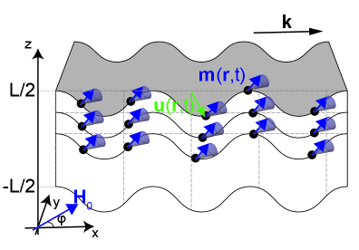
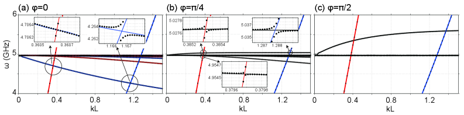

# 磁気弾性結合の微視的起源——双極子場が生む「隠れた」スピン-格子相互作用と磁気弾性定数の設計

- **執筆日**: 2026-04-28
- **トピック**: 強磁性薄膜における磁気弾性波の新機構と磁気弾性定数の第一原理計算・材料設計
- **タグ**: Magnetism and Spin / Magnetostriction and Magnetoelasticity / Magnons and Spin Dynamics / Thin Films and Interfaces / First-Principles Calculations
- **注目論文**: Yoshida et al., "Magnetoelastic Waves in Ferromagnetic Thin Films Mediated by Dipolar Interactions," arXiv:2604.22523 (2026)
- **参照論文数**: 7

---

## 1. なぜ今この話題なのか

スピントロニクスとマグノニクスの急速な発展に伴い、スピン（磁気）の自由度と格子（弾性）の自由度を結ぶ「磁気弾性結合（magnetoelastic coupling）」が、かつてない注目を集めている。磁気弾性結合は、磁歪材料を用いたセンサーやアクチュエータ、スピン波フィルター、マイクロ電気機械システム（MEMS）の動作原理を支える根幹であり、応用面の重要性は以前から認識されていた。しかし近年、マグノン（スピン波）とフォノン（弾性波）が量子力学的に混成する「マグノン-フォノン結合」が実験的に観測されるようになり、この古典的テーマが全く新しい量子情報・量子センシングの文脈で再評価されている。

材料設計の観点からも状況は大きく変わってきた。従来の磁歪材料はテルフェノール-D（TbDyFe₂）のように希土類元素を含むものが中心であり、λ ≈ 2000 ppm に達する巨大磁歪を示す反面、希少性・高コスト・硬脆性が問題だった。近年、第一原理計算による高速スクリーニングが可能になり、希土類を含まない合金（ホイスラー合金など）でも大きな磁歪が予測・発見されるようになってきた。Wu らは Co 基ホイスラー合金 25 種を系統的に第一原理計算でスクリーニングし、Co₃Si で λ₀₀₁ = −966 ppm という巨大磁歪を予測した（2603.26864）。磁気弾性定数を精密に計算する自動化ツール（MAELAS, 2210.00791）も整備が進み、理論と実験の対話が加速しつつある。

このような背景の中、Yoshida らの注目論文（2604.22523）は、強磁性薄膜における磁気弾性結合のまったく新しいメカニズムを提唱した。従来のスピン軌道結合（SOC）に由来する磁気弾性定数 B₁, B₂ とは独立に、磁気双極子相互作用の弾性変形依存性が実効的な磁気弾性結合を生み出すというものである。この「双極子媒介磁気弾性結合」は、薄膜固有のジオメトリー効果であり、バルク物質の B₁, B₂ だけを見ていては見落としてしまう。YIG（イットリウム鉄ガーネット）薄膜を対象とした数値計算では、磁気静的波とラム波（板波）の間に明確なアンチクロッシングが生じ、混成ギャップが 0.1 から数 MHz に達することが示された。この結果は、磁気弾性結合の「完全な記述」にはSOC起源の定数だけでなく双極子場の弾性変形依存性まで考慮する必要があることを意味しており、従来の理解に本質的な修正を迫るものである。

---

## 2. 未解決問題は何か

**問1: 磁気弾性結合のすべての微視的起源は何か？**

磁気弾性定数 B₁, B₂ の起源はスピン軌道結合（SOC）に基づく 1 電子的描像で長年理解されてきた。しかしこの理解は完全ではない。交換相互作用に由来する等方的体積磁歪（交換磁歪）は SOC とは無関係であり、MAELAS ツール（2210.00791）が自動計算できるようになったのは最近のことだ。さらに Yoshida らの論文は、双極子場そのものが弾性変形で変化することが磁気弾性結合を生じさせると主張する。SOC、交換相互作用、双極子場——これら 3 つの起源がそれぞれどの程度寄与するか、系統的に理解されているとは言えない。

**問2: 第一原理計算はどこまで磁気弾性定数を正確に予測できるか？**

密度汎関数理論（DFT）に基づく第一原理計算は磁気弾性定数の予測に大きく貢献してきたが、依然として課題が残る。スピン軌道結合の大きい希土類系では相関効果が強く、LDA/GGA では不十分な場合がある。コバルト基ホイスラーの第一原理予測（2603.26864）でも、実験値との定量的な比較は限られており、設計原理としての信頼性をどう担保するかが問われている。また、薄膜や界面では残留歪みが磁気弾性効果に大きく影響する（2604.20645）が、これを第一原理で取り込むのは容易ではない。

**問3: スピン-格子結合の普遍的な設計指針は存在するか？**

大きな磁気弾性結合を持つ材料をどう設計するか。SOCを強める（重元素置換、稀土類）か、電子構造のフェルミ面付近にバンドの縮退を作るか、交換相互作用の体積依存性を最大化するか。複数の戦略が提案されているが、これらを統一する設計原理はまだ確立していない。双極子媒介結合（2604.22523）という新機構の発見は、「薄膜の形状・厚さ・磁場方向」を設計パラメータとして活用できる可能性を示唆しており、新たな自由度を与えるかもしれない。

---

## 3. 注目論文の核心

Yoshida, Kono, Fujimoto, Asano, Hatanaka, Yamamoto, Murakami らの論文（arXiv:2604.22523）は、「強磁性薄膜において、磁気双極子相互作用が媒介する磁気弾性結合が存在する」という新しい理論的知見を提示した。

**従来の理解と今回の一歩前進**

これまでの磁気弾性理論の標準的な枠組みでは、弾性変形（歪みテンソル ε_{ij}）と磁化方向（方向余弦 α_i）の結合は

$$F_\mathrm{me} = B_1 \sum_i \varepsilon_{ii} \alpha_i^2 + B_2 \sum_{i \neq j} \varepsilon_{ij} \alpha_i \alpha_j$$

という磁気弾性エネルギー密度で記述され、磁気弾性定数 B₁, B₂ はスピン軌道結合に由来するとされてきた。薄膜での磁気弾性問題を扱う際も、この B₁, B₂ を用いた Landau-Lifshitz 方程式と弾性方程式の連立によるアプローチが主流だった。

Yoshida らは、このアプローチが見落としている結合項があることを指摘した。強磁性薄膜中の磁気モーメントは弾性波によって互いの位置関係（距離と方向）が変化する。すると、磁気双極子-双極子相互作用から生じる双極子場（静磁場）が変化し、これがスピンの歳差運動に追加の力を及ぼす。この「変位場による双極子場の変調」がひとつの独立した磁気弾性結合経路となる。

数式的には、Maxwell 方程式を弾性変形が存在する状況へ拡張し、磁化と歪みの積を含む結合項を導出している。この項は SOC 由来の B₁, B₂ とは独立であり、薄膜の幾何学（厚さ L、波数ベクトル k の方向）に強く依存する。

**YIG薄膜での数値計算結果**

対象として YIG（3d−5d 遷移金属イオンを含むガーネット型酸化物、磁歪は小さいが低ダンピングで有名）の薄膜を選んだ点も重要である。YIG は標準的な SOC 起源の磁気弾性定数（B₁ ≈ −3.5×10⁵ J/m³, B₂ ≈ 6.96×10⁵ J/m³）が知られており、それに加えて双極子媒介の寄与を定量評価できる。

分散関係の計算により、磁気静的スピン波とラム波（板弾性波）のアンチクロッシングが予測された（図2）。このアンチクロッシングの大きさ（混成ギャップ）は、磁場方向 φ（外部磁場と波数ベクトルのなす角）に依存し、0.1 から数 MHz の範囲に分布する。対称性の観点からは、系の C₂ₓ 対称性に基づいてモードが分類され、固有値 +1 と −1 を持つモード間のアンチクロッシングと、異なる対称性クラスが混在する場合の違いが整理されている（図2の赤・青・黒の曲線に対応）。

**何が仮説段階か**

重要な点として、双極子媒介の磁気弾性結合が実験的に観測されたわけではない。この論文はあくまで理論的予測であり、実際の YIG 薄膜デバイスでの実験検証が次のステップとなる。また、今回の理論では SOC 由来の B₁, B₂ 項と双極子媒介項が独立に扱われているが、両者の量子力学的な交差項（干渉効果）については触れられていない。実際の実験観測でこれら 2 つの機構をどう分離するかも未解決課題として残る。

**図1**: 注目論文（2604.22523）のモデルの模式図。面内に外部磁場 **H₀** がかかった強磁性薄膜を考える。弾性波が伝播すると磁気モーメントの位置関係が変化し、双極子相互作用が変調される。この変調が新たな磁気弾性結合を生む。© Yoshida et al. (CC BY 4.0)

**図2**: 結合波の分散関係（2604.22523 より）。磁場方向 φ = 0（a）、π/4（b）、π/2（c）の場合について、磁気静的モード（黒）と弾性ラム波モード（赤・青）が混成してアンチクロッシングを形成する。挿入図は混成ギャップを拡大表示している。© Yoshida et al. (CC BY 4.0)

---

## 4. 背景と研究史

磁気弾性結合の理論は 1950-60 年代に遡る。Callen と Callen（1965）は対称性に基づく磁気弾性エネルギーの一般的な記述を与え、スピン軌道結合に由来する磁気弾性定数の概念を確立した。この枠組みは今日の第一原理計算の基盤として生きている。

第一原理計算による磁気弾性定数の計算は、2000 年代以降に実用的なレベルに達した。力の定理（force theorem）を用いた手法や、エネルギーの歪みに対する 2 次微分を数値的に求める手法が開発された。スピネルフェライト（CoFe₂O₄, NiFe₂O₄）を対象とした早期の体系的研究（1205.0906）は、DFT に基づく磁気弾性係数計算の可能性と限界を示すベンチマークとなった。この研究では CoFe₂O₄ の λ₁₀₀ = −590 ppm（実験値 ≈ −590 ppm）という良好な再現性が示されており、第一原理計算が磁気弾性定数予測に十分な精度を持つことが確認された。

ホイスラー合金 Co₂XAl（X = Cr, Mn, Fe 等）を対象とした DFT 研究（2008.03005）は、フェルミ面近傍の電子構造（特にマイノリティスピンバンドのバンド縮退）が磁気弾性定数を左右することを明示した。λ の符号と大きさが X サイトの 3d 電子数に系統的に依存するという知見は、「設計指針」の萌芽であった。しかし当時は 25 種に及ぶ系統的スクリーニングまでは計算コストの観点から困難だった。

希土類化合物 TbDyFe₂（テルフェノール-D）の第一原理研究（2007.15266）は、Tb/Dy イオンの 4f 電子が持つ巨大な SOC こそが超大磁歪の起源であることを定量的に確認し、スピン再配向転移（spin reorientation）の組成依存性も再現した。この仕事は、希土類 4f 電子系の磁気弾性が第一原理で扱えることを示したが、同時に DFT+U や相対論的効果の取り込みが不可欠であることも明らかにした。

2022 年には MAELAS（v3.0）という Python パッケージが公開された（2210.00791）。これは単位胞変形に基づく系統的なアプローチにより、等方性（交換起源）磁気弾性定数と磁歪係数を第一原理計算・古典スピン-格子モデルの両方で自動的に計算できるツールである。特に、等方性磁歪係数 λ^{α1,0}（一軸晶用）の従来文献における定義の誤りを発見・訂正した点は重要で、この種の計算の「自動化と標準化」が信頼性向上に直結することを示した。

このような計算基盤の上で行われた最新の大規模スクリーニングが、Wu らの Co 基ホイスラー研究（2603.26864）である。Co₂YZ 型ホイスラー 25 種の磁気弾性定数を系統的に DFT で計算し、10 種で |λ₀₀₁| > 100 ppm の大きな磁歪を見出した。最大は Co₃Si の −966 ppm。さらに、フェルミ準位のチューニング（Sb 置換で −905 ppm）と SOC の増強（Re 置換で −1008 ppm）という 2 種類の設計戦略を提示し、Y サイトの遷移金属種と磁歪の間の線形則（経験的予測則）を導出した。この設計指針は今後の材料探索を大幅に効率化できる可能性を持つ。

一方で、実験的な磁気弾性効果の定量的取り扱いは依然として難しい。Co₈₀Ir₂₀ 薄膜を対象とした実験研究（2604.20645）は、下地層（Ta/Pt）の違いによる残留歪みが実効異方性場を 7–9 kOe も変調することを FMR（強磁性共鳴）で定量した。磁気結晶異方性の実験値を正確に決定しようとするとき、磁気弾性効果を無視すると系統誤差が生じる——これは材料パラメータ決定の実際的な困難を示す典型例であり、理論・計算の精緻化が実験解析とも強く連携している現状を物語る。

また、磁気秩序と格子の結合が異なる形で現れる系として、無秩序二重ペロブスカイト GdSrCoMnO₆ における実験研究（2604.19894）も参考になる。この物質ではラマン散乱が磁気秩序温度付近でフォノン周波数に異常を示し、スピン-フォノン結合の証拠とされている。磁気弾性定数（SOC 起源）よりも交換相互作用の体積依存性が支配的な物質群では、このような実験手法が結合定数を見積もる有効なプローブとなる。

これらの研究史をまとめると、磁気弾性結合の研究は「SOC 起源の B₁, B₂ の精密計算」という第 1 フェーズから、「交換磁歪の自動計算・希土類フリー材料の大規模スクリーニング」という第 2 フェーズを経て、今まさに「双極子場や界面・薄膜幾何効果まで含む完全な記述」という第 3 フェーズへ踏み出そうとしている。Yoshida らの論文はこの第 3 フェーズの幕を開けるものと位置づけられる。

---

## 5. どの解釈が最も妥当か

**双極子媒介磁気弾性結合の根拠と強さ**

Yoshida らの理論は Maxwell 方程式と弾性力学から導かれる厳密な枠組みに基づいており、追加の近似を要しない。双極子場が弾性変形によって変調されるというメカニズムは物理的に明快であり、薄膜のジオメトリー（有限の厚さ L）があることで初めて有限の結合が生じるという点も整合的だ。YIG を例にとると、B₁, B₂ から予測される通常の磁気弾性混成ギャップは実験的に数十〜数百 kHz 程度であるが、今回予測された双極子媒介ギャップは 0.1〜数 MHz であり、同じオーダーかそれ以上の大きさを持つ可能性がある。

一方で注意すべき点もある。双極子場の弾性変形依存性は「遠距離相互作用」に由来するため、薄膜の形状・境界条件への依存性が強い。現実のデバイスでは基板との接着（クランプ効果）、残留歪み、表面状態なども影響し、これらを理論モデルに全て組み込むことは容易ではない。Co₈₀Ir₂₀ 薄膜の実験（2604.20645）が示すように、残留歪みによる磁気弾性効果の寄与は意外に大きく、実験でこれを「双極子起源」と「SOC 起源」の 2 つに分離することは現状では方法論が確立していない。

**第一原理計算の予測力**

Wu ら（2603.26864）による Co 基ホイスラーの系統スクリーニングは、Y サイト遷移金属種と λ₀₀₁ の間に線形則を見出した点が際立った成果である。ただし、現時点でこの予測を実験的に全て検証した報告はない。第一原理計算には k 点サンプリングの精度、SOC の取り込み方（全相対論的 vs. スカラー相対論的 + SOC 摂動）、交換相関汎関数の選択などに依存した系統誤差があり、大磁歪物質（|λ| > 100 ppm）での予測精度は一般に ±20–30% 程度と考えられている。

MAELAS（2210.00791）は等方性磁歪の自動計算で特に貢献しており、交換磁歪（等方性体積磁歪）の起源は SOC ではなく交換積分の体積微分 dJ/dV であるため、DFT の精度が比較的高い。ただし、絶対値を実験と比較するためには「常磁性状態の平衡体積」という参照状態の選択が結果を左右するという繊細な問題がある（論文内で指摘・訂正済み）。

**スピン-フォノン結合としての別側面**

GdSrCoMnO₆ でのラマン異常（2604.19894）は、磁気秩序温度付近でのフォノンの繰り込みがスピン-フォノン結合として現れる例である。これは磁気弾性定数という「静的」な量とは別の側面——「動的な」スピン-格子結合——を捉えており、磁場依存のラマンスペクトルによってスピン-格子結合定数 g = (∂ω/∂⟨S·S⟩) を実験的に評価できる。この手法は薄膜でも原理的には応用可能であり、双極子媒介磁気弾性結合を実験的に検出するプローブのひとつになりうる。

**現時点での総合的判断**

最も確かな知見としては、「SOC 由来の磁気弾性定数は第一原理計算で 20–30% 程度の精度で予測でき、材料スクリーニングに十分な精度がある」「交換磁歪の自動計算は MAELAS で実用段階」「薄膜では残留歪みが実験的な磁気弾性効果を大幅に修飾する」という 3 点が挙げられる。双極子媒介磁気弾性結合については、理論的メカニズムは説得力があり、数値計算でも 0.1–数 MHz の混成ギャップが示されているが、実験的検証はまだない。この部分は「有力な仮説」の段階と評価するのが適切だろう。

---

## 6. 何が一般化できるのか

**薄膜形状への依存性——双極子効果の普遍性**

Yoshida らの双極子媒介磁気弾性結合は YIG 薄膜を対象に計算されたが、そのメカニズム自体はあらゆる強磁性薄膜に適用できる。双極子場の大きさはおよそ μ₀M²（磁気モーメント密度 M に依存）であり、飽和磁化の大きい材料（Fe, Ni, Co 合金、スピネルフェライトなど）ではより強い双極子媒介結合が期待される。さらに、薄膜の厚さ L と波長 λ_elastic の比が効果の大きさを決める重要なパラメータとなり、デバイスの形状設計が磁気弾性結合の工学的チューニングに直結する。

磁性多層膜やヘテロ構造では、異なる材料間の界面双極子場変調も新たな効果を生む可能性がある。圧電体と磁性体を組み合わせたマルチフェロイック複合体（例：PZT/Ni や PMN-PT/磁性合金）は SAW（表面弾性波）によるスピン波励振や双極子媒介磁気弾性結合の実験的舞台として有望である。

**希土類フリー磁歪材料の設計指針**

Co₂YZ ホイスラー合金のスクリーニング（2603.26864）が示した Y サイト依存の線形則は、「フェルミ準位付近のマイノリティスピンバンドの特徴が磁歪を支配する」という微視的機構とよく整合する。この知見を一般化すると、以下の設計方針が導かれる。

- **フェルミ準位チューニング**: バンド縮退点にフェルミ準位が近い状況を作ると SOC 由来の軌道モーメントが増強される → 磁歪大
- **SOC 強化**: 重元素（Re, W, Ir など）の置換によって SOC を増大させる（ただし磁性の変化にも注意）
- **交換磁歪の利用**: 磁気相転移付近で交換磁歪が急増する材料を利用したカロリック効果デバイスへの応用

これらの指針は、Co 基ホイスラーに限らず、ペロブスカイト酸化物、二元遷移金属合金、2 次元磁性体にも拡張できる可能性がある。

**スピン音響波（SAW-FMR）デバイスへの直接応用**

双極子媒介磁気弾性結合の存在は、SAW と強磁性共鳴の結合（SAW-FMR）デバイスの設計理論にも影響を与える。従来の SAW-FMR の理論モデルは B₁, B₂ のみを結合パラメータとして使ってきたが、薄膜デバイス（典型的に厚さ数十〜数百 nm）では双極子媒介の寄与が無視できない可能性がある。この修正は、デバイスの周波数特性・品質因子の精密モデリングに必要となるかもしれない。量子コンピューティングや量子センシングに向けたマグノン-フォノン量子もつれ状態の生成では、結合定数の正確な評価が決定的に重要である。

---

## 7. 基礎から理解する

### 磁歪と磁気弾性カップリング——何が起きているのか

磁性体は磁場をかけると形が変わる——これが磁歪（magnetostriction）である。逆に、磁性体を引き伸ばしたり圧縮したりすると磁化の方向が変わる——これがビラリ効果（Villari effect）である。この 2 つの現象は表裏一体であり、その根底にあるのが「磁気弾性結合（magnetoelastic coupling）」という物理である。

直感的に理解するには、まず磁性体中の原子を想像してほしい。各原子上の磁気モーメントは隣接原子との交換相互作用（並ぶか逆並ぶかを決める量子力学的効果）と、スピン軌道結合（電子のスピンと軌道運動の磁場的な結合）を受けている。スピン軌道結合は電子雲（軌道）の形を磁化方向に応じて変えようとし、これが原子間距離の変化——すなわち格子の歪みを引き起こす。これが磁歪の主要な微視的起源である。

### 磁気弾性エネルギーの定式化

系の磁気弾性エネルギー密度は、歪みテンソルの成分 ε_{ij} と磁化方向余弦 α_i = M_i/M_s（M_s は飽和磁化）の積で展開される。立方晶対称性を持つ磁性体（Fe, Ni, Co など FCC/BCC 金属や多くのホイスラー合金）では

$$F_\mathrm{me} = B_1 (\varepsilon_{xx}\alpha_x^2 + \varepsilon_{yy}\alpha_y^2 + \varepsilon_{zz}\alpha_z^2) + B_2 (\varepsilon_{xy}\alpha_x\alpha_y + \varepsilon_{yz}\alpha_y\alpha_z + \varepsilon_{zx}\alpha_z\alpha_x)$$

と書ける。ここで B₁ と B₂ が**磁気弾性定数**（magnetoelastic constants）であり、単位は J/m³（エネルギー密度）である。

この式は何を言っているか。$B_1 \varepsilon_{xx} \alpha_x^2$ という項は「x 方向に伸びると（ε_{xx} > 0）、磁化を x 方向に向けることでエネルギーが下がる（B₁ < 0 の場合）」という意味である。つまり、磁化は歪みに連動した方向を「好む」——これが磁気弾性異方性エネルギーの本質だ。

一方、磁歪（形の変化）の観点から見ると、平衡状態ではこの磁気弾性エネルギーを弾性エネルギーと合わせて最小化する歪みが選ばれる。100 方向（[100]）に磁化したときに生じる相対的な形状変化 λ₁₀₀ と、111 方向への磁化による形状変化 λ₁₁₁ が、実験で測定される磁歪定数である。B₁, B₂ と λ₁₀₀, λ₁₁₁ の間には弾性定数を介した変換式が存在する：

$$\lambda_{100} = -\frac{2}{3} \frac{B_1}{c_{11} - c_{12}}, \quad \lambda_{111} = -\frac{1}{3} \frac{B_2}{c_{44}}$$

ここで c_{11}, c_{12}, c_{44} は弾性定数（単位 Pa）である。磁歪定数 λ の単位は無次元（ppm）。

### スピン軌道結合が磁気弾性定数を決める

なぜ B₁, B₂ がスピン軌道結合（SOC）に由来するのか。原子の電子は核の周りを「周回」しており、この軌道運動は電子自身から見ると核が周回しているように見え、一種の磁場を感じる。スピン磁気モーメントはこの磁場と結合する——これが SOC（原子番号 Z に対して Z⁴ でスケールする）である。SOC はスピンを軌道（電子雲の形）に「結びつける」効果を持つ。電子雲の形は結晶格子の対称性・隣接原子との距離によって変化するから、格子の歪みによって電子雲が変形し → 軌道モーメントが変化し → SOC を通じてスピン方向に対してエネルギーが変わる——この連鎖が磁気弾性定数の微視的起源である。

SOC が弱い 3d 遷移金属（Fe, Ni, Co）では λ は 10–100 ppm 程度に留まる。SOC が強い重元素（稀土類 4f 電子）では λ は 1000 ppm を超える。テルフェノール-D（Tb₀.₃Dy₀.₇Fe₂）の λ ≈ 2000 ppm は 4f 電子の巨大 SOC に由来する。

### 交換磁歪——SOC とは別の起源

磁気弾性には SOC とは別の起源もある。交換相互作用 J（原子間のスピン配列を決める量子力学的効果）は原子間距離に依存する：J = J(r)。磁気秩序（フェリ・フェロ磁性相）では、全エネルギーを最小にする体積が常磁性相と異なるため、磁気転移とともに体積が変化する。これが「交換磁歪（exchange magnetostriction）」であり、等方的な体積変化として現れる。この体積磁歪 ω = ΔV/V は SOC がゼロでも生じる。MAELAS（2210.00791）は、この交換磁歪を第一原理計算で自動的に得るための参照状態（常磁性状態の平衡体積 + 磁気秩序の磁気構造）の正しい選択を明確化した重要な貢献をしている。

### 磁気静的スピン波とラム波

注目論文を理解するには、**磁気静的スピン波（magnetostatic spin wave）** と**ラム波（Lamb wave）** の 2 種類の波を理解する必要がある。

磁気静的スピン波とは、薄膜中を伝わるスピン波（マグノン）の一種で、静磁場のみを用いた近似（静磁気近似）で記述される。薄膜では、表面磁気スピン波（Damon-Eshbach モード）など伝播方向に依存した多彩なモードが存在する。分散関係は外部磁場 H₀、飽和磁化 M_s、波数 k、薄膜厚さ L によって決まる。

ラム波とは、板（薄膜）中を伝わる弾性波の固有モードであり、「対称モード（S モード）」と「非対称モード（A モード）」に分類される。波長が薄膜厚さに比べて長い低周波領域では、最低次の A モード（曲げ波）と S モード（伸縮波）の 2 種類が主に存在する。周波数は数 MHz〜数 GHz の範囲であり、SAW（表面弾性波）デバイスや MEMS に使われる。

磁気弾性結合がある場合、スピン波の分散曲線と弾性波の分散曲線が「交差しそうな点」でアンチクロッシング（反交差）が生じる。これは量子力学的な「避けられる交差（avoided crossing）」であり、混成ギャップ（hybridization gap）の大きさが結合定数を反映する。Yoshida らは、通常の B₁, B₂ によるアンチクロッシングに加えて、双極子場の弾性変形依存性から生じる追加のアンチクロッシングが YIG 薄膜に存在することを示した。

### 双極子場と弾性変形の関係

双極子場（磁気双極子-双極子相互作用から生じる内部磁場）は、磁化の配置（M の空間的分布）から Maxwell 方程式で決まる。強磁性薄膜が面内に一様に磁化している場合、磁気静的スピン波の伝播に伴って M に空間的揺らぎが生じ、これが非局所的な磁気双極子場（退磁場の空間変調）を生む。

弾性変形（弾性波の伝播）が加わると、原子の位置が変わる。これは磁気モーメントの「位置」が変わることを意味し、その結果として双極子場の空間パターンが変化する。具体的には、変位ベクトル u に対し、双極子場の変調量は∂H_d/∂u の形で表される。この変調が M に追加の力（Yoshida らは「Maxwell stress」と表現している）を及ぼし、これが磁気弾性結合として作用する。

### 第一原理計算における磁気弾性定数の算出

DFT（密度汎関数理論）を用いた磁気弾性定数の計算は以下の手順による：

1. 磁性体の平衡格子定数を求める
2. 特定の歪みを加えた変形セルで全エネルギー E(ε, α) を計算（SOC を含む計算）
3. E(ε, α) の歪み・磁化方向への偏微分から B₁, B₂ を抽出

実際の計算では、格子定数の精度（exchange-correlation 汎関数の選択）、SOC の取り込み方（全相対論的 vs. 2 成分スピノル基底）、磁気秩序状態の安定性確認などが品質を左右する。MAELAS はこの一連の手順を自動化し、再現性のある計算フローを提供している。

---

## 8. 専門用語の解説

**磁気弾性定数（Magnetoelastic constants, B₁, B₂）**
磁化方向と格子歪みの間の結合強さを表すパラメータ。単位は J/m³（エネルギー密度）。立方晶系では B₁（法線歪みへの結合）と B₂（せん断歪みへの結合）の 2 種類がある。スピン軌道結合に由来し、Fe では B₁ ≈ −3.6 × 10⁶ J/m³（λ₁₀₀ ≈ +21 ppm）、Ni では B₁ ≈ +6.2 × 10⁶ J/m³（λ₁₀₀ ≈ −46 ppm）。本論文では、従来の B₁, B₂ とは独立な双極子媒介の結合項が薄膜系に存在することを主張している。

**磁歪定数（Magnetostrictive constants, λ₁₀₀, λ₁₁₁, λₛ）**
磁性体が磁化方向に応じて形を変える割合（ΔL/L）。無次元量で ppm（10⁻⁶）で表される。一般に λₛ = (2/5)λ₁₀₀ + (3/5)λ₁₁₁ を飽和磁歪と呼ぶ。Fe: λₛ ≈ −7 ppm, Ni: λₛ ≈ −33 ppm, Co₃Si(DFT予測): λ₀₀₁ = −966 ppm, TbDyFe₂: λ₁₁₁ ≈ 1600 ppm。材料スクリーニングでは λ₀₀₁（[001]方向磁歪）が指標として多用される。

**スピン軌道結合（Spin-orbit coupling, SOC）**
電子のスピン角運動量と軌道角運動量の相互作用。ハミルトニアンは H_SOC = ξ L·S の形で書かれ、結合定数 ξ は原子番号 Z に対しておよそ Z⁴ でスケールする。SOC は磁気異方性・磁気弾性の微視的起源であり、希土類 4f 電子（大きな ξ）で特に重要。Co₂CrGa への Re 置換（2603.26864）でも SOC 増強戦略が有効であることが示された。

**交換磁歪（Exchange magnetostriction）**
交換相互作用 J が原子間距離 r に依存すること（dJ/dr ≠ 0）により生じる等方的体積磁歪。磁気相転移温度付近で顕著になる。SOC が不要なため、非磁性重元素を持たない材料でも大きな体積変化をもたらしうる。MAELAS（2210.00791）はこの等方性磁歪の自動計算を可能にした主要ツール。

**磁気静的スピン波（Magnetostatic spin wave）**
静磁気近似（光速を無限大と仮定した Maxwell 方程式の近似）で記述されるスピン波。薄膜中では Damon-Eshbach モード（面内伝播、磁場垂直面）、Forward Volume Mode（面垂直伝播）などが知られる。マグノニクスデバイスの信号媒体として重要。Yoshida らの論文では双極子場の変調を通じてラム波と結合するスピン波がこれに相当する。

**ラム波（Lamb wave）**
有限厚さの弾性板（薄膜）中を伝わる弾性波モード。板の厚さと弾性波長の比に応じて対称（S）モードと非対称（A）モードが存在する。SAW（表面弾性波）デバイスや超音波センサーで利用される。Yoshida らは YIG 薄膜中のラム波が磁気静的スピン波と双極子場を介して混成することを示した。

**アンチクロッシング（Avoided crossing）**
2 つのモードの分散曲線が「交差しそうな点」で、実際には交差せずに互いを「避ける」現象。量子力学的な混成（hybridization）の特徴であり、混成ギャップの大きさが結合定数に比例する。マグノン-フォノンカップリングの実験的証拠として最もわかりやすいシグナルのひとつ。

**ヴィラリ効果（Villari effect）**
磁歪の逆現象。磁性体に機械的応力をかけると磁化（透磁率）が変化する。応力センサーや振動センサーに応用される。磁気弾性定数 B₁, B₂ が同一の物性定数で記述されるため、磁歪と Villari 効果は熱力学的に双対な関係にある。

**MAELAS**
Pablo Nieves らが開発・公開した磁気弾性定数の自動第一原理計算 Python パッケージ（v3.0, 2022; 2210.00791）。VASP, Quantum ESPRESSO 等の DFT コードと連携し、単位胞変形に基づく系統的な計算フローを提供する。等方性（交換起源）磁気弾性定数の計算、磁歪係数の定式化誤りの訂正など、計算の標準化・信頼性向上に大きく貢献している。

**力定理（Force theorem）**
DFT において、SOC を摂動として扱う近似的な手法。非相対論的（スカラー相対論的）計算で得た電荷密度を固定したまま SOC を加え、バンドエネルギーのみを足し算することで磁気異方性エネルギーや磁気弾性エネルギーを計算する。完全相対論的計算より大幅に安価で、磁気弾性定数の定性的理解・材料スクリーニングに頻用される。

**ホイスラー合金（Heusler alloy）**
一般式 X₂YZ（完全型）または XYZ（半ホイスラー型）で表される規則合金。多彩な電子・磁気特性を持ち、半金属（half-metal）、トポロジカル半金属、磁歪材料として研究されている。Co₂YZ 系（Y = V, Cr, Mn, Fe; Z = Al, Si, Ga 等）は希土類フリーの大磁歪材料候補として注目されており、第一原理スクリーニング（2603.26864）により λ₀₀₁ = −966 ppm の Co₃Si が同定された。

---

## 9. 今後の展望

Yoshida らの理論が予測する双極子媒介磁気弾性混成ギャップは、現在の実験技術で検出可能な 0.1–数 MHz の範囲にある。YIG 薄膜を用いたブリルアン散乱（BLS）や VNA-FMR（ベクトルネットワークアナライザを用いた広帯域 FMR）による実験検証が最優先課題だろう。特に重要なのは、磁場方向 φ を変えたときの混成ギャップの角度依存性であり、この特徴的な φ 依存性こそが「双極子起源」と「SOC 起源（B₁, B₂ 由来）」を実験的に区別する鍵となる。また、飽和磁化の異なる材料（YIG: M_s ≈ 140 kA/m と CoFe₂O₄: M_s ≈ 400 kA/m 等）を比較することで、「M_s の 2 乗に比例する」という双極子機構固有のスケーリングを検証できるはずだ。

計算・理論面では、3 つの方向が重要になる。第一は、双極子媒介結合と SOC 由来の B₁, B₂ の量子干渉効果を取り込んだ完全な理論の構築。第二は、MAELAS のような自動計算フレームワークを薄膜・多層膜系へ拡張し、残留歪み・界面効果を含む「実際の薄膜」の磁気弾性定数を予測する手法の確立。第三は、機械学習ポテンシャルや基盤モデル（foundation model）を用いた磁気弾性定数のハイスループットスクリーニングで、Co 基ホイスラーを超えた物質空間（MAX 相、2D 磁性体、層状化合物など）への展開が期待される。今後 1–3 年で特に注目すべき論点は、「双極子媒介磁気弾性結合の実験的確認」と「希土類フリー大磁歪材料の第一原理予測から合成・デバイス化まで一貫した実証」の 2 点であろう。

---

## 参考論文一覧

1. **[arXiv:2604.22523]** H. Yoshida et al., "Magnetoelastic Waves in Ferromagnetic Thin Films Mediated by Dipolar Interactions," (2026). https://arxiv.org/abs/2604.22523
   強磁性薄膜における磁気双極子相互作用が媒介する新しい磁気弾性結合機構を理論的に提唱し、YIG 薄膜での磁気静的波とラム波の混成を計算した注目論文。

2. **[arXiv:2603.26864]** P. Wu et al., "Giant Magnetostriction by Design: A First-Principles Screening of Co-based Heusler Alloys," Phys. Rev. B 112, 214446 (2025). https://arxiv.org/abs/2603.26864
   Co₂YZ ホイスラー合金 25 種の磁歪を第一原理で系統的に計算し、Co₃Si の λ₀₀₁ = −966 ppm を予測。Y サイト依存の線形設計則を提示。

3. **[arXiv:2604.20645]** L. Aviles Felix et al., "Strain effects in [001] textured Co₈₀Ir₂₀ thin films with negative magnetocrystalline anisotropy," (2026). https://arxiv.org/abs/2604.20645
   CoIr 薄膜で下地層の違いによる残留歪みが FMR 実効異方性場を 7–9 kOe 変調することを示し、磁気弾性効果の正確な定量の重要性を実験的に指摘。

4. **[arXiv:2210.00791]** P. Nieves et al., "Automated calculations of exchange magnetostriction," Comput. Mater. Sci. 224, 112158 (2023). https://arxiv.org/abs/2210.00791
   交換磁歪の等方性磁気弾性定数・磁歪係数を第一原理・スピン-格子モデルで自動計算する MAELAS v3.0 を開発し、一軸晶の係数定義の誤りを訂正。

5. **[arXiv:2007.15266]** 著者省略, "Spin orientation and magnetostriction of Tb₁₋ₓDyₓFe₂ from first principles," (2020). https://arxiv.org/abs/2007.15266
   テルフェノール-D (TbDyFe₂) の巨大磁歪を第一原理で再現し、4f 電子の SOC が超大磁歪の起源であることを示したベンチマーク的研究。

6. **[arXiv:2008.03005]** 著者省略, "Magnetoelastic and Magnetostrictive Properties of Co₂XAl Heusler Compounds," (2020). https://arxiv.org/abs/2008.03005
   Co₂XAl 系ホイスラー合金（X = Cr, Mn, Fe 等）の磁気弾性定数・磁歪を DFT で計算し、フェルミ面近傍のマイノリティスピンバンド縮退との相関を議論。

7. **[arXiv:2604.19894]** G. P. Moharana et al., "Griffiths-like phase, spin-phonon coupling, and exchange-bias in the disordered double perovskite GdSrCoMnO₆," (2026). https://arxiv.org/abs/2604.19894
   ペロブスカイト酸化物でのラマン異常を通じてスピン-フォノン結合を実験的に観測し、磁気弾性の「動的側面」を示す比較例。
