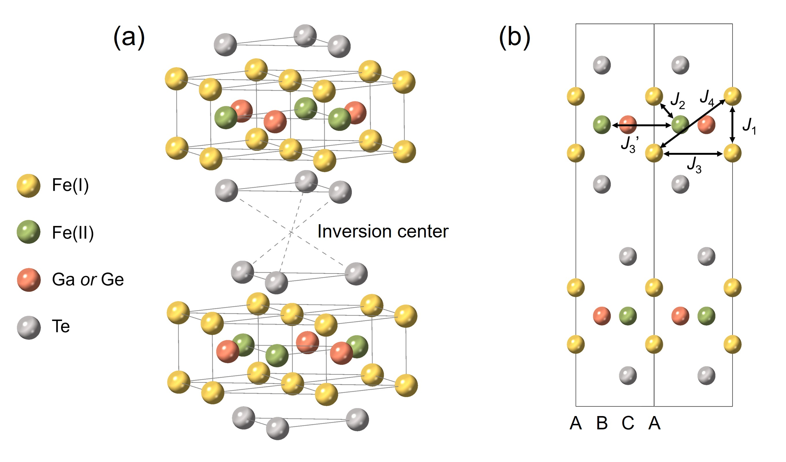
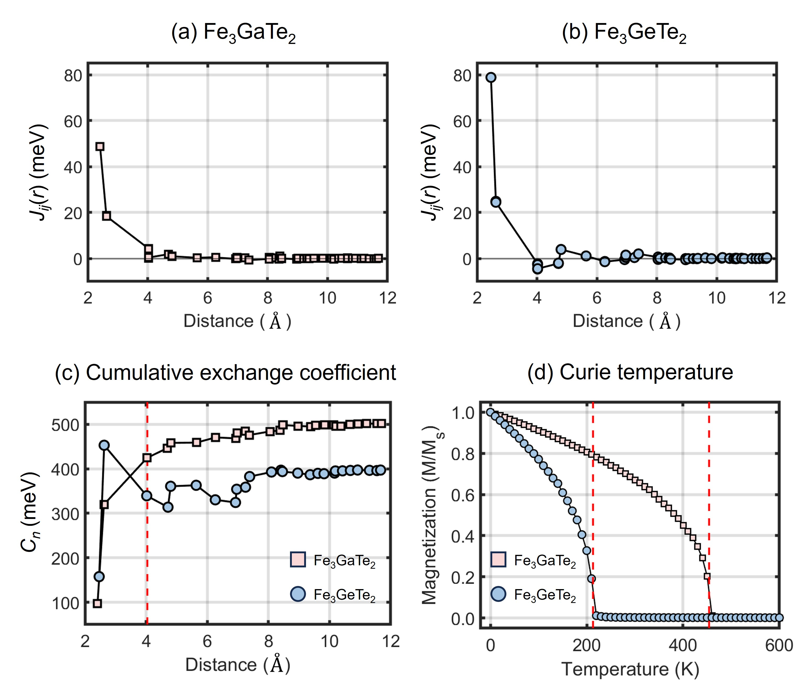
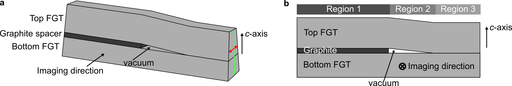
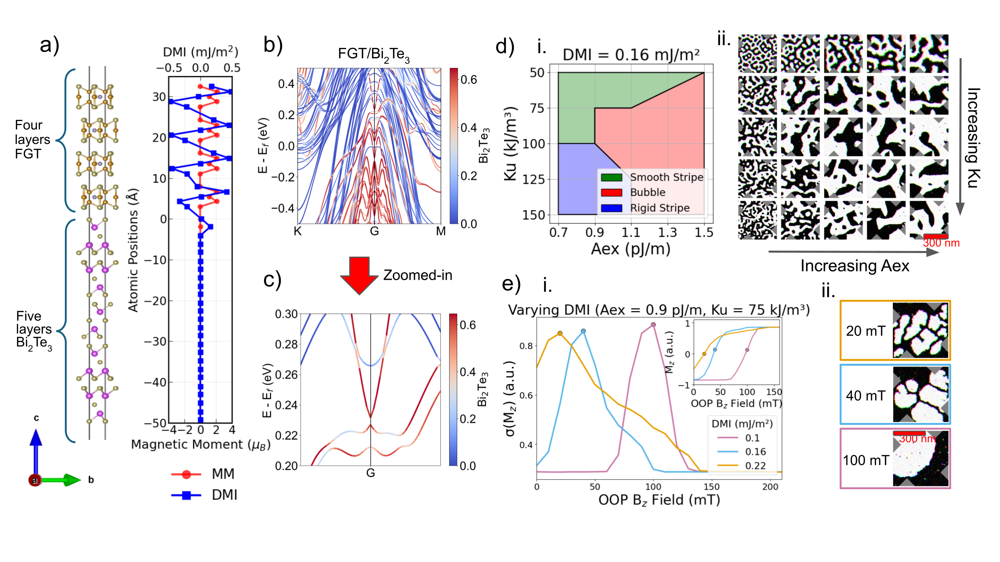
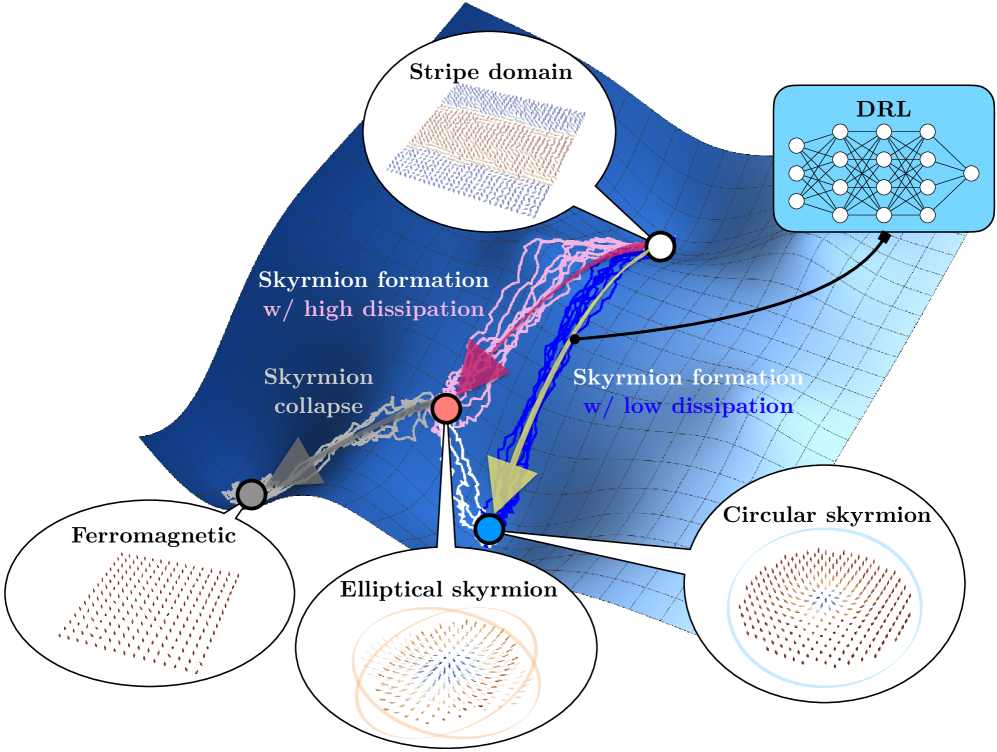

# ツイストvdW磁性体Fe₃GeTe₂における魔法角トポロジカルホール効果と局所対称性破れ誘起スキルミオン格子

- **執筆日**: 2026-04-14
- **トピック**: twisted-Fe3GeTe2-magic-angle-THE
- **タグ**: Magnetism and Spin / Skyrmions; Low-Dimensional Materials / Transport Measurements
- **注目論文**: arXiv:2603.14192 — "Emergent giant topological Hall effect in twisted Fe₃GeTe₂ metallic system", *Nature Communications* **17**, 2931 (2026)
- **参照関連論文数**: 6

---

## 1. なぜ今この話題なのか

スキルミオン（Skyrmion）は、スピン場のトポロジーによって保護された渦巻き状の磁気構造であり、1つの粒子として振る舞う。情報の担体として低消費電力メモリや論理素子への応用が期待される一方で、その実現には**ジャロシンスキー–守谷相互作用**（DMI: Dzyaloshinskii–Moriya interaction）と呼ばれる反対称的な交換相互作用が不可欠である。DMIは空間反転対称性が破れた系でのみ生じるため、バルクの結晶対称性が高い材料では原理的にゼロになる。

ファンデルワールス（vdW）積層磁性体、とりわけFe₃GeTe₂（FGT）やFe₃GaTe₂（FGaT）は、グラフェンと同様に機械的に数原子層まで薄くできる2次元磁性体として注目を集めている。Fe₃GeTe₂は約130〜230 Kのキュリー温度をもつ強磁性金属であり、Fe₃GaTe₂は最高380 K近くで室温以上のキュリー温度を示す。これらの材料は中心対称性（空間反転対称性）をもつ六方晶構造に属するため、厳密にはDMIが禁じられているはずである。にもかかわらず、近年の実験ではFe₃GaTe₂においてスキルミオン格子が観測されており、「なぜ中心対称系でスキルミオンが安定化するのか」という根本的な謎が生じていた。

この謎に追い打ちをかけるように、2026年3月に報告されたのが本記事の主軸となる研究である。韓国・延世大学のJe-Geun Park研究室を中心とするチームは、2枚のFe₃GeTe₂フレークをわずかにひねって積み重ねた**ツイスト二層系**において、特定の「魔法角（0.45°〜0.75°）」付近でのみ巨大な**トポロジカルホール効果**（THE）が出現することを発見した [arXiv:2603.14192]。しかもこの系は大域的な空間反転対称性を保つにもかかわらず、スキルミオン格子を形成する。この発見は、ツイスト工学という新手法がvdW磁性体にもたらす可能性を示すものであり、材料の格子構造を変えることなく、単に「重ね方」を変えるだけでトポロジカル磁気テクスチャを制御できることを示唆している。

ツイスト工学の考え方は、もとはグラフェン二層系（いわゆるMagic Angle Twisted Bilayer Graphene）で花開いた概念である。2018年にCao et al.がツイスト角1.1°付近の二層グラフェンで超伝導を発見して以来、ツイストを制御変数として用いる「モアレ物理学」は凝縮系物理の一大潮流となった。磁性体においても、ツイストによって層間の相互作用パターンが空間的に変調され、単層では見られない新たな秩序が生まれうるとの理論予測があった。しかし、金属磁性vdW材料でこれが実験的に実証されたのは今回が初めてであり、特に「魔法角」という概念が磁気トポロジーと結びついた点は、分野横断的に大きなインパクトを与えている。

*図1: Fe₃GaTe₂（左）とFe₃GeTe₂（右）の結晶構造比較。六方晶層状構造をもち、Fe₁サイト（頂点に位置）、Fe₂サイト（中央層）、Ge/GaサイトおよびTeサイトからなる。GaはGeよりも1つ少ない価電子をもち、これが磁気特性の差異の起源となる。出典: arXiv:2504.17998 (CC0)*

---

## 2. この分野で何が未解決なのか

### 問い①：中心対称vdW磁性体でのDMI起源は何か？

Fe₃GeTe₂やFe₃GaTe₂は、理想的なバルク構造では空間群 $P6_3/mmc$（中心対称）に属するため、DMIはゼロのはずである。しかし、実験ではNéel型スキルミオンやキラル磁区壁の観測例が次々と報告された。この矛盾を解消するために、いくつかの機構が提案されている。

第1の機構は**局所的な反転対称性破れ**である。Fe₃GaTe₂においては、走査型透過電子顕微鏡（STEM）によってFeIIサイトの原子が層中心からオフセンタリング（偏芯）していることが見出された。これにより、名目上は中心対称な系でも局所的には反転対称性が破れ、DMIが生じうる。第2の機構は**界面によるDMI誘起**である。Fe₃GeTe₂を酸化物やトポロジカル絶縁体と積層すると、界面での空間反転対称性破れからFert–Lévy機構を通じてDMIが生じる。第3の機構として最近提唱されているのが、**ツイスト**や**歪み（strain）** によって生じる局所的な対称性破れである。本記事の注目論文はまさにこの機構を実証したものである。

### 問い②：ツイスト角はどのように磁気構造を制御するか？

ツイスト磁性体において、隣接する2枚の磁性層がわずかにひねられると、モアレ周期パターンが生じ、層間の相互作用が空間的に変調される。グラフェンとは異なり、磁性体のツイスト系では、（a）交換相互作用の変調、（b）局所的な対称性破れによるDMI生成、（c）磁気双極子場の変化、という3つの効果が複合的に働く。どのパラメータがスキルミオン格子形成の決め手になるのかは、まだ十分に解明されていない。

### 問い③：スキルミオン格子安定化機構の普遍性とは？

スキルミオン安定化には、DMIだけでなく、磁気異方性、磁場、温度、熱揺らぎなど多くの変数が絡む。ツイスト、歪み、界面工学、ドーピングなど様々なアプローチが比較されるべきだが、それぞれの機構の優劣、相互補完性、そして室温安定性という実用要件との整合性はいまだ議論中である。特に、「ゼロ磁場・室温で安定なスキルミオン格子を実現できるか」という問いは、応用の観点から最も重要な未解決問題のひとつである。

---

## 3. 注目論文の核心

### 何が分かっていたか

ツイスト二層グラフェン系では、低エネルギーバンド構造が魔法角付近でフラットバンド化し、電子間相関が増強されることで超伝導や磁性を示すことが2018年以降に相次いで報告された。一方、磁性vdW材料のツイスト二層系については、理論的な予測はあったものの、実験的な検証が難しく、特に金属磁性体においてはトポロジカルホール効果を観測するには課題が多かった。

Fe₃GeTe₂については、単層や数層のフレークでスキルミオン格子が観測されることが2019年から報告されていた（例：2203.02666, Birch et al., Nat. Commun. 2022）。しかし、これらは多くが低温（100 K以下）での観測であり、かつスキルミオンは外部磁場の印加を必要としていた。

### 今回の前進点

Kim et al.（arXiv:2603.14192）は、機械的な裂開（クリービング）で得たFe₃GeTe₂フレーク2枚を微細なツイスト角θで重ね合わせた試料を作製し、10 K〜200 Kの温度範囲で輸送測定を実施した。ホール抵抗率のプロファイルを詳細に解析すると、異常ホール効果（AHE）に加えて、磁化 $M$ では説明できない「余剰ホール成分」が存在することが判明した。これは**トポロジカルホール効果**（THE）として知られ、スキルミオン格子に代表されるリアルスペース・ベリー位相に起因する輸送現象である。

特筆すべき点は、このTHEがツイスト角に対して非常に敏感であることだ。θ = 0.45°〜0.75°の「魔法角」範囲内でのみ巨大なTHEが現れ、それ以外の角度では消失する。測定された異常ホール成分の大きさは最大 ρ_THE ≈ 20 nΩ·cmに達し、これまでのFe₃GeTe₂系の既報値と比較しても2〜3倍大きい値である。

さらに、マイクロ磁気シミュレーションを実施した結果、ツイスト層間の局所的な磁気相互作用が「交互に向きを変えるDMI」（面内方向と層対比方向が交互に入れ替わる成分）を生成し、これがスキルミオン格子の自発的な形成をもたらすことが示された。大域的な空間反転対称性が保たれているにもかかわらず、**局所的には反転対称性が破れ**、有効DMIが発生するという点が最大の新規性である。

### まだ仮説段階のこと

ただし、現段階では以下の点が未確定である。第1に、スキルミオン格子の直接観測（例えばローレンツTEM、磁気力顕微鏡）がなされておらず、THEの存在から間接的に推定されている。第2に、魔法角の精密な理論的予測がまだ不完全であり、どのパラメータ（交換積分の比、層間距離、DMIの強度）が境界を決めるのかは数値シミュレーションによる検証が必要である。第3に、この現象が有限温度でどこまで安定か、また実用化可能な温度域（室温）まで引き上げるにはどのような戦略が有効かは未解明のままである。

---

## 4. 背景と研究史

Fe₃GeTe₂のスキルミオン研究は、2019〜2020年にかけてほぼ同時多発的に進んだ。ローレンツTEM（LTEM）および走査型透過X線顕微鏡（STXM）を用いた実験から、Fe₃GeTe₂フレークでスキルミオン格子が生成されることが明らかになった（1907.01425）。ただしこれらの多くは、Fe₃GeTe₂/h-BNや酸化物基板界面での空間反転対称性破れから生じる「界面DMI」に起因するものと解釈された。

並行して、Fe₃GaTe₂（FGaT）の研究も急速に発展した。FGaTはFGTと等構造であるが、Geの代わりにGaを使うことで価電子数が1つ減る。Kim et al. (arXiv:2504.17998) はFGaTとFGTを比較し、最近接交換定数J₁はFGTの方が大きいにもかかわらずキュリー温度はFGaTが圧倒的に高い（~380 K vs ~200 K）という逆説的な現象を説明した。その鍵は高次の交換相互作用であり、FGaTではJ₃以上の高次項が正（強磁性的）であるのに対し、FGTでは負（反強磁性的）であることが示された。

*図2: 交換相互作用係数（Jn）の距離依存性（左）と規格化磁化の温度依存性（右）の比較。FGaTではJ₃以上の高次項が正のため全交換定数の和が大きく、より高いキュリー温度を示す。出典: arXiv:2504.17998 (CC0)*

FGaTにおける室温スキルミオンの発見については、2024年に複数の重要な研究が発表された。例えばXia et al.（arXiv:2505.06924）は、磁場冷却（FC）プロセス中にFeTe₂相が局所的に析出し、これがFGaTやFGT内に局所的な界面を形成してDMIを誘起することを明らかにした。この「フィールドクーリング誘起界面工学」という機構は、室温スキルミオンの起源として有力な候補のひとつである。

一方、界面だけに頼らないアプローチとして、Zhou et al.（arXiv:2505.08583）は可撓性基板上のFGaTに約0.8%の機械的歪みを加えることで、室温でもスキルミオン格子が安定化することを実証した。フレキシブルデバイスへの応用が意識された研究であり、「歪みによってDMIを誘起できる」という設計原理を示した。歪みはランタン遷移を通じて格子の対称性を局所的に破り、等方的な歪みが異方的なDMI成分を生み出すというメカニズムが磁気力顕微鏡（MFM）と第一原理計算で支持されている。

これらの研究が示す共通のメッセージは、「FGTおよびFGaTのバルク対称性は確かに中心対称だが、何らかの方法で局所的に反転対称性を破ればDMIが生じ、スキルミオンが安定化できる」ということである。ツイスト工学はその最も洗練された実現方法のひとつであり、arXiv:2603.14192の研究はその証拠を劇的な形で提示した。

LorentzTEM技術の精緻化も、この分野の進歩を下支えしている。Thomsen et al.（arXiv:2603.28136）は、FGT/グラファイト/FGT三層ヘテロ構造の断面TEM試料を作製し、ホログラフィーと磁気コントラストの定量的解析により、FGT層間の双極子的磁気結合長スケールが λ = 34 ± 4 nm、磁区壁幅が ~9 nm であることを決定した。このような精密な磁気相互作用の定量化は、ツイスト系でのスキルミオン格子パラメータを制御するための基礎データとして重要である。

*図3: FGT/グラファイト/FGT積層構造の断面TEM試料の模式図。FGT層の磁化配向とグラファイトスペーサーの役割が示されている。LorentzTEMとホログラフィーを組み合わせることで、層間の磁気的結合を定量化している。出典: arXiv:2603.28136 (CC BY 4.0)*

---

## 5. どの解釈が最も妥当か

本節が記事の中心であり、「ツイストFe₃GeTe₂に巨大THE が現れる理由」について複数の解釈を批判的に比較検討する。

### 解釈A：局所対称性破れによる有効DMI（注目論文の主張）

注目論文が提案するのは、ツイスト二層系における**モアレ周期的な局所対称性破れ**が有効なDMIを生成するという解釈である。2枚の磁性層がある角度θでツイストされると、AA積層（層が完全に重なる）領域とAB積層（スタッキング配置が異なる）領域が空間的に周期的に交互に現れる。AB積層領域ではFe₃GeTe₂の層間スタッキング対称性が破れ、局所的に空間反転対称性がなくなる。この効果がモアレ周期ごとに「向きが反転するDMI」を生み出し、結果として隣接するスキルミオンが互い違いのトポロジカル電荷を持ちながら整列した「スキルミオン格子」を形成するというシナリオである。

マイクロ磁気シミュレーションは、このシナリオが実験観測（特にTHEのツイスト角依存性）と整合することを示している。具体的には、θ ≈ 0.6°付近でスキルミオン格子の安定領域が最大となり、それより小さいθではモアレ周期が長すぎてDMIが弱く、大きいθでは磁気的に過剰に乱れて格子構造が壊れる、という計算結果が得られている。

この解釈を支持する傍証として、Fe₃GaTe₂の局所構造研究がある。FeIIサイトの局所的な変位が中心対称性を微視的に破ることは走査型TEM（STEM）で確認されており（Xia et al., 2505.06924）、ツイスト系でも同様の局所変位が誘起されうる。

### 解釈B：双極子的な層間相互作用

別の可能性として、ツイスト系での磁気双極子相互作用のパターン変化がTHEの原因であるという解釈がある。Thomsen et al.（2603.28136）が示したように、FGT層間には数十ナノメートルスケールの双極子的結合が存在する。ツイストによってこの結合パターンが変調されると、渦巻き状のスピン構造が誘起されうる。

しかし、この解釈には難点がある。双極子相互作用は長距離で等方的な性質をもつため、特定の魔法角でのみ効果が急激に増大するという「窓状の」ツイスト角依存性を説明しにくい。これに対して、DMIに基づく解釈では、モアレ超格子のコメンシュレート条件（周期が特定の整数比になる条件）や有効フラストレーションが魔法角の存在を自然に説明する。

### 解釈C：フラット的バンドからの電子的不安定性

グラフェン魔法角系との類比から、ツイストFe₃GeTe₂でもバンドフラット化による電子間相関が増強され、それがトポロジカル磁気秩序を誘起するという解釈もある。Fe₃GeTe₂は金属（フェルミ面をもつ）であるため、電子相関は原理的に重要になりうる。しかし現段階では、ツイストFGTのARPES（光電子分光）や低温STSによるバンド構造の直接測定が行われておらず、この解釈に対する直接的な証拠は乏しい。理論的なバンド計算も、DMI由来のシナリオと整合するかどうかの系統的な比較はまだ十分でない。

### 解釈の総合評価

現時点での証拠の強さを整理すると：

- **最も強く支持されている結論**：ツイスト二層Fe₃GeTe₂において巨大なTHEが特定の魔法角でのみ現れること（輸送測定による直接観測）

- **有力だが傍証段階の結論**：局所対称性破れによる有効DMIが原動力（マイクロ磁気シミュレーション＋類似系の実験的証拠から推測）

- **未確認の仮説**：スキルミオン格子のリアルスペース直接観測・ツイスト角依存性の詳細な理論計算

一方、歪みによるアプローチ（2505.08583）や界面工学による DMI（2505.06924, 2603.24055）と比較すると、ツイスト工学は格子構造を変えずに局所的な磁気秩序を切り替えられるという点で独自の優位性をもつ。歪みアプローチは可撓性デバイスとの相性がよいが、制御精度（局所歪みの空間的不均一性）の問題がある。界面工学は材料設計の自由度が高いが、界面品質に強く依存する。ツイスト工学は転写技術の精度が鍵であり、現在のvdW材料アセンブリ技術の水準では ±0.1°程度の角度制御が実現しているため、魔法角（0.45°〜0.75°）の幅（約0.3°）はかろうじて制御可能な範囲にある。

*図4: Fe₃GeTe₂/Bi₂Te₃界面での第一原理計算によるDMIと磁気異方性の層分解。トポロジカル絶縁体界面がFe₃GeTe₂の磁気特性を変調する様子が示されている。ツイスト系での局所界面類似の効果と比較できる。出典: arXiv:2603.24055 (CC BY 4.0)*

---

## 6. 何が一般化できるのか

### 他のvdW磁性体への展開

今回の発見がFe₃GeTe₂に固有のものなのか、vdW磁性体全般に一般化できるのかは重要な問いである。Fe₃GaTe₂については、ツイスト二層系での類似の現象が期待されるが、FGaT が持つ高いキュリー温度（室温以上）と強い垂直磁気異方性（PMA）を考えると、より高い温度域での魔法角トポロジカル効果が実現できる可能性がある。実際、Ruiz et al.（arXiv:2602.19734）はFe₂CoGaTe₂（CoドープFGaT）のツイスト二層系が**反強磁性的アルタマグネティズム**を示すことを第一原理計算で予測している。ツイスト角とドーピングを組み合わせれば、単に強磁性スキルミオンだけでなく、反強磁性的スキルミオンや非共線的磁気秩序なども実現できる可能性が広がる。

CrI₃やCrBr₃などのハーフメタル絶縁体型vdW磁性体でも、ツイスト界面でのモアレ磁性が議論されており、絶縁体系ではスピン液体類似の状態からトポロジカル磁気相への転移が理論的に予測されている。これらの系でもTHEの類似現象が起こりうるが、電気的な測定が難しいため、磁気光学カー効果（MOKE）やSTXMなどの光学・X線磁気測定が重要なツールとなる。

### 測定手法への示唆

今回の研究ではTHEを輸送測定で検出したが、スキルミオン格子の直接観察が今後の課題として残っている。Lorentz TEM（2603.28136）や磁気力顕微鏡（MFM）、ダイヤモンドNV中心を用いた量子磁力計など、ナノスケールの実空間磁場イメージング手法が補完的な役割を担う。特に極低温でのLorentz TEMはモアレスケール（~50〜100 nm）の磁気構造を可視化するために適している。

### デバイス応用の観点

vdW磁性体ベースのスピントロニクスデバイスは、超薄膜磁気メモリやスキルミオン駆動型計算素子として注目されている。ツイスト工学によってスキルミオン安定化の温度・磁場条件を制御できるとなれば、これはデバイス設計上の自由度を大幅に拡大する。特に、ゲート電圧やレーザー照射によってツイスト角を動的に制御できれば（ピエゾ電気効果を介した調整など）、スキルミオン格子の「書き込み・消去」をオン・オフ制御することも原理的に可能となる。

深層強化学習（DRL）を用いたスキルミオン生成プロトコルの最適化研究（arXiv:2603.24177）は、この観点で重要な進展である。DRLエージェントが訓練されたFe₃GeTe₂モノレイヤーでのスキルミオン形成に最適な磁場・温度経路を発見したことは、将来的なスキルミオン操作の自動化・最適化技術の先駆けとなっている。

*図5: 深層強化学習（DRL）エージェントがFe₃GeTe₂モノレイヤーでのスキルミオン形成に最適な磁場–温度経路（黄矢印）を発見する枠組み。従来の固定温度フィールドスイープ（マゼンタ矢印）と比較して、円形で安定なスキルミオンが生成される。出典: arXiv:2603.24177 (CC BY 4.0)*

### 一般化できる設計原理

以上を総合すると、「vdW積層磁性体においてDMIを誘起しスキルミオン格子を安定化するための設計原理」は以下のように整理できる：

**反転対称性を壊す手段**（ツイスト・歪み・界面工学・化学置換）は本質的に等価であり、それぞれの材料系・デバイス形態に応じた選択が必要である。ただし「ツイスト」は他の手段と異なり、材料の電子構造を変えずに空間的に変調されたDMIをプログラム的に設計できる点で、モアレ工学の強みを最も活かした手法といえる。

---

## 7. 基礎から理解する

### 7.1 ジャロシンスキー–守谷相互作用（DMI）とは

通常の交換相互作用は隣接スピン $\mathbf{S}_i$ と $\mathbf{S}_j$ の内積（スカラー積）で書かれ、エネルギーは：

$$E_\mathrm{ex} = -J \, \mathbf{S}_i \cdot \mathbf{S}_j$$

の形をとる。$J > 0$ なら強磁性、$J < 0$ なら反強磁性に対応する。この相互作用だけでは、スピンは平行（または反平行）に揃おうとする。

これに対して、DMIは「ベクトル積（外積）」の形をとる：

$$E_\mathrm{DM} = -\mathbf{D}_{ij} \cdot (\mathbf{S}_i \times \mathbf{S}_j)$$

ここで $\mathbf{D}_{ij}$ はDMIベクトルと呼ばれ、反転対称性が破れた系でのみ生じる擬ベクトルである。この相互作用はスピンを非共線的に（ねじれるように）傾けようとするため、磁気スパイラルやスキルミオンの安定化に本質的な役割を果たす。

DMIがゼロでない条件は、Neumann の定理から「系が反転対称性をもたない」ことであり、これは結晶空間群によって決まる。Fe₃GeTe₂のバルクは中心対称であるため $\mathbf{D}_{ij} = 0$ が原則だが、界面・局所変位・ツイストなどで局所的に対称性が破れると $\mathbf{D}_{ij} \neq 0$ となる。

### 7.2 スキルミオンとは

スキルミオンは2次元スピン場 $\hat{\mathbf{n}}(\mathbf{r})$ のトポロジカルな巻き数（スキルミオン数）Q で特徴付けられる：

$$Q = \frac{1}{4\pi} \int \hat{\mathbf{n}} \cdot \left(\frac{\partial \hat{\mathbf{n}}}{\partial x} \times \frac{\partial \hat{\mathbf{n}}}{\partial y}\right) dx \, dy$$

$Q = \pm 1$ のとき「スキルミオン」と呼び、スピンが中心で上向き（$-z$ 方向）から外縁で下向き（$+z$ 方向）へと連続的に回転する渦巻き状の構造をもつ。このトポロジカル数は整数であり、連続的な変形によって変化させることができないため、スキルミオンは「位相的に安定」である。現実の物質では熱揺らぎや欠陥によって消滅しうるが、エネルギー障壁によって準安定に存在できる。

スキルミオンには Bloch型（スピンの回転方向が面内に接線方向）とNéel型（半径方向）の2種類があり、どちらが安定かはDMIの対称性（バルク型 vs 界面型）によって決まる。Fe₃GaTe₂ではNéel型スキルミオンが主に報告されている。

### 7.3 トポロジカルホール効果（THE）

強磁性体のホール抵抗率 $\rho_{yx}$ には、通常ホール効果（磁場に比例）と異常ホール効果（磁化に比例）に加え、第3の成分として**トポロジカルホール効果**がある：

$$\rho_{yx} = \rho_{yx}^\mathrm{ordinary} + \rho_{yx}^\mathrm{anomalous} + \rho_{yx}^\mathrm{topological}$$

THE成分は伝導電子がリアルスペースのスキルミオン磁気テクスチャを通過するときに獲得する**ベリー位相**に起因する。スキルミオン1個を取り囲む空間内でスピン $\hat{\mathbf{n}}$ が立体角 $4\pi$ を張ると、電子に「擬似的な磁場」（創発磁場）が作用する：

$$b_z^\mathrm{emg} = \frac{\hbar}{2e} Q \frac{1}{\mathcal{A}_\mathrm{sk}}$$

ここで $\mathcal{A}_\mathrm{sk}$ はスキルミオン1個の面積である。この創発磁場が電子をローレンツ力と同様に偏向させるため、ホール電圧（= THE）が発生する。THE の大きさはスキルミオン密度に比例するため、スキルミオン格子の存在を輸送測定で検出する有力な方法となる。

実験的にTHEを抽出するには、磁化 $M(H)$ の磁場依存性から推定される AHE 成分を全ホール抵抗率から差し引く操作が必要であり、その解析精度がTHEの定量性に影響する。

### 7.4 ツイスト二層磁性体でのモアレ物理

2枚の格子定数 $a$ の2次元層をツイスト角 θ で重ねると、モアレ超格子が生まれる。モアレ周期長 $L_M$ は：

$$L_M \approx \frac{a}{2\sin(\theta/2)} \approx \frac{a}{\theta} \quad (\theta \ll 1)$$

で与えられる。Fe₃GeTe₂の格子定数は $a \approx 0.40$ nm であるから、θ = 0.6°（= 0.01 rad）のとき $L_M \approx 40$ nm となる。このモアレ周期が、スキルミオン格子の周期（典型的に数十〜100 nm）と同程度になることが重要である。DMIの変調周期がスキルミオンの安定サイズと共鳴する条件が、魔法角を定義する物理的な根拠と考えられている。

---

## 8. 専門用語の解説

**ファンデルワールス磁性体（vdW magnet）**
原子層間が共有結合ではなくファンデルワールス力で結合している積層型磁性結晶。スコッチテープ法などで原子層まで薄くできるため、2次元磁性の研究や超薄膜デバイスへの応用が可能。Fe₃GeTe₂、Fe₃GaTe₂、CrI₃、MnBi₂Te₄などが代表例。

**スキルミオン（Skyrmion）**
英国物理学者Tony Skyrmeの名を冠したトポロジカルな磁気構造。スピン場の「ねじれ」をまとめた安定な粒子様の励起で、$Q = \pm 1$ のトポロジカル数をもつ。スキルミオンは弱い電流で駆動できるため、超低消費電力磁気メモリへの応用が有望。

**ジャロシンスキー–守谷相互作用（DMI）**
磁性体の反転対称性が破れている界面・表面・非中心対称結晶で生じる反対称的な交換相互作用。スピンを螺旋状に配向させる効果をもち、スキルミオンやスピンスパイラルの安定化に本質的な役割を果たす。1958年（Dzyaloshinskii）と1960年（Moriya）に理論提唱された。

**トポロジカルホール効果（THE）**
スキルミオン格子などのリアルスペーストポロジカルスピン配置を伝導電子が通過するときに生じるホール電圧。通常ホール効果や異常ホール効果と異なり、スピン構造に由来する「創発磁場（emergent magnetic field）」に起源をもつ。

**モアレ超格子（moiré superlattice）**
2枚の原子層結晶を微小な角度でツイストして重ねると生じる長周期の干渉縞。モアレ周期は角度が小さいほど長くなる。この長周期の周期ポテンシャルが電子や磁気構造を変調し、通常とは異なる物性（フラットバンド、強相関効果、トポロジカル磁気秩序など）を生み出す。

**異常ホール効果（AHE）**
強磁性体で磁化方向と垂直に生じるホール電圧。通常ホール効果と異なり、印加磁場ではなく自発磁化（磁化のz成分）に比例する。AHEの起源はスピン軌道相互作用によるバンド構造のベリー曲率（ブリルアンゾーンにおけるトポロジー）に由来する（真性AHE）ほか、スキュー散乱やサイドジャンプ散乱（外因性AHE）も寄与する。

**垂直磁気異方性（PMA）**
スピンを膜面に垂直方向（c軸方向）に向けようとするエネルギーの異方性。スピントロニクスデバイスでは、熱安定性の高いPMA材料が好まれる。Fe₃GaTe₂は強いPMAをもつため、スキルミオン安定化に有利であり、また垂直磁化型メモリへの応用においても有望。

**魔法角（magic angle）**
ツイスト二層材料において特定の物性（超伝導、強相関、トポロジカル磁気秩序など）が出現する特異なツイスト角。モアレ超格子のバンド構造がフラット化する条件（グラフェン系）、または相互作用が共鳴的に増強される条件（磁性体系）に対応する。本記事のFe₃GeTe₂系では0.45°〜0.75°の窓が確認された。

**キラル磁区壁（chiral domain wall）**
磁化が反転する磁区壁において、磁化の回転がすべて同じ向き（左巻きまたは右巻き）に決まっている状態。DMIがある場合にのみ実現し、スキルミオンの形成や磁壁の電流駆動特性に深く影響する。

**フィールドクーリング誘起界面工学（field-cooling-induced interface engineering）**
Fe₃GaTe₂（またはFe₃GeTe₂）を特定の磁場中で冷却すると、FeTe₂相が局所的に析出し、ホスト磁性体内に界面を形成してDMIを誘起するという機構（Xia et al., arXiv:2505.06924）。意図的な材料設計なしに自発的にDMIが生じるユニークな現象。

---

## 9. 今後の展望

**確からしくなったこと：** ツイスト工学は、バルク中心対称なvdW磁性体においても局所的な対称性破れを通じてDMIを有効に誘起し、スキルミオン格子を創発させる有力な手段であることが、輸送実験とシミュレーションにより強く示唆されている。また、Fe₃GeTe₂とFe₃GaTe₂の磁性の違い（特にキュリー温度と高次交換相互作用の符号の差）が定量的に理解されつつあり、材料選択の指針が整いつつある。デバイス的には、ゼロ磁場・室温スキルミオンの実現へ向けた多様なアプローチ（ツイスト・歪み・界面工学・DRL最適化）が揃いつつある。

**未確定なこと・今後の論点：** 最大の問題は、ツイストFe₃GeTe₂におけるスキルミオン格子の実空間直接観測が未達成な点である。今後1〜2年以内に、低温Lorentz TEMや窒素空孔（NV）中心量子磁力計による実空間イメージングが行われることが期待される。また、魔法角の理論的な精密計算（モアレポテンシャルと磁気相互作用の第一原理的取り扱い）も急務である。さらに、室温での実現という課題については、Fe₃GaTe₂ツイスト系（より高いキュリー温度）やFe₃GaTe₂/Fe₃GaTe₂異種材料ツイスト積層が次の有力な候補であり、今後2〜3年でその実験的検証が進むと予想される。最終的な応用に向けては、ツイスト角の精密制御技術の向上と、スキルミオンの電流駆動・電気的操作との統合が重要な技術的課題となる。

---

## 参考論文一覧

1. **[arXiv:2603.14192](https://arxiv.org/abs/2603.14192)** (Anchor) — H. Kim et al., "Emergent giant topological Hall effect in twisted Fe₃GeTe₂ metallic system," *Nature Communications* **17**, 2931 (2026). ツイスト二層Fe₃GeTe₂において特定の「魔法角」（0.45°〜0.75°）でのみ巨大なトポロジカルホール効果が現れることを初めて報告し、局所対称性破れによる有効DMIとスキルミオン格子形成を提案した。

2. **[arXiv:2504.17998](https://arxiv.org/abs/2504.17998)** (Background) — B. Kim et al., "Why Fe₃GaTe₂ has higher Curie temperature than Fe₃GeTe₂?" (2025). 第一原理計算とモンテカルロシミュレーションにより、Fe₃GaTe₂の高いキュリー温度が最近接交換定数ではなく高次交換相互作用（J₃以上）の符号の違いに起因することを解明した。

3. **[arXiv:2505.06924](https://arxiv.org/abs/2505.06924)** (Background) — S. Xia et al., "Spontaneous Enhancement of Dzyaloshinskii-Moriya Interaction via Field-Cooling-Induced Interface Engineering in 2D van der Waals Ferromagnetic Ternary Tellurides," *Nature Communications* (2026). フィールドクーリング中のFeTe₂析出という自発的な界面工学がFe₃GaTe₂とFe₃GeTe₂でのDMI強化とスキルミオン安定化の機構であることを実験・計算で明らかにした。

4. **[arXiv:2505.08583](https://arxiv.org/abs/2505.08583)** (Comparison) — X. Zhou et al., "Strain Induced Robust Skyrmion lattice at Room Temperature in van der Waals Ferromagnet" (2025). Fe₃GaTe₂に約0.8%の機械的歪みを加えると室温でスキルミオン格子が安定化することを磁気力顕微鏡で実証し、歪みという代替手段によるDMI誘起を示した。

5. **[arXiv:2603.24055](https://arxiv.org/abs/2603.24055)** (Comparison) — T. M. J. Cham et al., "Stabilizing Magnetic Bubble Domains in Epitaxial 2D Magnet/Topological Insulator Heterostructures through Interfacial Interactions" (2026). Fe₃GeTe₂/Bi₂Te₃ヘテロ構造でトポロジカル絶縁体界面がDMIと磁気異方性を変調し、バブルドメイン（スキルミオン前駆体）を広い温度域（75〜165 K）で安定化させることを実証した。

6. **[arXiv:2603.24177](https://arxiv.org/abs/2603.24177)** (Application) — J. S. Song et al., "Optimized control protocols for stable skyrmion creation using deep reinforcement learning" (2026). 深層強化学習（DRL）をFe₃GeTe₂モノレイヤーのスキルミオン生成プロトコル最適化に適用し、従来の固定温度フィールドスイープより高い成功率と安定性を達成した。

7. **[arXiv:2603.28136](https://arxiv.org/abs/2603.28136)** (Method) — J. D. Thomsen et al., "Quantification of magnetic interactions in van der Waals heterostructures using Lorentz transmission electron microscopy and electron holography" (2026). Fe₃GeTe₂/グラファイト/Fe₃GeTe₂ヘテロ構造のLorentz TEMとホログラフィー測定により、層間双極子結合長スケールλ = 34 nm・磁区壁幅 ~9 nm を定量化した。
