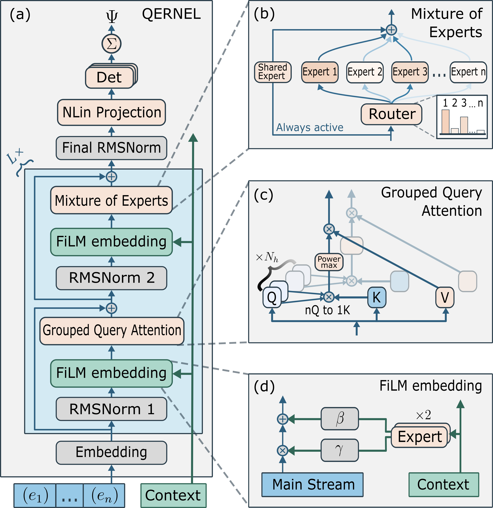
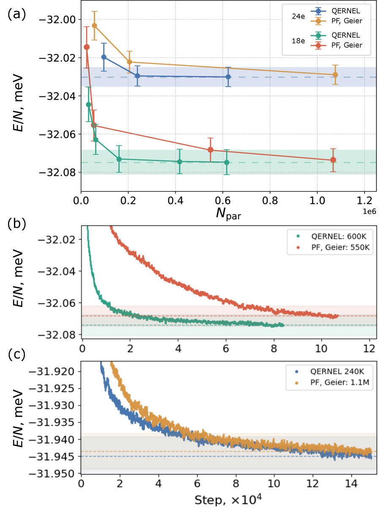
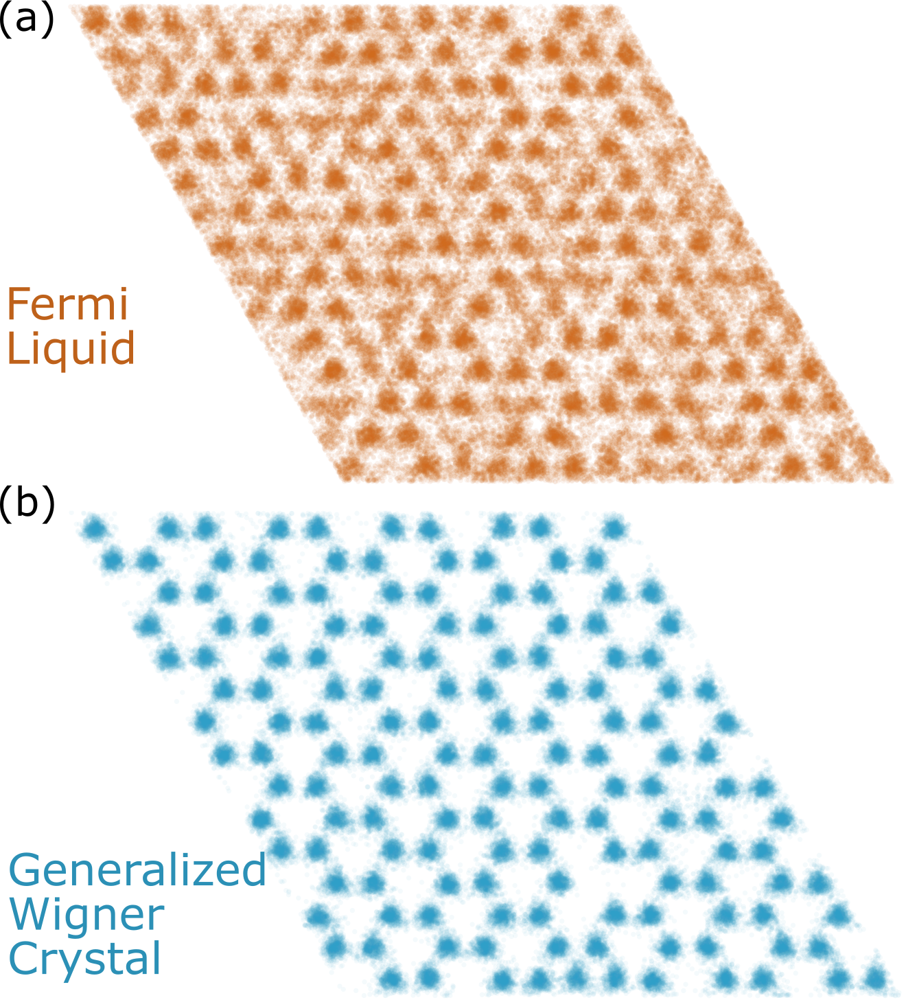
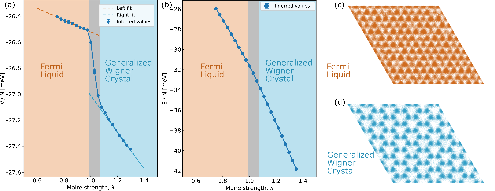
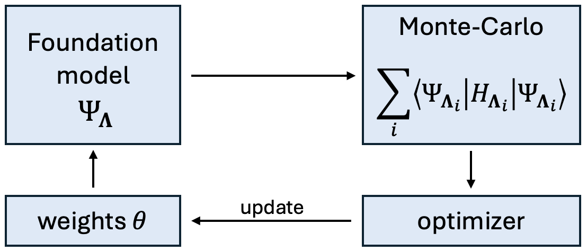

# ニューラル波動関数の基盤モデル化による強相関量子物質の解析

- 執筆日：2026-05-04
- トピック：ニューラル波動関数の基盤モデル化による強相関量子物質の解析—QERNEL を核としたモアレ半導体への応用
- タグ：Superconductivity and Strongly Correlated Systems / Spin Liquids and Quantum Many-Body Systems; Low-Dimensional Materials / Charge Orbital and Spin Order / Phase Transitions / Heterostructures / Machine Learning
- 注目論文：arXiv:2604.26018「QERNEL: a Scalable Large Electron Model」(Khachatur Nazaryan, Liang Fu; 2026-04-28)
- 参照論文数：6

---

## 1. なぜ今この話題なのか

量子多体問題—多数の電子が互いに相互作用しながら示す集団的ふるまいの解析—は、物性物理学・材料科学において最も根本的で難しい課題のひとつである。原子や分子レベルから出発して超伝導体、磁性体、トポロジカル物質の性質を予測するためには、原理的にはシュレーディンガー方程式を多体系に対して解けばよい。しかし、N 個の電子系の波動関数は $3N$ 次元の関数であり、N が増えるにつれて取り扱うべき情報量は指数的に爆発する——これが「指数壁」(exponential wall)と呼ばれる困難である。

従来の手法、たとえば密度汎関数理論 (DFT) は交換相関エネルギーを近似によって扱うため、強相関系ではしばしば失敗する。量子モンテカルロ法 (QMC) は統計的に正確な結果を与えるが、変分波動関数 (Jastrow-Slater 型など) の表現力に限界がある。行列積状態 (MPS) や密度行列繰り込み群 (DMRG) は低次元系では強力だが、二次元や三次元への拡張は計算コストが膨大になる。

こうした状況に大きな変化をもたらしたのが、ニューラルネットワーク量子状態 (Neural Quantum States, NQS) の登場である。2017 年に Carleo と Troyer が制限ボルツマンマシン (RBM) でスピン系の基底状態を求めることに成功して以来、深層学習の表現力を波動関数のアンサッツ (ansatz: 変分形式) として用いる研究が急速に広がった。特に 2020 年、Google DeepMind の Pfau らによる FermiNet [1] の登場は、連続空間の多電子系に対してニューラルネットワーク単体で化学精度の基底状態エネルギーを求められることを示し、分野に衝撃を与えた。

そしてここ数年、新たなパラダイムシフトが起きようとしている。自然言語処理や画像認識の世界で成功した「基盤モデル」(foundation model)—大量のデータを事前学習し、さまざまなタスクに汎用的に使えるモデル—の考え方を、ニューラル波動関数に持ち込もうとする動きである。従来の NQS は特定の一つのハミルトニアン、一つの系に対して最適化を行い、パラメータが変わるたびに最初から計算をやり直す必要があった。しかし「量子基盤モデル」の発想は、ハミルトニアンのパラメータ空間全体にわたる基底状態を、単一のニューラルネットワークが学習することを目指す。

この流れを体現する最新の論文が、2026 年 4 月に MIT の Nazaryan と Fu が発表した **QERNEL** (arXiv:2604.26018) である。QERNEL は、モアレ半導体ヘテロバイレイヤー系の最大 150 電子系に対して、FiLM 条件付け・Mixture of Experts・Grouped-Query Attention という効率的なアーキテクチャを組み合わせ、ハミルトニアンのパラメータ（モアレポテンシャルの強さ）を連続的に変えながら単一モデルで基底状態を記述することに成功した。さらに、フェルミ液体状態とウィグナー結晶状態の間の量子相転移を、事前に仮定することなく自動的に発見したことが大きな注目を集めている。

この成果が注目される背景には、実験面でもモアレ系への強い関心がある。半導体 van der Waals ヘテロ二重層（たとえば WSe₂/WS₂ や MoSe₂/WSe₂）では、層間のわずかな格子定数の違いやツイスト角によって周期数十 nm のモアレポテンシャルが形成され、電子がその上に「閉じ込められる」。低密度充填時には電子間クーロン相互作用が支配的になり、ウィグナー結晶（電子が格子点に整列した相）や Mott 絶縁体、さらには分数量子ホール状態に類似した相関絶縁体が実験的に確認されてきた。しかしこれらの相の微視的描像、特に相転移の臨界点やスピン偏極の役割を定量的に予測することは、従来計算手法には困難であった。QERNEL はこの空白を埋める可能性を示している。

---

## 2. 未解決問題は何か

ニューラル波動関数と量子基盤モデルの分野には、現在いくつかの根本的な問いが残されている。

**問い① ニューラル波動関数はどこまでスケールできるか**

FermiNet が登場した当初、その適用可能な系の大きさは 10〜30 粒子程度が実用的な上限だった。大規模化するには計算コストが $O(N^3)$（行列式の計算）から $O(N^4)$ 以上（勾配の計算）となるため、100 電子を超える系への適用は困難とされていた。さらに基盤モデル化を目指すと、ニューラルネットワーク自体のパラメータ数が増大し、メモリと計算時間が爆発的に増える問題がある。「精度・スケーラビリティ・汎化性能」の三つを同時に達成することは、この分野が直面する根本的課題である。

**問い② ハミルトニアン・パラメータ空間全体の汎化は可能か**

従来のNQSアプローチでは、ハミルトニアンのパラメータ（相互作用の強さ、格子定数、充填率など）の一つの値に対して一つのモデルを訓練する。基盤モデルを実現するためには、パラメータ空間を連続的に補間しながら、見ていないパラメータ値に対しても正確な波動関数を予測できる必要がある。「学習したパラメータ値の間を補間できるのか」「相転移をまたぐような急激な変化を一つのモデルで捉えられるのか」は、理論的にも実用的にも重大な問いである。

**問い③ モアレ系におけるウィグナー結晶転移の微視的機構は何か**

実験的には、モアレ半導体での電子整列（ウィグナー結晶化）や分数充填での絶縁体的ふるまいが確認されている。しかし、どの充填率でどのような秩序が安定化するか、スピン自由度はどう関与するか、どのパラメータが転移を制御するかについては、理論計算と実験データの間にギャップが残る。特に、フェルミ液体からウィグナー結晶への転移が一次的か連続的かという基本的な問いすら、十分な精度で答えられていなかった。

---

## 3. 注目論文の核心

QERNEL（arXiv:2604.26018）は、これらの問いに対して具体的な前進をもたらした。

### 何が新しいのか

これまでの NQS 研究における「1つのハミルトニアン → 1つのモデル」という枠組みから、「ハミルトニアンのパラメータ集合 → 1つの条件付きモデル」という基盤モデルのパラダイムへの本格的な移行を、200 電子に迫る大規模な固体系（モアレ半導体）で実証したことが最大の新規性である。

### アーキテクチャ

*Figure 1: QERNELのアーキテクチャ。(a) 全体的な条件付き波動関数パイプライン。電子の特徴量を電子ストリームに埋め込み、等変ブロックで処理し、一般化軌道に射影して行列式を構成する。ハミルトニアンのコンテキストがネットワーク全体に注入される。(b) Mixture of Experts ブロック。(c) Grouped-Query Attention。(d) FiLM 条件付け。(引用: Nazaryan & Fu, arXiv:2604.26018, CC BY 4.0)*

QERNEL のアーキテクチャは三つの核心要素から成る。

**FiLM 条件付け（Feature-wise Linear Modulation）**: ハミルトニアンのパラメータ（この場合はモアレポテンシャルの深さ λ）を「コンテキストベクトル」としてエンコードし、各ニューラルネットワーク層の中間特徴量に対してチャンネルごとのアフィン変換（スケーリング + シフト）として注入する。これにより、ネットワークの重みを共有しながらも、λ の値に応じて波動関数の性質が連続的に変化できる。式で書けば、ある隠れ層の出力 $\mathbf{h}$ は FiLM によって

$$\tilde{\mathbf{h}}_c = \gamma_c(\lambda) \cdot \mathbf{h}_c + \beta_c(\lambda)$$

と変換される。$\gamma_c(\lambda)$ と $\beta_c(\lambda)$ はコンテキスト λ から学習されるスカラー関数であり、$c$ はチャンネル（特徴量の次元）のインデックスである。FiLM は元々コンピュータビジョンの視覚的推論タスクで提案された手法だが、QERNEL はこれを量子化学・固体物理に初めて本格的に応用した。

**Mixture of Experts (MoE)**: 従来の密なフィードフォワード層の代わりに、複数の「専門家」ネットワークとそれらを動的に選択するルーターから成るブロックを使う。入力特徴量に応じてどの専門家を活性化するかが変わるため、パラメータ数を増やさずに実効的なモデル表現力を高められる。QERNEL では「共有専門家」を一つ常に活性化する設計を採用しており、電子に共通する基本的な特徴（クーロン相互作用の寄与など）と、λ 依存的な特徴（相関の強さなど）を分離して学習させる。

**Grouped-Query Attention (GQA)**: 標準的な Multi-Head Attention では各ヘッドが独立の Query・Key・Value を持つが、GQA では複数の Query ヘッドが Key・Value ヘッドを共有する。これによりメモリ使用量と計算コストが削減され、より大きな系や長いシーケンス（= より多い電子数）への拡張が可能になる。

これら三要素の組み合わせにより、QERNEL は同等の精度を持つベースラインモデル（PsiFormer [先行研究 6]）と比べて約 6〜7 倍少ないパラメータ数で同等の精度を達成した。

### 主要結果

*Figure 2: QERNELの効率性ベンチマーク。18・24電子系での電子あたり変分エネルギー対パラメータ数。QERNELはPsiFormerと同等の精度域を約6〜7倍少ないパラメータで達成する。(引用: Nazaryan & Fu, arXiv:2604.26018, CC BY 4.0)*

**大規模系への適用**: 単一のモデルで最大 150 電子のモアレ半導体系を扱った。系はモアレポテンシャルの深さ λ（無次元化された相互作用パラメータ）でパラメータ化されており、λ を連続的に変えながら基底状態を推定できる。

*Figure 3: 150電子系の実空間電荷密度。(a) フェルミ液体相（λ=0.7）では密度が均一に広がる。(b) 一般化ウィグナー結晶相（λ=1.5）では電子がモアレ格子点に局在した周期構造が現れる。(引用: Nazaryan & Fu, arXiv:2604.26018, CC BY 4.0)*

λ が小さい（弱相互作用）領域では電子が一様に広がったフェルミ液体的な密度が得られる一方、λ が大きい（強相互作用）領域では電子がモアレ格子点に局在した「一般化ウィグナー結晶」の密度パターンが現れた。

**量子相転移の自動発見**: 最も注目すべき結果は、事前に相転移点を指定することなく、λ の連続変化に伴う量子相転移を自動的に発見したことである。

*Figure 4: 54電子系での基盤モデルによる相転移の推定。(a) λ の関数としての電子あたり相互作用エネルギー。2本の直線ブランチの交点として鋭い相転移が現れる。(b) 実空間密度プロファイルも転移点前後で不連続な変化を示す。(引用: Nazaryan & Fu, arXiv:2604.26018, CC BY 4.0)*

相互作用エネルギーの λ 依存性は2本の異なる直線的ブランチからなり、その交点が鋭い（一次的な）量子相転移を示唆している。この転移はフェルミ液体からウィグナー結晶への秩序化転移であり、実空間密度プロファイルにも不連続な変化が観察された。

### 何が仮説段階か

QERNEL の計算はモアレポテンシャルを単純化した特定のモデル（有効 Hubbard-like ハミルトニアン）に基づいており、実際の WSe₂/WS₂ ヘテロ二重層のような多バンド・多軌道系への適用性は未検証である。また、相転移が「鋭い」（一次転移に見える）という発見は興味深いが、有限サイズ効果や変分バイアスがどこまで結果に影響しているかは慎重な検討が必要である。150 電子という大規模系でも、実際のモアレ系は単位胞あたり $10^2 \sim 10^3$ 程度の電子を含むことがあり、真の熱力学的極限での挙動は外挿に依存する。

---

## 4. 背景と研究史

QERNEL が登場した歴史的文脈を理解するために、ニューラル波動関数研究の流れを振り返ろう。

### ニューラル波動関数の夜明け：FermiNet と PauliNet

2019〜2020 年にかけて、二つの独立した研究グループがほぼ同時期にニューラルネットワーク変分波動関数による高精度な量子化学計算を実現した。DeepMind の Pfau らによる FermiNet [1]（arXiv:1909.02487; Phys. Rev. Research 2, 033429, 2020）と、Noé グループによる PauliNet（Nat. Chem. 12, 891, 2020）である。

FermiNet のアイデアは単純で深い。波動関数 $\Psi(\mathbf{r}_1, \ldots, \mathbf{r}_N)$ をニューラルネットワークで直接表現し、Slater 行列式の構造（反対称性）をネットワーク出力の行列式として陽に組み込む。各電子 $i$ の特徴量として電子間距離 $|\mathbf{r}_i - \mathbf{r}_j|$ や電子-核距離などを入力とし、「一電子ストリーム」と「二電子ストリーム」を交互に処理する等変 (equivariant) アーキテクチャを採用した。これにより、原子や小分子の基底状態エネルギーを化学精度（エラー < 1 kcal/mol）で実現した。

しかし FermiNet は一度に一つのハミルトニアン（一つの分子構造）に対してのみ最適化を行う。分子の形が変わるたびに最初から最適化が必要であり、「波動関数の学習」を再利用できないという制約があった。

### 固体への展開：周期系と電子ガス

FermiNet の成功は固体物理への展開を促した。Wilson らは周期境界条件下の均一電子ガスに NQS を適用し（PRB 107, 235139, 2023）、Smith らは二次元電子ガスの基底状態相図（液体、Wigner 結晶、スピン偏極 Wigner 結晶）を変分的に統一的に記述した（PRL 133, 266504, 2024）。これらは固体物理問題への NQS 適用が実用的であることを示したが、依然として点ごとの最適化に留まっていた。

量子相転移との接続も重要な先行研究がある。Cassella ら（PRL 130, 036401, 2023; arXiv:2202.05183）[5]は均一電子ガスに対して FermiNet の変形版を使い、交換相関エネルギーの密度依存性から金属絶縁体転移（ウィグナー結晶化）を発見したことを報告した。これは NQS が相転移を検出できることの最初の明確な実証であり、QERNEL が固体系でより大規模な問題に対してこの能力を発揮する基盤となった。

モアレ半導体に特化した先行研究としては、Li ら（arXiv:2406.11134）[4]の研究がある。彼らは「教師なし深層学習」アプローチで WSe₂ モアレ系に NQS を適用し、一般化ウィグナー結晶、ウィグナー分子結晶、ウィグナー共有結晶という三種類の異なるウィグナー秩序を発見した。この研究は 30〜70 電子程度の系を対象とし、ハミルトニアンの各パラメータ点に対して個別に最適化を行う従来型アプローチを使っていた。同じく Ren ら（arXiv:2406.17645）[6]もモアレ量子物質の NQS シミュレーションを展開した。これらの先行研究は QERNEL との直接の比較対象となり、基盤モデルアプローチの優位性を浮かび上がらせる。

### 基盤モデルへの胎動：Fu グループの連作

QERNEL を生み出した Liang Fu グループ（MIT）は、この基盤モデル化の方向性を段階的に構築してきた。

まず 2025 年 12 月に Zaklama、Guerci、Fu が「Attention-Based Foundation Model for Quantum States」（arXiv:2512.11962）[3]を発表し、注意機構を用いた基盤モデルアーキテクチャの原型を示した。この論文では 2D t-V モデルの位相図を、わずか 18 個のパラメータ点での学習から再現することに成功している。続いて 2026 年 3 月に Zaklama、Geier、Fu が「Large Electron Model」（LEM; arXiv:2603.02346）[2]を発表した。LEM は Fu が同時期に提案した「Fermi Sets」アーキテクチャ（fermion の普遍近似定理を満たす最小表現）を用い、2D 調和ポテンシャル系の最大 50 電子について、相互作用の強さと粒子数の両方を変化させながら単一モデルで正確な基底状態を予測することを実証した。

*Figure 5: Large Electron Model のワークフロー概念図。単一のニューラルネットワークが、ハミルトニアンパラメータと粒子数を条件変数として受け取り、多様な系の基底状態波動関数を一つのモデルで出力する。(引用: Zaklama, Geier, Fu, arXiv:2603.02346, CC BY 4.0)*

QERNEL はこの流れの延長線上に位置しながら、三つの点でLEMを超える。第一に、系の規模が 50 電子から 150 電子へと大幅に拡大した。第二に、モアレ半導体という実際の物質系に適用した。第三に、MoE・GQA という計算効率化技術を導入し、スケーリングと精度のトレードオフを大幅に改善した。

---

## 5. どの解釈が最も妥当か

QERNEL が提示した結果と方法論について、現時点でどの解釈が有力で、何が未確定かを整理する。

### 相転移の一次性：強い証拠か、それとも有限サイズ効果か

QERNEL が観測したフェルミ液体→ウィグナー結晶転移の「鋭さ」（エネルギーの傾きが不連続に変化する）は、一次相転移の特徴と整合する。Li ら（arXiv:2406.11134）による別グループのモアレ系 NQS 計算も、同様にウィグナー結晶の安定化を見出しており、定性的に一致している。Smith ら（PRL 2024）による 2D 均一電子ガスの計算でも、ウィグナー結晶化転移のエビデンスが報告されており、これらは QERNEL の結論を支持する独立した証拠となる。

一方で、54 電子や 150 電子という系サイズは熱力学的極限からは依然として遠く、有限サイズ効果が転移の「鋭さ」を誇張している可能性は排除できない。真に連続転移であるが有限サイズで一次的に見えるというシナリオや、モデルの変分バイアスが転移点付近で系統的な誤差を生じているという可能性も残る。これを確認するためには、系のサイズを変えたスケーリング解析（有限サイズスケーリング）や、量子モンテカルロ、行列積演算子、テンソルネットワーク法などの独立手法との比較が必要である。

### 基盤モデルアプローチ対点ごと最適化：何が有利か

QERNEL（基盤モデル型）と Li ら（点ごと最適化型）を比較すると、以下の対比が浮かぶ。

まず精度面では、QERNEL は個別最適化に比べると平均的に若干低いエネルギー精度になる可能性がある。ある特定の λ 値について最大精度を引き出したい場合は、その点に特化した最適化の方が有利なこともある。しかし QERNEL は「全パラメータ範囲を一度に、コストを抑えて」探索できるため、相図の全体像を把握する用途には圧倒的に効率的である。

次に汎化性能：QERNEL は学習していない λ の値でも内挿（interpolation）によって波動関数を推定できる。これは「見たことのない物性を予測する」という材料科学の目標に直結する。ただし外挿（extrapolation）の精度については未検証であり、物理的に「相の外」に外挿しようとすると予測が崩れる可能性がある。

第三に、発見的能力：QERNEL が「事前仮定なしに相転移を発見した」という主張は重要である。従来の理論計算では、どの相が現れうるかについて事前の仮定（オーダーパラメータの選択など）が必要なことが多かった。QERNEL の基盤モデルはエネルギー最小化という変分原理だけに従い、どの相の波動関数も等しく表現できるため、予想外の相の発見に開かれている。

### FermiNet との関係：何が本質的に違うのか

FermiNet [1] と QERNEL のアーキテクチャは同じ「多行列式 × ニューラル Jastrow」の枠組みを持ちながら、重要な違いがある。FermiNet は特定の一つの電子数・一つの核配置に特化した最適化を行うのに対し、QERNEL は電子数・ハミルトニアンパラメータを条件変数として受け取る「条件付き波動関数」を学習する。この変更は一見小さく見えるが、「一つの解を求める」から「解の多様体を学習する」という本質的な発想の転換を意味する。

また、FermiNet が分子・原子という比較的小規模な離散的系を対象としていたのに対し、QERNEL はモアレ半導体という周期的固体系（より大規模、より連続的なパラメータ空間）への適用を示した。Geier らによる先行研究（PRB 112, 045119, 2025）[6 in QERNEL ref]がこの橋渡しを担ったことも重要な文脈である。

### 最も弱い結論と残る不確定性

現時点で最も弱い主張は「QERNEL が "Large Electron Model" への道を開いた」という将来への展望部分である。150 電子の系での成功は印象的だが、実際の材料のバンド構造、スピン軌道相互作用、多軌道効果、有限温度効果、フォノンとの結合などを全て取り込んだ「真の第一原理」計算への橋渡しは、多くのステップを要する。また、MoE の「どの専門家がいつ活性化されるか」の解釈可能性は低く、モデルが何を学んでいるかの物理的理解は限定的である。

---

## 6. 何が一般化できるか

QERNEL の成功から引き出せる一般化可能な知見は何か、そして他の系・手法・応用への波及を考える。

### 材料系への展開

QERNEL の手法はモアレ半導体に限らず、強相関電子系一般に適用できる可能性がある。具体的には、モット絶縁体（カーク・フレーリッヒ転移を示す SrTiO₃、V₂O₃ など）、分数量子ホール系（Teng らの先行研究がある）、重フェルミオン系（Ce・Yb化合物）、高温超伝導体（銅酸化物、鉄系）などが候補として挙げられる。ただし、高温超伝導体のような多バンド・多軌道系への適用は、ハミルトニアンの表現がずっと複雑になるため、架け橋となる方法論の開発が必要である。

### 量子化学・分子シミュレーションとの接続

量子化学の分野では、Foster ら（arXiv:2506.19960）が分子の結合切断を含む複数の分子に対して「ab initio 基盤モデル」を構築する研究を発表している。これは QERNEL の固体版とちょうど対応する動きであり、分子と固体の両分野で同時期に「ニューラル波動関数の基盤モデル化」が進んでいることは、この方向性の普遍性を示唆する。二つのアプローチが将来的に統合され、分子・固体を問わない汎用電子構造計算エンジンが生まれることは十分に想像できる。

### 設計原理としての条件付き波動関数

FiLM 条件付けは QERNEL の中核技術だが、これは「ハミルトニアンのパラメータ空間で滑らかに変化する波動関数族」を効率的に学習する一般的な原理として理解できる。この考え方は、たとえば圧力下での物性変化の予測（圧力をパラメータとした基盤モデル）、ドーピング濃度の依存性（ドーピング量をパラメータとしたモデル）など、連続的なパラメータ変化が重要な材料科学問題全般に応用できる。これは材料インフォマティクスの文脈での「逆問題（目標の物性を持つ材料パラメータを求める）」にも応用可能である。

### 量子コンピューティングとの接続

将来的には、QERNEL のような基盤モデルで得られた波動関数を、量子コンピュータ上の量子回路として実装するアプローチも考えられる。古典的なニューラルネットワーク波動関数から量子回路への「蒸留（distillation）」は活発な研究分野であり、QERNEL のスケーラブルなアーキテクチャはこうした橋渡しの出発点となりうる。

---

## 7. 基礎から理解する

本節では、QERNEL を理解するために必要な基礎概念を段階的に説明する。

### 7.1 多体シュレーディンガー方程式と波動関数

N 個の電子が核の作るポテンシャル $V(\mathbf{r})$ の中で相互作用している系の定常状態は、時間非依存シュレーディンガー方程式

$$\hat{H}\Psi(\mathbf{r}_1, \sigma_1, \ldots, \mathbf{r}_N, \sigma_N) = E\Psi(\mathbf{r}_1, \sigma_1, \ldots, \mathbf{r}_N, \sigma_N)$$

によって記述される。ここで $\hat{H}$ はハミルトニアン演算子（系の全エネルギーに対応する演算子）、$\Psi$ は波動関数（電子の状態を表す関数）、$E$ はエネルギー固有値である。$\mathbf{r}_i$ は電子 $i$ の位置座標（3次元ベクトル）、$\sigma_i$ はスピン自由度（上向き/下向き）を表す。

ハミルトニアンは

$$\hat{H} = -\frac{\hbar^2}{2m_e}\sum_{i=1}^N \nabla_i^2 - \sum_{i=1}^N \sum_\alpha \frac{Z_\alpha e^2}{|\mathbf{r}_i - \mathbf{R}_\alpha|} + \sum_{i < j} \frac{e^2}{|\mathbf{r}_i - \mathbf{r}_j|}$$

という三つの項からなる。第1項は各電子の運動エネルギー（ラプラシアン $\nabla_i^2$ で表される）、第2項は電子と核（$\mathbf{R}_\alpha$、核電荷 $Z_\alpha$）の引力相互作用、第3項が電子間のクーロン反発（相互作用項）である。この最後の項があるため、電子の運動が互いに絡み合い（相関し）、波動関数が積の形に分解できなくなる——これが多体問題の本質的な難しさである。

波動関数 $\Psi$ には、電子がフェルミ粒子（スピン1/2を持つ）であることから「反対称性」という制約が課せられる。任意の二つの電子のラベルを入れ替えると、波動関数の符号が反転しなければならない：

$$\Psi(\ldots, \mathbf{r}_i, \sigma_i, \ldots, \mathbf{r}_j, \sigma_j, \ldots) = -\Psi(\ldots, \mathbf{r}_j, \sigma_j, \ldots, \mathbf{r}_i, \sigma_i, \ldots)$$

これはパウリの排他原理（同じ量子状態に二つの電子が存在できない）を自動的に実装する。

### 7.2 Slater 行列式とその限界

反対称性を満たす最も単純な波動関数の形が **Slater 行列式** である。N 個の一電子軌道 $\phi_1, \phi_2, \ldots, \phi_N$ を使って

$$\Psi_\text{SD}(\mathbf{r}_1, \ldots, \mathbf{r}_N) = \frac{1}{\sqrt{N!}}\det\begin{pmatrix} \phi_1(\mathbf{r}_1) & \phi_2(\mathbf{r}_1) & \cdots & \phi_N(\mathbf{r}_1) \\ \phi_1(\mathbf{r}_2) & \phi_2(\mathbf{r}_2) & \cdots & \phi_N(\mathbf{r}_2) \\ \vdots & & \ddots & \vdots \\ \phi_1(\mathbf{r}_N) & \phi_2(\mathbf{r}_N) & \cdots & \phi_N(\mathbf{r}_N) \end{pmatrix}$$

と書く。$\det$ は行列式（determinant）を表し、その反対称な性質が電子の入れ替えに対する符号変化を自動的に保証する。Hartree-Fock 法はこの形の波動関数を使い、$\phi_i$ を変分的に最適化する手法である。

Slater 行列式の欠点は、電子間の「動的相関」（電子が互いを避け合う細かい相関）を捉えられないことである。DFT は交換相関汎関数という近似でこれを補うが、強相関系では精度が不足する。

量子モンテカルロ法では、Slater 行列式に「ジャストロー因子」$J(\mathbf{r}_1, \ldots, \mathbf{r}_N)$（電子間距離の関数）を掛けた「Jastrow-Slater 波動関数」

$$\Psi_\text{JS} = J(\mathbf{r}_1, \ldots, \mathbf{r}_N) \cdot \Psi_\text{SD}(\mathbf{r}_1, \ldots, \mathbf{r}_N)$$

を使って相関効果を取り込む。FermiNet と QERNEL は、このジャストロー因子と行列式に使う一電子軌道の両方をニューラルネットワークで表現し、表現力を劇的に高めたものと理解できる。

### 7.3 変分モンテカルロ法 (VMC) の仕組み

ニューラルネットワーク波動関数を最適化するために使われる主要な手法が **変分モンテカルロ法 (VMC)** である。変分原理によれば、任意の試行波動関数 $\Psi_\theta$（パラメータ $\theta$ を持つニューラルネットワーク）のエネルギー期待値は真の基底状態エネルギー $E_0$ 以上である：

$$E[\Psi_\theta] = \frac{\langle\Psi_\theta|\hat{H}|\Psi_\theta\rangle}{\langle\Psi_\theta|\Psi_\theta\rangle} \geq E_0$$

この $E[\Psi_\theta]$ をパラメータ $\theta$ について最小化すれば、真の基底状態に近い波動関数が得られる。期待値の計算は多次元積分であり、これを

$$E[\Psi_\theta] = \int |\Psi_\theta(\mathbf{r})|^2 E_L(\mathbf{r}) d\mathbf{r}$$

と書き直せる。ここで $E_L(\mathbf{r}) = \hat{H}\Psi_\theta(\mathbf{r}) / \Psi_\theta(\mathbf{r})$ は「局所エネルギー」と呼ばれる量であり、$|\Psi_\theta(\mathbf{r})|^2$ を確率密度としてモンテカルロ法で電子配置をサンプリングすることで $E[\Psi_\theta]$ の不偏推定量が得られる。

最適化には確率的勾配降下法（Adam や KFAC などの最適化器）が用いられる。一回の最適化ステップでは、現在のパラメータ $\theta$ に対してマルコフ連鎖モンテカルロ (MCMC) で電子配置をサンプルし、そのサンプルから $E[\Psi_\theta]$ の勾配を推定し、勾配に沿ってパラメータを更新する。

QERNEL の場合、条件付き波動関数 $\Psi_{\theta, \lambda}$ を最適化するために、ハミルトニアンパラメータ λ を連続的に変化させながらサンプリングと勾配推定を行う。一つのモデルで複数の λ に対して同時に最適化を進めることで、パラメータ空間全体を「汎化」する学習が実現される。

### 7.4 等変性とニューラルネットワーク波動関数

FermiNet や QERNEL のアーキテクチャには「等変性 (equivariance)」という概念が重要な役割を果たす。等変とは、入力の変換に対してネットワーク出力が対応した変換をすることである。特に電子の順列（ラベルの付け替え）に対して等変なネットワークを設計することで、反対称性を行列式として自然に組み込めるようになる。

具体的には、電子 $i$ の特徴量 $\mathbf{f}_i$ を計算するニューラルネットワーク層が、電子の順列 $\pi$ に対して

$$\mathbf{f}_{\pi(i)} = \text{Net}(\mathbf{r}_{\pi(i)}, \{\mathbf{r}_j\}_{j \neq \pi(i)})$$

と、添字が付き替わるだけで変換されるよう設計する（順列等変性）。この性質があることで、行列式と組み合わせたときに波動関数が正しく反対称になる。

QERNEL の「電子ストリーム」と「ハミルトニアンコンテキストストリーム」の分離も、この等変性の観点から理解できる。電子ストリームは電子の座標に関する情報を等変的に処理し、コンテキストストリームはハミルトニアンパラメータ（λ）という「電子に依存しない」情報をグローバルに注入する。FiLM 条件付けはこの分離を実現するエレガントな機構であり、電子ストリームの等変性を壊さずにコンテキストを組み込める。

### 7.5 モアレ系とウィグナー結晶

モアレポテンシャルとは、二つの周期的な格子（たとえば WSe₂ と WS₂）がわずかに異なる格子定数やツイスト角で積層されたときに生じる長周期の空間的変調である。格子定数のわずかな違い $\delta a/a \sim 1\%$ に対して、モアレ周期は元の格子定数の約 $a/(\delta a/a) \sim 100a \sim 6\text{--}10$ nm というスケールになる。

このモアレポテンシャルの谷に電子が捕まると、各谷をサイトとする「人工格子」に乗ったフェルミハバードモデルとして系を記述できる。充填率（サイトあたりの電子数）と相互作用の強さ（ハバードモデルの $U/t$、もしくは QERNEL のモデルの λ）によって、以下のような相が現れる。

- $\lambda \ll 1$（弱相互作用）: 電子はモアレ格子を自由に飛び回る→フェルミ液体的な金属状態
- $\lambda \gg 1$（強相互作用）: クーロン反発が支配的になり、電子が格子点に局在→**ウィグナー結晶**

ウィグナー結晶とは、電子間のクーロン反発エネルギーが運動エネルギーを大幅に上回るときに電子が空間的に規則正しく配列した状態である。1934 年に Eugene Wigner が均一電子ガスでの発生を理論的に予測し、近年、モアレ系では実験的にも確認されている。QERNEL が発見した量子相転移は、λ の増加に伴う「フェルミ液体→ウィグナー結晶」の秩序化転移に対応する。

この転移の特徴的な臨界条件は、運動エネルギーとポテンシャルエネルギーの比であるウィグナー-ザイツ半径パラメータ $r_s$ によって与えられる：

$$r_s = \frac{a_\text{avg}}{a_0^*}$$

ここで $a_\text{avg}$ は電子間の平均間隔、$a_0^* = \hbar^2 \varepsilon / (m^* e^2)$ は有効ボーア半径（$\varepsilon$ は誘電率、$m^*$ は有効質量）である。$r_s \gg 1$ でウィグナー結晶が安定化し、モアレ系では $r_s \sim 20\text{--}100$ という値が実現できる。QERNEL の λ はこの $r_s$ に相当する制御パラメータに対応している。

---

## 8. 専門用語の解説

**1. ニューラルネットワーク量子状態 (Neural Quantum States, NQS)**  
量子多体系の波動関数をニューラルネットワークで近似する手法の総称。Carleo・Troyer（2017）が RBM で量子スピン系に適用したのが始まり。NQS のキーポイントは、ニューラルネットワークの普遍近似定理により原理的に任意の波動関数を表現でき、深層ネットワークを使うことで特に多体相関を効率的に表現できることである。QERNEL では特にフェルミオン（電子）系に適した行列式構造を持つ NQS を採用し、基盤モデル化を実現した。

**2. 変分モンテカルロ法 (Variational Monte Carlo, VMC)**  
試行波動関数のパラメータを変分的に最適化し、基底状態エネルギーを推定する手法。期待値の計算にモンテカルロサンプリングを使う。変分原理の保証（上界を与える）と統計的なノイズのトレードオフが特徴的。QERNEL では VMC によってニューラルネットワークのパラメータ（重みとバイアス）を最適化する。

**3. FermiNet**  
Google DeepMind の Pfau ら（2020）が開発したニューラルネットワーク波動関数。一電子・二電子ストリームを交互に処理する等変アーキテクチャと、複数の Slater 行列式の線形結合という出力形式が特徴。原子・小分子に対して化学精度の基底状態エネルギーを実現した。QERNEL の直接の先祖に当たり、その固体版・基盤モデル版とみなせる。

**4. Slater 行列式 (Slater Determinant)**  
N 個の一電子軌道の積を行列式形式で反対称化した波動関数。フェルミオンの反対称性（パウリ排他原理）を自動的に満たす。Hartree-Fock 法の基礎であり、相関効果のない「平均場」の記述に対応する。QERNEL では、ニューラルネットワークが生成する「一般化軌道」の行列式として使われ、相関効果は行列式を組み合わせた線形結合と FiLM 条件付けが表現する。

**5. FiLM 条件付け (Feature-wise Linear Modulation)**  
外部の条件変数（QERNEL の場合はハミルトニアンパラメータ λ）を、ニューラルネットワークの中間特徴量に対するアフィン変換として注入する手法。各チャンネルの特徴量 $h_c$ を $\tilde{h}_c = \gamma_c(\lambda) h_c + \beta_c(\lambda)$ と変換する。λ が変わるとスケール $\gamma_c$ とシフト $\beta_c$ が変わることで、ネットワーク全体の重みを変えずに「条件に応じた計算」が実現できる。FiLM はもともと画像認識と自然言語処理の融合タスクで提案された手法で、QERNEL はこれを量子多体物理の問題に転用した。

**6. Mixture of Experts (MoE)**  
複数の「専門家（expert）」ニューラルネットワークと、入力に応じてどの専門家を選ぶかを決める「ルーター（router）」から成るアーキテクチャ。実際に計算するパラメータの数を入力ごとに動的に制御できるため、総パラメータ数は多くても実際の計算量は抑えられる。大規模言語モデル（GPT-4 など）でも採用されている。QERNEL では「共有専門家」（全入力に常に使われる）と「通常専門家」（ルーターが選ぶ）を組み合わせることで、多様な λ の状況に対応しつつ基本的な電子間相互作用の記述を共通化した。

**7. モアレ超格子 (Moiré Superlattice)**  
格子定数がわずかに異なる2枚の結晶（または同じ結晶でわずかにツイストしたもの）を積層したときに生じる長周期の干渉パターン。TMD（遷移金属ダイカルコゲナイド）ヘテロ二重層、魔法角ツイストグラフェンなどで実現される。モアレ周期は元の格子定数の数十〜百倍にもなり、電子はモアレポテンシャルの谷に捕まって「スロー」な動きを示す。QERNEL が対象とした WSe₂/WS₂ 類似系では、充填率と相互作用の強さを独立に制御でき、多彩な量子相が観測されている。

**8. ウィグナー結晶 (Wigner Crystal)**  
電子間クーロン反発が運動エネルギー（フェルミエネルギー）を上回るときに、電子が空間的に規則的な格子パターンに整列した状態。1934 年に Wigner が均一電子ガスで理論的に予測した。モアレ系では有効質量が大きく誘電定数も小さいため、$r_s$ が非常に大きくなり、比較的容易にウィグナー結晶が実現できる。QERNEL はこの状態への転移を量子基盤モデルで初めて自動的に発見した。

**9. 基盤モデル (Foundation Model)**  
大量のデータや豊かなパラメータ空間で事前学習され、特定のタスクに依存しない汎用的な表現を獲得したニューラルネットワーク。自然言語処理（GPT、BERT）や画像認識（CLIP、DALL-E）では革命的な成果をもたらした。QERNEL はこの考え方を「量子波動関数」に持ち込み、ハミルトニアンのパラメータ空間全体に渡る基底状態を一つのモデルで表現しようとする。これは量子化学・物性物理における「Large Language Model に相当する大規模電子モデル」の実現を目指すものと位置付けられる。

**10. Grouped-Query Attention (GQA)**  
Transformer のマルチヘッドアテンション機構の計算効率化バリアント。通常の Multi-Head Attention では全てのヘッドが独立の Query・Key・Value を持つが、GQA では複数の Query ヘッドが Key・Value を共有することでメモリと計算量を削減する。2023 年の Ainslie らの提案。大規模言語モデルの推論効率化のために開発されたが、QERNEL はこれを多体波動関数の効率的な計算に転用した。QERNEL の文脈では「電子間の注意（attention）計算」でKとVを共有することで、大電子数系での計算コストを大幅に削減している。

---

## 9. 今後の展望

QERNEL が示したニューラル波動関数基盤モデルの方向性は、今後数年で急速に発展する可能性が高い。現時点で確からしくなってきた知見としては、まずMoE・GQAという計算効率化技術の組み合わせが、精度を維持しながら電子数を大幅にスケールアップできることが実証された点が挙げられる。また、FiLM 条件付けという比較的シンプルな機構で、複数のハミルトニアンパラメータにまたがる基底状態の汎化学習が実現できることも示された。さらに、事前知識なしに量子相転移を「発見」する能力—これはニューラル波動関数の最も期待されていた応用のひとつ——が、モアレ系の100電子を超える規模で実証された意義は大きい。

一方で、まだ未確定な問いも多く残る。最も重要な未解決点は「精度と汎化のトレードオフの極限」である。150 電子のモアレ系での成功は印象的だが、実際の材料では数千〜数万の電子が関与する。このスケールでの基盤モデルの精度は不明であり、有限サイズ効果や変分バイアスの系統的評価が今後の課題である。また、QERNEL が「相転移が一次転移に見える」と報告した結果の解釈も未確定である。有限サイズスケーリングによる転移次数の確定、他の計算手法（行列積演算子 (MPO)、ハイブリッド QMC など）との比較が必要であり、これらが一致して初めて転移の性質が確定する。

次に重要になる実験・理論・計算の方向性として、まず理論面では「Fermi Sets の普遍近似定理」の枠組みの下で、QERNEL アーキテクチャの表現力に対する厳密な保証を与える研究が必要である。またハミルトニアンのコンテキスト空間の表現方法——現在は λ という一次元スカラーだが、多パラメータ、多バンド、有限温度への拡張——が重要な技術的課題となる。計算面では、モアレ系での強磁性・反強磁性・スピン液体状態など、スピン秩序を伴うより複雑な相への適用と、第一原理バンド計算（DFT）や実験データとの直接比較が求められる。実験面では、高分解能 STM によるモアレ系の電荷密度イメージングが、QERNEL の予測する実空間密度パターンの直接検証に使えると期待される。特に転移点近傍での密度の空間的パターン変化は、理論と実験の定量的比較ができる「接点」となる。

今後注目すべき論点は、「ニューラル波動関数基盤モデルの汎用性」である。QERNEL と同時期に量子化学でも Foster ら（2506.19960）が類似の基盤モデルを発表しており、両者が「分子側」と「固体側」から基盤モデルの有効範囲を広げていく競争・協働が進むと予想される。また、LLM（大規模言語モデル）の成功に倣って「基盤モデルのスケーリング則（パラメータ数・電子数・訓練データ量に対する精度の冪乗則）」が多体電子系にも成立するかという問いは、分野全体の方向性を決定する重要なテーマになりつつある。QERNEL の Figure 2 に示されたパラメータ数対精度のベンチマークはその最初の布石であり、今後より体系的なスケーリング研究が登場することが期待される。

---

## 参考論文一覧

[1] **arXiv:2604.26018** — Nazaryan K., Fu L. "QERNEL: a Scalable Large Electron Model." (2026-04-28) [注目論文]
本論文。FiLM条件付け・Mixture of Experts・Grouped-Query Attentionを組み合わせたニューラル波動関数基盤モデルで、150電子のモアレ半導体系の量子相転移を自動的に発見。
https://arxiv.org/abs/2604.26018

[2] **arXiv:2603.02346** — Zaklama T., Geier M., Fu L. "Large Electron Model: A Universal Ground State Predictor." (2026-03-02) [支持]
QERNELの直接の先行研究。Fermi Setsアーキテクチャを用い、2D調和ポテンシャル系の最大50電子について、単一モデルで相互作用強度・粒子数を変化させながら基底状態を予測。「大規模電子モデル」の概念を提唱。
https://arxiv.org/abs/2603.02346

[3] **arXiv:2512.11962** — Zaklama T., Guerci D., Fu L. "Attention-Based Foundation Model for Quantum States." (2025-12-12) [支持]
注意機構を用いた量子基盤モデルアーキテクチャの原型。2D t-V モデルの位相図をわずか18パラメータの学習から構築。ハミルトニアンパラメータ・粒子数を跨いだ汎化学習の可能性を示した。
https://arxiv.org/abs/2512.11962

[4] **arXiv:2406.11134** — Li X., Qian Y., Ren W., Xu Y., Chen J. "Emergent Wigner phases in moiré superlattice from deep learning." (2024-06-17) [比較]
別グループによるモアレ系NQS研究。点ごと最適化アプローチで一般化ウィグナー結晶・ウィグナー分子結晶・ウィグナー共有結晶という三種類の秩序相を発見。QERNELとの比較で基盤モデルアプローチの優位性が浮き彫りになる。
https://arxiv.org/abs/2406.11134

[5] **arXiv:2202.05183** — Cassella G., Sutterud H., Azadi S., Drummond N. D., Pfau D., Spencer J. S., Foulkes W. M. C. "Discovering Quantum Phase Transitions with Fermionic Neural Networks." Phys. Rev. Lett. 130, 036401 (2023). [比較]
FermiNetの変形版を均一電子ガスに適用し、Wigner結晶化転移（金属絶縁体転移）をNQSで検出した先駆的研究。NQSが相転移発見ツールとなりうることを最初に実証した。
https://arxiv.org/abs/2202.05183

[6] **arXiv:1909.02487** — Pfau D., Spencer J. S., Matthews A. G. D. G., Foulkes W. M. C. "Ab initio solution of the many-electron Schrödinger equation with deep neural networks." Phys. Rev. Research 2, 033429 (2020). [背景]
FermiNet の原著論文。深層ニューラルネットワークを波動関数アンサッツとして使い、原子・小分子に対して化学精度の基底状態エネルギーを達成。NQS分野の出発点となった。
https://arxiv.org/abs/1909.02487
