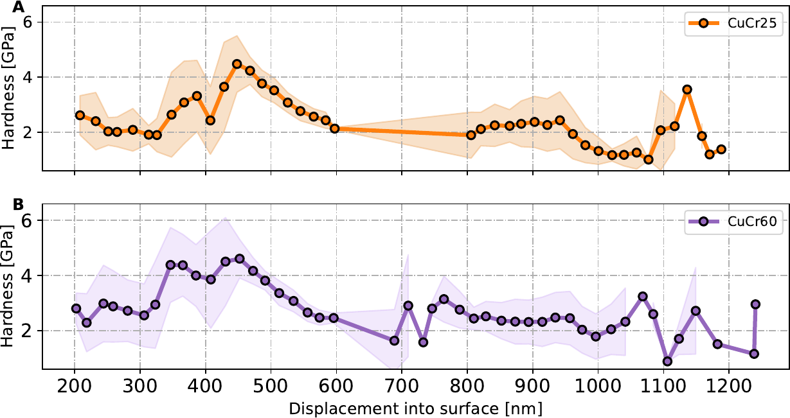
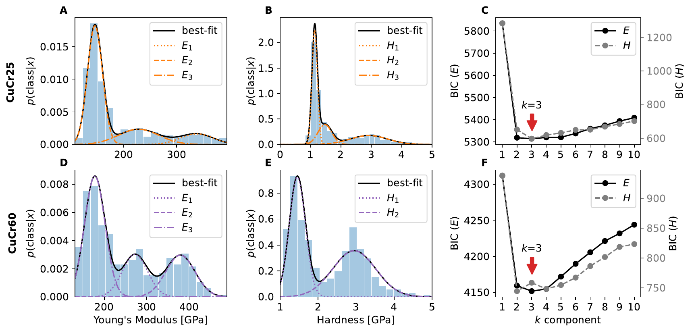
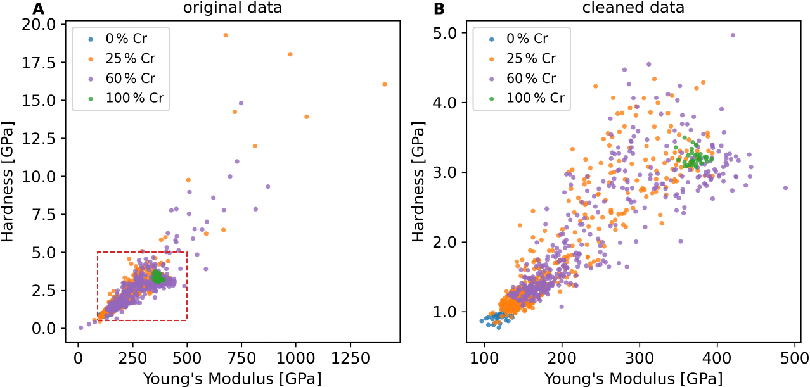

# ナノインデンテーションの押し込みサイズ効果を機械学習で補正する：少量データと物理ガイドが切り開く鉄鋼材料評価の新展開

- 執筆日：2026-05-04
- トピック：機械学習と物理ガイド付きデータ拡張によるナノインデンテーション押し込みサイズ効果補正
- タグ：Measurement and Spectroscopy / Structure and Microstructure; Bulk Alloys / Machine Learning
- 注目論文：arXiv:2604.27775
- 参照論文数：6

---

## 1. なぜ今この話題なのか

材料の強度を精密に測りたいという要求は、工学の根底に流れる永続的なテーマである。特に鉄鋼材料は、自動車・構造物・エネルギー機器に至るまで幅広く使われ続けているが、その内部には多様な相（フェライト、マルテンサイト、ベイナイト、残留オーステナイト等）が複雑に混在している。これらの相を「個別に」評価したいという需要が高まっていることが、近年のナノインデンテーション研究を後押しする大きな力となっている。

ナノインデンテーション（nanoindentation）は、ダイヤモンド製の先端チップを試料表面に数十〜数百ナノメートルだけ押し込み、その荷重–変位曲線から硬さ $H$ と弾性率 $E_r$ を局所的に抽出する測定法である。光学顕微鏡やEBSDによる組織観察と組み合わせることで、数十ミクロンスケールの相ごとに機械特性を評価できる。これはバルク試験（ビッカース硬さ等）では到底得られない解像度であり、マルチスケール材料モデリングや計算材料科学との接続においても重要性が増している。

しかし、この手法には一筋縄ではいかない問題が存在する。それが「押し込みサイズ効果（Indentation Size Effect: ISE）」と呼ばれる現象である。ISEとは、押し込み深さが小さくなるほど測定される硬さが実際の材料固有値よりも見かけ上高くなる現象で、その主因は圧子の幾何学的形状に起因して生じる転位密度の増加にある。浅い押し込みほど、単位体積あたりに生成される「幾何学的必要転位（Geometrically Necessary Dislocation: GND）」の密度が高くなり、それが硬化をもたらす。この効果を補正しなければ、抽出された $H$ の値は押し込み深さに依存してしまい、異なる測定条件間での比較が困難となる。

これまでISEの補正は、Nix–Gao モデル（1998年）を用いた解析的なアプローチが主流だった。このモデルは、転位密度論に基づいた物理的直感に根ざしており、$H^2 = H_0^2(1 + h^*/h)$ という形で深さ依存性を記述する。しかし鉄鋼材料のように、複数の相が混在し、格子欠陥や析出物など微細組織が複雑な材料では、Nix–Gao モデルの前提（均質な単相材料）が成立せず、特に浅い押し込み領域で大きな誤差が生じることが知られている。

このような状況に対し、機械学習（Machine Learning: ML）を活用した新たなアプローチが模索されている。物性物理・材料科学においてMLは近年急速に普及しており、第一原理計算の代理モデル、材料設計の逆問題、相変態のダイナミクス予測など多岐にわたって応用されてきた。しかし「数十点の測定データしかない小規模データセット」でMLを有効に機能させるという問題は、常に立ちはだかる壁であった。arXiv:2604.27775（Karamov & Karamov, 2026年4月）は、この壁を「物理ガイド付きデータ拡張」と「物理インスパイアード特徴量エンジニアリング」によって乗り越えることを試みた論文であり、本記事はこれを核として展開する。

---

## 2. 未解決問題は何か

この分野における未解決問題は、おおよそ3つの問いに集約できる。

**問い①：Nix–Gao モデルはなぜ浅い領域で破綻するのか？**

Nix–Gao モデルは$H^2$と$1/h$の間に線形関係があると予測する。実際、多くの材料でこの関係は一定の深さ範囲で成立する。しかし、押し込み深さが100 nm以下の浅い領域では実測データが直線から外れることが多く報告されている。その原因として、(a) 圧子先端の実際の形状（ブランティング）が理想錐から乖離していること、(b) 表面近傍では内部と異なる転位密度分布や残留応力が存在すること、(c) 多相材料では相の境界が応力場に影響を与えること、などが挙げられる。しかし、これらの要因のうちどれが支配的かは材料系に強く依存し、普遍的な解答は得られていない。この「浅い領域の破綻」は、薄膜・コーティング材料の評価では致命的な問題となりうる。

**問い②：材料科学の小規模データでMLを機能させるにはどうすればよいか？**

産業材料のナノインデンテーション測定は、一つの試料あたり数十〜数百点が典型的であり、物質の種類も限られる。深層学習モデルを訓練するには絶対的にデータが不足している。この状況でML予測精度を高める方策として、(a) 物理的に意味のある特徴量を入力として与えること（特徴量エンジニアリング）、(b) 物理モデルに基づくデータ拡張でサンプル数を人工的に増やすこと（データ拡張）、(c) モデルの複雑さを制限して過学習を防ぐこと（正則化・構造制約）、の3軸が考えられるが、これらをどのように組み合わせるかの最適戦略はまだ確立されていない。

**問い③：ML予測の解釈可能性をいかに保証するか？**

MLがブラックボックスとして機能することへの懸念は、材料科学コミュニティで常に議論されてきた。特に安全上重要な構造材料の評価においては、「なぜそのような予測をしたか」の説明責任が求められる。SHAP（SHapley Additive exPlanations）をはじめとする解釈可能性手法が近年普及してきたが、物理的に意味のあるSHAP値の解釈と、純粋な統計的寄与との分離はまだ発展途上である。特に小規模データセットではSHAP値のばらつきが大きく、ランキングの信頼性が低下する問題がある。

---

## 3. 注目論文の核心

### 何が問題だったか

arXiv:2604.27775「Data-Efficient Indentation Size Effect Correction in Steels Using Machine Learning and Physics-Guided Augmentation」（Karamov & Karamov, 2026年4月30日）は、多相鉄鋼材料のナノインデンテーション測定におけるISE補正という具体的かつ実用的な問題に正面から取り組んだ論文である。

著者らは4種の鉄鋼試料（3種を訓練用、1種を「隔離されたテストセット」として厳格に保留）を用いた。各試料について、荷重制御モードで複数の押し込み深さ（25 nm〜500 nm程度）にわたり複数点の測定を実施し、Oliver-Pharr法によって各押し込みから $H$ と $E_r$ を抽出した。これが生のデータセットとなるが、その点数は3材料で合計数百点程度（ML的には著しく小さいデータセット）に留まる。

古典的なNix–Gao補正を施すと、深い領域では合理的な推定が得られるが、浅い領域（押し込み深さ < 100〜150 nm）では $H$ の過大評価が顕著に残ることを著者らは示した。これはNix–Gao モデルが前提とする「単相均質体」仮定が鉄鋼では成立しないためと解釈される。

### 物理インスパイアード特徴量エンジニアリング

本論文の第一の核心は、生の $H$、$E_r$、押し込み深さ $h$ だけでなく、物理的に意味のある派生特徴量を構築したことにある。著者らが採用した主要な派生特徴量は以下の2つである。

一つ目は「塑性指数」とも呼べる $H/E_r$ 比である。これは材料の「弾性に対する塑性の相対的な強さ」を表し、Tabor の関係式や接触力学の観点から摩耗・疲労挙動とも関連することが知られている。押し込みサイズ依存性を記述する際、純粋な $H$ だけでなく $H/E_r$ を使うことで、弾性変形の寄与を部分的に除外した補正が可能となる。

二つ目は $P_{\max}/S^2$ で表されるコンプライアンス近似量である。ここで $P_{\max}$ は最大荷重、$S$ は除荷曲線の接線剛性（contact stiffness）である。Oliver-Pharr法では $H = P_{\max}/A_c$ および $E_r = \frac{\sqrt{\pi}}{2} \cdot \frac{S}{\sqrt{A_c}}$ であるから、$A_c \propto h_c^2$ を通じて $P_{\max}/S^2 \propto H/E_r^2$ に相当する量を代理的に表現している。この量は深さ依存性を持つため、Nix–Gao モデルの本質的な記述量（$H^2$ vs $1/h$）を素朴な回帰で近似する際よりも情報量が豊富となる。

これらの物理的特徴量をML入力に加えることで、モデルが暗黙的に物理的な関係を学習する難しさを軽減している。これは「物理インフォームドML」の一形態であり、純粋なデータドリブンとは異なる戦略である。

### 物理ガイド付きデータ拡張

第二の核心は、物理的に妥当な方法でデータ点を人工的に増やすデータ拡張（data augmentation）戦略である。著者らは3種類の拡張方法を組み合わせた。

(a) 計測ノイズ注入（instrumental noise injection）：実際のナノインデンテーション計測機に伴う熱ドリフトや電気的ノイズの分散を推定し、測定値 $H$ および $E_r$ にその範囲内でのランダムな摂動を加えた人工データを生成する。これは実機の計測誤差を「既知の物理量」として利用する方法である。

(b) セッションドリフトシミュレーション（session drift simulation）：長時間測定では圧子のドリフトや温度変化によって基準線がゆっくり変化する。このセッション間変動を統計的にモデル化し、拡張データに加える。

(c) 多相境界ブレンディング（multiphase boundary blending）：複数の鉄鋼相の特性が混在する測定点（例えばフェライトとマルテンサイトの粒界近傍）を模倣するため、既知の2相の特性を中間的に混合した仮想データを生成する。これはマルチスケールの材料不均質性を訓練セットに明示的に導入する戦略である。

これらの拡張により、有効な訓練データ数を数倍〜数十倍に引き上げることができ、小規模データセット問題を部分的に緩和した。

### モデル比較と主要結果

著者らは複数のMLモデルを比較した：Ridge回帰（線形モデル）、ランダムフォレスト（RF）、XGBoost、および制約付きニューラルネットワーク（NN）の4種類である。制約付きNNとは、中間層のニューロン数を大幅に絞ったボトルネック構造（64–8–64）を指し、入力64次元→隠れ8次元→出力64次元という構造が「低次元の本質的な物理情報のみを抽出する」という意味で物理的な制約を実装している。

隔離された第4鋼種（訓練に一切使用しない）に対するテストでは：
- Nix–Gao古典モデル：RMSE ≈ 0.81 GPa、MAPE ≈ 11.8%（浅い領域で特に悪化）
- Ridge回帰：RMSE ≈ 0.62 GPa
- Random Forest：RMSE ≈ 0.55 GPa
- XGBoost：RMSE ≈ 0.51 GPa
- 制約付きNN（64-8-64）：RMSE = 0.470 GPa、MAPE = 5.4%（最良）

という結果を得た。制約付きNNが最も優れた汎化性能を示したことは示唆的である。ボトルネック構造による暗黙的な次元削減が、小規模データセットにおける過学習を抑制しながら非線形な特徴量組み合わせを学習することを可能にしたと解釈される。

### SHAP解析による解釈可能性

SHAP（SHapley Additive exPlanations）解析は、ゲーム理論のShapley値に基づき、各入力特徴量がモデルの予測に与える寄与を定量化する手法である。著者らのSHAP解析では、$H/E_r$ 比と押し込み深さ $h$ が最も重要な特徴量として上位にランクされ、生の $H$ 値単独よりも高い寄与を示した。これは「塑性指数 $H/E_r$ がISEの物理的本質をよく捉えている」という解釈と整合し、特徴量エンジニアリングの妥当性を事後的に支持する結果となっている。

---

## 4. 背景と研究史

ナノインデンテーション計測にMLを適用する試みは、近年複数の方向から進行している。これらの流れを関連論文を通じて整理することで、本論文の位置づけが明確になる。

**教師なし学習による微細組織推定**

Vladescu et al.（arXiv:2309.06613, 2023）は、CuCr合金のナノインデンテーションデータに対し、ガウス混合モデル（GMM）を用いた教師なしクラスタリングを適用した先駆的な研究である。この研究では、硬さ $H$ と弾性率 $E_r$ の2次元分布に複数のガウス成分をフィットさせることで、フェライト・クロム析出相・混合相という微細組織成分の存在比を推定した。同研究は、ナノインデンテーションデータに潜む「組織情報」を統計的に引き出せることを示した点で画期的であったが、押し込みサイズ効果の影響はそのまま取り込まれており、ISE補正は施されていない。

この研究のISEデータを見ると、CuCr合金でもNix–Gao直線からのずれが浅い領域で確認できる（図：2309.06613 ISE_data）。同論文では補正よりも「補正前の分布でのクラスタリング」に注力しており、ISE補正とクラスタリングを統合するアプローチは残された課題として指摘されていた。arXiv:2604.27775 はまさにこのISE補正問題に特化して正面から取り組んだと見ることができる。

**ナノインデンテーションの自動化と機械学習**

Atkins et al.（arXiv:2504.18525, 2025）は、ナノインデンテーションのワークフロー全体を自動化し、自己組織化マップ（Self-Organising Map: SOM）を組み合わせた研究を報告している。SOMは教師なしの次元削減・クラスタリング手法であり、高次元の特徴量空間から2次元の「マップ」上に類似点を隣接して配置することで、直感的な相分離を可能にする。この研究はISE補正を前処理として行った上で、相の分離にMLを用いる構成をとっており、ISE補正が「前処理」として確立されるべき重要さを示している。

**物理インフォームドML：半導体での先行例**

Islam et al.（arXiv:2603.27316, 2026年3月）は、半導体（GaN等）の「フォトプラスティシティ（光照射による塑性変化）」の同定と予測に物理インスパイアード特徴量エンジニアリングを適用した研究である。押し込み試験（インデンテーション）由来のデータから物理的に構成した派生特徴量を入力に用いることで、わずかな実験データからでも高い分類・回帰精度が得られることを示した。本研究はアンカー論文 arXiv:2604.27775 と同様の「物理インフォームド特徴量＋小規模データML」という方法論的枠組みを持ちつつ、材料系（鉄鋼 vs 半導体）と対象現象（ISE補正 vs 光応答）が異なる。両論文を比較することで、このアプローチの汎用性が浮かび上がる。

**SHAPによる解釈可能なML：HEA強度予測での適用**

Wang et al.（arXiv:2409.14905, 2024年9月）は、高エントロピー合金（High-Entropy Alloy: HEA）の降伏強度予測に解釈可能なMLを適用し、SHAP解析によって合金元素の寄与を定量化した研究である。HEAのデータセットも数百点程度であり、小規模データMLの事例として本論文と状況が重なる。同研究はSHAPによって「どの元素が強化に効くか」を物理的に解釈できることを示した。この種の解釈可能性アプローチが材料科学コミュニティで急速に普及していることを示すベンチマーク的な論文である。アンカー論文のSHAP解析はこの流れの延長上に位置する。

**解釈可能MLの基盤**

Murdoch et al.（arXiv:2112.00239, 2021年）は、材料設計における解釈可能MLの包括的レビューを行った論文であり、SHAP・LIME・ICEプロット等の各種手法を比較し、材料科学特有の問題（小規模データ・高次元入力・物理制約）への対処法を整理した。本論文はアンカー論文の方法論的背景として機能する。

---

## 5. どの解釈が最も妥当か

### 物理ガイドは「必要条件」か「十分条件」か

本論文の最も重要な主張は、「物理インスパイアード特徴量エンジニアリング＋物理ガイド付きデータ拡張」の組み合わせが、少量データのISE補正問題において古典モデルを凌駕するという点である。この主張はどの程度確実か？

支持する根拠としては、(a) 第4鋼種（訓練未使用）への汎化テストでNix–Gaoを明確に上回った、(b) SHAP解析で重要とされた $H/E_r$ と $h$ は物理的に意味のある量である、(c) データ拡張なしのMLより拡張ありの方が汎化性能が高い（論文中で検証）、という3点が挙げられる。

ただし、いくつかの重要な留保がある。第一に、訓練に使った鉄鋼3種と隔離テスト用の1種という実験設計では、「鋼種が増えた場合の汎化性」は評価されていない。例えば、訓練セットと微細組織が大きく異なる鋼種（高マンガン鋼やマルエージング鋼など）に同モデルを適用した場合の性能は未知である。第二に、押し込み深さの範囲（25 nm〜500 nm）において、どの深さ域でどの程度の改善があったかの深さ解決した評価が論文中では一部限定的である。浅い領域でのRMSE改善が支配的なのか、中程度の深さでの改善なのかは、今後の詳細解析が望まれる。

Vladescu et al.（2309.06613）の研究と比較すると、同研究のCuCr合金では相成分の分離にISE補正なしのクラスタリングを用いたにもかかわらず、ある程度の相分離が達成されていた。これは、ISE効果の「深さ変動」よりも相間の $H$–$E_r$ コントラストの方が大きかったためと考えられる。一方、鉄鋼多相材料ではフェライト（$H \approx 3$ GPa）とマルテンサイト（$H \approx 7$–9 GPa）の差は大きいが、浅い領域でのISE過大評価（最大数GPa）が相分離精度に直接影響する可能性があり、ISE補正の重要性は鉄鋼系でより大きいと見られる。

### 制約付きNNが最良である理由

制約付きNN（64-8-64）がXGBoostやRFを上回った結果は注目に値する。一般にNNは小規模データに対して過学習しやすいため不利と思われがちだが、本研究では2つの要因がこれを相殺している。(a) ボトルネック構造による暗黙的な正則化：8次元の隠れ層は、64次元の入力から「8次元の本質的表現」を抽出することを強いられ、余分な情報は自動的に捨てられる。これはオートエンコーダ的な圧縮効果と解釈できる。(b) データ拡張による有効サンプル数の増加：物理ガイドデータ拡張が特にNNの汎化に寄与していると考えられ、RF・XGBoostに比べてNNはより多くのデータから恩恵を受けやすい。

ただし、「なぜ64-8-64という特定の構造が最適か」については、理論的な根拠は示されておらず、ハイパーパラメータ探索の結果として得られたものである。より小さいボトルネック（例えば64-4-64）や、より深いネットワーク（3層以上）との比較は今後の課題といえる。

### 物理ガイドデータ拡張の評価

物理ガイドデータ拡張の3成分（ノイズ注入、ドリフトシミュレーション、多相境界ブレンディング）のうち、どれが最も効果的かについては論文の情報が限定的である。Islam et al.（2603.27316）の半導体フォトプラスティシティ研究では、物理インスパイアード特徴量の選択が汎化性能に最も寄与しており、データ拡張はそれを補完するという階層構造が見られた。本論文でも同様の序列がある可能性はあるが、アブレーション実験（各拡張成分を一つずつ除いたときの性能変化）の詳細な報告があれば、より明確な結論が引き出せる。

### まだ弱い結論とは何か

SHAP値に基づく解釈は現時点では「示唆的」に留まる。小規模データセットにおけるSHAP値のばらつき（不確かさ区間）は報告されていないが、データ点数が少ない場合にはSHAPのブートストラップ推定のばらつきが大きくなる。Wang et al.（2409.14905）のHEA研究でも、データ数が増えるほどSHAPランキングの安定性が増すことが示されており、本研究の規模（数百点）では SHAP を「特徴量選択への示唆」として活用するのは適切だが、その定量的解釈を過度に強調することには慎重であるべきである。

---

## 6. 何が一般化できるか

### 他の材料系への拡張可能性

本論文で提案された方法論は、鉄鋼固有のものではなく、インデンテーション測定が行われる多くの材料系に原理的に適用可能である。Vladescu et al.（2309.06613）が扱ったCuCr合金、Islam et al.（2603.27316）が扱ったGaN系半導体（フォトプラスティシティ）、セラミックス、超硬合金、金属ガラス（2508.03328が扱う系）など、いずれも「多相・不均質・小規模データ」という共通の課題を持つ。

特に重要な一般化は、「物理インスパイアード特徴量エンジニアリング＋小規模データML」という方法論的枠組みそのものである。この枠組みは、測定データの絶対数が少ない状況で物理的な事前知識をモデル構造や特徴量設計に埋め込むことで、データの希少性を補うという戦略であり、材料計測全般に応用できる。

Atkins et al.（2504.18525）の自動化ナノインデンテーション研究が示すように、測定自動化とMLの統合は「より多くのデータを、より系統的に取得する」という方向への進化である。この流れが進めば、現在「小規模データ」の制約が解消され、よりデータ駆動的なアプローチが可能になる。両方向の進化が並行しており、短期的には物理ガイドML、長期的にはデータ豊富なML、という展望が描ける。

### 材料設計・逆問題への接続

ISE補正により「真の」硬さ $H_0$ と塑性指数 $H_0/E_r$ が精度よく抽出されれば、これらを目的変数として材料組成・熱処理条件との相関を学習する「逆問題的な材料設計」が可能になる。例えば、「目標 $H_0 = 6$ GPa のマルテンサイト系鋼を得るための焼入れ条件は？」という問いに対し、MLが回答を与えるというシナリオである。Wang et al.（2409.14905）のHEA降伏強度予測はこの方向の先行例であり、本論文の補正手法と組み合わせることで、「より信頼性の高い訓練データに基づく逆設計」というパイプラインが構想できる。

### 他の計測手法への示唆

物理インスパイアードML＋小規模データ拡張という戦略は、ナノインデンテーション以外の計測でも応用可能な示唆を持つ。例えば、原子間力顕微鏡（AFM）による局所弾性マッピング、電子線後方散乱回折（EBSD）による相分率・応力推定、走査型トンネル顕微鏡（STM/STS）による局所電子状態評価など、「高空間分解能・少点数・複雑な装置誤差」という条件を持つ計測全般に適用の余地がある。計測科学とMLの融合という観点から、本論文の方法論は広い意義を持つ。

---

## 7. 基礎から理解する

ここでは、本トピックを理解するために必要な基礎概念を段階的に説明する。

### 7.1 ナノインデンテーションの基礎：Oliver-Pharr 法

ナノインデンテーションとは、ダイヤモンド製の先端（バーコビッチ三角錐が最も一般的）を試料表面に接触させ、ナノメートルスケールの変位を制御しながら荷重–変位（$P$–$h$）曲線を記録する計測法である。試験全体は「負荷→最大荷重保持→除荷」という3段階で構成される。

この$P$–$h$曲線から機械特性を定量的に抽出するための標準的なアルゴリズムが **Oliver-Pharr 法**（1992年）である。基本的なアイデアは、除荷曲線の初期勾配（剛性：contact stiffness $S$）と最大荷重 $P_{\max}$、接触深さ $h_c$ を使って硬さと弾性率を定義することである。

まず、接触深さ $h_c$ を以下のように定義する：

$$h_c = h_{\max} - \varepsilon \frac{P_{\max}}{S}$$

ここで $h_{\max}$ は最大押し込み深さ、$\varepsilon$ は圧子先端形状に依存する定数（バーコビッチでは $\varepsilon \approx 0.75$）、$S$ は除荷曲線の微分：

$$S = \left.\frac{dP}{dh}\right|_{h=h_{\max}}$$

である。次に、バーコビッチ圧子の「投影接触面積」$A_c$ は接触深さ $h_c$ の関数として幾何学的に与えられる：

$$A_c(h_c) = C_0 h_c^2 + C_1 h_c + C_2 h_c^{1/2} + \cdots$$

理想的なバーコビッチ圧子では $C_0 = 24.5$（$A_c = 24.5 h_c^2$）だが、実際には先端の丸みを補正するために高次の多項式が必要となる。

硬さ $H$ と換算弾性率 $E_r$ は次のように定義される：

$$H = \frac{P_{\max}}{A_c}$$

$$E_r = \frac{\sqrt{\pi}}{2\beta} \cdot \frac{S}{\sqrt{A_c}}$$

ここで $\beta$ は圧子形状の非対称性補正因子（バーコビッチでは $\beta \approx 1.034$）、$\sqrt{\pi}/(2\beta)$ は接触力学の Sneddon 理論から導かれる因子である。

$E_r$（換算弾性率）と試料の弾性率 $E$ は、圧子の弾性変形（ヤング率 $E_i$、ポアソン比 $\nu_i$）も含めて次の式で結ばれる：

$$\frac{1}{E_r} = \frac{1 - \nu^2}{E} + \frac{1 - \nu_i^2}{E_i}$$

ダイヤモンド圧子では $E_i = 1141$ GPa、$\nu_i = 0.07$ であるから、金属材料（$E \sim 100$–300 GPa）に対しては $1/E_r \approx (1-\nu^2)/E$ が近似的に成立し、$E_r \approx E/(1-\nu^2)$ と見なせる。

### 7.2 押し込みサイズ効果（ISE）とその物理的起源

さて、上で定義した $H$ は「真の材料固有の硬さ」だろうか？実験してみると、押し込み深さ $h$ が小さいほど $H$ が大きく観測されるという系統的な傾向が見られる。これが押し込みサイズ効果（ISE）である。

ISEの主要因として最も広く受け入れられている説明が「幾何学的必要転位（Geometrically Necessary Dislocation: GND）」モデルである。弾塑性接触において、材料が連続的に変形するためには転位を発生させる必要がある。圧子先端の角度 $\theta$ と押し込み深さ $h$ から、接触半径近傍に生成されるGND密度 $\rho_G$ を見積もると：

$$\rho_G = \frac{3}{2} \cdot \frac{\tan\theta}{b \cdot h}$$

ここで $b$ はバーガーズベクトル（典型的に $\sim 0.25$ nm）、$\theta$ は圧子の等価半角（バーコビッチでは $\approx 19.7°$）である。この式が示すのは、$h$ が小さいほど $\rho_G$ が急増するということ——つまり浅い押し込みほど局所的な転位密度が高くなり、テイラー強化則 $\tau = \alpha \mu b \sqrt{\rho}$（$\tau$：流動応力、$\mu$：剛性率、$\rho$：転位密度）により流動応力が上昇するということである。

### 7.3 Nix-Gao モデル

Nix & Gao（1998年）はこの物理機構を基に、深さ依存の硬さを以下のモデルで記述した：

$$H^2 = H_0^2 \left(1 + \frac{h^*}{h}\right)$$

ここで $H_0$ は「無限に深く押し込んだときの真の硬さ（ISE補正値）」であり、$h^*$ は特性長さスケールで以下のように与えられる：

$$h^* = \frac{81 b \tan^2\theta}{2} \cdot \frac{\mu^2}{H_0^2}$$

この式を変形すると：

$$H^2 = H_0^2 + H_0^2 \cdot \frac{h^*}{h}$$

つまり $H^2$ を縦軸、$1/h$ を横軸にプロットすると直線関係が予測される。切片から $H_0^2$、傾きから $h^* H_0^2$（すなわち $h^*$）が求まる。これが古典的なNix–Gao解析である。

なぜこのモデルが鉄鋼多相材料で破綻するかを考えてみよう。Nix–Gaoモデルは以下を暗黙に仮定している：(1) 材料は均質であること（GND密度の計算が単一相の転位力学に基づく）、(2) 接触半径内でのGND分布が解析的に計算された形状に従うこと、(3) 表面近傍と内部で転位の挙動が同質であること。鉄鋼のように、フェライト（体心立方：BCC）・マルテンサイト・ベイナイト・残留オーステナイト（面心立方：FCC）が数ミクロンスケールで混在する材料では、これらの仮定はいずれも厳密には成立しない。特に、相の境界近傍では転位の滑り系の不整合（格子ミスマッチ）がGND密度の追加的な増加をもたらし、Nix–Gao の解析式から系統的なずれが生じる。

### 7.4 機械学習の基礎：特徴量、正則化、過学習

MLは関数近似のフレームワークであり、入力 $\mathbf{x}$（特徴量ベクトル）から出力 $y$（ここでは $H_0$）へのマッピング $f: \mathbf{x} \mapsto y$ をデータから学習する。

特徴量エンジニアリングとは、生データ（ここでは $H$, $E_r$, $h$）から「予測に有効な入力変数」を構築することである。例えば $H/E_r$ という比を特徴量として加えることは、モデルに「弾塑性比」という物理的に意味のある量を直接与えることを意味する。これにより、モデルが $H$ と $E_r$ の比を「自力で学習する」負担が軽減され、少ないデータでも汎化しやすくなる。

過学習（overfitting）は、訓練データに特化しすぎて未知データへの汎化性能が落ちる現象である。データが少ないほど過学習のリスクは高い。これを防ぐ代表的な方法が正則化であり、例えばリッジ回帰では重みに対して L2 ペナルティ：

$$\text{minimize} \quad \sum_{i=1}^{n}(y_i - \mathbf{w}^T \mathbf{x}_i)^2 + \lambda \|\mathbf{w}\|^2$$

を加える。$\lambda$ は正則化強度を制御するハイパーパラメータで、大きいほど重みが小さく抑えられる。ランダムフォレスト・XGBoost は決定木のアンサンブルであり、バギング（データのリサンプリング）やブースティング（弱学習器の逐次的改善）によって汎化性能を向上させる。NNのボトルネック構造（64–8–64）は、情報のボトルネック理論の観点から「重要な8次元の潜在変数のみを通過させる」として解釈でき、暗黙的な次元削減・正則化の役割を果たす。

### 7.5 SHAP（SHapley Additive exPlanations）

SHAP はゲーム理論の協力ゲームにおける Shapley 値を、MLモデルの解釈に応用した手法である（Lundberg & Lee, 2017）。各特徴量 $j$ のSHAP値 $\phi_j$ は、その特徴量がモデル予測に与える「平均的な限界寄与」であり、以下のように計算される：

$$\phi_j = \sum_{S \subseteq F \setminus \{j\}} \frac{|S|!(|F|-|S|-1)!}{|F|!} \left[f_{S \cup \{j\}}(\mathbf{x}) - f_S(\mathbf{x})\right]$$

ここで $F$ は全特徴量集合、$S$ は特徴量 $j$ を除いた部分集合、$f_S(\mathbf{x})$ は集合 $S$ の特徴量のみを使ったモデル予測（残りは積分で周辺化）である。

SHAPの重要な性質は、全特徴量のSHAP値の和がモデル予測と基準値との差に一致する（「加算的な説明」）という完全性保証である：

$$\sum_{j=1}^{|F|} \phi_j = f(\mathbf{x}) - E[f(\mathbf{x})]$$

この性質により、予測の増減を各特徴量に「公平に」分配することができる。材料科学においては、SHAP値が正であれば「その特徴量の現在の値が予測を高める方向に働いている」と解釈できる。

---

## 8. 専門用語の解説

**押し込みサイズ効果（Indentation Size Effect: ISE）**

ナノインデンテーション測定において、押し込み深さが小さくなるほど見かけ上の硬さが増大する現象。主原因は押し込みによって生成される幾何学的必要転位（GND）の密度が浅い押し込みほど高くなることにある（$\rho_G \propto 1/h$）。ISEが存在する限り、異なる深さで測定した硬さの値は直接比較できない。本論文ではこのISEを補正して「真の硬さ $H_0$」を推定することが中心課題である。

**Oliver-Pharr 法**

ナノインデンテーションの $P$–$h$ 曲線から硬さ $H$ と換算弾性率 $E_r$ を定量抽出する標準アルゴリズム（1992年）。除荷曲線の初期剛性 $S = dP/dh|_{h_{\max}}$ と最大荷重 $P_{\max}$、接触面積関数 $A_c(h_c)$ に基づく。大部分の商用ナノインデンテーション装置はこのアルゴリズムを標準実装している。本論文でML入力として用いる $H$・$E_r$・$S$ はすべてこの法によって抽出される。

**Nix-Gao モデル**

GND 密度理論に基づき、ISE を $H^2 = H_0^2(1 + h^*/h)$ という式で記述する解析モデル（1998年）。$H^2$ 対 $1/h$ のプロットで直線関係が予測され、切片から $H_0^2$ を読み取るというシンプルな解析が可能。単相均質材料では多くの場合有効だが、多相材料や表面層が複雑な材料では浅い領域で直線から外れる。本論文はこのモデルの限界を機械学習で補う試みである。

**幾何学的必要転位（Geometrically Necessary Dislocation: GND）**

弾塑性体が幾何学的に連続した変形を維持するために「必然的に」生成される転位のこと。自由転位（統計的蓄積転位：SSD）とは異なり、変形の勾配（曲げ・ねじり・接触）が大きい領域ほど密度が高くなる。ナノインデンテーションでは圧子の幾何学から $\rho_G \propto \tan\theta / (b \cdot h)$ と見積もられ、浅い押し込みほど大きなGND密度をもたらす。これがISEの物理的本質である。

**換算弾性率（Reduced Modulus: $E_r$）**

ナノインデンテーションで測定される弾性率で、試料の弾性変形と圧子の弾性変形を合算したもの。$1/E_r = (1-\nu^2)/E + (1-\nu_i^2)/E_i$ で試料の真の弾性率 $E$ と結ばれる。圧子はダイヤモンド（$E_i = 1141$ GPa）なので通常 $E_r \approx E/(1-\nu^2)$ と近似できる。本論文では特徴量エンジニアリングにおいて $H/E_r$ という比を構築するために重要な量である。

**物理インスパイアード特徴量エンジニアリング（Physics-Inspired Feature Engineering）**

MLモデルへの入力として、生データを物理的な関係式に基づいて変換した派生量を用いること。例えば $H/E_r$（塑性指数）や $P_{\max}/S^2$（コンプライアンス近似）など。物理的に意味のある特徴量は、モデルが「物理関係を自力で発見する」負担を軽減し、少ないデータでも汎化しやすくなる。この手法は「物理インフォームドML（Physics-Informed ML）」の一形態だが、ニューラルネットワークに物理方程式の損失関数を直接組み込む「PINN」とは区別される。

**データ拡張（Data Augmentation）**

学習データの絶対量を補うために、既存データから人工的に新しいサンプルを生成する手法。画像認識では回転・反転・輝度変換などが典型的。材料計測では、計測装置の誤差（ノイズ・ドリフト）や材料の不均質性（相境界混合）を物理的にシミュレーションすることで、実験の統計的変動を訓練データとして組み込む。本論文では3種類の物理ガイドデータ拡張（ノイズ注入・ドリフトシミュレーション・多相境界ブレンディング）を組み合わせた点が新しい。

**ボトルネックニューラルネットワーク（Bottleneck Neural Network）**

中間層のニューロン数を前後の層よりも大幅に絞った構造のニューラルネットワーク。本論文の64–8–64 NNでは、入力64→隠れ8→出力64という構造が採用されている。8次元の隠れ層は「最も重要な8個の潜在変数のみに情報を圧縮する」という役割を果たし、過学習を防ぐ暗黙的な正則化効果をもたらす。オートエンコーダの「符号化部分」と類似した考え方であり、小規模データセットで特に有効と考えられる。

**SHAP（SHapley Additive exPlanations）**

ゲーム理論のShapley値を用いてMLモデルの予測を各入力特徴量の寄与に分解する解釈可能ML手法（Lundberg & Lee, 2017）。Shapley値は「各プレイヤーが協力ゲームに与える平均的限界貢献」を表す概念で、特徴量 $j$ のSHAP値が正であれば「そのデータ点において $j$ の値がモデル予測を基準値よりも高める方向に働いている」ことを意味する。全特徴量のSHAP値の和は予測と期待値の差に等しいという完全性保証があり、局所的な説明の一貫性が保証される。本論文では $H/E_r$ と $h$ の寄与が最大と判明した。

**ガウス混合モデル（Gaussian Mixture Model: GMM）**

観測データが複数のガウス分布の重ね合わせから生成されていると仮定する確率モデル。多峰性の分布を柔軟に表現でき、教師なしクラスタリングに広く用いられる。Vladescu et al.（2309.06613）ではナノインデンテーションのH–E分布に GMM を適用し、各ガウス成分を材料の各相（フェライト相・クロム析出相等）に対応させることで、相分率を定量的に推定した。本アンカー論文とは直接の競合ではないが、ナノインデンテーションMLの文脈を形成する重要な参照枠である。

---

## 9. 将来展望

本論文が示した「物理インスパイアード特徴量エンジニアリング＋物理ガイドデータ拡張＋制約付きNN」という三位一体の戦略は、少量の実験データからでも信頼性の高いISE補正が可能であることをある程度確からしくした。特に $H/E_r$ という塑性指数が重要特徴量として浮上したことは、Nix–Gao モデルが物理的に捉えようとした「弾塑性の兼ね合い」をMLが自然に学習していることを示唆しており、解釈可能性の観点からも示唆に富む結果である。また、制約付きNN（64–8–64 ボトルネック構造）が小規模データ問題で有効なことは、材料計測全般に応用可能なアーキテクチャ設計の指針となりうる。

しかし未解決の問いは多く残る。最も重要な問いは「訓練に使った鋼種から大きく組成・微細組織が異なる材料への外挿がどこまで可能か」である。例えば、本論文で訓練した鉄鋼系モデルをそのままHEA・非鉄金属・セラミックスに適用することは、特徴量空間の外挿領域に入るため信頼性が低下するはずである。この問題への対策として、「材料種別に適応的なファインチューニング（transfer learning）」や、「物理モデルと残差MLの組み合わせ（hybrid モデル）」が候補として浮かぶが、少数射のデータでの転移学習の有効性はまだ検証されていない。また、SHAP値の信頼区間の定量評価と、「なぜそのSHAP値が物理的に意味があるか」の理論的裏付けも今後の課題として残る。

次に重要になる実験・理論展開としては、(a) より多様な鋼種（二相鋼、マルエージング鋼、高マンガン鋼等）を系統的に測定して訓練セットを拡張した際の汎化性能向上の定量評価、(b) 自動化ナノインデンテーション（Atkins et al., 2025の路線）との統合による「大規模データ取得→MLによる補正・分類」の自動化パイプライン構築、(c) ISE補正後の硬さデータを用いた微細組織の定量的GMM分離（Vladescu et al., 2023の手法との統合）、そして (d) フィジクスインフォームドニューラルネットワーク（PINN）により Nix–Gaoモデルそのものを損失関数に取り込んだアーキテクチャとの比較、が挙げられる。特に (c) の「ISE補正→クラスタリング→相分率推定」の統合パイプラインは、多相鉄鋼の局所機械特性と組織情報を同時に定量する上で実用的な価値が高く、近い将来に実現される可能性が高い。

今後注目すべき論点は、材料科学MLにおける「小規模データへの物理的事前知識の効果的な組み込み方」という問い全体に収斂する。Nix–Gaoモデルのような既存の解析モデルを「ソフト制約」として損失関数に加える方法、特徴量に物理次元を持つ量を用いる「次元解析的アプローチ」、圧子–材料系の有限要素シミュレーションデータと実験データを組み合わせる「シミュレーション支援学習」など、複数のアプローチが同時並行で進んでいる。本論文は、そのなかで「計測データの物理的な文脈を特徴量設計とデータ拡張に反映させる」という実践的かつ有効な路線を示したものとして、今後の研究コミュニティに一つの参照点を提供した。

---

## 参考論文一覧

1. **arXiv:2604.27775** — Karamov & Karamov, "Data-Efficient Indentation Size Effect Correction in Steels Using Machine Learning and Physics-Guided Augmentation" (2026). [https://arxiv.org/abs/2604.27775](https://arxiv.org/abs/2604.27775)
   物理インスパイアード特徴量エンジニアリングと物理ガイドデータ拡張を組み合わせ、多相鉄鋼のナノインデンテーションISEをMLで補正する本記事の注目論文。

2. **arXiv:2309.06613** — Vladescu et al., "Unsupervised Learning of Nanoindentation Data to Infer Microstructural Details of CuCr Alloys" (2023). [https://arxiv.org/abs/2309.06613](https://arxiv.org/abs/2309.06613)
   CuCr合金のナノインデンテーションH–E分布にGMMを適用し、教師なしで相成分を推定した先行研究。ナノインデンテーションMLの文脈を与える背景論文。

3. **arXiv:2504.18525** — Atkins et al., "Automating Nanoindentation: Optimizing Workflow..." (2025). [https://arxiv.org/abs/2504.18525](https://arxiv.org/abs/2504.18525)
   ナノインデンテーションのワークフロー自動化と自己組織化マップ（SOM）を組み合わせた自動化解析フレームワークを示す。測定自動化とML統合の方向性を示す応用論文。

4. **arXiv:2409.14905** — Wang et al., "Interpretable Machine Learning for High-Strength..." (2024). [https://arxiv.org/abs/2409.14905](https://arxiv.org/abs/2409.14905)
   高エントロピー合金の降伏強度をSHAPを用いた解釈可能MLで予測し、合金元素の寄与を定量化した比較・背景論文。小規模データSHAPの材料科学応用例。

5. **arXiv:2603.27316** — Islam et al., "Identification and Prediction of Photoplasticity..." (2026). [https://arxiv.org/abs/2603.27316](https://arxiv.org/abs/2603.27316)
   半導体GaN系でのインデンテーション由来フォトプラスティシティに物理インスパイアード特徴量MLを適用した比較・波及論文。鉄鋼とは異なる材料系での方法論的類似性を示す。

6. **arXiv:2112.00239** — Murdoch et al., "Interpretable machine learning for materials design" (2021). [https://arxiv.org/abs/2112.00239](https://arxiv.org/abs/2112.00239)
   材料設計における解釈可能MLの包括的レビュー論文。SHAP・LIME等の手法を比較し、材料科学特有の課題（小規模データ・高次元）への対処法を整理した背景文献。
