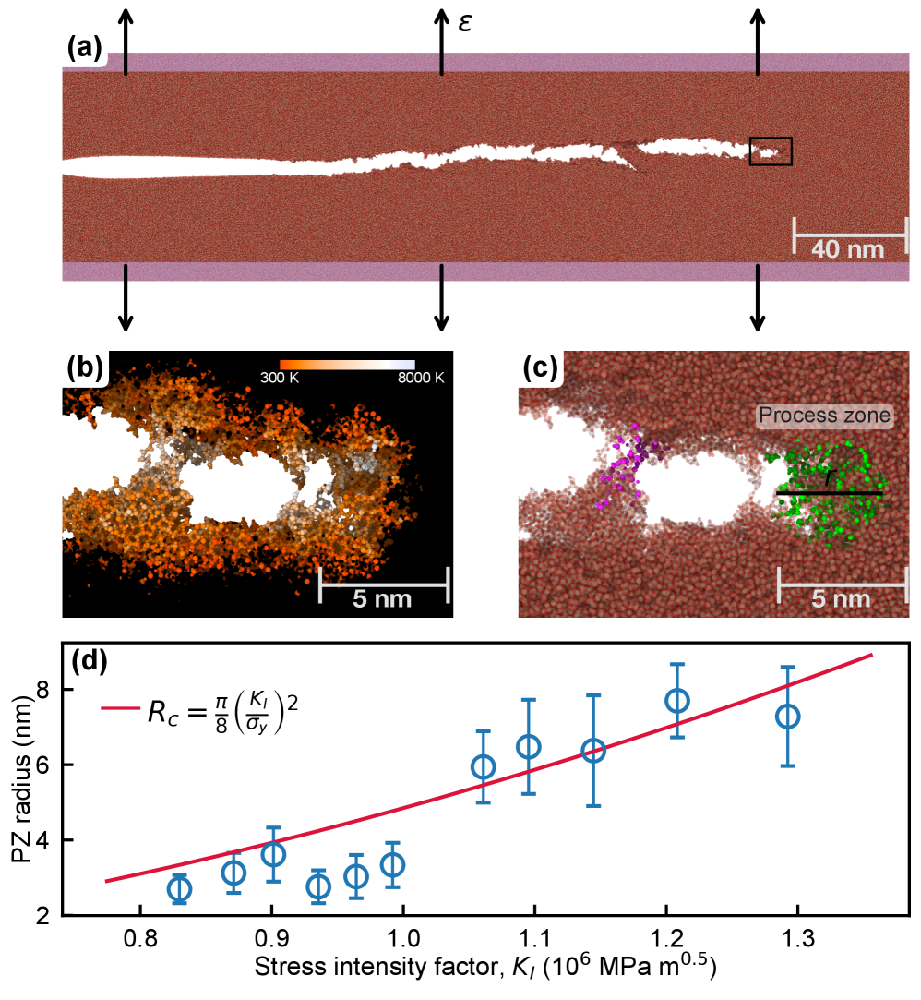
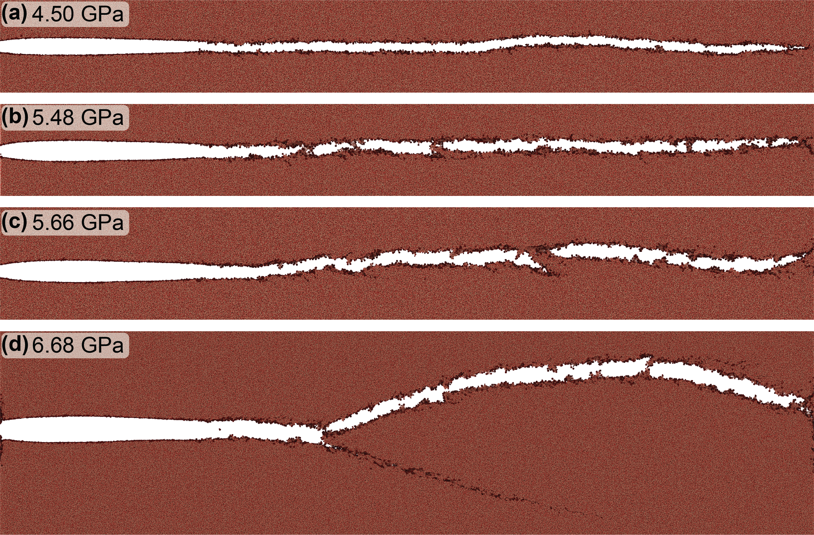
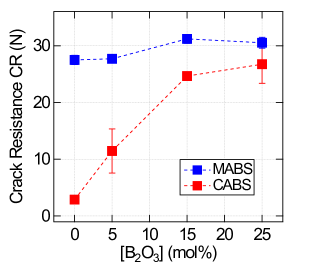

# アモルファス材料の破壊エネルギーは定数ではない — 亀裂速度依存性の原子スケール機構と金属ガラス破壊への示唆

- 執筆日: 2026-05-06
- トピック: アモルファス材料（シリカガラス・金属ガラス）における動的破壊エネルギーの亀裂速度依存性とその原子スケール起源、剪断帯を媒介とした破壊開始機構の普遍性
- タグ: Structure and Microstructure / Defects and Impurities; Nonlinear Response / Molecular Dynamics; Machine Learning
- 注目論文: Guren et al., "Energy dissipation at the atomic scale explains how fracture energy depends on crack velocity in silica glass," arXiv:2605.03457 (2026)
- 参照論文数: 6

---

## 1. なぜ今この話題なのか

破壊力学の教科書には、脆性材料の破壊エネルギー $G_c$（亀裂を単位面積だけ進めるのに必要なエネルギー）は材料固有の定数であると書かれている。この前提はGriffith (1921) の理論以来100年以上にわたって破壊力学の礎となっており、構造物の設計や材料選定における安全係数の計算に広く使われてきた。しかし実験的には、脆性材料でも亀裂速度が増すにつれて見かけの破壊エネルギーが上昇する現象は古くから観察されてきた。この「なぜ速い亀裂は止まりにくいのか」という問いへの標準的な答えは、亀裂経路の不安定化（ブランチング、ミストやハックルと呼ばれる表面粗さ）によって実際の破断面積が見かけより大きくなるから、というものだった。

ところが2026年5月、シリカガラスの分子動力学（MD）シミュレーションを用いた研究が、この標準的解釈に根本的な修正を迫る結果を報告した。Guren らは第一原理精度の機械学習ポテンシャルを用いて、ブランチング閾値以下の亀裂速度域においても破壊エネルギーが最大33%上昇することを示した。しかもその上昇分の約半分は、より多くの表面を作るからではなく、ナノスケールで「質的に異なる表面」が形成されることに起因するというのだ。

この知見がとりわけ重要なのは、アモルファス材料の破壊物理全体に波及する問いを提起しているからである。シリカガラスは代表的なアモルファス（非晶質）材料であり、構造無秩序という意味では、金属ガラス（バルクメタリックガラス、BMG）やアモルファス酸化物薄膜と共通の性質を持つ。一方で金属ガラスは、剪断帯（shear band）という局在変形帯を通じて破壊するという点でシリカガラスとは大きく異なるとされてきた。最近の研究は、この「共通点と相違点」の境界線が揺らいでいることを示している。Bourguignon らは2026年1月、シリカガラスもまた金属ガラスやアモルファスポリマーと共通の剪断局在機構によって破壊が開始することを実験と計算の両面から実証した。

材料工学の視点からも、このトピックの重要性は明らかである。金属ガラスは高強度・高弾性限界・耐腐食性などの優れた性質を持ちながら、室温での急激な破壊という致命的な弱点が実用化の壁となってきた。アモルファス酸化物薄膜は次世代トランジスタや超薄板コーティング材として注目されるが、やはり機械的信頼性が問題となる。「破壊エネルギーが速度に依存する」という事実が原子スケールで解明されれば、新しい破壊制御の指針が生まれる可能性がある。

---

## 2. この分野の未解決問題

アモルファス材料の破壊力学には、現在もなお議論が続く根本的な問いがいくつか存在する。

第一の問いは「破壊エネルギーはどこまで動的に変化するのか」である。Griffith 理論では $G_c = 2\gamma_s$（$\gamma_s$ は表面エネルギー）と定式化され、材料定数として扱われる。しかし実験値はしばしば $2\gamma_s$ の10〜100倍に達し、それを「塑性散逸」や「表面粗さ」として吸収することで整合性をとってきた。Guren らの新しい結果は、ブランチング以前の段階でも「固有表面エネルギー密度」が速度とともに増大することを示した。これは表面の化学状態が動的に変化していることを意味するが、その物理機構は何か、またそれが金属ガラスでも起きているのかは未解明である。

第二の問いは「剪断変形と開口型破壊の関係はどう整理されるのか」である。破壊力学では、開口型（モードI）、面内剪断（モードII）、面外剪断（モードIII）という三つの破壊モードが定義される。金属ガラスの実験では亀裂先端に剪断帯が形成され、これがミクロな塑性変形を担う一方で、最終的な破断は脆性的に起きる。Bourguignon らが示した「シリカガラスも剪断局在で破壊が開始する」という知見は、モードI破壊においても局所的な剪断が先行するという描像を支持するが、その定量的な役割はまだ論争中である。

第三の問いは「アモルファス構造の不均一性（欠陥）はどのように破壊を制御するのか」である。完全に均一なアモルファス構造などというものは実在しない。シリカガラスでは局所的なSi-O結合長分布が、金属ガラスでは自由体積や密度揺らぎが、破壊の起点になると考えられている。Zhu らの2025年の計算は、バルクメタリックガラスでは密度揺らぎの大きさと空間スケールが臨界剪断応力を劇的に変化させることを示した。これは「同じ組成でも力学特性がばらつく」という金属ガラスの実用上の大問題に直結する。

---

## 3. 注目論文の核心

Guren, Bore, Renard, Sveinsson らの論文（arXiv:2605.03457）は、シリカガラスの動的破壊において破壊エネルギーの速度依存性が亀裂分岐閾値以下から始まっていることを、原子スケールの分子動力学で初めて定量的に明らかにした点で新規性が高い。

方法論上の最大の特徴は、シリカガラス専用の機械学習原子間ポテンシャル（MLIP）の使用である。従来のシリカ用古典ポテンシャル（BKS, CHIK など）は Si-O 結合の記述精度に限界があり、破壊面近傍の原子配置の変化を正確に扱えなかった。Guren らが用いたポテンシャルは第一原理計算（DFT）データで訓練されており、ナノスケール粗さや化学結合の変化まで扱える。これにより、これまで古典ポテンシャルでは再現できなかった「破壊面近傍の構造変化」を定量的に評価することが初めて可能になった。

シミュレーションの設定は三次元的な「ランニングクラック」配置で、亀裂先端に周期境界条件を適用しつつ、定常亀裂速度 $v$ が維持されるように外部変位を制御する方式をとっている（図1参照）。亀裂速度は 0 から $v_R$（Rayleigh波速度）の 40% までをパラメトリックに変化させた。

*図1: Guren et al. (2605.03457) Fig. 1. 三次元シミュレーションの設定図と亀裂プロセスゾーンの決定法。(a) 矢印が荷重方向を示す。亀裂先端付近の非弾性領域が「プロセスゾーン」として同定される。(CC BY 4.0)*

主要な結果は以下の通りである。

まず、構造破壊エネルギー（structural fracture energy）$G_c^{struct}$ を、弾性エネルギー変化と非弾性的散逸を厳密に区別して計算すると、亀裂速度が $v_R$ の 40% になるまでの領域（ブランチング閾値以下）で最大 33% の上昇が観測された。この上昇が「ブランチング」（亀裂が分岐して実際の表面積が増える）で説明できないことが本研究のポイントである。なぜなら解析は分岐が起きていない速度域に限定されているからだ。

次にその上昇の起源を分解したところ、約半分が「固有表面エネルギー密度 $\gamma_s$ の増加」、残り約半分が「ナノスケールの粗さによる実際の破断面積の増加」に由来することが示された。$\gamma_s$ が速度とともに増加するという事実は驚くべきもので、これは亀裂が速く進むほど表面の原子配置が「より乱れた状態」になることを意味する。具体的には、速い亀裂では Si-O 結合が切断される際に、熱平衡に近い低エネルギー構造ではなく、より高エネルギーのアモルファス表面構造が生成される（図2・3）。

*図2: Guren et al. (2605.03457). 亀裂速度に応じた破断面形態の変化。低速（左）ではほぼ平滑な表面が形成されるのに対し、高速（右）ではナノスケールの粗さが増大する。(CC BY 4.0)*

以前の研究では何が分かっていたか。古典ポテンシャルを用いた先行シミュレーションでも速度依存性の傾向は観察されていたが、その定量的根拠には疑問が残っていた。実験的には、シリカガラスの破壊靭性 $K_{Ic} \approx 0.75$ MPa·m$^{1/2}$ は亀裂速度によってほとんど変わらないと言われてきたが、これはマクロスケールの測定であり、ナノスケールの変化を捉えられていない可能性がある。本研究が前進させた点は、「定数」として扱われてきた $G_c$ が実は速度依存の動的量であり、その内訳まで原子スケールで追跡できることを示したことだ。残された問いは、この結果が金属ガラスや他のアモルファス材料でも成り立つかどうかである。

---

## 4. 背景と研究史

アモルファス材料の破壊研究は、シリカガラス研究と金属ガラス研究という二つの流れが、近年急速に接近しつつある状況にある。

シリカガラスの破壊力学では、長年にわたって「圧子誘起き裂（Vickers 圧子でつけた傷から伸びる亀裂）」や「スクラッチ試験」が主要な手段だった。この系では、変形の主役は「densification（高圧縮によるガラスの密化）」であり、剪断変形は副次的と考えられてきた。ところが Bourguignon らの2026年1月の研究（arXiv:2601.14493）は、この解釈を覆す証拠を提示した。アルミノボロシリケートガラス二系統について圧子誘起破壊を系統的に調べ、MD シミュレーションと照合すると、破壊開始を支配するのは densification ではなく局所的な剪断流動（plastic shear flow）であることが分かった。

*図3: Bourguignon et al. (2601.14493) Fig. 1. シリカガラスにおける圧子誘起破壊の観察。剪断帯の形成が破壊開始に先行していることが示されている。(CC BY 4.0)*

この発見が重要なのは、シリカガラスが「金属ガラスやアモルファスポリマーと同じ普遍的な破壊開始パターン」に従うことを示したからだ。金属ガラスでは古くから「剪断帯が破壊の起点」と理解されていた。したがって Bourguignon らの結果は、アモルファス材料全体に共通する破壊の普遍的描像の存在を支持する。

金属ガラスの研究史に目を向けると、2000年代以降、バルクメタリックガラス（Zr-Cu-Ni-Al, Pd-Cu-Si などの多成分系）の開発により実験研究が急加速した。金属ガラスは「降伏強度が高く、変形は剪断帯に局在し、破断は脆性的」という特徴を持つが、その機構の解明は分子動力学に依存してきた。理論的な基礎は Argon の「剪断変換ゾーン（STZ: Shear Transformation Zone）」モデルで、数十個の原子からなる局所領域が協調的に剪断変形を起こすことで塑性変形が進行するという考え方だ。

密度揺らぎが剪断帯形成に与える影響を定量的に調べたのが Zhu らの2025年4月の研究（arXiv:2504.01229）である。バルクメタリックガラスの分子動力学で密度揺らぎの大きさと空間スケールを系統的に変化させると、臨界剪断応力がそれらに強く依存することが示された。この知見は「同じ組成・同じ見かけの仮想転移温度（fictive temperature）の試料でも力学特性が大きくばらつく」という実験事実を定量的に説明する。つまり、アモルファス構造の「欠陥」として機能するのが密度揺らぎであり、その空間分布が破壊挙動を決定しているという描像が浮かぶ。

Sun らの2025年12月の研究（arXiv:2512.20121）はさらに踏み込んで、金属ガラスの熱履歴（焼入れ速度）が剪断帯の相互作用と延性に与える影響を調べた。焼入れ速度を6桁にわたって系統的に変化させると、急冷試料では剪断変換ゾーンが稠密に存在して個々の剪断帯が経路固定（path locking）を起こして相互作用が弱いのに対し、徐冷試料では構造不均一性が増して剪断帯先端に大スケールの渦流場が形成され、これが長距離応力伝播を引き起こして剪断帯の偏向・収束・合体（破壊力学のシールド効果に相当）を促すことが示された。この結果は、金属ガラスの延性が熱処理によって制御できる可能性を示す。

実験面では、実スケールの破断面を非破壊でイメージングする技術の進歩も重要な背景にある。2022年の Das らの研究（arXiv:2211.08492）は X 線トモグラフィーを用いて金属ガラスの変形中に剪断帯内部のキャビテーション（空洞生成）をリアルタイムで観察し、マクロな応力－ひずみ曲線の形状がキャビテーションの始まりと一致することを実証した。この発見は、金属ガラスの「降伏後挙動」が剪断帯と内部き裂形成の競合で決まることを示す重要な実験的根拠である。

---

## 5. どの解釈が最も妥当か

Guren らの中心的な主張——「ブランチング以前の速度域での破壊エネルギー上昇は、実際の表面積増加と固有表面エネルギー密度上昇がほぼ等分担する」——を支える根拠は何か、また他の解釈は成り立つか。

最も強い根拠は方法論的な厳密性にある。本研究の重要な技術的貢献は「破壊エネルギーの分解法」の確立にある。弾性エネルギー変化を線形弾性理論で精密に計算し、そこからの「非弾性的余剰」を非弾性散逸として定義する。この量をさらに「破断面の実面積変化」と「単位面積あたりのエネルギー変化」とに分離するために、亀裂面の原子座標から直接粗さを定量している。機械学習ポテンシャルの第一原理精度が、この精密な分解を初めて信頼できるものにしている。

一方で「固有表面エネルギー密度が速度とともに増加する」という結論には注意が必要である。速い亀裂では亀裂先端通過後の表面が熱緩和する時間が短くなり、より高エネルギー（非平衡）な表面構造が凍結される。これはシリカガラス特有の現象かもしれない。シリカのネットワーク構造は Si-O-Si 角度分布に大きな自由度を持ち、急速な変形後には通常より歪んだ構造が生成しやすい。金属ガラスでは最近傍原子間の相互作用がより等方的であるため、表面エネルギー密度の速度依存性はシリカとは異なる可能性がある。

金属ガラスの剪断帯理論との照合も重要な検討点だ。Bourguignon らの発見——シリカガラスも剪断局在で破壊が開始する——は、「局所的な剪断流動が亀裂先端の応力場を緩和し、その後に開口型き裂として進展する」という二段階モデルの普遍性を示唆する。この描像は、亀裂先端の実効的なプロセスゾーンサイズが材料によって異なるという古典的な議論とも整合する。金属ガラスではプロセスゾーンが剪断帯によって大きくなる一方、シリカガラスでは小さいとされてきたが、Bourguignon らの結果は「シリカでも剪断が亀裂開始を先導する」と言っており、プロセスゾーンの比較的小さいシリカでさえ剪断の寄与が無視できないことになる。

比較的強く支持される結論: (1) 破壊エネルギーは亀裂速度の単調増加関数であり、ブランチング前から始まる。(2) その上昇には表面積増加以外の寄与（固有表面エネルギー密度の変化）が含まれる。(3) アモルファス材料における破壊開始には剪断局在が共通して関与する。

まだ弱い結論・未確定事項: (1) $G_c$ の速度依存性が金属ガラスでも同様の大きさで成立するかは未検証。(2) 固有表面エネルギー密度の増加が非弾性散逸（プロセスゾーン内の構造変化）と明確に分離できているか、計算上の系統誤差の評価が必要。(3) 室温の実験データとの直接比較はまだ十分でない。Zhu らの計算が示す「密度揺らぎによる臨界剪断応力の変化」がシリカ系では対応量が何かも問われていない。

今後必要な検証: 異なる組成のガラス（アルミノシリケート、ボロシリケート）での速度依存性の計算、金属ガラス系（Cu-Zr, Zr-Cu-Al など）での同様の分解解析、そして低温・高温での挙動の系統的比較。実験面では、ナノスケールの破断面形態をリアルタイムで観察できる技術（in situ TEM や X 線小角散乱との組み合わせ）の開発が決定打となりうる。

---

## 6. 何が一般化できるか

Guren らの知見を他の材料系や分野に広げると、どのような洞察が得られるか。

最も直接的な接続は金属ガラスへの応用である。金属ガラスでは $G_c$ が数 kJ/m² から数十 kJ/m²（シリカの $\sim 10$ J/m² に比べて数百〜千倍）であり、延性的破壊と脆性的破壊の境界が実用上重大な問題となっている。Sun らが示した「熱履歴が剪断帯相互作用を制御する」という知見と組み合わせると、「焼入れ速度 → アモルファス構造の均質性 → 剪断帯の相互作用の強さ → 破壊靭性」という設計の連鎖が見えてくる。しかし本質的な問いは、「金属ガラスにおいて亀裂が速く動くとき、$G_c$ はどう変化し、それは剪断帯の形成・消滅速度と整合するか」であり、これはまだ答えられていない。

アモルファス酸化物薄膜の文脈では、2605.01917 の結果（パルスレーザー堆積 PLD や原子層堆積 ALD で作製したアモルファスアルミナは曲げ塑性を示す）が示唆的である。PLD 膜では総ひずみ >10% まで破断せずに変形できるが、スパッタ堆積（SD）膜は柱状微構造を持つために脆性的に破壊する。刻み目（ノッチ）付き試験での破壊靱性はいずれも $3.1 \pm 0.2$ MPa·m$^{1/2}$ でほぼ同じという事実は、マクロな破壊靱性は微細構造に依存しないが、塑性変形の「経路（path）」——すなわち「欠陥の空間分布」——が破壊モードを決定することを示している。この観点はシリカや金属ガラスにも共通する。

より広く見れば、「アモルファス材料においてローカルな構造不均一性（欠陥、密度揺らぎ、微構造）が破壊の起点と経路を支配する」という描像は、これら四つの材料系すべて（シリカガラス、金属ガラス、アモルファス酸化物、アモルファスポリマー）に横断的に当てはまりつつある。特に「剪断局在が破壊開始に先行する」という知見が普遍性を持つとすれば、破壊設計においてモードI（開口型）強度だけでなく剪断強度・剪断帯の増殖特性を制御する必要性が浮かび上がる。

デバイス・応用への接続としては、MEMS 構造や次世代パワーデバイスで使われる超薄膜アモルファス層の信頼性評価に直結する。従来の弾性論的評価（線形弾性破壊力学、LEFM）は $G_c$ を定数として使うが、今後はひずみ速度依存の破壊基準が必要になるかもしれない。

---

## 7. 基礎から理解する

アモルファス材料の破壊力学を理解するには、まず「なぜ結晶とアモルファスで破壊が違うのか」という問いから始め、古典的な破壊力学を学んだ後に、アモルファス特有の塑性機構へと進む必要がある。

### 7.1 Griffith の破壊理論

1921年に Griffith が提唱した理論は、脆性破壊の根本を「エネルギーバランス」で説明する。固体に長さ $a$ の平面的き裂（貫通亀裂）があるとき、き裂が単位長さだけ進展するための条件はエネルギー放出率 $G$ が破壊エネルギー $G_c$ を超えることである：

$$G = G_c$$

ここで $G$（エネルギー放出率）は外部荷重がする仕事と弾性ひずみエネルギーの変化から計算される。平面応力状態の単純なモードI（開口型）き裂では：

$$G = \frac{K_I^2}{E}$$

ここで $K_I$ は応力拡大係数（MPa·m$^{1/2}$ の単位を持つ）、$E$ は縦弾性係数である。$K_I$ は遠方応力 $\sigma_\infty$ とき裂半長 $a$ から：

$$K_I = \sigma_\infty \sqrt{\pi a}$$

という単純な形で表される（補正係数を無視した場合）。破壊靱性 $K_{Ic}$ は $G_c$ を通じて材料定数として定義される：

$$K_{Ic} = \sqrt{G_c E} \quad \text{（平面応力の場合）}$$

Griffith 理論でのポイントは $G_c = 2\gamma_s$ という等式で、$\gamma_s$ は固体の単位面積あたりの表面エネルギーである。「新しい表面を二枚作るのに要するエネルギー」が破壊の障壁になるという直観的な描像だ。しかしほとんどの工学材料では実測の $G_c$ は $2\gamma_s$ より遥かに大きく、それは亀裂先端近傍での塑性変形（金属では転位の発生・増殖）や粘弾性散逸（ポリマー）によるエネルギー吸収によって説明される。

アモルファス材料、特に脆性ガラスでは転位が存在しないため、$G_c$ は $2\gamma_s$ に近いと長年考えられてきた。しかし Guren らの計算はこの前提に疑問を呈している。

### 7.2 動的破壊力学：なぜ亀裂が「速く走ると止まりにくいのか」

静的（準静的）破壊力学では亀裂速度を無視するが、現実の破壊は有限の速度 $v$ で進行する。動的破壊力学では、エネルギー放出率が速度依存になる：

$$G(v) = G_0 \left(1 - \frac{v}{c_R}\right)^{-1} A(v)$$

ここで $c_R$ はレイリー波速度（表面波速度）、$G_0$ は静的破壊エネルギー、$A(v)$ は速度依存の補正関数である。直観的には「亀裂が速く動くほど、弾性波が亀裂先端に届く前に亀裂が進んでしまい、応力場の再配分が追いつかない」ために、より多くのエネルギーが必要になる。

ブランチング（亀裂分岐）は亀裂速度が $v \approx 0.3 \sim 0.4 c_R$ 以上になると起きる現象で、亀裂面が荒れて実際の破断面積が急増する。従来の説明は「ブランチングによる見かけの $G_c$ 増加」で速度依存性の多くを説明しようとするものだった。Guren らの新しい知見は、ブランチング以前から $G_c$ が増加しており、その増加の半分は固有表面エネルギー密度の変化によるというものだ。

### 7.3 アモルファス構造と変形機構

結晶材料では原子が三次元周期格子を形成し、塑性変形は転位（dislocation）の移動で起きる。転位は一種の線欠陥で、その増殖と移動は大きな塑性変形を可能にし、それが金属の延性の源泉となる。

アモルファス材料には長距離秩序がなく、転位は原理的に存在しない。では変形はどうやって起きるのか。現在の標準的な描像は Falk と Langer が1998年に提唱した「剪断変換ゾーン（STZ：Shear Transformation Zone）」モデルである。STZ とは、数十個の原子からなる局所領域が、ある閾値を超えた剪断応力の下で協調的に構造変化（剪断変換）を起こす「場所」のことである。各 STZ の変換はほぼ不可逆であり、周囲に応力場変化をもたらす。多数の STZ が局所に集積すると「剪断帯」という巨視的な変形帯が形成される。

STZ モデルの数式的な表現では、ある局所の有効温度 $T_{eff}$ と活性化エネルギー $\Delta F$ を用いて STZ の変換速度を：

$$\dot{\gamma}_{STZ} \propto \exp\left(-\frac{\Delta F}{k_B T_{eff}}\right) \sinh\left(\frac{\sigma \Omega}{2 k_B T_{eff}}\right)$$

と表す。ここで $\sigma$ は局所剪断応力、$\Omega$ は STZ の体積である。この式の重要な点は、応力 $\sigma$ と有効温度 $T_{eff}$ の両方が変換速度を支配することで、熱的な揺らぎと機械的な駆動力が競合する様子を表現している。

Zhu らの計算（arXiv:2504.01229）は、BMG 中の密度揺らぎが $\Delta F$ の空間分布に大きな影響を与えることを示している。密度が局所的に低い（自由体積が多い）領域では $\Delta F$ が小さく、STZ が優先的に起動される。これが「欠陥」として機能し、剪断帯の核生成点となる。

### 7.4 破壊靱性の観点から金属ガラスを見る

金属ガラスの破壊靱性は $K_{Ic} \approx 2 \sim 200$ MPa·m$^{1/2}$ と材料や熱処理によって広い範囲に分布する。上限に近いのは Cu-Zr 系、Pd 系などの「延性的」な金属ガラスで、これらはある程度の剪断帯増殖を許容する。下限に近いのは脆性化した金属ガラスで、$K_{Ic} \sim 2$ MPa·m$^{1/2}$ ではシリカガラスと同程度になってしまう。

延性を高めるには「剪断帯を多数形成・分散させる」ことが鍵で、それには以下の条件が重要とされる。(1) 構造不均一性の適切な制御：密度揺らぎが多すぎると剪断帯が少数に局在し、脆性破壊に至りやすい。(2) 熱履歴の制御：Sun らの計算が示すように、適切な焼入れ速度で構造不均一性の「空間スケール」を最適化することで剪断帯相互作用を増強できる。(3) 複合化・ナノ構造化：結晶相を分散させたメタリックガラスコンポジットは、結晶粒が剪断帯伝播を遮断し、靱性を高める。

アモルファスアルミナ（$a$-Al$_2$O$_3$）の破壊靱性は $3.1$ MPa·m$^{1/2}$ であり（Jain et al., arXiv:2605.01917）、これは結晶 $\alpha$-Al$_2$O$_3$（コランダム）の $\sim 3 \sim 4$ MPa·m$^{1/2}$ と同程度である。しかし塑性変形の挙動はノッチの有無で劇的に異なり、ノッチなしの PLD 膜では >10% の曲げひずみが達成される。これは「亀裂先端の応力集中がない状態」では広域の塑性変形が可能なことを示しており、き裂先端塑性（crack-tip plasticity）は寄与しないにもかかわらず、均一変形での塑性は可能という興味深い状況だ。

---

## 8. 専門用語の解説

**破壊エネルギー（fracture energy, $G_c$）**  
材料内の亀裂を単位面積だけ進展させるのに必要なエネルギーで、単位は J/m²。Griffith 理論では $G_c = 2\gamma_s$（表面エネルギーの2倍）と表されるが、実測値はこれより遥かに大きいことが多い。Guren らはこれが亀裂速度の関数であることを初めて原子スケールで示した。「破壊靱性 $K_{Ic}$ 」と $G_c = K_{Ic}^2/E$（平面応力）で関係づけられる。

**応力拡大係数（stress intensity factor, $K$）**  
き裂先端周辺の応力場の特異性の強さを表す量。モードI（開口型）では $K_I = \sigma_\infty \sqrt{\pi a}$ 。破壊靱性 $K_{Ic}$ はき裂が不安定進展を始める $K_I$ の臨界値で、材料定数として扱われる。金属ガラスでは $K_{Ic}$ が数〜数百 MPa·m$^{1/2}$ と広い範囲を取る。

**剪断変換ゾーン（STZ：Shear Transformation Zone）**  
アモルファス材料（金属ガラス・非晶質ポリマーなど）における塑性変形の基本単位。数十個の原子が協調的に剪断変形を起こす局所領域で、転位のないアモルファス構造での塑性の担い手となる。Falk–Langer モデル（1998）で定式化され、活性化エネルギー $\Delta F$、体積 $\Omega$、有効温度 $T_{eff}$ などのパラメータで特徴づけられる。本記事では STZ の密度と空間分布が破壊の起点を決める役割を果たす。

**剪断帯（shear band）**  
多数の STZ が局所的に集積して形成される変形帯。幅は数十 nm 程度で、亀裂として機能することもある。金属ガラスでは降伏後に少数の剪断帯に変形が局在し、最終破断を引き起こす。Sun ら（arXiv:2512.20121）はこの剪断帯の相互作用が熱履歴によって制御されることを分子動力学で示した。

**機械学習原子間ポテンシャル（MLIP）**  
第一原理計算（DFT）の精度で原子間力を記述しながら、計算コストを古典 MD 並みに抑えた原子シミュレーション用のポテンシャル。ニューラルネットワークやガウス過程回帰などで実装される。Guren らはこれをシリカガラスに適用し、従来の古典ポテンシャルでは再現できなかった破断面の原子構造変化を正確に記述した。ML ポテンシャルの普及によって、「化学的変化を伴う破壊」のシミュレーションが可能になりつつある。

**亀裂分岐（branching）**  
進展する亀裂が速度 $\approx 0.3 c_R$（レイリー波速度の30〜40%）を超えると、不安定になって複数の亀裂に分岐する現象。分岐後は実際の破断面積が増えるため見かけの破壊エネルギーが急増する。従来はこのブランチングで速度依存性の多くを説明してきたが、Guren らはブランチング前から $G_c$ が上昇することを示した。

**自由体積（free volume）**  
アモルファス構造中のランダムな「隙間」の量。高温の液体状態から急冷すると平衡体積より大きな体積（余剰体積 = 自由体積）が凍結される。自由体積が多い領域では原子が動きやすく、STZ の活性化エネルギーが低い。密度揺らぎ（Zhu ら, arXiv:2504.01229）と密接に関連し、剪断帯の核生成点として機能する。焼鈍処理（annealing）で自由体積を除去すると一般に強度は上がるが延性は低下する。

**固有表面エネルギー密度（intrinsic surface energy density）**  
破断面の「単位面積あたりの表面エネルギー」であり、Guren らが注目する量。ブランチングや粗さによる表面積増加とは独立した量で、亀裂の進み方が速いほど表面の原子配置が熱平衡からより大きく外れるため増加する。従来のモデルでは一定と仮定されてきたが、本研究が速度依存性を初めて定量化した。

**レイリー波速度（$c_R$）**  
固体表面を伝わる弾性波（レイリー波）の速度。縦弾性係数とポアソン比で決まる材料定数で、シリカガラスでは $\sim 3400$ m/s 程度。動的破壊では亀裂速度の上限がほぼ $c_R$ に制限されることが知られており、「亀裂は音速より速くは走れない」という意味での上限を与える。本記事では亀裂速度を $c_R$ で規格化して議論している。

**ノッチ（notch）**  
試験片に意図的に設けた切り欠き。破壊靱性試験では、このノッチ先端から亀裂を成長させて $K_{Ic}$ を測定する。Jain ら（arXiv:2605.01917）のアモルファスアルミナ研究では、ノッチなし試験体では大きな曲げ塑性が観察されるが、ノッチ付きでは脆性的に破壊し $K_{Ic} = 3.1$ MPa·m$^{1/2}$ となることが示された。ノッチの有無による違いは「き裂先端塑性」の寄与を評価する上で本質的に重要である。

---

## 9. 将来展望

今かなり確からしくなったことは、アモルファス材料における破壊エネルギー $G_c$ の速度依存性が、ブランチングや経路不安定化という「巨視的な表面積増加」だけでは説明できないという点である。Guren らの計算はシリカガラスに限定されているが、固有表面エネルギー密度が速度依存であるという機構は、化学結合の動的応答という観点から他のアモルファス材料にも適用できる可能性が高い。また、剪断局在が破壊開始に先行するという普遍的な描像（Bourguignon ら）は、シリカガラスという従来「剪断とは縁遠い」と思われていた材料にも当てはまることが示されており、アモルファス材料破壊の統一描像に向けた重要な一歩となっている。

まだ未確定なことは多い。特に以下の問いが重要である。金属ガラス系での $G_c$ の速度依存性は定量的にどの程度か。固有表面エネルギー密度の速度依存性は、ポテンシャルの精度や系の大きさに依存するシステマティック誤差を含んでいないか。剪断帯相互作用（Sun ら）や密度揺らぎ（Zhu ら）が実際の破壊靱性にどの程度寄与するか、実験との定量的な対応関係の確立が急務である。アモルファスアルミナのような酸化物において、塑性の起源（STZ 的な機構か、それとも転位的なものか）はまだ議論中である。

次に重要になる実験・理論・計算と注目すべき論点は以下の通りである。シミュレーション面では、BMG 系（Cu-Zr などの代表的な金属ガラス組成）への機械学習ポテンシャルの適用と、Guren らと同様の「$G_c$ の速度依存分解解析」が最重要課題である。また、STZ の活性化エネルギー分布（Zhu らが示した密度揺らぎとの関係）と亀裂先端での動的応力場の相互作用を統一的に記述するマルチスケールモデルの構築も急がれる。実験面では、高速き裂進展中のナノスケール破断面形態を in situ で計測する技術——例えばシンクロトロン X 線コヒーレント散乱や高時間分解能の電子顕微鏡——が決定的な証拠を与えうる。材料設計の観点では、Sun らが示した「熱履歴制御による剪断帯相互作用の最適化」を実際の BMG 合金で実証する実験が近い将来に現れると期待される。

---

## 参考論文一覧

1. **[arXiv:2605.03457](https://arxiv.org/abs/2605.03457)** — Guren, Bore, Renard, Sveinsson (2026). "Energy dissipation at the atomic scale explains how fracture energy depends on crack velocity in silica glass." 機械学習ポテンシャルを用いた MD でシリカガラスの破壊エネルギーが亀裂速度とともに上昇し、その上昇が固有表面エネルギー密度変化とナノ粗さで半々担われることを示した、本記事の注目論文。

2. **[arXiv:2601.14493](https://arxiv.org/abs/2601.14493)** — Bourguignon, Rosales-Sosa, Kato, Bresson, Ikeda, Nakane, Molnár, Yamazaki, Barthel (2026). "Fracture initiation in silicate glasses via a universal shear localization mechanism." アルミノボロシリケートガラスにおいて破壊開始が densification ではなく剪断局在で支配されることを実験と MD で示し、金属ガラスとの破壊機構の共通性を主張した論文。

3. **[arXiv:2504.01229](https://arxiv.org/abs/2504.01229)** — Zhu, Eckert, Curtarolo, Schroers, van de Walle (2025). "Computational Study of Density Fluctuation-Induced Shear Bands Formation in Bulk Metallic Glasses." 同一組成の BMG でも力学特性がばらつく理由として密度揺らぎの大きさと空間スケールが臨界剪断応力を決定することを計算で明らかにした論文。

4. **[arXiv:2512.20121](https://arxiv.org/abs/2512.20121)** — Sun, Zhang, Xu, Su, Wang, Guan (2025). "Linking Thermal History to Shear Band Interaction and Macroscopic Ductility in Metallic Glasses." 焼入れ速度 6 桁の範囲で金属ガラスの剪断帯相互作用を系統的に調べ、徐冷試料での渦流場を介した延性向上機構を示した分子動力学研究。

5. **[arXiv:2605.01917](https://arxiv.org/abs/2605.01917)** — Jain et al. (2026). "Microscale bending plasticity and fracture behavior of amorphous aluminum oxide films." PLD・ALD・SD の三手法で作製したアモルファス酸化アルミニウム薄膜において、マイクロスケール曲げ試験で延性挙動が確認され、欠陥密度と成膜方法が変形モードを支配することを示した実験研究。

6. **[arXiv:2211.08492](https://arxiv.org/abs/2211.08492)** — Das, Ott, Pechimuthu, Moosavi, Stoica, Derlet, Maass (2022). "Shear-band cavitation determines the shape of the stress-strain curve of metallic glasses." X 線トモグラフィーにより金属ガラス変形中の剪断帯内部キャビテーションをリアルタイム観察し、マクロな応力−ひずみ曲線の形状がキャビテーション開始と一致することを示した実験研究。
