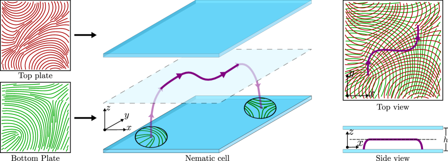
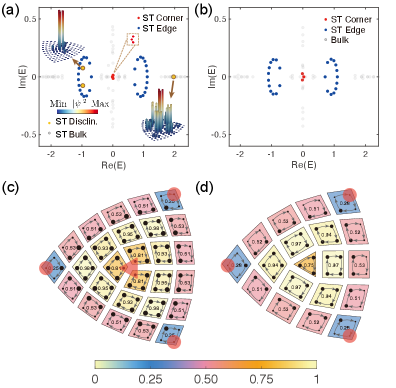
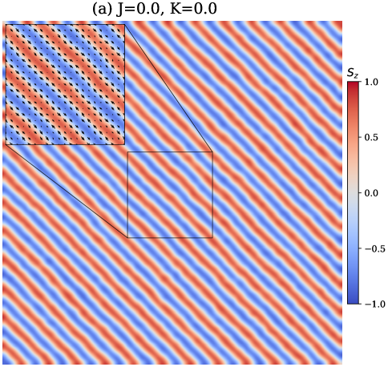

# トポロジカル欠陥と回位ダイナミミクス：SrTiO3における酸素空孔と塑性の連成機構

- 執筆日：2026-05-06
- トピック：ペロブスカイト酸化物SrTiO3の転位コアにおける酸素空孔の動的進化と、イオン性結晶の塑性変形との内在的連成
- タグ：Structure and Microstructure / Defects and Impurities; Phase Transitions / TEM; Molecular Dynamics
- 注目論文：Kang et al., "Oxygen Vacancies at Dislocation Core Modulate Plasticity in Strontium Titanate", arXiv:2605.00801, Acta Materialia 313 (2026) 122283
- 参照論文数：5

---

## 1. なぜ今この話題なのか

酸化物材料は現代のエレクトロニクス・エネルギー技術の根幹を支えている。ペロブスカイト型酸化物の代表であるチタン酸ストロンチウム（SrTiO3）は、高誘電率絶縁体として半導体デバイスのゲート絶縁膜に用いられるほか、フォトカソード、プロトン伝導体、酸化物超伝導体の基板、さらには変形によって誘起される超伝導など、幅広い機能が注目されている材料である。これらの機能の多くは格子欠陥——特に酸素空孔（oxygen vacancy）——の存在と分布に鋭敏に依存しており、酸素空孔はSrTiO3の電気伝導、誘電応答、イオン輸送の制御因子として30年以上にわたって研究されてきた。

一方、機械的変形を担う線欠陥である転位（dislocation）は、金属材料では非常によく研究されてきたが、イオン性酸化物においては独自の難しさがある。イオン結晶では転位の移動に伴って電荷補償が必要となり、また酸素サブラティス（副格子）が乱されれば酸素空孔が生成・移動する可能性がある。しかし、転位が実際に運動している最中にコア（中心領域）の化学組成がどう変化するかは、これまで直接観察されていなかった。これは、転位コアがナノメートル以下の空間スケールを持ち、かつ運動中の過渡的構造を高分解能で観察するのが技術的に困難だったためである。

2020年代に入り、収差補正走査透過型電子顕微鏡（STEM）と電子エネルギー損失分光法（EELS）の組み合わせが著しく進歩した。特に球面収差補正技術の普及により、0.1 nm以下の空間分解能でSr・Ti・O各原子カラムの化学状態を同時に検出することが可能になった。また原子スケールの分子動力学（MD）シミュレーションと組み合わせることで、実験では捉えにくい動的過程を再現的に理解できるようになった。こうした手法論的な進歩が、転位コア化学の「動的」側面を初めて直接観察することを可能にした背景にある。

さらにより広い視点から見ると、転位（dislocation）、渦糸（vortex）、回位（disclination）などの「トポロジカル欠陥」は、結晶・液晶・磁性体・超伝導体など様々な秩序相において普遍的に出現する基本概念であり、近年はトポロジカル量子材料との接続も活発に議論されている。本記事ではSrTiO3の転位コア化学という具体的な実験成果を中心に据えながら、このような広い文脈における転位研究の位置づけも論じていく。

## 2. この分野の未解決問題

この分野が長年抱えてきた本質的な問いは、大きく三つに整理できる。

第一の問いは「イオン性酸化物における転位コアの電子・化学状態はどのように決まるのか」である。金属では転位コアは原子の変位によって特徴づけられるが、酸化物では酸素空孔・カチオン価数変化・電荷補償といった化学的自由度も加わる。転位コアは周囲の完全結晶と異なる局所構造を持ち、その化学状態はバルクと異なる可能性があるが、どの程度どのような差異が生じるかは系統的に不明であった。また、転位コアが強い還元環境（低酸素分圧・還元性雰囲気）や酸化環境で異なる化学状態をとることは知られていたが、変形誘起転位では何が起きるかは未解明であった。

第二の問いは「転位の運動と酸素空孔の生成・移動はどう連成するか」である。イオン伝導を利用したデバイスでは機械的応力と酸素輸送が共存することがあり、塑性変形がイオン拡散を促進するという知見はあった。しかし、個々の転位コアという原子スケールでの連成機構は実験的に直接捉えられておらず、どのような動力学的プロセス（拡散か、変形誘起か）が支配的かは不明だった。

第三の問いは「転位コア化学がデバイス機能に与える影響は定量的にどれほど重要か」である。SrTiO3の電気特性・誘電特性への酸素空孔の影響は広く認識されているが、転位が局所的に酸素空孔を凝集・再分配することで生じる不均一な機能性（例えば転位線に沿った局所的な導電路や誘電異常）は、実験的に直接証明されていなかった。

## 3. 注目論文の核心

2026年5月にActa Materialiaに発表されたKangら（2605.00801）の研究は、SrTiO3単結晶の変形誘起転位ループに対して収差補正STEMとEELSを組み合わせ、転位コアの化学状態を原子分解能で直接観察した初めての研究として注目される。著者らは、機械的に誘起された⟨110⟩{1-10}転位ループにおいて、刃状（edge）転位コアの解離（dissociation）構造を明らかにし、さらに転位ループのグライド距離と酸素空孔密度の間に明確な相関を見出した。

具体的には、グライド距離が短い「短ループ」の刃状転位コアではTiが還元状態（Ti3+/Ti4+比が上昇）にあり、O欠乏が顕著であった。一方、より遠くまで滑った「長ループ」の刃状コアおよび螺旋（screw）成分は、バルクとほぼ同等の化学量論性を保っていた。この対比は、O欠乏が転位コアの平衡状態として決まるのではなく、転位の運動（グライド）過程において動的に生成されることを示唆している。

この動的起源を解明するため、著者らは原子スケールMDシミュレーションを実施した。その結果、SrTiO3中での刃状転位のグライドは「キンク（kink）機構」によって進行し、キンクが転位線に沿って移動することで格子がずれていくことが確認された。このキンクの移動はO副格子に局所的な歪みをもたらし、O欠乏の「痕跡（trail）」を転位コア後方に残すことがシミュレーションで再現された。この知見は、O欠乏が転位運動の結果として必然的に生成されるという「キンク誘起O欠乏機構」の存在を原子スケールで初めて示したものである。

この研究の新規性は三点に集約できる。第一に、変形誘起転位ループのコア化学状態を収差補正STEM+EELSで原子分解能観察した点。第二に、転位コアのO欠乏が変形中に「動的」に発展することを実験的に証明した点。第三に、原子スケールMDがキンク機構とO欠乏の連成を定量的に再現し、実験を説明できたことである。これ以前は、転位コアの化学状態は静的・平衡論的な議論の枠組みで捉えられることが多く、変形中の動的進化は推測の域を出なかった。

ただし、重要な留保事項もある。本研究ではSrTiO3単結晶という特定の系での観察であり、温度・酸素分圧などの環境パラメータへの依存性は今後の課題である。またEELSシグナルの定量解析においてバックグラウンドや試料厚さの不確定性があり、酸素空孔の絶対密度には誤差が含まれる。キンク誘起O欠乏機構がグライド機構の一般論として確立されるには、他のイオン性酸化物における検証が不可欠である。

## 4. 背景と研究史

結晶中の転位研究は1930年代にTaylor、Orowan、PolyanyiによってF.C.C.金属で独立に提唱されて以来、金属材料学の中心課題として発展してきた。転位の基本概念——バーガースベクトル b（転位を取り囲む回路の閉合欠損）、刃状転位・螺旋転位の区別、転位密度と降伏応力の関係（Taylor関係）——は1950〜60年代に確立された。しかしイオン性酸化物での転位研究は金属に比べて大幅に遅れた。これは、イオン結晶では電荷中性の維持が必要で転位の移動に大きなPeierlsバリアがあること、また複合格子（SrTiO3ではABO3型ペロブスカイト構造）の複雑さが解析を困難にすることによる。

SrTiO3転位の研究は1990年代から電子顕微鏡観察によって進み、室温では転位が動きにくいが高温（>700°C）では可動になること、⟨110⟩{1-10}すべり系が主たる塑性変形機構であることが明らかにされた。Gumbschら（2001年、Science）はSrTiO3単結晶が特定条件下で金属的な脆性-延性遷移を示すことを報告し、イオン酸化物の変形挙動が金属に類比できる面を持つことを示した。2010年代には収差補正STEMの普及により転位コアの原子構造が直接観察されるようになり、SrTiO3の刃状転位コアがhalf-unitcell-sized解離構造を持つことが報告されている。

O空孔と機械的変形の関係については、いくつかの間接的証拠が蓄積されてきた。SrTiO3の変形によって電気抵抗が変化すること（圧電型抵抗変化）、低酸素分圧での変形がより延性的であることなどが報告されてきた。また計算化学の立場からは、第一原理計算がSrTiO3転位コアの安定構造においてO空孔の選択的集積が熱力学的に有利であることを示しており（例えばChoら、2020）、コアがO欠乏傾向を持つことは予測されていた。しかしこれまでは「コアに集まる」という静的・平衡論的予測であり、「変形中に動的に生成される」というKangらの知見は次のステップを踏み出したものと言える。

類似したトポロジカル線欠陥の観点では、ネマティック液晶の回位（disclination）研究と比較することが示唆的である。Tiribocchiら（2504.05870）は、ネマティック液晶膜における回位の軌跡がバウンダリーの表面アンカリングパターンによって逆問題的に設計できることを計算・実験で示した。液晶の回位と結晶の転位は共に「局所的な秩序のパターンが整数トポロジカル指数（フランクベクトルまたはバーガースベクトル）で特徴づけられる線欠陥」という共通性を持つが、液晶ではコア内部の化学的自由度がない（方向場だけ）のに対し、SrTiO3転位コアでは化学組成が動的に変化するという根本的な違いがある。この差異こそが酸化物イオン結晶における転位物理の固有性を浮き彫りにする。

*図1: ネマティック液晶の回位（disclination）を表面アンカリングによって設計する概念図（arXiv:2504.05870, CC BY）。液晶の回位は結晶の転位と同じ「トポロジカル線欠陥」であるが、コアの化学的自由度がなく、純粋に方向場のトポロジーによって特徴づけられる。*

## 5. どの解釈が最も妥当か

本研究が提唱する「キンク誘起O欠乏機構」の妥当性を評価するには、複数の解釈を検討する必要がある。

第一の解釈（支持される仮説）は、Kangらが主張する通り「転位グライド中にキンク移動がO副格子を局所的に乱し、O欠乏の痕跡を残す」というものである。この解釈を支持する根拠は：(1) 短ループ（グライド距離が短い）でのみO欠乏が顕著である（長ループでは平衡近傍に緩和されている）、(2) MDシミュレーションがキンク誘起O欠乏を定量的に再現する、(3) O欠乏が刃状コアに集中し螺旋コアでは少ない（キンクは刃状成分の運動に関与）、という三点の整合性である。この解釈は、転位コアのO欠乏が「キネティックな罠（kinetic trap）」として生成されたものであり、時間が経てば拡散緩和で解消される可能性を示唆する。

第二の解釈（一定の支持あり）は「転位コアは熱力学的にO欠乏を好み、変形前から集積されている」というものである。第一原理計算（Choら）はこれを予測しており、コアの静電場がO空孔を引き寄せる機構（欠陥-転位相互作用）は一般論として成立する。ただし、グライド距離依存性（短ループほどO欠乏）は熱力学的平衡論だけでは説明できない。なぜなら平衡論では滑った距離に関わらず同程度のO欠乏が予想されるからである。したがって、熱力学的集積は背景的寄与として存在しつつ、動的なキンク機構がその上乗せを担うという複合解釈が最も整合的と見える。

第三の解釈（現状では弱い）は「O欠乏はSTEM観察中の電子線照射損傷による人工物である」というものである。電子線はEELS測定中に試料に損傷を与える可能性があり、特にSrTiO3では電子線誘起O欠乏が報告されている。しかしKangらはこの点に対して、低線量条件での測定と参照試料との比較によって電子線効果を評価しており、観察された差異がO欠乏の空間分布（転位コアに集中、マトリクスでは少ない）を示す点は電子線損傷では説明が困難であると論じている。

転位とトポロジカル保護の概念との関係も興味深い。非エルミート量子回路における回位（disclination）の研究（Nie et al., 2601.02862）は、「バルク-回位対応（bulk-disclination correspondence, BDC）」という概念を示した。これは、結晶対称性の位相的性質が欠陥境界状態の存在と結びつく現象で、トポロジカル絶縁体のバルク-バウンダリー対応の類似版である。SrTiO3の転位コアにおけるO欠乏も、ある意味でコアが特殊な局在状態（O欠乏状態）を宿す「欠陥コア局在」の一形態と見なせる。ただし、前者は量子位相によるトポロジカル保護であり、後者はキネティックな罠であるという根本的な差異がある。両者を結ぶ統一的枠組みは今後の理論課題である。

*図2: 非エルミート電気回路における回位（disclination）の概念図。C4対称な格子に+π/2回位欠陥を導入すると、非エルミートスキン効果との複合（hybrid disclination skin-topological effect）が現れる（arXiv:2601.02862, CC BY）。*

## 6. 何が一般化できるか

Kangらの知見はSrTiO3に留まらず、イオン性酸化物全般への普遍的示唆を持つと考えられるが、いくつかの材料固有因子への依存性に注意が必要である。

まず、O欠乏の生成しやすさは酸素-金属結合の強さに依存する。SrTiO3のTi-O結合は比較的共有結合性が強く、かつTi4+→Ti3+のレドックス変化が可能であるため、コア内でのO欠乏とTi還元が同時に起きやすい。これに対し、より高度にイオン性の高い酸化物（例えばMgOやAl2O3）では、カチオンの価数変化が困難でO欠乏生成のエネルギーコストが異なる可能性がある。また還元性の高い遷移金属酸化物（FeO系、CeO2系）では逆にO欠乏が構造的に安定であり、転位コア化学の挙動が異なる可能性がある。

デバイス応用の観点では、この知見は重要な示唆を持つ。SrTiO3ベースのメモリデバイス（抵抗変化型メモリ、ReRAM）では酸素空孔の分布がスイッチング特性を支配するが、もし機械的応力が転位を生成・移動させて酸素空孔分布を変化させるなら、デバイスの長期信頼性に予期せぬ影響をもたらす可能性がある。またSrTiO3膜を用いた高誘電率ゲート絶縁膜では、製造プロセス中の熱応力や界面応力による塑性変形が転位を生成し、局所的なO欠乏を導入して漏れ電流路を形成するリスクが考えられる。

磁気系でのトポロジカル欠陥との比較も示唆的である。最近の研究（Chenet al., 2605.03755）は、合成反強磁性体（SAF）においてメロン（meron、半スカーミオン）格子が自発的に形成され、この格子がC4対称性を自発的に回復する「トポロジカルロッキング」現象を示すことを報告した。メロンは磁化テクスチャにおけるトポロジカル欠陥（トポロジカル電荷=±1/2）であり、その格子形成は磁気的な「秩序化した欠陥系」の一形態と見なせる。SrTiO3の転位ループも、変形によって導入されたトポロジカル欠陥の集まりとして捉えることができる。両者の違いは、前者が熱平衡的な欠陥格子を形成するのに対し、後者は非平衡のキネティックプロセスで生成された状態であるという点である。

*図3: 合成反強磁性体（SAF）における自発的なメロン（半スカーミオン）格子の形成。メロンは磁化場のトポロジカル欠陥（topological charge = ±1/2）として、SrTiO3転位と同様「トポロジカル欠陥」の一種である（arXiv:2605.03755, CC BY）。*

さらに統計力学的視点では、トポロジカル欠陥の生成・対生成が相転移を引き起こすことがある。最も有名な例がXYモデルにおけるBerezinskii-Kosterlitz-Thouless（BKT）転移で、渦-反渦対の解離が無限遠への拡散（ボルテックスの束縛-非束縛転移）を引き起こす。非平衡系での拡張が近年議論されており（Greiteret al., 2605.02482）、非相互なO(2)モデルでの回転対称性の自発破れと渦糸対の動的解離が調べられている。SrTiO3転位系との直接的な対応は現時点では確立していないが、転位ループが「対」として生成（ループ周縁の刃状成分が符号の反対する転位対に対応）するという幾何学は、BKT型の解析枠組みと接続する可能性を秘めている。

## 7. 基礎から理解する

### 結晶格子と格子欠陥

結晶固体は原子が周期的に配列した理想的な完全結晶ではなく、実際には多くの「格子欠陥」を含む。欠陥はその次元性によって点欠陥（0次元）、線欠陥（1次元）、面欠陥（2次元）、体積欠陥（3次元）に分類される。点欠陥の代表は空格子点（vacancyまたはSchottky欠陥）、格子間原子（Frenkel欠陥）、置換型不純物などである。SrTiO3における酸素空孔はO2−が格子位置を離れた点欠陥であり、このとき電荷中性を保つためTiが形式上Ti4+からTi3+に還元される（あるいは電子2個が自由化する）。

線欠陥である転位（dislocation）は、結晶の一部が他の部分に対して「半原子面分だけずれた」領域を指す。転位の種類は大きく二つある。刃状転位（edge dislocation）は、完全結晶の中に「余分な半原子面（extra half-plane）」が挿入された構造で、転位線はバーガースベクトル b に垂直である。螺旋転位（screw dislocation）は、転位線に平行な方向にバーガースベクトルが向き、結晶がらせん階段状に積み重なった構造を持つ。一般の転位は刃状成分と螺旋成分の混合型である。

バーガースベクトル（Burgers vector）b はバーガース回路（Burgers circuit）によって定義される。完全結晶において閉じる回路を、欠陥を含む結晶で同じ手順でたどると回路が閉じなくなり、その閉合欠損ベクトルが b である。転位が結晶格子ベクトルで与えられる場合、これを「完全転位（perfect dislocation）」と呼び、b より短いベクトルを持つ「部分転位（partial dislocation）」と区別する。SrTiO3の主たるすべり系は⟨110⟩{1-10}であり、b = a/2⟨110⟩（格子定数a ≈ 0.391 nm）の完全転位が観察されている。ただし論文ではこの完全転位が二つの部分転位に「解離（dissociation）」している構造が確認されており、部分転位間の積層欠陥エネルギーがコア構造を決定する重要なパラメータとなる。

### 転位の運動機構：グライドとキンク

転位が外力によって運動する（すべる）過程を「転位のグライド（glide）」と呼ぶ。転位がグライドするためには、周囲の原子が転位線を含む面（すべり面）に沿って少しずつ移動しなければならない。理想的な剛体ずれに対して、実際の転位は「Peierlsポテンシャル」と呼ばれる周期的ポテンシャルエネルギー地形（Peierlsバリア V_P）を超える必要がある。

低温・低外力条件では、転位線全体が一斉にバリアを超えるのではなく、「キンク（kink）」と呼ばれる段差（転位線の局所的な折れ曲がり）が生成され、それが転位線に沿って横方向に移動することで転位全体が前進する。これをキンク機構（kink mechanism）と呼ぶ。キンクの生成エネルギー E_k と熱活性化によるグライド速度の関係は、

$$v \propto \exp\!\left(-\frac{E_k}{k_{\mathrm{B}}T}\right)$$

と表せる（k_B はボルツマン定数、T は温度）。SrTiO3ではPeierlsバリアが大きく（金属に比べ10倍以上）、室温でキンクが熱活性化しにくいことが転位の低い可動性の一因である。高温（>700°C）では熱揺らぎがキンク生成を助け、転位が可動になる。

Kangらが注目したのは、このキンクがSrTiO3の⟨110⟩刃状転位線に沿って移動する際、キンクが通過したO副格子に局所的な歪みを与え、O-Srあるいは O-Ti 結合が破断し O 空孔が形成されやすい状態になるという可能性である。MDシミュレーションでは、キンクが通過した直後の転位コア後方領域でO密度が低下し（O欠乏の「痕跡」）、これが刃状コア沿いに延びる様子が再現された。

### ペロブスカイト構造と酸素副格子

SrTiO3はABO3型ペロブスカイト構造を持ち、立方体の頂点にSr2+（Aサイト）、体心にTi4+（Bサイト）、面心にO2-（酸素副格子）が配置される（高温相、cubic；低温では対称性が下がりTiO6八面体が傾転）。格子定数はa = 0.3905 nm。この構造では、酸素の副格子がTiO6八面体を形成しており、この八面体の傾転・歪み・O欠乏が誘電・強誘電・超伝導などの多くの機能性を制御する。

酸素空孔はO格子点が空いた状態で、形式的には V_O^{2+}（Kröger-Vinkの慣例で V_O^{\bullet\bullet}）と表記される。形成エネルギーは標準的な計算で約5 eV（空気中）程度で、これは酸化雰囲気では安定には生じないことを示すが、還元雰囲気・高温・電子線照射・機械的変形などによって生成される。O空孔が生成すると電子2個がTiサイトに付与され（Ti4+ → Ti3+）、これはEELS Ti L-edgeにおいてTi3+に帰属されるフィーチャーとして観察される。EELSではO K-edge（~530 eV）の強度比較からO密度を見積もることもできる。

### STEMとEELSの基礎

走査透過型電子顕微鏡（STEM: Scanning Transmission Electron Microscope）では、収束した電子プローブを試料上で走査し、散乱電子を検出する。高角環状暗視野（HAADF: High-Angle Annular Dark-Field）イメージングでは、検出角度が大きいほど重い元素（高Z）からの熱拡散散乱が強く、Z数に敏感なコントラストが得られる（Sr > Ti > O の順に明るい）。収差補正レンズを用いると電子プローブを0.1 nm以下に絞ることができ、各原子カラムを分離して観察できる。

電子エネルギー損失分光法（EELS: Electron Energy Loss Spectroscopy）では、試料を透過した後の電子のエネルギー損失スペクトルを取得する。各元素は固有のエネルギー損失エッジを持ち（SrTiO3ではO K-edge: ~530 eV, Ti L-edge: ~456 eV, Sr M-edge: ~133 eV）、エッジの形状・強度から元素の化学状態（例えばTi4+とTi3+の比）と濃度を定量できる。STEMとEELSを同時に行う「STEM-EELS」マッピングでは、試料上の各位置でエネルギースペクトルを取得し、化学状態のナノスケールマップを作成できる。

### トポロジカル欠陥の概念

「トポロジカル欠陥」とは、局所的には完全な秩序場があるにもかかわらず、欠陥を取り囲むループ（または面）に沿って秩序パラメータを連続的に変化させると元の値に戻れない（整数ではない位相変化が生じる）ような欠陥を指す。より厳密には、秩序パラメータ空間の基本群（1次ホモトピー群）π_1が自明でないとき、線欠陥がトポロジカルに安定になる。

例えばXYモデル（2次元の平面スピン系）では、スピン場の角度 φ を欠陥を囲むループで積分すると ∮ dφ = 2πn（n: 整数）となる渦（vortex）が現れ、nがトポロジカル電荷（またはウィンディング数）を与える。結晶では並進秩序パラメータが連続的でないため、バーガースベクトルがトポロジカル量として機能し、転位がトポロジカル欠陥となる。回位（disclination）は回転対称性の破れに関連するトポロジカル欠陥で、欠陥を囲むループで結晶の配向角が整数倍の基本角（フランクベクトル）だけ変化する。SrTiO3の刃状転位コアでは、O副格子の秩序が局所的に破れているが、遠方ではペロブスカイト秩序が保たれており、この「遠方でのトポロジカル不変性」が転位を安定に維持させる。

## 8. 専門用語の解説

転位（Dislocation）は、結晶格子の局所的なずれを特徴づける線欠陥であり、材料の塑性変形の基本担体である。転位の概念は1930年代に独立に提唱され、「なぜ結晶の実際の降伏応力が理論値より100〜1000倍も小さいのか」を説明するために導入された。転位が格子をすべる（グライドする）際、全原子面が同時にずれるのではなく、「ずれの先端線（転位線）」だけが移動するため、小さな力で巨大な塑性変形が実現できる。本論文ではSrTiO3中の⟨110⟩{1-10}刃状転位が主役であり、転位コアの化学状態が議論の中心となる。

バーガースベクトル（Burgers vector, b）は転位の「強さ」と「性格」を規定するトポロジカル量であり、転位を囲む閉合回路の閉合欠損として定義される。bの大きさはすべりのステップ量を、bの方向はすべり方向を与える。転位エネルギーはおよそ μb²（μ: せん断弾性率）に比例するため、小さな|b|を持つ部分転位への解離が起きやすい。SrTiO3では完全転位が部分転位に解離し、その間に積層欠陥が形成されることが本研究で確認されている。

転位コア（Dislocation core）は転位線の中心から数原子間距離以内の領域であり、弾性論（弾性連続体近似）が成立しない高歪み領域である。コアのエネルギー・構造・化学状態は材料の結合性や格子特性に強く依存する。金属では通常コアは対称性の低い単純構造をとるが、イオン性酸化物では電荷補償の要求からコア内に特異な化学状態（本論文ではO欠乏・Ti還元）が安定化しうる。

酸素空孔（Oxygen vacancy, V_O）は酸素格子点に電気的に中性なO2-が欠けた状態で、ペロブスカイト酸化物においてイオン伝導・電子伝導・誘電応答を制御する最重要点欠陥である。Kröger-Vink表記でV_O^{\bullet\bullet}と書き、2つの正電荷の有効電荷を持つ。V_Oが生じると局所的に電荷補償が必要で、近傍のTiが形式的にTi4+からTi3+に還元される。本論文の核心的発見は、V_Oが転位コアに動的に蓄積するという点である。

収差補正STEM（Aberration-corrected STEM）は、球面収差（Cs）を補正する多極子レンズ（六極子・八極子）を組み込んだ走査透過電子顕微鏡であり、電子プローブを0.1 nm以下に絞ることで個々の原子カラムを分解できる。HAADF-STEMではZ²に近い感度でコントラストが変化するため、SrTiO3中のSr・Ti・Oカラムを区別し、転位コア近傍での原子変位や化学的変化を直接観察できる。本論文の実験観察の根幹をなす手法である。

EELS（電子エネルギー損失分光法）はSTEMプローブから試料に入射した電子が、内殻電子の励起によってエネルギーを失う過程を利用した分光法である。Ti L-edge（~456 eV）ではTi3+に帰属される前エッジ（pre-edge）ピークが現れ、Ti3+/Ti4+比を定量できる。またO K-edge（~530 eV）の強度から酸素密度を見積もれる。本論文ではSTEM-EELSマッピングにより転位コアの化学状態を空間分解して決定している。

キンク（Kink）は転位線上の局所的な折れ曲がり（段差）であり、Peierlsポテンシャルの谷から谷への転位線の「ステップ」を表す。キンク1対（キンク-アンチキンク対）が熱的に生成され、互いに反対方向に移動することで転位線が前進する（キンク機構）。キンク生成エネルギー E_k が小さいほど転位は動きやすく、低温でもグライドが可能になる。本論文では原子スケールMDがSrTiO3の刃状転位においてキンク機構を確認し、キンク移動後にO欠乏の痕跡が残ることを示した。

部分転位と積層欠陥（Partial dislocation and stacking fault）は、完全転位が2つの部分転位に解離した場合に現れる欠陥の組み合わせである。解離は積層欠陥エネルギー γ_SF が低い材料で起きやすく、部分転位間隔 d ≈ μb²/(8πγ_SF) で決まる（弾性論）。SrTiO3の刃状転位コアが解離構造を示すことは本論文で確認されており、これがコアの化学状態（O欠乏の局在する部位）に影響する可能性がある。

回位（Disclination）は、結晶やネマティック液晶などの回転対称性に対応するトポロジカル線欠陥であり、欠陥を囲むループで配向場（結晶軸の向き、液晶ディレクター）が整数倍の基本角だけ変化する。転位がバーガースベクトル（並進ベクトル）で特徴づけられるのに対し、回位はフランクベクトル（回転角）で特徴づけられる。ネマティック液晶では±1/2の強度を持つ回位（点欠陥）が熱平衡的に生成され、その制御（2504.05870）や量子回路での出現（2601.02862）が近年研究されている。

BKT転移（Berezinskii-Kosterlitz-Thouless transition）は2次元XYモデルなどで現れる、渦-反渦対の束縛-非束縛を伴う相転移である。低温では渦は対として束縛されており、超流動・超伝導などの長距離秩序がある。臨界温度 T_BKT 以上では熱揺らぎで渦対が解離し、自由渦が増殖することで秩序が失われる。この転移は通常の対称性破れを伴わないため「トポロジカル相転移」と呼ばれる。本論文のSrTiO3転位とBKTの直接的関係は現状では弱いが、転位ループの生成・消滅をトポロジカル欠陥の対生成として捉える枠組みでの理論的接続が今後期待される。

## 9. 将来展望

本研究によって、イオン性酸化物中の転位コア化学が変形中に動的に進化すること、具体的にはキンク機構を通じてO欠乏が転位コアに蓄積されることが初めて明確に示された。これは転位物理と点欠陥（O空孔）化学の連成という新しい研究パラダイムを確立するものであり、かなり確からしい結論として定着しつつある。SrTiO3という計算・実験ともに研究基盤の整った「モデル材料」での実証は、他の機能性ペロブスカイト（BaTiO3, PbZrTiO3, LaCoO3など）でも類似の機構が働くという合理的な仮説の出発点となる。

一方で、まだ多くの点が未確定のままである。第一に、O欠乏の空間的広がりと長さスケールが転位速度・温度・酸素分圧にどう依存するかは未解明である。キンク速度が速いほどO欠乏が「凍結」されやすいのか、それとも転位線後方からのO拡散が追いついて補充されるのかは、実験的な直接観察が必要である。第二に、O欠乏がTi3+として局在するのか、転位コアに電子が非局在化するのかという電子状態の問題は、EELSだけでなくSTEM内でのO-KXANES（X線吸収分光の電子線版）や第一原理計算による精密化が求められる。第三に、逆方向の問題——すなわちO空孔が多い（還元雰囲気で前処理された）試料での転位可動性が変化するかどうか——はデバイス設計の観点から極めて重要だが、体系的なデータはまだない。

今後、転位コア化学の研究が進むと予想される重要な方向として、以下が挙げられる。まず原子スケールMDをより大規模・長時間に拡張し、転位グライドの「多数回」シミュレーションによって統計的な酸素空孔蓄積のダイナミクスを明らかにすること。次に、SrTiO3を超えて他の酸化物（ZrO2、CeO2など、より広い応用範囲を持つ酸化物）への拡張によって、材料依存性の体系的理解を構築すること。そして、転位コアO欠乏が電気特性・誘電特性に与えるナノスケールの影響を電気的STMや導電性AFMで直接測定すること。これらの研究が積み重なって初めて、「変形によって誘起された欠陥化学が機能性を制御する」という連成メカニズムが設計指針として活用できるようになる。このような方向性は、材料科学とデバイス物理が融合する分野における、転位コア化学という旧来は「構造研究の副産物」と見なされてきたテーマを、機能設計の中心的課題へと押し上げるものと言えるだろう。

## 参考論文一覧

1. **[arXiv:2605.00801]** Kang, Min-Chul, et al. "Oxygen Vacancies at Dislocation Core Modulate Plasticity in Strontium Titanate." *Acta Materialia* 313 (2026): 122283. https://arxiv.org/abs/2605.00801
   — SrTiO3の変形誘起転位ループを収差補正STEM+EELSとMDで解析し、刃状コアのO欠乏がキンク機構と連成することを初めて直接観察した本記事のアンカー論文。

2. **[arXiv:2601.02862]** Nie, Xingyuan, et al. "Hybrid Disclination Skin-topological Effects in Non-Hermitian Circuits." (2026). https://arxiv.org/abs/2601.02862
   — 非エルミート電気回路にC4対称な回位欠陥を導入し、バルク-回位対応（BDC）と非エルミートスキン効果の複合現象を実証した論文。トポロジカル欠陥の量子・古典橋渡しとして引用。

3. **[arXiv:2504.05870]** Tiribocchi, Adriano, et al. "Inverse Design of Parameter-Controlled Disclination Paths in Confined Nematics." (2025). https://arxiv.org/abs/2504.05870
   — ネマティック液晶の回位軌跡を表面アンカリングによって逆問題的に設計できることを計算・実験で示した論文。液晶回位と結晶転位のアナロジーを論じる際に引用。

4. **[arXiv:2605.03755]** Chen, Zijian, et al. "Spontaneous Topological Locking and Symmetry Restoration of Meron Lattices in Synthetic Antiferromagnets." (2026). https://arxiv.org/abs/2605.03755
   — 合成反強磁性体においてメロン（半スカーミオン）が自発的にC4対称な格子を形成する現象を報告した論文。磁気的トポロジカル欠陥の「欠陥格子」形成と比較するために引用。

5. **[arXiv:2605.02482]** Greite, Julien, et al. "Topological Defects in Non-Equilibrium Systems: Vortices, BKT Transitions, and Non-Reciprocal O(2) Model." PhD Thesis / Preprint (2026). https://arxiv.org/abs/2605.02482
   — XYモデルの渦糸、BKT転移、非相互O(2)モデルにおけるトポロジカル欠陥の統計力学を論じた論文。転位とトポロジカル欠陥の理論的背景として参照。

---

## 補足：転位コア構造の詳細解析

### 解離転位コアの幾何学

SrTiO3の完全転位 b = a/2⟨110⟩ は、積層欠陥エネルギーが低い場合に2本の部分転位へ解離する。Frank部分転位ではなく、Shockley部分転位に類比される解離反応式は概念的に

$$\mathbf{b}_{\text{full}} = \mathbf{b}_1 + \mathbf{b}_2$$

と書け、$\mathbf{b}_1$と$\mathbf{b}_2$の間に積層欠陥が形成される。Kangらの収差補正STEM像では、この解離した刃状転位コアの構造が直接観察されており、部分転位間隔は数 nm 程度と報告されている。

重要な点は、この解離したコア構造において「O欠乏が局在する部位」が特定されたことである。EELS Ti L-edgeマッピングでは、解離した刃状コアの片方の部分転位付近に特にTi3+が濃縮しており、コア内での電子と空孔の局在状態が不均一であることを示している。このような不均一性は単一のコア像（解離していない場合）では観察できず、部分転位への解離が化学状態の不均一分布を生み出す「器（container）」として機能していると解釈できる。

### Peierls-Nabarro模型とコア幅

転位コアの空間的広がりを見積もる古典的枠組みがPeierls-Nabarro（PN）模型である。この模型ではすべり面の結合力（generalized stacking fault energy surface, γ-surface）を用いて転位コアの「幅」ζを

$$\zeta = \frac{a}{2\pi} \cdot \frac{\mu}{\sigma_{\text{max}}}$$

と推定する（a: 格子定数、μ: せん断弾性率、σ_max: 最大せん断応力）。SrTiO3では複合格子の複雑なγ-surfaceを持ち、第一原理計算によるγ-surface計算が各すべり系に対して行われてきた。コア幅は数Å〜数nm程度で、これがSTEM観察の空間分解能と比較して十分大きいことが、原子分解能観察を意義あるものとする条件の一つである。

Peierlsバリアの高さ V_P は

$$V_P \approx 2\mu b^2 \exp\!\left(-\frac{4\pi\zeta}{b}\right)$$

と近似される。コア幅 ζ が大きいほど（コアが広いほど）Peierlsバリアは指数関数的に小さくなり、転位が動きやすくなる。SrTiO3では刃状転位のコアが広くPeierlsバリアが比較的低いのに対し、螺旋転位のコアが狭くバリアが高い傾向があると考えられており、これが刃状コアにO欠乏が集中する（螺旋では少ない）という実験結果と整合する可能性がある。

### 転位密度と力学応答

転位密度 ρ（単位体積あたりの転位線長 [m/m³ = m^{-2}]）と降伏応力 τ の関係は経験的な Taylor式

$$\tau = \tau_0 + \alpha \mu b \sqrt{\rho}$$

で表される（τ_0: 格子摩擦応力、α: 数値因子 ≈ 0.2〜0.5）。変形が進むと ρ が増加し加工硬化が生じる。Kangらの研究では変形ループ（デフォメーションループ）の密度・サイズ分布が転位コア化学に影響することが示されているが、O欠乏が転位可動性 v（転位の速度）にフィードバックする効果——すなわち O欠乏コアが低いPeierlsバリアを持つか高いPeierlsバリアを持つかという問い——は今後の重要な課題である。もしO欠乏コアの転位速度が変化するならば、O空孔の分布と力学応答が「自己組織化的フィードバックループ」を形成する可能性がある。

### 非平衡状態としての転位コア

Kangらが観察した短ループ（グライド距離が短い）でのO欠乏は、熱力学的平衡状態ではなくキネティックな非平衡状態を反映している。この状態が時間（温度・応力）とともに緩和するかどうかは未測定であるが、酸化物中でのO拡散係数D_Oの温度依存性

$$D_O(T) = D_0 \exp\!\left(-\frac{E_a}{k_B T}\right)$$

（E_a: 活性化エネルギー, SrTiO3では ~1 eV 程度）と比較すると、室温では D_O が非常に小さく（~10^{-25} m²/s程度）、転位コアのO欠乏は実効的に「凍結」されると推測される。一方、高温（>500°C）では D_O が急増し、O欠乏が短時間（分〜時間オーダー）で緩和する可能性がある。この緩和時定数が転位コアのO欠乏の寿命を決定し、デバイスの動作温度における転位コア化学の安定性を左右する。

### イオン結晶転位研究の国際動向

2020年代以降、収差補正STEMとEELSを組み合わせた転位コア化学の研究は急速に増加している。SrTiO3以外にも、ZrO2（固体電解質）、CeO2（触媒担体・固体電解質）、Li-Ni-Mn-O（二次電池正極材）などで転位コアの化学状態観察が報告されつつある。特に二次電池材料では充放電サイクルによる転位導入とLi/O空孔分布の変化が容量劣化に関係する可能性があり、「転位コア化学」が機能劣化の原子スケール起源として注目されている。本論文はこうした研究トレンドの中で、SrTiO3という制御された系で原理証明（proof-of-concept）を提供したものとして、材料科学の広い分野への波及が期待される。
