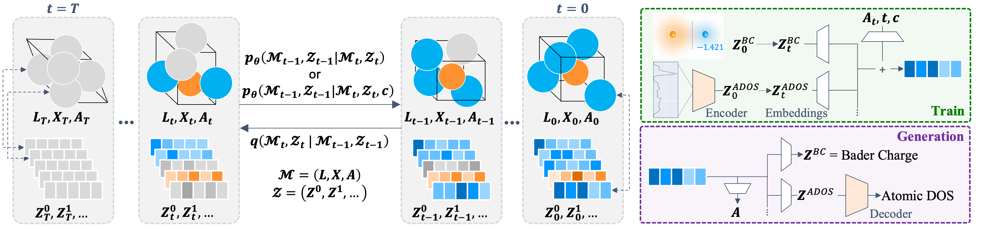
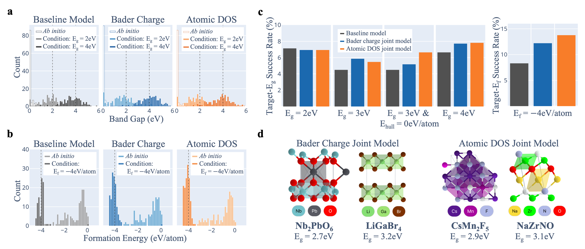
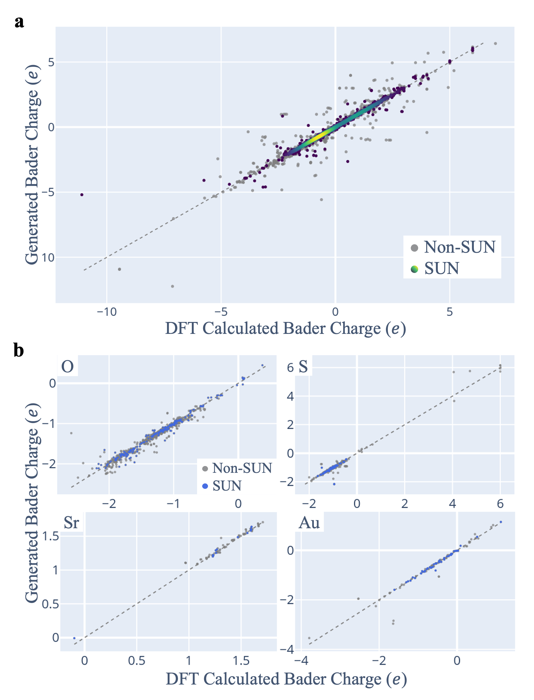
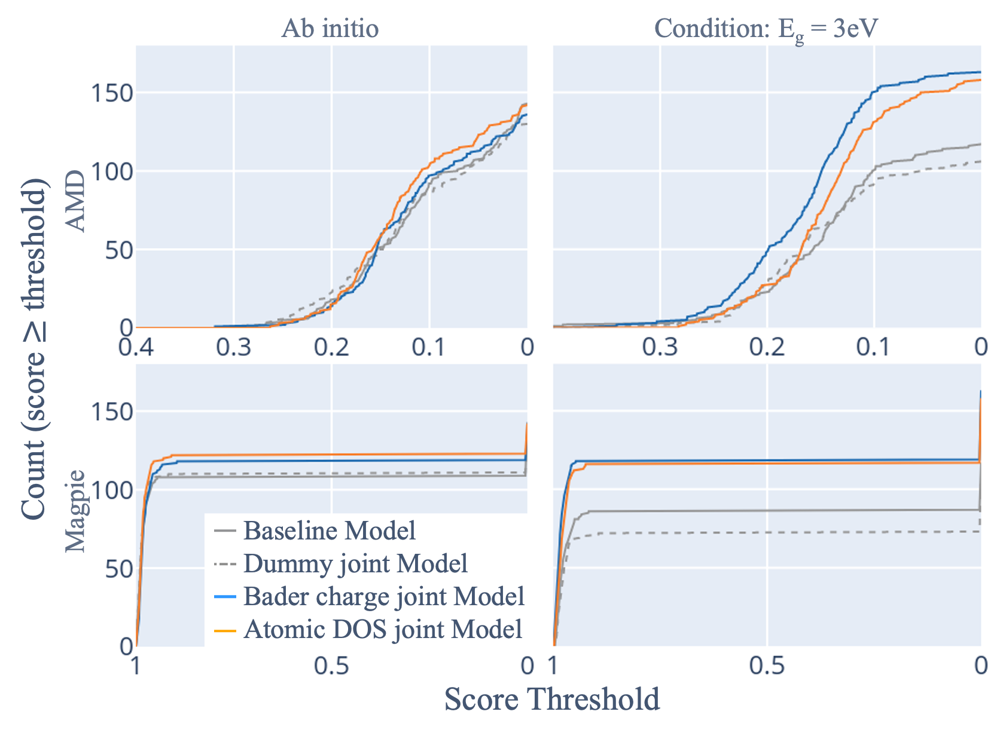
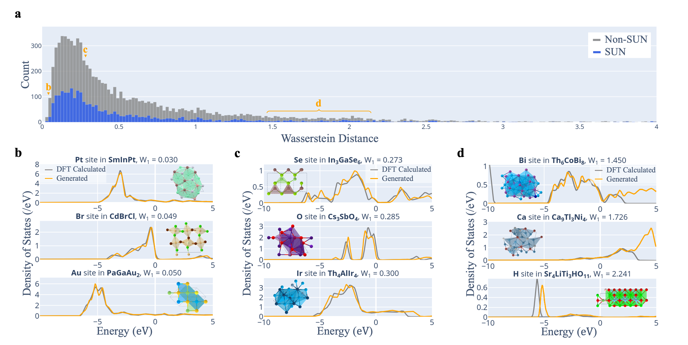
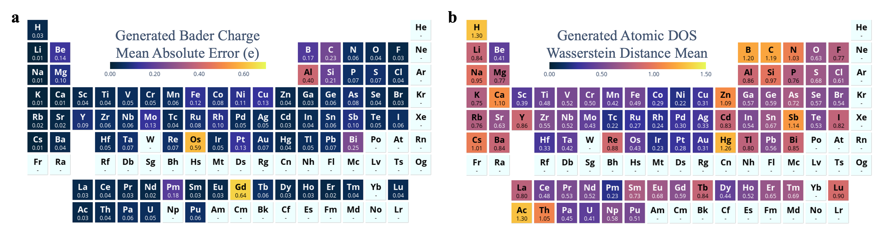

# 拡散モデルによる結晶の逆設計：局所電子記述子との同時生成が切り拓く物性指向の材料探索

- 執筆日：2026-05-06
- トピック：拡散モデルを用いた無機結晶の逆設計において、結晶構造変数とBader電荷・局所状態密度などの電子的記述子を共有スコアネットワークで同時にノイズ除去することで、物性条件付き生成の成功率と構造品質の両立を実現した研究、およびその周辺の生成モデル研究の潮流
- タグ：Computation and Theory, Inverse Design, Machine Learning, First-Principles Calculations
- 注目論文：Ibuki Okuda, Izumi Takahara, Teruyasu Mizoguchi, "Inverse Materials Design via Joint Generation of Crystal Structures and Local Electronic Descriptors," arXiv:2605.01286 (2026)
- 参照論文数：6

---

## 1. なぜ今この話題なのか

材料科学の最大の課題の一つは、「目的の物性を持つ材料を設計する」という逆問題である。エネルギー貯蔵、触媒、カーボンニュートラルに関わる技術革新を支える新材料の探索は、従来であれば研究者の直感と膨大な試行錯誤に頼っていた。しかし近年、機械学習と生成モデルの急速な発展が、この逆問題に根本的に異なるアプローチをもたらしている。

生成モデルによる逆材料設計とは、「目標とする物性（バンドギャップ、生成エンタルピー、磁気密度など）を条件として与えることで、その条件を満たす結晶構造を直接生成する」という発想である。2022年頃から結晶構造生成への拡散モデルの応用が本格化し、2024年にMicrosoftがMatterGenを発表したことで分野の注目が一気に高まった。MatterGenは安定で多様な無機材料を生成できるだけでなく、物性条件付けファインチューニングを通じてバンドギャップ・機械物性・磁気特性まで制御できることを示した初の本格的な汎用生成モデルであった。

しかしここで深刻な問題が明らかになった。物性指定付き生成（property-conditioned generation）は、構造のみの ab initio 生成と比べて著しく安定構造の割合が低下するのである。2025年末に公開されたPhononBenchの大規模ベンチマークは108,843本のAI生成結晶のフォノン計算を実施し、MatterGenでさえ動力学的安定率が41%止まりであり、バンドギャップ条件付き生成では23.5%にまで低下することを示した。この「物性を狙えば構造が崩れる」というトレードオフは、条件付き生成の根本的な限界として広く認識されるようになった。

2026年5月に東京大学のOkudaらが発表した論文（arXiv:2605.01286）は、このトレードオフを克服するための新しい発想を提案している。鍵となるアイデアは、結晶構造変数だけを拡散させるのではなく、**局所電子記述子（Bader電荷と原子局所状態密度）を構造変数と同時にノイズ除去する**ことで、拡散過程全体を電子的に整合した配置空間に誘導するというものである。物性と構造の橋渡しとなる電子的変数を生成過程に組み込むことで、条件付き生成の成功率と構造品質の両立が可能になるかもしれないという、材料インフォマティクスの一つの核心的問いに正面から挑んだ研究である。

---

## 2. この分野の未解決問題

**問1：物性条件付き生成はなぜ構造品質を損なうのか。**

物性を指定した拡散モデルはなぜ不安定構造を多く生成するのか、その機構は完全には解明されていない。条件付きスコア関数 $\nabla_{\mathbf{x}} \log p_t(\mathbf{x}|y)$ を推定するとき、条件 $y$ が分布の稀な領域（例えば特定のバンドギャップ値）を指す場合、学習データが希薄なため勾配の推定誤差が大きくなる。また拡散過程の途中で条件ガイダンスが構造的安定性を実現する配置空間からサンプルを外れた方向へ引き寄せる可能性がある。エネルギーランドスケープ上の局所安定点と目標物性の等値面が一致しない場合に特にこの問題が顕在化すると考えられるが、定量的な理解は乏しい。

**問2：物性と結晶構造の生成を、どの中間変数で接続すればよいか。**

バンドギャップや生成エンタルピーなどのスカラー物性は、原子配置・元素種・格子定数から複雑な電子構造計算を経て決まる。この複雑な関係を生成モデルが直接学習するのは困難である。電子構造を表す中間変数（Bader電荷、局所DOS、ワニエ関数、ボンドオーダーなど）を構造とともに生成に組み込むことで、物性条件と構造の間の橋渡しを改善できるか、またどの変数が最も有効かという選択問題は未解決である。

**問3：生成した結晶の「真の安定性」をどう評価すべきか。**

現在、生成結晶の評価指標として主流のVSUN（Validity, Stability, Uniqueness, Novelty）は安定性をDFT計算の凸包との距離で判断する熱力学的安定性に基づく。しかしPhononBenchが示したように、熱力学的安定と判断された構造でも動力学的に不安定（虚フォノンを持つ）なものが多数存在する。さらに実験的合成可能性はさらに別の問題である。「生成した構造が本当に有用な材料か」を正確に評価する多段階の基準と、それを生成過程にどうフィードバックするかは依然として大きな課題である。

---

## 3. 注目論文の核心

### 何を解決しようとしたか

本論文の出発点は、MatterGenに代表される拡散ベース結晶生成モデルが抱える以下の矛盾である。構造変数（原子座標、格子行列、元素種）だけを使った ab initio 生成では合理的な安定性・新規性が達成できる一方、目標物性（バンドギャップや生成エンタルピー）を条件付けすると構造品質が著しく劣化する。この劣化の本質的原因は、「目標物性値」というスカラー情報だけでは、拡散過程の各ステップで原子位置・元素種の微細な更新を正しく誘導するには情報量が不十分だという点にある。

著者らの提案する解決策は、**「局所電子記述子（local electronic descriptors）」を生成変数に追加し、構造変数と同時にスコアネットワークでノイズ除去する**というものである。使用される記述子は、各原子サイトに帰属されるBader電荷（各原子が電荷分布からどれだけの電荷を受け持つかを示すスカラー）と、各原子サイトの局所状態密度（atomic DOS, サイト投影DOS）である。これらはDFT計算から直接求められ、元素種および局所配位環境に強く依存する物理量である。

### モデルの構造

提案モデルは MatterGen の拡散フレームワーク（格子行列 $\mathbf{L}$、分率座標 $\mathbf{x}$、元素種 $\mathbf{a}$ を独立なノイズ過程で拡散させ、共有スコアネットワークで同時デノイズする）をベースに、電子的記述子の拡散を追加した構造を持つ。

具体的には、結晶構造を表す変数組

$$(\mathbf{L}, \mathbf{x}, \mathbf{a})$$

に加えて、各原子サイト $i$ のBader電荷 $q_i \in \mathbb{R}$ および局所DOS $D_i(\varepsilon) \in \mathbb{R}^{N_E}$（$N_E$点でサンプルされたエネルギーメッシュ上の関数）を追加変数として拡散過程に組み込む。すなわち拡散される変数の全体は

$$(\mathbf{L}, \mathbf{x}, \mathbf{a}, \{q_i\}, \{D_i\})$$

となり、これを単一のスコアネットワーク（E(3)同変グラフニューラルネットワーク）で同時に推定・デノイズする。デノイズ過程のステップ $t$ における条件付きスコア関数の推定は、物性値 $y$（バンドギャップまたは生成エンタルピー）を条件として

$$\mathbf{s}_\theta(\mathbf{L}_t, \mathbf{x}_t, \mathbf{a}_t, \{q_i^t\}, \{D_i^t\}, y, t) \approx \nabla \log p_t(\mathbf{L}_t, \mathbf{x}_t, \mathbf{a}_t, \{q_i^t\}, \{D_i^t\} \mid y)$$

を推定する形式となる。

*図1：提案モデルの概念図。結晶構造変数と局所電子記述子（Bader電荷・局所DOS）を共有スコアネットワークで同時にデノイズする。Bader電荷は各原子のスカラー値として、局所DOSはエネルギーメッシュ上のベクトルとして表現される（arXiv:2605.01286 CC BY 4.0 より）。*

### 主要結果

評価指標はVSUN（Validity: 結合距離が物理的に合理的、Stability: 凸包からのエネルギー差 0.5 eV/atom 以内、Uniqueness: 既存構造との非重複、Novelty: 新規性）の達成率である。

バンドギャップ条件付き（0.0〜2.5 eV の各区間）および生成エンタルピー条件付き（−4〜1 eV/atom）の双方で、構造のみのベースラインと比較した結果、**電子記述子ありのモデルは多くのターゲット条件でVSUN率が改善した**。また構造多様性（novelty率）も向上した。

重要なアブレーション実験として、実際の電子記述子の代わりにランダムな「ダミー変数」を追加した場合を対照群として評価した。ダミー変数ではVSUN率の改善が得られないことが示され、**改善がサイトごとの補助変数を追加したこと自体ではなく、電子記述子の情報内容に由来する**ことが確認された。

*図2：構造のみのベースラインとBader電荷ありモデル・局所DOSありモデルのVSUN率比較。バンドギャップ条件（上）および生成エンタルピー条件（下）の各ターゲット区間での成功率を示す（arXiv:2605.01286 CC BY 4.0 より）。*

生成されたBader電荷のDFT参照との一致度は、安定構造についてMAE約 $5.5 \times 10^{-2}$ 電子と良好な精度を示した。局所DOSはフェルミ準位付近の大まかなスペクトル形状を捉えているが、元素種によって精度のばらつきがある。

*図3：生成されたBader電荷とDFT計算値の比較。安定構造の部分ではMAE約0.055電子の一致が得られた（arXiv:2605.01286 CC BY 4.0 より）。*

### 何が新しく、何が仮説段階か

それ以前に分かっていたこと：MatterGenをはじめとする拡散ベースモデルは ab initio 生成において高いVSUN率を達成できるが、物性条件付き生成では大きく低下する（Zeni et al. 2024）。

今回前進したこと：電子記述子という中間表現を生成変数に加えることで、条件付き生成の成功率と構造品質を両立できることが初めて示された。ダミー変数対照実験により、この改善が電子情報に固有のものであることも確認された。

まだ仮説段階なこと：なぜ電子記述子の同時生成が構造軌道を電子的に妥当な配置に向けて誘導できるのかの理論的な機構は未解明である。また本研究は動力学的安定性（フォノン計算）を評価しておらず、PhononBenchが示すような動的不安定性が改善されているかは不明である。

---

## 4. 背景と研究史

### 結晶生成モデルの系譜

拡散モデルによる結晶構造生成は、Xieら（2022）が提案したCDVAE（Crystal Diffusion Variational Autoencoder, 2110.06197）によって本格的に始まった。CDVAEは変分オートエンコーダーのデコーダー部分に拡散過程を組み込み、原子座標を低エネルギー方向へ更新するという戦略で周期構造の安定生成を実現した。CDVAEは周期境界条件を明示的に扱い、並進・回転・置換・周期に対する不変性を考慮した初期のフレームワークとして重要な位置を占める。

しかしCDVAEは潜在変数からのデコーダー型であり、生成の柔軟性に限界があった。その後、完全な拡散過程（格子行列・座標・元素種を全て独立にノイズ付加しデノイズする）を用いたモデルが登場し、DiffCSP（Jiao et al., NeurIPS 2023, 2309.04475）はその一つである。DiffCSPは周期E(3)同変デノイズモデルを用いて格子と原子座標を同時に生成し、分率座標表現の採用によって原子位置の拡散・生成プロセスを大幅に改善した。DiffCSPは結晶構造予測（与えられた元素組成から安定構造を探す）タスクで特にDFTベース手法と比べて桁違いに速い計算を実現した。

MatterGen（Zeni et al., 2024, 2312.03687）はこれら先行研究の集大成として、元素種・座標・格子行列を統一した拡散フレームワークで扱い、物性条件付きファインチューニングのためのアダプターモジュールを導入した。MatterGenはMP-20データセット（Materials Project収録の安定材料2万点）でトレーニングされ、ab initio 生成においてVSUN率3.66%（SUN率）を達成し、物性条件付きでは磁気密度・バンドギャップ・機械特性・化学組成などを制御できることを示した。これは生成モデルによる実用的逆設計の可能性を初めて大規模に実証したとして高く評価された。

最近ではCrystalDiT（Yi et al., 2025, 2508.16614）がより単純なアーキテクチャの拡散トランスフォーマーで格子と原子特性を統一表現として扱い、MP-20上でSUN率8.78%とMatterGenを大幅に超える成果を示している。CrystalDiTは複雑なマルチストリーム設計ではなく、格子と原子特性を単一システムとして扱う帰納的バイアスが効果的だと主張しており、材料生成における「単純さが複雑さを上回る」事例として注目される。

*図4：生成された構造の新規性スコアの分布。電子記述子ありモデルは構造多様性が向上しており、より広い材料空間を探索していることが分かる（arXiv:2605.01286 CC BY 4.0 より）。*

### 物性条件付き生成の限界の発見

PhononBench（Han et al., Dec 2025, 2512.21227）は、AI生成結晶の動力学的安定性という重要な側面を大規模に評価した。MatterSim原子間ポテンシャルを活用して108,843本の生成構造のフォノン計算を実施し、6種類の代表的生成モデルの動力学的安定率を比較した結果、平均25.83%、最良のMatterGenでも41.0%であることが示された。さらに重要な発見として、バンドギャップ0.5 eV 条件付き生成ではMatterGenの動力学的安定率が23.5%にまで低下するという事実が明らかにされた。

この結果は、Okudaら（2605.01286）の動機付けと直結する。現在の評価指標であるVSUN（熱力学的安定性で判断）で改善を示すことは一歩前進だが、動力学的安定性や合成可能性まで含めた「実用的な材料生成」という視点からは、まだ大きな課題が残っていることが見えてくる。

---

## 5. どの解釈が最も妥当か

### 電子記述子の効果の解釈

注目論文の最も重要な主張は、「局所電子記述子を同時生成することで、物性条件付き生成の成功率と構造品質が改善する」というものである。この解釈を支える根拠は三つある。

第一に、ダミー変数対照実験の結果である。電子的内容を持たない乱数変数をサイトごとに追加してもVSUN率は改善しなかった。これは補助変数の追加自体ではなく、Bader電荷や局所DOSという電子的情報が効いていることを強く示唆する。

第二に、生成されたBader電荷がDFT参照と良好に一致する（安定構造で MAE約0.055電子）という事実である。これは拡散過程でモデルが電子的に整合した構造を学習していることの証拠であり、電子記述子が単なるノイズではなく意味ある情報を持つことを示す。

第三に、局所DOSがフェルミ準位付近の大まかなスペクトル形状を捉えていることである。DOSのフェルミ準位付近のプロファイルは、原子の結合状態、sp/dキャラクター、電荷移動の有無などに直結しており、これを共同生成することで構造が電子的に安定した配置に近づくと解釈できる。

*図5：生成された原子局所DOS（左）とDFT参照（右）の比較。フェルミ準位付近のスペクトル形状の大まかな特徴を捉えているが、細部の精度は元素種によって異なる（arXiv:2605.01286 CC BY 4.0 より）。*

### 他の可能な解釈と限界

一方、以下のような代替解釈や未解決点が存在する。

**「電子記述子が正則化として機能している」という解釈**：物性条件付き生成では、条件スコアが構造変数を物性の等値面に向けて引っ張る。この際、電子記述子が追加された次元として存在することで、一種の多様体正則化が起き、構造が安定領域から外れにくくなるという解釈も可能である。この場合、電子記述子の物理的内容（特定の元素への依存性など）よりも、高次元空間でのサンプリングという数値的効果が本質かもしれない。ダミー変数実験はこれに反するが、ダミー変数の設計（乱数の種類や次元数）によっては完全に排除できない。

**局所DOSの精度のばらつきについて**：生成された局所DOSは大まかなスペクトル形状は捉えているが、元素種によって精度が異なり、細部の特徴はしばしば再現できていない。特に遷移金属のd軌道に由来する細かなピーク構造などは不正確である可能性が高い。局所DOSの不完全な再現が結晶生成にどう影響しているかは未解明であり、より精度の高い電子記述子を使えばさらに改善できる可能性がある。

**動力学的安定性への影響が未検証**：本研究はVSUN（熱力学的安定性ベース）を主評価指標としているが、PhononBenchが示すように、熱力学的安定と動力学的安定は必ずしも一致しない。電子記述子の同時生成が動力学的安定率を改善するかどうかは検証されていない重要な問いである。

**比較的強く支持される結論**：電子記述子の同時生成は、物性条件付き生成における構造品質とVSUN率の両立に有効であり、特定の物性条件下での成功率改善に効果的である。

**まだ弱い結論**：この手法が動力学的安定性を改善するかどうか、また他の電子記述子（ボンドオーダー、ワニエ関数、磁気モーメントなど）との比較における優位性は未確認である。

*図6：各条件下での生成精度の詳細な評価。バンドギャップ値・生成エンタルピー値のターゲット区間ごとのVSUN率を示す（arXiv:2605.01286 CC BY 4.0 より）。*

---

## 6. 何が一般化できるか

### 他の電子記述子への展開

本研究はBader電荷と局所DOSという特定の電子記述子を選択したが、同様の枠組みは他の電子記述子に拡張可能である。例えば磁気的性質を制御したい場合は原子磁気モーメント、圧電性・誘電性を制御したい場合は有効ボルン電荷、特定の化学結合を制御したい場合はボンドオーダーや局所電子分布など、多様な選択肢が考えられる。どの記述子が特定の物性制御に最も有効かという系統的な研究は今後の課題である。

### 他の材料クラスへの適用

本研究はMP-20データセット（酸化物・硫化物・ハロゲン化物などの幅広い無機結晶）を対象としているが、同様の手法は他の材料クラスにも適用可能と考えられる。金属間化合物・高エントロピー合金では生成エンタルピーと局所化学秩序の関係が重要であり、電子記述子による誘導が特に有効かもしれない。二次元材料・薄膜では表面/界面の電子的特性が機能発現に直結するため、表面サイト専用の電子記述子の導入が有効かもしれない。分子性固体・MOFへの適用も原理的には可能であるが、局所記述子の定義や訓練データの整備が課題となる。

### 設計原理としての一般化

本研究から引き出せる一般的な設計原理は、「物性と構造の間にある多段階の因果連鎖の中間変数を生成過程に組み込む」というものである。物性 → 電子構造 → 化学結合 → 局所配位 → 結晶構造という連鎖において、電子構造レベルの情報を共同生成することが有効であったという発見は、将来的には電子構造計算からさらに一段だけ上流の情報（ボンドグラフ、局所対称性、化学式の制約など）を組み込む多段階の階層的生成フレームワークへの道筋を示している。

生成AIが無機結晶の探索を加速するためには、原子スケールの物理的整合性を保ちながら化学的多様性を探索する能力が必要であり、本論文はその一つの鍵を示した。

---

## 7. 基礎から理解する

### 結晶構造の表現

無機結晶は周期的な原子の繰り返し構造である。基本単位（単位格子）は3本の格子ベクトル $\mathbf{a}_1, \mathbf{a}_2, \mathbf{a}_3$ で張られる平行六面体で定義され、この3本のベクトルを列に並べた行列を格子行列 $\mathbf{L} \in \mathbb{R}^{3 \times 3}$ と呼ぶ。格子定数（辺の長さ $a, b, c$ と角度 $\alpha, \beta, \gamma$）は $\mathbf{L}$ から導かれる。

格子内の原子位置は分率座標 $\tilde{\mathbf{x}}_i \in [0,1)^3$ で表される。これは「格子ベクトルを基底としたときの座標」であり、実空間座標への変換は $\mathbf{x}_i = \mathbf{L}^T \tilde{\mathbf{x}}_i$ で与えられる。分率座標表現は周期境界条件を自然に満たし、拡散モデルでのトーラス上の拡散過程とも相性が良い（Jiao et al., DiffCSP）。

$N$ 個の原子を持つ結晶は、格子行列 $\mathbf{L}$、分率座標集合 $\{\tilde{\mathbf{x}}_i\}_{i=1}^N$、元素種集合 $\{Z_i\}_{i=1}^N$ の三組 $(\mathbf{L}, \tilde{\mathbf{x}}, \mathbf{Z})$ で完全に記述される。ただし同じ結晶でも格子の選び方（単位格子の選択）、原子の並べ方（置換対称性）、座標の平行移動が異なっても同じ構造を表すという多様な同値類が存在する。これが生成モデルの設計を複雑にする核心である。

### 拡散モデルの基礎

拡散モデル（Denoising Diffusion Probabilistic Models, DDPM）は、データ $\mathbf{x}_0$ に徐々にガウスノイズを加えて純粋なノイズ $\mathbf{x}_T \sim \mathcal{N}(0, \mathbf{I})$ にするフォワードプロセス $q(\mathbf{x}_t | \mathbf{x}_{t-1})$ と、そのノイズを逆向きに除去するリバースプロセス $p_\theta(\mathbf{x}_{t-1} | \mathbf{x}_t)$ をニューラルネットワークで学習するフレームワークである。

フォワードプロセスはマルコフ連鎖として定義される：

$$q(\mathbf{x}_t | \mathbf{x}_{t-1}) = \mathcal{N}(\mathbf{x}_t; \sqrt{1 - \beta_t}\, \mathbf{x}_{t-1},\ \beta_t \mathbf{I})$$

ここで $\{\beta_t\}$ はノイズスケジュールと呼ばれる単調増加列である。$t$ ステップ後の分布は解析的に求められ、

$$q(\mathbf{x}_t | \mathbf{x}_0) = \mathcal{N}(\mathbf{x}_t;\ \sqrt{\bar{\alpha}_t}\, \mathbf{x}_0,\ (1 - \bar{\alpha}_t) \mathbf{I})$$

と書ける。ただし $\bar{\alpha}_t = \prod_{s=1}^t (1 - \beta_s)$ である。

リバースプロセスを学習するためには、スコア関数（ノイズ入り分布の対数確率勾配）$\nabla_{\mathbf{x}_t} \log q(\mathbf{x}_t)$ を近似するニューラルネットワーク $\mathbf{s}_\theta(\mathbf{x}_t, t)$ を訓練する。損失関数は

$$\mathcal{L} = \mathbb{E}_{t, \mathbf{x}_0, \boldsymbol{\epsilon}} \left[ \| \boldsymbol{\epsilon} - \boldsymbol{\epsilon}_\theta(\mathbf{x}_t, t) \|^2 \right]$$

の形をとる（ノイズ予測として定式化した場合）。生成はランダムノイズ $\mathbf{x}_T$ からスタートし、学習したスコアに沿ってステップを踏みながら $\mathbf{x}_0$ に戻るリバースプロセスを実行することで行われる。

### 条件付き生成（Classifier-free Guidance）

物性 $y$（例：バンドギャップが 1.5 eV）を条件として生成するためには、条件付き分布 $p(\mathbf{x}_0 | y)$ からサンプルする必要がある。Classifier-free guidance（Ho & Salimans, 2022）は、条件付きスコア $\nabla \log p(\mathbf{x} | y)$ と無条件スコア $\nabla \log p(\mathbf{x})$ の線形結合を用いる：

$$\tilde{\mathbf{s}}_\theta(\mathbf{x}_t, y, t) = (1 + w) \mathbf{s}_\theta(\mathbf{x}_t, y, t) - w\, \mathbf{s}_\theta(\mathbf{x}_t, \emptyset, t)$$

ここで $w > 0$ はガイダンス強度である。$w$ を大きくすると条件への適合が強まる一方、サンプルの多様性が低下する。結晶生成において、大きな $w$ を使うと条件に合致した物性値を持つ構造が生成される一方、構造の安定性が犠牲になる可能性がある。

### E(3)同変グラフニューラルネットワーク

結晶構造を扱うニューラルネットワークには、3次元回転（SO(3)またはO(3)）・並進・置換に対する対称性（同変性）が必要である。同変ネットワーク（例：SEGNN, MACE, DimeNet++）は、球面調和関数やクリフォード代数を基底として使い、メッセージパッシング各ステップで原子間ベクトルを適切に変換することで、入力の回転・反転に対して出力が正しく変換する性質を保証する。

結晶構造の場合、さらに格子の並進対称性（ブラベー格子の選択に対する不変性）を扱う必要があり、DiffCSPはこれを周期的フォールディングと分率座標のトーラス上の拡散で解決した。MatterGenおよび本論文（2605.01286）もこの同変グラフ表現をスコアネットワークに使用している。

### Bader電荷分析

Bader電荷はリチャード・ベーダーが提案した原子電荷の定義方法の一つである。電子密度 $\rho(\mathbf{r})$ の勾配に沿った流れ（勾配流）を追うと、勾配ゼロ点（臨界点）で囲まれた領域に収束する。この領域をBader体積と呼び、各Bader体積内の電子密度の積分値から「形式電荷」（名目電荷）を引いた値がBader電荷である。

$$q_i^{\text{Bader}} = Z_i - \int_{\Omega_i} \rho(\mathbf{r})\, d\mathbf{r}$$

ここで $Z_i$ は元素 $i$ の原子番号（全電子数）、$\Omega_i$ はBader体積である。Bader電荷は元素の電気陰性度差・配位環境・化学結合に敏感なサイト特異的スカラー量であり、イオン性の程度を直接反映する。

### 局所状態密度（局所DOS）

状態密度（DOS）$g(\varepsilon)$ は、エネルギー $\varepsilon$ における電子状態の数の密度であり、バンド構造 $\varepsilon_n(\mathbf{k})$ から

$$g(\varepsilon) = \frac{1}{V} \sum_{n, \mathbf{k}} \delta(\varepsilon - \varepsilon_n(\mathbf{k}))$$

として定義される。局所状態密度（LDOS, local DOS）はこれを原子サイト $i$ および軌道量子数 $l$ に射影したもので、

$$g_i^l(\varepsilon) = \sum_{n, \mathbf{k}} |\langle \phi_i^l | \psi_{n, \mathbf{k}} \rangle|^2 \delta(\varepsilon - \varepsilon_n(\mathbf{k}))$$

と書ける。ここで $\phi_i^l$ はサイト $i$ の角運動量 $l$ の局所基底関数（例えば原子軌道）、$\psi_{n,\mathbf{k}}$ はブロッホ波動関数である。局所DOSはサイトの化学的環境、配位構造、結合の共有性/イオン性を反映しており、バンドギャップの有無・フェルミ準位の電子状態・d軌道の分裂状態などを直読できる重要な物理量である。

### VSUN評価指標

本論文で使用するVSUN指標は、生成した結晶の「使える材料候補か」を多面的に評価するものである。

- **V (Validity)**：原子間距離が過度に短すぎない（最小結合距離の物理的合理性）
- **S (Stability)**：凸包からのエネルギー差 $\Delta H_f \leq 0.5$ eV/atom（Materials Projectによる安定性基準）。実際にはMLIPを使った擬DFT評価が行われる
- **U (Uniqueness)**：生成構造群の中で重複しないこと（StructureMatcher を用いたFingerprint類似度で判定）
- **N (Novelty)**：訓練データや既知Materials ProjectデータベースにないFingerprintを持つこと

VSUN率は「1回の生成バッチ中でV・S・U・Nを全て満たす構造の割合」であり、条件付き生成では更に「目標物性値のターゲット区間を満たすか」が加わる。PhononBenchが示したように、VSUNの安定性S基準は熱力学的安定性であり、動力学的安定性（フォノンの虚部がないこと）は別個の評価である。

---

## 8. 専門用語の解説

**拡散モデル (Diffusion Model)**：データにガウスノイズを段階的に加えて壊し、その逆過程（デノイズ）をニューラルネットワークで学習するという生成モデルの一種。画像生成で大成功を収め、近年は分子・結晶・タンパク質生成に広く応用されている。本トピックでは結晶構造（格子行列・原子座標・元素種）を生成変数とし、スコアネットワークを使ってランダムノイズから安定構造へと逆向きに変換する。

**スコア関数 (Score Function)**：確率分布 $p(\mathbf{x})$ の対数確率の勾配 $\nabla_\mathbf{x} \log p(\mathbf{x})$ のこと。データの密度が高い方向を示し、ランジュバン拡散によるサンプリングの駆動力となる。拡散モデルの訓練は本質的にスコア関数の近似学習（スコアマッチング）であり、推論時はスコアに沿ったステップを繰り返すことで高確率領域のサンプルを得る。

**逆材料設計 (Inverse Materials Design)**：従来の「構造を入力して物性を計算する」順問題（フォワード予測）に対して、「目標物性を入力して構造を生成する」逆問題のこと。従来は勾配法・進化アルゴリズム・ベイズ最適化などでアプローチされたが、生成モデルの台頭により直接的な条件付きサンプリングが実用的になってきた。本トピックの核心であり、MatterGen以来の重要な課題。

**VSUN率 (VSUN Rate)**：Validity（有効性）・Stability（安定性）・Uniqueness（独自性）・Novelty（新規性）の全てを満たす生成構造の割合。この指標は結晶生成モデルの品質評価の標準的なベンチマークとなっており、高いVSUN率がより実用的な材料候補の生成を意味する。ただし安定性は熱力学的基準のみであり、動力学的安定性（フォノン）は含まれないことに注意。

**Bader電荷 (Bader Charge)**：電子密度の勾配ゼロ点（臨界面）で仕切ったBader体積内の電子密度積分から求められる原子帰属電荷。元素の電気陰性度・配位環境・化学結合の性質を反映したサイト特異的スカラー量であり、イオン性の程度を定量化する。DFT計算から得られるため現実的な訓練データとして使用しやすく、本論文でも第一の電子記述子として採用されている。

**局所状態密度 / 原子DOS (Local/Atomic Density of States)**：各原子サイトに射影した電子状態密度。バンドギャップの有無、フェルミ準位の電子状態の性質（金属性・絶縁性・半導体性）、d軌道の分裂状態（結晶場効果）などが直接読み取れる。バンドギャップ値との相関が高く、本論文では物性と構造を橋渡しする中間変数として活用されている。

**E(3)同変ネットワーク (E(3)-equivariant Network)**：3次元ユークリッド群E(3)（回転・反転・並進）の変換に対して出力が適切に変換する性質（同変性）を持つニューラルネットワーク。結晶構造の生成・予測に使うネットワークは物理的対称性を組み込む必要があるため、SEGNNやMACEなどの同変アーキテクチャが採用される。同変性を欠くモデルは同じ物理的構造を異なる配向で与えると異なる出力を返すため、材料生成に不適切である。

**凸包 (Convex Hull)**：ある組成系において、熱力学的に安定な相の生成エンタルピーを結ぶ曲面のこと。一般化した意味では多成分系の安定相図に対応する。生成した構造が凸包上（または近傍）にあれば熱力学的に安定であるとみなされる。Materials Projectのような第一原理データベースはこの凸包を大規模に計算しており、生成モデルの評価基準（S基準）として広く使用されている。

**フォノン動力学的安定性 (Phonon Dynamical Stability)**：結晶が微小変位に対して安定かどうかを示す指標。調和近似の枠組みでフォノン分散を計算し、全ての波数で振動数の虚部（虚フォノン）がなければ動力学的に安定である。熱力学的安定（凸包近傍）でも動力学的に不安定な構造は存在する。PhononBenchはMatterGenのバンドギャップ条件付き生成で動力学的安定率が23.5%であることを示し、現行の生成モデルの重大な課題を浮き彫りにした。

**Classifier-free Guidance**：条件付き生成を行う拡散モデルの手法の一つ。訓練時に条件 $y$ を確率的にドロップアウトし（無条件として扱い）、推論時に条件付きスコアと無条件スコアの差にガイダンス重み $w$ を掛けて足し合わせることで条件への適合を強める。$w$ が大きいほど条件に忠実になるが多様性は低下する。本分野での条件付き結晶生成に広く使われており、物性条件の強さと構造品質のトレードオフを支配する重要なパラメータである。

**ダミー変数対照実験 (Dummy Variable Control)**：本論文で実施されたアブレーション実験で、実際の電子記述子（Bader電荷・局所DOS）の代わりにランダムな数値（ダミー変数）をサイトごとに追加した場合の生成性能を評価する。ダミー変数では改善が見られないことにより、VSUN率向上が電子的情報の内容に固有のものであることが実証される。機械学習実験における因果推論の観点から重要な対照条件であり、本論文の主張を強固にする核心的実験である。

---

## 9. 将来展望

**今かなり確からしくなったこと**：拡散ベース結晶生成モデルにおいて、物性と構造の間を仲介する電子的記述子を生成変数として組み込むことは、条件付き生成の成功率と構造品質の両立に有効であることが示された。Bader電荷という比較的シンプルなスカラー記述子でも効果が確認されたことは、この手法の汎用性を示唆する。また、CrystalDiTが示すように単純なアーキテクチャでも高性能が達成できることから、材料生成モデルのスケールアップとアーキテクチャの単純化は並行して進むと考えられる。

**まだ未確定なこと**：なぜ電子記述子の同時生成が構造軌道を安定な配置に誘導できるのかの理論的機構は未解明である。また、本手法が動力学的安定性を改善するかどうかはPhononBenchのような外部ベンチマークで検証する必要があり、熱力学的VSUN率の改善が実験的合成可能性の向上につながるかも自明ではない。さらに、どの電子記述子の組み合わせが最も有効か、また記述子の精度（本モデルが生成した電子記述子はあくまで近似的）が生成性能にどう影響するかは体系的な検討が残されている。

**次に重要になる実験・理論・計算**：第一には、フォノン計算による動力学的安定性の評価（PhononBenchの手法を本モデルの生成結晶に適用すること）が急務である。熱力学的安定と動力学的安定の両方を満たす構造の割合を比較することで、本手法の実用的価値が定量化される。第二には、磁気モーメントや有効ボルン電荷など他の電子記述子との比較研究と、複数記述子の組み合わせの効果の検討が重要である。第三には、生成した構造を実際に合成・評価する実験的検証であり、AIが提案した新規構造の実験的確認がMatterGen以来の最重要な未解決問題として残っている。Materials Project凸包を越えて、ユニバーサルMLIPによる大規模な動力学的安定性スクリーニングと組み合わせた高スループット材料探索パイプラインの構築が、この分野の次の到達点になると見られる。

---

## 参考論文一覧

1. Ibuki Okuda, Izumi Takahara, Teruyasu Mizoguchi, "Inverse Materials Design via Joint Generation of Crystal Structures and Local Electronic Descriptors," arXiv:2605.01286 (2026). [[arXiv]](https://arxiv.org/abs/2605.01286) — 本記事の注目論文。拡散フレームワークで結晶構造変数とBader電荷・局所DOSを同時生成することで、物性条件付き生成のVSUN率と構造品質を改善した。

2. Claudio Zeni et al., "MatterGen: a generative model for inorganic materials design," arXiv:2312.03687 (2024). [[arXiv]](https://arxiv.org/abs/2312.03687) — 拡散ベース結晶生成の画期的論文。格子・座標・元素種を統一拡散で扱い、物性条件付きファインチューニングで多種の物性制御を実現した。本注目論文が発展させたベースフレームワーク。

3. Tian Xie et al., "Crystal Diffusion Variational Autoencoder for Periodic Material Generation," arXiv:2110.06197 (2022, ICLR 2022). [[arXiv]](https://arxiv.org/abs/2110.06197) — 結晶への拡散モデル適用の先駆け。変分オートエンコーダーのデコーダーに拡散過程を組み込み、周期構造の安定生成を実現したCDVAEを提案した。

4. Rui Jiao et al., "Crystal Structure Prediction by Joint Equivariant Diffusion," arXiv:2309.04475 (2023, NeurIPS 2023). [[arXiv]](https://arxiv.org/abs/2309.04475) — 周期E(3)同変デノイズモデルを用いて格子と原子座標を同時生成するDiffCSPを提案。分率座標表現の導入により結晶生成の精度と速度を大幅改善した。

5. Xiao-Qi Han et al., "PhononBench: A Large-Scale Phonon-Based Benchmark for Dynamical Stability in Crystal Generation," arXiv:2512.21227 (2025). [[arXiv]](https://arxiv.org/abs/2512.21227) — 生成結晶の動力学的安定性を大規模評価した初のベンチマーク。MatterGenでも動力学的安定率は41%止まりで、バンドギャップ条件付き生成では23.5%まで低下することを示した。

6. Xiaohan Yi et al., "CrystalDiT: A Diffusion Transformer for Crystal Generation," arXiv:2508.16614 (2025). [[arXiv]](https://arxiv.org/abs/2508.16614) — 格子と原子特性を統一トランスフォーマーで扱うシンプルな拡散モデルを提案。MP-20でSUN率8.78%とMatterGenを大幅に超え、単純アーキテクチャの有効性を示した。
