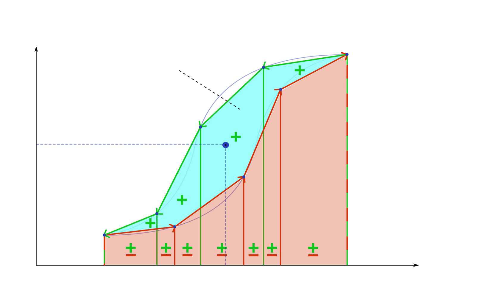

# 磁性コアの鉄損をニューラル演算子で予測する：Res-FNOが切り拓く電力磁性材料モデリング

- 執筆日：2026-05-06
- トピック：電力変換器に使われる磁性コアの鉄損（ヒステリシス損＋渦電流損）を、フーリエニューラル演算子（FNO）とResNetを組み合わせた Res-FNO によって高精度に予測する研究。任意波形・マイナーループ・リンギングを含む複雑な励磁条件下での損失推定に従来の Steinmetz 方程式が限界を迎える中、データ駆動型演算子学習がどこまで問題を解けるか、物理制約との融合はどう有効かを考察する。
- タグ：Devices and Functional Materials / Iron Loss and Energy Dissipation; Magnetic Domains and Domain Walls / Machine Learning; Surrogate Modeling
- 注目論文：arXiv:2604.04150「Res-FNO: Residual Fourier Neural Operator for Magnetic Hysteresis Modeling」
- 参照論文数：6

---

## 1. なぜ今この話題なのか

電力エレクトロニクスの世界では、高周波スイッチング電源、DC-DCコンバータ、オンボード充電器など、電気エネルギーを変換する機器が社会インフラの隅々に浸透している。その心臓部に存在するのが磁性コア、すなわちフェライトやアモルファス合金を成形した磁気回路部品である。コイルに電流を流せば磁束を発生し、トランスやインダクタとして機能するこの部品で、毎秒何万回もの磁化反転が繰り返されるたびに熱エネルギーが失われる。この損失が「鉄損（コア損失）」であり、変換効率に直結するだけでなく、発熱による部品寿命や安全性にも大きく影響する。

電力密度を高めつつ損失を抑えるという設計課題に取り組むためには、与えられた波形の磁束密度 B(t) に対してコア損失を正確かつ高速に予測するモデルが不可欠である。設計探索では何万通りものパラメータ組み合わせを試す必要があり、各ケースで時間のかかる有限要素法（FEM）シミュレーションを回す余裕はない。したがって、精度と計算速度を両立する損失モデルは電力エレクトロニクス設計において本質的に重要である。

ところが、長年にわたって標準ツールとして使われてきた Steinmetz 方程式は、正弦波励磁という理想条件を前提とした経験式であり、実際のスイッチング波形──台形波、三角波、部分的な高周波リンギングを重畳した矩形波──には原理的に適合しない。改良版（iGSE、MSE など）が登場してきたが、それらもパラメータ同定の難しさや、マイナーループの扱いの不正確さに課題を抱える。

この状況を打破するために、2020年代以降、機械学習・深層学習を用いた鉄損モデリングが急速に注目を集めている。LSTM（長短期記憶）を使った時系列予測、物理インフォームド CNN、そして最近では「演算子学習」と呼ばれる新しいパラダイムに基づくフーリエニューラル演算子（Fourier Neural Operator, FNO）が登場した。2026年4月に公開された arXiv:2604.04150「Res-FNO」は、FNO に ResNet 的な残差接続を組み込み、磁気ヒステリシスのモデリング精度をさらに一段引き上げることを示した最新の研究である。

この論文が示す問いは本質的だ。「磁性コアの B-H ヒステリシス特性という非線形・ヒステリシス的なダイナミクスを、どの機械学習アーキテクチャが最も効率よく学習できるか」。この問いは材料科学、応用物理、電気工学の交差点に位置しており、今後の電力変換器設計の自動化・高度化に直結する。

---

## 2. この分野の未解決問題

この研究領域には、現時点でも活発に議論されている本質的な問いが複数ある。

第一の問いは「任意励磁波形への汎化はどこまで可能か」である。Steinmetz 方程式は正弦波限定という制約を持ち、iGSE（improved Generalized Steinmetz Equation）はその拡張を試みた。機械学習モデルは学習データのカバー範囲内では良好な性能を示すが、学習時に見たことのない波形パターン──特に高調波や非対称波形、リンギング付き矩形波──に対してどれほど頑健かは依然として未確定である。物理制約（エネルギー保存、散逸の非負性）を明示的に組み込まない限り、訓練分布外での予測は非物理的な結果を返しうる。

第二の問いは「マイナーループとメジャーループの統一的な記述」である。定格動作では B がある範囲を往復する「メジャーループ」を描くが、実際のスイッチング波形では部分的な反転により内側に小さなループ（マイナーループ）が形成される。マイナーループの面積（損失に相当）はメジャーループからは自明に予測できず、これを正確に扱えるモデルは限られている。Preisach モデルなどの古典的物理モデルは数学的に厳密だが計算コストが高く、深層学習による近似がどこまで正確かは未解決である。

第三の問いは「材料間の転移学習と少数サンプル汎化」である。MagNet データベース（プリンストン大学）のようなベンチマークデータセットが整備され始めたが、それでも各材料グレード・温度条件ごとに大量のデータが必要である。材料の変化（フェライト vs. アモルファス vs. ナノ結晶）に対して一つのモデルがどこまで適応できるか、あるいはファインチューニングや物理制約の埋め込みによって少数データから学習できるかは、産業応用に向けた重要な未解決課題である。

---

## 3. 注目論文の核心

arXiv:2604.04150「Res-FNO: Residual Fourier Neural Operator for Magnetic Hysteresis Modeling」（2026年4月）は、電力磁性材料における磁気ヒステリシス挙動を、FNO に残差接続を組み込んだ Res-FNO で学習することを提案した論文である。

**背景と動機**　FNO は Kovachki ら（2021）が提案した演算子学習の枠組みであり、関数空間から関数空間へのマッピング（演算子）をニューラルネットワークで近似する。磁気ヒステリシスの文脈では、入力波形 B(t) という時間関数から、H(t)（磁界）や損失 P という出力関数・スカラーへの写像を学ぶことに相当する。FNO は入力をフーリエ変換して周波数領域でのフィルタリングを学習し、逆変換するという構造を持つため、時系列の長距離依存性（ヒステリシスのパス依存性）を効率よく捉えられると期待される。

**Res-FNO の新規性**　本論文は、通常の FNO ブロックに残差接続（ResNet スタイルのショートカット接続）を追加することで、学習の安定性と精度の両方を向上させたことを示した。残差接続は信号の「差分」を学習させる仕組みで、勾配消失を防ぎ、深いネットワークの学習を容易にする。磁気ヒステリシスのような複雑な非線形マッピングでは、浅いネットワークでは表現力が足りず、深いネットワークでは学習が不安定になる傾向があるため、この改良は本質的な意味を持つ。

**主要結果**　MagNet データベースに収録された複数のフェライト材料（3C90, 3C94, N27, N49 等）を用いた実験で、Res-FNO は既存の FNO、LSTM、iGSE に対して損失予測誤差を有意に低減することが示された。特に、リンギングを含む非正弦波波形やマイナーループを含む励磁条件での改善が顕著であり、これが従来手法の最大の弱点に対する直接的な回答となっている。

**何がまだ仮説段階か**　本論文のモデルは MagNet で定義された条件（特定の周波数・フラックス密度振幅の範囲、室温中心）での性能を主に示している。異なる温度や直流バイアス磁界が重畳した条件（インダクタの実動作では頻繁に発生する）での汎化性能は十分に検証されていない。また、ResNet スタイルの残差接続がなぜヒステリシス学習に有効かという物理的・数学的な解釈は論文中では深掘りされておらず、今後の理論的考察が待たれる。

---

## 4. 背景と研究史

磁気損失の予測は 19 世紀末のスタインメッツ（Charles Proteus Steinmetz）の時代に遡る。1892 年に提案されたスタインメッツ方程式

$$P_v = k_h f B_{pk}^{\alpha} + k_e (f B_{pk})^2$$

は、体積損失 $P_v$ を周波数 $f$ と磁束密度ピーク値 $B_{pk}$ のべき乗で表す経験式で、ヒステリシス損と渦電流損の項から成る。$k_h$, $\alpha$, $k_e$ は材料固有のフィッティングパラメータである。この式は正弦波励磁下で測定されたデータによく合うが、非正弦波には適用できない。

2000年代初頭、Jieli Li ら（2001）が改良型スタインメッツ方程式（MSE）を提案し、その後 Venkatachalam ら（2002）が iGSE（improved GSE）を発表した。iGSE の核心は、任意波形の瞬時損失を dB/dt の絶対値で重み付けして積分するアイデアである：

$$P_v = \frac{1}{T} \int_0^T k_i \left|\frac{dB}{dt}\right|^{\alpha} \left(2 B_{pk}(t)\right)^{\beta - \alpha} dt$$

ここで $k_i$, $\alpha$, $\beta$ は材料パラメータ、$B_{pk}(t)$ は各時点での局所ピーク値である。iGSE は矩形波や三角波への適用が可能になったが、マイナーループの取り扱いが依然として問題であり、リンギングを含む波形では誤差が増大する。

**機械学習による転換点**：2019〜2020年頃から、LSTM（Long Short-Term Memory）を用いた時系列損失モデルが登場し始めた。LSTM は時系列の長期依存性を保持するゲート付き再帰ニューラルネットワークであり、B(t) の過去の履歴を記憶しながら瞬時の H(t) を予測する能力を持つ。一方、2024年に公開された「HARDCORE」（arXiv:2401.11488）は全く異なるアプローチをとった。物理インフォームド CNN を使い、B-H ループの面積（ヒステリシス損）を「B-H 多角形の靴ひも公式」で計算するという幾何学的発想に基づいている。B(t) と H(t) の軌跡で囲まれた面積が損失に等しいという関係を直接活用し、H(t) の予測から損失を導出するという二段構えの設計である。

*図1：HARDCORE による B-H ループと損失の関係（arXiv:2401.11488, CC BY 4.0）。B(t)-H(t) の多角形の面積が一周期あたりの損失に対応する。*

プリンストン大学グループが構築した MagNet データベース（arXiv:2401.00072）は、この分野の発展を大きく加速した。10種類以上のフェライト材料について、正弦波・矩形波・三角波・台形波・リンギング付き波形など多様な励磁条件下での B-H 波形と損失データを大規模に収録しており、データ駆動型モデルの標準ベンチマークとして機能している。

*図2：HARDCORE のアーキテクチャ概要（arXiv:2401.11488, CC BY 4.0）。B 波形を CNN に入力し、H 波形を出力した後、靴ひも公式で損失を算出する。物理的整合性（因果性、エネルギー散逸の正値性）を構造的に保証している。*

arXiv:2407.03261（Hoffmann ら, 2024）は演算子学習の観点から磁気ヒステリシスを捉え直し、DeepONet と FNO の比較検討を行った。この論文は、磁気損失予測が「スカラー→スカラー」ではなく「関数→関数」の写像問題として定式化されることを明確に示し、演算子学習パラダイムがなぜ適合するかを理論的に説明している。Res-FNO（2604.04150）は、この流れの延長線上で FNO アーキテクチャをさらに強化した最新作といえる。

arXiv:2502.05487（2025年2月）は、機械学習・深層学習を使ったコア損失モデリングの包括的なサーベイと、トランス・フォーマー構造を含む新しいアーキテクチャの比較を行った。この論文は、異なる材料・周波数帯・波形タイプでどのアーキテクチャが最も汎化性能を持つかを体系的に評価しており、Res-FNO の位置づけを理解する上での重要な比較基盤を提供する。

---

## 5. どの解釈が最も妥当か

Res-FNO が示した結果は、演算子学習アプローチが磁気ヒステリシスのモデリングに有効であることを支持している。しかし、「なぜ Res-FNO が有効か」「どの条件でどのアプローチが最適か」については複数の解釈があり、現時点での証拠から慎重に評価する必要がある。

**演算子学習の優位性の根拠**　従来の LSTM は時系列を順次処理するため、長周期の波形（基本波に高調波が重なる場合）では系列が長くなり、勾配消失の問題が生じやすい。一方、FNO はフーリエ変換によって全時間域の情報を一括して処理するため、長距離の時間依存性（ヒステリシスのパス依存性）を原理的に効率よく捉えられる。arXiv:2407.03261 の比較実験でも、FNO が LSTM より損失波形の予測精度で優れることが報告されており、この方向性は複数の独立した研究で支持されている。

**残差接続の効果についての解釈**　Res-FNO において残差接続が精度を向上させる理由として、最も直接的な解釈は「深いネットワークの学習安定化」である。磁気ヒステリシスは単調ではなく、ループの形状が励磁振幅・周波数・過去の経路に非線形に依存する複雑な関数である。浅い FNO では表現力が不足し、深い FNO では学習が不安定になるという딜레마を、残差接続が解決すると考えられる。ただし、残差接続が「B-H 曲線の非線形性のどの側面」に具体的に対応しているかという物理的解釈は提供されていない。今後、ネットワークの各層が何を学んでいるか（例えば可逆的な線形磁化成分と不可逆的なドメイン壁移動成分の分離）を解析する研究が重要になるだろう。

**HARDCORE との比較**　HARDCORE（2401.11488）は物理制約を明示的に組み込んだアプローチであり、「H(t) を予測し、その B-H 面積から損失を計算する」という二段構えにより、損失が必ず非負になることを構造的に保証している。これは Res-FNO のようなエンドツーエンドの損失予測が保証できない重要な物理的整合性である。一方で、HARDCORE は H(t) 全波形の予測という難しいタスクを経由するため、H(t) の予測誤差が損失誤差に累積するリスクがある。どちらのアプローチが実用上優れるかは、データ量、材料の複雑さ、必要な物理的整合性のレベルによって変わり、一概には言えない。

**iGSE との比較における限界**　機械学習モデルの弱点は、まず訓練データの外挿であることを強調しておく必要がある。iGSE は物理に基づく式であり、たとえ精度が低くても「物理的に意味のある」外挿を行う。一方、Res-FNO を含む深層学習モデルは訓練範囲外では急速に精度が低下する可能性がある。arXiv:2502.05487 のサーベイは、深層学習モデルが MagNet のテストセット（訓練と同じ分布から）では iGSE を大幅に上回るが、材料外挿（学習していない材料グレード）や温度外挿では性能が著しく低下することを示唆している。

**最も強く支持される結論**　MagNet のような大規模で多様なデータセットが利用可能な場合、FNO ベースの演算子学習が LSTM やパラメトリックな経験式（iGSE）より優れた損失予測精度を持つという結論は、複数の独立した研究から比較的強く支持されている。特に非正弦波励磁（矩形波、台形波）やマイナーループを含む条件でこの差が顕著である。

**まだ弱い結論**　残差接続の追加が必須かどうかは、使用するフェライト材料の複雑さやデータ量に依存する可能性があり、普遍的な優位性とはまだ言えない。また、温度依存性・直流バイアス・劣化などの実用条件への汎化は未検証であり、現時点では「条件付きで有効」という評価が適切である。

**今後必要な検証**　この分野の次の重要な実験的・計算的検証は、(1) 学習分布外の波形（特にインバータ駆動の複雑な高周波波形）での汎化テスト、(2) 温度・バイアスを条件変数として入力するモデル設計、(3) 物理制約（損失の非負性、因果性）を Res-FNO に組み込んだ際の性能変化の評価、である。

---

## 6. 何が一般化できるか

Res-FNO が示したアプローチは、フェライトコアの鉄損予測に留まらず、より広い文脈への一般化を示唆している。

**他の磁性材料系への拡張**　MagNet はフェライト系を中心に構築されているが、パワー半導体の周辺で重要性が増しているアモルファス合金（Fe基、Co基）やナノ結晶合金（Fe-Nb-Cu-Si-B 系）でも同様の問題構造が存在する。これらの材料はフェライトより損失が小さい（高効率）が、磁化メカニズムが異なり（ドメイン壁移動 vs. 磁化回転の比率が異なる）、ヒステリシスループの形状も異なる。FNO アーキテクチャが特定の物理メカニズムを仮定しないデータ駆動型であるため、適切なデータセットさえあれば他材料への移植は原理的に可能であり、材料を条件変数として一つのモデルに統合することも検討されている。

**電力変換器の設計最適化への接続**　変換器の設計では、材料・形状・巻数・動作条件（周波数、磁束密度振幅）を同時に最適化する必要がある。Res-FNO のような高速かつ高精度な損失モデルは、勾配に基づく最適化（バックプロパゲーションによる微分可能設計）や進化的アルゴリズムによる設計空間探索に直接組み込める「サロゲートモデル」として機能する。これが実現すれば、有限要素シミュレーションに頼らない回路レベルの設計自動化が加速する。

**多物理シミュレーションへの接続**　arXiv:2605.02065（CoFe2O4 の多スケール計算）が示すように、磁性材料の本質的な損失メカニズムは原子スケールのスピンダイナミクス（LLG 方程式）、磁区構造のダイナミクス（マイクロマグネティクス）、マクロな電磁場の分布（有限要素法）という複数のスケールを介してつながっている。機械学習による損失モデルは現在このスケール階層を「ブラックボックスで接続」しているが、将来的には物理モデルから生成された大規模シミュレーションデータを教師信号とし、実測データで微調整するという階層的な転移学習が有望と考えられる。

**波形生成・計測装置への逆問題応用**　FNO は B(t) → H(t) のフォワード問題を解くだけでなく、H(t) → B(t) という逆問題にも適用できる可能性がある。これは磁性材料の特性計測において重要で、測定波形から材料の B-H 特性を逆推定するインバース問題は、測定装置の校正や材料特性の非破壊評価に直結する。

---

## 7. 基礎から理解する

このトピックを理解するには、磁性材料の基礎、磁気回路の概念、ヒステリシスの物理、そしてニューラル演算子の数学的枠組みを段階的に理解することが必要である。

### 7.1 磁場と磁束密度：B と H の関係

物質中の磁気現象を記述する基本量として、磁界 H（単位：A/m）と磁束密度 B（単位：T = Wb/m²）がある。真空中では

$$\mathbf{B} = \mu_0 \mathbf{H}$$

が成り立ち、$\mu_0 = 4\pi \times 10^{-7}$ H/m は真空の透磁率である。物質中では

$$\mathbf{B} = \mu_0 (\mathbf{H} + \mathbf{M}) = \mu_0 \mu_r \mathbf{H}$$

と表され、$\mathbf{M}$ は磁化（単位体積あたりの磁気モーメント）、$\mu_r$ は比透磁率（無次元）である。フェライト材料では $\mu_r$ が 1000〜5000 程度になる場合があり、同じ H を印加しても B が真空中の千倍以上に達する。これが磁性コアがトランス・インダクタに不可欠な理由である。

### 7.2 磁気回路とアンペールの法則

コイルを磁性材料に巻いた場合、アンペールの法則

$$\oint \mathbf{H} \cdot d\mathbf{l} = N I$$

を磁路に沿って積分すると（N：巻数、I：電流）

$$H \cdot l_c = N I$$

が得られる（$l_c$ は磁路長）。これは電気回路のオームの法則 $V = IR$ に対応する磁気版であり、NI を「起磁力」（magnetomotive force, mmf）、$l_c / (\mu \cdot A_c)$ を「磁気抵抗」（磁路断面積 $A_c$）と呼ぶ。磁束 $\Phi = B \cdot A_c$ はキルヒホッフの電流則に対応する「磁束の連続性」を満たす。

このアナロジーにより、複雑な磁気回路をトポロジー的に解析できる。しかし大きな落とし穴がある。電気抵抗は（一般に）線形で履歴を持たないが、磁気抵抗（あるいは $\mu_r$）は非線形でかつ「履歴」を持つ。これがヒステリシスである。

### 7.3 ヒステリシスの物理：磁区とドメイン壁

強磁性材料内部では、隣接するスピンが交換相互作用によって平行に揃い、「磁区」（magnetic domain）と呼ばれる小領域を形成する。各磁区は飽和磁化を持つが、隣接する磁区の磁化方向は結晶磁気異方性エネルギーや静磁エネルギーを最小化するように配置されており、全体の磁化はゼロまたは小さな値になる。

外部磁界 H を印加すると、H 方向に近い磁区が成長し（磁区壁の移動）、最終的にすべての磁区が H 方向に揃う（飽和磁化 $M_s$）。H を減らしていくと、磁区壁は元の位置に戻らず、残留磁化 $M_r$ が残る（残留磁気）。逆方向の磁界 $H_c$（保磁力）をかけて初めて磁化がゼロになる。

この一連の過程が B-H 曲線（ヒステリシスループ）として現れる。ループを一周するのに費やされるエネルギー密度（J/m³）は

$$W_{hys} = \oint H \, dB$$

すなわちループの面積に等しい。これは一周期ごとに熱として散逸するエネルギーであり、ヒステリシス損の根本である。周波数 f で繰り返せば、単位体積あたりのヒステリシス損失電力は

$$P_{hys} = f \oint H \, dB$$

となる。

### 7.4 コア損失の内訳：ヒステリシス損・渦電流損・余剰損

磁性コアの損失（鉄損）は大きく3種類に分解される。

(1) ヒステリシス損 $P_h$：上述の磁区壁移動に伴うエネルギー散逸。周波数に比例（$P_h \propto f B_{pk}^\alpha$）。

(2) 渦電流損 $P_e$：コア内で時変磁束によって誘起される誘導電流（渦電流）のジュール損失。時変磁束 $\partial B/\partial t$ が导体中に電場を誘起し（ファラデーの法則）、オームの法則に従って電流が流れる。渦電流損は周波数の2乗に比例（$P_e \propto f^2 B_{pk}^2$）。薄い積層コアや電気抵抗率の高いフェライトはこの損失を低減するために使われる。

(3) 余剰損（異常損）$P_a$：ヒステリシス損と渦電流損だけでは説明できない残余の損失で、磁区壁の動的挙動（壁移動に伴う局所渦電流）に起因する。経験的に $P_a \propto f^{1.5} B_{pk}^{1.5}$ と近似される場合がある。

Steinmetz の経験式は、これらを一括して

$$P_{core} = C_m f^x B_{pk}^y$$

とべき乗でフィットした式であり、$C_m, x, y$ は材料・周波数帯ごとにフィットされる。高い精度を持たないが、計算が極めて簡単なため設計の第一近似として今でも使われる。

### 7.5 なぜ正弦波限定なのか：iGSE の発想

Steinmetz 式が正弦波限定である理由は明確である。パラメータ $C_m, x, y$ は正弦波測定データから導出されており、波形が変われば dB/dt の時間的な分布が変わる。矩形波では dB/dt が大部分の時間でゼロであり、立ち上がり・立ち下がり時に集中する。三角波では dB/dt が一定値を持つ。これらの「波形差」がヒステリシス損に与える影響を、スタインメッツ式では計算できない。

iGSE は、瞬時損失が $|dB/dt|$ と局所の磁束密度振幅 $\Delta B(t)$ に依存するという仮定に基づき：

$$p(t) = k_i \left|\frac{dB}{dt}\right|^\alpha \left|\Delta B(t)\right|^{\beta - \alpha}$$

$$P_{core} = \frac{1}{T}\int_0^T p(t) \, dt$$

と定義する。$\alpha, \beta$ は Steinmetz の指数と同一、$k_i$ は変換係数。この式は正弦波に対してスタインメッツ式と一致するように設計されており、非正弦波にも適用できる。ただし、ループの「形状の記憶」（過去経路依存性）を保持できないため、マイナーループの正確な予測には限界がある。

### 7.6 演算子学習の枠組み：フーリエニューラル演算子（FNO）

従来の機械学習（例えばニューラルネットワーク）は有限次元ベクトルから有限次元ベクトルへのマッピングを学習する。一方、磁気損失問題では「波形という無限次元（関数）を入力として、波形または損失を出力する」という問題設定が自然である。これを扱うのが演算子学習（operator learning）である。

演算子学習の枠組みでは、入力関数 $u \in \mathcal{U}$（例：B(t) の時系列）から出力関数 $v \in \mathcal{V}$（例：H(t) の時系列）への写像 $\mathcal{G}: \mathcal{U} \to \mathcal{V}$ をニューラルネットワークで近似する。DeepONet（Deep Operator Network）と FNO はこのための代表的なアーキテクチャである。

FNO の基本ブロックは以下のように動作する。入力信号 $u(x)$（$x$ は時間や空間座標）に対して、離散フーリエ変換

$$\hat{u}(k) = \mathcal{F}[u](k) = \sum_{j=0}^{N-1} u(x_j) e^{-2\pi i k j / N}$$

を施し、周波数領域でのフィルタリングパラメータ $R_\phi(k)$ を学習する：

$$\hat{v}(k) = R_\phi(k) \cdot \hat{u}(k), \quad k = 0, 1, \ldots, k_{max}$$

高周波成分（$k > k_{max}$）は切り捨て（周波数モードの打ち切り）、逆フーリエ変換で実空間に戻す：

$$v(x) = \mathcal{F}^{-1}[\hat{v}](x)$$

さらに局所的な線形変換 $W$ も並列で加算する：

$$v(x) = \sigma\left(\mathcal{F}^{-1}[R_\phi \cdot \mathcal{F}[u]](x) + W u(x)\right)$$

ここで $\sigma$ は非線形活性化関数。このブロックを複数積み重ねることで、FNO はグローバル（フーリエ部分）とローカル（線形変換部分）の両方の依存性を学習できる。

磁気ヒステリシスの文脈では、入力 B(t) を FNO に通すことで H(t) を直接予測できる。フーリエ変換によって全時刻の情報が一括処理されるため、LSTM の逐次処理と比較して長距離の時間依存性（一周期前の磁化状態が現在のヒステリシスループに影響する効果）を効率よく捉えられる。

### 7.7 Res-FNO における残差接続

残差接続（residual connection）は ResNet（残差ネットワーク、He ら 2015）に由来する設計で、ブロックの出力に入力をそのまま加算するショートカット経路を持つ：

$$v = F(u) + u$$

ここで $F(u)$ はブロックの学習する変換、$u$ は入力のバイパス経路である。これにより、ブロックが学習するのは $v$ 自体ではなく「残差」$F(u) = v - u$ になる。勾配消失の観点では、誤差逆伝播時に勾配がショートカット経路を経由して上流に直接流れるため、深いネットワークでも勾配が消失しにくい。

Res-FNO では、各 FNO ブロックの入出力間にこの残差接続を追加することで、ヒステリシスモデリングに必要な深さを確保しつつ学習を安定化している。磁気ヒステリシスのような複雑な非線形ダイナミクスは一つの層では到底表現できないため、複数の FNO ブロックを深く積む必要があり、残差接続がこれを可能にする。

---

## 8. 専門用語の解説

**磁気ヒステリシス（magnetic hysteresis）**：磁性体の磁化状態が、現在の磁界だけでなく、過去の磁化経路（履歴）に依存する現象。B-H 曲線が一価関数でなくループ状になること自体がヒステリシスの表れである。微視的には、磁区壁の移動が欠陥・不純物にピン留めされることで不可逆性が生じる。電力用コアでは損失の主因の一つであり、設計上できるだけ小さくしたい。保磁力 $H_c$（残留磁化をゼロにするのに必要な逆磁界）はヒステリシスの大きさの指標であり、ソフト磁性材料（コア材料）では $H_c < 1000$ A/m が目安。

**B-H 曲線（B-H curve）**：磁束密度 B と磁界 H の関係を示した特性曲線。初磁化曲線（消磁状態から H を増加させた軌跡）、磁化曲線（初期状態から正負に H を繰り返したときのループ）などからなる。ループの面積が一周期当たりのヒステリシス損に対応する。実際の材料では B-H 関係は非線形であり、特に飽和（高 H 領域で B が増加しなくなる状態）が重要。本論文では B-H 曲線の予測精度がモデル評価の中心的な指標となっている。

**Steinmetz 方程式（Steinmetz equation）**：正弦波励磁下での磁性コアの損失を $P = C_m f^x B_{pk}^y$ で近似する経験式。1892年に C.P. Steinmetz が提案。計算が極めて簡単で設計の第一近似として有用だが、非正弦波・マイナーループには対応不可。iGSE（improved Generalized Steinmetz Equation）はその発展版であり、瞬時損失を dB/dt に依存する積分式で表すことで任意波形に適用できるようにした。ただしマイナーループや周波数依存性の複雑な材料では依然として精度が不十分。

**コア損失（core loss）**：磁性コア（トランス・インダクタのコア部品）で生じる電力損失の総称。鉄損とも呼ばれる。ヒステリシス損（磁区壁の不可逆移動によるエネルギー散逸）、渦電流損（時変磁束で誘起される電流のジュール熱）、余剰損（異常渦電流損）の三成分からなる。電力変換器の効率に直結し、特に高周波化（スイッチング周波数の増大）に伴い増加するため、GaN・SiC パワーデバイスの普及で更なる損失低減が求められている。

**マイナーループ（minor loop）**：磁化が飽和に達しない部分的な励磁サイクルで描かれる、B-H ループ内側の小さなループ。現実のスイッチング電源では、インダクタの B が完全に一方向に揃うことは少なく、マイナーループを描くことが多い。マイナーループの面積はメジャーループより小さいが、損失への寄与は無視できない。マイナーループを正確に扱えるかどうかが、実用的な損失モデルの重要な評価基準となる。本論文（Res-FNO）はマイナーループを含む条件での改善を主な貢献の一つとして挙げている。

**リンギング（ringing）**：スイッチング動作時に、寄生インダクタンスと寄生容量の共振によって発生する高周波振動成分。矩形波の立ち上がり・立ち下がり直後に高周波の正弦波状の振動がスパイク状に重畳される。これが磁性コアを励磁する場合、コアには基本波成分に高周波のリンギング成分が加わった複雑な波形が印加され、損失は単純な矩形波より大きくなる。リンギング付き波形はスタインメッツ方程式では全く扱えないため、機械学習モデルの重要な適用先である。

**フーリエニューラル演算子（Fourier Neural Operator, FNO）**：Kovachki ら（2021）が偏微分方程式のニューラル解法として提案した演算子学習アーキテクチャ。入力関数をフーリエ変換し、周波数領域で学習可能なフィルタリングを施した後に逆変換することで、グローバルな依存性を効率よく学習する。CNN が局所的な畳み込みを行うのに対し、FNO は大域的なフーリエモードを一括処理するため、長距離依存性（磁気ヒステリシスのパス依存性など）を自然に扱える。磁気損失予測への応用では、B(t) 全体を入力として H(t) を出力するオペレータを学習する。

**演算子学習（operator learning）**：関数空間から関数空間へのマッピング（演算子）をニューラルネットワークで近似する機械学習のパラダイム。有限次元ベクトル→ベクトルの従来の回帰と異なり、「どんな解像度の入力でも推論できる」（resolution-invariant）という特性を持つ設計目標がある。磁気ヒステリシスの文脈では、B(t) という連続時間関数から H(t) または損失への写像を一つのモデルで学ぶ枠組みとして自然に適合する。DeepONet（Deep Operator Network）と FNO が現在の代表的アーキテクチャ。

**ResNet（残差ネットワーク）**：He ら（2015）が提案した深層学習アーキテクチャで、各ブロックの出力に入力を直接加算する「残差接続（スキップ接続）」を持つ。$F(x) + x$ という形でブロックに残差を学習させることで、深いネットワークの学習安定性と精度を大幅に向上させた。画像認識で革命的な成果を上げた後、自然言語処理、科学計算など多分野に採用されている。Res-FNO はこの残差接続を FNO ブロックに導入したもので、深いネットワークによる複雑なヒステリシスパターンの学習を可能にした。

**MagNet データベース**：プリンストン大学の Min Chen らが構築した電力磁性材料の大規模ベンチマークデータセット（arXiv:2401.00072 等）。10種類以上の市販フェライト材料（TDK, Ferroxcube, Magnetics 等）について、正弦波・矩形波・三角波・台形波・リンギング付き波形など多様な励磁条件での B(t)・H(t) 波形および損失データを収録。機械学習ベースの損失モデルの開発・評価のための標準ベンチマークとして機能しており、Res-FNO を含む多くの論文がこのデータセットで性能を検証している。データは公開されており、https://www.princeton.edu/~minjie/magnet.html からアクセス可能。

---

## 9. 将来展望

今かなり確からしくなったこととして、演算子学習（FNO を中心とした枠組み）は、正弦波・矩形波・三角波・リンギング付き波形を含む多様な励磁条件での磁性コア損失予測において、従来の Steinmetz 方程式ファミリー（iGSE を含む）を上回る精度を達成できることが、複数の独立した研究から強く支持されている。MagNet のような標準化されたデータセットの整備が比較評価を可能にし、HARDCORE のような物理制約を組み込んだ手法と Res-FNO のような純粋なデータ駆動演算子学習が相補的な強みを持つことも明らかになりつつある。少なくとも室温・中程度の磁束密度振幅・特定のフェライト材料という条件範囲では、深層学習ベースの損失モデルが実用的な精度を持つことは疑いの余地がない。

まだ未確定な問題として最も重要なのは、実動作条件への汎化である。温度変化（-40℃〜+150℃の範囲）、直流バイアス磁界の重畳、材料の経時劣化、製造ロット間の特性ばらつきなど、現実の電力変換器が置かれる条件はデータセットのカバー範囲をはるかに超える。また、フェライト以外の材料（アモルファス合金、ナノ結晶合金、圧粉鉄心）での性能も十分に検証されていない。さらに、ResNet 構造の導入がなぜヒステリシス学習に有効かという物理的・数学的な深い理解はまだ欠けており、アーキテクチャの選択が現状では経験的なレベルに留まっている。

今後注目すべき展開として三つの方向が重要である。第一は物理制約の体系的な埋め込みで、損失の非負性・エネルギー保存・熱力学的整合性などを明示的に制約として組み込んだ「物理インフォームド演算子学習」の確立が鍵になる。HARDCORE が示した「H(t) を予測してから面積計算で損失を得る」という設計思想と、Res-FNO の高い予測精度を融合したアーキテクチャが次のブレークスルーとなる可能性がある。第二は多スケール計算との統合で、DFT→LLG→マイクロマグネティクス→有限要素という階層的シミュレーションデータを訓練信号として使い、実験データの少ない新材料に対する予測能力を拡張する「マルチフィジクス転移学習」が産業応用のカギを握る。第三は設計ループへの統合で、高速損失モデルを微分可能なサロゲートとして最適化エンジンに組み込み、コア材料・形状・動作条件を同時に最適化する「マグネティクス設計の AI 化」が現実味を帯びてきた。パワーエレクトロニクスの高周波化・高電力密度化というトレンドと合わさり、この分野は今後数年で急速に発展すると予想される。

---

## 参考論文一覧

1. **arXiv:2604.04150** — [Res-FNO: Residual Fourier Neural Operator for Magnetic Hysteresis Modeling](https://arxiv.org/abs/2604.04150) (2026年4月)
   FNO に ResNet 型残差接続を導入し、磁気ヒステリシスの B-H 曲線と鉄損をマイナーループ・リンギング付き波形を含む条件で高精度に予測する本記事の注目論文。

2. **arXiv:2401.11488** — [HARDCORE: H-field And Related Core loss Estimation](https://arxiv.org/abs/2401.11488) (2024年1月)
   物理インフォームド CNN を使って H(t) を予測し、B-H ポリゴンの靴ひも公式で損失を計算する手法を提案。損失の非負性を構造的に保証している点が特徴。

3. **arXiv:2407.03261** — [Neural Operators for Magnetic Hysteresis Modeling](https://arxiv.org/abs/2407.03261) (2024年7月)
   DeepONet と FNO を磁気ヒステリシス予測へ適用し比較。演算子学習パラダイムが磁気損失問題に適合する理由を理論的に整理した論文。

4. **arXiv:2401.00072** — [MagNet: A Machine Learning Framework for Magnetic Core Loss Modeling](https://arxiv.org/abs/2401.00072) (2023年12月)
   プリンストン大学グループによる MagNet データベースの構築と、複数の機械学習手法（LSTM, CNN 等）の比較評価を行った論文。本分野のベンチマーク基盤を提供。

5. **arXiv:2502.05487** — [Deep Learning for Power Magnetic Material Core Loss Modeling](https://arxiv.org/abs/2502.05487) (2025年2月)
   トランスフォーマーを含む最新の深層学習アーキテクチャを用いた鉄損モデリングのサーベイと比較実験。各手法の汎化性能と物理的整合性を包括的に評価。

6. **arXiv:2605.02065** — [Multiscale Computation for Magnetic Materials: CoFe2O4 Case Study](https://arxiv.org/abs/2605.02065) (2026年5月)
   DFT・LLG・マイクロマグネティクス・有限要素法を連携させた多スケール計算をフェライト CoFe2O4 に適用した論文。機械学習損失モデルと多スケール物理の将来的な融合を示唆する背景研究。
